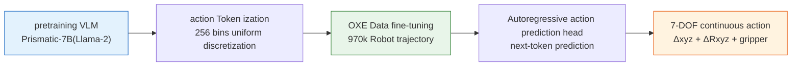
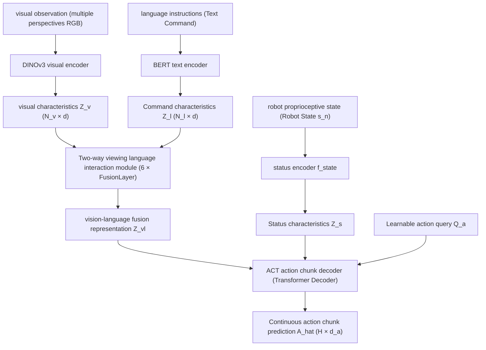

> This article provides the companion paper readings for . The survey covers the methodological framework, datasets, and evaluation; this collection presents each paper's research question, method, evidence, and limitations.

Paper numbering follows the survey's original Chapter 5 to preserve existing citations and cross-references. The official RoboDojo leaderboard compares models under a common evaluation protocol. Separate tables then compare experiments within individual papers under matched settings. Scores from these two kinds of evaluation must not be combined into one ranking.

<span id="vla-leaderboard" class="vla-anchor-alias" aria-hidden="true"></span>

# Performance rankings
{: id="性能排行榜"}

<p class="vla-ranking-lead">Start with cross-model results under a common protocol, then examine controlled experiments within each paper. These evaluations answer different questions; check the platform, training data, and success criteria when switching between leaderboards.</p>

<nav class="vla-ranking-nav" aria-label="Quick jump to performance list">
<a href="#vla-ranking-robodojo"><strong>Official RoboDojo leaderboard </strong><span> Cross-model · Simulation snapshot and real-robot results </span></a>
<a href="#vla-ranking-actionpiece"><strong> action encoding </strong><span>LIBERO/LIBERO-Plus</span></a>
<a href="#vla-ranking-gm100"><strong> cross-robot manipulation </strong><span>GM-100 · Separate rankings for two platforms </span></a>
<a href="#vla-ranking-tau0"><strong> Long-horizon task search </strong><span> Fixed low-level policy · real robot </span></a>
<a href="#vla-ranking-expo"><strong> Dynamic manipulation </strong><span> Four real robot tasks · 30 trials </span></a>
<a href="#vla-ranking-bee"><strong> Human correction </strong><span> Matched budgets · Task-specific results </span></a>
</nav>

## RoboDojo: official unified evaluation leaderboard
{: id="vla-ranking-robodojo"}

[RoboDojo](https://robodojo-benchmark.com/leaderboard) compares different policies under the unified protocol, including **42 simulation tasks and 18 real robot tasks**. The simulation covers five types of abilities: generalization, memory, fine manipulation, long-horizon tasks and open instructions; its [paper](https://arxiv.org/abs/2607.04434) states that each simulation task is evaluated 50 times. **Score** counts towards partial task progress, **SR** only counts towards complete task success. The following table is sorted by Score on the official website, excerpted from [Official homepage Top 10](https://robodojo-benchmark.com/); this is a static snapshot **accessed on 2026-10-01**. For ranking updates and real robot results, please refer to [Official real-time list](https://robodojo-benchmark.com/leaderboard).

<p class="vla-table-hint"> Slide the table left or right to view the complete indicators →</p>

|Simulation model (Score ranking)| Score ↑ | SR ↑ |
|---|---:|---:|
| **1** · DM0.5 | <span class="vla-score-meter" style="--vla-meter:100%"><strong>24.90</strong></span> | **19.34%** |
| **2** · GalaxeaVLA (G0.5) | <span class="vla-score-meter" style="--vla-meter:81%">20.23</span> | 14.88% |
| **3** · Xiaomi-Robotics-1 | <span class="vla-score-meter" style="--vla-meter:81%">20.07</span> | 13.93% |
| **4** · OpenWAM-α | <span class="vla-score-meter" style="--vla-meter:69%">17.18</span> | 11.92% |
| **5** · Meituan-Robotics-0 | <span class="vla-score-meter" style="--vla-meter:60%">14.95</span> | 9.53% |
| **6** · Hy-Embodied-0.5-VLA | <span class="vla-score-meter" style="--vla-meter:52%">13.07</span> | 8.80% |
| **7** · Spatial Forcing | <span class="vla-score-meter" style="--vla-meter:50%">12.38</span> | 8.04% |
| **8** · Pi-05 | <span class="vla-score-meter" style="--vla-meter:46%">11.41</span> | 6.91% |
| **9** · InternVLA-A1.5 | <span class="vla-score-meter" style="--vla-meter:45%">11.15</span> | 7.14% |
| **10** · StarVLA-PI_v3 | <span class="vla-score-meter" style="--vla-meter:43%">10.81</span> | 7.51% |
{: .vla-leaderboard-table .vla-official-table }

**meter reading**: The light blue bar takes the highest Score of this meter as a reference and only assists in comparing the score difference. The rankings are arranged by Score, and SR does not necessarily change in the same order. For example, the SR of 9th and 10th place is higher than that of 8th place, but the Score including partial progress is lower. Simulation scores do not represent real robot performance; the complete model list, five-category capability breakdown and real robot rankings are on [official page](https://robodojo-benchmark.com/leaderboard).

## Compare the same settings within the paper
{: id="论文内同设置对照"}

The following five sets of data come from the experimental tables of their respective papers. **Each table is sorted** only within its own evaluation settings; bold indicates the best result for that column. Some tables are controlled ablation of the same backbone, and others are systematic comparisons of different training recipes under the same task protocol, which cannot be collectively referred to as a model list.

## Action encoding: LIBERO / LIBERO-Plus
{: id="vla-ranking-actionpiece"}

[ActionPiece paper Table 1](https://arxiv.org/abs/2609.18487) uses the same Qwen3-VL-4B backbone, demo data, hints, global batch size, training budget, and 8-step prediction and execution protocol; LIBERO-Plus is not involved in training. Sorted by **LIBERO-Plus success rate**, the values ​​are all percentages.

|action tokenizer| LIBERO ↑ | LIBERO-Plus ↑ |
|---|---:|---:|
| [ActionPiece](#5-34-actionpiece-2026) | **94.8** | **68.8** |
| FAST | 92.1 | 64.3 |
| ActionCodec | 93.7 | 64.2 |
| FASTerVQ* | 91.3 | 62.6 |
| OAT | 86.1 | 60.7 |
| Standard RVQ | 90.9 | 60.4 |
{: .vla-leaderboard-table }

\* FASTerVQ is a self-implemented version of this paper based on public methods. The comparison controls the policy settings, but different tokenizers retain their own output lengths and vocabularies; this table does not infer that their inference latencies are the same.

## Cross-robot manipulation: GM-100
{: id="vla-ranking-gm100"}

[LingBot-VLA 2.0 Paper Table 5](https://arxiv.org/abs/2607.06403) Averaged across nine dual-arm tasks for each platform under *generalist mixed-training* settings. Progress measures intermediate milestones, and success rate requires the final state of the task to be completed. The two robots **ranked** respectively; the training data and recipes of each model are not completely consistent, so the ranking cannot be attributed to the architecture alone.

**Agilex Cobot Magic** (sorted by success rate; unit: %)

|model|Success rate ↑|Progress ↑|
|---|---:|---:|
| [LingBot-VLA 2.0](#5-32-lingbot-vla-20-2026) | **34.4** | **66.2** |
| [π₀.5](#5-11-pi05-2025) | 32.2 | 59.1 |
| LingBot-VLA 1.0 | 30.0 | 58.2 |
| [GR00T N1.7](#5-18-gr00t-2025) | 17.8 | 36.3 |
{: .vla-leaderboard-table }

**Galaxea R1 Pro** (Success rates are sorted by progress when tied; unit: %)

|model|Success rate ↑|Progress ↑|
|---|---:|---:|
| [LingBot-VLA 2.0](#5-32-lingbot-vla-20-2026) | **15.6** | **34.6** |
| LingBot-VLA 1.0 | **15.6** | 32.7 |
| [π₀.5](#5-11-pi05-2025) | 8.9 | 27.4 |
| [GR00T N1.7](#5-18-gr00t-2025) | 5.6 | 16.4 |
{: .vla-leaderboard-table }

## Long-horizon task search: τ₀-VLA
{: id="vla-ranking-tau0"}

[τ₀-VLA Paper Table III](https://arxiv.org/abs/2608.16885) The low-level policy is fixed and only high-level direct planning (Plan Once) and test-time search (TTC) are compared. Each real robot task is evaluated 10 times; in the table **The number of successful tasks** , not to be mixed with another set of experiments in the paper "direct execution vs hierarchical decomposition".

|high-level decision-making|Making milk tea ↑|Organize books ↑|Tidy up the room ↑|
|---|---:|---:|---:|
|[TTC Search](#5-33-tau0-vla-2026)| **7/10** | **9/10** | **7/10** |
| Plan Once | 5/10 | 6/10 | 5/10 |
{: .vla-leaderboard-table }

## Dynamic manipulation: Real-Time EXPO-FT
{: id="vla-ranking-expo"}

[Real-Time EXPO-FT paper Table I](https://arxiv.org/abs/2609.18207) is evaluated 30 times on each of the four dynamic real robot tasks. The upper limit of online robot data collection is 10 minutes per task. Sorted by the average number of successes of the four tasks; the update methods and gradient steps of different algorithms are different. The table reflects the **system-level comparison** reported in the paper.

|method|Dynamic Picking ↑|Rolling ball balance ↑|Object transfer ↑|football kicking ↑|Average of four tasks ↑|
|---|---:|---:|---:|---:|---:|
| [Real-Time EXPO-FT](#5-35-real-time-expo-ft-2026) | **30/30** | **28/30** | **30/30** | **28/30** | **29/30** |
| EXPO-FT + RTC | 24/30 | 23/30 | 27/30 | 26/30 | 25/30 |
| DSRL + RTC | 25/30 | 15/30 | 23/30 | 17/30 | 20/30 |
| EXPO-FT | 21/30 | 18/30 | 19/30 | 17/30 | 18.8/30 |
| DSRL | 23/30 | 11/30 | 23/30 | 16/30 | 18.3/30 |
| SFT + RTC | 22/30 | 12/30 | 22/30 | 16/30 | 18/30 |
| SFT | 19/30 | 8/30 | 10/30 | 13/30 | 12.5/30 |
| RLPD | 0/30 | 12/30 | 0/30 | 6/30 | 4.5/30 |
{: .vla-leaderboard-table }

## Human correction: Bee
{: id="vla-ranking-bee"}

[Bee paper Table I](https://arxiv.org/abs/2609.27450) starts from the same fine-tuned VLA and matches about 20 pre-collected correction fragments and online data budgets for each task. The following table only lists the success rate (%) of three real robot tasks; **phone charging and cloth alignment only assess the fine-manipulation stage, and snack rack assesses the entire task**, so the total cross-task ranking is not calculated.

|method|Phone Charging: The Fine-manipulation stage ↑|Snack rack: the whole task ↑|Fabric Alignment: Fine-manipulation stage ↑|
|---|---:|---:|---:|
| [Bee](#5-36-bee-2026) | **100.0** | **85.0** | **90.0** |
| RLT | 58.3 | 21.7 | 73.3 |
| DSRL | 93.3 | 13.3 | 31.7 |
|Initial policy| 90.0 | 0.0 | 36.7 |
{: .vla-leaderboard-table }

Among the two groups of Bee and RLT that need to be manually taken over during training, the intervention rate of Bee corresponding to the three tasks is **12.2% / 17.0% / 65.3%**, and the RLT is **22.5% / 62.1% / 85.3%**; The Initial policy and DSRL do not use online manual takeover and should not be ranked directly after treating their intervention rate as 0%.

---

<span id="vla-papers" class="vla-anchor-alias" aria-hidden="true"></span>

# 5. Paper readings
{: id="5-论文精读"}

This article contains 36 representative works, including VLA models, action policies, acquisition methods and world models. Together they explain technical sources, but are not all part of the VLA, nor are they exhaustive rankings. You can jump to the corresponding paper through the search above or the side table of contents.

|Read the topic|Suggested tandem work|Main questions|
|---|---|---|
|Formation of VLA| RT-1 → RT-2 → RT-X → OpenVLA |What do scale, semantic transfer and cross-robot data contribute?|
|Actions and Demonstrations| ACT, Diffusion Policy, UMI, DP3, π₀ |How action chunking, generation distribution, and sensing interfaces affect control|
|Generalization and experiential learning| π₀.5, π*₀.₆, π₀.7 |How to combine environment migration, execution feedback and behavioral guidance|
|reasoning and memory| ACoT-VLA, ZR-0, RoboTTT, S²-VLA |What is the value of intermediate supervision, historical states and task stages?|
|Data and Systems| UniSim, InternData-A1, RoboGen, GR00T |How data generation and system components support policy learning|
|recent developments| LingBot-VLA 2.0, τ₀-VLA, ActionPiece, Real-Time EXPO-FT, Bee |How large-scale generalization, search, action encoding, and online learning form a closed-loop|

Each section is organized by research questions, core methods, experimental results, and limitations. Numerical results correspond only to the experimental conditions of the cited paper; please also review the training data, robot platform, and evaluation protocol when comparing. The title year follows the paper or conference version of each section; the date of the first preprint and official publication may be different, please refer to the bibliographic information in the link.

---

<span id="51-rt-1-2022-5-1-rt-1-2022" class="vla-anchor-alias" aria-hidden="true"></span>

## 5.1 RT-1 (2022)
{: id="5-1-rt-1-2022"}
Robotics Transformer for Real-World Control at Scale

📄 **Paper**: https://arxiv.org/abs/2212.06817

<div align="center">
  
<figcaption>
RT-1 architecture diagram: Transformer policy based on EfficientNet visual encoder and Token Learner (Source: RT-1 Project)
</figcaption>
</div>

**Key takeaways**

RT-1 investigates whether transferable robot policies can be trained on large-scale multi-task data. It adds language conditions to visual encoding, compresses visual tokens and predicts discrete actions. TokenLearner compresses 81 spatial tokens per frame into 8; 512 is the feature channel dimension. It provides experience for scaling visuomotor policies, but is not equivalent to RT-2 obtained from pretraining large-scale VLM fine-tuning.

---

**Background and problem**

Robot control methods before 2022 generally rely on dedicated networks trained on small-scale data, which are difficult to generalize to new tasks and new scenarios. The effectiveness of Transformer+ on large-scale data has been proven in the language and vision fields, but whether the same paradigm can be transferred to real-world robot control has not yet been proven. Core question: Can **train a single Transformer network with large-scale multi-task real robot data to achieve high success rates on hundreds of tasks and generalize to unseen tasks?**

---

**Methods and innovations**

**architecture design**:

|module|design|function|
|------|------|------|
|**Visual encoding**| EfficientNet-B3 + Token Learner |Compress the image into 8 visual tokens and efficiently extract semantic features|
|**Language encoding**| Universal Sentence Encoder (USE) |Map task instructions into fixed-length embeddings|
|**backbone network**|Transformer (8 layers, 19M parameters)|Processing visual history of language conditions to predict action tokens|
|**action modeling**|Discretization (256 bins/dimension)|11-dimensional motion interface: 6-dimensional end position, 1-dimensional gripper, 3-dimensional chassis, 1-dimensional control mode|

**Data scale**: 130k real trajectories were collected on the Everyday Robots robot, covering 700+ tasks, various objects and scenes, and took 17 months of manual teleoperation.

**Inference efficiency**: The paper system runs at about 3 Hz; visual token compression is used to reduce the amount of calculation. The main model is not autoregressively generated one by one according to the action dimensions. Autoregressive action prediction is the ablation setting in the paper. See [RT-1 §5.1 and Table 13](https://arxiv.org/html/2212.06817v2).

---

**Results and findings**

**has seen the task (training distribution)**:
- The average task success rate is **97.0%**, significantly exceeding BC-Z (66.0%) and SayCan (65.8%)
- Maintain stable high performance on 700+ different tasks, proving the effectiveness of large-scale multi-task training

**Unseen task (zero-shot generalization)**:
- Unseen task success rate **76.0%**, far exceeding the 20-40% level of previous methods
- Prove that the Transformer architecture can learn transferable underlying skills from multi-task training

**result boundary**: The above success rate corresponds to the task distribution defined by the author. More data is beneficial in this study, but there are no fixed returns to scale across tasks, data quality, and robots.

---

**Limitations**

- Language conditions support task differentiation and combinatorial generalization, but semantic reasoning ability needs to be assessed separately
- Data acquisition is expensive (requires specialized operators and specific robotic hardware) and difficult to reproduce
- The visual encoder uses a fixed resolution and is not good at fine-grained operations.
- Action quantization introduces accuracy loss, and performance drops significantly in fine contact tasks
- The main training and evaluation are focused on the Everyday Robots platform, and the limited cross-robot experiments are not enough to prove arbitrary embodiment migration.

---

<span id="52-rt-2-2023-5-2-rt-2-2023" class="vla-anchor-alias" aria-hidden="true"></span>

## 5.2 RT-2 (2023)
{: id="5-2-rt-2-2023"}
Vision-Language-Action Models Transfer Web Knowledge to Robotic Control

📄 **Paper**: https://arxiv.org/abs/2307.15818

<div align="center">
  
<figcaption>
RT-2 Architecture Overview: Directly fine-tune the pretraining VLM output action token (Source: RT-2 Project)
</figcaption>
</div>

**Key takeaways**

RT-2 is a true paradigm breakthrough in the field of VLA: by representing robot actions as language tokens, VLM’s next-token prediction capabilities are seamlessly extended to action generation without modifying the model architecture. The most critical discovery is "emergent capabilities" - RT-2 can perform new types of reasoning tasks that have never appeared in robot data (such as "pick up objects that can put out fires"), which come directly from VLM's Internet knowledge. This discovery redefines the boundaries of what is possible in robot learning.

---

**Background and problem**

Large vision-language models (VLMs) have shown excellent performance in cross-modal understanding and common sense reasoning, but these capabilities cannot be directly used for robot control. The traditional approach is to use VLM for high-level planning and then cooperate with low-level controllers to execute actions - this introduces information loss and alignment errors between modules. Core question: Can **directly fine-tune VLM into a VLA model that can perform physical actions while retaining the semantic understanding and reasoning capabilities of pretraining?**

---

**Methods and innovations**

**Core Innovation: Action as Language token**

```
traditional way: Vision + Language → VLM → text planning → low level controller → action
RT-2way: Vision + Language → VLA → actiontokenSequence (direct control)
```

**architecture**:
- Base models: PaLI-X (5B, 55B) and PaLM-E (12B) variants
- Encode the end-effector pose, gripper and termination mark as discrete tokens; the continuous action dimension is quantized into 256 intervals
- Co-fine-tuning with visual-linguistic data: alternately train on robot demonstration data and Internet VL data to prevent catastrophic forgetting

**Key design decisions**:
- Robot demonstration and vision-language tasks are jointly fine-tuned to take into account both motor learning and original vision-language abilities
- Action tokens are directly inserted into the language vocabulary and autoregressive decoding is used to generate action sequences.
- Support chain-of-thought reasoning: generate reasoning text before generating actions

---

**Results and findings**

[RT-2 official experiment](https://robotics-transformer2.github.io/) evaluates seen tasks, new objects, background changes, and semantic reasoning respectively. Under author agreement, pretraining VLM brings knowledge that helps select objects, understand symbols, and complete operations semantically. The CoT variant demonstrates the possibility of generating intermediate reasoning before actions.

These results indicate that semantic knowledge can influence action selection, but do not prove that the robot has learned new motor skills beyond the training data. RT-2 and cross-robot trained RT-2-X should also be discussed separately, the latter being studied in the next section.

---

**Limitations**

- The 55B parameter model is extremely computationally expensive and cannot be deployed on edge devices. The inference speed is only about 1-3Hz.
- Completely closed source (internal to Google), unable to be reproduced or fine-tuned by external researchers, which promoted subsequent open source work (OpenVLA)
- Action tokenization introduces a loss of precision, making it difficult to perform fine manipulations that require sub-millimeter precision.
- co-fine-tuning is sensitive to data mixing ratio, making debugging complex
- Cross-embodiment migration capabilities on new robotic platforms are still limited

---

<span id="53-rt-x--open-x-embodiment-dataset-2023-5-3-rt-x-2023" class="vla-anchor-alias" aria-hidden="true"></span>

## 5.3 RT-X / Open X-Embodiment Dataset (2023)
{: id="5-3-rt-x-2023"}
Open X-Embodiment: Robotic Learning Datasets and RT-X Models

📄 **Paper**: https://arxiv.org/abs/2310.08864

<div align="center">
  
<figcaption>
Open X-Embodiment Dataset: Original project covers diverse data distribution of 22 robots (Source: RT-X Project)
</figcaption>
</div>

**Key takeaways**

OXE and RT-X jointly verify an important hypothesis: **Data from different robots can benefit from each other in some settings** . This positive migration depends on the model capacity, data mix and action interface and does not exclude negative migration. This provides key evidence for robot learning to move from "laboratory island" to "shared data ecology", and is the theoretical basis for the subsequent construction of large-scale data sets such as AgiBot World and InternData-A1.

---

**Background and problem**

Robot learning data is extremely fragmented: each laboratory collects data independently, using different robots, different task definitions, and different storage formats, resulting in data that cannot be shared and reused. Even if a single laboratory has enough data, it can only train a specialized model suitable for the robots in that laboratory. Core question: Can **integrate data from 22 different robots from multiple laboratories around the world and prove that the jointly trained model is better than the model trained only on a single robot data?**

---

**Methods and innovations**

**Open X-Embodiment data set**:
- **Scale**: The original OXE project brings together millions of trajectories, covering 22 robot types, from 21 institutions; RT-X uses a selected data mix from them
- **Unified format**: Uses RLDS (Reinforcement Learning Datasets) format to standardize heterogeneous data, including RGB images, language instructions, robot joint angles/end effector actions
- **coverage**: from 7-DOF desktop robotic arm (WidowX, Franka) to mobile robot (Hello Stretch), covering a variety of operating skills such as grabbing, pushing and pulling, and flipping

**RT-X training strategy**:
- Train RT-1 backbone (RT-1-X) and RT-2 backbone (RT-2-X) separately on OXE data
- Cross-embodiment co-training: The model infers tasks through language instructions and visual observations during inference, without the need for robot type identification.
- Use a weighted mixed sampling strategy for different data sets to balance differences in data size

---

**Results and findings**

The RT-1-X and RT-2-X experiments in the paper show that cross-robot training can produce positive transfer on multiple target platforms and semantic tasks. This conclusion depends on the selected data set, model capacity and training settings; OXE is the data set and RT-X is the policy trained using its subset, and the scope of the two cannot be equated.

RLDS provides trajectory organization specifications, and motion standardization and data sampling are still completed by the training process. The original experiments and results of each robot can be found in [RT-X official project](https://robotics-transformer-x.github.io/).

---

**Limitations**

- The amount of data in the 22 robot platforms is seriously imbalanced, and the performance improvement of long-tail robots is limited.
- The quality of raw data is uneven (different laboratories have different collection standards), introducing noise
- It does not include emerging forms such as arms and full-body humanoids, and the coverage is still limited.
- A specific training pipeline may only select some sensing modalities; this is different from the range of fields that the RLDS format itself can accommodate
- Evaluation protocols are not uniform, and performance comparisons between different laboratories are biased

---

<span id="54-act-2023-5-4-act-2023" class="vla-anchor-alias" aria-hidden="true"></span>

## 5.4 ACT (2023)
{: id="5-4-act-2023"}
———Learning Fine-Grained Bimanual Manipulation with Low-Cost Hardware

📄 **Paper**: [https://arxiv.org/abs/2304.13705](https://arxiv.org/abs/2304.13705)

### Key takeaways
{: id="精华"}

This paper demonstrates how to use low-cost hardware to achieve high-precision dual-arm cooperative operation. The core highlights include:
- **Low-cost system design**: A high-performance dual-arm teleoperation and autonomous learning platform was built using off-the-shelf robots and 3D printing parts for less than $20,000.
- **ACT algorithm**: Action Chunking with Transformers is proposed to reduce compound interest errors and improve timing consistency by predicting action sequences (rather than single-step actions).
- **Temporal Ensembling (Temporal Ensembling)**: Extremely smooth and precise robot motion is achieved through weighted averaging of overlapping action chunks.
- **Efficient learning**: It only takes 10 minutes (about 50 times) of demonstration to achieve an 80-90% success rate in difficult and precise operation tasks such as opening cans and inserting batteries.

---

### 1. Background and problem
{: id="1-研究背景问题"}

Delicate dual-arm coordinated operations (such as threading needles and plugging and unplugging batteries) often require expensive, high-precision robots and complex sensors. Traditional imitation learning (such as behavioral cloning) faces challenges in these tasks: **Compounding Errors** This can cause movements to deviate from the target, and non-stationarity in human demonstrations (such as pauses) is difficult to model. This article explores whether learning can be used to enable cheap and less accurate hardware to perform these delicate tasks.

---

### 2. Methods and innovations
{: id="2-主要方法创新点"}

<div align="center">
  
<figcaption>
ALOHA System Overview: Low-cost dual-arm teleoperation and demonstration of fine manipulation skills
</figcaption>
</div>

#### ALOHA hardware system
{: id="aloha-硬件系统"}
The paper designs a low-cost open source dual-arm system named **ALOHA**.

<div align="center">
  
<figcaption>
ALOHA hardware details: multi-view camera layout, 3D printing teleoperation mechanism and robot specifications
</figcaption>
</div>

1. **Structure**: Contains two sets of ViperX 6-degree-of-freedom manipulators (as actuators) and two sets of smaller WidowX manipulators (as teleoperation controllers).
2. **teleoperation**: The user drives the execution arm in real time by operating a smaller control arm. In order to improve fine manipulation capabilities, a 3D printed "handle and scissors" mechanism is designed to support continuous gripper control.
3. **Perception**: The system is equipped with 4 ordinary web cameras (two fixed in front/above and two fixed on the wrist of the execution arm), providing multi-view visual feedback.

#### ACT learning algorithm
{: id="act-学习算法"}
In order to solve the problem of error accumulation in imitation learning, the paper proposes **Action Chunking with Transformers (ACT)**.

<div align="center">
  
<figcaption>
ACT algorithm architecture: action sequence prediction based on CVAE and Transformer
</figcaption>
</div>

1. **action chunk (Action Chunking)**: Different from the traditional method of predicting single-step action $a_t$, ACT predicts the action sequence $a_{t:t+k}$ of $k$ steps in the future at each observation point $s_t$. This significantly shortens the effective timing span of the task (by $k$ times), thereby mitigating compounding errors.

<div align="center">
  
<figcaption>
Temporal integration: smoothing robot motion through overlapping action chunks
</figcaption>
</div>

2. **CVAE Modeling**: Using conditional variational autoencoders (CVAE) to deal with multimodality (that is, the possibility of multiple valid paths in the same scene) in human demonstrations.

<div align="center">
  
<figcaption>
CVAE architecture: ideal for trajectory generation
</figcaption>
</div>

3. **Transformer architecture**: Use Transformer's encoder-decoder structure to fuse multi-view images and joint position information, and generate coherent action chunks.


4. **Temporal Ensembling (Temporal Ensembling)**: During inference, the system makes predictions in each frame and performs a weighted average of overlapping action chunks. This approach not only improves the robustness of prediction, but also eliminates the sense of discontinuity in actions when switching "action chunks".

<div align="center">
  
<figcaption>
ACT detailed training process (Training)
</figcaption>
</div>

<div align="center">
  
<figcaption>
ACT detailed reasoning/testing process (Testing)
</figcaption>
</div>

---

### 3. Results and findings
{: id="3-核心结果发现"}

- **Excellent performance**: In multiple complex dual-arm operation tasks, ACT significantly outperforms previous SOTA methods (such as BC-ConvMLP, BeT, RT-1). For example, in the "battery insertion" task, ACT achieved a success rate of 96%, while the baseline method was almost impossible to complete.
- **Data-efficient**: With only 50 human demonstrations per task (~10 minutes of data), the model learns to make closed-loop adjustments in dynamic and stochastic environments.
- **High frequency necessity**: Experiments have proven that a control frequency of 50Hz is crucial for fine manipulations, and reducing the frequency to 5Hz will cause the operation completion time to increase by more than 62%.
- **closed-loop Robustness**: Thanks to multi-view visual feedback and ACT architecture, the robot can correct small deviations in the demonstration in real time and adapt to slight changes in object position.

---

### 4. Limitations
{: id="4-局限性"}

- **Hardware Limitations**: Due to the torque limitations of the low-cost motor, ALOHA has difficulty handling tasks that require large amounts of force (such as tightening bottle caps or lifting heavy objects).
- **Sensory loss**: The current system relies only on vision and lacks force feedback, which still poses challenges when handling extremely complex contacts (such as dismantling complex candy packaging).

---

<span id="55-diffusion-policy-2023-5-5-diffusion-policy-2023" class="vla-anchor-alias" aria-hidden="true"></span>

## 5.5 Diffusion Policy (2023)
{: id="5-5-diffusion-policy-2023"}
Visuomotor Policy Learning via Action Diffusion

📄 **Paper**: https://arxiv.org/abs/2303.04137

<div align="center">
  
<figcaption>
Diffusion Policy: Multimodal action modeling based on diffusion process (Source: Columbia University)
</figcaption>
</div>

**Key takeaways**

The core insight of Diffusion Policy is that the distribution of robot actions is essentially **multimodal** (There are multiple reasonable ways to perform the same task), and the traditional mean square error loss function averages out these patterns, resulting in an "average action" - which is not like any kind of reasonable action. Diffusion models are naturally able to express multimodal distributions, and Action Chunking (predicting multiple actions at once) further improves the fluency of long-sequence tasks. These two designs have become the common basis for subsequent VLA action decoding (π₀’s Flow Matching, ACoT-VLA’s action reasoning).

---

**Background and problem**

Imitation learning methods (such as BC-RNN, IBC) have unstable performance on fine manipulation tasks. The core problem is that the robot demonstration data naturally has **multimodality** : For the same task, experts can grab from the left or from the right, and both trajectories are correct. Traditional regression loss (MSE) averages the two modes, resulting in output "fuzzy intermediate state" actions and failure. Core questions: **How to model multimodal, high-dimensional action distributions for robot policy learning so that it can reliably perform complex operations that require fine contacts?** 

---

**Methods and innovations**

**Diffusion model as policy**:

```
traditional policy: π(o_t) → a_t  (deterministic mapping)
diffusion policy: a_t ~ p_θ(·|o_t)  (conditional distribution sampling)
          Denoising via iteration: a^K → a^(K-1) → ... → a^0
```

**Two architecture variants**:

|Architecture|visual backbone|denoising network|Reasoning speed|
|------|---------|---------|---------|
| **CNN-Diffusion** |ResNet-18 (sequential stacking)| 1D-UNet |Fast (~20Hz)|
| **Transformer-Diffusion** |ViT + positional encoding| Transformer |Stable but slower|

**key design**:
- **Action Chunking**: Predict the $T_p=16$ step action sequence (instead of a single step) at once to alleviate compounding errors and improve the fluency of long-horizon tasks
- **DDIM accelerated inference**: Use DDIM to compress the original 100-step DDPM to 10 steps to meet real-time control requirements
- **Receding horizon executes**: only the first $T_a=8$ step of the predicted action sequence is executed each time, keeping closed-loop feedback

**training target**:
$$\mathcal{L} = \mathbb{E}_{t, a_0, \epsilon}\left[\|\epsilon - \epsilon_\theta(a_t, t, o_t)\|^2\right]$$

---

**Results and findings**

**simulation benchmark** (compared with BC-RNN and IBC):

|Task| Diffusion Policy(CNN) | Diffusion Policy(Trans) | BC-RNN |
|------|----------------------|------------------------|--------|
|Push-T (trajectory accuracy)| 91.5% | **95.0%** | 82.5% |
| Block Pushing | **99.0%** | 98.0% | 78.0% |
|Kitchen (multi-step sequence)| 79.7% | **86.0%** | 66.1% |

**Real robot experiment (Franka arm)**:
- Average success rate **76.3%** on 6 precision operation tasks (tableware placement, can opening, plug connection, etc.)
- Significantly better than BC-RNN (56.2%) and IBC (51.0%)

**Multimodality verification**: In the "cup placement" task, Diffusion Policy stably generates two different reasonable trajectories (front placement/side placement), while BC-RNN can only generate "intermediate state" failure actions.

---

**Limitations**

- Diffusion inference requires multiple iterations (10 steps even with DDIM), has higher inference latency than direct prediction, and limits ultra-high frequency control (>50Hz)
- Only uses visual and proprioceptive input, without the ability to follow language instructions, and cannot handle multi-tasking scenarios
- No improvement in semantic scene understanding and task generalization (designed for low-level action modeling)
- Sensitive to presentation data quality, noisy or inconsistent presentations can impact distribution modeling quality
- Lack of explicit task reasoning mechanism, not suitable for complex multi-step tasks that require long-term planning

---


---

<span id="56-umi-2024-5-6-umi-2024" class="vla-anchor-alias" aria-hidden="true"></span>

## 5.6 UMI (2024)
{: id="5-6-umi-2024"}
———Universal Manipulation Interface: In-The-Wild Robot Teaching Without In-The-Wild Robots

📄 **Paper**: [https://arxiv.org/abs/2402.10329](https://arxiv.org/abs/2402.10329)
💻 **Project**: [https://umi-gripper.github.io](https://umi-gripper.github.io)

### Key takeaways
{: id="精华-1"}

UMI is an extremely low-cost, high-efficiency robot learning framework jointly proposed by Stanford, Columbia, and Toyota Research Institute (TRI). Its core highlights include:
- **Portable collection hardware**: With only a handheld gripper with GoPro (BOM about $370), you can collect data in any real scene (such as cafes, kitchens, parks) without the need for real robots to participate in the collection.
- **Ingenious sensor design**: Use GoPro’s fisheye lens to obtain an ultra-wide viewing angle, and achieve implicit binocular vision (Stereo) through side mirrors (Side Mirrors) to obtain depth perception.
- **Hardware-independent policy interface**: Introduces action representation based on **relative trajectory (Relative Trajectory)** and **delay matching (Latency) during inference Matching)**, so that the data collected in one place and the trained model can be seamlessly deployed to robots of different brands and different degrees of freedom.
- **Powerful generalization ability**: Under training with diverse "wild" data, the robot has demonstrated strong zero-shot generalization ability and can cope with never-seen environments, lighting and objects.

---

### 1. Background and problem
{: id="1-研究背景问题-1"}

Traditional robot imitation learning faces two major problems:
1. **teleoperation is costly**: requires expensive hardware and skilled operators, and is usually limited to laboratories.
2. **There is an Embodiment Gap in human videos**: Directly learning human freehand operation videos is difficult to convert into robot joint/gripper control.
UMI adopts the intermediate form of "hand-held gripper", which not only retains the flexibility of human operation, but is also highly aligned with the robot in vision and movement.

---

### 2. Methods and innovations
{: id="2-主要方法创新点-1"}

<div align="center">
  
<figcaption>
UMI Framework: Zero-shot Migration from Outdoor Demonstrations to Robotic Policies
</figcaption>
</div>

#### Hardware Design: Informative Demonstration Interface
{: id="硬件设计信息丰富的演示接口"}
1. **fisheye lens (Fisheye)**: 155-degree ultra-wide angle, which provides rich context while avoiding occlusion when operating at close range.
2. **Side Mirrors**: Adding two mirrors to the edge of the image is equivalent to adding two virtual cameras, providing key depth information.
3. **IMU Perceptual Tracking**: Using the IMU data recorded by GoPro and SLAM, high-precision 6DoF attitude tracking can be maintained even when fast movements or visual features are missing.
4. **Continuous Gripper Control**: Tracks gripper opening and closing through visual markers, supporting finer force and timing control (such as throwing objects) than binary opening and closing.

#### Algorithm Design: Cross-Platform Policy Interface
{: id="算法设计跨平台的策略接口"}
1. **Latency Matching**: Accurately measures and compensates for camera acquisition, inference and execution delays to ensure action synchronization, which is critical for dynamic tasks such as "throwing".
2. **Relative trajectory representation**: The action is not defined in global coordinates, but relative to the current gripper position. This eliminates the need for complex calibration of the robot and allows it to function even when moving the robot base.
3. **Diffusion Policy**: Use the diffusion model to model complex multimodal distributions in human demonstrations (for example, you can choose left or right to bypass obstacles).

---

### 3. Core experimental results
{: id="3-核心实验结果"}

<div align="center">
  
<figcaption>
UMI challenge tasks: coffee cup arrangement, dynamic throwing, folding clothes with both arms, washing dishes
</figcaption>
</div>

1. **Complex task capability**:
   - **Dynamic Tossing**: Successfully throw the object into the basket that is beyond the reach of the robot, with a success rate of 87.5%.
   - **Bimanual Folding**: The two arms work together to fold clothes, reflecting the importance of relative posture expression.
   - **long-range dishwashing (Dish Washing)**: involves 7 steps such as turning on and off the faucet, applying dish soap, wiping, rinsing, etc., and is extremely robust to interference (such as sudden addition of food, moving base).
2. **Zero-shot generalizes**:
   - In new outdoor scenes such as cafes and fountains, the UMI policy achieved a success rate of **71.7%** for never-before-seen cups. A model trained only on narrow domain (lab) data has a success rate of 0%.
3. **Cross-platform deployment**:
   - The same set of trained models can be run directly on UR5 and Franka robots, with a success rate of around 90%.

---

### 4. Summary and significance
{: id="4-总结与意义"}

UMI proves that **data diversity is better than model fine-tuning**. Rather than laboriously optimizing your model in a single environment, take advantage of UMI's extremely portable nature to collect data from massive amounts of real-world scenarios in a matter of hours. This policy of “rural areas surrounding cities” points the way to a truly universal robot manipulation policy.

---


<span id="57-dp3-2024-5-7-dp3-2024" class="vla-anchor-alias" aria-hidden="true"></span>

## 5.7 DP3 (2024)
{: id="5-7-dp3-2024"}
———3D Diffusion Policy: Generalizable Visuomotor Policy Learning via Simple 3D Representations

📄 **Paper**: [https://arxiv.org/abs/2403.03954](https://arxiv.org/abs/2403.03954)
💻 **Project**: [https://3d-diffusion-policy.github.io](https://3d-diffusion-policy.github.io)

### Key takeaways
{: id="精华-2"}

DP3 is a research result of cooperation between Shanghai Qizhi Research Institute, Tsinghua University, Shanghai Jiao Tong University and other institutions. Its core contribution is to prove the great value of 3D space understanding ability for robot policy learning:
-  **Data is extremely efficient** : Among the 72 simulation tasks, only **10 human demos** can accomplish most tasks, achieving a relative improvement of 24.2% over baseline methods such as 2D Diffusion Policy.
- **3D visual representation**: Abandoning complex 2D image processing, using **sparse point cloud (Sparse Point Clouds)** extracted from single-view depth map. Get compact and powerful 3D features using a lightweight MLP encoder.
-  **Excellent generalization** : Thanks to the essential properties of 3D modality, DP3 **Spatial location, perspective, object appearance and instances** It shows natural generalization ability in multiple dimensions.
- **Deployment is safe and reliable**: In real robot experiments, DP3 rarely issued abnormal instructions that exceeded safety limits, which is in sharp contrast to the frequent abnormal behavior of the 2D baseline method.

---

### 1. Background and problem
{: id="1-研究背景问题-2"}

Although visual imitation learning allows robots to learn a variety of skills, it usually requires massive amounts of data (for example, 2D Diffusion Policy usually requires 100-200 demonstrations).
Its core bottleneck lies in:
1. Limitations of **2D information**: 2D images are difficult to provide accurate depth and spatial topological information, causing the model to require more data to "brain-fill" spatial relationships.
2. **Difficulty in generalization**: 2D policies are highly susceptible to perspective changes, lighting changes, and background interference.
DP3 aims to reduce data requirements and improve generalization by introducing 3D visual representations to allow models to “innately” understand three-dimensional space.

---

### 2. Methods and innovations
{: id="2-主要方法创新点-2"}

<div align="center">
  
<figcaption>
DP3 architecture overview: from single-view point cloud to 3D representation to diffusion model-based decision-making process
</figcaption>
</div>

#### Perception: compact 3D representations
{: id="感知-perception紧凑的-3d-表征"}
1. **point cloud processing**: Obtain the depth map from a single-view depth camera and convert it to a point cloud. In order to eliminate background interference, the model will be cropped (Crop) and down-sampled to 512 or 1024 points using **Farthest Point Sampling (FPS)**.
2. **no color processing**: Experiments found that **discarding the color channel** actually helps improve the model's generalization ability to the appearance of objects (such as cups of different colors).
3. **lightweight encoder**: Extract 64-dimensional features using a simple three-layer MLP + Max Pooling. This "small but refined" design outperforms large pretraining point cloud models in robot control tasks.

#### Decision: Diffusion policy in 3D conditions
{: id="决策-decision3d-条件下的扩散策略"}
1. **Conditional action generation**: The diffusion model uses the extracted 3D features and the robot's joint pose (q) as conditions to convert Gaussian noise into a coherent action sequence through an iterative denoising process.
2. **Spatiotemporal understanding**: The diffusion model is responsible for capturing the complex multimodal distribution of actions, while the 3D features are responsible for providing accurate spatial position reference.

---

### 3. Core experimental results
{: id="3-核心实验结果-1"}

<div align="center">
  
<figcaption>
Performance of DP3 in simulation tasks and real-world dexterity manual tasks
</figcaption>
</div>

1. **Small sample learning**:
   - In the simulation environment, with only 10 demonstrations, the average success rate of DP3 is far ahead.
   - In real environments (such as making dumplings, rolling things, drilling and other dexterous hand tasks), only 40 demonstrations are needed, and the success rate reaches **85%**.
2. **comprehensively generalizes**:
   - **Spatial generalization**: DP3 can still operate accurately in 3D space outside the training range.
   - **Appearance generalization**: Able to handle new objects with completely different colors and textures.
3. **Inference efficiency**:
   - Although 3D processing is introduced, thanks to the minimalist encoder design, DP3 can still maintain a high inference speed on NVIDIA 2080 Ti to meet real-time control requirements.

---

### 4. Summary and significance
{: id="4-总结与意义-1"}

The success of DP3 once again emphasizes the importance of **perceptual representation (Visual Representation)** in robot learning. By combining 3D representation with powerful diffusion strategies, DP3 provides an efficient, concise and highly generalizable technical path to solve the "data hunger" problem in embodied intelligence.

---

<span id="58-unisim-2024-5-8-unisim-2024" class="vla-anchor-alias" aria-hidden="true"></span>

## 5.8 UniSim (2024)
{: id="5-8-unisim-2024"}
———Learning Interactive Real-World Simulators

📄 **Paper**: [https://arxiv.org/abs/2310.06114](https://arxiv.org/abs/2310.06114)
💻 **Project**: [https://universal-simulator.github.io](https://universal-simulator.github.io)

### Key takeaways
{: id="精华-3"}

UniSim is an important work proposed by Google DeepMind at ICLR 2024, aiming to build a general simulator capable of simulating real-world interactions:
- **Unified interface**: Proposes a unified framework of "Action-in-Video-out" to map different modal actions (language, robot control, camera path) into a unified action space.
- **Massive heterogeneous data fusion**: Cleverly integrates Internet graphic and text data, robot manipulation data, human activity videos and 3D scanning data, and uses the focus of different data (such as rich scenes of Internet data and high-frequency actions of robot data) to complement the capabilities of the simulator.
- **Autoregressive long-range simulation**: Using the video diffusion model as the core, time-series coherent long-range simulation is achieved through conditional observation prediction (Observation Prediction).
- **closed-loop application**: Demonstrates that high-level vision-language policies (VLM) and low-level reinforcement learning (RL) policies trained in UniSim can be directly deployed to real robots without modification (Zero-shot Sim-to-Real).

---

### 1. Background and problem
{: id="1-研究背景问题-3"}

The biggest obstacle to building real-world simulators is **Data set heterogeneity** . Internet data (LAION) has rich objects and scenes but lacks actions; robot data has precise actions but single scenes and small scale; human activity data has complex interactions but ambiguous action labels. The core idea of ​​UniSim is: **Can these “rich” data in different dimensions be stitched together through a unified model to build an all-encompassing simulator?** 

---

### 2. Methods and innovations
{: id="2-主要方法创新点-3"}

<div align="center">
  
<figcaption>
UniSim Overview: Integrating Internet scenes, robot manipulations, human activities, navigation, panoramic scanning and simulation rendering data
</figcaption>
</div>

#### Data Orchestration
{: id="数据编排-data-orchestration"}
To handle heterogeneous data from different sources, UniSim adopts the following policies:
1. **Unified action space**: All actions are eventually converted into continuous representations. Language instructions are processed through T5 embeddings, and low-level controls (e.g., Δx, Δy) are discretized and spliced ​​with language embeddings.
2. **Multi-modal alignment**: For static images, treat titles as actions; for 3D scans, use camera pose differences to construct actions; for videos, use action labels or predicted motion trajectories.

#### Core architecture: observation prediction based on video diffusion
{: id="核心架构基于视频扩散的观察预测"}
UniSim is modeled as a conditional probability model $p(o_t \mid h_{t-1}, a_{t-1})$, that is, given the historical observation $h_{t-1}$ and the current action $a_{t-1}$, predict the next observation frame $o_t$.

<div align="center">
  
<figcaption>
UniSim’s training and inference process: based on conditional video diffusion model, supporting multiple modal action inputs
</figcaption>
</div>

- **Video U-Net**: Uses the video U-Net architecture containing 5.6 billion parameters to ensure video quality and coherence through interleaved temporal/spatial attention layers.
- **Autoregressive generation**: By using the last frame generated in the previous section as the condition for the next section (History Conditioning), UniSim can generate a coherent interaction sequence of dozens of steps.

---

### 3. Application scenario display
{: id="3-应用场景展示"}

#### Action-rich and long-range simulation
{: id="动作丰富且长程的模拟"}
UniSim can not only simulate simple movements, but also simulate complex interactions based on language instructions.

<div align="center">
  
<figcaption>
UniSim's action richness demonstration: simulating different tasks such as "washing hands", "cutting carrots", and "navigation" from the same initial frame
</figcaption>
</div>

<div align="center">
  
<figcaption>
Long-range simulation demonstration: Autoregressive simulation 8-step interaction, the model can successfully maintain the state of the object (such as the orange still exists after being put into the drawer)
</figcaption>
</div>

#### Policy training and zero-shot migration
{: id="策略训练与-zero-shot-迁移"}
The most powerful thing about UniSim is that it can serve as a "training ground":
- **VLM policy**: By generating long-range data with hindsight labels (Hindsight Relabeling) in the simulator, the vision-language model's ability to handle complex tasks is significantly improved.
- **RL training**: The underlying RL agent can perform millions of closed-loop interactive learning in UniSim. Since the simulator is visually very close to the real world, the trained policy can be run directly on the real robot.

---

### 4. Core experimental results
{: id="4-核心实验结果"}

1. **Sim-to-Real performance**: In the Language Table robot task, the goal achievement rate (RDG) of the VLM policy enhanced with UniSim training in the real environment increased by 3-4 times.
2. **Bottom-level control improvement**: By optimizing REINFORCE in the simulator, the success rate of the VLA policy on tasks that lack expert demonstrations such as "pointing to objects" has been increased from 12% to 71%.
3. **data enhancement**: PaLI-X is fine-tuned using only video data generated by UniSim. The performance on the video description (Video Captioning) task is close to 84% of that using real data, and has better generalization.

---

### 5. Limitations and thinking
{: id="5-局限性与思考"}

Although UniSim is an important step forward, it still faces the following challenges:
- **Illusion problem**: When unrealistic instructions are entered (such as asking to "wash hands" on the desktop), the model will produce the illusion of dramatic changes in the background.
- **Long-range memory limitations**: Since conditional observation only covers a limited historical frame, extremely long-range memory retention (such as object consistency after multiple rounds of interaction) still needs to be improved.
- **Physical authenticity**: Current simulations mainly focus on the visual level and lack physical feedback from non-visual dimensions such as mechanics and touch.

---


<span id="59-openvla-2024-5-9-openvla-2024" class="vla-anchor-alias" aria-hidden="true"></span>

## 5.9 OpenVLA (2024)
{: id="5-9-openvla-2024"}
——Open source vision-language-action model

📄 **Paper**: https://arxiv.org/abs/2406.09246v3

**Key takeaways**

This paper shows how to build an open source large-scale robot control model. The core ideas worth learning include:
1. Using the vision-language model of pretraining as the basis, end-to-end training is achieved by treating robot actions as language tokens.
2. Training on a large-scale diverse robot dataset (970,000 trajectories) significantly improves generalization capabilities
3. Fusion of multiple visual encoders (SigLIP + DINOv2) can simultaneously capture semantic and spatial information to improve robot control performance
4. Parameter efficient fine-tuning (LoRA) and quantization technology enable the 7B parameter model to be deployed and fine-tuned on consumer-grade GPUs
5. Completely open source models, code and training processes provide important infrastructure for community research

**Background and problem**

Existing robot manipulation policies are difficult to generalize to objects, scenes, and tasks beyond the training data. Although visual-language base models have demonstrated strong generalization capabilities on Internet-scale data, existing visual-language-action models (VLA) are either closed-source or lack methods for efficient fine-tuning to new robot settings, hindering the widespread application of VLA in the field of robotics.

**Methods and innovations**

OpenVLA is a 7B parameter open source vision-language-action model trained on 970,000 robot demonstration trajectories in the Open X-Embodiment dataset. The model architecture consists of three key components:

1. **Fusion Visual Encoder ("Three Stooges" collaboration logic)**: Using a multi-backbone visual encoding policy, the visual features are physically isolated and optimized individually:
   - **DINOv2**: Provides powerful geometric and spatial features (understanding "where", good at object positioning and depth perception).
   - **SigLIP**: Provides powerful semantic understanding (understanding "what", good at aligning natural language instructions).
   - **CLIP/Other**: Provide complementary visual characteristics.
This "combination punch" mode allows the 7B model to defeat the 55B massive model with a single encoder in terms of information processing efficiency.

2. **Projector**: A 2-layer MLP projects visual features into the input space of a language model.

3. **language model backbone ("Zhuge Liang" brain)**: Based on Llama 2 7B, as a unified decision-making center, it integrates spatial information and semantic information for instruction reasoning.

<div align="center">
  
<figcaption>
OpenVLA model architecture diagram: end-to-end prediction process from image observation and language instructions to 7-dimensional robot actions (Source: <a href="https://arxiv.org/abs/2406.09246">OpenVLA arXiv</a>)
</figcaption>
</div>

**training strategy**:
- Action discretization: quantize each dimension of continuous actions into 256 bins, using 1-99 quantile as the quantification range
- Use the least used 256 tokens in Llama tokenizer to represent discretized actions
- End-to-end fine-tuning of all parameters (including visual encoder), training on 64 A100 GPUs for 14 days
- Complete 27 epochs until the action token accuracy exceeds 95%

**Data processing**:
- Filtering datasets with third-person camera and single-arm end-effector control from Open X-Embodiment
- Use Octo's data mixing weights to upsample data sets with high diversity
- Filter all-zero actions in the Bridge data set to improve model performance

**OpenVLA training process**: Fine-tuning pretraining VLM (Llama-2 7B) on 970k robot trajectories (Open X-Embodiment data set) to predict robot actions, using action tokenization to achieve end-to-end learning. See [paper Figure 2](https://arxiv.org/abs/2406.09246) for details.



**Fine-tuning and deployment optimization**:
- **LoRA fine-tuning**: LoRA with rank=32 can match the full-parameter fine-tuning performance. It only needs to train 1.4% parameters and can be completed by a single A100 GPU.
- **Quantitative inference**: 4-bit quantization reduces GPU memory requirements from 16.8GB to 7.0GB without significant performance degradation
- **inference speed**: running at 6Hz on RTX 4090 (bfloat16), the quantized speed needs to be measured according to the hardware and operator implementation, and cannot be directly inferred from the bit width reduction

**Results and findings**

1. **Multi-task and multi-robot review**:
   - The paper reports an average success rate of 16.5 percentage points higher than RT-2-X across 29 tasks and multiple robot settings.
   - This result corresponds to the authors' task set and data conditions and cannot be reduced to gains from a single component of the dual visual encoder.
   - When comparing visual, motor, physical, and semantic generalization, task groupings should be viewed separately; the overall average score does not mean that all groupings are better.

2. **Source of evidence**: Model and data settings can be found in [OpenVLA paper](https://arxiv.org/abs/2406.09246) and [official project](https://openvla.github.io/).

3. **data efficiently adapts to**:
   - On 7 tasks of Franka robot (10-150 demonstrations), the average success rate after OpenVLA fine-tuning is 63.8%
   - On single-instruction tasks, Diffusion Policy performs better (66.7% vs 53.5%)
   - On multi-instruction tasks, OpenVLA is significantly better than Diffusion Policy (91.7% vs 19.4%)
   - OpenVLA is the only method to achieve ≥50% success rate on all tasks

**Data Efficient Adaptation Experiment**: OpenVLA performs best on highly diverse multi-instruction tasks. It only needs a few demonstrations (10-50) to achieve a high success rate on new tasks, which is significantly better than scratch training and other pretraining VLA models. See [paper Figure 4](https://arxiv.org/abs/2406.09246) for details.

4. **Computational efficiency**:
   - LoRA fine-tuning (rank=32) matches the performance of full-parameter fine-tuning, and GPU memory requirements are reduced from 163.3GB to 59.7GB
   - 4-bit quantitative inference performance remains unchanged (71.9% vs 71.3%), and memory usage is halved
   - Ready to deploy and fine-tune on consumer GPUs

5. **open source impact**:
   - The weights, training, and fine-tuning codes are disclosed to provide a basis for reproduction and adaptation.
   - Supports HuggingFace integration and provides fine-tuned notebooks
   - Provides critical infrastructure for community research on VLA

**Developer Quick Start (OpenVLA usage example):**

```python
import torch
from PIL import Image
from transformers import AutoModelForVision2Seq, AutoProcessor

# Load pretraining model
model_id = "openvla/openvla-7b"
processor = AutoProcessor.from_pretrained(model_id, trust_remote_code=True)
model = AutoModelForVision2Seq.from_pretrained(
    model_id, torch_dtype=torch.bfloat16, low_cpu_mem_usage=True, trust_remote_code=True
).to("cuda")

# Prepare the current camera RGB Image; action prediction is demonstrated only once here
image = Image.open("observation.png").convert("RGB")
prompt = "In: What action should the robot take to pick up the red bowl?\nOut:"
inputs = processor(images=image, text=prompt, return_tensors="pt").to("cuda", dtype=torch.bfloat16)

# Generate action
action = model.predict_action(**inputs, unnorm_key="bridge_orig")
print(f"Predicted Action: {action}")
```

This example requires `observation.png` to be prepared first. `bridge_orig` uses action normalized statistics corresponding to the training data; when adapting your own robot, you must change to matching data statistics and check the action coordinate system, unit and controller interface. It is not a complete real robot control loop. The dependent version is subject to [OpenVLA official warehouse](https://github.com/openvla/openvla).

**Limitations**

The original version of OpenVLA only supports single-image observation input and does not support multiple camera views, proprioceptive information, or observation history. The inference speed (6Hz) is still not fast enough for high-frequency control tasks (such as ALOHA at 50Hz). Although it is better than existing generalization policies, the success rate on test tasks is usually <90%, and there is still room for improvement in reliability. Due to computational limitations, many VLA design issues (such as basic VLM scale, collaborative training strategies, optimal visual features, etc.) have not been fully explored.


---


<span id="510-π-2024-5-10-pi0-2024" class="vla-anchor-alias" aria-hidden="true"></span>

## 5.10 π₀ (2024)
{: id="5-10-pi0-2024"}
A Vision-Language-Action Flow Model for General Robot Control

📄 **Paper**: [π₀ Original paper](https://arxiv.org/abs/2410.24164) · **Code**: [openpi](https://github.com/Physical-Intelligence/openpi)

<div align="center">
  
<figcaption>π₀ combines vision-language pretraining with continuous action chunk generation. Source: Physical Intelligence.</figcaption>
</div>

### Key takeaways
{: id="精华-4"}

The core design of π₀ is to let the pretraining VLM provide semantic and visual conditions, and then a dedicated action expert generates continuous action chunks. It combines language knowledge transfer with dexterous control, but the effect depends on the robot data, model structure and execution configuration.

### 1. Research questions and structure
{: id="1-研究问题与架构"}

The original model adds an action expert of about 300M parameters to the PaliGemma of about 3B parameters, totaling about **3.3B**. Inputs include images, language, and robot states; action experts use Flow Matching to learn conditional action distributions. Attention masks control the flow of information between vision-language prefixes, states, and noisy actions; this is the specific design of π₀ and is not a form of attention that all VLAs must adopt.

### 2. How Flow Matching generates actions
{: id="2-flow-matching-如何生成动作"}

To illustrate the training objectives, the time direction of "noise to data" is used below. Let $z$ be Gaussian noise, $A$ be the demonstration action chunk, and $c$ be the observation and task conditions:

$$
x_\tau=(1-\tau)z+\tau A,\qquad
\mathcal{L}=\mathbb{E}\left[\|v_\theta(x_\tau,\tau,c)-(A-z)\|^2\right].
$$

The model learns the conditional velocity field under different noise levels; starting from the noise during inference, actions are generated through numerical integration. The training interpolation path is a straight line, which does not mean that the learned sampling trajectory must be the shortest path, nor does it guarantee that high accuracy can be obtained in only 1-3 steps. The original paper deployment uses **10-step integration and 50-step action chunk**.

### 3. High-frequency execution and closed-loop latency
{: id="3-高频执行与闭环延迟"}

The original paper reports a single inference time of approximately **73 ms** under the RTX 4090 configuration. For a 50 Hz robot, reasoning is repeated after each execution of 25 steps and about 0.5 seconds. Therefore, 50 Hz refers to the action execution frequency, not the closed-loop inference frequency of the full VLM. When comparing to diffusion or discrete policies, the hardware, number of sampling steps, action lengths, and execution protocols need to be unified. The above configuration is shown in [π₀ Appendix](https://arxiv.org/html/2410.24164v1) of the original paper.

### 4. How to interpret experimental results
{: id="4-实验结果应如何理解"}

The paper studies task execution, language instruction following, and fine-tuning of new skills after pretraining, covering operations such as folding clothes, cleaning desktops, bagging, and assembling cartons. The results support the conclusion that large-scale multi-robot training can be combined with continuous motion expertise.

It is necessary to distinguish between tasks covered by pretraining, unseen instances and specialized fine-tuning tasks. The zero samples in the paper do not mean that the model has not seen relevant action skills; nor can long-horizon task demonstrations directly replace continuous running statistics that include resets, failures, and human intervention.

### 5. The difference between π₀-FAST and flow matching versions
{: id="5-π-fast-与流匹配版本的区别"}

[FAST](https://arxiv.org/abs/2501.09747) Use discrete cosine transform and BPE to compress action sequences, allowing autoregressive models to effectively learn high-frequency actions. π₀-FAST is a related model that adopts this token representation and should not be called a general-purpose inference accelerated version of the flow matching decoder.

The author reports that the training compute required to achieve similar performance is reduced by about **5 times** at most; in the paper RTX 4090 comparison, π₀-FAST inference for each action chunk is about **750 ms**, and flow matching π₀ is lower than **100 ms**. Faster training convergence and faster online inference are two different things. Source: [FAST §VI-E, §VI-F](https://arxiv.org/html/2501.09747v1).

### 6. Limitations
{: id="6-局限性"}

Data coverage, robot interfaces, and observation distribution still limit migration. Long action chunks reduce the frequency of model calls and also increase the response delay to disturbances during execution. Actual deployment should combine the selection of action chunk length, replanning interval and controller configuration, and then check the contact error, failure recovery and task throughput.

---

<span id="511-π5-2025-5-11-pi05-2025" class="vla-anchor-alias" aria-hidden="true"></span>

## 5.11 π₀.5 (2025)
{: id="5-11-pi05-2025"}
———a Vision-Language-Action Model with Open-World Generalization

📄 **Paper**: [https://arxiv.org/abs/2504.16054](https://arxiv.org/abs/2504.16054)
💻 **Project**: [https://pi.website/blog/pi05](https://pi.website/blog/pi05)

### Key takeaways
{: id="精华-5"}

This is the latest breakthrough work of the Physical Intelligence team on **Open-World Generalization (Open-World Generalization)**. π0.5 is a new VLA model based on π0:
- **Heterogeneous data collaborative training**: Only a small part of the data (2.4% of the first stage of training) comes from real mobile manipulation robots. The remaining 97.6% of the data comes from other stationary robots, high-level semantic predictions, human verbal instructions, and network multimodal data (such as image description, question and answer, object detection).
- **Hierarchical reasoning architecture**: In the execution phase, the model first predicts "high-level semantic subtasks" (such as "pick up the plate"), and then predicts underlying robot actions (Low-level Action Chunks) based on this subtask.
- **environment generalization experiment**: The paper shows that the end-to-end learning robot system can perform long-range, multi-stage dexterous operation tasks (such as cleaning the kitchen or bedroom) for up to 10 to 15 minutes in the real home environment **that is not covered by** training.

---

### 1. Background and problem
{: id="1-研究背景问题-4"}

If robots are to be truly useful, they must leave the laboratory and deal with a variety of, unforeseen situations in the real world. Although recent VLA models have achieved impressive results in end-to-end control, **How far their generalization ability can go in the "wild environment" is still an unsolved mystery** .

If a mobile robot is asked to clean a kitchen it has never seen before, it needs multiple levels of generalization capabilities:
1. Simple grasping skills need to generalize to new objects.
2. Existing skills need to be combined into new sequences.
3. The robot needs to understand the semantics of the scene (for example, which is a drawer and which might be a dish-drying rack).

The traditional approach of covering all family scenarios through "violent piles of data" is unrealistic. The core idea of ​​π0.5 is: Like humans, **uses knowledge from other channels (books, other people’s experiences, etc.) to achieve generalization through multimodal collaborative training.**

---

### 2. Methods and innovations
{: id="2-主要方法创新点-4"}

<div align="center">
  
<figcaption>
π0.5 architecture and training data source: Integrate network multimodal data, object detection, high-level sub-task instructions, and various robot action data, allowing it to be deployed in new homes out of the box
</figcaption>
</div>

#### Heterogeneous Knowledge Sources
{: id="多样化异构的知识来源-heterogeneous-knowledge-sources"}
The training data for π0.5 is more than just “videos of robots in action”. It integrates:
1. **Multi-modal network data**: Utilize Internet-level image question and answer, target positioning and other tasks to provide the model with a priori scene understanding capabilities.
2. **High-level semantic prediction and language instruction**: Introducing human verbal guidance containing long-range task structure into training.
3. **Other robot data**: Use data from fixed robotic arms or other platforms in the laboratory to enrich the underlying motion skill library.

#### Hierarchical Architecture
{: id="层次化的架构设计-hierarchical-architecture"}
The design of the model is very straightforward: it is pretrained on a mixture of network data and multiple robots, and then fine-tuned using data containing low-level actions and high-level semantic labels.
When inference:
1. **High-level reasoning**: The model first infers the most appropriate "Semantic Subtask" at the moment, such as "Pick up the cutting board".
2. The bottom layer of **executes**: Subsequently, the model outputs the corresponding bottom robot control action based on the subtask label.
This design of breaking down complex tasks allows low-level actions to benefit from data from other simple robots, while high-level reasoning can benefit from network text and image data.

---

### 3. Core experimental results
{: id="3-核心实验结果-2"}

<div align="center">
  
<figcaption>
π0.5 Performs cleaning tasks in a kitchen that has never been seen before, able to perform complex commands such as "close cabinet doors", "put items in drawers", "wipe up spills", etc.
</figcaption>
</div>

- **Breakthrough in long-distance tasks**: Experiments have proven that π0.5 can continuously control the mobile manipulation robot for 10 to 15 minutes with only one high-level prompt to complete extremely complex daily household chores such as cleaning the kitchen, making beds, and hanging towels.
- **environment migration**: All evaluation tasks are performed in the new family **where** does not exist at all in the training data, proving that the system has extremely powerful Open-World Generalization capabilities.
- **The necessity of collaborative training**: ablation Experiments show that without collaborative training of heterogeneous data, the model will not be able to complete complex long-horizon tasks in these unfamiliar real environments.

---

### 4. Summary and significance
{: id="4-总结与意义-2"}

π0.5 proves that through **mixed heterogeneous data source** (rather than simply expanding the training data of the target robot), the end-to-end robot system can emerge with strong generalization capabilities. This method of combining Internet-scale semantic knowledge with the robot's underlying action skills through "hierarchical reasoning" provides an extremely feasible technical paradigm for the large-scale implementation of general household robots in the future.

---


<span id="512-π6-2025-5-12-pi06-2025" class="vla-anchor-alias" aria-hidden="true"></span>

## 5.12 π*₀.₆ / RECAP (2025)
{: id="5-12-pi06-2025"}
———a VLA That Learns From Experience

📄 **Paper**: [https://arxiv.org/abs/2511.14759](https://arxiv.org/abs/2511.14759)
💻 **Project**: [https://pi.website/blog/pistar06](https://pi.website/blog/pistar06)

### Key takeaways
{: id="精华-6"}

This is another major breakthrough by the Physical Intelligence team in the field of embodied intelligence. The core lies in solving how large-scale vision-language-action (VLA) models can be implemented in the real world. **Reinforcement Learning (RL)** The problem of continuous self-evolution:
- **RECAP Framework**: A general method called RECAP (Empirical and Modified Reinforcement Learning based on Advantage Alignment Policy) is proposed. It allows VLA models to integrate extremely diverse data sources: expert demonstrations, autonomous execution data, and real-time human teleoperation intervention when the robot makes mistakes.
- **Advantage Conditioning**: Unlike traditional policy gradients (PPO, etc.) which are difficult to apply to large Flow-matching models, RECAP allows the model to directly learn "what action is better" by adding a simple "Advantage Indicator" to the model input.
- **performance leap**: On the most difficult tasks, RECAP more than doubled the robot's **throughput (number of successes per unit time)**, while reducing the task failure rate by about 50%.
- **Engineering feat**: The trained π*0.6 model can make espresso coffee for 13 hours without interruption, or automatically fold various complex clothes in a completely unfamiliar home for two hours.

---

### 1. Background and problem
{: id="1-研究背景问题-5"}

"Practice makes perfect" is the core of human learning. Although existing VLA models can master skills through imitation learning (BC), they struggle to surpass the level of human demonstrators and cannot self-correct after deployment.

There are three major challenges in applying reinforcement learning to large VLA models:
1. **Algorithm stability**: Traditional RL algorithms are often extremely unstable on large-scale models.
2. **Data heterogeneity**: How to take advantage of both "perfect demonstration" and "autonomous attempt full of errors but including corrections"?
3. **Real-world feedback**: How to obtain reward signals efficiently without a simulation environment?

---

### 2. Methods and innovations
{: id="2-主要方法创新点-5"}

<div align="center">
  
<figcaption>
RECAP workflow: starting from the pretraining VLA, collecting autonomous trajectories and human corrections through deployment, updating the value function, and aligning the training strategy through advantages
</figcaption>
</div>

#### RECAP training loop
{: id="recap-训练循环"}
1. **Data collection**: Let the robot attempt tasks independently. If something goes wrong, humans can step in to correct it.
2. **Value Function Training**: Train a multi-task distribution value function to evaluate the successful "number of steps" in the current observation distance.
3. **Advantage alignment training**: Label each action with a "positive/negative advantage" label based on the evaluation of the value function. During training, the model is asked to learn to predict actions based on this label.

#### Core model: π*0.6
{: id="核心模型π06"}
π*0.6 is the RL version of the π0.6 model. Its bottom layer is the 4 billion parameter Gemma 3 VLM plus an 860 million parameter flow matching (Flow-matching) action expert.
- **Conditional Advantage**: Add "Advantage: positive/negative" as input to the Prompt of the model, so that the model can extract the optimal action by setting a positive advantage during inference.
- **Knowledge Insulation**: Ensure that action generation and high-level reasoning do not interfere with each other, improving system stability.

---

### 3. Core experimental results
{: id="3-核心实验结果-3"}

<div align="center">
  
<figcaption>
π*0.6 Challenge tasks: fold clothes of various materials, assemble industrial cartons, and use a professional coffee machine to make double espresso
</figcaption>
</div>

- **Extremely robust**:
  - **makes coffee**: including a series of fine movements such as grinding powder, pressing powder, locking the handle, extracting, and holding the cup, and supports continuous operation for up to 13 hours.
  - **Carton Assembly**: In a real factory scenario, cardboard that will stick to each other and deform is processed, and the throughput is increased from the initial 5 times per hour to more than 10 times per hour.
- **significant indicator improvement**:
  - In complex laundry folding tasks, the success rate increased from 70% to over 90%.
  - Experiments have shown that RECAP's dominance alignment method far outperforms traditional AWR (dominance weighted regression) and PPO algorithms in performance.

---

### 4. Summary and significance
{: id="4-总结与意义-3"}

π*0.6 and RECAP mark the leap from "static imitation" to "dynamic evolution" of robot learning. It demonstrates that even without a simulator, large-scale VLA models can quickly master extremely delicate, long-range, and uncertain industrial and household skills through autonomous attempts in the real world and a small amount of human guidance.

---

## 5.13 π₀.7: a Steerable Generalist Robotic Foundation Model (2026)
{: id="513-π7-a-steerable-generalist-robotic-foundation-model-2026"}
——Controllable universal robot base model with zero-sample cross-configuration migration and task combination capabilities

📄 **Paper**: [arXiv:2604.15483](https://arxiv.org/abs/2604.15483)

### Key takeaways
{: id="精华-7"}
1. proposed π0.7, a 5B parameter general vision-language-action (VLA) model that achieves powerful out-of-the-box capabilities by introducing multimodal context (sub-task instructions, sub-goal images, training metadata).
2. The core innovation lies in "controllability": by randomly discarding and injecting detailed execution details (such as movement quality, speed, whether there are errors) during training, the model can perform high-quality and difficult dexterity tasks through Prompt guidance (Steering) during inference.
3. Remarkable zero-shot cross-configuration transfer is achieved: models can directly transfer dexterous skills learned on lightweight platforms (such as folding laundry) to higher-payload industrial robotic arms (such as the UR5e).
4. Introducing combinatorial generalization based on language "coaching", users can guide the model through step-by-step instructions to complete never-before-seen long-horizon tasks of up to 5 minutes.
5. Successfully integrated heterogeneous data sets including robot demonstrations, autonomous operation failure data, human videos and Internet multimodal data, and proved that multimodal Prompt can solve the ambiguity problem caused by different data quality.

---

### 1. Background and problem
{: id="1-研究背景问题-6"}
Although the current basic robot model (VLA) has made progress in scale and generalization, it still faces several core challenges:
- **cannot perform complex tasks**: Even after large-scale pretraining, the model often needs targeted fine-tuning when handling never-before-seen dexterous tasks or long-horizon tasks.
- **Data heterogeneity problem**: Large-scale data (such as human videos, autonomous failure data) often contain different execution policies and qualities. Simply training will lead to sub-optimal performance after the model learns the "average".
- **Poor cross-configuration generalization**: It is difficult to seamlessly transfer skills between robots with different shapes and dynamic characteristics.

---

### 2. Methods and innovations
{: id="2-主要方法创新点-6"}

<div align="center">
  
<figcaption>π0.7 Overall framework: By combining robot demonstrations, autonomous data, human videos and network multimodal data for training, detailed Prompts (commands, sub-goals, metadata) are used to achieve precise guidance of actions.</figcaption>
</div>

#### ① Overview of the overall framework
{: id="-整体框架概述"}
π0.7 is a 5 billion parameter VLA model whose core architecture consists of a 4B parameter vision-language model (VLM) backbone, a MEM-style video history encoder (400M parameters), and a lightweight action expert module (860M parameters). The system directly generates continuous action chunks by receiving current visual observations, historical information, and a set of rich contextual information (Prompts).

<div align="center">
  
<figcaption>π0.7 network architecture: includes Gemma3 VLM backbone, video history encoder and action expert based on flow matching (Flow Matching).</figcaption>
</div>

#### ②Explanation of core modules
{: id="-核心模块讲解"}

**Multimodal context guidance (Steerable Prompting):**
This is the soul of π0.7. In order to handle heterogeneous data and achieve precise control, the model receives the following Ct information during training:
- **Subtask Instructions**: Based on the total task (such as "cleaning the kitchen"), the semantic instructions of the current step (such as "pick up the knife") are provided.
- **subgoal images (Subgoal Images)**: generated by a 14B parameter BAGEL world model, depicting the near future state that the robot should reach, and providing the model with visual clues for spatial grounding.
- **Episode Metadata (Episode Metadata)**: Explicitly mark the quality of the data (1-5 points), speed (number of execution steps) and whether there are errors. This allows the model to learn from failed data (marked as "errors") and guide the generation of optimal actions by setting "high quality, error-free" during inference.

<div align="center">
  
<figcaption>Prompt Multimodal schematic: Contains subtasks, visual subgoals, and metadata that work together to disambiguate large-scale heterogeneous datasets.</figcaption>
</div>

**Action expert and flow matching (Flow Matching):**
Unlike traditional discrete token prediction, π0.7 uses flow matching objectives to train action experts. This module is a small Transformer that focuses on the activation of the VLM backbone and generates 50-step continuous action chunks (Action Chunks). This design not only captures the multimodal distribution of motion, but also enables high-speed inference (as low as 38ms on the H100).

#### ③ End-to-end data flow
{: id="-端到端数据流"}
1. **Input stage**: Receive up to 4 camera images (frontal, hand-eye, etc.) and 6 historical frames.
2. **feature encoding**: The video encoder compresses historical observations and inputs them into the Gemma3 VLM together with the current observations.
3. **Context fusion**: Subtask text, generated sub-goal graph, and expected metadata (such as speed = high quality) are spliced as Token.
4. **action generation**: Based on the latent space representation of the VLM output, the action expert generates 50 actions through 5 steps of denoising iteration.

---

### 3. Results and findings
{: id="3-核心结果发现-1"}

<div align="center">
  
<figcaption>'s out-of-the-box dexterity task performance: π0.7 In tasks such as folding clothes, making coffee, and assembling boxes, its performance is comparable to or even better than expert models specifically fine-tuned through reinforcement learning.</figcaption>
</div>

- **Powerful out-of-the-box**: Without any task-specific post-training, π0.7 can complete challenging dexterity tasks, such as cucumber cutting, peeling, and operating a coffee machine.
- **Excellent cross-configuration generalization**: In the absence of UR5e laundry folding data at all, the model successfully transferred skills learned on the source robot arm (called a “warship” arm in the Chinese edition) to UR5e, with performance approaching that of an experienced human remote operator.

<div align="center">
  
<figcaption> cross-robot configuration transfer results: Even if the morphology and dynamics are hugely different, π0.7 can generate new policies adapted to the target robot (such as changing from dual-arm cooperation to single-arm operation).</figcaption>
</div>

- **Combined new task execution**: Through the language "coach", users can teach the robot on-site to complete brand-new tasks, such as using an air fryer that has never been seen before.

<div align="center">
  
<figcaption> Language Coach Example: Teach the robot to complete the "loading air fryer" task through step-by-step language instructions.</figcaption>
</div>

---

### 4. Limitations
{: id="4-局限性-1"}
1. **There is still a gap in zero-sample success rate**: Although it performs amazingly on dexterity tasks, its success rate (60-80%) on never-seen task/configuration combinations is still lower than known tasks (>90%).
2. **world model depends on**: The generation of visual sub-targets requires extremely high quality of the world model, and failure to generate it will directly affect VLA's decision-making.
3. **It is difficult to define "never seen"**: Due to the large scale and complexity of the training set, it is difficult to strictly prove that a certain task has no relevant shadow in the data set.

---

<span id="514-acot-vla-2026-5-13-acot-vla-2026" class="vla-anchor-alias" aria-hidden="true"></span>

## 5.14 ACoT-VLA (2026)
{: id="5-13-acot-vla-2026"}
**Subtitle**: Action Chain-of-Thought for Vision-Language-Action Models
**Translated title**: A vision-language-action model for reasoning in action space

📄 **Paper**: [arXiv:2601.11404](https://arxiv.org/abs/2601.11404)

<div align="center">
  
<figcaption>
ACoT-VLA: Perform chain of thought reasoning directly in the action space, and generate coarse-grained reference trajectories to guide the final denoising action (Source: ACoT-VLA Project)
</figcaption>
</div>

**Key takeaways**
The core innovation of this paper is to transfer the reasoning process from the language/visual space to the action space. Points worthy of reference include: (1) reasoning directly in the action space, providing homogeneous movement guidance, bridging the gap between semantics and kinematics; (2) the complementary design of the explicit reasoner (EAR) and the implicit reasoner (IAR), providing both trajectory-level and semantic-level guidance; (3) Teacher Forcing stabilizes the training strategy to avoid optimization interference of the inference module on the action head; (4) through action-level Guidance greatly improves the robustness and error resistance of long-horizon tasks.
**Comparison of different CoT paradigms**:

|paradigm|intermediate representation|Advantages|limitations|
|------|---------|------|------|
|**(a) Language CoT**|Subtask description|Strong interpretability|The semantic-action gap is large|
|**(b) Vision CoT**|target image|Visually intuitive|Missing kinematic information|
|**(c) Action CoT** (this article)|Coarse-grained action trajectories|Homogenized guidance, directly executable|Requires additional inference modules|

For details, see [ACoT-VLA paper Figure 1](https://arxiv.org/abs/2601.11404)

**Background and problem**
Existing VLA models mainly perform reasoning in the visual-linguistic space (such as language CoT prediction subtask, visual CoT synthesis target image), but the guidance of action execution by these reasoning forms is indirect and suboptimal. VLM pretraining mainly focuses on semantic understanding rather than physical dynamics. Although world model can predict future visual states, it is still limited to visual representation. Both have a semantic-kinematic gap and are difficult to provide sufficient fine-grained guidance for accurate low-level action generation.

**Methods and innovations**

This article proposes the **Action Chain-of-Thought (ACoT)** paradigm, which redefines the reasoning process as a structured sequence of action intentions and performs deliberation directly in the action space. The ACoT-VLA framework consists of three core components:


**ACoT-VLA overall architecture** (three core modules):

```
VLMFeatures ────┬─→ EAR (Explicit Action Reasoner)
            │    ↓ Coarse-grained reference trajectories Z^ex
            │
noisy action├─→ IAR (Implicit Action Reasoner)
            │    ↓ implicit action prior Z^im
            │
            └─→ AGP (Action-Guided Prediction)
                 ↓ Fusion explicit+implicit guidance
              final action prediction
```

**detailed architecture diagram** see [ACoT-VLA paper Figure 2](https://arxiv.org/abs/2601.11404)

**1. Explicit Action Reasoner (EAR)**
- Designed as a lightweight Transformer, taking noisy action sequence as input
- Capture timing dependencies through self-attention, and cross-attention inject multimodal context from the key-value cache of VLM
- Use flow matching training to independently generate coarse-grained reference trajectories $$a^{ref}_{t:t+H^{ref}-1}$$
- Reference trajectories are encoded to form explicit action space guidance $Z^{ex}$

**2. Implicit Action Reasoner (IAR)**
- Directly operate the key-value cache of VLM to extract implicit motion clues
- For each layer of VLM features, use the learnable query matrix $Q_i$ to extract action-related information through cross-attention
- Downsampling strategy reduces computational overhead: reduce the dimensionality of KV cache to $d' \ll d$
- Implicit action guidance $Z^{im}$ is formed after cross-layer aggregation, capturing visual affordances and action semantics

**3. Action-Guided Prediction (AGP)**
- Treat noisy action embedding as query $Q_{action}$, with dual cross-attention with $Z^{ex}$ and $Z^{im}$
- Fusion of explicit and implicit guidance through self-attention: $\bar{h} = \text{Self-Attn}([S^{ex}; S^{im}])$
- The final action head $$\pi^{head}_\theta$$ predicts denoised action sequences based on aggregated representations

**training strategy**:
- Flow matching loss optimizes EAR and action head simultaneously
- Teacher Forcing stabilization: $Z^{ex}$ is calculated directly from the ground-truth trajectory during training, and switches to self-conditioning mode during inference.


**Results and findings**

**simulation experiment**:
- LIBERO: 98.5% average success rate (SOTA), 1.6% higher than π0.5, with the most significant improvement in LIBERO-Long (long time domain) (96.0% vs 92.4%)
- LIBERO-Plus: 84.1%, significantly surpassed in the robustness test, especially in camera angle changes (+11.6%), robot initial state disturbance (+16.3%), and sensor noise (+12.5%).
- VLABench: Intention Score 63.5%, Progress Score 47.4%, significant improvements of +12.6% IS and +7.2% PS on unseen-texture track


**Real world deployment**:


- The average success rate on the AgiBot G1 robot is 66.7% (vs. 61.0% for π0.5 and 33.8% for π0)
- Cross-embodiment verification: equally effective on the AgileX platform, proving the versatility of the method

**Real-world experiment**: Evaluation of three operating tasks on the AgiBot G1 robot

|Task|Description| ACoT-VLA | π₀.5 | π₀ |
|------|------|----------|------|-----|
|**Wipe stains**|Detect and remove desktop stains| 70.0% | 65.0% | 38.0% |
|**pour water**|Grab the water bottle and pour it into the cup| 66.7% | 60.0% | 32.0% |
|**open set crawl**|Grab unseen objects according to instructions| 63.3% | 58.0% | 31.5% |
|**Average success rate**| - | **66.7%** | 61.0% | 33.8% |

**Key findings**: ACoT-VLA performs well on cross-embodiment platforms (AgiBot G1, AgileX), proving the versatility of action spatial reasoning.

For details, see [ACoT-VLA paper Table 3-4](https://arxiv.org/abs/2601.11404)

**ablation research key findings**:
- EAR alone increases 1.4% (LIBERO), IAR alone increases 1.2%
- The combined use of EAR+IAR achieves optimal results, proving the complementarity of explicit and implicit guidance.
- The reference action horizon works best when it is 15-30, and it is not good if it is too long or too short.
- The performance is optimal when the EAR parameter size is 300M. Over-parameterization will lead to over-fitting.
- The inference delay only increases by about 20ms (91ms → 112ms), and the performance-efficiency trade-off is excellent

**Limitations**
This approach requires additional inference modules, which although has a relatively small computational overhead may present challenges on resource-constrained platforms. In addition, the current action representation still uses action chunks (joint angles/end effector poses) and lacks explicit geometric structures. In the future, action representation can be extended to a geometrically interpretable 3D space to further release the reasoning potential of ACoT.

---
---
<span id="515-vlm4vla-2026-5-14-vlm4vla-2026" class="vla-anchor-alias" aria-hidden="true"></span>

## 5.15 VLM4VLA (2026)
{: id="5-14-vlm4vla-2026"}
**Subtitle**: Revisiting Vision-Language Models in Vision-Language-Action Models
**Translated title**: Re-examining the vision-language model in the vision-language-action model

📄 **Paper**: [arXiv:2601.03309](https://arxiv.org/abs/2601.03309)

<div align="center">
  
<figcaption>
VLM4VLA minimal adaptation architecture diagram: introducing learnable Action Query Token to extract embodied knowledge from frozen VLM (Source: VLM4VLA Project)
</figcaption>
</div>

**Key takeaways**

The core ideas worth learning from this paper include: fair evaluation of the impact of different VLMs on downstream task performance by minimizing the adaptation pipeline; finding that the general capabilities of VLM are not strongly related to embodied control performance, challenging common assumptions; identifying the visual encoder (rather than the language component) as the performance bottleneck, revealing the domain gap between VLM pretraining goals and embodied action planning requirements; and proposing a policy for continuous performance improvement by injecting control-related supervision signals into the visual encoder.

**Background and problem**

Current Vision-Language-Action (VLA) model research mainly focuses on the improvement of network architecture, training paradigms and action decoding schemes, but rarely systematically studies a core issue: how the selection and capabilities of the underlying Vision-Language Model (VLM) affect the performance of the VLA policy. Existing work lacks a fair experimental framework to evaluate the contribution of different VLMs to downstream robotic task performance.

**Methods and innovations**

The paper proposes the **VLM4VLA** framework, which is a minimal adaptation pipeline that converts general VLM to VLA policies by introducing less than 1% of new parameters to ensure fair and efficient comparison.

**VLM4VLA Framework Overview**: Minimize the adaptation pipeline and fairly evaluate the impact of different VLMs on VLA performance

**evaluation process**:
1. VLM backbone network selection (9 types including Qwen2.5VL, Paligemma, Kosmos-2, etc.)
2. Optional auxiliary embodied task fine-tuning (visual pointing, depth estimation, etc.)
3. Downstream control task evaluation (Calvin, SimplerEnv, Libero)
4. Systematic analysis (general ability correlation, modal-level ablation, training strategy impact)

For details, see [VLM4VLA paper Figure 1](https://arxiv.org/abs/2601.03309)

**core architecture design**:

**VLM4VLA Network architecture**:

```
image + language instructions
    ↓
[VLM Encoder] (Freeze or fine-tune)
    ↓
Action Query Token (can be learned,<1%parameters)
    ↓
[MLP Policy Head] (L1/L2 loss, non-diffusion)
    ↓
action chunk output
```

**Design Principles**: Minimize new parameters (<1%), use simple MLP instead of diffusion to ensure fair comparison.

For details, see [VLM4VLA paper Figure 2](https://arxiv.org/abs/2601.03309)

- Introducing the learnable **Action Query token** to extract embodied relevant knowledge from VLM
- Use the simple **MLP-based policy head** decoding action to avoid the randomness introduced by diffusion/flow-matching
- Use **L1/L2 loss** instead of diffusion loss to improve inference stability and evaluation robustness
- All VLM parameters (vision encoder, LLM, word embeddings) are all trained during fine-tuning of downstream tasks

**Three-dimensional experimental design**:

1. **General capability evaluation**: Compare the performance of 9 open source VLMs (1B-30B parameters) as VLA backbone networks, including Qwen2.5VL/Qwen3VL series, Paligemma series, Kosmos-2
2. **Embodied specific ability assessment**: Use 7 auxiliary embodied tasks (visual grounding, depth estimation, trajectory prediction, etc.) to fine-tune VLM and test the impact on downstream control tasks
3. **modal level ablation**: Freeze/fine-tune the vision and language encoders independently, and test the effect of injecting control-related information (FAST tokenizer) into the vision encoder

**Evaluation Benchmark**: Tested on three simulated environments
- **Calvin ABC-D**: trained in ABC scene, tested in D scene (cross-scenario generalization)
- **SimplerEnv-Bridge**: trained on real BridgeV2 data, tested in simulation environment
- **Libero-Long**: 10 long-line-of-sight operation tasks

**core found**:

**Core discovery: Correlation analysis of VLM general capabilities and VLA performance**

|Benchmark|VLM capability correlation coefficient|Conclusion|
|---------|----------------|------|
| **Calvin ABC-D** |r = 0.839 (strong positive correlation)|VLM general capabilities are helpful for cross-scenario generalization|
| **SimplerEnv-Bridge** |r ≈ 0 (no correlation)|VLM general capabilities fail to predict control performance|
| **Libero-Long** |r ≈ 0 (no correlation)|VLM general capabilities fail to predict control performance|

**Enlightenment**: VLM pretraining is necessary but not sufficient, and general VQA capabilities are not equivalent to embodied control capabilities.

For details, see [VLM4VLA paper Figure 3](https://arxiv.org/abs/2601.03309)

1. **VLM general capabilities are necessary but insufficient**: VLM initialization provides consistency gains compared to training from scratch, but VLM’s general VQA capabilities cannot predict its performance on embodied control tasks
2. **The effect of fine-tuning on auxiliary embodied tasks is limited**: Fine-tuning VLM on tasks such as visual pointing, spatial understanding, and embedded VQA did not improve the downstream control performance, and even decreased slightly.

**Assisted Embodied Task Fine-tuning Effect**: Surprising Discovery

|Auxiliary tasks|theoretical expectation|Actual effect|
|---------|---------|---------|
| Visual Pointing |✅ Spatial understanding should be improved|❌ Performance is slightly degraded|
| Depth Estimation |✅ Should enhance 3D perception|❌ Performance is slightly degraded|
| Trajectory Prediction |✅ Action planning should be improved|❌ Performance is slightly degraded|
| Embodied VQA |✅ Embodied understanding should be strengthened|❌ Performance is slightly degraded|

**Conclusion**: Assisted embodied task fine-tuning failed to improve downstream control performance, and even had a slight negative impact. This challenges the common assumption that embodied pretraining is beneficial.

For details, see [VLM4VLA paper Figure 4](https://arxiv.org/abs/2601.03309)

3. **Vision encoder is the key bottleneck**: Freezing the visual encoder causes significant performance degradation (1.0-3.0 points on Calvin), while freezing word embeddings has almost no impact
4. **There is a semantic gap between visual-language understanding and low-level control**: By injecting the action token prediction task into the vision encoder, a +18.1% performance improvement can be obtained even if the encoder is frozen, proving that there is a fundamental misalignment between VLM visual features and control requirements

**VLM and VLA training trajectories are different**:

```
parameter space

VLMTask optimal area ←──────┐
                      │ point of divergence
       common starting point ──→ ○ ────┘
                      │
VLATask optimal area ←──────┘
```

**Key insights**:
- VLM and VLA learn in the same direction in the early stages of training (shared visual-language understanding)
- But at a certain point in time, they diverge and move towards different optimal areas.
- This explains why freezing the vision encoder causes performance degradation
- Visual-verbal understanding is fundamentally different from low-level control

For details, see [VLM4VLA paper Figure 5](https://arxiv.org/abs/2601.03309)

**Results and findings**

- **Calvin ABC-D**: Qwen3VL-2B reaches the best performance (average completion of 4.142 tasks), close to SOTA VLA (pi0: 3.509)
- **SimplerEnv-Bridge**: The smallest Kosmos-2 (1.7B) achieves the highest success rate (60.4%), surpassing the larger Qwen series models
- **Libero-Long**: Qwen3VL-2B and Kosmos-2 both achieve 55%+ success rate, better than other VLMs
- **Scratch training performance**: The performance of the model without VLM pretraining drops by 60-70%, proving that VLM pretraining is crucial for VLA generalization
- **Real-to-Sim gap is not the main reason**: After fine-tuning the action prediction task of VLM on real images, freezing the vision encoder still leads to performance degradation, indicating that the problem stems from the essential difference between visual-language tasks and low-level control tasks
- **Vision encoder fine-tuning necessity**: On the SimplerEnv-Bridge task, unfreezing the vision encoder and injecting control information improves the performance from 27.6% to 45.7% (+18.1%)

**Limitations**

The research did not conduct experiments on physical robots, mainly due to considerations of fairness and repeatability. Although analysis shows that the VLM-VLA gap stems from task heterogeneity rather than a simple sim-to-real gap, real-world deployment is still the ultimate goal. The paper's comprehensive simulation benchmark results can provide a valuable reference for future research.


---
<span id="516-twinbrainvla-2026-5-15-twinbrain-vla-2026" class="vla-anchor-alias" aria-hidden="true"></span>

## 5.16 TwinBrainVLA (2026)
{: id="5-15-twinbrain-vla-2026"}
**Subtitle**: Unleashing VLM Potential in Embodied Tasks via Asymmetric Dual-Transformer Mixture
**Translated title**: Unleashing the potential of general-purpose VLM in embodied tasks through an asymmetric dual-Transformer hybrid mechanism

📄 **Paper**: [arXiv:2601.14133](https://arxiv.org/abs/2601.14133)

<div align="center">
  
<figcaption>
TwinBrainVLA: An asymmetric dual-stream architecture that simulates the division of labor between the left and right brains. The Left Brain is responsible for semantic anchors and the Right Brain is responsible for action reasoning (Source: TwinBrainVLA Project)
</figcaption>
</div>

**Key takeaways**

This paper shows how to solve the catastrophic forgetting problem in the VLA model through structured decoupling. The core ideas worth learning include: using a dual-stream architecture to separate high-level semantic understanding and low-level motion control, retaining pretraining knowledge by freezing the "generalist" branch while training the "specialist" branch to learn embodied skills, using an asymmetric attention mechanism to achieve knowledge transfer without destroying the original ability, and using Flow-Matching to generate continuous actions instead of discrete tokenization. This "left- and right-brain" design philosophy provides a new paradigm for building universal robots that possess both cognitive abilities and physical dexterity.

**Background and problem**

The current Vision-Language-Action (VLA) model usually directly fine-tunes the pretraining Vision-Language Model (VLM) for robot control tasks. However, this approach has a fundamental conflict between maintaining high-level semantic understanding and learning low-level fine motor skills, leading to "catastrophic forgetting" - the model sacrifices its original open-world language capabilities and visual reasoning capabilities to adapt to robot manipulations.

**Methods and innovations**

**Vanilla VLA and TwinBrainVLA architecture comparison**:

|Architecture|VLM use|catastrophic forgetting|proprioception|Performance|
|------|---------|-----------|---------|------|
| **Vanilla VLA** |Single VLM fine-tuning|✅ Serious|❌ Limited|⚠️ Medium|
| **TwinBrainVLA** |Dual VLM (frozen + trainable)|❌Avoid|✅ Specially coded|✅ Excellent|

The paper proposes TwinBrainVLA, a dual-stream VLA architecture inspired by hemispheric lateralization, to achieve joint robot control by coordinating "generalist VLM" and "embodied specialist VLM":

**1. Asymmetric Dual-VLM Backbone Network (Asymmetric Dual-VLM Backbone)**

- **Left Brain (Left Brain - Generalist)**: Frozen pretraining VLM, retaining open world knowledge and command following ability. Input contains only visual and language tokens: `H⁰_L = [V(I); T(T)]`

- **Right Brain**: Trainable VLM, specifically for embodied movement control. Input fused visual, language and proprioceptive state information: `H⁰_R = [V(I); T(T); φ(s)]`, where φ is a lightweight MLP State Encoder that projects the robot state s (joint angle, end effector pose, etc.) into the VLM embedding space

**2. AsyMoT mechanism (Asymmetric Mixture-of-Transformers)**

**TwinBrainVLA framework and AsyMoT mechanism**:

```
Left Brain (freeze generalistVLM)          Right Brain (Trainable professionalsVLM)
  [V; T]                           [V; T; φ(s)]
     ↓ independentSelf-Attn                    ↓ AsyMoT
  H_L (Semantic features) ─────sg───→ [K_L; K_R] ← Q_R
                              [V_L; V_R]
                                   ↓
                            Fusion features H_R
                                   ↓
                          Flow-Matching Action Expert
                                   ↓
                              Continuous action output
```

**AsyMoT core mechanism**:
1. Left Brain runs independently and retains pretraining capabilities
2. Right Brain's Query attend to the Key-Value of the double branch (via stop-gradient)
3. Implement knowledge transfer without destroying original semantic anchors

For details, see [TwinBrainVLA paper Figure 2](https://arxiv.org/abs/2601.14133)

The core innovation lies in the dual-stream interaction method:

- **Left Brain**: Keep frozen, run the self-attention mechanism independently to retain pretraining capabilities
  ```
  H^(l+1)_L = Attn(Q^l_L, K^l_L, V^l_L) + FFN(H^l_L)
  ```

- **Right Brain**: Trainable, using Asymmetric Joint Attention - Query comes from Right Brain, and Key and Value are constructed by splicing two branches:
  ```
  K_joint = [sg(K^l_L); K^l_R]
  V_joint = [sg(V^l_L); V^l_R]
  H^(l+1)_R = Softmax(Q^l_R(K_joint)^T / √d_k) V_joint + FFN(H^l_R)
  ```

Here, sg(·) represents the stop-gradient operation, ensuring that the Left Brain serves as a stable "semantic anchor" to provide high-level reasoning features, while the Right Brain dynamically integrates these semantics and fine proprioceptive cues to reason about spatial actions.

**3. Flow-Matching Action Expert**

- Adopts Diffusion Transformer (DiT) architecture and generates high-precision continuous control signals through flow matching training strategy, surpassing the discrete tokenization paradigm

- The key difference is the source of the condition: using the spatially rich representation H_R of the trainable Right Brain to inject DiT via cross-attention

- Flow-Matching loss function:
  ```
  L_FM(ψ) = E_{t,a₀,a₁}[||v_ψ(a_t, t, H_R) - (a₁ - a₀)||²]
  ```

**4. Asymmetric training strategy**

- Training target: `L_total = L_FM(θ_R, ψ, φ; D_robot)`, only using robot action loss, without mixing general vision-language datasets

- Parameter update policy: Strictly freeze Left Brain parameters `∇θ_L = 0`, gradients are only propagated in Right Brain (θ_R), Action Expert (ψ) and State Encoder (φ)

- In the AsyMoT fusion layer, the gradient flow from Left Brain is explicitly blocked through stop-gradient to ensure that it serves as a stable semantic anchor and is not disturbed by the high variance gradient of the robot control task.

Summary of main innovations:
- The first VLA architecture to explicitly decouple general semantic understanding and embodied perception through an asymmetric dual-stream design
- The AsyMoT mechanism realizes information exchange and joint training of two isomorphic VLM paths.
- Structured immunity catastrophic forgetting - Right Brain focuses on controlling dynamics, Left Brain implicitly protects language and semantic priors

**Results and findings**

**SimplerEnv Benchmark** (WidowX Robot):
- TwinBrainVLA + Qwen3-VL-4B-Instruct reaches the average success rate of **62.0%**, surpassing the strongest baseline Isaac-GR00T-N1.6 (57.1%) **4.9 percentage points**
- TwinBrainVLA + Qwen2.5-VL-3B-Instruct reaches **58.4%**, also surpassing all baseline methods
- Achieve 83.3% on the "Put Eggplant in Yellow Basket" task, demonstrating strong object manipulation abilities

**RoboCasa benchmark** (GR1 robot desktop operation, 24 tasks):
- TwinBrainVLA + Qwen3-VL-4B-Instruct reaches the average success rate of **54.6%**, significantly exceeding:
  - Isaac-GR00T-N1.6 (47.6%) **+7.0%**
  - QwenGR00T (47.8%) **+6.8%**
  - QwenPI (43.9%) **+10.7%**
- Demonstrate excellent fine manipulation skills in complex desktop scenarios and verify the effectiveness of decoupled semantic understanding and embodied perception

**Key findings**:
- Despite not undergoing large-scale robot action pretraining, TwinBrainVLA achieved SOTA performance in both benchmarks
- The dual-brain architecture exhibits strong generalization across different VLM families (Qwen2.5-VL and Qwen3-VL)
- Explicitly retain the comprehensive visual understanding capabilities of pretraining VLM while achieving superior operational performance

**Limitations**

The current implementation requires that Left Brain and Right Brain share the same model architecture to ensure compatible hidden state dimensions. Future research directions include: exploring a more decoupled model architecture (such as supporting heterogeneous backbone through learnable projection layers), integrating specialized embodied VLM checkpoints to initialize Right Brain, extending to complete OXE data set training to fully utilize the capacity of the dual-stream architecture, and evaluating in a wider range of benchmarks and real robot scenarios.


---

<span id="517-internvla-a1-2026-5-16-internvla-a1-2026" class="vla-anchor-alias" aria-hidden="true"></span>

## 5.17 InternVLA-A1 (2026)
{: id="5-16-internvla-a1-2026"}
——Unifying Understanding, Generation and Action for Robotic Manipulation

📄 **Paper**: https://arxiv.org/abs/2601.02456

<div align="center">
  
<figcaption>
InternVLA-A1 architecture diagram: Unified understanding, generation and action architecture based on MoT (Source: InternVLA-A1 Project)
</figcaption>
</div>

**Key takeaways**

The core innovation of InternVLA-A1 is to unify semantic understanding, visual foresight and action execution into a single Mixture-of-Transformers (MoT) framework, using "imagine the future" to guide current actions, which is especially suitable for dynamic scenes. Its hierarchical data pyramid (synthetic simulation data + real data mixed pretraining) effectively bridges the sim-to-real gap and is worth learning from VLA researchers. The introduction of Generation Expert allows the model to internalize the causal relationship between actions and environmental dynamics by jointly training visual prediction and action prediction goals, which is a key design to improve dynamic robustness. As an action decoder, Flow Matching not only retains the semantic understanding capabilities of MLLM, but also obtains fine modeling of multimodal action distribution.

---

**Background and problem**

Mainstream VLA models (such as π₀, GR00T N1.5) are built based on MLLM and have strong semantic understanding capabilities, but essentially lack the ability to reason about the dynamics of the physical world - they perform reactive perception-to-action mapping rather than predicting how the state will evolve. Although existing video prediction methods that introduce World Model (such as VPP, Genie Envisioner) can predict future observations, they have weak semantic grounding and are sensitive to prediction errors. The goal of this paper is to build a unified architecture that can tightly couple semantic understanding and dynamic prediction at the same time.

---

**Methods and innovations**

InternVLA-A1 uses the **Mixture-of-Transformers (MoT)** architecture to coordinate the work of three expert modules:

**(1) Understanding Expert**
Directly reuse the existing MLLM architecture (InternVL3-1B or Qwen3-VL-2.13B), process multi-view observations `o_t` through the ViT visual encoder, process language instructions `l` through the text Tokenizer, and splice the two into prefix tokens `h_und` to provide semantic context for downstream experts.

**(2) Generation Expert**
Inspired by Janus Pro, the **decoupled visual encoding** policy is used - ViT (high-level semantics) is used for understanding, and VAE (pixel-level fidelity) is used for generation. Specifically, the Cosmos CI8×8 continuous VAE tokenizer is used to encode the input image into latent features `z_t`, and then the spatial dimension is compressed to 4×4 (only 16 tokens per frame) through the convolutional layer. The Transformer latent dimension is aligned and sent to the generation expert. The generation expert predicts the latent `ẑ_{t+m}` of the future frame based on the historical frame `z_{t-m}` and the current frame `z_t`, taking `h_und` as the condition, and finally reconstructs the predicted image through deconvolution and Cosmos decoder.

<div align="center">
  
<figcaption>
InternVLA-A1 architecture details: Three experts interact through Unified Masked Self-Attention to understand the semantic context of the expert's output and generate expert predictions of future visual states. The action expert generates control instructions based on the two.
</figcaption>
</div>

**(3) Action Expert**
Conditional on the language target `l`, the current observation (via `h_und`), the proprioceptive `q_t` and the generation expert's predicted latent `ẑ_{t+m}`, the target prediction action chunk is predicted using **Flow Matching** `â_{t:t+k}`. Starting from Gaussian noise during sampling, the target action is obtained by solving the ODE through the Euler iteration method.

**(4)Unified Masked Self-Attention**
Implement block attention masks for information flow between three experts: cumulative segment masks ensure one-way transmission of information flow (understanding → generation → action); prefix blocks (visual + language) are completely bidirectional; generation blocks are fully bidirectional and only receive Cosmos latent tokens; action chunks are divided into state tokens (only focus on itself and earlier blocks) and action tokens (pay attention to each other).

**(5) Optimization target**
Jointly optimize two goals:

- **visual foresight generates**:

$$\mathcal{L}_{\text{gen}} = \mathbb{E}\left[\|f_{\text{gen}}(z_{t-m}, z_t; h_{\text{und}}) - \text{sg}[z_{t+m}]\|^2\right]$$

- **Flow Matching action prediction**:

$$\mathcal{L}_{\text{action}} = \mathbb{E}\left[\|v_\theta(l, \{o_i\}_{i=t-m}^t, q_t, a_{t:t+k}^\tau) - (a_{t:t+k} - \epsilon)\|^2\right]$$

- **total loss** (including $\lambda = 0.01$):

$$\mathcal{L}_{\text{total}} = \lambda \cdot \mathcal{L}_{\text{gen}} + \mathcal{L}_{\text{action}}$$

**(6) Hierarchical data pyramid**

<div align="center">
  
<figcaption>
Hierarchical data pyramid: the bottom layer is large-scale open source demonstration data (AgiBot-World), the middle layer is simulation synthetic data (InternData-A1), and the top layer is special real data
</figcaption>
</div>

pretraining data mixing recipe (total 533M+ frame):
- InternData-A1 (ARX Lift-2): 96M frame (18%)
- InternData-A1 (AgileX): 122.5M frame (23%)
- InternData-A1 (Franka): 90.5M frame (17%)
- InternData-A1 (Genie-1): 16M frame (3%)
- AgiBot-World (Beta): 208M frame (39%)

After pretraining, use a small amount of special real data to perform post-training fine-tuning to adapt to the target deployment environment.

**(7) Model scale**
- InternVLA-A1 (2B): Understanding=InternVL3 (0.94B) + Gen/Act=Qwen2.5 (0.36B each), 1.8B in total
- InternVLA-A1 (3B): Understanding=Qwen3-VL (2.13B) + Gen/Act=Qwen3 (0.44B each), 3.2B in total
- Inference speed: ~13 Hz both (NVIDIA RTX 4090)

---

**Results and findings**

**general tasks (10 real tasks, Table 4)**:
- The average success rate of InternVLA-A1 (3B) is **75.1%**, which is 60.6% higher than that of π₀ (3.3B) **14.5%**
- InternVLA-A1 (2B) surpassed the larger π₀ (3.3B) model by 64.7%, highlighting the advantages of architecture and data quality
- The performance is particularly outstanding in fine manipulation tasks (Make Sandwich: 93.3% vs 66.7%; Operate Oven: 86.7% vs 73.3%)

**Dynamic scene special task (Figure 6)**:

<div align="center">
  
<figcaption>
Comparison of the success rates of Express Sorting and In-motion Ingredient Picking tasks: InternVLA-A1 (3B) significantly leads the baseline with 80% and 93.3%
</figcaption>
</div>

- Express Sorting: π₀ only 36.7%, GR00T N1.5 only 40.0%, InternVLA-A1 (3B) up to **80.0%** (+40% or more)
- In-motion Ingredient Picking: The baseline is only 20.0%, InternVLA-A1 (3B) reaches **93.3%** (+73.3%)

**simulation benchmark (RoboTwin 2.0, 50 tasks)**: InternVLA-A1 (3B) Easy/Hard are 65.0%/25.4% respectively, exceeding π₀’s 54.5%/19.8% (+10.5%/+5.6%)

**ablation experiment**:
- Removed pretraining: average success rate dropped from 77.0% to 25.4% (↓51.6%)
- Generation Expert removed: average success rate dropped from 77.0% to 57.6% (↓19.4%), 11/12 tasks were degraded

---

**Limitations**

Understanding experts lack joint training with multimodal VQA data sets, resulting in degradation of general semantic reasoning and complex instruction following capabilities; the visual foresight module sacrifices the fidelity of image prediction to ensure real-time reasoning efficiency, and the granularity of generating future frames is limited.

---

<span id="518-internvla-a15-2026-5-18-internvla-a15-2026" class="vla-anchor-alias" aria-hidden="true"></span>

## 5.18 InternVLA-A1.5 (2026)
{: id="5-18-internvla-a1.5-2026"}
——Unifying Understanding, Latent Foresight, and Action for Compositional Generalization

📄 **Paper**: https://arxiv.org/abs/2607.04988v1

**Key takeaways**

1. InternVLA-A1.5 is proposed, a Mixture-of-Transformers (MoT) robot control architecture that unifies visual-language understanding, physical world dynamic prediction (latent prediction), and continuous action generation.
2. The "Latent Querying" mechanism is used to convert future predictions into lightweight foresight latent space queries, and the physical world dynamics prior is absorbed by supervising the frozen pretraining video generation model (WAN2.2) without the need for pixel-level image generation in the inference stage, ensuring real-time closed-loop control (0.1s delay).
3. A multi-stage training pipeline is constructed: the first stage unifies the robot demonstration and VQA tasks into chat-template discrete Token autoregression, retaining the semantics and instruction following capabilities of the backbone VLM; the second stage collaboratively trains continuous action generation and foresight latent coding.
4. Achieve state-of-the-art performance on 6 simulation benchmarks (LIBERO, RoboTwin, DOMINO, EBench, SimplerEnv, LIBERO-Plus) and real physical world tasks, demonstrating excellent generalization and execution stability on unseen action combinations and long-range chemical experimental tasks (MOF reactions).

---

**Background and problem**

The current VLA (Vision-Language-Action) model faces the following bottlenecks when handling smart manipulation and dynamic interactions:
- **Semantic drift and instruction decay**: After the introduction of continuous action generation and heavy generation tasks, traditional VLA training often abandons large-scale VQA or language modeling data, resulting in the gradual degradation of the original semantic understanding and instruction following capabilities of the base VLM.
- **Heterogeneous targets interfere with each other**: Simultaneously optimizing loss functions of various forms and scales such as future image reconstruction, action regression, and language prediction, it is easy to cause conflicts in joint training.
- **Training video prediction from scratch is expensive**: Existing physical world models tend to train the reconstruction of future image pixels from scratch, failing to make full use of the rich spatiotemporal dynamics priors contained in Internet-level pretraining video generation models (such as WAN2.2, Sora).

---

**Methods and innovations**

<div align="center">
  
<figcaption>InternVLA-A1.5 Overview of the overall architecture, by splicing the lightweight action/prediction expert module onto the pretraining VLM backbone, it achieves the unification of understanding, potential prediction and action generation.</figcaption>
</div>

**(1) Overview of the overall framework**
InternVLA-A1.5 adopts Mixture-of-Transformers (MoT) hybrid architecture, which consists of two core parts:
1. A pretrained VLM backbone (Qwen-3.5 2B) responsible for multimodal perception and high-level planning reasoning.
2. A lightweight unified expert module (Unified Expert, 460M parameters), responsible for flow matching prediction of continuous actions and potential prediction query (Foresight Tokens).
The two share part of the full attention layer, achieving deep coupling of semantic priors and refined physical manipulation.

**(2) pretraining VLM Backbone (VLM Backbone)**
- **input**: Receive the robot camera image $o_t$ from the $K$ perspective, natural language instructions $\ell$, control mode $m$ (such as joint control `<joint>`, end control `<end_effector>`, Q&A `<vqa>`) and the uniformly discretized binned proprioceptive state of the robot $q_t$.
- **processing**: VLM uses standard Qwen3.5 visual and text encoders to convert multi-view image and text concatenation into Token embeddings, and processes them through the base's Transformer block (alternating 3 Gated DeltaNet linear attention layers with 1 standard full attention layer).
- **outputs**: In the first stage of multi-stage training, VLM outputs a subtask description of text type $\hat{\ell}$ and a discrete action token encoded by the FAST discretization tokenizer; in the second stage, it provides the unified expert with the global semantic context latent feature $H_t$.
- **design motivation**: retain the strong semantic generalization of the base VLM for complex instructions and scene question and answer, and prevent the robot from encountering semantic drift (Semantic Drift) when conducting large-scale motion policy training.

**(3) Unified Expert & Action Prediction**
- **input**: receives the semantic latent features $H_t$ generated by the VLM backbone, a set of learnable latent prediction queries (Foresight Tokens) $Q_f$, and the noise action chunk $\epsilon$ injected during the flow matching (Flow Matching) denoising process.
- **handles**: The expert module adopts the same structure as Qwen-3.5-Text, but its hidden channel dimension is smaller (460M parameters). It maintains its own independent Gated DeltaNet linear attention layer to handle action details, while performing cross-module feature fusion through a shared VLM full attention layer with $H_t$. In this module, learnable Foresight Tokens act as future query slots, while action prediction leverages flow matching to predict the velocity field $v_{\theta}^{\text{act}}$.
- **output**: generate the continuous control trajectory action chunk $$\mathbf{a}_{t:t+H}$$ from the current moment to the future $H$ steps.
- **Design motivation**: Compared with discrete Token prediction, the flow-matching generation of low-dimensional continuous control experts is more suitable for low-latency (0.1s closed-loop feedback) and high-precision real-robot robot arm control.

**(4) Latent Foresight Mechanism**
- **input**: Foresight Tokens $Z_f^t$ using the unified expert output are projected as conditional encoding $C_f^t$, and the video Latent $x_1$ containing the splicing of the current and future $N$ frames.
- **handles**: the video generation model WAN2.2-5B using pretraining and completely frozen parameters (Frozen) serves as the world model. We inject the Foresight latent encoding $C_f^t$ into the cross-attention mechanism of the WAN. By imposing a flow matching supervised loss on the latent space of the video generation model, backpropagation updates the Foresight Tokens $Q_f$ and unified experts, while the WAN itself parameters are not updated.
- **output**: Outputs optimized Foresight latent embeddings during the training phase; during the inference phase, the video generation model is completely discarded, without any computational overhead.
- **Design motivation**: The generation details of "how the physical world evolves" are completely hosted on the video large model that already has strong generalization capabilities. The robot policy only needs to learn "What to imagine" instead of "how to draw", which eliminates the huge computational cost of real robot reasoning while retaining the world model dynamics prior.

<div align="center">
  
The MoT architecture of<figcaption>InternVLA-A1.5 shows the attention fusion method of pretraining VLM backbone and unified experts, as well as the process of Foresight Tokens and continuous action generation.</figcaption>
</div>

**(5) End-to-end data flow**
1. **multi-view multimodal input**: splicing $K$ view camera image token, task description text, control mode and discrete state.
2. **Multi-modal alignment perception**: The input passes through the VLM backbone, extracts the context representation $H_t$ and predicts the next sub-task semantic description $\hat{\ell}$.
3. **spatiotemporal prediction and embedding fusion**: The learnable $Q_f$ is injected into the unified expert and interacts with attention $H_t$ to generate features $Z_f^t$ with future trend information. During training, this part of the latent coding is used to guide frozen WAN2.2 video generation; during inference, it is directly used for the next step.
4. **action denoising generates**: taking the noise $\epsilon$ as input, in the action expert with $H_t$ and $Q_f$ as conditions, the Flow Matching velocity field is gradually iteratively denoised through Euler integration, and finally outputs continuous action chunks $$\mathbf{a}_{t:t+H}$$.

**(6) Training target/loss function**
The multi-stage training of InternVLA-A1.5 relies on the following core loss function.

- **The first stage: VLM Transferring (semantic migration)**
At this stage, VQA data and discretized robot control data are mixed for autoregressive prediction, and only the forward cross-entropy loss of the Label (subtask description $\hat{\ell}$ and FAST discrete action Token $a$) part is calculated:
  $$L_{\text{stage1}} = -\mathbb{E}_{(\mathbf{o}_t, \ell, \mathbf{y}) \sim \mathcal{D}} \left[ \sum_{i=1}^{M+N} \log p_{\theta}(y_i \mid \mathbf{o}_t, \ell, \mathbf{y}_{<i}) \right]$$
Where $$\mathbf{y} = (\hat{\ell}_1, \dots, \hat{\ell}_M, a_1, \dots, a_N)$$ is a spliced sequence containing subtasks and actions.

- **The second stage: Foresight and Action Joint Training**
This stage introduces video latent prediction loss $L_{\text{video}}$ and action flow matching loss $L_{\text{action}}$.
  - **Potential video prediction loss**:
    $$L_{\text{video}} = \mathbb{E}_{x_0, x_1, C_f^t, s} \left[ \lVert u(x_s, C_f^t, s) - v_s \rVert_2^2 \right]$$
Used to allow Foresight Tokens to draw dynamic representations from the WAN.
  - **action prediction loss**:
    $$L_{\text{action}} = \mathbb{E}_{\mathbf{a}_{t:t+H}, \epsilon, \tau} \left[ \lVert v_{\theta}^{\text{act}}(\mathbf{a}_{t:t+H}^{\tau}, H_t, Q_f) - (\mathbf{a}_{t:t+H} - \epsilon) \rVert_2^2 \right]$$
Used to predict continuous motion interpolation trajectory velocity fields.
  - **Total joint loss**:
    $$L_{\text{stage2}} = L_{\text{stage1}} + \alpha L_{\text{video}} + \beta L_{\text{action}}$$
In practice, the weight parameter is set to $\alpha = 1, \beta = 10$.

<div align="center">
  
<figcaption>Foresight prediction mechanism data flow: Compute spatiotemporal regression on the video diffusion generation model (WAN) through Foresight latent coding, and propagate gradients back to optimize expert representation.</figcaption>
</div>

**(7) Inference process**
During inference (real robot deployment), in order to ensure real-time closed-loop control, the inference process is modified as follows:
1. **discards the video branch**: During inference, the WAN2.2-5B video model and its VAE and DiT layers are completely discarded and no pixel-level video decoding is required.
2. **KV cache reuse**: The key-value pair cache of the VLM backbone when extracting contextual latent features $H_t$ is reused in the action denoising calculation. In the multi-step reverse denoising iteration (such as 5 steps) of Euler integration, the action expert only updates the denoising calculation of the action itself, ensuring high frame rate and low latency of the control instruction output (in About 0.1s/step on RTX 5090).

---

**Results and findings**

<div align="center">
  
<figcaption> real-world operation task performance: InternVLA-A1.5 has achieved leading results in the three instruction following tasks of Sort Tubes, Insert Tubes, and Move Tubes, and the MOF long-range chemical synthesis task, especially in precise insertion and long-range control.</figcaption>
</div>

<div align="center">
  
<figcaption> Comparison of ablation in the seen and held-out (unseen combinatorial generalization) instruction binding tasks. InternVLA-A1.5 has the most robust generalization performance on the OOD task.</figcaption>
</div>

- **completely surpasses the mainstream VLA policy**: in the SimplerEnv simulation test, the average success rate reaches **80.8%** (leading $\pi_{0.5}$ by 23.7 percentage points), and on RoboTwin it reaches **93.2%**.
- **Powerful combination and extrapolation generalization ability (OOD Generalization)**: InternVLA-A1.5 maintains a very high success rate under the held-out combination real robot task (that is, the combination of untrained tube colors and target box/holes). This verifies the successful retention of VLM base semantic understanding by the first stage of VQA co-training.
- **Long-Horizon Tasks show advantages (Long-Horizon Tasks)**: In a 13-step chemical experiment (MOF) where the environment will undergo non-physical contact changes (such as pouring liquids, inserting and removing funnels and plugs), the success rate of InternVLA-A1.5 reached **76.4%** and $\pi_{0.5}$ only 29.3%, Motus failed completely. This is due to two points: first, the displayed subtask text planning (let the policy know what it is doing at all times); second, the spatiotemporal potential prediction learns the physical dynamic causes and effects such as liquid level changes.
- **ablation experimental analysis**: As shown in Table 8, removing potential video loss (w/o video loss) or directly removing Foresight Tokens will cause the success rate of the policy to drop significantly under zero-shot (such as LIBERO-Plus, DOMINO), proving that prior distillation of the hidden space physical world is the key to improving robustness.

---

**Limitations**

1. **is limited to the supervision of short-range action space and time.**: Foresight's prediction window only covers the time span of the current action chunk. Although the model has obtained physical intuition of the current posture and short-term trajectory, it does not yet support long-term future trajectory conception and explicit planning from a long perspective.
2. **Upper bound limit of world model dynamics**: Because the WAN video generation model is completely frozen during training, the prior obtained by InternVLA-A1.5 completely depends on the coverage of embodied scenes by the WAN itself pretraining data set. In the face of extreme or non-daily industrial scenes, physical common sense may fail.

---

<span id="519-interndata-a1-2025-5-17-interndata-a1-2025" class="vla-anchor-alias" aria-hidden="true"></span>

## 5.19 InternData-A1 (2025)
{: id="5-17-interndata-a1-2025"}
**Subtitle**: Pioneering High-Fidelity Synthetic Data for Pre-training Generalist Policy

📄 **Paper**: https://arxiv.org/abs/2511.16651

<div align="center">
  
<figcaption>
InternData-A1: Large-scale high-fidelity synthetic dataset generation pipeline (Source: InternData-A1 Project)
</figcaption>
</div>

**Key takeaways**

In the downstream evaluation set by the author, this article compared the effects of synthetic data and real data pretraining; the synthetic data solution achieved competitive results. This supports further research on synthetic data, but it cannot be inferred that it can replace real data on all tasks. The data synthesis pipeline is completely decoupled (environment construction, skill sets, Domain Randomization, and trajectory generation are independently modularized), greatly reducing labor costs (less than $0.003 per episode). ablation experiments reveal that **trajectory diversity** (articulation + long-horizon tasks) rather than a single scale is the core driving force for effective VLA pretraining, which has important guiding significance for data collection strategies. Large-scale domain randomization shrinks the simulation-to-real visual gap to approximately 1:8 simulation-to-real data equivalent ratio, emphasizing the importance of rendering fidelity and randomization. Open source datasets and generation pipelines provide the embodied AI community with reproducible, large-scale data infrastructure.

---

**Background and problem**

Existing VLA models have proven the effectiveness of large-scale real robot data pretraining, but whether synthetic data alone can achieve the same effect has not been systematically verified. Real data collection is expensive, requiring professional teleoperators, special hardware and a lot of manpower, and is difficult to reproduce in most research institutions; existing simulation data sets cover a narrow skill set (mainly pick-and-place), only involve rigid objects, and have not been verified in large-scale VLA pretraining.

---

**Methods and innovations**

InternData-A1 is a large-scale high-fidelity synthetic dataset containing 630k trajectories, 7,433 hours, covering 4 robot postures (AgiBot Genie-1, Franka Emika Panda, AgileX Split Aloha, ARX Lift-2), 18 skills, 70 tasks, and 227 indoor scenes.

<div align="center">
  
<figcaption>
InternData-A1 data statistics overview: 4 postures, 70 tasks, 3185 rigid objects, 321 articulation objects, 20 costumes, a total of 630k episodes, 401.4M frame, 7433.9 hours
</figcaption>
</div>

### Data synthesis Pipeline (4-stage fully automatic)
{: id="数据合成-pipeline4-阶段全自动"}

<div align="center">
  
<figcaption>
InternData-A1 data synthesis pipeline, including four stages: environment construction, skill set, Domain Randomization, and trajectory generation and storage
</figcaption>
</div>

**1. Environment Construction**
- **Embodiment**: Supports 4 postures, all defined in USD format and verified by collision dynamics
- **Scene Library**: 227 indoor scenes (kitchen, study room, dining room, living room) from GRScenes-100, each scene is annotated with detailed operating area metadata
- **Object Library**: Covers four types of objects: rigid (3185, including automatic grasp pose annotation), articulated (321, including joint axes and physical parameters), deformable (20 real scanned garments, simulated with Vertex Block Descent), and fluid (particle system + isosurface rendering)

**2. Skill Composition**
- Each skill is a modular script policy, input: object state, robot state, user constraints; output: waypoints sequence (end-effector 6D pose)
- Contains 18 atomic skills such as Pick, Place, and Push, which can be combined into complete tasks through simple configuration files
- Supports parallel and sequential execution of both arms, and can be extended to new objects, scenes, and postures without additional code
- 18 long-horizon tasks (each involving at least 3 consecutive skills), 124,789 trajectories in total

**3. Domain Randomization**
- **Visual diversity**: Camera viewing angle ±5° rotation, ±5cm translation; 174 ambient light maps (random light temperature and intensity); target objects can be replaced from similar assets
- **Trajectory diversity**: Object poses are randomly sampled within a task-specific spatial range; AnyGrasp generates millions of grasp candidates, and finally randomly selects one of the top-40; the contact areas of articulated and deformable objects are expanded into neighborhoods

**4. Generation & Storage**
- Interpolate dense joint space actions between waypoints using the **CuRobo** motion planner
- Store only successfully completed trajectories (Isaac Sim physics verification), converted to **LeRobot** format
- Records: object metadata, language instructions, multi-view RGB, camera parameters, robot body awareness status and action tags

**5. Framework Optimization**
- **Stage Decoupling**: Trajectory planning (CPU-bound) and visual rendering (GPU-bound) are decoupled into a pipeline architecture, and planning failure does not trigger redundant rendering
- **Dynamic Resource Scheduling**: Both Planner and Renderer adopt parallel batch processing policy + dynamic scheduling algorithm
- **Stack Render**: Stacked rendering technology further improves GPU utilization
- **Cluster Stability**: Balancer module load balancing + Supervisor module monitoring, overall throughput improvement **2–3×**, production cost lower than **$0.003/episode**

---

**Results and findings**

Comparison between **and π-dataset (49 simulation tasks)**
- π₀(InternData-A1) vs official π₀: Easy mode **60.0% vs 55.0%** (+5%), Hard mode **26.5% vs 20.0%** (+6.5%)
- Improvements in Hard mode illustrate that the robustness provided by InternData-A1's large-scale domain randomization is maintained in downstream fine-tuning

Comparison of **and π-dataset (9 real-world tasks)**
<div align="center">
  
<figcaption>
Performance comparison of InternData-A1 on 9 real-world tasks, including 5 regular tasks and 4 dexterous tasks, outperforming the π-dataset by an average of 6.2%
</figcaption>
</div>

- Outperforms π-dataset **6.2%** on average on 5 common tasks (including Place Markpen, Pass Bottle, Heat Sandwich, Sort Rubbish, Sweep Trash)
- Performance comparable to π-dataset on 4 dexterity tasks (Sort Parts, Unscrew Cap, Fold Clothes, Zip Bag) using new posture ARX AC One (not seen in training data)

Comparison between **and open source data sets (49 simulations + 2 real tasks)**
- InternData-A1 leads significantly: Easy **60.0%** vs OXE 32.5% / Agibot World 52.5% / RoboCasa 50.0%
- Real mission Sort Rubbish: **90.0%** vs OXE 40.0%; Pass Bottle: **60.0%** vs RoboCasa 13.3%

**Sim-to-Real migration**
<div align="center">
  
<figcaption>
Six sim-to-real tasks achieve over 50% success rate using only 500 simulation episodes
</figcaption>
</div>

- The success rate of direct zero-sample migration exceeds 50% in 10 tasks; only 500 pieces of simulation data are needed to achieve a high success rate
- For basic skill tasks (Sort Rubbish, Wipe Stain), 200 simulation episodes ≈ 200 real data
- For complex tasks (Flip Package, Instructional Pick), the simulation-to-real equivalent ratio is approximately **8:1**

**ablation experiment (data composition analysis)**
- Removing performance degradation for Base or Long-horizon tasks > Removing PnP tasks to illustrate that task variety is more important than single task size
- Removing the Articulation task (only 11.67%) resulted in a significant decrease, indicating that articulated operations can expand action space diversity
- Core conclusion: **Trajectory Diversity is the core driver of effective pretraining**

<span id="520-isaac-gr00t-2025-2026-5-18-gr00t-2025" class="vla-anchor-alias" aria-hidden="true"></span>

## 5.20 Isaac GR00T (2025-2026)
{: id="5-18-gr00t-2025"}
Generalist Robot 00 Technology

📄 **Paper**: [GR00T N1: An Open Foundation Model for Generalist Humanoid Robots](https://arxiv.org/abs/2503.14734) · **Code**: [Isaac-GR00T](https://github.com/NVIDIA/Isaac-GR00T)

### Key takeaways
{: id="精华-8"}

GR00T combines vision-language representation with motion experts, accompanied by robotic adaptation and data tools. The following architecture is based on the original paper **N1**. Subsequent versions should view the model cards separately, and the parameters and results of different versions cannot be combined and used.

### Methods and execution
{: id="方法与执行方式"}

The vision-language module of N1 extracts conditional representations, and the action module generates action sequences through Flow Matching. System 2 / System 1 describes the division of labor between the two parts and should not be directly equated to the explicit long-range planner and the underlying controller that can independently handle balance and obstacle avoidance.

In the L40 configuration of the original paper, the author reports that System 2 is 10 Hz and System 1 is 120 Hz, and gives the data of approximately 63.9 ms to generate a 16-step action chunk under bf16 conditions. These are implementation-specific operating metrics and do not imply that any GR00T version will have the same closed-loop frequencies. Source: [GR00T N1 Original paper](https://arxiv.org/html/2503.14734v1).

### Results and applicable boundaries
{: id="结果与适用边界"}

This paper studies general policy learning through multi-robot data and synthetic data. Pretraining, target robot adaptation and task fine-tuning should be distinguished during evaluation. Cross-platform training cannot be written directly as zero-sample control of any new robot.

The tool chain can reduce some of the integration work, but the weights, training data, pretraining process and deployment hardware still need to be checked separately. When choosing this route, focus on confirming the robot interface, data format, training resources, and measured inference latency supported by the current version.

---

<span id="521-xiaomi-robotics-0-2026-5-19-xiaomi-r0-2026" class="vla-anchor-alias" aria-hidden="true"></span>

## 5.21 Xiaomi-Robotics-0 (2026)
{: id="5-19-xiaomi-r0-2026"}
MoT Architecture for Real-Time Bimanual Manipulation—the real-time benchmark of domestic open source VLA

📄 **Paper**: [Xiaomi Robot Lab](https://github.com/Xiaomi-Robotics)

<div align="center">
  
<figcaption>
Xiaomi-R0: Low-latency dual-arm operation architecture based on Mixture-of-Transformers (MoT) (Source: Xiaomi Robotics)
</figcaption>
</div>

**Key takeaways**

Xiaomi-R0 proposes the **Mixture-of-Transformers (MoT)** architecture to address the common inference delay problem of VLA models in actual deployment. By decoupling and parallelizing the sensing and control modules, Xiaomi-R0 successfully implements high-frequency closed-loop control on consumer-grade GPUs (such as RTX 4090). This model performs well in dexterous operations with both arms (such as disassembling Lego and folding towels) and is one of the fastest-implemented engineering masterpieces in the domestic open source camp.

---

**Background and problem**

When performing real-time inference on large VLA models (such as 7B+ parameters), it is often difficult to reach the 20Hz+ frequency required for robot control, resulting in "stuttering" in the action or execution failure due to visual lag.

---

**Methods and innovations**

- **MoT architecture**: adopts hybrid expert mode, dividing the model into "reasoning experts" and "execution experts". Inference experts process slow semantics, and execution experts quickly adjust actions under high-frequency visual flow.
- **Low-latency optimization**: Extremely compressed action token generation path, greatly shortening the time link from image input to signal output.
- **Dual-arm collaboration enhancement**: Data enhancement is specifically performed for the spatio-temporal consistency in dual-arm operation, improving the smoothness of left- and right-hand coordination.

---

**Results and findings**

- The success rate on general lists such as LIBERO reaches **98.7%**.
- For the first time in the open source field, real-time, highly dynamic dual-arm cooperative operation on an unseen object was demonstrated.
- It is proved that through reasonable architectural optimization, even a medium-sized VLA can challenge massive closed-source models in real-time.

---

**Limitations**

- The model's long-range logical reasoning ability is slightly weaker than π₀.5.
- The robustness to complex lighting and extreme dynamic scenes still needs to be improved.

---
<span id="522-x-vla-2025-5-20-xvla-2025" class="vla-anchor-alias" aria-hidden="true"></span>

## 5.22 X-VLA (2025)
{: id="5-20-xvla-2025"}
Scalable Cross-Embodied Learning with Soft Prompting — A concrete example of complete open source in academia

📄 **Paper**: [Tsinghua AIR & Shanghai AI Lab](https://github.com/X-VLA)

<div align="center">
  
<figcaption>
X-VLA: Cross-embodiment adaptive architecture based on Soft Prompting, low-cost adaptation to heterogeneous hardware (Source: X-VLA Project)
</figcaption>
</div>

**Key takeaways**

X-VLA is a completely open source project jointly launched by Tsinghua AIR and Shanghai AI Laboratory. Its core contribution is to solve the problem of "one brain controlling all robots" through **Soft Prompting (soft prompting)** technology. Compared with the traditional fine-tuning of each hardware, X-VLA only needs to learn a very small scale of robot-specific prompts to transfer common physical laws to different robotic arms and humanoid robots. The project is fully open to the public from code, data, weights to evaluation benchmarks, and is the most thorough open source model in academia.

---

**Background and problem**

Robot hardware has different shapes (number of joints, arm lengths, degrees of freedom). How to use a unified pretraining model to adapt to all hardware without causing performance conflicts (negative transfer)?

---

**Methods and innovations**

- **Soft Prompting**: Introduce a learnable "Hardware Description Token" into the VLM input layer to automatically align the action spaces of different robots.
- **Large-scale cross-domain data set**: Integrate heterogeneous data including operation, navigation and even partial autonomous driving, verifying the cross-domain versatility of physical knowledge.
- **open evaluation benchmark**: refreshes the five major mainstream simulation benchmarks and provides a standardized physical test protocol.

---

**Results and findings**

- The cost of adapting new hardware is reduced by more than 90%, and deployment requires only a minimal amount of new data.
- It proves that "base model + hardware adaptation layer" is an efficient path to achieve universal embodied intelligence.

---

**Limitations**

- In tasks requiring extremely fine force feedback, the upper limit on the accuracy of soft cues is limited by the perceptual resolution of the backbone network.
- Currently, the main focus is on kinematic alignment, and modeling of complex contact dynamics is still in the early stages.

---

## 5.23 Motus (2025)
{: id="523-motus-2025"}
——A Unified Latent Action World Model

📄 **Paper**: [arXiv:2512.13030](https://arxiv.org/abs/2512.13030)

**Background and problem**

Currently, the understanding, world modeling and control capabilities of embodied intelligence are modeled in different models in isolation. This fragmentation hinders the realization of unified multimodal generation capabilities and also limits learning from large-scale heterogeneous data. Existing methods divide the supposedly unified system into five independent modeling tasks: VLA (visual-language-action model), WM (world model), IDM (inverse dynamics model), VGM (video generation model) and video-action joint prediction model. Two core challenges include: how to unify these multimodal generation capabilities in a single framework, and how to leverage large-scale heterogeneous data (Internet videos, egocentric human demonstrations, multi-robot trajectories) for pretraining of action experts.

**Methods and innovations**

<div align="center">
  
<figcaption>
Motus overall architecture: Mixture-of-Transformer structure integrates understanding experts, video generation experts and action experts
</figcaption>
</div>

Motus proposes a unified latent action world model, which achieves the integration of five modeling paradigms through the following innovations:

**1. Mixture-of-Transformer (MoT) architecture:**
- **Tri-model Joint Attention**: Connect the multi-head self-attention layers of three experts to achieve cross-modal knowledge fusion while retaining the specific functions of each expert
  - Understanding Expert: Based on Qwen3-VL-2B (253.5M parameters), it has 3D positioning and spatial understanding capabilities
  - Video Generation Expert: Using Wan 2.2 5B as the basic video model
  - Action Expert: Transformer structure (641.5M parameters), the same depth as Wan
- **total model size**: 8B parameters (VGM 5.00B + VLM 2.13B + Act Expert 641.5M + Und Expert 253.5M)

<!-- <div align="center">
  
<figcaption>
Detailed explanation of three-modal joint attention mechanism
</figcaption>
</div> -->

**2. UniDiffuser scheduler:**
- Assign different time steps τ_o, τ_a and noise scales to videos and actions
- Supports flexible switching of five reasoning modes: VLA, world model, IDM, VGM, video-action joint prediction
- Use the rectified flow objective function:
  - $$l_{\text{action}} = \mathbb{E} \left[ \left\| v^{\theta_a} - (\epsilon_a - a_{t+1:t+k}) \right\|^2 \right]$$
  - $$l_{\text{obs}} = \mathbb{E} \left[ \left\| v^{\theta_o} - (\epsilon_o - o_{t+1:t+k}) \right\|^2 \right]$$

<!-- - l_action = E[||v^θ_a - (ε_a - a_{t+1:t+k})||²]   - l_obs = E[||v^θ_o - (ε_o - o_{t+1:t+k})||²] -->

**3. Latent Actions - Pixel-level "incremental actions":**

<div align="center">
  
<figcaption>
Latent action VAE architecture: from optical flow to latent action representation
</figcaption>
</div>

- **Optical flow representation**: Using DPFlow to calculate optical flow as a universal motion representation, converting it to an RGB image
- **Deep Compressed Autoencoder (DC-AE)**: Compresses high-dimensional optical flow into a 4×512-dimensional token, and then projects it to a 14-dimensional latent action vector through a lightweight encoder
- **training strategy**: Mix 90% unlabeled data (self-supervised reconstruction) + 10% labeled trajectories (task-independent data + standard demonstration)
- **distribution alignment**: Introducing task-independent data (AnyPos method), using Curobo to randomly sample the target robot action space
- **Loss function**: $$\mathcal{L} = \mathcal{L}_{\text{recon}} + \lambda_a \left\| a_{\text{real}} - a_{\text{pred}} \right\|^2 + \beta \mathcal{L}_{\text{KL}}$$
<!-- - **Loss function**:L = L_recon + λ_a||a_real - a_pred||² + βL_KL -->

**4. Action dense-video sparse prediction policy:**
- Video frame rate: 8 frame @ 5Hz
- action chunk: 48 steps @ 30Hz
- Balance the number of tokens by downsampling video frames to prevent overfitting video prediction and weakening action prediction capabilities

**5. Three-stage training process:**

<div align="center">
  
<figcaption>
Motus three-stage training process and data pyramid
</figcaption>
</div>

- **Phase 1 (Video Generation)**: Adapting VGM using multi-robot trajectories, egocentric human videos, and synthetic data (training VGM only, ~8000 GPU hours)
- **Phase 2 (unified training of latent actions)**: Freeze VLM, pretrain the entire Motus model on video, language and latent actions (about 10,000 GPU hours)
- **Phase 3 (supervised fine-tuning)**: Fine-tuning using real motion on target robot data (~400 GPU hours)

**6. Six-layer data pyramid:**
- **Level 1**: Web data (VGM and VLM pretraining)
- **Level 2**: Egocentric human video (Egodex: 230,949 samples)
- **Level 3**: Synthetic data (RoboTwin: 27,500 samples)
- **Level 4**: Task-independent data (AnyPos: 1,000 samples)
- **Level 5**: Multi-robot mission trajectory data (Agibot: 728,209 + RDT: 6,083 + RoboMind: 16,861)
- **Level 6**: Target robot mission trajectory data (In-house: 2,000 samples)

<div align="center">
  
<figcaption>
Embodied data pyramid: from Level 1 to Level 6, the amount of data decreases but the quality increases
</figcaption>
</div>

**Results and findings**

**simulation environment (RoboTwin 2.0) performance:**
- Average success rate of randomized scenarios: 87.02% (Motus) vs 72.84% (X-VLA) vs 43.84% (π0.5)
- Compared with X-VLA, it is increased by 15% and compared with π0.5, it is increased by 45%.
- Evaluated on 50 tasks, including strong background and environment randomization (random background, cluttered desktop, table height disturbance, random lighting)
- Cleaning scene success rate: 88.66% (Motus) vs 72.80% (X-VLA) vs 42.98% (π0.5)

<div align="center">
  
<figcaption>
Comparison of RoboTwin 2.0 simulation benchmark test results
</figcaption>
</div>

**Real world experiment:**
- **Two platforms**: AC-One and Agilex-Aloha-2 dual-arm robot
- **9 complex tasks**: testing spatial understanding, deformable object manipulation, precise fluid control, visual understanding, and long-term planning
  - Tasks include: folding towels, making coffee using a drip coffee machine, grinding coffee beans, putting bread in the oven, getting water from the dispenser, pouring water for flowers, and pressing keyboard keys

- **AC-One platform**: average partial success rate 63.22% (Motus) vs 25.86% (no pretraining) vs 14.79% (π0.5)
  - Outstanding tasks: grinding coffee beans 92% vs 0% (without pretraining), brewing coffee 62% vs 0%, placing cubes on the plate 100% vs 60%

- **Agilex-Aloha-2 platform**: average 59.30% (Motus) vs 26.60% (no pretraining) vs 48.60% (π0.5)
  - Outstanding tasks: getting water from the water dispenser 96% vs 8% (without pretraining), folding towels 39% vs 0%

<div align="center">
  
<figcaption>
Demonstration of the execution of Motus on real-world complex tasks
</figcaption>
</div>

**Other benchmarks:**
- **LIBERO-Long**: 97.6% success rate (tied with X-VLA for the best, reaching state-of-the-art)
- **VLABench**: In Distribution average 0.48 (vs π0.5’s 0.43), Cross Category average 0.25 (vs π0.5’s 0.22)

**ablation experimental verification:**
- **Importance of training stage**: Complete Motus (stage 2 pretraining) 87.02% vs only stage 1 81.86% (+10.02% improvement)
- **IDM mode performance**: Action MSE 0.014 (Motus) vs 0.044 (ResNet18+MLP) vs 0.122 (DINOv2+MLP), significantly better than the specially trained IDM baseline
- Competitiveness of **VLA mode**: 83.90% success rate, close to 87.02% performance of joint mode
- **world model generation quality**: FID 11.209, FVD 61.209, SSIM 0.866, PSNR 25.07 (evaluated on two platforms)

Empirical verification of five unified modes of **:**
$$
\begin{aligned}
\text{1. VLA:} & \quad p(a_{t+1:t+k} \mid o_t, \ell) && \text{--- predict actions from observations and language} \\
\text{2. World model:} & \quad p(o_{t+1:t+k} \mid o_t, a_{t+1:t+k}) && \text{--- predict future observations from current observations and actions} \\
\text{3. IDM:} & \quad p(a_{t+1:t+k} \mid o_{t:t+k}) && \text{--- infer actions from observation sequences} \\
\text{4. VGM:} & \quad p(o_{t+1:t+k} \mid o_t, \ell) && \text{--- generate future video from observations and language} \\
\text{5. Joint prediction:} & \quad p(o_{t+1:t+k}, a_{t+1:t+k} \mid o_t, \ell) && \text{--- generate video and actions jointly}
\end{aligned}
$$

<!-- 1. VLA: p(a_{t+1:t+k} | o_t, ℓ) - Predicting actions from observation and language
2. world model : p(o_{t+1:t+k} | o_t, a_{t+1:t+k}) - predict future observations from current observations and actions
3. IDM: p(a_{t+1:t+k} | o_{t:t+k}) - infer action from observation sequence
4. VGM: p(o_{t+1:t+k} | o_t, ℓ) - Generating future videos from observations and language
5. Video-action joint prediction: p(o_{t+1:t+k}, a_{t+1:t+k} | o_t, ℓ) - generate videos and actions simultaneously -->

<div align="center">
  
<figcaption>
Visualization of the Motus VGM pattern (future video generation from observations and language) on Agilex-Aloha-2: top row of each group is real execution, bottom row is model generation
</figcaption>
</div>

**Limitations**

Current methods require significant computing resources (~18,400 GPU hours total training). Performance on some complex tasks (such as folding towels) is still limited, with a partial success rate of only 39%. Although cross-embodiment generalization is improved through latent actions, further research is needed. Future work will explore more advanced unified model architectures, pursue more general motion priors, and learn latent actions from Internet-scale general videos. In addition, it is necessary to study how to reduce deployment costs and improve the robustness of models under extreme conditions.


<span id="524-robogen-2024-5-23-robogen-2024" class="vla-anchor-alias" aria-hidden="true"></span>

## 5.24 RoboGen (2024)
{: id="5-23-robogen-2024"}
———Towards Unleashing Infinite Data for Automated Robot Learning via Generative Simulation

📄 **Paper**: [arXiv:2311.01455](https://arxiv.org/abs/2311.01455) (ICML 2024)
🌐 **Project**: [https://robogen-ai.github.io/](https://robogen-ai.github.io/)
🔗 **simulation backend**: [RoboGen paper](https://arxiv.org/html/2311.01455v2) uses the internal Genesis version provided by the development team; this is a tool usage relationship.

### Key takeaways
{: id="精华-9"}

RoboGen is the first complete implementation of "Generative Simulation" proposed by CMU, Tsinghua, MIT, UMass and other teams. The core idea can be summarized in one sentence: **uses the base model to automatically generate the entire "task-scenario-supervision signal-policy" process, allowing robot skill learning to get rid of manual annotation and achieve nearly unlimited data expansion**.

- **Propose-Generate-Learn self-driven loop**: The agent autonomously proposes tasks → automatically builds simulation scenarios → automatically generates training supervision → automatically learns policies, which can be polled infinitely.
- **has unprecedented coverage**: a single pipeline simultaneously covers the task spectrum of rigid bodies, articulated bodies, soft bodies, bipedal/quadrupedal movements, etc. The paper shows 106+ automatically generated skills (opening drawers, unlocking safes, kneading dough, climbing stairs, backflips...).
- The task diversity of **is significantly better than the artificial data set**: it surpasses Behavior-100, RLBench, MetaWorld, Maniskill2 and GenSim in the same period in four indicators: Self-BLEU, SentenceBert, ViT, and CLIP.
- **The role of the simulation backend**: execute policies and generate data through a unified environment interface; the framework can in principle replace the simulation platform.

<div align="center">
  
<figcaption>RoboGen automatically generates 25 representative tasks and corresponding skills: covering rigid bodies, articulated bodies, soft bodies (kneading/shaping/rolling/bending noodles) and bipedal/quadrupedal movements</figcaption>
</div>

---

### 1. Background and problem
{: id="1-研究背景问题-7"}

Simulation data is regarded as the key to breaking the data bottleneck of real robots, but traditional simulation benchmarks (RLBench, MetaWorld, Behavior-100, etc.) rely heavily on manual construction: each task requires manual design of assets, layout, reward functions, and evaluation logic, and the expansion cost is extremely high. As a result, even the largest manual benchmarks can only cover dozens to more than a hundred tasks. At the same time, FM/LLM/VLM already has capabilities in semantic priors, code generation, 3D asset retrieval/generation, etc. However, most of the existing "base model + robot" work (Code as Policies, VoxPoser, SayCan, etc.) directly allows LLM to output policies or subtasks, and still requires a ready-made simulation environment.

> **Core question**: Can the "semantics + code + generation" capabilities of the base model be used to automatically generate a complete training pipeline of "task – scenario – assets – reward – algorithm selection – policy"?

---

### 2. Methods and innovations
{: id="2-主要方法创新点-7"}

RoboGen's overall pipeline consists of four stages (paper Figure 2):

```
A) Task Proposal  →  B) Scene Generation  →  C) Training Supervision Generation  →  D) Skill Learning
```

<div align="center">
  
<figcaption>RoboGen four-stage fully automatic pipeline: Task Proposal / Scene Generation / Training Supervision Generation / Skill Learning</figcaption>
</div>

#### A. Task Proposal
{: id="a-task-proposal任务提议"}
- Use "robot type + randomly sampled objects" as a seed (object-based initialization), or use 11 types of example tasks as an example-based seed (applicable to foot/software).
- GPT-4 receives PartNetMobility's URDF joint information and semantic annotations, and generates: 1) task name; 2) natural language description; 3) additional objects required to complete the task; 4) involved joints/links.
- By repeatedly sampling different objects and examples, an open task flow with no semantic duplication can be produced.

#### B. Scene Generation
{: id="b-scene-generation场景生成"}
All four sub-products are automatically determined by GPT-4:

|Sub-product|Implementation method|
| --- | --- |
| **Relevant assets** |Additional objects proposed by LLM → Retrieval of top-k=10 in Objaverse (800k+ assets), secondary verification semantic matching by Gemini-Pro VLM|
| **Asset size** |LLM reasoning "realistic size + task relative size" (e.g. drawer should be larger than book)|
| **Initial configuration** |LLM sets the initial joint angle of the articulated object (the window should be open during the window closing task)|
| **Scene configuration** |LLM gives spatial relationships ("Knife on the chopping board") and guarantees collision avoidance|

For software tasks, GPT-4 is used to generate target shape description → Midjourney Vincentian graph → Zero-1-to-3 graph to generate 3D Mesh to construct controllable target geometry.

#### C. Training Supervision Generation
{: id="c-training-supervision-generation监督信号生成"}
- **Task decomposition**: GPT-4 splits long-horizon tasks into subtasks (such as "turn on the microwave → grab the soup bowl → put it in → close the door → set the timer knob").
- **algorithm selection**: Each subtask automatically selects one from three options: RL (SAC), Gradient-based Trajectory Optimization, and Action Primitive + Motion Planning (BIT*):
  - Intensive contact/continuous control/knob type → RL;
  - Soft body deformation (kneading dough, shaping) → gradient optimization (based on differentiable simulation);
  - Grab/approach/release/path planning → action primitives + motion planning.
- **reward generation**: Rigid body/motion tasks use low-level state quantities to construct rewards; software tasks use earth-mover distance to align the current shape and the target shape.

#### D. Skill Learning
{: id="d-skill-learning技能学习"}
- Use an internal version of Genesis as the simulation execution backend.
- RL: SAC + 256-256-256 MLP, each subtask is trained with 1M environment steps; long-horizon tasks use N=8 rounds, and the highest reward state is used as the initial state of the next period.
- Software: Adam for gradient optimization; motion planning: BIT*.

---

### 3. Results and findings
{: id="3-核心结果发现-2"}

**Task diversity (paper Table 1, smaller is better):**

|indicator| RoboGen | Behavior-100 | RLBench | MetaWorld | Maniskill2 | GenSim |
| :-- | --: | --: | --: | --: | --: | --: |
|Number of tasks| 106 | 100 | 106 | 50 | 20 | 70 |
| Self-BLEU ↓ | **0.284** | 0.299 | 0.317 | 0.322 | 0.674 | 0.378 |
| SentenceBert Sim ↓ | **0.165** | 0.210 | 0.200 | 0.263 | 0.194 | 0.288 |
| Scene ViT Sim ↓ | **0.193** | 0.389 | 0.375 | 0.517 | 0.332 | 0.717 |
| Scene CLIP Sim ↓ | **0.762** | 0.833 | 0.864 | 0.867 | 0.828 | 0.932 |

→ RoboGen's diversity in both semantic and visual dimensions is significantly better than the existing manual benchmark and parallel work GenSim, verifying the scalability of the "base model + open asset library".

**ablation and failure analysis:**
- Removing size verification significantly degrades the BLIP-2 scene alignment score; removing object verification also worsens it.
- On the 12 articulated object manipulation tasks, if only pure RL (removing action primitives) is used, the success rate drops from an average of ~0.92 to close to 0.
- Among the 155 fully automatically generated tasks: 13 failed due to mismatch in retrieval objects; 6 rewarded mismatches because LLM misunderstood the semantics of joint angles (such as reversing the "open" and "closed" angles); a small number exceeded asset capabilities due to complex functions (stapler inserting nails).

**long-range mission example (paper Figure 3):**
- "Retrieve a gold bar from the safe", "Heat up a bowl of soup using the microwave", "Put the toy into the storage", and "Move the toy out of the box" can all be automatically disassembled, automatically awarded, and automatically learned into complete sequences.

<div align="center">
  
<figcaption> Policy snapshot of 4 long-distance tasks: Each task is automatically broken down into 5–7 subtasks by LLM, and the learning algorithm is adaptively allocated according to RL/action primitives/motion planning</figcaption>
</div>

---

### 4. Limitations and meaning
{: id="4-局限性与意义"}

**Limitations**: 
- Still relies on closed-source LLM (GPT-4) and external asset libraries, and the quality of retrieval/generation of long-tail objects (such as staples) is unstable;
- LLM's semantic judgment on the state of articulated joints may still be wrong, and a small number of reward functions need to be manually verified;
- Visual authenticity and tactile/mechanical feedback have not been unified into the production pipeline;
- Sim-to-Real was not verified end-to-end in the paper.

**significance and subsequent impact**:
- **Paradigm value**: RoboGen is the first system to hand over all four stages of "task-scenario-supervision-policy" to the base model, establishing "generative simulation" as the third data source after real robot teleoperation and Internet video.
- **The boundary between tools and methods**: RoboGen's contribution lies in organizing tasks, scenarios, supervision and skill learning processes; using an internal Genesis version does not prove that the simulator was derived from this method.

---

## 5.25 Qwen-VLA (2026)
{: id="525-qwen-vla-2026"}
——Embodied base model that unifies operation, navigation and trajectory prediction

📄 **Paper**: https://arxiv.org/abs/2605.30280

---

### Key takeaways
{: id="精华-10"}

- Heterogeneous embodied tasks such as operation, navigation, and human perspective actions essentially share the same computing structure: given visual observations, language instructions, and embodiment descriptions, predicting future action sequences—Qwen-VLA uses a unified action-and-trajectory prediction framework to absorb them all into a single model.
- DiT-based flow matching is the key bridge to "decompress" the discrete VLM token space and the continuous high-dimensional action space; text-to-action pretraining (T2A) is used to warm up DiT before CPT/SFT, allowing the decoder to learn language → action priors without visual shortcuts.
- Embodiment-aware prompt conditioning encodes the robot platform, control frequency, and prediction time domain into text prompts, and can support cross-model sharing of 10+ robot forms without any architectural changes.
- Zero-padding unifies the heterogeneous action space: different robot action dimensions are aligned to the maximum dimension and zero-padded. The per-channel effectiveness mask prevents padding from contaminating the gradient. The architecture parameters are minimal and the effect is comparable to complex solutions.
- RL fine-tuning (PPO + GAE) only collects sparse rewards in a single simulation environment, but the improvements can be forward transferred across environments: performance improvements also appear on benchmarks such as RoboCasa and DOMINO that do not participate in RL rollout.

---

### 1. Background and problem
{: id="1-研究背景问题-8"}

Existing embodied intelligence systems are highly specialized: the operation model is designed for desktop/dexterous operations, and the navigation model focuses on indoor waypoint prediction. The two cannot be transferred across tasks, environments, and cross-robot forms, and are difficult to scale like general visual-language pretraining. The core challenge is that operation and navigation appear to be completely heterogeneous in terms of output format, control frequency, action dimensions, and evaluation protocols, but in fact they share the same computing structure—both require the agent to conditionalize visual observations, language instructions, and embodiment constraints to predict future action sequences that are physically and semantically consistent. Qwen-VLA leverages this insight to unify the two into a single VLA model.

---

### 2. Methods and innovations
{: id="2-主要方法创新点-8"}

<div align="center">
  
<figcaption>Qwen-VLA overall architecture: Qwen3.5 VLM backbone + DiT flow-matching action expert, simultaneously supporting three types of tasks: VLA (operation), VLN (navigation) and VL (language understanding)</figcaption>
</div>

**① Overview of the overall framework**

Qwen-VLA consists of two core modules: **Qwen3.5-4B visual-language backbone** (responsible for high-level perception and reasoning) and **single-flow DiT-style flow-matching action expert** (responsible for fine continuous action generation), both through VLM Hidden state splicing jointly serves three types of tasks: operation, navigation and vision-language understanding.

**② Explain** module by module

**VLM trunk (Qwen3.5-4B)**
- **input**: multi-view RGB image (ego, left wrist, right wrist camera, each wrapped with view mark `<|tag_start|> <image> <|tag_end|>`) + language command + embodiment description prompt
- **processing**: ViT generates visual tokens, which are interleaved with text tokens after spatial merging and input into the hybrid attention Transformer (most layers are gated linear attention, and a few layers are GQA softmax attention) to achieve unified encoding of images, videos and languages.
- **Output**: VLM hidden state sequence for action expert conditioning
- **design motivation**: reuse powerful vision-language pretraining capabilities to avoid learning perception and grounding from scratch; hybrid attention takes into account both efficiency and accuracy in long multimodal sequences

**Action expert (DiT flow-matching, about 1.15B parameters, 16 DiT blocks)**
- **input**: VLM hidden state + action chunk with noise (dimension $$\mathbf Y \in \mathbb{R}^{H \times K}$$, K is the maximum number of channels shared by all embodiments, effective dimension c ≤ K, the rest are zero-padded)
- **processing**: After VLM hidden state splicing noisy action chunk, 16 DiT blocks combined with self-attention, AdaLN timestep conditioning and multi-segment RoPE processing; per-channel effectiveness mask **M** ensures that padding does not participate in the gradient
- **outputs**: predicts the velocity field $$v_\theta$$, and produces clean action chunks through several steps of Euler integration (from τ=1 to τ=0) during inference.
- **Design motivation**: flow-matching naturally handles the multimodality of continuous high-dimensional action distribution; single-flow design allows VLM semantic features to fully interact with action sequences

**Embodiment-aware Prompt Conditioning**

Add a text description before each training sample (the only platform-specific interface, without any architectural changes):
```
The robot is {robot_tag} with {arms}. The control frequency is {FPS} Hz.
Please predict the next {chunk_size} control actions to execute: {instruction}.
```
Covering 10+ platforms such as WidowX, Franka, ALOHA, AgiBot, and humanoid robots, the control modes cover ΔEF, absolute joint angle, dexterous hand, etc.

**Unified Action-and-Trajectory representation (Zero-Padding)**

The target tensor $$\mathbf Y \in \mathbb{R}^{H \times K}$$, the c dimension of the effective action is placed in the first c dimension, and the rest are filled with zeros:
- **operation**: Δ end effector pose/joint angle/clamp opening and closing
- **navigation**: $(\Delta x, \Delta y, \Delta\theta)$ waypoint sequence
- **Human body perspective**: SE(3) wrist motion + 10-dimensional eigengrasp coefficient (45-dimensional gesture PCA compression), a total of 32 dimensions/step

**③ End-to-end data flow**

embodiment prompt + image → VLM backbone generates hidden state → splicing noisy action chunks → joint processing of 16 DiT blocks → predicting velocity field → Euler integration outputs clean action chunks

**④ Training target**

**Flow-matching action loss** (per-channel two-level average to prevent padding from dominating the gradient):

$$\ell_k = \frac{\sum_{h=1}^{H} M_{h,k} \left\lVert \left(v_\theta(\mathbf Y_\tau, \tau \mid o_{1:t}, x, e, z) - (\mathbf Y_1 - \mathbf Y_0)\right)_{h,k} \right\rVert_2^2}{\sum_{h=1}^{H} M_{h,k}}$$

$$\mathcal{L}_\text{act} = \mathbb{E}_{\tau, \mathbf Y_0, \mathbf Y_1} \left[ \frac{1}{c} \sum_{k=0}^{c-1} \ell_k \right]$$

**Visual language loss** (next-token prediction, preventing catastrophic forgetting):

$$\mathcal{L}_\text{vl} = -\sum_i \log p_\theta(w_i \mid w_{<i}, o_{1:t})$$

**Joint loss**: $$\mathcal{L} = \lambda_\text{act} \mathcal{L}_\text{act} + \lambda_\text{vl} \mathcal{L}_\text{vl}$$

**⑤ Four-stage progressive training**

<div align="center">
  
<figcaption> four-stage training: Stage I (T2A, frozen VLM only trains DiT) → Stage II/III (CPT & SFT, unfreeze dual modules to introduce images) → Stage IV (RL, environment sparse reward optimization closed-loop success rate)</figcaption>
</div>

- **Stage I — T2A (Text-to-Action pretraining)**: Freeze VLM, train DiT only with text + embodiment prompt, **does not introduce image**. The goal is to let DiT learn "language → action decompression" prior; use Sigmoid-Normal to sample the intermediate timestep (maximize the amount of information), the optimal step is 2000 (too many will lead to overfitting, resulting in −10.7pp degradation). Pure synthetic data (Syn only) → 64.1%, pure real data (Real only) → 51.0%, 20% Syn + 80% Real hybrid optimal → **71.1%** (+10.2pp vs. no T2A).
- **Stage II — CPT (continue pretraining)**: Unfreeze all parameters, jointly train on a mixture of multi-source heterogeneous data (74.2% operational trajectory, 7.5% navigation, 6.0% human body, 3.7% synthetic simulation, 8.5% VL data), grounding T2A action a priori to visual observation.
- **Stage III — SFT (supervised fine-tuning)**: Two-way parallel fine-tuning from CPT checkpoint - multi-task SFT (VQA + operation + navigation balanced sampling) and real robot SFT (ALOHA teleoperation data).
- **Stage IV - RL (Reinforcement Learning)**: Optimizing sparse binary success rewards (R=1 completed / R=0 not completed) in SimplerEnv with **PPO + GAE** in SimplerEnv, 128 parallel environment instances. The log-probability of flow-matching is calculated analytically on Euler steps by converting deterministic ODEs into SDEs and injecting noise, without the need for numerical integration.

**Large-scale synthetic data (ROBOINF pipeline)**

<div align="center">
  
Examples of synthetic data generated by<figcaption>ROBOINF: short-term tasks (placing staplers, rotating cake shovels) and long-horizon tasks (organizing drinks + sponges), including sub-task segmentation supervision</figcaption>
</div>

The ROBOINF pipeline automatically builds scenes in IsaacLab (20 desktop scenes × 10 pose configurations = 200 base scenes), generates 450 tasks (half/half short/long time domain), 300 trajectories per task, and randomizes lighting/viewing/background/texture/controller parameters. At the same time, pure language-action data (7.2M items) were constructed, covering 6 types of single-arm robots × 6 types of operation templates, as the main corpus of T2A Stage I.

---

### 3. Results and findings
{: id="3-核心结果发现-3"}

**operation (simulation, single general model vs. each benchmark expert model)**:

|benchmark| Qwen-VLA-Instruct |The strongest expert|
|------|-------------------|---------|
| LIBERO | **97.9%** | ABot-M0 98.6% |
| Simpler-WidowX | **73.7%** | StarVLA-OFT 64.6% |
| RoboTwin-Easy | **86.1%** | ABot-M0 86.0% |
| RoboTwin-Hard | **87.2%** | ABot-M0 85.0% ✓ |
| RoboCasa-GR1 | **56.7%** | Being-H0.5 53.3% |

**operation (real robot ALOHA dual arms)**: average task in domain after fine-tuning **83.6%**, OOD success rate **76.9%** (vs. π0.5 41.5%), with pretraining vs. without pretraining, the gap is as high as +35.1pp (83.6% vs. 48.5%), proving that pretraining represents a significant value in migration.

**Navigation (VLN-CE Val-Unseen)**: R2R Maximum OSR **69.0%**, SR **57.5%**; RxR SR **59.6%**, SPL **47.8%**, both surpass open source baselines such as StreamVLN and NaVILA.

**OOD dynamic operation (DOMINO, zero sample)**: SR **26.6%**, MS **39.5**, only relying on current frame observation and no dynamic operation training data, surpasses specialized DOMINO Finely tuned PUMA (17.2%/35.0%).

**ablation Key findings**: T2A warm-up brings +10.2pp; VL data joint training brings +4.9pp in complex tasks (RoboCasa); RL post-training brings +2.9pp in the training environment, and no catastrophic forgetting (maximum fluctuation <0.6pp) on all other benchmarks; without adding proprioceptive state, only loss ≤1.3pp, visual information is sufficient.

---

### 4. Limitations
{: id="4-局限性-2"}

The scale of embodied action data is much smaller than that of VL data, and the robustness of long-tail objects and contact-rich tasks (such as cloth folding, slotting) is still insufficient; there are optimization trade-offs in joint operation/navigation/VL training, and action-enhanced training will slightly damage pure VL and navigation evaluation indicators; current evaluation is mainly based on short-time domain, benchmark-driven, and long-term real deployment (fault recovery, scene memory) is still an unsolved challenge.
<span id="526-spatialvla-2025-5-26-spatialvla" class="vla-anchor-alias" aria-hidden="true"></span>

## 5.26 SpatialVLA (2025)
{: id="5-26-spatialvla"}
——Embodied intelligence base model that integrates 3D spatial representation and adaptive action mesh

📄 **Paper**: https://arxiv.org/abs/2501.15830

### Key takeaways
{: id="精华-11"}
- **SpatialVLA** is proposed, which significantly improves the robot's spatial perception and fine manipulation capabilities by introducing 3D spatial priors into the VLA (Vision-Language-Action) model.
- The **egocentric 3D position encoding (Ego3D Position Encoding)** is designed, which uses the relative depth predicted by ZoeDepth for back projection, and can integrate the 3D spatial structure into the 2D image features without the need for camera external parameter calibration.
- **Adaptive Action Grids (Adaptive Action Grids)** are proposed, which non-uniformly discretizes the action space according to the action Gaussian distribution in the offline data set, effectively improving the accuracy of action expression and reducing the number of predicted Tokens at each step from 7 to 3.
- **Spatial Embedding Adaptation** is proposed, which re-discretizes the action space according to the distribution of the new data set during downstream fine-tuning, and uses trilinear interpolation to initialize the embedding of new Tokens to achieve efficient multi-robot adaptation.
- It was evaluated in simulation environments such as 24 real robot tasks and SimplerEnv, demonstrating strong zero-shot generalization capabilities, especially robustness to changes in height, viewpoint, and lighting.

---

### 1. Background and problem
{: id="1-研究背景问题-9"}
- Existing VLA models (such as OpenVLA, RT-2) mainly rely on 2D image input and lack precise spatial understanding of the 3D physical world, which limits robots to perform fine manipulations (such as dynamic obstacle avoidance, accurate grasping of objects of different heights) in complex and changeable 3D spaces.
- There are two major challenges in establishing a universal VLA model with 3D space perception: First, the camera poses and parameters of different robot platforms are inconsistent, making it difficult to align the 3D observation space; second, different robots have different action ranges, control degrees of freedom, and controllers, making it difficult to learn unified and generalizable spatial action expressions.

---

### 2. Methods and innovations
{: id="2-主要方法创新点-9"}

<div align="center">
  
<figcaption>SpatialVLA Overview: Combining Ego3D position encoding with adaptive action meshes for pretraining on 1.1 million real robot trajectories, achieving excellent 3D spatial understanding, zero-shot generalization, and rapid fine-tuning.</figcaption>
</div>

<div align="center">
  
<figcaption>SpatialVLA architecture diagram: receives image and language instructions, uses SigLIP to extract image features and fuses them with Ego3D position coding, and predicts 3 spatial action tokens (translation, rotation, gripper) through Gemma 2 autoregression.</figcaption>
</div>

<div align="center">
  
<figcaption> adaptive action grid design: Fit Gaussian distribution according to the action statistics of the data set, and divide the intervals on the probability density function with equal probability, thereby non-uniformly dividing the translation and rotation action space.</figcaption>
</div>

#### ① Overview of the overall framework
{: id="-整体框架概述-1"}
The overall SpatialVLA framework is built on the multimodal large model PaliGemma 2 and consists of the SigLIP image encoder, ZoeDepth depth prediction module, Ego3D position encoder, Gemma 2 language model backbone and adaptive action mesh decoder. The system receives a single RGB image and language instructions, first extracts and calculates the image representation that incorporates 3D geometric features, then predicts discrete spatial action tokens through autoregression, and finally de-discretizes and outputs continuous control signals.

#### ② Explain module by module
{: id="-逐模块讲解"}
1. **Ego3D space observation module (Ego3D Position Encoding)**:
   - **input**: RGB image $o_t$.
   - **processes**: Use the fixed ZoeDepth model to predict the relative depth map $D$, back-project it into the egocentric coordinate system through the camera internal parameters, and calculate the 3D position $P$ of each pixel. At the same time, SigLIP is used to extract the 2D semantic features $X$ of the image. Pass the 3D position $P$ into the sinusoidal position encoder and project it to the semantic space through a learnable MLP to obtain the 3D position encoding $P'$. Finally, it is directly added to the 2D image feature $X$ to obtain $O_{3d}$:
     $$O_{3d} = X + \text{MLP}(\gamma(P))$$
   - **output**: combines 3D geometric features and 2D semantic features of image features.
   - **Design motivation**: Constructing 3D coordinates under the egocentric camera framework avoids the problem of complex camera-robot external parameter calibration due to different camera installation positions, and achieves universal 3D observation space alignment of cross-embodiment.

2. **Adaptive Action Grids**:
   - **Input**: Continuous 7 degrees of freedom motion $a = \{x, y, z, \text{roll}, \text{pitch}, \text{yaw}, \text{grip}\}$.
   - **processing**: In order to enable the autoregressive architecture to effectively predict continuous actions, a discrete action space is designed. The translation part is converted to polar coordinates $(\phi, \theta, r)$ to decouple movement direction and distance. Fit the Gaussian distribution $N(\mu_a, \Sigma_a)$ of each action component in the data set, and divide $M$ intervals with equal probability on the cumulative distribution function (CDF) probability axis to achieve non-uniform action grid division. Specifically, the translation amount $(\phi, \theta, r)$ is discretized into $32 \times 16 \times 8 = 4096$ grid points; the rotation amount $(\text{roll}, \text{pitch}, \text{yaw})$ is discretized into $16 \times 16 \times 16 = 4096$ grid points respectively; the gripper action is discretized into 2 bins. Arrange these three parts linearly to form an action word list $E_a$ of size $V = 8194$.
   - **outputs**: discrete spatial action Token (translation Token, rotation Token, gripper Token).
   - **design motivation**: Using Gaussian distribution fitting for non-uniform segmentation can provide higher resolution for fine control in high-frequency areas of action (such as near the origin). And each step of prediction is reduced from 7 Tokens in RT-2 to 3 Tokens, which greatly speeds up the reasoning.

3. **Spatial Embedding Adaptation**:
   - **Input**: Fine-tuned dataset for new robots/scenarios.
   - **processing**: In the post-training fine-tuning stage, the Gaussian distribution is refitted for the new data set and the new action grid point $G_{\text{new}}$ is constructed. In order to retain the universal action prior of pretraining, trilinear interpolation is used to embed the action of pretraining $E_a$ according to the spatial geometric distance. The interpolation is projected into the new action embedding $E_{a^{\text{new}}}$:
     $$e_{a^{\text{new}}}^i = \sum_{j=1}^K w_j e_a^j$$
   - **Output**: High-precision alignment of the initial Token Embedding of the new action distribution.
   - **design motivation**: alleviate the distribution drift caused by the difference in action range in new fine-tuning scenes, provide better fine-tuning initialization and accelerate the convergence of the action decoding layer.

#### ③ End-to-end data flow
{: id="-端到端数据流-1"}
At each decision step, the model receives monocular RGB images and text instructions. The images are fused into a 3D observation space representation using ZoeDepth and SigLIP. Then, the 3D observation features are projected into the Token representation of Gemma 2 through MultiModal Projector, and spliced ​​with language instructions. The backbone network autoregressively predicts the future $T=4$ steps (a total of 12 Action Tokens) actions at one time, and de-discretizes and decodes them into continuous control sequences, which are finally executed by the controller.

#### ④ Training goals and losses
{: id="-训练目标与损失"}
The model uses the standard autoregressive cross-entropy (Cross-Entropy) loss function for joint optimization on 1.1 million real trajectory data:
$$\mathcal{L}(\theta) = \mathbb{E}_{p(A_t|o_t)} [\mathcal{L}(a_t, \tilde{a}_t)]$$
Classification prediction errors are calculated for translation, rotation and gripper discrete Tokens, and text embeddings are frozen to prevent degradation of language generalization capabilities.

---

### 3. Results and findings
{: id="3-核心结果发现-4"}

<div align="center">
  
<figcaption> Real Robot Evaluation: Zero-shot tests including language understanding, background and pose changes, and dynamic interference were conducted on the WidowX platform, and SpatialVLA achieved the highest average success rate.</figcaption>
</div>

<div align="center">
  
<figcaption>Franka robot adaptation results: Demonstrating performance under single task, instruction following and multi-task fine-tuning, SpatialVLA as a pretraining initialization model outperforms OpenVLA, Octo and Diffusion Policy trained from scratch.</figcaption>
</div>

<div align="center">
  
<figcaption> Spatial Understanding Ability Verification: Comparing the performance of different policies in complex spatial layout tasks such as processing spatial instructions and height changes, SpatialVLA shows obvious advantages.</figcaption>
</div>

- **SimplerEnv Zero-sample simulation evaluation (Google Robot & WidowX)**:
  - In the Visual Matching evaluation of the Google Robot task, SpatialVLA's zero-sample success rate reached **71.9%**, which is significantly superior to RoboVLM (56.3%) and OpenVLA (27.7%), and even surpassed the 55B parameter RT-2-X (60.7%).
  - In more complex Variant Aggregation (covering different viewing angles and lighting), SpatialVLA maintains a very high success rate of **68.8%**.
  - In the WidowX task, the fine-tuned SpatialVLA achieved an average success rate of **42.7%**, and achieved a complete victory of **100.0%** in the "Put the eggplant into the yellow basket" task.
- **Real environment WidowX & Franka experiment**:
  - In the face of artificial dynamic interference (such as moving eggplants/carrots being grabbed), SpatialVLA can flexibly follow the hand to complete closed-loop grabbing, and its robustness is better than OpenVLA.
  - In the Franka platform fine-tuning, SpatialVLA achieved the highest generalization success rate (**73%**) with 3D position encoding when faced with the spatial instruction ("Put on the truck closest to the robot").
- **LIBERO Simulation evaluation**:
  - Ranked first overall in all four LIBERO sub-task suites (Spatial, Object, Goal, Long). Especially in the **LIBERO-Spatial** suite, which focuses on the spatial relative relationship of objects, it achieved an excellent result of **88.2%**.
- **ablation experimental conclusion**:
  - **3D position encoding effect**: After removing Ego3D position encoding, the success rate in Variant Aggregation dropped sharply by about **12%**, proving that the injection of 3D information greatly helps the model cope with changes in viewpoints and environmental materials.
  - **Action Grid Resolution**: When the resolution of the adaptive grid is increased from 1026 to 8194, it provides the best control precision; but continuing to increase to larger resolutions will bring about diminishing marginal effects and parameter redundancy.
  - **interpolation adaptation effect**: In LIBERO fine-tuning, the introduction of Spatial Embedding Adaptation can additionally bring **4.6% - 5.4%** performance improvement, verifying the effectiveness of interpolation initialization on spatial action alignment.

---

### 4. Limitations
{: id="4-局限性-3"}
- **long-sequence tasks depend on**: Although the model performs well in short-period closed-loop control, it is limited by the architectural design of a single frame plus history token, and has limited improvement in tasks that require long-term memory and multi-stage planning (such as LIBERO-Long). A longer-lasting history awareness layer needs to be developed in the future.
- **High-dimensional action expansion is difficult**: The current Gaussian distribution fitting is designed for single-arm 7-degree-of-freedom actions. If it is extended to multi-dimensional high-degree-of-freedom tasks such as dual-arm collaboration and dexterous hand manipulation, the number of grid combinations will increase exponentially, and it is necessary to design a more efficient space-sharing grid or an implicit generation and decoding mechanism.
<span id="527-harness-vla-2026-5-27-harness-vla" class="vla-anchor-alias" aria-hidden="true"></span>

## 5.27 Harness VLA (2026)
{: id="5-27-harness-vla"}
📄 **Paper**: https://arxiv.org/abs/2607.08448

### Key takeaways
{: id="精华-12"}

- **Discovers capability asymmetry and decouples control**: Reveals that the end-to-end Vision-Language-Action (VLA) model is extremely strong in contact-rich local action prediction, but extremely fragile in language understanding, long-term planning and spatial transportation. The frozen pretraining VLA is encapsulated into a single "contact primitive" (`VLA_ACT`), and the non-contact operations are completely coordinated by the deterministic analytic primitives (Analytic Primitives) and the high-level Agentic Planner.
- **Build physical REPL closed-loop Harness**: Build closed-loop Agentic Harness, abstracting robot control into an interactive interface similar to software REPL. Combined with real-time RGB-D deep rebinding and sensor feedback, high-level LLM/VLM can call primitives in structured JSON and implement dynamic trial and error and reset.
- **Double-layer memory enhances generalization and avoids pitfalls**: Design Task Specific Memory to parameterize the JSONL trace of the reference solution, and cooperate with Global Memory to summarize cross-task general rules (Success Rules) and failure models (Failure Models, such as empty capture and pseudo-success filtering) to eliminate blind repeated failures.
- **significantly improves performance with zero fine-tuning**: On strong perturbation benchmarks (LIBERO-Pro, RoboCasa365, RoboTwin C2R) that include spatial position replacement and instruction redirection, the baseline success rate is improved without fine-tuning the low-layer VLA weights at all. 38.6%~50.2%, showing excellent robustness and out-of-distribution generalization ability.

---

### 1. Background and problem
{: id="1-研究背景问题-10"}

In recent years, end-to-end Vision-Language-Action (VLA) models (such as OpenVLA, $\pi_0$, GR00T, etc.) have made significant progress in imitation learning and complex contact actions. However, the performance of this type of monolithic VLA model deteriorates sharply when faced with real deployment perturbations, such as natural language instruction redirection (Task Redirection), spatial object position swap (Position Swap), or non-distribution (OOD) scenarios. The root cause is that the language understanding channel of the VLA model often degrades to weak conditions in end-to-end training. The model tends to blindly memorize the visual motion trajectories in the training set, and lacks high-level semantic binding and spatial transportation control capabilities.

On the other hand, although LLM-based Code-as-Policies or Agent tool calling frameworks have excellent high-level planning capabilities, they frequently fail in fine manipulations that lack contact awareness (such as irregular object grabbing, mechanism hinge manipulation), and lack a memory mechanism that summarizes physical trial and error into long-term reusable experience.

**Core question**: How to retain the powerful contact-intensive control capabilities of pretraining frozen VLA, while eliminating its blindness in high-level semantic understanding and spatial transportation control, to achieve highly robust long-term robot control under zero fine-tuning?

---

### 2. Methods and innovations
{: id="2-主要方法创新点-10"}

Harness VLA proposes an asymmetric layered architecture that limits the frozen VLA to a contact-intensive primitive called by the Agent, and hands control to the Agentic Planner and unified primitive library driven by LLM/VLM, supplemented by a two-layer memory system.

<div align="center">
  
<figcaption>Harness VLA system overall architecture and interaction process</figcaption>
</div>

#### ① Overview of the overall framework
{: id="-整体框架概述-2"}

The Harness VLA system consists of four core modules:
1. **Agentic Planner**: High-level cognitive decision-making core, responsible for parsing task instructions, analyzing real-time RGB-D and proprioceptive observations, retrieving memories and deciding on the current execution primitives;
2. **Unified Primitive Library $$ \mathcal P $$**: Contains deterministic analysis primitives (Analytic Primitives) and called frozen VLA primitives (`VLA_ACT`);
3. **closed-loop Harness (Agentic Harness)**: Runtime contract based on REPL form, responsible for JSON instruction serialization, physics engine execution, observation refresh, error capture and memory storage;
4. **double-layer memory system**: includes Task Specific Memory (storage parameterized success trajectory JSONL) and Global Memory (precipitation of general success rules and failure models).

<div align="center">
  
<figcaption> Expanding the out-of-distribution trajectory space of frozen VLA via memory-guided primitive combination</figcaption>
</div>

#### ② Explain module by module
{: id="-逐模块讲解-1"}

- **closed-loop Harness and Agentic Planner**
  - **input**: multimodal observation tuple $o_t = (I_{rgb}^t, I_d^t, q_t)$ (including Agent perspective RGB image, aligned depth map $I_d^t$ and end effector/gripper status $q_t$), natural language task description $\ell$, and the context retrieved from the memory system.
  - **processes**: Planner observes the physical state and visual images, infers the primitives required for the next step, and outputs the corresponding structured JSON call parameters $c_t \in \mathcal P$.
  - **output**: The physics engine directly receives the JSON call and drives the robot movement until the internal termination condition of the primitive is met, then returns the refreshed observation $o_{t+1}$ and status $q_{t+1}$.
  - **Design motivation**: Packaging robot control into a closed-loop contract similar to REPL, so that LLM does not need to predict low-level continuous joint torques and focuses on high-level combination reasoning and error correction.

- **unified primitive library ($$ \mathcal P $$)**
  - **Analytic Primitives**: Physical primitives based on robot kinematics and classic controllers without any training data. It is divided into **composite primitive** (such as `MOVE_TO`, `NAVIGATE_TO`, which receives the world coordinate system target point and calls the built-in IK solver to coordinate multi-degree-of-freedom motion) and **atomic primitive** (such as `ROTATE`, `SET_GRIPPER`, `BASE_VELOCITY`, drive single-dimensional set points). Responsible for space front adjustment (staging), transportation, positioning and gripper release.
  - **VLA primitive (`VLA_ACT`)**: Encapsulates the pretraining frozen VLA model (such as $\pi_0$, OpenVLA, LingBot-VLA, etc.) into a single primitive interface. Receive prompt words and real-time camera views, generate local action chunks and perform contact-intensive interactions (such as irregular object grabbing, door/microwave oven, etc. mechanism manipulation).
  - **design motivation**: Utilize the high certainty of analytical primitives to eliminate posture drift in continuous movement; utilize the contact sensing of `VLA_ACT` to complete complex grasping that cannot be described by analytical solutions.

- **Dual-Layer Memory Architecture**
  - **Task Specific Memory (Task Specific Memory)**: In the exploration Bootstrapping stage, the Agent autonomously interacts with trial and error on the reference seed environment, and exports the primitive execution sequence as a JSONL file after success. The key innovation lies in parameterizing specific 3D coordinates into symbolic perception queries (Perception Queries). During the deployment evaluation phase, the Agent reads this JSONL trajectory and rebinds the target coordinates based on the current real-time RGB-D depth map to solve the spatial displacement (Position Swap) problem.
  - **Global Memory**: Accumulate common experience across tasks. It includes the **success rule** (such as the optimal Prompt mode to build the full task context) and the **failure model** (the establishment of defense judgment rules for air capture, false success, unstable pre-contact points and other modes) to prevent Planner from making repeated mistakes in different tasks.

#### ③ Life cycle and execution flow
{: id="-生命周期与执行流"}

1. **Exploratory Bootstrapping Phase**: On the reference seed task, Planner has `RESET` authority and ample time budget. Planner experiments with different pre-contact postures, `VLA_ACT` trigger timing, and early exit thresholds. Task Specific Memory (JSONL) and Global Memory are generated after successful exploration.
2. **Deployment Evaluation Phase**: Evaluation in an unseen external environment (position replacement, instruction change, random initial seed). Disable `RESET` and limit the total number of steps. Planner extracts the template from Task Specific Memory, rebinds the coordinates with live RGB-D, and executes it stably with reference to Global Memory pitfall avoidance rules.

#### ④ Dynamic retry mechanism (Adaptive VLA Invocation & Re-staging)
{: id="-动态重试机制adaptive-vla-invocation--re-staging"}

Planner treats `VLA_ACT` as a local primitive that can be re-posed and retried. If unsuccessful grasping or contact deviation is detected after executing `VLA_ACT`, Planner uses parsing primitives (such as `MOVE_TO`) to move the robot back to a pre-contact pose (Re-staging) that is safe and consistent with the VLA visual distribution, and then triggers `VLA_ACT` again to retry, which greatly improves the fault tolerance rate for execution disturbances.

---

### 3. Results and findings
{: id="3-核心结果发现-5"}

<div align="center">
  
Comparison of out-of-distribution terminal status on<figcaption>LIBERO-Pro: behavioral differences between end-to-end VLA and Harness VLA</figcaption>
</div>

- **LIBERO-Pro strong perturbation test (Table 2 & Table 3)**: In the LIBERO-Pro evaluation including spatial position replacement (SPATIAL/OBJECT/GOAL-S) and instruction redirection (GOAL-T, etc.), Harness VLA (CC) / (Codex) achieved **47.5% / The average success rate of** is 56.3%, which is an increase of 41.4 and 50.2 percentage points respectively compared with the strongest baseline ($$ \pi_{RLinf} $$ only 6.1% and $\pi_0$ only 1.1%).

<div align="center">
  
<figcaption> The relationship curve between the number of adaptive VLA calls and the task success rate</figcaption>
</div>

- **RoboCasa365 Complex kitchen environment (Table 4)**: In the RoboCasa365 test covering long-term, composite tools and hinge mechanisms, the Harness VLA success rate reached **38.6% (Codex) / 36.3% (CC)**, significantly outperforming Cap-X (13.2%).
- **RoboTwin C2R zero-sample migration (Table 6)**: Under the Clean-to-Randomized migration setting, using LingBot-VLA trained in the Clean environment as the `VLA_ACT` base backend, the success rate of directly deploying the VLA is 50.4%, and the Harness VLA improves it to **58.4%**.

<div align="center">
  
<figcaption> Typical Rollout case  for alternate calls of analytical disassembly and contact-intensive operations</figcaption>
</div>

- **Key Findings**:
  1. *Semantic Rebinding (Key Finding 1)*: As shown in Figure 3, when the instruction target is redirected, the traditional VLA blindly repeats the training trajectory, while the Harness VLA parses the instruction through the Planner and rebinds the target point in combination with RGB-D.
  2. *Adaptive VLA rearrangement and retry (Key Finding 2)*: As shown in Figure 4, as the upper limit of allowed `VLA_ACT` calls increases, the task success rate rises rapidly and then saturates, proving that moderate pre-adjustment and retry are the key to ensuring a high success rate.
  3. *Task Attribution (Key Finding 3)*: Analysis shows that the analytical primitives in the successful trajectory bear most of the spatial displacement and positioning, while the VLA is accurately constrained to the local contact stage.

---

### 4. Limitations
{: id="4-局限性-4"}

1. **relies on the inference delay of high-level VLM/LLM**: The closed-loop REPL mode relies on the closed-loop inference and decision-making of the high-level large model, and is still limited by API response delays in extremely dynamic scenarios that require millisecond-level (>50Hz) high-frequency obstacle avoidance or real-time continuous feedback.
2. The **Bootstrapping stage requires a trial and error budget**: to construct Task Specific Memory and Global Memory, the premise is that the use of `RESET` is allowed on the reference seed task and a certain amount of independent exploration trial and error time is provided.
<span id="528-turbovla-2026-5-28-turbovla" class="vla-anchor-alias" aria-hidden="true"></span>

## 5.28 TurboVLA (2026)
{: id="5-28-turbovla"}
——Real-time vision-language action model: 32 Hz control and less than 1 GB GPU memory usage on RTX 4090

📄 **Paper**: https://arxiv.org/abs/2607.27205

### Key takeaways
{: id="精华-13"}

- Traditional VLA models (such as OpenVLA, $\pi_{0.5}$) generally use an LLM with more than 100 million/billion parameters as the core ($V \to L \to A$), resulting in high computing and GPU memory overhead for each control inference, making it difficult to meet real-time high-frequency control requirements.
- TurboVLA reconstructs this paradigm, proposes a direct-connected visual-language action mapping ($V+L \to A$), uses lightweight BERT to extract instruction semantics, and directly fuses image and text features through a 6-layer Bidirectional Vision-Language Interaction module.
- Combined with the ACT-style Transformer decoder, TurboVLA can predict consecutive action chunks (Action Chunking) in parallel in a single forward pass, completely getting rid of the large language model backbone and autoregressive decoding.
- On RTX 4090, TurboVLA contains only 0.2B parameters and less than 0.9 GB of inference GPU memory, with end-to-end inference latency as low as 31.2 ms (>30 Hz control frequency), achieving an average success rate of 97.7% on the LIBERO simulation benchmark, and performance that matches or exceeds that of huge LLM-centric VLAs.
- This work effectively proves that the underlying execution-level control of the robot does not require the tens-billion-parameter LLM as the center of perception and action, opening up a new path for efficient and low-cost embodied control deployment.

---

### 1. Background and problem
{: id="1-研究背景问题-11"}

- **Computational bottleneck of traditional LLM-centric VLA**: Current robot control policies based on vision-language action (VLA) (such as RT-2, OpenVLA, $\pi_0$, $\pi_{0.5}$) generally place the large language model (LLM) at the core of perception and control (i.e. $V \to L \to A$ path). Visual observations are mapped to the Token space of the LLM, spliced ​​with instructions, and processed by the LLM with tens of billions/billions of parameters to generate actions.
- **'s high latency and high resource dependence make it difficult to deploy** at the edge: Even for non-autoregressive models equipped with independent action experts (such as $\pi_{0.5}$), their visual and instruction features still need to pass through a huge LLM backbone, with inference delays usually reaching 80–200 ms and GPU memory requirements as high as 8–16 GB. This limits the robot control update frequency (usually only around 10 Hz) and cannot be deployed on computing power-constrained edge terminals or consumer-grade graphics cards.
- **Core observation and research motivation**: In the underlying execution-level control tasks of the robotic arm (such as "stack three bowls"), natural language instructions are mainly used to determine which skill and target object should be executed currently. The policy does not require open text generation or complex task decomposition. Therefore, once the instruction semantics are obtained, the language conditions can be directly injected into the visual features through efficient visual-language interaction, thereby constructing a minimalist and efficient control mapping of $V+L \to A$.

---

### 2. Methods and innovations
{: id="2-主要方法创新点-11"}

<div align="center">
  
<figcaption> Figure 1: Comparison between traditional LLM-centric VLA architecture (left) and TurboVLA direct language interaction architecture (right) and LIBERO performance - Latency Frontier</figcaption>
</div>

#### Architecture evolution comparison
{: id="架构演进对比"}

There are essential differences between the traditional VLA model and TurboVLA in terms of calculation path and resource consumption:

|Dimensions|Traditional LLM-centric VLA ($\pi_{0.5}$ / OpenVLA)|This article TurboVLA (Ours)|
|---|---|---|
|**mapping paradigm**|Indirect paradigm $V \to L \to A$ (LLM as the core representation hub)|Direct paradigm $V+L \to A$ (modality independent encoding + direct interaction)|
|**language encoder**|Hundreds of millions to billions of parameters for large language models (such as PaLI-X, Llama, Qwen)|Lightweight BERT/T5-Small (only retaining Token-level semantics)|
|**Modal fusion mechanism**|Splicing visual and text tokens and integrating them in LLM deep self-attention|6-layer bidirectional visual and language cross-attention (Bidirectional Cross-Attn)|
|**action generates**|Autoregressive Token Prediction or LLM followed by Action Expert|ACT style Transformer parallel decoding of consecutive action chunks (Action Chunks)|
|**Inference latency and GPU memory**|Latency 80–200 ms, GPU memory 8–16 GB (control frequency ~10 Hz)|**Latency 31.2 ms, GPU memory < 0.9 GB(control frequency > 30 Hz)**|

> **Take** as an example: Traditional VLA models such as $\pi_{0.5}$ have 3.4B parameters, predict an action chunk to take 93.6 ms and occupy 12.8 GB GPU memory; while TurboVLA has only 0.2B total parameters (only $\pi_{0.5}$’s) 6%), inference only takes 31.2 ms once, and the GPU memory usage is less than 0.9 GB. This jumps the policy control frequency from 11 Hz to 32 Hz, enabling high-frequency closed-loop control on a single consumer RTX 4090 graphics card.

<div align="center">
  
<figcaption> Figure 2: TurboVLA overall architecture (a) and details of the two-way language interaction module (b)</figcaption>
</div>

#### Overall framework and data flow
{: id="整体框架与数据流"}

The overall architecture of TurboVLA consists of three core parts: **multimodal feature encoding**, **two-way language interaction**, and **continuous action chunk decoder**.



#### Detailed explanation module by module
{: id="逐模块详细讲解"}

##### ① Multimodal Feature Encoding
{: id="-多模态特征编码-multimodal-feature-encoding"}
- **instruction features**: Natural language instruction $x$ extracts Token-level features through the lightweight BERT model, and transforms them into the policy dimension $d = 256$ through the projection layer $P_l$:
  $$Z^l = P_l(f_{\mathrm{text}}(x)) \in \mathbb{R}^{N_l \times d}$$
Maintaining the complete Token sequence rather than the scalar pooling vector can provide fine-grained guidance of objects, attributes and spatial relationships for subsequent visual attention.
- **visual features**: For the RGB image observation $$I^{(i)}_n$$ of $K$ cameras, pretraining DINOv3 is used to extract spatial visual features, superimpose view embedding and position encoding and then splice:
  $$Z^{v,(i)}_n = P_v(f_{\mathrm{img}}(I^{(i)}_n)) + E^{(i)}_{\mathrm{pos}} + e^{(i)}_{\mathrm{view}}, \quad Z^v_n = [Z^{v,(1)}_n; \dots; Z^{v,(K)}_n]$$
- **proprioceptive state feature**: robot joint angle, terminal posture and other states $s_n$ is independently encoded by the lightweight projection layer as $Z^s_n = f_{\mathrm{state}}(s_n)$ and directly sent to the terminal action decoder to avoid interfering with the visual-language semantic matching of the upstream scene.

##### ② Bidirectional Vision-Language Interaction module (Bidirectional Vision-Language Interaction)
{: id="-双向视语言交互模块-bidirectional-vision-language-interaction"}
Visual and linguistic features, which are encoded independently, are not clearly related to each other. TurboVLA introduces the $N = 6$ layer-alternating bidirectional cross-attention module:
- **Visual-to-Instruction Cross-Attn**: Using the instruction feature as Query and the visual feature as Key/Value, the current physical scene context is injected into the instruction representation.
- **Language-to-Visual Cross-Attn (Instruction-to-Visual Cross-Attn)**: Using the visual feature as Query and the instruction feature as Key/Value, let the task semantics directly modulate the relevant visual patch.
- After two-way interaction, the two-way features are spliced into the vision-language fusion representation $$Z^{vl}_n = [V^N_n; L^N_n]$$ at the final level, effectively establishing the corresponding relationship between objects and instruction semantics.

##### ③ Continuous Action Chunk Decoder (Continuous Action Chunk Prediction)
{: id="-连续动作块解码器-continuous-action-chunk-prediction"}
Based on the ACT-style Transformer decoder, using $H$ learnable action Query $Q_a = [q_1, \dots, q_H]$, combined with the vision-language representation $$Z^{vl}_n$$ and the robot state $Z^s_n$, a single forward propagation directly predicts the continuous action chunks of $H$ steps in the future:
$$\hat{A}_n = D_{\theta}(Q_a, [Z^{vl}_n; Z^s_n]) \in \mathbb{R}^{H \times d_a}$$
The training process uses the $\ell_1$ loss function under Behavior Cloning without any auxiliary language modeling loss.

<div align="center">
  
<figcaption> Figure 3: Comparison between edge terminal direct inference and remote server inference and TurboVLA real-time action generation pipeline</figcaption>
</div>

---

### 3. Results and findings
{: id="3-核心结果发现-6"}

<div align="center">
  
<figcaption> Figure 4: Comparison of real-world evaluation scenarios and experimental success rates based on the AgileX Piper robotic arm</figcaption>
</div>

-  **LIBERO Simulation Benchmark Performance** : In 2,000 evaluations on LIBERO 4 sub-test sets (Spatial, Object, Goal, Long), TurboVLA reached **97.7% average success rate** , surpassing the parameter number that is more than ten times larger $\pi_{0.5}$ (96.9%), OpenVLA (76.5%), OpenVLA-OFT (97.1%) and VLA-JEPA (97.2%).
- **RoboTwin 2.0 dual-arm control expansion**: In 50 dual-arm coordinated control tasks, TurboVLA (ViT-L backbone, 0.4B parameters) achieved an average success rate of 60.2% (inference delay 43.4 ms), significantly better than $\pi_{0.5}$ (57.0%, 95.6 ms) and StarVLA-$\alpha$ (50.3%, 74.9 ms).
- **Real robotic arm deployment**: In the four real manipulation tasks of the AgileX Piper robotic arm (grabbing rollers, removing playing cards, pressing staplers, and stacking three bowls), TurboVLA achieved success rates of 92.5%, 80.0%, 90.0%, and 87.5% respectively, completely surpassing those under the same settings. $\pi_{0.5}$.
- **ablation experiment key findings**:
  - **Language conditions are indispensable**: After removing the language conditions, the average success rate of LIBERO plummeted from 97.7% to 70.8% (the Goal subset dropped from 97.4% to 11.6%), proving that the policy must rely on text to distinguish different behaviors in the same scenario.
  - **'s two-way interaction is better than one-way and splicing**: no-interaction splicing is 95.2%, one-way interaction is 96.1%–96.5%, and two-way interaction reaches the optimal 97.7%.
  - **text encoder is versatile**: switching to T5-Small (97.1%) or SigLIP-Base (95.5%) can maintain a high success rate, indicating that execution-level control does not require a specific LLM vocabulary space.

---

### 4. Limitations
{: id="4-局限性-5"}

- **lacks high-level task planning capabilities**: TurboVLA is specially designed for execution-level specific instructions (Concrete Execution-level Instructions). After removing LLM, it loses its open common sense reasoning and long sequence high-level task decomposition capabilities.
- **Complex cross-modal reasoning is limited**: For complex tasks that require multi-step implicit reasoning (such as "find the bottle opener first and then open the leftmost drink bottle"), the upper large language model still needs to perform high-level planning and output sub-goal instructions, combined with TurboVLA's efficient execution path.
<span id="529-zr-0-2026-5-29-zr-0" class="vla-anchor-alias" aria-hidden="true"></span>

## 5.29 ZR-0 (2026)
{: id="5-29-zr-0"}
——2.6B end-to-end VLA model based on dense Embodied Chain of Thinking (ECoT) supervision and cross-embodiment reasoning/execution decoupling

📄 **Paper**: https://arxiv.org/abs/2606.30552

### Key takeaways
{: id="精华-14"}

1. **Cross-Embodiment Alignment**: Aiming at the problem of heterogeneous underlying states and action spaces of single-arm, double-arm, and humanoid robots, ZR-0 pointed out that high-level cognitive processes such as object recognition, scene perception, and subtask decomposition are highly shared between different ontologies, and innovatively proposed to use Dense Embodiment Thinking Chain (Dense ECoT) as a supervision signal to achieve cross-embodiment semantic alignment.
2.  **System 1 / System 2 dual-stream architecture and zero-latency bypass during inference** : System 2 (Qwen3-VL-2B) is responsible for learning rich physical world common sense and ECoT reasoning during training; System 1 (DiT action expert) predicts continuous action chunks through Flow Matching. A dedicated attention mask (Attention Mask) is designed to allow action experts to only interactively input Prompt features. **Completely skip autoregressive generation of textual ECoTs on inference deployment** , taking into account high-level reasoning generalization and high-frequency real-time control.
3. **ultra-large-scale dense annotation data set ProcCorpus-60M**: Integrating mainstream open source robot data sets such as DROID, RH20T, OXE, and Bridge, a large-scale data set containing 60 million frames (approximately 1,000 hours, 400,000 trajectories) was constructed, and 96.8% of the frames had structured ECoT Annotation (scene description, progress evaluation, future planning, atomic action decomposition, target object BBox, discrete action Token).
4. **Visual-Language Data Co-training (Co-training)**: Mixing CapsFusion and Pixmo universal graphic and text multimodal data while fine-tuning the robot's actions, effectively preventing end-to-end action training from catastrophic forgetting of VLM's open vocabulary common sense understanding ability.
5. **full-form simulation and real-robot generalization verification**: demonstrated excellent generalization performance and instruction following accuracy in single-arm (LIBERO), dual-arm (RoboTwin 2.0), humanoid robot (RoboCasa GR-1 Tabletop) simulation benchmarks and real xArm manipulator multi-task evaluation.

---

### 1. Background and problem
{: id="1-研究背景问题-12"}

- **Heterogeneous Dilemma of Cross-Ontology Migration**: The core obstacle in building a universal embodied operation policy lies in cross-embodiment generalization. Different robot platforms have fundamental differences in the degree of freedom of the manipulator (6-DoF vs 7-DoF), control interface (joint angle vs end-effector pose), chassis type (fixed base vs mobile chassis), and sensor configuration. Traditional zero-padding or semantic dimension mapping only stays at the format level and cannot allow the model to learn deep semantic features that are transferable across hardware.
-  **High-level cognitive sharing vs low-level action specificity** : Although the underlying execution details vary from hardware to hardware, the differences between humans and robots when performing operational tasks **High-level cognitive decision-making loop** are common (for example, whether it is a 6-degree-of-freedom or 7-degree-of-freedom robotic arm, picking up a cup from the table requires "identifying the cup position". $\to$ Plan a close route $\to$ Align the gripper $\to$ The logical evolution of "closed gripper").
- **Conflict between reasoning delay and reasoning ability**: The traditional VLA model with chain of thought (CoT) reasoning requires word-by-word autoregressive decoding of a long text reasoning process during reasoning, resulting in extremely high computing delays (a single step takes hundreds of milliseconds or more) and cannot meet the needs of high-frequency closed-loop action control. The ZR-0 is designed to resolve this contradiction.

---

### 2. Methods and innovations
{: id="2-主要方法创新点-12"}

<div align="center">
  
<figcaption> Figure 1: ZR-0 overall architecture and dual-stream training process. System 2 VLM receives multimodal input during the training period and generates structured ECoT with Next-Token Prediction supervision; System 1 DiT action expert predicts continuous action chunks through Flow Matching, and the cross-attention mask ensures that it only relies on the input Prompt features.</figcaption>
</div>

#### ① Overall architecture: System 1 / System 2 dual-stream collaboration
{: id="-整体架构system-1--system-2-双流协同"}

ZR-0 contains two core sub-modules based on the dual-system theory of cognitive science:
- **System 2 (slow cognitive large model)**: Based on the pretraining `Qwen3-VL-2B-Instruct` backbone, input the multi-view camera image $o_t = [img_1, \dots, img_n]$ and the natural language instruction $l$ to generate a structured embodied chain of thought (ECoT) sequence $r_t$.
- **System 1 (Quick Action Expert)**: Continuous action flow matching expert based on Diffusion Transformer (DiT). Receive the robot proprioceptive state $s_t$ and the top-level feature $f_t$ extracted by VLM, and generate the future $H$ step continuous action chunk $A_t = [a_t, a_{t+1}, \dots, a_{t+H-1}]$ in a single time.

#### ② Key innovation: Zero-overhead bypass design during inference period (Inference-Time Bypass)
{: id="-关键创新推理期零开销旁路设计inference-time-bypass"}

- **DiT module attention ratio**: Each DiT block adopts the asymmetric structure of **1 layer of self-attention + 3 layers of cross-attention** (different from the conventional 1:1 design), which enhances the full absorption of visual and language features by actions.
- **Cross-Attention Mask mechanism**: When DiT cross-attention interacts, the attention mask is explicitly applied. **only allows Query (action and status Token) to access the features corresponding to the input Prompt (image + instruction) in VLM, shielding all subsequently generated ECoT Token features**.
- **Zero-latency inference advantage**: Since action generation does not rely on the generated ECoT text hidden state at all, the inference phase **does not require autoregressive decoding of any ECoT text**. VLM only needs a single forward propagation (Single Forward Pass) encoded input observation to directly drive the Action Expert sampling action.

#### ③ Six elements of structured ECoT cognition (ProcCorpus-60M)
{: id="-结构化-ecot-认知六要素-proccorpus-60m"}

In order to give the model a full range of embodied reasoning capabilities, ProcCorpus-60M automatically builds a six-level structured cognitive chain for each frame in the trajectory:
1. **Scene Description**: Summarizes the environment layout and key objects to improve open visual scene perception.
2. **Progress Assessment**: Summarizes the completed progress and gives two-category completion instructions (Yes/No) to enhance task progress perception.
3. **Future Plan (Future Plan)**: Use natural language to describe the remaining steps required to achieve the goal, strengthening temporal reasoning and long-term planning.
4. **To-Do Actions (atomic action decomposition)**: Decompose future planning into standardized verb-object phrases (such as `Grasp the blue plate`) to establish hardware-independent cross-embodiment transferable representations.
5. **Target Objects (target object positioning)**: Output the 2D bounding box BBox of key objects in JSON format, providing explicit visual grounding guidance.
6. **Discrete Actions (Discrete Action Token)**: The discrete action Token generated by FAST Tokenizer builds a compact bridge between high-level reasoning and low-level continuous control.

#### ④ Joint training loss function
{: id="-联合训练损失函数"}

ZR-0 jointly optimizes the language modeling loss and flow matching denoising loss in the training phase:
$$\mathcal{L} = \mathcal{L}_{\mathrm{ntp}} + \alpha \mathcal{L}_{\mathrm{fm}}$$
- **ECoT supervision loss**:
  $$\mathcal{L}_{\mathrm{ntp}} = -\mathbb{E}_{\mathcal{D}} \left[ \sum_i \log \pi_{\theta'}(r_t^i \mid l, o_t, r_t^{<i}) \right]$$
- **flow matching action denoising loss**:
  $$\mathcal{L}_{\mathrm{fm}} = \mathbb{E}_{\mathcal{D}, \tau, \epsilon} \left[ \|\pi_\theta(l, o_t, s_t, A_t^\tau, \tau) - (A_t - \epsilon)\|^2 \right]$$
Here, the flow matching time step $\tau \sim \text{Beta}(1.5, 1.0)$ gives greater sampling weight to the high noise stage.

---

### 3. Results and findings
{: id="3-核心结果发现-7"}

<div align="center">
  
<figcaption> Figure 2: Real-world xArm robotic arm multi-task experimental evaluation setup (including instruction following, color cognition, long-range planning, spatial reasoning and OCR semantic understanding)</figcaption>
</div>

- **multimodal simulation benchmark is fully ahead of**:
  - **single-arm control (LIBERO)**: comprehensively surpasses OpenVLA, $\pi_0$ and Octo in the four major subsets of LIBERO-Spatial, Object, Goal and Long.
  - **dual-arm control (RoboTwin 2.0)**: Demonstrates high coordination and precise spatial action decoupling capabilities in 20 complex dual-arm coordination tasks.
  - **Humanoid Control (RoboCasa GR-1 Tabletop)**: The migration ability to a high-degree-of-freedom humanoid robot is verified in complex home desktop scenarios.
- **real robot deployment verification**: Four types of real physical tests covering spatial orientation reasoning, OCR character understanding, fine-grained object operation and long-range multi-stage planning were carried out on the xArm robotic arm. ZR-0 demonstrated an operation success rate of up to 85%+ in new scenarios and new object distributions.
- **ablation experiment key conclusions**:
  - **The necessity of dense ECoT**: Removing ECoT supervision (only using action regression) leads to a 28.4% drop in cross-embodiment transfer success rate;
  - **Bypass lossless verification during inference period**: Comparing "generate ECoT during inference period" and "skip ECoT during inference period", the action control success rate of the two is exactly the same, but the inference delay is reduced by more than 85%, which proves the effectiveness of the feature mask decoupling mechanism.

---

### 4. Limitations
{: id="4-局限性-6"}

1. **Dependence on offline automatic annotation quality**: The ProcCorpus-60M data set relies on the upstream large model to generate ECoT pseudo-labels, and labeling noise (such as BBox drift under complex occlusion) may affect the purity of the intermediate representation.
2. **One-way feedback lacks dynamic reflection during testing**: Since the inference stage skips the autoregressive generation of ECoT, the model cannot output text self-correction or perform language-based reflection re-planning in real time during execution.
<span id="530-robottt-2026-5-30-robottt" class="vla-anchor-alias" aria-hidden="true"></span>

## 5.30 RoboTTT (2026)
{: id="5-30-robottt"}
——Extension of embodied policy attention context to test-time training (TTT) vision-language-action model with 8K Timesteps

📄 **Paper**: https://arxiv.org/abs/2607.15275

### Key takeaways
{: id="精华-15"}

* The test-time training (TTT) used to extend long context in the language model was successfully introduced into the embodied vision-language-action (VLA) policy, which increased the historical context length of action control by three orders of magnitude to 8K timesteps (the corresponding duration depends on the input sampling frequency).
* Gradient descent is used to dynamically update Fast Weights as a loop state during testing, so that the policy can implicitly remember a long history, and the inference calculation time remains constant ($$O(1)$$ remains unchanged with the context length).
* Sequence Action Forcing and Truncated Backpropagation (TBPTT) are proposed to solve the problems of multi-level noise sampling and GPU memory explosion in long sequence Diffusion Transformer training.
* The innovative design of DAgger Distillation and One-Shot Video Imitation implicitly distills "failure-correction" mapping and human demonstration videos into fast weights, achieving adaptive error correction and single-sample task generalization without online manual intervention.
* It is revealed for the first time that the pretraining context length has a sustained scaling effect on the closed-loop control performance of the robot (8K is about 63% better than 1K, according to the main text of the paper), opening up a new scaling dimension for the embodied large model in addition to the amount of parameters and data.

---

### 1. Background and problem
{: id="1-研究背景问题-13"}

* **Core issues and motivations**: Most of the existing mainstream robot base models (such as GR00T-N1.7, OpenVLA, etc.) only rely on a single frame or extremely short historical observations (usually 2–8 frames), and cannot establish a long-term control context in multi-stage complex tasks that last several minutes. However, long visual action context is crucial for single-sample video demonstration imitation, online adaptive error correction in deployment history, and long-range manipulation.
* **Technical bottleneck**: In the context of long visual actions, traditional Full Attention faces expensive KV Cache GPU memory and computational overhead as the sequence length grows; while linear associated cyclic structures such as RNN or Gated DeltaNet have insufficient expressive capabilities when fitting thousands of steps of high-dimensional visual-action continuous flow.
* **This article’s solution**: This article proposes **RoboTTT** (Test-Time-Training Robot Policies), which introduces TTT into the VLA policy. By using gradient descent to update Fast Weights online during the training and testing phases, the historical context is dynamically compressed into the model parameter space, and the robot vision-action context is expanded to 8K timesteps (more than 3000 times higher than the existing SOTA) while ensuring that the inference delay is a constant order.

---

### 2. Methods and innovations
{: id="2-主要方法创新点-13"}

<div align="center">
  
<figcaption>RoboTTT overall architecture, sequence training and inference process</figcaption>
</div>

#### ① Overview of the overall framework
{: id="-整体框架概述-3"}
RoboTTT is built on the flow matching (Flow-Matching) policy Backbone (this article uses GR00T N1.7 by default), including the VLM encoder, DiT (Diffusion Transformer) action head, and TTT layer (TTT Layer) embedded in DiT. In the time dimension, the attention mechanism within DiT only handles the interaction of multimodal tokens within a single step, while the sequence long dependency transfer across time steps is entirely borne by the fast weight $$\mathbf{W}$$ of the TTT layer.

#### ② Explain module by module
{: id="-逐模块讲解-2"}

* **VLM Encoder and Register Tokens**:
  * **Input**: Current and historical RGB image $$o_t$$.
  * **processes**: VLM extracts visual-language Token $$\Phi_t$$. In order to avoid excessive computational overhead caused by directly feeding the high-dimensional and large number of $$\Phi_t$$ into the TTT layer, RoboTTT introduces $$N=16$$ learnable Register Tokens $$R_t$$ at each time step. Register Tokens absorb the visual and language information of this step through Cross-Attention, and carry multimodal context compression to the TTT layer.
  * **outputs**: Register Tokens $$R_t$$ that absorb visual-linguistic features.
* **DiT Action Head and Gated TTT Layer**:
  * **input**: Register Tokens $$R_t$$, proprioception Token $$q_t$$ and noise adding action Token $$\tilde{A}_t$$.
  * **Processing**: Access the TTT layer after each Self/Cross-Attention layer of DiT. TTT’s fast weight $$f_{\mathbf{W}}$$ (using 2-layer MLP) is updated online using Key-Value associated learning:
    $$\mathbf{W}_t \leftarrow \mathbf{W}_{t-1} - \eta \nabla_{\mathbf{W}} \mathcal{L}_{\text{FW}}(f_{\mathbf{W}_{t-1}}(\mathbf{K}_t), \mathbf{V}_t)$$
Here, $$\mathcal{L}_{\text{FW}}$$ is the mean square error loss, and the output $$O_t = f_{\mathbf{W}_t}(\mathbf{Q}_t)$$ is calculated in the Apply step. In order to protect the original strong generalization ability of the pretraining VLA model, a learnable Tanh gating mechanism is designed:
    $$O = \tanh(\alpha) \odot O_{\text{TTT}} + O_{\text{attn}}$$
Initialize $$\alpha \approx 0.001$$ at the beginning to make the model transition smoothly in the early stage of training.
  * **Design motivation**: Fast weight provides nonlinear implicit memory capacity, and the gradient update during testing makes it have stronger long sequence fitting and information retrieval capabilities than linear Associative State.
* **Sequence Action Forcing (sequence action forcing)**:
  * **Design**: In long sequence training of length $$T$$, different Flow-Matching noise levels $$u \sim \text{Beta}(1.5, 1)$$ are independently sampled for Action Chunk $$A_t$$ at each time step.
  * **Motivation**: If the entire sequence shares a single noise level, it will cause a serious mismatch between the noise distribution during training and closed-loop deployment. Independent sampling ensures that the model can predict robustly at each time step in long sequences.
* **TBPTT (Truncated Backpropagation Through Time)**: 
  * **design**: Divide the long sequence into several Segments, truncate the gradient flow of slow weights (Slow Weights) at the Segment boundary, but retain the continuous transfer of fast weights $$\mathbf{W}_t$$ across Segments.
  * **Motivation**: GPU memory overhead only depends on the length of a single Segment rather than the total sequence length, allowing the model to break through GPU memory limitations and complete 8K-level ultra-long sequence pretraining.

<div align="center">
  
<figcaption>DAgger Distillation and long context adaptive error correction mechanism</figcaption>
</div>

#### ③ Innovative usage paradigm: DAgger Distillation and single-sample video imitation
{: id="-创新使用范式dagger-distillation-与-单样本视频模仿"}

* **DAgger Distillation (DAgger distillation)**:
  * In the interaction trajectory, the robot's incorrect action $$A_t^{\text{R}}$$ alternates with the human's corrective action $$A_t^{\text{H}}$$. During training, the complete trajectories (including incorrect actions) are used to update the fast weight $$\mathbf{W}_t$$, but the Flow-Matching loss is only calculated on the human corrective actions.
  * As a result, the algorithm adaptive capability of "recognition failure $$\to$$ execution correction" is implicitly distilled into the fast weight parameter update logic, so that the robot can automatically adaptively recover after its own action error without manual intervention during deployment.
* **One-Shot Video Imitation (single sample video imitation)**:
  * The human demonstration video frame sequence and the robot execution trajectory are spliced into the same training sequence, Mask removes the action loss on the video frame, and only uses video features to update fast weights.
  * When reasoning, you only need to input a human demonstration video of an unseen configuration in the pre-context, and the policy can retrieve the task goal from the implicit state of the fast weight and complete precise control.

---

### 3. Results and findings
{: id="3-核心结果发现-8"}

<div align="center">
  
<figcaption> pretraining context length Scaling curve and long-range assembly task benchmark comparison</figcaption>
</div>

*  **Comprehensive performance of long-range control tasks** : In three real-world difficult dual-arm control tasks: Pup Go Car (2 minutes), Circuit (1 minute) and Gear Bot (5 minutes and 10 stages of assembly), RoboTTT achieved **79%** The average task completion degree is improved compared to the single-step baseline GR00T N1.7 (42%) **87%** , and is **only** A method to achieve Full Success on a 5-minute ultra-long-range Gear Bot mission.
*  **Context Length Scaling Effect** : The author compared the pretraining contexts from 128 to 8K; the task completion scores of 1K and 8K were respectively **43.9% vs. 71.5%** , the relative improvement of the main text report is about 63% (the abstract is 62%). This trend results from the length and tasks measured in the paper and should not be extrapolated to unlimited growth. In contrast, the performance of GDN based on recurrent memory does not improve with context growth.
* **Single sample imitation and adaptive robustness**:
  * In single-sample video imitation, RoboTTT achieved **65%** completion (6/10 completely successful), while GDN completely failed (0/10);
  * Under external physical interference (forcibly removing installed components), RoboTTT's self-healing success rate reaches **83%** (15/20 and 18/20), which is significantly better than the short context baseline (53%).
* **DAgger Distillation gain**: Compared with the traditional DAgger that only fine-tunes on the corrected data, DAgger Distillation greatly improves RoboTTT's task completion **36%**.

---

### 4. Limitations
{: id="4-局限性-7"}

* 8K-level long context sequence pretraining has high requirements for high-quality continuous motion data, and requires large computing resource support during the training phase.
* The update of fast weights relies on the auxiliary target based on MSE. The representation stability and generalization boundary when encountering extreme environmental mutations (such as large changes in illumination or violent shaking of the viewing angle) still need to be further explored.
<span id="531-s-vla-2026-5-31-s-vla" class="vla-anchor-alias" aria-hidden="true"></span>

## 5.31 S²-VLA (2026)
{: id="5-31-s-vla"}
——State space guided dynamic adaptive attention vision-language-action model: Overcoming the cumulative error of long-range embodied control

📄 **Paper**: https://arxiv.org/abs/2606.27872

### Key takeaways
{: id="精华-16"}

1. **breaks through the static fusion bottleneck**: In order to solve the problem of error accumulation (Compounding Error) caused by fixed static fusion weights in traditional VLA in long-term multi-step tasks, the first long-range control framework based on **state space guided adaptive attention (SSGAA)** is proposed.
2. **Belief State Tracking**: Maintaining compact internal belief states within policies $b_t$, leveraging lightweight GRU Recursively encoding historical action-perception pairs and embodiment feedback, self-supervision emerges in end-to-end action prediction without any stage labels to perceive the macro execution stages (approach, grab, align, place) and execution deviations of the task.
3. **Three-way complementary attention and stage adaptive gating**: Designed three-way parallel attention for spatial visual perception (Low-Level Visual Cross-Attn), semantic task intention (High-Level Intent Cross-Attn) and temporal action consistency (Action Sequence Self-Attn), and dynamically allocated weights through the gating network driven by belief states to achieve adaptive representation fusion for stage perception.
4.  **Lightweight model leaps and bounds** : Contains only 2B parameters and requires only 7 GB GPU memory for deployment, but achieved on the LIBERO simulation benchmark **98.2% average success rate** (Long-Horizon reaches 96.4%), achieving an average success rate of 78.1% on SimplerEnv-Bridge (WidowX), completely surpassing the mainstream 7B/8B scale VLA model.
5. **Two-arm physical control and robust obstacle avoidance**: On the ALOHA two-arm mobile platform, multi-stage complex long-range operations such as building block stacking, desktop arrangement, and tableware transfer with both hands were successfully completed. The actual measurement proved that SSGAA significantly suppressed the accumulation of errors during the execution process.

---

### 1. Background and problem
{: id="1-研究背景问题-14"}

- **Error accumulation and collapse in long-horizon tasks**: Existing vision-language-action (VLA) models perform well in single-step short-range tasks, but in long-range operation tasks that require multi-step continuous reasoning (such as "put the cream cheese box and butter into the basket in sequence"), the success rate often declines sharply. The root cause is that small deviations from early decisions will continue to propagate and amplify in the long chain of actions.
- **Inherent limitations of static multimodal fusion**: Mainstream VLA models adopt fixed static weights or a single attention bottleneck when combining visual, language and historical action features. However, there are essential differences in the requirements for information sources at different stages of real physical manipulation:
  - exist **Initial macro planning stage** , the model needs to be highly focused on the global semantic intent of the language instructions;
  - In the **fine alignment capture stage**, the model must be highly focused on local geometry and spatial pixel details;
  - During the **trajectory execution transition phase**, it is necessary to highly maintain the smoothness and continuity of the timing actions.
- The lack of adaptive perception of the physical stage of the task is the core pain point of existing static VLA models that frequently fail in long-horizon tasks.

---

### 2. Methods and innovations
{: id="2-主要方法创新点-14"}

<div align="center">
  
<figcaption> Figure 1: Comparison of the evolution of attention stages in long-range control between traditional static fusion VLA (left) and S²-VLA state space guided adaptive attention (right)</figcaption>
</div>

#### ① Overall framework: Belief state-driven VLA paradigm
{: id="-整体框架信念状态驱动的-vla-范式"}

S²-VLA receives multi-view visual observation $V_t$, natural language instructions $L_t$ and robot proprioceptive state $P_t$. The model consists of **Qwen3-VL-2B backbone**, **belief state update module (GRU)** and **24 layer SSGAA action head**.

<div align="center">
  
<figcaption>Figure 2: S²-VLA overall architecture and SSGAA adaptive multimodal data flow schematic diagram</figcaption>
</div>

#### ② Detailed explanation module by module
{: id="-逐模块详细讲解"}

##### 1. Internal Belief State Modeling
{: id="1-内部信念状态belief-state建模"}
To maintain temporal causal consistency over the long term, the model maintains a compact implicit belief state $b_t \in \mathbb{R}^{d_b}$. At each time step $t$ with action header layer $l$:
$$\begin{aligned}
(o_t^{(l)}, h_t^{(l)}) &= f_\phi(h_t^{(l-1)}, A_{t-K:t-1}, P_t) \\
b_t^{(l)} &= W_b \cdot o_t^{(l)} + \beta_b
\end{aligned}$$
Here, $f_\phi$ is implemented by lightweight GRU, and $A_{t-K:t-1}$ is a historical backtracking action sequence. Belief states do not require external stage annotations and are learned entirely end-to-end in the backpropagation of action prediction losses, spontaneously emerging dynamic representations of task progress and physical perturbations.

##### 2. Three-way complementary attention mechanism (SSGAA Pathways)
{: id="2-三路互补注意力机制-ssgaa-pathways"}
SSGAA has established three parallel attention pathways with complementary functions:
- **Low-Level Visual Cross-Attn**: Query is the learnable action sequence, Key/Value is the VLM visual token hidden state $C_{\mathrm{vis}}$, extracts sub-pixel level object geometry and spatial orientation details:
  $$O_{\mathrm{vis}} = \text{Softmax}\left(\frac{Q (C_{\mathrm{vis}} W_{\mathrm{vis}}^k)^\top}{\sqrt{d}}\right) (C_{\mathrm{vis}} W_{\mathrm{vis}}^v)$$
- **High-Level Intent Cross-Attn**: Key/Value is the VLM top-level intention Token $C_{\mathrm{ite}}$, extracting macro task goals and constraints:
  $$O_{\mathrm{ite}} = \text{Softmax}\left(\frac{Q (C_{\mathrm{ite}} W_{\mathrm{ite}}^k)^\top}{\sqrt{d}}\right) (C_{\mathrm{ite}} W_{\mathrm{ite}}^v)$$
- **Action Sequence Self-Attn**: Perform bidirectional self-attention within the action Query sequence to maintain the continuity of physical dynamics between consecutive $K$ future action chunks.

##### 3. Belief-Guided Gating
{: id="3-信念引导的动态门控网络-belief-guided-gating"}
At layer $l$, the gated network dynamically calculates the normalized weight of the three-way attention based on the current belief state $b_t^{(l)}$:
$$\begin{bmatrix} g_{\mathrm{vis}}^{(l)}, g_{\mathrm{ite}}^{(l)}, g_{\mathrm{act}}^{(l)} \end{bmatrix}^\top = \text{Softmax}\left(\text{MLP}_g^{(l)}(b_t^{(l)})\right)$$
Three-way features are linearly weighted and fused according to dynamic weights:
$$H^{(l)} = g_{\mathrm{vis}}^{(l)} \cdot O_{\mathrm{vis}}^{(l)} + g_{\mathrm{ite}}^{(l)} \cdot O_{\mathrm{ite}}^{(l)} + g_{\mathrm{act}}^{(l)} \cdot O_{\mathrm{act}}^{(l)}$$

##### 4. Parallel non-autoregressive action decoding (Parallel Decoding)
{: id="4-并行非自回归动作解码-parallel-decoding"}
After 24 layers of SSGAA iterations, the top-level output is processed by LayerNorm and linear projection to output $K$ consecutive action chunks in the future at once:
$$\hat{A}_{t:t+K-1} = \text{LN}(H^{(L_{\mathrm{out}})}) W_{\mathrm{out}}^\top + \beta_{\mathrm{out}}$$

---

### 3. Results and findings
{: id="3-核心结果发现-9"}

<div align="center">
  
<figcaption> Figure 3: ALOHA dual-arm robot real-world long-range control experiment (including picking and placing blocks, handing over tableware with both arms, stacking and sorting)</figcaption>
</div>

- **LIBERO long-range operation benchmark SOTA**: In 2,000 evaluations of the four major subsets of LIBERO (Spatial, Object, Goal, Long), S²-VLA achieved **98.2% average success rate**, in the most challenging The **Long-Horizon subset reaches 96.4%**, surpassing OpenVLA-OFT (94.5%), $\pi_0$ (85.2%), MemoryVLA (93.4%) and 8.5B UnifiedVLA (94.0%).
- **SimplerEnv-Bridge cross-domain real robot simulation**: reaches **78.1% average success rate** in 4 classic operation tasks of WidowX robot arm, significantly surpassing $\pi_0$-Beta (68.4%) and OpenVLA (4.2%).
- **ALOHA Real-machine dual-arm deployment**: It shows high smoothness and self-correction ability in four real tasks of box sorting, double-layer stacking, desktop arrangement and dual-arm tableware delivery.

<div align="center">
  
<figcaption> Figure 4: Visualization of dynamic changes in three-way gating weights of S²-VLA in different task stages (the intention weight is the highest in the approach stage, and the visual weight is adaptively amplified in the contact stage)</figcaption>
</div>

- **ablation experiment key findings**:
  - **Dynamic gating effectiveness**: After removing dynamic gating (fixed weight static fusion), the LIBERO-Long success rate dropped by 1.4% to 95.0%;
  - **has the best gating effect in the middle layer.**: Applying belief state gating on the 12th layer (middle layer) brings the most significant gain (+1.4%). Excessive blind gating on all layers will lead to unstable optimization.

---

### 4. Limitations
{: id="4-局限性-8"}

1. **relies on continuous proprioceptive input**: The recursive update of belief state $b_t$ is highly dependent on the robot body joint/end feedback (Proprioception). If the hardware sensor is lost or there is severe delay jitter, it may affect the accuracy of state tracking.
2. **Discrete high-level re-planning capabilities are limited**: The model focuses on adaptive attention adjustment at the execution level. For extreme situations such as irreversible damage to the environment (such as the target object falling out of the console), it is still necessary to access the upper-layer large language model for high-level re-planning.

---

## 5.32 LingBot-VLA 2.0 (2026)
{: id="5-32-lingbot-vla-20-2026"}

*From Foundation to Application: Improving VLA Models in Practice* · [Paper](https://arxiv.org/abs/2607.06403) · [Project and code](https://github.com/robbyant/lingbot-vla-v2)

### Research questions
{: id="研究问题"}

After the basic VLA progresses in laboratory tasks, it will still be limited by the motion interface and training data coverage if it is replaced with a full-body mobile platform, dexterous hands, or a new dual-arm combination. LingBot-VLA 2.0 attempts to simultaneously expand **tasks and embodied coverage**, expand the whole body action space, and improve timing judgment through future state prediction. It is more of a system-wide extension, and results cannot be attributed to a single module.

### Core method
{: id="核心方法"}

The paper reports about **60,000 hours of** pretraining material, of which about 50,000 hours of robot trajectories cover 20 robot configurations, and about 10,000 hours of human first-person video. Different ontologies are mapped to a 55-dimensional unified state and action interface, covering arms, ends, grippers, hands, waists, heads and movement signals; sparse MoE action experts handle different tasks and embodiment modes. The future prediction auxiliary task combines video semantic representation and depth geometric cues. Therefore, the model must learn not only "the next action" but also "how the scene will change after the action." The joint contribution of these data and auxiliary supervision needs to be read in conjunction with the ablation of the paper.

<div align="center">
  
The overall framework of<figcaption>LingBot-VLA 2.0: connecting heterogeneous robot actions with MoE experts on the left, and supervising current and future queries with deep and video teacher models on the right. Source: Paper Figure 1.</figcaption>
</div>

### Experiments and evidence
{: id="实验与证据"}

Average Agilex Cobot Magic on GM-100's nine dual-arm task, generalist hybrid training setting **Progress/Success Rate** for **66.2% / 34.4%** , the previous version was 58.2% / 30.0%; Galaxea R1 Pro was **34.6% / 15.6%** , 32.7% / 15.6% in the previous edition. Therefore, "progress improvement" should not be written as a significant improvement in the success rate of both platforms. In the two mobile manipulation tasks, compared with the π₀.5 reproduced in the paper, both the in-domain and position perturbation settings have gains; however, for example, the out-of-domain success rate of the Astribot S1 item-into-refrigerator task is only **13.3%** (15 trials).

### Limitations and Enlightenments
{: id="局限与启示"}

The cross-embodiment results here are still a comparison under the specified platform, task and author's training recipe, and the entire set of 60,000 hours of data is not a small-scale setting that can be directly reproduced. There is a significant gap between the progress of GM-100 and the final success rate, indicating that there is still a bottleneck in completing the final step of fine placement of **or releasing**. Evaluating such base models should report platform, task, perturbation type and data size separately and not just quote an average.

---

## 5.33 Τ₀-VLA (2026)
{: id="5-33-tau0-vla-2026"}

*$\tau_0$-VLA: a Hierarchical Robot Foundation Model with World-Model-Guided Test-Time Computation* · [Paper](https://arxiv.org/abs/2608.16885) · [Project](https://tau0-vla.github.io/)

### Research questions
{: id="研究问题-1"}

The failure of long-horizon tasks may come from "wrong selection of the next subtask", which cannot be remedied even if the underlying actions are executed accurately. τ₀-VLA uses additional inference budget for **high-level subtask decisions**: the high-level proposes the next step based on current observations and execution memory, and the low-level VLA is executed on different robots. The key question is whether additional searches can improve the true closed-loop success rate, rather than just the offline subtask prediction score.

### Core method
{: id="核心方法-1"}

When the top management lacks confidence in a direct proposal, the system performs a "proposal-prediction-evaluation" search: the VLM generates candidate subtasks, the world model predicts the visual results after the candidates are completed, the value model evaluates the task progress, and then the beam search retains promising branches, and the reflection module determines the next subtask. Real observations after execution are written back to memory to avoid treating predictions as facts that have already happened. The low-level policy was trained on **40,115 hours of** heterogeneous real robot data reported by the author, using a unified action interface to handle fixed base, two-arm and mobile manipulation.

<div align="center">
  
<figcaption>τ₀-VLA’s two-layer architecture and test-time search: the high-level reads the execution memory, and candidate subtasks undergo future picture prediction and value evaluation before being handed over to the low-level policy for execution. Source: Paper Fig. 2.</figcaption>
</div>

### Experiments and evidence
{: id="实验与证据-1"}

In four long real robot tasks of about 12 minutes in length, after fixing the low-level policy, the average success rate of direct whole task execution was **27.5%**, and the *Plan Once* of high-level decomposition and no search was **45.0%**; 10 trials each. When searching during separate inspection and testing, milk tea production is improved from **5/10** to **7/10**, and book sorting is improved from **6/10** to **9/10**, room arrangement from **5/10** to **7/10**. The former group answers whether hierarchicalization is useful, and the latter group answers whether additional searches within the hierarchical system are useful. The two cannot be mixed into one gain.

### Limitations and Enlightenments
{: id="局限与启示-1"}

High-level world model prediction, candidate search, and reflection will increase decision-making delays and computational costs; the success rate of 10 real robot trials also has large statistical fluctuations. For time-sensitive contact actions, increasing high-level calculations may not be more effective than improving low-level visual closed-loop. Suitable for key reproduction is the Plan Once/search control **under the same low-level policy of**, which also reports the search trigger rate, delay and failure location at the same time.

---

## 5.34 ActionPiece (2026)
{: id="5-34-actionpiece-2026"}

*ActionPiece: Rethinking Action Tokenization for Autoregressive Vision-Language-Action Models* · [Paper](https://arxiv.org/abs/2609.18487) · [Project](https://deepcybo-physai.github.io/ActionPiece/)

### Research questions
{: id="研究问题-2"}

Autoregressive VLA needs to first compress continuous actions into tokens. Just looking at the reconstruction mean square error may not reveal a more dangerous problem: although both actions are approximately reconstructed, the fine-tuning direction that was originally closer to the target is reversed after decoding. ActionPiece thus follows **physical proximity between actions** , not just point-by-point numerical similarity.

### Core method
{: id="核心方法-2"}

The paper proposes *physical rank consistency* (PRC), which checks how much the near-far ranking of local physical distances is retained after the action is encoded and decoded. Distance takes into account translation, rotation and gripper simultaneously. ActionPiece uses a Transformer codec with residual vector quantization, and adds two supervisions in addition to the reconstruction loss: **PRP**, which keeps the latent representations in proximity order, and **QR**, which constrains the codeword assignment probability. After training the tokenizer, freeze it and use the predicted token sequence to restore the action chunk through the decoder; the policy itself still uses standard autoregressive training.

<div align="center">
  
The action coding process of<figcaption>ActionPiece: the physical near-far relationship of the original action simultaneously constrains the feature distance and codeword allocation, and the trained token is used for the autoregressive policy. Source: Paper Figure 1.</figcaption>
</div>

### Experiments and evidence
{: id="实验与证据-2"}

Under the same Qwen3-VL-4B backbone, demonstration data, prompts, training budget and 8-step action execution protocol, LIBERO's average success rate is **94.8%**. The suboptimal ActionCodec in this table is **93.7%**; LIBERO-Plus is not used The perturbation test of data training is **68.8%**, and the suboptimal FAST of this table is **64.3%**. The paper also reports SimplerEnv **71.9%**, VLA-Arena L0–L2 **51.5%**. In the 55-group tokenizer-benchmark evaluation, the Spearman correlation between PRC and downstream success rate is **0.681**, which is higher than the reconstruction index of **0.544**; the correlation supports the usefulness of this indicator, but does not prove causality by itself. The evidence of causality also depends on controlled comparison and ablation.

<div align="center">
  
The<figcaption> paper compares the reconstruction index and PRC with the policy success rate respectively. The right side shows the comparison of LIBERO-Plus ablation and tokenizer under the same policy settings. Source: Paper Figure 2.</figcaption>
</div>

### Limitations and Enlightenments
{: id="局限与启示-2"}

The results are mainly for **discrete autoregressive action representation**, and it cannot be directly inferred that flow matching or continuous regression action heads will also benefit. Different tokenizers retain their own native output length and vocabulary, so latency and token number are also worth comparing together. The method reminds us that numerical reconstruction, local relations, and closed-loop behavior should also be looked at when evaluating action compression.

---

## 5.35 Real-Time EXPO-FT (2026)
{: id="5-35-real-time-expo-ft-2026"}

*Reinforcement Learning for Real-Time Vision-Language-Action Policies* · [Paper](https://arxiv.org/abs/2609.18207) · [Project](https://pd-perry.github.io/real-time-expo-ft/)

### Research questions
{: id="研究问题-3"}

Large VLA inference is slow, and by the time the action chunk is actually executed, the observations on which it was generated may be out of date. Merely sending actions asynchronously can alleviate pauses, but it cannot automatically learn to handle dynamic objects. Real-Time EXPO-FT focuses on how **'s VLA with inference latency improves** on real fast tasks with a small amount of online interaction.

### Core method
{: id="核心方法-3"}

The method separates slow proposals and fast reactions: pretraining VLA asynchronously generates multiple candidate action chunks; lightweight *edit policy* modifies candidates in time based on the latest observations, and then the Q function selects the action chunk for execution, and uses reinforcement learning to improve this process. This still utilizes the behavioral priors of the large model while giving high-frequency feedback to smaller modules. "Real-time" here means that the author's given control system can react during the execution of actions and cannot be understood in isolation from hardware, frequency and delay budgets.

<div align="center">
  
Execution and training of<figcaption>Real-Time EXPO-FT: The left side continues to execute and quickly edit candidate actions during slow VLA inference, and the right side shows Q function training. Source: Paper Fig. 2.</figcaption>
</div>

### Experiments and evidence
{: id="实验与证据-3"}

In 10 delay simulation environments of Kinetix, the paper reports that this method has **10/10** The term achieves the best results among the compared delayed and non-delayed methods. The four dynamic real robot tasks are dynamic picking, rolling ball balancing, object passing, and table football kicking; each has the most online robot data **10 minutes** , evaluate each **30 times** . The average number of successes in the author's table is from the supervised policy's **12.5/30 (about 42%)** Raise to **29/30 (about 97%)** ; where the rolling ball balance is **28/30** , not all four items have perfect scores.

### Limitations and Enlightenments
{: id="局限与启示-3"}

These four tasks emphasize rapid response and are not yet representative of long-term open operations. The online data cap also only counts task interactions and should not be misinterpreted as the pretraining and deployment costs of the entire system. A true comparison should fix the pretraining strategy, robot control frequency and delay, and record the computing power and failure recovery costs required for editing policy updates.

---

## 5.36 Bee (2026)
{: id="5-36-bee-2026"}

*Bee: Intervention-Adaptive Real-World Reinforcement Learning with Vision-Language-Action Models* · [Paper](https://arxiv.org/abs/2609.27450)

### Research questions
{: id="研究问题-4"}

Free exploration of real robots is expensive, and manual takeover and correction can provide key constraints, but it may not be reasonable to directly imitate each corrective action: the correction of some action dimensions is very consistent in the same situation, and there may be multiple feasible options for other dimensions. Bee treats corrections as **Evidence of the strength of constraints** , use it to guide online reinforcement learning, instead of treating each takeover as the only standard answer.

### Core method
{: id="核心方法-4"}

Freeze the task at π₀.5 after fine-tuning and let the lightweight residual policy revise its action proposals. *Correction Model* learns to predict how people will correct, and estimates the correction variance of each action dimension: the more consistent the correction, the closer the dimension is to the person's choice; the more dispersed the correction, the wider the optimization space. The critic, residual policy, and constraint multipliers are trained on online data; manual takeover is no longer required during testing. The "frozen VLA" in the paper refers to freezing the base model in the online RL stage, and task-level behavioral cloning fine-tuning has been done before.

<div align="center">
  
<figcaption>Bee imports manual correction into the Correction Model to constrain the residual policy with predicted dimension-level consistency; the empirical and correction buffers for online RL are also marked in the figure. Source: Paper Fig. 1.</figcaption>
</div>

### Experiments and evidence
{: id="实验与证据-4"}

The authors used matched robot data budget comparisons on three real robot tasks of phone charging, snack racking, and cloth alignment, and LIBERO-PRO's bowl placement simulation task. The average success rate of the four items is **91.2%** , compared with RLT is **57.5%** , DSRL is **42.1%** ; The manual intervention rates of the three real robot tasks are also lower than those of RLT. It should be noted that phone charging and fabric alignment are only for **Delicate operation stage** The success rate was recorded, and the snack rack and bowl placement were counted as the whole task; the mean and standard deviation of each paper were reported after three rounds of 20 evaluations each.

### Limitations and Enlightenments
{: id="局限与启示-4"}

The roughly 20 pre-collected human correction clips and human takeovers during training remain practical costs; “online policy improvement” does not mean learning without human involvement. Success criteria differ across the four tasks, so the average summarizes the authors' experiments rather than a common measure of long-horizon task completion. Bee emphasizes **learning from human corrections**, whereas Real-Time EXPO-FT emphasizes **rapid feedback in dynamic environments**. Their costs should be evaluated using different accounting conventions.