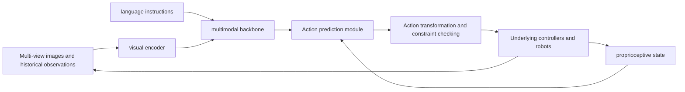
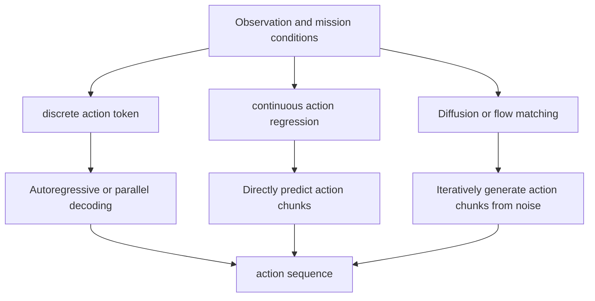

# Introduction
{: id="引言"}

The Vision-Language-Action (VLA) model studies a specific question: Can the **robot combine visual observation and language instructions to directly generate executable actions and continue to modify its behavior after environmental changes?** This requires the model to simultaneously solve "what is the goal", "where is the object" and "how to move next". Correct language understanding is only one step.

[RT-1](https://arxiv.org/abs/2212.06817) demonstrates the potential of large-scale multi-task robot policies; [RT-2](https://arxiv.org/abs/2307.15818) transfers knowledge from pretraining vision-language models to action prediction. Since then, research has followed several intersecting lines: improving action representation and generation, expanding cross-robot data, enhancing temporal memory and task decomposition, and using interactive feedback to improve policies. These routes can be used in combination and cannot simply be understood as the new architecture phasing out the old architecture in turn.

This article focuses on **robot manipulation and mobile manipulation**, taking into account the action policy, world model and data tools that support VLA. ACT, Diffusion Policy, UMI, and UniSim are closely related to VLA, but they respectively assume the roles of policy learning, data collection, or environmental prediction, and need to be distinguished when reading. The comparison in this article uses the experimental settings of each paper as the boundary; benchmark success rates, demonstration videos, and real deployment reliability provide different levels of evidence. The article-by-article methods, illustrations and experimental limitations are concentrated in the supporting .

<figure class="survey-intro-figure">
  
<figcaption>Figure: VLA converts visual observations, language instructions and proprioceptive state into action predictions; after execution, new observations are obtained to form a closed-loop that is continuously modified.</figcaption>
</figure>

# 1. VLA core technology system
{: id="1-vla核心技术体系"}

## 1.1 What is VLA?
{: id="11-什么是vla"}

VLA is an action prediction model conditioned on visual observations and language tasks. Common inputs also include joint status, gripper status, multi-camera images and historical observations; the output is usually the end-effector pose increment, joint target or an action sequence, which is then executed by the robot controller. It does not have to output the motor current directly, nor does it have to do all the planning and safety checks in a network.

This process can be summarized using conditional policies:

$$
A_t \sim \pi_\theta(\cdot \mid o_{\leq t},\ell,s_t),\qquad
A_t=(a_t,\ldots,a_{t+H-1})
$$

Here, $o$ represents observation, $\ell$ represents instruction, $s_t$ represents proprioceptive state, and $H$ is the action chunk length. $H=1$ corresponds to single-step prediction; $H>1$ corresponds to action chunking. After predicting the entire action, the system can execute only part of it and then re-plan based on new observations.

  
<figcaption>OpenVLA: From pretraining vision-language representation to robot action prediction.</figcaption>

|concept|main output|Relationship to VLA|
|---|---|---|
| VLM |text, semantic representation, or structured description|Can be used as the pretraining backbone of VLA; being able to describe actions does not mean being able to control the robot|
| VLA |Actions conditioned by vision and language|Mapping task semantics to the robot’s action space|
| ACT / Diffusion Policy |action sequence|Provides action chunking and continuous distribution modeling methods; the original method does not require large-scale VLM as a necessary component|
|world model|future observations, states, or latent representations|Can assist prediction, planning and data generation, requiring additional mechanisms to be converted into executable policies|
|robotic system|Complete closed-loop of sensing, planning, control and execution|VLA is the policy component and still relies on calibration, drivers, controllers and runtime monitoring|

## 1.2 VLA system architecture
{: id="12-vla系统架构"}

### Execution from input to closed-loop
{: id="从输入到闭环执行"}

**Vision Encoder** determines how to extract object, space and scene features. OpenVLA incorporates DINOv2 and SigLIP representations; multi-camera models also need to handle perspective correspondence, time synchronization and occlusion. The number of encoders alone does not determine performance; input resolution, pretraining goals, and data coverage are equally important.

**multimodal backbone** fuses task semantics and observations. Some models directly fine-tune VLM to predict action tokens, and some models let VLM provide conditions for specialized action experts. The so-called System 2 / System 1 usually describes the division of labor between semantic processing and action generation, and it cannot be assumed that the model must have an explicit task planner or a fixed running frequency.

**action prediction module** needs to handle action dimensions, time correlation and multiple solutions at the same time. For example, there can be multiple reasonable paths around an obstacle, and directly averaging different demonstrations may produce unexecutable actions. The way of action generation and whether to use language reasoning and whether to layer are different design dimensions.

### How action chunk forms closed-loop
{: id="动作块如何形成闭环"}

The action chunk length $H$ specifies **how many steps a single prediction covers**. The number of steps actually executed, $k$, determines how soon the system observes again, with $1\leq k\leq H$. A policy can predict a longer trajectory for coherent motion while executing only its first $k$ steps before observing again. This increases the number of inference calls but reduces the time spent acting on outdated images.

<figure class="vla-process-figure" aria-label="The closed-loop execution sequence of an action chunk">
  <ol class="vla-process-steps">
<li><strong> observes </strong> camera image, proprioceptive state and task instruction entry policy. </li>
<li><strong> predicts that </strong> policy generates a candidate action chunk of length H. </li>
<li><strong> executes </strong>. The controller only executes the first k steps and checks the constraints. </li>
<li><strong> then observe </strong> to obtain the new state, and retain or rewrite subsequent actions. </li>
  </ol>
  

<strong> action chunk indicates that </strong> predicts H = 8 steps, and executes k = 2 steps first 

    
a₁a₂a₃a₄a₅a₆a₇a₈

<strong> has been executed, obtaining new observations </strong> The remaining actions are re-evaluated based on new observations 

  

<figcaption> a closed-loop loop: the predicted length H and the actual execution length k are two different design quantities, and feedback is returned from the robot to the next round of observations.</figcaption>
</figure>

Taking $H=8$ and $k=2$ as examples, the policy predicts eight steps at a time and executes two steps before re-planning. If inference and communication take more than the time to execute two steps, the robot may still wait for new actions; asynchronous inference, action buffering, or fast editing policies can reduce pauses, but it must be checked whether the remaining actions are still valid when new observations arrive. 's slow proposal and fast editing are aimed at this timeliness issue in dynamic environments.

### Action representation and generation methods
{: id="动作表示与生成方式"}

|method|representative work|main value|Issues to weigh|
|---|---|---|---|
|discretized single step action| RT-2, OpenVLA |Reuse token prediction interface|Quantization accuracy, sequence length and serial decoding delay|
|Compress action sequence into token| FAST, ActionPiece |Exploit temporal redundancy and maintain physical relationships between actions|Compression error, relational fidelity, vocabulary and decoding strategies|
|Continuous Action Regression/Latent Variable Policy|Regression scheme in ACT, OpenVLA-OFT|Output action chunk once, and the deployment path is direct|Modeling, training objectives and action smoothness of multi-solution actions|
|diffusion policy| Diffusion Policy |Modeling multimodal continuous action distributions|Number of sampling steps and closed-loop delay|
|flow matching action expert| π₀ |Combine VLM conditions with continuous action generation|Number of integration steps, model size and asynchronous execution configuration|

Action chunking can reduce the invocation overhead of stepwise prediction, but the longer the chunks, the more stale observations used during execution may be. There is no one-to-one correspondence between the generation method and the control frequency. For related methods, see [ACT](https://arxiv.org/abs/2304.13705), [Diffusion Policy](https://arxiv.org/abs/2303.04137), [FAST](https://arxiv.org/abs/2501.09747) and [π₀](https://arxiv.org/abs/2410.24164).

### Unified policy and hierarchical system
{: id="统一策略与层级系统"}

|Organization|working method|Applicable considerations|Main limitations|
|---|---|---|---|
|direct action policy|Predicting actions from observations and tasks|Simple interface facilitates joint training|Long-horizon task progress and failure reasons may be implicit in the representation|
|Explicit hierarchy|The high level generates subtasks or subgoals, and the low level executes them|Facilitates task composition, supervision and re-planning|High and low layer interfaces will introduce information loss and delay|
|Hierarchical representation of joint training|Learn the association between subtasks and actions within the model|Semantic knowledge and action data can be shared|Need to check whether the intermediate representation actually improves closed-loop behavior|

End-to-end training and hierarchies are not mutually exclusive; having readable intermediate text does not mean interpretation is faithful. When comparing architectures, focus on error recovery, task completion time, and the intervenability of intermediate decisions, not just whether a chain of thought is output.

## 1.3 Differences between VLA and traditional robot control
{: id="13-vla与传统机器人控制的区别"}

What VLA changes is the way of learning from tasks to actions. Kinematics, trajectory tracking, and feedback control remain components of most practical systems.

|Dimensions|Typical approach to modular systems|Typical practices for VLA policies|Practical trade-offs|
|---|---|---|---|
|Task description|State machine, rule or target pose|Natural language and visual conditions|Language is more flexible, but vague instructions require clarification or constraints|
|Perception and action association|Explicit geometry, planning and control interfaces|Learn from demonstrations|The learning policy reduces some manual modeling and also relies on data coverage|
|Adaptation to new tasks|Adjust rules, trajectories and parameters|Fine-tune policies, add demonstrations or tips|Both options require verification of migration costs|
|Debugging|Check the errors of each module|Analyzing data, characterization, and closed-loop failure|Observable logs and modular interfaces still have value|
|execution constraints|imposed by planner, controller|Often requires external controllers and constraint layers|Learning policies do not automatically guarantee reachability, stability, or security|

In fixed production lines and high-precision repetitive tasks, traditional solutions may be easier to verify and lower cost. The research value of VLA is mainly reflected in whether transferable behavioral capabilities can be obtained with less specialized design when tasks and scenarios change more; this advantage needs to be demonstrated with specific experiments.

## 1.4 VLA task classification
{: id="14-vla任务分类"}

Task complexity, operation objects and action interfaces are independent dimensions. "Pick up the cup" also contains many control steps, and a single semantic task cannot be equated to a single step action.

|Dimensions|typical type|Core difficulties|Recommended indicators to observe|
|---|---|---|---|
|time span|Short skills, multi-stage, long-horizon tasks|Historical memory, progress judgment, failure recovery|Success rate of the entire task, number of consecutive subtasks, and number of recoveries|
|interactive objects|Rigid bodies, deformable objects, tools and contact operations|Occlusion, deformation and contact state estimation|Grasping stability, final state error, contact failure|
|action interface|End pose, joint target, velocity or force related commands|Coordinate system, unit, controller matching|Tracking error, latency, constraint firing rate|
|scene scope|Desktop, dual-arm collaboration, mobile manipulation|Coupling of perspective changes, accessibility and navigation operations|Cross-scenario performance, task time, manual intervention|
|generalization condition|New objects, new layouts, new tasks, new robots|The difference between training distribution and deployment distribution|Success rates are reported separately under various distribution changes.|

The dimension of the action vector cannot be directly equated to the degree of freedom of the manipulator. For example, "3D translation + 3D rotation + gripper" describes the action interface and does not mean that the model outputs seven joint angles.

## 1.5 Horizontal comparison and summary of mainstream VLA models
{: id="15-主流vla模型横向对比汇总"}

The following table compares representative work according to **research issues and technology trade-offs**. The scores under different robots, data and evaluation protocols are not combined into a unified ranking. For the experiments and diagrams one by one, see .

|work|core issues|Main design|Boundaries to focus on when reading|
|---|---|---|---|
|  |Can multi-tasking robotics policies scale with data size?|Language condition Transformer and action discretization|Not equivalent to fine-tuning on pretraining large-scale VLM|
|  |Can network vision-language knowledge help operations?|Encode actions into tokens and train jointly|Semantic generalization does not equate to acquisition of untrained motor skills|
|  |How to reproduce and adapt a generic VLA|Dual visual encoder, 7B backbone and open source fine-tuning process|The original version and subsequent training programs such as OFT should be compared separately.|
|  |How to generate high-frequency continuous action chunks|VLM and flow matching action expert|Distinguish between action execution frequency and policy update frequency|
|  |How to generalize to new home environments|Joint training of heterogeneous data and high- and low-level prediction|Unseen environments do not mean that any unseen tasks can be completed|
|  |How to use execution experience to improve your policy|RECAP and expert intervention data|Account for interaction, reward annotation, and manual correction costs|
|  |How a universal robot model combines data and tool chains|Division of work between vision-language module and motion experts|Clarify model version, robot adaptation and training data range|
|  |Can intermediate action intentions assist execution?|Structured reasoning in action space|Requires intermediate representation ablation and additional inference cost comparison|
|  |How spatial positioning and future prediction assist actions|Space and forward supervision|Examine oversight data costs and benefits for each task|
|  |How to share cross-robot semantic representations|Intensive ECoT supervision, skipping ECoT generation during inference|Skipping text generation does not equal zero latency for the entire policy|
|  |How to take advantage of long history without continually growing the attention cache|Fast weights as loop states|Updating memory during testing is not equivalent to online reward optimization|
|  |How to adjust feature fusion with task stages|State space guided adaptive attention|Verify income under unified long-horizon task protocol|
|  |How to reduce the cost of vision-language action fusion|Lightweight coding and direct cross-modal interaction|Report hardware, precision, action chunk and latency caliber|
|  |How to scale to multi-tasking and full-body robotics|Approximately 60000 hours of mixed pretraining, whole body movement interface and future prediction|Separately report platform progress, success rates, and data costs|
|  |Which high-level decisions are worth spending more inference power on?|Perform memory and world model guided subtask searches|Distinguish between hierarchical decomposition benefits and additional search benefits|
|  |Whether the action token retains local physical relationships|Physical sorting consistency index and quantitative supervision|The scope of application is discrete autoregressive action representation|
|  |How to do a quick closed-loop fix for inference latency|Slow VLA proposals and fast editing policies for online RL|The boundary between real robot dynamic short tasks and online data cap|
|  |How to use human correction for online policy improvement|Adjusting human corrective constraints by action dimension|Counts pre-collection corrections and manual takeover during training|

If the purpose is to reproduce, you should first confirm whether the weights, data processing, training configuration and evaluation code match. Code disclosure, weight disclosure, data disclosure and allowing commercial use are different conditions. You must check the corresponding version of the warehouse and license respectively.

## 1.6 Architecture evolution and development trends
{: id="16-架构演进与发展趋势"}

### Several main lines of technological evolution
{: id="技术演进的几条主线"}

|Main line|representative work|what changed|What has not been resolved|
|---|---|---|---|
|Semantic knowledge transfer| RT-2, OpenVLA |Introducing vision-language pretraining into action learning|There is still a gap between semantic understanding and precise physical execution|
|Action sequence modeling| ACT, Diffusion Policy, π₀, FAST, ActionPiece |Extend from stepwise output to action chunk and check discretization relation fidelity|Closed-loop response and delay compensation under fast disturbance|
|cross-robot learning| RT-X, OpenVLA, GR00T, LingBot-VLA 2.0 |Share data and partial representations across platforms|Action interface, sensing configuration and embodied differences|
|long term decision making| π₀.5, RoboTTT, S²-VLA, τ₀-VLA |Introduce subtasks, memories, stage representations or world modelsearches|Reliably determine success, detect failure, and recover|
|Improve from experience| π*₀.₆ / RECAP, Real-Time EXPO-FT, Bee |Optimize policies with execution data, rewards, and human corrections|Interaction cost, real-time latency, reward quality and old skill retention|

These advances affect representation, action generation, data, and training mechanisms respectively. For example, TTT is a way of processing history, and Flow Matching is a way of generating action distribution. The two can coexist.

### Division of labor among four types of learning signals
{: id="四类学习信号的分工"}

Calling both training data “sizes” masks the differences in supervision they provide. Internet graphics help identify objects and understand instructions; robotic demonstrations connect observations to actions; synthetic environments and future predictions add explorable states; and post-execution rewards and manual correction point out where the policy actually failed. Adding a certain type of data cannot automatically replace another type of signal.

<figure class="vla-signal-figure" aria-label="Learning signals provided by four types of data and feedback respectively">

<strong> Graphics, text and language </strong> Objects, relationships and target semantics <small> Lack of executable contact actions </small>

<strong> robot demonstration </strong> Correspondence of observed actions <small> is limited by task and embodied coverage </small>

<strong>Simulation and prediction</strong>Perturbations, results and candidate futures<small>Need to be verified to be consistent with real dynamics</small>

<strong>Deployment feedback</strong>Failure, recovery and policy improvements<small>has interaction, labeling and takeover costs</small>

<figcaption> The source of supervision determines what the model can learn, and also determines what type of closed-loop evidence is needed.</figcaption>
</figure>

 more directly examines the transfer of vision-language knowledge to action tasks;  and  focus on the scale and interface of cross-embodiment demonstrations;  Use future predictions for high-level candidate selection;  and  use execution experience or manual correction. They solve different training bottlenecks, and the newly added data and computing budget should be recorded at the same time when comparing.

### The role and verification of world model
{: id="世界模型的作用与验证"}

The world model can provide future visual subgoals, candidate action results, or synthetic training trajectories.  shows the research path of learning interactive environment;  uses prediction results for high-level subtask search. But visually sound generation results may lack the correct contact, mass, friction, and causal response. Further verification is needed during evaluation: whether the prediction is correctly controlled by actions, whether it can improve downstream policies, and whether the benefits are transferred to the real environment.

Research trends can be summarized into three open questions: Can more semantic supervision improve actions rather than just interpretations? Can longer histories reduce failures caused by insufficient observability? Can deployment feedback improve overall mission reliability at an acceptable cost? Answers to these questions should come from controlled comparisons and closed-loop experiments.

## 1.7 VLA open source ecosystem
{: id="17-vla开源生态"}

The reproduction of VLA relies on the cooperation of models, data, tools and hardware.

|level|Represent resources|Main purpose|Check before use|
|---|---|---|---|
|model| [OpenVLA](https://github.com/openvla/openvla), [openpi](https://github.com/Physical-Intelligence/openpi) |Reasoning, fine-tuning and policy adaptation|Weighted version, input interface, normalized statistics and license|
|data| [Open X-Embodiment](https://robotics-transformer-x.github.io/) |Multi-data source robot pretraining|Sampling mixing, action units, coordinate systems, language annotation and authorization|
|Tools| [LeRobot](https://github.com/huggingface/lerobot) |Document, train, evaluate and deploy|Data format versions, supported policies and robot drivers|
|Simulation| [Genesis](https://github.com/Genesis-Embodied-AI/Genesis), [ManiSkill](https://github.com/haosulab/ManiSkill) |Environment interaction, data generation and evaluation|Physical setup, sensor models and real migration gaps|
|Hardware and acquisition| [ALOHA](https://tonyzhaozh.github.io/aloha/), [UMI](https://umi-gripper.github.io/) |teleoperation or handheld demonstration collection|Workspace, calibration, time synchronization and recurrence costs|

Unifying file formats only solves part of the problem of data access. Different data sources, even if they all use RLDS, may use different action semantics and control frequencies. Cross-robot training still requires motion transformation, normalization, sampling balancing, and quality filtering. Opening the weights does not mean that the pretraining data and the complete training process are made public.

## 1.8 Training paradigm: from pretraining to deployment feedback
{: id="18-训练范式从预训练到部署反馈"}

A VLA training sample usually contains at least observations, task conditions, proprioceptive state, and subsequently performed actions; some data also provide subtask text, future observations, rewards, or manual corrections. **These additional fields determine what targets can be trained**: When only the image and text are aligned with the data, the model can learn semantics, but cannot directly learn the gripper command of a certain robot; only when successfully demonstrated, the model will imitate the actions within the distribution, but it is difficult to know how to recover after deviating from the trajectory.

|stage|Input and supervision|What is the main thing to get?|What needs to be verified individually|
|---|---|---|---|
|vision-language pretraining|Images, text, Q&A, etc.|Objects, relations and task semantics|Whether comprehension ability is retained after accessing movement training|
|Robot action pretraining|Multitasking trajectories, status and actions|Universal action priors and partial cross-scenario transfer|Data blending, action interfaces, and cross-embodiment negative migration|
|Target task adaptation|A small amount of specific robot demonstrations or expert data|Precise adaptation of gripper, viewing angle, contact and target status|Does the benefit of new tasks come at the expense of forgetting old tasks?|
|Deployment feedback improvements|Failure trajectories, rewards, corrections and takeovers|Resilience and on-site distribution adaptation|Number of interactions, labor costs, and safety margins|

These stages are the framework for analysis, not a fixed pipeline in which all models must be executed sequentially.  focuses on examining vision-language knowledge transfer,  provides an open cross-robot action training and adaptation path,  uses data from different sources for multi-stage tasks, and  and  Study separately how execution experience and human correction can continue to improve the policy.

### Action interfaces often fail before loss functions
{: id="动作接口通常比损失函数更先出错"}

Before training, the action definition should be written into an executable contract: is the output a joint target, an absolute terminal pose, or a pose increment? Is rotation represented by Euler angles, axis angles or something else? What are the opening and closing values ​​and units of the gripper? How much physical time does an action cover? Different robots can share the policy backbone, but normalized statistics, coordinate transformation and controller adaptation often need to be processed separately. The resulting failure of directly interpreting "relative end-effector displacements" for one data set as "absolute joint targets" for another platform cannot be attributed to the VLA architecture.

Demonstrations are usually cut into $(o_t,\ell,s_t,A_t)$ by time window. Adjacent windows on the same trajectory are highly correlated. Randomly assign training and test sets by frame so that the test images appear approximately in training; the division should be performed at the trajectory, object, scene or acquisition session level. The action chunk tag must also be consistent with the camera timestamp, control frequency, and actual replanning interval at execution time. Otherwise, the offline loss is very low, and the closed-loop may still be short-circuited due to a few frames of misalignment.

### How to tell if a new training phase is really effective
{: id="怎样判断新训练阶段真正有效"}

When comparing "adding pretraining", "adding future prediction" or "adding online feedback", first fix the backbone, target task data, action interface and initial evaluation status, and then only change the corresponding supervision or training stage. In addition to target task performance, performance degradation under language understanding, old robotics tasks, and perturbations should also be examined. For online methods, the horizontal axis must at least include the amount of robot interaction and manual intervention; only comparing the final success rate will mistakenly record the benefits brought by more data or longer training as algorithm benefits.

## 1.9 Embodied intelligence learning and entry route
{: id="19-具身智能学习与入门路线"}

With the goal of being able to reproduce, explain and diagnose a closed-loop task, the learning path can be divided into four steps:

1. **Understanding the data and control interface**: Starting from existing data or simulation, check images, status, actions and timestamps; confirm units, coordinate systems and normalization. You can first play back a correct trajectory and then train the policy.
2. **Establish a behavioral clone baseline**: Use ACT or Diffusion Policy to run fixed tasks and record the success rate, task time and failure type. Verify what happens when you change the initial state, lighting, or object position.
3. **introduces language conditions and pretraining model**: Select the OpenVLA or openpi configuration consistent with the device and data interface, and compare the benefits of training from scratch, freezing the backbone, and fine-tuning. Keep data partitioning and evaluation protocols consistent.
4. **checks real closed-loop and generalization**: performs real robot verification when hardware conditions are met, covering new layout, disturbance, failure recovery and manual takeover; while recording inference latency, execution frequency and continuous running performance.

An exercise should leave at least data description, fixed evaluation set, reproducible configuration and failure cases. Whether the deployment requirements are met depends on the error cost and operational constraints of the specific task, and a unified "60% success rate" cannot be used as the passing criterion.

# 2. VLA Core Challenges
{: id="2-vla核心挑战"}

This chapter is organized in a problem-driven manner: it links methods to observable failures and explains how to judge whether improvements are effective.

|challenge|Common failures|key verification|
|---|---|---|
|Representation and physical grounding|Can't find the right object but can't hold it firmly; confusion between reference and coordinates|Spatial, contact and language perturbation experiments|
|planning and execution|Subtasks are missing; actions are lagging; repeated execution after failure|closed-loop latency, task completion time and recovery rate|
|Generalization and adaptation|Scene changes are invalid; new skills overwrite old skills|Independent distribution changes and continual learning evaluation|
|Safe and reliable interaction|Cross-border action; false positive success; unreasonable takeover|Constraint triggering, rejection accuracy, and takeover costs|
|Data and Reviews|Data leakage; inconsistent action definitions; incomparable scores|Data traceability, partitioning protocols and experimental configurations|

## 2.1 Multi-modal alignment and physical world modeling
{: id="21-多模态对齐与物理世界建模"}

### The gap between correct semantics and correct actions
{: id="语义正确与动作正确之间的差距"}

"Pick up the cup on the left" simultaneously includes object recognition, reference frame, grasping pose and reachability. VLM can answer the position of the cup, but it does not guarantee that the action head can generate the correct contact trajectory. Training needs to map semantic features to states, actions, and results; evaluation requires changing instructions, target locations, and distractors respectively to avoid policies that only rely on scene shortcuts to complete tasks.

Three sets of diagnoses can be made with the same task: just rewrite the language expression of "left cup" and observe whether the target is still selected; keep the instruction unchanged, move the cup and camera, and check the target positioning and coordinate transformation; keep the target unchanged, change the cup handle orientation or contact conditions, and check whether the grasp is stable. The three sets of changes emphasize semantics, space, and control respectively, but errors may also be transferred to each other. Recording the target selected by the model, predicted actions and final contact results can better locate the failure link than just reporting the success rate of the entire task.

### Space and contact representation
{: id="空间与接触表示"}

Multi-view RGB, depth, point cloud, occupancy representation and force-tactile signals can supplement different information and also introduce calibration, noise and synchronization costs respectively.  and  provide different ideas for spatial representation. The data volume and camera configuration should be fixed when comparing to determine whether the gain comes from the representation method or additional sensing information.

### Future predictions and physical consistency
{: id="未来预测与物理一致性"}

Predicting future images or potential states can provide training signals for actions, but low pixel error does not equate to good control. The key is being able to distinguish the consequences of candidate actions, especially collisions, occlusions, sliding and irreversible operations. The evaluation of the world modelshould include multi-step errors and downstream closed-loop gains, and check whether the model is still credible in the failure state.

## 2.2 Instruction following, planning and robust real-time execution
{: id="22-指令跟随规划与鲁棒实时执行"}

### Long-horizon tasks require progress status and recovery mechanisms
{: id="长任务需要进度状态和恢复机制"}

Task breakdown is just the starting point. The system also needs to determine when subtasks are completed, when to re-observe, and where to recover after failure. , , and  provide examples of hierarchical prediction, intermediate action intent, and external execution management, respectively. For these systems, additional model calls, retries, and human involvement should be factored into the cost.

Even if the conditional success probability of each subtask is $p$, a task that must complete $N$ steps continuously will only have a success probability of $p^N$ under simplifying assumptions. For example, it is about 36% for $p=0.95$ and $N=20$. This is just an example of error accumulation; real tasks are also affected by failure correlation and recovery mechanisms.

<figure class="vla-reliability-figure" aria-label="When the single-step success rate is 95%, the schematic diagram of the continuous task success rate decreasing with the number of steps">

1 Step 
<i style="width:95%"></i>
<strong>95%</strong>

5 Step 
<i style="width:77%"></i>
<strong>77%</strong>

10 Step
<i style="width:60%"></i>
<strong>60%</strong>

20 Step 
<i style="width:36%"></i>
<strong>36%</strong>

<figcaption> indicates the calculation of 0.95 to the Nth power: assuming that each step is independent, all must be successful, and there are no retries; it is not an actual test result of any paper or robot.</figcaption>
</figure>

Therefore, the long-horizon task method should not only improve the proportion of "right next step", but also report whether **failure can be detected, whether partial retries can continue the task, and how long it takes** to recover. If a failure necessitates a reset, task throughput may be much lower than the single-segment success rate would suggest; if it is safe to retry, the number of retries and manual takeover should be reported together with the final success rate.

### Distinguish between four "speeds"
{: id="区分四种速度"}

|indicator|meaning|Common misunderstandings|
|---|---|---|
|single inference latency|The time from model input to output action|Treat offline batch speed as online latency|
|Policy update frequency|Number of times per second to generate action plans based on new observations|Confused with the sampling frequency within the action chunk|
|action execution frequency|The number of times the controller sends or performs an action per second|Consider 50 Hz execution to mean full VLM inference 50 times per second|
|task throughput|Number of effective tasks completed per unit time|Ignore retries, resets and manual intervention|

Action chunking, parallel decoding, caching and asynchronous execution act on different aspects. [OpenVLA-OFT](https://arxiv.org/abs/2502.19645) studies the efficiency of fine-tuning and action generation; [FAST](https://arxiv.org/abs/2501.09747) studies action sequence compression. The training acceleration, action throughput and single inference acceleration in the paper must be reported separately and cannot be written as "several times faster".

When evaluating real-time performance, the entire link of image acquisition, transmission, preprocessing, inference, action conversion, and controller communication should be covered, and high-quantile latency should be reported. The length of the action chunk, how many steps are executed at a time, and whether midway updates are allowed will all change the robot's ability to respond to disturbances.

## 2.3 From generalization to continuous adaptation
{: id="23-从泛化到持续适应"}

### First define what “unseen” is
{: id="先定义未见是什么"}

|generalized type|changing factors|Factors that should be fixed or explained|
|---|---|---|
|visual generalization|Background, lighting, texture, distractions|Task and motor skills|
|spatial generalization|Object position, orientation, camera angle|Work space and calibration range|
|Semantics and combinatorial generalization|Instruction expression, object combination, sub-task sequence|Does it include new motor skills?|
|cross-robot migration|Body, gripper, sensor, action interface|Whether to allow adaptation data and parameter updates|
| Sim-to-Real |Images and dynamics shift from simulation to reality|Real data usage and number of parameter adjustments|

The "zero sample" must indicate relative to which change, and whether the same type of task has been seen in pretraining. Small amounts of target data fine-tuning, contextual demonstrations, and completely unadapted deployments should also be reported separately.

### Adaptation mechanisms should not be confused with
{: id="适应机制不应混为一谈"}

Offline fine-tuning uses data collected in advance to update parameters; continual learning also needs to check whether old skills are forgotten; online reinforcement learning optimizes policies based on interactive rewards; TTT can make use of history by updating internal states or fast weights during testing. The latter does not automatically imply the use of reward learning. [RoboTTT](https://arxiv.org/abs/2607.15275) uses fast weights as historical memory, while  focuses on policy improvements brought by execution experience.

When comparing these methods, it is necessary to document the performance before and after adaptation, the number of interactions, manual correction, computational cost, and cross-task transfer or forgetting. Only reporting the best task performance after adaptation will cover up additional resource consumption.

## 2.4 Security, explainability and reliable interaction
{: id="24-安全性可解释性与可靠交互"}

Linguistic rules, rejected output, and readable reasoning can aid interaction, but do not alone constitute physical execution guarantees. A complete system should be divided into three levels: whether the policy understands the constraints, whether the output action satisfies limitations such as work space and speed, and whether it can detect anomalies and stop in time during execution.

|level|What can be observed|What this evidence does not establish|
|---|---|---|
|task understanding|Whether to identify ambiguities, disallowed targets, or missing conditions|It cannot be inferred that the motion process always satisfies the constraints|
|action constraints|Limit, reach, collision or speed checks|It cannot be inferred that the perceptual and physical models are completely correct|
|Runtime monitoring|Contact exception, timeout, failure detection and takeover|It cannot be inferred that every unknown fault can be discovered|
|Interpretability|Whether subtasks, target locations, and intermediate reasoning are checkable|That the explanation faithfully reflects the actual cause of a decision|

Valuable measurements include error acceptance versus error rejection, anomaly detection latency, constraint violation rate, number of manual takeovers, and post-recovery task success rate. Only by deleting, replacing, or interfering with the intermediate reasoning can we further determine whether it actually affects the action.

## 2.5 Data Construction and Benchmark Testing Standards
{: id="25-数据构建与基准测试标准"}

### Data quality and consistency
{: id="数据质量与一致性"}

The difficulty with multi-source robot data is semantic and temporal consistency. It is necessary to check whether the action uses absolute values ​​or increments, what representation of rotation is used, the direction of opening and closing of the gripper, camera and control timestamps, and how to mark the failure trajectory. Randomly dividing the training set and test set by frame can easily leak adjacent moments; more reasonable division units are usually trajectories, scenes, objects or acquisition sessions.

Number of traces, number of frames, and number of acquisition hours are not directly interchangeable. Longer videos or more frequent recordings do not automatically lead to more independent skills. Data comparison should also include task coverage, robot distribution, proportion of successful and failed samples, and language annotation quality.

### Understanding Benchmark Scores
{: id="读懂基准分数"}

[LIBERO](https://github.com/Lifelong-Robot-Learning/LIBERO)’s original task division needs to be distinguished from subsequent VLA common evaluation combinations; [SimplerEnv](https://simpler-env.github.io/) uses simulation to approximate real evaluation conditions and cannot replace real robot testing. CALVIN's continuous task completion performance, LIBERO's task success rate, and real robot's hour-level throughput measure different abilities.

A set of comparable experiments should at least account for:

1. **training conditions**: pretraining weights, target task data, perspective, proprioceptive state and additional supervision.
2. **evaluation protocol**: baseline version, task set, initial state, random seed, number of trials per task and success criteria.
3. **execution conditions**: device, accuracy, action chunk length, re-planning interval, maximum number of steps and retry budget.
4. **Result statistics**: task-by-task performance, summary method, variance or confidence interval, and failure type.
5. **Additional costs**: Manual intervention, external planner, reward annotation, fine-tuning and online adaptation budget.

Single-task fine-tuning, multi-task joint training and continual learning cannot directly merge rankings even if they use the same environment. The actual significance of a small average score improvement should be judged based on repeated experiments and costs.

# 3. VLA mainstream data set
{: id="3-vla主流数据集"}

When selecting data resources, you must first distinguish four types of objects: **downloadable robot trajectories, collection tools, simulation environments that can generate data, and fixed protocol evaluation benchmarks**. They solve different problems and cannot be sorted by "size" alone. The following table uses the statistical caliber when the paper or project was released; the actual training subset and subsequent versions may be different.

|Resources|Type|representative size or scope|Main purpose|
|---|---|---|---|
| Open X-Embodiment |cross-robot data collection|The original project covers 22 types of robots and millions of trajectories|cross-robot pretraining|
| ProcCorpus-60M |Training corpus with dense inference annotation|About 60000000 frames and more than 400000 trajectories|cross-robot semantic supervision|
|RT-1 data|Real robot demonstration|About 130000 trajectories and more than 700 tasks|Multi-task operation learning|
| BridgeData V2 |real operating data|60096 trajectories, 24 environments|Language condition operations and migration|
| DROID |Multi-scenario real operation data|About 76000 trajectories, 350 hours, 564 scenes|Scenario generalization and pretraining|
| RH20T |Multimodal robot data|Visual, force, audio and motion information|Exposure manipulation and cross-modal learning|
| ALOHA / UMI |Hardware and demonstration acquisition system|Release version statistics by task and data|Two-arm or handheld demonstration collection|
| CALVIN / LIBERO |Simulation data and evaluation|Long-horizon task portfolio/knowledge transfer|Repeatable policy comparison|
| MimicGen |Demo Amplification System|Generating trajectories from a small number of seed demos|Data generation and augmentation|
| SimplerEnv / VLABench |Evaluation environment and benchmarks|Real condition approximation / linguistic conditional operation|Generalized diagnosis and closed-loop evaluation|
| RoboDojo |Unified evaluation benchmark for simulation and real robot|42 simulation tasks, 18 real robot tasks|Comparison of cross-model capabilities and public rankings|
| LeRobotDataset |Data formats and tools|Varies with specific community datasets|Data recording, reading and training integration|
| Ego4D |Human first-person video|Large scale daily activity videos|Visual and interactive representation pretraining|

## 3.1 Large-scale cross-robot data set
{: id="31-大规模跨机器人数据集"}

### Open X-Embodiment Dataset
{: id="open-x-embodiment-dataset"}

[Open X-Embodiment (OXE)](https://robotics-transformer-x.github.io/) brings together robot data from multiple institutions, with the original project covering 22 robots, 527 skill categories, and 160,266 tasks. The RT-X study, in which the training strategy was selected on a mix of data, showed that cross-robot data sharing can produce positive transfer; the entire data volume of the set cannot be considered the actual training volume of each model.

  
<figcaption>Open X-Embodiment: Cross-institution, cross-robot data sharing. Source: RT-X Project.</figcaption>

OXE uses RLDS to organize trajectories, but there are still differences in cameras, action definitions, control frequencies, and annotation quality for different subsets. Before use, you should check the actual data mixing configuration and record the filter conditions, sampling weights and conversion methods. The ~970,000 training trajectories used by OpenVLA are of a specific mix and should not be taken directly as a fixed scale across all versions of OXE.

### ProcCorpus-60M Dataset
{: id="proccorpus-60m-dataset"}

[The ProcCorpus-60M reported in ZR-0 paper](https://arxiv.org/abs/2606.30552) contains about 60 million frames, about 1000 hours, and more than 400,000 trajectories, and 96.8% of the frames have dense ECoT annotations. Its value lies in providing semantic supervision such as scene, goal and task decomposition for cross-robot learning.

Data volume and downloadable range need to be checked separately; actual replication should also check annotation generation costs, error propagation, and whether there are task or scenario overlaps. For related models, see .

### RT-1 Dataset
{: id="rt-1-dataset"}

[RT-1](https://arxiv.org/abs/2212.06817) uses about 130,000 real robot demonstrations, covering more than 700 tasks. It is suitable for explaining how multi-task data on the same robot supports a common policy, and also provides a data source for subsequent cross-robot training. When reading, the robot arm movement, gripper, chassis and control mode should be distinguished, and all trajectories cannot be uniformly regarded as seven-dimensional robot arm movements.

## 3.2 Two-arm and dexterous operation data set
{: id="32-双臂与灵巧操作数据集"}

### ALOHA / ACT Dataset
{: id="aloha--act-dataset"}

[ALOHA and ACT](https://tonyzhaozh.github.io/aloha/) provide dual-arm teleoperation hardware and action chunking algorithms respectively. The data usually includes multi-camera images, proprioceptive state and arm movements; specific tasks, number of demonstrations and collection frequency should be recorded according to the corresponding data release. The data protocols of ALOHA, Mobile ALOHA and subsequent platforms also need to be distinguished.

This type of data is suitable for studying the coordination and fine operation of both arms. When using it, focus on checking the master-slave arm calibration, camera layout, gripper status and joint targets; the action chunk length needs to be explained together with the recording frequency. For details on the method, see .

### UMI (Universal Manipulation Interface) Dataset
{: id="umi-universal-manipulation-interface-dataset"}

[UMI](https://umi-gripper.github.io/) Use a handheld gripper to capture demonstrations and design strategic interfaces to migrate the demonstrations to the robot. The key is not only reducing acquisition equipment, but also including pose estimation, action representation and delay matching. The handheld trajectory still needs to meet the reachability and motion constraints of the execution robot, and cannot be sent directly without conversion.

UMI is a collection and policy learning framework. Specific public data are organized by tasks. For details, see .

## 3.3 Simulator data set
{: id="33-模拟器数据集"}

### CALVIN (Composing Actions from Language and Vision)
{: id="calvin-composing-actions-from-language-and-vision"}

[CALVIN](https://github.com/mees/calvin) Evaluating long-term execution with a linguistically conditioned continuous manipulation task. Common results report the success rate of completing 1-5 consecutive subtasks, and the average number of consecutive tasks completed (up to 5).

The data division must be clear: **ABC→D** means that only A, B, and C environments are used for training, and the test is in D; **ABCD→D** includes D environment data in the training phase. The two cannot be used together to account for generalization to unseen environments. Completing multiple instructions in succession does not mean that the model autonomously generates task decomposition.

### LIBERO (Lifelong Benchmark for Robot Manipulation)
{: id="libero-lifelong-benchmark-for-robot-manipulation"}

[LIBERO code](https://github.com/Lifelong-Robot-Learning/LIBERO) and [Original paper](https://arxiv.org/abs/2306.03310) provide 130 tasks and human teleoperation demonstrations, with raw data of 50 items per task, about 6,500 items in total. The tasks are divided into Spatial, Object, Goal (10 each) and LIBERO-100; the latter is further divided into 90 pretraining tasks and 10 downstream tasks.

Subsequent VLA often reports four sets of results: Spatial, Object, Goal, and Long, where Long corresponds to the commonly used LIBERO-10 task set. When citing scores, it should be clear which combination of packages was used, as well as the data preprocessing and initialization protocols.

**Continuous learning indicator**: Forward transfer (FWT) examines the help of existing knowledge in subsequent new task learning; backward transfer (BWT) examines the change in old task performance after learning a new task, which may be positive or negative due to forgetting. The original paper actually reports FWT, negative backward transfer NBT and learning curve area AUC; the lower the NBT, the less forgetting. The average success rate of multi-task joint training is not a substitute for continual learning results.

### RLBench / MetaWorld
{: id="rlbench--metaworld"}

[RLBench](https://sites.google.com/view/rlbench) provides simulated manipulation tasks and demonstration generation capabilities; [MetaWorld](https://meta-world.github.io/) organizes multi-task and meta-learning control problems. They are suitable for setting up controlled experiments, but not all configurations come with image, language and action interfaces consistent with VLA, and the conversion process needs to be explained when reusing.

### MimicGen
{: id="mimicgen"}

[MimicGen](https://mimicgen.github.io/) Automatically synthesizes more operation trajectories from a small number of seed demonstrations, mainly through object-related trajectory transformation, sub-task organization and simulation execution to achieve amplification. The number of generations is not equal to the number of independent skills; the costs of scenario construction, subtask definition, failure screening, and manual preparation also need to be included.

## 3.4 Real-world data sets
{: id="34-真实世界数据集"}

### Bridge Dataset (BridgeData V2)
{: id="bridge-dataset-bridgedata-v2"}

[BridgeData V2](https://rail-berkeley.github.io/bridgedata/) contains 60,096 trajectories, 24 environments, and 13 skill categories. Of these, 50,365 were from teleoperation and 9,731 were from scripted fetch-and-place policies. It provides language task annotation and incorporates object, camera pose, and workspace changes.

This type of data is suitable for studying desktop operations and language condition transfer. Comparative experiments need to indicate the versions used, whether script trajectories are included, and whether training and test scenarios overlap.

### RH20T Dataset
{: id="rh20t-dataset"}

[RH20T](https://rh20t.github.io/) is designed for multimodal robot skill learning, records visual, force sense, audio and motion information, and provides corresponding calibration data. It is suitable for studying contact states, multimodal fusion and demonstration transfer.

Force/torque measurements are a different modality than high-resolution fingertip tactile images; available sensors should be determined by actual data configuration and cannot be assumed to contain the same tactile or synchronization accuracy for all trajectories.

### DROID Dataset
{: id="droid-dataset"}

[DROID](https://droid-dataset.github.io/) contains approximately 76,000 demos, 350 hours of interaction, 564 scenarios and 86 types of tasks at launch, with participation from 50 collectors. Its unified platform features Franka Panda, two external binocular cameras and a wrist-mounted binocular camera.

DROID emphasizes the diversity of scenarios under the same hardware and is suitable for studying cross-environment migration. The official has subsequently updated the language annotation and some camera calibrations, and the data version used should be recorded when reproducing.

### LeRobot Dataset (HuggingFace)
{: id="lerobot-dataset-huggingface"}

[LeRobot](https://github.com/huggingface/lerobot) provides robot data recording and training tools; LeRobotDataset is a data organization method, not a fixed-scale data set. Actual data quality, bot interfaces, authorization, and training-test divisions are determined by each data publisher.

## 3.5 Human-computer interaction data set
{: id="35-人机交互数据集"}

### Ego4D
{: id="ego4d"}

[Ego4D](https://ego4d-data.org/) provides human first-person daily activity videos and multi-category task annotations. It can help learn object interaction and temporal representations, but human videos typically do not contain joint commands that can directly supervise robots. When used in VLA, additional action correspondence, latent action learning, or robot data alignment mechanisms are required.

## 3.6 Evaluation Benchmark
{: id="36-评测基准"}

### SIMPLER / SimplerEnv
{: id="simpler--simplerenv"}

[SimplerEnv](https://simpler-env.github.io/) uses visual matching and environment change settings to approximate some real robot policy evaluation conditions in simulation. The research focus is on the consistency between simulation evaluation and real performance, rather than providing a uniform fixed total number of tasks for all robots.

Results should be reported with reference to the robot, task set, visual match, or variation settings. Extended versions of tasks and language protocols should be annotated separately, and their statistics should not be attributed to the original SimplerEnv.

### VLABench
{: id="vlabench"}

[VLABench](https://vlabench.github.io/) Robot operation oriented to language conditions, including a variety of tasks and scenarios, used to study language understanding, common sense and execution ability. The specific task division, indicators and generation configuration used must be stated with the paper or code version.

### RoboDojo
{: id="robodojo"}

[RoboDojo](https://robodojo-benchmark.com/) simultaneously provides 42 simulation tasks and 18 real robot tasks, and compares different policies using a unified protocol in [Official Ranking](https://robodojo-benchmark.com/leaderboard). The simulation covers five types of abilities: generalization, memory, fine operation, long-horizon tasks and open instructions. When reading their rankings, you should distinguish between complete task success rate (SR) and Score that includes partial progress, as well as simulation and real robot rankings; they are not equivalent to scores on LIBERO or other benchmarks. For the specific protocol, see [original paper](https://arxiv.org/abs/2607.04434).

### ManiSkill3 / RoboCasa
{: id="maniskill3--robocasa"}

[ManiSkill](https://maniskill.ai/) provides parallel simulation, data and task tools; [RoboCasa](https://robocasa.ai/) focuses on the kitchen operating environment. They can be used for both data generation and policy evaluation, but "how many environments are supported to be generated" and "how many tasks are actually evaluated" are different statistics.

The selection should be based on the research questions: verifying parallel training efficiency, cross-scenario changes, and long-horizon task operations require different configurations. Good performance in simulation is also verified by sensing, dynamics and execution latency of real systems.

### From benchmark scores to real abilities
{: id="从基准分数到真实能力"}

Evaluation evidence has different coverage areas and is suitable for troubleshooting problems layer by layer. Offline action errors can check tags and action interfaces, but cannot prove the success of closed-loop; fixed simulation tasks facilitate repeated comparison, but may rely on scene shortcuts; perturbation tests test new objects, perspectives, and layouts; real robot experiments only introduce real contact, sensing noise, and system delays.

<figure class="vla-evidence-figure" aria-label="Four layers of evaluation evidence from offline indicators to real robot closed-loop">
  <ol class="vla-evidence-steps">
<li><strong> Offline playback </strong> Action error, data leakage, interface correctness </li>
<li><strong> Fixed simulation </strong> Overall task success rate, task progress, and task-by-task failure </li>
<li><strong> Distribution changes </strong> New layout, new objects, visual and dynamic disturbances </li>
<li><strong> real robot closed-loop </strong>Completion rate, time-consuming, recovery, manual intervention and safety constraints</li>
  </ol>
<figcaption>The upper layer of evidence makes up for the risks that the lower layer cannot cover; the results of the previous layer cannot be directly deduced from the results of the next layer.</figcaption>
</figure>

For example, RoboDojo's **Score** can reflect the partial progress of the unfinished task, while **SR** requires the complete completion; the gap between the two can help discover the policy of "making the last step but failing". If the real robot only tries 10 times per task, the success or failure of one time will change by 10 percentage points. The results of each task, repeated rounds and failure fragments should be disclosed instead of just giving the overall average. [RoboDojo original paper](https://arxiv.org/abs/2607.04434) and [Official list](https://robodojo-benchmark.com/leaderboard) provide reading entrances split by ability dimensions.

# 4. Application scenarios of VLA
{: id="4-vla的应用场景"}

The application value of VLA depends on whether the adaptation benefits brought about by task changes can cover the costs of data collection, calculation and system integration. The task demonstration in the paper provides evidence of capabilities, and production deployment also requires a longer period of reliability evaluation.

|scene|Tasks worth studying|Potential value of VLA|Key deployment metrics|
|---|---|---|---|
|Flexible manufacturing|Multi-variety sorting, pre-assembly positioning, material handling|Handle product changes through task conditions and small-scale adaptation|Contact accuracy, cycle time, failure cost and reset time|
|Home & Services|Organizing, laundry handling, desk cleaning|Adapt to changes in objects, layouts, and instructions|Overall task completion rate, recovery rate, intervention and continuous running time|
|Warehousing and Logistics|Picking, bagging and rearranging of changing items|Reduce specialized policy design for each item|throughput, damage rate, long-tail item performance|
|mobile manipulation|Pick and place across regions and operate along the way|Combining language goals, navigation and local operations|Combined arrival and operation success rate, positioning error and mission time|

Pure visual quality inspection is mainly a perception task; only when the system generates operating actions based on the inspection results, it enters the VLA scope discussed in this article. Open environments such as agriculture and construction can be used as extended research directions, and their maturity cannot be directly inferred from desktop experiments.

### From demo to usable: warehouse picking as an example
{: id="从演示到可用以仓储拣选为例"}

"Being able to put items into boxes" is not a clear enough deployment goal. In the research phase, you can first fix the robotic arm, camera and object collection to establish a reproducible grabbing and placing baseline; then introduce new packaging, occlusion, stacking and target box position changes to confirm whether the performance degradation comes from the perception, grabbing or action interface. After entering the site, it is also necessary to calculate the hourly **Effective number of picks** , counting identification, attempt, retry, reset, manual takeover and damage into the same task cycle.

This also explains why a higher simulation success rate does not necessarily mean higher production line throughput. A policy that requires frequent retries or manual resets may perform well in a single trial, but may not run continuously. For home organization and mobile manipulation, task duration, object and scene changes, recovery policies, and labor costs should also be supplemented to determine whether general capabilities actually reduce specialized engineering efforts.

# 5. Paper readings
{: id="5-论文精读"}

The article-by-article methods, experiments, illustrations and limitations have been moved to ; the beginning of this page provides  and  differentiated by evaluation protocol in the paper. The independent page retains the original Chapter 5 number and thesis anchor point, making it easy to jump from anywhere in the article. The reading path is still given here according to the research questions.

|reading path|representative work|Questions worth asking|
|---|---|---|
|Base model and cross-robot|  →  →  →  |How scale and heterogeneous data translate into tasks and embodied generalization|
|Action generation and representation| , ,  |What have changed in action chunk, generation method and discretization?|
|long-horizon task reasoning| , ,  |Can memory, subtasks and world modelsearch improve closed-loop success rate?|
|Online improvements and real-time execution| , ,  |How to account for robot interaction, human correction, and delay costs|

The results of recent papers still need to be understood according to the evaluation protocol: LingBot-VLA 2.0's GM-100, ActionPiece's LIBERO, τ₀-VLA's long-task real robot experiment, and the task success rate of online reinforcement learning, which cannot be directly sorted.

---

# 6. Summary and Outlook
{: id="6-总结与展望"}

VLA connects vision-language knowledge to action learning, but the general capability comes from the combination of data, representation, action generation and closed-loop execution. RT-2 and OpenVLA illustrate that pretraining semantics can help robot manipulations; ACT, Diffusion Policy, π₀, and ActionPiece indicate that action sequences and their representation are equally critical; τ₀-VLA, Real-Time EXPO-FT, and Bee respectively put calculations, fast feedback, and manual correction into different failure links. For a complete analysis of related papers, see .

From this review, three research judgments can be formed:

1. **structural design should correspond to measurable causes of failure.** Before adding reasoning, spatial representation or memory modules, you should first confirm whether the bottleneck comes from semantics, insufficient observation, action accuracy or execution delay, and then use ablation to verify.
2. **generalization ability needs to be reported separately.** New scenarios, new tasks and new robots are different problems; the benefits of cross-robot pretraining do not mean that no interface adaptation is required.
3. **deployment benefits should be calculated based on complete tasks.** Higher benchmark scores, or action throughput, only translate into real value if retries, resets, human intervention, and computational costs are acceptable.

|research questions|A direction worthy of advancement|evidence to support the conclusion|
|---|---|---|
|How to deal with spatial and contact uncertainty|Multi-perspective, spatial representation and force-haptic integration|Perturbation and contact experiments under fixed data budget|
|How to complete longer tasks|Hierarchical decision-making, historical memory and failure recovery|The success rate, recovery rate and additional delay of the entire long-horizon task|
|How to effectively leverage deployment experience|Correct data, reward learning and continuous adaptation|Interaction cost curve, performance changes of old and new tasks|
|How to reduce data costs|cross-robot shares, demonstrates amplification and synthesis of data|Budget comparison and real system migration effects|
|How to create trustworthy reviews|Fixed version, independent division, multiple tests|Reproducible configurations, confidence intervals and failure cases|

For practical research, a clear explanation of "which type of failure was solved under which conditions" is more valuable than unqualified claims of universality, real-time, or optimality. This is also a question that needs to be answered continuously as you move from a single demonstration to a stable robotic system.

---

# 7. References
{: id="7-参考资料"}

- [LingBot-VLA 2.0: From Foundation to Application](https://arxiv.org/abs/2607.06403) - Multi-embodiment data, whole body motion interface and future prediction
- [τ₀-VLA](https://arxiv.org/abs/2608.16885) - world model guided high-level subtask search
- [ActionPiece](https://arxiv.org/abs/2609.18487) - Action tokenization with physical relationship fidelity
- [Real-Time EXPO-FT](https://arxiv.org/abs/2609.18207) - Real-time editing policy and online reinforcement learning
- [Bee](https://arxiv.org/abs/2609.27450) - Online Reinforcement Learning under Manual Correction Constraints
- [An Anatomy of Vision-Language-Action Models](https://arxiv.org/abs/2512.11362) - Summary of modules, development context and challenge classification
- [VLA-Survey-Anatomy GitHub](https://github.com/SuyuZ1/VLA-Survey-Anatomy) - Supporting project page for the above review
- [ZR-0: Training Vision-Language-Action Models with Dense Embodied Chain-of-Thought Supervision](https://arxiv.org/abs/2606.30552) - Zhipu AI & China Renmin University, ProcCorpus-60M
- [RoboTTT: Context Scaling for Robot Policies](https://arxiv.org/abs/2607.15275) - NVIDIA GEAR Lab & Stanford
- [S²-VLA: State-Space Guided Vision-Language-Action Models for Long-Horizon Manipulation](https://arxiv.org/abs/2606.27872) - East China Normal University & SJTU (IJCAI 2026)
- [TurboVLA: Real-Time Vision-Language-Action Model at 32 Hz on an RTX 4090](https://arxiv.org/abs/2607.27205) - Direct Connect $V+L \to A$ High Frequency Lightweight VLA
- [Vision-Language-Action Models for Robotics: A Review Towards Real-World Applications](https://vla-survey.github.io/)
- [10 Open Challenges Steering the Future of Vision-Language-Action Models](https://arxiv.org/abs/2511.05936)
- [State of VLA Research at ICLR 2026](https://mbreuss.github.io/blog_post_iclr_26_vla.html) - Research dynamic index, technical conclusions are subject to the original paper
- [Muhayyuddin's VLA Repository](https://muhayyuddin.github.io/VLAs/) - Model, data and simulation resource index
- [OpenVLA](https://github.com/openvla/openvla) - 7B parameter open source VLA model
- [π₀ (openpi)](https://github.com/Physical-Intelligence/openpi) - Physical Intelligence Flow Matching VLA
- [Octo](https://octo-models.github.io/) - Universal Robot Policy
- [LeRobot](https://github.com/huggingface/lerobot) - Hugging Face Robot Learning Library
- [RT-2 Blog](https://deepmind.google/blog/rt-2-new-model-translates-vision-and-language-into-action/) - Google DeepMind
- [Open X-Embodiment](https://robotics-transformer-x.github.io/) - cross-robot data collection and RT-X research
- [Bridge Dataset](https://rail-berkeley.github.io/bridgedata/) - 60k tabletop manipulation trajectories
- [LIBERO](https://libero-project.github.io/) - Lifelong Robot Learning Benchmark
- [CALVIN](http://calvin.cs.uni-freiburg.de/) - Long-sequence combinatorial task benchmark
- [RLBench](https://sites.google.com/view/rlbench) - 100+ simulated manipulation tasks
- [SIMPLER](https://simpler-env.github.io/) - Standardized VLA evaluation platform

---