# 1. Introduction
{: id="1-引言"}

Vision-language models (VLMs) are multimodal models that jointly process images and text. Their central challenge is to align and fuse visual and linguistic signals so that the model can reason and generate across modalities.

VLM architectures have evolved from attention-based cross-modal alignment to the contrastive learning paradigm of CLIP and the visual-encoder-plus-language-model architecture of LLaVA and Flamingo. As LLM capabilities have grown, proprietary and open models such as GPT-4V, Gemini, and Qwen-VL have demonstrated strong visual understanding and reasoning capabilities.

VLMs have applications in medical image analysis, autonomous driving, robot perception, and content moderation. Visual understanding underpins vision-language-action (VLA) models and embodied intelligence systems, linking advances in VLM research to downstream embodied tasks.

<figure class="survey-intro-figure">
  
<figcaption> diagram: A typical generative VLM uses visual encoding and cross-modal connection to allow image information to participate in language modeling. Other VLMs can be used for retrieval or representation learning, and answer formats are not limited to natural language.</figcaption>
</figure>

This article revolves around three questions: how **visual information enters the language model, how the model learns to use this information through training, and how to verify that it indeed understands the input.** Chapters 2 to 4 establish the principle framework, Chapters 5 to 7 connect tasks, training and evaluation, and Chapter 8 provides detailed interpretations of representative papers.

> 💡 **knowledge system and related reading**:
> This article focuses on the **general vision-language base model (2D image/video understanding, feature extraction architecture and multimodal alignment training project)**.
> If you are interested in **3D point cloud, NeRF/3DGS neural reconstruction, 3D visual grounding and spatial geometric reasoning (3D-LLM / Spatial VLM / embodied perception)**, please read the companion review: .

<!-- more -->

**Reading Navigation**

|reading objectives|Suggested route|Key issues|
|---|---|---|
|Establish an overall understanding|[Basic overview](#vlm-basics) → [Core method ](#vlm-methods) → [Summary ](#vlm-summary)|What problems do alignment, fusion and generation solve respectively?|
|Understand model internal calculations|[LLM principles ](#llm-principles) → Section 3.8 → Section 4.2～4.4|Where do visual features enter Transformer?|
|Train or fine-tune a VLM|[Training process ](#vlm-training) → Section 6.4～6.6 → [Evaluation benchmark ](#vlm-evaluation)|How to determine freezing strategy, learning rate and verification indicators?|
|Study representative work|[Paper readings ](#vlm-papers)|What were the design, evidence, and limitations of each effort?|

The evaluation scores in this article are the experimental records of the corresponding papers or reports and are not used as real-time rankings; when comparing, you need to confirm the model version, input resolution, video frame number, prompt template and evaluation division at the same time.

<a id="vlm-basics"></a>

# 2. Basic overview of VLM
{: id="2-vlm-基本概述"}

## 2.1 What is VLM?
{: id="21-什么是vlm"}

Vision-language model (VLM) refers to a deep learning model that can process both image (or video) and text modalities at the same time and establish semantic alignment between vision and language. Generalized VLM covers a variety of architectures from discriminative tasks to generative tasks. The core goal is to allow the model to "understand" images and express them in language, or to understand image content based on language descriptions.

<div align="center">
  
<figcaption> Figure: LLaVA vision-language model architecture diagram (Source: HuggingFace Blog)</figcaption>
</div>

VLM usually needs to solve the following core problems:
1. **Visual Coding**: Represent images as high-quality feature vectors or token sequences
2. **Modal Alignment**: Aligning visual features to linguistic semantic space
3. **Cross-modal fusion**: Let visual and linguistic information interact with each other during the reasoning process
4. **Multi-modal generation** (generative model): Generate coherent text output based on visual + language input

## 2.2 Core elements
{: id="22-核心要素"}

**uses LLM as the core and outputs text generation VLM** usually consists of three modules. CLIP is a type of dual-encoder model that encodes images and text respectively, completes retrieval or classification through similarity, and does not include an autoregressive language decoder for answering questions.

|module|Responsibilities|Mainstream implementation solutions|
|------|------|------------|
|**visual encoder** (Visual Encoder)|Extract feature representations from images|CNN (ResNet) → ViT → CLIP / SigLIP ViT → InternViT; supplemented by self-supervised ViT such as DINOv2|
|**connection module** (Connector/Bridge)|Cross-modal alignment and feature fusion|Linear projection (LLaVA)/Q-Former (BLIP-2)/Cross-attention (Flamingo)|
|**Language Model** (Language Model)|Language understanding and text generation|OPT / Flan-T5 / LLaMA / Qwen / InternLM, etc. pretraining LLM|

**Visual Encoder (Visual Encoder)**: Responsible for extracting features from images. Mainstream solutions have evolved from early CNN (ResNet, EfficientNet) to Transformer-based ViT, and then to the CLIP visual encoder specially trained for cross-modal alignment. The feature format output by the encoder can be a global vector, a patch-level feature sequence, or a hybrid representation.

**Connection module (Connector/Bridge)**: This is the key module that determines the multimodal fusion strategy, and different methods differ the most here. The main forms include: linear projection layer, cross-attention mechanism, Q-Former, etc.

**Language Model**: Responsible for language understanding and generation, it is the "reasoning brain" of the entire system. Modern VLM usually reuses pretraining LLM directly.

## 2.3 Main challenges
{: id="23-主要挑战"}

**Modal Alignment Gap**: Visual features and text tokens are in completely different semantic spaces. Direct splicing does not work well and requires a carefully designed alignment mechanism.

**Training data requirements**: High-quality graphics and text data are scarce, and weakly supervised web crawling data contains noise. How to utilize massive noisy data is still a problem.

**Fine-grained visual understanding**: The model's understanding of fine-grained information such as object spatial relationships, attribute details, text (OCR), etc. is still unstable, and there is a "hallucination" phenomenon.

**Computational efficiency**: High-resolution images require a large number of visual tokens, leading to a sharp rise in inference costs; how to strike a balance between accuracy and efficiency is an important research direction.

**Video Understanding Extension**: Expanding from images to videos involves timing modeling. How to efficiently process long video sequences is a current challenge.

## 2.4 Research and Development Trends
{: id="24-研究发展趋势"}

The technical focus is summarized below by the year in which the representative work was first disclosed. Each route has coexisted for a long time, and the sequence of time does not mean that the latter type of architecture replaces the former type.

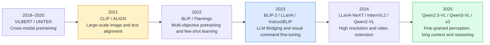

The year is based on the first publication of the paper on arXiv (for example, [BLIP-2](https://arxiv.org/abs/2301.12597) is January 2023, [Qwen2.5-VL Technical Report ](https://arxiv.org/abs/2502.13923) is February 2025]). Directions for streaming video in 2026 see Section 8.13 Mage-VL.

> 🔗 **Expanding into 3D physical space**: As VLM gradually moves from the 2D pixel plane to embodied physical interaction, how to integrate geometric representations such as 3D point cloud, depth and Gaussian Splatting into VLM has become an important technical mainline from 2024 to 2026 (such as 3D-LLM, LLaVA-3D, VGGT, etc.). For the complete system of 3D multimodal large model, please see .

<a id="llm-principles"></a>

# 3. Large language model (LLM) operating principle
{: id="3-大语言模型llm运行原理"}

In Chapter 2, we mentioned that the "reasoning brain" of modern VLM is a pretrained large language model (LLM). All the work of the visual encoder and connection module is ultimately to turn the image into an input that the LLM can "understand". Therefore, before entering the multimodal fusion method, it is necessary to first understand how a pure text LLM works: how the text enters the model, how the model internally calculates, and how the answer is "spit" out word by word. After understanding this "text input → internal calculation → text output" pipeline, it will be very natural to see how visual features are "disguised" as tokens and injected into this pipeline in Chapter 4.

This chapter takes the current mainstream **decoder-only (decoder only) Transformer** as the object, and disassembles it along the data flow direction: word segmentation (3.2), embedding (3.3), Transformer decoder stack (3.4), output layer (3.5), decoding sampling (3.6), autoregressive generation and KV Cache (3.7), and finally explain how this pipeline can be transformed into a multimodal entry (3.8).

## 3.1 The essence of LLM: Autoregressive next word prediction
{: id="31-llm-的本质自回归的下一个词预测"}

Almost all mainstream LLMs today (GPT, LLaMA, Qwen, InternLM, etc.) are **decoder-only autoregressive language models**. There is essentially only one thing it does: **given all the previous words, predict the next word**.

Treating a piece of text as a token sequence $t_1, t_2, \ldots, t_n$, LLM uses the chain rule to decompose the probability of the entire sequence into the product of a series of conditional probabilities of "predicting the next word":

$$P(t_1, t_2, \ldots, t_n) = \prod_{i=1}^{n} P(t_i \mid t_1, t_2, \ldots, t_{i-1})$$

In the training phase, the model is trained on massive amounts of text **Next token prediction** (next-token prediction) as the goal, minimizing the cross-entropy loss; in the inference phase, the model repeatedly executes the cycle of "predict the next token → connect it to the end of the input → predict the next one", this is **autoregressive generation** (autoregressive generation).

The entire text processing pipeline can be summarized as follows:

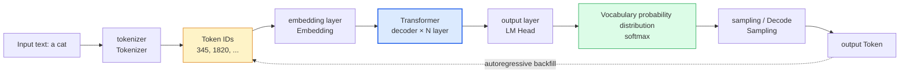

Let’s break down each link in this assembly line piece by piece.

## 3.2 Text input (1): word segmentation Tokenization
{: id="32-文本输入一分词-tokenization"}

Computers cannot directly process text. The first step is to split the string into basic units in the model vocabulary (vocabulary) - **token**, and then map each token to an integer ID. This step is called **word segmentation** (Tokenization).

LLM often uses **subword segmentation** (subword tokenization). Common methods include BPE (Byte-Pair Encoding), byte-level BPE and Unigram; WordPiece is also a common subword method, but these algorithms should not be regarded as variants of BPE. Subword segmentation strikes a balance between "character level" and "word level":

- Common words are used as a complete token (such as English `the`, Chinese common word "cat");
- Rare words are split into several sub-words (such as `tokenization` → `token` + `ization`);
- The vocabulary size is controllable; when using byte-level representation or byte rollback, the problem of out-of-service words (OOV) can be further reduced.

For example, a Chinese phrase meaning “a cat” may be split into three tokens corresponding to the numeral, classifier, and noun. A tokenizer may instead merge the numeral and classifier into one token. This depends on the tokenizer and its vocabulary: character count and token count have no fixed conversion ratio, so context-length estimates should use the target model’s tokenizer.

The tokenizer also inserts several **special token** to mark the structure, such as the beginning of the sentence `<bos>`, the end of the sentence `<eos>`, the filling `<pad>`, and the role tags in the dialogue template (such as `<|user|>`, `<|assistant|>`). **This point is crucial to VLM**: VLM "reserves a seat" for visual features in the sequence by introducing a special image placeholder token (such as `<image>`) (see 3.8 and Chapter 4 for details).

After word segmentation, the input text becomes a string of integer token IDs, such as `[1, 345, 1820, 9, ...]`. This string of integers is the real input sent to the model.

## 3.3 Text input (2): embedding and positional encoding
{: id="33-文本输入二嵌入与位置编码"}

Integer IDs themselves have no semantics and need to be converted to dense vectors first. The model maintains a **embedding matrix** $E \in \mathbb{R}^{V \times d}$ ($V$ is the vocabulary size, $d$ is the hidden dimension), and the embedding vector of the $i$ token is the row obtained by looking up the table in the matrix according to its ID:

$$\mathbf{x}_i = E[\,t_i\,], \quad \mathbf{x}_i \in \mathbb{R}^{d}$$

In this way, the token sequence with length $n$ becomes a matrix of $n \times d$, which is used as the input of Transformer.

Because the self-attention mechanism itself **Not aware of order** (for which the input is an unordered set), you must also explicitly inject **location information** . There are two types of mainstream solutions:

- **absolute position encoding**: Early Transformer/GPT added the learnable or sinusoidal position vector $$\mathbf{p}_i$$ directly to the word embedding, that is, $$\mathbf{x}_i = E[\,t_i\,] + \mathbf{p}_i$$;
- **Rotated Position Encoding (RoPE)**: The mainstream solution of modern LLM (LLaMA, Qwen, etc.) no longer adds, but applies position-related rotation to the query/key vector during attention calculation, so that the attention score naturally encodes the relative position. The effect of RoPE will decrease when directly extrapolated beyond the training length, but combined with position interpolation (PI, NTK-aware, YaRN, etc.), the context can be expanded at a lower cost; it is also easier to generalize to multimodal 2D/3D positions (M-RoPE in VLM is derived from this, see Section 6.3).

## 3.4 Core calculation: Transformer decoder stacking
{: id="34-核心计算transformer-解码器堆叠"}

The input sequence with position information will pass through $L$ **Transformer decoder layers** with the same structure in sequence (typically $L$ from 32 layers of the 7B model to 80 layers of the 70B-level model). Each layer contains two core sub-modules, both equipped with residual connection (residual) and layer normalization (LayerNorm / RMSNorm, modern models mostly use Pre-Norm):

**① Masked Multi-Head Self-Attention**

Attention lets each token "see" other tokens in the sequence based on relevance, and weights and aggregates their information. For query $Q$, key $K$, value $V$:

$$\text{Attention}(Q, K, V) = \text{softmax}\!\left(\frac{QK^\top}{\sqrt{d_k}} + M\right)V$$

Here, $M$ is the **causal mask**: it sets the attention score of each position for the "future" token to $-\infty$, thereby ensuring that the position $i$ can only see the information of $1 \ldots i$. This is the architectural embodiment of "autoregression" - the model will never peek at the answer when predicting the $i$ token. "Multi-head" splits attention into multiple groups of parallel calculations, allowing different heads to focus on different types of dependencies (grammar, reference, long-distance topics, etc.).

**② Feed-Forward Network (FFN)**

The attention is followed by a position-by-position two-layer MLP (modern models commonly use SwiGLU activation), which is responsible for non-linear transformation and "knowledge storage" of each token's representation. FFN usually accounts for most of the parameters of the model. Recent **MoE (hybrid experts)** architectures (such as Qwen3-VL) replace a single FFN with multiple experts and activate them sparsely, thereby greatly expanding parameter capacity without significantly increasing inference computation.

After stacking layer by layer, each position in the sequence gets a final hidden state  $$\mathbf{h}_i^{(L)} \in \mathbb{R}^{d}$$ that integrates all the above semantics. The hidden state $$\mathbf{h}_n^{(L)}$$ at the last position condenses all the information of "what the next word should be given the above conditions."

## 3.5 Text output (1): from hidden state to vocabulary probability
{: id="35-文本输出一从隐状态到词表概率"}

To change the hidden state back to "word", you need to go through the **output layer (LM Head)** - a linear mapping $W_o \in \mathbb{R}^{V \times d}$ (many models let it share weights with the input embedding matrix $E$, called weight tying). It projects the $d$-dimensional hidden state back to the $V$-dimensional **logits** (an unnormalized score for each vocabulary item), and then uses softmax to obtain the probability distribution of the next token:

$$P(t_{i+1} \mid t_1, \ldots, t_i) = \text{softmax}\!\left(W_o\, \mathbf{h}_i^{(L)}\right)$$

The output is a probability vector of length $V$, each dimension corresponding to the probability of "appearing next" of a token in the vocabulary. At this point, the model has completed a complete "forward propagation", turning the input sequence into a probability prediction of the next token.

## 3.6 Text output (2): decoding strategy and sampling
{: id="36-文本输出二解码策略与采样"}

After getting the probability distribution, how to get it from **elect** A specific token, called **decoding** or **Sampling** Strategy. Different strategies make trade-offs between "certainty/quality" and "diversity/creativity":

|Strategy|practice|Features|Applicable scenarios|
|------|------|------|---------|
|**Greedy decoding** Greedy|Get the token with the highest probability at each step|Completely certain, but prone to repetition and monotony|Extractive tasks need to be reproducible|
|**Beam Search** Beam Search|The $k$ candidate sequences with the highest scores are retained at each step.|Expand the search range, but does not guarantee global optimality; the computational cost is high|Machine translation, summarization|
|**Temperature Sampling** Temperature|Sampling after scaling logits by $\tau$|$\tau$ The bigger it is, the more random it is|General conversation, creative writing|
|**Top-k sampling**|Only sample the $k$ tokens with the highest probability|Truncate the long tail and avoid outrageous output|Often used in conjunction with temperature|
|**Top-p (nucleus) sampling** Nucleus|Sampling from the smallest set with cumulative probability $p$|Dynamic number of candidates, taking into account both quality and diversity|Currently the most mainstream|

Here, the **temperature $\tau$** adjusts the "sharpness" of the distribution by scaling logits:

$$P(t) = \frac{\exp(z_t / \tau)}{\sum_{j} \exp(z_j / \tau)}$$

When $\tau \to 0^+$ and the maximum logit is unique, the distribution tends to one-hot, close to greedy decoding; when $\tau > 1$, the distribution is flatter. When using **temperature + Top-p** in combination, a common implementation first scales the logits, and then determines the candidate set and samples according to the resulting probability distribution; the processing order will affect the results and should be subject to the actual inference framework.

## 3.7 Autoregressive generation and KV Cache
{: id="37-自回归生成与-kv-cache"}

Only one token can be predicted in a single forward pass. To generate a complete answer, the model must **autoregressive loop**: connect the just sampled token to the end of the input sequence, go forward again, and predict the next one until the end character `<eos>` is sampled or the upper limit of the length is reached.

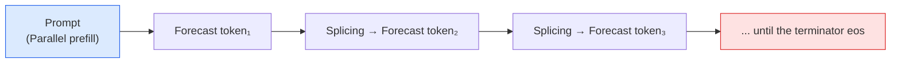

The actual reasoning is divided into two stages:

- **Prefill (prefill)**: Send the entire prompt into the model in parallel at one time, and calculate the hidden state of all positions - this step can be highly parallel and fast;
- **Decode (decoding)**: After that, only one token is added at a time, and it is generated serially step by step - this step is token by token and constitutes the main part of the generation delay.

In a naive implementation, every time a new token is generated, attention must be recalculated for the entire sequence. The amount of calculation increases with the square of the length of the sequence, which is extremely wasteful. **KV Cache** is the key optimization: since the Key/Value of historical tokens under the causal mask will not change due to new tokens, they can be **cache** Up, each step only calculates Q/K/V for the new token once, and then pays attention to the cached historical K/V. This reduces the calculation of each decoding step from "recalculating the entire sequence" to "counting only one token", which is the cornerstone of LLM real-time reasoning.

KV Cache also brings **The conflict between GPU memory and length** . Let the current context length be $n$ , when the model dimensions are fixed, the cache space varies with $n$ Linear growth; after using cache, **The attention of single-step decoding is calculated as $O(n)$** , while the standard full attention prefill is calculated as $O(n^2)$ . generate $m$ tokens, the cumulative attention of decode is calculated to be approximately $O(mn+m^2)$ . Therefore, the added visual tokens of images and videos will simultaneously push up the first token delay, subsequent decoding overhead and cache occupation. See Section 4.6 for compression methods.

## 3.8 From LLM to VLM: How does vision connect to this pipeline?
{: id="38-从-llm-到-vlm视觉如何接入这条流水线"}

The text eventually enters the Transformer as a $d$ dimensional embedding sequence, and the visual features can also be converted into vectors required by this interface. **dimension matching only solves the interface problem, and graphic and text training enables the language model to learn to use visual information.** Take LLaVA’s input splicing route as an example:

1. The **visual encoder** (such as CLIP ViT) encodes the image into a set of patch feature vectors;
2. The **connection module** projects the visual features to the hidden dimensions of the LLM to obtain the continuous **visual token**; BLIP-2 first uses Q-Former to extract the query features and then projects them;
3. These visual tokens replace the `<image>` placeholder reserved in the input sequence, are spliced with the text token **into the same sequence**, and are sent to the Transformer decoder together.

Visual tokens are usually continuous features and are not literal IDs in the tokenizer vocabulary. The model reads them through self-attention and generates text through autoregression. Another route is Flamingo: visual features are kept in independent sequences, read by cross-attention inserted between LLM layers, without having to be spelled into the textual input sequence. The connection method, visual encoder, training data and optimization goals jointly determine the multimodal capabilities.

<a id="vlm-methods"></a>

# 4. Core methods for achieving multimodality
{: id="4-实现多模态的核心方法"}

This chapter organizes methods by design problem, **Sections are not mutually exclusive model categories** : Contrast learning and instruction fine-tuning describe the training goals, Q-Former and cross-attention describe the connection structure, and high-resolution and video processing describe the input representation. Multiple methods can be combined in the same model.

|design dimensions|Main options|Problem solved|reading position|
|---|---|---|---|
|Graphical representation learning|Comparative loss, matching loss, conditional generation loss|How to establish a corresponding relationship between images and text?| 4.1 |
|Visual information access|Inter-layer cross-attention, query compression, linear or MLP projection|Where and with how many tokens do the visual features enter the LLM?| 4.2～4.4 |
|Instructions and output|Fine-tuning of visual instructions, text responses, and image and text generation|What instructions does the model follow and what modalities does it output?| 4.4～4.5 |
|Calculate budget|Parameter freezing, token compression, lightweight backbone|How to reduce training and inference overhead?| 4.6 |
|visual input|Visual encoder, dynamic resolution, timing sampling|How to preserve details, spatial relationships, and sequence of events?| 4.7～4.8 |

## 4.1 Contrastive learning paradigm
{: id="41-对比学习范式"}

Contrastive Learning is currently one of the most successful visual-language pretraining paradigms. The core idea is to keep paired image and text samples close to each other in the embedding space, and to keep unmatched samples away from each other.

**Core Features**:
- It does not rely on manual annotation and can directly use the massive image-text pairs on the Internet.
- The learned visual features have excellent semantics and can be transferred to downstream tasks
- The training goal is simple (InfoNCE loss) and easy to expand on a large scale
- During inference, zero-sample classification is completed by calculating the similarity between images and texts.

*Representative work*: **CLIP** (OpenAI, 2021), **ALIGN** (Google, 2021), **BLIP** (Salesforce, 2022), **SigLIP** (Google, 2023)

### CLIP(Contrastive Language-Image Pre-training)
{: id="clipcontrastive-language-image-pre-training"}

CLIP is the foundational work of the contrastive learning paradigm. OpenAI collected 400 million image-text pairs (WIT data set) from the Internet, trained image encoders (ViT or ResNet) and text encoders (Transformer) respectively, and aligned the visual and language spaces by maximizing the similarity of positive sample pairs and minimizing the similarity of negative sample pairs.

$$\mathcal{L}_{CLIP} = -\frac{1}{N}\sum_{i=1}^{N}\log\frac{\exp(\text{sim}(v_i, t_i)/\tau)}{\sum_{j=1}^{N}\exp(\text{sim}(v_i, t_j)/\tau)}$$

The above formula only writes the image to text direction; the complete CLIP target also includes the text to image direction and averages the two. For details, see Section 8.2 and [CLIP original paper ](https://arxiv.org/abs/2103.00020).

The biggest breakthrough of CLIP is **zero-sample transfer**: by embedding the category name as a text prompt (such as "a photo of a dog"), it can achieve close to supervised learning performance on benchmarks such as ImageNet without any fine-tuning.

<div align="center">
  
<figcaption> Figure: CLIP comparison pretraining framework (Source: OpenAI)</figcaption>
</div>

**SigLIP** (Sigmoid Loss for Language-Image Pre-Training) replaces softmax contrast loss with pairwise sigmoid loss, cancels softmax normalization across image and text pairs, and facilitates block calculation; it still uses negative samples, and the construction of cross-device negative samples may still require communication. See [SigLIP original paper ](https://arxiv.org/abs/2303.15343).

---

### BLIP(Bootstrapping Language-Image Pre-training)
{: id="blipbootstrapping-language-image-pre-training"}

BLIP proposed the **multi-objective joint pretraining** framework to simultaneously optimize three objectives:
- **ITC** (Image-Text Contrastive): Comparison and alignment, inheriting the CLIP idea
- **ITM** (Image-Text Matching): Determine whether the image and text match (two categories)
- **ITG** (Image-grounded Text Generation): Generate text based on images

BLIP also introduced the **CapFilt** (Caption Filtering) mechanism: using existing models to generate pseudo-captions for noisy network data, and then filtering low-quality samples to achieve data bootstrapping - improving the effect of very large-scale noisy data with less high-quality data.

<div align="center">
  
<figcaption> Figure: BLIP multi-objective pretraining framework - joint optimization of the three objectives of ITC, ITM and ITG (Source: Salesforce Research)</figcaption>
</div>

---

## 4.2 Cross-modal attention fusion
{: id="42-跨模态注意力融合"}

Cross-modal Attention achieves deep integration of the two modalities by allowing text tokens to "attend" to visual features, or letting visual features focus on text. This approach allows the model to dynamically integrate information from both modalities at each level of inference.

**Core Features**:
- Deep fusion, vision and language interact with each other during feature extraction at each layer
- Strong ability to capture visual details, suitable for fine reasoning
- Large number of parameters, but supports powerful multimodal context modeling
- Scalable to few-shot visual language learning

*Representative work*: **Flamingo** (DeepMind, 2022), **ViLBERT** (2019), **UNITER** (2020), **CoCa** (Google, 2022)

### Flamingo
{: id="flamingo"}

Flamingo is an early milestone in successfully extending large-scale language models into strong multimodal models. Its core design contains two key modules:

**Perceiver Resampler (perceptual resampler)**: compresses any number of image features at any resolution into a fixed number (such as 64) of visual tokens, solving the interface problem between variable length visual input and fixed format language models.

**Gated Cross-Attention (gated cross-attention layer)**: Insert a new cross-attention layer between the frozen LLM layers so that language tokens can pay attention to visual tokens. The gating mechanism (tanh gating) ensures that newly inserted layers in the early stages of training do not destroy the original LLM capabilities.

$$y = y_{LLM} + \tanh(\alpha) \cdot \text{CrossAttn}(y_{LLM}, X_{visual})$$

Flamingo freezes the original LLM parameters and only trains the Perceiver Resampler and Cross-Attention layers, achieving efficient multimodal expansion and achieving breakthrough performance on few-shot visual question answering tasks.

<div align="center">
  
<figcaption> Figure: Flamingo cross-modal attention architecture (Source: DeepMind)</figcaption>
</div>

---

## 4.3 Q-Former bridging paradigm
{: id="43-q-former桥接范式"}

Q-Former (Querying Transformer) is an innovative connection module proposed by BLIP-2. It uses a set of learnable **query vectors (Query Tokens)** as the "information bottleneck" between vision and language to extract the visual features most relevant to language and then pass them to the language model.

**Core Features**:
- Refining a large number of visual patch features with a small number of fixed query tokens (usually 32)
- Query tokens communicate with each other through self-attention, and visual information is extracted through cross-attention.
- Any visual encoder and any LLM can be connected at the same time, which has the advantage of modularity
- Training is divided into two stages, first aligning vision-language, and then adapting to generative LLM

*Representative work*: **BLIP-2** (Salesforce, 2023), **InstructBLIP** (Salesforce, 2023)

### BLIP-2
{: id="blip-2"}

BLIP-2 bridges the visual encoder (frozen EVA-CLIP ViT-g/14) and large language model (frozen OPT or Flan-T5) through Q-Former to achieve low-cost multimodal alignment. Q-Former contains two Transformer modules that share a self-attention layer: one interacts with the visual encoder (image Transformer) and the other interacts with the language target (text Transformer).

**two-stage training**:
1. **Visual-Language Representation Learning**: Jointly optimize the three goals of ITC+ITM+ITG to enable Q-Former to learn to extract language-related visual features from images
2. **Vision-Language Generation Learning**: Project the visual query token output by Q-Former and splice it into the LLM input, and fine-tune Q-Former to align it with the LLM semantic space

Q-Former only has 188M parameters, but it can effectively "compress" complex visual information, greatly reducing the computational cost of visual-language joint fine-tuning.

<div align="center">
  
<figcaption> Figure: BLIP-2 overall architecture - the frozen visual encoder and LLM are bridged through Q-Former (Source: Salesforce Research)</figcaption>
</div>

### InstructBLIP
{: id="instructblip"}

InstructBLIP introduces the **instruction-aware (instruction-aware)** Q-Former based on BLIP-2: inputting text instructions into the Q-Former allows the query token to dynamically extract the most relevant features from the image based on the instructions of the current task, rather than extracting fixed universal features. This improvement significantly improves the model's generalization ability to different task instructions.

---

## 4.4 Fine-tuning of visual instructions
{: id="44-视觉指令微调"}

Visual Instruction Tuning is the most influential VLM training paradigm since 2023. The core idea is to use dialogue data in the triplet format (image, instruction, answer) to perform supervised fine-tuning on the vision-language model, so that the model can follow diverse vision-related instructions.

**core features**:
- Unifying image understanding tasks into a conversational Q&A format
- Automatically construct high-quality instruction data using strong language models such as GPT-4
- Simplified architecture: usually only a linear projection layer (MLP) is used to connect the visual encoder to the LLM
- The open source ecosystem is prosperous, and the LLaVA series has led a lot of follow-up work

*Representative work*: **LLaVA** (2023), **LLaVA-1.5** (2023) ), **LLaVA-NeXT** (2024), **MiniGPT-4** (2023)

### LLaVA(Large Language and Vision Assistant)
{: id="llavalarge-language-and-vision-assistant"}

LLaVA proposes a minimalist and effective fine-tuning framework for visual instructions:

1. **architecture**: Using CLIP ViT-L/14 as the visual encoder, visual features are mapped to the word embedding space of LLM (Vicuna/LLaMA) through a **linear projection matrix W**. The visual token and text token are directly spliced and input into LLM
2. **data construction**: Using GPT-4 (plain text version), multiple rounds of dialogue data, detailed descriptions and complex reasoning questions were generated based on the subtitles and bounding box information of the image, and approximately 158K instruction data were constructed
3. **Two-stage training**: first pretrain the projection layer (freeze encoder and LLM), and then fine-tune the projection layer + LLM end-to-end

$$H_v = W \cdot Z_v, \quad Z_v = f_{CLIP}(X_v)$$

<div align="center">
  
<figcaption> Figure: LLaVA visual command fine-tuning framework (Source: LLaVA project)</figcaption>
</div>

### LLaVA-1.5 with High Resolution Extension
{: id="llava-15-与高分辨率扩展"}

LLaVA-1.5 upgrades the linear projection to **two-layer MLP** and introduces a higher-resolution visual encoder (CLIP ViT-L/14 @ 336px), significantly surpassing the original LLaVA on multiple benchmarks while still maintaining a simple architecture.

**LLaVA-NeXT (LLaVA-1.6)** further introduces **dynamic high-resolution** technology: The high-resolution image is divided into multiple small blocks (tiles), each block is encoded separately and then spliced, while retaining the overall low-resolution view, which effectively improves the ability to understand text (OCR), details, and graphics without retraining the visual encoder.

---

## 4.5 Multimodal understanding and unified generation
{: id="45-多模态理解与统一生成"}

"Generative VLM" and "unified understanding and generation model" need to be distinguished: the former can read images and generate text answers, but may not necessarily generate images; the latter further supports the generation of visual content.

|range|input and output|representative work|Key differences|
|---|---|---|---|
|Multimodal understanding and text generation|Image, video and text input → text or structured results| LLaVA, Qwen2.5-VL, InternVL2 |Continuous visual features are used as conditions to output text tokens|
|Unified image and text understanding and generation|Graphic input → text or image| Chameleon, Janus / Janus-Pro, Show-o |Requires additional visual representation and image decoding mechanisms|

“Native multimodality” also doesn’t mean canceling the visual encoder or training all weights from scratch. When comparing models, the input representation, fusion location, training process and output modality should be specifically viewed; the internal structure of the closed-source model is only described according to public information.

### Gemini
{: id="gemini"}

Google DeepMind's Gemini series is a representative of native multimodal models. From the beginning, multimodality is the core design goal, rather than transforming LLM into a multimodal model. Gemini can seamlessly process text, images, audio, video and code. Each modality has a dedicated encoding module and joint modeling through a unified Transformer backbone.

Gemini 1.5 introduces the **million-token context window**, which enables it to handle ultra-long documents and long videos (can handle videos up to 1 hour), setting a new milestone in long-context multimodal understanding.

### Input and structure of Qwen2.5-VL
{: id="qwen25-vl-的输入与结构"}

Qwen2.5-VL is a high-performance open source VLM launched by Alibaba. It has several innovations in multimodal processing technology:

**Native Dynamic Resolution (Native Dynamic Resolution)**: Adjust the input according to the image width, height and pixel budget to avoid pressing all images to the same fixed size; the actual preprocessing will still scale and adjust the width and height to a multiple of 28, and the visual encoder uses 2D-RoPE to represent the spatial position.

**Window Attention (Window Attention)**: Introduce window attention into the visual encoder to reduce the calculation amount of large-resolution images.

**Timing-aware video understanding**: MRoPE in the language model aligns the position ID of the time dimension with the absolute time of the frame, and cooperates with dynamic frame rate sampling; videos with different FPS therefore share a consistent time scale.

**Qwen2.5-VL-72B document and OCR evaluation excerpt** (technical report Table 5, compare with the same table):

|benchmark| Qwen2.5-VL-72B | GPT-4o | Claude-3.5 Sonnet | InternVL2.5-78B |
|------|----------------|--------|-------------------|---------------|
| DocVQA(test) | **96.4** | 91.1 | 95.2 | 95.1 |
| ChartQA(test Avg.) | 89.5 | 86.7 | **90.8** | 88.3 |
| OCRBench | **885** | 736 | 788 | 854 |

These results need to be interpreted in conjunction with the evaluation version and input configuration. Qwen2.5-VL still uses the modular architecture of **ViT + MLP merger + Qwen2.5 LLM**; dynamic resolution is an input processing mechanism, which does not mean canceling the connection module, nor does it mean supporting image generation. For the structure and experimental settings, please refer to [Qwen2.5-VL technical report ](https://arxiv.org/html/2502.13923v1).

### Full modality and inference enhancement: GPT-4o, o3 and Gemini 2.5
{: id="全模态与推理增强gpt-4oo3-与-gemini-25"}

GPT-4o, o3 and Gemini 2.5 are often used as commercial model references for multimodal interaction or reasoning evaluation, but their visual fine-tuning process cannot be inferred based on the output effects alone. When understanding this type of model, one should distinguish **Whether the perception is accurate, the reasoning is valid, and the tool call is reliable** ;Longer inference processes cannot compensate for the visual details lost during the input stage. The specific training mechanism of the open source model can be explained in conjunction with Section 8.10 Qwen3-VL.

### Decoupled architecture that unifies understanding and generation: Janus / Janus-Pro and Chameleon
{: id="统一理解与生成的解耦架构janus--janus-pro-与-chameleon"}

Traditional unified multimodal generation models (such as early Emu or GILL) often face **feature representation conflicts** when unifying "image understanding" and "image generation":
- **Understanding task (Understanding)**: High-level, abstract and semantically dense continuous feature representation (such as continuous vectors extracted by SigLIP / CLIP encoder) is required to ignore pixel-level noise and capture global semantics;
- **Generation task (Generation)**: requires fine-grained, low-abstraction and pixel-fidelity discrete Tokens (such as VQ-VAE / VQ-GAN discrete codebooks) or continuous Gaussian latent variables in order to reconstruct fine textures and spatial structures.

If a single visual encoder is forced to be used for both understanding and generation, it will easily lead to "degradation of understanding" or "rough quality of generated images."

**Janus (2024) and Janus-Pro (2025)** adopt **decoupled visual encoding (Decoupled Visual Encoding)**: understanding and generation use different visual representations and share the backbone of the language model. See [Janus](https://arxiv.org/abs/2410.13848) and [Janus-Pro](https://arxiv.org/abs/2501.17811).

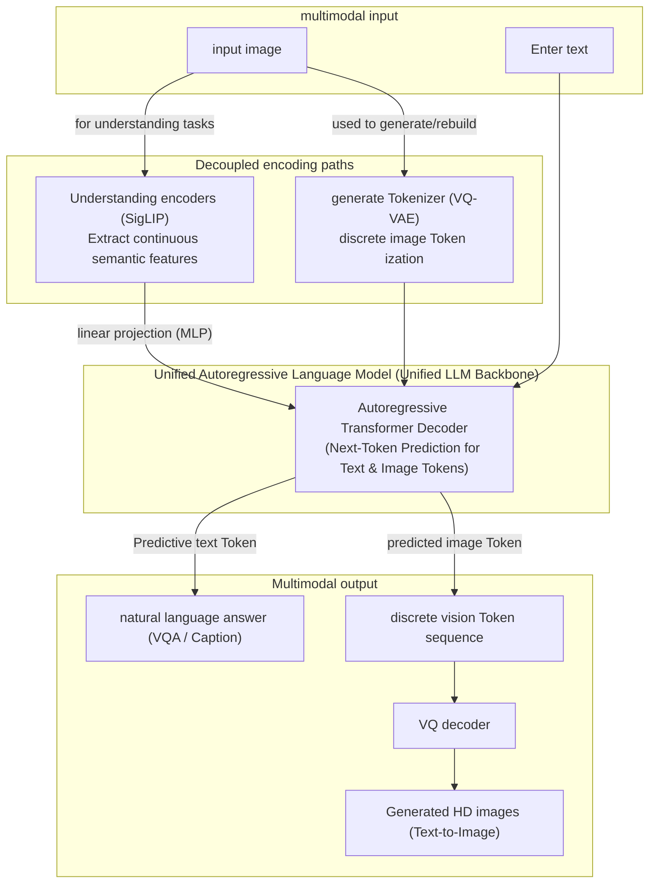

**Janus-Pro’s core advantages**:
1. **decouples the input path and retains a unified Transformer**: The understanding task uses the SigLIP encoder to map continuous features, and the generation task uses the discrete VQ Tokenizer; the unified autoregressive language model does not need to modify the backbone structure, and only uses the standard Next-Token prediction loss.
2.  **Taking into account both types of goals** : Optimize the visual representation required for understanding and generation respectively; the advantages of a single benchmark should not be directly extrapolated to the advantages of image quality or understanding ability in all scenarios.
3. **is compared with other routes**: [Chameleon](https://arxiv.org/abs/2405.09818) uses early fusion and autoregressive modeling of discrete image tokens and text tokens; [Show-o](https://arxiv.org/abs/2408.12528) combines autoregressive modeling and discrete diffusion. Both will be revealed in 2024 and should be compared as different design routes rather than described as follow-ups to Janus-Pro.

---

## 4.6 Efficient multimodal alignment method
{: id="46-高效多模态对齐方法"}

As the number of VLM parameters continues to increase, how to achieve high-quality multimodal alignment with lower computational cost has become an important research direction.

**Core Features**:
- Freeze most of the pretraining weights and only fine-tune a few parameters
- Bridging the semantic gap between vision and language through carefully designed alignment modules
- Efficiently utilize existing knowledge of visual encoders and LLMs

*Representative work*: **MiniGPT-4** (KAUST, 2023), **mPLUG-Owl** (Alibaba Damo Academy, 2023), **Otter** (Nanyang Polytechnic, 2023)

### MiniGPT-4
{: id="minigpt-4"}

MiniGPT-4 proves the feasibility of the minimalist alignment solution: only one **linear projection layer** is used to connect the frozen BLIP-2 visual encoder (including Q-Former) and the frozen Vicuna (LLaMA fine-tuned version), through two stages of training - first large-scale alignment pretraining, and then using about 3500 Fine-tune instructions using selected graphic descriptions - demonstrating in qualitative examples the ability to describe in detail, read pictures and write code, etc. similar to GPT-4 demonstrations (the paper does not provide a quantitative comparison with GPT-4). The paper also observed that when only the first stage is performed, the output often appears repetitive and incoherent, but a small amount of high-quality second-stage data can be significantly improved, indicating that the quality of the instruction data has a great impact on the usability of the generation.

### Visual Token Compression
{: id="视觉-token-压缩"}

The number of visual tokens directly determines the inference cost of VLM, and compression technology is the key to efficiency:

|method|Principle|Compression ratio|representative model|
|------|------|--------|---------|
| Pixel Shuffle |Rearrange adjacent $r \times r$ tokens to the channel dimension and then project|$r^2$:1 (4:1 for InternVL2, 9:1 for SmolVLM)| InternVL2, SmolVLM |
| TokenPacker |Cross-attention extracts a small number of high semantic tokens from dense features|variable| TokenPacker(2024) |
|average pooling|Average adjacent tokens|variable| LLaVA-HD |
| Q-Former |Fixed 32 Query Tokens to extract all visual information|High magnification| BLIP-2, InstructBLIP |

### Lightweight VLM and device-side deployment
{: id="轻量化-vlm-与端侧部署"}

With the rapid growth of demand for end-side deployment (mobile phones, edge devices), achieving competitive multimodal understanding under extremely low parameter quantities has become a hot topic. **SigLIP visual encoder** (sigmoid loss is better than softmax contrast loss in smaller batches, see Section 8.6) is one of the most common visual backbones of lightweight VLM:

- **SmolVLM** (HuggingFace, 2024–2025): 256M / 500M / 2.2B third level, SigLIP + radical Pixel Shuffle (each 384×384 subimage is only encoded as 81 tokens), version 2.2B DocVQA 81.6, TextVQA 72.7 ([Official Blog ](https://huggingface.co/blog/smolvlm)]
- **Phi-3.5-Vision** (Microsoft, 2024): ~4.2B parameters (3.8B language model + CLIP ViT-L), trading high-quality synthetic data with curated SFT data for small model inference and OCR capabilities
- **MobileVLM V2** (2024): Designed for mobile phones, using lightweight downsampling projector (LDP) to compress visual tokens and enabling real-time inference on mobile CPU/GPU
- **moondream2** (2024): ~1.86B parameters, can run locally on low-power devices
- **MoE-LLaVA** (2024): Sparse activation hybrid expert structure, about 3B activation parameters reach a level comparable to LLaVA-1.5-7B
- **Gemma 3** (Google, 2025): 4B / 12B / 27B three levels support image input, using SigLIP encoder + Pan & Scan to process non-square and high-resolution images

The evaluation scores of end-side models are particularly sensitive to resolution, tile number and prompt template. Cross-model comparisons should be based on the results of re-running the same evaluation framework (such as VLMEvalKit, lmms-eval).

### Visual Embedding Tables: Structured Alignment for Ovis
{: id="视觉嵌入表ovis-的结构化对齐"}

**Ovis** (AIDC-AI) focuses on the connection module itself: the text token of LLM obtains the vector by looking up the embedding table, while the ordinary MLP projection directly outputs continuous visual features, and the two structures are asymmetric. Ovis also introduces a learnable **visual embedding table** for the visual side: the visual patch is first mapped to a probability distribution on the "visual word list", and then the embedding table is weighted and summed according to the probability to obtain a visual token consistent with the text embedding structure. Ovis2-34B is composed of aimv2-1B visual encoder and Qwen2.5-32B-Instruct. It also reuses pretraining LLM and undergoes multi-stage training; its difference from LLaVA and Qwen-VL lies in the way of generating visual tokens, not in whether to reuse LLM.

---

## 4.7 Visual feature extraction: Evolution of ViT and visual encoders
{: id="47-视觉特征提取vit与视觉编码器的演进"}

The prerequisite for achieving high-quality multimodal fusion is powerful visual representation. The design of visual encoders in VLM has experienced a major transformation from early CNN regional feature extraction to Transformer global feature modeling, to large-scale contrastive learning and dynamic high-resolution adaptation.

<div align="center">
  
<figcaption> Figure 4.7.1: The evolution of VLM visual encoder: from CNN regional features to ViT, to contrastive learning alignment and dynamic high-resolution scheme</figcaption>
</div>

**core evolution route**:
- **CNN era** (2018-2020): Represented by ResNet and EfficientNet, sliding convolution is used to extract grid or area features, and then spliced with the text encoder. Features are partial and difficult to adapt to long sequence Transformer.
- **ViT era** (2021-2022): Divide images into patch sequences, use Transformer for end-to-end encoding, and unify vision and NLP architectures into sequence processing tasks.
- **CLIP / SigLIP Contrastive Learning Era** (2021 to present): By conducting contrastive learning training on large-scale image and text pairs (such as LAION), ViT has natural language alignment properties and becomes the mainstream visual encoder of modern VLM.
- **Pure visual self-supervision route** (2021 to present): Represented by DINO and DINOv2, it gets rid of language annotation bias and learns patch features with high spatial consistency through self-distillation and mask reconstruction, which is suitable for positioning and dense prediction.
- **High-resolution and dynamic slicing era** (2023-present): Supports dynamic encoding schemes (such as AnyRes, Naive Dynamic Resolution) with arbitrary aspect ratios and high-resolution input to retain fine-grained documents and OCR information.

### How Vision Transformer (ViT) works
{: id="vision-transformervit工作原理"}

ViT subverts the traditional convolutional neural network structure and directly applies the Transformer architecture to image processing. Its core is to discretize continuous images into Token sequences, which is highly consistent with the Tokenization processing of text:

1. **Patch segmentation and linear projection**:
For the input image $$x \in \mathbb{R}^{H \times W \times C}$$, first split it into a series of non-overlapping two-dimensional image blocks $$\mathbf{x}_p \in \mathbb{R}^{N \times (P^2 \cdot C)}$$, where $$(P, P)$$ is the set image block resolution (such as $14 \times 14$ or $16 \times 16$), and $$N = HW/P^2$$ is the final generated sequence length (i.e. Patch quantity).
Subsequently, each patch is mapped into a $D$-dimensional vector feature through a learnable linear projection matrix $$E \in \mathbb{R}^{(P^2 \cdot C) \times D}$$.

2. **position code and category mark (Class Token)**:
Similar to BERT's design, ViT will splice a learnable class token (Class Token) $$x_{cls} \in \mathbb{R}^{1 \times D}$$ before forward propagation, and its final output state can be directly used for whole-image classification or global semantic representation.
Since Transformer's self-attention mechanism does not have spatial direction awareness, one-dimensional or two-dimensional learnable position encoding $$E_{pos} \in \mathbb{R}^{(N+1) \times D}$$ must be added to preserve the spatial relative relationship of each image patch.

The mathematical expression of the initialization of the entire sequence is:
   $$z_0 = [x_{cls}; x_1^p E; x_2^p E; \ldots; x_N^p E] + E_{pos}$$

3. **multi-layer Transformer encoding**:
The input sequence $$z_0$$ undergoes multi-layer standard Multi-Head Self-Attention (MHSA) and MLP (Multi-Layer Perceptron) calculations, and each layer is accompanied by Layer Normalization (LN) and Residual Connection.

Most of the visual encoders of mainstream VLM are ViT trained under CLIP or SigLIP targets: LLaVA series uses CLIP ViT-L/14 (about 304M parameters), PaliGemma and Qwen3-VL use SigLIP / SigLIP 2 So400m (about 400M), BLIP-2 uses EVA-CLIP ViT-g/14 (about 304M parameters) 1B).

### CLIP and SigLIP visual encoder: image and text comparison and alignment paradigm
{: id="clip-与-siglip-视觉编码器图文对比对齐范式"}

Why will ViT trained by contrastive learning become the absolute mainstream of VLM? Because **in contrastive learning, the visual features have been "verbalized"**.

#### 1. CLIP Contrastive Loss
{: id="1-clip-对比损失-contrastive-loss"}
CLIP (Contrastive Language-Image Pretraining) adopts a dual-tower structure (image encoder and text encoder) and uses the symmetric InfoNCE loss function for pretraining. In a Batch containing $B$ image-text pairs, the model minimizes the distance between paired images and texts, and maximizes the distance between unpaired images and texts:

$$L_{\text{InfoNCE}} = -\frac{1}{2B} \sum_{i=1}^{B} \left( \log \frac{\exp(\text{sim}(I_i, T_i)/\tau)}{\sum_{j=1}^{B} \exp(\text{sim}(I_i, T_j)/\tau)} + \log \frac{\exp(\text{sim}(I_i, T_i)/\tau)}{\sum_{j=1}^{B} \exp(\text{sim}(I_j, T_i)/\tau)} \right)$$

Here, $$sim(I_i, T_i)$$ represents the cosine similarity of the global projection feature of image $i$ and text $i$, and $$\tau$$ is a learnable temperature parameter. CLIP directly supervises the matching of image-level and text-level representations, and does not explicitly provide patch-by-patch and word-by-word corresponding labels.

#### 2. Sigmoid loss optimization for SigLIP
{: id="2-siglip-的-sigmoid-损失优化"}
Although CLIP has achieved great success, Softmax normalization requires the calculation of the global denominator, and common implementation requires all-gathering features across multiple cards and constructing a complete $B \times B$ similarity matrix. **SigLIP (Sigmoid Language-Image Pretraining)** used by models such as PaliGemma proposes to use Sigmoid loss instead of Softmax to transform contrastive learning into a pairwise binary classification task:

$$L_{\text{SigLIP}} = -\frac{1}{B} \sum_{i=1}^{B} \sum_{j=1}^{B} \log \sigma \left( y_{ij} (\text{sim}(I_i, T_j) \cdot c + b) \right)$$

Here, $$y_{ij} = 1$$ if and only if $i=j$ (positive sample pair), otherwise $$-1$$; $$c, b$$ is a learnable scaling and bias parameter.
- Advantages of **SigLIP**: There is no need to perform softmax normalization on all image and text pairs, and the loss is easier to calculate in blocks, reducing the related GPU memory and synchronization burden. It still requires negative samples and gradient synchronization; the effect is also affected by training data, batch and model size, and cannot be attributed solely to the loss function.

### InternViT and large-scale visual encoder scaling (Scaling)
{: id="internvit-与大尺度视觉编码器缩放-scaling"}

As large language models scale to tens or even hundreds of billions of parameters, do visual encoders also need to scale up simultaneously? The starting point of InternVL is that the difference between ViT-L with about 300M parameters and 70B-level LLM is two orders of magnitude in parameter scale, which may become a characterization bottleneck.

The InternVL series therefore extends the visual encoder to **InternViT-6B** (~5.9B parameters, ~5.5B after cutting off the last 3 layers from InternVL 1.5), while retaining **InternViT-300M** For small and medium-sized models:
- **Stronger fine-grained representation**: A larger visual encoder has more obvious benefits on tasks that require details such as documents, charts, and dense text; InternViT-6B is also stronger on pure visual tasks such as ImageNet linear detection and ADE20K segmentation.
- **representation can be reused between different LLMs**: InternVL2.5 first lets ViT train jointly with a smaller LLM, and then connects it to a larger LLM to continue training without retraining ViT (progressive scaling, see Section 6.4).
- **cost**: 6B visual encoder significantly increases the cost of inference; Qwen2.5-VL (about 675M ViT) and Qwen3-VL (SigLIP 2 So400m) show that strong results can be achieved by relying on data and training recipes rather than simply amplifying ViT. There is no generally accepted optimal ratio between visual encoder size and LLM size.

### High resolution and dynamic tiling scheme (Any-Resolution)
{: id="高分辨率与动态切片方案-any-resolution"}

Traditional ViT fixedly scales the input image to a single resolution (such as $224 \times 224$ or $336 \times 336$), but this severely destroys the aspect ratio and causes small text in highly fine-grained images (such as tables, web page screenshots, PDF documents) to be completely blurred. In order to solve the contradiction between high-resolution input and Transformer computational complexity, the industry has evolved the following mainstream solutions:

#### 1. NaViT (Patch n' Pack)
{: id="1-navit-patch-n-pack"}
NaViT breaks the tradition that images must be of a fixed size. It supports the direct input of images with any resolution and aspect ratio, packs patches cut out of images of different sizes into a fixed-length sequence of the same Batch, and applies Mask in Transformer's self-attention calculation to prevent cross-image information leakage.

#### 2. LLaVA-NeXT dynamic slicing (AnyRes)
{: id="2-llava-next-动态切片-anyres"}
LLaVA-NeXT adopts a more intuitive **image slicing (Image Tiling)** strategy:
- According to the original aspect ratio of the image, dynamically calculate the most matching slice grid (such as $1 \times 2$, $2 \times 2$, $3 \times 1$, etc., each sub-slice size is fixed to $336 \times 336$).
- Cut the image into $N$ local sub-images, and scale the original image into a global thumbnail (Thumbnail) of $336 \times 336$.
- These $N+1$ sub-images are simultaneously sent to the same shared ViT visual encoder to extract features.
- In the fusion stage, the features of each local sub-image are spliced together according to their relative spatial positions (usually a special `<newline>` token is inserted at the end of the sub-image line to help LLM identify line breaks), and then spliced with the global thumbnail features and input into the Connector together.

#### 3. Qwen2-VL / Qwen2.5-VL Dynamic Resolution (Naive Dynamic Resolution)
{: id="3-qwen2-vl--qwen25-vl-动态分辨率-naive-dynamic-resolution"}
The Qwen series does not cut tiles, but lets ViT directly process the entire variable-size image:
- **is directly tokenized into** according to the original proportion: the image is scaled to an integer multiple of 28 in width and height within the pixel budget, and then cut into patches of $14 \times 14$. The number of tokens changes with the image area; no additional thumbnails are spliced.
- **Two-level position encoding**: ViT uses 2D-RoPE internally to represent the row and column positions of patches, so it does not rely on fixed-size absolute position encoding; after entering LLM, M-RoPE is used to split the position into three components: time, height, and width (see Section 6.3).
- **Token compression (Patch Merger)**: ViT then uses "normalization layer + two layers of MLP" to merge adjacent $2 \times 2$ visual tokens into one, reducing the number of visual tokens on the LLM side to 1/4 of the number of patches.

<div align="center">
  
<figcaption> Figure 4.7.2: Schematic diagram of ViT dynamic slicing and Token splicing mechanism at any resolution</figcaption>
</div>

### DINOv2: Another route to pure visual self-supervision
{: id="dinov2纯视觉自监督的另一条路线"}

CLIP/SigLIP training visual encoders with linguistic supervision, [DINOv2 ](https://arxiv.org/abs/2304.07193) (Meta, TMLR 2024) then **No text is used throughout the process** : The student network learns to match the output of the EMA teacher network on different cropped views (image-level DINO loss + patch-level masked iBOT loss) and is trained on a selection of 142 million images (LVD-142M). The characteristics of the two routes have different emphases:

|Dimensions|CLIP / SigLIP class encoder| DINOv2 |
|---|---|---|
|supervisory signal|Picture and text matching|The image itself (self-distillation + mask modeling)|
|good at|Zero-shot classification, image and text retrieval, and LLM semantic docking|Intensive tasks such as segmentation, depth estimation, and corresponding point matching|
|Usage in VLM|Mainstream single visual encoder|Used in conjunction with language-aligned encoders to supplement spatial details|

In the ADE20K segmentation experiment with frozen features + linear heads, DINOv2 ViT-g/14 reached 49.0 mIoU, and OpenCLIP ViT-G/14 with a larger number of parameters was 39.3. This shows that the patch features obtained by image and text comparison targets are not necessarily suitable for dense prediction. Therefore, work such as Cambrian-1 integrates DINOv2 and SigLIP features. Training details and complete experiments are provided in Section 8.11, and its successor DINOv3 in Section 8.12.

---

## 4.8 Video Understanding: Expanding to the Time Series Dimension
{: id="48-视频理解向时序维度扩展"}

Video understanding requires the model to simultaneously process **spatial visual content** (image per frame) and **temporal dynamic information** (changes between frames), which is an important frontier direction for VLM capability expansion.

**Core Challenge**:
- **Token explosion**: A 10-second video (3fps) has about 30 frames, and each frame has 256~1024 tokens, totaling thousands to tens of thousands of tokens, which is far beyond the efficient processing range of LLM
- **Temporal reasoning**: The model needs to understand cross-frame semantics such as action sequence, causality, motion trajectory, etc.
- **Long video understanding**: Videos of several minutes or even hours place extremely high demands on memory and retrieval mechanisms

**VideoLLaMA2** (Ali Damo, 2024) introduces **Spatiotemporal Convolution Connector**: Apply 3D convolution (time × height × width) to the ViT features of continuous frames while modeling the frame The internal spatial structure and temporal changes between frames are down-sampled to control the number of video tokens. It has improved compared to the 7B video model of the same period on benchmarks such as MVBench (temporal reasoning) and EgoSchema (first-person long video understanding).

**LongVA** (2024) proposed **long context transfer** (long context transfer): first use only plain text to expand the context of Qwen2-7B-Instruct to 224K, and then do conventional image alignment training. About 2000 frames can be processed without long video training data. , more than 200,000 visual tokens; the paper also proposes a visual needle-in-a-haystack test V-NIAH ([arXiv:2406.16852](https://arxiv.org/abs/2406.16852)).

**Qwen2.5-VL** supports long videos with MRoPE aligned to absolute time and dynamic frame rate sampling; **Qwen3-VL** uses explicit text timestamps instead with Interleaved MRoPE, reaching 256K native contexts (within 30 minutes of video Needle-in-a-Haystack 100% accuracy, see Section 8.10).

**mainstream video understanding benchmark** (scores are taken from [Qwen2.5-VL technical report ](https://arxiv.org/abs/2502.13923) Table 8, compare with the same table):

|benchmark|Video length|Main tasks| Qwen2.5-VL-72B | GPT-4o | Gemini 1.5 Pro |
|------|---------|---------|------|------|------|
|Video-MME (without subtitles/with subtitles)|11 seconds to 1 hour|Comprehensive understanding of short, medium and long videos| 73.3 / 79.1 | 71.9 / 77.2 | **75.0 / 81.3** |
| MVBench |Mainly short films in seconds|20 types of temporal action reasoning| **70.4** | 64.6 | 60.5 |
| EgoSchema |about 3 minutes|first person long term reasoning| **76.2** | 72.2 | 71.2 |
| LVBench |Approximately 1 hour on average|Super long video understanding| **47.3** | 30.8 | 33.1 |
| MLVU |3 minutes to 2 hours|Long video multitasking| **74.6** | 64.6 | — |

# 5. VLM task type
{: id="5-vlm-任务类型"}

Common VLM tasks are listed below in "input-output" format. The first six categories are mainly based on single-round perception and understanding, while GUI Agent requires the model to make continuous decisions in the environment.

## 5.1 Image Captioning
{: id="51-图像描述image-captioning"}

Given an image, generate a natural language description. It is the most basic visual generation task and one of the common pretraining goals of VLM training.

*Representative Dataset*: COCO Captions, nocaps, Flickr30k

## 5.2 Visual Question Answering (VQA)
{: id="52-视觉问答visual-question-answering-vqa"}

Given an image and a question, output the answer. It is divided into two forms: open (generative) and closed (categorical).

*Representative Dataset*: VQA v2, OK-VQA, GQA, ScienceQA

## 5.3 Visual Reasoning
{: id="53-视觉推理visual-reasoning"}

The model is required to perform multi-step reasoning on images, such as counting, spatial relationship judgment, causal inference, etc.

*Representative datasets*: NLVR2, CLEVR, MMStar, MMBench

## 5.4 Visual grounding (Visual Grounding/Referring Expression Comprehension)
{: id="54-视觉定位visual-grounding--referring-expression-comprehension"}

Locate a target region in the image based on a natural language description (usually outputting a 2D bounding box $$[x_1, y_1, x_2, y_2]$$).

*Representative Dataset*: RefCOCO, RefCOCO+, Visual7W

> 📌 **Advanced extension (3D visual grounding)**: In robot control and embodied interaction scenarios, visual grounding has been further expanded to three-dimensional point cloud and 3D space oriented bounding box ($$[x, y, z, dx, dy, dz, r, p, y]$$). For related representative benchmarks (ScanRefer, EmbodiedScan) and 3D positioning models, see  for details.

## 5.5 Document/Chart Understanding
{: id="55-文档与图表理解document--chart-understanding"}

Understanding complex document images containing text, tables, and charts has been a key direction in improving VLM capabilities in recent years.

*Representative datasets*: DocVQA, ChartQA, TextVQA, OCRBench

## 5.6 Image-Text Retrieval
{: id="56-图文检索image-text-retrieval"}

Retrieving relevant text given an image (or vice versa) is a core application scenario of the contrastive learning paradigm.

*Representative Dataset*: MSCOCO Retrieval, Flickr30k Retrieval

## 5.7 GUI Agent/Multimodal Agent (GUI Automation)
{: id="57-gui-agent--多模态智能体gui-automation"}

VLM is evolving from "passive understanding" to "active execution": sensing screen status, planning operation sequences, and executing mouse and keyboard actions. This requires the model to have four core capabilities - **accurate visual grounding** (locating buttons, input boxes, etc. UI in screenshots elements), **operation sequence planning** (decompose "book a flight for me" into specific operation steps), **status tracking** (determine whether the operation is successful and implement error recovery), **cross-application collaboration**.

**UI-TARS** (Bytedance, 2025) is a representative work of the end-to-end GUI Agent: using only screenshots as input, it strengthens element recognition, positioning and action prediction on large-scale GUI screenshot data, and generates explicit reasoning (System 2-style task decomposition and reflection) before execution, and then uses the interaction trajectories collected in the virtual machine for iterative training. The following table is excerpted from [UI-TARS paper ](https://arxiv.org/abs/2501.12326):

|benchmark| UI-TARS-72B |control model|
|------|-----------|--------|
|OSWorld (50-step limit)| **24.6** | Claude Computer Use 22.0 |
|OSWorld (15-step limit)| **22.7** | Claude Computer Use 14.9 |
| AndroidWorld | **46.6** | GPT-4o 34.5 |
|ScreenSpot-Pro (high-resolution professional software positioning)| **38.1** | — |

Since then versions such as UI-TARS-1.5 / UI-TARS-2 and newer general-purpose models (such as the Qwen3-VL-32B reaching 41 on OSWorld, see Section 8.10) have continued to refresh these numbers, so the table above only illustrates the level at the beginning of 2025.

Other representative work: **SeeClick** (2024) specializes in GUI element positioning and can be used as a lightweight positioning backbone; **ShowUI** (2024) uses UI The connection diagram models the structural relationship between elements; **ScreenAgent** (2024) separates planning (Planner), execution (Actor), and verification (Critic) into three dedicated modules. On the closed source side, Claude 3.5 Sonnet (Computer Use, 2024) took the lead in opening API-level computer operation interfaces, and Gemini 2.0 Flash natively integrated browser and Android operations into model services.

*Representative Benchmarks*: ScreenSpot, OSWorld, AndroidWorld

<a id="vlm-training"></a>

# 6. VLM training process and key technologies
{: id="6-vlm-训练流程与关键技术"}

VLM training aims to combine visual perceptual cognition with language rational reasoning to build cross-modal understanding and generation capabilities. Compared with traditional single-modal model training, VLM training often does not start "from scratch" (from-scratch), but makes use of existing powerful pretraining results (such as pretraining's ViT visual encoder and LLM large language model ), focusing on solving core issues such as **modal alignment**, **multi-task generalization**, and **instruction alignment**.

In this section, we will introduce in detail the classic VLM three-stage training paradigm (6.1), preference alignment technology (6.2), and key supporting technologies involved in training (6.3); then turn to the practical perspective—how to set and adjust hyperparameters (6.4), how to monitor indicators and interpret loss curves during the training process (6.5), and how to troubleshoot training problems (6.6); and finally conduct an in-depth case analysis of the training evolution path of the Qwen-VL series model (6.7).

---

## 6.1 Classic three-stage training paradigm (Three-Stage Training Pipeline)
{: id="61-经典三阶段训练范式-three-stage-training-pipeline"}

The training objectives can be summarized as **modal alignment → multi-task pretraining → instruction fine-tuning**. This is an analysis framework, not a fixed three-stage recipe that all models must perform: the original scheme of LLaVA and MiniGPT-4 uses two-stage training, and different models will also merge or subdivide stages. The figure below shows a gradual unfreezing solution; the specific trainable modules and data scale are subject to the corresponding recipe.

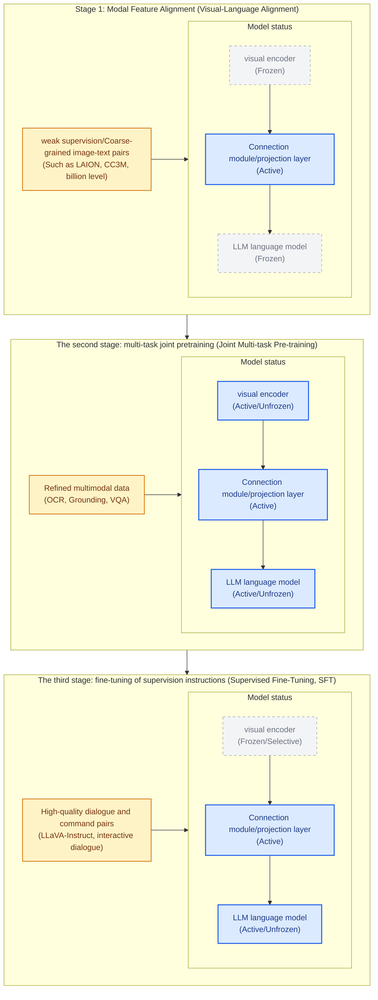

### 1. The first stage: modal feature alignment (Pre-training/Alignment)
{: id="1-第一阶段模态特征对齐pre-training--alignment"}
* **Training goal**: Project visual features to the text embedding space of the large language model to establish the most preliminary "semantic bridge".
* **parameter freezing strategy**: **freezes the** vision encoder (Vision Encoder) with large language model (LLM), **only trains the** connection module (Connector/Projection layer, such as a simple MLP projection layer, Q-Former or Cross-Attention layer).
* **training data**: massive, weakly supervised short text image-text pairs (usually tens to hundreds of millions of pairs), such as LAION-5B, CC3M, CC12M. The data at this stage is noisier but can provide broad coverage of visual concepts.
* **Core logic**: The model at this stage mainly performs "concept pairing", that is, allowing LLM to recognize that there is a mapping relationship between entities in the image and specific text tokens. Because the LLM remains frozen, its original language generation and reasoning capabilities are not disrupted.

### 2. The second stage: multi-task joint pretraining (Joint Pre-training)
{: id="2-第二阶段多任务联合预训练joint-pre-training"}
* **Training goal**: Improve the model's generalization ability on fine-grained visual tasks (such as positioning, dense text reading OCR, high-precision visual question answering, etc.) and achieve cross-modal perception of depth.
* **parameter freezing strategy**: Usually **is completely unfrozen** (Unfreeze), including the vision encoder, connection module and LLM. In some lightweight fine-tuning scenarios, there is also the option of freezing the visual encoder or using LoRA with it.
* **Training Data**: A high-quality, mixed-format, multi-task, multimodal dataset (e.g., mixed data containing bounding box localization Grounding, dense OCR recognition, graph parsing, and long video description).
* **Core logic**: By letting the visual encoder also participate in parameter updates, the model can adaptively fine-tune the visual representation according to the requirements of cross-modal tasks (for example, learning to recognize extremely small text or precise object boundaries in images). This makes the model more handy when dealing with fine-grained features.

### 3. The third stage: Supervised Fine-Tuning (SFT)
{: id="3-第三阶段监督指令微调supervised-fine-tuning-sft"}
* **Training goal**: Make the model align with human conversation habits, follow complex reasoning instructions, and form interactive conversation capabilities similar to Chat assistant.
* **parameter freezing strategy**: **unfreezes the LLM and connection module**, usually **freezes the visual encoder** (to prevent catastrophic forgetting of visual features in plain text instruction fine-tuning and multimodal dialogue training) , and protect the original plain text performance of LLM).
* **training data**: Carefully cleaned high-quality instruction following data sets (usually in the tens of thousands to millions), such as LLaVA-Instruct, ShareGPT4V, and complex multi-turn dialogue data automatically generated through GPT-4/GPT-4V.
* **Core logic**: At this stage, the model learns how to answer the user's open-ended questions in a smooth tone, conduct multiple rounds of questioning, and be able to safely reject unreasonable input.

---

## 6.2 Preference alignment and post-training (Preference Alignment & Post-Training)
{: id="62-偏好对齐与后训练-preference-alignment--post-training"}

As VLM is widely used in complex real-life scenes, models trained only by SFT still face two serious problems: **multimodal hallucination** (that is, fabricating objects or relationships that do not exist in the image) and **generated format out of control/poor alignment**. To this end, modern VLM has begun to introduce post-training (Post-training) preference alignment technology.

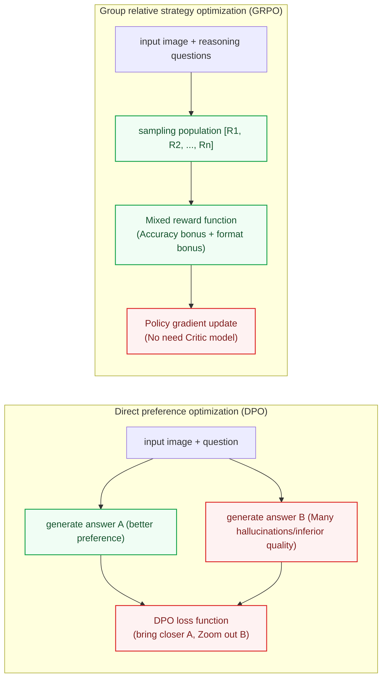

### 1. Direct Preference Optimization (DPO)
{: id="1-直接偏好优化-direct-preference-optimization-dpo"}
In multimodal scenarios, researchers will collect or use strong models (such as GPT-4V) to judge the output of VLM itself to build a preference alignment data set:
- **Better sample ($y_w$)**: An answer that accurately describes the image, has no illusions, and conforms to human preferences.
- **Worse sample ($y_l$)**: Answers containing factual errors, visual illusions, or confusing formatting.

DPO does not train the reward model separately, but directly improves the log-likelihood ratio of $y_w$ relative to $y_l$ (based on the reference model) on the preference pair, thereby reducing the probability of hallucinatory answers. The post-training of Qwen2.5-VL adopts two steps of SFT + DPO (ViT freezing).

### 2. Group Relative Policy Optimization (GRPO)
{: id="2-群体相对策略优化-group-relative-policy-optimization-grpo"}
When training an inference model, traditional PPO (Proximal Policy Optimization) requires a Critic (value model) of a size similar to that of the policy model to estimate the advantages, which consumes a lot of GPU memory and computing overhead.

GRPO (from DeepSeekMath, later adopted by DeepSeek-R1) samples a set of outputs for each question, and uses the mean and standard deviation of the rewards within the group to normalize the rewards of each output as an advantage estimate, thus eliminating the need for the Critic model:
- **Reward Function**: Usually includes **rule reward** (such as math questions, counting questions, positioning IoU determination results) and **format reward** (such as requiring the model to be in Output the reasoning process in the `<think>` tag, and then give the final answer).
- **Function**: As long as the answer can be automatically verified, it can strengthen reasoning behavior without manual CoT annotation; it improves reasoning and answer selection, and cannot make up for the visual information lost in the input stage.

### 3. Representative practices for visual reasoning enhancement
{: id="3-视觉推理增强的代表性实践"}

Inspired by the o1/DeepSeek-R1 reasoning breakthrough, a batch of work will emerge in 2024-2025 that applies structured chain of thought and RLVR (verifiable reward reinforcement learning) to VLM:

**LLaVA-CoT** (2024, formerly known as LLaVA-o1) splits reasoning into four explicit stages - Summary → Description → Reasoning → Conclusion, fine-tuned on the LLaVA-CoT-100k structured data generated by GPT-4o Llama-3.2-11B-Vision-Instruct; **stage-level beam search** is used during inference (selecting the best from multiple candidates at the end of each stage), which is better than Best-of-N and sentence-level beam search under similar calculation amount. The paper reports that its average score on multiple inference benchmarks exceeds Gemini-1.5-Pro, GPT-4o-mini and Llama-3.2-90B-Vision-Instruct ([arXiv:2411.10440](https://arxiv.org/abs/2411.10440)).

**R1-V** (2025, open source project) is an earlier attempt to use GRPO for VLM: doing 100 steps of GRPO on Qwen2-VL-2B on the CLEVR counting task (8 A100 for about 30 minutes), the SuperCLEVR out-of-distribution counting accuracy increased from about 48% to about 82%, exceeding the 72B baseline. **Visual-RFT** (Shanghai Jiaotong University, Shanghai AI Lab, et al., 2025) extends verifiable rewards to perception tasks: detection and positioning are rewarded with IoU, and classification is rewarded with correctness. It is better than SFT with the same amount of data in few-shot detection, fine-grained classification and inferential positioning. **MPO** (InternVL2-8B-MPO, 2024) Improve multimodal CoT inference with hybrid preference optimization (preference loss + quality loss + generation loss) while reducing hallucinations.

The following table gives the reference scores of several inference-related benchmarks in early 2025 (from Qwen2.5-VL and InternVL2.5 technical reports, non-real-time ranking):

|benchmark|Task type|model|report score|
|------|---------|------------|---------|
| MathVista(testmini) |mathematical visual reasoning| Qwen2.5-VL-72B | 74.8 |
| MMStar |Comprehensive multimodal understanding| Qwen2.5-VL-72B | 70.8 |
| MMMU(val) |University level multidisciplinary| Qwen2.5-VL-72B | 70.2 |
| MMMU(val) |University level multidisciplinary| InternVL2.5-78B | 70.1 |

After the advent of inference enhancement models, these numbers have been significantly refreshed (for example, Qwen3-VL-235B-Thinking's MathVista is 85.8, see Section 8.10).

### 4. Visual Slow Thinking and Multimodal Test-Time Compute
{: id="4-视觉慢思考visual-slow-thinking与多模态测试时计算扩展-test-time-compute"}

Starting from 2025, OpenAI o3's "thinking with images", R1-V class RLVR work on the open source side, and Qwen3-VL Thinking and other models will promote the multimodal model **from a single answer (System 1-style fast perception) to a first-reason and then answer (System 2-style slow thinking)**. The figure below is a conceptual representation of this type of process, not a specific implementation of a model.

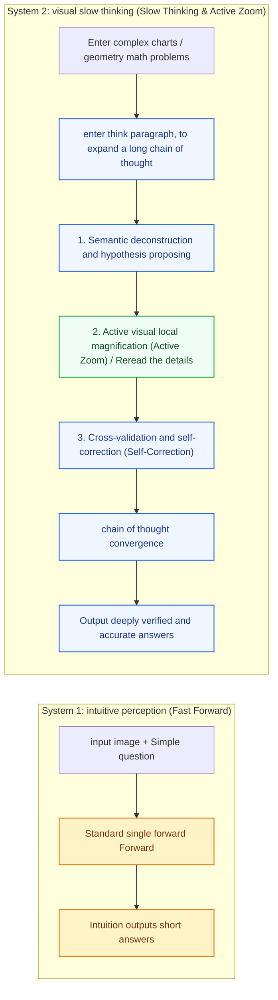

**Four core mechanisms of multimodal slow thinking**:
1. **long chain of thought independent reflection (Long Visual CoT)**:
   - The model independently launches a multi-step reasoning process in the `<think>` tag, breaking down complex visual problems into sub-goals (such as geometric auxiliary line construction, circuit diagram node tracking, and horizontal and vertical retrieval of multi-column complex reports).
   - During the thinking process, if the initial reading is found to be inconsistent with physical common sense, rollback and recalculation can be performed independently in the chain of thought.
2. **Active Visual Zoom / Tool Calling**:
   - In the face of ultra-high-resolution images or dense and small text (such as 4K architecture diagrams, high-density formulas), the model can actively generate bounding boxes for local areas during the thinking process, call embedded tools to dynamically crop and re-encode the high-precision features of the area, and then insert the new features back into the current thinking context to make up for the loss of details caused by global downsampling. The premise is that the model can correctly judge where to zoom in. Qwen3-VL reported improvements after using the tool on high-resolution benchmarks such as V* (see Section 8.10).
3. **Verifiable reward reinforcement learning (RLVR for Multimodal Reasoning)**:
   - Rely on reinforcement learning frameworks such as GRPO, using mathematics, geometric proofs, code generation, deterministic coordinates, etc. **Objectively verifiable rewards** (Exact answer matching, IoU, etc.) For trial-and-error optimization, the model can learn reasoning behaviors such as reflection and review without the need for a large number of manually written CoT annotations.
4. **Test-Time Scaling**:
   - By allocating more computing budget in the reasoning phase (generating longer thinking token chains, sampling multiple thinking paths in parallel, and reordering with the help of majority voting or PRM process reward models), higher accuracy can be achieved on tasks such as mathematical and graphical reasoning; the cost is that latency and reasoning costs will increase, and the benefits for tasks focused on perception will be limited.

---

## 6.3 Key Training Technologies
{: id="63-核心技术关键点-key-training-technologies"}

To make VLM training both efficient and accurate, it is inseparable from the support of a series of underlying architectures and algorithms:

### 1. Naive Dynamic Resolution
{: id="1-原生动态分辨率-naive-dynamic-resolution"}
Early VLMs (such as LLaVA-1.0) often forcibly crop and scale images of different aspect ratios into fixed square pixels (such as $224 \times 224$ or $336 \times 336$). This causes long strips of images to be stretched and deformed, small objects to be distorted, and high-resolution image information to be severely lost, making it impossible to recognize small characters (OCR).

There are two mainstream implementations of **dynamic resolution solution** (see Section 4.7 for details):
- **sliced** (LLaVA-NeXT's AnyRes, InternVL's Dynamic High Resolution): Select the grid according to the aspect ratio, cut the image into a number of fixed-size tiles and encode them separately, and retain an additional low-resolution thumbnail.
- **Native** (Naive Dynamic Resolution of Qwen2-VL): ViT directly encodes the entire variable-size image, relying on 2D-RoPE to represent the position, without cutting tiles, and does not require thumbnails. The map below shows this route.
- Both process variable-length sequences of visual tokens when training, usually with sequence packing and per-sample attention masks.


### 2. Multimodal Rotary Position Embedding (M-RoPE)
{: id="2-多模态旋转位置编码-multimodal-rotary-position-embedding-m-rope"}
In traditional LLM, RoPE is one-dimensional (only text order is coded). However, under multimodal input, the image contains two-dimensional space coordinates (height $H$, width $W$), and the video contains three-dimensional space + time coordinates (time $T$, height $H$, width $W$).

Solution for **M-RoPE**:
- Decouple rotation position encoding into three dimensions: time, height, and width.
- For text, it only increases in the 1D dimension; for visual tokens in images, their position encoding is represented by the $(h, w)$ combination; for videos, the position encoding is represented by the $(t, h, w)$ combination.
- During training, this enables the model to clearly identify the relative timing and spatial physical relationships between different frames and different pixel blocks, even when processing extremely long videos or extremely high-resolution stitched images.

---

## 6.4 Hyperparameter Tuning in Practice
{: id="64-训练超参数实战指南-hyperparameter-tuning-in-practice"}

The hyperparameter table in the paper often only tells you "what values were finally used", but in practice what is more valuable is: Why are **these values? When your computing power and data are different from those of the paper, which direction should you adjust?**This section dismantles the most critical sets of hyperparameters in VLM training one by one.

### 1. The first principle: differentiated learning rate by module
{: id="1-第一原则分模块差异化学习率"}

The connection module, ViT and LLM have different initialization and training histories. **They should be checked separately if they require different learning rates** . Module setting is a common starting point, and a unified learning rate can also be effective; the judgment is based on the freezing strategy, gradient stability and verification performance. The values ​​in the table below are magnitude references for some recipes, not universal optimal values:

|module|Initialization source|Typical peak learning rate|Set basis|
|------|-----------|---------------|---------|
|Connection module (Projector/Q-Former)|random initialization|1e-3 (alignment stage) → 1e-5~2e-5 (subsequent stage)|The random parameters are far from the convergence point and require a large step size to converge quickly.|
|LLM trunk|pretraining LLM| 1e-5 ~ 2e-5 |Protect existing language skills and prevent catastrophic forgetting|
|ViT visual encoder|CLIP/SigLIP pretraining|2e-6 ~ 1e-5 (about 1/5~1/10 of LLM)|The visual feature space obtained by contrastive learning is extremely fine, and a large learning rate may destroy the semantic structure of the patch in a few steps.|

A practical intuition: **The learning rate should be inversely proportional to the "current quality of the parameters"** . The learning rate of the projection layer in the alignment stage (1e-3) is 50 times that of the LLM learning rate in the SFT stage (2e-5), precisely because the former starts from scratch and the latter only needs "slight corrections". "ViT learning rate is lower than LLM" has a clear source: the LLaVA-OneVision paper states that the visual encoder learning rate is 1/5 of LLM (2e-6 vs 1e-5), and the interval given by NVILA is wider (5~50 times lower than LLM). Qwen-VL also uses ViT **Layer-by-layer learning rate decay** (layer-wise lr decay 0.95; the first generation InternVL used 0.9): The features learned in the layer closer to the input are more general and should be moved less. What’s interesting is that InternVL2.5 goes in the opposite direction—to keep the recipe simple, the learning rate is deliberately unified for the entire model. Both routes can train strong models, indicating that the core benefits come from the distinction between "random new modules vs pretraining backbones". Whether ViT is subdivided internally is the icing on the cake.

<div align="center">
  
<figcaption> Figure: Differentiated learning rate scheduling of each module in the three-stage training (schematic diagram, the values ​​are typical community magnitudes; each stage is internally linear warmup + cosine decay)</figcaption>
</div>

### 2. Comparison of three training formulas
{: id="2-三份训练配方对照"}

**LLaVA-1.5 official configuration** (official warehouse `scripts/v1_5/pretrain.sh` and `finetune.sh`) is the most widely used starting formula in the community:

|hyperparameters|Phase 1: Alignment pretraining|Phase 2: Instruction fine-tuning (SFT)|
|--------|------------------|------------------------|
|Trainable parameters|MLP projection layer only|Projection layer + LLM full parameters|
|global batch size| 256 | 128 |
|peak learning rate| **1e-3** | **2e-5** |
|Learning rate scheduling|Cosine decay, warmup ratio 0.03|Cosine decay, warmup ratio 0.03|
|Number of training rounds|1 epoch (558K image and text pairs)|1 epoch (665K instruction data)|
| weight decay | 0 | 0 |
|Optimizer/Precision| AdamW / bf16 | AdamW / bf16 |
|Maximum sequence length| 2048 | 2048 |
|gradient crop|max_norm = 1.0 (HF default)|max_norm = 1.0 (HF default)|
| DeepSpeed | ZeRO-2 + gradient checkpointing | ZeRO-3 + gradient checkpointing |

One noteworthy detail: the original LLaVA pretraining learning rate is 2e-3, 1.5. After replacing the linear projection with a two-layer MLP, its **is halved to 1e-3** (the paper clearly states "because of the MLP projector") - after the expression ability of the connection module is enhanced, the learning rate shrinks accordingly. LLaVA-NeXT separately sets the learning rate of **2e-6** (1/10 of the basic learning rate 2e-5) for the vision tower when unfreezing ViT. This practice has been followed by a large number of subsequent open source works.

The three-stage configuration **of**Qwen-VL (paper arXiv:2308.12966 Appendix Table 8) represents the orientation of "industrial-level large-scale training":

|hyperparameters|Stage 1: pretraining|Phase 2: Multi-task pretraining|Stage Three: SFT|
|--------|--------------|--------------------|------------|
|Trainable modules|ViT + Connectivity Module (LLM Freeze)|Unfreeze all|LLM + Connectivity Module (ViT Freeze)|
|peak learning rate| 2e-4 | 5e-5 | 1e-5 |
|minimum learning rate| 1e-6 | 1e-5 | 1e-6 |
|global batch size| 30720 | 4096 | 128 |
|Number of training steps| 50k | 19k | 8k |
|ViT layer-by-layer learning rate decay| 0.95 | 0.95 |— (ViT Freeze)|
|Image resolution| 224×224 | 448×448 | 448×448 |
|optimizer| AdamW(β₁=0.9, β₂=0.98, eps=1e-6) |Tongzuo|Tongzuo|
| weight decay | 0.05 | 0.05 | 0.05 |
|gradient crop| 1.0 | 1.0 | 1.0 |

Comparing the two formulas, it can be seen that the scale of **training data determines the regularization strength and super-parameter shape**. LLaVA uses hundreds of thousands of selected data to train for 1 epoch. The weight decay is set to 0 and the batch size is one or two hundred. Qwen-VL needs to digest 1.4 billion noise image and text pairs in one stage. The batch soared to 30720, the weight decay was raised to 0.05, and the β₂ of AdamW was lowered from the default 0.999 to 0.98 (plain text pretraining such as GPT-3/LLaMA/OPT). More radical, commonly used 0.95) - the second-order moment estimate responds faster to changes in gradient distribution, which can reduce the risk of loss spikes in large batch training. Also note that the batch size drops sharply with the stages (30720 → 4096 → 128), which is completely synchronized with the data shrinking from one billion noisy image-text pairs to 350,000 fine-scale instructions.

The progressive reuse formula **of**InternVL2.5 (technical report arXiv:2412.05271) represents another idea - reusing the fully trained InternViT in exchange for a lower total token consumption:

|hyperparameters|Phase 1: MLP warm-up|Phase 1.5: ViT incremental learning (optional)|Phase 2: Full model instruction fine-tuning|
|--------|-----------------|---------------------|-------------------|
|Trainable modules|MLP connection layer only (ViT + LLM frozen)|ViT + MLP (LLM Freeze)|All parameters|
|peak learning rate| **2e-4** | **1e-5** |**2e-5 ~ 4e-5** (large model takes the smaller value)|
|Inter-module learning rate|**unified** (no layer-by-layer attenuation magnification)|**unified**|**unified**|
|Learning rate scheduling|cosine decay|cosine decay|cosine decay|
|Image input|Dynamic high resolution (448×448 tiles)|Dynamic high resolution|Dynamic high resolution (6 to 12 tiles for a single image, up to 24 to 36 tiles for multiple images/documents)|
|Optimizer/Precision| AdamW / bf16 | AdamW / bf16 | AdamW / bf16 |
|78B accumulated tokens| — | — |The total amount of all stages is approximately **120 billion**|

InternVL2.5 has two significant differences from the previous two formulations. **First, the whole learning rate is unified** - each trainable module shares the same lr, does not apply the LLaVA-NeXT-style "ViT lr = 1/10 of the basic lr" multiplier, and does not do the Qwen-VL-style layer-by-layer decay (decay = 0.95); Stage 1.5 relies on overall lowering of the learning rate to avoid ViT forgetting. **Second, the lower token consumption** - the 78B model totals about 120 billion tokens, which is about 1/10 of Qwen2-VL (1.4 trillion). The key is **progressive scaling**: first let ViT be jointly trained with a smaller LLM (stage 1.5), and then connect the trained ViT directly to the larger LLM, skipping stage 1.5; the report believes that visual features are universal representations and can be read by different LLMs. Phase 1 freezes ViT and LLM, and only trains MLP, in order to establish a stable interface with less data. **jointly trains large-scale data from scratch (Qwen2-VL) and reuses trained components (InternVL2.5) are two coexisting ideas.**

### 3. Linkage between batch size and learning rate
{: id="3-batch-size-与学习率的联动"}

When the GPU memory is insufficient, first differentiate between single-GPU micro-batch and globally valid batch. When the global batch is kept unchanged through gradient accumulation, there is no need to adjust the learning rate just because the batch of a single GPU changes; after the global batch changes, the learning rate should be re-verified. The following two scaling rules can be used as candidate initial values:

$$\eta' = \eta \cdot \frac{B'}{B} \;\text{(linear scaling rule for SGD)}, \qquad \eta' = \eta \cdot \sqrt{\frac{B'}{B}} \;\text{(square-root scaling rule for Adam/AdamW)}$$

- Linear rules are commonly used in SGD, and square root rules are used to analyze adaptive optimizer scaling under specific conditions. They all have applicable assumptions and cannot be mechanically applied just by the optimizer name; the global batch, number of training steps, warmup and other optimizer parameters need to be considered together.
- Equivalent global batch = single-GPU batch × number of gradient accumulation steps × number of GPUs. Transformer uses LayerNorm (without BatchNorm). **gradient accumulation and direct batch increase are basically equivalent to** in mathematics. It is the first choice to maintain the effectiveness of the original formula when GPU memory is limited - LLaVA's official README clearly requires gradient accumulation to keep the global batch unchanged when changing the number of GPUs.
- Example: Change the global batch from 128 to 32. When the original learning rate is 2e-5, the square root rule gives 1e-5, which can be added to the learning rate search range instead of being directly identified as the optimal value.
- The scaling formula is just the initial value of **reference**. According to the suggestion of [Deep Learning Tuning Playbook](https://github.com/google-research/tuning_playbook), batch should be selected based on resource efficiency and the hyperparameters related to it should be re-adjusted.

### 4. Warmup, decay and epoch number
{: id="4-warmup衰减与-epoch-数"}

**Why must warmup be performed?** Adam's second-order moment estimation in the early stage of training is only based on a very small number of samples, which is extremely unreliable; at the same time, the randomly initialized projection layer will return "garbage gradients" to the pretraining weights. Linear warmup allows the model to correct the most outrageous parameters first when the learning rate is very small, and then enter full-speed learning. Commonly used settings: **warmup ratio 0.03** for fine-tuning (that is, 3% of the total number of steps, this is true for all LLaVA systems), and **for pretraining to fix the number of steps** (500 steps for Qwen-VL, 2000 steps for LLaMA).

Where does **attenuate?** should check the scheduler configuration directly. Taking the Qwen-VL recipe listed in this section as an example, the minimum/peak learning rate ratios of the three stages are 0.005, 0.2, and 0.1 respectively, which are not uniformly 10%. The decrease in loss at the end of training may be related to the attenuation of the learning rate. Whether to continue training should be judged based on the verification set and downstream evaluation.

How many epochs will **be trained for?** can start from the number of training rounds or token budget of the public formula, and then adjust according to the verification performance. The time when overfitting occurs depends on the amount of data, repetition rate, quality and model capacity. There is no fixed "2nd to 3rd round" limit; experimental comparisons are also required between repeating high-quality data and introducing new data.

### 5. Data Proportion: Preventing the Degradation of Text Capabilities
{: id="5-数据配比防止文本能力退化"}

Multimodal training will naturally erode the pure text capabilities of LLM - VILA's ablation shows that training with only image and text pairs will reduce the accuracy of pure text tasks **Down more than 17%** . There are two commonly used countermeasures:

1. **Mix in text-only data**: The proportion ranges from about 6% in LLaVA-1.5 (40K ShareGPT text-only conversations within 665K instruction examples), to 10% in MM1 pretraining (45% interleaved image–text, 45% image–text pairs, and 10% text-only data), and 50% in Qwen2.5-VL SFT (approximately 2 million examples, split equally between text-only and multimodal data). VILA’s joint-SFT experiment provides particularly clear evidence: adding 1 million FLAN text-only instructions restored MMLU to the level of text-only fine-tuning, while **visual-task performance also improved**.
2. **Token-by-token loss weighting**: The sequence of multimodal samples is much longer than that of plain text samples, and simple token-by-token averaging will allow multimodal gradients to dominate training. Qwen3-VL's square-root reweighting (square root normalization of the number of tokens per sample) is exactly aimed at this problem (see Section 8.10).

The ratio within the task type is also particular: Cambrian-1's ablation found that the number of samples from a single data source is optimal at an upper limit of 250,000 to 350,000; the proportion of OCR data is proportional to the OCR capability, but too high a proportion will damage general VQA—— **The ratio should be adjusted according to your own evaluation goals.** .

### 6. Parameter adjustment workflow: first small, then large
{: id="6-调参工作流先小后大"}

Learning rate is among all hyperparameters **Highest sensitivity** For one, the parameter adjustment budget should be spent first on the learning rate:

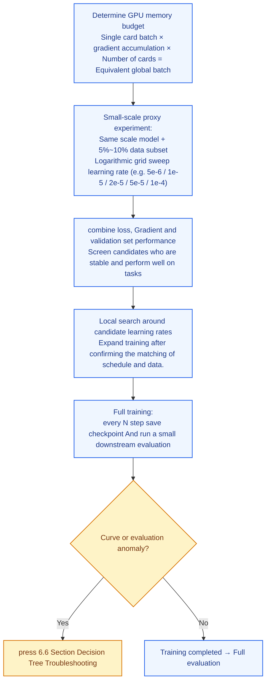

"Learning rate priority" has a classic source - Chapter 11 of Goodfellow's "Deep Learning": "If you only have time to adjust one hyperparameter, adjust the learning rate." Also note a trap: under standard parameterization, the optimal learning rate swept out by the small model **cannot be directly moved to the large model** (the optimal point will drift with the width of the model), so the above proxy experiment is recommended to be done on a data subset with the same scale model. If it is indeed necessary to migrate hyperparameters across scales, μP / μTransfer (Yang et al., 2022) modifies the parameterization to keep the optimal learning rate stable with width - Microsoft used a 40 million parameter proxy model to adjust parameters and then migrated to 6.7B GPT-3. The effect exceeds the original version, and the parameter adjustment overhead only accounts for 7% of the total pretraining compute.

### 7. Project switch when GPU memory is insufficient
{: id="7-显存不够时的工程开关"}

|means|Principle|cost|
|------|------|------|
|gradient accumulation|Accumulate gradients forward and backward multiple times to maintain an effective batch|Loss normalization, gradient clipping and parameter update timing need to be kept consistent; throughput needs to be measured in practice|
| Gradient Checkpointing |Store less intermediate activations and recalculate during backpropagation|Extra computation in exchange for GPU memory, the cost depends on the recalculation scope|
| DeepSpeed ZeRO-2 / ZeRO-3 |ZeRO-2 sharding optimizer states and gradients, ZeRO-3 further sharding parameters|The income is related to the number of cards, accuracy and activation occupancy, and also introduces communication overhead.|
| LoRA / QLoRA |Train low-rank increments; QLoRA also quantifies frozen trunks|Effect depends on task, target layer, and rank; there is still activation and computation overhead|
|Sequence packing|Multiple short samples are combined into one long sequence to eliminate padding waste.|Attention masks and position encoding need to be handled correctly|
|Reduce resolution/number of tiles|Directly reduce the number of visual tokens|OCR and fine-grained tasks are obviously dropped.|

---

## 6.5 Training Monitoring and Reading Loss Curves (Monitoring & Reading Loss Curves)
{: id="65-训练监控与-loss-曲线解读-monitoring--reading-loss-curves"}

VLM training can take days to weeks. **Read problems from the curve in time** Far cheaper than remediation afterwards. This section answers two questions: what to stare at and how to read.

### 1. What to Watch: Four Must-See Panels
{: id="1-盯什么四个必看面板"}

|indicator|What to see|abnormal signal|
|------|--------|---------|
|Training loss (after smoothing)|Is the overall trend continuing to decline?|Spikes, plateaus, rises|
|Grad norm|Is it stable within a narrow band?|Continuously rising and frequently hitting the top clipping threshold|
|learning rate|Does the scheduling curve meet expectations?|warmup/attenuation configuration error|
|Verification loss + downstream evaluation|Is ability really improving?|train/val bifurcates, evaluation scores are saturated or fall back|

<div align="center">
  
<figcaption> Figure: VLM training monitoring panel - ① Training loss always looks at the smooth curve; ② grad norm is the leading indicator of spikes; ③ Learning rate check scheduling configuration; ④ Downstream evaluation provides true signals other than loss (schematic diagram, data is generated by simulation)</figcaption>
</div>

Three practical suggestions:

- **Always look at the smoothed loss** (EMA or sliding window mean): The original loss step by step is affected by the difficulty difference of each batch, and the noise is very large. It is easy to get suspicious when staring at the original value.
- **Split loss by data source**: Separately record the loss of each data source such as caption, OCR, grounding, and plain text. Problems such as "the total loss is normal but the OCR loss does not decrease" cannot be seen together at all.
- **records token-level accuracy** as a supplement to loss: that is, predicting the top-1 hit rate of the next token, which is especially intuitive for the SFT stage (HF TRL's SFTTrainer records mean_token_accuracy by default), and you can find the degradation of "loss is decreasing but the hit rate does not increase".

**Supplement: How to choose the Smoothing Factor**

The update formula of EMA is $$\hat{L}_t = \alpha \cdot \hat{L}_{t-1} + (1-\alpha) \cdot L_t$$, where the larger $$\alpha \in (0,1)$$, the smoother the curve. The equivalent "memory window" of EMA is about $$\frac{1}{1-\alpha}$$ steps - this is the bridge between the two perspectives of EMA and sliding window:

|α (EMA attenuation coefficient)|Equivalent sliding window|Applicable scenarios|
|------------------|------------|---------|
| 0.9 |~10 steps|Short SFT (total steps < 1K); fast training and want to find spikes quickly|
| 0.95 |~20 steps|Medium-scale SFT (1K~5K steps); empirical recommendations for TensorBoard|
| 0.99 |~100 steps|Large-scale pretraining (5K~50K steps); most commonly used "production" default|
| 0.999 |~1000 steps|Very long pretraining (>100K steps, such as LLaMA pretraining); smoothed curves almost only show trends|

**tool default value and recommended adjustment**: The default value of TensorBoard's Smoothing slider is **0.6** (the equivalent window is only 2.5 steps), which is too noisy for the VLM training curve of thousands of steps - in practice it is recommended to adjust it to **0.95~0.99**. Weights & Biases are not smoothed by default on the UI. You can manually select EMA and set the coefficient in the "Smoothing" drop-down box.

**weighs both sides**: α is too large (over-smoothing) → the real spikes are covered up and problem discovery lags behind, and cannot be used as an early warning supplement for grad norm; α is too small (insufficient smoothing) → the curve jitters continuously, making it difficult to judge the downward trend and plateau period. Rule of thumb: **is suitable when the smoothed curve of** has "fuzzy details but clear trends". If periodic spikes are still clearly visible on the smooth curve, increase α by about 0.01~0.02.

### 2. What does a healthy loss curve look like?
{: id="2-健康的-loss-曲线长什么样"}

**first makes the initial value sanity check**. When the language model starts training from random initialization, the loss in the first step should be approximately equal to the natural logarithm of the vocabulary size (equivalent to the cross entropy under uniform distribution prediction):

$$\mathcal{L}_0 \approx \ln |V|$$

For example, a LLaMA vocabulary of 32K corresponds to approximately 10.4, and a Qwen vocabulary of 152K corresponds to approximately 11.9. In the **VLM alignment stage, since the LLM has been pretrained, the initial loss is usually only 4~6** - if you see that the initial loss is close to ln (vocabulary size), you can almost conclude that the pretraining weights are not loaded correctly. This is one of the most debug techniques worth memorizing.

**In the form of**, a healthy loss is a power law decline - fast in the early stage and slow in the later stage, which is approximately a straight line under the logarithmic coordinates; at the end of training, it will drop slightly with the cosine decay of the learning rate. Each of the three stages of the curve has its own characteristics:

<div align="center">
  
<figcaption> Figure: Typical loss curve shape of three-stage training - the first stage has a higher point, then drops steeply and is subject to the frozen LLM upper limit constraint to converge to ~2.0; in stage two, the starting point rebounds due to the addition of more difficult tasks, and then slowly decreases with a power law; in stage three, the SFT data format is unified, and the absolute value of loss is the lowest (schematic diagram, data generated by simulation)</figcaption>
</div>

Three common misunderstandings:

- **Cross-stage comparison loss is meaningless**: The loss in stage two is higher than the end point of stage one, which does not mean "the practice is bad", but the data distribution has changed (more difficult tasks such as OCR and grounding have been added).
- There is no unified standard for the absolute value of **loss**: The loss under different vocabulary lists, different data, and different loss mask strategies cannot be compared horizontally; the comparison is the relative change under the same configuration.
- **loss will never drop to 0**: In Chinchilla's fitting formula, natural language has an irreducible entropy term of about 1.69 nats - the flattening of the curve in the later period is both a factor of the attenuation of the learning rate and the lower limit of the information entropy of the data itself. "It seems to be motionless" does not mean that it is not learning (it is still a straight decline when viewed on a logarithmic coordinate).

### 3. Four exception modes and handling
{: id="3-四种异常模式与处置"}

<div align="center">
  
<figcaption> Figure: Four typical abnormal loss curve patterns - (a) morphological contrast of too large/too small learning rate; (b) benign and malignant loss spikes; (c) premature entry into the plateau period; (d) train/val bifurcation during multi-epoch overfitting (schematic diagram, data generated by simulation)</figcaption>
</div>

|phenomenon|Possible reasons|Dispose|
|------|---------|------|
|Fluctuated at a high level after a rapid dip (red line in Figure a)|Learning rate is too large|The learning rate is reduced by 2~5 times|
|The decline is extremely slow and far from convergence (blue line in Figure a)|Learning rate is too small, warmup is too long|The learning rate increases by 2~5 times|
|Recovers automatically within hundreds of steps after being spiked (green line in Figure b)|Individual bad batches/extremely difficult samples|If it is benign, continue to observe; if it occurs frequently, the data needs to be cleaned.|
|After the spike, it continues to rise and diverge (red line in Figure b)|Excessive learning rate amplifies the impact of bad batches; fp16 value overflows; Adam's second-order moment state is contaminated|Go back to the checkpoint before the spike and skip the data segment to continue training (PaLM’s standard practice); or reduce the learning rate, lower β₂, and tighten gradient clipping|
|Entering the plateau prematurely (Figure c)|The learning rate decays too fast; data duplication/diversity is insufficient; too few trainable parameters (such as only training the projection layer but expecting to learn OCR)|Check scheduler configuration; data deduplication; unfreeze more parameters|
|train continues to fall and val rises (Figure d)|Overfitting (a typical phenomenon of SFT training for multiple epochs)|Reduce epochs, stop early, and expand data diversity|
|loss becomes NaN / Inf|fp16 overflow or underflow; learning rate too large; corrupted samples (empty images, very long text)|Change to bf16; reduce the learning rate; locate and eliminate bad samples|

Regarding loss spikes, there are many public experiences in the history of large model training that can be used for reference: **PaLM-540B** encountered about 20 spikes in the whole process. The standard operation is to rewind to the checkpoint about 100 steps before the spike, skip the subsequent 200~500 batches and continue training - the same batch of data is started from earlier checkpoints. Replaying and **will not** spikes, indicating that spikes are a combined event of "parameter status × specific data" rather than simply bad data; **OPT-175B** manually restarted 35 times during two months of training, during which the gradient clipping threshold was tightened from 1.0 to 0.3; **GLM-130B** The main reason for locating spikes is the abnormal gradient of the embedding layer (several orders of magnitude larger than other layers). The spikes are significantly reduced by reducing the gradient of this layer to 0.1 times; PaLM, Falcon, OLMo 2 also use **z-loss** (coefficient 1e-4) regular term suppresses logits drift. VLM is most susceptible to such problems in the second stage of large-scale joint training.

### 4. Grad norm: leading indicator of spikes
{: id="4-grad-norm尖刺的先行指标"}

Gradient norm often exposes problems earlier than loss:

- **Healthy form**: After warmup ends, it stabilizes in a relatively narrow range (such as 0.2~1.0), and slowly decreases with training;
- **early warning signal**: grad norm continues to rise before loss - this is usually a precursor to divergence, and it is not too late to reduce the learning rate at this time. The "leading indicator" has an official source: the GLM-130B training log clearly records that "collapses often lag behind grad norm spikes", and the OLMo 2 paper also writes that loss spikes "often preceded by spikes in the gradient norm";
- **gradient clipping max_norm=1.0** is the standard solution for almost all large model training (PaLM, LLaMA, and LLaVA are all 1.0; OPT is reduced to 0.3 for stability). However, if the grad norm **sticks to the clipping threshold** for a long time, it means that the learning rate is set too high - clipping should only be triggered occasionally and should not be normalized;
- **records** according to module groups: embedding, attention, FFN, and projection layers are separately recorded as grad norm, which can accurately locate the problem layer - this is how GLM-130B discovered the gradient anomaly of the embedding layer. In VLM, it is also necessary to confirm whether the frozen boundary is really frozen (for example, the grad norm of LLM and ViT in stage 1 should always be 0).

### 5. In addition to loss: Be sure to run the evaluation during training
{: id="5-loss-之外一定要在训练中跑评测"}

**loss Low does not mean strong ability**. SFT's loss measures the "accuracy of rereading the reference answer" and is only loosely related to "how well the answer is answered"; more insidiously, the hallucination rate may not fall but rise instead of falling at the same time as the loss (the model learns to fabricate more fluently). Therefore:

- Save checkpoints every fixed number of steps (such as 500~1000 steps), and automatically run a set of **small and fast evaluation**: MMBench-dev subset (comprehensive ability), POPE (object illusion), TextVQA subset (OCR);
- When the evaluation score is saturated and the loss is still slowly decreasing, the marginal benefit of continuing training is already very low. **Stopping early can save a lot of computing power** ;
- In turn, **val loss will also "false alarm"**: InstructGPT's SFT verifies that loss begins to overfit after 1 epoch, but after continuing to train for 16 epochs, the reward model score and human preference score are still rising - and finally the checkpoint is selected based on downstream indicators instead of val loss. The difference between loss and ability is the norm in alignment training, and downstream evaluation is the gold standard;
- The same conversation template **(chat template) as the training** must be used during evaluation - template inconsistency is the most frequent reason for "normal loss but ridiculously low evaluation score".

---

## 6.6 Troubleshooting common training problems
{: id="66-常见训练问题排查-troubleshooting"}

Convergence the key points in Sections 6.4 and 6.5 into a decision tree, and follow the diagram when problems arise during training:

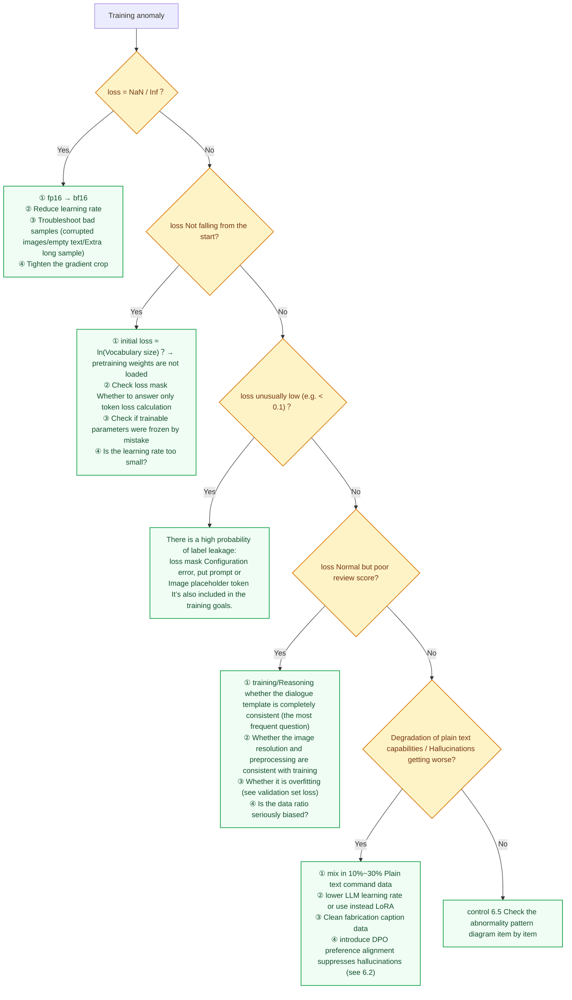

Several high-frequency "hidden pits" deserve separate emphasis:

1.  **loss mask error** is the most common bug among novices: in the multimodal dialogue sample, only **The token of the assistant’s answer part** The loss should be included; prompts, system prompts, and image placeholder tokens must be masked. Counting prompt into loss will make loss falsely low, and the model will learn to repeat the question instead of answering the question.
2. **dialogue template is inconsistent with**: `<|im_start|>` style is used for training and `[INST]` style is used for inference. The model performance will be inexplicably poor. Be sure to use the same code to manage templates for training and inference.
3. The number of tokens in the **image does not match that of**: In the dynamic resolution scheme, the number of tokens expanded by the `<image>` placeholder in the text sequence must be strictly consistent with the number of tokens actually output by the visual encoder. Misalignment of one will cause all the labels of the entire sequence to shift.
4. **Evaluation Driven Development**: Don’t wait until training is completed before evaluating. Any configuration changes (data, hyperparameters, templates) should be verified in small-scale proxy experiments first (see Section 6.4 Parameter Adjustment Workflow), and the full volume should be implemented after confirming that the curves and small evaluations are normal.

---

## 6.7 Case Study: Evolution of Qwen-VL Training
{: id="67-案例剖析qwen-vl系列训练演进-case-study-evolution-of-qwen-vl-training"}

Alibaba's open source Qwen-VL (Tongyi Qianwen vision-language model) series is a widely used open source VLM. From Qwen-VL to Qwen2-VL, Qwen2.5-VL, and then to Qwen3-VL, the technical reports of the four generations of models have disclosed a relatively complete division of training stages, which is suitable for observing the evolution of training recipes.

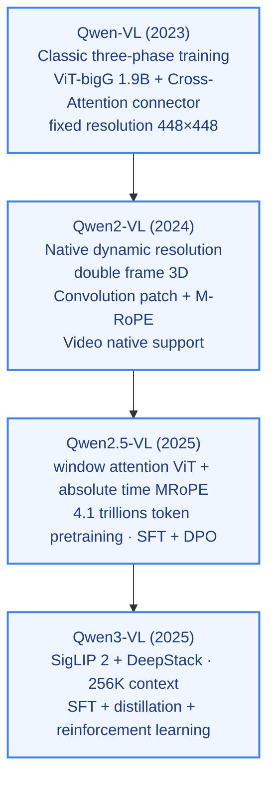

### 1. Qwen-VL (2023)
{: id="1-qwen-vl-2023"}

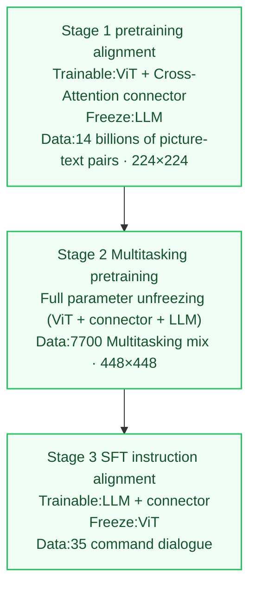

* **Architecture features**:
    - Visual encoder: ViT-bigG (1.9B parameters).
    - LLM: Qwen-7B.
    - Connector: Single-layer Cross-Attention module (compresses the image features output by ViT into fixed 256 visual tokens with 256 learnable queries).
* **three-stage training strategy**:
    - **Stage 1 (pretraining/feature alignment)**:
      - **freezing strategy**: **freezes LLM**, trains ViT with the Cross-Attention connector (note that it is different from the LLaVA-only training connector: Qwen-VL allows ViT to participate in training from the first stage, and uses a layer-by-layer learning rate decay of 0.95 for ViT; see the detailed hyperparameter table Section 6.4).
      - **training data**: 1.4 billion image-text pairs (cleaned from 5 billion original data, retention rate 28%).
      - **Purpose**: To open up the connection channel between image features and text semantics.
    - **Stage 2 (multi-tasking pretraining)**:
      - **freezing strategy**: **full parameter unfreezing**, ViT, connector and LLM participate in training at the same time.
      - **training data**: about 77 million pieces of high-quality multi-task mixed data (image description 19.7M, OCR 24.8M, VQA 3.6M, Grounding positioning class about 21M, plain text 7.8M and seven categories), with the resolution increased to $448 \times 448$. Introduce bounding box coordinate annotation for Grounding (target positioning) training.
      - **Purpose**: Greatly enrich the positioning and fine-grained perception capabilities of the model.
    - **Stage 3 (SFT/instruction alignment)**:
      - **freezing strategy**: **freezes ViT** and only updates the parameters of the connector and LLM.
      - **training data**: approximately 350,000 high-quality manual annotations and command dialogue samples generated by strong models.
      - **Purpose**: Improve the model's conversational fluency and the coherence of multiple rounds of questioning.

### 2. Qwen2-VL (2024)
{: id="2-qwen2-vl-2024"}

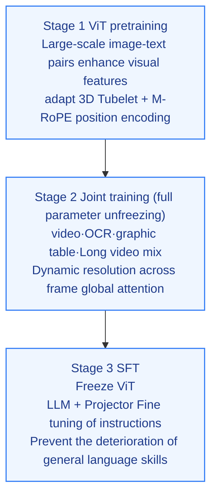

* **architecture upgrade**:
    - Supports image input of **with any resolution**, and introduces **Naive Dynamic Resolution**: ViT directly encodes the entire image scaled in proportion, and is no longer uniformly scaled to 448×448.
    - Use **3D convolution** to synthesize the patches of two adjacent frames into spatio-temporal tokens (images are copied into two frames for processing), and unify the input formats of images and videos.
    - **M-RoPE** is introduced to split the position encoding in LLM into three components: time, height, and width; the three components of the text token take the same value and degenerate into ordinary 1D RoPE.
* **training strategy changes**:
    - **Stage 1 (ViT training)**:
      - **Features**: Only train ViT, and learn the visual representation connected with LLM on large-scale image and text pairs (in line with the first stage of Qwen-VL training ViT + connector).
    - **Stage 2 (full parameter joint training)**:
      - **Features**: Unfreeze all parameters, add more diverse graphics, OCR, charts, videos and interleaved data to establish fine-grained perception and video understanding capabilities.
    - **Stage 3 (SFT)**:
      - **features**: **freezes ViT**, only fine-tunes LLM (and connectors), data is multimodal and plain text command dialogue.

### 3. Qwen2.5-VL (2025)
{: id="3-qwen25-vl-2025"}

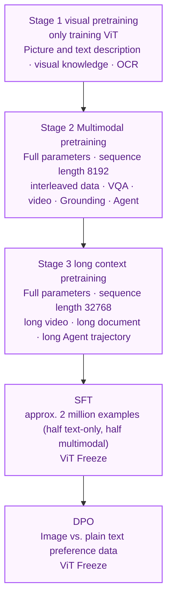

* **architecture upgrade**:
    - **ViT reconstructs**: most layers use window attention, and only 4 layers retain global attention, so that the amount of calculation increases approximately linearly with the number of patches; FFN and normalization are replaced by SwiGLU + RMSNorm consistent with Qwen2.5 LLM.
    - **Absolute time aligned MRoPE**: The position ID of the time dimension is aligned with the absolute time of the frame. Videos with different sampling rates share the same time scale, making it easy to answer "at which second did an event occur?"
* **training changes**:
    - **data volume**: The technical report stated that the pretraining data expanded from approximately 1.2 trillion tokens to approximately 4.1 trillion tokens.
    - **stretches the sequence in stages**: The sequence length in the last two stages of pretraining increases from 8192 to 32768 to cover long videos and long documents.
    - **post-training only uses SFT + DPO**: The post-training in the technical report does not include online reinforcement learning such as GRPO; there are about 2 million SFT data, with half plain text and half multimodal to retain language capabilities.

### 4. Qwen3-VL (2025)
{: id="4-qwen3-vl-2025"}

Qwen3-VL extends post-training to **SFT → strong to weak distillation → reinforcement learning**, and distinguishes two variants of Instruct and Thinking: reinforcement learning is divided into reasoning RL oriented towards mathematics, code and logic, and general RL oriented towards instruction following and format control. The architecture is switched to the SigLIP 2 visual encoder, DeepStack multi-layer feature injection, Interleaved MRoPE and text timestamps are added, and the native context is expanded to 256K. See Section 8.10 for the complete four-stage pretraining and post-training process.

From Qwen-VL to Qwen3-VL, we can see three directions of change: **resolution from fixed to native**, **pretraining from short sequence to long context**, **post-training from SFT to preference optimization and then to reinforcement learning**.

---

<a id="vlm-evaluation"></a>

# 7. Mainstream data sets and evaluation benchmarks
{: id="7-主流数据集与评测基准"}

**First distinguish between training resources and evaluation tools.** LAION-5B is mainly used for graphic pretraining; COCO also contains data and divisions of multiple tasks; MMBench, MMMU, etc. are used to evaluate specific abilities. The large size of the data set does not mean that the model is powerful.

|Evaluation objectives|Relevant benchmarks for this chapter|Interpret key points|
|---|---|---|
|general understanding and knowledge| VQA v2, MMBench, MMMU / MMMU-Pro |Perception errors and knowledge errors need to be analyzed separately|
|Text, documents and graphics| TextVQA, OCRBench |Check resolution, indicator dimensions and data division|
|Mathematics and Visual Reasoning| MathVista, MathVision, ScienceQA |Reasoning budget and answer extraction method will affect scores|
|Video timing understanding| Video-MME |Check frame number, subtitle conditions and video duration grouping|
|Interface positioning and interaction| ScreenSpot, OSWorld |Positioning accuracy and complete mission success rate are not the same indicators|
|Multi-language coverage| MVL-SIB |A high English score does not mean that low-resource languages are equally reliable.|

When reproducing the experiment, you should record the model and weight versions, input budget, prompt template, decoding parameters, evaluation script version and sample division; check the overlap of training and test data, and combine the analysis of failure cases instead of just comparing the total score.

## 7.1 LAION-5B
{: id="71-laion-5b"}

|Properties|content|
|------|------|
|Release year| 2022 |
|scale|5.85 billion image-text pairs|
|scene|Web scraping (multilingual)|
|Features|Publicly available image and text representation of the dataset, re-released as Re-LAION-5B after cleaning by CSAM in 2024|

LAION-5B, released by the LAION non-profit organization, filters image-text pairs from Common Crawl and uses CLIP similarity to filter low-quality samples. Open source models such as Stable Diffusion and OpenCLIP are trained on this data set.

---

## 7.2 COCO(Common Objects in Context)
{: id="72-cococommon-objects-in-context"}

|Properties|content|
|------|------|
|Release year|2014 (continuously updated)|
|scale|About 330000 images; Captions subset about 120000 images (train+val) with 5 manual descriptions|
|scene|daily life scenes|
|Features|VLM standard evaluation benchmark, covering multiple tasks such as description, retrieval, VQA, etc.|

COCO is one of the most commonly used basic data sets in the field of VLM: early visual language pretraining work generally reported image description (CIDEr) and image and text retrieval (R@1) indicators on the COCO Karpathy partition; benchmarks such as VQA v2 and RefCOCO are also built on COCO images. The new generation of VLM with LLM as the core turns more to comprehensive benchmarks such as MMBench and MMMU.

---

## 7.3 VQA v2
{: id="73-vqa-v2"}

|Properties|content|
|------|------|
|Release year| 2017 |
|scale|~1100000 questions, ~200000 COCO images|
|scene|everyday images|
|Features|Balanced design eliminates language bias and truly tests visual understanding|

VQA v2 balances the language bias of VQA v1: if the same question is paired with two similar images but with different answers, a model that only relies on question text to guess the answer will significantly lose points. Answers are counted in three categories: yes/no, counting, and other categories. Each question has 10 human answers, and the score is calculated based on the degree of consistency with the human answers.

---

## 7.4 MMBench
{: id="74-mmbench"}

|Properties|content|
|------|------|
|Release year| 2023 |
|scale|3000+ questions|
|scene|Diversity Ability Assessment|
|Features|Systematically evaluate the performance of VLM in 20+ capability dimensions|

MMBench decomposes VLM capabilities into two categories: perception and reasoning, and then subdivides it into 20 sub-abilities (such as attribute recognition, spatial relationship, action recognition, etc.); it uses CircularEval - the same multiple-choice question is asked multiple times in a rotating order, and only all correct answers are scored to reduce the artificial height caused by the model's preference for a certain option position.

---

## 7.5 ScienceQA
{: id="75-scienceqa"}

|Properties|content|
|------|------|
|Release year| 2022 |
|scale|21208 science questions|
|scene|K-12 Science Education (Multimodal)|
|Features|Contains multi-step reasoning questions mixed with pictures and texts, with notes on the solution process|

ScienceQA requires the model to combine images and text to perform multi-step reasoning in the scientific field, and each question is accompanied by explanations and problem-solving processes. About half of the questions have images; the combination of LLaVA and GPT-4 reported an accuracy of 92.53% on this benchmark, which is higher than the human average level (88.40%) given in the paper.

---

## 7.6 TextVQA / OCRBench
{: id="76-textvqa--ocrbench"}

|Properties|content|
|------|------|
|Release year| 2019 / 2023 |
|scale|28408 images (45336 questions) / 1000 question and answer pairs|
|scene|Natural scene text/scene text, documents, handwriting, formulas and other types of OCR scenes|
|Features|Specifically tests the model's ability to read text in images (OCR)|

The understanding of text in images (OCR) is an important capability of VLM. TextVQA requires the model to read text in images to answer questions, while OCRBench more systematically tests a variety of OCR scenarios and is the mainstream benchmark for evaluating VLM's text understanding capabilities.

---

## 7.7 MMMU & MMMU-Pro (university-level multi-disciplinary multimodal understanding)
{: id="77-mmmu--mmmu-pro大学级多学科多模态理解"}

|Properties|content|
|------|------|
|Release year| 2023 / 2024 |
|scale|11500 questions (covering 6 major fields, 30 subjects, and 183 sub-fields)|
|scene|College exams, professional certifications, academic charts and diagrams|
|Features|Specially evaluated for expert-level domain knowledge and deep multimodal reasoning capabilities, MMMU-Pro further filters plain text shortcuts (Text Shortcuts) and requires deep combination of image reasoning.|

MMMU (Massive Multi-discipline Multimodal Understanding) is recognized as the "MMLU" in the multimodal field, covering disciplines such as art and design, business, science, medicine, humanities, and engineering, including complex modalities such as charts, musical notations, chemical formulas, medical images, and engineering drawings. It is currently a key benchmark for measuring the cognitive upper limit of cutting-edge models such as GPT-4o, Gemini 2.5 Pro, and Qwen2.5-VL/Qwen3-VL.

---

## 7.8 MathVista & MathVision (Multimodal mathematics and geometric visual reasoning)
{: id="78-mathvista--mathvision多模态数学与几何视觉推理"}

|Properties|content|
|------|------|
|Release year| 2023 / 2024 |
|scale|6141 / 3040 visual math questions|
|scene|Function images, geometric proofs, statistical charts, physical calculations|
|Features|Comprehensive evaluation of the intertwined ability of visual perception (Fine-grained Perception) and mathematical logical reasoning (Mathematical Reasoning)|

Traditional pure text mathematics evaluations (such as GSM8K, MATH) cannot test the model's ability to read the image geometry and coordinate system. MathVista integrates 28 existing multimodal data sets and 3 newly constructed data sets (IQTest, FunctionQA, PaperQA); MATH-Vision collects questions from real mathematics competitions, which are more difficult and require the model to not only read the numerical and geometric constraints in the figure, but also perform rigorous algebraic and geometric multi-step derivation. It is the core benchmark for testing the effect of VLM visual reasoning and long thinking (Visual CoT / GRPO).

---

## 7.9 Video-MME (Comprehensive long video multimodal evaluation)
{: id="79-video-mme综合长视频多模态评测"}

|Properties|content|
|------|------|
|Release year| 2024 |
|scale|900 high-quality videos, 2700 multi-round questions and answers|
|scene|6 major visual fields (knowledge, film and television, sports competitions, artistic performances, life records, multi-language), subdivided into 30 sub-categories|
|Features|Covering short videos (<2 minutes), medium videos (4–15 minutes) and long videos (30–60 minutes), all questions and answers are manually annotated|

As the input to VLM expands from single images to continuous video streams, Video-MME fills the gap in comprehensive long video evaluation. It reports both "no subtitles" and "with subtitles" settings. The former better reflects the model's ability to obtain information from the screen; when comparing scores, you must confirm which setting is used and the number of input frames.

---

## 7.10 OSWorld & ScreenSpot (GUI Agent computer operation and positioning benchmark)
{: id="710-osworld--screenspotgui-agent-计算机操作与定位基准"}

|Properties|content|
|------|------|
|Release year| 2024 / 2024 |
|scale|369 Ubuntu real computer tasks (plus 43 Windows tasks) / 600+ screenshots, 1200+ location commands|
|scene|Real desktop software, web browser, multi-application collaboration|
|Features|From plain text/static Q&A to a real dynamic execution environment, closed-loop evaluation of cross-application clicks, inputs, scrolling and multi-step workflow completion rates|

As the multimodal large model moves from "looking at pictures and talking" to "Computer Use / GUI Agent", OSWorld and ScreenSpot have become the two most commonly cited benchmarks: ScreenSpot only tests single-step positioning (given instructions, click on the correct UI element), while OSWorld performs a complete task in a virtual machine and uses scripts to check the final status. The difficulty of the two is very different. A high positioning accuracy does not mean a high success rate for multi-step tasks.

---

## 7.11 MVL-SIB
{: id="711-mvl-sib"}

|Properties|content|
|------|------|
|Release year| 2025(ACL Findings) |
|scale|205 languages|
|scene|Multi-language image and text matching|
|Features|The multimodal benchmark covers the widest range of languages and also provides a plain text version, which can accurately compare the "gain of visual input for different languages"|

MVL-SIB reveals the multimodal "language fairness" bottleneck: in low-resource languages, the image-text alignment quality of even top models such as GPT-4o drops significantly - the lead of high-performance VLM on the English benchmark does not mean equal service capabilities for global languages.

---

## 7.12 Evaluation Trend: From static VQA to interactive, timing, and multi-language expansion
{: id="712-评测趋势从静态-vqa-向交互时序多语言扩展"}

Since 2025, VLM evaluation has shown three important trends: **Agent-oriented evaluation** (Bind multimodal tasks and tool calls to uniformly test perception-planning-execution abilities), **Time series knowledge freshness** (Specially organize news and rare knowledge after training is completed to test the timeliness of knowledge), **Spatial and 3D reasoning** (Multi-perspective scene question answering and 3D QA with spatial constraints have entered the mainstream). The focus of evaluation is shifting from "static perception ability" to **"Perception-reasoning-action integration"** With the evolution, multilingual fairness (MVL-SIB) has also become a new dimension of concern.

<a id="vlm-papers"></a>

# 8. Classic methods and representative work
{: id="8-经典方法与代表性工作"}

> This section roughly sorts out the representative work in the VLM field in chronological order (DINOv2 / DINOv3 are put together as a visual encoder topic). 8.1~8.7 are developed according to "structure-training-results"; 8.8 and above are newer papers, uniformly adopting the structure of "Key takeaways-research background-method-results-limitations".

## 8.1 ViLBERT(2019)
{: id="81-vilbert2019"}

**Paper**: ViLBERT: Pretraining Task-Agnostic Visiolinguistic Representations for Vision-and-Language Tasks
**Organization**: Facebook AI Research
**published**: NeurIPS 2019, author: Jiasen Lu, Dhruv Batra, Devi Parikh, Stefan Lee

ViLBERT is the earliest milestone work to extend BERT to joint understanding of visual language, and pioneered the research direction of "visual language pretraining".

> **Key takeaways**: ViLBERT The most worth learning idea is **dual flow + Collaborative attention** design - the two modalities are processed independently in their respective streams, and information is selectively exchanged only through the collaborative attention layer. This not only retains the independent characteristics of each modality, but also achieves deep cross-modal interaction and avoids information loss caused by premature fusion. Its paradigm of "large-scale unlabeled image and text pair pretraining + lightweight task head fine-tuning" directly inspired almost all subsequent visual-language pretraining work. The limitation is that visual features rely on offline Faster R-CNN extraction, the inference speed is slow, and the dual-stream architecture has a large number of parameters, making it difficult to scale up.

### Architecture design: dual-stream collaborative attention
{: id="架构设计双流协同注意力"}

ViLBERT adopts the **dual-stream (Two-Stream)** design. The two modes are processed in independent streams, and then exchange information with each other through the collaborative attention layer:

- **Linguistic Stream**: 12-layer Transformer inherited from BERT-base, 768-dimensional hidden layer, 12 attention heads
- **Visual Stream (Visual Stream)**: 6-layer Transformer, 1024-dimensional hidden layer, 8 attention heads; uses image area features extracted by Faster R-CNN as input (10 to 36 areas are retained according to detection confidence)
- **Co-Attentional Transformer Layer**: The two streams achieve cross-modal information fusion by exchanging Key and Value matrices - the Query of the visual stream and the Key/Value of the language stream perform attention calculations (and vice versa), allowing each stream to selectively "pay attention" to the content of the other modality.

The core advantage of this design is that it allows the two streams to maintain their respective modal characteristics while deeply interacting at a specific level, avoiding information loss caused by premature fusion.

<div align="center">
  
<figcaption> Picture: ViLBERT dual-stream collaborative attention architecture - the upper part is the language flow, the lower part is the visual flow, and the Co-TRM layer is responsible for cross-modal information exchange (source: original picture of the paper)</figcaption>
</div>

### Pretraining plan
{: id="预训练方案"}

Perform pretraining on the **Conceptual Captions** data set (about 3.3 million image-text pairs, image descriptions crawled from the web and automatically filtered), using three objectives:

1. **Masked Language Model (MLM)**: Randomly mask 15% of the text tokens and predict the masked words
2. **Masked image area prediction**: Randomly mask 15% of the image area and predict the semantic category distribution corresponding to the area (softmax output from the Faster R-CNN detection head)
3. **Image-Text Alignment Prediction (Image-Text Alignment)**: Replace 50% of the image-text pairs with random unmatched samples, and train the model to determine whether the image-text matches semantically (two categories)

### Downstream tasks and results
{: id="下游任务与结果"}

ViLBERT adapted four types of downstream tasks through lightweight fine-tuning after pretraining, and achieved the best results at the time:

|Task|Dataset| ViLBERT |
|------|--------|---------|
|Visual question answering (test-dev/test-std)| VQA v2 | 70.55 / 70.92 |
|Visual common sense reasoning Q→A / QA→R / Q→AR (test)| VCR | 73.3 / 74.6 / 54.8 |
|Referential expression positioning (val)| RefCOCO+ | 72.34 |
|Image retrieval R@1| Flickr30K | 58.20 |

The ablation of the paper also shows that when the same architecture is not used for pretraining, each task drops significantly, indicating that the benefits largely come from large-scale image and text pretraining.

**Historical significance**: ViLBERT directly inspired a series of visual language pretraining work such as VisualBERT, UNITER, OSCAR, VinVL, etc., and established the research paradigm of "universal visual language representation pretraining + task fine-tuning".

---

## 8.2 CLIP(2021)
{: id="82-clip2021"}

**Paper**: Learning Transferable Visual Models From Natural Language Supervision
**Organization**: OpenAI
**published**: ICML 2021, author: Alec Radford, Jong Wook Kim, Chris Hallacy, etc.

CLIP is the cornerstone of the modern VLM system: the LLaVA series directly uses CLIP ViT-L/14, and the EVA-CLIP used by BLIP-2, PaliGemma and SigLIP used by Qwen3-VL also follow the idea of "image and text contrast pretraining visual encoder".

> **Key takeaways**: The revolutionary nature of CLIP lies in using **natural language supervision to replace manual annotation** - 400 million network image-text pairs + symmetric InfoNCE loss, which enables the visual encoder to learn semantic features that can be directly transferred. Zero-shot migration (embedding category names into text through prompt engineering) is its most influential innovation, breaking the inertial thinking of "must fine-tune on the target data set". ViT trained by CLIP and its successors (EVA-CLIP, SigLIP) has become the most commonly used visual backbone for open source VLM, indicating that the size of pretraining data and the selection of training targets have a great impact on the quality of representation. The limitation is that the comparison target between picture and text pairs is "coarse-grained" - the entire picture versus the entire description, and it is difficult to capture fine-grained regional-level semantic alignment.

### Data size: WIT-400M
{: id="数据规模wit-400m"}

OpenAI built the **WIT (WebImageText)** data set from the Internet, filtered it by searching for synonyms of 500,000 common words (Wikipedia vocabulary), and finally obtained **contains 400 million image-text pairs**, covering extremely diverse visual concepts, and the scale far exceeds any public data set at the time (such as ImageNet’s 1.28 million images and Conceptual Captions’ 3.3 million pairs).

### Architecture design
{: id="架构设计"}

CLIP consists of two independent encoders sharing the same embedding space:

**image encoder**: Two series are provided:
- ResNet series: RN50, RN101, RN50x4 (about 4 times the calculation amount of ResNet-50), RN50x16, RN50x64
- ViT series: ViT-B/32, ViT-B/16, ViT-L/14 (307M parameters, 24 layers, 1024 dimensions, 14×14 patch), ViT-L/14@336px

**text encoder**: 63M parameter Transformer, 12 layers, 512 dimensions, 8 attention heads, maximum sequence length 76 tokens (BPE tokenization); take the final hidden layer representation of `[EOS]` token as text embedding

The outputs of the two encoders are mapped to the embedding space of the same dimension through the **linear projection layer**, and the degree of image-text matching is measured by cosine similarity.

<div align="center">
  
<figcaption> Figure: CLIP comparison pretraining framework - the image encoder and text encoder jointly learn the aligned embedding space (Source: OpenAI)</figcaption>
</div>

### Training objectives
{: id="训练目标"}

For a batch containing $N$ image-text pairs, CLIP identified $N$ correct matches from the possible pairing matrix of $N \times N$. Use **symmetric InfoNCE loss** (calculated simultaneously in both image-to-text and text-to-image directions):

$$\mathcal{L} = -\frac{1}{2N}\left[\sum_{i=1}^{N}\log\frac{\exp(s_{ii}/\tau)}{\sum_{j=1}^{N}\exp(s_{ij}/\tau)} + \sum_{i=1}^{N}\log\frac{\exp(s_{ii}/\tau)}{\sum_{j=1}^{N}\exp(s_{ji}/\tau)}\right]$$

Here, $s_{ij} = \text{cos}(v_i, t_j)$ is the cosine similarity between the image $i$ and the text $j$, and $\tau$ is the temperature parameter **that** can learn (initialized to 0.07, automatically adjusted during the training process). Training uses extremely large batch sizes (**32,768**) to obtain sufficient negative sample pairs, and all models are trained for 32 epochs; the largest ViT-L/14 was trained on 256 blocks of V100 for 12 days.

### Zero sample migration capability
{: id="零样本迁移能力"}

The core contribution of CLIP is its **zero-shot migration** capability: without any training on the target data set, classification can be completed by calculating image and text similarity by simply embedding the category name as a text prompt (prompt engineering, such as "a photo of a {class name}").

Zero-shot Top-1 accuracy on ImageNet:

|model|Parameter quantity|ImageNet Zero Sample Top-1|
|------|--------|----------------------|
| RN50 | ~102M  | 59.6% |
| RN101 | ~119M | 62.4% |
| ViT-B/32 | ~150M | 63.3% |
| ViT-B/16 | ~150M | 68.3% |
| ViT-L/14 | ~428M | 75.3% |
| **ViT-L/14@336px** | ~428M | **76.2%** |

Here, the 76.2% of **ViT-L/14@336px is the same as the supervised training ResNet-50 (76.1%)**, and the latter requires all 1.28 million ImageNet training data. On 16 of the 27 classification datasets, zero-shot CLIP surpassed the baseline of "ResNet-50 features + fully supervised linear classifier".

### Profound impact on subsequent research
{: id="对后续研究的深远影响"}

- **Visual backbone standardization**: LLaVA / LLaVA-1.5 uses CLIP ViT-L/14 (@336px), BLIP-2 / InstructBLIP uses EVA-CLIP ViT-g/14, and the ViT of image and text comparison pretraining becomes the default starting point for the VLM visual encoder
- **Vincent graph basics**: DALL-E 2 uses CLIP image embedding as a condition for the diffusion model; Stable Diffusion uses CLIP text encoder
- **Open vocabulary detection**: ViLD, OWL-ViT, RegionCLIP, etc. use the image and text alignment capabilities of CLIP to extend target detection to categories not seen during training
- **Cross-modal retrieval**: CLIP embedding becomes the core representation of image and text retrieval engines

---

## 8.3 Flamingo(2022)
{: id="83-flamingo2022"}

**paper**: Flamingo: a Visual Language Model for Few-Shot Learning
**Organization**: DeepMind
**published**: NeurIPS 2022, author: Jean-Baptiste Alayrac, Jeff Donahue, Pauline Luc, etc.

Flamingo is an early representative work that extended the 70B level frozen language model into a multimodal model and demonstrated strong few-shot (in-context) visual language capabilities. Its core design philosophy is: **keeps LLM unchanged, and only adds a minimal visual interface**.

> **Key takeaways**: The core value of Flamingo lies in the design philosophy of **freezing LLM + inserting the visual interface** - using Perceiver Resampler to compress visual features of any length into fixed 64 latent tokens, and then through the gated cross attention layer (tanh Gate initialized to 0) allows the language model to "progressively" acquire visual perception capabilities without destroying the language capabilities of the original LLM at all. Interleaving image and text training data enables the model to naturally support multi-image context (few-shot) input. This paradigm directly inspired the subsequent "frozen LLM + lightweight alignment module" route of BLIP-2, LLaVA, etc. The limitation is that Perceiver Resampler's information compression will lose fine-grained visual details, and its closed source limits its ecological development.

### Core architecture
{: id="核心架构"}

Flamingo inserts two new modules based on the frozen Chinchilla LLM (70B):

**① Perceiver Resampler**

Image features typically contain hundreds to thousands of spatial locations (depending on resolution), and LLMs are very sensitive to input length. Perceiver Resampler compresses visual features of arbitrary length into a fixed number (**64**) of visual representations through the **learnable latent vector**:

- 64 latent vectors communicate with each other via **self-attention**
- Extract information from image features (2D patch features with position encoding) through **cross-attention**
- Supports image input with any resolution and video input with any number of frames (features of different frames are spliced and compressed together)

**② Gated Cross-Attention Dense (GXATTN) layer**

Insert new cross-modal attention layers at regular intervals between the Transformer layers of the frozen LLM (every 7 layers for Flamingo-80B):

- Language token as Query, 64 visual latent vectors output by Perceiver Resampler as Key/Value
- **gating mechanism**: $y = y_{\text{LLM}} + \tanh(\alpha) \cdot \text{CrossAttn}(y_{\text{LLM}}, X_{\text{visual}})$, where $\alpha$ is initialized to **0** to ensure that the new layer in the early stage of training has no impact on the LLM output and avoids damaging the original language ability
- Only the parameters of the GXATTN layer and Perceiver Resampler participate in training (the original LLM parameters are completely frozen)

<div align="center">
  
<figcaption> Figure: Flamingo overall architecture - after the visual encoder is compressed by Perceiver Resampler, frozen LLM is injected through the gated cross-attention layer (source: original paper image)</figcaption>
</div>

### Training data
{: id="训练数据"}

Mixed training of four types of data:

|Dataset|scale|Description|
|--------|------|------|
| MultiModal MassiveWeb(M3W)|Approximately 43000000 web pages|Contains interleaved image and text content for learning multi-image context|
| ALIGN |1.8 billion image-text pairs|Web scraped image alt-text|
| LTIP(Long Text & Image Pairs) |312000000 image-text pairs|Image-text pairs with longer descriptions and higher quality|
| VTP(Video & Text Pairs) |27000000 videos|Short video paired with text description|

**Interleaved image and text data** is the key for Flamingo to be able to handle multi-image input (such as multiple images interspersed in the conversation history).

### Few sample performance
{: id="少样本性能"}

Flamingo was evaluated on 16 visual language benchmarks in the **few-shot (Few-Shot)** manner (only a small number of examples were given in the prompt, and no gradient updates were performed); using only 32 examples, it surpassed the best model at the time fine-tuned using a large amount of annotated data on 6 of the benchmarks. Some results are as follows (Flamingo-80B):

|Task| 0-shot | 4-shot | 32-shot |Fine-tuning SOTA|
|------|--------|--------|---------|----------|
| VQAv2 | 56.3 | 63.1 | 67.6 | 80.2 |
| COCO Captioning(CIDEr) | 84.3 | 103.2 | 113.8 | 143.3 |
| TextVQA | 35.0 | 36.5 | 37.9 | 54.7 |

> **Note**: On well-annotated benchmarks such as VQAv2, COCO, and TextVQA, the few-shot results are still significantly lower than those of specially fine-tuned models; the advantage of Flamingo is that it can adapt to new tasks with only a small number of examples. The low TextVQA score is also related to the loss of small text details when Perceiver Resampler compresses visual features into 64 tokens.

---

## 8.4 BLIP-2(2023)
{: id="84-blip-22023"}

**paper**: BLIP-2: Bootstrapping Language-Image Pre-training with Frozen Image Encoders and Large Language Models
**Organization**: Salesforce Research
**published**: ICML 2023, author: Junnan Li, Dongxu Li, Silvio Savarese, Steven Hoi

The core question of BLIP-2 is: How to establish an effective semantic bridge at the lowest computational cost between two pretrained "large models" (frozen visual encoder + frozen LLM)?

> **Key takeaways**: The core innovation of BLIP-2 is the **Q-Former information bottleneck** - 32 learnable Query Tokens extract the most language-related visual features from frozen ViT-g (about 1B) through cross-attention. The entire Q-Former only 188M parameters, but can connect to frozen LLMs such as OPT-6.7B, FlanT5-XXL (11B) to complete multimodal generation tasks, greatly reducing the computational threshold for multimodal alignment. The progressive strategy of two-stage training (visual-language representation alignment first, then generative language alignment) is also worth learning from. The limitation is that Q-Former's fixed number of Query Tokens limits its ability to process high-resolution fine images, and the semantic gap between Q-Former and LLM requires subsequent work (such as InstructBLIP) to further bridge it through the instruction-aware mechanism.

### Q-Former: lightweight information bottleneck
{: id="q-former轻量级信息瓶颈"}

Q-Former (Querying Transformer) is the core innovation of BLIP-2. It contains two Transformer modules that share self-attention weights:

- **Image Transformer**: Extracting information from frozen visual encoder (EVA-CLIP ViT-g/14, ~1B parameters) via cross-attention
- **Text Transformer**: handles text input, functions similar to BERT

Both modules share the same set of self-attention layers, but cross-attention layers only exist in Image Transformer. **32 learnable Query Token** are responsible for extracting the visual information most relevant to the language from the visual features of ViT, and then connecting it to the input space of LLM through a linear projection layer.

Q-Former overall only **188M parameters** , while ViT-g is about 1B, OPT-6.7B is 6.7B, and FlanT5-XXL is 11B - Q-Former becomes the "translator" between these large models with a very small amount of trainable parameters.

<div align="center">
  
<figcaption> Figure: BLIP-2 overall framework - frozen visual encoder and frozen LLM bridged by Q-Former (source: original paper picture)</figcaption>
</div>

<div align="center">
  
<figcaption> Figure: Q-Former internal architecture - Image Transformer and Text Transformer share the Self-Attention layer, 32 learnable Query Tokens extract visual features through Cross-Attention (Source: original picture of the paper)</figcaption>
</div>

### Two-stage training
{: id="两阶段训练"}

**The first stage: visual-linguistic representation learning**
Freeze ViT-g, train Q-Former, and jointly optimize three goals:
- **ITC (Image-Text Contrastive)**: Align Query Token extracted visual features with text embedding
- **ITM (Image-Text Matching)**: Determine whether the image and text match (using bi-directional attention mask)
- **ITG (Image-grounded Text Generation)**: Based on the visual Query Token, autoregressively generates the corresponding image description

**The second stage: visual-language generation learning**
Freeze LLM (OPT-6.7B or FlanT5-XXL), linearly project the 32 Query Tokens output by Q-Former and splice them into the text input prefix of LLM, and train Q-Former to generate visual soft prompts that can effectively guide LLM to perform multimodal generation tasks.

### Result
{: id="结果"}

On zero-sample VQAv2 (test-dev), BLIP-2 (ViT-g + FlanT5-XXL) reaches 65.0%, which is higher than Flamingo-80B's 56.3%, while the amount of trainable parameters is only about 1/54 of the latter (Q-Former et al. is about 188M, and the rest are frozen pretraining weights), which greatly reduces the computing requirements for multimodal training.

---

## 8.5 LLaVA(2023)
{: id="85-llava2023"}

**paper**: Visual Instruction Tuning
**Institution**: University of Wisconsin-Madison/Microsoft Research
**published**: NeurIPS 2023, author: Haotian Liu, Chunyuan Li, Qingyang Wu, Yong Jae Lee

With its minimalist architecture and innovative instruction data construction method, LLaVA created a prosperous ecosystem of open source multimodal large models, and quickly became one of the most influential open source VLMs after its release.

> **Key takeaways**: The value of LLaVA is that it proves that the combination of **minimalist architecture + high-quality instruction data** can transcend complex designs - a linear projection layer (later upgraded to a two-layer MLP) is enough to connect the CLIP visual encoder and LLM. The key lies in how to obtain high-quality visual instruction data. The method of using GPT-4 to generate multiple rounds of dialogue data based on image captions and bounding box text proxies is a paradigm innovation for constructing instruction data at low cost, without the need for direct manual annotation of images. The dynamic resolution slicing (tile-based high resolution) introduced by LLaVA-NeXT is adopted by a large number of open source VLMs such as InternVL. Another route is the native resolution encoding of Qwen2-VL. The limitation is that the linear projection of early LLaVA is too simple, there is a visual-language semantic gap, and the recognition ability of high-resolution fine content (OCR, small targets) is insufficient.

### Architecture: Three-piece minimalist design
{: id="架构三件套极简设计"}

```
image → [CLIP ViT-L/14] → visual characteristics Z_v
                           ↓
                       linear projection W
                           ↓
                       Vision token H_v  ──→ [LLM: Vicuna-13B / LLaMA] → answer
                                         ↑
                                       text command H_q
```

$$H_v = W \cdot Z_v, \quad Z_v = f_{\text{CLIP}}(X_v)$$

Only a linear projection matrix **$W$** is used to map the visual features output by CLIP ViT to the word embedding space of LLM. Visual tokens and text instructions are directly spliced ​​and then input into LLM, and the structure is extremely simple.

<div align="center">
  
<figcaption> Figure: LLaVA architecture - CLIP visual encoder is connected to the LLaMA language model through a linear projection layer to achieve fine-tuning of visual instructions (Source: LLaVA project)</figcaption>
</div>

### Instruction data construction: GPT-4 assisted generation
{: id="指令数据构建gpt-4辅助生成"}

The key innovation of LLaVA is how **obtains high-quality visual command data**. Since it is extremely expensive to directly annotate large amounts of image multi-turn dialogue data, LLaVA adopted an ingenious solution:

Using the existing **image titles** (captions) and **bounding box information** (bounding boxes) in the COCO data set, these text information are used as "agents" for the image content and handed over to GPT-4 (part of the data uses ChatGPT) for plain text input to generate three types of instruction data:

1. **Conversation**: 58K items, simulates users conducting multiple rounds of questions and answers on image content
2. **Detailed Description**: 23K items, a comprehensive and detailed text description of the image
3. **Complex Reasoning**: 77K items, need to be combined with image content for logical reasoning

A total of **~158K** pieces of high-quality instruction data, the construction cost is extremely low (no manual annotation of images is required), but it achieves excellent visual instruction following capabilities.

### Two-stage training
{: id="两阶段训练-1"}

|stage|Trainable parameters|target|data|
|------|-----------|------|------|
|pretraining (feature alignment)|Projection layer W only|Aligning visual features with LLM word embedding space|595K CC image and text pair|
|Fine-tuning (directives to follow)|Projection layer W + LLM|End-to-end learning for visual instruction following|158K instruction data|

### LLaVA-1.5: MLP upgrade
{: id="llava-15mlp升级"}

LLaVA-1.5 (late 2023) upgrades the linear projection layer to **two-layer MLP** (with GELU activation), and upgrades the visual encoder from ViT-L/14 to **CLIP ViT-L/14@336px** (higher resolution), in It significantly surpasses the original LLaVA on multiple benchmarks such as VQAv2, GQA, TextVQA, etc., while still maintaining the same simple architecture.

### LLaVA-NeXT: dynamic high resolution
{: id="llava-next动态高分辨率"}

LLaVA-NeXT (early 2024, also known as LLaVA-1.6) introduces **dynamic resolution slicing** technology:

- According to the original aspect ratio of the image, divide it into different grids such as 2×2 or 1×3 (up to 4 small blocks)
- Each small block is individually encoded with CLIP ViT (336×336 per block) to obtain finer-grained local features.
- Keep a low-resolution (336px) overall image (thumbnail) to provide global context
- The features of all blocks are concatenated and sent to LLM.

This design increases the effective input resolution to **672×672** or higher, significantly improving TextVQA (OCR understanding), DocVQA (document understanding) and diagram understanding tasks.

---

## 8.6 SigLIP(2023)
{: id="86-siglip2023"}

**Paper**: Sigmoid Loss for Language-Image Pre-Training
**Organization**: Google DeepMind
**published**: ICCV 2023, author: Xiaohua Zhai, Basil Mustafa, Alexander Kolesnikov, Lucas Beyer

SigLIP is a key improvement over the CLIP contrastive learning paradigm: it replaces the softmax contrastive loss with pairwise sigmoid loss, eliminating the need for normalization over the entire batch. SigLIP and its successor SigLIP 2 have become visual encoders for models such as PaliGemma, SmolVLM, Gemma 3, Qwen3-VL, and more.

> **Key takeaways**: CLIP’s softmax contrast loss requires normalization within the entire batch. The larger the batch, the better the effect, but it also means that training must be concentrated on a few supercomputing nodes. SigLIP decomposes the problem into $N^2$ independent binary classifications—whether each pair of images and text match or not—and uses sigmoid to calculate the loss independently. This can be calculated in blocks by device: each device first calculates local positive and negative pairs, and then rotates text features in a circular manner to cover negative samples on other devices. It is not necessary to construct a complete global similarity matrix at once, and GPU memory is saved. Experimentally, sigmoid loss is significantly better than softmax loss when the batch is smaller (about 16K or less); the gap between the two narrows after the batch is increased to about 32K, and the benefits are very limited if it continues to increase to millions. SigLIP So400m (about 400 million parameters, ViT with aspect ratio designed according to "shape optimization", patch 14) is widely used as the visual backbone; SigLIP 2 (2025) further introduces description generation decoder, self-distillation, mask prediction and multi-resolution training.

<div align="center">
  
<figcaption> Figure: SigLIP vs. pretraining framework - the image encoder and text encoder learn to share the embedding space (same as the CLIP framework). The core difference is that the loss function is changed from softmax InfoNCE to pairwise sigmoid, so that training does not need to rely on global batch normalization (Source: original paper)</figcaption>
</div>

### Core: Sigmoid Loss Replacement Softmax
{: id="核心sigmoid-损失替换-softmax"}

Softmax comparison loss of **CLIP** (symmetric InfoNCE):

$$\mathcal{L}_\text{CLIP} = -\frac{1}{2N}\left[\sum_{i}\log\frac{e^{s_{ii}/\tau}}{\sum_j e^{s_{ij}/\tau}} + \sum_{i}\log\frac{e^{s_{ii}/\tau}}{\sum_j e^{s_{ji}/\tau}}\right]$$

The normalized denominator of each sample depends on the candidate text or image within the selected batch. When using cross-device negative samples, features typically need to be collected or exchanged; the exact method of communication is implementation determined.

**SigLIP's sigmoid loss**:

$$\mathcal{L}_\text{SigLIP} = -\frac{1}{N}\sum_{i,j} \log \sigma\!\left(z_{ij} \cdot (2 y_{ij} - 1)\right)$$

Here, $z_{ij} = c \cdot \langle v_i, t_j\rangle + b$ and $c$ are learnable positive scaling coefficients, and $b$ is a learnable offset; $y_{ij} = 1$ is used as $i=j$, otherwise it is $0$. The loss of each pair of images and text is calculated independently, and cross-sample softmax normalization is not required; however, to utilize negative samples on other devices, features still need to be exchanged between devices. Here, normalization is performed by batch size $N$, consistent with Section 4.7; averaging by $N^2$ will change the overall loss and gradient scale.

### Experimental results
{: id="实验结果"}

The main conclusion of the paper focuses on the relationship between "batch size and loss function":

- **small batch is more dominant**: When the batch is lower than about 16K, the zero-sample accuracy of sigmoid loss is significantly higher than the softmax contrast loss; the gap between the two shrinks as the batch increases.
- **batch Bigger is not always better**: The effect is basically saturated when the batch is around 32K, and there is almost no additional benefit when it is expanded to millions, so there is no need to pursue extremely large batches.
- **Low-cost training**: Combined with Locked-image Tuning (freezing pretraining image encoder, training only text encoder, namely SigLiT), it can achieve 84.5% ImageNet zero-sample accuracy with only 4 blocks of TPUv4 and 2 days of training.
- The role of **bias term**: Since there are far more negative sample pairs than positive sample pairs, the learnable bias $b$ needs to be initialized to a larger negative value (-10 in the paper), so that the prediction in the early stage of training is close to the "mismatch" prior, and avoids the early gradient being dominated by a large number of negative samples.

### Impact and follow-up
{: id="影响与后续"}

The SigLIP family of encoders has been adopted by several open source VLMs:

- **PaliGemma** (Google, 2024): directly use SigLIP-SO/400M as the visual backbone and combine with Gemma-2B
- **SmolVLM** (HuggingFace, 2024–2025): SigLIP visual encoder + Pixel Shuffle compression, providing 256M / 500M / 2.2B end-side version
- **Qwen3-VL** (Alibaba, 2025): The visual encoder is upgraded to **SigLIP 2**, 8B and above versions use SigLIP2-SO-400M
- **SigLIP 2** (Tschannen et al., 2025) adds decoder-based description generation and positioning pretraining (LocCa), self-distillation and mask prediction in addition to sigmoid loss, and provides a NaFlex variant that supports the native aspect ratio to improve positioning, dense features and multi-language capabilities.

---

## 8.7 InternVL2(2024)
{: id="87-internvl22024"}

**paper**: InternVL2 is released in the form of [Technical Blog ](https://internvl.github.io/blog/2024-07-02-InternVL-2.0/) (2024.07), the core technology comes from InternVL (CVPR 2024 Oral, training of InternViT-6B) and InternVL 1.5 ([arXiv:2404.16821](https://arxiv.org/abs/2404.16821), Dynamic High Resolution with Pixel Shuffle)
**Organization**: Shanghai AI Laboratory
**Author**: Zhe Chen, Weiyun Wang, Hao Tian, Wenhai Wang, Jifeng Dai, etc.

InternVL2 is one of the open source VLM series with the strongest overall performance in mid-2024. The largest 76B version surpassed the then GPT-4V in benchmarks such as documents and charts.

> **Key takeaways**: The core insight of InternVL2 is **Scaling the visual encoder is a key lever to improve multimodal understanding** - InternViT-6B (5.9B parameters) is CLIP About 19 times that of ViT-L (307M), it can extract richer fine-grained visual features, and its advantages are particularly obvious in fine understanding tasks such as documents, charts, and mathematical problem maps. Pixel Shuffle compression (4:1) compresses high-resolution tile tokens from 1024 to 256, effectively reducing the LLM input length while retaining visual details. The model series ranges from 1B to 76B: InternViT-6B is used for 26B and above, and InternViT-300M is used for 8B and below. It is equipped with language backbones from different sources to cover the deployment needs from the terminal side to the server. The limitation is that the inference cost of InternViT-6B is high, and the fine-grained capabilities are compromised after the small model is switched to a 300M encoder.

### Core: InternViT-6B ultra-large visual encoder
{: id="核心internvit-6b-超大视觉编码器"}

The key difference of the InternVL2 large model is the use of **InternViT-6B** (originally about **5.9B parameter**; starting from InternVL 1.5, the last 3 layers are removed, about 5.5B):

- **architecture**: 48 layers (later 45 layers) ViT, hidden layer dimension **3200**, patch size 14×14, input resolution starting from InternVL 1.5 is 448×448
- **Training strategy**: InternVL first performs comparative learning on large-scale network image-text pairs, and then uses QLLaMA as the language middleware for generative training, so that InternViT-6B is gradually aligned with the language model; it also performs very well on pure visual tasks such as ImageNet linear detection and ADE20K segmentation.
- Comparison between **and CLIP ViT-L**: CLIP ViT-L only has 307M parameters, while InternViT-6B has about 19 times the number of parameters and can extract richer fine-grained visual features.

<div align="center">
  
<figcaption> Figure: Overview of the InternVL2 model family - a complete series from 1B to 76B, sharing the InternViT visual encoder, replacing language backbones of different sizes (Source: InternVL official blog)</figcaption>
</div>

### Dynamic high-resolution processing
{: id="动态高分辨率处理"}

InternVL2 uses up to 12 448×448 tiles during training, and can be extended to 40 tiles (approximately **4K resolution**) with zero samples during testing. The process is as follows:

1. **adaptive slicing**: According to the input image resolution and aspect ratio, select the closest one from the predefined grid, cut the image into several 448×448 tiles, and retain an additional overall thumbnail
2. **independent encoding**: Each sub-picture is independently encoded by InternViT-6B, generating $(448/14)^2 = 1024$ tokens
3. **Pixel Shuffle compression**: merge 4 adjacent tokens of 2×2 into 1, compress the token of each sub-image from 1024 to **256** (4:1 compression ratio), significantly reducing the input length of LLM

### Model specifications and language backbone
{: id="模型规格与语言骨干"}

The InternVL2 family provides a complete family of models from the end-side to the server-side by replacing the language backbone:

|model|visual encoder|language backbone|Total parameters|
|------|-----------|---------|-------|
| InternVL2-1B | InternViT-300M | Qwen2-0.5B-Instruct |About 1B|
| InternVL2-2B | InternViT-300M | InternLM2-1.8B |About 2B|
| InternVL2-4B | InternViT-300M | Phi-3-Mini-3.8B |About 4B|
| InternVL2-8B | InternViT-300M | InternLM2.5-7B |About 8B|
| InternVL2-26B | InternViT-6B | InternLM2-20B |About 26B|
| InternVL2-40B | InternViT-6B | Nous-Hermes-2-Yi-34B |About 40B|
| InternVL2-Llama3-76B | InternViT-6B | Hermes-2-Theta-Llama-3-70B |About 76B|

### Evaluation results
{: id="评测结果"}

Comparison between InternVL2-Llama3-76B and commercial models of the same period (values taken from InternVL2 official blog):

|benchmark| InternVL2-76B | GPT-4V | GPT-4o | Gemini 1.5 Pro |
|------|--------------|--------|--------|----------------|
| MMBench(EN) | **86.5** | 81.0 | 83.4 | 73.9 |
| DocVQA | **94.1** | 87.2 | 92.8 | 86.5 |
| ChartQA | **88.4** | 78.1 | 85.7 | 81.3 |
| MathVista | **65.5** | 58.1 | 63.8 | 57.7 |

The success of InternVL2 has verified the effectiveness of **in expanding the scale of the visual encoder** (compared to CLIP ViT-L) in improving multimodal understanding capabilities, especially in tasks that require fine-grained visual understanding (documents, charts, mathematical problem maps).

### InternVL2.5 evolution (end of 2024)
{: id="internvl25-演进2024年底"}

InternVL2.5 basically follows the architecture of InternVL2, with major improvements in training and data: using **progressive scaling (progressive scaling)** - ViT trained on a small LLM can be directly reused on a large LLM; random JPEG compression enhancement and loss reweighting based on answer length are added during training; and repeated and abnormal samples in the instruction data are strictly filtered. InternVL2.5-78B achieves 70.1% on the MMMU validation set, the first open source VLM to exceed 70%. Its training recipe (MLP warm-up → ViT incremental learning → full model instruction fine-tuning, unified learning rate throughout, totaling about 120 billion tokens) is detailed in Section 6.4.

<div align="center">
  
<figcaption> Figure: InternVL model family evolution - from InternVL2 to InternVL2.5, the visual encoder scale and language backbone continue to expand (Source: InternVL official)</figcaption>
</div>

---

## 8.8 InternVL3.5(2025)
{: id="88-internvl352025"}

——Comprehensive upgrade of open source multimodal models: three-pronged approach of reasoning ability, versatility and reasoning efficiency

📄 **Paper**: [arXiv:2508.18265](https://arxiv.org/abs/2508.18265)

### Key takeaways
{: id="精华"}

- Improving reasoning capabilities does not necessarily rely on a single reinforcement learning algorithm: **offline RL (MPO) is used as a "warm-up" and then online RL (GSPO) is used to refine**'s cascade strategy. It saves computing power and has better effects than running online RL alone, and is stable and effective for model scale and sparsity (dense/MoE).
- The compression rate of the visual token can be **input adaptive** instead of being hard-coded: the consistency distillation training model itself first learns to "output consistent under different compression rates", and then separately trains a lightweight router to select the compression rate based on patch semantic content, which is more fine-grained than the traditional Dynamic High Resolution that is segmented by image width and height.
- The bottleneck of multimodal reasoning efficiency is often not the amount of calculation itself, but **Mismatch in computational properties of visual encoders and language models** (Visual strong parallelism and language strong autoregressive dependence on historical state) lead to mutual blocking; decoupling the two and deploying them on different GPUs/Servers to create asynchronous pipelines can directly lead to considerable throughput improvements, and the higher the resolution, the greater the benefits.
- These two efficiency measures (dynamic compression ratio + decoupled deployment) are almost orthogonal to **and can be superimposed on**: DvD alone can accelerate up to 2.01×, and after superimposing ViR, it can reach 4.05×. This shows that "token saving" and "scheduling blocking saving" are two different types of bottlenecks, which are worthy of simultaneous management.
- The native pretraining strategy of mixing large-scale text data and multimodal data at a ratio of about 1:2.5 to 1:3.5 is an important prerequisite for open source MLLM to approach commercial models on pure text tasks (GAOKAO, MMLU-Pro, etc.). It reminds that "multimodalization" should not be at the expense of language capabilities.

---

### 1. Background and problem
{: id="1-研究背景问题"}

Currently, there is still a clear gap between open source MLLM and commercial models such as GPT-5 in text tasks, complex reasoning tasks, and agent tasks. The community has tried to use RL methods to narrow the gap, but a stable, efficient, and scalable MLLM reinforcement learning framework is still an open issue. At the same time, the computational cost caused by long visual context and high-resolution understanding continues to rise, and has become a core bottleneck in actual deployment. InternVL3.5 focuses on the two relatively independent but equally important dimensions of "reasoning ability" and "reasoning efficiency" simultaneously.

---

### 2. Methods and innovations
{: id="2-主要方法创新点"}

InternVL3.5 follows the "ViT–MLP–LLM" paradigm of the InternVL series (the language model is based on Qwen3/GPT-OSS, and the visual encoder is InternViT-300M/InternViT-6B), and introduces three core technologies on this basis: **Cascade RL** (improves reasoning capabilities), **Visual Resolution Router, ViR** (reduces vision token overhead), **Decoupled Vision-Language Deployment, DvD** (decoupled deployment improves reasoning throughput).

<div align="center">
  
<figcaption> Figure: InternVL3.5 overall architecture. (a) Data preprocessing: Divide the image into 448×448 tiles plus thumbnails based on the predefined aspect ratio; (b) Overall model architecture: ViT encoded visual tiles, connected to the Qwen3/GPT-OSS language model through MLP Projector; (c) Connector architecture: InternVL3.5-Flash adds a Visual Resolution Router based on the standard Pixel Shuffle, and dynamically selects a compression rate of 1/4 or 1/16 according to the semantic content of the patch.</figcaption>
</div>

**① Overview of the overall framework**: The system consists of three core modules - the visual encoder (InternViT) encodes the dynamically segmented image tiles into visual tokens; the Vision-Language Connector compresses and projects the visual tokens into the embedding space of the language model through Pixel Shuffle and MLP Projector; the language model (Qwen3/ GPT-OSS) is responsible for fusing visual tokens and text tokens and generating replies autoregressively. InternVL3.5-Flash additionally introduces ViR in the Connector, so that the compression rate of the visual token can be dynamically adjusted according to the patch content instead of being fixed.

**② Training process (four-stage progression)**:

<div align="center">
  
<figcaption> Figure: InternVL3.5 training process, which is native pretraining, supervised fine-tuning, Cascade RL (including two sub-stages of MPO and GSPO), and ViCO (including consistency training and router training, used to produce InternVL3.5-Flash).</figcaption>
</div>

- **native pretraining (~250B token)**: jointly updates all parameters, the mixing ratio of text data and multimodal data is about 1:2.5, and the maximum sequence length is 32K. The loss uses the NTP loss of "square root weighting" for each sample (the weight is $w_i=1/N^{0.5}$, $N$ is the number of tokens used to calculate the loss in the sample) to avoid the bias caused by long/short replies; at the same time, random JPEG compression is introduced to enhance the robustness of real scenes.
- **supervised fine-tuning (SFT, ~130B token)**: Reuses the instruction data of InternVL3 to ensure coverage, adds long-chain reasoning data of "Thinking mode" (sampled by large model rollout and strictly filters thinking clarity, redundancy, format consistency), and adds GUI interaction, embodied interaction, SVG understanding generation and other capability expansion data.
- **Cascade RL (core innovation)**: divided into two complementary sub-stages. **Offline RL stage** uses Mixed Preference Optimization (MPO) as an efficient "warm-up", and the loss is the weighted sum of preference loss (DPO), quality loss (BCO), and generation loss (LM loss):
  $$\mathcal{L}_{MPO} = w_p \mathcal{L}_p + w_q \mathcal{L}_q + w_g \mathcal{L}_g$$
Offline RL decouples rollout collection and parameter updates, has high training efficiency and can ensure high-quality rollout for the next stage. **Online RL stage** Use GSPO (without reference model constraints) to refine the output distribution on the rollout of its own sampling. The advantage function is defined as the standardized value of multiple response rewards under the same query:
  $$\hat A_i = \frac{r(x,y_i) - \mathrm{mean}\{r(x,y_i)\}_{i=1}^G}{\mathrm{std}\{r(x,y_i)\}_{i=1}^G}$$
The importance sampling ratio takes the geometric mean of the probability ratio of each token (that is, the ratio of the entire response level):
  $$s_i(\theta) = \left(\frac{\pi_\theta(y_i\mid x)}{\pi_{\theta_{old}}(y_i\mid x)}\right)^{1/|y_i|}$$
Advantages of cascade design: (1) Rollout acquisition and update in the offline stage are decoupled, which alleviates reward hacking, and a stronger MPO model can make subsequent GSPO training more stable; (2) Rollout in the offline stage can be shared among multiple models, sharing the sampling cost of online RL; (3) A model preheated by MPO requires fewer steps to reach a higher performance limit in the GSPO stage.
- **ViCO (Building InternVL3.5-Flash)**: In two steps. **Consistency training**: Freeze a reference model initialized with InternVL3.5 (fixed with 1/4 compression rate for inference), so that the output distribution of the policy model at two compression rates of 1/4 or 1/16 (uniform sampling) is aligned with the reference model, minimizing KL divergence:
  $$\mathcal{L}_{ViCO} = \mathbb{E}_{\xi\sim R}\left[\frac{1}{N}\sum_{i=1}^N \mathrm{KL}\big(\pi_{\theta_{ref}}(y_i\mid y_{<i},I)\,\|\,\pi_{\theta_{policy}}(y_i\mid y_{<i},I_\xi)\big)\right]$$
**router training**: Freeze the entire MLLM backbone and only train the ViR two-classifier. First calculate the loss ratio $$r_i = \mathcal{L}_{ViCO}(y_i\mid I_{1/16}) / \mathcal{L}_{ViCO}(y_i\mid I_{1/4})$$ of each patch under low/high compression rate, then use the k percentile of the sliding window historical value as the dynamic threshold $\tau$, and generate a 0/1 label to train the router based on whether $r_i$ exceeds $\tau$, so that it can learn to judge "which patches can be compressed without losing performance." In the end, InternVL3.5-Flash can reduce visual tokens by 50% with almost no performance loss (high-resolution tasks such as DocVQA maintain ~100% of the original performance).

**③ Decoupled Vision-Language Deployment(DvD)**:

<div align="center">
  
Picture<figcaption>: Schematic diagram of DVD decoupling deployment. (a) Original deployment: ViT, MLP, and LLM are executed serially on the same server. Due to the huge difference in size and computing characteristics, serious mutual blocking occurs; (b) DvD: ViT+MLP is deployed on an independent visual server, and LLM is deployed on a language server. The two are asynchronously parallel. The visual features are transmitted one-way through TCP (optional RDMA) in BF16, and the three-stage pipeline overlaps and executes.</figcaption>
</div>

Motivation: The visual encoder is highly parallelizable and does not rely on long-term historical state, while the language model is more sensitive to memory bandwidth and latency due to autoregressive characteristics; the two will block each other when placed on the same server, and the larger the resolution/visual model, the more serious the blocking. DvD splits the visual subsystem (batch processing of images to generate compact feature embedding) and language subsystem (fusion of text context for decoding) into independent servers, allowing visual computing to overlap with LLM's prefilling/decoding. It also facilitates independent optimization of the hardware costs on both sides. New visual modules do not need to modify the language server.

**Summary of training objectives**: The pretraining/SFT stage is weighted NTP loss; the Cascade RL stage is MPO's three-term weighted loss (formula shown above) and GSPO's clip target; the ViCO stage is KL consistency loss + router's cross-entropy loss.

**inference process**: test-time scaling is not enabled by default; two additional TTS methods are provided for inference benchmarks - **Deep Thinking** (turn on Thinking mode for step-by-step inference) and **Parallel Thinking** (use VisualPRM-v1.1 as critic to make Best-of-N selection among multiple candidate answers), the two can be superimposed with Cascade RL to further improve the reasoning score.

---

### 3. Results and findings
{: id="3-核心结果发现"}

- **Overall capability**: InternVL3.5-241B-A28B achieved the highest comprehensive score among open source models on 35 benchmarks in four categories: general, reasoning, text, and agent; among them, the general multimodal class comprehensive score was 74.1, which is the same as GPT-5's 74.0. The total gap between all categories and GPT-5 narrowed to 3.9%.
- **’s reasoning capabilities have been significantly improved**: Compared with the previous generation InternVL3, the reasoning benchmark has improved by more than 10 points on average at the same scale; the 8B/241B model on MMMU has reached 73.4/77.7 respectively. The stage-by-stage ablation of Cascade RL shows that the Instruct model after SFT has greatly exceeded InternVL3 (such as 8B improvement +9.3%), and the MPO stage provides an average gain of up to +3.5%. The complete Cascade Compared with the SFT baseline, RL brings a maximum gain of +16.0% (such as +12.2% for the 2B model inference task, +6.5% for the 241B model), and the training efficiency only requires half the GPU hours of GSPO to achieve better results (8B model: Cascade RL takes ~5.8K GPU hours and the overall score is 60.3, compared to GSPO's two rounds of ~11.0K GPU hours, the overall score is only 58.2).
- The efficiency improvement of **can be superimposed on**: DvD alone can bring up to 2.01× (241B model)/1.97× (38B model) throughput acceleration, and the higher the resolution, the acceleration The more obvious it is (the acceleration ratio of the 38B model increases from 1.19× to 1.97× under the resolution of 448 → 1344); after superimposing ViR on the basis of DVD, the total acceleration ratio reaches up to 4.05× (38B model, 1344 resolution). The visual token brought by ViR is halved with almost no performance loss (InternVL3.5-Flash maintains ~100% of the score of the original model on high-resolution tasks such as DocVQA and InfoVQA).
- **versatility**: It has achieved leading performance among open source models on agentic tasks such as SGP-Bench (SVG understanding), ScreenSpot/OSWorld-G (GUI grounding), VSI-Bench/ERQA/SpaCE-10/OmniSpatial (embodied/spatial reasoning), and verified the potential of the model in the direction of GUI interaction and embodied intelligence.

---

### 4. Limitations
{: id="4-局限性"}

The paper does not set up an independent Limitations chapter, but points out in the result analysis: InternVL3.5 still lags behind some open source/commercial models on tasks such as HallusionBench (hallucination evaluation), indicating that the problem of visual hallucinations has not been fully solved by existing training strategies and needs further improvement; in addition, the current TTS is only verified to be effective on reasoning benchmarks, and the gain for general perception/understanding tasks is not obvious.

---

<a id="qwen25-vl"></a>

## 8.9 Qwen2.5-VL(2025)
{: id="89-qwen25-vl2025"}
——Native Resolution, Dynamic FPS, Temporal-Aware Vision-Language Model

📄 **Paper**: [arXiv:2502.13923](https://arxiv.org/abs/2502.13923)

### Key takeaways
{: id="精华-1"}

Qwen2.5-VL combines dynamic resolution, dynamic FPS sampling, and time-aware position encoding: preserving visual details based on input and budget, expressing the position of video events with temporal information, and controlling computational overhead with windowed attention and feature merging. "Dynamic resolution" does not mean no scaling at all, and "time awareness" does not mean correct positioning; both are mechanisms that support these capabilities.

---

### 1. Background and problem
{: id="1-研究背景问题-1"}

Mainstream VLM (such as the LLaVA series) usually scales the image to a fixed resolution during visual encoding, and cuts the video frame at a fixed frame rate, resulting in loss of detailed information and inaccurate timing understanding. In addition, early ViT directly used the image pretraining structure in VLM, lacking native support for video timing modeling, and no deep integration with the LLM position coding system. Qwen2.5-VL improves these problems from two aspects: visual encoder architecture and positional encoding design.

---

### 2. Methods and innovations
{: id="2-主要方法创新点-1"}

**① Overall framework overview**

Qwen2.5-VL consists of a visual encoder, MLP visual language merger and Qwen2.5 language model; MRoPE is a mechanism for language models to handle multimodal positions and cannot replace merger as a connection module.

<div align="center">
  
<figcaption>Qwen2.5-VL overall architecture: the visual encoder processes variable-length images and video inputs, the merger compresses and projects visual features, and the language model combines MRoPE to read spatial and temporal information.</figcaption>
</div>

**② Vision Encoder — Reconstructed ViT**

- **input**: pre-processed image constrained by pixel budget and size; video obtained frame sequence according to sampling configuration
- **handles**:
  - **Window Attention** (local attention): Most layers calculate attention within local windows to reduce visual coding overhead
  - **Full Attention** (global attention): Four layers expand the scope of spatial interaction and should not be directly understood as global attention between all video frames
  - **Spatiotemporal patch and spatial merging**: Two adjacent frames participate in spatiotemporal patch encoding, and merge merges adjacent 2×2 spatial features; instead of compressing two complete video frames into one token
  - **SwiGLU FFN + RMSNorm**: Replaces the original ViT’s GELU FFN + LayerNorm to improve efficiency and stability
- **outputs**: variable length visual token sequence (the image is about a few hundred to more than a thousand tokens, the video is dynamically adjusted according to the number of frames and FPS)
- **design motivation**: Window attention allows the calculation amount of ViT to increase approximately linearly with the number of patches, alleviating the $$O(n^2)$$ overhead of global self-attention at high resolution; dual frame 3D convolution patches reduce the number of video tokens in half

**③ MRoPE(Multimodal Rotary Position Embedding)**

Traditional 1D RoPE cannot express the two-dimensional spatial position of an image or the timestamp information of a video. MRoPE extends rotational position encoding to three channels:

- **image**: The height and width components express the spatial position, and the time ID of the same image remains consistent
- **video**: In addition to H and W, the time dimension ID is aligned with the **absolute timestamp** of the frame (rather than the frame serial number), so that the model can perceive "this frame occurred at the $t$ second"

This gives the model the ability to accurately locate moments (moment retrieval) in video QA tasks, rather than just judging the relative order of events.

**④ Dynamic resolution and dynamic FPS**

- The image is preprocessed according to size constraints and pixel budget, and the number of tokens changes with the processed image area.
- Video supports different FPS inputs, and the model does not need to assume a fixed frame rate; low frame rate videos will not introduce artifacts due to interpolation

<div align="center">
  
<figcaption>Qwen2.5-VL-72B performs well with pure language models (Llama-3.1-70B, Qwen2-72B, Qwen2.5-72B, etc.) on pure text benchmarks (MMLU-Pro, GPQA, MATH, GSM8K, HumanEval, MultiPL-E, IFEval, etc.) etc.) to examine the retention of language ability after multimodal training.</figcaption>
</div>

<div align="center">
  
Comparison between<figcaption>Qwen2.5-VL-72B and Claude-3.5-Sonnet, GPT-4o, Qwen2-VL-72B, etc. on visual benchmarks (MMMU, AndroidWorld, Video-MME, InfoVQA, DocVQA, MMStar, MMBench, MathVista, etc.); Qwen2.5-VL-72B Leading on most benchmarks, but not tops on every one.</figcaption>
</div>

**⑤ Training target**

Both pretraining and SFT use autoregressive language modeling objectives:

$$\mathcal{L} = -\sum_{t} \log P(y_t \mid y_{<t}, x_{\text{visual}}, x_{\text{text}})$$

The visual token and text token are uniformly entered into the LM Decoder for next-token prediction; the visual token position is not included in the loss, and the SFT stage only calculates the loss for the answer part. After SFT, DPO is used for preference alignment, and ViT remains frozen during the post-training stage.

---

### 3. Results and findings
{: id="3-核心结果发现-1"}

The following are the reported results for version 72B:

- **DocVQA**: 96.4, higher than Claude-3.5-Sonnet (95.2) and GPT-4o (91.1); OCRBench 885
- **Video-MME** (with subtitles): 79.1, higher than GPT-4o (77.2), lower than Gemini-1.5-Pro (81.3); LVBench 47.3, significantly higher than both
- **MathVista**: 74.8, higher than GPT-4o (63.8) and Claude-3.5-Sonnet (67.7)
- **plain text benchmark**: MMLU-Pro 71.2, MATH 83.0, GSM8K 95.3, HumanEval 87.8, which is at the same level as the pure language model of the same scale, indicating that language ability is well retained after multimodal training
- Provides 3B / 7B / 32B / 72B multi-level models, 3B is oriented to end-side deployment

---

### 4. Limitations
{: id="4-局限性-1"}

It can be inferred from the architecture and input budget: sparse sampling may miss short events, lower resolution may lose small text, and long videos will also increase the context overhead of the language model. These are risks that should be verified when deploying, and timing capabilities cannot be determined solely by the number of Full Attention layers of the visual encoder. Variable-length input also requires managing padding, pixel budget, and GPU memory during batch processing.

---

<a id="qwen3-vl"></a>

## 8.10 Qwen3-VL(2025)
{: id="810-qwen3-vl2025"}
——Long context, hierarchical visual fusion and reasoning enhancement

📄 **Paper**: [arXiv:2511.21631](https://arxiv.org/abs/2511.21631v2)

### Key takeaways
{: id="精华-2"}

This paper shows how to build a comprehensive vision-language model series. The core ideas worth learning include:
1. **Balance text and multimodal capabilities**: Ensure multimodal training does not harm text capabilities through square-root reweighting, and even surpass pure text models on some text tasks
2. **Progressive context expansion**: adopts four-stage pretraining (8K→32K→256K) to gradually expand the context window instead of completing it in one step
3. **Pragmatism in architectural optimization**: Innovations such as Interleaved MRoPE, DeepStack, and text timestamps are all aimed at practical problems (long video understanding, visual-linguistic alignment, timing positioning)
4. **Hierarchical post-training**: distinguish between non-thinking and thinking variants, optimized for different application scenarios
5. **Full-stack capability integration**: Unify perception (grounding), reasoning (reasoning) and action (agentic) capabilities into a single model framework

### 1. Background and problem
{: id="1-研究背景问题-2"}

Existing vision-language models face several key challenges in the development process: first, multimodal training often damages the language capabilities of the underlying LLM; second, insufficient long context support, making it difficult to handle long documents and long videos; third, uneven performance on professional tasks such as STEM reasoning, document understanding, and video understanding; fourth, the lack of a unified framework to integrate perception, reasoning, and decision-making capabilities. Qwen3-VL aims to solve these problems systematically.

### 2. Methods and innovations
{: id="2-主要方法创新点-2"}

<div align="center">
  
<figcaption>
Qwen3-VL overall architecture: Integrate visual encoder and language model decoder to process multimodal input such as text, image and video. The visual encoder supports dynamic native resolution and injects multi-layer visual features into the corresponding layers of LLM through the DeepStack mechanism. Interleaved MRoPE is used to encode location information, and text timestamp tags are introduced to capture the temporal structure of the video.
</figcaption>
</div>

Qwen3-VL proposes a complete vision-language model series, including 4 dense models (2B/4B/8B/32B) and 2 MoE models (30B-A3B/235B-A22B), all of which natively support the interleaved context of 256K tokens:

|Type|scale|Description|
|------|------|------|
| Dense | 2B / 4B / 8B / 32B |Standard dense model, with thinking/non-thinking bivariants available at each scale|
| MoE | 30B-A3B |Hybrid expert routing, 3B activation parameters|
| MoE | 235B-A22B |Flagship scale, 22B activation parameters, taking into account both quality and latency|

**Architecture innovation**:

1. **Interleaved MRoPE** - Aiming at the problem of MRoPE spectrum imbalance in Qwen2.5-VL, the time (t), horizontal (h), and vertical (w) dimensions are interleaved and distributed in low-frequency and high-frequency bands, significantly improving long video understanding capabilities

2. **DeepStack cross-layer fusion** - Extract visual features from multiple layers of ViT and route them to corresponding layers of LLM through lightweight residual connections, enhancing multi-layer visual-linguistic alignment without adding additional context length

3. **explicit video timestamp** - Mark the video frame group with a text token (such as `<3.0 seconds>`), replacing the absolute time position encoding in Qwen2.5-VL, providing a simpler and more direct timing representation, supporting both seconds and HMS formats

4. **visual encoder upgraded to SigLIP-2** - supports dynamic input resolution: the flagship version (8B/32B/MoE) uses SigLIP2-SO-400M, the small version (2B/4B) uses SigLIP2-Large (300M); the visual-language connector is a two-layer MLP, compressing 2×2 patch features into a single token

**training strategy**:

**pretraining** is divided into four stages:
- S0 (67B tokens, 8K): Only train the merge layer for visual-linguistic alignment
- S1 (~1T tokens, 8K): full-parameter multimodal pretraining, mixed VL data and text data
- S2 (~1T tokens, 32K): long context pretraining, increasing text data ratio and video/agent data
- S3 (100B tokens, 256K): ultra-long context adaptation, focusing on long video and long document understanding

**post-training** consists of three stages:
1. SFT - divided into two stages, 32K and 256K, with non-thinking and thinking variants available
2. Strong-to-Weak distillation - fine-tuning the LLM backbone with text-only data, significantly improving reasoning capabilities
3. Reinforcement learning - divided into Reasoning RL (mathematics, code, logical reasoning, etc.) and General RL (instruction following, format control, etc.), using the SAPO algorithm

**data optimization**:

- **high-quality caption** - Use Qwen2.5-VL-32B to re-label web images and enhance sparse concept coverage based on visual embedding clustering
- **interleaved text-image** - Collect multimodal documents, filter low-quality content with domain classifier, and build 256K long sequences
- **Knowledge data** - covering 12+ semantic categories (animals, plants, landmarks, etc.), using importance-based sampling to balance long-tail distribution
- **OCR extension** - expanded from 10 languages to 39 languages, synthesizes 30 million high-quality samples
- **Grounding normalized** - unified use of the `[0, 1000]` normalized coordinate system, supporting 2D/3D grounding and counting
- **video data** - dense caption synthesis (short-to-long strategy) and spatiotemporal grounding data
- **STEM data** - 6M chart caption + 60M+ K-12/undergraduate exercises + 12M long CoT reasoning sample
- **Agent data** - GUI awareness (description, grounding) + self-evolving trajectory generation framework

**Optimization tips**:

- **Square-root reweighting** - Square root normalization of per-token loss, balancing text and multimodal data contributions
- **Hierarchical training** - The pretraining stage gradually expands the context, and the post-training stage distinguishes thinking/non-thinking modes.

### 3. Results and findings
{: id="3-核心结果发现-2"}

**Comprehensive performance**:
- In multimodal reasoning tasks (MMMU, MathVista, MathVision, etc.), Qwen3-VL-235B-A22B-Thinking reaches the SOTA level
- Surpassing or equaling pure text models (such as DeepSeek V3, Qwen3-235B) on text tasks, proving that multimodal training does not harm language ability
- Small models (2B/4B/8B) perform well, and the 8B model is close to Qwen2.5-VL-72B in many tasks

Comparison between **flagship model (235B-A22B) and Gemini 2.5 Pro (multimodal evaluation results extracted from the technical report, the highest score in each row is bold):**

|benchmark|Category| Qwen3-VL-235B Thinking | Qwen3-VL-235B Instruct | Gemini 2.5 Pro Thinking |
|------|------|----------------------|----------------------|------------------------|
| MMMU |Integrated multimodality| 80.6 | 78.7 | **81.3** |
| MathVista_mini |visual math| **85.8** | 84.9 | 82.7 |
| MathVision |visual math| **74.6** | 66.5 | 73.5 |
| MMBench-EN |Universal VQA| 88.8 | **89.3** | 83.8 |
| RealWorldQA |real scene| 81.3 | 79.2 | **82.8** |
| MMStar |Open domain QA| **78.7** | 78.4 | 77.5 |
| DocVQA_test |Document understanding| 96.5 | **97.1** | 94.0 |
| ChartQA_test |Diagram understanding| **90.3** | **90.3** | 83.3 |
| OCRBench | OCR | 875 | **920** | 866 |
| Video-MME w/o sub |video understanding| 79.0 | — | **85.1** |

**Long context capability**:
- Needle-in-a-Haystack evaluation: 100% accuracy within 256K tokens (30 minutes of video), extrapolating to 1M tokens (2 hours of video) still maintains 99.5% accuracy
- MMLongBench-Doc: 57.0% accuracy, SOTA performance

**field specialization**:
- **OCR/Document**: OCRBench 920 points, supports 39 languages, 32/39 language accuracy >70%
- **2D/3D Grounding**: RefCOCO 91.9%, ODinW-13 48.6 mAP, 3D grounding surpasses Gemini-2.5-Pro 5.2 points on SUNRGBD
- **video understanding**: MLVU 84.3%, exceeding Gemini-2.5-Pro on some long video benchmarks; Video-MME (no subtitles) is still lower than Gemini-2.5-Pro (see table above)
- **GUI Agent**: ScreenSpot Pro 62.0%; reports that the 32B version reached 41 and 63.7 on OSWorld and AndroidWorld respectively
- **Fine-grained Perception**: V* 93.7% after using the tool, HRBench4K 85.4%
- **STEM reasoning**: MathVista 85.8% (thinking), MathVision 74.6%, MMMU 80.6%

**thinking mode income**:
- Thinking mode brings significant improvements in reasoning-intensive tasks (such as AIME-25: 89.7% vs 74.7%, HMMT-25: 77.4% vs 57.4%)
- Instructive mode is better for tasks that focus on perception (such as OCRBench 920 vs 875, DocVQA 97.1 vs 96.5), indicating that the mode needs to be selected according to the application scenario

### 4. Limitations
{: id="4-局限性-2"}

The paper does not clearly point out Limitations, but it can be inferred from the architecture and experimental design: the training cost is high (four-stage pretraining + three-stage post-training), which may be difficult to reproduce in resource-limited scenarios; although 256K context is supported, YaRN extrapolation is still required on ultra-long sequences (>256K); although the thinking mode improves reasoning capabilities, it will increase reasoning delay and cost.

---

<a id="dinov2"></a>

## 8.11 DINOv2(2023)
{: id="811-dinov22023"}

**Paper**: DINOv2: Learning Robust Visual Features without Supervision
**Organization**: Meta AI Research
**published**: TMLR 2024 (arXiv 2023.04), author: Maxime Oquab, Timothée Darcet, Théo Moutakanni, etc.

📄 **Paper**: [arXiv:2304.07193](https://arxiv.org/abs/2304.07193)

DINOv2 represents a different visual encoder training route from CLIP/SigLIP—— **No language supervision throughout the process** , learning visual representation using only the structural information of the image itself. Its patch-level features are significantly better than similar image and text comparison models in dense prediction tasks such as semantic segmentation and depth estimation, and are often used as auxiliary visual encoders for VLM.

> **Key takeaways**: The core value of DINOv2 is that **can learn general visual semantics** without relying on text descriptions. CLIP's visual features are optimized to match the entire text, and spatial details rarely mentioned in graphic descriptions will not be directly supervised; DINOv2 uses student-teacher self-distillation and mask patch prediction to give patch features better spatial semantic consistency - frozen features plus linear headers can be used for segmentation. The limitation is that it does not include language alignment and cannot be directly used for zero-sample image and text retrieval or classification. When connecting to VLM, it still needs to connect the module and image and text training.

### Training method: student-teacher self-distillation
{: id="训练方法学生-教师自蒸馏"}

DINOv2 uses the **self-distillation (Self-Distillation)** framework without any annotation data:

- **Student Network (Student)**: Parameters updated by gradient descent
- **Teacher Network (Teacher)**: The parameter is the **exponential moving average (EMA)** of the student network, does not accept gradients, and acts as a "stable pseudo-label generator"

$$\theta_{\text{teacher}} \leftarrow m \cdot \theta_{\text{teacher}} + (1 - m) \cdot \theta_{\text{student}}$$

Here, the momentum $m$ gradually increases from 0.994 to 1 according to cosine scheduling.

**multi-scale cropping strategy**:
- Each image is cropped out **2 global views** (covering a larger area of the original image, 224×224) and **several partial views** (covering a smaller area, 98×98)
- The teacher network only handles the global view, and the student network handles all views.
- Training goal: The output of the student network on the local view must be consistent with the output of the teacher network on the global view.

This **local-global consistency** goal requires the network to infer the overall semantics from local content, which is the main source of good semantic consistency for DINO system features.

### Training objectives
{: id="训练目标-1"}

DINOv2 combines the following components based on DINO (2021) and iBOT (2022):

|components|function|Operation granularity|
|------|------|---------|
|**DINO loss** (self-distillation cross entropy)|Aligning student and teacher `[CLS]` output distributions|image level|
|**iBOT loss** (mask patch distillation)|The student predicts the output of the occluded patch on the teacher side and learns patch-level semantics|Patch level|
|**KoLeo regular**|Let the features in a batch be more evenly distributed on the hypersphere to prevent collapse|batch level|
|**Sinkhorn-Knopp centralized** (borrowed from SwAV)|Replacing DINO's teacher output centralization and stabilizing pseudo-label distribution|batch level|

iBOT's mask prediction provides explicit patch-level supervision, which is one of the important reasons why DINOv2's dense features are stronger than the original DINO. There is also a short 518×518 high-resolution stage at the end of training to improve performance on small objects and pixel-level tasks.

### Data Strategy: LVD-142M Selected Dataset
{: id="数据策略lvd-142m-精选数据集"}

Data quality is critical to self-supervised learning. DINOv2 specifically built **LVD-142M** (142 million images):

1. **Deduplication**: Perform copy-detection on the original crawled data and remove nearly duplicate images
2. **retrieval filtering**: Using images from selected data sets such as ImageNet-22K and Google Landmarks as seeds, self-supervised features are used to retrieve similar images in the network image pool and expanded to a scale consistent with the seed distribution.
3. **No manual annotation in the whole process**: Screening only relies on the similarity of image features, without using text or labels

> For the same 142 million images, curated LVD-142M outperformed unfiltered web images on most downstream tasks, demonstrating that at this scale, data distribution and quality are more important than sheer heap quantity.

### Model specifications
{: id="模型规格"}

|model|Parameter quantity|Number of layers|Hidden layer dimension|attention head| Patch Size |
|------|--------|------|---------|---------|-----------|
| ViT-S/14 | 21M | 12 | 384 | 6 | 14×14 |
| ViT-B/14 | 86M | 12 | 768 | 12 | 14×14 |
| ViT-L/14 | 300M | 24 | 1024 | 16 | 14×14 |
| **ViT-g/14** | **1.1B** | 40 | 1536 | 24 | 14×14 |

ViT-g/14 is self-supervised from scratch and three smaller models S/B/L are distilled from ViT-g. All use 14×14 patches, which provide denser patch tokens than configurations such as B/16 and B/32.

### Core result: Advantages in dense prediction
{: id="核心结果密集预测上的优势"}

The following results are all the settings of **freezing the backbone network** and only training lightweight task heads (paper Table 10, 11).

**Semantic Segmentation (ADE20K, mIoU)**:

|model|Parameter quantity|linear head|Linear head + multi-scale|
|------|--------|-------|----------------|
| OpenCLIP ViT-G/14 | 1.8B | 39.3 | 46.0 |
| DINOv2 ViT-S/14 | 21M | 44.3 | 47.2 |
| DINOv2 ViT-L/14 | 300M | 47.7 | **53.1** |
| DINOv2 ViT-g/14 | 1.1B | **49.0** | 53.0 |

Even for DINOv2 ViT-S/14 with 21M parameters, the linear segmentation is higher than OpenCLIP ViT-G/14 with 1.8B parameters.

**Monocular depth estimation (NYUd, RMSE ↓)**:

|model|Linear header (last layer)|Linear head (4 layers splicing)|DPT decoding header|
|------|------|--------|--------|
| OpenCLIP ViT-G/14 | 0.541 | 0.510 | 0.414 |
| DINOv2 ViT-B/14 | 0.399 | 0.362 | 0.317 |
| DINOv2 ViT-L/14 | 0.384 | 0.333 | 0.293 |
| DINOv2 ViT-g/14 | **0.344** | **0.298** | **0.279** |

**Emergent semantic grouping**: Without using any segmentation annotations, do PCA on the patch features. The first few principal components can distinguish the foreground objects from their components, and the corresponding components of similar objects in different images have the same color:

<div align="center">
  
<figcaption> Figure: DINOv2 patch feature PCA visualization - the first principal component naturally corresponds to the foreground object (Source: DINOv2 paper)</figcaption>
</div>

### DINOv2 vs CLIP: A comparison of the two routes
{: id="dinov2-vs-clip两条路线的对比"}

|Dimensions| CLIP ViT-L/14 | DINOv2 ViT-L/14 |
|------|--------------|----------------|
|training supervision|Image and text comparison (language supervision)|Pure image self-distillation (no language)|
|Feature granularity|Image level alignment is the main focus|Patch-level semantics are more delicate|
|ImageNet classification|Zero sample 75.3%|Classification head needs to be trained (linear detection 86.3%)|
|Dense prediction|Freeze feature performance is average|Segmentation, depth estimation is significantly better|
|Image and text retrieval|Native support|Not supported (no language alignment)|
|Roles in VLM|Mainstream visual backbone (directly used for image and text alignment)|Auxiliary encoder to supplement spatial and geometric details|

**Core conclusion**: The visual features of CLIP are optimized for the image-level semantics of "matching text", while the features of DINOv2 are optimized for the patch-level semantics of "pure vision". The two can complement each other.

### Application in VLM
{: id="在-vlm-中的应用"}

- **Cambrian-1** (NYU, 2024): The system compared more than 20 visual encoders and proposed a spatial vision aggregator (Spatial Vision Aggregator), which integrates the characteristics of multiple encoders such as SigLIP, CLIP, DINOv2, ConvNeXt; experiments show that self-supervised encoders have unique value on vision-centric benchmarks
- **multi-encoder VLM**: Prismatic VLMs, Eagle and other work splice DINOv2 and SigLIP features by channel to improve positioning and spatial relationship tasks
- **Embodiment and 3D orientation**: DINOv2 features are widely used in the visual front-end of robot strategy and 3D reconstruction. For details, see 

---

## 8.12 DINOv3(2025)
{: id="812-dinov32025"}
——Scaling and local feature repair of self-supervised vision large models: from Internet images to geospatial data

📄 **Paper**: [arXiv:2508.10104](https://arxiv.org/abs/2508.10104)

### Key takeaways
{: id="精华-3"}
- Self-supervised learning (SSL) faces the bottleneck of dense feature degradation when scaling. DINOv3 successfully solves this problem by introducing **Gram Anchoring** (Gram anchoring) regularization.
- Gram Anchoring acts on the feature similarity matrix (Gram matrix) and approximates the early teacher model with good local consistency by constraining the feature similarity structure of the student model. It greatly improves the consistency of local features without changing the global discriminability of the features themselves.
- By introducing **Rotary Positional Embeddings (RoPE-box)** dithering and **high-resolution adaptation stage** for mixed resolutions, DINOv3 enables inference that seamlessly adapts to extremely high resolutions (such as 4096×4096) and arbitrary aspect ratios.
- A **single-teacher multiple-students (Single-Teacher Multiple-Students) distillation scheme** is proposed to efficiently compress the knowledge of the 7B large model into practical small models such as ViT-S/B/L, retaining excellent local feature expression.
- The broad applicability of general self-supervised learning on geospatial data (SAT-493M satellite images) is verified, significantly refreshing SOTA in dense prediction tasks such as canopy height prediction.

---

### 1. Background and problem
{: id="1-研究背景问题-3"}
- **Dense feature degradation problem**: Self-supervised learning (SSL) trains visual encoders through unlabeled data with excellent generalization. However, when the model parameters (such as ViT) and data scale are expanded to 7B parameters and billions of images, although the model continues to improve on global tasks (such as image classification), its dense/local features (such as for segmentation and depth estimation) suffer serious degradation in the middle and late stages of training.
- **Root cause**: Analysis shows that as long-term training progresses, the similarity between local patch features and CLS tokens gradually increases, causing local features to gradually lose local specificity, and the Cosine similarity map becomes blurry and noisy.

---

### 2. Methods and innovations
{: id="2-主要方法创新点-3"}

<div align="center">
  
<figcaption>DINOv3 Evolution of linear evaluation performance, relative improvement on dense prediction tasks, and PCA feature map visualization on natural and aerial images</figcaption>
</div>

#### ① Overview of the overall framework
{: id="-整体框架概述"}
DINOv3 inherits from DINOv2 and is scaled based on the self-supervised ViT architecture. The entire pretraining consists of two stages: the first stage (Initial Pre-training) performs 1M steps of conventional SSL training on a large-scale multi-source data set (Web image LVD-1689M, retrieval data and regular data set mixture); the second stage (Refinement Step) introduces **Gram Anchoring** (Gram Anchoring) loss, using the early teacher model containing good dense features as a guide, repairs and stabilizes the expression of dense features in the middle and later stages.

#### ② Explain module by module
{: id="-逐模块讲解"}
- **Network Backbone**: Extend the model to 7B parameters (ViT-7B), including 40 Blocks, the embedding dimension is 4096, the feedforward network (FFN) uses SwiGLU activation, the hidden dimension is 8192, the number of attention heads is 32, and the head dimension is 128.
- **Positional Embeddings)**: **Rotary Position Embedding (RoPE)** is used. During training, the patch relative coordinate box is randomly scaled from $$[-1, 1]$$ to $$[-s, s]$$ ($$s \in [0.5, 2]$$) through the RoPE-box jittering mechanism, which enhances the model's adaptability to different resolutions and aspect ratios.
- **classification head (Heads)**: includes global DINO head (MLP: 8192-8192-512, with 256k prototypes) and local iBOT head (MLP: 8192-8192-384, with 96k prototypes).

#### ③ End-to-end data flow
{: id="-端到端数据流"}
- **training data stream**: The input image first generates 2 global Crops (resolution of 256×256) and 8 local Crops (resolution of 112×112). These Crops are input into the ViT-7B student model. The teacher model (updated from the exponential moving average EMA of the student model) only handles the global crop. The parameters are optimized by calculating the difference in global/local representation between students and teachers (DINO loss and iBOT loss).
- **Gram anchored data flow**: In the refinement stage, in addition to the regular loss, the global Crop is input into both the student network and the Gram teacher network (select the teacher network of the early 200k steps, or the regularly updated EMA teacher). Calculate the patch feature Gram matrix of the student model and Gram teacher model, and update the student through the F-norm distance between the two, thereby restoring the smoothness and consistency of local features while ensuring the discriminability of global features.

#### ④ Training objective and loss function
{: id="-训练目标与损失函数"}
In the refinement stage, the final optimization goal of the model is:
$$L_{Ref} = w_D L_{DINO} + L_{iBOT} + w_{DKL} L_{Koleo} + w_{Gram} L_{Gram}$$
Where $L_{Gram}$ (Gram anchor loss) is defined as:
$$L_{Gram} = \lVert X_S \cdot X_S^\top - X_G \cdot X_G^\top \rVert_F^2$$
Here $X_S$ and $X_G$ are the $P \times d$-dimensional local feature matrices of the student model and Gram teacher model normalized by $L_2$ respectively ($P$ is the number of patches, $d$ is the number of feature channels). In order to further utilize the smoothness of high-resolution features, DINOv3 proposed $L_{HRef}$, which allows the Gram teacher to receive image input with twice the resolution (512×512), and calculate the Gram matrix after aligning the output feature map with the student's resolution through bicubic interpolation downsampling.

<div align="center">
  
<figcaption> In conventional long-period self-supervised pretraining, correlation analysis between CLS and local patch similarity increases and intensive task performance degradation (middle and right)</figcaption>
</div>

<div align="center">
  
<figcaption> Gram matrix calculated under different input resolutions, and ablation research results of different Gram teachers and resolutions</figcaption>
</div>

<div align="center">
  
<figcaption> Qualitative comparison of image local patch Cosine similarity map before and after using Gram anchoring fine-tuning (evaluated at 1024×1024 resolution)</figcaption>
</div>

<div align="center">
  
<figcaption>After introducing Gram anchoring (LRef and LHRef), the performance evolution curve of the model on PASCAL VOC, ADE20k and ObjectNet benchmarks</figcaption>
</div>

#### ⑤ Inference process and resolution adaptation
{: id="-推理流程与分辨率自适应"}
During inference, the backbone network is completely frozen and only outputs dense patch features for downstream tasks. In order to better handle extremely high resolutions, DINOv3 performs 10k steps of high-resolution adaptation, using mixed-resolution batches containing global and local Crops of various sizes for fine-tuning. During this period, Gram anchoring loss is also applied to maintain consistency at multiple resolutions, so that the model can directly support stable inference at 4096×4096 and higher resolutions.

<div align="center">
  
<figcaption> Performance comparison of high-resolution adaptive pre-HR (Pre-HR) and post-HR (Post-HR) models on classification, segmentation and segmentation tracking tasks with increasing inference resolution</figcaption>
</div>

---

### 3. Results and findings
{: id="3-核心结果发现-3"}

<div align="center">
  
Comparison of performance between<figcaption>DINOv3 family and other self-supervised/weakly supervised models on different benchmarks (segmentation, matching, classification)</figcaption>
</div>

- **Mainstream dense and global vision tasks**: Using the frozen vision backbone, DINOv3-7B achieved 66.1 mAP on COCO target detection and 63.0 mIoU on ADE20k semantic segmentation, both surpassing traditional fine-tuning and weakly supervised models. It is also highly competitive on globally robust classification tasks such as ObjectNet.
- **Distillation family performance**: Migrate 7B knowledge performance to ViT-S/B/L, etc. through single-teacher multi-student distillation. ViT-L (0.3B parameters) performs very close to the 7B teacher model, retaining the extremely high running speed of the small model while inheriting the local feature quality of the large model.
- **Geospatial Earth Observation Mission**:
  - DINOv3 was used to train on SAT-493M satellite images (493 million 512×512 images) to obtain **DINOv3 Sat**, and used with the DPT decoder for tree crown height prediction.
  - DINOv3 Sat 7B refreshed SOTA on the SatLidar1M validation set (MAE dropped from 2.4 to 2.2), SatLidar1M test set (MAE dropped from 3.4 to 3.2), and Open Canopy (MAE dropped from 2.42 to 2.02), with clearer tree edges and accurate height predictions compared to models such as Tolan.
  - On GEO-Bench's 12 classification and segmentation tasks, frozen DINOv3 outperformed specialized models (e.g., Prithvi-v2, DOFA) utilizing all bands of Sentinel-2/Landsat (6+ bands), as well as task-specific fine-tuned methods, using only RGB input.

<div align="center">
  
<figcaption>DINOv3 Qualitative comparison between the Geospatial 7B model and Tolan and other methods on the Open Canopy crown height prediction task</figcaption>
</div>

---

### 4. Limitations
{: id="4-局限性-3"}
- **Two-stage dependence**: Although Gram Anchoring can effectively repair the consistency of local features, this method still relies on two-stage training, and needs to first obtain an early intermediate model with good dense features as a Gram teacher.
- **Model Overhead and Edge-end Deployment**: The fine-tuning and inference overhead of the 7B parameter model on a single GPU and edge device is relatively large, and the actual deployment is extremely dependent on the distilled small model (such as ViT-L/B/S).

---

<a id="mage-vl"></a>

## 8.13 Mage-VL(2026)
{: id="813-mage-vl2026"}
——The codec’s native streaming multimodal base model

📄  **Paper** : [arXiv:2607.24904 ](https://arxiv.org/abs/2607.24904) 　 **mechanism** : Microsoft　 **Project page** : [microsoft.github.io/Mage/vl ](https://microsoft.github.io/Mage/vl/)

### Key takeaways
{: id="精华-4"}
1. **Faces the multimodal Moravec paradox**: Standard VLM is good at offline complex visual reasoning, but it is difficult to efficiently complete simple real-time perception on continuous video streams; based on this, the paper proposes a codec-native streaming multimodal model Mage-VL (the paper claims it is the first such model).
2. **codec drives sparse**: Proposes the Mage-ViT visual encoder, which uses the motion vector (MV) and residual energy in the video codec (HEVC/DCVC-RT) to adaptively extract high-dynamic information areas, reducing visual token consumption by more than 75%.
3. **Dual-system event response**: Drawing on the biological brain mechanism to design a lightweight System 1 event gating and causal System 2 decoder, it realizes active streaming event perception and real-time interpretation, and the reasoning speed is increased by up to 3.5×.
4. **Visual pretraining without text pairs**: Mage-ViT is only based on about 560 million unlabeled images and 100 million unlabeled video frames. It is trained from scratch through clustering and discriminating targets, and its performance surpasses the top encoders trained on billions of image and text pairs.
5. **AI4AI and Zero-Vision Paradigm**: Established a code-Prompt jointly optimized AI4AI data pipeline, and proposed a Zero-Vision SFT paradigm that skips visual SFT and directly unlocks the Agentic capabilities of multimodal reinforcement learning (RL).

---

### 1. Background and problem
{: id="1-研究背景问题-4"}
Standard vision-language model (VLM, such as Qwen-VL, InternVL, etc.) encounters the "Moravec Paradox" in the multimodal field: although the model is good at complex static offline visual reasoning (such as geometric solving, code reading), when faced with continuous video streams, it relies on uniform frame sampling with a fixed frame rate (such as 1–2 fps) and full-image Token ization, resulting in repeated calculations of static backgrounds, missing dynamic high-frequency events, and the computational overhead expands sharply with the length of the video.

The core contradiction is that the perception of the physical world is continuous and event-driven, while most of the existing VLM visual encoders are based on large-scale static web page image pretraining. In order to solve the problems of real-time performance and high computing power consumption of streaming interaction, it is necessary to comprehensively reconstruct the streaming perception paradigm from the visual front end to the language decoder.

---

### 2. Methods and innovations
{: id="2-主要方法创新点-4"}

<div align="center">
  
Comparison of<figcaption>Mage-VL overall architecture and codec native token filtering overhead</figcaption>
</div>

#### ① Overview of the overall framework
{: id="-整体框架概述-1"}
Mage-VL is a unified multimodal streaming base model, including three core components:
1. **Mage-ViT codec native visual encoder**: adaptively extracts motion and residual information in the video codec stream and generates a sparse patch canvas (Canvas);
2. **Multi-modal projection layer (MLP Projector)**: Maps the visual token that retains 3D rotation position encoding (3D RoPE) to the language model space;
3. **bio-inspired dual-system streaming decoder**: includes low-overhead System 1 event gate (Event Gate) and System 2 causal language decoder to achieve active response and streaming explanation.

#### ② Explain module by module
{: id="-逐模块讲解-1"}

##### 1. Mage-ViT visual encoder and codec-driven patchifier (Codec-Driven Patchifier)
{: id="1-mage-vit-视觉编码器与编解码驱动补丁化codec-driven-patchifier"}
- **input**: continuous video frame sequence (16×16 pixel patch grid).
- **processing**: Extract the saliency tensor $\mathbf S \in \mathbb R^{T \times H \times W}$ per frame using a traditional codec (HEVC/H.265) or a neural codec (DCVC-RT). For HEVC, $\mathbf S$ is the weighted combination of P frame motion vector amplitude and residual energy; for DCVC-RT, $\mathbf S$ is directly given by the negative log-likelihood bit estimate. The encoder retains all I frame patches as anchor points, and filters the most significant Top-$k$ patches in the P frame under the specified Token budget $B$, splicing them into a compact canvas input with 24 layers of ViT.
- **output**: an efficient visual feature sequence containing dense I frames and sparse P frames.
- **design motivation**: The bit allocation of the codec naturally reflects visual motion and spatial changes, and the redundant background is directly cropped on the visual front end without the need for repeated calculations of the language model.

<div align="center">
  
<figcaption>Mage-ViT’s codec driver patching mechanism (supports traditional HEVC and neural codec DCVC-RT)</figcaption>
</div>

##### 2. Visual-linguistic projection layer and shared 3D position encoding
{: id="2-视觉-语言投影层与共享-3d-位置编码"}
- **input**: variable length visual token sequence output by Mage-ViT.
- **handles**: mapping dimensions via a two-layer MLP. Since Mage-ViT applies shared 3D rotational position encoding (3D RoPE) on the uncropped original mesh, even if a large number of background patches are discarded, the retained patches still accurately maintain their original spatiotemporal coordinate relationships.
- **Output**: Visual embedding aligned to LLM text Token dimensions.

##### 3. System 1 Event Gating and System 2 Causal Language Decoder
{: id="3-system-1-事件门控与-system-2-因果语言解码器"}
- **Input**: Visual features and natural language Prompt within a temporal sliding window.
- **Processing**: A lightweight System 1 gated predictor for binary classification probability estimation of visual features in sliding windows $p_{\mathrm{speak}}$. If $p_{\mathrm{speak}} \ge \tau$ (threshold $\tau=0.5$), the SPEAK signal is triggered; the System 2 language decoder is activated and generates a natural language explanation for the current event. In case of $p_{\mathrm{speak}} < \tau$, the SILENT state is maintained and full LLM generation does not need to be activated.
- **Output**: event-driven real-time commentary text or mute instructions.
- **design motivation**: avoid calling huge LLM for each frame, and greatly reduce the resident computing power consumption of continuous flow sensing.

<div align="center">
  
<figcaption>Mage-VL’s dual-system active streaming sensing framework (System 1 gating and System 2 decoder)</figcaption>
</div>

#### ③ End-to-end data flow and streaming training supervision
{: id="-端到端数据流与流式训练监督"}
During the training phase, high-density video subtitles with timestamps (Timestamped Captions) are used to automatically construct streaming supervision signals. The video is divided into multiple windows, the subtitle starting point is annotated as the SPEAK target, and the remaining static or background time periods are annotated as the SILENT target. A gated classification loss and a language generation cross-entropy loss are jointly trained.

<div align="center">
  
<figcaption>The process of automatically constructing active streaming supervision signals based on time-stamped video subtitles</figcaption>
</div>

#### ④ Training objective and loss function
{: id="-训练目标与损失函数-1"}
1. **Mage-ViT clustering discrimination pretraining loss**:
Extract MetaCLIP features for K-means clustering to establish a visual concept prototype, and use the clustering discrimination objective with negative sampling for optimization:
   $$\mathcal L_{\mathrm{vit}} = -\log \frac{\exp(\mathbf z \cdot \mathbf c_+ / t)}{\exp(\mathbf z \cdot \mathbf c_+ / t) + \sum_{j=1}^r \exp(\mathbf z \cdot \mathbf c_j^- / t)}$$
Here, $\mathbf z$ is the Mage-ViT output feature, $\mathbf c_+$ is the positive prototype center, and $\mathbf c_j^-$ is the negative prototype center.

2. **Mage-VL Joint streaming loss**:
It is composed of the weighted binary-classification gated cross-entropy loss $\mathcal L_{\mathrm{gate}}$ of System 1 and the autoregressive language generation loss $\mathcal L_{\mathrm{lm}}$ of System 2:
   $$\mathcal L_{\mathrm{total}} = \mathcal L_{\mathrm{lm}} + \lambda \mathcal L_{\mathrm{gate}}$$

#### ⑤ Reasoning process
{: id="-推理流程"}
In continuous streaming video inference, Mage-ViT incrementally receives the video codec stream, packages the sparse canvas and inputs it into Projector; System 1 gates to determine the event triggering probability frame by frame. Only wake up the System 2 language decoder when a significant event is detected or the user actively asks a question, enabling active streaming interactions with low resident computation.

#### ⑥ Intuitive understanding
{: id="-直观理解"}

##### Example: Encoding and decoding native Token budget
{: id="例子编解码原生的-token-预算"}
> **Take** as an example: a 64 frame video, each frame is cut into 16×16 = 256 patches (numbers are for illustration).
> - **dense frame-by-frame encoding**: 64 frame full encoding requires $64 \times 256 = 16384$ patches; if it is changed to evenly draw 8 frames (2048 patches), the token is saved, but the short actions in the frame interval may be missed.
> - **Mage-VL encoding and decoding native approach**: retain all 256 patches of 1 I frame as anchor points, and calculate the significance of the remaining 63 P frames based on motion vector amplitude and residual energy $\mathbf S$, selected within the total budget $B = 4096$ Top-$k$ patches (average ~61 per P frame). This reduces the number of patches by 75% compared to dense encoding, while preserving the most significant areas of motion in each frame.

##### Flowchart: Trigger and response of dual systems
{: id="流程图双系统的触发与响应"}
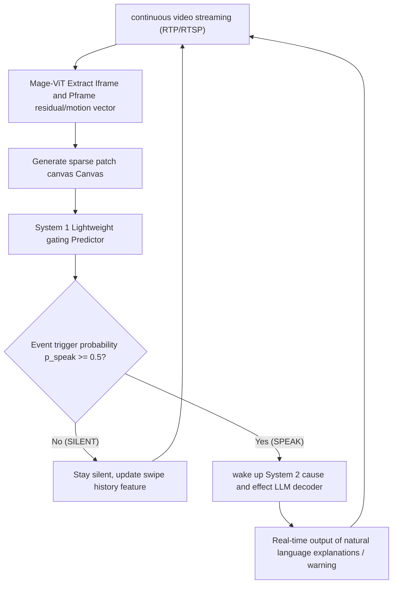

##### Comparison: Uniform Sampling VLM vs. Mage-VL
{: id="对比均匀采样-vlm-与-mage-vl"}

|Compare dimensions|Traditional uniform sampling VLM (such as Qwen-VL)|Mage-VL (method in this article)|
|---|---|---|
|**Visual sampling mechanism**|Fixed frame rate (1–2 fps) decimates the entire frame evenly|Codec native (I frame anchor + P frame motion/residual top-k patch)|
|**Token consumes**|The number of frames increases linearly, and the background redundancy is high.|The visual token is reduced by **75%+**, and the spatiotemporal features are highly compact.|
|**Streaming response mechanism**|Passively wait for User Query to trigger full inference|**System 1 gate control (low power consumption) + System 2 decoding (active wake-up)**|
|**Streaming inference acceleration**|The computing power bottleneck is large and it is difficult to run in real time.|The overall end-to-end inference speed is increased by up to **3.5×**|

---

### 3. Results and findings
{: id="3-核心结果发现-4"}

#### 1. Benchmark performance
{: id="1-基准评测表现"}
- **static images and conventional videos**: Mage-VL-4B fully aligns Qwen3-VL-4B on static multimodal tasks, and performs excellently on video understanding and 2D/3D spatial reasoning. The overall performance greatly exceeds the 15B scale Phi-4-reasoning-vision strong baseline.
- **Streaming perception and inference efficiency**: Achieve SOTA performance on streaming video benchmarks such as VSI-Bench and StreamingBench, while achieving end-to-end inference with the highest wall-clock acceleration of **3.5×**.

#### 2. Seven core empirical findings (Empirical Findings)
{: id="2-七大核心实证发现empirical-findings"}
1. **Finding 1 (pretraining data efficiency)**: Large-scale web text pairs are not required for the VLM visual encoder. Mage-ViT is trained from scratch based on only 560 million unlabeled images and 100 million video frames through clustering and discrimination, and its performance can match or surpass top encoders trained on billions of image-text pairs.
2. **Finding 2 (variable resolution scaling)**: Variable resolution pretraining can achieve continuous expansion capabilities that increase monotonically as the resolution and token budget increase.
3. **Finding 3 (long video SFT redundancy)**: Dense video subtitle pretraining enables the model to naturally have long video QA capabilities without the need for special long video VideoQA SFT data.
4. **Finding 4 (Motion and Spatial Collaboration)**: Dynamic video training and 2D/3D spatial intelligence have significant synergistic effects, and training video actions can feed back static spatial reasoning.
5. **Finding 5 (codec native efficiency)**: Codec native input significantly improves video representation efficiency, achieving higher accuracy and 3.5× acceleration under the same token budget compared to uniform sampling.
6. **Finding 6 (AI4AI Data Pipeline)**: AI-driven prompt-code joint optimization can significantly enhance downstream performance (e.g. InfoVQA +5.62, OCRBench +3.80).
7. **Finding 7 (Zero-Vision SFT paradigm)**: It skips the visual SFT stage and directly performs SFT on the plain text track followed by multimodal RL, which can successfully unlock the agentic tool calling and reinforcement learning capabilities of the model.

---

### 4. Limitations
{: id="4-局限性-4"}
1. **Neural Codec Integration Cost**: Although the model natively supports neural codecs such as DCVC-RT, the computational overhead of extracting real-time neural probability density on edge devices still needs to be optimized.
2. **Complex Agent task gap**: In the original baseline version without multimodal RL reinforcement learning tuning, the model still has a certain capability gap compared with the top closed-source model in extremely complex long-term multi-step Agent decision-making tasks.

---


<a id="vlm-summary"></a>

# 9. Summary
{: id="9-总结"}

To understand a VLM, you can check it along the path of **input representation → cross-modal access → training target → output and evaluation**, without having to arrange all models into a single architecture evolution chain.

1. **Input representation determines what information can be retained**: Visual encoder, resolution, slices, and video sampling affect detail and timing coverage; subsequent inference cannot reliably recover lost evidence.
2. **The connection method determines how to use visual information**: MLP projection, Q-Former and inter-layer cross-attention respectively make different trade-offs in implementation cost, compression degree and fusion position. There is no unified winner out of the task.
3. **training determines whether the interface can be converted into capabilities**: image and text alignment, multi-task training, instruction fine-tuning and preference optimization to solve different problems; the number of training stages and freezing strategy should be subject to data, initialization and budget.
4. **evaluation determines whether the conclusion is valid**: In addition to accuracy, you also need to pay attention to illusion, fine-grained positioning, video timing, plain text capability retention, as well as latency and GPU memory cost.

When conducting experiments, you can first determine the target task and evaluation set, and then select the input budget and model structure; after reproducing a complete recipe, change a small number of variables each time, and use the verification results to judge the benefits. A single leaderboard score, or model size, cannot replace this process.

The connection between VLM and embodied systems can continue to be combined with  and  Reading: Visual language understanding provides the perceptual and semantic foundation, and geometric modeling and action learning further handle spatial constraints and closed-loop execution.
