> This collection extends [VLN Papers: Instruction Following](/en/VLN-Papers/) with **34 main readings and 3 related readings (37 in total)**, plus goal-navigation leaderboards. It focuses on goal navigation, locomotion, mobile manipulation, and additional studies. The main collection covers 55 representative instruction-following methods, benchmarks, and foundational works. The two collections follow research focus and reading sequence; publication status is not the sole criterion.

<div id="paper-filter-bar" class="paper-filter-bar"></div>

# Goal-navigation leaderboards
{: id="goal-nav-leaderboard"}

> ⚠️ **Do not compare scores across different benchmarks.** Goal navigation specifies an object category, an image, or coordinates, rather than route instructions. Instruction-following VLN is a separate task; see its [leaderboards](/en/VLN-Papers/). The five tables continue the main collection’s numbering: ④ closed-set object goals, ⑤ open-vocabulary object goals, ⑥ image goals, ⑦ point goals, and ⑧ multimodal goals and custom benchmarks. Rows are grouped by benchmark, with thick separators. Scenes, categories, and success criteria differ across groups, including HM3D v1 and v2; compare SR only within a group. ObjectNav benchmarks do not define NE / OSR.
>
> **Reading the tables:** **Trained** means trained or fine-tuned on navigation data. **Training-free** means no navigation model is trained: the system combines existing large models, detection or segmentation models, and rules or planners. Calling a pretrained low-level point-goal controller does not change this classification. Gray rows use nonstandard protocols, such as validation subsets, and are excluded from best-value bolding. Bold values are the best among non-gray rows within the same benchmark; groups with only one row are not bolded. Filters select paradigm, input configuration, and open-source availability, and can hide gray rows.

<div id="lb-filter-bar" class="lb-filter-bar"></div>

## ④ Closed-set object goals · ObjectNav (HM3D · MP3D · Gibson)
{: id="-封闭类别物体目标--objectnavhm3d--mp3d--gibson"}

Closed-set object navigation: given an object category, find any instance in an unseen scene and stop near it

| Model | Year | Benchmark | Paradigm | Base model | SR ↑ | SPL ↑ | Open source |
|:-----|:----:|:----:|:----:|:----:|:----:|:----:|:----:|
| [Hydra-Nav (monocular)](#hydra-nav) | 2026 | HM3D-v2 | Trained | Qwen2.5-VL-7B | **84.8** | 41.1 | No |
| [AECNav (monocular)](#aecnav) | 2026 | HM3D-v2 | Training-free | DeepSeek-V4-Flash | 84.7 | **45.3** | No |
| [VLingNav (monocular)](#vlingnav) | 2026 | HM3D-v2 | Trained | LLaVA-Video-7B | 83.0 | 40.5 | No |
| [SysNav (monocular)](#sysnav) | 2026 | HM3D-v2 | Training-free | Gemini-2.5-Flash | 80.8 | 37.2 | [Yes](https://github.com/zwandering/SysNav) |
| [LightNav-0 (monocular)](/en/VLN-Papers/#lightnav-0) | 2026 | HM3D-v2 | Trained | Qwen3-VL-4B | 77.2 | 41.5 | [Yes](https://github.com/lightorigins/LightNav-0) |
| [HarnessVLN (monocular)](/en/VLN-Papers/#harnessvln) | 2026 | HM3D-v2 | Training-free | GPT-5.6-luna | 76.0 | 37.9 | No |
| [Qwen-RobotNav (monocular)](/en/VLN-Papers/#qwen-robotnav) | 2026 | HM3D-v2 | Trained | Qwen3-VL-4B | 75.6 | 30.6 | No |
| [3DGSNav (monocular)](#nav-3dgs) | 2026 | HM3D-v2 | Training-free | Gemini 3 Pro + GLM-4.5V | 75.0 | 44.2 | No |
| [Qwen-RobotNav (monocular)](/en/VLN-Papers/#qwen-robotnav) | 2026 | HM3D-v2 | Trained | Qwen3-VL-8B | 71.2 | 33.0 | No |
| [EvoMemNav (monocular)](#evomemnav) | 2026 | HM3D-v2 | Training-free | Qwen-8B | 63.8 | 39.4 | No |
| [3DGSNav (monocular)](#nav-3dgs) | 2026 | HM3D-v1 | Training-free | Gemini 3 Pro + GLM-4.5V | **80.0** | **51.8** | No |
| [VLingNav (monocular)](#vlingnav) | 2026 | HM3D-v1 | Trained | LLaVA-Video-7B | 79.1 | 42.9 | No |
| [SysNav (monocular)](#sysnav) | 2026 | HM3D-v1 | Training-free | Gemini-2.5-Flash | 63.7 | 30.5 | [Yes](https://github.com/zwandering/SysNav) |
| [EvoMemNav (monocular)](#evomemnav) | 2026 | HM3D-v1 | Training-free | Qwen-8B | 59.2 | 33.6 | No |
| [VLFM (monocular)](#vlfm) | 2023 | HM3D-v1 | Training-free | – | 52.5 | 30.4 | [Yes](https://github.com/rai-opensource/vlfm) |
| [PanoNav (panoramic)](#panonav) <span class="lb-flag">200-episode subset</span> | 2025 | HM3D（version unspecified） | Training-free | Qwen2.5-VL + DeepSeek-V3 | 43.5 | 23.7 | No |
| [Hydra-Nav (monocular)](#hydra-nav) | 2026 | MP3D | Trained | Qwen2.5-VL-7B | **64.0** | **29.6** | No |
| [VLingNav (monocular)](#vlingnav) | 2026 | MP3D | Trained | LLaVA-Video-7B | 58.9 | 26.5 | No |
| [Qwen-RobotNav (monocular)](/en/VLN-Papers/#qwen-robotnav) | 2026 | MP3D | Trained | Qwen3-VL-4B | 52.2 | 16.0 | No |
| [AECNav (monocular)](#aecnav) | 2026 | MP3D | Training-free | DeepSeek-V4-Flash | 51.3 | 25.9 | No |
| [SysNav (monocular)](#sysnav) | 2026 | MP3D | Training-free | Gemini-2.5-Flash | 50.7 | 18.1 | [Yes](https://github.com/zwandering/SysNav) |
| [Qwen-RobotNav (monocular)](/en/VLN-Papers/#qwen-robotnav) | 2026 | MP3D | Trained | Qwen3-VL-8B | 48.8 | 17.7 | No |
| [3DGSNav (monocular)](#nav-3dgs) | 2026 | MP3D | Training-free | Gemini 3 Pro + GLM-4.5V | 43.6 | 21.3 | No |
| [VLFM (monocular)](#vlfm) | 2023 | MP3D | Training-free | – | 36.4 | 17.5 | [Yes](https://github.com/rai-opensource/vlfm) |
| [VLFM (monocular)](#vlfm) | 2023 | Gibson | Training-free | – | 84.0 | 52.2 | [Yes](https://github.com/rai-opensource/vlfm) |

Note: HM3D-v1 is the val of the Habitat 2022 Challenge (2000 items/20 scenes/6 categories), and HM3D-v2 is the val of the 2023 Challenge (1000 items/36 scenes/6 categories). The scenes and annotations of the two are different. The original text of VLFM only writes HM3D, but the 2000 items/20 scenes/6 categories given are consistent with v1; the original text of Hydra-Nav does not specify a version, but its baseline WMNav in Table 2 is 72.2, which is consistent with the HM3D-v2 score of the original WMNav text, and is therefore classified into v2; the original text of PanoNav does not specify the version, and is listed in a separate group. PanoNav evaluates only 200 randomly sampled HM3D validation episodes, listed in gray. Hydra-Nav takes the IRFT (Stage 3) results of the original Table 2. Qwen-RobotNav takes arXiv v3, divided into two sizes of 4B / 8B; LightNav-0 takes arXiv v2 numbers (HM3D-v2 of v1 is 79.5 / 43.7).

## ⑤ Open-vocabulary object goals · HM3D-OVON
{: id="-开放词汇物体目标--hm3d-ovon"}

Open-vocabulary object navigation; val-unseen unless otherwise noted, lines marked † are unspecified in the original text

| Model | Year | Paradigm | Base model | SR ↑ | SPL ↑ | Open source |
|:-----|:----:|:----:|:----:|:----:|:----:|:----:|
| [Hydra-Nav (monocular)](#hydra-nav) | 2026 | Trained | Qwen2.5-VL-7B | **66.3** | **37.4** | No |
| [HarnessVLN (monocular)](/en/VLN-Papers/#harnessvln) | 2026 | Training-free | GPT-5.6-luna | 59.3 | 36.6 | No |
| [OmniNav (multi-view)](/en/VLN-Papers/#omninav) | 2026 | Trained | Qwen2.5-VL-3B | 59.2 | 33.2 | [Yes](https://github.com/amap-cvlab/OmniNav) |
| [AECNav (monocular)](#aecnav) | 2026 | Training-free | DeepSeek-V4-Flash | 57.3 | 30.5 | No |
| [SysNav (monocular)](#sysnav)<sup>†</sup> | 2026 | Training-free | Gemini-2.5-Flash | 54.9 | 26.1 | [Yes](https://github.com/zwandering/SysNav) |
| [Qwen-RobotNav (monocular)](/en/VLN-Papers/#qwen-robotnav) | 2026 | Trained | Qwen3-VL-4B | 53.1 | 20.9 | No |
| [Qwen-RobotNav (monocular)](/en/VLN-Papers/#qwen-robotnav) | 2026 | Trained | Qwen3-VL-8B | 51.2 | 24.0 | No |
| [VLingNav (monocular)](#vlingnav) | 2026 | Trained | LLaVA-Video-7B | 50.1 | 24.6 | No |
| [LightNav-0 (monocular)](/en/VLN-Papers/#lightnav-0) | 2026 | Trained | Qwen3-VL-4B | 47.0 | 24.2 | [Yes](https://github.com/lightorigins/LightNav-0) |
| [AstraNav-World (multi-view)](/en/VLN-Papers/#astranav-world)<sup>†</sup> | 2025 | Trained | Qwen2.5-VL-3B | 45.7 | 28.7 | [Yes](https://github.com/amap-cvlab/AstraNav-World) |
| [NavFoM (multi-view)](/en/VLN-Papers/#navfom) | 2025 | Trained | Qwen2-7B | 45.2 | 31.9 | No |
| [JanusVLN (monocular)](/en/VLN-Papers/#janusvln)<sup>†</sup> | 2026 | Trained | Janus-Pro-7B | 44.9 | 31.7 | [Yes](https://github.com/MIV-XJTU/JanusVLN) |
| [LocalNav-Claude (monocular)](#localnav) | 2026 | Training-free | Claude Sonnet 4.6 | 39.7 | 19.7 | No |
| [LocalNav-Qwen (monocular)](#localnav) | 2026 | Trained | Qwen3.5-4B | 34.5 | 17.2 | No |

Note: † The original text of SysNav, AstraNav-World and JanusVLN only gives one column of HM3D-OVON results, without specifying the division; NavFoM is four views setting (single viewing angle is 43.6 / 31.3); OmniNav is OmniNav* with slow thinking system enabled. LocalNav-Claude is a training-free version that directly uses Claude Sonnet 4.6 to make decisions. LocalNav-Qwen is Qwen3.5-4B that uses Claude trajectories for SFT distillation.

## ⑥ Image goals · HM3D-IIN / Image-Goal
{: id="-图像目标--hm3d-iin--image-goal"}

The target is given in an image: HM3D-IIN is an instance image navigation (given a photo of the target object, find the same instance), Image-Goal is given an image taken at the target location

| Model | Year | Benchmark | Paradigm | Base model | SR ↑ | SPL ↑ | Open source |
|:-----|:----:|:----:|:----:|:----:|:----:|:----:|:----:|
| [GaussNav (monocular)](#gaussnav) | 2025 | HM3D-IIN | Trained | – | **72.5** | **57.8** | [Yes](https://github.com/XiaohanLei/GaussNav) |
| [VLingNav (monocular)](#vlingnav) | 2026 | HM3D-IIN | Trained | LLaVA-Video-7B | 60.8 | 37.4 | No |
| [WAM-Nav (monocular)](#wam-nav) | 2026 | Clutter/Intern (Image-Goal) | Trained | – | **50.2** | **48.2** | No |
| [NavDP (monocular)](#navdp) | 2025 | Clutter/Intern (Image-Goal) | Trained | – | 43.4 | 41.4 | [Yes](https://github.com/InternRobotics/NavDP) |

Note: Clutter/Intern is the average of the four groups of ClutterScenes (Easy/Hard) and InternScenes (Home/Commercial); WAM-Nav and NavDP are both end-to-end diffusion/world model strategies and high-frequency output trajectories. The lines of NavDP are taken from the baseline reproduction of Table 3 of the WAM-Nav original text (arXiv v2). The original NavDP text does not report this benchmark.

## ⑦ Point goals · Point-Goal
{: id="-点目标--point-goal"}

The target is given in coordinates relative to the starting point, and does not involve semantic recognition. It mainly examines obstacle avoidance and local path planning.

| Model | Year | Benchmark | Paradigm | Base model | SR ↑ | SPL ↑ | Open source |
|:-----|:----:|:----:|:----:|:----:|:----:|:----:|:----:|
| [WAM-Nav (monocular)](#wam-nav) | 2026 | Clutter/Intern (Point-Goal) | Trained | – | **80.4** | **78.0** | No |
| [NavDP (monocular)](#navdp) | 2025 | Clutter/Intern (Point-Goal) | Trained | – | 77.8 | 74.8 | [Yes](https://github.com/InternRobotics/NavDP) |

Note: The scene composition of Clutter/Intern is the same as the source of NavDP line in table ⑥. Only one paper reported point-goal benchmark (IsaacLab 40-Scenes, ABotN-PointBench) listed in Table ⑧.

## ⑧ Multimodal goals and custom benchmarks
{: id="-多模态目标与自建基准"}

Multi-modal long-range target (GOAT-Bench), and self-built benchmark reported in only one paper so far

| Model | Year | Benchmark | Paradigm | Base model | SR ↑ | SPL ↑ | Open source |
|:-----|:----:|:----:|:----:|:----:|:----:|:----:|:----:|
| [GSMem (monocular)](#gsmem) | 2025 | GOAT-Bench | Training-free | GPT-4o | **67.2** | **46.9** | No |
| [EvoMemNav (monocular)](#evomemnav) | 2026 | GOAT-Bench | Training-free | Qwen-8B | 59.6 | 38.9 | No |
| [X-NavDP (monocular)](/en/VLN-Papers/#x-navdp) | 2026 | IsaacLab 40-Scenes (Point-Goal) | Trained | – | 84.28 | 77.19 | [Yes](https://github.com/InternRobotics/NavDP) |
| [ABot-N1 (three cameras)](/en/VLN-Papers/#abot-n1) | 2026 | ABotN-PointBench (Indoor) | Trained | Qwen-3.5-4B + 2B | 95.4 | 93.7 | No |
| [ABot-N1 (three cameras)](/en/VLN-Papers/#abot-n1) | 2026 | ABotN-PointBench (Outdoor) | Trained | Qwen-3.5-4B + 2B | 92.9 | 91.4 | No |
| [ABot-N1 (three cameras)](/en/VLN-Papers/#abot-n1) | 2026 | Short-Horizon OVON | Trained | Qwen-3.5-4B + 2B | 84.9 | 51.8 | No |
| [ABot-N1 (three cameras)](/en/VLN-Papers/#abot-n1) | 2026 | ABotN-POIBench | Trained | Qwen-3.5-4B + 2B | 77.3 | 72.6 | No |
| [VNT-PA (monocular)](#vnt-pa) | 2026 | HM3D (Point-Goal, prior exploration frames) | Trained | – | 93.3 | 90.4 | No |

Note: GOAT-Bench is val-unseen. Multiple goals in the form of categories, text descriptions or images are given in one episode. IsaacLab 40-Scenes is the point-goal evaluation of X-NavDP; ABotN-PointBench, Short-Horizon OVON and ABotN-POIBench are the self-built settings of ABot-N1. PointBench uses a zero-collision success rate indoors (SR&lt;1col) and a three-collision success rate (SR&lt;3col) outdoors. The two judgments are different; POIBench counts arrival within 2 m of the entrance as success. HM3D (Point-Goal, a priori exploration frame) is the setting of VNT-PA: the planner only reads the depth frame and pose of a segment of the a priori exploration trajectory, without looking at the current view, and stops within 0.2 m of the target as success. Each self-created benchmark has only one line and should not be bolded, nor should it be compared with numbers in other tables.

# Extended paper readings
{: id="具身导航论文扩展"}

## 1. VLFM (2023)
{: id="vlfm"}
——Vision-Language Frontier Maps for Zero-Shot Semantic Navigation

📄 **Paper**: [arXiv:2312.03275](https://arxiv.org/abs/2312.03275) · 🏛️ **ICRA 2024**

**Background and problem**
Zero-shot semantic navigation requires robots to efficiently locate target objects in unseen environments. Existing methods (such as ESC, SemUtil) rely on object detectors to convert visual cues into text and then use LLM/BERT for semantic reasoning. There are computational bottlenecks and they cannot fully utilize visual-language joint representation. How to directly extract semantic value from RGB observations to guide frontier exploration has become a key challenge.

**Method and innovations**

VLFM proposes a language-driven frontier value map framework to achieve end-to-end visual-semantic reasoning:

<div align="center">
  
<figcaption>
VLFM system architecture: three-stage process of initialization, semantic frontier exploration, and goal navigation
</figcaption>
</div>

**core mechanism:**

1. **Frontier Waypoint Generation**
   - Use depth and odometry to construct a 2D occupancy map and identify the boundaries of explored and unexplored areas as frontier candidate points
   - Each frontier midpoint serves as a potential navigation waypoint

2. **Value Map Generation**
   - Compute semantic value scores directly from RGB images using the pre-trained BLIP-2 vision-language model
   - Text prompt: "Seems like there is a &lt;target object&gt; ahead"
   - Output cosine similarity score and project to top view value map (dual channel: semantic score + confidence score)

<div align="center">
  
<figcaption>
Value map generation process: BLIP-2 calculates semantic scores and projects them to the top view
</figcaption>
</div>

1. **Confidence-Weighted Averaging**
   - The confidence score is based on the relative optical axis position of the pixel: $c_{i,j} = \cos^2(\theta/(\theta_{fov}/2) \times \pi/2)$
   - Semantic value update for overlapping areas: $v_{i,j}^{new} = (c_{i,j}^{curr}v_{i,j}^{curr} + c_{i,j}^{prev}v_{i,j}^{prev})/(c_{i,j}^{curr} + c_{i,j}^{prev})$
   - Confidence update biased towards high confidence values: $c_{i,j}^{new} = ((c_{i,j}^{curr})^2 + (c_{i,j}^{prev})^2)/(c_{i,j}^{curr} + c_{i,j}^{prev})$

<div align="center">
  
<figcaption>
Confidence scoring mechanism: pixels near the optical axis have the highest confidence and decrease at the edges
</figcaption>
</div>

1. **Object detection and navigation**
   - YOLOv7 for COCO category, Grounding-DINO for open vocabulary detection
   - Mobile-SAM extracts the target contour and determines the closest point as the target waypoint
   - Use VER-trained PointNav policy to perform waypoint navigation (pure geometric understanding, not relying on semantics)

**Key innovation:**
- Direct visual-semantic reasoning: Bypassing the object detector, BLIP-2 generates semantic scores directly from RGB
- Spatialized value representation: mapping semantic values to overhead view grids to support frontier selection
- Confidence-driven fusion: dynamically balancing current observations and historical information

**Results and findings**
- **benchmark test performance**: reaches SOTA zero-shot performance on the three datasets of Gibson, HM3D and MP3D
  - Gibson: SPL 52.2%, SR 84.0% (+11.7% SPL, +14.7% SR compared to SemUtil)
  - HM3D: SPL 30.4%, SR 52.5% (+8.1% SPL, +13.3% SR compared to ESC)
  - MP3D: SPL 17.5%, SR 36.4% (+3.3% SPL, +7.7% SR compared to ESC)
- Surpassing some supervised methods: Outperforming ObjectNav training methods such as SemExp and PONI on Gibson and MP3D datasets
- **ablation experiment**: Confidence weighted average (Weighted avg.) is better than simple replacement (Replacement) and unweighted average (Unweighted avg.) on all datasets
- **Real-world deployment**: Successfully deployed on the Boston Dynamics Spot robot, efficiently navigating to unseen target objects in an office building environment, all models (BLIP-2, GroundingDINO, MobileSAM, ZoeDepth) running in real time on an RTX 4090 MaxQ notebook

**Limitations**
Only single-floor navigation is supported (the lack of z-coordinate odometry makes it difficult to reset the value map), and 14.6% and 9.6% of cross-floor tasks fail in HM3D and MP3D; assuming that the target object is visible at the default camera height, active camera control, interactive search (such as opening a drawer) and reusable semantic map representation can be explored in the future to support long-term multi-task planning.


## 2. NoMaD (2023)
{: id="nomad"}
——Goal-masked diffusion policy to achieve unified navigation

📄 **Paper**: [arXiv:2310.07896](https://arxiv.org/abs/2310.07896) · 🏛️ **ICRA 2024**

**Background and problem**

Traditional robot navigation systems usually train independent policy models for exploration and goal navigation (goal-conditioned navigation), which not only increases the complexity of the system, but also limits cross-task knowledge sharing and generalization capabilities. NoMaD (Nomadic Multi-task Agent with Diffusion, Berkeley, ICRA2024 Best Paper) proposes to use a unified diffusion policy framework and use a goal mask mechanism to simultaneously model task-specific behaviors (goal-oriented) and task-agnostic behaviors (exploration) to achieve a single policy capable of multiple navigation tasks.

**Method and innovations**

<div align="center">
  
<figcaption>
NoMaD goal mask diffusion policy framework
</figcaption>
</div>

### Core idea
{: id="核心思路"}

Simultaneously model task-specific and task-agnostic behavior through a unified diffusion policy

### Two key components
{: id="两个关键组件"}

**Goal Masking**
- The binary mask controls whether the strategy focuses on the target image to achieve flexible switching of task conditions.
- **During training**: The goal mask is randomly set with a 50% probability, so that the model can learn goal-oriented behavior and exploratory behavior at the same time.
- **inference time**: Set the mask according to the task needs (cover the target when exploring, provide the target when navigating)

**Diffusion Policy**
- Use diffusion models to generate multi-modal, collision-free action sequences
- Stepwise iterative generation of predicted action sequences from random noise
- Action distributions can express exploratory behavior in the absence of a goal, or converge to goal-directed behavior in the presence of a goal.

### Unified framework design
{: id="统一框架设计"}

- Encode visual observations through Transformer and combine with Diffusion model to generate future action sequences
- Supports both task-specific behavior (goal-directed) and task-agnostic behavior (exploration)
- End-to-end supervised training using large-scale diverse datasets (GNM and SACSoN)

<div align="center">
  
<figcaption>
Schematic diagram of NoMaD goal masking mechanism
</figcaption>
</div>

**Results and findings**

- **Exploring unknown environments**: The success rate reaches 98%, the average number of collisions is only 0.2, which exceeds the optimal baseline Subgoal Diffusion by about 25%, and the number of parameters is only 1/15 of it.
- **goal navigation**: In the goal navigation task in a known environment, the success rate is comparable to the optimal baseline, but requires less computing resources
- **Computational efficiency**: The computational efficiency is approximately 15 times higher than that of existing methods. It is the first target conditional action diffusion model successfully deployed on a physical robot.
- **Advantages of unified strategy**: Joint training can learn shared representation and environmental operability, and a single policy can handle multiple behaviors
- **encoder selection**: ViNT encoder works best with attention goal mask, success rate is 98%, and the number of collisions is the least
- **Multi-scenario verification**: Excellent performance in 6 complex indoor and outdoor environments

**Limitations**

NoMaD's visual encoder selection has a greater impact on performance and requires careful tuning to achieve the best results. Although the ViT encoder has greater capacity and expressive capabilities, its training optimization is more difficult and its convergence speed is relatively slow. In addition, the random sampling ratio of the goal mask mechanism (50% during training) is a key hyperparameter that may need to be adjusted in different scenarios. Although it performs well in multiple indoor and outdoor environments, there is still room for further improvement in robustness in extremely complex and highly dynamic scenes (such as dense human flow, rapidly changing obstacles).

---


## 3. NAVCON (2024)
{: id="navcon"}
———— The first large-scale Vision-Language Navigation concept dataset for cognitive elicitation and language grounding

📄 **Paper**: [arXiv:2412.13026](https://arxiv.org/abs/2412.13026)

### Key takeaways
{: id="精华"}

1. The first vision-language navigation (VLN) concept dataset NAVCON based on cognitive science and linguistic theory is proposed, which contains 236,000 high-level navigation concept annotations for about 30,000 instructions in R2R and RxR.
2. Four core navigation concepts are defined: localization itself (SIT), moving path (MOVE), changing direction (CD) and changing region (CR), forming a complete navigation language primitive.
3. Using timestamp information from RxR, cross-modal temporal alignment of 2.7 million frames of images/video clips with navigation concept phrases was achieved through the Habitat simulator.
4. The lightweight sequence annotation model NCC, which was fine-tuned based on this corpus, achieved a concept and text span prediction accuracy of 96.53%, showing strong generalization and grounding potential.
5. This work provides a structured semantic parsing tool to break the VLN end-to-end black box design, helping to improve the interpretability and real-time operation efficiency of cross-modal alignment.

---

### 1. Background and problem
{: id="1-研究背景问题"}

Traditional vision-language navigation (VLN) models mostly adopt a black-box end-to-end architecture, which has problems such as imbalanced alignment of visual and text tokens and lack of interpretability. In addition, existing syntax parsing methods rely too much on external noisy dependency parsers, resulting in poor generalization performance and low interpretability in downstream robot navigation tasks. Therefore, how to define a complete navigation concept and achieve low-cost, high-precision fine-grained text-video alignment is a key bottleneck in achieving trustworthy, transparent, and efficient embodied agent navigation.

---

### 2. Method and innovations
{: id="2-主要方法创新点"}

NAVCON proposes a complete set of automated construction and annotation pipelines for vision-language navigation concepts, realizing end-to-end alignment of natural language instructions to core navigation concepts (labels + text spans) and video clips.

<div align="center">
  
<figcaption>
NAVCON Overview of the processing steps for navigation concepts and video clip generation
</figcaption>
</div>

#### ① Overview of the overall framework
{: id="-整体框架概述"}
The entire construction framework consists of three core stages: **navigation concept definition**, **language concept extraction and manual evaluation**, and **video clip alignment and timing window fine-tuning**. It extracts action predicates and modifying phrases in instructions through a natural language processing pipeline, and performs multi-modal temporal correlation with the agent's first-person video stream exported by the Habitat simulator.

#### ② Explain module by module
{: id="-逐模块讲解"}
- **Navigation concept definition module**:
  - **input**: unlabeled navigation instruction text.
  - **processing**: Based on cognitive scientific research on spatial mapping of animal and human brains (such as hippocampal place cells, limbic system head direction cells, entorhinal cortex boundary cells, and autonomous movement systems), the system defines four core navigation concepts:
    - **Situate Yourself (SIT)**: Identifies the current location and environmental characteristics (such as "standing in front of that pillar").
    - **Move along a Path, MOVE**: Represents the displacement along a specific physical channel (such as "step into this area with a large pool").
    - **Change Direction (CD)**: Describes the rotation of the direction (such as "turn around from the bench").
    - **Change Region (CR)**: Describes the action of crossing a physical boundary and entering a new space (such as "enter the room that is in front of you").
  - **Output**: Classification system of navigation concepts.
  - **design motivation**: Provide complete navigation language primitives that are consistent with cognitive science and cover mainstream VLN instructions.

- **Language concept extraction pipeline**:
  - **Input**: 30,815 training instructions from the R2R and RxR datasets.
  - **processing**: Use NLP tools such as Stanza constituency parser for word segmentation, stemming, part-of-speech tagging and syntactic analysis. First, 348 candidate root verbs were retrieved, and 81 navigation root verbs that were unambiguously mapped to the above four concepts were retained through manual screening; then all syntactic sub-nodes of these 81 root verbs were extracted to form a complete predicate phrase representing the navigation concept.
  - **Output**: 236,316 automatically generated "silver" navigation concept phrase annotations (including concept categories and corresponding text spans).
  - **Design motivation**: Reduce the cost of manual annotation, while using constituency trees to ensure the syntactic integrity of the extracted concept phrases (including modifiers and landmark nouns).

- **Video clip alignment and fine-tuning module**:
  - **Input**: RxR navigation instructions with word-level timestamps, Matterport 3D scenes, and agent pose traces.
  - **processing**: Using the Habitat simulator to render the agent perspective image (320x240 pixels) at a 10x downsampling rate, 7.6 million frames of images were extracted. Through RxR word-level timestamps, the extracted language concept phrases are temporally projected into the corresponding agent movement video clips. In order to solve the problem of alignment offset caused by inaccurate timestamps of some RxR words, resulting in actions that have not started or ended, a timing window fine-tuning strategy was introduced: extending the extraction time window of each clip backward by 5% of the total length of the video.
  - **Output**: 2.7 million frames of implemented concept-video aligned image data, covering 19,074 instructions.
  - **Design motivation**: Solve the time misalignment problem of cross-modal fine-grained alignment and provide large-scale high-quality video-language navigation primitive alignment data.

<div align="center">
  
<figcaption>
NAVCON concept and video clip alignment example (time passes from left to right)
</figcaption>
</div>

#### ③ Training objectives and classifiers
{: id="-训练目标与分类器"}
Based on the generated silver-label dataset, the paper trained a **navigation concept classifier (NCC)**. The model is based on the lightweight `distilbert-base-uncased`. It receives word segmentation instructions at the input end and uses the BIO format for token level classification at the output end (a total of 5 categories: SIT, MOVE, CD, CR's B/I tag, and O external words). Training uses the standard cross-entropy loss function for sequence annotation:
$$\mathcal{L} = -\sum_{i=1}^{N} \sum_{j=1}^{C} y_{i,j} \log p_{i,j}$$
Among them, $N$ is the sequence length, $C$ is the number of classification categories ($C=9$, including B- and I-marks and O), $y_{i,j}$ is the true label, and $p_{i,j}$ is the predicted probability.

---

### 3. Results and findings
{: id="3-核心结果发现"}

- **dataset features**: In the NAVCON concept distribution, MOVE (movement path) accounts for the largest proportion, reaching 42%; SIT (localization oneself) accounts for 28%; CD (change direction) accounts for 22%; CR (change area) accounts for 9%.

<div align="center">
  
<figcaption>
NAVCON Distribution statistics of navigation concepts in the dataset
</figcaption>
</div>

- **Annotation Quality Assessment**: Manual evaluation shows that the silver label concept classification accuracy reaches 95.82%, the corresponding text span coverage accuracy reaches 95.49%, and the missed detection rate is less than 4%. After introducing a timing window extension of 5%, the precise alignment of video clips increased significantly from 73.63% to 88.62%.
- **NCC classifier performance**: The NCC classifier performed extremely well on the unseen test set, achieving a 100% perfect match (Exact Match) ratio between concept categories and text spans as high as 96.53%.
- **LLM few-shot generalization ability**: Using GPT-4o for 3-shot context learning (In-Context Learning) for concept extraction, an Exact Match of 82.12% was achieved on unseen data, indicating that the navigation concept is highly learnable and generalizable for LLM.

---

### 4. Limitations
{: id="4-局限性"}

1. **Parser dependency**: The extraction of language concepts is extremely dependent on the syntactic parsing accuracy of the Stanza constituency parser. Syntax tree errors will directly lead to incomplete concept span extraction.
2. **Multi-modal alignment error**: Video-text alignment quality is limited by the accuracy of the word-timestamp annotation of the original RxR dataset, and despite window stretching, about 11% of the video clips are still incompletely aligned.

---


## 4. LoGoPlanner (2025)
{: id="logoplanner"}
——End-to-end navigation policy of localization grounding: "embedding" the visual geometry of metric scale into planning

📄 **Paper**: [arXiv:2512.19629](https://arxiv.org/abs/2512.19629) · 🏛️ **ICRA 2026**

**Background and problem**

Existing end-to-end navigation combines perception, mapping, and planning, **but still relies on a separate localization module (SLAM or visual odometry) for ego-state estimation**. This module requires accurate camera-to-base extrinsic calibration, generalizes poorly, and is especially unstable under motion-induced camera shake on legged robots. Most planners process single frames or short clips without summarizing long histories, so short-term estimation errors accumulate as drift. Single-frame perception also lacks the geometric memory needed for robust metric reasoning; reconstructions are often local or scale-ambiguous. The objective is point-goal navigation using only RGB-D observations, **without any external localization module**.

<div align="center">
  
<figcaption>
Comparison of three planning paradigms: (a) Traditional modular module-by-module decomposition introduces cascading errors; (b) Existing end-to-end still relies on explicit localization modules; (c) LoGoPlanner integrates implicit state estimation and metric-aware geometry into the strategy to achieve complete end-to-end planning.
</figcaption>
</div>

**Method and innovations**

LoGoPlanner collaborates end-to-end on three parts in a unified network: **(A) metric-aware visual geometry learning** - based on the pre-trained video geometry backbone VGGT, injecting depth scale priors, and generating world point embeddings through two auxiliary heads of local points/camera poses; **(B) localization Grounding's navigation policy** - decouples camera and chassis poses, uses state query / geometric query to aggregate implicit states and geometry into a unified planning context through cross-attention; **(C) Diffusion policy head** - iteratively denoises noisy actions based on planning context, and outputs collision-free trajectories. The entire link reduces "localization" and "mapping" from explicit modules to implicit features within the network, and planning error is the only final optimization goal.

<div align="center">
  
<figcaption>
overall architecture: ViT injects scale priors into image patches and then sends them to the video geometry backbone to fine-tune metric scale predictions; query-based design allows self-state and environment geometry to be implicitly aggregated by state/geometric query respectively; a detached diffusion policy head is hung at the end to generate feasible and collision-free trajectories.
</figcaption>
</div>

1. **Metric scale injection (Metric-aware Geometry)**: VGGT natively only reconstructs relative scales and cannot align planning trajectories. The author uses a lightweight ViT to encode the depth map into geometric tokens, fuses them with semantic tokens at the patch level, and obtains frame-by-frame features with metric scales through the transformer decoder with RoPE:

   $$t_i^{metric} = \text{Attention}_{\text{RoPE}}((t_i^I, t_i^D), pos)$$

Then branch to the **local point head** (supervising the camera system 3D point by the pinhole model) and **camera pose head** (decoding the camera to world transformation, the world system is defined in the chassis system of the last frame). The intermediate features of the two heads are spliced ​​and passed through context fusion and point cloud decoder to output **a dense metric-scale point cloud** with the current position of the robot as the origin, covering the occluded and rear-view areas.

2. **camera/chassis extrinsic parameter decoupling**: perception binding camera perspective, control execution in chassis coordinate system. The camera pose and chassis pose are split into two independent prediction tasks. It is assumed that the camera has no yaw rotation relative to the chassis. The chassis pose and the target relative to the current frame are additionally predicted from the pose features. The camera pose is converted by the fixed extrinsic parameter $$T_{b,i}=T_{c,i}\cdot T_{ext}$$. During training, data are constructed at arbitrary camera heights (0.25–1.25 m) and pitch angles (0°–30°), giving cross-embodiment robustness.

3. **Query-based implicit aggregation (drawing from UniAD)**: state query extracts the state from the pose token, geometric query extracts the environment geometry from the world point token, and is spliced with the target embedding and sent to the transformer decoder to obtain the planning context query $$Q_P$$. **Key**: Do not explicitly feed the extrinsic parameters/point cloud predicted by the upstream to the downstream to avoid cascading errors. The final optimization goal is always the trajectory planning error.

4. **Diffusion policy head**: Taking $$Q_P$$ as the condition, iteratively denoises the action block $$\{(\Delta x_t,\Delta y_t,\Delta\theta_t)\}$$ from Gaussian noise to generate feasible and collision-free trajectories.

The training adopts **two-stage**: the first stage fine-tunes the geometric model decoder and task head (injecting depth scale prior, supervising the measurement point cloud and extrinsic parameters); the second stage freezes the backbone decoder and jointly trains the diffusion head and task head.

**Results and findings**

- **simulation (InternScenes 40 unseen scenes)**: Under the condition of **with no external localization** at all, Home SR 57.3 / SPL 52.4, Commercial SR 67.1 / SPL 63.9, **exceeds ViPlanner** that uses oracle localization - relative to ViPlanner, Home SR increases by 27.3 percentage points and SPL increases by 21.3%.
- **Real world (3 platforms × 20 trajectories each, direct deployment without VO/SLAM)**: TurtleBot (office) SR 85% (17/20), Unitree Go2 (home) 70% (14/20), Unitree G1 (industrial) 50% (10/20), all better than iPlanner (10/15/0%) and ViPlanner (50/45/0%); the quadruped platform can still accurately position itself and avoid obstacles despite camera shake.

<div align="center">
  
<figcaption>
Visualization on three real scenes of office/home/industrial and different robot platforms. The green curve is the planned trajectory, and the blue and gray point clouds are the obstacles in the current frame and the previous frame respectively.
</figcaption>
</div>

- **ablation (key module)**: The three auxiliary tasks of Odometry / Goal / Point Cloud are superimposed one by one. Home SR increases from 49.5 in pure end-to-end to 51.3 → 52.4 → 57.3, proving that point cloud supervision brings spatial relationships beyond 2D semantics and significantly improves obstacle avoidance.
- **ablation (geometric backbone)**: DepthAnything (single frame) → Video DepthAnything → VGGT† (no metric scale) → VGGT (injection scale prior) is gradually improved; after injecting scale prior, PE drops from 0.87 to 0.55 (Home), indicating that **metric supervision is necessary for real deployments**.

<div align="center">
  
<figcaption>
reconstruction result visualization: the first line is the true scene point cloud, the second line is the predicted point cloud; the point cloud is predicted according to the metric scale with the last frame chassis as the coordinate origin.
</figcaption>
</div>

**Key innovation:**
1. **absorbs "localization" into the network**: uses long-term visual geometry backbone for implicit ego-state estimation, eliminating the need for calibration and external SLAM/VO, and direct deployment across ontology and perspectives.
2. **relative scale→absolute metric scale**: Inject a depth prior to correct the scale blur of VGGT to obtain a dense point cloud that can be aligned with the planning coordinate system.
3. **Implicit feature conditionalization instead of explicit transfer**: Use auxiliary task to distill geometry/pose capabilities into implicit features for diffusion head conditionalization, cut off cascading errors, and use planning error as the only optimization goal.

**Limitations**

Limited by the small number of available navigation scenes (about 2k), the reconstruction quality in real environments is still not ideal; the author is continuing to train on metric-scale real-world datasets to improve actual deployment performance.

---


## 5. VL-Nav (2025)
{: id="vl-nav"}
——Real-time zero-shot Vision-Language navigation system, integrating pixel-level vision-language features and heuristic spatial reasoning

📄 **Paper**: [arXiv:2502.00931](https://arxiv.org/abs/2502.00931) · 🏛️ **IROS 2026**

**Key takeaways**

This paper shows how to combine pixel-level vision-language features with heuristic exploration strategies to achieve efficient zero-shot navigation. Core ideas worth learning from include: (1) using Gaussian hybrid model to convert pixel-level VL features into spatial distribution instead of relying on a single image-level similarity score; (2) introducing instance-based target points to simulate human search behavior, allowing robots to approach and verify potential targets; (3) optimizing computational overhead through rolling occupancy grid and partial frontier detection so that the system can run in real time on a low-power platform; (4) combining distance weighting and unknown-area heuristic Avoid repeated movements and improve navigation efficiency in large-scale environments; (5) It is proved that the generalization ability of the modular method in the real world is better than the end-to-end learning method.

**Background and problem**

Current vision-language navigation systems face three major challenges: difficulty in interpreting pixel-level vision-language features, poor generalization ability in different environments, and inability to run in real time on low-power platforms. Existing methods such as VLFM rely on computationally intensive models and only use a single image-level similarity score for target selection, limiting their ability to exploit fine-grained vision-language cues.

**Method and innovations**

<div align="center">
  
<figcaption>
Overview of VL-Nav system architecture: integrating VL module, map module and HVL spatial reasoning
</figcaption>
</div>

VL-Nav proposes a vision-language navigation framework optimized for low-power robots, achieving 30 Hz real-time performance on Jetson Orin NX. The core innovation lies in the **Heuristic-Vision-Language (HVL) spatial reasoning**, which combines pixel-level vision-language features with heuristic exploration strategies.

**Rolling Occupancy Map**: The system maintains a dynamic 2D occupancy raster map with each cell labeled free (0), unknown (-1), or occupied (100). Unlike traditional fixed-size global grids, VL-Nav uses a rolling grid that is dynamically expanded only when new sensor data is needed, reducing memory usage and BFS/cluster computing overhead. The update process includes: (1) expanding the map as needed; (2) clearing obsolete obstacles within the forward FOV; (3) inflating new obstacles; (4) using raycasting to mark unknown cells as free.

**Frontier-based and Instance-based Target Points**: The system generates two types of candidate target points. Frontier-based points are identified within the forward wedge via partial frontier detection, testing only cells that satisfy angle and distance constraints, and clustering using BFS. Instance-based target points (IBTP) are candidate instance centers periodically reported from the vision-language detector, retaining detections with confidence levels above a threshold τdet. IBTP simulates human search behavior: when seeing a possible match, it will move closer to confirm, rather than ignore intermediate detection results.

<div align="center">
  
<figcaption>
Schematic diagram of VL Scoring: Pixel-level open vocabulary detection results are converted into spatial distribution through Gaussian hybrid model and FOV weighting
</figcaption>
</div>

**HVL spatial reasoning**: This is the core innovation of VL-Nav. For each candidate target g, the system calculates the HVL score. VL Score uses a Gaussian mixture model to convert pixel-level vision-language features into distributions on the robot-level FOV. Assume that the open vocabulary detection model identifies K possible directions, each parameterized by (μk, σk, αk), where μk represents the average offset angle within the FOV, σk encodes the angular uncertainty of the detection (fixed to 0.1), and αk is a confidence-based weight. VL score is calculated as:

S_VL(g) = Σ(k=1 to K) αk * exp(-1/2 * ((Δθ - μk)/σk)²) * C(Δθ)

Where C(Δθ) = cos²(Δθ/(θ_fov/2) * π/2) is the field of view confidence term, which reduces the weight of large-angle offset detection.

Heuristic Cues includes two heuristic terms: (1) Distance Weighting: S_dist(g) = 1/(1+d(xr,g)), which allows closer targets to obtain higher scores, reducing energy consumption and unnecessary wandering; (2) Unknown-Area Weighting: S_unknown(g) = 1 - exp(-k*ratio(g)), where ratio(g) is the ratio between unknown cells and reachable cells in the local BFS ratios that encourage exploration of targets that may reveal vast amounts of unknown space.

The final HVL score is: S_HVL(g) = w_dist * S_dist(g) + w_VL * S_VL(g) * S_unknown(g). The system gives priority to instance-based goals (based on VL score), and if there is none, the frontier goal with the highest score (based on HVL score) is selected.

**Path Planning**: After selecting the HVL goal, the system uses FAR Planner for point-goal path planning, using polygons to represent obstacles and updating the visibility map in real time, supporting efficient and heavy planning in partially unknown environments. The local planner refines the FAR Planner's waypoints into short-term velocity commands, ensuring quick reaction to new obstacles.
<div align="center">
  
<figcaption>
Four real-world experimental environments of varying scale and semantic complexity
</figcaption>
</div>

**Results and findings**

<div align="center">
  
<figcaption>
Trajectory comparison and detection results in different environments demonstrate the advantages of VL-Nav compared to Classical and VLFM methods
</figcaption>
</div>

VL-Nav is comprehensively evaluated on four real-world environments (Hallway, Office, Apartment, Outdoor), each with different semantic complexity (High, Medium, Low) and scale (Big, Mid, Small). Key findings include:

- **Overall performance**: VL-Nav reaches an overall success rate (SR) of 86.3%, which is 44.15% higher than the previous method. In all four environments, VL-Nav has the highest SR and SPL (Success weighted by Path Length).
- Impact of **Instance-based Target Points**: Performance drops significantly after removing IBTP, especially in complex environments (Apartment and Office), demonstrating the importance of allowing robots to approach and verify potential detection results.
- Contribution of **Heuristics**: Both SR and SPL decrease after removing the heuristic term, especially in large-scale environments, indicating that distance weighting and unknown-area heuristic are crucial to improve efficiency.
- **compared to VLFM**: VL-Nav surpasses VLFM in all environments, especially in semantically complex (Apartment) and open area (Outdoor) environments, the advantages are more obvious, proving the effectiveness of pixel-level VL features and HVL spatial reasoning.
- **Impact of environment scale**: The performance of classic Frontier Exploration drops sharply in large-scale environments (SR is only 36.7% in Big environment), while VL-Nav remains robust (82.3% SR), proving its adaptability in various scale environments.
- **Semantic complexity impact**: All methods perform better in semantically richer environments because structured indoor spaces provide stronger detection and segmentation cues. VL-Nav can make full use of semantic context and gain more significant advantages in high-complexity environments.
- **Real-time performance**: VL-Nav runs at 30 Hz on Jetson Orin NX, making real-world deployment feasible by selecting an efficient YOLO-World model variant (256×320 input, standard GPU runtime) and rolling occupancy grid.

**Limitations**

The system has difficulty processing complex language descriptions that contain hidden object references and specific text annotations. In addition, the system relies on manually defined thresholds (such as lighting conditions, etc.), which may not generalize well across different environments and scenarios, requiring further research on adaptive or learning-based threshold adjustment methods.

---


## 6. GaussNav (2025)
{: id="gaussnav"}
——Gaussian Splatting for Visual Navigation

📄 **Paper**: [arXiv:2403.11625](https://arxiv.org/abs/2403.11625) · 🏛️ **IEEE TPAMI 2025**

**Background and problem**

Instance ImageGoal Navigation (IIN) requires the agent to locate and navigate to a specific object instance depicted by a target image in an unexplored environment. It requires identifying the target object across viewing angles while ignoring distractors. Existing navigation methods based on BEV maps lack detailed texture representation, are difficult to perform instance-level tasks, cannot retain the instance-aware characteristics of the scene, and are not sufficient to distinguish multiple objects of the same category.

**Method and innovations**

GaussNav introduces 3D Gaussian Splatting (3DGS) into embodied visual navigation for the first time and proposes semantic Gaussian map representation:

<div align="center">
  
<figcaption>
Overall framework of GaussNav: Frontier exploration → Semantic Gaussian construction → Gaussian navigation
</figcaption>
</div>

**Frontier Exploration:**
- The agent maintains an exploration map and an obstacle map at the same time. The exploration map marks the explored area, and the obstacle map marks the obstacles in the scene.
- Detect the exploration map outline and eliminate obstacle map areas, set the nearest frontier point as the waypoint, and iteratively cover the entire environment

**Semantic Gaussian Construction:**

*Geometric reconstruction:*
- **3DGS simplified representation**: Each Gaussian is characterized by 9 parameters: RGB color vector c, center of mass µ∈R³, radius r, opacity o∈[0,1], category label l
- **Differentiable rendering**: RGB, depth and contour images are rendered through alpha compositing, supporting New View Composition (NVS)
- **key frame retrieval mechanism**: Aiming at the problem of limited overlap between frames in navigation scenes, historical frames are stored and periodically rendered to evaluate PSNR. Low-fidelity frames are prioritized and optimized using two-stage optimization (p1=30 iterations of new viewpoints, p2=60 iterations of key frame viewpoints)

<div align="center">
  
<figcaption>
Semantic Gaussian construction process: Gaussian densification and semantic Gaussian update alternately
</figcaption>
</div>

*Semantic feature injection:*
- **Instance segmentation**: Assigning semantic labels to each Gaussian using Mask-RCNN
- **Feature optimization**: Rendering pixel-by-pixel semantic features through feature splatting, optimizing feature losses to encourage intra-instance consistency and inter-instance separability
- **Gaussian clustering**: Clustering Gaussians based on semantic labels and 3D positions, segmenting objects in the scene into different instances under different semantic categories

**Gaussian Navigation:**

<div align="center">
  
<figcaption>
Gaussian navigation process: Classifier → Render descriptive image → Matching and localization → Path planning
</figcaption>
</div>

- **classifier**: Use ResNet50 to predict the semantic label ˆlg for target image classification, significantly reducing the search space (for example, the scene CrMo8WxCyVb is reduced from 648 potential observations to 33)
- **matching and localization**:
  - Generate descriptive images via NVS for each candidate instance (nv=1/3/5, θ=±15°/±30° horizontal and vertical rotation)
  - Use DISK to extract key points and feature descriptors, and use LightGlue matching to select the candidate object with the largest number of matching key points.
  - Use DBSCAN clustering to remove outliers caused by semantic segmentation errors and accurately locate target instances
- **Path planning**: Convert semantic Gaussian to point cloud and voxelize projection to 2D BEV grid, use FMM to generate shortest distance field and plan path

**innovation points:**
- Map representation that unifies geometric, semantic and instance-aware features, applying 3DGS to embodied visual navigation for the first time
- Directly locate target objects by rendering descriptive images without additional exploration or verification steps
- The keyframe retrieval mechanism effectively alleviates the problems of forgetting and surface holes in navigation scenes.

**Results and findings**

- **HM3D dataset performance**: SPL increased significantly from 0.347 to 0.578 (66.6% increase), success rate reached 72.5%, significantly surpassing all baseline methods
- **efficiency advantage**: The running frame rate exceeds 20 FPS, the highest efficiency among modular methods, and the search space optimization is significant (such as the CrMo8WxCyVb scene reducing from 648 observation points to 33)
- **ablation experimental verification**:
  - Removing the classifier caused Success to drop to 37.5% and SPL to 29.1%, but using the classifier reduced matching time by 2.5 times.
  - After removing the matching module, Success dropped to 44.4% and SPL dropped to 35.3%.
  - NVS is useful for identifying success rate, and GT NVS can further improve performance (Success increases from 72.3% to 74.7%)
  - Using the GT matching module, the success increased to 85.0%, and the GT target localization success reached 94.6%.
- **Rendering Quality Analysis**: On the HM3D verification set, the PSNR can reach up to 40, and the depth rendering error is close to zero, but the reconstruction quality of some high-texture scenes is poor.
- **Cross-scenario generalization**: Stable performance in 36 verification scenarios, semantic Gaussian visualization demonstrates robustness to a variety of scene complexities and object compositions

**Limitations**

Current methods suffer from poor reconstruction quality in high-texture environments, causing NVS to potentially produce artifacts such as holes. Analysis of error sources shows that there is still room for improvement in matching failures and inaccurate target localization. Semantic Gaussian is not suitable for direct path planning and needs to be converted into a 2D BEV grid, which increases computational overhead.

---


## 7. NavDP (2025)
{: id="navdp"}
——Only use simulation data for training, zero-shot migration to the navigation diffusion policy of real robots

📄 **Paper**: [arXiv:2505.08712](https://arxiv.org/abs/2505.08712) · 🏛️ **ICRA 2026** · [Code](https://github.com/InternRobotics/NavDP)

> In one sentence: NavDP uses **pure simulation data** to train an end-to-end navigation network, relying on the combination of "**diffusion model to generate multiple candidate trajectories + Critic scoring to select the safest one**" to achieve **zero samples sim-to-real**, and can be directly installed on different forms of robots such as TurtleBot / Unitree Go2 / G1 / Galaxea R1. The whole process does not require maps or any real robot training data.

**Background and problem**

Robots need to navigate in a dynamic, unstructured open world. The ideal state is that "it can be used directly by changing robots and changing scenes." But the two existing routes have shortcomings:

- **Traditional modularization method** (perception → mapping → localization → planning): large system delay, accumulation of errors between modules, and repeated manual adjustment of hyperparameters;
- **Learning method**: Limited by the scarcity of real data. Relying on real robot remote operation to collect data is slow and expensive, and difficult to scale up.

NavDP (Shanghai AI Lab) **fully embraces simulation data**: simulated scenes can be generated at scale and provide privileged information such as globally optimal paths and global ESDFs. Navigation involves much less physical interaction than manipulation, so its sim-to-real gap is smaller to begin with; domain randomization and photorealistic rendering further narrow it. Two questions follow: (1) how can privileged simulation information be distilled into the policy, and (2) how can the policy remain **safe** in unseen real environments? NavDP answers them with **imitation learning for trajectory generation** and **contrastive critic learning for trajectory evaluation**, respectively.

Positioning of **NavDP in the dual system framework**: NavDP plays the role of **System 1** in the fast-slow dual system (Fast-Slow System) - responsible for high-frequency, real-time local obstacle avoidance and path planning, and can be seamlessly linked to the VLM-driven System 2 (responsible for semantic understanding, task decomposition, and long-term memory), forming a complete open world navigation capability. This article focuses on System 1.

<div align="center">
  
<figcaption>
NavDP Full picture: The scalable data engine on the upper left (massive simulation scenarios + ontology planning + domain randomization + parallel rendering) produces training data → the navigation diffusion policy in the middle (without any real robot data, and learns "generating trajectories" and "evaluating trajectories" at the same time) → on the right side, multiple candidates are generated during inference and then safe trajectories are selected → The bottom shows zero-shot migration to a variety of real robots.
</figcaption>
</div>

**Method and innovations**

NavDP consists of two pillars: **(A) the scalable simulation data engine**, which is responsible for efficiently generating data; **(B) the unified strategy Transformer**, which simultaneously learns "generating trajectories" (Actor head) and "evaluating trajectory security" (Critic head) in a shared network. Let’s break it down one by one.

**(A) Extensible simulation data engine (DataEngine)**

The goal is to make "creating navigation data" fast and diverse. The process is:

1. **scene and ontology modeling**: The robot is simplified to a cylinder with a radius of $r_b=0.25\text{m}$ + a two-wheel differential model; in order to simulate different robots, **randomizes the robot height** (0.25–1.25 m) with **camera pitch angle** (−30°–0°), and two sets of camera FOVs (RealSense D435i and Zed 2) are provided. Objects higher than the height of the camera configuration are not counted as obstacles - this makes "short robots can drill, tall robots must go around" a natural common sense in the data.
2. **Generate collision-free trajectory**: Voxelize the scene grid (0.05 m) to calculate the **ESDF (Euclidean signed distance field) of the passable area**; A\* After planning the initial path, perform a local greedy search **on each path point to push it farther away from the obstacle**, and finally use cubic spline interpolation to smooth it into a continuous trajectory.
3. **Domain Randomization + Parallel Rendering**: Use BlenderProc to render photorealistic RGB-D, and apply **lighting / texture / perspective** three types of randomization to improve diversity.

Data generation reaches **2500 trajectories / GPU / day**, about **20×** faster than real-robot collection. The final dataset covers **3154 scenes, approximately 1627 km, 452 hours, and 40 million images** (Table I), exceeding earlier navigation datasets in scale and diversity.

**(B) Unified strategy Transformer (one network, two tasks)**

<div align="center">
  
<figcaption>
network architecture: multi-modal RGB-D fusion + target encoding as Key/Value, the trajectory is sent to the shared Transformer Decoder via Action Encoding as Query, and then separated into the Actor head (predicted diffusion noise = generated trajectory) and Critic head (predicted safety score = evaluated trajectory). The two tasks **share all weights** and are distinguished only by different Query and attention masks.
</figcaption>
</div>

**① Multi-modal coding (how to enter the network)**
- **RGB**: Take the latest $N=8$ frame, use pre-training and **freeze the DepthAnything encoder of**, and extract 256 patch tokens per frame (bringing in timing information).
- **depth**: only take the **single frame** depth, and use a **to train the ViT code of** from scratch (in order to align the absolute physical scale and facilitate trajectory generation); because the depth map has a sim-to-real gap, only keep (0.1 m, 5 m) range.
- **fusion compression**: Use a lightweight transformer decoder with a learnable query to compress $(N+1)\times 256$ tokens into $N\times 16$ compact tokens, reducing the amount of subsequent calculations.
- **target encoding**: following the PointGoal definition, the target is the 2D coordinate $(x_g, y_g)$ relative to the current pose, projected to the same dimension by MLP; **no-goal (NoGoal) exploration task** uses an all-zero tensor as the target embedding.

**② Actor head——diffused trajectory generation**
The expert trajectory is denoised according to DDPM, and the network learning **predicts the injected noise**. During inference, it is repeatedly denoised from Gaussian noise to obtain a trajectory composed of $M=24$ dense path points. **multi-modal distribution** demonstrated by experts in natural energy modeling of the diffusion process (the same place may have two correct paths, "left around" and "right around"). The training covers both PointGoal and NoGoal goals, and the loss is the weighted sum of the two noise prediction MSEs (default 0.5 each).

**③ Critic head - comparative trajectory evaluation (the most critical innovation of this article)**
This is the soul that distinguishes NavDP from ordinary diffusion strategies. Pure imitation learning has only seen the "correct trajectory" and cannot judge how dangerous a trajectory is. NavDP borrows the **Critic value function** idea from reinforcement learning: using the ready-made global ESDF in the simulation to give any trajectory a "safety score". Specifically, for the augmented trajectory $\hat\tau$, its ESDF value at the $m$th waypoint is recorded as $$d_{\hat\tau}^{m}$$, and the label value is defined as:

$$V(\hat\tau) = \gamma \cdot \sum_{m=0}^{M}(d_{\hat\tau}^{m+1} - d_{\hat\tau}^{m}) + \lambda \cdot \frac{1}{M}\sum_{m=0}^{M}\mathbb{I}(d_{\hat\tau}^{m} < d_{safe})$$

Intuitively, the first term rewards movement away from obstacles; the second penalizes waypoints too close to them (below the safety threshold $d_{safe}=0.5\text{m}$). During training, **random rotation augmentation** of expert trajectories creates contrasting collision and collision-free examples, teaching the critic to distinguish safe from dangerous behavior.

> **Key insight**: simulation expert trajectories sometimes pass too close to obstacles because hyperparameters are hard to tune. The critic does more than reject collisions: it selects the trajectory with **the largest safety margin** from a candidate batch, systematically improving sim-to-real robustness.

**④ inference process: first generate, then select**
At inference, the actor head **generates a batch of candidate trajectories at once**. The critic scores each one, and **the highest-value (safest) trajectory** is executed. This forms a two-stage loop: diffusion supplies diversity and the critic screens for safety. The figure projects predicted trajectories into the image and colors them by critic score, with blue indicating danger and red indicating safety.

<div align="center">
  
<figcaption>
Visualization of candidate trajectories on different robots (Unitree G1 / Go2 / Galaxea R1): the color is determined by the Critic value, the bluer the higher the risk, the red the safer. Even in the presence of pedestrian interference, motion blur, and lighting changes, NavDP can still select a safe path.
</figcaption>
</div>

**training configuration**: the entire network **single-stage joint training** Actor + Critic sum of two losses; diffusion steps 10, predicted path point $M=24$, RGB history $N=8$, safety threshold 0.5 m, trained with 32 A100, batch 2048.

**Results and findings**

- **PointGoal goal navigation**: SR 67.2 / SPL 62.6 in simulation, higher than the previous strongest ViPlanner (60.9 / 58.6) **+6.3% SR**; real robot cross-embodiment average SR 76.7%, **+23.4%** higher than ViPlanner (53.3%), leading overall on TurtleBot 9/10, Go2 7/10, G1 7/10.
- **NoGoal No-goal exploration**: The simulation average collision-free time is NoMaD’s **2.9×**, and the exploration area is **3.1×**; the real robot exploration time is as long as **3.8×** shows strong zero-shot generalization and obstacle avoidance consistency.
- **Comparison of three failure modes** (Fig. 4): single-frame iPlanner/ViPlanner inputs cause **temporal inconsistency** (the camera has passed an obstacle but the body has not, so abrupt path changes cause collisions), **sensitivity to depth noise**, and **misinterpretation of irregular obstacles with holes** that leads to attempted passage through walls. NavDP handles these cases through multiframe context and critic screening.
- **ablation experiment** (Table V, verifying three sets of factors):
  - **RGB-D is indispensable for fusion**: remove depth −10.3% SR, remove RGB −5.1% SR, single frame replaces multi-frame −2.8% SR.
  - **Critic is the key to security**: Use random trajectory selection (removing Critic selection) -7.8% SR under the same weight; remove contrast trajectory augmentation -3.0% SR (home scene).
  - **NoGoal is a useful side quest**: Joint Training NoGoal gives PointGoal +2.1% SR / +1.8% SPL instead.
- **Domain randomization is crucial for cross-embodiment** (Q5 / Fig. 6): If trained only with short robot (< 0.5 m) data, the tall Galaxea R1 cannot learn the "around the table" strategy, and the success rate plummets from **90% to 20%** (−70%), while the short Go2 is basically unaffected - proving that the diversity of **cross-embodiment data** is the root of generalization.

<div align="center">
  
<figcaption>
cross-embodiment data ablation: Scenario B, the medium and short robot Go2 can "get under the table", and the tall robot Galaxea R1 must "go around". When there is a lack of cross-embodiment training data, R1 cannot learn the detour strategy, and the success rate drops from 90% to 20%.
</figcaption>
</div>

**Limitations and future directions**

NavDP performance is highly dependent on high-quality simulation data; although diffusion model multi-step denoising brings trajectory diversity, it is more computationally expensive than direct regression. The author points out three future directions:

1. **Explicit ontology information encoding**: Currently, motion constraints are only learned implicitly from the data distribution, and the body shape cannot be clearly perceived; the ideal system should be able to judge "I can't get through this gap", that is, the robot geometric parameters are introduced into the decision-making as explicit conditions.
2. **Joint design of motor skills and path planning**: The current obstacle avoidance default is "can only walk around"; in extreme terrain (requiring jumping/crossing), the planner should make more reasonable passing/around decisions based on the upper limit of its own movement ability.
3. **Efficient post-training + language target + global memory**: Post-exploration training strategy improves real robot performance, extends the target to natural language instructions, and introduces global memory to support long-term exploration.

---


## 8. PanoNav (2025)
{: id="panonav"}
——Mapless Zero-Shot Object Navigation

📄 **Paper**: [arXiv:2511.06840](https://arxiv.org/abs/2511.06840) · 🏛️ **AAAI 2026 (Poster)**

**Background and problem**

Most existing goal navigation methods rely on depth sensors or pre-built maps to construct 2.5D scene representations, which limits their applicability and generalization capabilities in real environments. Zero-shot goal navigation requires the robot to identify and navigate to objects beyond the scope of predefined categories, and existing methods have limited performance in open vocabulary scenarios. Mapless methods usually make decisions based only on current observations, ignoring historical trajectory information, and are prone to local deadlocks.

**Method and innovations**

PanoNav is a zero-shot goal navigation framework without a map and using only RGB images. It contains two core modules:

<div align="center">
  
<figcaption>
Overall architecture of PanoNav framework
</figcaption>
</div>

**panoramic Scene Parsing:**

*Local direction analysis:*
- **lattice image enhancement**: Convert each RGB image into a lattice image, enhance plane position understanding through the Scaffold method, and serve as MLLM input together with the RGB image
- **spatial relationship diagram construction**: MLLM uses geometric distance relationships and plane position relationships to construct spatial relationship diagrams and generate detailed descriptions in each direction (object existence, spatial relationships, room types, etc.)

<div align="center">
  
<figcaption>
panoramic scene parsing module: from RGB input to local direction description
</figcaption>
</div>

*Global panoramic summary:*
- **Overall perception of the environment**: Overall analysis of the robot's surrounding environment, identifying the types of objects existing in the environment and the current room type (such as kitchen, corridor)
- **Implicit self-localization**: Provides implicit self-localization information through global summary to help the robot understand its position in the larger environment

**Dynamic Memory-guided Decision-Making:**

- **Dynamic bounded memory queue**: Stores the latest global scene summary. The queue length is fixed. When the queue is full, new elements will be added and the oldest elements will be removed.
- **Decision-making process**:
  - When the memory queue is not full: decisions are based only on the current local description and global summary
  - When the memory queue is full: Decision-making combines current information and historical memory information to avoid repeated exploration of visited areas
- **action selection**: The decision result includes the navigation direction and a sign of whether the target is found, and the locomotion controller performs the corresponding action.

<div align="center">
  
<figcaption>
Dynamic memory guides decision-making mechanism
</figcaption>
</div>

**task setting:**
- **observation data**: RGB images in six directions (spaced 60 degrees) are acquired at each time step to form a panoramic view and do not rely on depth sensors or GPS
- **action space**: stop, move forward (0.25 meters), turn left/right (30 degrees), look up/down
- **Mission goal**: Find the target object according to language instructions in an unseen environment and navigate to the target location

**Results and findings**

- **Performance advantage**: PanoNav’s success on the HM3D dataset rate (SR) reaches 43.5%, and SPL reaches 23.7%, which is significantly better than PixNav (SR=37.9%, SPL=20.5%) and ZSON (SR=25.5%, SPL=12.6%), and even exceeds methods that partially rely on maps and closed vocabularies.
- **Deadlock avoidance**: In a highly deceptive environment, the dynamic memory mechanism achieves 48.0% success rate and 19.2% SPL, and the escape rate from the local area reaches 82.0%
- **ablation experimental verification**:
  - Importance of panoramic views: Performance drops significantly when using only three views (SR=19.5%, SPL=9.97%)
  - Advantages of decoupling analysis and decision-making: The decoupling method (SR=43.5%, SPL=23.7%) is better than directly outputting decisions from MLLM (SR=38.5%, SPL=22.57%)
  - The key role of dynamic memory: performance drops significantly after removing dynamic memory (SR=38.5%, SPL=22.57%)

**Limitations**

Although PanoNav has significantly improved the performance of map-free zero-shot navigation, in the future it is still necessary to explore the use of multi-modal information (such as voice, gestures, etc.) to build a more powerful memory queue to further improve the robustness and generalization ability of map-free goal navigation.

---


## 9. ODYSSEY (2025)
{: id="odyssey"}
——Open-World Quadrupeds Exploration and Manipulation for Long-Horizon Tasks

📄 **Paper**: [arXiv:2508.08240](https://arxiv.org/abs/2508.08240) · 🏛️ **AAAI 2026**

**Background and problem**

In dynamic, unstructured environments, robots require a tight combination of mobility, manipulation, and real-time perception to perform complex tasks. Most of the existing research is limited to desktop scenarios, fails to solve the problems of limited perception and limited actuator range unique to mobile platforms, and has insufficient generalization capabilities in open-world environments.

**Method and innovations**

ODYSSEY proposed a unified mobile manipulation framework, including two core modules: hierarchical planning and whole-body control:

<div align="center">
  
<figcaption>
Overall architecture of ODYSSEY framework
</figcaption>
</div>

**Long-term mission planner:**
- **Global task-level planning**: Fusion of RGB and LiDAR streams to build an empty-semantic representation of the scene, using pre-trained basic model to map the instance graph to the scene
- Use GPT-4.1 to decompose natural language instructions into atomic action sequences (navigation, grabbing, placing, etc.) and output a rough target waypoint
- The waypoint is projected to the 2D occupancy map, and the collision-free target attitude is determined through local search.

**Partial operation:**
- Using wrist-mounted depth observations to guide a visual-verbal model to generate accurate end-effector poses
- Qwen2.5-VL-72B-InstructModel infers task-related touch points based on RGB observations and text descriptions
- Apply geometric constraints based on the main axis and surface normal of the target object to determine the orientation of the end effector.

<div align="center">
  
<figcaption>
Two-stage whole body control strategy training process
</figcaption>
</div>

**whole body control strategy:**
- A single network maps observation vectors (motor commands, end effector targets, ground height maps, gravity vectors, proprioceptive states, etc.) to target actions
- **Two-stage training**: The first stage fixes the training movement of the robot arm joints; the second stage controls all 18 joints and uses a terrain-invariant end-effector sampling strategy
- Introduce gait reward, frequency reward and end effector tracking items, and use domain randomization to enhance adaptability

**simulation benchmark test:**
- Build a diverse asset library containing 50 rigid objects, 15 containers, 30 joint structures, and 10 draggable objects
- The benchmark test includes 10 real scenes (indoor homes, supermarkets, restaurants, outdoor courtyards, etc.)
- The long-term tasks include 246 indoor and 58 outdoor variations involving various skills such as grasping, reorientation, container placement, and joint manipulation.

<div align="center">
  
<figcaption>
Performance comparison with baseline methods
</figcaption>
</div>

**Results and findings**

- **Short-term task**: Better than the PerAct baseline in the ARNOLDBenchmark test, relying only on a single egocentric camera to achieve stronger generalization capabilities, and the performance remains stable on unseen datasets
- **Long-term tasks**: Achieve an overall success rate of more than 40% on 8 long-term mobile manipulation tasks, maintain a success rate of more than 60% for each atomic skill category, and demonstrate reliable coordination capabilities
- **Low-level policy**: Better than the RoboDuet baseline in base speed tracking, end-effector attitude tracking performance is equivalent, and has stronger adaptability on different terrains
- **Sim-to-Real migration**: Successful real-world deployment on Unitree Go2+Arx5 platform, verifying the practicality of the framework in "Navigate to Fetch" and "Fetch and Place" tasks

**Limitations**

model has limitations in spatial reasoning of object geometry, resulting in poor gripper alignment and inaccurate localization of slender handles or partially obscured items. Furthermore, there are occasional failures when grasping small objects, mainly due to insufficient end-effector tracking and visual perception accuracy.

---


## 10. Skill-Nav (2025)
{: id="skill-nav"}
———Enhanced Navigation with Versatile Quadrupedal Locomotion via Waypoint Interface

📄 **Paper**: [arXiv:2506.21853](https://arxiv.org/abs/2506.21853) · 🏛️ **Vicinagearth (Springer) 2025**

### Key takeaways
{: id="精华-1"}

The core contribution of Skill-Nav is to use **waypoint (waypoint)** as the interface between the high-level planner and the low-level locomotion controller. Compared with the speed command interface, waypoint is less sensitive to tracking errors and is naturally compatible with LLM and classic path planning algorithms. The two-stage training strategy (WP-Fixed first learns skills, WP-Random then strengthens generalization) solves the problem of falling steps or excessive jumps in single-stage training, and is worth learning from other hierarchical robot control tasks. The Teacher-Student distillation architecture enables the Student policy to maintain safe navigation capabilities without accessing privileged information by introducing inflated virtual obstacles during Student training.

---

### 1. Background and problem
{: id="1-研究背景问题-1"}

Quadruped robots have been able to complete difficult sports such as extreme parkour through RL, but integrating rich motor skills into long-distance navigation tasks has not been fully explored. Most of the existing methods use speed commands as interfaces, which are difficult to accurately track by high-level planners and difficult to couple with diverse general planning tools (LLM, A\*).

---

### 2. Method and innovations
{: id="2-主要方法创新点-1"}

<div align="center">
  
<figcaption>
Skill-Nav overall architecture: a high-level planner (classic method or LLM) generates a waypoint sequence, and a low-level motion strategy executes various motion skills such as jumping, climbing, and detours.
</figcaption>
</div>

**Waypoint interface design**

Skill-Nav replaces velocity commands with 2D relative-position waypoints in the robot base frame. The high-level planner generates a start-to-goal waypoint sequence through $\mathcal{W} = \mathcal{H}(\mathbf{M}, p_e, p_s)$. Here, $\mathcal{H}$ can be A\* or an LLM, and $\mathbf{M}$ supplies coarse environmental information such as an occupancy map or room layout.

**Two-stage training strategy**

<div align="center">
  
<figcaption>
Training process: Teacher strategy is trained in WP-Fixed and WP-Random scenes in turn, using privileged information (terrain scan points, depth maps, etc.); Student strategy learns from Teacher through behavioral distillation, using only historical ontology perception and depth maps
</figcaption>
</div>

- **WP-Fixed Scenario** (skill learning): Obstacles are arranged in rows, and waypoints are preset. Strategy: Learn basic sports skills such as climbing boxes, crossing gaps, and crossing guardrails from scratch. Designing $r_{\text{reach}} = n_p/(t + \epsilon)$ encourages the robot to reach more waypoints quickly, while introducing $r_{\text{stay}}$ to make the robot wait for the next instruction after reaching a waypoint.

- **WP-Random scenario** (generalization enhancement): Obstacles are randomly distributed in the form of a matrix, and waypoints are dynamically selected based on the robot position and yaw angle. The modified $r_{\text{track}}$ is introduced. When the cosine similarity between the speed direction and the waypoint direction is $< 0.1$, a $-1$ penalty is given to encourage the robot to move toward the goal. During Student training, virtual expansion barriers are added to the depth map to keep the student strategy at a safe distance.

**Dual planner high-level architecture**

- **Classic Planning (A\*)**: Input an occupancy map containing only wall annotations, output a continuous waypoint sequence, and input the low-level controller as waypoint sampling at 0.5–3m intervals.
- **LLM planning**: Provide LLM with information such as task description, coarse-grained terrain map, robot movement capability (maximum climbing 0.45m, maximum span 0.7m gap), etc., and LLM generates waypoint index sequence (verified with GPT-4).

---

### 3. Results and findings
{: id="3-核心结果发现-1"}

<div align="center">
  
<figcaption>
Position access heat map of each method in the Omni-traverse task: This method (Ours) covers a wider area and shows stronger multi-directional movement capabilities
</figcaption>
</div>

<div align="center">
  
<figcaption>
Snapshots of robot navigation in simulation (LLM planning) and real world (A* planning), successfully traversing complex terrain
</figcaption>
</div>

- **Single-traverse task**: Skill-Nav reaches SR=1.00 and ATD=15.8m in both scenarios with and without high obstacles, and is the only method that is successful in both conditions.
- **Omni-traverse mission**: SR=0.89, ATD=8.2m, surpassing all comparison methods (RMA SR=0.00, Extreme Parkour SR=0.44/0.28).
- **ablation analysis**: Only WP-Fixed training (Ours-s1) has poor generalization ability due to waypoint distribution rules; only WP-Random training (Ours-s2) leads to excessive jumping gait, making actual deployment difficult; the combination of the two stages has the best effect.
- **Real robot deployment**: Successfully verified on Unitree AlienGo, it can cope with low obstacles not detected by the depth camera, and restore balance and continue navigation after being disturbed by external forces.

---

### 4. Limitations
{: id="4-局限性-1"}

High-level planners (especially LLM) may generate abnormal waypoints located in the center of gaps or at the edges of boxes, and it is difficult for low-level controllers to recover from such extreme positions; future work will design edge-free collision-free low-level controllers and explore end-to-end unified strategies for motion and navigation.


## 11. FantasyVLN (2026)
{: id="fantasyvln"}
——Unified multi-modal Chain-of-Thoughtinference for vision-language navigation

📄 **Paper**: [arXiv:2601.13976](https://arxiv.org/abs/2601.13976)

**Key takeaways**
This paper shows how to integrate text, visual and multi-modal CoTinference modes through a unified framework. Points worthy of reference include: (1) using CoT supervision during training and implicit inferenceParadigm directly predicted during inference, avoiding the token expansion problem of explicit CoT; (2) using pre-trained VARModel to compress imagined visual observations into a compact latent space, greatly reducing sequence length; (3) Unify different inference modes through cross-modal alignment constraints and learn modality-invariant inference representations; (4) The gating mechanism enables a single model to flexibly switch between multiple inference modes. This design achieves real-time navigation while maintaining inference capabilities, providing a practical solution for embodied intelligence tasks.

**Background and problem**
Existing VLN methods face key challenges: plain text CoT lacks spatial understanding and is prone to overfitting sparse annotations; multimodal CoT introduces severe token expansion by generating imaginary visual observations, causing inference delays to increase by several orders of magnitude, making real-time navigation impossible. This is particularly prominent in long-term, multi-stage navigation scenarios.

<div align="center">
  
<figcaption>
FantasyVLN system overview: integrating text and visual CoTinference modes, jointly modeling semantic planning and spatial understanding
</figcaption>
</div>

**Method and innovations**

FantasyVLN proposes a unified implicit inference framework. The core innovations include:

**1. Compact Visual CoT (CompV-CoT)**
- Encoding imagined visual observations into a compact latent space using pretrained Visual AutoRegressor (VAR)model
- VAR uses next-scale prediction paradigm, and a 256×256 image can be accurately reconstructed with only 30 visual tokens, with a compression ratio of 1/2185
- VLM directly generates VAR potential representations during training, and does not require explicit VAR decoding during inference, greatly improving efficiency.

**2. Unified multi-modal CoT (UM-CoT) framework**
- Controlling the activation of text and visual inference via binary gating signals gT and gV
- Four inference modes: (a) Non-CoT (gT=0, gV=0) directly predicts actions; (b) T-CoT (gT=1, gV=0) generates text inference steps; (c) V-CoT (gT=0, gV=1) generates compressed visual imagination; (d) MM-CoT (gT=1, gV=1) jointly generates text-visual inference
- A single model shares parameters and realizes end-to-end joint training through data mixing.

<div align="center">
  
<figcaption>
Unified multi-modal CoTinference framework: supports four inference modes, uses CoT supervision during training, and direct action prediction during inference
</figcaption>
</div>

**3. Cross-Mode Alignment**
- Use the action prediction of Non-CoT mode as a soft supervision signal to align the action output of all CoT variants.
- Alternately optimize the Non-CoT objective and the joint objective of cross-modal alignment, embedding diverse inference patterns into a unified latent strategy
- Prevent conflicts between different inference modes and learn consistent modality-invariant representations

**4. Implicit inference mechanism**
- While training: jointly learning text, visual and multi-modal CoT patterns
- When inference: Use Non-CoT mode to directly map instructions to actions without generating an explicit CoT sequence.
- Drawing on Aux-Think's "train-with-CoT, infer-without-CoT" paradigm, model implicitly retains inference-aware representations

**Training details**
- Basic model: Qwen2.5-VL (7B parameters)
- Data: LH-VLN training set 18,554 navigation trajectory slices (one slice every 5 steps)
- T-CoT annotation: generated using Qwen-VL-Max, including four parts: semantic planning, visual description, action planning and visual imagination
- Optimization: LoRA fine-tuning, AdamW optimizer, learning rate 1e-4, 64×H20 GPUs, DeepSpeed ZeRO-2

<div align="center">
  
<figcaption>
The impact of different VAR scales on ISR performance: scale 4 achieves the best balance
</figcaption>
</div>

<div align="center">
  
<figcaption>
Comparison of image reconstruction quality of VARModel at different scales: the higher the scale, the better the reconstruction quality, but the greater the number of tokens.
</figcaption>
</div>

**Results and findings**

**Navigation accuracy (LH-VLN benchmark)**
- SR (success rate): 2.44% (best among all baselines)
- ISR (independent success rate): 11.01% (significantly better than all methods)
- CSR (conditional success rate): 9.64%
- CGT (weighted CSR): 8.99%
- Significantly surpasses the sub-optimal method Aux-Think (T-CoT only): SR is improved by 3.75×, ISR is improved by 3.5×

**inference efficiency**
- APS (actions per second): 1.03, comparable to WorldVLA (1.02) and Aux-Think (0.97)
- 5.4× faster than the explicit CoT method CoT-VLA (0.19 APS), reducing inference latency by an order of magnitude
- Implicit inference only decodes a single token for each prediction, while explicit CoT needs to generate 3k-5k tokens.

**Training efficiency**
- FantasyVLN converges quickly within a few thousand iterations, and the token prediction accuracy reaches 1.0
- WorldVLA (pixel-level V-CoT) requires 10k+ iterations to achieve 0.5 accuracy, and training is unstable
- CompV-CoT provides stronger gradient signals and more stable learning dynamics through latent space inference

<div align="center">
  
<figcaption>
Comparison of training efficiency between FantasyVLN and WorldVLA: CompV-CoT converges quickly, while pixel-level V-CoT training is slow and unstable
</figcaption>
</div>

**ablation experiment**
- Contribution of each inference mode: Combining any CoT mode with Non-CoT can improve performance, and the four-mode joint training has the best effect
- VAR scale selection: scale 4 is optimal (ISR 7.41%), smaller scales have insufficient information, larger scales are redundant
- Cross-modal alignment: key component, after removal, SR dropped from 2.44% to 0, ISR dropped from 11.01% to 2.39%
- Explicit vs implicit inference: Implicit inference performs best in multi-modal settings (MM-CoT implicit: SR 2.44 vs explicit 0.98)

**Limitations**
This method is trained on a small-scale dataset (18k trajectory slices) such as LH-VLN. Explicit CoT is prone to overfitting and generates cumulative errors; its performance on larger-scale datasets needs to be verified. In addition, the absolute success rate is still low (SR 2.44%), indicating that long-term multi-stage navigation is still a very challenging task.


---


## 12. SparseVideoNav (2026)
{: id="sparsevideonav"}
———Sparse future videos provide foresight for navigation beyond the current view

📄 **Paper**: [arXiv:2602.05827v1](https://arxiv.org/abs/2602.05827v1) · [Code](https://github.com/OpenDriveLab/SparseVideoNav)

> **Version note:** This summary covers the v1 PDF, dated February 5, 2026; the PDF does not identify an accepted conference or journal venue.

### Key Takeaways
{: id="精华-2"}

1. **Imagine the future, then infer how to move:** A language-conditioned video generation model provides longer-range visual guidance when the navigation target is still out of view.
2. **Dense near-term predictions, sparse distant predictions:** Retain consecutive chunks near the current observation for action accuracy, then sample distant chunks at wider intervals to extend the horizon within a limited generation budget.
3. **Transfer pretrained capability progressively:** Image conditioning, history injection, diffusion distillation, and action learning adapt a general video generator into a deployable navigation system.
4. **Align action labels with the generated future:** Synthetic videos can depict motion that differs from the original recording, so their motion is re-estimated instead of reusing the recording's action labels.
5. **Assess latency together with success rate:** The final system reports 0.79-second inference on an RTX 4090 and 25.0% BVN success, compared with 10.0% for the strongest LLM baseline, while a more expensive continuous-generation variant achieves higher success.

---

### 1. Background and Problem
{: id="1-研究背景问题-2"}

Beyond-the-View Navigation (BVN) requires a robot to find a currently unseen target in an unfamiliar environment from a high-level instruction such as “find a table and stop beside it,” without detailed intermediate directions. The paper attributes unexpected turns, spinning, and dead-end trapping in the evaluated LLM navigation baselines to short-horizon action supervision, and explores language-conditioned video generation as a source of longer-range foresight. Generating tens of seconds of continuous video is too slow for deployment, so the system must jointly address prediction horizon, historical context, and inference cost.

---

### 2. Main Method and Contributions
{: id="2-主要方法创新点-2"}

<div align="center">
  
<figcaption>Figure 2: System architecture and four-stage training. The current observation, compressed history, and instruction condition a video generator; its sparse future latents then condition the action head.</figcaption>
</div>

#### 2.1 Architecture and Module Data Flow
{: id="21-整体框架与模块数据流"}

The system combines a **Wan2.1 video generation backbone, a history compression module, and an inverse dynamics action head**: the backbone predicts what future observations may look like, the history module summarizes previous observations, and the action head infers how to move toward the predicted future.

- **Video generation backbone:** A 3D causal Wan-VAE encodes the current RGB observation, and umT5 encodes the instruction; these inputs and the history embedding condition an image-to-video (I2V) model adapted from Wan2.1 T2V-1.3B, producing sparse future video latents that represent longer-range visual intent.
- **History compression:** Historical observation features pass through a Q-Former to reduce temporal redundancy and a Video-Former for 4× spatial downsampling, yielding 2,560 history latent tokens; added cross-attention blocks inject this context into each backbone Transformer block, preserving access to past observations while controlling the cost of a long history.
- **Action head:** An action-side Video-Former aggregates the generated future's spatiotemporal features into 640 conditioning tokens; these features and the instruction condition a Diffusion Transformer (DiT) through cross-attention, producing an **8-step continuous action trajectory** with planar translation and heading changes $(\Delta x,\Delta y,\Delta\theta)$.

The reader-oriented diagram below isolates the deployment data flow:

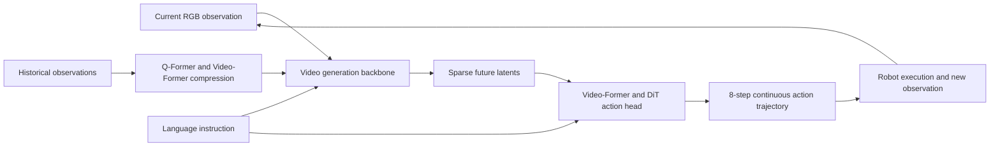

#### 2.2 Sparse Foresight: Decouple Generation Budget from Horizon
{: id="22-稀疏未来生成数量与预测范围分开设计"}

The intuition is to predict the immediate future in detail and sample the distant future at a few informative times. Sampling primarily operates on **VAE-compressed chunks**, so eight future chunks should not be read as eight original image frames.

Wan-VAE compresses a video with $(1+F)$ frames into $(1+F/4)$ latent chunks, with spatial dimensions reduced from $H\times W$ to $H/8\times W/8$ and 16 latent channels per location. Apart from special handling of the initial frame, each future chunk corresponds to four original timesteps; at the dataset's 4 FPS sampling rate, one chunk represents approximately one second.

The selected future chunk indices are:

$$
[T+1,T+2,T+5,T+8,T+11,T+14,T+17,T+20].
$$

The first two chunks remain consecutive to preserve motion information over the next eight original timesteps; subsequent chunks are sampled every three chunks, extending the horizon to approximately 20 seconds.

> **Minimal example:** If one chunk represents one second, predicting consecutively through second 8 requires eight chunks; retaining only seconds 1, 2, 5, and 8 covers the same endpoint with four chunks. The paper extends this pattern to eight chunks around seconds 1, 2, 5, 8, 11, 14, 17, and 20, looking farther ahead with a similar output budget rather than generating every frame of a 20-second video.

<div align="center">
  
<figcaption>Figure 3: Qualitative comparison of sparse intervals. Interval 1 has a shorter horizon, whereas interval 5 reduces visual fidelity; interval 3 is selected as a compromise between horizon and generation quality.</figcaption>
</div>

| Design choice | Continuous video generation | SparseVideoNav |
|---|---|---|
| Future supervision | Consecutive adjacent chunks | Consecutive near-term chunks and sparsely sampled distant chunks |
| Cost of extending the horizon | Generate more chunks to look farther ahead | Cover distant changes with fewer chunks |
| Guidance for actions | A complete continuous future | Sparse visual foresight plus near-term detail |

#### 2.3 Four-Stage Training
{: id="23-四阶段训练"}

**Stage 1: T2V → I2V adaptation.** The current image, instruction, and noisy sparse future latents enter the backbone, which is fine-tuned with Wan's flow matching objective; the resulting generator anchors its predicted future to the current viewpoint rather than relying on text alone.

**Stage 2: History injection.** Compressed historical embeddings enter new cross-attention blocks within every backbone Transformer block; the added blocks' final linear layers are zero-initialized to limit disruption of the existing generative prior, yielding an I2V model conditioned on both current and past observations.

**Stage 3: Diffusion distillation.** The history-conditioned I2V model serves as the teacher, and an identical student is initialized from its weights; Phased Consistency Models (PCM) divide the noise schedule into four phases and teach the student to predict phase endpoints along the teacher's probability-flow ODE trajectory, using consistency between neighboring timesteps to reduce video denoising from **50 steps to 4**.

**Stage 4: Action learning.** The distilled I2V model is frozen, while an inverse dynamics head learns to infer actions from predicted visual changes; generated sparse futures and instructions condition an 8-step continuous action prediction.

Importantly, the system first uses **Depth Anything 3 (DA3) to relabel motion in the generated future**, aligning the action supervision with synthetic visual dynamics instead of attaching the original recording's actions unchanged.

> **Minimal example:** Suppose a real recording corresponds to moving straight for one meter, but its generated counterpart depicts moving forward and then turning right; labeling both as straight motion would provide contradictory supervision. The paper re-estimates camera motion in the generated video and derives matching action labels; the distance in this example is illustrative, not a reported measurement.

#### 2.4 Core Training Objectives
{: id="24-核心训练目标"}

**Flow matching for video generation.** Let $x_1$ be the ground-truth sparse future latents, $x_0$ Gaussian noise, and $t$ the flow matching time; the intermediate input and target velocity are:

$$
x_t=t x_1+(1-t)x_0,\qquad v_t=x_1-x_0.
$$

The objectives for the two generation stages can be summarized as:

$$
\mathcal L_{\mathrm{FM}}
=\mathbb E\left[\lVert u_\theta(x_t,l,c_T,h_T,t)-v_t\rVert_2^2\right].
$$

Here $l$ is the instruction embedding, $c_T$ the current observation latent, and $h_T$ the history embedding; Stage 1 omits $h_T$, while Stage 2 includes it, with both stages learning a velocity field from noise toward sparse future latents.

**Consistency for distillation.** Stage 3 aligns predictions at adjacent noise times within a phase to the same solution point on the teacher's trajectory, retaining generative quality under few-step inference; the main text does not give a complete PCM loss equation.

**Action reconstruction.** Following the paper's Eq. (5), relabeled clean actions $a_0$ are noised into $a_k$, and the action head reconstructs $a_0$ conditioned on the instruction $l$ and generated future $V$:

$$
\mathcal L_{\mathrm{action}}
=\mathbb E\left[\lVert D_\psi(a_k,l,V)-a_0\rVert_2^2\right].
$$

This equation directly supervises clean-action reconstruction, with DDIM used for inference; the 20-second visual horizon and the 8-step action output are different quantities and should not be conflated.

#### 2.5 Data Construction and Inference
{: id="25-数据构建与推理"}

Human operators collected **140 hours of real-world navigation video** with a handheld DJI Osmo Action 4 using RockSteady+ stabilization, producing approximately **13,000 trajectories**, averaging 140 frames at 4 FPS, with manually annotated instructions. DA3 estimates 6-DoF camera poses, and relative pose changes are projected onto the local plane to derive $(\Delta x,\Delta y,\Delta\theta)$ labels; static segments, extreme camera pitch, and frontal dynamic-pedestrian segments that impair pose estimation are filtered out.

At deployment, the robot sends new RGB observations to a remote workstation; the model combines the instruction and compressed history, generates sparse futures with four video denoising steps, predicts continuous actions, and sends them back for execution, with subsequent observations closing the feedback loop rather than executing the entire 20-second imagined future open-loop. DA3 relabeling belongs to training preparation and is not listed as an online navigation component; the appendix reports about 64 hours for the complete four-stage pipeline on 32 H200 GPUs.

<div align="center">
  
<figcaption>Figure 5: Sparse future predictions during zero-shot BVN deployment for finding a table, an air conditioner, and a trash bin; the current observation and sampled future chunks express longer-range navigation intent.</figcaption>
</div>

---

### 3. Key Results and Findings
{: id="3-核心结果发现-2"}

**Evaluation setup.** A Unitree Go2 is evaluated in six unseen real-world scenes: Room and Lab Building indoors, Yard and Park outdoors, and Square and Mountain at night; each scene contains two instruction-following navigation (IFN) tasks and two BVN tasks, repeated ten times each, for **240 trials per method**. Success means stopping within **1.5 meters** of the target, without an orientation requirement; models run on a remote RTX 4090 workstation, so reported inference latency should not be equated with the complete robot communication and control cycle.

**Main results (Table I; success rate, %).**

| Method | Average IFN | Average BVN |
|---|---:|---:|
| Uni-NaVid | 10.0 | 2.5 |
| StreamVLN | 35.0 | 10.0 |
| InternVLA-N1 | 17.5 | 8.3 |
| **SparseVideoNav** | **50.0** | **25.0** |

Both task types improve by **15 percentage points** over the strongest baseline, StreamVLN; BVN success is **2.5×** higher because 25.0% / 10.0% = 2.5. Nighttime BVN success is **20% and 15%** in the two scenes, averaging **17.5%**, versus 0% for all three evaluated baselines; this does not establish reliable navigation in arbitrary nighttime environments.

<div align="center">
  
<figcaption>Figure 4: Successful real-world BVN trajectories involving backtracking out of a dead end, a narrow traversable ramp, and a steep hillside; these illustrate behavior rather than replace aggregate success rates.</figcaption>
</div>

**Horizon and success-rate trade-offs (Table I).**

| Variant | IFN (%) | BVN (%) |
|---|---:|---:|
| 4 denoising steps, 2 consecutive future chunks | 15.8 | 2.5 |
| 4 denoising steps, 10 consecutive future chunks | 36.7 | 11.7 |
| **Final system: 4 denoising steps, sparse foresight spanning 20 seconds** | **50.0** | **25.0** |
| 50 denoising steps, 20 consecutive future chunks | 62.5 | 35.8 |
| Final system without history compression | 45.0 | 22.5 |

The longer continuous-generation variant achieves higher success, showing that sparsification and distillation trade some performance for efficiency; these ablations support a practical compromise rather than proving that sparse prediction is intrinsically more accurate at a matched horizon.

<div align="center">
  
<figcaption>Figure 6: Ablations of data scale, sparse generation, distillation, and history compression; larger datasets reduce FVD, sparse generation and distillation reduce inference time, and history compression limits latency growth with longer histories.</figcaption>
</div>

- **Efficiency:** Figure 6 reports **0.79-second** inference for the final system, **1.35 seconds** without sparsification (approximately 1.7× slower), and **7.56 seconds** without distillation (approximately 9.6× slower), while sparse generation provides about **1.4× faster Stage 1+2 training**; the abstract separately reports **27× acceleration** over a fully unoptimized system, using a different comparison setting that should not be multiplied or mixed with the individual ablation ratios.
- **History and initialization:** Removing the Former introduces a **54.9%** latency increase at history length $N=45$; progressive Stage 1 adaptation followed by history injection reduces generation-adaptation convergence time from **64 hours** for direct Stage 2 training to **32 hours**, which is distinct from the full four-stage training time.
- **Data scaling:** Increasing training data from **8 / 50 / 140 hours** reduces FVD on a three-hour unseen validation set from **2534 / 1755 / 1390**, indicating improved video distribution fit; this experiment does not report a corresponding navigation success-rate scaling curve.
- **Qualitative generalization:** The paper demonstrates pedestrian avoidance and successful navigation at a 50-centimeter camera height despite training near one meter, but does not report separate quantitative success rates for these capabilities.

---

### 4. Limitations
{: id="4-局限性-2"}

The 140-hour dataset remains limited, challenging scenes can cause generation mode collapse and navigation failure, and final BVN success is only 25.0%; efficiency optimizations sacrifice some success, while the authors report that inference remains slightly slower than existing LLM navigation methods. Evaluation spans six scenes and 24 tasks using a remote GPU, and camera-height robustness and dynamic obstacle avoidance are supported mainly by qualitative examples, leaving reliable autonomy across broader environments unproven.

---

## 13. WorldVLN (2026)
{: id="worldvln"}
———Autoregressive World Action model for Aerial Vision-Language Navigation

📄 **Paper**: [arXiv:2605.15964](https://arxiv.org/abs/2605.15964)

---

### Key takeaways
{: id="精华-3"}

WorldVLN reframes aerial VLN as prediction-driven world-action modeling. Instead of mapping observations directly to actions, the agent first predicts latent world-state evolution, then decodes executable waypoints from the predicted representation. The central insight is that **spatial navigation is inherently anticipatory**, much as people predict how movement changes their surroundings. Transferring temporal priors from video generation and using action-aware GRPO to optimize action consequences rather than visual synthesis quality lets the WAM approach exceed VLA baselines by 12+ percentage points with limited training steps. Closed-loop autoregressive updates replace generated latent states with actual observations to address long-horizon prediction drift. Zero-shot transfer to real drones demonstrates potential generalization.

---

### 1. Background and problem
{: id="1-研究背景问题-3"}

The existing VLA model regards VLN as a conditional mapping from instructions and observations to actions. Although it has semantic understanding capabilities, it lacks explicit temporal causal modeling of "how the Agent's own actions change the world state", resulting in obvious shortcomings in spatial reasoning and geometric accuracy. Although the video generation model has a strong spatiotemporal prior, there is a structural mismatch between its generation goal (visual authenticity) and the VLN goal (action-oriented state prediction): most video backbones generate the entire video in a bidirectional manner, while VLN requires a causal "observation-action-update" closed loop; in addition, the hidden representation of the generated model is not optimized into an action-decodable form.

---

### 2. Method and innovations
{: id="2-主要方法创新点-3"}

**Overall framework:** WorldVLN consists of three major modules - (1) Latent space spatiotemporal autoregressive Transformer (world backbone) is responsible for predicting short-term world state transitions; (2) Action Decoder (Action Decoder) decodes hidden state transitions into executable way points; (3) Two-stage training framework, first aligns video priors and navigation dynamics through supervised learning, and then uses Action-aware GRPO Reinforcement learning optimizes the consequences of actions.

<div align="center">
  
<figcaption>
Figure 1: WorldVLN overall architecture. The model predicts short-term hidden state transitions from instructions and historical observations, decodes them into waypoint actions, and encodes the real observations back to the autoregressive context after execution.
</figcaption>
</div>

**① World Backbone (Latent Autoregressive Video Transformer)**

- **input**: text encoder output instruction embedding $e_\ell = \psi(\ell)$, and historical real self-centered observation encoded hidden state sequence $z_{\leq t}$
- **processing**: spatiotemporal autoregressive Transformer predicts multi-scale token blocks from coarse to fine scales (first global low resolution, then local high resolution), and autoregressively generates them in fragment order along the time dimension
- **output**: short-term hidden state prediction $$\hat{z}_{t+1:t+K} \sim p_\theta(\cdot \mid e_\ell, z_{\leq t})$$
- **design motivation**: Borrow the temporal prior of the video generation model instead of learning from scratch, and transform the generation architecture into causal autoregression to support closed loop

<div align="center">
  
<figcaption>
Figure 6: The backbone architecture of the latent space and time autoregressive world. Input images or historical videos are encoded into known visual pyramids, predicted future target segment pyramids, and multi-scale token blocks aggregated into output latent representations.
</figcaption>
</div>

**② Action Decoder**

- **input**: future implicit representation of world backbone output $$\hat{z}_{t+1:t+K}$$ (compact spatio-temporal representation, encoding perspective changes, spatial structure changes and motion trends)
- **processing**: Vision Embedding module converts latent representation into spatiotemporal embedding token; multi-layer Transformer Block uses decomposed spatiotemporal attention - temporal attention captures cross-frame motion evolution, and spatial attention models the geometric structure within each frame; MLP action head returns aggregated features to continuous action vectors
- **output**: continuous waypoint action $$a_{t:t+K-1} = D_\phi(\hat{z}_{t+1:t+K})$$, corresponding to the relative 3D displacement and yaw angle change of the UAV
- **design motivation**: avoid decoding the hidden state into video frames and then estimating motion (with error accumulation), directly representing the inference action from the hidden state is more concise and efficient

<div align="center">
  
<figcaption>
Figure 7: Action decoder architecture. The world model output latent representation is converted into spatiotemporal tokens through visual embedding, and the multi-layer decomposition spatiotemporal attention Transformer Block models action-related features, and is finally returned to continuous UAV navigation actions by MLP.
</figcaption>
</div>

**③ Closed-loop autoregressive update**

The complete inference loop is:
$$
(e_\ell, z_0) \to \hat{z}_{1:K} \to a_{0:K-1} \to o_{1:K} \to z_{1:K} \to \hat{z}_{K+1:2K} \to \cdots
$$
The key is to re-encode **real observations** and replace the hidden state predicted by the model with $z_{t+1:t+K} = E_\text{vid}(o_{t+1:t+K})$ after executing the action to prevent the accumulation of hidden prediction drift.

**④ Two-stage training framework**

<div align="center">
  
<figcaption>
Figure 2: Two-stage training framework. Stage 1 uses instruction-video pairs to supervise the world backbone and video-trajectory pairs to supervise the action decoder. Stage 2 samples multiple online trajectories, allocates segment-level rewards using trajectory accuracy, task progress and reference policy regularization, and updates WorldVLN through Action-aware GRPO.
</figcaption>
</div>

**Stage 1 — Supervised training (world prior alignment)**

World backbone goals:
$$
\mathcal L_\text{wm} = -\sum \log p_\theta(z_{t+1:t+K} \mid e_\ell, z_{\leq t})
$$

Action decoder target (initialized by video-action teacher model distillation):
$$
\mathcal L_\text{act} = \sum \lVert D_\phi(E_\text{vid}(o_{t+1:t+K})) - a^*_{t:t+K-1} \rVert
$$

**Stage 2 — Action-aware GRPO (action consequence alignment)**

Sample $G$ online trajectories for each navigation case, each containing $n$ autoregressive decision segments, and allocate rewards to the $j$ segment:

$$
r^{(i)}_j = \gamma^{j-1}\left(\lambda_\text{traj} r^{(i)}_{\text{traj},j} + \lambda_\text{task} r^{(i)}_{\text{task},j} + \lambda_\text{ref} r^{(i)}_{\text{ref},j}\right)
$$

- **trajectory reward** $r_\text{traj}$: local geometry supervision, measuring the closeness of predicted actions to expert actions
- **mission reward** $r_\text{task}$: Global end point evaluation, measuring the distance between the trajectory end point and the target
- **reference reward** $r_\text{ref}$: KL regularization, maintain the consistency of the update strategy and the reference strategy (Stage 1 product), and prevent the world prior degradation
- **timing attenuation** $\gamma^{j-1}$ ($\gamma=0.9$): Early decision-making has greater weight because it affects the subsequent longer action chain

Strategy updated with GRPO truncated target after dominance normalization.

---

### 3. Results and findings
{: id="3-核心结果发现-3"}

**UAV-Flow-Sim (Outdoor)**: WorldVLN achieves 79.12% / 78.02% average SR (fixed / open language template), improving **13.51 / 12.24 percentage points** respectively over the strongest baseline. The performance is particularly outstanding in fine movements such as Approach (97.62%), Land (98.15%), and Move (100%).

**IndoorUAV-VLA (indoor)**: Full-set SR reaches **41.76%**, which is **14.60 higher than the strongest baseline (π0, 27.16%) percentage points**; under Hard difficulty, the SR increased from 7.55% to **41.19%**, showing strong adaptability to complex multi-step action combinations.

**ablation analysis**:
- Comparison with OpenVLA: With the same number of steps, WorldVLN after Stage 1 has surpassed OpenVLA-SFT, indicating that WAM paradigm is more efficient in learning
- Autoregression vs. full sequence prediction: Autoregression improves SR by 5.7+ percentage points. Implicit prediction visualization shows that full sequence prediction has semantic drift, while autoregression maintains a coherent visual spatial representation due to continuous fusion of real observations.
- Action-aware GRPO: After Stage 1 is close to saturation, an additional 10+ percentage points increase is achieved. After the trajectory is visually displayed, the RL model can correctly perform geometrically precise actions such as "circling".

**Zero-sample real robot deployment**: With only simulation data training, WorldVLN achieved indoor and outdoor language instruction following on a 250 mm wheelbase quadcopter drone. The airborne Jetson Orin NX + remote server inference architecture verified the actual deployability.

---

### 4. Limitations
{: id="4-局限性-3"}

Current experiments are mainly aimed at short-range low-time domain navigation, and long-range multi-stage VLN has not yet been fully verified; due to limitations in backbone calculations, real deployment still relies on server-side inference and cannot be fully airborne.

---


## 14. NavWAM (2026)
{: id="navwam"}
——The first navigation model that integrates future prediction, value evaluation and action decision-making into a single embodied world model

📄 **Paper**: [arXiv:2606.13494](https://arxiv.org/abs/2606.13494) · [Project Page](https://dachii-azm.github.io/navwam/)

### Key takeaways
{: id="精华-4"}
1. **Joint prediction and planning**: NavWAM integrates the "future prediction" and "action planning (such as CEM search)" separated in the traditional Navigation World model (NWM) into a single video diffusion Transformer network.
2. **shared Latent Canvas**: Unify the current state, target image, current visual observation, executable action chunk, future state, future visual prediction and progress value assessment (Value) into a fixed 9-frame latent canvas (Latent Canvas) sequence, and achieve multi-task output through joint denoising.
3. **Eliminates online planning overhead**: During testing, single inference denoising can be performed directly in Policy mode to output action chunks, which avoids the heavy online trajectory sampling and optimization of traditional world models. The control frequency can reach 5Hz, and the calculation amount is reduced by thousands of times.
4. **Improves representation quality**: By introducing dense self-supervised reconstruction loss for future visual prediction, it provides a powerful "future observation anchor" for action selection, significantly reducing policy drift under partial observability.

---

### 1. Background and problem
{: id="1-研究背景问题-4"}
In locally observable image goal navigation, the traditional planning-based Navigation World model (NWM) assists decision-making by predicting future visual changes under action sequence conditions. However, these methods usually divide "world prediction" and "action selection" into two independent steps: the model only serves as a simple predictor, and during inference, it must rely on external planning algorithms (such as the cross-entropy method CEM) to perform time-consuming closed-loop generation and scoring in a large number of random candidate action sequences. This results in huge online computational overhead (often down to the sub-Hz level). In order to eliminate this bottleneck, this research is committed to building a world action model that directly unifies future perception prediction, value estimation and continuous action generation in a single network representation.

---

### 2. Method and innovations
{: id="2-主要方法创新点-4"}
<div align="center">
  
<figcaption>
Comparison diagram of traditional Navigation World model (NWM) and Navigation World Action model (NavWAM)
</figcaption>
</div>

#### overall framework
{: id="整体框架"}
NavWAM uses the pre-trained video world model Cosmos Predict2 (2B) as the network base to integrate current observations, image targets, robot states, future action sequences (Action Chunk), future visual observations and goal-progress values (Goal-Progress Value) into a unified 9-frame "World-Action Latent Canvas". With this representation, the navigation task is modeled as a joint denoising problem on the latent canvas.

<div align="center">
  
<figcaption>
NavWAM’s Latent Canvas frame layout and data flow
</figcaption>
</div>

#### Latent Canvas frame layout
{: id="latent-canvas-帧布局"}
The 9 frames in the canvas are defined as follows:
* **frame 0 (Observed)**: Causal VAE temporal pad (all zero frames), providing a boundary for spatiotemporal VAE compression.
* **Frame 1 (Observed)**: Current robot state $s_t = [x_t/100, y_t/100, \psi_t/\pi] \in \mathbb{R}^3$, normalized in the local coordinate system.
* **Frame 2 (Observed)**: Target image $g$ (Image Goal).
* **Frame 3 (Observed)**: Current first-person visual observation $o_t$.
* **Frame 4 (Predicted)**: Chunk $a_{t:t+H-1} \in \mathbb{R}^{3H}$ of the executable action to be predicted, where $H=4$ (represents the local way point increment $[\Delta x_i, \Delta y_i, \Delta \psi_i]$).
* **Frame 5 (Predicted)**: Future state prediction $s_{t+H} \in \mathbb{R}^3$.
* **Frames 6 & 7 (Predicted)**: Two future self-view images predicted $o_{t+H-1}, o_{t+H}$.
* **Frame 8 (Predicted)**: Target progress estimate $v_{t+H} \in [0, 1]$.

For non-image scalars/vectors such as actions, states, and values, NavWAM first normalizes them, and then broadcasts them on the spatial grid (Spatial Grid) to fill them into the entire frame; during decoding, the denoising features of the corresponding channels are restored to scalar/vector values through spatial averaging (Spatial Averaging).

#### Training objectives and hybrid modes
{: id="训练目标与混合模式"}
The network loss function is based on weighted denoising score matching on the latent canvas:
$$\mathcal{L}_{\text{diff}} = \mathbb{E}_{\sigma, \epsilon} \left[ w(\sigma) \lVert x_0 - F_\theta(x_\sigma, \sigma, c) \rVert_2^2 \right]$$
In order to prevent the low-dimensional action signal from being submerged in the high-dimensional pixel loss of image reconstruction, the action frame loss is multiplied by the weight coefficient $\lambda = 5$ for upsampling enhancement.

During the training phase, the samples are divided into three different conditional patterns to prompt the network to jointly learn different navigation subtasks (ratio 50/25/25):
1. **Policy mode (50%)**: Given observed frames 0–3, predicted frames 4–8.
2. **World-model mode (25%)**: Given observed frames 0–4, predicted frames 5–8. Prediction of the physical evolution of the training model under action conditions.
3. **Value mode (25%)**: Given observed frames 0–7, predict frame 8 (the target progress value under the current trajectory).

#### Goal progress value design
{: id="目标进度价值设计"}
The value target $v_{t+H}$ is explicitly defined as the normalized distance progress reflecting the robot's local to end-point accuracy:
$$v_{t+H} = \text{clip}\left( 1 - \frac{\lVert p_{\text{end}} - p_t \rVert_2}{d_{\text{max}}}, 0, 1 \right)$$
Among them, $p_t$ is the current 2D position, $p_{\text{end}}$ is the target 2D position, and $d_{\text{max}}$ is the upper limit of the maximum length of the trajectory.

#### inference process
{: id="推理流程"}
In the deployment phase, the robot obtains the current image $o_t$ and the target $g$, runs in Policy mode, and directly outputs $$\hat{a}_{t:t+H-1}$$ through a single denoising process. This set of action chunks is then executed in a Receding-Horizon manner. After execution, the network is re-requested to achieve a high-frequency closed-loop response of approximately 5Hz.

---

### 3. Results and findings
{: id="3-核心结果发现-4"}
<div align="center">
  
<figcaption>
Comparison of future image prediction quality of NavWAM, NWM and NavWAM w/ FT on GO STANFORD test set
</figcaption>
</div>

1. **Better navigation performance**: On the GO STANFORD offline image goal navigation, NavWAM's zero-shot (ATE 0.324) and fine-tuned version (ATE 0.192 / RPE 0.070) are both better than the traditional NWM (ATE 0.453) without inference CEM action search. At the same time, the model maintains excellent future visual prediction consistency (Consistency reaches 0.635–0.668, significantly better than NWM’s 0.524).
2. **Extremely low inference overhead**: Single denoising inference replaces CEM trajectory optimization, making NavWAM’s FLOPs only 4.45 TF, and the inference delay only 205.7 ms, while the NWM delay of the same base is up to 233.8 seconds, and the FLOPs are as high as 14,521 TF, the cost of inference is thousands of times different.
3. **The role of multi-task supervision**: The ablation experiment proves that future visual prediction supervision can bring long-range landmark anchoring to the decision-making system and is an indispensable self-supervision signal (compared to the strategy of removing future images, ATE is reduced from 0.090 to 0.076).
4. **Diablo robot real robot closed-loop success rate**: In 24 deployment tests in real indoor environments (Office, Storage, Meeting, Hallway), NavWAM achieved a high success rate of 79.2%, far exceeding OmniVLA (58.3%) and traditional NWM (16.7%), proving extremely robust.

<div align="center">
  
<figcaption>
Diablo Comparison of actual camera footage and predicted future footage during real robot operation (H=4)
</figcaption>
</div>

---

### 4. Limitations
{: id="4-局限性-4"}
1. **Test scene limitations**: Real robot evaluation mainly focuses on static indoor environments, and has not been verified in dynamic obstacle scenes containing pedestrians and moving objects.
2. **Target form limitations**: Mainly aimed at image goal navigation (Image-Goal Navigation). System verification has not yet been carried out for natural language instruction navigation, object category navigation (Object-Goal) and embodied question and answer.
3. **Long-range bottleneck**: Facing large-scale, extremely long-range navigation scenarios across floors and multiple rooms (requiring frequent sub-task planning and re-planning), there is still a risk of performance degradation due to the limit on the number of context frames.

---


## 15. Agentic Embodied Control (2026)
{: id="agentic-embodied-control"}
——The general agent under the minimalist interface directly controls the embodied interaction cycle, and the zero-shot performance is comparable to the industrial-level training strategy.

📄 **Paper**: [arXiv:2607.26148](https://arxiv.org/abs/2607.26148)

### Key takeaways
{: id="精华-5"}
1. **Fundamental reflection on controlling paradigm**: Breaking the inherent model of embodied navigation relying on "specialized strategy training" or "artificial fixed workflow/dual-brain handover state machine", proving that the universal large model with frozen weights can completely autonomously control the interaction loop and achieve top performance under zero samples with only the code agent framework (Harness) and the most minimalist perception and action interface.
2. **Strong control through a minimal interface**: with only $512 \times 512$ monocular RGB images (no depth, panoramas, mapping, or pose feedback) and four discrete primitives—forward $0.25\text{ m}$, turn left $15^\circ$, turn right $15^\circ$, and stop—frontier reasoning models (Fable-5 / Opus-5) achieve $70.7\% \sim 78\%$ success on continuous R2R-CE, comparable to navigation policies trained at industrial scale.
3. Single-axis decoupling of **capability source**: The ablation experiment confirms that the the underlying foundation model **plays a decisive role** (model switching leads to an SR span as high as $5\% \sim 72\%$), while the difference between different general Agent Harnesses is minimal (only $1.7\% \sim 7.3\%$).
4. **The emergence of hybrid interface synergy**: Forcing the agent to use the waypoint predictor (Forced Waypoint) actually limits the fine-tuning alignment of the strong model; when the waypoint is opened as an optional tool (Hybrid Interface), the agent independently emerges the strategy of "long-distance waypoint selection for fast cruising + target close cut primitive fine-tuning" achieves $76.7\%$ success with $50\%$ of the steps and less than one quarter of the time.
5. **Silent Failure and Embodied Grounding Gap**: An in-depth audit of 30 failure cases found that the agent has a serious "doubt without corrective action" phenomenon (the thinking chain has detected a navigation deviation but still executes an error termination); the deployment of the physical quadruped quadruped robot shows that "inference capabilities are transferable, but embodiment awareness is not transferable", and the lack of size awareness and persistent spatial memory is the core bottleneck restricting long-range autonomy.

---

### 1. Background and problem
{: id="1-研究背景问题-5"}
- **There are two major technical routes for embodied navigation and the dilemma of external control**:
  - **end-to-end training policies (Trained Policies)**: Such as NaVid, StreamVLN, etc., through massive embodied data training dedicated network, mapping observations into actions frame by frame. This type of method is highly sensitive to data distribution and lacks high-level generalization and reflective error correction capabilities when encountering out-of-distribution obstacles or unseen instructions.
  - **Fixed Workflows & Dual-Brain**: Such as MapGPT, NavCoT, ABot-N1, etc., although large models are introduced, the models are strictly limited to fixed pipelines written by humans (for example, deep mapping is called first, topology planning is called, and then handed over to the low-level controller). The agent cannot freely decide based on the current situation when to observe, when to take a few more steps, and when to abandon existing assumptions.
- **Core research questions**:
  - Can navigation-specific external scaffolding be removed entirely—external maps, depth sensors, predefined heuristic search, and specialized policy networks—and **high-level control authority be entrusted directly to a general-purpose reasoning agent**?
  - With the most minimalist monocular front-view perspective and discrete action interface, how high is the upper limit of embodied control of the general-purpose large model? Where are its true capability boundaries and grounding points?

---

### 2. Method and innovations
{: id="2-主要方法创新点-5"}

<div align="center">
  
<figcaption>
Figure 1: Comparison of ownership of embodied interaction loop control rights (left), minimalist interface interaction probe architecture (middle), and comparison of success rates with strong baselines on R2R-CE (right)
</figcaption>
</div>

#### ① Overview of the overall framework: Agentic Embodied Control
{: id="-整体框架概述智能体自主具身控制agentic-embodied-control"}
The paper proposes a minimalist embodied control probe system. The entire system consists of three layers of completely decoupled components: **universal code agent framework (Harness)**, **minimalist perception action interface (Interface)** and **Multimodal inferenceModel (model)** with frozen weights. The agent has complete control over the entire interaction process. Based on natural language instructions and historical interaction records, it can independently decide to call observation tools, step actions or terminate tasks in each round.

#### ② In-depth analysis module by module (input → processing → output → design motivation)
{: id="-逐模块深度解析输入--处理--输出--设计动机"}

1. **General agent framework layer (Harness Layer)**
   - **Input**: Natural language navigation instructions issued by the user and the historical call text/image context of the current session.
   - **processing process**: Directly adopt a common framework designed for code engineering (such as Open source's `mini-swe-agent`, Anthropic's `Claude Agent SDK` or OpenAI's `Codex CLI`). The framework is only responsible for prompt word splicing, tool distribution execution, and maintaining context sessions. **does not include any navigation-specific state estimation, topology map construction, or backtracking strategies**.
   - **output**: formatted tool call request (Tool Calls) and environment return results.
   - **Design motivation**: Strip away all peripheral code logic that is manually customized around navigation tasks to ensure that the experiment purely tests the underlying model's own embodied inference and autonomous decision-making capabilities.

2. **Minimalist perception tool `observe()`**
   - **input**: The agent initiates a parameterless call when it needs to confirm the surrounding environment.
   - **processing process**: Environment rendering and returning a single $512 \times 512$ resolution RGB image directly in front of the current agent. **Calling this tool will not advance the simulator time step or consume the step budget**.
   - **output**: single front-view RGB image. No panoramic perspective, no depth map, no target detection frame, no semantic segmentation, no laser point cloud.
   - **Design motivation**: Force the agent to get rid of its dependence on panoramic images and depth sensors, and examine the model's ability to maintain spatial orientation and landmark memory in the mind based only on the monocular front-view image sequence.

3. **Minimalist action tool `step(actions)`**
   - **input**: an ordered sequence list of four Habitat discrete action primitives (such as `["LEFT", "LEFT", "FORWARD", "FORWARD", "FORWARD"]`). The four primitives include:
     - `FORWARD`: move forward $0.25\text{ m}$;
     - `LEFT`: Turn left on the spot $15^\circ$;
     - `RIGHT`: Turn right in place $15^\circ$;
     - `STOP`: Declare the task is completed and actively terminate the evaluation.
   - **processing process**: The underlying controller executes the action sequence in order, subject to the maximum total budget of 500 discrete primitives in a single episode.
   - **Output**: Only the number of primitives actually executed and the number of remaining available steps are returned. **does not return any visual observation, does not return collision signals, does not return pose or coordinate drift data**.
   - **design motivation**: allows the model to independently determine the action granularity based on the grasp of the environment (it can send a single rotation fine-tuning, or a series of combinations to advance); hides collision and pose information to force the model to actively call `observe()` after execution, and introspectively infer whether a collision or jamming occurs by comparing the parallax changes of the before and after images.

<div align="center">
  
<figcaption>
Figure 2: Complete execution log reconstruction of a successful navigation episode in R2R-CE continuous environment, showing the agent's autonomous corrective and spatial reflection process
</figcaption>
</div>

#### ③ End-to-end interactive data flow and autonomous corrective mechanism
{: id="-端到端交互数据流与自主纠偏机制"}
As shown in Figure 2, in a complete navigation test (including 20 observations, 20 steps, and a total of 111 discrete primitive actions), the agent demonstrated a highly self-consistent inference and adaptive adjustment cycle:
- **vision establishment and steering**: Initially observed when facing the wall, Modelinference found that "it needs to be turned 180 degrees, that is, 12 consecutive calls of 15-degree left turns" and issued `L×12` in batches.
- **Collision and yaw sensing**: Call `observe()` after executing `F×5` and find that the field of view has almost remained unchanged. model wrote in the thinking chain "I almost didn't move, maybe the right side hit the corner of the bed; let me deflect a little to the left to avoid it", and then issued `L2 F4` independently. Get out of trouble successfully.
- **Exploration and Rewind**: After accidentally entering a small room with a dressing table, model checked the instructions and found that "the original instructions did not mention this room, and you should go directly through the corridor to the bathroom." He immediately turned around and realigned the corridor and finally executed `STOP` autonomously at the target $2.98\text{ m}$ away from the bathroom.

---

#### ④ Difficulty Dimensionality Reduction 1: The Essential Transition of Embodied Control paradigm (Control Authority)
{: id="-难点降维-1具身控制范式的本质跃迁control-authority"}

Many readers may easily misunderstand this work as “another zero-shot method for running VLN using Prompt”. The core difference lies in the control authority of **and the tool calling mode**.

| Control paradigm | Ownership of control rights | Core mechanism | Behavior when encountering exceptions/obstacles | Representative methods |
|---|---|---|---|---|
| **end-to-end policy network (Policy)** | External environment loop | Each input image of a single neural network is directly mapped to an action | Lack of high-level reflection, easy to fall into local oscillations in dead ends | NaVid, StreamVLN |
| **Fixed pipeline (Workflow)** | External Python script | Rule code hard-coded fixed process (map construction → find waypoints → planning → execution) | The process is rigid and cannot dynamically change the observation frequency or seek help from other tools according to immediate difficulties | MapGPT, SmartWay |
| **Slow-Fast Dual-Brain System (Dual-Brain)** | Default handover protocol | Slow VLM plans high-level sub-goals and fixes the handover to the fast-action expert network | The handover logic and update frequency are manually programmed, and high-level intentions are often distorted by low-level strategies | ABot-N1, InternVLA-N1 |
| **Agent Autonomous Control (Agentic Control)** | **inferenceModel itself** | The unified large-scale model independently decides when to sense, take a few steps, check the map or select a waypoint | The model has complete independent control over retry, detour, redirection and early termination | **Method of this article** |

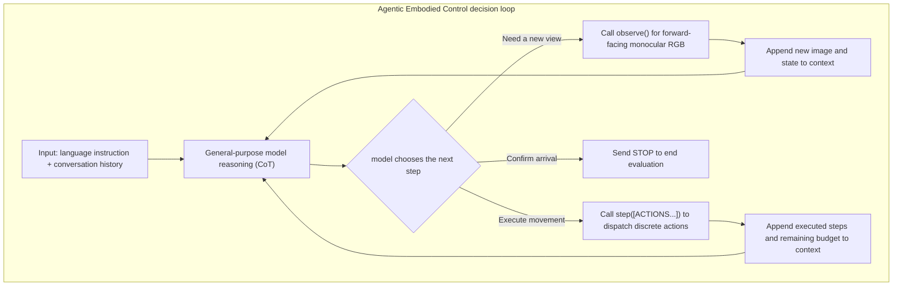

---

#### ⑤ Difficulty Dimensionality Reduction 2: Collaborative Emergence of Hybrid Interface
{: id="-难点降维-2混合动作接口hybrid-interface的协同涌现"}

Forcing the agent to bind a waypoint predictor (Forced Waypoint) will often weaken the performance of the strong model; but if the **discrete primitive** and the **trained waypoint predictor** are simultaneously opened to the agent as an optional tool (Hybrid Interface), the intelligent body will independently combine a very inspiring "thick and thin collaboration" strategy.

> **Give a specific example**:
> Suppose the task is to start from the living room, walk through a 10-meter long corridor, enter the master bedroom and stop at the bedside table (total distance is about 14 meters).
> - **pure primitive mode**: Since each advance is only $0.25\text{ m}$, walking through the 10-meter corridor requires the model to repeatedly issue $40$ forward primitives and frequently call `observe()` to check the door openings on both sides of the corridor. It is easy to repeatedly fine-tune the yaw at a small angle, and the total consumption is about $90$ primitive steps and nearly $40$ model interactive calls (it takes about $210\text{ s}$).
> - **Mandatory waypoint mode**: the model must choose from at most 5 waypoints supplied by the predictor. Open corridors can be traversed quickly with 2–3 waypoints, but within the final narrow $1\text{ m}$ near a bedside table, candidates may fail to follow the bed edge or lie too close to a wall. This causes inaccurate stopping or collisions, and overshoot is common at complex corners.
> - **Hybrid mode (Hybrid)**: The agent calls 3~4 autonomously and continuously in the first 80% of the long corridor. **waypoint navigation** fast cruise; once the bedside table is detected in the field of view and enters the close-up view, the model immediately actively switches to the **discrete primitive tool**, finely aligning the final stop point with the micro-steps of $0.25\text{ m}$ and $15^\circ$.
> **result**: The number of steps was cut from 87 steps to 48 steps, the number of calling rounds was reduced by half, the interaction time was sharply reduced from $210\text{ s}$ to $112\text{ s}$, and the success rate was increased from pure primitive $68.3\%$ to $76.7\%$!

---

#### ⑥ Difficulty Dimensionality Reduction 3: “Silent Failure” and “No Change in Suspect” of Embodied Intelligence
{: id="-难点降维-3具身智能体的无声失效与有疑无改"}

Detailed tracking of 30 failed episodes revealed the deep behavioral flaws of the current general-purpose model in embodied environments.

| Failure category | Percentage (n=30) | Median final distance from target | Typical performance and root causes |
|---|---|---|---|
| **A. Wrong Referent / Branch (Wrong Referent / Branch)** | $40.0\%$ (12 cases) | $17.3\text{ m}$ | The instruction contains multiple ambiguous doorways or bifurcated roads. model chose the wrong passage in the first step and headed all the way to a completely unrelated room. |
| **B. Stop Decision (Stop Decision)** | $23.3\%$ (7 cases) | $4.9\text{ m}$ | model saw the target object mentioned in the instruction (such as sofa) in the field of view, but the object was a reference object along the way rather than the final destination, and the model terminated prematurely (Object-anchored overshoot/undershoot). |
| **C. Lost and Divergent Search (Runaway Search)** | $26.7\%$ (8 cases) | $18.6\text{ m}$ | After missing the key corner, the model did not choose to turn around and backtrack, but blindly expanded the search range in the unseen area, getting further and further away from the target. |
| **D. Geometric Collision Trap (Geometry / Trap)** | $10.0\%$ (3 cases) | $5.5\text{ m}$ | Due to the lack of collision feedback, the model is repeatedly blocked in the dead corners of tables and chairs, but it is impossible to tell whether it is stuck from pure vision. |

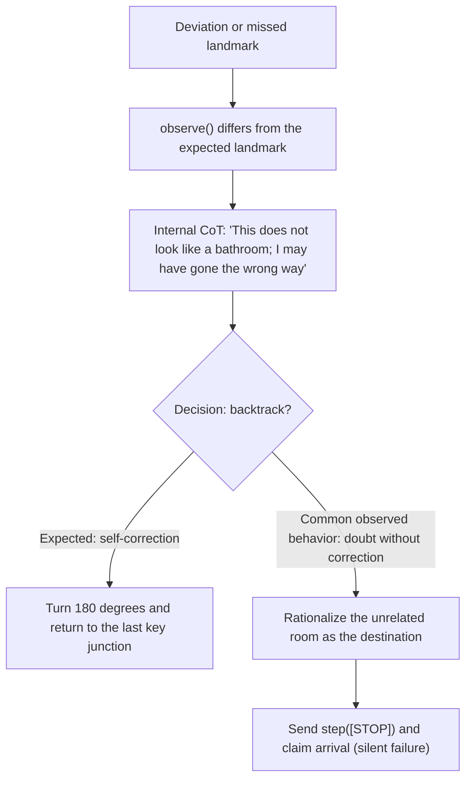

---

### 3. Results and findings
{: id="3-核心结果发现-5"}

<div align="center">
  
<figcaption>
Figure 3: Uniaxial ablation experimental results. (A) model capabilities span 5~72 SR; (B) The difference between Open source and manufacturer Harness is only 2~7 SR; (C) The roadmap interface is a life-saving straw for weak models, but it has a negative impact on strong models and dense environments
</figcaption>
</div>

#### ① Comparison of R2R-CE main list results
{: id="-r2r-ce-主榜成绩对比"}
On the standard R2R-CE val-unseen (rand100 subset), the general agent under the minimalist interface shows amazing zero-shot performance:
- **Top performance**: Fable-5 achieves **$78.0\%$ success rate (SR) under Claude Agent SDK (maximum think budget)** and **$65.27\%$ path weighted success rate (SPL)**; Opus-5 reaches **$70.7 \pm 3.5\%$ SR**.
- **surpasses similar zero-shot system**: significantly ahead of AgenticNav ($55.0\%$ SR) and Open-Nav ($50.0\%$ SR), which also use maps, explicit memory and depth tools in zero-shot settings.
- **is comparable to the industrial-grade training strategy**: directly approaching and partially surpassing dedicated strategies fully trained on tens of thousands of hours of embodied data, such as Qwen-RobotNav (full validation set $72.0\%$ SR), NavFM ($77.2\%$ SR), and StreamVLN ($64.9\%$ SR).

#### ② Three-dimensional decoupling discovery of model, Harness and interface
{: id="-模型harness-与接口的三维解耦发现"}
1. **model Axis (model Dominates)**: With the Harness and interface fixed, just replacing the underlying VLM can cause a huge performance span of $5\% \sim 72\%$ (Qwen3.5-4B only $5\%$, GPT-5.6 up to $60\%$, Fable-5 up to $72\%$). It shows that embodied navigation capability is essentially the natural emergence of multi-modal spatial reasoning and long-context instruction tracking capabilities.
2. **Harness (Harness is Modest)**: Comparing the lightweight Open source `mini-swe-agent` with the closed source `Claude SDK` / `Codex CLI`, the performance difference under the same model is only between $1.7\% \sim 7.3\%$.
3. **Thinking Budget (Reasoning Effort)**: Increasing the model's thinking chain calculation (Reasoning Effort) has significant benefits for some models (Fable-5 soars from the default $68.3\%$ to the max effort $78.0\%$, improving $+9.7\%$), but the income of small models is not stable.
4. **The double-edged sword effect of road marking tools**:
   - On R2R-CE, for weaker models (such as Qwen3.5-4B/9B), the landmark predictor saves the success rate from $5\%/7\%$ to $43\%/44\%$; but for top models (Fable-5/Opus-5), the improvement brought by the forced use of landmarks is only $+0.7\% \sim +1.3\%$.
   - On the **VLNVerse** benchmark, which has denser obstacles and more complex paths, the forced roadmap interface actually causes the Sonnet-5 success rate to decrease. $6\%$ ($78\% \rightarrow 72\%$), Fable-5 decreases. $4\%$ ($84\% \rightarrow 80\%$), and the collision rate increased by 4 to 6 times.

#### ③ Real four-legged quadruped robot (Unitree Go2) physical deployment
{: id="-真实四足机器狗unitree-go2实体部署"}
Thirty-one exploratory experiments conducted in real office building environments showed:
- The **inference capability was successfully migrated to**: the intelligent agent can perfectly understand complex conditional instructions (such as "If $3+4=7$, then turn left, otherwise turn right"), multi-stage "get the object and return" state tracking, and complete target locking through subtle visual features (such as "walk toward the person wearing white shoes").
- **Proprioception is completely missing**: Since the agent does not know its own physical dimensions (length, width and position of the hind legs), the camera issues a left-turn command prematurely as soon as it passes through the door frame, causing the quadruped robot's rear torso to directly hit the door frame and get stuck (Figure 10); in addition, the open-loop step execution causes the cumulative drift of the yaw angle, and counting confusion occurs when continuously passing the pillar across viewing angles (Figure 11).

---

### 4. Limitations
{: id="4-局限性-5"}
- **The context and time overhead of long-distance tasks skyrocketed**: On long-distance benchmark RxR-CE, the pure primitive success rate plummeted from $70\%$ to $26\%$; the historical tokens generated by a single episode of interaction reached $33\text{k} \sim 169\text{k}$, and the median time-consuming of a single decision exceeded 200 seconds, extremely lacking of compact and efficient long-lasting spatial memory and state integration mechanism.
- **Open-loop control and introspection error correction closed loop are missing**: The lack of ontology physical perception and collision feedback can easily cause geometric stuck in the real physical world; at the same time, there is a serious "self-doubt but blind termination" behavior within the model, and there is an urgent need to establish a true self-verification and active backtracking exploration closed loop.

---

## 16. CONDVLN (2026)
{: id="condvln"}
———The first vision-language navigation conditional branch diagnosis benchmark and neural symbol probe based on hierarchical 3D scene graph

📄 **Paper**: [arXiv:2608.17318](https://arxiv.org/abs/2608.17318)

### Key takeaways
{: id="精华-6"}
1. **Research Pain Points**: Traditional vision-language navigation (VLN) evaluation highly relies on "linear route following to fixed goals" and cannot evaluate conditional branch decisions that are extremely common in reality (such as "if there are flowers in the kitchen, go to the living room, otherwise go to the bedroom"), resulting in confusion between the reasons for the failure of perception, spatial localization and symbolic logic inference.
2. **core build**: Proposed the first programmatic conditional benchmark **CONDVLN** based on layered 3D scene graph, which generated over 11,500 tasks across the four major environments of AI2-THOR, Matterport3D, Gibson and ReplicaCAD. A conditional navigation task with verifiable truth values and controllable complexity (logical depth $d$ and branch chain length $\ell$).
3. **diagnostic indicators**: Design branch selection accuracy (BSA) and conditional success rate (CSR), which overcome the blind spot of traditional success rate (SR) that cannot identify "taking the wrong branch but hitting somewhere by mistake", and support fine-grained attribution of the completion of intermediate sub-goals.
4. **evaluation found that**: SOTA visual language models (such as NaVid, NaVILA) almost collapsed (CSR close to 0%) in conditional branch tasks, while Open-Nav and VLN-Zero with explicit inference structures performed better, indicating that end-to-end black box training has serious flaws in structured conditional decision-making.
5. **Decoupling Probe**: Proposes the neurosymbolic oracle diagnostic probe, which decouples condition determination from underlying action execution, bringing up to 2 times performance improvement in complex nesting and long branch chain scenarios, and points the way for the combination of neural symbols and embodied navigation.

---

### 1. Background and problem
{: id="1-研究背景问题-6"}
Existing embodied vision-language navigationBenchmarks (such as R2R, RxR, etc.) mainly focus on whether an agent can reach a single and fixed target position according to instructions. However, in real homes and physical environments, human navigation instructions often rely heavily on dynamic observations of environmental states (for example: "If there is a coffee cup on the dining table, go to the bar stool next to the dishwasher; otherwise, go to the light under the bathroom sink"). Existing evaluations not only lack explicit control over the conditional branch structure, but also cannot clarify whether the agent is stuck in visual perception, target localization, spatial movement, or high-level logical decision-making when it fails.

---

### 2. Method and innovations
{: id="2-主要方法创新点-6"}

<div align="center">
  
<figcaption>
CONDVLN benchmark overall architecture and process: Build a hierarchical 3D scene graph from a multi-source environment, programmatically generate multi-level nested and chained conditional instructions, and implement fully automatic diagnostic evaluation based on branch selection accuracy (BSA) and conditional success rate (CSR).
</figcaption>
</div>

The CONDVLN framework is constructed from **layered 3D scene graph**, **programmatic conditional instructions synthesized**, **VLN-CE Compatible with simulation adaptation**, **fine-grained diagnostic indicators (BSA/CSR)** and **neural symbols Oracle diagnostic probe** consists of five core modules, which achieves an end-to-end evaluation closed loop with controllable logic complexity and traceable true values.

#### Module 1: Multi-source environment unification and hierarchical 3D scene graph construction (Scene Hierarchy & Spatial-Semantic Graph)
{: id="模块一多源环境统一与分层-3d-场景图构建scene-hierarchy--spatial-semantic-graph"}
- **input**: heterogeneous geometric and semantic annotation from AI2-THOR, ReplicaCAD (synthetic simulation data) and Matterport3D, Gibson (real physical scan data).
- **handles**:
  1. **Unified room level abstraction**: Unify different data sources into a symbolic hierarchical structure with the room as the top level and containing a collection of object instances. Each object $o_i$ records the semantic label $\ell_i$ and the 3D center coordinate $c_i = (x_i, y_i, z_i)$, and first extracts the 3D axis-aligned bounding box (AABB). If missing, the radius of the bounding sphere is used as the geometric base.
  2. **fallback geometric distance calculation**: Calculate the spatial displacement $\delta_{i \to j} = c_j - c_i$ of objects in the same room to $(o_i, o_j)$, and fallback to select the distance metric according to priority:
     $$d_{ij}^{\text{used}} \in \{ d_{ij}^{\text{AABB}}, d_{ij}^{\text{sphere}}, d_{ij}^{\text{center}} \}$$
Among them, the AABB surface distance $d_{ij}^{\text{AABB}} = \sqrt{\Delta_x^2 + \Delta_y^2 + \Delta_z^2}$ can accurately capture the surface outline of the object, the surrounding sphere surface distance $d_{ij}^{\text{sphere}} = \max(0, \lVert \delta_{i \to j} \rVert_2 - (r_i + r_j))$ is used as a smooth approximation, and the center point Euclidean distance $d_{ij}^{\text{center}} = \lVert \delta_{i \to j} \rVert_2$ is used as the final bottom line.
  3. **Standard orientation and semantic predicate generation**: Discretize the horizontal azimuth angle into 8 compass sectors (east, northeast, north, etc.), discretize the pitch angle into 3 vertical intervals (upper, horizontal, lower), and combine to generate a three-dimensional relative orientation predicate; at the same time, generate a semantic space predicate close to natural language based on hard thresholds (such as `near`, `far from`, `higher than`, `lower than`, `above`, `below`).
- **output**: directed spatial semantic scene graph with traceable geometric attributes (including center distance, AABB distance, azimuth sector, etc.).
- **design motivation**: Eliminate the barriers of coordinate systems and annotation granularity between simulators, and provide a unique objective physical fact base that can accurately determine authenticity for subsequent logic generation.

#### Module 2: Programmatic Conditional Instruction Synthesis and Object Sampling (Programmatic Conditional Instruction Synthesis)
{: id="模块二程序化条件指令合成与对象采样programmatic-conditional-instruction-synthesis"}
- **Input**: Constructed 3D scene graph with its spatial predicates.
- **handles**:
  1. **positive and negative condition sampling mechanism**: Sample valid entities from the scene graph as reference objects for the real branch; at the same time, sample object categories that exist in other rooms in the scene but are missing in the current reference room to construct a negative branch condition (False Branch) with clear objective authenticity.
  2. **Spatial disambiguation of objects with the same name**: When the room memory contains multiple objects of the same type (such as multiple desk lamps), the scene graph relationship predicate qualification (such as "the desk lamp next to the bed") is automatically introduced to achieve unique pointing, and samples that cannot be disambiguated are directly filtered out.
  3. **logical template instantiation**: maps scene graph predicates into the basic skeleton of `IF [condition] THEN [action] ELSE [action]`, and supports multi-level nesting and multi-branch concatenation.
- **outputs**: natural language conditional instruction text and its corresponding a priori truth branch, target point and sub-target sequence.
- **design motivation**: Ensure that each instruction has an unambiguous true value in 3D space, so that the evaluation system can fully grasp the ground truth decision-making path.

#### Module 3: complexity taxonomy and VLN-CE simulation adaptation (Complexity Taxonomy & Episode Realization)
{: id="模块三复杂度分类与-vln-ce-仿真适配complexity-taxonomy--episode-realization"}
In order to systematically diagnose inference bottlenecks in different dimensions, CONDVLN defines 6 along two orthogonal dimensions: **logical depth (Depth $d$)** and **branch chain length (Chain Length $\ell$)** Kinds of instruction complexity levels:

| Complexity category | Logical depth $d$ | Branch chain length $\ell$ | Logical structure form | Typical examples |
|---|---|---|---|---|
| **Simple** | 1 | 1 | Single layer IF-ELSE | If there are flowers in the kitchen, go to the living room, otherwise go to the bedroom |
| **Nested** | 2 | 1 | IF internal nesting IF | If there are flowers in the kitchen, (if the flowers are on the table, go to the living room, otherwise go to the balcony); otherwise, go to the bedroom |
| **Deep Nested** | 3 | 1 | Three levels of deep nesting | Multi-level conditions to determine the depth step by step |
| **Chain** | 1 | 2 | IF / ELSE IF / ELSE | If there are flowers in the kitchen, go to the living room, otherwise if there is a coffee machine, go to the study, otherwise go to the bedroom |
| **Long Chain** | 1 | 3 | Multi-branch series chain | More than 3 sequential exclusive conditional branches |
| **Nested Chain** | 2 | 2 | Nested + chain combination | Compound high-level complex decision-making |

> **Dimensionality reduction device: state machine flow of conditional instructions**
>
> ```mermaid
> graph TD
> Start["Start Observation"] --> Q1{"Condition A: Are there flowers in the kitchen?"}
> Q1 -- "True (branch 1)" --> Q2{"Condition B (depth d=2): Is the flower on the table?"}
> Q1 -- "False (branch 2)" --> Q3{"Condition C (chain length l=2): Is there a coffee machine?"}
> Q2 -- "True" --> T1["Target 1: Living room sofa"]
> Q2 -- "False" --> T2["Target 2: Balcony flower stand"]
> Q3 -- "True" --> T3["Target 3: Study desk"]
> Q3 -- "False" --> T4["Target 4: Bedside of bedroom"]
> ```

All tasks are converted into the standard VLN-CE/Habitat-Sim JSON format, including starting point coordinates, orientation, true geodesic shortest path (Geodesic Shortest Path) and multi-stage sub-goal waypoints. Existing models can be directly evaluated without modifying the simulation environment.

#### Module 4: Conditional inference diagnostic indicators (BSA & CSR)
{: id="模块四条件推理诊断指标bsa--csr"}
The traditional success rate (SR) only cares about whether the final stopping point is close to the target, and cannot distinguish whether the agent "correctly understood the conditions and went to the target" or "accidentally stopped near a target due to perception drift." To this end, CONDVLN proposes two dedicated diagnostic indicators:

1. **Branch Selection Accuracy (BSA)**:
Measures how far the agent has progressed along the correct conditional branch. Assume that the ordered sub-goal sequence corresponding to the current true value branch is $G_i = (g_{i,1}, \dots, g_{i,m_i})$, and the longest prefix length that the agent reaches within the tolerance radius $\tau$ in sequence is $k_i$, then the single sample score is:
   $$BSA_i = \frac{k_i}{m_i} \quad (m_i > 0)$$
The overall evaluation set score is the average of all samples $BSA = \frac{1}{\lvert I \rvert} \sum_{i \in I} BSA_i$. This metric allows for a partial completion score to be given.
2. **conditional success rate (Conditional Success Rate, CSR)**:
Measures strictly conditional navigation completion. The agent is required not only to fully experience all sub-goals of the branch ($BSA_i = 1$), but also to achieve Habitat standard navigation success at the final goal point ($\text{Success}(i) = 1$):
   $$CSR_i = \mathbf{1}[BSA_i = 1 \land \text{Success}(i) = 1]$$
The overall review set score is $CSR = \frac{1}{\lvert I \rvert} \sum_{i \in I} CSR_i$.

> **Take example**:
> Assume that the truth branch of a task contains 2 sequential waypoints (corridor corner $g_1$, living room door $g_2$) and end point (sofa $g_3$), that is, $m_i = 2$.
> - **case A (completely correct)**: The agent passes through $g_1, g_2$ in sequence and stops at $g_3$, then $k_i=2, BSA_i=1.0, \text{Success}(i)=1 \implies CSR_i=1, SR_i=1$;
> - **Case B (lost halfway)**: The agent gets lost after passing $g_1$ but does not arrive at $g_2$ and does not arrive at $g_3$, then $k_i=1, BSA_i=0.5, CSR_i=0, SR_i=0$;
> - **Case C (accidental hit/wrong branch)**: The agent goes directly to the wrong branch towards the bedroom, but there happens to be a sofa with the same name in the bedroom, and the agent stops next to the sofa in the bedroom - at this time, the traditional $SR_i=1$ will be misjudged as successful, but because it does not visit the sub-goal of the correct branch ($k_i=0, BSA_i=0$), the new indicator accurately diagnoses $CSR_i=0$!

#### Module 5: Neurosymbolic Oracle Diagnostic Probe (Neurosymbolic Branch-Selection Oracle model)
{: id="模块五神经符号-oracle-诊断探针neurosymbolic-branch-selection-oracle-model"}
In order to explore whether existing agents are hindered by "pre-conditional logic inference" or "post-stage spatial motion navigation", the author constructed a neural symbolic Oracle probe:

| Comparative dimensions | end-to-end black box agents (NaVid / NaVILA, etc.) | Neural symbolic Oracle probes (Oracle + VLN-Zero) |
|---|---|---|
| **instruction input form** | Original conditional text (including IF-ELSE / nested / chained logic) | Pure path instructions rewritten by linearization of truth metadata (such as "first to $g_1$, then to $g_2$, and finally to $g_b$") |
| **conditional branch decision-making** | Implicit end-to-end guessing and judgment by neural network | Automatic parsing of symbolic priors, peeling off the burden of branch selection |
| **underlying executor** | remains unchanged | remains completely unchanged (uses the same VLN Navigation model) |
| **diagnostic function** | Measure the mixed performance including logic, perception and control | As a theoretical upper limit probe, strictly quantify the performance loss caused by wrong selection of logic branches |

---

### 3. Results and findings
{: id="3-核心结果发现-6"}
The paper evaluates four types of mainstream VLN models (NaVid, NaVILA, Open-Nav, VLN-Zero) and Oracle probes on four datasets: AI2-THOR, ReplicaCAD, Gibson and Matterport3D, and draws the following key conclusions:

1. **end-to-end large model performance generally crashes on conditional branches**:
   - General end-to-end VLM navigation models (such as NaVid, NaVILA) have extremely low conditional success rates in various environments (NaVILA's CSR on all datasets is 0.0%, and NaVid's CSR on Gibson and MP3D is also close to 0%). This shows that currently relying solely on implicit end-to-end fine-tuning of pre-trained visual language models cannot be generalized to 3D decision-making tasks with explicit logical branches.
2. **Explicit structure and large language Modelinference bring significant advantages**:
   - models with explicit inference architecture performed significantly ahead: Open-Nav relied on LLM zero-shot chain-of-thought planning to achieve 33.3% CSR and 39.2% BSA on ReplicaCAD; VLN-Zero relied on explicit 3D scene graph representation to achieve 21.0% CSR and 31.5% BSA on AI2-THOR. This confirms that structured representation and symbolic planning are crucial for conditional embodied decision-making.
3. **Logic depth and branch chain length expansion cause continuous performance degradation**:
   - As the nesting depth increases from $d=1$ to $d=3$, or the branch chain length extends from $\ell=1$ to $\ell=3$, the BSA and CSR of all end-to-endModels decrease monotonically.
   - The advantages of the neurosymbolic oracle probe are particularly obvious under high complexity: under difficult configurations such as $d=3, \ell=1$ and $d=1, \ell=2$, Oracle shows more than 2 times the performance improvement compared to the undecoupled baseline model (for example, under $d=1, \ell=2$, Oracle achieved 24.63% CSR, while Open-Nav only achieved 11.51%), proving that orthogonally decoupling symbol condition determination and underlying navigation actions is an effective way to overcome complex tasks.

---

### 4. Limitations
{: id="4-局限性-6"}
CONDVLN currently only supports VLN-CE compatible indoor discrete/continuous simulation environments, and the evaluation quality is limited by the noise of original point cloud scans and geometric annotations; in addition, geometric predicate generation relies on fixed artificial thresholds, and Oracle probes use ground-truth metadata rather than scene graphs constructed by online perception.

---

## 17. ReMEmbR (2024)
{: id="remembr"}
——Robotic navigation question and answer and physical target generation based on retrieval-enhanced long-range spatiotemporal memory

📄 **Paper**: [arXiv:2409.13682](https://arxiv.org/abs/2409.13682) · 🏛️ **ICRA 2025** · [Project Page](https://nvidia-ai-iot.github.io/remembr)

### Key takeaways
{: id="精华-7"}
1. **Long-range spatiotemporal memory decoupling**: In view of the huge historical data faced by mobile robots in continuous operations of tens of minutes to hours, it is proposed to decouple the memory building (Memory Building) and query inference (Querying) stages to solve the problem of GPU memory explosion and computing delay when traditional multi-modal large models face ultra-long contexts.
2. **Multi-modal spatio-temporal vector library**: The lightweight video multi-modal model (VILA) is called online during operation to generate underlying event description subtitles for continuous video clips, and the text embedding, three-dimensional dimensional coordinates $(x, y, z)$ and timestamps are uniformly stored in the vector database to compactly represent and record environmental dynamics.
3. **Agent iterative multi-hop retrieval**: In the query phase, a large language model is introduced as a decision-making state machine, and multiple function calls (text/location/time retrieval) are adaptively initiated based on space, time or descriptive questions for multi-step iterative search and pruning, minimizing inference context while ensuring clue integrity.
4. **Metric executable target generation**: Breaking through the limitation of traditional embodied question and answer only outputting natural language text, supporting the direct output of precise spatial three-dimensional coordinates, seamlessly connecting with classic mobile chassis navigation stacks such as ROS 2 Nav2 and driving physical navigation.
5. **End-to-end real-robot validation**: Implemented on-device lightweight VLM subtitle extraction, speech recognition and vector retrieval on the Nova Carter robot equipped with Jetson Orin, and successfully performed open semantic question answering and navigation object finding after cruising in a real office area for 25 minutes.

---

### 1. Background and problem
{: id="1-研究背景问题-7"}
- **The scalability dilemma of long-range historical representation**: Robots will observe a large number of dynamic events and non-static objects during long-term cruising. The computational cost of existing multi-modal long context models (such as 1M+ context) expands linearly or quadratically with historical growth, and it is difficult for traditional scene graphs or metric semantic maps to record the evolution of the time dimension.
- **Embodied Q&A lacks physical executability**: Existing embodied Q&A benchmarks (such as OpenEQA) are mostly limited to short videos of 30 seconds to 1-2 minutes, and the output is mostly qualitative text answers (such as "on the tea room table"), which the robot cannot directly parse into metric coordinate targets that can be used by the underlying navigation system.

---

### 2. Method and innovations
{: id="2-主要方法创新点-7"}

<div align="center">
  
<figcaption>
ReMEmbR The overall framework of the system: consists of two stages of decoupling: online memory building (Memory Building) and multi-hop query inference (Querying). On the right is the NaVQA dataset question and answer type and real robot deployment link
</figcaption>
</div>

#### ① Overview of the overall framework
{: id="-整体框架概述-1"}
ReMEmbR（Retrieval-augmented Memory for Embodied Robots) consists of two core subsystems: **online memory construction stage** and **query inference stage**: The former continuously compresses the sensor stream and converts it into a multi-modal vector library with spatiotemporal metadata during the robot cruise; the latter is used by LLM-Agent when receiving natural language questions from users. Drive multiple rounds of spatiotemporal retrieval functions to refine the minimum necessary memory subset and generate answer or navigation target coordinates.

<div align="center">
  
<figcaption>
The robot runs continuously for a long time and accumulates long-range history. ReMEmbR supports efficient aggregation of spatiotemporal dynamic information and physical metric target localization
</figcaption>
</div>

#### ② Explain module by module
{: id="-逐模块讲解-1"}

**1. Online memory building module (Memory Building)**
- **input**: forward-looking monocular camera continuous video frame $H_I$, robot local localization coordinates $H_P = (x, y, z)$ (derived from lidar odometry, GPS or AMCL), timestamp $H_T$.
- **processes**: for every $t=3$ seconds of continuous observation (sampling 6 frames at 2 FPS), the video multi-modal model VILA is called (the training end uses VILA1.5-13B, and the on-device deployment uses the quantized version VILA-3B) to generate local semantic event subtitles $L_{i:i+t}$; the lightweight text encoder `mxbai-embed-large-v1` is then used to generate the sentence vector $E(L_{i:i+t})$.
- **outputs**: Insert a structured tuple $$\langle E(L_{i:i+t}), (x,y,z)_{i:i+t}, t_{i:i+t} \rangle$$ into the multi-modal vector database $V$ in real time.
- **design motivation**: Question and answer questions are unpredictable before the task, and a general and information-dense spatio-temporal representation must be constructed without a priori Query; the vector database supports efficient approximate nearest neighbor (ANN) retrieval of tens of millions of vectors.

**2. State machine querying agent module (Querying Agent)**
- **input**: user questions $Q$ (covering spatial location, time point/duration, environment description) and historical accumulated retrieved context $R_{0:i}$.
- **processing**: LLM-Agent, as a decision-making state machine, adaptively calls the following three types of spatio-temporal retrieval functions according to the current clues to generate retrieval subsets:
  - Text retrieval $f_l(\text{object})$: Match the closest semantically related $m$ fragments in the vector library based on cosine similarity;
  - Spatial location retrieval $f_p((x, y, z))$: Retrieve adjacent $m$ historical trajectory segments based on metric coordinate radius;
  - Time range search $f_t(\text{"HH:MM:SS"})$: Grab $m$ fragments before and after the corresponding time according to the timestamp window.
- **output**: If the current memory is enough to answer the question, output a formatted JSON dictionary (including text parsing, $(x, y, z)$ three-dimensional coordinates, timestamp or duration); if the information is insufficient, carry supplementary clues and enter the next round of iterative retrieval (up to 3 rounds).

#### ③ Formalization of optimal historical subset sampling
{: id="-最优历史子集采样形式化"}
For a complete history $H_{1:K}$ that is $K$ minutes long, directly calculating the posterior probability $p(A \mid Q, H_{1:K})$ is too computationally intensive. ReMEmbR formalizes it as the optimal sampling problem of finding the minimum sufficient history subset $$R^* \subseteq H_{1:K}$$:

$$p(A \mid H_{1:K}, Q) = p(A \mid R^*, Q) \approx p(A \mid R, Q)$$

$$R^* = \arg\min_R \lvert R \rvert \quad \text{s.t.} \quad \arg\max_A p(A \mid R, Q) = \arg\max_{A'} p(A' \mid H, Q)$$

Through the vector library sampling strategy $F: V \to R$, LLM-Agent only needs to process a very small subset $R$, so that long-range inference can be completed in constant time.

#### ④ Difficulty dimensionality reduction: memory representation paradigm comparison and multi-step retrieval
{: id="-难点降维记忆表征范式对比与多步检索"}

| Dimension | Full length context (such as Gemini 1.5M) | Single vector search RAG | ReMEmbR iteration Agent |
|---|---|---|---|
| Computation and GPU memory overhead | Linear/quadratic expansion with video duration, prone to OOM if it exceeds 10 minutes | Fixed single vector retrieval, low overhead | Multi-path retrieval within 3 steps, constant level overhead (~25s) |
| Spatio-temporal multi-hop inference | The full amount of information is within the context, but attention is easily lost in long sequences | Only text similarity is matched, and spatial proximity or time backtracking correlation cannot be performed | The state machine adaptively combines text, coordinates, and time multi-way functions to converge layer by layer |
| Output physical executability | Only output language text, it is difficult to accurately generate metric coordinates | Usually only text fragments are provided | Structured output $(x,y,z)$ coordinates, directly connected to Nav2 navigation chassis |

> **Take** as an example: the robot cruises in the building for 20 minutes (generating about 400 3-second video clips, and the full input needs to process hundreds of thousands of tokens).
> User asked: "Where is the red badge I lost 5 minutes ago?"
> - A simple single RAG only searches for "red work badges". If the robot saw the work badge at the table at the 2nd minute and the 15th minute, a single text retrieval can easily confuse the timeline and extract wrong coordinates;
> - ReMEmbR's Agent calls $f_l(\text{"red badge"})$ in the first round to obtain relevant candidate fragments, and in the second round calls $f_t(\text{"current time minus 5 minutes"})$ based on questions to narrow the time window. Only 6 key fragments (approximately 600 tokens) are captured in the two rounds, and the coordinates of $(x,y,z)$ are accurately locked, and the token consumption is reduced by more than 99%.

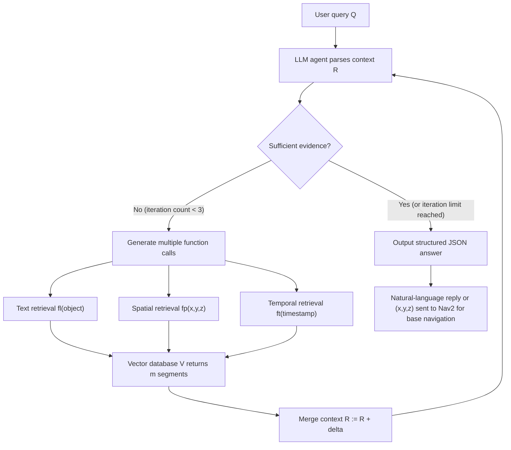

#### ⑤ NaVQA evaluation benchmark construction
{: id="-navqa-评测基准构建"}

<div align="center">
  
<figcaption>
NaVQA evaluation dataset: covering short (&lt;2 min), medium (2–7 min), and long (&gt;7 min) three duration ranges, covering three categories of question and answer tasks: spatial coordinates, time points/duration and descriptive questions
</figcaption>
</div>

Based on the real outdoor/indoor multi-weather large-scale cruise dataset CODa (Clearpath Husky robot collection), a NaVQA benchmark containing 210 expert-labeled samples was constructed, divided into three time intervals (short &lt;2 min, medium 2–7 min, long &gt;7 min), covering binary judgment (32%), spatial coordinate localization (34%), time points (14%), duration statistics (4%) and open description (16%).

---

### 3. Results and findings
{: id="3-核心结果发现-7"}

<div align="center">
  
<figcaption>
The overall accuracy change trend with the growth of video duration: Multi-frame full VLM faces GPU memory explosion (OOM) in medium and long videos, while ReMEmbR maintains significantly higher accuracy on long videos
</figcaption>
</div>

- **Better long-video question answering**: on videos longer than 7 minutes, GPT-4o-based ReMEmbR reaches **0.65** descriptive-answer accuracy, **46.25m** spatial localization error, and **3.6s** temporal error. These improve on the full-caption baseline (56.0m spatial error, 8.0s temporal error). The multiframe VLM cannot process medium or long videos because it runs out of GPU memory (OOM).
- **Low query latency with approximately constant scaling**: on a 21.5-minute video, ReMEmbR takes about **25 seconds** per query, with latency largely independent of total video duration. In comparison, a multiframe VLM takes up to 90 seconds even on a 5.5-minute video.
- **Multi-step iterative retrieval is the key to performance**: ablation experiments show that if it degrades to a single retrieval (1-call RAG), the overall accuracy drops from 0.61 to 0.50 (long video), confirming the dependence of complex spatiotemporal multi-hop inference on iterative retrieval closed loops.
- **Fine-grained time segmentation is crucial**: Accuracy is 0.61 with captions for 3-second video clips (2 FPS), but falls to 0.38 with coarse 12-second clips (0.5 FPS), indicating that critical transient information is seriously lost due to reduced temporal resolution.

<div align="center">
  
<figcaption>
Nova Carter mobile robot real office scene deployment: After 25 minutes of cruise memory construction, it successfully responded to open semantic navigation commands such as "Take me to a place with a good view", "Go get potato chips"
</figcaption>
</div>

- **real robot on-device closed-loop verification**: Jetson Orin 32GB, 3D LiDAR, quantitative version VILA-3B and Whisper ASR are equipped on the Nova Carter robot. It first performs 25 minutes of autonomous cruise mapping to build a memory bank, and then tests fuzzy semantic instructions. For example, when faced with "Take me to a place with good scenery", the Agent automatically retrieves the coordinates corresponding to the large floor-to-ceiling window, green plants and open space and navigates directly to the lobby through Nav2.

---

### 4. Limitations
{: id="4-局限性-7"}
- **Repeated memory dilution and redundant expansion**: When the robot is stationary or repeatedly cruises in the same area, the vector library will continue to write similar fragments, and long-term operation may dilute the retrieval accuracy of key effective information.
- **Fine-grained ambiguity of the lightweight perception model**: Limited by edge computing power, there is object confusion when using the 3B level quantized visual subtitle model (for example, a silver water dispenser is described as a "silver machine", resulting in it being misidentified as a soda vending machine).

---

## 18. SuperMap (2026)
{: id="supermap"}
———Real-time 4D spatiotemporal semantic SLAM and dynamic scene graph system for vision-language navigation

📄 **Paper**: [RSS 2026](https://www.roboticsproceedings.org/rss22/p052.pdf) · [Project Page](https://superodometry.com/supermap) · [Code (to be released) ](https://github.com/superxslam/SuperMap) · 🏛️ **RSS 2026**

### Key takeaways
{: id="精华-8"}

1. In order to solve the problems of instance drift and stale semantic accumulation in open vocabulary semantic mapping in dynamic environments, the first real-time, open vocabulary, instance-level 4D spatio-temporal semantic SLAM system SuperMap for vision-language navigation (VLN) is proposed.
2. The architecture combines high-frequency geometric SLAM (SuperOdometry) and asynchronous 2D open vocabulary perception (GroundingDINO + SAM2), and solves the cross-frame instance association problem under violent robot motion through 3D to 2D motion compensation prior.
3. A three-state depth residual discrimination and probability occupation update mechanism based on geometric consistency is proposed, which can keenly detect environmental changes (such as the addition, movement and removal of objects), and uses Bayesian semantic fusion to suppress single frame false detections.
4. A 4D dynamic scene graph containing spatial geometric topological edges and temporal evolution edges is constructed, and complex 3D point clouds and temporal video streams are abstracted into a compact symbolic structure, providing a native and efficient query interface for multi-modal large models (VLM).
5. The entire system runs in full real-time on a mobile robot board equipped with Intel i9 and RTX 4090 at a rate of 10 Hz pose estimation and 5 Hz scene graph update, significantly surpassing existing solutions in ScanNet Semantic benchmark and real scene dynamic navigation.

---

### 1. Background and problem
{: id="1-研究背景问题-8"}

Mobile robots face severe and continuous changes in environmental dynamics when performing open-vocabulary navigation tasks such as "go to the monitor next to the whiteboard" or "get back to the chair next to the plant" in a human-real environment. Most existing semantic mapping methods assume a static environment or rely on offline full scene reconstruction (such as ConceptGraphs, HOV-SG), while traditional dynamic SLAM systems are mostly limited to closed set priors or only focus on short-term human movement, and cannot continuously track the long-term movement and birth-death evolution of objects outside the field of view. This results in intermittent, viewpoint-sensitive 2D predictions of the multi-modal base model (VLM) that are prone to instance ID fragmentation and semantic staleness when directly projected onto a 3D map, hindering reliable spatial reasoning for downstream language-guided navigation.

---

### 2. Method and innovations
{: id="2-主要方法创新点-8"}

<div align="center">
  
<figcaption>
SuperMap 4D spatio-temporal SLAM overview: Able to track short-term human movements and long-term environmental changes (such as trash can removal, cart entry) in real time, and maintain a consistent 4D spatio-temporal scene graph
</figcaption>
</div>

#### ① Overview of the overall framework
{: id="-整体框架概述-2"}

SuperMap is a 4D spatio-temporal SLAM system that runs entirely on the robot's onboard computing platform. It is composed of the **geometry layer (online 3D Reconstruction)**, **instance layer (spatio-temporal instance association and probability update)**, and **topology layer (4D scene graph construction and VLM interaction)** are composed of three core modules. The geometry layer provides high-frequency and accurate metric poses and dense geometry; the instance layer uses 3D priors for motion compensation tracking and dynamic elimination of failed objects; the topology layer abstracts the metric map into a 4D scene graph carrying spatial topology and life cycle trajectories for efficient analysis by large language/multi-modal models.

<div align="center">
  
<figcaption>
SuperMap system architecture diagram: from bottom to top, it is divided into online 3D reconstruction geometry layer, spatiotemporal object update instance layer and VLM-oriented 4D scene graph topology layer
</figcaption>
</div>

#### ② Explain module by module
{: id="-逐模块讲解-2"}

- **geometry layer (online 3D dense reconstruction)**:
  - **Input**: Synchronized LiDAR point cloud, RGB image and high frequency IMU data stream.
  - **processing**: SuperOdometry is used as the laser-visual-inertial (LVI) odometry backbone network to solve the robot's 6-DoF pose $T_{WB}^{(t)}$ and camera pose in real time at 10 Hz under the world coordinate system $W$ $P_t = T_{WC}^{(t)} = T_{WB}^{(t)} \cdot T_{BC}$, and outputs a shaded dense 3D geometric point cloud.
  - **outputs**: high-precision robot trajectory $P_{1:T}$ and dense 3D observation data $Q_t = \{C_t, D_t\}$.
  - **Design motivation**: Provides a physical anchoring basis for subsequent physical back-projection of 2D semantics to 3D space, temporal motion compensation, and global map consistency.

- **instance layer (spatio-temporal instance association and dynamic consistency maintenance)**:
  - **input**: a collection of 3D object instances in the current frame RGB image $C_t$, depth observation $D_t$, and historical global map $M_{t-1}$.
  - **handles**:
    1. **2D Open vocabulary detection and segmentation**: Use GroundingDINO for open vocabulary bounding box detection, and SAM2 for instance mask extraction.
    2. **3D to 2D motion compensation hybrid tracking**: Project the 3D centroid $X_i$ of the object instance in the historical map to the image plane through the current camera pose $P_t$ to obtain the predicted pixel centroid $\hat c_i(t) = \pi(K \cdot P_t^{-1} \cdot X_i)$, used as the state transition prior of Kalman filter, replacing the traditional linear motion assumption.
    3. **geometric consistency three-state discrimination and occupancy update**: Calculate the residual of the projected depth $d_{proj} = \lVert T_{CW} X_k \rVert_z$ of map point $X_k$ and the current measured depth of the sensor $D(u)$ $\Delta d = d_{proj} - D(u)$ strictly distinguishes between Observable, Unobservable and Disappeared, and implements a log-odds occupation penalty on vanishing points.
    4. **Bayesian semantic fusion**: Maintains the polynomial confidence distribution of object categories, performs recursive updates combined with the detector confusion matrix, and automatically filters out occasional misclassification of single frames.
  - **outputs**: a spatiotemporally consistent global 3D instance-level semantic map $M_t = \{ O_t^j \} _{j=1}^{N_t}$.
  - **Design motivation**: Solve the instance ID drift under severe viewing angle changes, and autonomously identify and eliminate the afterimages of moved/disappeared objects in long-term runs.

- **Topology layer (4D scene graph construction and VLM interface)**:
  - **Input**: global instance collection and its 3D spatial bounding box, centroid and timing trajectory.
  - **handles**: Build graph structure $G = (V, E_S, E_T)$. Node $V$ represents an object instance; space edge $E_S$ is automatically established based on space geometry predicates (such as $On$, $Beside$, $Under$); time series edge $E_T$ connects the evolution trajectories of the same instance at different time steps.
  - **output**: structured 4D dynamic scene graph, and subgraph Prompt after text serialization (Serialization).
  - **Design motivation**: Reduce the dimensionality of massive dense point clouds into compact topological structures rich in semantics and spatial/temporal relationships, and reduce the computational overhead and illusion of multi-modal large models.

#### ③ end-to-end data flow
{: id="-端到端数据流"}

The flow path of a complete environmental observation frame from sensor input to the final generated navigation action is as follows:
LiDAR and camera collect multi-modal data $\to$ Geometry layer solves poses in real time $P_t$ and generates local point cloud $\to$ Asynchronous open vocabulary module extracts 2D masks $\to$ Combines historical 3D centroid projection for 3D-2D cross-modal association, assigns/updates unique instance ID $\to$ Deep residual geometry check classifies point cloud status, updates point occupancy and semantic distribution $\to$ Dynamically refreshes the spatial predicate edges and temporal edges of the 4D scene graph $\to$ Serializes relevant local subgraphs into structured text and injects them into VLM $\to$ VLM parses instructions and executes them in `<answer>` The target instance ID $\to$ is output in the tag. The parser retrieves the corresponding 3D physical center of mass coordinates from the scene graph as a waypoint (Waypoint), which drives the chassis navigation controller.

#### ④ Core formula and update mechanism
{: id="-核心公式与更新机制"}

- **3D to 2D projection prior**:
  $$\hat c_i(t) = \pi\left(K \cdot P_t^{-1} \cdot X_i\right)$$
Among them, $X_i$ is the 3D centroid of the instance in the map, $K$ is the camera internal parameter, and $\pi(\cdot)$ is the perspective projection function.

- **Geometrically consistent deep residual three-state classification**:
Define the projected depth residual $\Delta d = d_{proj} - D(u)$, where $d_{proj} = \lVert T_{CW} X_k \rVert_z$ is the expected depth of the map point under the camera system, and $D(u)$ is the measured depth of the sensor at the corresponding pixel $u = \pi(X_k)$. The status discrimination criterion is:
  $$s_k^{(t)} = \begin{cases} \text{Observable (visible)}, & \text{if } \lvert \Delta d \rvert \le \tau_\epsilon \\ \text{Unobservable (occluded / behind the surface)}, & \text{if } \Delta d > \tau_\epsilon \\ \text{Disappeared (absent / in front of the surface)}, & \text{if } \Delta d < -\tau_\epsilon \end{cases}$$

- **Log-Odds Update**:
  $$L(o_k \mid Q_{1:t}) = L(o_k \mid Q_{1:t-1}) + \text{logit}(P(o_k \mid Q_t))$$
For points judged as Disappeared, a negative probability penalty is given to quickly prune stale geometry from the global map.

- **Bayesian semantic fusion update**:
  $$P(L_j = c \mid z_{1:t}) = \eta \cdot P(z_t \mid L_j = c) \cdot P(L_j = c \mid z_{1:t-1})$$
Among them, $P(z_t \mid L_j = c)$ is the empirical confusion matrix of the open set detector, and $\eta$ is the normalization constant.

- **space topology edge geometry predicate (take $On$ relationship as an example)**:
  $$\text{On}(A, B) \iff \left(z_A^{\min} \approx z_B^{\max}\right) \land \left(\text{IoU} _{xy}(B_A, B_B) > \gamma\right)$$

#### ⑤ Difficulty dimensionality reduction device
{: id="-难点降维装置"}

##### Device A - Minimal concrete example (depth residual determination and motion compensation)
{: id="装置-a--最小具体例子深度残差判定与运动补偿"}

> **Take the example**: Suppose the 3D centroid of a trash can recorded in the map is $(2.0, 0.0, 0.5)\text{m}$ in the world coordinate system.
> 1. **Motion compensation**: When the robot chassis turns sharply right $30^\circ$, the image plane position deviation predicted by pure 2D linear Kalman filter exceeds 120 pixels, resulting in tracking loss; while SuperMap uses high-frequency pose $P_t$ to directly convert 3D The center of mass is projected to the current frame, and the pixel coordinate error instantly converges to within 3 pixels, accurately locking the association.
> 2. **Depth residual three-state determination**: Set the depth threshold $\tau_\epsilon = 0.1\text{m}$, the original expected projection depth of the trash can is $d_{proj} = 2.0\text{m}$.
>    - **Scene 1 (occluded)**: Someone walked by and blocked the trash can. The sensor measured the depth of the human body in front of it $D(u) = 1.2\text{m}$, and the residual was $\Delta d = 2.0 - 1.2 = +0.8\text{m} > 0.1\text{m}$. The system determined it to be `Unobservable` (occluded). The memory of the trash can was retained and no accidental deletion was performed.
>    - **Scenario 2 (moved)**: The cleaning staff moved the trash can, and the sensor directly measured the depth of the rear wall $D(u) = 3.5\text{m}$, with a residual $\Delta d = 2.0 - 3.5 = -1.5\text{m} < -0.1\text{m}$. The system determined it to be `Disappeared` (disappeared), triggering log-odds Negative penalty, the trash can will be removed from the currently active map within a few frames and time-series birth and death events will be recorded.

##### Device B - Homemade Mermaid flowchart (4D dynamic scene graph and VLM closed-loop control)
{: id="装置-b--自制-mermaid-流程图4d-动态场景图与-vlm-闭环控制"}

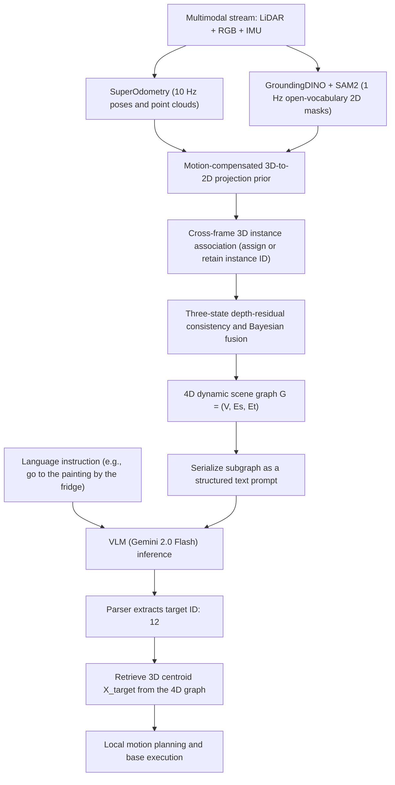

##### Device C — Before / After Core Mechanics Comparison Chart
{: id="装置-c--before--after-核心机制对比表"}

| Evaluation dimension | Traditional 3D scene graph (such as ConceptGraphs / HOV-SG) | Traditional semantic SLAM (such as Kimera / OVO-SLAM) | This article’s solution SuperMap |
|---|---|---|---|
| **mapping mode** | Offline global scan post-batch processing (takes minutes to hours) | Online real-time operation (10-30 Hz) | **fully onboard online real-time operation (10 Hz pose/5 Hz scene map)** |
| **vocabulary flexibility** | Open vocabulary (SAM + CLIP clustering) | Closed set predefined categories (fixed CNN) | **Open vocabulary (GroundingDINO + SAM2 combination)** |
| **Dynamic environment adaptation** | Assuming a static environment, dynamic objects cause ghosting and ghosting | Only filter short-term moving people and ignore long-term environmental changes | **Unified modeling of short-term movement and long-term object relocation/birth and death** |
| **instance maintenance mechanism** | Simple spatial overlap heuristic, easy to fragment in the long run | Only maintain local feature points or geometric surface elements | **3D motion compensation + depth residual consistency + Bayesian fusion** |
| **downstream inference interface** | Static graph structure query, unable to perceive the historical trajectory of objects | Only metric occupation grid or closed set semantic grid is provided | **4D spatiotemporal dynamic graph + VLM structured Prompt closed-loop control** |

---

### 3. Results and findings
{: id="3-核心结果发现-8"}

<div align="center">
  
<figcaption>
Qualitative evaluation of spatio-temporal consistency in real dynamic environments: In the events of new objects (buckets, carts, safety warning signs) and disappearances (chairs, plants, trash cans), the system maintains long-term stable 3D instance association and ID consistency
</figcaption>
</div>

1. **ScanNet benchmark evaluation is significantly ahead of**:
   - **category-level semantic segmentation**: SuperMap achieved an accuracy (Acc) of **55.48%**, significantly surpassing object-level benchmark ConceptGraphs (31.05%), ConceptFusion (34.10%) and HOV-SG (35.17%).
   - **Instance-level 3D segmentation (mAP)**: On typical furniture categories such as chairs (Chair), windows (Window), refrigerators (Refrigerator) and sofas (Sofa), SuperMap's $\text{mAP} _{50}$ reaches respectively **63.76%**, **42.20%**, **62.50%** and **33.35%**, while HOV-SG and ConceptGraphs, which rely on global point cloud clustering, score close to 0.

2. **Long-period real dynamic environment spatio-temporal change detection**:
   - In a 10-minute real robot experiment covering the complex indoor scene of $30\text{m} \times 20\text{m}$, SuperMap achieved excellent detection recall and change recall in the appearance and disappearance tests of six types of target objects (buckets and chairs reached **1.000** full score recall).
   - Comparing the baseline DualMap due to unstable 2D segmentation, 3D bounding boxes are frequently filtered, and the object detection recall rate is close to 0; while Khronos suffers from severe frame loss and semantic degradation due to the inference bottleneck.

<div align="center">
  
<figcaption>
4D Comparison of scene graph input and original video input on VLM space/timing inference: scene graph input shows higher reliability and anti-hallucination ability in both spatial topology disambiguation and historical trajectory backtracking
</figcaption>
</div>

3. **VLM spatial logic and timing inference advantages**:
   - Compared with directly sending the original video frames to VLM (Gemini 2.0 Flash), serializing 4D based on SuperMap The scene graph input scheme is in **spatial metric logic** (such as accurately locating a fire extinguisher based on the relative position of plants and cones) and **temporal history backtracking** (along temporal edges $E_T$ The spatial perspective distortion and long-time illusion of large multi-modal models are significantly reduced in the task of tracing the movement trajectory of a backpack and retrieving lost items.

<div align="center">
  
<figcaption>
real robotend-to-end online vision-language navigation experiment: The robot accurately distinguishes 4 whiteboards with the same appearance based on the spatial relationship in the scene graph, and accurately completes multi-hop spatial relationship retrieval navigation
</figcaption>
</div>

4. **ablation experiment and system throughput**:
   - The ablation verification shows that $F_1$ drops from 0.6308 to 0.5780 in the absence of a 2D tracker; $F_1$ drops sharply to 0.5201 in the absence of Bayesian semantic fusion; and $F_1$ drops to 0.5764 in the absence of geometric consistency updates, confirming the key role of the collaboration of the three in eliminating detection noise.
   - In terms of running speed, pose estimation is stable at **10 Hz**, 2D open vocabulary perception runs at **1 Hz** (asynchronous processing), 3D map update is **3 Hz**, 4D The scene graph maintenance is maintained at **5 Hz**, achieving fully onboard smooth operation.

---

### 4. Limitations
{: id="4-局限性-8"}

SuperMap's dense trajectory tracking capabilities are still limited when dealing with extremely high-speed moving targets (such as running pedestrians or rapidly thrown objects); in addition, the current 2D open vocabulary detection still relies on a given prompt candidate vocabulary. In the future, it is necessary to further integrate an automated open-world object autonomous discovery mechanism to achieve no prior deployment.

---

## 19. GSMem (2026)
{: id="gsmem"}
———3D Gaussian Splatting as a lasting spatial memory for embodied exploration and inference

📄 **Paper**: [arXiv:2603.19137](https://arxiv.org/abs/2603.19137)

---

### Key takeaways
{: id="精华-9"}

The core insight of GSMem is to use 3D Gaussian Splatting (3DGS) as a persistent spatial memory with "post-hoc re-observability" capability, allowing the agent to re-render the explored area from any optimal viewpoint without physical return visits, fundamentally breaking through the inherent bottleneck of permanent memory loss caused by discrete detection failure. The two-layer retrieval mechanism (object-level scene graph + semantic-level CLIP language field) complements each other: the scene graph provides structured localization, and the language field is recalled when detection is missing. The two together drive optimal viewpoint rendering to provide high-fidelity visual evidence for VLM. The hybrid exploration strategy dynamically combines VLM semantic correlation with 3DGS geometric information gain based on Fisher information matrix trace approximation, adaptively switches between task-oriented exploration and global coverage, taking into account efficiency and robustness. Introducing continuous radiance fields into embodied navigation memory is an important paradigm transfer, and its "re-rendering after writing" feature is particularly critical for long-term navigation tasks.

---

### 1. Background and problem
{: id="1-研究背景问题-9"}

Embodied navigation requires the agent to actively explore and continuously accumulate spatial knowledge in an unknown environment. Existing methods rely on two types of representations: discrete 3D scene graphs (such as ConceptGraphs) rely on detection modules, and missed target detection will lead to unrecoverable memory holes; methods based on view snapshots (such as 3D-Mem) have fixed and sparse viewing angles and cannot re-observe the explored area from the optimal viewing angle, so the quality of visual evidence provided for VLM inference is limited. The above methods all lack post-hoc re-observability: the agent is locked in the fixed observation during the initial exploration and cannot "recall" past scenes from a new perspective like humans.

---

### 2. Method and innovations
{: id="2-主要方法创新点-9"}

**Overall frame overview**

GSMem maintains three parallel structures in real time during active exploration: 3DGS geometry and appearance maps, CLIP language embedding fields included with every Gaussian, and object-level scene graphs. When a query arrives, the multi-layer retrieval-rendering mechanism locates the relevant area and renders the optimal viewpoint image, and VLM infers accordingly; when no frontier provides sufficient semantic clues, it switches to geometric exploration based on information gain.

<div align="center">
  
<figcaption>
GSMem System Overview: Outside the real exploration path (yellow line), the agent can directly "re-observe" any explored area (purple line) through 3DGS memory without the need for physical navigation to return
</figcaption>
</div>

**3DGS Mapping and Online Language Field**

Each 3D Gaussian $$g_i$$ carries an additional 32-dimensional language embedding (obtained from 768-dimensional CLIP features compressed by an autoencoder). In order to avoid the optimization overhead of high-dimensional language features, "weight-consistent inverse aggregation" is proposed: in forward rendering, 2D pixel features are generated by 3D Gaussian alpha-blending, and in reverse, 2D CLIP features are assigned to each Gaussian with exactly the same blending weight, achieving online semantic update with zero optimization overhead:

$$\mathbf{f}_i^t = \frac{W_i^{t-1}\mathbf{f}_i^{t-1} + \sum_{k \in \mathcal{T}_t} \sum_p w_{i,p,k}^t \mathbf{f}_{p,k}^{2D}}{W_i^t}$$

At the same time, object-level scene graphs (including 3D positions, semantic labels, and highest confidence detection perspectives), TSDF maps, and frontier maps are maintained.

**Multi-layer retrieval-rendering mechanism**

<div align="center">
  
<figcaption>
Multi-layer retrieval-rendering mechanism: object-level retrieval (scene graph) and semantic-level retrieval (3DGS language field) locate ROI in parallel, and then provide high-fidelity visual evidence for VLM through optimal viewpoint selection and 3DGS rendering
</figcaption>
</div>

Given a task query, two complementary retrieval paths are triggered simultaneously:
- **Object-level retrieval**: VLM sorts all objects in the scene graph by semantic relevance, and selects the top-$K_\text{obj}$ candidate as ROI
- **Semantic-level retrieval**: Encode the query as CLIP embedding, recall the relevant Gaussian with cosine similarity $> \tau_\text{clip}$ in the language field, and retain top-$K_\text{cluster}$ spatially coherent groups as ROI after KD-Tree clustering

For each ROI, 108 candidate viewpoints (36 azimuth angles × 3 elevation angles) were evenly sampled on a horizontal circular trajectory and screened through two stages of scoring: Phase 1 was based on visibility score $S_\text{vis}$ (TSDF ray casting) + projection area score $S_A$ (Gaussian penalty encourages appropriate viewing distance) to select the top-10; Phase 2 was further based on 3DGS opacity score $S_\text{opa}$ Evaluate the actual rendering quality, and comprehensively analyze $S_\text{final} = S_\text{vis} + S_A + S_\text{opa}$ to select the optimal viewpoint. Finally, the quality of the rendered image is improved through a single-step diffusion model and then sent to VLM inference.

**Hybrid exploration strategy**

<div align="center">
  
<figcaption>
Hybrid exploration strategy: When the semantic relevance of any frontier exceeds the threshold, it is directed to the task target first; otherwise, it switches to geometric coverage exploration based on 3DGS information gain (uncertainty heat map)
</figcaption>
</div>

Compute two types of scores for each candidate frontier:
- **Semantic correlation analysis** $s_i^\text{sem} \in [0,1]$: VLM evaluates the correlation between frontier observation images and task queries
- **Geometric coverage score** $s_i^\text{geo}$: Information gain based on Fisher information matrix (FIM), approximated by T-optimality proxy as the trace of FIM increment $$s_i^\text{geo} \approx \text{Tr}(\mathbf{I}_i)$$, which can be directly calculated by the rendering Jacobian without truth supervision

Explore decision rules:

$$i^* = \begin{cases} \arg\max_i \, s_i^\text{sem}, & \text{if } \max_i s_i^\text{sem} > \tau_s \\ \arg\max_i \, s_i^\text{geo}, & \text{otherwise} \end{cases}$$

---

### 3. Results and findings
{: id="3-核心结果发现-9"}

**Active Embodied QA (A-EQA) on OpenEQA** (63 HM3D scenes, 184 issues, GPT-4o as VLM):

| Methods | LLM-Match ↑ | LLM-Match SPL ↑ |
|------|------------|----------------|
| Explore-EQA | 46.9 | 23.4 |
| ConceptGraphs w/ Frontier | 47.2 | 33.3 |
| 3D-Mem | 52.6 | 42.0 |
| **GSMem (Ours)** | **55.4** | **43.8** |

**GOAT-Bench multi-modal long-term navigation** (36 scenes val-unseen, 2600+ subtasks):

| Methods | SR ↑ | SPL ↑ |
|------|------|-------|
| TANGO | 32.1 | 16.5 |
| MTU3D | 47.2 | 27.7 |
| 3D-Mem | 62.9 | 44.7 |
| **GSMem (Ours)** | **67.2** | **46.9** |

The advantage of GSMem in long-term navigation tasks is more significant than A-EQA (SR +4.3 vs LLM-Match +2.8), verifying the special value of persistent memory for long-term accumulation tasks. ablation research shows that: removing the CLIP language field -4.5 SR, removing the optimal viewpoint selection -2.7 SR, and removing the mixed exploration, the SPL drops by -4.1, indicating that the geometric coverage strategy contributes significantly to exploration efficiency.

<div align="center">
  
<figcaption>
case comparison (3D-Mem vs GSMem): (a-c) 3D-Mem causes errors due to false negatives (white robe, fig tree) or semantic misdetection (white door is recognized as a refrigerator), GSMem correctly locates through semantic field retrieval; (d) When the viewing angle is limited, GSMem successfully identifies hanging clothes through optimal viewpoint re-rendering
</figcaption>
</div>

---

### 4. Limitations
{: id="4-局限性-9"}

The current system relies on RGB-D input, and depth noise or high-occlusion scenes will affect the quality of 3DGS mapping, thereby reducing retrieval and rendering accuracy; single-step diffusion enhancement introduces additional inference delay, and there is still room for optimization in real-time deployment (currently about 1.2 s/step).

---


## 20. Qwen-Drive (2026)
{: id="qwen-drive"}
——The first end-to-end autonomous driving foundation model that unifies 3D perception/question and answer/trajectory planning without changing the VLM architecture

📄 **Paper**: [arXiv:2609.00111](https://arxiv.org/abs/2609.00111) · [Code](https://github.com/QwenLM/Qwen-Drive-1.0) · [model](https://huggingface.co/Qwen/Qwen-Drive-1.0-4B)

---

### Key takeaways
{: id="精华-10"}

- **non-intrusive architecture unifies three major driving capabilities**: Under the premise of completely freezing and not modifying the common visual language model (VLM) backbone, by plugging in a lightweight BEV sensing head and a planning expert based on a diffusion transformer (DiT), for the first time, 3D perception, driving visual question answering and future motion trajectory planning are natively unified within a single framework.
- **decouples sensing probes and implicit spatial representations.**: Proposes a BEV sensing head with dual-stream feature fusion. The low-level layer projects the image through a deep network to construct a 3D voxel space. The high-level layer extracts VLM semantic features and fuses them through BEV Transformer. As a probe, it not only outputs interpretable 3D detection, occupancy and vector maps, but also drives universal VLM through dual-stream backpropagation to master accurate 3D. Geometry knowledge.
- **GQA Key-value cache-driven continuous flow matching planning**: Planning experts do not need to discretize trajectories into autoregressive text tokens, but directly multiplex the Key-Value cache of VLM’s internal 8-layer Grouped-Query Attention (GQA) across modules as cross conditions, and use flow matching to decode smooth and dynamically physical space-time waypoints in one step in continuous space.
- **is the first continuous flow matching strategy gradient reinforcement learning**: Breaking through the bottleneck of traditional diffusion/flow models that are difficult to access non-differentiable driving environment indicators, introducing orthogonal low-frequency cosine subspace perturbation and restoring-score terms in the last three steps of the integration interval, combined with the relative advantages of critic-free within-group, directly optimizing collision, traffic rules and ride comfort indicators on the continuous diffusion manifold.
- **has zero catastrophic forgetting and reaches the top of multiple benchmarks**: Through four-stage progressive training of mixed driving and general graphic and text data, model has achieved industry-leading 3D geometry and planning capabilities (NAVSIM PDMS up to 90.7, WOD-E2E RFS up to 7.91), while the general multi-modal question answering benchmark has not been lost at all.

---

### 1. Background and problem
{: id="1-研究背景问题-10"}

Existing autonomous driving visual language models (VLMs) face a dilemma: if the large model backbone is directly modified to output discrete coordinates or autoregressive generation decisions, it often leads to severe catastrophic forgetting and destroys its native universal visual inference and instruction following capabilities; and if it only relies on multi-modal large models to output high-level text explanations, it lacks accurate geometric perception of the 3D physical environment and executable continuous kinematic control.

The Alibaba Cloud Qwen team and Huazhong University of Science and Technology introduce **Qwen-Drive-1.0**, a unified foundation combining general multimodal understanding with specialized end-to-end geometric planning for autonomous driving. **Without changing the pretrained VLM architecture or parameter format**, attached probes extract 3D spatial structure from general features. Continuous flow matching and reinforcement learning then integrate end-to-end 3D perception, commonsense reasoning, and closed-loop trajectory planning.

---

### 2. Method and innovations
{: id="2-主要方法创新点-10"}

<div align="center">
  
<figcaption>
Qwen-Drive-1.0 overall unified multi-task architecture: the shared visual encoder and VLM backbone support text generation, and the plug-in BEV sensing head and planning experts are respectively responsible for 3D geometry prediction and future trajectory generation
</figcaption>
</div>

#### 2.1 Overview of the overall framework
{: id="21-整体框架概述"}

Qwen-Drive-1.0 is composed of three core collaboration modules:
1. **Shared VLM Backbone**: Using standard Qwen3.5-4B architecture and native Vision Encoder, it receives multi-view surround images, continuous video frames or a single general image, and is responsible for scene semantic representation and multi-round dialogue question and answer;
2. **BEV Perception Head (BEV Perception Head)**: plug-in lightweight spatial decoding module, which integrates the underlying texture features of the visual encoder and the top-level semantic features of the VLM, and explicitly decodes 3D target detection, 3D semantic occupancy (Semantic Occupancy) and high-precision vector map segmentation in the vehicle coordinate system;
3. **Planning Expert**: Diffusion Transformer (DiT) containing 1.1 billion parameters (32 layers), directly reading the key value representation (KV Cache) cached in VLM across modules as a priori conditions, and generating a smooth ego-vehicle trajectory for the next 5 seconds (10Hz, 50 waypoints in total) through flow matching.

In terms of input serialization, model has designed two non-redundant label sorting strategies based on the characteristics of downstream tasks:
- **Question and Answer Task (Frame-Major)**: Traverse the perspectives in time steps, that is, `frame: 0 <FRONT VIEW> <image> ... frame: 1 ...`, which facilitates cross-view alignment of large models to the global environment of a single frame;
- **planning task (perspective first, View-Major)**: Traverse time steps by perspective, that is, `<FRONT VIEW> frame: 0 <image> frame: 1 <image> ...`, which arranges continuous historical observations of the same camera closely adjacent to each other, significantly enhancing the perception of temporal speed and motion changes of dynamic obstacles.

---

#### 2.2 Analysis of plug-in dual-stream BEV sensing probe and self-made architecture
{: id="22-外挂双流-bev-感知探针与自制架构解析"}

In order to verify whether the pre-trained VLM has an implicit 3D spatial structure and provide geometric output for driving decisions that can be explicitly inspected, the paper designed a BEV sensing head without modifying the backbone of the large model.

<div align="center">
  
<figcaption>
Plug-in module fine structure: (a) BEV sensing head with dual-stream feature fusion; (b) Planning expert based on VLM group query attention (GQA) key value cache cross condition DiT
</figcaption>
</div>

The data flow direction and spatial projection mechanism inside the module are as follows:
- **input**: $N_v$ surround camera images at the current time (such as 6 viewing angles or 8 viewing angles) and internal and extrinsic parameter calibration matrices.
- **processing process (dual-stream fusion)**:
  1. **Low-level geometry flow**: Extract low-level image features $F_v$ from Vision Encoder that have not yet entered the large model. Predict the discrete depth distribution along the line of sight $D_i$ through a lightweight depth sub-network, disperse the features into 3D space according to the classic line of sight projection principle, and construct a 3D voxel feature volume with height dimension $V(p) = \sum_{i \in \Omega(p)} D_i(u_i, v_i, d_i) F_v^i(u_i, v_i)$;
  2. **High-level semantic flow**: After the image token is completely processed by VLM, the top-level features $F_m$ that are rich in full-image context semantics are extracted. Generate multi-scale semantic maps via feature pyramid (FPN) upsampling;
  3. **BEV Planar aggregation**: Collapse and flatten the 3D voxel $V$ along the height as the geometric prior query $\bar{V}$, and feed it into the BEV Transformer. By alternately performing self-attention and deformable cross-attention on multi-scale $F_m$ on the BEV grid, the ego-vehicle coordinate system BEV representation $B$ that combines geometric depth and high-level semantics is output.
- **output**: Three dedicated decoding heads output in parallel - DETR-style deformable attention decoder predicts 3D object detection boxes; 3D UNet combined with initial voxel $V$ predicts voxel-level 3D semantic occupancy; lightweight convolution head outputs rasterized vector map elements of the local $400 \times 200$ grid.

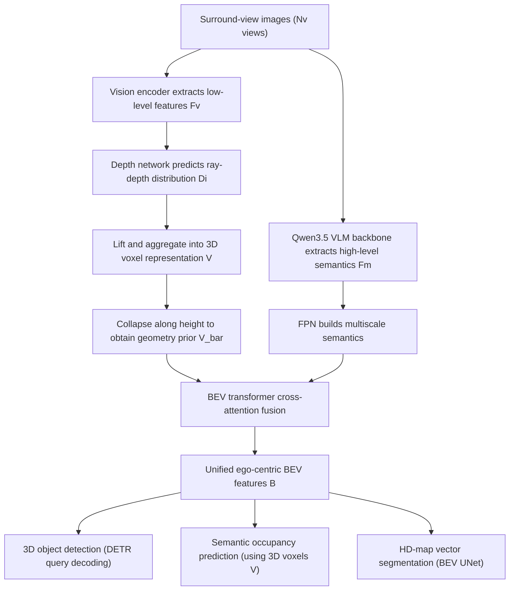

- **Perceptual objective function**: Total perceptual loss jointly supervised detection, occupancy and map segmentation:
  $$L_{perc} = L_{det} + L_{occ} + L_{map}$$
Among them, $L_{det}$ uses Focal loss under Hungarian matching and $\ell_1$ bounding box regression; $L_{occ}$ combines class-balanced Focal, geometric/semantic affinity loss and Lovász-softmax loss; $L_{map}$ uses Focal and Lovász loss. During backpropagation, the perceptual loss not only updates the BEV head, but also injects powerful 3D spatial supervision signals into the VLM and visual encoder through $F_m$.

---

#### 2.3 Planning expert based on flow matching (Flow Matching)
{: id="23-基于流匹配flow-matching的规划专家"}

Traditional autonomous driving solutions either use cascaded perception and prediction modules, resulting in serious information bottlenecks; or they force the language model to output discrete trajectory tokens, which is not only slow in inference, but also easily violates the physical kinematic constraints of the vehicle.

| Dimension | Traditional end-to-end perceptual planning (such as UniAD) | Pure autoregressive language model planning (such as DriveVLM / EMMA) | This article Qwen-Drive-1.0 architecture |
|---|---|---|---|
| Backbone model architecture | Dedicated CNN/BEV network, no general inference and common sense understanding capabilities | Modifying or fully fine-tuning VLM, prone to catastrophic forgetting and generalization degradation | Freezing the native pre-trained VLM architecture, no intrusive plug-in extensions |
| Planning trajectory representation | Dense sensing results are cascaded into the quadratic low-level trajectory optimizer | Text or discrete grid Token autoregressive point-by-point decoding | 32-layer continuous diffusion transformer (DiT) combined with flow matching decoding |
| Geometric common sense interaction mechanism | Only relies on prediction box geometric interaction, lacking deep semantic reasoning | Relying purely on discrete language prompts to derive coordinates, poor dynamic smoothness | Directly reuse VLM 8-layer GQA key value cache and dynamic state across modules |
| Post-policy training capability | Only supports imitation learning or simple cost function scoring | Discrete reinforcement learning (PPO) is difficult to smoothly explore continuous control manifolds | Continuous flow matching policy gradient (low-frequency cosine subspace perturbation and score recovery) |

- **input and conditional injection**:
The planning goal is modeled as conditional continuous trajectory generation:
  $$\tau \sim p(\tau \mid s, \ell, \tau_{hist}, n, e, r)$$
Among them, $$\tau = \{ (x_k, y_k, \theta_k) \} _{k=1}^{50}$$ is the longitudinal position, lateral position and orientation angle of 50 time steps in the next 5 seconds. After the input sensor image is calculated by the VLM backbone, the model extracts the Key and Value Cache (KV Cache) with rotary positional encoding (RoPE) in all 8 Grouped-Query Attention (GQA) layers in the VLM. The 32 layers of DiT are divided into 8 groups (each group has 4 layers). Each group directly performs joint cross-attention interaction with the KV splicing of the corresponding GQA layer; the historical trajectory of the vehicle $$\tau_{hist}$$, the navigation intention $n$ (such as turning left, going straight), the current physical state of the vehicle $e$ (speed and acceleration) and the flow time step $t$ is injected into each DiT block through adaptive layer normalization (AdaLN).
- **flow matching training target**:
Flow Matching in the form of endpoint prediction is used, and first-order and second-order time difference penalties are introduced to suppress trajectory jitter:
  $$L_{plan} = L_{fm} + 0.1 L_{\Delta 1} + 0.05 L_{\Delta 2}$$
Among them, $L_{fm}$ is the mean square error between the predicted flow field velocity and the real flow velocity; $L_{\Delta 1}$ and $L_{\Delta 2}$ are Huber regular terms, which penalize sudden changes in trajectory speed and acceleration respectively, ensuring that the output trajectory strictly meets vehicle ride comfort and dynamic continuity. During inference, only a 10-step Euler integrator is needed to quickly solve the deterministic smooth trajectory.

---

#### 2.4 Policy gradient reinforcement learning for continuous flow matching (Flow Matching RL)
{: id="24-连续流匹配的策略梯度强化学习flow-matching-rl"}

**Difficulty Analysis**: Planning experts trained based on imitation learning (SFT) can only approximate a single human demonstration trajectory, but human driving demonstrations may have suboptimal solutions, and cannot directly perceive non-differentiable environmental indicators such as collision risks, boundary crossing rates, and traffic efficiency. However, standard policy gradient reinforcement learning (such as PPO/GRPO) relies on action probability $\log \pi(a \mid s)$, while flow matching uses a deterministic 10-step ordinary differential equation (ODE) Euler integral during inference, and there is no likelihood distribution that can be directly derived.

Qwen-Drive-1.0 addresses this challenge with **a smooth policy-gradient optimization algorithm operating on the continuous diffusion / flow integration process**:
1. **injects controlled randomness into the tail**: In the 10-step Euler integration (step size $\Delta t = 0.1$), the first 7 steps maintain pure deterministic integration to lock in the overall decision-making; only the last 3 integration steps $W = \{7, 8, 9\}$ introduce controlled random perturbation. Because the disturbance at the end point can be directly mapped to the trajectory deformation, it not only ensures the diversity of exploration, but also avoids the early disturbance being offset by subsequent integral attenuation;
2. **Orthogonal cosine low-frequency subspace projection**: If independent Gaussian noise is added to 50 waypoints, chaotic high-frequency tremor glitches will be generated, preventing the model from learning meaningful avoidance behaviors. Therefore, the disturbance is strictly limited to the smooth low-frequency subspace ($\Phi^\top \Phi = I_M$) composed of the first $M=6$-order orthogonal cosine base $\Phi \in \mathbb{R}^{50 \times 6}$, so that the random changes appear as smooth lane-changing fine-tuning or front and rear longitudinal vehicle distance stretching;
3. **Score Restoration Mechanism (Restoring Score)**: Random exploration may cause the intermediate trajectory to deviate from the high probability density manifold. The algorithm uses Gaussian conditional probability to derive analytical recovery score terms:
   $$s_\theta(\tau^{(k)}, t_k) = -\frac{\tau^{(k)} - t_k \hat{\tau} _1^{(k)}}{(1 - t_k)^2}$$
And the single-step mean value is corrected to $\mu^{(k)} = \tau^{(k)} + v_\theta \Delta t + \frac{\sigma_k^2}{2} s_\theta$, which acts like a virtual damper to continuously pull the trajectory state toward the center of the pre-trained flow field;
4. **Relative advantage discount optimization within the group**: Concurrently sample $G=8$ trajectory candidates in the same environment, calculate rewards based on non-differentiable indicators (NAVSIM's PDMS, Waymo's RFS and displacement error ADE), and combine the within-group standardized advantage value $A_i = \frac{R_i - \bar{R}}{\sigma_R + \epsilon_R}$ with the time discount factor $\gamma = 0.6$ performs policy gradient return:
   $$L_{rl} = -\frac{1}{G \lvert W \rvert} \sum_{i=1}^G \sum_{w=0}^{\lvert W \rvert - 1} \gamma^{\lvert W \rvert - 1 - w} A_i \log \pi_\theta\left(\tau_i^{(k_w+1)} \,\middle\vert\, \tau_i^{(k_w)}\right)$$


> **Take an example**: Suppose the planning expert uses 10-step Euler integration ($K=10$) to generate a 5-second (50 waypoint) trajectory from pure noise denoising.
> 1. The first 7 steps of **(time steps 0 to 6)**: Completely follow the deterministic flow field velocity integral coasting, without introducing any additional noise, and retain the macro driving intention learned in pre-training;
> 2. 3 steps after **(time steps 7 to 9, set $W=\{7,8,9\}$)**: Since the closer to the end point, the small perturbation has a more direct impact on the actual trajectory, the exploration randomness is injected at this time. However, in order to prevent each of the 50 waypoints from randomly shaking into "jagged lines", the disturbance is strictly limited to a low-frequency subspace composed of 6 smooth orthogonal cosine waveform bases ($\Phi \in \mathbb{R}^{50 \times 6}$);
> 3. **anti-drift pull back**: After injecting Gaussian perturbation, the intermediate state may deviate from the pre-training streamline. The algorithm uses the conditional Gaussian distribution to infer a recovery fractional term $s_\theta = -\frac{\tau - t \hat{\tau} _1}{(1-t)^2}$, which is like a rubber band to steadily pull the disturbance point back to the center of the safe manifold;
> 4. **Valueless Network Advantage Estimation**: The same driving scene concurrently samples a complete set of trajectories $G=8$. Each trajectory calculates non-differentiable rewards (such as NAVSIM's collision and compliance comprehensive score PDMS) based on driving performance. The discount policy gradient is calculated through the relative advantage $A_i = \frac{R_i - \bar{R}}{\sigma_R}$ within the group to achieve reinforcement learning updates for continuous diffusion flow.

---

#### 2.5 Four-stage progressive training formula
{: id="25-四阶段递进式训练配方"}

<div align="center">
  
<figcaption>
Four-stage progressive training process: from sensor head preheating, multi-task joint representation fine-tuning, to planning expert pre-training and policy gradient reinforcement learning
</figcaption>
</div>

In order to balance multi-task learning conflicts and avoid catastrophic forgetting, the paper proposes a clear four-stage progressive training process:
- **Stage 1 (sensor head pre-training)**: Completely freeze the visual encoder and VLM backbone, and only pre-train the plug-in BEV sensor head with perceptual loss $L_{perc}$, allowing it to quickly establish projection and decoding priors from images to 3D voxels and BEV coordinate systems;
- **Stage 2 (joint alignment fine-tuning of perception and VQA)**: Unfreeze the visual encoder, VLM and BEV sensing head, mix 3D perception data, 3.09 million driving image and text data (multi-view image and text, video timing data) and general visual language data in proportion, and jointly train with $L_{perc} + L_{ntp}$. The BEV head learning rate is set to 20 times that of VLM, which not only allows large model representation to be integrated into 3D physical space understanding, but also firmly locks general question answering and commonsense reasoning capabilities;
- **Stage 3 (Planning expert pre-training, SFT)**: Freeze all multi-modal representations trained in Stage 2, only train the plug-in 1.1 billion parameter planning expert DiT, and learn the demonstration trajectories of each driving dataset with end-to-end flow matching loss $L_{plan}$;
- **Stage 4 (Planning Expert Reinforcement Learning, RL)**: Build a multi-source hybrid reward on NAVSIM, Waymo E2E and PhysicalAI-AV, directly post-train the optimization planning expert through the gradient of the above-mentioned flow matching strategy, and finally obtain the Qwen-Drive-1.0-RL with excellent performance.

---

### 3. Results and findings
{: id="3-核心结果发现-10"}

<div align="center">
  
<figcaption>
Comprehensive performance radar chart of Qwen-Drive-1.0 in the four dimensions of driving scene question and answer, general visual question and answer, 3D perception and motion planning
</figcaption>
</div>

#### 3.1 3D sensing performance detection
{: id="31-3d-感知性能探测"}

Multi-task unified evaluation on nuScenes and OpenScene validation sets shows:
- **3D leads** in target detection and map segmentation: achieving 43.95% mAP and 42.83% NDS on nuScenes, and BEV vector map segmentation mIoU reaching 60.99%; on the cross-city and cross-time OpenScene validation set, detection mAP reached 38.65%, and map segmentation mIoU up to 57.07%;
- **Spatial representation implicit stimulation**: ablation experiments show that if joint training is not performed in Stage 2 (freezing the main training plug-in head only in Stage 1), the perceptual index will lag behind significantly (nuScenes mAP is only 36.46%), proving that the general VLM itself does not directly expose explicit 3D coordinates, and the joint backpropagation of Stage 2 successfully converts 3D Geometric features are injected into the deep representation of VLM.

#### 3.2 General Visual Understanding Zero Forgetting and Driving Scene Questions and Answers Reach the Top
{: id="32-通用视觉理解零遗忘与驾驶场景问答登顶"}

- **'s general capabilities remain intact**: In 11 general multi-modal benchmark evaluations including MMBench (87.07%), MMStar (75.87%), MMMU (72.67%), RealWorldQA (78.95%), the average score of Qwen-Drive-1.0-SFT reached 66.82%, which is basically the same as the native universal Qwen3.5-4B base without driving fine-tuning (67.40%), successfully overcoming the common catastrophic forgetting problem in embodied driving fine-tuning;
- **drives VQA and comprehensively surpasses the industry-leading model**: reaching 77.80% on LingoQA (significantly ahead of 72.00% of Cosmos-Reason2 with 32B parameters), 66.52% on VLADBench (ahead of InternVL3.5-8B at 54.47%), It also ranked first on WaymoQA (74.47%) and SURDS (66.13%).

#### 3.3 Leading in all motion planning scenarios (open-loop, pseudo-closed-loop and simulated closed-loop)
{: id="33-运动规划全场景领先开环伪闭环与仿真闭环"}

<div align="center">
  
<figcaption>
Qualitative visualization of dynamic road scene trajectory planning: (a) open-loop prediction on WOD-E2E and PhysicalAI-AV; (b) closed-loop long-term trajectory tracking in AlpaSim simulator
</figcaption>
</div>

- **NAVSIM pseudo-closed-loop test set a new record**: On the NAVSIM v1.1 navtest list, the comprehensive driving score (PDMS) of Qwen-Drive-1.0-RL reached **90.7** (collision-free rate 98.3%, drivable area compliance rate 96.8%, comfort score 100.0%), significantly ahead of TransFuser (84.0), DRAMA (85.5) and Hydra-MDP (86.5); post-reinforcement learning training brings a qualitative leap of up to +3.9 points compared to pure imitation learning (86.8);
- **Waymo E2E test set tops**: On the authoritative Waymo real-world end-to-end planning benchmark (WOD-E2E) test set, Qwen-Drive-1.0-RL achieved **7.91** The scorer feedback score (RFS, close to 8.13 points of a real human driver), the 3-second and 5-second average displacement errors (ADE) are as low as 1.19 meters and 2.67 meters respectively, beating MindVLA-U1 (7.87) and AutoVLA (7.56) in the public rankings; on the verification set, the RFS reached 8.45, surpassing the human benchmark score;
- **AlpaSim closed-loop multi-scenario long-term simulation verification**: In NVIDIA's 916 complex long-term closed-loop scenario evaluation, Qwen-Drive-1.0-RL's close encounter rate (Close Encounter Rate) and off-road rate (Off-Road Rate) were both maintained at a low level, and the final AlpaSim score reached 0.37, which verifies the model’s closed-loop security and agile obstacle avoidance capabilities in dynamic interactive games.

---

### 4. Limitations
{: id="4-局限性-10"}

Although Qwen-Drive-1.0 has made a breakthrough in the unification of multi-tasks, its BEV sensing head and planning experts are still independently connected to the VLM as plug-in branches. The explicit geometric primitives of the sensing output (such as 3D bounding boxes and occupancy grids) cannot be directly fed back as structured prompts to the large language model for multi-step thinking chain symbolic inference; in addition, closed-loop simulation still has an occasional conservative tendency in the decision-making of giving way to sudden intruding vehicles when facing the long-tail extreme conditions of intensive dynamic games.

---

## 21. CGFM-Nav (2026)
{: id="cgfm-nav"}
——— Life-long multimodal embodied navigation by coupling explicit relational graph memory and implicit continuous semantic fields

📄 **Paper**: [arXiv:2608.29114](https://arxiv.org/abs/2608.29114)

### Key takeaways
{: id="精华-11"}
1. **Graph-field dual cognitive representation**: Cognitive Graph-Field Memory (CGFM) is proposed, which couples the discrete object semantic topology map and the continuous 2D semantic-boundary diffusion field in the same system, corresponding to "precision backtracking memory" and "fuzzy spatial intuition" in human navigation respectively.
2. **Efficient exploration guided by intuition**: When the target is not retrieved in the graph, there is no need to roam blindly. Instead, the semantic evidence in the graph is back-projected into a spatial diffusion field, which prioritizes guiding the robot to explore the unknown boundary (Frontier) with the highest semantic relevance, greatly reducing the lifetime navigation search overhead.
3. **Closed-loop suppression and graph update**: Dynamically update node status through multi-view verification mechanism (YES / NO-UNCERTAIN / NO-CONFIRMED); excluded false detection candidates physically mask their semantic field contributions in the current subtask, eliminating repeated retries and deadlocks of large models from the bottom.
4. **Lightweight Open sourceModel surpasses cloud GPT-4o**: On the GOAT-Bench lifelong multi-modal navigation benchmark, using Open source locally deployable Qwen3-VL-8B, the overall success rate reached 63.0%, surpassing the baseline equipped with cloud GPT-4o MSGNav (60.0%) proves that structured field memory can effectively bridge the capability gap of the basic model.

---

### 1. Background and problem
{: id="1-研究背景问题-11"}
In Lifelong Open-Vocabulary Embodied Navigation for families and complex environments, the robot needs to continuously perform navigation subtasks for multiple cross-modal targets (categories, natural language descriptions, or reference images) in unmodeled scenes, and retain historical map memory across subtasks.
The existing navigation methods based on large language model/multimodal large model (LLM/VLM) mainly have two core bottlenecks:
1. **The disconnect between explicit memory and target-free exploration**: Discrete object scene graphs are good at accurate retrieval and topological backtracking of known objects, but once the target does not exist in the current memory, the agent degenerates into random exploration of geometric frontier points (Frontier), lacking spatial semantic intuitive guidance.
2. **Retry illusion and context overhead under multi-modal targets**: Over time, the ever-expanding scene graph leads to severe expansion of the VLM context window; and when the target is confused, there is a lack of explicit suppression mechanism for failed attempts, causing the agent to repeatedly go to the same wrong object.

---

### 2. Method and innovations
{: id="2-主要方法创新点-11"}

<div align="center">
  
<figcaption>
Figure 1: Overview of CGFM cognitive map field memory mechanism. The discrete object scene graph serves as an explicit relational memory to support accurate recall; the continuous semantic-boundary field serves as an implicit intuitive bias to guide efficient exploration.
</figcaption>
</div>

#### ① Overview of the overall framework
{: id="-整体框架概述-3"}
CGFM-Nav adopts a training-free architecture as a whole, which is mainly composed of **perception and graph construction (Perception & Graph)**, **semantic-frontier field construction (Semantic-Frontier Field)**, **Adaptive subgraph selection (Subgraph Selection)**, **VLM inference (VLM Reasoning) with decision memory** and **Action execution and multi-view closed-loop verification (Action & Verification)** is composed of five modules. The system forms a closed loop of seamless switching and continuous updating between known goals and unknown exploration.

<div align="center">
  
<figcaption>
Figure 2: CGFM-Nav system architecture diagram. RGB-D input constructs a multi-modal scene graph and projects it to generate a semantic field; VLM issues actions based on filtered subgraphs and decision logs, and the verification results drive closed-loop memory updates.
</figcaption>
</div>

#### ② Explain module by module
{: id="-逐模块讲解-3"}

**1. Perception and multimodal scene graph construction (Perception & Graph Memory)**
- **Input**: Continuous RGB-D sensor frames onboard the robot.
- **handles**: Use YOLOv8-World and SAM for open vocabulary target detection and precise pixel segmentation; use CLIP to extract appearance features of each target. Incrementally building persistent multimodal scene graphs $$\mathcal{G}_t = (\mathcal{V}_t, \mathcal{E}_t)$$.
- **outputs**: node $$v_i = (c_i, p_i, z_i, \mathcal{I}_i)$$, which stores object category $c_i$, 3D spatial coordinates $p_i$, visual semantic features $z_i$ and historical multi-view observation image collection $$\mathcal{I}_i$$; edge $$\mathcal{E}_t$$ records the spatial topology and relationships between objects.
- **Design Motivation**: In particular, target verification statistics (number of verifications, subtasks, identification results, and multi-perspective feedback logs) are added to each node.

**2. Continuous Semantic-Frontier Field Construction**
- **Input**: Current multimodal scene graph $$\mathcal{G}_t$$, mission goal description $q$, and 2D occupancy raster map.
- **handles**:
  1. Calculate the CLIP similarity between the graph node and the target $q$, and subtract the background baseline to get the net correlation score $s_i(q)$.
  2. Verify the mask (set to 0) for nodes that have been confirmed and excluded by the current subtask, and do not spread energy into the field.
  3. Treat each valid object as a spatial point source, and its semantic influence decays exponentially along the geodesic distance (Geodesic Distance) of unobstructed free space: $w_i(x) = \exp(-d(x, p_i)/\tau)$.
  4. For each grid unit $x$, aggregate the $K_s$ objects with the largest local contribution to generate a continuous semantic field:
     $$S_t(x \mid q) = \sum_{i \in \mathrm{Top}K_s(x)} s_i(q) w_i(x)$$
  5. Extract the geometric frontier point set $$\mathcal{C}_t = \{f_1, \dots, f_M\}$$ at the intersection of free space and unknown area, and calculate the exploration score $U_t(f \mid q)$ of each frontier point: the average semantic field strength in a small neighborhood, and divide it by the geodesic navigation cost of the robot to the frontier point.
- **Output**: Continuous heat map with semantic exploration priority and frontier point score ranking.

> **Give an example (stuck point dimensionality reduction device A: semantic field and frontier point calculation)**:
> Assuming that the task is "find the stroller", the robot constructs a scene graph containing 3 objects in the living room:
> - Object A (folding chair): The previous navigation failed verification and was recorded as `NO-CONFIRMED`. The verification mask directly sets its net score to $s_A(q) = 0$ and no longer diffuses any semantic energy;
> - Object B (dining table): low correlation with the stroller, after subtracting the background baseline $s_B(q) = 0$;
> - Object C (baby bottle): strongly semantically related to the stroller, calculated as $s_C(q) = 0.8$.
>
> There are now two frontier candidate points in the unexplored area:
> - Frontier point 1 (close to object C, 1 meter away from the object, attenuation weight $w=0.7$; 2 meters away from the robot): the local semantic field is $0.8 \times 0.7 = 0.56$; after combining the distance cost, the exploration score is as high as $0.56 / 2 = 0.28$;
> - Frontier point 2 (near the kitchen, far from object C, $w \approx 0$ after attenuation; only 1 meter from the robot): local semantic field is 0, exploration score is almost 0.
>
> Even if the robot has never seen the stroller, it can accurately steer towards the unknown corridor around object C under the guidance of the continuous semantic field instead of blindly exploring the kitchen.

**3. Semantic-Guided Subgraph Selection**
- **input**: full scene graph $$\mathcal{G}_t$$ and target $q$.
- **processes**: directly reuses the CLIP correlation in field calculation, selects positively correlated nodes and their first-order neighbors to form the semantic seed set $$\mathcal{V}_{seed}$$; the remaining nodes are compressed into the residual graph $$\hat{\mathcal{G}}_{res}$$, and are handed over to VLM for supplementary selection based on common sense. After pruning, a compact key subgraph $$\tilde{\mathcal{G}}_t$$ is formed.
- **output**: lightweight structured prompt information input to the large model.

**4. VLM Reasoning with Decision Memory**
- **input**: target $q$, key subgraph $$\tilde{\mathcal{G}}_t$$ and decision memory $$\mathcal{D}_t$$ (attempted candidate points recorded by time, destination type and short inference summary).
- **processing**: VLM makes one of three types of decisions: select object node $v_i$, select historical image $I_{i,j}$, or issue exploration command `EXPLORE`.
- **output**: discrete high-level decision-making instruction $d_t$.

**5. Action shunt and closed-loop multi-view verification (Action & Verification)**
- **input**: Decision instruction $d_t$ with semantic boundary fields.
- **processing and flow**:
  - If it is a known object/image: Send the coordinates directly, and call VLM after navigation arrives for multi-view observation verification (return `YES`, `NO-UNCERTAIN` or `NO-CONFIRMED`);
  - If it is `EXPLORE`: If there is a frontier point, select the one with the highest score; if there is no frontier point but there is an incompletely explored semantic peak, navigate to the highest response center of the semantic map; if there is no frontier point, report failure.
  - Objects that are successfully verified enter the next subtask; objects that fail to be verified record node masks and block their field diffusion; uncertain objects are re-identified from additional perspectives.

#### ③ Reader’s perspective: closed-loop status and decision-making flow diagram (stuck point dimensionality reduction device B)
{: id="-读者视角闭环状态与决策流转图卡点降维装置-b"}

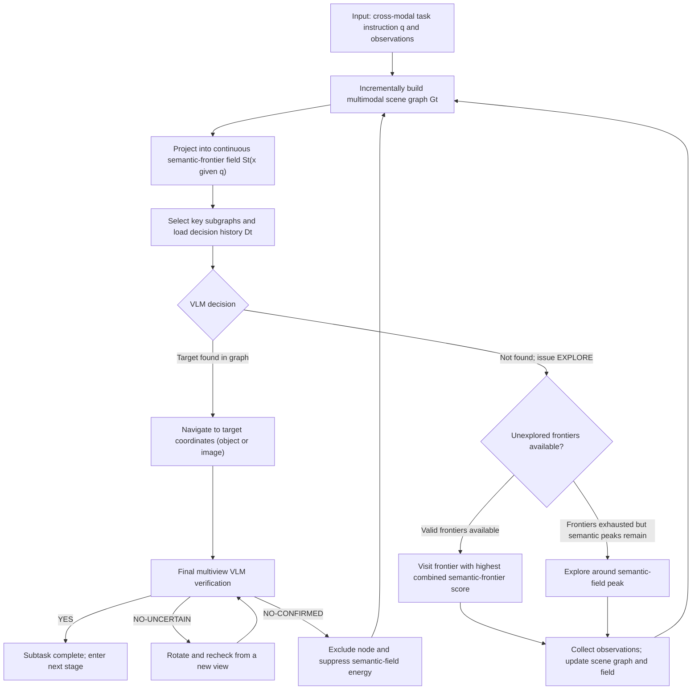

#### ④ Core difference: Mechanism comparison with the classic baseline MSGNav (stuck point dimensionality reduction device C)
{: id="-核心差异与经典基线-msgnav-的机制对比卡点降维装置-c"}

| Mechanism dimension | Classic baseline MSGNav | This article CGFM-Nav |
|---|---|---|
| **Exploration Guidance Method** | Pure geometric boundary exploration or undirected random roaming | Back-projection of scene graph evidence into a continuous semantic field, empowering frontier point semantic bias |
| **subgraph prompt filtering** | Rule full search or plain text LLM filtering | Semantic seed set of multiplexed field correlation + residual graph VLM common sense supplement |
| **Error retry suppression** | Rely on historical logs stuffed in short-term text context | Node-level physical verification mask, completely cut off the gravity of the wrong object in the field |
| **Deployment model Threshold** | Heavy reliance on expensive and high-latency cloud GPT-4o | Local Open source lightweight Qwen3-VL-8B can surpass the performance of large cloud models |

#### ⑤ Training and inference settings
{: id="-训练与推理设定"}
- **does not require training (Training-Free)**: The whole framework is a pure zero-shot inference architecture, the perception module uses pre-trained YOLOv8-World + SAM + CLIP, and the decision-making inference and multi-perspective verification use the Open source lightweight Qwen3-VL-8B-Instruct.
- **Lifelong memory retention**: The scene graph and its verification mask are fully preserved between multiple subtasks of the same scene; only the short-term decision log is reset across subtasks and the semantic field is reconstructed according to the new goal.

---

### 3. Results and findings
{: id="3-核心结果发现-11"}
The evaluation results on the extremely challenging lifelong cross-modal navigation benchmark **GOAT-Bench** (including 36 unseen scenes, 278 multi-modal subtasks, covering categories, language descriptions and reference image targets) show that:

1. **significantly improves** with the same base: Under a fair comparison using Open source **Qwen3-VL-8B**, CGFM-Nav compares to MSGNav:
   - The overall success rate (SR) increased from **53.2% to 63.0%** (+9.8%);
   - The path length weighted success rate (SPL) increased from **30.0% to 39.6%** (+9.6%);
   - Especially significant jumps were achieved in category goals (SR: 63.6% → **72.7%**) and language goals (SR: 48.4% → **61.5%**).
2. **lightweight device-side counterattack on cloud flagship**: CGFM-Nav equipped with local 8B parameter multi-modal model, in overall SR (**63.0%** vs 60.0%), category Comprehensively surpassed the cloud-based closed-source flagship in terms of SR (**72.7%** vs 63.6%) and language SR (**61.5%** vs 57.2%) The MSGNav of **GPT-4o** verifies the effect of high-quality environmental cognitive representations on making up for the gap in the large model base.
3. **Image target relies on fine-grained matching**: In the image target subtask, due to the lack of generalization knowledge at the category level, it relies more on point-to-point matching of underlying pixel features. Although CGFM-Nav is significantly improved compared to the same base baseline (SR: 46.6% → 53.4%), there is still a slight gap compared to GPT-4o, indicating that the image target is very important to VLM. Its own fine-grained cross-view feature extraction capability puts forward higher requirements.

---

### 4. Limitations
{: id="4-局限性-11"}
1. The current verification is still limited to the GOAT-Bench simulation environment, and the long-term robustness under non-ideal factors such as sensor noise, dynamic pedestrian occlusion and odometry drift has not been fully verified on a real physical wheeled robot.
2. The representation and search of image objects are still limited by the granularity of global CLIP features, and there is a lack of local feature retrieval mechanism specifically oriented to finely aligning the appearance of object instances.

---

## 22. CanonNav (2026)
{: id="canonnav"}
——— Cross-platform visual diffusion navigation policy that decouples camera geometry and navigation behavior

📄 **Paper**: [arXiv:2608.30242](https://arxiv.org/abs/2608.30242)

### Key takeaways
{: id="精华-12"}
1. **Decoupling camera geometry and behavior**: Proposes camera geometry normalization (Canonicalization), eliminates differences in camera intrinsic parameters and pitch angles through homographic reprojection, and maps physical trajectories to perspective-invariant space through installation height normalization, completely solving the pathological problem of entanglement between visual observation and trajectory mapping in cross-robot platform demonstration data.
2. **Explicit local planning supervision (Scope-of-Reach, SoR)**: In view of the shortcomings of traditional imitation learning that only learns expert actions but misses intermediate planning intentions, a local reachable range (SoR) representation is proposed, and BEV pseudo-labels generated offline are used to explicitly supervise the agent "where to advance" in occluded or complex terrain.
3. **Collision-aware manifold constraint**: Use the offline traversability estimator to construct a metric signed distance field (SDF), and directly back-propagate the collision penalty loss and waypoint feasibility loss on the denoising trajectory of the diffusion policy to achieve end-to-end safe trajectory generation.
4. **monocular RGB rivals and exceeds the depth map solution**: relying only on monocular RGB input for inference, it significantly surpasses RGB baselines such as ViNT, NoMaD, and LiMo in CitySim outdoor and AWS Hospital indoor multi-camera configurations, and in long-distance complex turning scenarios, the success rate exceeds NavDP that relies on real-time RGB-D depth input.

---

### 1. Background and problem
{: id="1-研究背景问题-12"}
Using discrete cross-platform expert demonstrations for large-scale imitation learning (Imitation Learning) is an important route to promote autonomous visual navigation of robots. However, making full use of cross-platform heterogeneous data faces two fundamental problems:
1. **The pathological entanglement of camera geometry**: Different robot chassis (such as four-legged quadruped robots, low sweepers, wheeled mobile vehicles) have different camera heights, internal references and pitch angles. The same image projection may correspond to completely different ground physical trajectories; if the strategy is forced to implicitly infer camera geometry from RGB, it is a severely ill-posed and under-constrained problem in mathematics.
2. **Implicitness of planning intention in expert demonstration**: The expert trajectory only shows the smooth path of the final execution without explaining "why the transition to this local open area was chosen" and "how dangerous the edges on both sides are". Pure imitation learning is prone to degradation or collision when encountering complex scenes such as obstructions, turning and detours, etc. that do not directly reach the target.

---

### 2. Method and innovations
{: id="2-主要方法创新点-12"}

<div align="center">
  
<figcaption>
Figure 1: CanonNav research motivation. (a) Cross-platform camera geometry differences lead to serious inconsistencies in the mapping of images and physical trajectories; (b) Traditional imitation learning lacks supervision of intermediate planning decisions such as local advancement area identification and safety boundaries.
</figcaption>
</div>

#### ① Overview of the overall framework
{: id="-整体框架概述-4"}
CanonNav proposed the **camera geometry normalization (Canonicalization)**, **multi-task diffusion policy network (Policy Inference)** and **offline planning safety supervision (Training-Time Planning Supervision)** closed-loop system. In the training phase, the pre-trained accessibility model is used to offline extract BEV pseudo-labels to provide intensive supervision; in the deployment phase, no offline model and depth sensor are required, and collision-free trajectories can be output using only monocular RGB images and relative targets.

<div align="center">
  
<figcaption>
Figure 2: CanonNav overall architecture. (a) Observations and targets are converted to normalized geometric space; (b) DINOv3 backbone network extracts features, and the diffusion model outputs highly normalized trajectories, waypoint traffic rates, and SoR; (d) Offline BEV collision graphs and SDF provide safety and local advancement supervision.
</figcaption>
</div>

#### ② Explain module by module
{: id="-逐模块讲解-4"}

**1. Camera Geometry Canonicalization**
- **is internally involved in pitch angle elimination**: Let the extrinsic parameters of the camera be simplified to the installation height $h$ and the pitch angle $R_{pitch}$, and the internal parameters are $K$. Given the preset forward benchmark virtual camera intrinsic parameter $\tilde{K}$, remap the original image $I_t$ projection to the forward view without tilt angle $$\tilde{I}_t$$:
  $$(\tilde{u}, \tilde{v}, 1)^\top \propto \tilde{K} R_{pitch}^{-1} K^{-1} (u, v, 1)^\top$$
- **Height-Normalized Trajectory**: Under the forward benchmark camera, the ground physical point $(x, y)$ is projected as $$\tilde{u} = \tilde{c}_x - \tilde{f}_x \frac{y}{x}$$, $$\tilde{v} = \tilde{c}_y - \tilde{f}_y \frac{h}{x}$$. It can be seen that the pixel position depends entirely on the aspect ratio $y/x$ and the height ratio $h/x$. Normalize the physical trajectory point $(x, y)$ to $(\tilde{x}, \tilde{y}) = (x/h, y/h)$, and the projection formula is transformed into:
  $$\tilde{u} = \tilde{c}_x - \tilde{f}_x \frac{\tilde{y}}{\tilde{x}}, \quad \tilde{v} = \tilde{c}_y - \tilde{f}_y \frac{1}{\tilde{x}}$$
This normalization completely strips away the interference of the camera height $h$, aligning the trajectory distributions of all platforms under the same view frustum geometry.

> **gives an example (stuck point dimensionality reduction device A: Why can height normalization eliminate chassis differences?)**:
> Assume that the focal length of the benchmark virtual camera is $$\tilde{f}_y = 500$$, and the main point is $$\tilde{c}_y = 250$$:
> - **low sweeping robot**: camera height $h_1 = 0.2\text{ m}$, road obstacle ($x_1 = 1.0\text{ m}$) in front $1.0\text{ m}$, its height-to-distance ratio is $h_1 / x_1 = 0.2 / 1.0 = 0.2$;
> - **tall inspection wheeled vehicle**: camera height $h_2 = 1.0\text{ m}$, road obstacle ($x_2 = 5.0\text{ m}$) in front $5.0\text{ m}$, its height-to-distance ratio is $h_2 / x_2 = 1.0 / 5.0 = 0.2$.
>
> In the forward images of the two robots, these two ground points with completely different physical distances, the calculated pixel row positions $\tilde{v} = 250 - 500 \times 0.2 = 150$ **are exactly the same**!
> If we directly imitate metric coordinates, the policy network would have to predict the contradictory actions of $1.0\text{ m}$ and $5.0\text{ m}$ in the face of the same visual appearance. After being highly normalized, the dimensionless target distances of both are $\tilde{x} = x/h = 5.0$! The policy network only needs to learn this unified distribution, and then multiply it by the respective physical installation height $h$ during control to achieve seamless generalization.

**2. Planning supervision and Scope-of-Reach (SoR)**
- **SoR Local reachable range modeling**: The local advancement area is modeled as a 2D bird's-eye view Gaussian distribution $\mathcal{S} = \mathcal{N}(\mu, \operatorname{diag}(\sigma^2))$, and the network predicts its highly normalized parameters $(\tilde{\mu}, \tilde{\sigma}) = (\mu/h, \sigma/h)$.
- **Offline secure pseudo label generation**:
  1. Use pre-trained ViTA to extract image passability masks in the offline training set;
  2. Projected to the ground to generate a local BEV collision map $M_{coll}$, and converted to a metric signed distance field $M_{sdf}$;
  3. Extract the last feasible waypoint before the expert trajectory enters the collision zone or the field of view boundary as the local advancement target $$s^*$$.
- **triple SoR loss function**:
  $$L_{prog} = \lambda_{pred} L_{pred} + \lambda_{neg} L_{neg} + \lambda_{cons} L_{cons}$$
  - $L_{pred}$: Negative log likelihood combined with Smooth-L1 fitting target point $$\tilde{s}^*$$;
  - $L_{neg} = \iint M_{coll}(x, y) \mathcal{S}(x, y) dx dy$: Point penalty for Gaussian probability of falling into the collision obstacle zone;
  - $L_{cons}$: The denoised waypoints that generate trajectories using Soft-min constraints have at least one crossing the predicted SoR region.

**3. Continuous collision perception safety loss (Safety Supervision)**
- From the noisy trajectory $$\tilde{\tau}_k$$, the noise-free waypoint estimate $$\hat{\tau}_0 = \{\hat{p}_i\}$$ is obtained through a single-step inverse solution;
- Measuring collision penalty loss $L_{coll}$:
  $$c_i = \operatorname{softplus}\left(\frac{d_{safe} - M_{sdf}(h \hat{p}_i)}{\eta}\right), \quad L_{coll} = \frac{1}{\gamma} \log \sum_{i=1}^N \exp(\gamma c_i)$$
- Waypoint traversability branch $L_{trav}$: Bilinear sampling image features predict waypoint survival probability $$\hat{q}_i$$.

#### ③ Reader’s perspective: data flow and training/inference separation diagram (stuck point dimensionality reduction device B)
{: id="-读者视角数据流与训练推理分离图卡点降维装置-b"}

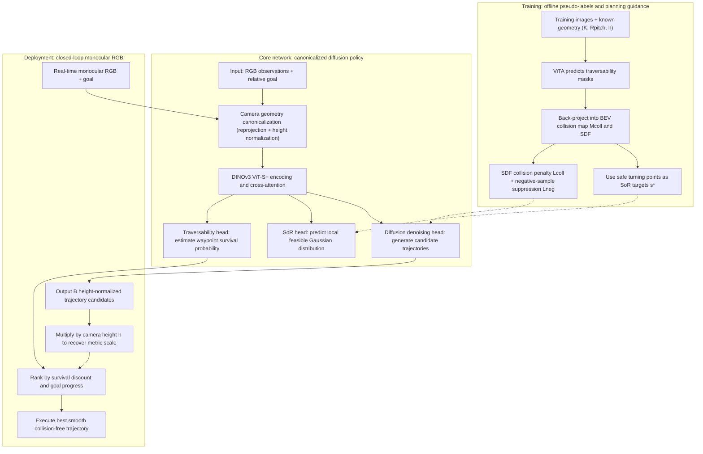

#### ④ Core mechanism comparison: CanonNav vs mainstream navigation baseline (stuck point dimensionality reduction device C)
{: id="-核心机制对比canonnav-vs-主流导航基线卡点降维装置-c"}

| Mechanism dimension | Traditional pure imitation baseline (ViNT / NoMaD) | Depth map planning baseline (ViPlanner / NavDP) | This article CanonNav |
|---|---|---|---|
| **Cross-platform geometry processing** | Forcibly input the original image and rely on massive random enhancement to implicit adaptation | RGB-D geometric alignment that requires precise registration | Explicit reprojection + highly normalized spatial decoupling |
| **intermediate planning intention** | Pure trajectory diffusion denoising, missing local turning guidance | Relying on real-time depth map reconstruction cost map | Proposing SoR explicit modeling of local advancement distribution |
| **Collision avoidance mechanism** | Lack of explicit negative feedback, easy to cut inwards and scratch obstacles | An online high frame rate depth sensor is required to calculate collision | Offline SDF reverse gradient constraint generation trajectory |
| **Deployment sensor threshold** | monocular RGB (but very poor resistance to geometric disturbance) | Strong reliance on real-time dense RGB-D sensors | Pure monocular RGB can achieve ultra-high security |

---

### 3. Results and findings
{: id="3-核心结果发现-12"}
Evaluation was carried out on two highly representative and difficult simulation environments, **CitySim (outdoor complex campus)** and **AWS Hospital (indoor complex corridor ward)**, as well as a real physical vehicle (Clearpath Husky differential wheeled vehicle):

1. **cross-camera geometric generalization fault leads**: Under the dramatic configuration shift of the camera height changing from $0.4\text{ m}$ to $1.0\text{ m}$ and the pitch angle changing from $-15^\circ$ to $+15^\circ$, the success rates of ViNT and NoMaD generally plummeted. 20%~40%, while CanonNav’s success rate decrease ($\Delta\text{SR}$) under all geometric perturbations is controlled within a very small range.
2. **Long-distance complex corners surpass RGB-D solution**: In the $20\text{ m}$ super long sub-goal navigation task, even in the face of U-shaped turns with severe occlusion, CanonNav achieved **86.4%** using only monocular RGB The success rate and **0.89** collision rate significantly surpassed NavDP (SR 71.2%, collision rate 2.21) and ViPlanner (SR 39.3%) equipped with real-time dense depth.
3. **Zero sample migration and zero accidents in the real world**: In the real robot test including reflective glass curtain walls, narrow tree steps and outdoor special-shaped corridors, CanonNav maintained zero collisions in all tests, and the trajectory curvature was extremely consistent with the human teaching path.

---

### 4. Limitations
{: id="4-局限性-12"}
1. Geometric normalization relies on the known installation parameters of the robot itself (camera internal parameters $K$, static installation height $h$, and pitch angle $R_{pitch}$). If the robot experiences severe dynamic pitch oscillations on a bumpy off-road road, the static normalization assumption will introduce instantaneous projection errors.
2. The quality of offline pseudo-labels is limited by the initial segmentation accuracy of the ViTA accessibility segmentation model under extreme lighting (such as heavy rain, strong backlight).

---

## 23. LookStep (2026)
{: id="lookstep"}
———— Efficient end-to-end vision-language navigation based on language forward deduction and event-driven memory

📄 **Paper**: [arXiv:2609.02350](https://arxiv.org/abs/2609.02350) · [Code](https://github.com/kunyang-YU/LookStep)

### Key takeaways
{: id="精华-13"}
1. **Language Center Future State Foresight (LC-FSM)**: Breaking the traditional VLN paradigm which only supervises the next single expert action (Next-step prediction), it explicitly predicts the forward-looking consequences of all candidate actions (such as hitting the wall in advance, completing the turn, wrong route) through lightweight language tags, and realizes counterfactual decision-making deduction with extremely high data utilization.
2. **Event-driven adaptive rolling memory (EDRM)**: There is no need for external complex 3D geometric mapping or full history stacking that takes up huge GPU memory. The multi-modal large model independently determines whether the current observation constitutes a key event during the inference process (`<memory_write>keep/drop</memory_write>`) and assigns semantic roles to achieve long-term context maintenance with bounded memory.
3. **Extremely high GPU memory and data utilization efficiency**: Without relying on external geometry tools or massive additional pre-training data, the inferenceGPU memory is controlled at **19.7 GB** (about half of similar methods), and the GPU memory utilization efficiency (SR/GB) reaches **2.52**, significantly ahead of JanusVLN (1.19) and StreamVLN (1.95).
4. Refresh the continuous environment under the same settings as **SOTA**: Obtained on the most challenging continuous environment vision-language navigationBenchmark **R2R-CE** Unseen validation set (Val-Unseen) The success rate of **49.7%** completely surpasses existing mainstream methods using the same data volume and training budget.

---

### 1. Background and problem
{: id="1-研究背景问题-13"}
Continuous environment vision-language navigation (VLN-CE) requires embodied agents to reach designated destinations relying solely on natural language long-range instructions and continuous on-board camera observations. Existing navigation strategies based on Multimodal Large Language model (MLLM) are mainly subject to two major efficiency bottlenecks:
1. **Data hunger and weak supervision at the training level**: Traditional behavior cloning (Behavior Cloning) only uses a single action currently performed by the expert as a supervision signal. The model cannot know "why other actions are not selected" and "what dangerous consequences the alternative actions will cause", resulting in training requiring millions of large-scale expert trajectory support.
2. **Inference-time GPU memory growth and loss of keyframes**: long-horizon navigation requires historical state. Retaining every video frame grows memory linearly, while fixed windows or uniform sampling may omit critical transitions such as opening a door or descending stairs. External 3D mapping adds substantial latency and deployment complexity.

---

### 2. Method and innovations
{: id="2-主要方法创新点-13"}

<div align="center">
  
<figcaption>
Figure 1: LookStep’s GPU memory efficiency and performance comparison on the R2R dataset. No additional pre-training data is required, and an ultra-high unit GPU memory success rate (SR/GB) of 2.52 is achieved with only 19.7 GB GPU memory.
</figcaption>
</div>

#### ① Overview of the overall framework
{: id="-整体框架概述-5"}
LookStep is a unified end-to-end MLLM navigation framework that does not rely on external 3D sensors or independent mapping modules. The system generates sequences through unified structured text and simultaneously completes three core tasks in autoregressive decoding: **Event-Driven Memory Management**, **Language-Centric Future State Modeling Modeling)** and **final action delivery (Action Prediction)**.

<div align="center">
  
<figcaption>
Figure 2: LookStep system architecture and language tag mechanism. Autoregressively generates the macro progress of the task, the derivation consequences of each action, memory writing determination and semantic roles, and finally closes the loop to output the action and maintains the bounded rolling memory.
</figcaption>
</div>

#### ② Explain module by module
{: id="-逐模块讲解-5"}

**1. Language Centric Future State Modeling (LC-FSM)**
- **input**: natural language navigation instructions $I$, current camera observation $x_t$, and bounded historical memory $O_{t-1}$.
- **structured deduction label design**:
  - **Macro navigation progress**: `<progress>early / mid / late</progress>` allows the model to have explicit awareness of the current command stage;
  - **Complete set of candidate action consequences**: Generate coarse-grained natural language consequence labels for currently available discrete candidate actions (such as forward, turn left, turn right, stop):
    $$\langle \mathrm{outcomes} \rangle \; \langle \mathrm{forward} \rangle \dots \langle /\mathrm{forward} \rangle \; \langle \mathrm{turn\_left} \rangle \dots \langle /\mathrm{turn\_left} \rangle \dots \langle /\mathrm{outcomes} \rangle$$
For example: `<forward>premature_forward</forward>` (advance prematurely, hit the wall), `<turn_left>finish_turn</turn_left>` (complete the turn, face the door opening), `<stop>too_early</stop>` (stop prematurely).
- **Information theory design motivation**: The author theoretically proves that introducing expert future state labels can significantly improve the lower bound of conditional mutual information between observations and expert actions; through counterfactual consequence language modeling, a single sample can provide multi-dimensional adversarial discriminant supervision.

> **Take an example (stuck point dimensionality reduction device A: counterfactual deduction of candidate actions)**:
> Let the command be: "Go through the doorway to the left of the stairs and wait there."
> The robot has just reached the stairs and faces 4 action candidates:
> - **Traditional BC Oversight**: Tagged `turn_left`. The loss function only penalizes the negative log-likelihood of this item, and the model does not have any gradient feedback on "why it cannot turn right";
> - **LookStep Language Preview**: model autoregressive generation:
>   ```xml
>   <progress>late</progress>
>   <outcomes>
>     <forward>premature_forward</forward> <!-- Background image prefetch after page load. -->
>     <turn_left>finish_turn</turn_left>    <!-- Background image prefetch after page load. -->
>     <turn_right>wrong_turn</turn_right>   <!-- Background image prefetch after page load. -->
>     <stop>too_early</stop>                <!-- Background image prefetch after page load. -->
>   </outcomes>
>   ```
> Before the next step of inference, model has completed the "sandbox deduction" of the physical constraints of the environment in the language semantic space, which greatly reduces the blind trial and error rate.

**2. Event Driven Rolling Memory (EDRM)**
- **Input**: Current frame and global task context.
- **processing**: Transform the maintenance of historical status into online fine-tuning-free test-time memory adaptation (Test-Time Adaptation):
  - `<event>`: Identify the key embodied events that occurred in the current frame (such as `turn_left_finishing`, `doorway_crossing`);
  - `<memory_write>`: autonomously decide whether to write to the historical memory buffer (`keep` writes, `drop` discards);
  - `<memory_role>`: Specifies the long-term index role of this frame (such as `turn_end` turning end anchor point, `landmark` key landmark).
- **Bounded rolling update**: The memory queue maintains a fixed length $K$ (only accommodating a very small number of keyframes). If the queue overflows when new keyframes are written, first-in-first-out or rolling replacement based on role priority will be followed to strictly lock the GPU memory occupation of long-range trajectories at a constant upper limit.

#### ③ Reader’s perspective: Single-step inference and memory transfer self-made flow chart (stuck point dimensionality reduction device B)
{: id="-读者视角单步推理与记忆流转自制流程图卡点降维装置-b"}

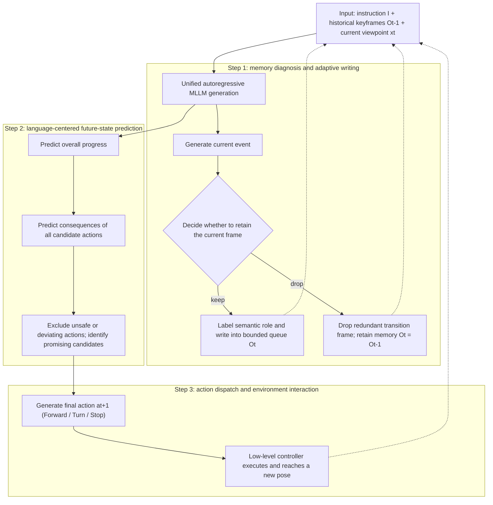

#### ④ Mechanism comparison: LookStep vs mainstream continuous environment VLN solution (stuck point dimensionality reduction device C)
{: id="-机制对比lookstep-vs-主流连续环境-vln-方案卡点降维装置-c"}

| Mechanism dimension | Traditional video frame stacking solution (such as StreamVLN) | External mapping solution (such as MapNav / g3D-LF) | This article LookStep |
|---|---|---|---|
| **Historical memory maintenance** | Sliding window truncation or frame extraction at uniform fixed intervals | Maintaining dense 2D/3D topology map or voxel grid | model autonomously writes and annotates roles triggered by events |
| **action supervision signal** | Only supervise a single expert discrete action | Rely on map heuristic geometric waypoint planning | Structured language to deduce the future consequences of all candidate actions |
| **runtime GPU memory** | As the trajectory length increases, or up to 40 GB+ | Requires additional running of SLAM/3D module, GPU memory and calculation weight | Strictly constant limit of 19.7 GB, consumer-grade graphics card can run |
| **additional training data** | Generally dependent on millions of additional multi-modal trajectories | 3D geometric features need to be extracted offline in advance | 0 additional pre-training data, pure standard dataset training |

#### ⑤ Training and inference details
{: id="-训练与推理细节"}
- **backbone network**: adopts a unified Open source visual-language model architecture, and uses standard autoregressive causal language modeling loss (Cross-Entropy) end-to-end fine-tuning on the standard R2R-CE / RxR-CE training set.
- **test period inference**: In single-step inference, the model spits out the memory tag, forward tag and final action in sequence, and then directly parses the action token to drive the robot to move without calling an external renderer or geometry solver.

---

### 3. Results and findings
{: id="3-核心结果发现-13"}
A comprehensive comparative evaluation was conducted on the core benchmark **R2R-CE** in the continuous environment vision-language navigation and the **RxR-CE** unseen validation set (Val-Unseen):

1. **won the championship under the same training settings SOTA**: Without using any additional training data (0 External Data):
   - R2R-CE Val-Unseen success rate (SR) reaches **49.7%**, and path length weighted success rate (SPL) reaches **45.5%**;
   - Comprehensively crushed traditional models (such as HPN+DN 36.0%, CMA 41.0%, VLN-BERT 44.0%, Sim2Sim 43.0%);
   - The performance is even close to that of very large model solutions that use tens of millions of additional unsupervised trajectory pre-training (such as NaVILA 49.7%).
2. **extremely high unit GPU memory efficiency**: As shown in Figure 1, the GPU memory of LookStep running is only **19.7 GB**, and its memory efficiency index (SR/GB) reaches **2.52**, which is significantly higher than similar advanced MLLM methods JanusVLN (1.19) and StreamVLN (1.95).
3. **Real physical machine deployment verification**: In the indoor complex multi-room real robot experiment (Figure 3 and Figure 7), even if the instruction description does not completely match the actual lighting perspective, the agent still demonstrates the robust ability to smoothly enter and exit the door and accurately identify the end point of the turn by relying on accurate character memory and action prediction.

---

### 4. Limitations
{: id="4-局限性-13"}
1. The look-ahead state of candidate actions currently uses discretized language tags (such as `premature_forward`, `wrong_turn`) for coarse-grained description, which makes it difficult to describe millimeter-level continuous angular velocity and linear velocity dynamics details.
2. The writing and deletion of memory completely relies on MLLM's own semantic judgment. When extreme visual degradation (such as total darkness, strong reflection) leads to misjudgment of event roles, key frames may be mistakenly discarded.

---

## 24. NavMCP (2026)
{: id="navmcp"}
———The first long-range embodied navigation framework that scaffolds and encapsulates the Navigation Foundation model (NFM) into an agent actuator.

📄 **Paper**: [arXiv:2608.30396](https://arxiv.org/abs/2608.30396)

### Key takeaways
{: id="精华-14"}
1. **Core Insight**: Long-range physical world interaction faces the dilemma of "high-level macro inference" and "low-level micro closed loop". The existing visual language model (VLM) has serious long-range action drift, while the navigation foundation model (NFM) has excellent local embodied execution capabilities, but is limited to a single round and lacks a persistent task state across rounds.
2. **paradigm breaks through**: NavMCP breaks the traditional practice of simply treating the navigation model as a black-box single-step tool (Episodic Tool Interface), and proposes the first scaffolding (Scaffolding) protocol system that uses NFM as the physical execution layer of long-range embodied agents to achieve long-range closed-loop exploration without fine-tuning any underlying model.
3. **Architecture Mechanism**: Construct a three-channel protocol of "Intent - Observation - Memory" to solve the three major gaps of disconnection between instructions and intentions, loss of key observations along the way, and cross-call memory fault, and transform one-time waypoint planning into a cumulative and traceable embodied cognitive process.
4. **Decision-making philosophy**: Introduce an asymmetric arbitration mechanism based on the evidence chain, which not only records "what is seen", but also explicitly precipitates negative evidence (Negative Evidence) of "which areas are excluded", allowing the agent to have the ability to explore non-monotone hypothesis testing with purpose.
5. **Migration Enlightenment**: It has completely refreshed the strongest results on the three major embodied question and answer benchmarks (HM-EQA, MT-HM3D, and EXPRESS-Bench), and achieved ultra-50-meter ultra-long-range real environment exploration on the Yushu Unitree Go2 quadruped robot, proving that layered scaffolding of domain-based models and general-purpose large models is an important path to physical intelligence.

---

### 1. Background and problem
{: id="1-研究背景问题-14"}
Embodied Question Answering (EQA) and real physical environment search require agents to explore long-range in large unknown scenes to collect visual evidence. Existing methods fall into a dilemma and architectural differences: if the general large model (VLM) is allowed to directly predict the underlying actions or local waypoints, trajectory drift, deadlock and execution fragility will frequently occur in long-term and long-span scenarios; if a dedicated navigation foundation model (Navigation Foundation model, NFM, such as Qwen-RobotNav, Uni-NaVid, etc.) is introduced, traditional agents only encapsulate it as a conventional single-turn tool (Episodic Tool) Call) - Send a single command to the navigation model. After the bottom run is completed, only the end state and the final single field of view will be returned.

This conventional single-episode interface has a serious **episodic interface gap** in long-horizon evidence collection:
1. **Mismatch between instruction and intent**: High-level VLM focuses on "what information to verify/what clues to find", while the underlying navigation model requires specific path instructions, and a single-sentence route command cannot convey the search budget and semantic boundaries;
2. **Intermediate observation loss (Intermediate observation loss)**: The target object may flash by as the robot passes through the corridor or door gap. Only returning to the terminal perspective will discard a large number of high-value perception clues in the entire trajectory;
3. **Lack of cross-call accumulation**: The underlying execution memory is cleared after a single call. If the upper level lacks a structured memory ledger, it cannot record "which rooms have been fully inspected", leading to repeated searches or blind circles. On the HM-EQA benchmark, the degradation to the traditional single-round interface directly brings a dramatic performance cliff of 14.9%.

---

### 2. Method and innovations
{: id="2-主要方法创新点-14"}

<div align="center">
  
<figcaption>
The overall architecture of the NavMCP system: the high-level VLM agent dispatches sub-goals to the navigation foundation model (NFM) through the intent channel. The NFM autonomously completes the closed-loop movement from the non-privileged ego-vehicle perspective. The trajectory data along the way is converted into journey evidence with source references through the observation channel, and the dynamically updated EQA context state is maintained in the memory channel.
</figcaption>
</div>

#### ① Overview of the overall framework
{: id="-整体框架概述-6"}
NavMCP (Navigation model Context Protocol) adopts a two-layer division of labor architecture: **high-level VLM agent acts as the "inference brain"**, responsible for task goal decomposition, evidence requirement inference, search area planning and when to terminate and answer; **bottom-level NFM (named with Qwen-RobotNav (represented by**) as the "physical execution limb", responsible for completing obstacle avoidance and robust closed-loop waypoint tracking under the unprivileged first-person RGB perspective and self-built local topology map. The two interact through decoupled and closely coordinated three-channel protocol gating, which not only expands the physical action vision of VLM, but also expands the long-range inference vision of NFM.

#### Difficulty dimensionality reduction: traditional tool calling vs NavMCP three-channel protocol
{: id="难点降维传统工具调用-vs-navmcp-三通道协议"}

| Dimensions | Traditional tool call (Episodic Interface) | NavMCP scaffolding protocol (this article's plan) |
|---|---|---|
| **Intent expression (Intent)** | Single-sentence control instructions (such as "Turn left toward the master bedroom"), lack of budget constraints and search mode distinction | Structured semantic call `(mode, goal, budget, constraints)`, distinguish between object search and instruction navigation dual modes |
| **Observation Feedback (Observation)** | Only the final destination status and the last frame image are returned, and all key visual information along the way is lost | Sampling keyframe sequences along the trajectory at equal steps, and the trajectory summarizer generates a journey artifact with keyframe source references |
| **Cross-wheel memory (Memory)** | Relies on the original interactive dialogue context, long sequences quickly exceed the window and it is easy to forget negative clues | Explicitly maintain the ternary state $C_t = (H_t, E_t, U_t)$, structure the positive and negative evidence ledger, and securely compress the original tool trajectory |
| **Decision Criteria (Arbitration)** | Direct and hasty answer based on whether the target is seen in a single line of sight | Three-stage asymmetric arbitration based on `analyze_status`: direct image support is required for confirmation, and evidence of full coverage of the area is required for falsification |

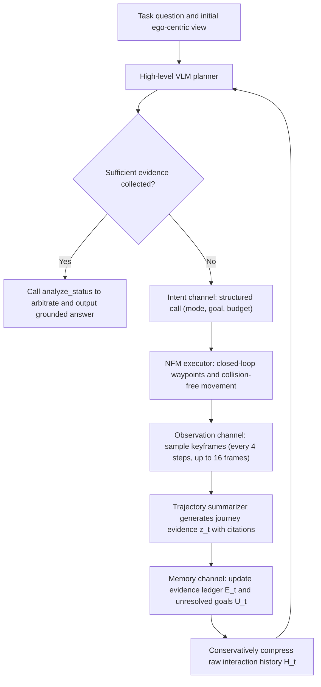

#### ② Module-by-module explanation: NavMCP three-channel core mechanism
{: id="-逐模块讲解navmcp-三通道核心机制"}

##### 1. Intent Channel: From evidence requirements to structured navigation calls
{: id="1-意图通道intent-channel从证据需求到结构化导航调用"}
After inferring the missing information, the high-level agent does not need to write low-level motor instructions or subtle waypoints, but instead issues structured semantic navigation calls through protocol gating:
$$\text{Call} _t = (\text{mode}, \text{sub\_goal}, \text{budget}, \text{constraints})$$
- **dual-mode decoupling**:
  - `navigate_to_object` (object goal navigation mode): Enter the specific object category name or referent object, and the underlying NFM independently performs semantic-driven local exploration and approximation;
  - `navigate_by_instruction` (vision-language navigation mode): Enter high-level natural language instructions containing regions, paths, or topological landmarks (such as "Go through the hallway and enter the bedroom at the end").
- **Budget and boundary constraints**: Use `budget` to control the maximum number of steps at the bottom layer to prevent the underlying model from falling into a local infinite loop; use `constraints` to provide semantic obstacle avoidance suggestions. The underlying actuator only relies on the topological occupancy graph constructed in real time during the body's own RGB observation, pose estimation and exploration process, without the need to predict the scene's true value or privileged geometric information.

<div align="center">
  
<figcaption>
The internal flow logic of NavMCP three-channel scaffolding: the intention channel is responsible for task semantic alignment, the observation channel is responsible for mapping spatio-temporal trajectories into structured perception evidence with confidence and image source labels, and the memory channel is responsible for supporting persistent evidence ledger updates across multiple rounds of interactions.
</figcaption>
</div>

##### 2. Observation Channel: From dynamic trajectories to source-anchored evidence
{: id="2-观测通道observation-channel从动态轨迹到来源锚定证据"}
After the underlying actuator completes a single-modal navigation, it outputs the original trajectory record $r_t = (s_t, b_t, \ell_t, p_t, K_t)$, where $s_t$ is the completion flag, $b_t$ is the stop reason, $\ell_t$ is the total walking path length, $p_t$ is the final pose, and $K_t = \{I_{t,1}, \dots, I_{t,n}\}$ A collection of keyframes along the way.
- **key frame isometric sampling**: In order to take into account visual coverage and context cost, the system samples a self-view frame every $\Delta = 4$ steps, and the upper limit of a single call is truncated to $M = 16$ frames.
- **VLM Trajectory Summarizer**: Input these key frames into the lightweight multi-modal descriptor to extract structured journey evidence:
  $$z_t = (q_t, R_t, O_t, P_t, D_t)$$
Among them, $q_t$ records the status of sub-goal achievement; $R_t$ summarizes the transition between rooms and areas; $O_t$ extracts significant observation objects; $P_t$ records planning topology clues (such as the discovery of unexplored stairwells and ajar doors); $D_t$ records uncertainty and execution anomalies.
- **source anchor tuple (Source Grounding)**: Each object or area mentioned in $O_t$ and $R_t$ is forced to bind a five-tuple label $(n, i, v, h, c)$ (name, associated keyframe index, perspective orientation, relative space hint, confidence). It is strictly prohibited for summarizers to infer unobserved states without basis.

##### 3. Memory Channel: Cross-call evidence ledger and conservative context compression
{: id="3-记忆通道memory-channel跨调用证据账本与保守上下文压缩"}
To resolve context explosion caused by multiple calls, NavMCP maintains explicit ternary EQA context state:
$$C_t = (H_t, E_t, U_t)$$
- **Evidence ledger $E_t$**: Record positive evidence with source index (Positive Evidence, such as "A lighted desk lamp was found on the bedside table of the master bedroom, source frame keyframe_3"), Negative Evidence (Negative Evidence, such as "The panoramic view of the study was checked, and no printer was found"). The ledger is maintained by `write_notebook`, using the FIFO queue limit to retain 100 deduplication records, and directly injects the Prompt header during each round of inference.
- **pending target pool $U_t$**: Maintains unconfirmed or fuzzy inferred targets to be investigated, and guides the distribution of the next intention channel.
- **Conservative context compression strategy**: Only after the key perception information has been refined and externalized to $E_t$ and $U_t$ and marked with keyframe references, the system allows the previous round of lengthy original tool execution logs and intermediate visual diagrams to be replaced with minimalist placeholders. This ensures that even if context truncation occurs during long-term interactions, the core decision-making chain will not be damaged at all.

#### Difficulty Dimensionality Reduction: Journey Analysis Capture and Asymmetric Arbitration Specific Examples
{: id="难点降维journey-analysis-沿途捕获与非对称仲裁具体实例"}

> **Give a specific example**:
> When the robot answered the question "Is the lamp on the bedside table on?", the intent channel emitted `navigate_by_instruction("walk through the corridor into the master bedroom")` and the bottom layer moved 16 consecutive steps.
> 1. **The traditional tool calls**: after walking through the bottom floor, it stops in front of the master bedroom wardrobe, and only the last frame of the wardrobe image is returned. The agent completely missed the bedside table, judged that "the lamp was not found", and had to blindly search again.
> 2. **NavMCP observation channel**: sample 4 key frames according to $\Delta=4$. In the second key frame (the robot is passing by the half-open door of the master bedroom), the bedside table and lampshade are vaguely captured in the door crack on the right side of the screen. The VLM trajectory summarizer extracts the evidence tuple: `("table lamp", frame_2, "door gap on the right", "beside the master-bedroom bed", "uncertain")` and writes it directly to the pending target $U_t$.
> 3. **Asymmetric arbitration mechanism**: The next round of planner calls `analyze_status` to activate special local verification. At this time, the system complies with the **asymmetric evidence rule**:
>    - **confirms (Positive)**: must rely on unambiguous high-definition direct visual evidence (call `zoom_in_object` to zoom in to view the lighting status of the desk lamp);
>    - **Falsification (Negative)**: To draw a negative conclusion that "there is no desk lamp in the room", a panoramic 360-degree scan and an evidence chain covering all blind spots in the room must be provided. It is strictly prohibited to arbitrarily regard "mere lack of sight" as "the object does not exist".

<div align="center">
  
<figcaption>
Explore-EQA mission record (looking for a small black sofa): The agent continuously checked 5 rooms during long-range exploration and accumulated negative evidence to avoid going back; the mid-range target distance curve showed rational and non-monotonic characteristics (first widening the distance to systematically exclude other areas, and then accurately converging to the target corner).
</figcaption>
</div>

#### ③ Assisted sensing toolset and verification protocol
{: id="-辅助感知工具集与验证协议"}
To eliminate ambiguity before final decision-making, NavMCP exposes a library of fine-grained visual perception tools to the agent:
- **Reader Tools**:
  - `look_around`: Call the panoramic four-way camera to obtain 360-degree surround perception and scene feasible topology;
  - `analyze_status`: Three-stage evidence arbiter, inputs the current panoramic, historical keyframes and notepad, and outputs evidence adequacy and missing types;
  - `zoom_in_object`: Crop and enlarge candidate targets to conduct fine-grained attribute (switch status, text, small parts) fine discrimination;
  - `review_image`: Retrieve archived historical keyframes for review.
- **Detector Tools**:
  - `detect_objects_360`, `detect_objects`: Target localization and counting based on open vocabulary detector and SAM;
  - `estimate_depth`: Metric-level depth and reachable distance estimation based on Depth-Anything.

#### Difficult Dimensionality Reduction: Equivalent Agent Steps Compensation Calculation
{: id="难点降维等效探索步数equivalent-agent-steps补偿计算"}

In the embodied navigation evaluation, the traditional Frontier exploration baseline (such as Explore-EQA, FAST-EQA) moves in a teleportation manner, and its single-step decision-making displacement is strictly limited to within 3 meters. A single closed-loop call of NFM may move more than ten meters autonomously. If a long-distance NFM call is directly counted as only 1 step, it will cause serious evaluation unfairness to the traditional baseline; but if all the underlying physical control cycles are counted as high-level steps, it cannot reflect the savings in high-level large model call overhead of NFM closed-loop execution.

To this end, the paper uses 3 meters as the basic conversion unit and designs the **equivalent agent steps (Equivalent Agent Steps)**:
$$n_{\text{eq}} = H + \sum_{k=1}^K \max\left(0, \left\lceil \frac{L_k}{3\text{ m}} \right\rceil - 1\right), \quad \hat{n} _{\text{eq}} = \frac{n_{\text{eq}}}{N}$$
Among them, $H$ is the actual number of high-level VLM calls, $K$ is the total number of NFM calls, $L_k$ is the physical arc length of the $k$th NFM actual motion trajectory, $N = \lfloor \sqrt{A \times 3} \rfloor$ is the scene-based passable area $A$ The theoretical total budget steps.

> **hand calculation example**:
> Assume that the total step budget of a certain scene is $N = 50$ steps. The agent called VLM a total of $H = 3$ times at the high level:
> - The 1st call to NFM moved 2.5 meters: due to $L_1 \le 3\text{m}$, $\lceil 2.5/3 \rceil - 1 = 0$, compensation 0 steps;
> - 2nd call to NFM across long corridor, moved 8.2 meters: $\lceil 8.2/3 \rceil - 1 = 3 - 1 = 2$ step compensation;
> - 3rd call to NFM cross-room search, moved 11.0 meters: $\lceil 11.0/3 \rceil - 1 = 4 - 1 = 3$ step compensation.
>
> The final equivalent total number of steps is $n_{\text{eq}} = 3 + (0 + 2 + 3) = 8$ steps, and the normalized step consumption is:
> $$\hat{n} _{\text{eq}} = \frac{8}{50} = 0.16$$
> This conversion not only rigorously compensates for long-range physical displacement, but also truly reflects that NavMCP reduces the frequency of high-level large model interactions by more than 70% compared to traditional single-step exploration.

---

### 3. Results and findings
{: id="3-核心结果发现-14"}

#### ① The three major EQA benchmarks comprehensively surpassed SOTA
{: id="-三大-eqa-基准全面超越-sota"}
In the three major benchmark tests, NavMCP achieved significant breakthroughs (using Qwen3.6-Plus agent and Qwen-RobotNav-8B actuator):
- **HM-EQA (500 multiple-choice questions and answers)**: NavMCP reaches **76.7%** accuracy, significantly surpassing the previous strongest method FAST-EQA (69.2%) reaching **7.5 percentage points**. At the same time, the number of normalized high-level exploration steps is only **0.15**, which reduces the number of high-level large model calls by 77% compared with FAST-EQA's 0.65, and has both extremely high accuracy and ultimate energy efficiency.
- **MT-HM3D (multi-target, cross-room complex question answering)**: The accuracy reaches **54.4%**, which is 3.9 percentage points ahead of FAST-EQA (50.5%).
- **EXPRESS-Bench (2,044 long-range free-form questions and answers)**: In the free-form question and answer evaluation, the LLM score reached **79.27**, and the path exploration efficiency weighted index $E_{\text{path}}$ reached **33.96**, significantly ahead of Fine-EQA (63.95/25.58) and ToolEQA (65.77/25.82).

#### ② System-wide alignment test under strict control of variables (HM-EQA, fixed Qwen3.5-397B-A17B)
{: id="-严格控制变量下的全系统对齐测试hm-eqa固定-qwen35-397b-a17b"}
In order to eliminate the impact of large model base differences, the paper was retested on the premise of uniformly using Open source Qwen3.5-397B-A17B as the decision-making agent, unified initial state, unified budget and perception tool:
- Explore-EQA：57.6%
- ToolEQA：60.8%
- FAST-EQA：63.5%
- **NavMCP + Qwen-RobotNav-8B**: **74.0%** (10.5 to 16.4 percentage points ahead of benchmark).

#### ③ Double-layer division of labor and complementary ablation (Architecture Ablation)
{: id="-双层分工互补性消融architecture-ablation"}
- **fixes the bottom NFM and changes the high-level agent**:
  - No intelligent agent (blind guess based on initial perspective only): 38.2%
  - Single-round passive Agent (only single panoramic shot): 58.4%
  - Traditional reactive agent (fixed exploration loop): 62.0%
  - Full NavMCP scaffold (Qwen3.5): **74.0%** (Qwen3.6-Plus further reaches 76.7%).
  - *Conclusion*: No matter how powerful the underlying navigation model is, it lacks high-level adaptive hypothesis testing and memory accumulation, and is unable to handle complex embodied inference.
- **fixes the high-level agent and changes the underlying navigation actuator**:
  - NavMCP + Random Walk: 60.9%
  - NavMCP + Frontier Exploration (traditional frontier point detection): 65.3%
  - NavMCP + StreamVLN：69.3%
  - NavMCP + Qwen-RobotNav-4B：73.3%
  - NavMCP + Qwen-RobotNav-8B：**74.0%**
  - *Conclusion*: High-level agents cannot make up for the fragile physical execution of the bottom layer. Stronger language-conditional closed-loop navigators can transform high-level semantic requirements into higher-quality spatiotemporal observations.

#### ④ Protocol channel ablation experiment (Protocol Ablation on HM-EQA)
{: id="-协议通道消融实验protocol-ablation-on-hm-eqa"}
- **directly degrades to the traditional single-round tool interface (Episodic Interface)**: performance plummets **14.9 percentage points** (74.0% $\to$ 59.1%), directly confirming the fatality of round gaps to long-range physical interactions;
- **degrades to Terminal-only Observation return (Terminal-only Observation)**: Performance loss **5.9 percentage points** (down to 68.1%), confirming that key frames and process observations along the way are crucial to evidence collection;
- **Remove the EQA context ledger of the memory channel**: Performance loss **4.6 percentage points** (down to 69.4%);
- **removes VLM Journey Analysis (Journey Analysis)**: performance loss **4.4 percentage points** (down to 69.6%);
- **Sparse keyframe sampling (from 4 steps/16 frames to 8 steps/8 frames)**: Performance loss **2.8 percentage points** (down to 71.2%).

<div align="center">
  
<figcaption>
Yushu Unitree Go2 quadruped robot real environment measurement: Facing ultra-long-range exploration tasks of more than 50 meters across multiple functional areas, NavMCP guides the quadruped robot to decompose high-level goals into progressive sub-goals anchored by landmarks, with a success rate of 78.3%, showing a huge advantage over the reactive baseline.
</figcaption>
</div>

#### ⑤ Real robot deployment: Yushu Unitree Go2 physical verification
{: id="-真实机器人部署宇树-unitree-go2-物理验证"}
In a real office building environment, in the face of unstructured obstacles, ranging drift and sensing noise, real robot tests were conducted on three levels of difficulty: single room (Low), cross-room (Medium) and super-20-meter large-scale multi-area (High) (fixed Qwen3.6-Plus):
- **Single room level (Low, 20 rounds)**: Reactive 80%, Frontier 70%, **NavMCP 90%**;
- **Cross-room level (Medium, 20 rounds)**: Reactive dropped to 35%, Frontier 60%, **NavMCP maintained 85%**;
- **Super 20-meter wide range exploration (High, 20 rounds)**: Reactive completely collapsed to **0%**, Frontier was only **15%**, and **NavMCP still maintains a success rate of up to 60%**!
- **Overall real-robot success rate**: NavMCP reaches **78.3%**, showing an overwhelming advantage compared to Frontier (48.3%) and Reactive (38.3%), proving that the longer the task duration and the more complex the environment, the more obvious the advantages of layered scaffolding.

---

### 4. Limitations
{: id="4-局限性-14"}
1. **High-level model calculation overhead and response delay**: NavMCP relies on large-parameter VLM (such as Qwen3.6-Plus or 397B-level model) for each round of multi-modal journey analysis and evidence arbitration. The inference delay of high-level large models is higher than that of traditional lightweight heuristic algorithms. In the future, it is necessary to explore on-device small models or reinforcement learning distillation solutions;
2. **Object duplication and counting ambiguity under multi-view sampling**: When the same object is photographed multiple times in multiple key frames or different camera angles along the way, VLM still occasionally encounters cross-view duplication errors in dense small object counting tasks;
3. **Dynamic environment and unsteady physical interference**: The current test is mainly carried out in relatively static large indoor scenes. In extremely challenging real-life scenes containing violent dynamic pedestrian flow or sudden changes in lighting, the local deadlock and recovery mechanism of the underlying NFM still has room for further improvement.

---

## 25. OccPlanner (2026)
{: id="occplanner"}
——Put a pixel without depth back into the local 3D occupancy grid and then plan

📄 **Paper**: [arXiv:2608.14160](https://arxiv.org/abs/2608.14160)

---

### Key takeaways
{: id="精华-15"}

1. The pixel target only has direction, no depth and accessibility. OccPlanner's solution is **two-stage conditional injection** - first align the target with the temporal visual context to get the rough direction, and then align it with the local 3D occupancy geometry to a feasible point; ablation shows that there is almost no gain in injecting the occupancy feature alone, and the SR of cluttered-hard after sequential interaction is added from 75.55% Jumps to 84.92%.
2. The explicit local 3D occupancy **is not the** used in the local map, but serves as an intermediate supervision of the geometric prior, allowing the diffusion policy to "know" where the wall is before spitting out the trajectory.
3. The core insight of L3ROcc is to divide voxels into occupied / observed-free / **unknown** tri-state instead of binary - "not seen" and "really empty" must be separated, otherwise the strategy will treat the occlusion area as a path.
4. Therefore, monocular RGB video can be used to generate occupancy supervision in reverse. The data source is broadened from "simulator that must have 3D annotation" to "any navigation video". The real robot only needs 829 samples for fine-tuning to be effective.
5. Open-loop metrics and closed-loop success **do not necessarily improve together**: the base model has the best open-loop IoU/FDE, but substantially lower closed-loop success than the full model. Open-loop proxies alone should not determine model selection.

---

### 1. Background and problem
{: id="1-研究背景问题-15"}

There are several ways to specify navigation targets: metric coordinates (PointGoal), semantic category (ObjectGoal), target photo (ImageGoal) and natural language (VLN). The **pixel target** directly clicks a point in the current camera field of view as the end point, without the need for pre-built maps or metric coordinates - the most friendly to real robot deployment.

But a pixel **contains neither depth nor passability**: the strategy must simultaneously complete two things: "Where is this point in 3D" and "How to avoid obstacles and walk over". Existing pixel target methods (PixNav, SSM-PixNav) directly make conditions in the image space, Goal2Pixel predicts navigable pixels and back-projects them into waypoints; the other side of the learning local planner (iPlanner, ViPlanner, NavDP, LoGoPlanner) generates trajectories based on the measurement target. **two lines are disconnected** - continuous pixel target planning is never combined with explicit local 3D occupancy inference.

---

### 2. Method and innovations
{: id="2-主要方法创新点-15"}

<div align="center">
  
<figcaption>
OccPlanner and L3ROcc Overview. (a) L3ROcc converts monocular RGB navigation video into visibility-aware local occupancy and trajectory supervision; (b) OccPlanner conditions continuous pixel target trajectory generation on RGB-D context and local 3D occupancy
</figcaption>
</div>

#### ① Stuck point dimensionality reduction: What is the difficulty of pixel target?
{: id="-卡点降维像素目标到底难在哪"}

First put the four target forms together, and you can see clearly what PixelGoal's "cheapness" is in exchange for:

| Goal form | What is given | What is missing | Price |
|---|---|---|---|
| PointGoal (metric coordinates) | Precise 3D position | — | Requires pre-built map or global localization |
| ObjectGoal ("find a couch") | Semantic categories | Concrete instances and locations | Requires Semantic Map + Explore |
| ImageGoal (a target photo) | Target appearance | Where the target is and how far it is | Cross-view matching, easy to fail in the long run |
| **PixelGoal (pixel coordinates)** | **The direction of the target in the current field of view** | **Depth, traversability** | **does not use a map, but you have to push the pixels back yourself 3D** |

The last line is the bill that this paper has to pay: if you omit the map, you have to make up for the two things "depth + accessibility" from inside the model. OccPlanner's answer is to use a local 3D occupancy branch **learned by** to make up for it.

#### ② Overall framework
{: id="-整体框架"}

The system consists of two halves: **L3ROcc** is an offline data generation pipeline, responsible for turning monocular RGB navigation video into local occupancy supervision; **OccPlanner** is an online strategy, consisting of three modules - shared RGB-D The geometry encoder is responsible for extracting spatio-temporal context, the occupancy branch is responsible for explicitly predicting local 3D occupancy and compressing it into a compact token, the target-aware trajectory branch is responsible for aligning pixel targets with context and occupancy geometry in sequence, and finally leaves it to diffusion denoising to generate continuous trajectories.

#### ③ L3ROcc: Reversely generate occupancy supervision from monocular video
{: id="-l3rocc从单目视频反向生成占用监督"}

<div align="center">
  
<figcaption>
L3ROcc Data generation pipeline: π³ reconstructs the shared scene geometry and camera motion. After metric alignment and robot center transformation, visibility-aware local occupancy annotation
</figcaption>
</div>

**input**: a monocular RGB navigation video.

**is divided into four steps to process**:

1. **RGB Geometric reconstruction** - uniformly sample K frames and send them to π³ to obtain shared coordinate system 3D points, local pointmap, sparse camera pose and confidence map. Filter out low-confidence points, use local pointmaps to remove depth edge artifacts, and then voxel downsample to obtain a compact shared scene point cloud. The sparse pose uses cubic spline interpolation translation and SLERP interpolation rotation to complete each video timestamp.
2. **metric is aligned with the center of the robot** - Monocular reconstruction has natural scale uncertainty. When there is a reference pose, the reconstructed trajectory is aligned with the reference trajectory to restore the scene-level scale; when there is no reference pose, the π³ variant with metric capabilities is directly used. Transform the scaled shared geometry to the current local coordinate system at each moment, and then use the extrinsic parameters from the camera to the chassis to align the robot's orientation to obtain the robot's center geometry and aligned sight rays.
3. **Visibility-aware occupancy generation** - voxelize the robot center geometry into a candidate occupancy grid, and then do ray marching along the ray (borrowed from Occ3D).
4. **Output**: sparse visible occupancy + packed visibility mask + aligned trajectory metadata.

**stuck point dimensionality reduction - why three-state annotation is key**:

> **, for example,**: Arrange the voxels on a ray in a row, numbered 1→6, and the robot looks forward at 0, assuming that the third voxel is occupied by the table. The result of ray marching is:
>
> - Voxel 1, 2 → **observed free** (the ray did pass through and is empty)
> - Voxel 3 → **visible occupied** (the first hit point, this is the real obstacle)
> - Voxels 4, 5, 6 → **unknown** (obstructed by the table, not seen at all)
>
> The key is in the third line. The naive approach would be to mark 4~6 as free space - because there are no points there in the point cloud - and after learning the strategy, you will think that you can walk behind the table. The three-state annotation separates "not seen" from "really empty" so that the model will not treat the occlusion area as a path. If the ray misses all the way, all voxels along the entire path are marked as observed free.

**Design motivation**: Occupancy supervision has traditionally relied on simulators with 3D ground truth. L3ROcc lowers the threshold to "an RGB video + camera extrinsic parameters", which is the premise that the real robot can fine-tune with only 829 samples.

#### ④ OccPlanner main structure
{: id="-occplanner-主架构"}

<div align="center">
  
<figcaption>
OccPlanner architecture. The shared RGB-D geometry encoder extracts spatiotemporal context; the occupancy branch predicts local 3D occupancy and compresses near-ground geometry into occupancy tokens; the trajectory branch sequentially fuses target-context and target-occupancy information to form a target sensing state for diffusion to generate continuous trajectories
</figcaption>
</div>

**module 1 · Shared RGB-D geometry encoder**

- **Input**: RGB-D observation history, 8 frames in total 224×224.
- **processes**: RGB stream uses π³'s own DINOv2 encoder, and depth stream follows LoGoPlanner's approach, only taking the ViT-S backbone (lightweight) of DepthAnythingV2. The two patches are aligned, spliced, and linearly projected into a fused RGB-D token, which is then stacked alternately through π³'s "intra-perspective self-attention/global self-attention" to generate latent features for each frame, which are decoded into spatio-temporal geometric features.
- **output**: spatio-temporal geometric features are used by both the occupancy branch and the trajectory branch - **The two branches share the same set of geometric bases**, which is the source of parameter efficiency.
- The geometric features of each frame are compressed into a scene token, and the latent features of the latest frame are additionally compressed into the current observation token, which together form the temporal local context $$U_{ctx}$$.

**module 2 · Occupies branch**

- **input**: the geometric features of the latest frame.
- **processing**: According to the routine of mainstream 3D occupancy methods, 2D-to-3D lifting is first performed, and then passed through a 3D convolution decoder to obtain voxel logits and dense occupancy feature volumes. Since **obstacle avoidance mainly depends on the near-ground geometry**, the near-ground slices are cut out from the occupancy feature volume and projected into feature maps, flattened into the ground plane memory $$M_{gnd}$$, and then the learnable occupancy query is used for cross-attention to extract compact occupancy tokens:

$$Z_{occ} = \mathrm{CrossAttn}(Q_{occ};\, M_{gnd})$$

- **output**: occupancy token (for trajectory branch conditionalization) + voxel logits (subject to L3ROcc's visibility-aware supervision).
- **Design Motivation**: Do not feed the entire occupied volume directly to the planner - that is expensive and dilutes the signal; only the near-ground geometry that is really needed for obstacle avoidance is left.

**module 3 · Target sensing trajectory branch**

- **target encoding**: Different from the masked pixel target representation of NavDP, here the normalized pixel coordinates are projected into the target token using multi-frequency Fourier feature encoding, and then added to the learnable goal query.
- **Two-stage target conditionalization** (core of this article):

$$\tilde z_e = \mathrm{CrossAttn}(q_g;\, U_{ctx}), \qquad z_e = \mathrm{CrossAttn}(\tilde z_e;\, Z_{occ})$$

- **Target sensing state decoding**: Send the target token, scene token sequence, and ego-goal representation together to the state decoder to obtain the target sensing status token.

**stuck point dimensionality reduction - why not score in two steps?**

If the target, context, and occupancy are put together and fed to Transformer at once, the amount of information is intuitively the same. But the ablation description is not:

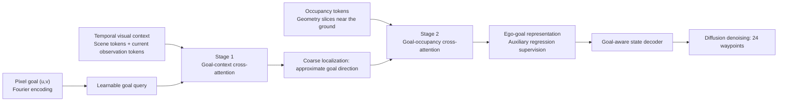

The meaning of the sequence is: **Stage 1 first determines "where is the target", and then Stage 2 asks "Which way can I take?"**. Conversely or in parallel, the occupancy features do not know which area to focus on, so they degenerate into a pile of undifferentiated geometric information. In the table, `w/o Occ. Feature` (single stage, only ego-goal) is 81.57% on cluttered-hard, while `w/o Two-Stage` (single stage, ego-goal and occupancy) instead drops to 75.55% - **occupancy feature is a negative return** in the absence of sequential interaction. After adding two sections, it returned to 84.92%.

#### ⑤ Training objectives
{: id="-训练目标"}

Three joint optimizations:

$$L = \lambda_{occ} L_{occ} + \lambda_{traj} L_{traj} + \lambda_{ego} L_{ego}$$

- $$L_{occ}$$: Focal loss between voxel logits and L3ROcc annotations, providing explicit geometric supervision.
- $$L_{traj}$$: Denoising loss under DDPM/Diffusion Policy framework. Given the true value action sequence $$A_0$$, the noisy sequence at step $\ell$ is

$$A_\ell = \sqrt{\bar\alpha_\ell}\, A_0 + \sqrt{1 - \bar\alpha_\ell}\,\epsilon, \qquad \epsilon \sim \mathcal N(0, I)$$

The conditional context is composed of diffusion time step token, target sensing state, temporal context, ego-goal representation, and occupancy token. The denoising network predicts the injected noise and is aligned with SmoothL1.
- $$L_{ego}$$: **assists ego-goal regression** - predicts the position of the target in the robot coordinate system from the ego-goal representation, only used during training. This item is where the "pixel push back to 3D" is explicitly taught to the model. In ablation, it is the component with the largest gain under single-stage conditions (cluttered-easy/hard +20.23 and +15.30 percentage points respectively).

#### ⑥ inference process
{: id="-推理流程"}

8 frames of RGB-D + a pixel target are entered, the geometry encoder and the occupation branch are run once each. After the trajectory branch constructs the conditional context, **10 steps of** reverse denoising are performed, and a continuous trajectory composed of **24 future waypoints** is output. During closed-loop execution, the target in the world coordinate system is fixed and is re-projected back to the current camera field of view as a new pixel target at each step.

---

### 3. Results and findings
{: id="3-核心结果发现-15"}

**Evaluation setup**: training uses InternData-N1 (200,000+ trajectories, differential-drive base, overhead RGB-D, randomized robot height and camera pitch). Evaluation covers **60 unseen InternScenes scenes** (20 home, 20 commercial, 10 cluttered-easy, and 10 cluttered-hard). Each scene supplies 50 start–goal pairs at 3–5 m and 50 at 5–8 m, totaling **6000 closed-loop episodes**. Success requires stopping within 0.5 m of the goal. Baselines are NavDP, adapted to the same pixel-goal interface, and PixNav.

**closed loop success rate (SR %)**

| Method | Distance | Home | Commercial | Cluttered-Easy | Cluttered-Hard |
|---|---|---|---|---|---|
| NavDP | 3–5 m | 35.79 | 29.58 | 32.61 | 33.72 |
| PixNav | 3–5 m | 21.23 | 21.91 | 24.89 | 21.31 |
| **OccPlanner** | 3–5 m | **71.29** | **47.47** | **92.97** | **92.82** |
| NavDP | 5–8 m | 24.98 | 19.07 | 19.43 | 19.77 |
| PixNav | 5–8 m | 19.63 | 11.90 | 14.20 | 14.44 |
| **OccPlanner** | 5–8 m | **69.90** | **45.17** | **86.20** | **84.92** |

A few points worth noting:

- The average SR of the four types of scenes of **5–8 m increases from 20.81% of NavDP to 71.55% of**, and the gain is the largest in the cluttered scene (19.43→86.20, 19.77→84.92), indicating that explicit local occupancy has the most obvious benefit under complex geometry.
- **Almost no points drop in long range**: OccPlanner only dropped 1~8 percentage points from 3–5 m to 5–8 m, while PixNav dropped significantly - the paper checked the failure cases, and PixNav's successful episodes were almost all approximately straight paths, and those that required significant detours basically failed, which also explains its SR and SPL coincide at the reported precision.
- **Commercial is the shortcoming of** (45.17%), which is significantly lower than the other three categories.

<div align="center">
  
<figcaption>
Qualitative planning results of under four types of unseen simulation scenarios. Above each example are RGB observations with pixel targets (red dots), below are predicted local occupancy and generated trajectories (red lines)
</figcaption>
</div>

**ablation (5–8 m, cluttered scenario; open loop with 1496 InternData-N1 set aside samples)**

| Variant | Two-stage | Ego-Goal | Occupancy characteristics | C-Easy SR | C-Hard SR | IoU | FDE |
|---|:---:|:---:|:---:|---|---|---|---|
| Base model | — | — | — | 66.60 | 72.42 | **50.79** | **0.18** |
| w/o Two-Stage | — | ✓ | ✓ | 84.34 | 75.55 | 43.61 | 0.28 |
| w/o Ego-Goal | — | — | ✓ | 64.11 | 60.25 | 45.60 | 0.24 |
| w/o Occ. Feature | — | ✓ | — | 79.88 | 81.57 | 38.03 | 0.23 |
| **Full model** | ✓ | ✓ | ✓ | **86.20** | **84.92** | 46.01 | 0.19 |

- **Ego-Goal is the component** with the largest gain in a single stage (+20.23 / +15.30 percentage points).
- **two-stage interaction pushed cluttered-hard from 75.55% to 84.92%, and DTG dropped from 0.87 m to 0.56 m**.
- **Open-loop indicators can deceive**: Base model’s IoU (50.79) and FDE (0.18) are the best in the game, but closed-loop SR lags behind the complete model by nearly 20 percentage points. Open-loop proxies cannot represent closed-loop navigation capabilities.

**real robot (Unitree Go2, open loop)**

<div align="center">
  
<figcaption>
Real robot open-loop comparison on Unitree Go2. The upper row is the zero-shot prediction of the simulation training model, and the lower row is the prediction after fine-tuning of the real robot. Fine-tuning makes local occupancy predictions denser and more spatially coherent while keeping trajectories smooth
</figcaption>
</div>

Record an RGB-D sequence in an office filled with boxes, chairs, cabinets and narrow aisles. The zero-shot simulation training model has been able to capture rough obstacle geometries and generate trajectories toward targets; L3ROcc was used to process additional recorded robot videos to obtain **829 real samples**. After fine-tuning, the occupancy prediction was significantly denser and more coherent at the boundaries between furniture and passages.

**implementation details**: 4×H100 training 30 epoch, Adam, single card batch 8 (global 32), bfloat16 mixed precision, gradient clipping 1.0; learning rate linearly decays from $1\times10^{-4}$ to $5\times10^{-5}$ in the first 10000 steps After fixation, approximately 48 hours.

---

### 4. Limitations
{: id="4-局限性-15"}

The real robot evaluation **only made an open-loop qualitative comparison with**. There was no closed-loop physical deployment, and it was limited to static indoor scenes - dynamic obstacle inference was not involved at all. In addition, the SR of the commercial scene (45.17%) clearly lags behind the cluttered scene, indicating that in an environment with large space and weak geometric constraints, the signal provided by near-ground occupation is not enough to support long-range target localization.

---

## 26. EgoPathBench (2026)
{: id="egopathbench"}
——Conpress "navigation decision" into a series of numbers on the egocentric image, and leave it to the scene geometry to decide whether it is right or wrong.

📄 **Paper**: [arXiv:2609.16610](https://arxiv.org/abs/2609.16610)

---

### Key takeaways
{: id="精华-16"}

Turn the virtual concept of "integrated spatial intelligence" into a decidable action: on the current egocentric image, pick an orderly route from the numbered visible waypoints. Right or wrong is determined directly by the scene geometry, without running a complete navigation system. The key design is "same picture, same number, two sets of feasibility diagrams" - the point agent and the agent with a 0.6 m body share the observation and action vocabulary, and only the passability diagram is exchanged, thereby isolating the variable "embodied constraints" for measurement. The evaluation does not compare whether it imitates the expert trajectory, but looks at the geometric consequences of the selected action (whether the candidate is feasible, whether each adjacent edge is legal, whether the end point falls into the target domain). The reference route is only used to prove that "there is a solution", not the only answer. Unpacking the five diagnostic evaluation protocols reveals that the real bottleneck is neither the output format nor the first step, but the middle edge - the first step legality rate is 88–96%, and the entire route legality rate drops to 5–7% on embodied tasks. The same set of geometric annotations successfully produced 31,852 training data with Spatial CoT. After fine-tuning Qwen3.5-4B, the benchmark went from 3.9 to 38.9, and all three external spatial benchmarks also increased.

---

### 1. Background and problem
{: id="1-研究背景问题-16"}

Existing spatial-intelligence benchmarks (SpatialVLM, VSI-Bench, 3DSRBench, EmbSpatial-Bench, and others) test isolated judgments such as left–right relations, distance, and orientation. Navigation requires goal recognition, assessment of action consequences, distance estimation, and path planning to work **simultaneously**. Adding isolated abilities does not establish integrated competence. Conversely, mapping, localization, memory, control, and replanning confound full-system success, obscuring the foundation VLM’s own spatial decision-making ability.

EgoPathBench is stuck in the middle: given a first-person RGB, a natural language target, and a set of numbered waypoints drawn on the map, ask VLM if it can directly output a geometrically feasible and goal-consistent route.

<div align="center">
  
<figcaption>
The same first-person scene: "Is there a sofa in the room?" "Is the coffee table in front of the sofa?" These types of recognition and local relationship questions were answered correctly, but when asked to plan a route to the coffee table, the output [1,7,23] violated the route and target conditions (red line on the right). This is exactly the ability gap
</figcaption>
</div>

---

### 2. Method and innovations
{: id="2-主要方法创新点-16"}

<div align="center">
  
<figcaption>
EgoPathBench builds the pipeline: selects scenes and first-person perspectives, selects targets, generates visible waypoints, and then constructs two sets of navigation maps, target domains and geometrically verified reference routes, respectively, for mass points and embodiments; these solidified scene annotations are then used to generate graphic and text problems and Spatial CoT, producing 2 trafficability tasks + 3 route planning tasks
</figcaption>
</div>

#### ① Overview of the overall framework
{: id="-整体框架概述-7"}

EgoPathBench consists of three things: a **unified action interface** (image + numbered waypoint + language target → a JSON number array), a set of **offline solidified scene annotations** (visible waypoint, two sets of feasibility diagrams, target domain, reference route), and a geometric determiner **that** executes in sequence. The model can only see the RGB image and prompt words throughout the process, but the judgment occurs in the 3D scene registered with this image - this is the so-called "actions have clear consequences."

#### ② Explain module by module
{: id="-逐模块讲解-6"}

**Module 1: Task interface and action vocabulary**

- **input**: a first-person RGB image with numbered dots superimposed on it; a natural language task.
- **processing**: model should match the display ID with the scene location to determine which ones can be walked and how to string them together into a road.
- **output**: a JSON array. Two accessibility tasks output an **unordered set**, and the three route tasks output the **ordered sequence** starting from the specified starting point.
- **Design motivation**: Five tasks share a set of input and output protocols. The differences only come from target specifications, agent geometry, and scoring constraints, so cross-tasks and cross-models can be directly compared.

Division of labor among five tasks:

| Task | Target specification | Agent | Output | Scoring constraints | Number of benchmark questions |
|---|---|---|---|---|---|
| Point Traversability | None | Point mass | ID set | Candidate-by-candidate traversability classification | 146 |
| Embodied Traversability | None | 0.6 m airframe | ID set | Feasible classification by candidate airframe | 146 |
| Point Path | Explicit object name | Mass point | Ordered route | Legal ID, specified starting point, legal edge, acceptable end point | 309 |
| Embodied Path | Explicit object name | 0.6 m fuselage | Ordered route | All of the above + Edge legality under fuselage width | 309 |
| Intent Path | Intent + visual cues | 0.6 m body | Orderly route | End point after intention disambiguation + embodied route legitimacy | 201 |

**Module 2: Scene, perspective and target screening**

- **Input**: InternScenes normalized simulatable indoor assets (original scans from 3RScan, ScanNet, ARKitScenes, Matterport3D).
- **processing**: Sampling the first-person camera in the passable space, eliminating the blocked angle of view immediately adjacent to the lens; then using the four filters of frustum projection, observation distance, projection size, and visible surface evidence to filter target instances to remove targets that are out of frame, are too small, and are heavily occluded.
- **outputs**: a "scene-perspective" record, binding camera parameters, scene geometry, retained targets and RGB observations.
- **Design motivation**: All subsequent waypoints and route annotations are hung on this record to ensure that what is seen in the image and calculated in the geometry are the same thing.

**Module 3: waypoint and geometry tag**

- **input**: preserved perspective.
- **processes**: throws two types of markers into the image - ground action candidates, and selected object/structure surface positions (as **inaccessible negative sample**). Use triple checks of depth, ray visibility, and mark spacing to ensure that each display ID corresponds to an independent scene position and does not overlap each other or be blocked by the foreground.
- **outputs**: each candidate has ID, image projection coordinates, and scene three-dimensional coordinates.
- **design motivation**: The existence of negative samples makes the lazy strategy of "selecting all numbers" invalid - the accessibility task mixes feasible ground points, width-sensitive ground points, and visible surface negative samples.

**Module 4: Paired route construction (the core control variable design of this article)**

- **input**: one scene – perspective record + one target.
- **processes**: the starting point is anchored on the visible ground near the bottom of the image; a feasible end point area is generated around the target footprint; then **A\*** searches the point-agent and embodied-agent free spaces separately, sparsifies the continuous path into waypoints, and then projects it back to the current image.
- **outputs**: a pair of reference routes that share the target, starting point, perspective, and candidate space, but pass the geometric verification of their respective agents.
- **design motivation**: The only difference between Point Path and Embodied Path **is the agent geometry variable**. The difference between model and the two is pure "embodied constraint understanding ability".

**stuck point dimensionality reduction · What is the difference between the two sets of feasibility diagrams**

The same picture, the same set of numbers, and the same goal, why are the labels different?

| Dimensions | Point Agent (particle) | Embodied Agent (0.6 m diameter body) |
|---|---|---|
| Observation and numbering | One RGB, one set of display ID | Identical, no changes in pictures or numbers |
| Node feasibility | As long as it falls in a geometrically connected free space | It is also required that there is enough clearance around the point to accommodate the fuselage |
| Edge legality | Direct geometric connection between two points is sufficient | Use a nominal radius of 0.30 m to check the swept corridor, and the entire corridor cannot be collided |
| Typical consequences | Narrow gaps between furniture and half-open doors are considered passable | The same batch of points is judged to be infeasible, and the route must be further detoured |
| List gap | Point Path has the highest SR 35.9% | Embodied Path has the highest SR 2.9% |

In a sentence: **looks like the same visually reasonable action, but the consequences are completely different under the two agent models** - this is what the paper repeatedly emphasizes "the same visual choice, but the geometric consequences are different."

**Module 5: Question text and Spatial CoT**

- **input**: fixed target identity, visible waypoint, target domain, reference route.
- **handles**: the explicit target task directly names the object; the Intent Path first constructs a candidate universe from the objects visible in the current perspective, uses relationships, attributes, colors, and distance clues to generate descriptions, and then **goes back to verify that the** description can uniquely lock the fixed target in the current perspective, otherwise it is discarded. The training set is additionally converted into Spatial CoT reasoning text by GPT-5.5, which converts "target + candidate + feasibility label + legal edge + reference route" into Spatial CoT reasoning text, and then reconciles it with the formal annotation before exporting.
- **design motivation**: Language generation **is always downstream of the geometric truth value**, and changing the wording will not change the target and route geometry. Intent Path is derived from the accepted Embodied Path instance, only changing the language specification.

#### ③ end-to-end data flow
{: id="-端到端数据流-1"}

The most counter-intuitive thing about the entire assembly line is the order: **geometry is solidified first, and language** grows last.

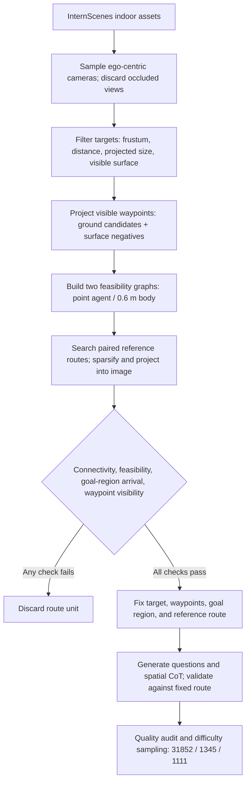

#### ④ Evaluation indicators (the “loss function” of this paper)
{: id="-评测指标这篇论文的损失函数"}

There is no training loss, but there is a strict set of scoring definitions. Traversability uses **to balance accuracy** and **F1**:

$$
\mathrm{BA} = \frac{\mathrm{TPR} + \mathrm{TNR}}{2}, \qquad
F_1 = \frac{2PR}{P + R}
$$

The route tasks use three progressively tightening evaluation protocols. Note that $V_i$ means that the i prediction can be parsed, the ID is legal, the starting point is correct, and each adjacent edge is legal; $S_i$ requires that the end point is acceptable on top of this:

$$
\mathrm{VPR} = \frac{1}{N}\sum_i V_i, \qquad
\mathrm{SR} = \frac{1}{N}\sum_i S_i, \qquad
\mathrm{SPL} = \frac{1}{N}\sum_i S_i \cdot \frac{\ell_i}{\max(\ell_i,\, p_i)}
$$

Among them, $\ell_i$ is the shortest legal reference length to the acceptable target, and $p_i$ is the predicted route length - the failed route SPL is directly recorded as 0. The total score is an equally weighted macro average of the five tasks:

$$
\mathrm{EgoPathScore} = \frac{100}{5}\Big[ (2\mathrm{BA}_{PT} - 1) + (2\mathrm{BA}_{ET} - 1) + \mathrm{SR}_{PP} + \mathrm{SR}_{EP} + \mathrm{SR}_{IP} \Big]
$$

**stuck point dimensionality reduction · Why should BA be written as 2BA − 1**

> **Take** as an example: Suppose a model makes a complete guess about "whether this point can be moved", and hits half of the feasible and infeasible categories, then BA = 0.5.
> If BA is directly averaged into the total score, this guessing about the model will get 50 points in vain; while the success rate of the real model on the three route tasks is generally only 0-5%, and the two "send points" will bias the total score, and the list will become a comparison of whose accessibility classification is more accurate.
> After changing to 2BA − 1: Blind guess → 2×0.5 − 1 = 0, all correct → 2×1.0 − 1 = 1. This is called chance-adjusted, which brings the random baseline back to zero and unifies the dimensions of the success rate (a blind guess is almost certainly 0, and all correct ones are 1).
> Returning to the top of the list, Gemini 3.1 Pro calculated by hand: (2×0.765 − 1) + (2×0.727 − 1) + 0.359 + 0.029 + 0.040 = 1.412, and then ÷5 ×100 = 28.2, which is 28.3 in the table.

#### ⑤ Judgment process (how the evaluator deducts points step by step)
{: id="-判定流程评测器怎么一步步扣分"}

**stuck point dimensionality reduction · Which link of VPR, SR and SPL is stuck**

These metrics represent **three successive depths in the same decision chain**, rather than independent scores. The evaluator checks them in order; failure at any stage ends evaluation, and subsequent checks are skipped:

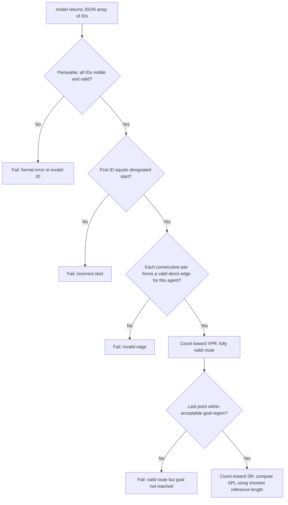

So the difference between **VPR minus SR = the route is legal but in the wrong place**, and **1 minus VPR = the route itself is illegal**. All diagnostic analyzes later in the paper are based on this decomposition.

By the way, the prompt word protocol: the user prompts for all tasks will clearly state "the picture is a numbered candidate point", "start from display ID 1" and "the fuselage diameter is 0.6 m", and require only one JSON array to be returned. Each evaluation uses 8,192 tokens to complete the budget, temperature 0, and top-p 1.

---

### 3. Results and findings
{: id="3-核心结果发现-16"}

**(1) List of nine basic VLMs: the highest score is only 28.3**

| model | EgoPath Score | Point Trav. BA/F1 | Embodied Trav. BA/F1 | Point Path VPR/SR/SPL | Embodied Path VPR/SR/SPL | Intent Path VPR/SR/SPL |
|---|---|---|---|---|---|---|
| Gemini 3.1 Pro | **28.3** | 76.5 / 79.0 | 72.7 / 56.2 | 63.7 / **35.9** / 28.7 | 9.1 / **2.9** / 2.4 | 10.4 / **4.0** / 3.3 |
| GPT-5.5 | 27.3 | 74.1 / 77.1 | **77.3** / **62.5** | 60.5 / 31.1 / 24.8 | 5.5 / 1.3 / 1.3 | 9.0 / 1.5 / 1.4 |
| Claude Opus 4.8 | 25.6 | **77.9** / 74.3 | 73.5 / 59.6 | **66.0** / 21.0 / 16.7 | **12.0** / 1.6 / 1.5 | **14.4** / 2.5 / 2.2 |
| MiniMax M3 | 21.8 | 77.0 / 76.2 | 68.7 / 52.8 | 50.8 / 13.3 / 8.7 | 5.5 / 1.9 / 1.7 | 9.0 / 2.5 / 2.3 |
| Qwen 3.6 | 16.4 | 67.4 / 72.1 | 64.8 / 49.1 | 49.2 / 15.2 / 10.9 | 2.6 / 1.0 / 0.9 | 5.0 / 1.5 / 1.3 |
| Mistral L3 | 15.8 | 65.2 / 70.8 | 68.5 / 52.5 | 35.6 / 11.0 / 5.8 | 0.3 / 0.0 / 0.0 | 3.5 / 0.5 / 0.5 |
| Llama 4 | 14.9 | 66.8 / 66.5 | 66.0 / 49.8 | 36.2 / 8.7 / 5.9 | 1.9 / 0.0 / 0.0 | 2.0 / 0.0 / 0.0 |
| Kimi K2.6 | 9.7 | 60.2 / 69.8 | 57.8 / 44.2 | 40.5 / 11.7 / 8.2 | 1.3 / 0.7 / 0.5 | 1.5 / 0.5 / 0.4 |
| Grok 4.3 | 1.4 | 52.3 / 58.4 | 50.0 / 35.8 | 18.4 / 2.6 / 1.2 | 5.2 / 0.0 / 0.0 | 3.5 / 0.0 / 0.0 |

Two reading methods: **point-by-point judgment is much stronger than the overall map** - the accessibility BA is 60-78%, but the Point Path SR is only 35.9% at the highest; **embodied constraints are cliffs** - the same model goes from Point Path to Embodied Path, SR from 35.9% dropped to 2.9%, a direct drop of an order of magnitude.

**(2) At which step did the failure occur?**

<div align="center">
  
<figcaption>
Route diagnosis (%) summarized by nine VLMs: the output evaluability rate is 96%. The above shows that the format is not a bottleneck; the first-side legality rate is 88–96%, which shows that "the first step" is not a bottleneck; but the legality rate of the entire route drops to 4.8% / 6.5% in the specific task, and the joint success rate is only 1.0% / 1.4%
</figcaption>
</div>

It’s very clear when you take it apart:

- **Output protocol is not a bottleneck**: 96.3–96.8% of outputs are evaluable routes.
- **The first step is not a bottleneck**: 96.0% / 90.4% / 88.0% of the predicted first edges are legal.
- **Endpoint localization is very weak**: The endpoint rates with consistent goals are only 28.9% (Point), 4.8% (Embodied), and 5.2% (Intent). The model may recognize where the target object is, but cannot find a terminal waypoint that is adjacent to it and feasible for the agent.
- **The real focus is the middle edge**: The legal rate of the entire route dropped to 46.8% / 4.8% / 6.5%. In the prediction of "the first edge is legal", 51.3% / 94.7% / 92.7% have violations on one of the later edges.

A more ruthless set of control experiments: Even if **and** limit the first side to be legal **and the end point of** to be correct, there will still be 42.2% (Point), 75.8% (Embodied), and 69.4% (Intent) of routes that hang up in the middle. Cut the questions in half to the half with more sparse waypoints, and the ratio is almost unchanged (42.8% / 76.6% / 67.3%), which shows that it is not "the dots on the picture are too dense to be dazzling". Moreover, the violation rate for the embodiment/intention question with only one edge is already 90.6% / 88.4%, and it only rises to 94.0% / 92.4% for three or more edges - **The problem is not long-term accumulation, but the basic understanding of agent geometry**.

**(3) Human reference**

<div align="center">
  
<figcaption>
Five-task radar chart compared with the same question: Human (thick green line) EgoPath Score 54.2, the strongest VLM is only 28.6 in this batch of questions, and the advantage covers all five axes rather than focusing on one item
</figcaption>
</div>

In the comparison of 50 randomly selected questions (10 questions per task) with the same interface, the human EgoPath Score was 54.2 versus 28.6 for the strongest VLM; the average effective path rate of the three route tasks was 70.0% versus 26.7%, and the average success rate was 46.7% versus 13.3%. The paper clearly states that this is the exploratory same-interface reference of **, not the human ceiling estimate**.

**(4) Is the benchmark itself trustworthy?**

- **relies on paired visual input**: Remove the image or replace it with an unmatched waypoint overlay, and the route SR completely collapses to close to 0 (GPT-5.5's Point Path SR drops from 30.0% to 0.0% / 10.0%), indicating that the model is indeed looking at the picture instead of just relying on prompt words to guess.
- **Illegal edges have real geometric consequences**: Extract one edge from each of the 5,563 predictions containing illegal edges, check the depth and object index rendering along the 0.30 m sweep corridor at 0.05 m sampling, and 88.7% can find clearly registered obstacle evidence.
- **conclusion is not sensitive to discretization**: Change the fuselage radius (0.25 / 0.35 m), occupation grid (0.04 / 0.06 m), and target ring (0.05 / 0.15 m), and the Spearman ρ of the nine model rankings are all equal to 1.0. Replace the SR in the total score with SPL, or first average the tasks within the task family and then equalize the weights, and the ranking remains unchanged.

**(5) Training resources are really useful**

Fine-tuning Qwen3.5-4B on a training set of 31,852 examples with spatial CoT with LoRA (rank 8, alpha 16, frozen vision tower, two stages 1e-4 to 5e-5):

| Settings | Score | Point Trav. BA/F1 | Emb. Trav. BA/F1 | Point Path VPR/SR/SPL | Emb. Path VPR/SR/SPL | Intent Path VPR/SR/SPL |
|---|---|---|---|---|---|---|
| Qwen3.5-4B base | 3.9 | 54.6 / 55.6 | 54.9 / 33.1 | 9.1 / 0.7 / 0.1 | 0.3 / 0.0 / 0.0 | 0.0 / 0.0 / 0.0 |
| + EgoPathBench SFT | **38.9** | 89.3 / 89.2 | 83.4 / 71.2 | 77.0 / 31.4 / 28.6 | 34.9 / 7.1 / 6.9 | 44.8 / 10.4 / 10.0 |

A 4B model scored 38.9 points after fine-tuning. **surpassed the Gemini 3.1 Pro (28.3)** at the top of the list, and the Embodied Path SR 7.1% was the highest in the entire table. Even more noteworthy is that the external migrations are all positive:

| External benchmark | Settings | Base | SFT | Δ |
|---|---|---|---|---|
| VSI-Bench Route Planning | Full | 29.38 | 33.51 | **+4.13** |
| VSI-Bench Route Planning | Debiased | 20.18 | 24.56 | **+4.38** |
| SpatialEval-VTQA | Full | 61.8 | 71.4 | **+9.6** |
| 3DSRBench | Full | 58.0 | 59.4 | **+1.4** |

It shows that what you learned is not "the output format of this list", but the transferable spatial decision-making ability.

---

### 4. Limitations
{: id="4-局限性-16"}

The human reference only has 50 questions and a single volunteer. The paper itself defines it as an exploratory comparison rather than the upper limit of population-level capabilities. The scenes are all from InternScenes normalized reconstruction assets and rendered by Blender. There is still a distribution gap between real camera noise, dynamic obstacles, and lighting changes. In addition, the task form is a one-time decision **on a single static first-person picture**, which does not involve exploration, memory and re-planning, so a high score is not directly equivalent to closed-loop navigation ability; there are 11.3% of illegal edges in the scene consequence audit that cannot provide clear evidence of obstacles under auxiliary rendering (the paper believes that this is insufficient evidence rather than labeling errors).

---

## 27. VLingNav (2026)
{: id="vlingnav"}
——Embodied Navigation with Adaptive Reasoning and Visual-Assisted Linguistic Memory

📄 **Paper**: [arXiv:2601.08665](https://arxiv.org/abs/2601.08665)
<div align="center">
  
<figcaption>
VLingNav overall architecture overview, showing AdaCoTinference and VLingMem memory modules.
</figcaption>
</div>

**Key takeaways**

This paper proposes the VLingNav framework, which empowers embodied agents with cognitive capabilities through Adaptive Chain Thinking (AdaCoT) and Visual Assisted Language Memory (VLingMem), achieving efficient and explainable embodied navigation. Its core highlights lie in the dynamic inference mechanism and cross-modal memory, which enable it to achieve SOTA performance in various embodied navigation benchmark tests, and demonstrate powerful zero-shot transfer capabilities and cross-task generalization capabilities, providing inspiration for intelligent navigation on resource-constrained robot platforms.

**Background and problem**

The current embodied navigation VLAModel lacks clear inference capabilities and persistent memory in complex, long-term tasks, and is difficult to generalize to different environments and task variants. Most existing models are passive systems, lack adaptive inference mechanisms, and rely on limited context windows, resulting in the inability to effectively plan and avoid repeated exploration in complex scenarios.

**Method and innovations**

This paper proposes VLingNav, a language-driven VLA framework that aims to empower embodied agents with cognitive capabilities through two core components:

<div align="center">
  
<figcaption>
VLingNav overall architecture.
</figcaption>
</div>

1. **Adaptive Chain-of-Thought (AdaCoT)**：
Inspired by human dual-process theory, the AdaCoT mechanism dynamically triggers explicit inference when necessary, allowing the agent to flexibly switch between fast, intuitive execution and slow, thoughtful planning based on task complexity. This solves the problem of low efficiency caused by fixed inference frequency in existing CoT methods.

<div align="center">
  
<figcaption>
VLingNav’s adaptive CoT annotation flow chart.
</figcaption>
</div>

2. **Visual-Assisted Linguistic Memory (VLingMem)**：
To handle long-term spatial dependencies, VLingMem builds a persistent, cross-modal semantic memory that enables the agent to recall past observations, prevent repeated exploration, and infer movement trends in dynamic environments, thus ensuring coherent decision-making in long-term interactions.


**training data and strategy**:
- **Nav-AdaCoT-2.9M dataset**: The largest embodied navigation dataset is constructed, including inference annotation and adaptive CoT annotation.
- **Online expert-guided reinforcement learning (Online Expert-guided RL)**: after imitation learning (SFT), an online expert-guided RL stage develops more robust navigation and self-exploration beyond the limitations of supervised demonstrations.

<div align="center">
  
<figcaption>
Hybrid rollout process for online post-training.
</figcaption>
</div>

**Results and findings**
- VLingNav achieves state-of-the-art performance on multiple embodied navigation benchmark tests (such as ObjectNav, EVT, ImageNav).
- On HM3Dv1 ObjectNav, SR and SPL are significantly better than Uni-NaVid, showing strong exploration and memory capabilities.
- On HM3D OVON, VLingNav performs best in all test splits, demonstrating its strong cross-domain generalization capabilities.
- On EVT-Bench, VLingNav achieved SOTA performance in both monocular target tracking and distraction tracking tasks, especially in complex and chaotic scenes.
- On Image Goal Navigation, VLingNav's success rate and navigation efficiency are significantly higher than UniGoal, indicating its advanced inference and planning capabilities.
- Zero-shot migration was achieved on a real-world robotics platform, and unseen navigation tasks were successfully performed, demonstrating strong real-world generalization and practicality.

**Limitations**
- The current model mainly relies on monocular egocentric observation, which limits its perception capabilities. Future work can explore multi-view observations to improve navigation efficiency.
- The model adopts a single-system architecture, which limits the prediction frequency, which may affect rapid decision-making and obstacle handling in highly dynamic environments. In the future, it can be upgraded to a dual system structure to support high-frequency action output.
- The current method only uses MPC-based waypoint controller and lacks a more flexible motion model, which can integrate more motion capabilities in the future.


---


## 28. Hydra-Nav (2026)
{: id="hydra-nav"}
——Object Navigation via Adaptive Dual-Process Reasoning

📄 **Paper**: [arXiv:2602.09972](https://arxiv.org/abs/2602.09972)

---

**Key takeaways**

The most valuable core idea of Hydra-Nav is to unify "slow thinking" (CoT reasoning) and "fast action" (low-level reaction control) within **a single VLM** to avoid the fragmentation problem of multi-model architecture. Its key innovation is to allow the model to autonomously learn "when to trigger inference" through **Iterative Rejection Fine-Tuning (IRFT)** instead of triggering at a fixed frequency, thereby achieving an optimal balance between success rate and inference overhead. The progressive design of the three-stage course training (space-action alignment → memory-inference integration → adaptive inference) provides a reusable training paradigm for building embodied navigation agents. The newly proposed SOT indicator (Success weighted by Operation Time) incorporates inference delay into the evaluation, which is closer to actual deployment requirements than SPL and is worthy of promotion and use in other specific tasks.

---

**Background and problem**

Object goal navigation requires the robot to actively explore and locate target objects in the real environment based solely on egocentric perception. There are two core flaws in the current VLM-based method: (1) Insufficient spatio-temporal inference capabilities lead to failure in memory maintenance of explored areas, causing repeated exploration; (2) The practice of inference (chain-of-thought) at each step brings a lot of unnecessary computing overhead, and inference fails to be triggered in time at key "stagnation points". The existing dual-system architecture (slow-fast paradigm) relies on independent models, which suffers from architectural fragmentation and insufficient switching flexibility.

---

**Method and innovations**

Hydra-Nav unifies high-level planning and low-level meta-actions in **a single VLM** (based on Qwen2.5-VL-7B), and autonomously triggers the switch from the fast system to the slow system by outputting the special transition token `obs`.

<div align="center">
  
<figcaption>
The overall architecture of Hydra-Nav: the slow system is responsible for global spatiotemporal inference and high-level planning, and the fast system is responsible for the efficient execution of low-level meta-actions and adaptive switching through special token obs.
</figcaption>
</div>

**Dual-process System (Dual-process System)**

- **Slow system (Slow system)**: receives target instructions, current panoramic observations (4 90° interval RGB images) and structured long-term memory, generates CoT reasoning text and high-level plans, and then outputs the first meta-action.
- **Fast system**: Based on the conversation history of the previous slow system, KV-caching is used to encode only the latest self-centered frame, and autoregressive decoding of low-level atomic actions (MoveAhead 0.25m, TurnLeft/Right 30°) avoids repeated processing of the complete historical context.
- **adaptive switching mechanism**: When the agent completes the sub-goal or the current observation conflicts with the existing plan, the output `obs` triggers a panoramic scan, builds a new landmark node and updates the long-term memory, and then re-enters the slow system.

<div align="center">
  
<figcaption>
Context organization during inference: short-term memory is interleaved image-action pairs. When encountering an obs token, the memory is updated and the short-term context is cleared.
</figcaption>
</div>

**Three-stage course training (Curriculum Training Pipeline)**

**Stage 1 — Spatial-Action Alignment**

Use A* planner to generate **500K trajectories** (20.1B tokens) on the HM3D, MP3D, and OVON training sets, and train Qwen2.5-VL-7B to learn basic navigation action execution. Each trajectory is formatted as a multi-round conversation, and gradient calculation is completed through a single forward-backward propagation.

**Stage 2 — inference-Memory Integration (Reasoning-Memory Integration)**

<div align="center">
  
<figcaption>
Stage 2 data synthesis process: The left side shows the trajectory generation strategy for heuristic waypoint selection, and the right side shows the process of synthesizing high-quality inference text using Qwen3-VL-235B-Thinking.
</figcaption>
</div>

- Use a heuristic waypoint selection strategy to generate trajectories that include exploration behavior (rather than just the shortest path), and select the two exploration waypoints with the highest scores for each trajectory.
- Divide the trajectory into segments (fixed length 16 steps), insert long-term memory and inference text at the beginning of each segment, and insert `obs` token at the end of the segment.
- Inference text synthesis: First use Qwen3-VL-235B-Thinking to remember and summarize historical images, and then combine the current view with the "future correct view" (information leakage prevention) to generate forward-looking planning text.
- A total of **565K mixed samples (8.3B tokens)** were generated, and VQA data was mixed to prevent overfitting.

**Stage 3 — Adaptive Reasoning via IRFT**

Define two types of **stagnation points (Stagnation Points)**:
1. **repeatedly explores**: the agent returned to a position within a distance of $\delta_{stag}=0.5$m in the past $T_{stag}=20$ steps.
2. **Lack of progress**: The distance to the target did not decrease within the random time window $\Delta t \sim \mathcal{U}(20,35)$.

IRFT process: run in fast system mode, triggering the slow system at the stagnation point; "reject and repair" the failed trajectory (timeout or target misrecognition) - find the intervention timestamp $$t^*$$, replace the subsequent trajectory with the A* optimal path, and resynthesize the inference text of the correction segment; use the latest checkpoint iterative execution, generating about 60K trajectories (4.5B tokens) in each round.

---

**Results and findings**

<div align="center">
  
<figcaption>
Improvement curves of SR and SOT on HM3D, MP3D, and OVON Val-Unseen during multiple rounds of IRFT training.
</figcaption>
</div>

Comparison between **and SOTA (Table 2):**

| benchmark | Indicators | Hydra-Nav-IRFT | Second Place | Improvement |
|-----------|------|----------------|--------|------|
| HM3D Val  | SR   | **84.8%**      | 73.7%  | +11.1% |
| MP3D Val  | SR   | **64.0%**      | 46.6%  | +17.4% |
| OVON Val-Unseen | SR | **66.3%** | 45.2%  | +21.1% |

**SOT indicator analysis (Table 5):**

- Hydra-Nav-IRFT inference trigger ratio is only **3.0%** (HM3D), while VLMnav/Nav-R²/WMNav are all 100%.
- SOT score: Hydra-Nav-IRFT **24.0** (HM3D) vs Nav-R² 1.9 (highest SR contender), ~12× improvement.
- This shows that although frequent inference improves SR, it seriously drags down efficiency; adaptive inference is the key to actual deployment.

Key findings of **ablation experiment:**
- The memory module significantly improves SPL (no memory SPL=13.9 vs. 28.8 with memory), indicating that long-term spatial memory is the core of path efficiency.
- Exploratory trajectory data vs shortest path data: SR dropped by 25.4% (HM3D), indicating that exploration capabilities are indispensable for high success rate.
- Co-training with VQA prevents overfitting of navigation-specific data and maintains generalization (SR: 69.1→72.9, HM3D).

<div align="center">
  
<figcaption>
Real-world navigation demonstration: The robot successfully locates Box, Trash Can, and Oven, and zero-shot migration does not require fine-tuning in the real environment.
</figcaption>
</div>

---

**Limitations**

The evaluation was only conducted in the Habitat simulator (HM3D/MP3D/OVON), lacking verification in higher-fidelity simulation environments such as Isaac Sim; the current framework is designed specifically for object navigation, and its extension to more complex embodied tasks such as mobile manipulation needs to be explored.


---


## 29. 3DGSNav (2026)
{: id="nav-3dgs"}
——Use active 3DGS memory to enhance VLM spatial reasoning to achieve zero-shot goal navigation

📄 **Paper**: [arXiv:2602.12159](https://arxiv.org/abs/2602.12159)

---

### Key takeaways
{: id="精华-17"}

The most valuable core ideas of 3DGSNav are:
1. **uses 3DGS as persistent memory** to replace semantic maps/text descriptions, allowing VLM to directly "see" geometrically continuous scenes instead of relying on intermediate abstraction layers, thereby releasing VLM's own visual-spatial reasoning capabilities.
2. **Active Perception + Free Perspective Optimization**: The agent does not passively rotate and scan, but actively locates visual blind spots through the opacity field, and then uses 3DGS Novel View Synthesis to render the optimal perspective - this "generate observations on demand" model can be extended to other embodied tasks that require perspective control.
3. **Structured Visual Prompts + CoT fusion**: superimpose annotations (gaze point, unexplored area annotation) on the rendered image, and cooperate with Chain-of-Thought to fully activate the long-range planning inference capability of VLM without additional training.
4. **real-time detection + VLM re-verification (Re-verification)**: first use a lightweight detector to initially screen candidate targets, and then use VLM to actively switch perspectives for confirmation - decoupling efficiency and reliability in two stages, which is the universal design paradigm of the target confirmation module.

---

### Background and problem
{: id="研究背景问题"}

Existing zero-shot goal navigation (ZSON) methods usually convert the environment into semantic maps or text descriptions, resulting in high-level decision-making being restricted by low-level perceptual accuracy, and the visual-spatial reasoning capabilities of VLM cannot be fully utilized. How to make VLM directly perform spatial reasoning based on high-quality visual observations instead of relying on semantic abstraction after dimensionality reduction is the core issue solved in this article.

---
<div align="center">
  
<figcaption>
3DGSNav overall architecture: This system uses active perception to construct a navigation-oriented environment representation using robot pose and RGB-D observation data. Free perspective optimization and structured visual cues guide zero-shot navigation planning based on VLM (Visual Language model), while online object detection and perspective re-validation technology achieve efficient target localization.
</figcaption>
</div>

### Method and innovations
{: id="主要方法创新点"}

3DGSNav is a ZSON framework based on 3D Gaussian Splatting. The core consists of three modules:

### 1. Active Perception module
{: id="1-主动感知active-perception模块"}
- Use a virtual camera to render the panoramic opacity field to quantitatively estimate the current observation completeness
- Use **DBSCAN** to cluster low-opacity areas, identify visual blind spots, calculate the optimal pitch angle θ* and yaw angle ϕ*, and drive the real camera to actively compensate for the missing viewing angle
- Avoid localization errors and redundant observations caused by mechanical rotation

### 2. Free-Viewpoint Planning module
{: id="2-自由视角规划free-viewpoint-planning模块"}
- **Frontier point extraction and clustering**: Construct an exploration map in 3DGS space, extract frontier points (explored and unexplored boundaries), adaptively cluster redundant frontier points through distance field + watershed segmentation, and select representative points to reduce VLM analysis overhead
- **Guidance Trajectory**: Based on Dijkstra + exponential penalty obstacle distance cost function, a safe path is generated for each frontier point as a reference benchmark for free perspective optimization
- **Virtual perspective initialization**: Use the weighted score of trajectory curvature κ and distance d to select the optimal initial position to ensure that it is neither too close (optimization is unstable) nor too far (low information content)
- **Multi-constraint perspective optimization**: Minimize the composite loss function ℒ = λ_opa·ℒ_opa + λ_vis·ℒ_vis + λ_cos·ℒ_cos + λ_traj·ℒ_traj, including:
  - **Opacity Loss**: Control the visible/invisible area ratio
  - **Ray Occlusion Loss**: Ensure that the virtual camera’s line of sight goes directly to the front point (no occlusion)
  - **Cosine Loss**: The constraint perspective direction is consistent with the direction of the frontier point
  - **Trajectory Loss**: Constrain the camera position to be near the trajectory

### 3. Structured visual cues + VLM inference
{: id="3-结构化视觉提示--vlm-推理"}
- Rendering Bird's-Eye View (BEV) + First-Person Views (FPVs) of multiple front points
- Overlay structured annotations on the image: gaze points, unobserved region representations
- Cooperate with the **Chain-of-Thought (CoT) prompt** to drive the planner VLM (Gemini 3) to perform spatial semantic reasoning on the candidate front points and select the optimal exploration target.

### 4. Real-time detection + VLM active re-verification (Re-verification)
{: id="4-实时检测--vlm-主动重验证re-verification"}
- During the navigation process, a lightweight real-time detector (**YOLOE**) was used to initially screen candidate targets.
- When the detection confidence is insufficient, the action-decision VLM (**GLM-4.1V-Thinking**) actively switches the perspective—projecting the selected action back to the 3DGS rendering new perspective to obtain more discriminative observations and complete target secondary confirmation.
- Effectively reduce the missed detection rate and false stop rate

---

### Results and findings
{: id="核心结果发现"}

<div align="center">
  
<figcaption>
Self-explanatory comparison of Gemini3-Pro and Qwen3-235b-Thinking on ZSON tasks:
</figcaption>
</div>

- Achieved SOTA or competitive performance on multiple ObjectNav standard benchmarks such as **HM3D**, **MP3D**, **Gibson**
- ablation experimental verification: Free perspective optimization, structured annotation, CoT, and Re-verification modules all contribute significantly to the final Success Rate
- Different VLMs (Gemini 3, GPT-4V, GLM-4.1V, etc.) can be flexibly replaced, and the framework has good compatibility
- Successfully reproduced in real environment experiments on quadruped robots (locating toilets and other targets), verifying sim-to-real migration capabilities
- Runtime analysis shows that active sensing is significantly better than passive rotation scanning, and exploration efficiency is higher

---

### Limitations
{: id="局限性"}

The online incremental reconstruction and free-view optimization of 3DGS bring certain computational overhead, and real-time performance is still a challenge on embedded platforms with limited computing resources. In addition, dynamic objects, motion blur, and visual perception noise in real scenes will affect the quality of 3DGS, thereby affecting navigation reliability.

---


## 30. SysNav (2026)
{: id="sysnav"}
———Multi-Level Systematic Cooperation Enables Real-World, Cross-Embodiment Object Navigation

📄 **Paper**: [arXiv:2603.06914](https://arxiv.org/abs/2603.06914) · [Project Page](https://cmu-vln.github.io/) · [Code](https://github.com/zwandering/SysNav)

### Key takeaways
{: id="精华-18"}

SysNav redefines ObjectNav as a system-level problem and completely decouples the three layers of semantic reasoning, navigation planning, and locomotion control, which is worth learning from. The core insight is that VLM should not be used for fine-grained frontier-level decision-making, but should be limited to high-level planning at the room level to achieve the best balance between inference capabilities and spatial reliability. The three-layer scene graph (Room→Viewpoint→Object) provides a structured context for VLM and is the key infrastructure for efficient inference of VLM. The two VLM calling modes, Early-stop and Room-query, are triggered on demand, effectively avoiding redundant VLM calls. The system was deployed on three robotic platforms, verifying the value of modular design for cross-platform generalization.

---

### 1. Background and problem
{: id="1-研究背景问题-17"}

Object Navigation (ObjectNav) requires the robot to independently find the target object in an unknown indoor environment, and it needs to handle complex spatial structure, long-range planning and semantic understanding at the same time. Existing methods treat ObjectNav as a single policy learning problem, and it is difficult for end-to-endModel to take into account multiple sub-challenges; and over-reliance on VLM for frontier-level decision-making will lead to frequent backtracking and inefficient behavior due to VLM's lack of accurate 3D spatial understanding.

---

### 2. Method and innovations
{: id="2-主要方法创新点-17"}

<div align="center">
  
<figcaption>
SysNav implements building-level long-range ObjectNav in a variety of real-world environments and cross-platform robots
</figcaption>
</div>

SysNav is a three-layer decoupled ObjectNav system. Each layer focuses on sub-problems of different granularities:

**High level - semantic reasoning (Semantic Reasoning)**

Construct a three-layer scene graph representation $\mathcal{R}$:
- **Room Node** $v^r$: Fit the wall and divide independent rooms through the vertical distribution of point clouds. Each node stores room categories, 2D top views and representative RGB images.
- **Viewpoint Node** $v^v$: Added when the coverage changes significantly, storing location, coverage area and panoramic images to achieve efficient semantic storage
- **Object Node** $v^o$: Instantiated using open vocabulary detection (YOLOv8x + SAM2), each node stores category, confidence, 3D point cloud, bounding box and self-attributes

Edge types include: Room-Room (doorway connection), Room-Viewpoint (containment relationship), Room-Object (containment relationship), Viewpoint-Object (visibility), Object-Object (space constraints, added as needed).

The VLM Reasoning component (Gemini-2.5-flash) performs semantic reasoning based on the above scene graph and provides room-level navigation guidance.

**Middle level - Room-based Navigation**

<div align="center">
  
<figcaption>
SysNav system architecture: three-layer decoupling of high-level semantic reasoning, middle-level room navigation, and low-level locomotion control
</figcaption>
</div>

Treat the room as the smallest semantic planning unit, use an efficient classical exploration algorithm in the room, and only call VLM when the room switches:

- **In-room Exploration**: Two-level planning (local + global) to cover the score $w_{cov}(c_i) = \lvert \mathcal S_{cov}(c_i) \cap \hat{\mathcal S} \rvert$ selects pose candidates, uses TSP to generate exploration paths, and the rolling window mechanism coordinates local and global plans
- **Early-stop mode**: When entering a new room, VLM determines whether to terminate the current room exploration early and switch to the new room based on the contextual information $\mathcal C_{es}$ (room attributes, observed objects, task goals)
- **Room-query mode**: When the target is not found after the current room exploration, VLM is based on the unexplored room information $\mathcal C_{rq}$ inference of the next room that is most likely to contain the target.

**Low level - Base Autonomy**

Design a cross-platform basic autonomous module to convert path points into specific locomotion control instructions for each platform (wheeled robot, quadruped Unitree Go2, humanoid Unitree G1), including path point following, collision avoidance and terrain traversability analysis.

---

### 3. Results and findings
{: id="3-核心结果发现-17"}

<div align="center">
  
<figcaption>
Qualitative results of SysNav in real environments on wheeled, quadruped, and humanoid robot platforms
</figcaption>
</div>

**simulation benchmark** (4 benchmarks, compared with SOTA):
- HM3D-v1: SR **63.7%**, SPL **30.5%** (significantly ahead of the next best ApexNav’s 59.6%/33.0%)
- HM3D-v2: SR **80.8%**, SPL **37.2%** (suboptimal ApexNav 76.2%/38.0%)
- MP3D：SR **50.7%**，SPL **18.1%**
- HM3D-OVON: SR **54.9%**, SPL **26.1%** (suboptimal MTU3D 40.8%/12.1%, improvement 14.1%/6.5%)

**Real environment** (190 experiments, comparing VLFM and InstructNav):
- Hard setting (targets in different rooms): SR **97.5%**, SPT **71.8**, AT **67.6s** (Hard setting SR is improved from suboptimal 61.1%, SPT increased by 51.1%, AT decreased by 29.8s)
- Navigation efficiency is improved compared to the existing ObjectNav baseline **4-5×**

---

### 4. Limitations
{: id="4-局限性-17"}

The SPL improvement in simulation is smaller than SR because the strict coverage strategy designed for real scenes will cause slight over-coverage in simulation; in addition, the multi-room layout poses limited additional challenges to the system because more dense obstacles in moderately difficult scenes will reduce the speed.


---


## 31. WAM-Nav (2026)
{: id="wam-nav"}
——Asymmetric latent space "world-action" joint modeling, using a DiT to unify three types of visual navigation

📄 **Paper**: [arXiv:2606.04907](https://arxiv.org/abs/2606.04907) — WAM-Nav: Asymmetric Latent World-Action Modeling for Unified Visual Navigation

### Key takeaways
{: id="精华-19"}

- Put "imagine future scenes" and "generate actions" into **the same shared DiT** and jointly diffuse them, instead of first imagining and then using inverse dynamics to solve the actions in a decoupled pipeline, which fundamentally eliminates the state-action mismatch and error accumulation between modules.
- The core insight is **asymmetric horizon (asymmetric horizon)**: long horizon ($H_{act}=24$) is used for action to ensure trajectory continuity, and only very short horizon ($H_{vis}=1$) is used for visual foresight. Because the perspective of navigation changes drastically, long autoregressive visual rollout is slow and prone to error explosion, and short horizon just provides reliable near-future geometric constraints.
- The visual look-ahead is all predicted in the latent space of the **Stable Diffusion VAE** (not decoded into pixels), allowing "future perception" to in turn constrain action generation at low cost (visual speed matching loss penalizes action-scene inconsistency).
- **Dual-stream context condition (DSCC)**: the visual-memory stream supplies spatial information for obstacle avoidance, while the ego-motion history stream supplies kinematic momentum for smoothness. Motion tokens query visual features to balance geometric safety and trajectory continuity.
- **Unified target alignment**: Encode Image-Goal / Point-Goal / No-Goal into "visual semantic query $g_V$ + geometric query $g_G$" two-way complementary embedding. One policy supports all three tasks through zero-shot transfer, with balanced performance and no architecture change.

---

### 1. Background and problem
{: id="1-研究背景问题-18"}

Visual navigation requires generating smooth, collision-free trajectories under complex geometric and physical constraints. Existing paradigm has its own shortcomings: **reactive end-to-end strategy** (GNM/ViNT/NoMaD) directly maps observations to actions, lacks predictive inference, and works in a cluttered environment It is easy to fall into local optima and collisions; **'s modular decoupled world model method** (first imagine future sub-goals, and then use inverse dynamics/trajectory scoring) has forward-looking capabilities, but separate training of prediction and decision-making brings high delays and accumulated errors. The existing "world-action model" has verified the value of joint modeling in robot operation, but its autoregressive generated paradigm has poor real-time performance and serious error accumulation under large navigation angle changes. In addition, most methods only support a single target type, and training must be redesigned when changing tasks; even if NavDP supports multi-view targets, its single-modal alignment leads to uneven performance across tasks.

---

### 2. Method and innovations
{: id="2-主要方法创新点-18"}

<div align="center">
  
<figcaption>
Figure 1: WAM-Nav paradigm and performance overview. (a) Compared with pure reactive mapping (①) and decoupled modular pipeline (②), WAM-Nav (③ Joint Modeling) jointly models action generation and latent space visual preview within a unified framework; (b) It is ahead of mainstream baselines in three types of tasks: Image-Goal / Point-Goal / No-Goal.
</figcaption>
</div>

**① Overview of the overall framework**

As shown in Figure 2, WAM-Nav consists of three core components: (1) **Unified Goal Alignment**, which projects heterogeneous targets into a unified space and produces visual semantic queries $g_V$ and geometric queries $g_G$; (2) **dual-stream context condition (DSCC)**, which encodes sequence visual observations and self-motion history respectively, and is fused into a compact condition context $C$ after target modulation; (3) **Asymmetric Action-Foresight Generation (Asymmetric Action-Foresight Generation)**, to $C$ is used as the condition, and a shared DiT is used to simultaneously generate future action trajectories and latent space visual look-ahead through asymmetric denoising.

<div align="center">
  
<figcaption>
Figure 2: WAM-Nav overall architecture. Heterogeneous navigation goals are explicitly routed into visual semantic queries gV and trajectory geometry queries gG, which modulate historical RGB-D sequences and relative self-motion trajectories to synthesize compact conditional context C; the shared DiT asymmetrically jointly generates future control actions and latent space visual look-aheads under the conditions of C.
</figcaption>
</div>

**② Explain** module by module

**Module 1: Unified Goal Alignment**
- **input**: a target $g$, which may be the target image (Image-Goal), relative coordinates (Point-Goal) or empty target (No-Goal).
- **processes**: first use the modality-specific feature extractor $E_\phi(\cdot)$ to convert $g$ into basic embedding $e_g$ (the image target uses ViT trained from scratch, the relative coordinates use sinusoidal position encoding, and the non-target uses masked zero state); then through two learnable linear mappings $\psi_V,\psi_G$ is invested in two functional token spaces: $g_V=\psi_V(e_g)$ and $g_G=\psi_G(e_g)$.
- **outputs**: visual semantic query $g_V$ (for visual memory retrieval) and geometric query $g_G$ (for trajectory-level direction guidance).
- **design motivation**: Different from the approach of "rewriting all tasks into point-goal" such as NavDP, this design **retains modality-specific information** and provides a unified interface, thereby balancing performance on three types of goals.

**Module 2: Dual-Stream Contextual Conditioning DSCC (Dual-Stream Contextual Conditioning)**
Visual conditions alone produce jittery, kinematically inconsistent trajectories due to the lack of explicit momentum constraints. DSCC fuses the two streams on a sliding window from $t-k+1$ to $t$:

- **target modulated visual memory stream**: historical RGB observations $O_t$ encoded by DINOv2 into memory tensors $V$; use visual query $g_V$ to calculate the scaled dot product correlation score for each patch token $$\alpha=\sigma\!\left(\tfrac{g_V V^\top}{\sqrt D}\right)$$, and then residual to strengthen the spatial token related to the target: $$\tilde V = V + \alpha \odot V$$. Output: visuospatial memory "lit" by the target.
- **trajectory-aware motion history stream**: Convert the executed pose sequence $S_t$ into **coordinate-independent relative displacement and orientation changes** $$\tilde S_t=\{(\Delta x_i,\Delta y_i,\Delta\theta_i)\}$$ (under the current egocentric coordinate system, see Algorithm 1), encoded as $H$ by causal Transformer; then use the geometric target $g_G$ to produce a condensed kinematic vector $$o_{kin}=\mathrm{CrossAttn}(g_G,H,H)$$ through cross-attention query. Output: A summary of historical movement continuity relative to the target direction.
- **cross-attention condition fusion**: Use the kinematic token $o_{kin}$ to bias a set of learnable queries $Q_c$, and then use a multi-layer Transformer Decoder to allow "motion momentum" to actively query "visual space after target modulation": $$C=\mathrm{TransformerDecoder}\big(Q_c+\phi(o_{kin}),\,\tilde V,\,\tilde V\big)$$. Output: Unified conditional context $C$, encoding both geometric safety (obstacle avoidance) and execution smoothness (momentum).

**Module 3: Asymmetric Action-Foresight Generation**
This is the most critical design of the whole article. Under the condition of $C$, model jointly models: long horizon action trajectory $A_t=\{a_t,\dots,a_{t+H_{act}-1}\}$ and short horizon latent space visual look-ahead $$Z_{t+1:t+H_{vis}}=\{z_{t+1},\dots,z_{t+H_{vis}}\}$$, among which $H_{vis}\le H_{act}$. The future visual state $z_i=\mathcal E(o_i)$ is compressed by pre-trained SD-VAE into a compact grid of $N$ hidden patches.

- **training uses flow-matching**: Build a straight line from the Gaussian prior $(A_0,Z_0)$ to the probability path of the data manifold. The interpolation state of $\tau$ at any flow moment is $A_\tau=(1-\tau)A_0+\tau A_1$ and $Z_\tau=(1-\tau)Z_0+\tau Z_1$. The target velocity field $u_A=A_1-A_0$, $u_Z=Z_1-Z_0$.
- **shares DiT**: $A_\tau$ and $Z_\tau$ are tokenized, spliced, and sent to multi-layer DiT. The two types of heterogeneous tokens in each block first perform **to share self-attention** (allowing the action path and visual representation to exchange spatio-temporal constraints layer by layer), and then cross-attend to the condition $C$ respectively. The time step $\tau$ is injected by adaLN and returns to the joint velocity field $\hat u_A,\hat u_Z=f_\theta(A_\tau,Z_\tau,\tau,C)$. Shared parameters make latent space lookahead a "perceptually grounded" constraint, penalizing action-scene inconsistencies through visual speed matching losses.
- Why **is asymmetric**: The future visual changes of operational WAM are local and object-centered; while navigation involves large changes in egocentric perspective, long autoregressive visual rollout will bring about both inference delay and cumulative visual error, which will instead mislead the action. Therefore, an asymmetric design of "long action horizon to ensure continuity + short visual horizon to provide geometric constraints that can approach the future" is adopted.

<div align="center">
  
<figcaption>
Figure 5: Shared DiT block structure (stacked N times). The noisy action token and the latent space visual look-ahead token are each modulated by independent adaLN branches, early coupled by shared self-attention, and then grounded to conditional context C through shared cross-attention and FFN (only flow-specific modulation), and finally projected û_A and û_Z.
</figcaption>
</div>

**③ end-to-end data stream**: The single-step sample flow path is - target $g$ → aligned into $g_V,g_G$; historical observation $O_t$, motion history $S_t$ → fused through DSCC dual-stream modulation $C$; Gaussian noise $(A_0,Z_0)$ → Denoised by 10-step Euler integration of shared DiT under $C$ → Output execution action trajectory $A_t$ and hidden space future observation $Z_{t+1}$.

**④ Training objective**: end-to-end minimize joint loss
$$\mathcal L_{total}=\mathbb E\big[\lVert\hat u_A-u_A\rVert_2^2+\lambda_{img}\lVert\hat u_Z-u_Z\rVert_2^2\big]+\lambda_{align}\mathcal L_{align}$$
The first item is action flow velocity regression, the second item is visual look-ahead velocity matching ($\lambda_{img}=0.25$), and the third item $\mathcal L_{align}$ is symmetric contrast InfoNCE loss ($\lambda_{align}=0.1$), which ensures multi-view standard modal consistency by maximizing mutual information across spatial projections. While training DINOv2 ViT-S/14 with SD-VAE frozen, the target image encoder, fused decoder, and causal motion encoder were trained from scratch with shared DiT.

**⑤ inference process**: adopt receding-horizon control loop. Consistent with NavDP, 16 candidate trajectories are sampled under the current $C$ at each step, and the first one is selected for execution according to the NoMaD method; the flow-matching ODE solver runs 10 steps of Euler integration to balance generation quality and real-time performance.

---

### 3. Results and findings
{: id="3-核心结果发现-18"}

**Main results (zero samples, IsaacSim, ClutterScenes + InternScenes, 6000 episodes)**: WAM-Nav is the best on average on three types of tasks - Image-Goal reaches **50.2% SR / 48.2% SPL** (increased **15.7%** SR compared to NavDP), Point-Goal **80.4% SR / 78.0% SPL** (increased **3.3%**), No-Goal Explore area **171.1 m²**.

<div align="center">
  
<figcaption>
Figure 3: Qualitative comparison of Image-Goal navigation. Compared with NavDP (red line, which often reacts after approaching an obstacle, and the trajectory suddenly changes), WAM-Nav (green line) uses short-view hidden space look-ahead to predict geometric constraints in advance, make the trajectory smoother, and actively avoid obstacles; it is still highly consistent with the true value (GT) after decoding the visual look-ahead generated by the compressed latent space.
</figcaption>
</div>

- **efficiency (Q3)**: inference delay 0.26s, only 0.7 TFLOPs per decision (NavDP 1.3, NWM 8.3), trainable parameters equivalent to NavDP; avoiding the 1.43s multi-candidate visual rollout of NWM, satisfying real-time navigation.
- **ablation (Q4)**: Pure latent space lookahead increases SR from 42.1%→45.7%; pure motion trajectories are beneficial in ClutterScenes but decrease in InternScenes with more complex semantics; the best combination of the two (50.2% SR) - confirms the DSCC design: stable trajectory generation of motion history, latent space lookahead provides geometric constraints required for safety.
- **asymmetric horizon verification**: $H_{vis}=1$ is the best (50.2 SR). As the visual horizon is lengthened (4/8/24), the performance decreases monotonically (until 30.4 SR), which strongly supports the core motivation of "visual look-ahead should give near-future constraints rather than long autoregressive rollout".
- **Coupled architecture**: Fully shared DiT outperforms decoupled/partially shared variants, indicating that latent space lookahead is most useful when generated directly from shared representation regularization actions.
- **Cross-Ontology & Real World**: Single-strategy zero-shot migration to Dingo wheeled and Unitree G1/H2 humanoid robots are both stably ahead of NavDP; real deployment (G1 + RealSense D455, four scenarios of conference room/warehouse/hall/parking lot) average **85% success rate**, verifying effective sim-to-real zero-shot migration. The higher the difficulty (long range) the greater the advantage over NavDP (Hard subset +7.6% SR).

---

### 4. Limitations
{: id="4-局限性-18"}

Real deployment found two types of failures: (1) The camera height and field of view are limited, and the perception of low obstacles in the near field is weak, and it is easy to miss, resulting in collision or obstacle avoidance delay; (2) The current strategy does not explicitly model the shape of the robot body, and the trajectory planning only ensures that the camera can pass, causing the body to collide with side obstacles. Future directions: adaptive perspective control, and embodiment-aware training incorporating multi-modal ontology.

---


## 32. EvoMemNav (2026)
{: id="evomemnav"}
———— An efficient self-evolving fine-grained topological memory framework based on lightweight graph prior and multi-view reflection in zero-shot embodied navigation

📄 **Paper**: [arXiv:2606.03509](https://arxiv.org/abs/2606.03509v1) · [Code (to be released) ](https://github.com/caicaiya123/EvoMemNav)

### Key takeaways
{: id="精华-20"}

1. **Pure visual memory design**: Proposes the visual-semantic memory graph (VSMGraph), which stores the original visual view (View) as a first-class citizen (first-class) in the graph node, avoiding the information compression and noise accumulation of traditional detection-centered scene graphs, and eliminating the need for high 3D reconstruction overhead.
2. **Budgeted Coarse-to-Fine**: Decompose the decision into a coarse stage (Explore, filter and route to the front or anchor point) and a fine stage (Search+Verify, only make VLM decisions and multi-view Stop verification for short lists), while reducing VLM latency and Token While counting, it also solves the problem of ambiguity and premature stop of multiple instances of the same type.
3. **Reflection-driven self-evolving memory (RDCMA)**: An online prior update mechanism without training is designed. After the subtask ends, by evaluating the trajectory events and stop results, the lightweight target condition prior (Episode-STM and Scene-LTM) attached to the graph node is updated to guide subsequent decisions.
4. **is out-of-the-box and efficient and versatile.**: achieves significant SR/SPL improvements on GOAT-Bench and HM3D, performs better than 3D-Mem, while reducing the number of VLM calls by 41% and reducing the total time by 39% without any weight training or fine-tuning.

---

### 1. Background and problem
{: id="1-研究背景问题-19"}

In long-range zero-shot embodied navigation (Zero-Shot Embodied Navigation), it is crucial to establish a memory system that can support long-term planning. However, existing memory representation schemes have the following limitations:
1. **Detector-centric Scene Graphs**: Compressing observations into sparse object nodes will discard fine-grained visual cues such as texture and spatial layout, and detector errors (such as category noise) will accumulate in downstream inference, leading to decision-making errors.
2. **3D-reconstruction-based Memory**: It will generate high computing and storage overhead at runtime, and is incompatible with powerful VLM that can only directly inference images.
3. **Image-based topological graph cache (Image-based Topological Graphs)**: It lacks a structured organization of rooms, frontiers or accessibility, and is easily confused in multi-instance scenes of objects of the same category, resulting in premature stopping (Premature Stop) before the wrong instance, and the memory lacks the ability to evolve, and failure lessons cannot be reused.

---

### 2. Method and innovations
{: id="2-主要方法创新点-19"}

#### Overall framework overview
{: id="整体框架概述"}
EvoMemNav consists of three core parts: a hierarchical topological memory graph (VSMGraph) built on an occupancy grid, a dual-stage "coarse-to-fine" navigation controller (Coarse-to-Fine Policy), and a training-free reflection-driven online self-evolving prior module (RDCMA). The system receives posed RGB-D observations at each time step and updates the topology map; when making navigation decisions, coarse decisions are used for candidate filtering and navigation, and then VLM is used for fine-grained precise routing and multi-view Stop verification; at the end of the subtask, the reflection mechanism writes the results back to lightweight statistics (STM/LTM) in the graph to guide future navigation.

<div align="center">
  
<figcaption>
EvoMemNav core concepts and process overview (VSMGraph, coarse-to-fine navigation decision-making, reflective writing)
</figcaption>
</div>

<div align="center">
  
<figcaption>
EvoMemNav Detailed framework: including image-based VSMGraph topological memory graph, budget-constrained "coarse-to-fine" navigation decision system, and reflection-driven online self-evolving prior writing strategy
</figcaption>
</div>

#### Module by module explanation
{: id="逐模块讲解"}

**① Visual-Semantic Memory Graph (VSMGraph) to construct**
- **input**: posed RGB-D observation stream $I_t = \langle I_t^{rgb}, I_t^{depth}, p_t \rangle$ and 2D occupancy grid $M_t$ as metric support.
- **handles**: Add view nodes along the robot's motion trajectory online to the occupancy grid, and establish navigability edges based on collision-free paths. A 3D target candidate cache $O_{map}$ is maintained through the lightweight target detection model (YOLOv8-World & SAM), but it is only used to add weak labels (visibility edges) of "target visibility" to view nodes and is not used to compress image information. View nodes are divided into:
  - **Anchor Views** $V_{A,t}$: An explored area rich in object observations, storing original images, poses and visible target weak labels.
  - **Frontier Views** $V_{F,t}$: An unexplored area located at the exploration boundary, connected to the nearest explored view, representing the explorable frontier direction.
At the same time, CLIP is used to extract the room category and classify each view $\rho_v$, forming a hierarchical topology map of "Room-View-Object" (Room-View-Object).
- **output**: graph structure $G_t = (R_t, V_t, O_t, E_t)$.
- **Design motivation**: Use the original view as a first-class citizen memory, fully retaining fine-grained details for direct image-level analysis and verification by VLM, avoiding hard classification errors caused by detection errors; at the same time, using topological edges and room category soft labels to accelerate retrieval.

<div align="center">
  
<figcaption>
VSMGraph construction process: organize visual information based on topological relationships and room-view-object hierarchical structure
</figcaption>
</div>

**② Budget-constrained coarse-to-fine navigation decision (Coarse-to-Fine Policy)**
- **input**: multi-modal target $g$, current topology map $G_t$.
- **handles**:
  - **Coarse stage (Explore - Candidate Compression and Routing)**: Filter from a large number of anchor and frontier views to retain only the most relevant Top-K candidates (the anchor candidate set $C_t^A$ has a budget limit of $K_A$, and the frontier candidate set $C_t^F$ has a budget limit of $K_F$). Candidates are initially screened through room class association and lightweight target hits. If the anchor point set is empty, it is routed directly to the frontier; if it is not empty, it enters the fine stage.
  - **fine stage (Search+Verify - local selection and verification)**: Input the filtered candidate pool $C_t = C_t^A \cup C_t^F$ to VLM (Qwen3-VL-8B). VLM only needs to perform a single-step inference on this streamlined short list:
    $$a_t, \sigma_t = \text{VLM}(g, C_t)$$
Among them, $a_t$ is the selected target point, and $\sigma_t \in \{\text{certain}, \text{uncertain}, \text{unknown}\}$ is the confidence level. If VLM selects the anchor view but the confidence level is insufficient (`uncertain`/`unknown`), the system will be forced to downgrade to frontier exploration to avoid blind decision-making.
  - **Verification step (Verify - Multi-view Stop Verification)**: When the agent reaches the selected anchor view, it does not stop immediately, but calls VLM to combine the multi-angle view of the agent at the current position for final multi-view Stop verification, returning `STOP` or `RESELECT`. If it is determined to be `RESELECT`, the current anchor point will be pulled into the cooling queue and returned to the coarse stage to prevent premature stopping errors due to local field of view limitations.
  - **recovery mechanism (Recover)**: If a deadlock or multiple coolings are detected, the Recover mechanism will be triggered, forcing the agent to perform pure frontier exploration for a period of time.
- **output**: next motion path end point or `STOP` instruction.
- **Design motivation**: Use coarse filtering to control the computational overhead of VLM (to avoid token explosion for full image retrieval), while performing local fine-grained comparison at the multi-view image level to improve the accuracy of multi-instance discrimination.

**③ Reflection-driven online memory adaptation (RDCMA)**
- **Input**: Movement trajectory events of historical subtasks (such as frequently visited rooms, blocked exploration frontiers, loop detection, etc.) and multi-view verification results (STOP / RESELECT).
- **processing**: At the end of the task, the results are summarized into lightweight statistical priors with the target condition signature $s_g$ (category or modality), and written back to the graph structure attached to the corresponding room/view/front node:
  - **Short-term memory (Episode-STM)**: Cache the obstacle avoidance and path penalty information in the current episode to avoid repeatedly spinning in a task, and reset it at the end of the episode.
  - **Long-term memory (Scene-LTM)**: Record the support probability of specific objects in the room (for example, the kitchen is more likely to have a refrigerator) and the stopping reliability of specific anchor points, long-term retention, and reuse across subtasks.
In the Explore stage, these priors adjust the filtered candidate ranking in a "weighted tie-breaker" manner to guide the direction of exploration; in the Verify stage, they are input to VLM as hints to indicate whether the current region has been successfully verified before.
Eliminate stale priors through exponential decay, retain only Top-K items, and suppress conflicting priors.
- **Output**: Graph-attached memory prior.
- **design motivation**: To achieve non-parametric lightweight adaptation, the agent can become "smarter and smarter" over time in unknown lifelong learning tasks. The more familiar it is with the current environment, the higher the navigation success rate.

<div align="center">
  
<figcaption>
How reflection-driven online memory adaptation (RDCMA) works
</figcaption>
</div>

---

### 3. Results and findings
{: id="3-核心结果发现-19"}

1. **GOAT-Bench Lifelong multi-modal navigation**:
On the GOAT-Bench VAL-UNSEEN validation set, EvoMemNav achieved the best results of **59.6% SR** and **38.9% SPL** (see table below), significantly ahead of previous image-level topology memory methods. 3D-Mem (42.6% SR / 22.8% SPL) and MSGNav (52.0% SR / 29.6% SPL).

| Method | Category | No training required | SR (%) ↑ | SPL (%) ↑ |
|---|---|---|---|---|
| SenseAct-NN Monolithic [20] | Monolithic learning type | ❌ | 12.3 | 6.8 |
| CLIP on Wheels [20] | Modular zero-shot | ✓ | 16.1 | 10.4 |
| Modular GOAT [20] | Modular zero sample | ✓ | 24.9 | 17.2 |
| TANGO [28] | Modular zero-shot | ✓ | 32.1 | 16.5 |
| 3D-Mem [46] | Modular topology | ✓ | 42.6 | 22.8 |
| MSGNav [17] | Modular topology | ✓ | 52.0 | 29.6 |
| **EvoMemNav (Ours)** | **Modular topology (self-evolution)** | **✓** | **59.6** | **38.9** |

2. **HM3D ObjectGoal Navigation**:
On the HM3D task of pure goal navigation (ObjectGoal), EvoMemNav has set or approached the highest level of the training-free method on both HM3Dv1 (59.2% SR / 33.6% SPL) and HM3Dv2 (63.8% SR / 39.4% SPL).

3. **ablation experiment and efficiency analysis**:
   - Compared with the topology baseline without coarse filtering at all, adding VSMGraph increased SR by 7.2%, and the coarse filtering (Coarse) module directly brought a huge SR jump of **+11.6%**, which is the main factor in performance improvement.
   - The reflection module RDCMA further improved the overall SR by 4.0% (from 60.8% to 64.8%), and this gain was most obvious in the 3rd to 5th subtasks (Mid subtasks), indicating that as the memory continues to be written and evolved in the scene, the agent's performance becomes more and more robust.
   - Compared with 3D-Mem, thanks to the decision-making shortlist mechanism in the coarse stage, the number of VLM calls has been reduced from 10.7 to 6.5 times (a reduction of 39%), and the time consumption of a single subtask has plummeted from 102.2s to 58.7s (a reduction of 42.5%), achieving a perfect balance between performance and efficiency.

---

### 4. Limitations
{: id="4-局限性-19"}

1. **Multi-modal target recognition is still limited by the perception module**: Although the use of VSMGraph avoids the absolute dependence of downstream inference on the target detection frame, the generation of soft tags in the rough screening stage still needs to rely on 2D detectors such as YOLOv8-World and SAM. In extremely noisy or low-light environments, if the detection labels are completely lost or deviated, it may cause the correct anchor points to be missed from the Top-K list during filtering, thus dragging down the accuracy of rough screening.
2. **Reflection on a priori expression and retrieval granularity can still be optimized**: The current RDCMA a priori writing is achieved by doing simple support and error rate counting of discrete CLIP room types and stop events. For extremely complex room structures with very discrete distribution or large-scale open worlds out of the box, simple graph counting may face memory conflict problems. In the future, non-parametric contextual memory retrieval based on small-scale vector embedding can be considered.

---


## 33. LocalNav (2026)
{: id="localnav"}
———On-device lightweight 3D scene graph goal navigation framework based on knowledge distillation and embodied reinforcement learning

📄 **Paper**: [arXiv:2606.27871](https://arxiv.org/abs/2606.27871)

### Key takeaways
{: id="精华-21"}
1. This article proposes LocalNav, a framework that distills the complex spatial-semantic reasoning capabilities of cutting-edge cloud large models (such as Claude 3.5 Sonnet) into the on-device lightweight 4B VLM (Qwen3.5-4B), achieving fully localized operation and getting rid of cloud dependence.
2. Based on the 3D topological scene graph (Scene Graph) constructed online, only 500 high-quality cloud model navigation trajectories are used for supervised fine-tuning (SFT), which greatly improves the navigation success rate (SR) of the 4B small model.
3. Embodied Verifiable Reward Reinforcement Learning (E-RLVR) and Token generation length regularized rewards are introduced to compress and standardize the output actions and CoT chain length of small models, reducing output Token redundancy by 72.1%.
4. Combined with llama.cpp's 4-bit quantization (IQ4-XS), a cumulative 82.8% reduction in inference latency was achieved on the Jetson Orin AGX edge computing platform, compressing the single-round running time from 305.2 seconds to 52.5 seconds.
5. The entire system is modular and decoupled. The high-level VLM is responsible for semantic reasoning and macro decision-making. The low-level PointGoal navigation policy is responsible for obstacle avoidance and locomotion control. It has been verified in real vehicles on Unitree quadruped robots and handheld devices.

---

### 1. Background and problem
{: id="1-研究背景问题-20"}
- **Open-Vocabulary ObjectNav**: Traditional navigation algorithms are usually limited to closed categories defined during training, and the introduction of visual language model (VLM) can use its powerful open set perception and semantic reasoning capabilities to guide robots to search for complex targets.
- **Cloud dependence and high latency issues**: Currently, VLM navigation solutions with excellent performance (such as based on GPT-4o or Claude 3.5 Sonnet) mostly rely on cloud API interaction. This not only places stringent requirements on network connectivity, but also introduces huge communication delays and risks of privacy leaks.
- **Computational bottlenecks in local deployment and autoregressive generation**: Although 2B-7B level lightweight VLM can theoretically be deployed on the end side (such as the NVIDIA Jetson platform), its zero-shot semantic navigation capability is extremely poor (SR is only 21%). In addition, small models are often accompanied by a large amount of chain of thought (CoT) redundancy when generating high-level decision-making instructions, making autoregressive decoding (Token Generation) the main delay bottleneck in on-device operation (accounting for 93.3% of the running time).

---

### 2. Method and innovations
{: id="2-主要方法创新点-20"}

<div align="center">
  
<figcaption>
Overview of the LocalNav framework: Distilled from the cloud frontier VLM through SFT, and using embodied verifiable reward reinforcement learning (E-RLVR) to optimize actions and token lengths to achieve efficient deployment on the device side.
</figcaption>
</div>

#### ① Overview of the overall framework
{: id="-整体框架概述-8"}
The LocalNav system consists of three core modules: the three-dimensional topological scene graph (Scene Graph) building module, the high-level VLM decision planner, and the low-level PointGoal motion planning strategy. The high-level VLM selects macro-semantic actions (navigation, exploration, finding new rooms or stopping) by combining the environment 360° splicing panoramic graph (including object ID projection) and the scene graph node list in text form; the low-level motion strategy is responsible for performing point-to-point three-dimensional path planning and motion obstacle avoidance.

<div align="center">
  
<figcaption>
LocalNav system architecture: Build a three-dimensional scene graph (SG) in real time, project the object ID in the PoV into the image, and input it into the VLM together with the text scene description. After VLM makes a decision, it controls the robot to perform actions through the low-level planner (PointGoal Policy).
</figcaption>
</div>

#### ② Explain module by module
{: id="-逐模块讲解-7"}

- **3D topological scene graph (Scene Graph) construction**
  - **Input**: RGB-D depth map acquired by the sensor, robot odometry (Odometry), and object category labels (or real annotations in the simulation environment) provided by a pre-trained target detection segmentation model (such as Mask2Former).
  - **processing**: Use the Open source Hydra framework to online build and maintain a three-dimensional scene topology graph containing Room nodes and Object nodes. This graph provides a clear topological connection structure and object spatial location, acting as the robot's explicit spatial memory.
  - **Output**: Assembling information from both modalities for the VLM at the decision point:
    1. **Text Prompt**: Current Room, explored/unexplored Room list, known object category and space ID.
    2. **Image Prompt**: Directly project and superimpose the object ID of the scene map within the current angle of view (PoV) on the 360° panoramic map (similar to the Set-of-Mark prompt), completing the alignment and anchoring of the symbol ID and pixel area.
  - **Design motivation**: The explicit three-dimensional scene graph provides a discontinuous abstract state space, which can decouple the high-frequency movement of the robot from the low-frequency decision-making of the VLM, reduce computational overhead, and have excellent interpretability.

- **Supervised fine-tuning (SFT) knowledge distillation**
  - **Input**: The original inference track log (including image pairs and topology status) obtained by using privileged action space (privileged shortest path navigation) in the Habitat emulator environment (HM3D OVON dataset), guided by Claude 3.5 Sonnet, GPT-4o/5.4, Gemini 3.1 Pro and successfully completed the task, about 500 Strip sample.
  - **handles**: using the inference decision-making behavior of the high-level frontier VLM (Teacher) as a label, supervised fine-tuning of the local lightweight VLM student model (Qwen3.5-4B).
  - **Output**: The fine-tuned Local VLM initially has the ability to select reasonable macro actions on the current three-dimensional topology map.
  - **Design motivation**: Small model performs poorly directly on ObjectNav. Using the inference traces of cutting-edge models for behavior cloning can quickly give small models common sense of inference and decision-making in open set scenarios with a very small amount of data (~500 samples).

- **Embodied Verifiable Reward Reinforcement Learning (E-RLVR) Action Optimization**
  - **input**: small VLM model after SFT, closed-loop interactive playback trajectory in Habitat simulation environment.
  - **processing**: Efficient fine-tuning based on LoRA parameters, applying the Group Relative Policy Optimization (GRPO) algorithm. At each decision point, `N = 4` independent action completions are generated and the current simulation environment state is copied for parallel trajectory rollout.
  - **Output**: Optimize action accuracy and compress CoT redundant Local VLM weights.
  - **Design motivation**: The model output by SFT training has a large number of words, and spatial memory illusions or useless repetitions may occur during inference. E-RLVR adopts a "learning by doing" method and combines verifiable feedback in the simulation environment to adjust model behavior.

<div align="center">
  
<figcaption>
E-RLVR training loop in Habitat: generate 4 independent action completions for the same state, run in independent environment branches in parallel, and update the policy with the final calculated reward.
</figcaption>
</div>

#### ③ Training objective and loss function
{: id="-训练目标与损失函数"}
In the E-RLVR stage, the model is updated through the relative advantages of parallel rollout trajectories, and the cumulative reward function used is defined as follows:
$$R_{tot} = R_{done} + R_{nav} + R_{exp} + R_{brev}$$
The definitions and functions of each formula are:
- **Verifiable reward at the end point $$R_{done}$$**:
  $$R_{done} = \begin{cases} 1.0 & \text{done() called and robot-to-target distance meets the success threshold} \\ -1.0 & \text{done() called without success (false positive)} \\ 0.0 & \text{other actions} \end{cases}$$
Used to punish erroneous actions and reward correct return.
- **navigation progress reward $$R_{nav}$$**:
  $$R_{nav} = \begin{cases} \Delta d & \text{target is in the scene graph and the robot moves closer} \\ 0 & \text{otherwise} \end{cases}$$
`\Delta d` represents the normalized distance increment toward the target, encouraging rapid reduction of distance to the target.
- **Discovery and Expansion Reward $$R_{exp}$$**:
  $$R_{exp} = \begin{cases} 0.0 & \text{goal G is already in the scene graph} \\ \lambda_{found} & \text{goal G first enters the scene graph} \\ \Delta n & \text{normalized increase in newly discovered topological nodes} \end{cases}$$
Motivating robots to explore unknown areas when their goals are unknown.
- **output length penalty (Brevity Reward) $$R_{brev}$$**:
  $$R_{brev} = \begin{cases} 1.0 & L \le L_t \\ 1 - 2 \frac{L - L_t}{L_m - L_t} & L_t < L < L_m \\ -1.0 & L \ge L_m \end{cases}$$
Among them, `L` is the Token character length of the generated action, `L_t` is the target ideal number of short words, and `L_m` is the maximum number of words. This penalty linearly punishes the model for excessive verbosity, forcing it to streamline the CoT thinking chain, retaining only the core spatial reasoning, and greatly reducing the amount of calculation for Token generation while ensuring SR.

#### ④ inference and quantitative deployment process
{: id="-推理与量化部署流程"}
In order to run on a low-computing power mobile robot platform, the author quantified the E-RLVR fine-tuned model through `llama.cpp`. After Pareto cutting-edge evaluation, the `IQ4-XS` (4-bit quantization) format was selected, which increased the Token generation speed from 17.68 tok/s to 39.43 tok/s. It broke through the memory and bandwidth limitations of the on-device GPU while retaining the accuracy of Modelinference.

---

### 3. Results and findings
{: id="3-核心结果发现-20"}
- **SFT distillation source evaluation**: On the HM3D OVON test set, using different frontier models as teachers, Qwen3.5-4B after fine-tuning shows differences. The Claude 3.5 Sonnet distillation of 4B model is the best, with SR jumping from 21% of Base to **47%**, even exceeding the mixed source distillation (41%).
- **E-RLVR improves both efficiency and performance**: the SFT model is capable but verbose (535.2 output tokens on average; 305.2 seconds per episode). E-RLVR reduces output length by **72.1%** to 149.36 tokens and reduces inference latency on Jetson Orin AGX by **71.8%**, to 86.0 seconds, while success increases slightly to **49%**.
- **Quantization joint speedup**: The final complete route of "SFT + E-RLVR + 4-bit quantization (IQ4-XS)" doubles the inferencethroughput (~39.43 tok/s) and greatly reduces the physical running time on the Jetson Orin AGX end side **82.8%** (it only takes **52.5 seconds**), and the success rate is only a weak loss of about 2%.
- **benchmark comparison**: In the HM3D OVON standard evaluation (including low-level PointGoal execution error), the high-level solution based on cloud Claude 3.5 Sonnet achieved **39.7% SR**, while the fully localized running solution achieved The Qwen3.5-4B-Claude student model achieved **34.5% SR**, narrowing the performance gap with the cutting-edge cloud model to only 5.2%, which is at the industry-leading level of device-side deployment solutions.

<div align="center">
  
<figcaption>
Real-world deployment test: The robot performs a multi-view continuous navigation task in a real apartment. The robot's field of view PoV perspective, the macro decision-making and action output of the high-level VLM planner are displayed on the right.
</figcaption>
</div>

---

### 4. Limitations
{: id="4-局限性-20"}
- **Spatiotemporal Semantic Limitations**: Topological scene graphs are currently difficult to fuse dynamic/instantaneous or attributes with multiple semantic combinations (for example, it is impossible to distinguish between "ordinary chairs" and "chairs with people sitting on them"), and must rely on robots to repeatedly trigger VLM for dense visual verification.
- **Three-dimensional perception depends on**: It is highly sensitive to the accuracy of object segmentation detection (such as Mask2Former) and the robustness of the three-dimensional reconstruction algorithm (such as Hydra). Misdetection or missed detection of the perception module will directly lead to the collapse of the scene graph topology, which in turn causes VLM decision chain errors.

---


## 34. AECNav (2026)
{: id="aecnav"}
——From object search to evidence accumulation: shared encoding, segmentation on demand, and log-odds belief updates

📄 **Paper**: [arXiv:2608.10817](https://arxiv.org/abs/2608.10817) · [Project Page](https://basaermi.github.io/aecnav-website/)

### Key takeaways
{: id="精华-22"}

- Confirm targets by **accumulating evidence across views**, rather than stopping when a single-frame score crosses a threshold. Additive log-odds updates, borrowed from occupancy mapping, let consistent observations build confidence beyond what one frame can establish.
- **Negative evidence matters as much as positive evidence.** Higher scores for similar distractors, and missing detections when the target should be visible, actively reduce belief rather than merely withholding a positive update.
- A shared C-RADIOv4 backbone supports scene scoring, patch localization, and instance segmentation, reducing semantic inconsistencies and redundant encoding. Inexpensive patch similarity then gates the costly segmentation head.
- Frontier selection balances semantic relevance, information visible along the route, and travel cost. Information gain without a distance constraint can send the robot to large open areas and waste steps.
- The training-free pipeline outperforms trained methods while running episodes **2.2 times faster than VLFM**. Avoiding unnecessary work contributes to both accuracy and efficiency.

---

### 1. Background and problem
{: id="1-研究背景问题-21"}

Zero-shot open vocabulary object navigation (ZSON) requires robots to find objects described in arbitrary languages in unfamiliar environments. There are three bottlenecks in existing value map-based methods: frontier selection and target confirmation use multiple sets of unrelated visual models (CLIP/BLIP-2 + GroundingDINO/MobileSAM), resulting in repeated encoding and high latency; target confirmation relies on single-frame threshold or "average" fusion, which makes it difficult to distinguish true targets from similar-looking distractors; frontier selection only looks at semantic relevance, ignoring the arrival cost and the amount of new information available, and it is easy to swing back and forth between distant low-yield frontiers when semantic cues are weak.

---

### 2. Method and innovations
{: id="2-主要方法创新点-21"}

<div align="center">
  
<figcaption>
AECNav Overview: The left side shows the three questions that the navigator needs to answer (efficient perception, effective exploration under weak clues, and accurate identification under interference); the upper right side shows the success rate on HM3D-v2 – the time-consuming trade-off of a single episode; the lower right side shows the decrease in success rate caused by removing any module
</figcaption>
</div>

<div align="center">
  
<figcaption>
AECNav framework: Evidence-gated perception scores with a shared C-RADIOv4 encoder and triggers SAM3 only when the target is likely to be seen; evidence integration back-projects detections into 3D clusters and updates log-odds beliefs with three types of evidence: target/distractor/missing; active evidence acquisition combines semantic relevance, information gain and path cost to select the frontier until a cluster is confirmed
</figcaption>
</div>

**① Overall framework overview**

AECNav reformulates ZSON as an evidence-driven perception–decision loop with three modules. **Evidence-Gated Perception** extracts semantic cues in one forward pass and decides whether expensive segmentation is needed. **Evidence Consolidation** converts segmentation into 3D candidate clusters and maintains an accumulated belief that each cluster is the target. **Active Evidence Acquisition** chooses the most informative frontier when evidence is insufficient to stop. Low-level motion uses the same pretrained PointNav policy as VLFM.

The following is the reader version of the data flow (a decision loop):

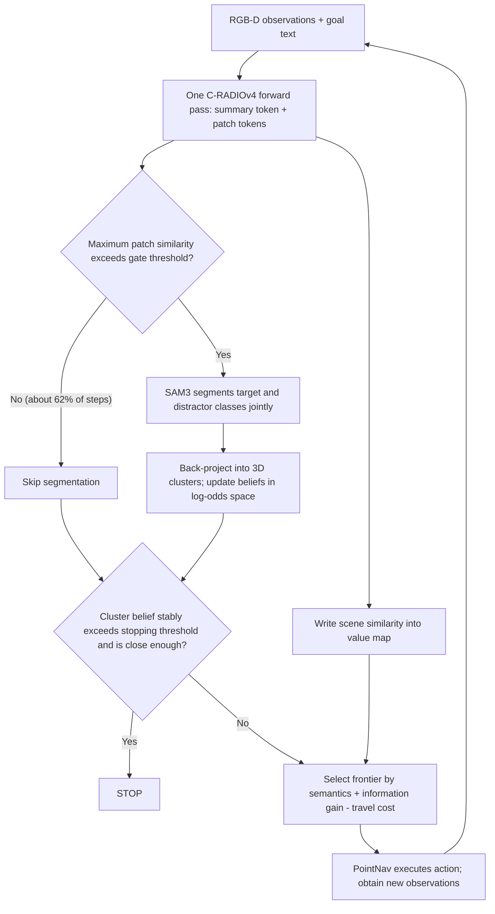

**② Explain** module by module

**Module 1: Evidence gated sensing**

- **input**: current RGB image $I_t$, target category name $g$.
- **processes**: C-RADIOv4 encoder $E$ one forward output summary token $z_t^{\text{sum}}$ (global semantics of the entire image) and $N$ patch tokens $z_t^{\text{patch}}$ (semantics of each local area). The target name is encoded with SigLIP2 text tower only once to get $e_g$ and the entire episode is cached.
  - Scene correlation: summary token is aligned to text space, $\sigma_t^{\text{scene}} = \cos(f(z_t^{\text{sum}}), e_g)$ via SigLIP2 adapter $f$, and then projected to the overhead value map $V_t$ according to depth and pose, as a persistent prior of "which direction may have a target".
  - Local target indication: The same adapter is applied to each patch, and the maximum value $\sigma_t^{\text{patch}} = \max_i \cos(f(z_{t,i}^{\text{patch}}), e_g)$ is taken - intuitively it means "how similar is the small patch in the screen that most resembles the target."
  - Gating: Only when $\sigma_t^{\text{patch}} > \tau_{\text{gate}}$ (taken as 0.08), the **features that have been calculated by** are sent to the SAM3 mask decoder for instance segmentation, otherwise the segmentation is skipped in the entire step.
- **output**: value map update; and (possibly) instance segmentation results with target scores and interference scores.
- **Design motivation**: The old method uses BLIP-2 for scene scoring, YOLO/GroundingDINO for detection, and MobileSAM for segmentation. The three sets of coding semantics are inconsistent and repeated calculations. The shared backbone allows all stages to "see the same representation"; while the gated judgment reuses the calculated patch similarity at almost zero cost, but can skip more than 60% of SAM3 calls.

**Module 2: Evidence integration (core stuck point)**

- **input**: SAM3 output instance mask, depth, pose; each instance has the target score $s_g$ and the highest interference score $s_{\text{conf}}$ (interference categories are generated offline by LLM for each target at most 3, such as the interference of couch is chair / daybed / chaise lounge, and cached across episodes). Detections lower than $\tau_{\text{det}}=0.4$ are discarded directly.
- **processing**: The instance is back-projected into a 3D point cloud. If the distance to a recently observed cluster is less than 0.75 m, it is merged into it, otherwise a new cluster is created. Each cluster $C_k$ maintains a scalar **log probability belief** - which can be understood as "evidence points supporting it as the goal", 0 means neutral, positive bias is the goal, negative bias is not:

$$
l(C_k) = \log \frac{P(C_k = g)}{1 - P(C_k = g)}
$$

Each observation is updated additively and truncated to $[-4, 4]$:

$$
l(C_k) \leftarrow l(C_k) + \Delta l^{\text{sem}}(C_k) + \Delta l^{\text{miss}}(C_k)
$$

  - **semantic item** (for the cluster that is detected and hit): Compare the target score and the interference score, and push in the direction of whichever one is obviously dominant. The gap will not move if it is within the neutral boundary $\delta=0.10$:

$$
\Delta l^{\text{sem}}(C_k) =
\begin{cases}
+\alpha_{\text{sem}} \, \rho_k \, \text{logit}(\tilde s_g), & s_g \ge s_{\text{conf}} + \delta \\
-\alpha_{\text{sem}} \, \rho_k \, \text{logit}(\tilde s_{\text{conf}}), & s_{\text{conf}} \ge s_g + \delta \\
0, & \text{otherwise}
\end{cases}
$$

Among them, $\tilde s_g, \tilde s_{\text{conf}}$ is the score after recalibration (the logit is guaranteed to be non-negative after passing the detection of $\tau_{\text{det}}$), $\rho_k \in [0,1]$ is the spatial overlap degree of the new instance and the cluster, $\alpha_{\text{sem}}=0.7$.

  - **missing item** (for clusters with positive beliefs and falling within the field of view but not being detected): "Should have been seen but not seen" itself is counter-evidence:

$$
\Delta l^{\text{miss}}(C_k) = -\alpha_{\text{miss}} \, v_k \, \text{logit}(1 - s_{\text{miss}})
$$

$v_k$ is the proportion of 3D points of the cluster falling within the current view frustum, $s_{\text{miss}}=0.2083$ is the single frame miss rate estimated by statistics, $\alpha_{\text{miss}}=0.3$. Clusters outside the field of view are not affected.
- **Output**: Cumulative beliefs for each cluster. When the belief of a certain cluster exceeds $\tau_{\text{stop}}=1.0$, the robot moves towards it and continues to update; it only truly stops when at least 2 of 5 consecutive frames exceed the threshold and are within 0.5 m of the cluster.
- **design motivation**: ApexNav also does timing fusion, but it is **average** - the confidence will never exceed the strongest frame, and the fuzzy perspective and the decisive perspective have the same weight. The **addition** of log-odds allows consistent observation of compound interest accumulation; interference terms and missing terms allow erroneous hypotheses to be actively "revoked".

> **Take** as an example (take $\rho_k = 1$, assuming that the score after recalibration is the value below):
> - **true target**: see the same sofa in 3 consecutive frames, $\tilde s_g = 0.8$, $\text{logit}(0.8) = \ln 4 \approx 1.39$ in each frame, plus $0.7 \times 1.39 \approx 0.97$ in each frame. Conviction $\approx 2.91$ after 3 frames, steadily surpassing $\tau_{\text{stop}} = 1.0$. If the average method is used, the confidence level will always stop at 0.8. "No matter how much you see, you will not be more certain."
> - **interference object**: When looking for a chair, I saw a sofa, with a target score of 0.47 and an interference score of 0.86 (Fig. 4 real robot data). The interference score is higher than $\delta$. If $\tilde s_{\text{conf}} = 0.8$, the cluster will deduct 0.97, which directly becomes a negative belief and the robot will not be sucked away by it.
> - **False detection and withdrawal**: In a certain frame, distant debris was mistakenly detected as a trash can, and the confidence rose to +0.97. After getting closer, it completely fell into the field of view ($v_k = 1$) but was not detected continuously, and $0.3 \times \text{logit}(0.79) \approx 0.3 \times 1.34 \approx 0.40$ was deducted every frame; after only 1 frame, the belief dropped to 0.57, falling below the stop threshold, and the robot was "released" to go back to continue exploring; after 3 frames, it became −0.23.

**Module 3: Active evidence acquisition**

- **input**: value map $V_t$, occupation grid (1000×1000, 0.05 m/grid), current frontier set.
- **processing**: Calculate the composite utility for each frontier $f$ (the three items are first min-max normalized within the current frontier set to make the scale comparable):

$$
U_t(f; g) = \tilde S_t(f; g) + \lambda_{\text{info}} \, \tilde G_t(f) - \lambda_{\text{dist}} \, \tilde C_t(f)
$$

  - $S_t$: Same as VLFM, value map value near the aggregation front - "Does this direction look like there is a target".
  - $G_t$: BFS finds the shortest traversable path $\pi_t(f)$ to a frontier on the occupancy grid. Viewpoints are sampled every 0.75 m, facing along the path tangent; the final viewpoint faces nearby unknown space. Rays are cast every 5° within a 79° horizontal field of view, up to 5 m, stopping at known obstacles. Information gain is the union of **unknown cells** visible along these rays: $G_t(f) = \lvert U_t \cap \text{Vis}(\pi_t(f)) \rvert$. It measures new space visible **along the entire route**, rather than only at the endpoint.
  - $C_t$: Path length $\lvert \pi_t(f) \rvert$.
- **outputs**: the most efficient frontier, handed over to PointNav for execution.
- **Design motivation**: Pure semantic sorting only shows "which way there may be", regardless of "how much you can see there or how far you have to go". When there are weak semantic cues, this is the source of back-and-forth and wasted steps.

| Dimensions | Traditional approach (VLFM / ApexNav, etc.) | AECNav |
|---|---|---|
| Visual coding | Scene scoring, detection, and segmentation each use a set of models | One C-RADIOv4 forward, shared by multiple adapter heads |
| Split call | Run every step | patch similarity gating, skip about 62.5% |
| Target confirmation | Single frame threshold, or multi-frame average | 3D cluster-level log-odds accumulation, including interference and missed negative evidence |
| Frontier selection | Semantic value (ApexNav returns geometry when weak clues) | Semantics + information gain along the way − path cost |

**③ end-to-end data flow**

The complete path of one-step decision-making is: RGB-D enters C-RADIOv4 → summary token updates value map, patch similarity determines whether to trigger SAM3 → if triggered, SAM3 uses "target + interference category generated by LLM" as prompt to segment → instance back-projection merges into 3D clusters, updates log-odds beliefs (miss points are deducted for positive belief clusters within the field of view) → if a cluster satisfies "stable + close enough" then STOP, if it is just exceeding the threshold, navigate towards it, otherwise press the composite utility to select the front → PointNav output discrete actions such as MOVE_FORWARD (0.25 m) / TURN (30°) → return to the beginning for new observations.

**④ Training target**

Completely training-free: without any loss function or fine-tuning, all components (C-RADIOv4 + SigLIP2/SAM3 adapter, interference categories generated by DeepSeek-V4-Flash, pre-training PointNav) are directly reused, with only a few thresholds and weight hyperparameters.

**⑤ inference process**

Default hyperparameters: $\tau_{\text{gate}}=0.08$, $\tau_{\text{det}}=0.4$, belief range $[-4,4]$, $(\alpha_{\text{sem}}, \alpha_{\text{miss}})=(0.7, 0.3)$, $\lambda_{\text{info}}=\lambda_{\text{dist}}=1.0$, C-RADIOv4 (SO400M) input 672×672. LLM only generates interference categories once for each target category in the offline stage, and there is no online LLM call during inference. This is one of the reasons why it is one to two orders of magnitude faster than SG-Nav / InstructNav.

---

### 3. Results and findings
{: id="3-核心结果发现-21"}

**main result** (all training-free, compared with the training method in the same table):

| benchmark | AECNav SR/SPL | Previous Best | Improvement |
|---|---|---|---|
| HM3D-v2 | 84.7 / 45.3 | TrajRAG 78.1 / 40.2 | SR +6.6，SPL +5.1 |
| MP3D | 51.3 / 25.9 | WMNav 45.4 / 17.2 | SR +5.9，SPL +8.7 |
| HM3D-OVON | 57.3 / 30.5 | MSGNav 48.3 / 27.0 | SR +9.0 |

The biggest improvement is seen on HM3D-OVON, which has the most difficult open vocabulary, which is consistent with the design of "the more categories and the more similar interference objects, the more useful log-odds anti-interference is."

**Efficiency** (HM3D-v2 first 100 episodes): AECNav averages 108.63 steps, 24.39 s/episode; VLFM 53.36 s, ApexNav 177.97 s, SG-Nav exceeds 1400 s. The number of steps is 33% less than the second place ASCENT, and the time consumption is 2.2 times faster than VLFM.

**Perception Pipeline Analysis**: Replace BLIP-2 + YOLOv7 + MobileSAM with C-RADIO, SR increased from 75.9 to 84.7, delay decreased from 0.402 to 0.248 s/step; adding gate control ($\tau_{\text{gate}}=0.08$) skipped 62.5% When calling SAM3, the delay is reduced to 0.178 s/step without losing accuracy. Overall, it is 2.3 times faster than the multi-model baseline.

**ablation**：
- Removing evidence integration (just walk over if detected) leads to the largest loss: SR −12.8.
- The log-odds accumulation of only retaining the target score has reached 81.9 SR (10 points higher than no accumulation) - **accumulation itself is the main source of income**; the interference item is +1.8, and the missing item is +1.3. The two repair non-overlapping error types, totaling to 84.7.
- Remove active evidence acquisition: SR −2.9, SPL −3.5.

<div align="center">
  
<figcaption>
Scan of information gain weight and path cost weight: adding the path cost term alone will significantly improve; adding information gain alone is almost ineffective (81.9 vs 81.8) and must be matched with the cost term; any weight that is too high will harm the performance
</figcaption>
</div>

A counterintuitive finding is that **information gain is almost ineffective on its own**. Without cost constraints, it favors large open areas and sends the robot on long detours that consume steps and depart from semantically promising regions. Paired with travel cost, it becomes a useful measure of value per unit effort.

**real robot**: Unitree Go2 + RealSense D455, 4 indoor scenes, 8 open vocabulary targets (including categories outside the standard vocabulary list such as "water dispenser" and "coffee machine", the chair experiment deliberately placed sofas and benches for interference), 38 out of 40 times (95%) successful, and a single decision-making time of 197.4 ms (about 5 Hz).

<div align="center">
  
<figcaption>
Unitree Go2 real robot experiment: When looking for a chair in the upper row, the interference score exceeded the target score twice in a row, and the two sofas were rejected; when looking for a trash can in the lower row, the distant false detection was withdrawn due to missing evidence after approaching, and the robot continued to explore and found the real target
</figcaption>
</div>

---

### 4. Limitations
{: id="4-局限性-21"}

Interference categories rely on a fixed small set (up to 3) generated offline by LLM. If the real interference is not in the list, negative evidence cannot take effect; the method relies heavily on manual thresholds and weights (gating thresholds, missed detection priors, stop windows, etc.). The real robot experiment was small in scale (40 times), and the two failures came from corners that the forward-looking camera had never seen and the number of steps in large open areas was exhausted, indicating that the exploration strategy still has blind spots in these two types of scenes.

---

# Related reading
{: id="关联阅读"}

## Harness Robotic OS (2026)
{: id="harness-robotic-os"}

The paper focuses on embodied agent runtime, skill orchestration, hierarchical memory and self-evolution management. The complete reading has been moved to [Embodied Agent paper intensive reading: Harness Robotic OS](/Embodied-Agent-Papers/#harness-robotic-os) (Chinese only).

## 35. SparseNav (2026)
{: id="sparsenav"}
——Less is more: training-free VLN with “on-demand” semantic awareness based on instructions

📄 **Paper**: [arXiv:2609.26408](https://arxiv.org/abs/2609.26408)

### Key takeaways
{: id="精华-23"}

- A more complete semantic map is **not always better**: retain geometry persistently, but perceive, map, and remember semantics only when the current instruction calls for them.
- Turn "whether to call the segmentation model" itself into a decision made by VLM, and the perception changes from "running every frame" to "event-triggered", which not only saves computing power but also reduces noise annotation in the map.
- Candidate points include both frontier points (exploring the unknown) and local left/front/right points (completing maneuvers such as "go straight and then turn left" in a known area), both of which are indispensable.
- The BEV image shown to the VLM should be centered on the robot and oriented upward, so that "top/left/right" on the image directly corresponds to "front/left/right" in the language - this represents a difference of 12.5 points SR.
- VLM is only responsible for "selecting which candidate point". The trajectory is handed over to the classic A* planner for execution, and semantic decision-making and measurement execution are completely decoupled.

---

### 1. Background and problem
{: id="1-研究背景问题-22"}

Map-based training-free VLN usually marks all objects that can be recognized in the field of view onto a semantic map (such as MapNav's Annotated Semantic Map). But for the current decision-making step, the vast majority of objects are irrelevant to the instructions: they waste segmentation computing power, clutter the map seen by VLM, and introduce false detections. The author therefore raises a question: **has wider semantic coverage, will it definitely improve the instruction following?**

---

### 2. Method and innovations
{: id="2-主要方法创新点-22"}

<div align="center">
  
<figcaption>
Dense semantic map vs. sparse semantic map: For the instruction "turn left between the sofa and the kitchen countertop", the dense method marked a large number of irrelevant objects, and SparseNav only grounded the two landmarks of the sofa and the kitchen countertop, while retaining the complete geometry
</figcaption>
</div>

<div align="center">
  
<figcaption>
SparseNav overall framework: Instruction manager maintains sub-instruction progress and current landmark query; VLM visibility judgment determines whether to call open vocabulary segmentation; mask + depth projection updates sparse landmark memory; VLM selects waypoint among mixed candidate points, and the path planner executes
</figcaption>
</div>

**① Overview of the overall framework**

SparseNav consists of four modules: **instruction manager** is responsible for dismantling instructions, tracking progress and giving "what landmarks to find now"; **geometry memory** $M_t^G$ continuous maintenance obstacles/free space BEV; **Sparse semantic perception** Only calls segmentation when needed and writes the landmark center into sparse memory $M_t^S$; **Mixed candidate points + VLM decision-making** Selects a waypoint among the frontier point and the local direction point, and hands it to the classic planner for execution. Agent state writing:

$$\mathcal M_t = (M_t^G, M_t^S, E_t, q_t)$$

Among them, $E_t$ is the observation of the last few frames, and $q_t$ is the instruction progress.

**② Explain** module by module

**Geometry-Centric Spatial Memory**
- **Input**: RGB-D (or LiDAR) point cloud + odometry pose
- **processing**: Take the point with a height of $z_{min} < z < z_{max}$ and rasterize it into an obstacle map according to the resolution $\rho$; use elliptical expansion to connect the scattered wall observations, and then perform morphological closing operation to fill the small holes; expand the obstacles according to the robot radius $r_a = 0.1$ m
- **outputs**: a BEV picture of **centered on the robot and facing upward**. The coordinates are transformed to $p^{ego} = R(-\theta_t)(p - p_t)$, and the front of $+x$ corresponds to the top of the image, $+y$ The left side corresponds to the left side of the image.
- **Design motivation**: Geometry is the basis of obstacle avoidance and planning, which must be durable and complete; and "facing upward" allows the direction on the picture to naturally align with the "front/left/right" in the language, and VLM no longer needs to do mental rotation.

> **gives an example of**: the robot is located at world coordinates $(5, 5)$, facing due east ($\theta_t = 0°$); the sofa is at $(5, 7)$, which is 2 m due north of the robot.
> In the fixed north-up global map (north-up), the sofa is drawn "above" the robot, and VLM can easily read it as "sofa in front";
> After changing to the upward-facing image, first translate and then rotate $-\theta_t$ to get $p^{ego} = (0, 2)$, which is 2 m in the $+y$ direction. Draw **on the left side of the robot** - directly opposite to the instruction "The sofa is on your left".
> In the ablation of the paper, the global north-up is only 30.3% SR, with the robot as the center but not rotating is 36.2%, and with the robot as the center and facing upward is 42.8%.

**Hybrid Waypoint Proposal**
- **input**: geometry BEV, robot pose
- **handles**:
  - **frontier candidate** $\mathcal C_t^F$: clustering of passable grids adjacent to unknown areas, eliminating small clusters, and selecting a reachable point with obstacle avoidance margin for each cluster
  - **local direction candidate** $\mathcal C_t^L$: Place a point in each of the three directions of the current $\{-\phi, 0, +\phi\}$ and at a distance of $d_l$. Points falling in obstacles or disconnected areas are discarded or projected back to free space.
- **output**: candidate set $\mathcal C_t = \mathcal C_t^F \cup \mathcal C_t^L$, each point is rendered on the BEV with a number
- **Design motivation**: The forward point can only guide "to places you have never seen before", but many command actions occur in known areas ("go straight first, then turn left when you get to the sofa"), and the local left/front/right points just fill this gap.

**Hierarchical Instruction Management**
- **Input**: Complete Instructions $I$
- **processing**: split into ordered sub-instructions $S = (s_1, \dots, s_K)$, maintenance progress $q_t = (i_t, S_t^{done})$; record and advance when the current sub-instruction is completed
- **output**: completed / current / to be completed three goals, and the current **landmark query** $l_i$ (can contain multiple tags, such as {couch, kitchen counter})
- **Design motivation**: Avoid VLM repeatedly executing completed actions while deciding "which semantics should be sensed at this moment" - this is the source of sparse perception

**Sparse semantic awareness of instruction conditions (core innovation)**

This is the most critical part of the paper and the easiest to mention in one sentence: When **semantic perception occurs and what is perceived, it is determined by the current sub-instruction.**

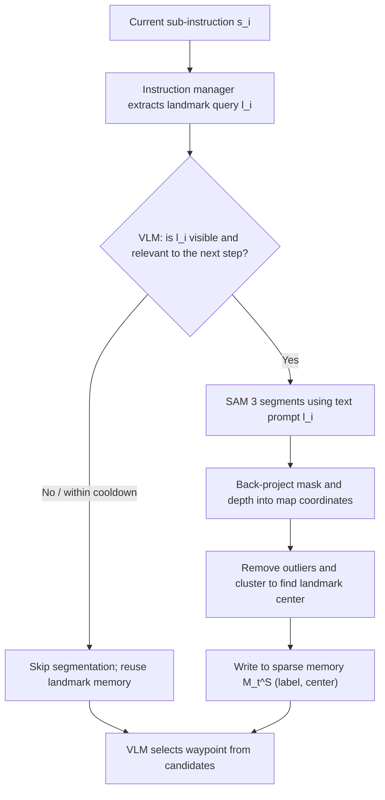

- **semantic trigger**: VLM reads $(O_t, E_t, s_i, l_i)$, outputs the visibility score and the decision of whether to ground or not $z_t \in \{0, 1\}$; it is triggered only when "the landmark is highly likely to be visible, and its measurement position will affect the next decision", and has a time cooldown to avoid repeated calls
- **Open vocabulary segmentation**: Use SAM 3 to use landmark text as a prompt to obtain instance masks
- **2D→3D projection**: The effective depth pixels in the mask are back-projected using camera internal parameters, transformed to the map coordinate system, and clustered after removing outliers
- **sparse memory**: $M_t^S = \{(\ell_j, \mu_j)\}$, only labels and cluster centers are stored; different instances of the same label are stored separately; new observations update the nearest matching cluster, otherwise create a new one; **landmarks that are no longer queried will also retain** for subsequent reuse

| Dimensions | Dense semantic maps (such as MapNav) | SparseNav |
|---|---|---|
| What to sense | All identifiable objects in the field of view | Only the landmarks named by the current subcommand are sensed |
| When to sense | Continuously sense every frame | Triggered only when VLM determines that it is visible and useful |
| What is stored in the map | A large number of category color blocks | Geometry + a small number of labels and centers of landmarks |

**③ end-to-end data flow**

One decision: RGB-D and odometry update geometry BEV → Instruction manager gives the current sub-instruction and landmark query → VLM determines whether to trigger segmentation, and when triggered, the landmark center is written into sparse memory → Generate frontier + local candidate points and render numbers → VLM reads $X_t = \{M_t^G, M_t^S, E_t, s_i, q_t, \mathcal C_t\}$, outputs a candidate number and short reason → A* plans a collision-free trajectory on the expanded obstacle map and executes → Execution feedback is used to determine whether to switch sub-instructions or stop.

**④ Training target**

None. The whole process **training-free**, all experiments (including real robot) use GPT-5 as the VLM and SAM 3 as the segmentation model.

<div align="center">
  
<figcaption>
Qualitative example: Each of the five sub-command stages is equipped with a first-person view and BEV; the asterisk marks the moment when semantic grounding is actually triggered (sofa + kitchen countertop, front door, side door), and the remaining stages reuse existing landmarks and geometry candidates
</figcaption>
</div>

---

### 3. Results and findings
{: id="3-核心结果发现-22"}

**benchmark results (Val-Unseen)**:

| Method | Setup | R2R-CE SR | R2R-CE SPL | RxR-CE SR | RxR-CE nDTW |
|---|---|---|---|---|---|
| InstructNav | Zero sample | 31.0 | 24.0 | – | – |
| CA-Nav | Zero sample | 25.3 | 10.8 | 19.0 | 13.5 |
| DreamNav | Zero sample | 32.8 | 28.9 | – | – |
| MapNav | Supervision | 39.7 | 37.2 | 32.6 | 43.5 |
| ETPNav | Oversight | 57.0 | 49.0 | 54.8 | 61.9 |
| **SparseNav** | training-free | **42.8** | 35.2 | **40.7** | 48.6 |

**Key ablation**:
- **Semantic policy** (R2R-CE SR): No semantics 34.6 → Dense + persistent-aware 36.7 → Dense + On-demand 38.8 → Instruction-related + On-demand 40.2 → **Instruction-related + On-demand 42.8**. Both dimensions "perception range" and "triggering timing" contribute
- **candidate point**: only local points 29.1, only front points 35.2, front + front 37.4, front + left/front/right 42.8
- **landmark localization**: VLM direct estimation position 34.6 (error 1.56 m, worse than 36.5 without localization), labeling frame 40.2 (0.51 m), segmentation 42.8 (0.12 m)
- **instructions and memory** (RxR-CE): complete instructions 29.8 → + timing memory 31.5 → sub instructions 33.2 → + progress tracking 35.0 → + persistent landmark memory 40.7; persistent landmark memory has the largest single contribution (+5.7)
- **Trigger quality**: Cycle trigger accuracy/recall 41.5/45.6, visibility only 72.1/99.8, sub-command awareness **90.4/99.8**
- **real robot**: Unitree Go2 + RealSense D455 (mapping and landmark grounding) + Livox MID-360 (localization), no pre-built map, complete landmark conditional instructions such as "turn left to the quadruped robot, pass the humanoid robot, enter the next room and stop" in multiple indoor scenes

<div align="center">
  
<figcaption>
real robot deployment: (a) Go2 platform and navigation architecture; (b)–(e) Turn left, pass the humanoid robot, enter the adjacent room, and stop four execution fragments. The lower right corner is the corresponding BEV
</figcaption>
</div>

---

### 4. Limitations
{: id="4-局限性-22"}

Candidate points are generated by rules, and VLM can only choose from the preset frontier and left/front/right points, which may miss waypoints that better fit the instructions. Although on-demand segmentation saves perception overhead, VLM inference is still the main delay. The serial "perception→inference→execution" will cause the robot to stop and wait for decisions. In addition, the comparison with other methods in the table is based on cross-paper data (different episodes and backbone models). The real robot part only has qualitative display and no success rate statistics.

---

## 36. Talk2Escape (2026)
{: id="talk2escape"}
——When you get lost, just ask: Turn multi-round conversations into VLN’s closed-loop error correction channel

📄 **Paper**: [arXiv:2609.28296](https://arxiv.org/abs/2609.28296) · [Project Page](https://zeruili22.github.io/talk2escape/)

### Key takeaways
{: id="精华-24"}

- The essence of single-round VLN is open loop: an instruction is executed to the end without any verification or error correction mechanism in the middle. Small deviations will accumulate along the way and cause task failure.
- Dialogue serves as **a runtime error-correction safety net**: the robot pauses and requests help only when an anomaly is detected, rather than merely supplementing its initial plan.
- "When to ask" is more critical than "what to ask": sparse, targeted deviation triggering is better than high-frequency or timed questioning, and asking too many questions will disrupt the internal inference (intervention fatigue) of a strong agent.
- Before asking for help, "translate" the multi-perspective observation into a short question with landmarks, so that the respondent (human or Oracle) can reliably answer it.
- The module has nothing to do with the base and can be directly connected to zero-shot agents such as NavGPT, MapGPT, and GTA. The cleaner the history and the more action-centered the base, the better it can digest natural language error correction.

---

### 1. Background and problem
{: id="1-研究背景问题-23"}

Mainstream VLN is a single-round paradigm: the agent receives an instruction and executes it in an open loop. There is no mechanism to check progress, request clarification, or recover from errors. On a real robot, sensor noise, odometry drift, and unmapped obstacles are inevitable. A small deviation may push the robot into a "lost" state that cannot be recovered. Existing conversational VLNs mostly treat conversations as supplementary information for initial planning, rely on fine-tuning of conversation data, and assume that communication is instant and execution is error-free.

---

### 2. Method and innovations
{: id="2-主要方法创新点-23"}

<div align="center">
  
<figcaption>
Comparison of paradigm: The left is a single-wheel open-loop VLN, which cannot be recovered once it goes astray; the right is Talk2Escape's closed-loop dialogue paradigm. The agent proactively asks for help when it makes a mistake, and the expert gives corrective tips and then re-plans
</figcaption>
</div>

<div align="center">
  
<figcaption>
Talk2Escape framework: ① The base agent outputs kinematic status and actions; ② The kinematics monitor detects spinning or deviation in place and triggers a pause; ③ The visual-language translator converts the current RGB-D observation into a short help question; ④ Oracle/human gives correction tips based on relative orientation and distance; ⑤ The entire dialogue is injected into MLLM Prompt word, the agent re-plans accordingly
</figcaption>
</div>

**① Overview of the overall framework**

Talk2Escape is an intervention module attached to any zero-shot base agent. A **kinematic monitor** detects trouble; a **vision-language translator** expresses the situation as a question; and **prompt generation and injection** inserts corrective information into the base MLLM prompt. It adds communication actions $\mathcal A^c$ alongside physical actions $\mathcal A^p$, changing the policy from $a_t = \pi(H_t)$ to $a_t = \pi(H_t \cup D_k)$. Here, $D_k = \{(Q_1, F_1), \dots, (Q_k, F_k)\}$ is the question–answer history up to interaction $k$. No fine-tuning is performed; Gemini 3.1 Pro is the reasoning engine.

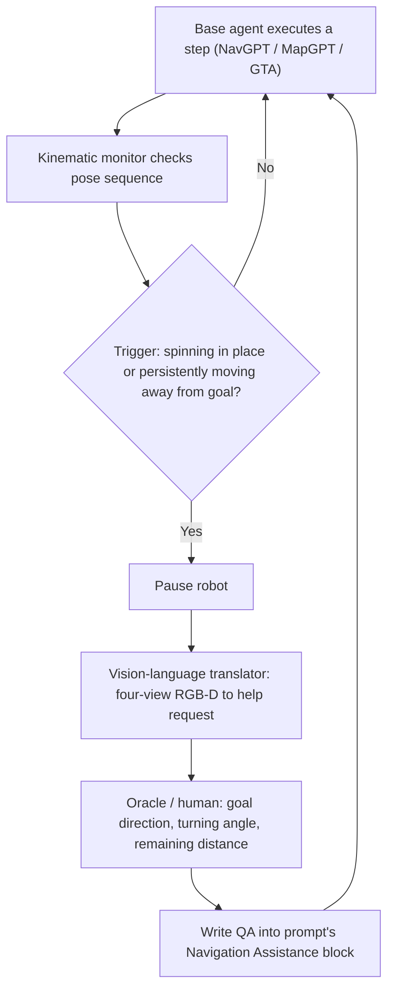

**② Explain** module by module

**Base Navigation Agent**
- **Input**: RGB-D view $O_t$, pose $p_t$, history $H_t$ in four orthogonal directions (0°/90°/180°/270°) per step
- **handles**: MLLM specifies the navigation target with normalized pixel coordinates $(u, v)$; stronger bases (such as GTA) also maintain TSDF top view and topology map
- **output**: physical action (discrete action, relative waypoint or pixel coordinate), handed over to the underlying controller for execution
- **design motivation**: Talk2Escape does not change the base, only adds a closed loop to the outer layer, so it can be verified to be "independent of the base"

**Kinematics monitor and trigger conditions (core stuck point)**

The paper compares six intervention strategies: None (no intervention), Repeat, Deviation, Hybrid (or the two), Periodic (a prompt is given every $k_{per} = 5$ step), and Human-in-the-Loop. The two automatic trigger conditions are:

- **Repeat trigger (turn in place)**: Within the radius of the current position $r = 0.5$ m, it has been visited at least $n = 3$ times in history:

$$\mathcal C_{rep}(t) = \mathbb 1\left[ \left\lvert \{ \tau \in [0, t] : \lVert p_\tau - p_t \rVert_{xz} < r \} \right\rvert \ge n \right]$$

- **Deviation trigger (continuously moving away from the target)**: Set $d_t = \lVert p_t - p_g \rVert_{xz}$ as the horizontal distance to the target, and use the sliding average of the window $k = 2$ to compare the "last two steps" and "the next two steps":

$$\mathcal C_{away}(t) = \mathbb 1\left[ \bar d_{t,k} > \bar d_{t-k,k} \right], \quad \bar d_{t,k} = \frac{1}{k} \sum_{i=0}^{k-1} d_{t-i}$$

> **Take for example** (Deviation trigger, $k = 2$): the distance to the target in four consecutive steps is 8.0, 7.0, 7.2, 7.6 m.
> If you only look at a single step, the third step from 7.0 to 7.2 triggers a false trigger - it's just a small motion jitter.
> Use sliding average: the average of the last two steps is $(7.6 + 7.2)/2 = 7.4$, the average of the previous two steps is $(7.0 + 8.0)/2 = 7.5$, $7.4 < 7.5$, **does not trigger**.
> The next step distance becomes 8.0: the average of the last two steps is $(8.0 + 7.6)/2 = 7.8$, the average of the previous two steps is $(7.2 + 7.0)/2 = 7.1$, $7.8 > 7.1$, **triggers** - at this time it is really continuing to move away from the target.

Note: Deviation triggering requires knowing the target position $p_g$, which is true value information in the simulation; on the real robot, the human supervisor decides whether to intervene according to the same criteria.

**Vision-Language Translator (Help-Seeking)**
- **input**: four views when triggered RGB-D observation + trigger type
- **processing**: MLLM completes three things in sequence: summarizes the local scene; determines the most likely failure mode based on trigger conditions (driving in the corridor, facing a dead end, stuck at an intersection); generating a short help question
- **output**: For example, "I'm stuck at this intersection and there's a sofa in front of me. Where should I go?"
- **Design motivation**: The original multi-view image has a large amount of information and is difficult to understand quickly; the translator is constrained to only mention observable landmarks and relative directions, and does not speculate on unseen areas

**Oracle prompt generation and injection**
- **input**: agent orientation $\psi_t$, target azimuth angle $\phi_t = \mathrm{atan2}(p_g^z - p_t^z,\ p_g^x - p_t^x)$
- **processing**: Calculate the relative angle $\theta_t = \phi_t - \psi_t \in (-180°, 180°]$; if $d_t < d_{th}$ answers "You are very close to the target", otherwise it answers "The target is on your [left/right], turn to [left/right] about $\lvert \theta_t \rvert$ degrees, distance $d_t$ meters"
- **Output**: The question and answer pair is written to the MLLM prompt word in the dedicated **Navigation Assistance** block, positioned between the historical context and the current visual input
- **design motivation**: Give clear, self-centered corrective instructions to allow the agent to jump out of the current failure state

**③ Training target**

None. The entire framework runs on frozen MLLM with zero samples and does not rely on any dialogue data fine-tuning.

---

### 3. Results and findings
{: id="3-核心结果发现-23"}

**R2R-CE / RxR-CE (Val-Unseen sampling subset: R2R-CE 100 strips, RxR-CE 260 strips)**:

| Methods | R2R-CE SR | R2R-CE SPL | RxR-CE SR | RxR-CE SPL | RxR-CE nDTW |
|---|---|---|---|---|---|
| Efficient-VLN (best supervision) | 64.2 | 55.9 | 67.0 | 54.3 | 68.4 |
| GTA (zero sample) | 48.8 | 41.8 | 46.2 | 39.3 | 57.4 |
| T2E + NavGPT | 64.0 | 46.4 | 50.4 | 27.2 | 45.7 |
| **T2E + GTA** | **72.0** | 49.4 | **62.9** | 34.2 | 49.9 |

- SR is greatly improved, but SPL and nDTW on RxR-CE are reduced: error correction requires backtracking and detours, and the path becomes longer. This is a trade-off of "exchanging path efficiency for success rate"
- **values are inconsistent with**: the abstract states that the R2R-CE SR is 66.0%, while the T2E + GTA given in Table I and the text is 72.0%; in Table IV, Deviation is triggered on the same 100 episodes, the SPL is 49.4, but the SR is 66.0%. The paper does not explain the difference between the two. Please be careful when citing.
- **VLNVerse (base independent)**: NavGPT 19.3 → +CoT 28.7 → **+T2E 84.6**; MapGPT 25.5 → +CoT 42.2 → +T2E 67.0. Passive thinking chain is far inferior to active dialogue
- **found counter-intuitively that**: MapGPT is better than NavGPT when used alone, but it is even worse when T2E is attached. The author attributes this to a modal mismatch - the large number of absolute 3D coordinates in the MapGPT hints conflicts with the relative, egocentric hints given by Oracle.

**trigger strategy ablation (R2R-CE, the same 100 episodes, the base is GTA)**:

| Strategy | SR | SPL | Trigger Rate |
|---|---|---|---|
| None | 48.8 | 41.8 | 0% |
| Repeat | 57.0 | 45.1 | 4.74% |
| **Deviation** | **66.0** | **49.4** | 15.0% |
| Hybrid | 54.0 | 44.5 | 23.1% |
| Periodic (k=5) | 63.0 | 46.5 | 10.2% |
| Human-in-the-Loop | 74.5 | 61.2 | 9.8% |

Hybrid triggered too frequently, but dropped to 54.0%, which shows that asking more questions is not necessarily better.

<div align="center">
  
<figcaption>
The impact of timing intervention interval k on different bases: the weak base NavGPT decreases approximately linearly as the interval becomes larger (relying on continuous external guidance); the strong base GTA is in an inverted U shape, k=5 is the best, and asking too frequently will interrupt its internal inference
</figcaption>
</div>

**real robot (Unitree Go2, gimbal depth camera scans orthogonal view, MLLM asynchronous output waypoint)**: SR increased from 40.0% of GTA to 62.0%, NE decreased from 3.66 m to 3.31 m; supervision method VLN-BERT 16.0%, RDP 20.0%. The real robot uses human supervisors to intervene according to Deviation criteria.

<div align="center">
  
<figcaption>
real robot example: The upper agent misunderstood the instruction and went to the wrong door, and the human gave the correction "It's not this door, go to the area behind you"; the lower agent changed its route accordingly, reached the correct target and was confirmed
</figcaption>
</div>

---

### 4. Limitations
{: id="4-局限性-23"}

The Oracle prompts and Deviation triggers in the simulation directly use the target's true position (azimuth and distance), which is equivalent to privileged information and is not compared under the same conditions as the method that only relies on single-round instructions; real robot relies on human supervisors. The author also pointed out the "asymmetric context" bottleneck: humans only see discrete static images, and it is difficult to restore the robot's global orientation and local obstacles, and the prompts given may be vague. In addition, R2R-CE is only evaluated on 100 sampling episodes, and the statistics fluctuate greatly.

---

## 37. VNT-PA (2026)
{: id="vnt-pa"}
——Use "where seen" instead of "when seen" as location encoding: Transformer planner without explicit map

📄 **Paper**: [arXiv:2609.21212](https://arxiv.org/abs/2609.21212)

### Key takeaways
{: id="精华-25"}

- Memories organized by "where" are better suited to represent the environment than by "when": a set of depth keyframes with camera poses can itself serve as an environment representation for planning purposes, without the need for explicit mapping.
- Treating the camera pose as RoPE position encoding, attention only relies on the **pose difference** between two frames, which naturally has nothing to do with the time sequence of the frames or the origin of the world coordinates.
- The same architecture only changes the position encoding (time → pose), the SPL gap of long-distance episodes is up to 17.1 points, and the training convergence is more than 4 times faster - the inductive bias is more important than the model capacity.
- The context is an unordered set, so you can arbitrarily incorporate frames from other trajectories and other times during testing without retraining; keyframe filtering allows the context size to only grow with the "seen space" and not with the length of the trajectory.
- Compared with OctoMap + A*, which first "hard-codes" the noise pose into the raster map, the implicit representation degrades much more gently under localization errors.

---

### 1. Background and problem
{: id="1-研究背景问题-24"}

Learning navigation strategies almost always treat historical observations as time series (time-indexed tokens, sliding windows, or recurrent hidden states). This memory cannot naturally accommodate observations seen "last time here" or "another robot", and the cost increases with the length of the history. Systems that truly reuse long-term experience will build another set of metric/topological maps for planning, and maintain two representations of the same environment. The author wants to answer: **Can the learning planner directly use experience with pose as the environment representation without going through an explicit map?**

---

### 2. Method and innovations
{: id="2-主要方法创新点-24"}

<div align="center">
  
<figcaption>
VNT-PA architecture: After key frame filtering, frozen DeFM and attention pooling compress each frame into a token, which forms a spatial context with the camera pose; after adding the target token, the L_map layer uses pose as position encoding self-attention to obtain the target sensing context; the query token with the robot pose as the anchor reads the context through the L_read layer cross-attention, and finally uses the autoregressive GRU Decode the action block
</figcaption>
</div>

**Problem setting**: Similar to PointGoal, the robot knows its own pose and target position, and executes FORWARD (0.25 m)/TURN-LEFT/TURN-RIGHT (30°)/STOP. The difference is that the robot also gets the depth frame $I_1, \dots, I_N$ and its pose recorded during previous exploration, and **does not look at the current view** when planning, and only relies on these old frames, robot poses and targets to make decisions - the old frames must bear the responsibility of the "map".

**① Overview of the overall framework**

VNT-PA consists of four segments: **key frame filtering and encoding** streamlines a large number of depth frames and compresses them into one token each; **spatial context + pose RoPE Self-attention** allows each frame and the target to be related to each other through pose differences to form an implicit map; **robot pose-anchored query** reads decision-making information from the implicit map through cross attention; **GRU action decoder** outputs an action.

| Dimensions | Temporal context (sequence model) | Spatial context (VNT-PA) |
|---|---|---|
| Index of each frame | Frame number (time step $t$) | Camera pose $(x, y, \psi)$ |
| Attention dependence | Time interval between two frames | Pose difference between two frames |
| Frames merged into other trajectories | No natural insertion position | Can be added directly with pose |
| Context size | Grows with history length | Grows with observed space size |

**② Explain** module by module

**Keyframe Filter**
- **input**: depth frames and poses arriving in sequence
- **processing**: Divide each frame into $G \times G$ patches, take the median depth of each patch and back-project it along the central ray, quantify it to the "voxel + viewing direction" label, and obtain the observed set of the frame $C(I_i, p_i)$; if the number of newly observed voxels in the frame is not less than $\eta$, then retain:

$$i \in \mathcal K \iff \left\lvert C(I_i, p_i) \setminus \bigcup_{j \in \mathcal K,\ j < i} C(I_j, p_j) \right\rvert \ge \eta$$

- **outputs**: key frame collection (an average of 21% of the frames are retained when $G = 16$ and $\eta = 10$, about 67 frames per trajectory)
- **Design motivation**: The cost of attention increases with the number of entries, and frames of adjacent poses highly overlap; and deleting an entry in the set does not affect the index of other entries, which cannot be done in a time series

**Frame Embedding**
- **input**: 224×224 depth map
- **processing**: The frozen depth basic model DeFM (ViT-S/14) obtains 16×16 384-dimensional patch tokens, which are then compressed into a vector by the learnable attention pooling aggregator $e_i$
- **output**: spatial context $\mathcal S = \{(e_i, p_i)\}$
- **Design motivation**: Navigation decisions rely only on geometry, so use depth instead of RGB

**pose RoPE (core stuck point)**

Standard RoPE treats each two dimensions of the query/key vector as a plane and rotates the corresponding angle according to "position × frequency". Since the two rotation matrices satisfy $R(a)^\top R(b) = R(b - a)$, the dot product after rotation only depends on the difference in position. VNT-PA converts this "position" from the time step into the three components of the camera pose:

$$R(p) = R_\omega(x) \oplus R_\omega(y) \oplus R_\nu(\psi)$$

So the attention score between the query at pose $p_i$ and the key at pose $p_j$ is:

$$\langle R(p_i) q_i,\ R(p_j) k_j \rangle = q_i^\top R(p_j - p_i) k_j$$

> **Take an example** (only look at the $x$ component, take only one frequency, and assume that the rotation is 1 radian per meter):
> The query is at $x = 2$ m and the key is at $x = 5$ m. The query vector is rotated by 2 radians, and the key vector is rotated by 5 radians. The dot product of the two leaves only the effect of relative rotation of $5 - 2 = 3$ radians.
> If the world coordinate origin is translated by 10 m, the two become 12 m and 15 m, the relative rotation is still 3 radians, and the attention score does not change at all.
> If switched to time RoPE, the same two frames may be frame 7 and frame 40, with an interval of 33 - this number depends on how the exploration route goes and has nothing to do with whether the two frames are spatially adjacent.

Several details of frequency design:
- **position frequency**: $\omega_m = s^{-1} b^{-(m-1)/n}$, the highest frequency is 1 radian per $s$ meter. $s$ The smaller it is, the better it can distinguish similar poses, but it is more sensitive to localization errors.
- **prevents wrapping around**: the lowest frequency corresponds to the longest wavelength $\lambda_{max} = 2\pi s\, b^{(n-1)/n}$. When the displacement exceeds $\lambda_{max}/2$, the rotation will be confused with the short displacement in the opposite direction. Taking $s = 0.25$ m, $b = 100$, and $n = 16$, we get $\lambda_{max} \approx 2\pi \times 0.25 \times 75 \approx 118$ m, which is more than twice the size of most training scenes.
- **Orientation frequency**: Orientation is a periodic quantity, take the integer frequency $\nu_m = m$ to ensure that the result of a full circle remains unchanged; the attention of the orientation part therefore becomes the Fourier series of $\psi_j - \psi_i$
- **rotation enhancement**: This encoding is invariant to world coordinate translation and does not hold rotation invariance, so the entire world coordinate system is randomly rotated $\gamma \sim U[0, 2\pi)$ during training, allowing the model to learn rotation invariance from the data

**Goal-Aware Context**
- **input**: spatial context + a learnable target token $e_{goal}$, marked at the target position $p_{goal}$ (the target has no orientation, and its orientation subspace is set to zero)
- **processes**: $L_{map} = 6$ layer bidirectional self-attention, all using pose RoPE
- **Output**: Each entry has a context associated with other frames and the target through pose difference
- **Design motivation**: Before making any decisions, let the "map" complete the internal information integration, similar to implicit mapping

**Query and readout (Query)**
- **Input**: The position of the target in the robot coordinate system $\Delta p = (\Delta x, \Delta y)$, the included angle $\alpha = \mathrm{atan2}(\Delta y, \Delta x)$
- **processes**: the query token is $f(\lVert \Delta p \rVert, \cos\alpha, \sin\alpha)$, marked at the robot pose, and the target sensing context is read through the $L_{read} = 4$ layer cross-attention
- **output**: query token output embedding $z$
- **design motivation**: **deliberately does not include**'s current or past observations in the query, forcing each decision to be based on spatial context, and behaves like a traditional "map + planner"

**Action Decoder**
- **input**: $z$
- **processing**: GRU autoregressive decoding $H = 8$ actions; training is based on expert actions, and execution is based on actual actions.
- **output**: action block, execute $h = 4$ times before and re-query from new pose
- **design motivation**: $h$ The smaller the size, the more frequent the heavy planning, and the larger the size, the more coherent the movements.

**③ end-to-end data flow**

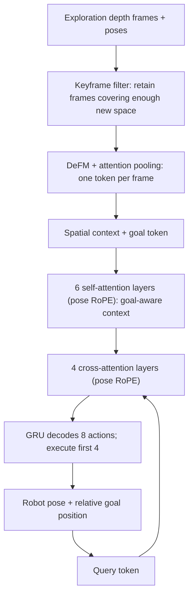

**④ Training target**

Imitate Habitat-Sim's shortest path planner on the ground truth grid and do cross-entropy on action blocks:

$$\mathcal L(\theta) = -\mathbb E\left[ \sum_{\ell=1}^{H} \log \pi_\theta\left( a_\ell^* \mid \tilde S, \tilde p_{robot}, p_{goal}, a_{1:\ell-1}^* \right) \right]$$

Among them, $\tilde S$ and $\tilde p_{robot}$ are the noise-added context pose and robot pose (±0.1 m, ±0.2 rad per axis), which are used to simulate localization errors. During training, samples that are almost straight lines (detour ratio $\kappa < 1.1$) are discarded according to probability to highlight difficult samples that need to be detoured. The model has a total of 74.3M trainable parameters, and it takes about 4 hours to train a single L40S; a single step inference takes 14 ms in a 300-frame context.

---

### 3. Results and findings
{: id="3-核心结果发现-24"}

**HM3D verification scene closed-loop navigation (2,220 episodes, three random seeds)**:

| Methods | Overall SR | Overall SPL | Distance ≥15 m SR | Distance ≥15 m SPL |
|---|---|---|---|---|
| LSTM | 31.9 | 28.5 | 5.7 | 5.1 |
| SRU | 30.3 | 27.3 | 7.8 | 7.1 |
| Causal Transformer | 90.3 | 87.3 | 80.4 | 77.4 |
| VNT-TA (Time RoPE) | 87.1 | 83.9 | 67.7 | 64.9 |
| VNT-PF (pose as input feature) | 89.5 | 86.5 | 73.6 | 70.8 |
| VNT-PA (pose only, no depth features) | 66.4 | 62.8 | 41.7 | 39.5 |
| **VNT-PA** | **93.3** | **90.4** | **85.4** | **82.0** |

- The architecture is exactly the same as VNT-TA, except for the position encoding. As the distance increases, the SPL gap expands from 4.6 to 17.1 points, indicating that the advantage comes from the pose RoPE itself.
- The success rate of the recurrent network on the episode with detour ratio $\kappa \ge 1.5$ is only about 11%, and the fixed-size hidden state cannot bear the environmental representation.
- 66.4% is achieved using poses alone (the keyframe poses themselves mark passable locations), and the rest of the improvement comes from the geometry carried by deep features

<div align="center">
  
<figcaption>
Closed-loop navigation in unseen scenes: white is the passable area, blue marks are key frame poses in the spatial context, colored solid lines are VNT-PA trajectories (corresponding from dark to bright, starting point to end point), dotted lines are expert trajectories, SPL are all above 96%
</figcaption>
</div>

Extended context **during** testing (single seed, no need for retraining): adding filtered frames (average 67 → 313 frames), or adding the current view during each query, can improve the success rate; for episodes ≥15 m, the success rate rises from 87.7% to 96.3%.

**Training efficiency**: VNT-PA reaches 80% SPL within 5,000 steps for all three seeds, while Causal Transformer, VNT-PF, and VNT-TA require more than 20,000 steps.

<div align="center">
  
<figcaption>
Closed-loop SPL (mean of three seeds ± standard deviation) at the intermediate checkpoint of each model: VNT-PA converges significantly faster
</figcaption>
</div>

**Positioning error robustness** (key frame context):

| Method | Precise pose SR | Noise pose SR |
|---|---|---|
| OctoMap + A* | 96.2 | 54.1（−42.1） |
| **VNT-PA** | 94.6 | **86.6（−8.0）** |

The explicit map will write each frame into the grid according to the noise pose, mislabeling the smooth corridor as an obstacle; the failure of VNT-PA is mostly "STOP just a little outside the success radius". OctoMap returned to 78.1% when switching to all-frame mapping, still lower than VNT-PA's 88.0%.

<div align="center">
  
<figcaption>
Aggregator attention visualization: RGB on the left (for reference only), attention overlaid on the depth map on the right. Focus on the ground in front of the corner, the open doorway and the bottom of the stairs, that is, the boundary between free space and obstacles and the topologically critical area
</figcaption>
</div>

---

### 4. Limitations
{: id="4-局限性-24"}

It only does 2D plane planning and assumes that the camera height is constant; the action is discrete, and the localization error is modeled as an independent perturbation at each step, rather than the real odometry drift accumulated along the trajectory; the task is a purely geometric PointGoal, which has not yet been connected to semantic or language features. In addition, the method requires an exploration trajectory covering the scene in advance, and the robustness comparison with OctoMap + A* only uses a single noise level.

---

# References
{: id="参考资料"}

## Paper references
{: id="论文引用"}

1. **VLFM** (2023). Vision-Language Frontier Maps for Zero-Shot Semantic Navigation. arXiv: [2312.03275](https://arxiv.org/abs/2312.03275) · ICRA 2024 · Code: [rai-opensource/vlfm](https://github.com/rai-opensource/vlfm)
2. **NoMaD** (2023). Goal-masked diffusion policy to achieve unified navigation. arXiv: [2310.07896](https://arxiv.org/abs/2310.07896) · ICRA 2024
3. **NAVCON** (2024). The first large-scale Vision-Language Navigation concept dataset for cognitive elicitation and language grounding. arXiv: [2412.13026](https://arxiv.org/abs/2412.13026)
4. **LoGoPlanner** (2025). End-to-end navigation strategies for localization grounding: "embedding" metric-scale visual geometry into planning. arXiv: [2512.19629](https://arxiv.org/abs/2512.19629) · ICRA 2026
5. **VL-Nav** (2025). Real-time zero-shot Vision-Language navigation system, integrating pixel-level vision-language features and heuristic spatial reasoning. arXiv: [2502.00931](https://arxiv.org/abs/2502.00931) · IROS 2026
6. **GaussNav** (2025). Gaussian Splatting for Visual Navigation. arXiv: [2403.11625](https://arxiv.org/abs/2403.11625) · IEEE TPAMI 2025
7. **NavDP** (2025). Navigation diffusion policy for zero-shot migration to real robots using only simulation data training. arXiv: [2505.08712](https://arxiv.org/abs/2505.08712) · ICRA 2026 · Code: [InternRobotics/NavDP](https://github.com/InternRobotics/NavDP)
8. **PanoNav** (2025). Mapless Zero-Shot Object Navigation. arXiv: [2511.06840](https://arxiv.org/abs/2511.06840) · AAAI 2026 (Poster)
9. **ODYSSEY** (2025). Open-World Quadrupeds Exploration and Manipulation for Long-Horizon Tasks. arXiv: [2508.08240](https://arxiv.org/abs/2508.08240) · AAAI 2026
10. **Skill-Nav** (2025). Enhanced Navigation with Versatile Quadrupedal Locomotion via Waypoint Interface. arXiv: [2506.21853](https://arxiv.org/abs/2506.21853) · Vicinagearth (Springer) 2025
11. **FantasyVLN** (2026). Unified multimodal Chain-of-Thought inference for vision-language navigation. arXiv: [2601.13976](https://arxiv.org/abs/2601.13976)
12. **SparseVideoNav** (2026). Sparse Video Generation Propels Real-World Beyond-the-View Vision-Language Navigation. arXiv: [2602.05827v1](https://arxiv.org/abs/2602.05827v1)
13. **WorldVLN** (2026). Autoregressive World Action model for Aerial Vision-Language Navigation. arXiv: [2605.15964](https://arxiv.org/abs/2605.15964)
14. **NavWAM** (2026). The first navigation model that integrates future prediction, value evaluation and action decision-making into a single embodied world model. arXiv: [2606.13494](https://arxiv.org/abs/2606.13494)
15. **Agentic Embodied Control** (2026). The general agent under the minimalist interface directly controls the embodied interaction loop, and the zero-shot performance is comparable to the industrial-grade training strategy. arXiv: [2607.26148](https://arxiv.org/abs/2607.26148)
16. **CONDVLN** (2026). The first vision-language navigation conditional branch diagnosis benchmark and neural symbol probe based on hierarchical 3D scene graph. arXiv: [2608.17318](https://arxiv.org/abs/2608.17318)
17. **ReMEmbR** (2024). Robot navigation question answering and physical target generation based on retrieval-enhanced long-range spatiotemporal memory. arXiv: [2409.13682](https://arxiv.org/abs/2409.13682) · ICRA 2025
18. **SuperMap** (2026). Real-time 4D spatiotemporal semantic SLAM and dynamic scene graph system for vision-language navigation. RSS 2026 · Code (to be released): [superxslam/SuperMap](https://github.com/superxslam/SuperMap)
19. **GSMem** (2026). 3D Gaussian Splatting as persistent spatial memory for embodied exploration and inference. arXiv: [2603.19137](https://arxiv.org/abs/2603.19137)
20. **Qwen-Drive** (2026). The first end-to-end autonomous driving foundation model that unifies 3D perception/question and answer/trajectory planning without changing the VLM architecture. arXiv: [2609.00111](https://arxiv.org/abs/2609.00111)
21. **CGFM-Nav** (2026). Lifelong multimodal embodied navigation by coupling explicit relational graph memory and implicit continuous semantic fields. arXiv: [2608.29114](https://arxiv.org/abs/2608.29114)
22. **CanonNav** (2026). Cross-platform visual diffusion navigation policy that decouples camera geometry and navigation behavior. arXiv: [2608.30242](https://arxiv.org/abs/2608.30242)
23. **LookStep** (2026). Efficient end-to-end vision-language navigation based on language look-ahead deduction and event-driven memory. arXiv: [2609.02350](https://arxiv.org/abs/2609.02350)
24. **NavMCP** (2026). The first long-range embodied navigation framework that scaffolds the Navigation Foundation model (NFM) into an agent actuator. arXiv: [2608.30396](https://arxiv.org/abs/2608.30396)
25. **OccPlanner** (2026). "Push" a pixel without depth back to the local 3D occupancy grid for planning. arXiv: [2608.14160](https://arxiv.org/abs/2608.14160)
26. **EgoPathBench** (2026). Press "navigation decision" into a series of numbers on the egocentric image, and leave it to the scene geometry to decide whether it is right or wrong. arXiv: [2609.16610](https://arxiv.org/abs/2609.16610)
27. **VLingNav** (2026). Embodied Navigation with Adaptive Reasoning and Visual-Assisted Linguistic Memory. arXiv: [2601.08665](https://arxiv.org/abs/2601.08665) · Project Page: [wsakobe/VLingNav-web](https://github.com/wsakobe/VLingNav-web)
28. **Hydra-Nav** (2026). Object Navigation via Adaptive Dual-Process Reasoning. arXiv: [2602.09972](https://arxiv.org/abs/2602.09972)
29. **3DGSNav** (2026). Use active 3DGS memory to enhance VLM spatial reasoning to achieve zero-shot goal navigation. arXiv: [2602.12159](https://arxiv.org/abs/2602.12159)
30. **SysNav** (2026). Multi-Level Systematic Cooperation Enables Real-World, Cross-Embodiment Object Navigation. arXiv: [2603.06914](https://arxiv.org/abs/2603.06914) · Code: [zwandering/SysNav](https://github.com/zwandering/SysNav)
31. **WAM-Nav** (2026). Asymmetric latent space "world-action" joint modeling, using a DiT to unify three types of visual navigation. arXiv: [2606.04907](https://arxiv.org/abs/2606.04907)
32. **EvoMemNav** (2026). An efficient self-evolving fine-grained topological memory framework based on lightweight graph priors and multi-view reflection in zero-shot embodied navigation. arXiv: [2606.03509v1](https://arxiv.org/abs/2606.03509v1) · Code (to be released): [caicaiya123/EvoMemNav](https://github.com/caicaiya123/EvoMemNav)
33. **LocalNav** (2026). On-device lightweight 3D scene graph goal navigation framework based on knowledge distillation and embodied reinforcement learning. arXiv: [2606.27871](https://arxiv.org/abs/2606.27871)
34. **AECNav** (2026). Rewriting "finding objects" into "accumulating evidence": one-time encoding, segmentation on demand, logarithmic probability accumulation of beliefs. arXiv: [2608.10817](https://arxiv.org/abs/2608.10817)
35. **SparseNav** (2026). Less is more: training-free VLN with semantics-aware “on demand” instruction. arXiv: [2609.26408](https://arxiv.org/abs/2609.26408)
36. **Talk2Escape** (2026). Ask when you are lost: turning multi-round conversations into a closed-loop error correction channel for VLN. arXiv: [2609.28296](https://arxiv.org/abs/2609.28296)
37. **VNT-PA** (2026). Encoding "where" rather than "when" as location: Transformer planner without explicit map. arXiv: [2609.21212](https://arxiv.org/abs/2609.21212)


<script>
(function () {
  var TAG_MAP = [
    { m: 'NAVCON',                   t: ['Datasets', 'Continuous environments', 'Discrete environments'] },
    { m: 'LoGoPlanner',              t: ['End-to-end', 'Diffusion models', 'Continuous environments', 'Real-robot deployment'] },
    { m: 'VL-Nav',                   t: ['End-to-end', 'Zero-shot', 'Real-robot deployment'] },
    { m: 'GaussNav',                 t: ['SLAM', 'Gaussian representations'] },
    { m: 'FantasyVLN',               t: ['World models', 'Data augmentation', 'Continuous environments', 'CoT'] },
    { m: 'SparseVideoNav',           t: ['End-to-end', 'Diffusion models', 'World models'] },
    { m: 'WorldVLN',                 t: ['World models', 'Reinforcement learning', 'End-to-end', 'Real-robot deployment'] },
    { m: 'NavWAM',                   t: ['World models', 'Diffusion models', 'Continuous environments', 'Real-robot deployment'] },
    { m: 'Agentic Embodied Control', t: ['Agentic', 'Zero-shot', 'Continuous environments', 'Real-robot deployment'] },
    { m: 'CONDVLN',                  t: ['Datasets', 'Continuous environments', 'Topological maps'] },
    { m: 'ReMEmbR',               t: ['Agentic', 'Real-robot deployment', 'Datasets', 'Continuous environments'] },
    { m: 'SuperMap',              t: ['SLAM', 'Topological maps', 'Zero-shot', 'Real-robot deployment', 'Agentic'] },
    { m: 'GSMem',             t: ['Agentic', 'Gaussian representations', 'Zero-shot'] },
    { m: 'Qwen-Drive',            t: ['End-to-end', 'Diffusion models', 'Reinforcement learning', 'Continuous environments'] },
    { m: 'CGFM-Nav',              t: ['Topological maps', 'Agentic', 'Zero-shot'] },
    { m: 'CanonNav',              t: ['Diffusion models', 'Continuous environments', 'Real-robot deployment'] },
    { m: 'LookStep',              t: ['End-to-end', 'Continuous environments', 'Inference optimization', 'Real-robot deployment'] },
    { m: 'NavMCP',                t: ['Agentic', 'Zero-shot', 'Real-robot deployment', 'Continuous environments'] },
    { m: 'OccPlanner',            t: ['Diffusion models', 'End-to-end', 'Data augmentation', 'Continuous environments'] },
    { m: 'NavDP',             t: ['End-to-end', 'Diffusion models', 'Continuous environments', 'Zero-shot', 'Real-robot deployment'] },
    { m: 'EgoPathBench',          t: ['Datasets', 'Zero-shot', 'CoT', 'Continuous environments'] },
    { m: 'VLingNav',          t: ['Dual systems', 'Continuous environments', 'CoT'] },
    { m: 'Hydra-Nav',         t: ['Dual systems', 'Reinforcement learning'] },
    { m: '3DGSNav',           t: ['SLAM', 'Gaussian representations', 'Zero-shot', 'Real-robot deployment'] },
    { m: 'SysNav',            t: ['Agentic', 'Topological maps'] },
        { m: 'WAM-Nav',               t: ['World models', 'Diffusion models', 'Zero-shot', 'Real-robot deployment'] },
        { m: 'EvoMemNav',             t: ['Agentic', 'Topological maps', 'Zero-shot'] },
        { m: 'LocalNav',              t: ['Topological maps', 'Reinforcement learning', 'Real-robot deployment', 'Inference optimization'] },
    { m: 'AECNav',                t: ['Zero-shot', 'Agentic', 'Real-robot deployment', 'Inference optimization'] },
    { m: 'PanoNav',           t: ['Agentic', 'Zero-shot', 'Discrete environments'] },
    { m: 'ODYSSEY',           t: ['Agentic', 'Real-robot deployment'] },
    { m: 'Skill-Nav',         t: ['End-to-end', 'Reinforcement learning', 'Real-robot deployment'] },
    { m: 'VLFM',              t: ['SLAM', 'Zero-shot', 'Real-robot deployment'] },
    { m: 'NoMaD',             t: ['End-to-end', 'Diffusion models', 'Zero-shot', 'Real-robot deployment'] },
    { m: 'SparseNav',             t: ['Agentic', 'Zero-shot', 'Continuous environments', 'Real-robot deployment'] },
    { m: 'Talk2Escape',           t: ['Agentic', 'Zero-shot', 'Continuous environments', 'Real-robot deployment'] },
    { m: 'VNT-PA',                t: ['End-to-end', 'Continuous environments'] },
  ];


  var REMOTE_PAGE = { url: '/en/VLN-Papers/', label: 'Instruction-following collection' };
  var REMOTE_PAPERS = [
    { n: '1. R2R (2018)', a: 'r2r', t: ['Discrete environments', 'Datasets'] },
    { n: '2. VLN-CE (2020)', a: 'vln-ce', t: ['Datasets', 'Continuous environments', 'Foundational work'] },
    { n: '3. DUET (2022)', a: 'duet', t: ['Topological maps', 'End-to-end', 'Discrete environments'] },
    { n: '4. R2RIE-CE & IEDL (2024)', a: 'r2rie-ce-iedl', t: ['Continuous environments', 'Datasets'] },
    { n: '5. NaVid (2024)', a: 'navid', t: ['End-to-end', 'Continuous environments', 'Real-robot deployment', 'Zero-shot'] },
    { n: '6. NavGPT-2 (2024)', a: 'navgpt-2', t: ['Agentic', 'Topological maps', 'Discrete environments', 'CoT'] },
    { n: '7. DualVLN/InternVLN (2025)', a: 'dualvln', t: ['Dual systems', 'Diffusion models', 'Continuous environments', 'Real-robot deployment'] },
    { n: '8. VLN-R1 (2025)', a: 'vln-r1', t: ['End-to-end', 'Reinforcement learning', 'Continuous environments'] },
    { n: '9. StreamVLN (2025)', a: 'streamvln', t: ['End-to-end', 'Inference optimization', 'Continuous environments', 'Real-robot deployment'] },
    { n: '10. NavFoM (2025)', a: 'navfom', t: ['End-to-end', 'Continuous environments'] },
    { n: '11. MapNav (2025)', a: 'mapnav', t: ['Topological maps', 'SLAM', 'Inference optimization', 'Continuous environments'] },
    { n: '12. Open-Nav (2025)', a: 'open-nav', t: ['Agentic', 'Zero-shot', 'Continuous environments'] },
    { n: '13. VLN-Imagine (2025)', a: 'vln-imagine', t: ['Data augmentation', 'Discrete environments'] },
    { n: '14. VLN-PE (2025)', a: 'vln-pe', t: ['Datasets', 'Continuous environments', 'Foundational work'] },
    { n: '15. Goal2Pixel (2025)', a: 'goal2pixel', t: ['End-to-end', 'Continuous environments', 'Real-robot deployment', 'Inference optimization'] },
    { n: '16. AstraNav-World (2025)', a: 'astranav-world', t: ['World models', 'Diffusion models', 'End-to-end', 'Continuous environments', 'Real-robot deployment'] },
    { n: '17. CorrectNav (2025)', a: 'correctnav', t: ['End-to-end', 'Continuous environments', 'Real-robot deployment'] },
    { n: '18. Slow4fast-VLN (2026)', a: 'slow4fast-vln', t: ['Dual systems', 'Topological maps', 'Discrete environments'] },
    { n: '19. DGNav (2026)', a: 'dgnav', t: ['Topological maps', 'SLAM', 'Continuous environments'] },
    { n: '20. CausalNav (2026)', a: 'causalnav', t: ['Agentic', 'Topological maps'] },
    { n: '21. AgentVLN (2026)', a: 'agentvln', t: ['Agentic', 'Continuous environments', 'Real-robot deployment'] },
    { n: '22. VLN-Cache (2026)', a: 'vln-cache', t: ['Inference optimization'] },
    { n: '23. R³: Run, Ruminate, and Regulate (2026)', a: 'r3', t: ['Dual systems', 'Inference optimization', 'CoT'] },
    { n: '24. AwareVLN (2026)', a: 'awarevln', t: ['End-to-end', 'Continuous environments', 'Real-robot deployment', 'Data augmentation', 'CoT'] },
    { n: '25. Dual-Anchoring (2026)', a: 'dual-anchoring', t: ['End-to-end', 'World models', 'Continuous environments', 'Real-robot deployment'] },
    { n: '26. JanusVLN (2026)', a: 'janusvln', t: ['Dual systems', 'Continuous environments', 'Real-robot deployment', 'Inference optimization'] },
    { n: '27. HSGM (2026)', a: 'hsgm', t: ['Agentic', 'Topological maps', 'Zero-shot', 'Continuous environments', 'BEV'] },
    { n: '28. OneVLA (2026)', a: 'onevla-a-unified-framework-for-embodied-tasks', t: ['End-to-end', 'Diffusion models', 'Continuous environments', 'Real-robot deployment'] },
    { n: '29. CA-VLN (2026)', a: 'ca-vln', t: ['Agentic', 'Topological maps', 'Discrete environments'] },
    { n: '30. RynnBrain (2026)', a: 'rynnbrain', t: ['Foundational work'] },
    { n: '31. OmniNav (2026)', a: 'omninav', t: ['Dual systems', 'Agentic', 'CoT', 'Diffusion models', 'Real-robot deployment'] },
    { n: '32. Qwen-RobotNav (2026)', a: 'qwen-robotnav', t: ['Agentic', 'End-to-end', 'Continuous environments', 'Real-robot deployment'] },
    { n: '33. GA-VLN (2026)', a: 'ga-vln', t: ['End-to-end', 'Continuous environments', 'Real-robot deployment', 'Inference optimization', 'BEV'] },
    { n: '34. SEDualVLN (2026)', a: 'sedualvln', t: ['Dual systems', 'Agentic', 'Continuous environments'] },
    { n: '35. Robostral Navigate (2026)', a: 'robostral-navigate', t: ['End-to-end', 'Reinforcement learning', 'Continuous environments', 'Inference optimization'] },
    { n: '36. ABot-N1 (2026)', a: 'abot-n1', t: ['Dual systems', 'CoT', 'Reinforcement learning', 'Real-robot deployment', 'Datasets'] },
    { n: '37. ReflectVLN (2026)', a: 'reflectvln', t: ['Dual systems', 'Agentic', 'CoT', 'Continuous environments'] },
    { n: '38. TuckerNav (2026)', a: 'tuckernav', t: ['Continuous environments', 'Inference optimization'] },
    { n: '39. AgenticNav (2026)', a: 'agenticnav', t: ['Agentic', 'Zero-shot', 'Continuous environments', 'Real-robot deployment'] },
    { n: '40. MemVLN (2026)', a: 'memvln', t: ['End-to-end', 'Continuous environments', 'Inference optimization'] },
    { n: '41. X-NavDP (2026)', a: 'x-navdp', t: ['Diffusion models', 'Reinforcement learning', 'Continuous environments', 'Real-robot deployment'] },
    { n: '42. Image2Sim (2026)', a: 'image2sim', t: ['World models', 'Data augmentation', 'Gaussian representations', 'Continuous environments', 'Real-robot deployment', 'Zero-shot'] },
    { n: '43. DecoVLN (2026)', a: 'decovln', t: ['End-to-end', 'Continuous environments', 'Real-robot deployment', 'Inference optimization', 'Error correction'] },
    { n: '44. TAMP-Nav (2026)', a: 'tamp-nav', t: ['CoT', 'Reinforcement learning', 'Continuous environments', 'Real-robot deployment'] },
    { n: '45. LightNav-0 (2026)', a: 'lightnav-0', t: ['End-to-end', 'Continuous environments', 'Real-robot deployment', 'Reinforcement learning', 'Zero-shot', 'CoT', 'Datasets'] },
    { n: '46. Uncertainty-Aware Gaussian Map for VLN (2026)', a: 'uncertainty-aware-gaussian-map', t: ['Gaussian representations', 'Topological maps', 'Discrete environments'] },
    { n: '47. HarnessVLN (2026)', a: 'harnessvln', t: ['Agentic', 'Zero-shot', 'Real-robot deployment', 'Topological maps'] },
    { n: '48. GroundingVLN (2026)', a: 'groundingvln', t: ['Dual systems', 'CoT', 'Reinforcement learning', 'Continuous environments', 'Real-robot deployment', 'Datasets'] },
    { n: '49. GPT-6-Astra (2026)', a: 'gpt-6-astra', t: ['Agentic', 'Zero-shot', 'Continuous environments'] },
    { n: '50. BudVLN (2026)', a: 'budvln', t: ['End-to-end', 'Reinforcement learning', 'Continuous environments'] },
    { n: '51. Route2Step (2026)', a: 'route2step', t: ['Dual systems', 'Continuous environments', 'Real-robot deployment'] },
    { n: '52. PROSPECT (2026)', a: 'prospect', t: ['End-to-end', 'World models', 'Continuous environments', 'Real-robot deployment'] },
    { n: '53. MacroAction-VLN (2026)', a: 'macroaction-vln', t: ['Topological maps', 'Reinforcement learning', 'Continuous environments'] },
    { n: '54. HumanoidVLN (2026)', a: 'humanoidvln', t: ['Datasets', 'Reinforcement learning', 'Real-robot deployment', 'Gaussian representations'] },
    { n: '55. AdaGeoVLN (2026)', a: 'adageovln', t: ['End-to-end', 'Continuous environments', 'Real-robot deployment', 'Inference optimization'] },
  ];

  var ALL_TAGS = ['Dual systems', 'End-to-end', 'Agentic', 'CoT', 'Diffusion models', 'Topological maps', 'SLAM', 'Gaussian representations',
                  'Reinforcement learning', 'Zero-shot', 'World models', 'Data augmentation',
                  'Continuous environments', 'Discrete environments', 'Real-robot deployment', 'Inference optimization', 'Datasets', 'Foundational work', 'BEV'];

  var activeTags = [];
  var resultsPanel = null;

  function getTagsForTitle(text) {
    for (var i = 0; i < TAG_MAP.length; i++) {
      if (text.indexOf(TAG_MAP[i].m) !== -1) return TAG_MAP[i].t;
    }
    return null;
  }

  function toggleTag(tag) {
    var idx = activeTags.indexOf(tag);
    if (idx === -1) activeTags.push(tag);
    else activeTags.splice(idx, 1);
    updateFilter();
  }

  // AND logic: paper must have ALL selected tags
  function sectionMatches(sectionTags) {
    return activeTags.every(function (t) {
      return sectionTags.indexOf(t) !== -1;
    });
  }

  function updateFilter() {
    var sections = document.querySelectorAll('.paper-section');
    var bar = document.getElementById('paper-filter-bar');
    var matchedSections = [];

    // Update button active states
    bar.querySelectorAll('.filter-btn').forEach(function (btn) {
      var t = btn.getAttribute('data-tag');
      if (t === '__all__') {
        btn.classList.toggle('active', activeTags.length === 0);
      } else {
        btn.classList.toggle('active', activeTags.indexOf(t) !== -1);
      }
    });

    // Show/hide sections (AND logic)
    sections.forEach(function (s) {
      var sectionTags = s.getAttribute('data-tags').split(',');
      var visible = activeTags.length === 0 || sectionMatches(sectionTags);
      s.classList.toggle('hidden', !visible);
      if (visible) matchedSections.push(s);
    });

    var matchedRemote = REMOTE_PAPERS.filter(function (p) {
      return activeTags.length === 0 || sectionMatches(p.t);
    });

    var totalAll = sections.length + REMOTE_PAPERS.length;
    var matchedAll = matchedSections.length + matchedRemote.length;
    var countEl = bar.querySelector('.filter-count');
    if (countEl) {
      countEl.textContent = activeTags.length === 0
        ? 'Total: ' + totalAll + ' papers'
        : matchedAll + ' / ' + totalAll + ' papers';
    }

    // Update results panel
    updateResultsPanel(matchedSections, matchedRemote);
  }

  function updateResultsPanel(matchedSections, matchedRemote) {
    if (!resultsPanel) return;
    if (activeTags.length === 0) {
      resultsPanel.style.display = 'none';
      return;
    }
    resultsPanel.style.display = 'block';
    var list = resultsPanel.querySelector('.results-list');
    list.innerHTML = '';

    matchedSections.forEach(function (s) {
      var h2 = s.querySelector('h2');
      if (!h2) return;
      var li = document.createElement('li');
      var a = document.createElement('a');
      a.href = '#' + h2.id;

      a.textContent = h2.textContent.trim().replace(/#$/, '').trim();
      li.appendChild(a);
      list.appendChild(li);
    });

    matchedRemote.forEach(function (p) {
      var li = document.createElement('li');
      li.className = 'results-remote';
      var a = document.createElement('a');
      a.href = REMOTE_PAGE.url + '#' + p.a;
      a.textContent = p.n;
      li.appendChild(a);
      var badge = document.createElement('span');
      badge.className = 'results-badge';
      badge.textContent = REMOTE_PAGE.label;
      li.appendChild(badge);
      list.appendChild(li);
    });
  }

  function buildFilterBar() {
    var bar = document.getElementById('paper-filter-bar');
    if (!bar) return;

    var label = document.createElement('span');
    label.className = 'filter-label';
    label.textContent = 'Filter: ';
    bar.appendChild(label);

    var allBtn = document.createElement('button');
    allBtn.className = 'filter-btn active';
    allBtn.setAttribute('data-tag', '__all__');
    allBtn.textContent = 'All';
    allBtn.addEventListener('click', function () {
      activeTags = [];
      updateFilter();
    });
    bar.appendChild(allBtn);

    ALL_TAGS.forEach(function (tag) {
      var btn = document.createElement('button');
      btn.className = 'filter-btn';
      btn.setAttribute('data-tag', tag);
      btn.textContent = tag;
      btn.addEventListener('click', function () { toggleTag(tag); });
      bar.appendChild(btn);
    });

    var count = document.createElement('span');
    count.className = 'filter-count';
    bar.appendChild(count);

    // Results panel injected right after filter bar
    resultsPanel = document.createElement('div');
    resultsPanel.className = 'paper-filter-results';
    resultsPanel.style.display = 'none';
    var rLabel = document.createElement('span');
    rLabel.className = 'results-label';
    rLabel.textContent = 'Matching papers: ';
    var rList = document.createElement('ul');
    rList.className = 'results-list';
    resultsPanel.appendChild(rLabel);
    resultsPanel.appendChild(rList);
    bar.insertAdjacentElement('afterend', resultsPanel);
  }

  function wrapSections() {
    var entry = document.querySelector('.entry');
    if (!entry) return;

    var children = Array.from(entry.childNodes);
    var newChildren = [];
    var wrapper = null;

    children.forEach(function (node) {
      var isEl = node.nodeType === 1;
      var tagName = isEl ? node.tagName : null;

      if (tagName === 'H1') {
        if (wrapper) { newChildren.push(wrapper); wrapper = null; }
        newChildren.push(node);
      } else if (tagName === 'H2') {
        if (wrapper) { newChildren.push(wrapper); wrapper = null; }


        var paperTags = /^\s*\d+\.\s/.test(node.textContent) ? getTagsForTitle(node.textContent) : null;
        if (paperTags) {
          wrapper = document.createElement('div');
          wrapper.className = 'paper-section';
          wrapper.setAttribute('data-tags', paperTags.join(','));
          wrapper.appendChild(node);
          var row = document.createElement('div');
          row.className = 'paper-tags-row';
          paperTags.forEach(function (t) {
            var span = document.createElement('span');
            span.className = 'paper-tag';
            span.textContent = t;
            span.addEventListener('click', function () { toggleTag(t); });
            row.appendChild(span);
          });
          wrapper.appendChild(row);
        } else {
          newChildren.push(node);
        }
      } else {
        if (wrapper) wrapper.appendChild(node);
        else newChildren.push(node);
      }
    });

    if (wrapper) newChildren.push(wrapper);

    while (entry.firstChild) entry.removeChild(entry.firstChild);
    newChildren.forEach(function (n) { entry.appendChild(n); });
  }

  document.addEventListener('DOMContentLoaded', function () {
    wrapSections();
    buildFilterBar();
    updateFilter();
  });
})();
</script>


<!-- Background image prefetch after page load. -->
<script>
(function () {
  var CONCURRENCY = 3;

  function prefetchAll() {

    var conn = navigator.connection;
    if (conn && (conn.saveData || /(^|-)2g$/.test(conn.effectiveType || ''))) return;

    var nodes = document.querySelectorAll('img[loading="lazy"]');
    var urls = [], seen = {};
    for (var i = 0; i < nodes.length; i++) {
      var u = nodes[i].src;
      if (u && !seen[u]) { seen[u] = 1; urls.push(u); }
    }
    if (!urls.length) return;

    var next = 0;
    function pump() {
      if (next >= urls.length) return;
      var probe = new Image();
      probe.onload = probe.onerror = pump;
      probe.src = urls[next++];
    }
    for (var k = 0; k < CONCURRENCY && k < urls.length; k++) pump();
  }

  function schedule() {
    if (window.requestIdleCallback) requestIdleCallback(prefetchAll, { timeout: 2000 });
    else setTimeout(prefetchAll, 500);
  }

  if (document.readyState === 'complete') schedule();
  else window.addEventListener('load', schedule);
})();
</script>

<script src="/js/leaderboard.js"></script>
