> This collection accompanies the [VLN survey](/en/VLN-Survey/) with detailed readings on instruction-following navigation and its supporting foundations.
>
> It covers 56 representative methods, benchmarks, and foundational works. Goal navigation, locomotion, mobile manipulation, and additional studies appear in the [extended collection](/en/VLN-Papers-Extended/). The collections are organized by research focus and reading sequence; publication status is not the sole criterion.

<div id="paper-filter-bar" class="paper-filter-bar"></div>

# Performance leaderboards
{: id="性能排行榜"}

> ⚠️ **Do not compare scores across different benchmarks.** This page groups instruction-following results by benchmark: ① R2R-CE and ② RxR-CE use continuous environments with step-by-step first-person control; ③ R2R / REVERIE use panoramic decisions on discrete navigation graphs. Task definitions and sensor configurations differ, so SR is not comparable across these tables. ObjectNav, HM3D-OVON, image-goal, and point-goal results are in the extended collection's [goal-navigation leaderboards](/en/VLN-Papers-Extended/#goal-nav-leaderboard).
>
> **Reading the tables:** **Trained** means trained or fine-tuned on navigation data, including navigation foundation models evaluated through cross-task zero-shot transfer. **Training-free** means no navigation model is trained: the system combines existing large models, detection or segmentation models, and rules or planners. Calling a pretrained low-level point-goal controller does not change this classification. Gray rows use nonstandard protocols, such as validation subsets, and are excluded from best-value bolding. Bold values are the best among non-gray rows within the same benchmark. The filters select paradigm, input configuration, and open-source availability, and can hide gray rows.

<div id="lb-filter-bar" class="lb-filter-bar"></div>

## ① R2R-CE
{: id="-r2r-ce"}

Continuous environment · English commands · val-unseen (1839 items in total)

|Model|Year|Paradigm|Base model|SR ↑|SPL ↑|NE ↓|OSR ↑|Open source|
|:-----|:----:|:----:|:----:|:----:|:----:|:----:|:----:|:----:|
|[GPT-6-Astra (monocular · ultra)](#gpt-6-astra) <span class="lb-flag">100 subset </span>|2026|Training-free|GPT-6-Astra|81.3|71.5|2.9|83.7|No|
|[Robostral Navigate (monocular)](#robostral-navigate)|2026|Trained|Mistral-8B|**77.4**|**74.2**|**3.20**|**81.3**|No|
|[GPT-6-Astra (monocular · medium)](#gpt-6-astra) <span class="lb-flag">100 subset </span>|2026|Training-free|GPT-6-Astra|75.7|65.6|3.0|80.7|No|
|[Qwen-RobotNav (panoramic)](#qwen-robotnav)|2026|Trained|Qwen3-VL-8B|72.1|66.6|3.53|78.5|No|
|[Talk2Escape + GTA (four views)](/en/VLN-Papers-Extended/#talk2escape) <span class="lb-flag">100 subset</span>|2026|Training-free|Gemini 3.1 Pro|72.0|49.4|4.80|66.0|No|
|[ABot-N1 (three cameras)](#abot-n1)|2026|Trained|Qwen-3.5-4B + 2B|70.9|67.5|3.32|75.2|No|
|[Image2Nav (180° FOV)](#image2sim)|2026|Trained|Qwen3-VL-4B|70.3|65.6|3.71|76.1|[YES](https://github.com/MrZihan/Image2Sim)|
|[GroundingVLN (three cameras)](#groundingvln)|2026|Trained|Qwen3.5-4B|69.9|64.1|3.66|74.8|No|
|[OmniNav (multi-view)](#omninav)|2026|Trained|Qwen2.5-VL-3B|69.5|66.1|3.74|74.6|[is](https://github.com/amap-cvlab/OmniNav)|
|[LightNav-0 (monocular)](#lightnav-0)|2026|Trained|Qwen3-VL-4B|68.5|62.8|3.91|73.7|[is](https://github.com/lightorigins/LightNav-0)|
|[AstraNav-World (multi-view)](#astranav-world)|2025|Trained|Qwen2.5-VL-3B|67.9|65.4|3.86|73.9|[is](https://github.com/amap-cvlab/AstraNav-World)|
|[SeekVLN (monocular, three views on demand)](#seekvln)|2026|Trained|Aux-Think / NVILA-lite-8B|67.5|61.4|3.7|75.2|No|
|[SEDualVLN (monocular)](#sedualvln)|2026|Trained|LLaVA-Video-7B|67.3|62.5|3.75|73.7|No|
|[AgentVLN (monocular)](#agentvln)|2026|Trained|Qwen2.5-VL-3B|67.2|64.7|3.88|73.5|[Yes](https://github.com/Allenxinn/AgentVLN)|
|[Qwen-RobotNav (monocular)](#qwen-robotnav)|2026|Trained|Qwen3-VL-4B|66.9|60.5|4.22|73.6|No|
|[TAMP-Nav (multi-view)](#tamp-nav)|2026|Trained|Qwen2.5-VL-7B|66.2|58.8|3.85|74.5|[is](https://github.com/ZJU-OmniAI/Embodied-Omni)|
|[Dual-Anchoring (monocular)](#dual-anchoring)|2026|Trained|LLaVA-Video-7B|65.6|62.1|–|–|No|
|[AwareVLN (monocular)](#awarevln)|2026|Trained|Vicuna-7B|65.4|55.1|4.02|73.5|[Yes](https://github.com/GWxuan/AwareVLN)|
|[CorrectNav (monocular)](#correctnav)|2025|Trained|–|65.1|62.3|4.24|67.5|[Yes](https://github.com/owlet914/CorrectNav)|
|[DualVLN (monocular)](#dualvln)|2025|Trained|Qwen2.5-VL-7B|64.3|58.5|4.05|70.7|[Yes](https://github.com/InternRobotics/InternNav)|
|[Talk2Escape + NavGPT (four views)](/en/VLN-Papers-Extended/#talk2escape) <span class="lb-flag">100 subset</span>|2026|Training-free|Gemini 3.1 Pro|64.0|46.4|4.84|60.0|No|
|[VLN-Cache (monocular)](#vln-cache)|2026|Trained|Qwen2.5-VL-7B|63.1|57.6|–|–|No|
|[ReflectVLN (monocular)](#reflectvln)|2026|Trained|Qwen2.5-VL-3B|62.8|58.5|4.19|67.3|No|
|[NavFoM (multi-view)](#navfom)|2025|Trained|Qwen2-7B|61.7|55.3|4.61|72.1|No|
|[GA-VLN (monocular)](#ga-vln)|2026|Trained|LLaVA-Video-7B|61.0|55.2|4.80|67.6|[is](https://github.com/jahhaoyang/GA-VLN)|
|[HarnessVLN (monocular)](#harnessvln)|2026|Training-free|GPT-5.5|60.8|43.5|4.01|72.7|No|
|[JanusVLN (monocular)](#janusvln)|2026|Trained|Janus-Pro-7B|60.5|56.8|4.78|65.2|[Yes](https://github.com/MIV-XJTU/JanusVLN)|
|[RynnBrain-Nav (monocular)](#rynnbrain)|2026|Trained|–|58.6|49.6|4.92|71.6|[Yes](https://github.com/alibaba-damo-academy/RynnBrain)|
|[DGNav (panoramic)](#dgnav)|2026|Trained|–|58.56|50.08|4.66|64.82|[is](https://github.com/shannanshouyin/DGNav)|
|[MemVLN-8B (monocular)](#memvln)|2026|Trained|Qwen3-VL-8B|58.4|51.2|4.98|65.3|No|
|[BudVLN (monocular)](#budvln)|2026|Trained|LLaVA-1.5-7B|57.6|51.1|–|–|No|
|[StreamVLN (monocular)](#streamvln)|2025|Trained|LLaVA-Video-7B|56.4|50.2|4.90|63.6|[is](https://github.com/OpenRobotLab/StreamVLN)|
|[DecoVLN (monocular)](#decovln)|2026|Trained|LLaVA-Video-7B|56.3|50.5|5.01|63.5|No|
|[AgenticNav (panoramic)](#agenticnav) <span class="lb-flag">100 subset</span>|2026|Training-free|GPT-5.5|55.0|48.41|5.19|65.0|No|
|[Goal2Pixel (monocular)](#goal2pixel)|2025|Trained|LLaVA-1.5-7B|54.1|52.5|4.85|59.9|No|
|[HSGM (monocular)](#hsgm)|2026|Training-free|–|47.9|32.8|5.42|58.7|[Yes](https://github.com/Teacher-Tom/HSGM_public)|
|[SparseNav (monocular)](/en/VLN-Papers-Extended/#sparsenav)|2026|Training-free|GPT-5|42.8|35.2|5.96|53.4|No|
|[MapNav (monocular)](#mapnav)|2025|Trained|LLaVA-Onevision-7B|39.7|37.2|5.43|53.0|[is](https://github.com/linglingxiansen/MapNav)|
|[NaVid (monocular)](#navid)|2024|Trained|–|37.4|35.9|5.47|49.1|[is](https://github.com/jzhzhang/NaVid-VLN-CE)|
|[VLN-R1 (monocular)](#vln-r1)|2025|Trained|Qwen2-VL-7B|30.2|21.8|7.0|41.2|No|
|[VLN-R1 (monocular)](#vln-r1)|2025|Trained|Qwen2-VL-2B|25.6|20.5|10.2|37.5|No|
|[OneVLA (monocular)](#onevla-a-unified-framework-for-embodied-tasks)|2026|Trained|Qwen2.5-VL-3B|–|–|–|68.6|[Yes](https://github.com/linglingxiansen/OneVLA)|

Note: NavFoM is the result of four views (single viewing angle is SR 56.2 / SPL 51.2); DGNav follows the panoramic RGB-D input of ETPNav; DualVLN and StreamVLN are single viewing angle comparisons of the same evaluation protocol; VLN-Cache is an acceleration solution for DualVLN, which is almost lossless (baseline 64.3 / 58.5).

StreamVLN takes the StreamVLN† number of arXiv v2 (ICRA 2026 version) (using additional data such as ScaleVLN subset), v1 is 56.9 / 51.9, and other papers mostly quote v1 numbers as baselines.

Qwen-RobotNav takes arXiv v3: the panoramic row is 8B (base Qwen3-VL-8B), and the monocular row is 4B (monocular 4B's 66.9 is higher than 8B's 65.7; 8B monocular is 65.7 / 59.6).

The gray GPT-6-Astra and AgenticNav three lines are only evaluated on R2R-CE-100: these are 100 episodes (covering 10 scenes) fixedly extracted by Open-Nav from val-unseen. The training-free method generally only reports this subset to control the cost of large model calls. 1 episode is 1 percentage point.

When the SR is around 81%, the standard error is about 4 points (95% interval is about 73-89), and when the total number is 1839, it is about 1 point; GPT-6-Astra takes the mean of three runs of arXiv v2 (v1 is a single 79.0 / 76.0), and the standard deviation of the three runs is only 1.5-2.5 points, which only reflect fluctuations between runs and do not include the sampling error of the 100 tasks themselves.

These rows are arranged in the table according to SR and are not bolded. They are only for reference when compared with the total rows.

## ② RxR-CE
{: id="-rxr-ce"}

Continuous environment · Multilingual commands (English/Hindi/Telugu) · val-unseen

|Model|Year|Paradigm|Base model|SR ↑|SPL ↑|NE ↓|OSR ↑|Open source|
|:-----|:----:|:----:|:----:|:----:|:----:|:----:|:----:|:----:|
|[Qwen-RobotNav (panoramic)](#qwen-robotnav)|2026|Trained|Qwen3-VL-8B|**76.5**|65.7|3.58|–|No|
|[Robostral Navigate (monocular)](#robostral-navigate)|2026|Trained|Mistral-8B|75.1|**68.7**|3.47|–|No|
|[GroundingVLN (three cameras)](#groundingvln)|2026|Trained|Qwen3.5-4B|75.1|62.0|3.54|–|No|
|[ABot-N1 (three cameras)](#abot-n1)|2026|Trained|Qwen-3.5-4B + 2B|73.9|63.9|**3.13**|–|No|
|[OmniNav (multi-view)](#omninav)|2026|Trained|Qwen2.5-VL-3B|73.6|62.0|3.77|–|[is](https://github.com/amap-cvlab/OmniNav)|
|[LightNav-0 (monocular)](#lightnav-0)|2026|Trained|Qwen3-VL-4B|73.6|64.5|3.66|–|[is](https://github.com/lightorigins/LightNav-0)|
|[Qwen-RobotNav (monocular)](#qwen-robotnav)|2026|Trained|Qwen3-VL-8B|73.4|63.5|4.16|–|No|
|[AstraNav-World (multi-view)](#astranav-world)|2025|Trained|Qwen2.5-VL-3B|72.9|61.5|3.82|–|[is](https://github.com/amap-cvlab/AstraNav-World)|
|[Image2Nav (180° FOV)](#image2sim)|2026|Trained|Qwen3-VL-4B|70.7|59.1|3.74|–|[YES](https://github.com/MrZihan/Image2Sim)|
|[AgentVLN (monocular)](#agentvln)|2026|Trained|Qwen2.5-VL-3B|69.5|61.3|3.92|–|[is](https://github.com/Allenxinn/AgentVLN)|
|[CorrectNav (monocular)](#correctnav)|2025|Trained|–|69.3|63.3|4.09|–|[is](https://github.com/owlet914/CorrectNav)|
|[AwareVLN (monocular)](#awarevln)|2026|Trained|Vicuna-7B|67.6|56.1|3.95|–|[Yes](https://github.com/GWxuan/AwareVLN)|
|[MemVLN-4B (monocular)](#memvln)|2026|Trained|Qwen3-VL-4B|66.5|57.4|4.22|–|No|
|[ReflectVLN (monocular)](#reflectvln)|2026|Trained|Qwen2.5-VL-3B|66.0|57.2|3.98|–|No|
|[TAMP-Nav (multi-view)](#tamp-nav)|2026|Trained|Qwen2.5-VL-7B|65.7|56.9|4.32|–|[is](https://github.com/ZJU-OmniAI/Embodied-Omni)|
|[NavFoM (multi-view)](#navfom)|2025|Trained|Qwen2-7B|64.4|56.2|4.74|–|No|
|[SEDualVLN (monocular)](#sedualvln)|2026|Trained|LLaVA-Video-7B|63.9|52.4|4.12|–|No|
|[Talk2Escape + GTA (four views)](/en/VLN-Papers-Extended/#talk2escape) <span class="lb-flag">260 subset</span>|2026|Training-free|Gemini 3.1 Pro|62.9|34.2|5.89|–|No|
|[Dual-Anchoring (monocular)](#dual-anchoring)|2026|Trained|LLaVA-Video-7B|61.7|53.3|–|–|No|
|[DualVLN (monocular)](#dualvln)|2025|Trained|Qwen2.5-VL-7B|61.4|51.8|4.58|–|[is](https://github.com/InternRobotics/InternNav)|
|[SeekVLN (monocular, three views on demand)](#seekvln)|2026|Trained|Aux-Think / NVILA-lite-8B|59.7|50.3|4.9|–|No|
|[JanusVLN (monocular)](#janusvln)|2026|Trained|Janus-Pro-7B|56.2|47.5|6.06|–|[Yes](https://github.com/MIV-XJTU/JanusVLN)|
|[RynnBrain-Nav (monocular)](#rynnbrain)|2026|Trained|–|56.1|49.6|6.20|–|[Yes](https://github.com/alibaba-damo-academy/RynnBrain)|
|[GA-VLN (monocular)](#ga-vln)|2026|Trained|LLaVA-Video-7B|55.4|45.2|5.88|**67.0**|[Yes](https://github.com/jahhaoyang/GA-VLN)|
|[StreamVLN (monocular)](#streamvln)|2025|Trained|LLaVA-Video-7B|54.4|45.4|5.65|–|[is](https://github.com/OpenRobotLab/StreamVLN)|
|[DecoVLN (monocular)](#decovln)|2026|Trained|LLaVA-Video-7B|54.2|46.3|5.73|–|No|
|[HarnessVLN (monocular)](#harnessvln)|2026|Training-free|GPT-5.5|53.9|38.0|6.42|–|No|
|[DGNav (panoramic)](#dgnav)|2026|Trained|–|53.78|44.37|6.00|–|[is](https://github.com/shannanshouyin/DGNav)|
|[Talk2Escape + NavGPT (four views)](/en/VLN-Papers-Extended/#talk2escape) <span class="lb-flag">260 subset</span>|2026|Training-free|Gemini 3.1 Pro|50.4|27.2|6.01|–|No|
|[Goal2Pixel (monocular)](#goal2pixel)|2025|Trained|LLaVA-1.5-7B|43.8|40.4|7.50|–|No|
|[HSGM (monocular)](#hsgm)|2026|Training-free|–|41.8|25.1|7.43|–|[Yes](https://github.com/Teacher-Tom/HSGM_public)|
|[SparseNav (monocular)](/en/VLN-Papers-Extended/#sparsenav)|2026|Training-free|GPT-5|40.7|24.1|7.82|–|No|
|[MapNav (monocular)](#mapnav)|2025|Trained|LLaVA-Onevision-7B|32.6|27.7|7.62|–|[is](https://github.com/linglingxiansen/MapNav)|
|[NaVid (monocular)](#navid)|2024|Trained|–|23.8|21.2|8.41|34.5|[Yes](https://github.com/jzhzhang/NaVid-VLN-CE)|
|[VLN-R1 (monocular)](#vln-r1)|2025|Trained|Qwen2-VL-7B|22.7|17.6|9.1|30.4|No|
|[VLN-R1 (monocular)](#vln-r1)|2025|Trained|Qwen2-VL-2B|20.7|16.9|10.2|30.1|No|
|[OneVLA (monocular)](#onevla-a-unified-framework-for-embodied-tasks)|2026|Trained|Qwen2.5-VL-3B|–|–|–|58.2|[Yes](https://github.com/linglingxiansen/OneVLA)|

Note: StreamVLN takes arXiv v2 numbers (v1 is 52.9 / 46.0); the comparison between Dual-Anchoring and StreamVLN baseline (52.9%) comes from the original Dual-Anchoring article. Both lines of Qwen-RobotNav are 8B (73.4 for 8B under monocular is higher than 71.3 for 4B).

## ③ R2R · REVERIE
{: id="-r2r--reverie"}

Discrete navigation graph · panoramic observation; residential (ID) / non-residential (OOD) scene division with GSA-R2R

|Model|Year|Baseline|Paradigm|Base model|SR ↑|SPL ↑|NE ↓|OSR ↑|Open source|
|:-----|:----:|:----:|:----:|:----:|:----:|:----:|:----:|:----:|:----:|
|[UAGM (panoramic)](#uncertainty-aware-gaussian-map)|2026|R2R|Trained|–|**78.3**|**66**|–|–|No|
|[R³ (panoramic)](#r3)|2026|R2R|Trained|GPT-4o|77|**66**|**2.76**|–|No|
|[CA-VLN (panoramic)](#ca-vln)|2026|R2R|Trained|LLaVA-7B|73.3|62.0|3.03|–|No|
|[VLN-Imagine (DUET) (panoramic)](#vln-imagine)|2025|R2R|Trained|–|72.12|60.48|3.19|–|[Yes](https://github.com/akhilperincherry/VLN-Imagine)|
|[NavGPT-2 (panoramic)](#navgpt-2)|2024|R2R|Trained|Vicuna-7B|71|60|3.18|80|[is](https://github.com/GengzeZhou/NavGPT-2)|
|[DUET (panoramic)](#duet)|2022|R2R (Test-Unseen)|Trained|–|**69.0**|**59.0**|**3.65**|–|[](https://github.com/cshizhe/VLN-DUET)|
|[R2R (panoramic)](#r2r)|2018|R2R (Test-Unseen)|Trained|–|20.4|18.0|7.85|26.6|No|
|[Slow4fast-VLN (panoramic)](#slow4fast-vln)|2026|GSA-R2R (ID)|Trained|–|**70.8**|**65.0**|**2.9**|–|[is](https://github.com/yl6017339/Slow4Fast-VLN)|
|GR-DUET (panoramic)|2025|GSA-R2R (ID)|Trained|–|69.3|64.3|3.1|–|[YES](https://github.com/honghd16/GSA-VLN)|
|[Slow4fast-VLN (panoramic)](#slow4fast-vln)|2026|GSA-R2R (OOD)|Trained|–|**58.4**|**52.9**|**4.2**|–|[is](https://github.com/yl6017339/Slow4Fast-VLN)|
|GR-DUET (panoramic)|2025|GSA-R2R (OOD)|TRAINING|–|56.6|51.5|4.4|–|[YES](https://github.com/honghd16/GSA-VLN)|
|[CA-VLN (panoramic)](#ca-vln)|2026|REVERIE|TRAINING|LLaVA-7B|51.0|35.5|–|56.3|NO|
|[DUET (panoramic)](#duet)|2022|REVERIE (Test-Unseen)|Trained|–|52.51|36.06|–|56.91|[YES](https://github.com/cshizhe/VLN-DUET)|

Note: VLN-Imagine is the R2R val-unseen result of DUET-Imagine (DUET baseline 71.52 / 60.41). GSA-R2R distinguishes between residential (ID, Test-R-Basic) and non-residential (OOD, Test-N-Basic) scenarios, and Slow4fast-VLN improves performance relative to GR-DUET. The REVERIE benchmark uses additional RGS/RGSPL indicators: R³ is 53.76/42.14/37.94/29.86 (SR/SPL/RGS/RGSPL), and the Uncertainty-Aware Gaussian Map has an RGS/RGSPL of 37.65/27.01. The continuous environment version REVERIE-CE currently only reports Image2Nav (180° FOV): SR 53.7 / SPL 42.7 / NE 5.08 / OSR 59.5 (val-unseen). The action space is different from discrete REVERIE and is not incorporated into this table.

> **Note**: The following papers are not included in the rankings of this article and the extended article because they are evaluated on real-world/self-built or non-standard benchmarks (such as Open-Nav, SparseVideoNav, CausalNav, VL-Nav, etc.), or are non-navigation indicator tasks such as motion control/operation/generation (Skill-Nav, RoboClaw, ABot-Claw, etc.), or are dependent basic work. See respective chapters for details.

# Technical comparison of leading models
{: id="前列模型技术方案分析"}

## Component adoption matrix
{: id="要素打勾矩阵"}

To compare the technical recipes of **leading models with R2R-CE SR ≥ 60%**, the table below records components after checking the papers for all 23 eligible entries in leaderboard ① (22 models, with Qwen-RobotNav's panoramic and monocular configurations listed separately). Gray subset results, such as R2R-CE-100, have too few samples and use different evaluation protocols, so they are excluded from the matrix. See the note below.

**Judgment criteria:** Assess the configuration that produced the reported R2R-CE score. Components not disclosed in the paper are marked –.

| Element | Criterion |
|:--|:--|
| Data scaling | At least 1M training samples or trajectories, including general vision-language data jointly trained with navigation data |
| Multiple cameras | Multi-view or panoramic input at every step, including 180° ultra-wide FOV; monocular RGB / RGB-D does not count |
| Fast/slow dual system | A high-level VLM supplies only subgoals (pixels, waypoints, or frontiers), executed in a higher-frequency closed loop by an independent low-level policy or geometric planner |
| Agentic | The VLM / MLLM dispatches external tools or skills for mapping, perception, or planning, rather than directly producing actions end-to-end |
| Pixel grounding | Navigation targets are image coordinates or image regions, grounded through depth backprojection or a low-level policy |
| Continuous action head | Regression, diffusion, or flow matching directly produces continuous waypoints or controls, rather than discrete text actions |
| Reinforcement learning | Online or offline RL post-training after SFT, such as GRPO / CISPO |
| DAgger / corrective data | Corrective samples collected from the policy's own rollouts, including DAgger, self-correction flywheels, or failure-reflection data |
| Context compression | Explicit historical-token compression, KV reuse, or prefix sharing, including during training |
| Open source | Public code or weights |
{: .vln-component-criteria}

| Rank | Model | R2R-CE SR ↑ | Data scaling | Multi-view | Fast / slow | Agentic | Pixel grounding | Continuous actions | RL | DAgger / corrections | Context compression | Open source |
| :---: | :--- | :---: | :---: | :---: | :---: | :---: | :---: | :---: | :---: | :---: | :---: | :---: |
| 1 | [**Robostral Navigate**](#robostral-navigate) (monocular) | **77.4%** | ✓ | – | ✓ | – | ✓ | ✓ | ✓ | – | ✓ | – |
| 2 | [**Qwen-RobotNav**](#qwen-robotnav) (panoramic) | **72.1%** | ✓ | ✓ | – | – | – | ✓ | – | – | ✓ | – |
| 3 | [**ABot-N1**](#abot-n1) (three cameras) | **70.9%** | ✓ | ✓ | ✓ | – | ✓ | ✓ | ✓ | ✓ | – | – |
| 4 | [**Image2Nav**](#image2sim) (180° FOV) | **70.3%** | ✓ | ✓ | – | – | – | – | – | ✓ | ✓ | ✓ |
| 5 | [**GroundingVLN**](#groundingvln) (three cameras) | **69.9%** | – | ✓ | ✓ | – | ✓ | – | ✓ | – | – | – |
| 6 | [**OmniNav**](#omninav) (multi-view) | **69.5%** | ✓ | ✓ | – | – | – | ✓ | – | – | ✓ | ✓ |
| 7 | [**LightNav-0**](#lightnav-0) (monocular) | **68.5%** | ✓ | – | – | – | ✓ | – | ✓ | ✓ | ✓ | ✓ |
| 8 | [**AstraNav-World**](#astranav-world) (multi-view) | **67.9%** | – | ✓ | – | – | – | ✓ | – | – | – | ✓ |
| 9 | [**SeekVLN**](#seekvln) (monocular, three views on demand) | **67.5%** | ✓ | – | – | – | – | – | ✓ | ✓ | – | – |
| 10 | [**SEDualVLN**](#sedualvln) (monocular) | **67.3%** | – | – | ✓ | ✓ | – | – | – | ✓ | ✓ | – |
| 11 | [**AgentVLN**](#agentvln) (monocular) | **67.2%** | – | – | ✓ | ✓ | ✓ | – | – | – | – | ✓ |
| 12 | [**Qwen-RobotNav**](#qwen-robotnav) (monocular) | **66.9%** | ✓ | – | – | – | – | ✓ | – | – | ✓ | – |
| 13 | [**TAMP-Nav**](#tamp-nav) (multi-view) | **66.2%** | – | ✓ | ✓ | – | ✓ | – | ✓ | – | ✓ | ✓ |
| 14 | [**Dual-Anchoring**](#dual-anchoring) (monocular) | **65.6%** | ✓ | – | – | – | – | – | – | ✓ | ✓ | – |
| 15 | [**AwareVLN**](#awarevln) (monocular) | **65.4%** | – | – | – | – | – | – | – | ✓ | – | ✓ |
| 16 | [**CorrectNav**](#correctnav) (monocular) | **65.1%** | ✓ | – | – | – | – | – | – | ✓ | – | ✓ |
| 17 | [**DualVLN**](#dualvln) (monocular) | **64.3%** | ✓ | – | ✓ | – | ✓ | ✓ | – | ✓ | ✓ | ✓ |
| 18 | [**VLN-Cache**](#vln-cache) (monocular) | **63.1%** | ✓ | – | ✓ | – | ✓ | ✓ | – | ✓ | ✓ | – |
| 19 | [**ReflectVLN**](#reflectvln) (monocular) | **62.8%** | ✓ | – | ✓ | – | – | ✓ | – | ✓ | – | – |
| 20 | [**NavFoM**](#navfom) (multi-view) | **61.7%** | ✓ | ✓ | – | – | – | ✓ | – | – | ✓ | – |
| 21 | [**GA-VLN**](#ga-vln) (monocular) | **61.0%** | – | – | – | – | – | – | – | – | ✓ | ✓ |
| 22 | [**HarnessVLN**](#harnessvln) (monocular RGB-D) | **60.8%** | – | – | ✓ | ✓ | ✓ | – | – | – | ✓ | – |
| 23 | [**JanusVLN**](#janusvln) (monocular) | **60.5%** | ✓ | – | – | – | – | – | – | ✓ | ✓ | ✓ |
| **Statistics** | **Component adoption frequency** | **Highest 77.4%** | **15/23 (65%)** | **8/23 (35%)** | **10/23 (43%)** | **3/23 (13%)** | **9/23 (39%)** | **10/23 (43%)** | **6/23 (26%)** | **12/23 (52%)** | **15/23 (65%)** | **11/23 (48%)** |
{: .vln-component-matrix}

Note: VLN-Cache is a training-free token-caching layer on DualVLN and inherits its other components. OmniNav uses only its fast system (VLM + waypoint regression head) for R2R / RxR; slow-system frontier exploration is used only for OVON, so the dual-system column is marked –. Qwen-RobotNav's collaboration with a high-level planning agent applies only to long-horizon tasks such as EQA; its R2R-CE score comes from the navigation model itself. System 1 in both Dual-Anchoring and SEDualVLN uses StreamVLN, inheriting its sliding-window KV and voxel pruning. HarnessVLN is the only training-free method in the matrix; its pixel grounding uses `ground_target` to locate a subgoal in an image region before querying depth. ABot-N1's 30M pretraining samples and DAgger rollouts, and Image2Nav's discrete outputs and online DAgger, are recorded from their respective arXiv papers.

SeekVLN's classifications: C2PO is PPO post-training, so RL is marked ✓. The model directly outputs discrete text actions, while mode tokens control additional observation; this does not constitute a fast/slow dual system, Agentic architecture, or continuous action head under these criteria. It uses a monocular camera and adds left, front, and right views only during SEEK. The multiple-camera column is therefore marked – under the “multi-view or panoramic input at every step” criterion, which does not imply zero additional perception cost. All four R2R baseline metrics match the configuration with 1.6M extra samples in [Aux-Think Table 1](https://arxiv.org/html/2505.11886v4). **Based on this metric correspondence, we infer** that data scaling and DAgger data are inherited from the base model, and mark both ✓; SeekVLN does not separately identify the base checkpoint. Historical-frame sampling does not disclose a dedicated token / KV compression mechanism, so context compression is marked –. No code or weight link is provided in the paper, so open source is provisionally marked –.

**Subset results excluded from the matrix:** GPT-6-Astra (ultra 81.3% / medium 75.7%, three-run averages in v2) and Talk2Escape (+ GTA 72.0% / + NavGPT 64.0%) are evaluated only on a 100-episode R2R-CE subset. At 100 episodes, an SR of 72% has a standard error of about ±4.5 points and a 95% interval of about ±9 points. The 68% tier boundary lies within that uncertainty, and the protocol differs from full val-unseen. These rows remain gray in the leaderboard and are excluded from the matrix and statistics below. They still provide useful context: GPT-6-Astra uses monocular RGB and primitive discrete actions, without navigation fine-tuning or mapping / perception / planning tools, and adopts none of the ten components. On this interface and task set, a general foundation model can therefore achieve high SR without those components. This does not establish that the components are unnecessary: the paper does not remove them individually in controlled comparisons, and the closed model's training data are unknown. Training-free Talk2Escape seeks runtime assistance from an oracle that knows the goal direction and distance, improving its GTA base from 48.8% to 72.0%, but uses goal ground truth unavailable to other methods.

## Analysis of adoption rates
{: id="统计研判"}

Divide the 23 entries into two tiers at 68% SR and compare component adoption:

| Element | First tier (SR ≥ 68%, 7 entries) | Second tier (60%–68%, 16 entries) | Total (23 entries) |
|:--|:--:|:--:|:--:|
| Data scaling | 6/7 (86%) | 9/16 (56%) | 15/23 (65%) |
| Multiple cameras | 5/7 (71%) | 3/16 (19%) | 8/23 (35%) |
| Fast/slow dual system | 3/7 (43%) | 7/16 (44%) | 10/23 (43%) |
| Agentic | 0/7 (0%) | 3/16 (19%) | 3/23 (13%) |
| Pixel grounding | 4/7 (57%) | 5/16 (31%) | 9/23 (39%) |
| Continuous action head | 4/7 (57%) | 6/16 (38%) | 10/23 (43%) |
| **Reinforcement learning** | **4/7 (57%)** | **2/16 (12%)** | 6/23 (26%) |
| DAgger / corrective data | 3/7 (43%) | 9/16 (56%) | 12/23 (52%) |
| Context compression | 5/7 (71%) | 10/16 (62%) | 15/23 (65%) |
| Open source | 3/7 (43%) | 8/16 (50%) | 11/23 (48%) |

> These comparisons show correlations within leading models. Gains attributable to a component must be assessed through each paper's ablations.

1. **Reinforcement learning remains a clear difference between the tiers (57% vs 12%):**
   - Four of the seven first-tier entries use RL post-training: Robostral (77.4%) uses online CISPO; ABot-N1 (70.9%) uses GRPO with a safety-clearance penalty; GroundingVLN (69.9%) uses execution-aware GRPO (GEAR); LightNav-0 (68.5%) uses GRPO over RVQ action tokens. The second tier has two such entries among 16: SeekVLN (67.5%) and TAMP-Nav (66.2%).
   - Ablations provide more direct evidence. Removing GEAR from GroundingVLN reduces SR from 69.9% to 57.2%; replacing its execution-aware reward map with naive 2D pixel distance reduces SR to 66.2%. On SeekVLN's 613-route deduplicated subset, removing only the counterfactual reward reduces SR from 68.5% to 65.1% while increasing the seeking ratio from 29.3% to 34.3%.
   - These rewards make extensive use of **geometric quantities**: pixel L2 distance and safety clearance (ABot-N1), lateral deviation / route-progress difference / execution-endpoint error (GroundingVLN), truncated goal distance (Robostral), and geodesic-progress differences between seeking and direct-navigation branches (SeekVLN). Rewards can measure spatial targets or changes in the environment after executing discrete actions.
2. **Trained models increasingly output measurable spatial targets instead of discrete text actions:**
   - Six of the seven first-tier entries output pixel targets (Robostral, ABot-N1, GroundingVLN, LightNav-0) or continuous waypoints (Qwen-RobotNav, OmniNav). The sole discrete-action model, Image2Nav, uses 10M synthetic trajectories and a 180° field of view.
   - The proportion falls to 9/16 in the second tier. Its remaining seven entries use discrete actions: SeekVLN, SEDualVLN, Dual-Anchoring, AwareVLN, CorrectNav, GA-VLN, and JanusVLN. SeekVLN has the highest SR at 67.5%, and none enters the first tier.
   - Pixel targets and RL often appear together, since measurable interfaces support fine-grained spatial rewards. SeekVLN shows that subsequent geodesic-distance changes can also train active observation with discrete text actions, without first adopting continuous outputs.
3. **Data scaling is common among high-scoring trained models, but is not necessary:**
   - Six of seven first-tier entries use at least 1M samples: ABot-N1 30M, Qwen-RobotNav 15.6M, Image2Nav 10M, OmniNav 9.2M, Robostral 2.4M, and LightNav-0 over 4K hours of simulation data. Image2Sim's scaling curve also shows SR increasing from 46.1% to 66.3% as the data grow from 35K to 10M, without saturation.
   - GroundingVLN is a counterexample: it achieves 69.9% with only 188K samples (about 0.9% of ABot-N0) and 59.9% in direct RxR-CE transfer after R2R-only training. TAMP-Nav reaches 66.2% with a cold start from 90K synthetic trajectories followed by two levels of GRPO. Temporally aligned grounding supervision and execution-aware rewards can replace a substantial amount of data.
   - SeekVLN's 111K FRG samples are additional training data. The correspondence with Aux-Think's baseline metrics indicates inherited extra training data and DAgger data; it cannot be classified as a model trained on only 111K samples in total.
4. **Multiple views provide consistent gains, but monocular models can still lead:**
   - Two within-model comparisons quantify the gains: Qwen-RobotNav-8B has panoramic SR 72.1% versus monocular 65.7% (+6.4; for 4B, 69.5% versus 66.9%, +2.6), and NavFoM has four-view SR 61.7% versus single-view 56.2% (+5.5). The two Qwen-RobotNav matrix rows use the best result in each setting: panoramic 8B and monocular 4B. Subtracting those rows is not a within-model gain. Multi-view or panoramic input appears in 5/7 first-tier entries and only 3/16 second-tier entries.
   - The highest-SR model, Robostral (77.4%), uses only monocular RGB, and monocular LightNav-0 reaches 68.5%. Better training and output interfaces can compensate for a narrower field of view.
   - SeekVLN offers another perception strategy: a monocular camera scans side views on demand. In its 100-episode intervention study, adaptive seeking occurs at 29.8% of decisions and achieves 73% SR, versus 62% when seeking every two decisions. This is evidence within a subset, cannot be mixed with full leaderboard results, and does not imply zero extra observation cost.
5. **Fast/slow dual systems and Agentic architectures do not determine the SR tier:**
   - Fast/slow systems do not favor the higher tier: adoption is 3/7 (43%) in the first tier and 7/16 (44%) in the second. They serve deployment latency more than SR itself: ABot-N1 makes asynchronous slow-system decisions with 10Hz fast control; GroundingVLN calls the VLM at about 33% of decision steps and delegates the rest to an A\* planner.
   - Agentic architectures appear in only 3/23 entries, all in the second tier. HarnessVLN uses GPT-5.5 with a “check before dispatch” harness to exceed 60% without training (SR 60.8%), but its SPL is only 43.5, which is 11–13 points below trained models in the same SR range (NavFoM 55.3, GA-VLN 55.2, JanusVLN 56.8). Outside the matrix, training-free GPT-6-Astra has only “look” and “move” tools yet reaches SPL 71.5 on R2R-CE-100 (ultra three-run mean; medium 65.6). Path efficiency on training-free routes appears to depend more on the base model than the number of surrounding tools. The base models and evaluation sets differ, so this is only a contextual comparison.
6. **DAgger and context compression are common, but cannot explain tier differences alone:**
   - DAgger / corrective data (52%) and context compression (65%) are common in both tiers. DAgger adoption is even higher in the second tier (56%) than in the first (43%); context compression appears in 71% of the first tier and 62% of the second.
   - Compression takes different forms: JanusVLN's initial window plus sliding-window KV; GA-VLN's BEV-grid pooling (about 4000 → 514 tokens per step); TAMP-Nav's keyframe anchors and fixed-length STI tokens; LightNav-0's slow/fast history compression; NavFoM's forgetting-curve sampling of historical frames; and HarnessVLN's bounded working memory with top-K graph retrieval.
7. **Most first-tier entries are closed, while reproducible leading baselines sit around 68%–70%:**
   - Open-source availability is lower in the first tier than the second (3/7 versus 8/16). As of September 2026, Robostral (77.4%), Qwen-RobotNav (72.1%), ABot-N1 (70.9%), and GroundingVLN (69.9%) have not released model code or weights; ABot-N1 has released only its evaluation benchmark.
   - The highest-scoring open-source starting points for reproduction or comparison are Image2Nav (70.3%), OmniNav (69.5%), and LightNav-0 (68.5%).

**Summary:** Across these 23 entries, spatial-target outputs and geometric rewards are common in the 68%+ tier, and RL adoption is higher than in the second tier, but these are correlations. Data scale and multiple cameras may amplify capabilities; fast/slow systems, DAgger, and context compression often support execution, correction, and efficiency. The new SeekVLN entry reaches 67.5% with discrete text actions and counterfactual progress rewards, showing that actively acquiring evidence can improve navigation and that continuous outputs are not required for geometric rewards. Outside the matrix, GPT-6-Astra obtains the highest SR on the R2R-CE-100 subset without the listed components. Until comparable results on full val-unseen are available, this signals competitive navigation by a general foundation model on a fixed interface and task set, rather than a new overall leader or evidence that general models have solved navigation: across the repeated evaluations in v2, eight tasks fail in all six evaluations, and each ultra run still fails 16–21 tasks.

---

# Paper readings
{: id="具身导航经典论文"}


## 1. R2R (2018)
{: id="r2r"}

📄 **Paper**: [arXiv:1711.07280](https://arxiv.org/abs/1711.07280) · 🏛️ **CVPR 2018 (Spotlight)**

### Key takeaways
{: id="精华"}

* The vision-language navigation (Vision-and-Language Navigation, VLN) task is proposed, which requires the agent to perform multi-step visual navigation based on natural language instructions in a real 3D indoor environment.
* The first real-scene large-scale VLN benchmark **Room-to-Room (R2R)** was built based on the Matterport3D dataset, which contains 21,567 crowdsourced human natural language instructions and high-precision 3D viewpoint navigation maps.
* A **Sequence-to-Sequence (Seq2Seq)** Baseline model based on the attention mechanism is proposed to achieve dynamic alignment between language instructions and visual observations.
* Comparing the two training mechanisms of Teacher-forcing and Student-forcing (online sampling/DAgger variant), it is proved that Student-forcing can effectively alleviate distribution shifts and improve robustness.
* It reveals the serious generalization bottleneck of the VLN model in unseen scenes, and points out the core direction of generalization and representation learning for subsequent embodied navigation research.

---

### 1. Background and problem
{: id="1-研究背景问题"}

Embodied Navigation, which combines natural language understanding with visual perception of the physical world, is the core prerequisite for intelligent agents to perform complex tasks in real living environments. Prior to this, related research had the following two major limitations:

1. **Task setting limitations**: Traditional navigation research is mainly based on artificial synthetic environments or relies only on structured target point coordinates (such as PointGoal), while visual question answering (VQA) and image description (Image Captioning) only target static single images, lacking embodied interaction and continuous multi-step decision-making.
2. **Benchmarks and Simulators Missing**: There is a lack of large-scale open source platform that combines high-fidelity 3D visual scenes, natural language instructions, and interactive navigation physical topology maps.

In order to fill this gap, this paper proposes the Vision-and-Language Navigation (VLN) task and develops the **Matterport3D Simulator** and **Room-to-Room (R2R)** datasets.

---

### 2. Method and innovations
{: id="2-主要方法创新点"}

<div align="center">
  
<figcaption>
Room-to-Room (R2R) vision-language navigation task diagram. The agent starts from the starting point according to natural language instructions and selects multi-step actions in the 3D simulator to reach the target viewpoint.
</figcaption>
</div>

#### ① Overview of the overall framework
{: id="-整体框架概述"}

The VLN task requires the agent to generate a series of discrete navigation actions to reach the target location in a 3D environment without a priori global map, relying only on local RGB visual observation $o_t$ and natural language instructions $\bar{x}$. The overall model consists of four core components: **Language Instruction Encoder**, **Visual and Action Feature Embedding Module (Image & Action Embeddings)**, **Decoder LSTM with Attention** and **Action Prediction Distribution Generator**.

<div align="center">
  
<figcaption>
Matterport3D simulator navigation graph topology example. Nodes represent 360° panoramic viewpoints, and edges represent accessible paths between viewpoints.
</figcaption>
</div>

#### ② Explain module by module
{: id="-逐模块讲解"}

* **Language Instruction Encoder**:
  * **Input**: Natural language command token sequence $\bar{x} = \langle x_1, x_2, \dots, x_L \rangle$.
  * **Processing**: Send the word embedding vectors in reverse order to the single-layer encoder LSTM, and calculate the hidden state $$h_i = \text{LSTM}_{\text{enc}}(x_i, h_{i-1})$$.
  * **Output**: Generate the encoding context sequence $\bar{h} = \{h_1, h_2, \dots, h_L\}$ for subsequent attention mechanism alignment.
  * **Design motivation**: Inputting language sequences in reverse order can maintain a shorter memory gradient distance when processing the beginning of the sequence, improving the quality of early navigation decisions.

* **Visual and action feature embedding (Image and Action Embedding)**:
  * **Input**: panoramic image observation $o_t$ at the current moment and action taken at the previous moment $a_{t-1}$.
  * **Processing**: Use the pre-trained ResNet-152 CNN to extract the mean pooling feature vector of $o_t$, and splice it with the learnable action embedding vector to obtain the comprehensive state vector $q_t$.
  * **Output**: Send $q_t$ to the decoder LSTM to update the hidden state:
    $$h'_t = \text{LSTM}_{\text{dec}}(q_t, h'_{t-1})$$
  * **Design motivation**: Make the decoder LSTM maintain the entire internal memory of the agent's historical trajectory and visual observations, and adapt to the partially observable environment (POMDP).

* **Attention Mechanism and Action Prediction (Attention & Action Prediction)**:
  * **Input**: Decoder hidden state $h'_t$ and language encoding context $\bar{h}$.
  * **Processing**: Use Luong global attention to calculate the text context vector $c_t = f(h'_t, \bar{h})$, and then synthesize the attention hidden state:
    $$\tilde{h}_t = \tanh(W_c [c_t; h'_t])$$
  * **Output**: Prediction of discrete action distribution $$a_t = \text{softmax}(\tilde{h}_t)$$ via Softmax.
  * **Action Space**: Contains 6 discrete actions in the simplified model: `left` (turn left 30°), `right` (turn right 30°), `up` (elevation angle +30°), `down` (depression angle -30°), `forward` (advance along the nearest adjacent viewpoint in the center of the view) and `stop` (terminate navigation).

#### ③ Training objective and loss function
{: id="-训练目标与损失函数"}

Training uses multi-step cross-entropy loss (Cross-Entropy Loss) to maximize the likelihood of the true action sequence:

$$L = -\sum_{t=1}^T \log P(a_t^* \mid s_0, a_0, \dots, s_t)$$

Among them, the true value target action $$a_t^*$$ is the next action of the shortest path from the current state of the agent $s_t = \langle v_t, \psi_t, \theta_t \rangle$ to the target viewpoint $$v^*$$ on the topology map $G$.

#### ④ Comparison of training paradigms (Teacher-Forcing vs. Student-Forcing)
{: id="-训练范式对比-teacher-forcing-vs-student-forcing"}

<div align="center">
  
<figcaption>
Change curves of validation set loss, navigation error and success rate during training process. The model continues to improve in seen scenes (Seen), but quickly overfits in unseen scenes (Unseen).
</figcaption>
</div>

* **Teacher-forcing**: Forcibly use the true value action $$a_t^*$$ as the next step input at each step in the training phase. The model can only be trained on the true shortest path state. Once the path deviates from the path during reasoning, exposure bias will occur.
* **Student-forcing** (online sampling / DAgger variant): The training phase samples the action $a_t$ from the distribution predicted by the model and lets the agent actually move. If it deviates from the original path, the system will recalculate the latest shortest path action from the current position to the target online as $$a_t^*$$ to continue supervision. Experiments show that this paradigm can significantly improve the model's self-healing ability against navigation deviations.

---

### 3. Results and findings
{: id="3-核心结果发现"}

This article evaluates the navigation performance of different Baseline and Seq2Seq models on the R2R dataset:

| Model/Evaluation Settings | Trajectory Length (m) | Navigation error (m) | Success rate (%) | Oracle success rate (%) |
| :--- | :---: | :---: | :---: | :---: |
| **Val Seen (seen validation set)** | | | | |
| RANDOM Baseline | 9.58 | 9.45 | 15.9 | 21.4 |
| Teacher-forcing | 10.95 | 8.01 | 27.1 | 36.7 |
| **Student-forcing** | **11.33** | **6.01** | **38.6** | **52.9** |
| **Val Unseen (not seen in the validation set)** | | | | |
| RANDOM Baseline | 9.77 | 9.23 | 16.3 | 22.0 |
| Teacher-forcing | 10.67 | 8.61 | 19.6 | 29.1 |
| **Student-forcing** | **8.39** | **7.81** | **21.8** | **28.4** |
| **Test Unseen (not seen test set)** | | | | |
| Human (human test) | 11.90 | 1.61 | **86.4** | 90.2 |
| **Student-forcing** | **8.13** | **7.85** | **20.4** | **26.6** |

**Core findings**:
1. **Student-forcing has significant advantages**: the success rate reaches 38.6% on Val Seen and 20.4% on Test Unseen, both significantly exceeding the random baseline (13.2%) and Teacher-forcing.
2. **Huge generalization bottleneck**: There is a huge gap between the model in the seen environment (Val Seen 38.6%) and the unseen environment (Val Unseen 21.8%). As shown in Figure 7, even with the addition of Dropout and Weight Decay regularization, the model still quickly overfits to the specific visual characteristics of the seen room.
3. **Significant gap between human and machine**: Human testers achieved a success rate of 86.4% and a low error of 1.61m, indicating that the instructions in the dataset are clear and effective, but the machine still faces major challenges in cross-scenario generalization and precise instruction-visual alignment.

---

### 4. Limitations
{: id="4-局限性"}

1. **Viewpoint topology limitations**: Relying on pre-wired discrete 3D viewpoint graph (Navigation Graph) instead of free collision and smooth control of real continuous physical space.
2. **Weak cross-scene generalization ability**: Standard Seq2Seq + ResNet features are difficult to establish a visual-language underlying semantic association with strong generalization, and are prone to overfitting specific scene textures.
3. **Action space discrete simplification**: Turning and forwarding are discretized into 6 fixed actions, which cannot be directly and seamlessly deployed in the low-level control interface of the physical robot.

---


## 2. VLN-CE (2020)
{: id="vln-ce"}
——Beyond the Nav-Graph: vision-language navigation in a continuous environment

📄 **Paper**: [arXiv:2004.02857](https://arxiv.org/abs/2004.02857) · 🏛️ **ECCV 2020**

**Key takeaways**

This paper reveals the huge impact on performance of the strong assumptions implicit in navigation graph-based settings by migrating VLN tasks from discrete navigation graphs to continuous 3D environments. Core ideas worth learning include: critically examining implicit assumptions in task settings, improving the practical application value of tasks by eliminating unrealistic simplifications, the key role of deep information in embodied navigation, and the necessity of combining end-to-end learning with low-level control. This "de-simplification" research idea has important guiding significance for building an AI system that is closer to real robot applications.

**Background and problem**

Existing Vision-and-Language Navigation (VLN) tasks are based on navigation graph (nav-graph) representation, which introduces three unrealistic assumptions: known environment topology, short-range oracle navigation, and perfect agent localization. These assumptions make the task essentially degenerate into a visually guided graph search problem, which leaves a huge gap with real robot navigation scenarios, limiting the possibility of migration to actual robot platforms.

**Method and innovations**

<div align="center">
  
<figcaption>
Comparison of VLN and VLN-CE: VLN is based on a fixed topology of panoramic graph nodes (left), while VLN-CE uses low-level actions in a continuous environment (right)
</figcaption>
</div>

The paper proposes the Vision-and-Language Navigation in Continuous Environments (VLN-CE) task to instantiate continuous Matterport3D environments in the Habitat simulator. Key innovations include:

1. **Continuous environment setting**: The agent freely navigates in the continuous 3D space through low-level actions (forward 0.25m, turn left/right 15°, stop) instead of teleporting between fixed nodes.

2. **Trajectory migration method**: An algorithm is designed to convert the navigation graph trajectories of the Room-to-Room (R2R) dataset into continuous environmental paths. By casting downward rays to find the nearest steerable waypoint, and using the A* algorithm to verify path reachability, 77% of R2R trajectories (4475) were successfully converted.

3. **Model Architecture**:
   - **Seq2Seq Baseline**: Instructions for using GRU to process mean pooled features of RGB and Depth observations and LSTM encoding
   - **Cross-Modal Attention Model**: Adopts dual GRU architecture, one handles visual observation, and the other fuses instructions and visual features for decision-making based on the attention mechanism. Use pre-trained ResNet50 (ImageNet) to extract RGB features, and use pre-trained ResNet50 (Point-Goal Navigation) to extract depth features.

4. **Training Strategy**:
   - Basic imitation learning with inflection weighting
   - DAgger copes with exposure bias
   - Progress Monitor Auxiliary Loss
   - Synthetic data augmentation generated by Speaker model (~150k trajectories)

**Results and findings**

1. **Task difficulty increases significantly**: The average trajectory length in VLN-CE is 55.88 actions, while VLN only requires 4-6 node jumps. The best model achieves 32% success rate (SR) and 0.30 SPL on val-unseen, significantly lower than the performance in VLN.

2. **Depth information is critical**: Removing depth input causes model performance to collapse (success rate ≤1%), while removing RGB or instructions has a relatively small impact. Depth enables the agent to quickly learn to effectively traverse the environment (avoiding collisions) and is a key signal to guide learning.

3. **Mixed effects of training techniques**: Cross-Modal Attention is better than Seq2Seq; DAgger brings 3-5% SPL improvement; but Progress Monitor and data augmentation are not effective when used alone, and need to be used in combination (pre-training + DAgger fine-tuning) to achieve the best performance.

4. **Strong prior on navigation graph**: When the agent path trained by VLN-CE is converted back to the navigation graph and evaluated on the VLN test set, the SPL is 0.21, which is much lower than the SOTA method trained with navigation graph (0.47 SPL). This suggests that existing VLN results may be overestimated due to strong priors on navigation maps.

5. **Single-modal ablation**: The no-instruction model reaches 17% SR, and the no-image model also reaches 17% SR, indicating that there are common regularities in the trajectories; but the complete multi-modal model (20% SR) is still significantly better than the single-modal baseline.

**Limitations**

About 23% of R2R trajectories cannot navigate in continuous environments (discontinuities in environment reconstruction, object movement, etc.). The absolute performance of the current end-to-end method is still low, and modular methods need to be explored in the future, such as integrating learned agents with motion controllers. The paper does not explore in detail all techniques that may improve VLN-CE performance (such as more methods to deal with exposure bias and data sparsity).

---


## 3. DUET (2022)
{: id="duet"}

📄 **Paper**: [arXiv:2202.11742](https://arxiv.org/abs/2202.11742) · 🏛️ **CVPR 2022** · [Code](https://github.com/cshizhe/VLN-DUET)

### Key takeaways
{: id="精华-1"}

1. In view of the contradiction between "fine-scale local decision-making lacks a global perspective and is easily trapped in the local area" and "coarse-scale map decision-making lacks fine-grained object primitives" in vision-language navigation (VLN), a dual-scale topological map Transformer framework (DUET) was proposed.
2. The graph-aware self-attention mechanism (GASA) is introduced on the coarse-scale topological map, and the graph topology geodesic distance display is injected into the Transformer attention calculation to efficiently plan the global heading and backtracking nodes.
3. A coarse/fine-scale dynamic fusion strategy (Dynamic Fusion) is proposed to adaptively balance global exploration and fine-grained vision/target positioning based on the current state.
4. Introduce pseudo-interactive demonstrator (PID) to solve the distribution bias (Exposure Bias) in behavior cloning, and achieve SOTA navigation and target positioning performance on REVERIE, SOON and R2R datasets.

---

### 1. Background and problem
{: id="1-研究背景问题-1"}

In the vision-language navigation (VLN) task, the agent needs to navigate to a target location in an unseen real three-dimensional environment according to natural language instructions (for example, in the REVERIE task, specific objects also need to be located). Traditional methods mainly face two major bottlenecks:

1. **Natural contradiction between fine-scale and coarse-scale representation**: The fine-scale local method based on step-by-step prediction can only perceive the local environment around the current viewpoint, lacks global map representation, and is extremely difficult to perform efficient backtracking when encountering dead ends or deviations from the route; while the existing coarse-scale topological map method records historical trajectories and unexplored boundary nodes, but due to the high level of mapping abstraction and lack of fine-grained visual images and target object features, it is difficult to complete complex instructions that require precise positioning of specific objects.
2. **Distribution Shift in training**: Pure behavior cloning (Behavior Cloning) is only trained on the expert demonstration path. Once the inference phase deviates from the path, serious cumulative errors will occur.

In response to the above problems, DUET proposes a dual-scale Transformer architecture that combines coarse-scale topological graphs and fine-scale local viewpoints, and uses graph topological distance to guide global planning and pseudo-interaction demonstration algorithms for policy learning.

---

### 2. Method and innovations
{: id="2-主要方法创新点-1"}

<div align="center">
  
<figcaption>
Figure 1: The DUET agent constructs an online topological map based on natural language instructions and performs dual-scale navigation decisions in an unseen indoor environment
</figcaption>
</div>

<div align="center">
  
<figcaption>
Figure 2: Comparison of different navigation memory mechanisms (local action vs coarse-scale map vs DUET dual-scale fusion)
</figcaption>
</div>

#### ① Overview of the overall framework
{: id="-整体框架概述-1"}

The DUET architecture consists of four core modules:
- **Online topological mapping building module (Topological Mapping)**: Incrementally maintain the coarse-scale topological map $$G_t$$ and the current panoramic fine-scale visual/object representation.
- **Coarse-scale Cross-modal Encoder**: Use graph-aware self-attention to reason, explore and backtrack candidate nodes on the global topology graph.
- **Fine-scale Cross-modal Encoder**: Focus on the images and objects within the sight range of the current viewpoint to complete fine-grained language-visual association and target positioning.
- **Dynamic Fusion Prediction Module (Dynamic Fusion)**: Adaptively fuses global and local action prediction scores, and outputs the next decision in the global action space.

<div align="center">
  
<figcaption>
Figure 4: The overall network architecture of DUET. The left side is the online topological map construction, and the right side is the coarse/fine scale Transformer encoding and dynamic fusion prediction
</figcaption>
</div>

#### ② Topological map construction and graph update
{: id="-拓扑地图构建与图更新"}

The online topology map is defined as $$G_t = (V_t, E_t)$$. The node collection contains visited nodes (storing historical panoramic features and access time step $$t$$) and navigable unexplored boundary nodes (Frontier Nodes). In addition, a special "stop" node $$v_0$$ is explicitly added to the graph and connected to all nodes.

<div align="center">
  
<figcaption>
Figure 3: Topology map update process at time step t (fusion of historical access nodes and latest reachable boundary nodes)
</figcaption>
</div>

#### ③ Coarse-scale cross-modal encoder and graph-aware self-attention (GASA)
{: id="-粗尺度跨模态编码器与图感知自注意力gasa"}

The coarse-scale encoder receives the topological map $$G_t$$ and the text instruction encoding $$\hat{W}$$. Node visual features combine egocentric relative position encoding (azimuth, elevation, and distance) with most recently visited time step encoding.

In order to allow Transformer to perceive the topological space structure of the graph, Graph-Aware Self-Attention (GASA) is proposed:
$$ \text{GASA}(X) = \text{Softmax}\left( \frac{X W_q (X W_k)^T}{\sqrt{d}} + M \right) X W_v $$
Among them, $$M = E W_e + b_e$$ and $$E$$ are the shortest path geodesic distance matrices between nodes, and $$W_e, b_e$$ is a learnable parameter. The coarse-scale encoder outputs a global action score $$s_i^c$$ for all navigable boundary nodes and stop nodes in the global graph.

#### ④ Fine-scale cross-modal encoder
{: id="-细尺度跨模态编码器"}

The fine-scale encoder only performs cross-attention coding on the panoramic image block $$R_t$$ of the current viewpoint $$V_t$$ and the detected candidate object $$O_t$$, introducing global coordinates and local relative orientation coding. Output the local action score $$s_i^f$$ of the local neighboring node $$N(V_t)$$ of the current viewpoint and the predicted positioning score of the candidate object.

#### ⑤ Dynamic Fusion of coarse and fine scales
{: id="-粗细尺度动态融合dynamic-fusion"}

Since the fine-scale action space is limited to the local neighbor node $$N(V_t)$$, it cannot be directly compared with the global node score. DUET uniformly maps the fine-scale scores of non-neighbor nodes to the backtracking score $$s_{\text{back}} = \sum_{v \in N(V_t)} s_v^f$$, and converts it into the score $$s_i'^f$$ in the global action space.

The system splices the coarse-scale stop node embedding $$\hat{v}_0$$ and the fine-scale stop node embedding $$\hat{r}_0$$, and calculates the adaptive fusion weight through FFN:
$$ \sigma_t = \text{Sigmoid}(\text{FFN}([\hat{v}_0; \hat{r}_0])) $$
The final selection probability score of each node is:
$$ s_i = \sigma_t s_i^c + (1 - \sigma_t) s_i'^f $$

#### ⑥ Training objectives and pseudo-interactive demonstrator (PID)
{: id="-训练目标与伪交互演示器pid"}

- **Pre-training phase**: Use expert demonstration trajectories to jointly optimize single-step action prediction loss $$L_{\text{SAP}}$$, target positioning loss $$L_{\text{OG}}$$, mask language modeling $$L_{\text{MLM}}$$ and mask area classification $$L_{\text{MRC}}$$:
  $$ L_{\text{SAP}} = \sum_{t=1}^T -\log p(a_t^* \mid W, P_{<t}^*) $$
  $$ L_{\text{OG}} = -\log p(o^* \mid W, P_T) $$
- **Strategy fine-tuning phase (PID)**: On the premise that the complete map structure is known, construct the pseudo-interactive demonstrator (Pseudo Interactive Demonstrator, PID) $$\pi^*$$. On the agent self-sampling trajectory $$P$$, PID calculates the shortest path node to the end point based on the current topology map as a pseudo-expert supervision label, and fine-tunes the strategy through the DAgger paradigm:
  $$ L_{\text{PID}} = \sum_{t=1}^T -\log p(a_t^{\pi^*} \mid W, P_{<t}) $$

---

### 3. Results and findings
{: id="3-核心结果发现-1"}

DUET has refreshed SOTA records on the three major vision-language navigation benchmarks: REVERIE, SOON and R2R:

1. **REVERIE long-distance object navigation**:
   - On Val Unseen segmentation, the success rate SR reaches **46.98%**, and the SPL reaches **33.73%**, which is far ahead of the previous SOTA model HAMT (SR 32.95%, SPL 30.20%).
   - In Test Unseen segmentation, SR reaches **52.51%** and SPL reaches **36.06%**. Compared with HAMT, SR is improved by **22.11%**.
2. **SOON Complex Target Navigation**:
   - On Test Unseen segmentation, the SR reaches **33.44%** and the SPL reaches **21.42%**, which is significantly better than the traditional graph search baseline GBE (SR 12.90%, SPL 9.23%).
3. **R2R fine-grained instruction navigation**:
   - The SR on Val Unseen and Test Unseen splits reaches **72%** and **69%** respectively (6% and 4% ahead of HAMT).
4. **Key conclusions of ablation experiment**:
   - The coarse-scale model alone has high exploration capability (High OSR), but lacks target positioning accuracy; the fine-scale model alone is prone to getting stuck in local areas; dual-scale dynamic fusion (Dynamic Fusion) achieved the best overall performance (SPL increased by 1.79%).
   - The introduction of GASA graph topological distance significantly optimizes the navigation path length (SPL improvement).
   - PID alleviates the distribution shift problem when deviating from the trajectory more efficiently than traditional RL fine-tuning.

<div align="center">
  
<figcaption>
Figure 5: Qualitative comparison of the navigation trajectories of DUET and HAMT (DUET has the ability to efficiently explore and correct historical decisions)
</figcaption>
</div>

---

### 4. Limitations
{: id="4-局限性-1"}

1. **Unseen environment generalization gap**: There is still a certain performance gap between the seen environment (Seen) and the unseen environment (Unseen), indicating that there is still room for improvement in the model's generalization ability for unseen scenes.
2. **Limited to discrete topology graphs**: Currently, DUET relies on discrete topology navigation graphs (such as discrete nodes and edges in the Matterport3D simulator), which is difficult to directly and seamlessly migrate to a real physical robot navigation environment with continuous topology-free priori.
3. **Privacy and Security Considerations**: When deploying in a real indoor environment, privacy leakage and collision safety risks caused by visual collection and real-time mapping need to be considered.

---


## 4. R2RIE-CE & IEDL (2024)
{: id="r2rie-ce-iedl"}
——The first continuous navigation command error benchmark test, and a multi-modal error detection and positioning framework combining command-trajectory compatibility

📄 **Paper**: [arXiv:2403.10700](https://arxiv.org/abs/2403.10700) · [Project Page](https://intelligolabs.github.io/R2RIE-CE/) · 🏛️ **ROMAN 2024**

### Key takeaways
{: id="精华-2"}
1. **New Perspective on Instruction Fault Tolerance**: It is pointed out for the first time that the assumption that the default instructions in the existing Vision-and-Language Navigation (VLN-CE) research are completely correct is easily invalidated in reality. Humans often give incorrect instructions due to blurred memory or confusion.
2. **Benchmark Construction**: The first continuous navigation benchmark test R2RIE-CE containing command errors was constructed, covering five types of disturbances: direction, room, object, composite and full errors.
3. **Vulnerability Verification**: Experiments show that injecting at most 3 errors into instructions will cause the Success Rate (SR) of the SOTA navigation model to plummet by as much as 25%–30.64%.
4. **Location and detection framework**: Propose the IEDL framework, which integrates visual trajectory and text instruction features through cross-modal Transformer to achieve efficient error detection (AUC 0.79) and word-level positioning.
5. **Annotation error correction value**: As a semi-automatic data cleaning tool, it successfully screened out 8 and 10 path samples with true value annotation errors or ambiguities in the classic R2R-CE and RxR-CE verification sets.

---

### 1. Background and problem
{: id="1-研究背景问题-2"}
Existing vision-language navigation (VLN) methods are based on the ideal assumption that "instructions given by humans are 100% correct." However, in actual human-computer interaction, the navigation instructions given often contain errors due to imprecise human memory, confusion of spatial concepts (such as indistinguishability between left and right), or cognitive impairment.

If the agent blindly obeys instructions in this situation, it will lead to serious navigation failure. There is currently a lack of benchmarks to evaluate an agent's robustness to "erroneous instructions" in a continuous three-dimensional environment (VLN-CE). Therefore, this paper raises the following core questions:
1. How vulnerable are existing SOTA navigation models to human instructions with errors?
2. How to effectively detect whether input instructions contain errors and pinpoint the word position where the error occurs so that subsequent error tolerance or clarification mechanisms can be adopted?

---

### 2. Method and innovations
{: id="2-主要方法创新点-2"}

#### A. R2RIE-CE Benchmark Build
{: id="a-r2rie-ce-基准测试构建"}
This paper builds the **R2RIE-CE** (R2R with Instruction Errors in Continuous Environments) benchmark test based on the R2R-CE validation set (Val Unseen) by artificially introducing errors with common sense priors and human confusion characteristics.

<div align="center">
  
<figcaption>
Figure 1: Example of command error navigation. Simply replacing "turn right" with "turn left" in a natural language instruction causes the agent to deviate from the correct path and terminate exploration at the wrong location (yellow arrow).
</figcaption>
</div>

Error types are divided into the following five categories:
1. **Direction Error**: Replace high-frequency direction words (such as left/right, go down/go up, forward/backward, etc.) with their antonyms.
2. **Object Error**: Considering common sense co-occurrence, the object word (such as sofa) in the instruction is randomly replaced by another object that usually co-occurs in the same room (such as chair).
3. **Room Error**: Based on the room adjacency prior, the target room (such as bathroom) is randomly replaced with an adjacent room type (such as bedroom).
4. **Room & Object Error (room and object double error)**: Inject both room error and object error in the command.
5. **All Error (all types of errors)**: Three types of errors, namely direction, room and object, are introduced in the instruction at the same time (each sample contains an average of 3 errors).

<div align="center">
  
<figcaption>
Table 1: Sample statistics of R2RIE-CE benchmark under different error types.
</figcaption>
</div>

#### B. IEDL error detection and location framework
{: id="b-iedl-错误检测与定位框架"}
In order to solve the above challenges, this article proposes the **IEDL** (Instruction Error Detector & Localizer) framework. The framework is a module decoupled from the underlying navigation policy. Its core idea is to capture inconsistent errors by comparing the semantic compatibility of the "trajectory visual features" and "input text instructions" after the agent performs navigation.

<div align="center">
  
<figcaption>
Figure 2: Overall architecture of IEDL model. The trajectory visual features $\Gamma$ output by the frozen navigation policy $\pi$ and the instruction encoding embedding $\Upsilon$ are sent to the multi-layer cross-modal Transformer for feature alignment and fusion. Finally, the classification head performs error detection ($f_d$) and word-level error localization ($f_l$) respectively.
</figcaption>
</div>

1. **Overall Framework Overview**:
The IEDL model consists of an instruction encoder, a panoramic trajectory encoder, a cross-modal fusion Transformer, and two parallel classification prediction heads. It uses the agent's action history and visual observation sequence as the truth trajectory to check whether the semantics of the instruction are consistent with it.

2. **Module by module explanation**:
   - **Instruction Encoder (Language Encoder)**: Receives the natural language instruction $\mathcal{I}$ containing $W$ ($W=80$) words. After using word segmentation and filling, it is sent to the pre-trained BERT model to extract its word embedding features $\Upsilon \in \mathbb{R}^{W \times D}$.
   - **Trajectory Encoder**: The navigation agent navigates the environment for $T$ steps based on a certain strategy $\pi$, and obtains the image observation sequence $\mathcal{O} = \{O_1, ..., O_T\}$. Each $O_t$ extracts ViT-B/16-CLIP panoramic features, and then performs spatiotemporal modeling through the Panoramic Encoder to obtain the trajectory representation $\Gamma = \{V_1, ..., V_T\} \in \mathbb{R}^{T \times D}$. In order to introduce trajectory timing, sine/cosine position encoding is added to $\Gamma$, and a learnable `[CLS]` embedding is spliced ​​into its head.
   - **Cross-Modal Transformer**: Contains $k$ ($k=4$) stacked layers. At each layer, the trajectory feature $\Gamma$ serves as Query ($Q$), and the text instruction embeds $\Upsilon$ as Key-Value ($KV$) for cross-attention calculation to align the visual features to the text; and then fully interact with Self-Attention and FFN to fuse multi-modal features.
   - **Trajectory-Instruction Matching Head, $f_d$)**: Input the fused `[CLS]` token, and output the matching probability $$d_{\pi} \in [0, 1]$$ through a multi-layer perceptron (MLP, composed of $\mathbb{R}^D \to \mathbb{R}$) and the Sigmoid function to identify whether the current instruction contains errors.
   - **Error Localization Head ($f_l$)**: Input the fused text token sequence and use an independent MLP (by $\mathbb{R}^D \to \mathbb{R}^W$) to predict the probability that each token is an error word to achieve fine-grained error word location.

3. **Training Objective/Loss Function**:
Using multi-task joint training, the loss function is weighted by the matching classification loss $$\mathcal{L}_d$$ (using binary cross-entropy loss) and the word-level positioning loss $$\mathcal{L}_l$$ (calculating the standard cross-entropy and summing each token in the instruction):
   $$\mathcal{L} = \lambda_1 \mathcal{L}_d + \frac{\lambda_2}{E} \sum_{i=1}^{E} \mathcal{L}_l$$
Among them, $E$ is the actual number of error words contained in the instruction, and $\lambda_1$ and $\lambda_2$ are the balance weight parameters (both set to 1 in the experiment).

---

### 3. Results and findings
{: id="3-核心结果发现-2"}

#### A. Vulnerability of existing navigation models to incorrect instructions
{: id="a-现有导航模型在错误指令下的脆弱性"}
The researchers tested six mainstream VLN-CE models (including BEEVBert, ETPNav and other SOTA algorithms) on the R2RIE-CE benchmark.

<div align="center">
  
<figcaption>
Figure 3: Comparison of the Success Rate (SR) of the mainstream navigation model under the R2R-CE Val Unseen original validation set (green) and the error-based validation set (red).
</figcaption>
</div>

- **Performance drops**: When errors are mixed into instructions, the Success Rate (SR) of all models has a significant cliff-like drop. Under the Room & Object error type, the performance of each model dropped by about 11.47% on average; in the All mode including all errors, the SR dropped by **30.64%**.
- **Error type sensitivity difference**: Direction error (Direction) has the greatest negative impact on navigation, causing an average relative drop in SR of **18.64%**. The agent is extremely dependent on directional words (such as left/right). Once the direction is reversed, the agent will quickly go off track and terminate early.

#### B. Detection and positioning performance of IEDL
{: id="b-iedl-的检测与定位表现"}
The authors compared IEDL with Random (random prediction) and CLIP Alignment (a zero-shot alignment benchmark based on phrase matching):

<div align="center">
  
<figcaption>
Table 2: Comparison of error detection (AUC) and positioning (ATD) indicators of Random, CLIP Alignment and IEDL under different error types.
</figcaption>
</div>

- **SOTA-level detection and localization**: IEDL significantly outperforms the baseline model in all categories. Especially under all type errors (All), the detection AUC of IEDL reaches **0.94**, and the average positioning distance (ATD) is shortened to **6.14** tokens.
- **Practical value of dataset error correction**: The author applied the trained IEDL to the classic R2R-CE and RxR-CE original verification sets. Among the samples with a classification confidence exceeding 0.99, through manual review, it was successfully identified that **8 R2R-CE samples** and **10 RxR-CE samples** had obvious human annotation errors in the Ground-Truth instructions themselves.

---

### 4. Limitations
{: id="4-局限性-2"}
1. **Offline detection limitations**: Currently, IEDL is an offline (Post-hoc) detector, that is, error detection cannot be performed until the agent navigation policy is executed and a complete trajectory is generated. In the future, it is necessary to explore how to perform online real-time error identification and correction during navigation execution.
2. **Lack of closed-loop strategy after error correction**: The paper mainly focuses on "detecting" and "locating" errors, but does not construct a detailed closed-loop control strategy for how the agent can proactively initiate interactive clarification to human users or autonomously try to re-plan the route after discovering an error.

---


## 5. NaVid (2024)
{: id="navid"}

📄 **Paper**: [arXiv:2402.15852](https://arxiv.org/abs/2402.15852) · 🏛️ **RSS 2024** · [Project Page](https://pku-epic.github.io/NaVid/) · [Code](https://github.com/jzhzhang/NaVid-VLN-CE)

---

### Key takeaways
{: id="精华-3"}

1. **A new paradigm that is free of map and sensor noise dependence**: NaVid is the first vision-language navigation (VLN) large model that relies only on monocular RGB video streams and does not require depth maps, topology/metric maps or odometry inputs, fundamentally eliminating odometry drift and the Sim-to-Real sensor gap.
2. **Dynamic spatiotemporal token encoding**: Based on the LLaMA-VID architecture, the current frame is allocated 64 instruction-independent tokens to preserve the high-resolution geometric structure, and the historical frames are greatly compressed to 4 tokens, combined with the special identifiers `<HIS>`, `<OBS>`, and `<NAV>` to efficiently characterize the long-term sequence context.
3. **Hybrid navigation data and instruction reasoning collaborative training**: Combining 320k Oracle trajectories, 180k DAgger non-Oracle exploration trajectories and 10k path instruction reasoning data, and jointly fine-tuning with 763k large-scale Web multi-modal data, maintaining the generalization ability of large models while injecting robot control capabilities.
4. **Excellent performance across datasets and real robot deployment**: In the RxR zero-shot migration test, the SPL indicator surpassed the existing SOTA method by 236.5% (increased from 6.3% to 21.2%); in the real-scenario real-vehicle test, it achieved 84% of simple instructions and 48% of complex instruction navigation success rates.

---

### 1. Background and problem
{: id="1-研究背景问题-3"}

Continuous environment vision-language navigation (VLN-CE) requires agents to perform low-level action control based on natural language instructions in the unknown real physical world. There are two main bottlenecks in existing methods:
- **Sensor and Map Dependencies**: The vast majority of traditional and LLM-based navigation systems rely on topological/metric map construction, depth camera point clouds, or precise odometry pose estimation. When deployed in the real world, sensor noise, missing point clouds, and cumulative odometry drift can cause the system to fail quickly.
- **Sim-to-Real cross-domain generalization difference**: The perfect depth map and error-free positioning in the simulation environment are difficult to reproduce in the real world, which greatly hinders the migration of navigation strategies from simulation to real vehicles.

The core motivation of NaVid is to imitate the instinct of human navigation - human navigation can complete path reasoning only by relying on the monocular visual flow in front of the eyes and the historical memory in the brain. Therefore, NaVid explores the VLM end-to-end navigation paradigm driven by pure monocular RGB video streams.

---

### 2. Method and innovations
{: id="2-主要方法创新点-3"}

<div align="center">
  
<figcaption>
NaVid Overall model architecture and spatio-temporal Token encoding process
</figcaption>
</div>

#### ① Overview of the overall framework
{: id="-整体框架概述-2"}
NaVid is built on the general video language large model LLaMA-VID framework, which consists of **Visual Encoder (EVA-CLIP)**, **Query Generator (Q-Former-based Query Generator)**, **Dual-modal Projector** and **Large Language Model Backbone (LLM, such as Vicuna-7B)**. The system receives the robot's historical observation video stream and the current monocular RGB image, and directly generates text action instructions containing action types and quantitative parameters (such as forward distance, rotation angle) after instruction-related and instruction-independent dual-channel Token encoding.

#### ② Explain module by module
{: id="-逐模块讲解-1"}

- **Visual encoder and dual-channel Observation Token encoding**
  - **Input**: Monocular RGB video frame sequence $$\mathcal{O}_t = \{x_0, x_1, \dots, x_t\}$$ from the starting time $0$ to the current time $t$. Each frame input visual encoder EVA-CLIP extracts patch embedding $X_t \in \mathbb{R}^{N_x \times C}$ (where $N_x = 256$).
  - **Processing**:
    1. **Instruction-Queried Tokens $E_t^Q$**: Use Q-Former query generator $G_Q$ to combine text instructions $I$ and image features $X_t$ to generate instruction-aware Query $Q_t$, through Cross-Attention Cross attention and mean pooling (Pool) are compressed into a single token expression $E_t^Q \in \mathbb{R}^{1 \times C}$.
    2. **Instruction-Agnostic Tokens $E_t^V$**: Perform Grid Pooling on image feature $X_t$, compressing $N_x$ features into $N_v$ geometric tokens. In order to balance calculation efficiency and spatial geometry preservation, the current frame $x_t$ is set to $N_v = 64$, while the historical frame $x_{0..t-1}$ is greatly compressed to $N_v = 4$ per frame.
  - **Output**: Multi-modal visual token sequence of current frame and historical frame.
  - **Design motivation**: The current frame requires high-density geometric details to predict accurate quantitative parameters of action (movement distance/rotation angle), while historical frames mainly provide spatio-temporal trajectory context. Low-density Token not only reduces the long context burden of large models, but also retains key trajectory memory.

- **Special Identifier and Token Formatting (Special Token Formatting)**
  - **Input**: historical frame Token sequence, current frame Token sequence, language instruction Token sequence.
  - **Processing**: Introduce special bounding identifiers `<HIS>`/`</HIS>` (bounding historical observations), `<OBS>`/`</OBS>` (bounding current observations), and `<NAV>` (triggering navigation action predictions).
  - **Output format**:

    $$\text{Input}: \text{<HIS>} \{\text{historical frames}\} \text{</HIS>} \text{<OBS>} \{\text{current frame}\} \text{</OBS>} \text{<NAV>} \{\text{instruction content}\}$$
    $$\text{Output}: \{\text{action reasoning \& text action}\}$$

  - **Design motivation**: Explicitly distinguish different modalities and spatiotemporal attributes required for action reasoning, and guide LLM to correctly distinguish navigation history memory and current decision-making environment.

- **Quantitative Action Planning**
  - **Output Format**: NaVid adopts text combination output of discrete action type + continuous quantitative parameters, action set $\mathcal{A} \in \{\text{FORWARD}, \text{TURN-LEFT}, \text{TURN-RIGHT}, \text{STOP}\}$. For example: `The next action is move forward 75 cm` or `turn left 30 degrees`.
  - **Parsing mechanism**: In the inference phase, the action type and numerical parameters are directly extracted through the Regular Expression Parser and sent to the robot chassis for execution.

<div align="center">
  
<figcaption>
NaVid Navigation training sample structure (action planning and command reasoning)
</figcaption>
</div>

#### ③ Hybrid Training Strategy and Auxiliary Tasks (Hybrid Training Strategy)
{: id="-混合训练策略与辅助任务hybrid-training-strategy"}
1. **Non-Oracle Trajectory Collection (DAgger-like Trajectory Collection)**: First, 320k step samples are generated based on Oracle trajectories in 61 MP3D indoor scenes; then the initial model is deployed to the VLN-CE environment, and 180k step non-Oracle exploration trajectories that deviate from the correct path are collected, greatly enhancing the self-error correction and robustness of the model.
2. **Co-training of VLN-CE & Auxiliary Tasks**:
   - **Action Planning**: 500k step-level navigation action prediction samples.
   - **Instruction Reasoning**: 10k path reverse description samples, input historical video sequences, require the model to reversely infer the corresponding natural language navigation instructions, and enhance image and text alignment.
   - **Web large-scale data pre-training**: Fuse 763k general Video-QA / Image-QA Web data from LLaMA-VID to maintain the common sense and reasoning capabilities of general VLM and prevent catastrophic forgetting.

#### ④ Training objective/loss function
{: id="-训练目标--损失函数"}
NaVid uses standard autoregressive cross-entropy loss (Autoregressive Cross-Entropy Loss) for end-to-end fine-tuning:
$$\mathcal{L}_{CE} = -\sum_{i=1}^N \log P\left(y_i \mid y_{<i}, \mathbf{X}_{obs}, \mathbf{X}_{inst}\right)$$
Among them, $y_i$ represents the $i$ token of the output text sequence (including reasoning process and quantitative action commands), $$\mathbf{X}_{obs}$$ is the encoded video observation token, and $$\mathbf{X}_{inst}$$ is the instruction token.

#### ⑤ Reasoning process
{: id="-推理流程"}
During the online navigation process, the robot's monocular RGB camera collects video streams in real time. The system maintains a sliding observation buffer, extracts historical frames (4 tokens per frame) and current frames (64 tokens), splices text instructions and sends them to NaVid. The large model autoregressive decoding outputs action text, which is directly converted into underlying control commands (such as moving forward 75cm) through the regular parser without the need to build any explicit map.

---

### 3. Results and findings
{: id="3-核心结果发现-3"}

<div align="center">
  
<figcaption>
NaVid Vision-language navigation execution effect in real physical environment
</figcaption>
</div>

1. **Simulation environment SOTA performance (VLN-CE R2R & RxR)**:
   - On the R2R Val-Unseen validation set, NaVid achieved a success rate (SR) of **37.4%** and a path length-weighted success rate (SPL) of **35.9%**, significantly surpassing the existing pure visual and depth map baselines.
   - In the RxR Val-Unseen zero-shot cross-dataset test (not trained on RxR), NaVid's SR reached **23.8%** and SPL reached **21.2%**. Compared with the previous SOTA method A2Nav (SR 16.8%, SPL 6.3%), the SPL improved by **236.5%**.

2. **LLM Baseline Comparison**:
   - In the 100 randomly sampled R2R Val-Unseen subset test, GPT-4V, which was not fine-tuned for navigation data, only achieved an SR of 5.0%, and frequently output description text unrelated to actions; while the NaVid success rate, which was fine-tuned for navigation, reached **38.0%** (SPL **35.4%**).

3. **History Representation Ablation**:
   - Compared with pure text historical description (Text-based, SPL 0.0%), top-down 2D map + text (Map-text, SPL 8.97%) and first-person image + text (Ego-view-text, SPL 20.8%), NaVid's pure video-based video stream representation achieves the highest SPL (**35.9%**), and the inference delay is significantly reduced (no need to frequently call additional Captioning) model).

4. **Real-World Sim-to-Real Transfer**:
   - In four real physical scenarios: Meeting Room, Office, Lab and Lounge, NaVid achieved an average completion rate of 84% on simple instructions and 48% on complex multi-step instructions that need to avoid confusion (such as chairs), far exceeding Seq2Seq (0%), CMA (2%) and WS-MGMap based on semantic maps (20%-32%).

---

### 4. Limitations
{: id="4-局限性-3"}

1. **Long distance navigation calculation overhead**: As the number of navigation steps increases, the accumulation of the number of historical video frames will increase the length of the large model context. Although historical frames have been compressed to 4 tokens/frame, GPU memory and inference time will still be increased in a long path of hundreds of steps.
2. **Lack of explicit backtracking capabilities**: Due to the use of pure autoregressive text action prediction and no explicit topology/metric map records, when the agent falls into a dead end or goes astray, it is difficult to perform precise global path re-planning (Re-planning) like the explicit mapping method.

---


## 6. NavGPT-2 (2024)
{: id="navgpt-2"}
——Unleash the navigation reasoning capabilities of large visual language models

📄 **Paper**: [arXiv:2407.12366](https://arxiv.org/abs/2407.12366) · 🏛️ **ECCV 2024**

**Background and problem**

Although there are efforts to integrate LLMs into VLN tasks, there are limitations of two extreme methods: (1) zero-shot methods rely on complex hint engineering, which suffers from information loss and have a large performance gap (about 40% SR); (2) although fine-tuning methods use large-scale LLMs, their performance still lags behind VLN-specific models, and they lose the language ability and interpretability of LLMs. The research goal is to eliminate the performance gap between LLM-based agents and SOTA VLN-specific models while maintaining the explanation capabilities of LLMs.

**Method and innovations**

NavGPT-2 adopts a hybrid architecture of **frozen LLM + navigation policy network** and is trained in two stages:

<div align="center">
  
<figcaption>
NavGPT-2 model architecture
</figcaption>
</div>

**Phase 1: Visual Instruction Tuning**
- Based on the InstructBLIP architecture, use Q-former to encode multi-view images into fixed-length visual tokens
- Automatically generate 10K navigation inference data using GPT-4V
- Fine-tune only the Q-former and projection layers, keep the LLM and visual encoder (EVA-CLIP ViT-g/14) frozen

<div align="center">
  
<figcaption>
GPT-4V navigation inference data generation process
</figcaption>
</div>

**Phase 2: Learning graph-based navigation strategies**
- Extracting LLM hidden layer representations as visual-linguistic representations
- Use topology map navigation policy network (derived from DUET), including:
  - Node Embedding: Integrate visual features, direction embedding, and step embedding
  - Cross-Modal Encoding: Graph-aware self-attention (GASA) mechanism
  - Global Action Prediction: Select the next step from the entire constructed graph
- Train with DAgger loss, keep VLM frozen

Key innovation points:
1. **VLM latent representation as visual-linguistic representation**: Project visual features into the language space of LLM to achieve stronger cross-environment alignment
2. **Data Efficiency**: Using LLM pre-training weights, the performance of DUET's full data can be achieved with 50% of the data amount.
3. **Language Capacity Preserved**: Freezes the LLM so that it retains the ability to generate navigational inferences and interact with humans

**Results and findings**

Performance on R2R dataset (NavGPT-2FlanT5-XXL, 5B parameters):

| Split | SR | SPL | NE | OSR |
|-------|----|----|-----|-----|
| Val Unseen | 71% | 60% | 3.18 | 80% |
| Test Unseen | 72% | 60% | 3.33 | 80% |

Key findings:
- **Eliminate the performance gap**: Under the same training scale, surpass all LLM-based methods and have equivalent performance to DUET (SOTA VLN special model)
- **Data efficiency**: Using 50% R2R data can achieve the performance of DUET using full data
- **Generalization ability**:
  - RxR dataset (fine-grained instructions): SR increased by 3.67%
  - HM3D dataset (unseen environment): SR increased by 21.6% (47.2% vs 25.6%)
- **Interpretability**: Able to generate natural language reasoning that describes the surrounding environment, identifies navigation progress, and plans the next step.

<div align="center">
  
<figcaption>
Example of navigation inference generated by NavGPT-2
</figcaption>
</div>

ablation experiments show:
- Performance dropped significantly after removing the navigation policy network (SR dropped from 68% to 21%)
- FlanT5 series models are better than Vicuna series (encoder-decoder architecture is better than pure decoder architecture)
- Stronger visual encoders have limited performance improvement, and the main gain comes from LLM hidden representation

**Limitations**

(1) Navigation reasoning is based on local observation, history is not modeled in VLM, and the consistency needs to be improved; (2) Reasoning and action prediction are not strictly synchronized; (3) There are hallucination problems (identifying non-existent objects or misjudgment of directions); (4) Interaction capabilities have not been fully evaluated. Future work should focus on the development of reasoning-action synchronization mechanisms, history modeling, and interactive navigation capabilities.

### Series comparison summary
{: id="系列对比总结"}

| Dimensions | NavGPT (AAAI-2024) | NavGPT-2 (ECCV-2024) |
|------|-------------------|---------------------|
| **Core idea** | Pure LLM zero-shot navigation | Freeze LLM + fine-tuning navigation policy |
| **Training method** | No training required (zero-shot) | Two-stage training (VLM fine-tuning + policy learning) |
| **Performance (R2R SR)** | 34% | 72% (test unseen) |
| **Reasoning ability** | Explicit, hint-based engineering | Explicit, instruction-based tuning |
| **Main Contributions** | Reveal LLM navigation reasoning capabilities | Eliminate the performance gap between LLM-agent and SOTA |
| **Limitations** | Large performance gap, serious information loss | Reasoning - insufficient action synchronization, illusions |

The two works jointly demonstrate the great potential of LLMs in embodied navigation, developing from exploratory zero-shot methods to practical hybrid architectures, pointing out the direction for building interpretable and interactive universal navigation agents.


---


## 7. DualVLN/InternVLN (2025)
{: id="dualvln"}
— Ground Slow, Move Fast: an end-to-end foundation model for continuous embodied navigation with fast-slow dual systems

📄 **Paper**: [arXiv:2512.08186](https://arxiv.org/abs/2512.08186) · 🏛️ **ICLR 2026** · 💻 **Code & Models**: [InternRobotics/InternNav](https://github.com/InternRobotics/InternNav)

> **In one sentence**: DualVLN, from the InternNav team at Shanghai AI Laboratory, introduces a **fast-slow dual-system foundation model** for embodied navigation. It decouples a slow high-level VLM planner (System 2, ~2Hz, Qwen-VL) from a fast lightweight Diffusion Transformer policy (System 1, 30Hz, DiT). Explicit pixel goals and implicit semantic latents connect the systems. With monocular RGB alone, it reports leading results at the time on VLN-CE (64.3% SR) and RxR (61.4% SR), and zero-shot deployment across wheeled, quadrupedal (Go2), and humanoid (G1) robots.

### Key takeaways
{: id="精华-4"}

* **Decoupling slow reasoning from fast physical control**: inspired by dual-process theory, the architecture separates high-level multimodal semantic reasoning (2Hz global planning) from high-frequency continuous control (30Hz trajectory generation). This addresses fragmented motion and latency caused by repeatedly consulting a large model for short actions in conventional end-to-end VLAs.
* **Explicit pixel goals plus implicit semantic latents**: System 2 autoregressively outputs the 2D pixel coordinates of the **farthest visible waypoint** for interpretable guidance. Four learnable `<TRAJ>` queries also extract task-context latents from the VLM's final layer. The two signals complement each other, supporting faithful, smooth trajectories and adaptation to disturbances.
* **Progressive two-stage decoupled training**: Stage 1 fully fine-tunes Qwen-VL-2.5 for view adjustment, pixel grounding, and STOP prediction, using 67% navigation and 33% general multimodal data to retain generalization. Stage 2 **freezes the VLM** and trains only the lightweight latent queries and DiT policy with flow matching. The low-level policy converges quickly, reaching its performance ceiling with only 10% of trajectory data.
* **Asynchronous, multi-rate control**: System 2 selects headings and pixel goals at a nominal 2Hz; KV-cache reuse reduces inference to 0.7s per call. System 1 uses RGB from two time steps to generate 32-waypoint collision-avoiding trajectories at 30Hz, with TensorRT inference taking 30ms. A 200Hz MPC controller handles motor commands for millisecond-scale obstacle response.
* **Benchmark results and multiple robot embodiments**: the paper reports leading monocular RGB results at the time on R2R VLN-CE (64.3% SR) and multilingual RxR (61.4% SR), plus 51.6% zero-shot SR on physics-based VLN-PE. It also introduces **Social-VLN**, described as the first dynamic-pedestrian interaction benchmark, and demonstrates wheeled, quadrupedal, and humanoid deployment without scene-specific fine-tuning.

<div align="center">
  
<figcaption>
DualVLN overview. System 2 handles slow multimodal global planning at 2Hz, while System 1 generates diffusion-based trajectories at 30Hz. Explicit and implicit goals connect the systems to a 200Hz MPC controller for smooth continuous motion and dynamic obstacle avoidance.
</figcaption>
</div>

---

### 1. Background and core conflicts
{: id="1-研究背景与核心矛盾"}

In VLN-CE, an agent must understand complex long-horizon instructions and identify topological landmarks in 3D indoor scenes while interacting frequently with the physical environment and avoiding moving obstacles. Existing end-to-end methods face **three bottlenecks**:

1. **Action fragmentation**: VLA models such as NaVid and StreamVLN repeatedly call a large model for short discrete actions, for example "move forward 0.25m" or "turn left 15°". The resulting stop–think–turn–stop behavior makes smooth trajectories difficult.
2. **High control latency**: autoregressive generation in VLMs with 7B or more parameters commonly takes 0.5s–1.2s or longer, falling short of the 20–30Hz loop needed in dynamic environments. Pedestrians or unexpected obstacles can therefore cause collisions before the model responds.
3. **Coupling and semantic degradation**: combining high-level semantics, global planning, and local obstacle avoidance in one network can let fine-grained geometric adjustments disrupt long-horizon instruction alignment. Prioritizing semantics alone instead sacrifices local trajectory smoothness.

DualVLN addresses this through **"Ground Slow, Move Fast"**: **a large model handles low-frequency semantic planning and visual goals, while a lightweight diffusion model handles high-frequency local obstacle avoidance and smooth trajectory generation**.

---

### 2. Architecture and cooperation between the systems
{: id="2-核心架构与双系统协同机制"}

<div align="center">
  
<figcaption>
Architecture details. System 2 receives the instruction, historical observations, and current frame, then generates view adjustments and pixel goals and extracts a latent goal. System 1 combines high-frequency RGB features from two time steps with the latent code and uses a DiT to decode a continuous 32-waypoint trajectory.
</figcaption>
</div>

#### ① System 2 — Ground Slow: high-level global planning
{: id="-系统-2system-2---ground-slow慢思考的高层全局规划器"}

* **Role**: a high-level planner based on **Qwen-VL-2.5-7B**, running asynchronously at a nominal **2 Hz** (every 0.5 seconds). It receives the instruction, temporal visual history, and current monocular RGB image and outputs navigation intent.
* **Three unified autoregressive outputs**: within one multi-turn dialogue format, System 2 decides whether to adjust the view, supply a navigation waypoint, or terminate the task:

| Output | Trigger | Supervision and execution |
|:---|:---|:---|
| **View adjustment** | The future trajectory is expected to fall outside the camera field of view (FOV), such as at a right-angle turn or a turnaround | Generate discrete turns (`Turn Left/Right 15°`, `Look Up/Down 15°`), with at most 4 successive turns per action chunk, totaling at most 60° |
| **Pixel-goal grounding** | At least one future ground-truth waypoint is visible in the current view | Output the 2D image coordinates of the **farthest visible waypoint** as text, such as `234 447` |
| **STOP** | The agent judges that it has reached the endpoint specified by the instruction | Output the discrete text token `STOP` |

* **Dialogue template (Appendix A.1)**:
  ```text
  User: You are an autonomous navigation assistant. Your task is <instruction>.
        ... These are your historical observations: <history>.
        Your current observation is <image>.
  Assistant: → → → →     # ① View adjustment: 4 right turns when the future waypoint is outside the FOV
  Assistant: 234 447      # ② Pixel goal: image coordinates of the farthest visible waypoint
  Assistant: STOP         # ③ Stop decision: the target region has been reached
  ```

* **Why the farthest visible waypoint and at most 4 successive turns?**
  - **Farthest visible waypoint**: project the 3D trajectory onto the camera plane and use depth to reject occluded points whose distance exceeds the measured depth, preventing targets behind walls or obstacles. Select the farthest remaining visible point. This gives System 1 a long **look-ahead horizon**, permitting sparse high-level planning at 2Hz while avoiding depth ambiguity from back-projecting occluded points or empty space.
  - **Chunked, capped turning**: following StreamVLN, one inference call produces a chunk of discrete actions. Four 15° turns (60° total) can bring a waypoint around many corners back into view while limiting blind rotation. The agent must observe again after 60°, **preventing excessive turning or spinning without new visual evidence**.

#### ② System 1 — Move Fast: high-frequency continuous trajectories
{: id="-系统-1system-1---move-fast快行动的高频连续轨迹生成器"}

<div align="center">
  
<figcaption>
System 1 trajectories in indoor scenes. Given System 2's explicit pixel goal (red dot) and implicit latent code, together with RGB from two time steps, it generates a smooth obstacle-avoiding trajectory of 32 dense waypoints (blue-green dashed line).
</figcaption>
</div>

* **Role**: a lightweight **Diffusion Transformer (DiT)** trajectory policy running at **30 Hz**, roughly once every 33ms, to plan smooth local obstacle-avoiding trajectories from high-frequency monocular RGB.
* **Conditioning signals**:
  1. **Explicit pixel goal**: coordinates $(u, v)$ predicted by System 2 provide deterministic, interpretable geometric guidance.
  2. **Implicit latent goal**: append 4 learnable `<TRAJ>` tokens after System 2's coordinate text. Prompt tuning passes them through frozen Qwen-VL, extracts final-layer hidden states, and projects them to 768 dimensions as `pixel_goal_latents`. These convey complex object semantics and global context to System 1.
  3. **Two-time-step RGB**: pretrained DepthAnythingV2-Small ViT extracts features from the last high-level update at $t$ and the current observation at $t+k$. Self-attention fuses temporal dynamics, and a lightweight Q-Former compresses the result into 32 visual tokens.
* **Continuous trajectory generation with flow matching**:
  Instead of a discrete action vocabulary, System 1 models trajectories using continuous flow matching. Apply linear Gaussian interpolation to ground-truth smooth trajectory $X_0$ at time $u \in [0, 1]$:
  $$X_u = (1 - (1 - \sigma_{min})u) X_0 + u \epsilon, \quad \epsilon \sim \mathcal{N}(0, I)$$
  Network $f_\theta$ predicts a velocity field and is trained by minimizing the flow-matching loss:
  $$\mathcal{L}_{flow} = \mathbb{E}_{u, X_0, \epsilon} \left[ \left\| f_\theta(X_u, u, Z' \oplus F) - \dot{X}_u \right\|_2^2 \right]$$
  One denoising forward pass generates a trajectory of **32 dense waypoints**, spanning approximately 2–3 meters. The trajectory is handed to a **200Hz MPC controller** for differential-drive or foot control; real-world execution transforms it into world coordinates using odometry.

#### ③ Asynchronous pipeline and inference acceleration
{: id="-异步流水线与推理加速机制"}

* **Asynchronous multi-rate scheduling**:
  - **System 2 (2 Hz / 0.5s)**: refresh high-level pixel and semantic latent goals at low frequency.
  - **System 1 (30 Hz / 0.033s)**: process current images and replan local obstacle avoidance at high frequency.
  - **MPC controller (200 Hz / 0.005s)**: refresh motor commands on a millisecond scale for dynamic stability.
* **Latency optimization**:
  - **KV-cache reuse across turns**: streaming KV caching reduces System 2's long-sequence autoregressive prefill from 1.1s to **0.7s**, a 36% improvement.
  - **TensorRT inference**: compiling the lightweight DiT (12 layers, hidden dimension 384) with TensorRT reduces parallel generation of 32 trajectory points to **0.03s**, supporting monocular 30Hz control on GPUs such as the RTX 4090.

---

### 3. Progressive two-stage decoupled training
{: id="3-渐进式两阶段解耦训练范式"}

Instead of jointly optimizing high-level and low-level networks end to end, DualVLN uses **progressive two-stage decoupled training**:

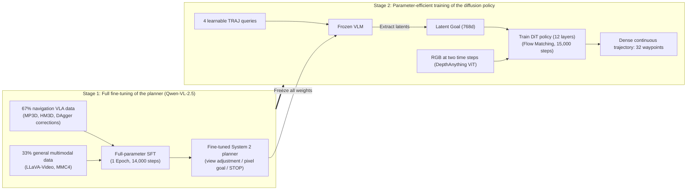
```mermaid
flowchart LR
    subgraph Stage1["Stage 1: Full fine-tuning of the planner (Qwen-VL-2.5)"]
        D1["67% navigation VLA data<br/>(MP3D, HM3D, DAgger corrections)"] --> M1["Full-parameter SFT<br/>(1 Epoch, 14,000 steps)"]
        D2["33% general multimodal data<br/>(LLaVA-Video, MMC4)"] --> M1
        M1 --> S2["Fine-tuned System 2 planner<br/>(view adjustment / pixel goal / STOP)"]
    end

    subgraph Stage2["Stage 2: Parameter-efficient training of the diffusion policy"]
        S2 -->|Freeze all weights| Freeze["Frozen VLM"]
        Q["4 learnable TRAJ queries"] --> Freeze
        Freeze -->|Extract latents| LG["Latent Goal (768d)"]
        LG --> DiT["Train DiT policy (12 layers)<br/>(Flow Matching, 15,000 steps)"]
        RGB["RGB at two time steps (DepthAnything ViT)"] --> DiT
        DiT --> Traj["Dense continuous trajectory: 32 waypoints"]
    end

    Stage1 ==> Stage2
```

#### ① Stage 1: co-training the high-level planner
{: id="-stage-1高层规划器协同微调co-training"}
* **Training**: fully fine-tune the visual encoder and LLM backbone for 1 epoch using AdamW, learning rate 2e-5, batch size 128, and 14,000 steps.
* **Co-training mixture: 1.47 million samples**:
  - **Navigation VLA data (67%)**: MP3D scenes (450K, 31%), diverse HM3D scenes (300K, 20%), and **DAgger corrective demonstrations (240K, 16%)** collected by a Habitat shortest-path expert. These improve recovery from heading deviations.
  - **General vision-language data (33%)**: VQA from LLaVA-Video and ScanQA (248K, 17%) and interleaved MMC4 image-text data (230K, 16%) help **prevent catastrophic forgetting of general visual reasoning during navigation fine-tuning**.

| Category | Subset | Share | Size | Source and role |
|:---|:---|:---:|:---:|:---|
| **Navigation VLA** (67%) | MP3D | 31% | 450K | R2R / R2R-EnvDrop / RxR across 60 indoor scenes |
| | HM3D | 20% | 300K | ScaleVLN subset covering 700 indoor scenes for cross-environment generalization |
| | DAgger | 16% | 240K | Corrective trajectories collected by a Habitat shortest-path expert during model rollouts |
| **General multimodal** (33%) | VQA | 17% | 248K | LLaVA-Video-178K + ScanQA for 3D spatial understanding and commonsense geometric reasoning |
| | MMC4 | 16% | 230K | Long interleaved image-text documents for long-horizon, multi-turn vision-language alignment |

#### ② Stage 2: parameter-efficient fine-tuning of the diffusion policy
{: id="-stage-2扩散策略的参数高效微调peft"}
* **Training**: **freeze all System 2 weights**, updating only the embeddings of 4 `<TRAJ>` queries and the DiT policy. Use AdamW, learning rate 1e-4, batch size 128, and 15,000 steps.
* **Latent extraction (Appendix A.2)**: append 4 dedicated tokens to the prompt to connect text output with continuous control:
  ```python
  inputs_embeds = QwenVL.embed_tokens(input_ids)
  traj_idx = (input_ids == TRAJ_TOKEN)           # Locate the 4 TRAJ positions
  inputs_embeds[traj_idx] = latent_queries       # Substitute learnable queries (prompt tuning)
  QwenVL.requires_grad_(False)                  # Freeze weights; retain gradients to input queries
  hidden = QwenVL.forward(inputs_embeds)         # Do not disable query gradients during training
  pixel_goal_latents = hidden[-1][:, -4:, :]     # Extract the final layer's last 4 positions
  noise_pred = DiT(traj_encoder(gt_poses), timestep, pixel_goal_latents, rgb_feats)
  ```
  This is illustrative pseudocode. Freezing VLM parameters does not disable the entire computation graph: learnable queries still require gradients. The example in [Appendix A.2](https://arxiv.org/html/2512.08186v1#A2) likewise does not use `torch.no_grad()`.
* **Sample filtering**: Stage 2 trains trajectories **only on samples with valid pixel goals**, excluding turn-only samples so the diffusion policy focuses on smooth goal-directed motion and avoidance.

#### ③ Why decouple training?
{: id="-为什么必须解耦训练方法学核心思考"}
1. **Asymmetric data needs and convergence**: as a general 7B VLM, System 2 needs millions of mixed samples for semantic knowledge. System 1's local trajectory task is more constrained; experiments show that **about 10% of System 2's trajectory data suffices to saturate System 1 performance**. Decoupling reduces costly joint computation.
2. **Avoiding representation collapse**: joint end-to-end training (*w/o Sys.2 Train*) produces a **9.1% SR drop** on R2R-CE. The source attributes this to diffusion gradients degrading high-level generalization and convergence. Decoupling, with explicit pixel goals as geometric anchors, balances high-level generalization and low-level responsiveness.

---

### 4. Experiments and results
{: id="4-核心实验结果与分析"}

#### ① Monocular visual simulation: VLN-CE
{: id="-经典单目视觉仿真基准vln-ce"}
With **monocular RGB only**, without depth, panoramic views, or odometry priors, DualVLN reports leading R2R and RxR results at the time of publication:

**R2R Val-Unseen: monocular RGB**:
| Model | Success rate SR ↑ | Success weighted by path length SPL ↑ | Navigation error NE ↓ | Oracle success OS ↑ |
|:---|:---:|:---:|:---:|:---:|
| NaVid (2024) | 37.4% | 35.9% | – | – |
| NaVILA (2025) | 54.0% | 48.0% | – | – |
| StreamVLN (previous SOTA) | 56.9% | 51.9% | 4.98m | 64.2% |
| **DualVLN** | **64.3%** | **58.5%** | **4.05m** | **70.7%** |
| *Improvement* | ***+7.4%*** | ***+6.6%*** | ***-0.93m*** | ***+6.5%*** |

**RxR Val-Unseen: fine-grained multilingual instructions**:
| Model | Success rate SR ↑ | Success weighted by path length SPL ↑ | Navigation error NE ↓ | Normalized dynamic time warping nDTW ↑ |
|:---|:---:|:---:|:---:|:---:|
| NaVILA (previous SOTA) | 49.3% | 44.0% | 6.77m | 58.8% |
| **DualVLN** | **61.4%** | **51.8%** | **4.58m** | **70.0%** |
| *Improvement* | ***+12.1%*** | ***+7.8%*** | ***-2.19m*** | ***+11.2%*** |

*Interpretation*: DualVLN's SR advantage reaches **+12.1%** on the longer, more linguistically diverse RxR tasks. It also exceeds graph-search methods using panoramic RGB, depth, and odometry, such as ETPNav at 57.0% SR, showing the strength of a purely visual end-to-end dual system in this setting.

#### ② Physics-based simulation: VLN-PE
{: id="-真实物理仿真评测vln-pe"}
VLN-PE uses a physics engine to simulate a Unitree H1 humanoid's dynamics, falls, and collisions. DualVLN is evaluated through **zero-shot transfer without VLN-PE fine-tuning**:

| Model | Training status | SR ↑ | SPL ↑ | NE ↓ | Fall rate FR ↓ | Stuck rate StR ↓ |
|:---|:---:|:---:|:---:|:---:|:---:|:---:|
| NaVid | Zero-shot transfer | 22.42% | 18.58% | 5.94m | 8.61% | 0.45% |
| RDP | Fine-tuned on VLN-PE | 25.24% | 17.73% | 6.72m | 24.57% | 3.11% |
| **DualVLN** | **Zero-shot transfer** | **51.60%** | **42.49%** | **4.66m** | 12.32% | 2.23% |

*Interpretation*: SR is **more than twice** the baseline (51.60% vs 22.42%). The source attributes the improvement to smooth continuous trajectories mitigating inertial falls caused by abrupt discrete stops.

#### ③ Dynamic pedestrian interaction: Social-VLN
{: id="-动态行人交互新基准social-vln"}

<div align="center">
  
<figcaption>
Social-VLN simulation and real-robot obstacle avoidance. Dynamic pedestrians are introduced in Habitat 3.0. The middle row shows collision failures; the bottom row shows a Unitree G1 using DualVLN to avoid moving people and reach the goal.
</figcaption>
</div>

* **Benchmark**: the paper argues that static maps and discrete-action models are fragile around moving pedestrians. It injects pedestrians along ground-truth paths in Habitat 3.0 to create **Social-VLN**, containing 763K interaction samples, and introduces Human Collision Rate (HCR).
* **Results**: all models lose roughly 26% SR from static to dynamic scenes. DualVLN's 30Hz local replanning retains **37.2% SR**, 5.8% above StreamVLN, with lower HCR at 35.4%.

| Model | Static SR | Social-VLN dynamic SR | SR change ↓ | Human collision rate HCR ↓ |
|:---|:---:|:---:|:---:|:---:|
| StreamVLN | 56.9% | 31.4% | -25.5% | 36.4% |
| **DualVLN** | **64.3%** | **37.2%** | -27.1% | **35.4%** |

#### ④ Real-world deployment across embodiments
{: id="-真实世界跨形态机器人部署"}

* **Hardware**: tests cover **wheeled Turtlebot4**, **Unitree Go2 quadruped**, and **Unitree G1 humanoid** robots. Intel RealSense D455 cameras, tilted downward by 15°, stream synchronized RGB-D images to a remote RTX 4090 server for asynchronous dual-system inference. Odometry transforms trajectories into world coordinates for MPC tracking. The real-world execution pipeline uses depth and odometry; the simulation's RGB-only setting does not describe the complete deployed system.
* **Results: 3 settings, 20 trials per setting**:
  - **Corridor (easy)**: **100% SR**, average error 0.2m; baselines achieve 25%–80%.
  - **Single bedroom (medium)**: **100% SR**, average error 0.3m; baselines achieve 0%–70%.
  - **Long-horizon, multi-room office (hard)**: **85% SR**, average error 0.4m; baselines achieve 0%–60%.
* **Navigation error (NE) by setting**:

| Setting | CMA | NaVid | NaVILA | StreamVLN | DualVLN |
|:---|:---:|:---:|:---:|:---:|:---:|
| Corridor (easy) | 3.2m | 0.9m | 0.3m | 0.2m | **0.2m** |
| Bedroom (medium) | 5.3m | 2.5m | 0.6m | 0.3m | **0.3m** |
| Multi-room office (hard) | 15.4m | 10.1m | 2.2m | 0.5m | **0.4m** |

* **Typical baseline failure modes**:
  - **NaVid**: accumulated long-distance errors frequently lead to wall collisions in routes with many turns.
  - **NaVILA**: performs large-scale turns but often passes the destination doorway without entering on multi-room tasks.
  - **StreamVLN**: low-latency actions avoid static obstacles, but often deviate substantially from the instructed path.
  - **DualVLN**: System 2 maintains the high-level landmark goal while System 1 dynamically detours, combining route fidelity with local avoidance.

---

### 5. Ablations and mechanisms
{: id="5-核心消融与机理解析"}

#### ① Goal representations and decoupled training: R2R-CE Val-Unseen
{: id="-目标表征与解耦训练的必要性r2r-ce-val-unseen"}
| Variant | SR ↑ | SPL ↑ | OS ↑ | NE ↓ | Finding |
|:---|:---:|:---:|:---:|:---:|:---|
| **DualVLN (full)** | **64.3%** | **58.5%** | **70.7%** | **4.05m** | Combining explicit and implicit goals performs best |
| *w/o Sys.2 Train* (joint end-to-end training) | 55.2% | 51.5% | 60.9% | 4.98m | **9.1% performance drop**; joint optimization degrades representations and convergence |
| *w/o Pixel Goal* (remove explicit pixels) | 62.2% | 55.8% | 68.0% | 4.22m | Without geometric anchors, low-level trajectory drift increases (-2.1% SR) |
| *w/o Latent Goal* (remove semantic latents) | 60.9% | 55.1% | 67.7% | 4.26m | 2D coordinates alone do not convey scene-topology semantics (-3.4% SR) |

#### ② Conventional point-goal planners: VLN-PE Unseen
{: id="-对比-sota-传统点目标规划器vln-pe-unseen"}
Project System 2's predicted pixels into 3D using **oracle depth**, and substitute conventional local point-goal policies:

| Local planner | Seen SR ↑ | Seen SPL ↑ | Unseen SR ↑ | Unseen SPL ↑ | Unseen NE ↓ |
|:---|:---:|:---:|:---:|:---:|:---:|
| iPlanner (Yang et al., 2023) | 58.66% | 49.43% | 47.07% | 41.09% | 4.91m |
| NavDP (Cai et al., 2025) | 66.11% | 56.26% | 58.72% | 50.98% | 4.22m |
| **System 1 (full)** | **73.25%** | **64.00%** | **63.62%** | **56.49%** | **3.90m** |

*Interpretation*: conventional point-goal planners are sensitive to projection errors and depth noise. System 1 uses high-frequency monocular context and latent conditioning so **its diffusion policy can correct trajectories from the image stream even when high-level pixel predictions are imperfect**.

#### ③ Data scaling for the diffusion policy
{: id="-扩散策略的数据扩展律data-scaling-law"}
Train System 1 with different proportions of System 2 trajectory data:
- **1% of data**: SR ~54%, already providing useful obstacle avoidance.
- **10% of data**: SR ~62%, **rapidly approaching saturation**.
- **50%–100% of data**: SR ~64.3%, with diminishing returns.
*Implication*: trajectory generation maps a relatively low-dimensional geometric manifold and requires fewer samples than a large language model. Decoupled training allows inexpensive adaptation of downstream robot controllers.

#### ④ Layerwise attention refinement
{: id="-注意力逐层精化机理attention-map-analysis"}
Layerwise Qwen-VL attention during autoregressive generation shows:
- **Shallow layers (Layer 6)**: diffuse attention over the global scene layout and directional instruction words.
- **Middle layers (Layer 15)**: attention narrows to instruction-relevant objects such as doors, long tables, and corridor junctions.
- **Deep layers (Layer 24)**: attention concentrates on the **farthest visible pixel-goal region**, shifting toward `STOP` upon arrival. This illustrates progressive refinement from global scene semantics to fine-grained spatial grounding.

---

### 6. Limitations and future directions
{: id="6-局限性与未来演进"}

1. **One-way communication**: the architecture is a cascade from System 2 $\rightarrow$ System 1. Low-level blockage caused by a dead end or collision is not fed back immediately to trigger high-level replanning. Bottom-up interrupts and retriggering remain future work.
2. **Dense social scenarios**: despite leading Social-VLN performance, SR is still only 37.2%, and collisions remain frequent in dense crowds. The model lacks explicit reasoning about human motion intentions and strategic interaction.
3. **Edge compute requirements**: System 2 uses a 7B multimodal backbone requiring roughly 20GB GPU memory at full precision. Deployment still streams to an offboard workstation. Quantization and distillation into 2B–3B edge VLMs are needed for fully offline navigation.

---


## 8. VLN-R1 (2025)
{: id="vln-r1"}
——End-to-end navigation based on GRPO and Time-Decayed Reward

📄 **Paper**: [arXiv:2506.17221](https://arxiv.org/abs/2506.17221)

**Background and problem**

VLN is a core challenge in the field of embodied artificial intelligence, requiring agents to navigate real-world environments based on natural language instructions. Traditional navigation methods usually rely on discrete topological graphs and predefined node connections, which limits the generalization ability of agents in continuous environments.

**Method and innovations**

VLN-R1 proposes an innovative end-to-end framework that utilizes large visual-language models (LVLM) to directly process egocentric video streams and generate continuous navigation actions.

<div align="center">
  
<figcaption>
Overall architecture of VLN-R1end-to-end framework
</figcaption>
</div>

**Core design concept:**
- Building an end-to-end framework capable of processing egocentric video streams in real time and generating continuous navigation actions
- Unlike traditional methods that rely on navigation maps or additional sensors, VLN-R1 directly converts visual input and natural language instructions into action output
- Improve system versatility and enhance adaptability in unseen environments

**Main components:**

*VLN-Ego dataset:*
- **Data Generation**: Generated through the Habitat simulator, containing paired data of egocentric video streams and future action predictions
- **Three-part text notes**:
  - Instruction part: Natural language navigation instructions (such as "walk to the sofa in the living room")
  - Visual part: includes historical frames and current observations, providing egocentric visual information
  - Action part: future action selection (four basic actions: forward, turn left, turn right, and stop)
- **Data size**:
  - 60K training samples were generated from Room-to-Room
  - 1.2M training samples were generated from Room-Across-Room
  - Covers 61 training scenarios

<div align="center">
  
<figcaption>
VLN-Ego dataset construction process
</figcaption>
</div>

*Long short-term memory sampling:*
- Novel video input processing strategies for dynamically balancing the importance of historical frames with the real-time nature of current observations
- Ensure that the model can both utilize historical information and quickly respond to current environmental changes
- Compared with single action prediction, multi-step action prediction combined with historical context significantly improves performance.

**Two-stage training strategy:**

<div align="center">
  
<figcaption>
VLN-R1 two-stage training process
</figcaption>
</div>

*Supervised Fine-Tuning (SFT) Phase:*
- Model's action sequence predictions are aligned with expert demonstrations, and output text is optimized through supervised learning
- Multi-step action sequence text generated by the model is aligned with the ground truth and optimized with a cross-entropy loss
- Given the historical observation sequence H_t, instruction Z and current observation O_t, the model predicts n-step future action sequence

*Reinforcement Fine Tuning (RFT) Phase:*
- Introducing a reinforcement learning method based on GRPO (Group Relative Policy Optimization)
- Combined with the time decay reward mechanism (TDR), further optimize the performance of the model in long-term navigation
- The hyperparameters were determined through ablation experiments, and the number of generations was selected as 8 as the default value.

**Time Decay Reward Mechanism (TDR):**
- **Core idea**: Balance short-term and long-term rewards by introducing a decay factor
- **Mechanism of action**: Enables the model to pay more attention to recent actions while considering long-term goals.
- **Advantages**: Used to evaluate the long-term effect of multi-step action prediction and optimize long-term navigation performance

<div align="center">
  
<figcaption>
Schematic diagram of time decay reward (TDR) mechanism
</figcaption>
</div>

**Model architecture:**
- **Input**: Egocentric video stream and instructions
- **Output**: Multi-step future action sequence
- **end-to-end design**: Eliminates dependence on navigation graphs, allowing it to perform well in continuous environments

**Results and findings**

VLN-R1 was fully tested on the VLN-CE (vision-language navigation continuous environment) benchmark:

**Test platform:**
- **Room-to-Room (R2R)**: Agents are asked to navigate within a single room
- **Room-Across-Room (R4R)**: The agent is required to navigate across rooms, and the task is more challenging

**Performance:**
- **R2R Dataset**: Demonstrates efficient navigation capabilities and accurate task completion rate
- **R4R Dataset**: Cross-domain adaptability has been significantly improved through enhanced fine-tuning, and the performance of the small 2B model is even close to that of the 7B model
- **Model scalability**: Demonstrates the effectiveness of the end-to-end framework at different model scales

**ablation experimental verification:**
- **Long short-term memory sampling**: Multi-step action prediction combined with historical context significantly improves performance, better than single action prediction
- **TDR mechanism**: Compared with traditional reward functions, TDR significantly improves the success rate of long-term tasks
- **Number of Generations**: There is limited performance improvement when increasing from 6 to 8, so 8 is chosen as the default value

**Technical Advantages:**
- end-to-end design enables real-time navigation
- Combining LVLM’s visual-language understanding capabilities and reinforcement learning optimization strategies
- Demonstrated potential in task-specific reasoning

**Limitations**

The content of the paper is relatively short and does not detail the specific performance index values (such as SR, SPL, etc.) and detailed comparison with other SOTA methods. In addition, there is less discussion on Real-world deployment, mainly focusing on simulation environment (Habitat) testing, and there is a lack of verification experiments on the real robot platform.

---


## 9. StreamVLN (2025)
{: id="streamvln"}

— Streaming vision-language navigation through slow-fast context modeling

📄 **Paper**: [arXiv:2507.05240](https://arxiv.org/abs/2507.05240) · 🏛️ **ICRA 2026**

**Key takeaways**

This paper proposes a streaming VLN framework for real-world deployment. Its reusable ideas include: (1) slow-fast context modeling that balances global scene understanding with timely responses; (2) geometry-aware token pruning that reduces computation while preserving performance; (3) KV-cache reuse that exploits temporal continuity for efficient inference over long video streams; (4) bounded context size and inference cost for practical embodied AI deployment; and (5) joint training on navigation VLA data, general vision-language data, and DAgger demonstrations to retain both general reasoning and navigation capabilities. These designs may transfer to other embodied tasks with long multimodal input sequences.

**Background and problem**

VLN in real-world continuous environments requires efficient multimodal reasoning over long video streams with low latency for real-time interaction. Existing Video-LLM-based methods face a trade-off among fine-grained visual understanding, long-term context modeling, and computational efficiency. This work aims to capture global scene context while responding quickly through a streaming navigation framework.

<div align="center">
  
<figcaption>
StreamVLN overview. The inputs are a language instruction and an RGB image stream. Each navigation episode is modeled as a multi-turn dialogue in which the agent repeatedly queries the next action. A fixed-size sliding window retains recent dialogue, while token pruning updates inactive-window context to reduce memory use.
</figcaption>
</div>

**Method and contributions**

StreamVLN uses slow-fast context modeling to extend a Video-LLM into an interleaved vision-language-action model for streaming navigation.


**1. Continuous multi-turn autoregressive generation**

A VLN dialogue consists of interleaved observations and actions. In each turn $d_i = (o_i, a_i)$, the model receives observation $o_i$ and generates action response $a_i$, conditioned on the current input and dialogue history. The full input sequence is $o_1a_1o_2a_2...o_{i-1}a_{i-1}$. The LLM-based Transformer first encodes input tokens and caches key/value (KV) states during **prefill**, then generates new tokens using those states during **decoding**.

**2. Fast-streaming dialogue context**

Reusing the KV cache across turns can eliminate more than 99% of prefill time, but introduces substantial memory costs. The cache grows linearly with the number of turns; for example, 2K tokens may occupy roughly 5GB, making long sessions impractical. Existing Video-LLMs also lose reasoning performance with excessively long contexts.

StreamVLN uses a **sliding-window KV cache**, keeping a fixed number $N$ of recent dialogue turns in the active window: $W_j = [o_{(i-N+1)}a_{(i-N+1)}...o_ia_i]$. Once the window reaches capacity, its key/value states are offloaded from the LLM, and states for non-observation dialogue tokens, such as prompts and generated actions, are immediately discarded. When a new window starts, states from past windows are processed into memory-token states $\{M_0, ..., M_j\}$.

<div align="center">
  
<figcaption>
Joint training mixture: 67% navigation VLA data (MP3D 31%, HM3D 20%, DAgger 16%) and 33% general multimodal data (VQA 17%, MMC4 16%), balancing navigation performance with general vision-language reasoning.
</figcaption>
</div>

**3. Slowly updated memory context**

Balancing temporal resolution and fine-grained spatial perception within a limited context remains difficult for Video-LLMs. Rather than compressing video tokens at the feature level, for example through average pooling, StreamVLN retains high image resolution and selectively discards spatially and temporally redundant tokens to better preserve transferability.

- **Temporal sampling**: sample a fixed number of tokens to avoid temporal-duration bias caused by varying memory-token lengths.
- **Voxel-based spatial pruning**: use depth to back-project 2D image patches from the video stream into a shared 3D space and discretize it into uniform voxels. Track each patch token's voxel index over time. When multiple tokens project into the same voxel within a given period, retain only the most recent observation. The resulting mask selects the token states to keep; see Algorithm 1.

**4. Joint training on multiple data sources**

- **Vision-language-action (VLA) data**:
  - 450K samples collected in Habitat from R2R, R2R-EnvDrop, and RxR across 60 Matterport3D environments.
  - An additional 300K samples from ScaleVLN, covering 700 HM3D scenes, increase scene diversity.
  - 240K corrective demonstrations collected with DAgger improve robustness and recovery.

- **General vision-language data**: retain the pretrained Video-LLM's general reasoning through:
  - 248K video-grounded VQA samples from LLaVA-Video-178K and ScanQA.
  - 230K interleaved image-text samples from MMC4 for multi-turn vision-language interaction.

**Main contributions**:
- A slow-fast context modeling strategy introduced for real-time VLN.
- Geometry-aware token pruning that outperforms generic uniform pruning.
- Low-latency, scalable streaming multimodal inference with efficient KV-cache reuse.
- Interleaved vision-language-action modeling for coherent multi-turn dialogue.
- Bounded context size and inference cost for long video streams.

**Results and findings**

<div align="center">
  
<figcaption>
Transfer of visual reasoning. The model correctly identifies image content, such as the Mona Lisa, through VQA dialogue and transfers that reasoning to navigation instruction understanding, demonstrating cross-modal understanding.
</figcaption>
</div>

- **State-of-the-art performance on VLN-CE at the time of the work**:
  - R2R Val-Unseen: SR 56.4%, SPL 50.2% (StreamVLN†, with additional training data including a ScaleVLN subset; training only on R2R / RxR gives 52.8% / 47.2%).
  - RxR Val-Unseen: SR 54.4%, SPL 45.4%, nDTW 63.7% (arXiv v2 / ICRA 2026 figures; v1 reports R2R 56.9 / 51.9 and RxR 52.9 / 46.0).
  - Comparable performance to ETPNav without panoramic views or waypoint supervision.

- **ScanQA 3D question answering**: outperforms NaVILA and NaviLLM, reaching 28.8% exact match.

- **Real-world deployment**:
  - Successfully deployed on a Unitree Go2 quadruped.
  - Average inference latency of 0.27s for 4 actions, plus communication latency of 0.2s indoors / 1.0s outdoors.
  - Supports real-time physical deployment.

<div align="center">
  
<figcaption>
Qualitative real-world results, from top to bottom: Home, Workspace, Mall, Outdoor. The model follows complex instructions involving multiple landmarks and handles real-world disturbances and changes.
</figcaption>
</div>

- **Ablation findings**:
  - Reusing the KV cache eliminates more than 99% of prefill time across dialogue turns.
  - A sliding window of 8 dialogue turns provides the best balance.
  - Increasing memory context from 2×196 to 8×196 tokens raises SR from 37.3% to 45.5%.
  - Voxel-based pruning reduces input tokens by about 20% while improving R2R SR by +1.2% and RxR SR by +1.1%.
  - DAgger data is important for performance: +5.5% SR / +3.8% SPL.
  - Joint training with general VL data (VideoQA + MMC4) adds +7.3% SR / +5.6% SPL.

<div align="center">
  
<figcaption>
Effect of KV-cache reuse on multi-turn decoding latency. Retaining the full cache gives the lowest latency. A sliding-window cache has small latency increases at window transitions. A single-turn cache, used in previous work, incurs latency that grows linearly with the number of turns.
</figcaption>
</div>

**Limitations**

1. Generating low-level actions directly from raw visual observations is less robust to viewpoint and occlusion changes and may produce suboptimal real-world control.
2. The mixed-context strategy still struggles with longer-horizon navigation, where consistent reasoning over extended sequences is difficult.
3. Explicit action history forms part of the dialogue context. Asynchronous inference and deployment therefore require synchronizing past actions to maintain dialogue coherence.


---


## 10. NavFoM (2025)
{: id="navfom"}
——Embodied Navigation Foundation Model

📄 **Paper**: [arXiv:2509.12129](https://arxiv.org/abs/2509.12129) · 🏛️ **ICLR 2026**

**Key takeaways**

This paper shows how to build a cross-task and cross-body navigation foundation model. The core ideas worth learning include: (1) Introducing Temporal-Viewpoint Indicator (TVI) tokens to uniformly encode different camera configurations and time information, so that the model can handle multi-view input; (2) Proposing the Budget-Aware Temporal Sampling (BATS) strategy to dynamically sample historical frames through the forgetting curve to balance performance and inference speed; (3) In 8.02M Joint training on navigation samples (including quadruped robots, drones, wheeled robots, cars, etc.) demonstrates the improvement in generalization ability of large-scale multi-task training; (4) using a visual feature caching mechanism to accelerate training by 2.9 times; (5) proving that SOTA or competitive performance can be achieved on multiple benchmarks without fine-tuning for specific tasks.

**Background and problem**

Current navigation systems mainly focus on specific task settings and embodied body structures, and lack cross-task and cross-body generalization capabilities. Although existing VLMs perform well on zero-shot tasks, navigation tasks are still limited to narrow task domains, fixed camera configurations, and specific embodied platforms. This paper aims to build a unified navigation foundation model that can handle multi-view input from different bodies (quadruped robots, drones, wheeled robots, cars) and span multiple navigation tasks (VLN, target search, target tracking, autonomous driving).

**Method and innovations**

<div align="center">
  
<figcaption>
NavFoM overall architecture: a unified framework to handle Image QA, Video QA and navigation tasks
</figcaption>
</div>

NavFoM is based on the Vision-Language Model architecture and is expanded into a dual-branch system: one for navigation and one for question and answer. Core innovations include:

**1. Temporal-Viewpoint Indicator (TVI) Tokens**
- Special indicator tokens are introduced to encode camera angle and time information. Each TVI token consists of three parts:
  - **Learnable base embedding** (E_Base)
  - **Time Encoding** (Time PE): Uses sinusoidal position encoding to identify the temporal sequence of frames
  - **Perspective Encoding** (Angle PE): Uses sine/cosine encoding to maintain cyclic continuity of azimuth angles
- For navigation tasks, use: E_TVI = E_Base + Time PE + Angle PE
- For Video QA, only temporal information is used; for Image QA, only base embedding is used
- TVI tokens enable LLM to distinguish tokens at different time steps and different perspectives to achieve multi-perspective navigation.

**2. Budget-Aware Temporal Sampling (BATS)**
- Solving the problem of increasing number of visual tokens during online navigation
- Sampling probability based on forgetting curve (exponential decay): P(t) = (1 - ε)e^(k(t-T)/T) + ε
- Dynamically adjust historical frame sampling. The closer the frame is, the higher the sampling probability is.
- Balance short-term context and long-term historical information under token budget constraints
- Compared with Uniform Sampling, BATS significantly reduces inference time while maintaining performance.

**3. Observation coding**
- Extract visual features using pre-trained vision encoders (DINOv2, SigLIP)
- The Grid Average Pooling strategy is used to generate visual tokens of two resolutions:
  - **Fine-grained** (64×C): for current latest observations and Image QA
  - **Coarse-grained** (4×C): for navigation history and Video QA
- Mapping visual features to LLM latent space via cross-modality projector

**4. Token Organization Strategy**
- Different tasks use different token organization methods:
  - **Image QA**: fine-grained visual tokens + base TVI embedding
  - **Video QA**: coarse-grained visual tokens + base + time embedding
  - **Navigation**: coarse-grained + fine-grained tokens + base + time + angle embedding
- This design enables joint training of navigation and QA data

**5. Trajectory prediction**
- Predict trajectories from LLM hidden states using three-layer MLP as planning head
- Trajectories are normalized to [-1, 1] distribution, and different scaling factors are used for different bodies (indoor navigation vs outdoor driving)
- For indoor robots, predict 8 waypoints; for cars and drones, predict longer trajectories

**6. Data scale and source**
- **Navigation Data** (8.02M): VLN-CE R2R/RxR (2.94M), OpenUAV (429K), Target Navigation (1.02M), Active Visual Tracking (897K), Autonomous Driving (681K), Web Navigation Pseudo-Tag (2.03M)
- **QA data** (4.76M): Image QA (3.15M) + Video QA (1.61M)
- A total of 12.7M training samples, covering quadruped robots, drones, wheeled robots, cars, etc.

**7. Training Optimization**
- Visual feature cache: pre-compute and cache coarse-grained visual tokens, speed up training by 2.9 times, and reduce GPU memory by 1.8 times
- Using Qwen2-7B as LLM backbone
- Train all parameters in a single time (only designated trainable parameters), no need for multi-stage training

**Results and findings**

**VLN PERFORMANCE**:
- **VLN-CE R2R**: single view SR 56.2%, SPL 51.2% (NE 5.01, OSR 64.9); four views SR 61.7%, SPL 55.3% (NE 4.61, OSR 72.1), no task-specific fine-tuning required
- **VLN-CE RxR**: single-view SR 57.4%, SPL 49.4%; four views SR 64.4%, SPL 56.2%, surpassing all baseline methods
- **OpenUAV** (four views,UM split): SR 6.38% → 14.05%, OSRL 5.68% → 18.65%, significantly better than TravelUAV

**Target Search**:
- **HM3D-OVON** (zero-shot): VAL SEEN SR 55.0%, VAL UNSEEN SR 45.2%, surpassing MTU3D baseline

**Active Visual Tracking**:
- **EVT-Bench** (four-view, zero-shot): Single Target SR 85.1%/TR 80.5%, Distracted Target SR 62.0%/TR 67.9%

**Autonomous Driving**:
- **NAVSIM** (eight-view): PDMS 84.3%, competitive performance with SOTA methods
- **nuScenes** (six-view): CR 93%, close to SOTA

**Ablation Research**:
- Multi-task training brings significant gains: joint training increases VLN SR from 57.3% to 64.4%
- The impact of the number of cameras on performance: from single view to four views, SR increases from 58.3% to 65.8%, but decreases slightly when increasing to six views
- Compared with Uniform Sampling, BATS only decreases nDTW by 1.4% on RxR, but maintains stable inference speed.
- TVI tokens significantly improve performance compared to other alternatives (learned special tokens, handcraft tokens)

**Actual Deployment**:
- Verified in 110 real-world test scenarios (50 VLN + 30 search + 30 tracking), the success rate reaches 72%~93%
- Supports cross-body deployment: quadruped robot (Unitree Go2), humanoid robot, drone, wheeled robot
- Generate 8 waypoint trajectories in 0.5 seconds (1600 token budget)

**Limitations**

This method requires significant computing resources during training (56 NVIDIA H100 GPUs, 72 hours). Despite the introduction of optimization strategies such as visual feature caching, large-scale training is still a resource-intensive task. In addition, poor performance in Unseen-Map scenarios that require traversing a complex neighborhood of 300 meters indicates that the model still has room for improvement in large-scale environment exploration and long-distance planning. The author also points out that NavFoM is just a starting point, and that higher quality data, more advanced technologies, and a new generation of benchmarks will be needed in the future to promote the development of generalized navigation research.


---


## 11. MapNav (2025)
{: id="mapnav"}
———A Novel Memory Representation via Annotated Semantic Maps for Vision-and-Language Navigation

📄 **Paper**: [arXiv:2502.13451](https://arxiv.org/abs/2502.13451) · 🏛️ **ACL 2025**

---

**Key takeaways**

MapNav replaces historical RGB sequences with a lightweight Annotated Semantic Map (ASM), keeping memory use at a constant 0.17MB regardless of trajectory length and reporting a 79.5% improvement in inference efficiency. The central idea is to combine semantic maps with natural-language annotations so a VLM can understand spatial information directly, without an additional decoder. A structured top-down map relocates history from the temporal dimension to the spatial dimension, substantially reducing computation. This language-annotated map provides a clear and efficient approach to VLM-based navigation.

---

**Background and problem**

Vision-language navigation in continuous environments (VLN-CE) requires agents to follow natural-language instructions in continuous 3D scenes. Existing methods rely heavily on historical RGB frames as temporal context, so memory grows linearly with trajectory length; NaVid reaches 276MB at 300 steps. They also underuse VLM language understanding. The motivation is to replace historical frames with an efficient memory representation.

---

**Method and contributions**

MapNav is an end-to-end VLM-based VLN framework whose core component is an online Annotated Semantic Map (ASM).

<div align="center">
  
<figcaption>
MapNav overview. The ASM, current RGB observation, and instruction are jointly fed into the VLM to generate navigation actions directly.
</figcaption>
</div>

**ASM generation**

<div align="center">
  
<figcaption>
ASM generation: RGB-D → point cloud → semantic map → text-annotated map.
</figcaption>
</div>

The ASM is a multichannel tensor **M**, with dimensions $C \times W \times H$ and $C = C_n + 4$:
- **Base channels (1–4)**: obstacle distribution, explored area, the agent's current position, and trajectory history.
- **Semantic channels (n channels)**: spatial distributions of target objects.

Generation proceeds as follows:
1. Use Mask2Former to semantically segment the current RGB frame and extract object masks.
2. Use depth to project the 3D point cloud onto a 2D top-down plane and align the semantic masks.
3. Perform connected-component analysis on each semantic region, compute its centroid, and add a text label such as "chair" or "potted plant".
4. Generate the final ASM containing structured object positions, trajectories, and obstacles.

**Why does ASM outperform a conventional semantic map?**

<div align="center">
  
<figcaption>
VLM understanding of different map formats. Text annotations in the ASM help the VLM identify object locations and semantics precisely.
</figcaption>
</div>

Experiments show that VLMs (GPT-4o and MapNav) precisely attend to object locations in ASMs, with attention peaks > 0.8. Attention is much more diffuse on unannotated top-down maps (peaks < 0.3) or semantic maps (peaks < 0.4). Explicit text labels ground abstract semantic regions in language, making use of the VLM's pretrained language understanding.

**Two-stream encoder**

MapNav builds on LLaVA-Onevision and uses the SigLIP-so400m visual encoder:

$$\mathbf{F}_t = \Phi_{spatial}(\mathbf{X}_t, \mathcal{G}), \quad \mathbf{F}_t^M = \Phi_{spatial}(\mathbf{X}_t^M, \mathcal{G})$$

The two feature streams are aligned to language space through MLP projections and concatenated into a unified representation:

$$\mathbf{V}_t = [\text{TASK}; \mathbf{E}_t; \text{OBS}; \mathbf{E}_t^M; \text{MAP}]$$

**Action prediction**

The VLM outputs natural-language actions directly. Regular-expression matching maps them to four actions: {move forward, turn left, turn right, stop}, without an additional action decoder.

**Training data (~1M samples)**

Data collection has three stages:
- Phase I: ground-truth trajectories from R2R + RxR (~300k × 2).
- Phase II: online interaction with DAgger (~200k × 2).
- Phase III: dedicated collision-recovery data (~25k × 2).

**Ablation on the number of historical frames**

<div align="center">
  
<figcaption>
Effect of historical-frame count. Adding the ASM improves performance much more than increasing the number of historical frames.
</figcaption>
</div>

Adding the ASM raises SR from 27% to 36% and SPL from 23% to 34%. Further historical RGB frames yield relatively limited gains, suggesting that the main benefit comes from spatial representation rather than accumulating temporal frames.

---

**Results and findings**

**Simulation: R2R-CE & RxR-CE Val-Unseen**

| Method | R2R OS↑ | R2R SR↑ | RxR SR↑ | RxR SPL↑ |
|------|---------|----------|---------|----------|
| NaVid (All RGB Frames) | 49.1 | 37.4 | 23.8 | 21.2 |
| MapNav (w/o ASM + Cur. RGB) | 41.2 | 27.1 | 15.6 | 12.2 |
| **MapNav (w/ ASM + Cur. RGB)** | **50.3** | **36.5** | **22.1** | **20.2** |
| MapNav (w/ ASM + Cur. + 2 His. RGB) | 53.0 | 39.7 | 32.6 | 27.7 |

- ASM + a single RGB frame achieves performance comparable to NaVid using all historical frames.
- Compared with NaVid (All RGB Frames), adding 2 historical RGB frames improves R2R SPL by 1.3 percentage points and RxR SPL by 6.5 percentage points. This comparison concerns the paper's historical-frame methods and does not imply superiority over every method with a different input configuration.

Note: this table was checked against [Table 1 of MapNav arXiv v5](https://arxiv.org/html/2502.13451v5#S4.T1). The two R2R columns are OS and SR, previously mislabeled as SR and SPL in the Chinese source. R2R SPL is 23.5, 34.3, and 37.2 for the three MapNav variants, respectively, and 35.9 for NaVid. The RxR columns remain SR and SPL with unchanged values.

**Efficiency comparison**

| Method | 1 step | 10 steps | 100 steps | 300 steps | Average inference time |
|------|-----|------|-------|-------|------------|
| Navid | 0.92MB | 9.2MB | 92MB | **276MB** | 1.22s |
| **MapNav** | **0.17MB** | **0.17MB** | **0.17MB** | **0.17MB** | **0.25s** |

- Memory use stays at 0.17MB, independent of trajectory length.
- Inference efficiency improves by **79.5%**, with latency decreasing from 1.22s → 0.25s.

**Real-world evaluation: 5 indoor settings**

Across offices, meeting rooms, lecture halls, tea rooms, and living rooms, MapNav outperforms WS-MGMAP and NaVid on both simple and semantic instructions, with SR improvements of up to 30%.

---

**Limitations**

Semantic segmentation can assign inaccurate object labels under occlusion or lighting changes, degrading ASM quality. Extending the representation to more complex embodied tasks, such as interactive navigation and manipulation, would require integrating object affordances and physical interaction capabilities.


---


## 12. Open-Nav (2025)
{: id="open-nav"}
———Zero-Shot VLN in Continuous Environment with Open-Source LLMs

📄 **Paper**: [arXiv:2409.18794](https://arxiv.org/abs/2409.18794) · 🏛️ **ICRA 2025**

### Key takeaways
{: id="精华-5"}

The core contribution of Open-Nav is to replace the expensive GPT-4 API with a locally deployed open source LLM while maintaining competitive performance, which has important implications for privacy-sensitive real-world robot deployments. The three-stage spatial-temporal CoT (instruction understanding → progress estimation → decision making) designed in the paper is a reusable LLM navigation reasoning framework and is worth learning from. The idea of ​​using SpatialBot + RAM to jointly enhance visual perception - one is responsible for spatial relationship understanding, and the other is responsible for fine-grained target recognition - effectively bridges the gap in visual perception between open source LLM and GPT-4. Real-world evaluation results show that Open-Nav without training even surpasses the SOTA method with supervised training, indicating that the generalization ability of LLM has significant advantages in out-of-distribution scenarios.

---

### 1. Background and problem
{: id="1-研究背景问题-4"}

Vision-and-Language Navigation in Continuous Environments (VLN-CE) requires agents to navigate in unseen 3D indoor environments based on natural language instructions. Existing LLM-based zero-shot methods (such as NavGPT, DiscussionNav) rely heavily on the GPT-4 API, which involves high token fees and the risk of user environment data privacy leakage. They are mainly verified in discrete environments and are difficult to be directly applied to continuous real-world scenarios.

---

### 2. Method and innovations
{: id="2-主要方法创新点-4"}

<div align="center">
  
<figcaption>
Comparison between GPT-based Navigator and Open-Source LLM-based Navigator: The latter requires no API fees, and environmental data does not leave the local device, protecting user privacy.
</figcaption>
</div>

The Open-Nav framework consists of three core modules:

**1. Waypoint Prediction module**

Use a Transformer-based waypoint prediction model that fuses RGB and depth image features (two dedicated ResNet50 branches):

$$v_i^{rgbd} = W_m(f_{\text{ResNet-RGB}}(I_i^{rgb}) \| f_{\text{ResNet-Depth}}(I_i^d))$$

After Transformer processing, a candidate path point heat map is generated, and then K candidate direction points $$\Delta W = \{\Delta w_i\}_{i=1}^K$$ are filtered out through NMS. Each candidate point is represented by angle and distance.

**2. Scene Perception module**

For challenges requiring accurate spatial understanding in continuous environments, scene description is enhanced using two complementary models:

- **SpatialBot**: Spatial understanding VLM, input RGB+depth map, output text description containing distance and spatial relationship between objects
- **RAM** (Recognize Anything Model): Fine-grained target detection, identifying the categories and three-dimensional positions of all objects in the scene

The two outputs are merged into a unified textual scene observation $O_{text} = \langle D_{spatial}, \{o_i\}\rangle$, providing rich spatial context for LLM.

<div align="center">
  
<figcaption>
Open-Nav overall architecture: Waypoint Prediction module identifies candidate guide waypoints, Scene Perception module (RAM + SpatialBot) extracts object positions and spatial relationships, and LLM Navigator performs three-stage CoT reasoning and outputs actions.
</figcaption>
</div>

**3. LLM Navigator: Three-stage space-timing Chain-of-Thought**

This is the core innovation of Open-Nav. At each navigation step, LLM sequentially completes three inference stages:

- **Instruction Comprehension**: Decompose navigation instructions into action sequences and landmark lists, using dedicated prompts to extract structured information
- **Progress Estimation**: Based on historical trajectories and current observations, determine which subtasks have been completed through four steps: landmark verification, direction analysis, and action completion assessment.
- **Decision Making**: Integrate the spatial description, historical trajectory summary and progress estimation results of the current candidate waypoint, generate the reasoning process and select the optimal direction point

The framework deploys four open source LLMs locally via [Ollama](https://ollama.ai/): Llama3.1-70B, Qwen2-72B, Gemma2-27B, Phi3-14B.

---

### 3. Results and findings
{: id="3-核心结果发现-4"}

**Simulation Environment (R2R-CE Dataset)**:

| Methods | SR↑ | SPL↑ | nDTW↑ |
|------|-----|------|--------|
| DiscussNav-GPT4 | 15 | 10.51 | 42.87 |
| Open-Nav-Llama3.1 (this article) | **16** | **12.90** | **44.99** |
| Open-Nav-GPT4 (this article) | 19 | 16.10 | 45.79 |

Open-Nav uses open source LLM to surpass DiscussNav-GPT4 in both SR and SPL, proving that open source LLM with good perceptual enhancement is comparable to closed source solutions.

**Real World Environment (Office/Lab/Game Room)**:

<div align="center">
  
<figcaption>
Real-world testing environment: office, laboratory, game room, each scene is marked with 20 instructions (including simple and complex instructions).
</figcaption>
</div>

<div align="center">
  
<figcaption>
The navigation process of Open-Nav in the real environment is visualized. The right side shows the step-by-step reasoning process of LLM Navigator, reflecting the interpretability of the CoT thinking chain.
</figcaption>
</div>

In all real scenarios: Open-Nav-Llama3.1 reaches **SR=35, NE=2.39**, surpassing supervised training CMA (SR=23), RecBERT (SR=27), and BEVBert (SR=20), verifying the superiority of LLM generalization ability in out-of-distribution scenarios.

**Comparison of different open source LLMs (simulated environment navigation performance)**:

<div align="center">
  
<figcaption>
Performance comparison of four open source LLMs on action decomposition tasks (SPICE/BLEU/METEOR/ROUGE).
</figcaption>
</div>

<div align="center">
  
<figcaption>
Performance comparison of four open source LLMs on landmark extraction tasks. Llama3.1-70B performs best in landmark extraction, Qwen2-72B scores highest in action decomposition, but Llama3.1-70B is the best overall in final navigation performance (SR=16, SPL=12.90).
</figcaption>
</div>

---

### 4. Limitations
{: id="4-局限性-4"}

The current inference speed of open source LLM is slow, and the computational efficiency in real environments still needs to be improved; the paper does not explore the potential of fine-tuning open source LLM for navigation tasks, and the performance gap with GPT-4 can be further narrowed in the future.

---


## 13. VLN-Imagine (2025)
{: id="vln-imagine"}
——Using text-generated image models to build "visual imagination" for navigation agents

📄 **Paper**: [arXiv:2503.16394](https://arxiv.org/abs/2503.16394) · 🏛️ **CVPR 2025**

### Key takeaways
{: id="精华-6"}

1. The ready-made text-to-image diffusion model (SDXL) is used to generate "visual imagination" for landmark noun phrases in navigation instructions, transforming cross-modal alignment from implicit learning to explicit image-image matching. The idea is concise and transferable.
2. The method is designed to be model-agnostic: any VLN model can be embedded through an independent imagination encoder + auxiliary alignment loss, without modifying the original architecture.
3. The sub-instruction filtering strategy (FG-R2R segmentation + noun phrase blacklist) effectively controls the quality and relevance of the generated images, and is a good example of low-cost data enhancement.
4. Experiments show that imagination gains during both the training and inference stages, and the regularization effect in the training stage is independent of the input gain during inference, indicating that multi-modal auxiliary signals can improve model generalization.
5. The cosine similarity auxiliary loss is sufficient to align imagination and instruction representation without the need for more complex contrast loss (InfoNCE), which embodies the engineering philosophy of "enough is enough".

---

### 1. Background and problem
{: id="1-研究背景问题-5"}

In the Vision-and-Language Navigation (VLN) task, the agent needs to navigate in an unseen environment based on natural language instructions. Instructions often reference visual landmarks (such as "pool table" or "kitchen"), but existing methods rely on implicit cross-modal alignment to associate noun phrases with actual observations. This paper explores whether text-to-image models can be used to generate "visual imagery" of landmarks prior to navigation, transforming language-visual alignment into an easier image-image matching task.

---

### 2. Method and innovations
{: id="2-主要方法创新点-5"}

#### 2.1 Visual Imagination generation pipeline
{: id="21-visual-imagination-生成管线"}

<div align="center">
  
<figcaption>
Instruction segmentation, filtering and image generation process: Use FG-R2R to split the instruction into sub-instructions, filter out the parts that do not contain visual landmarks, and then generate imaginary images through SDXL
</figcaption>
</div>

- **Instruction segmentation**: Use FG-R2R to split the complete navigation instruction into the sub-instruction sequence $S = (S_0, \cdots, S_m)$. The R2R training set has an average of 3.66 sub-instructions per instruction.
- **Subcommand filtering**: Use SpaCy to filter subcommands without noun phrases, and then use a blacklist to exclude non-visual nouns (such as count words, directional words, pronouns), and retain the valid subcommand set $S' \subset S$.
- **Image generation**: Use the SDXL diffusion model to generate indoor scene images guided by positive prompt words (indoor, house, realistic, real estate) and negative prompt words (outdoor, text, humans, etc.). The final R2R-Imagine dataset is constructed, containing more than 41k 1024×1024 imagination images.

#### 2.2 Model-Agnostic integration method
{: id="22-model-agnostic-集成方法"}

<div align="center">
  
<figcaption>
Overview of the method: (left) imagination embedding is generated through MLP after the imagination image is encoded by ViT; (right) is spliced with the instruction token and sent to the cross-modal policy network
</figcaption>
</div>

- **Imagination Encoder**: Use pre-trained ViT-B/16 encoding to imagine the image, add imagination modality type embedding $t_{Im}$, and then pass three layers of MLP (768→512→768, ReLU + Dropout 0.15) to obtain imagination embedding $h_i = \text{MLP}(\text{ViT}(Z_i) + t_{Im})$.
- **Modal fusion**: After the imagination embedding and the text encoding of the instruction are spliced, they are sent to the cross-modal encoder of the VLN agent. This paper validates the method on two representative models, HAMT and DUET.
- **Auxiliary alignment loss**: Calculate the cosine similarity loss $\mathcal L_{cos}$ between the imagination embedding $h_i$ and the average text embedding of the corresponding sub-instruction noun phrase $$\bar{S}_i$$, the total loss is $\mathcal L_{\text{base}} + \lambda \mathcal L_{cos}$ ($\lambda=0.5$).
- **Three-stage fine-tuning**: To alleviate catastrophic forgetting, first train MLP + type embedding (25% iterations) → jointly train all modules (25%) → uniform learning rate training (50%), for a total of 100k iterations.

<div align="center">
  
<figcaption>
Visual imagination example: sub-goals (pool table, kitchen, bedroom) in navigation instructions are generated as corresponding indoor scene images
</figcaption>
</div>

---

### 3. Results and findings
{: id="3-核心结果发现-5"}

- **R2R Dataset**: HAMT-Imagine improves 1.0 SR / 0.5 SPL (66.24 → 67.26 / 61.51 → 62.02) on val-unseen; DUET-Imagine improves 0.6 SR / 0.07 SPL (71.52 → 72.12 / 60.41 → 60.48), the SR on the test split increases from 69 to 71.
- **REVERIE dataset**: DUET-Imagine improves SR by 1.3 points and RGS by 0.82 points under coarse-grained instruction settings, indicating that imagination is also helpful for target positioning.
- **Dual gains in training and inference**: Even if imagination is nullified during inference (zero attention mask), the model is still better than the baseline, implying that imagination-based training has a regularization effect.
- **Alignment is key**: Random imagination reduces performance; correctly aligned imagination can improve performance.
- **Visual is worse than text**: Replacing imagination embedding with sub-instruction text embedding is not as effective as visual imagination, indicating that visual representation and language play a complementary role.
- **Imagination High Fidelity**: Verified by the LangSAM open-vocabulary detector, 98.78% of sub-directives have at least one noun phrase detected.

---

### 4. Limitations
{: id="4-局限性-5"}

Generating and encoding imagined images adds computational overhead that is particularly detrimental to real-world robot deployment (3.2 seconds per image on H100, ~1.5 days on V100 for fine-tuning). Furthermore, imagined images cannot capture personalized naming of objects and locations in the environment, and persistent visual grounding for lifelong learning remains an open problem.

---


## 14. VLN-PE (2025)
{: id="vln-pe"}
———Rethinking the Embodied Gap in Vision-Language Navigation: A Comprehensive Study of Physical and Visual Differences

📄 **Paper**: [arXiv:2507.13019](https://arxiv.org/abs/2507.13019v2) · 🏛️ **ICCV 2025**

**Key takeaways**

This paper systematically reveals the huge gap between idealized simulation and physical deployment by building a physically realistic VLN platform. Core revelations include: (1) Cross-embodied data fusion training can significantly improve model generalization capabilities and lay the foundation for a unified cross-robot navigation model; (2) Multi-modal perception (RGB+Depth) is more robust than single RGB, especially in illumination changing environments; (3) The introduction of physical controllers is crucial for legged robots, and controller consistency in the training and evaluation stages directly affects performance; (4) The generalization ability of existing MP3D style datasets is limited, and small-scale intra-domain data fine-tuning can surpass the zero-shot performance of large models; (5) diffusion policy shows potential in VLN tasks as a new paradigm for continuous waypoint prediction.

**Background and problem**

Existing VLN methods perform well in idealized simulation environments, but face huge challenges when deployed to real physical robots. The main problems include: the current VLN platform ignores the physical embodied characteristics of robots (such as viewpoint height, motion dynamics, collisions and falls, etc.), and lacks cross-embodied support for different robot types (wheeled, humanoid, quadrupedal). The core research question is: How much influence do physical embodiment constraints and visual environment changes have on the performance of existing VLN methods?

**Method and innovations**

<div align="center">
  
<figcaption>
Evolution of VLN missions: from oracle-based navigation (2018) to VLN-CE continuous navigation (2020), to VLN-PE physically realistic navigation (2025)
</figcaption>
</div>

The paper proposes **VLN-PE Platform**, a physically real VLN benchmark test platform built on GRUTopia, with the following core features:

1. **Cross-body support**: Supports humanoid robots (Unitree H1, G1), quadruped robots (Unitree Aliengo) and wheeled robots (Jetbot), and provides an RL-based physical controller API to achieve real motion dynamics simulation

2. **Scene Diversity**: In addition to 90 MP3D scenes, 10 new high-quality synthetic home scenes (GRScenes) and 3DGS online rendering laboratory scenes are added to support seamless integration of more environments

<div align="center">
  
<figcaption>
VLN-PE platform overview: supports multiple robot embodiments, scene types, lighting conditions and controller modes
</figcaption>
</div>

3. **Systematic Evaluation Framework**: Evaluating three categories of ego-centric VLN methods
   - **Single-step end-to-end methods**: Seq2Seq, CMA (~36M parameters) and NaVid (video MLLM with 7B parameters)
   - **Multi-step end-to-end method**: RDP (Recurrent Diffusion Policy) is proposed for the first time, using the transformer-based diffusion module to predict continuous trajectory path points
   - **Map-based zero-shot method**: improved VLMaps, combining LLM and semantic maps for path planning

<div align="center">
  
<figcaption>
RDP (circular diffusion policy) framework: uses GRU to maintain historical information, cross-attention to fuse visual-linguistic features, and Transformer diffusion module to predict continuous action sequences
</figcaption>
</div>

4. **New Dataset**:
   - **R2R-filtered**: 8,679/658/1,347 training/val-seen/val-unseen episodes retained after filtering staircase scenes
   - **GRU-VLN10**: 10 synthetic scenes, 441/111/1, 287 episodes
   - **3DGS-Lab-VLN**: 3DGS rendering laboratory environment, 160 training/640 evaluation episodes

5. **New evaluation indicators**: In addition to the traditional TL, NE, SR, OS, and SPL, new Fall Rate (FR) and Stuck Rate (StR) are added to measure physical authenticity challenges

**Results and findings**

<div align="center">
  
<figcaption>
Comparison of main experimental results using the humanoid robot Unitree H1 on the R2R dataset
</figcaption>
</div>

**Zero-sample migration performance drops significantly**:
- When the VLN-CE model is directly migrated to VLN-PE, the SR is relatively reduced by about 34%.
- The SR of Seq2Seq-Full, CMA-Full and NaVid decreased by 10%, 16% and 18% respectively.
- This indicates that existing models are severely overfitting a specific simulation platform

**In-domain fine-tuning significantly improved**:
- CMA trained from scratch (without data augmentation) on VLN-PE surpasses CMA-Full trained with 175K augmented data
- After fine-tuning, the small model CMA+ reached SR 28.72 and SPL 24.24 on val-seen, surpassing NaVid's zero-shot performance.

**Trans-Embodied Sensitivity**:
- Quadruped robot (camera height about 0.5m) almost completely failed during migration
- Adjusting the camera height to 1.8m improves the migration performance of humanoid robots
- Cross-embodiment joint training enables a single model to achieve SoTA performance on all robot types

**Importance of Physical Controllers**:
- Performance is best when training and evaluation use the same controller
- Using physical controllers to collect data reduces Fall Rate and Stuck Rate

**Multi-modal robustness**:
- RGB-only NaVid's SR drops by 12.47% in low light
- The CMA and RDP of RGB+Depth are less affected by light (decrease by about 1-2%)

**MP3D dataset has limited generalization ability**:
- On GRU-VLN10, RDP uses 6M parameters and only has 441 training samples, and zero-shot surpass the NaVid large model.
- On 3DGS-Lab-VLN, NaVid completely failed (SR only 5.81), possibly caused by 3DGS rendering noise

**Potential for Diffusion Strategies**:
- RDP, as the first VLN diffusion policy baseline, outperforms Seq2Seq and CMA when trained from scratch
- Predict continuous dense path points, which can be combined with control theory methods such as MPC

**real robot experimental verification**:
- 14 indoor scene tests using Unitree Go2 robot
- The OS of the VLN-PE fine-tuned model reached 57.14 and the SR reached 28.57 in the real environment, which is significantly better than the VLN-CE training model.

**Limitations**

Current RL-based motion controllers cannot reliably handle stair navigation in complex environments and need to filter relevant scenes. The paper mainly focuses on the ego-centric perspective and does not evaluate the panoramic VLN method. MLLM still has challenges in accurate target recognition and stopping decision-making. The pixel-level noise introduced by 3DGS rendering may interfere with the pure RGB model, and further research on the robustness of image perturbation is required.

---


## 15. Goal2Pixel (2025)
{: id="goal2pixel"}
———Ground navigation targets to image pixels and unify the decision space of VLN-CE with pixel predictions

📄 **Paper**: [arXiv:2606.01621](https://arxiv.org/abs/2606.01621)

### Key takeaways
{: id="精华-7"}

1. **Image plane is the decision space**: Redefine the high-level decision-making of VLN-CE from discrete action prediction to pixel prediction - VLM only needs to output a pixel coordinate, disambiguating the action label and aligning with the native output space of VLM.
2. **Auxiliary command area design**: Encode non-forward actions such as turning/stopping into pixels in the extended area of ​​the image plane, so that all decisions can be processed uniformly in the same coordinate space without the need for two-stage switching.
3. **ViKeyMem drives keyframes with visibility**: Using "future waypoint visibility changes" as keyframe selection criteria, it only takes 3–4 frames to encode 100+ step trajectories, and the training cost is reduced from 156 to 70 H100 GPU hours.
4. **Reduce the number of VLM calls**: The pixel prediction granularity is coarser (one prediction corresponds to 5 low-level actions), which reduces the number of VLM calls from 46.62 to 7.75, while the performance increases from 32.9% SR to 54.1% SR.
5. **Cross-platform portability**: Pixel output decouples high-level VLM inference from the robot's underlying controller, and the same model can be reused across different hardware platforms.

---

### 1. Background and problem
{: id="1-研究背景问题-6"}

In VLN-CE (continuous environment vision-language navigation), existing VLM-based methods mostly use low-level action prediction (forward/turn left/turn right/stop) as the output interface, which has three defects: blurry supervision signal (the same spatial target corresponds to multiple legal action sequences), short decision-making horizon (only moves 25cm per step), and too many VLM calls (30–47 times per episode). How to find a more suitable interface between VLM reasoning and robot execution has become a core issue.

---

### 2. Method and innovations
{: id="2-主要方法创新点-6"}

<div align="center">
  
<figcaption>
Figure 1: Goal2Pixel overall framework. Top: Three-stage execution pipeline - VLM predicts target pixels (u, v), which are back-projected into 3D path points by the camera geometry, and converted into low-level actions by the local planner; the auxiliary command area (image left/right/bottom extension area) corresponds to Turn_Left/Turn_Right/Stop respectively. Bottom: VLM takes language instructions, the filled current RGB image and ViKeyMem historical memory as input, and outputs the coordinate string "XXX,YYY"; visual semantic embedding and coordinate-aware loss-assisted adaptation.
</figcaption>
</div>

**① Overview of the overall framework**

Goal2Pixel consists of three core parts: **pixel prediction VLM** (InternVL3 fine-tuning), **geometric backprojection module**, and **local planner**. The VLM outputs a coordinate string → back-projected into a 3D waypoint → the planner performs up to 5 low-level actions and then queries the VLM again, forming a closed loop.

**②Pure Pixel Paradigm**

- **Input**: Square filled current RGB image (with auxiliary command areas on three sides) + language command + ViKeyMem history (up to 8 frames)
- **Processing**: VLM autoregression generates "XXX,YYY" format coordinate string, and the coordinates are normalized to [000, 999]
- **Output Judgment**: The coordinates fall in the RGB area → back-projected into 3D path points through the camera's internal parameters, and are tracked and executed by the local planner; the coordinates fall in the auxiliary area → execute Turn_Left / Turn_Right / Stop directly
- **Design motivation**: Pixel coordinates are the native output space of VLM, and the supervision signal is clearer; all decisions are unified in the same interface, without the need for two-stage action-then-pixel switching

**Auxiliary command area rules**:
- Bottom area → Stop (GT pixels point to this area when ≤1m from the end point)
- Left/right area → Turn_Left / Turn_Right (when the forward waypoint is not visible, it is determined based on the average self-center direction of the next 5 waypoints)

**GT Pixel Definition**: Along the oracle trajectory, the **farthest visible drivable pixel** in the current frame - encourages longer-view decision-making and removes ambiguity from short-range actions.

**③ ViKeyMem keyframe history memory**

<div align="center">
  
<figcaption>
Figure 4: ViKeyMem visualization. Each row represents an independent trajectory (90–123 steps in length), with keyframes arranged in time from left to right, and the rightmost column as a bird's-eye view map. Blue track points are overlaid on historical frames, providing compact clues to past motion; 100+ step trajectories typically require only 3–4 keyframes to fully cover key perspective transitions.
</figcaption>
</div>

ViKeyMem uses **future waypoint visibility changes** as keyframe selection criteria. Candidate frames are added to the keyframe collection when they meet the following three conditions:
1. Candidate frame viewpoints are no longer covered by recent keyframes (core visibility condition)
2. Candidate frames have at least one subsequent waypoint visible from the central image
3. At least two different subsequent waypoints fall within the 45° forward field of view of the candidate frame

A blue trajectory overlay is superimposed on each selected keyframe, providing a lightweight reminder of past motion. On average, only 3–4 frames per 100 steps are selected on R2R-CE, inference time drops from 0.224s to 0.121s, and training time drops from 156 H100 hours to 70 hours.

**④Visual Semantic Embeddings**

The pre-trained VLM has insufficient recognition capabilities for navigation-specific visual patterns (auxiliary command areas, trajectory overlay points), so two types of learnable embeddings are introduced:
- **Directive embedding**: superimposed on the current frame visual token that overlaps the auxiliary command area
- **Trajectory embedding**: Superimposed on the historical frame visual token containing blue trajectory points
- Ordinary RGB tokens remain unchanged, and the number of parameters is extremely small

**⑤ Training target and coordinate perception loss**

$$\mathcal{L} = \mathcal{L}_{CE} + \lambda_{num}\mathcal{L}_{num} + \lambda_{ang}\mathcal{L}_{ang}$$

- $$\mathcal{L}_{CE}$$: standard token-level cross entropy, main supervision signal; $$\lambda_{CE}=1$$
- $$\mathcal{L}_{num}$$: Numerical loss, deriving soft coordinates through softmax logits, encouraging predicted values to be close to GT; $$\lambda_{num}=0.3$$
- $$\mathcal{L}_{ang}$$: Angle loss, encouraging predicted pixels to maintain the same self-center direction as GT; $$\lambda_{ang}=0.03$$

**⑥ Reasoning process**

After each VLM call, the local planner executes at most t=5 steps of low-level actions; if there is a oscillation of about 20 consecutive steps, it will automatically fallback to a fixed forward pixel (500,970) to get out of trouble.

---

### 3. Results and findings
{: id="3-核心结果发现-6"}

<div align="center">
  
<figcaption>
Figure 5: R2R-CE Val-Unseen SR versus training cost (x-axis logarithmic coordinate, marker size corresponds to model size). Goal2Pixel (2B) achieves 54.1% SR in 80 H100 hours, and the training cost is much lower than other methods with equivalent performance.
</figcaption>
</div>

<div align="center">
  
<figcaption>
Figure 7: Qualitative results of Goal2Pixel on R2R-CE. Each row is a navigation set, the red dots are the target pixels predicted by VLM at each step, and the rightmost column is the bird's-eye view execution trajectory.
</figcaption>
</div>

**R2R-CE Val-Unseen Key Results** (2B model, zero external data):
- **SR 54.1%, SPL 52.5%**, only **7.75 VLM calls per episode**
- Direct Action Prediction: SR 32.9%, 46.62 calls required (21.2 points worse SR, 6× more calls)
- Compared with JanusVLN 7B (SR 52.8%), 2B Goal2Pixel SR is 1.3 points higher and the parameter scale is only 2/7

**Output paradigm ablation** (Table 2):

| Output Paradigm | SR | SPL | # VLM Calls |
|---------|-----|-----|-------------|
| 1 Action Prediction | 32.9% | 31.5% | 46.62 |
| 4 Action Prediction | 37.0% | 36.0% | 15.77 |
| Mixed Action-Pixel (Seq) | 43.7% | — | ~10 |
| **Pure Pixel (this article)** | **54.1%** | **52.5%** | **7.55** |

**ViKeyMem ablation**（Table 3a）：
- Compare 5-step fixed interval sampling: SR/SPL +8.0/+7.4 (R2R), +5.1/+5.0 (RxR)
- Inference time: 0.243s → 0.121s (−50%); training time: 173h → 70h (−60%)

**RxR-CE Val-Unseen**（2B）：SR 43.8%，SPL 40.4%，nDTW 61.1%

**Real Robot**: 16 indoor navigation tests, Goal2Pixel can ground language commands (doors, sofas, refrigerators, stairs, etc.) to meaningful pixel targets and complete actual navigation through local controllers.

---

### 4. Limitations
{: id="4-局限性-6"}

Using visibility as the criterion, ViKeyMem may miss fine-grained landmarks that appear briefly or are far away with low resolution; the soft coordinate expectation value has limited reliability under multimodal number distribution (but the main supervision is still token-level CE loss, which has been mitigated).

---


## 16. AstraNav-World (2025)
{: id="astranav-world"}
——Unify "imagining the future" and "planning the future" into the same generative probability framework

📄 **Paper**: [arXiv:2512.21714](https://arxiv.org/abs/2512.21714) · [Code](https://github.com/amap-cvlab/AstraNav-World)

### Key takeaways
{: id="精华-8"}

- Transform the loosely coupled envision-then-plan paradigm of "first imagine the future scene and then plan actions accordingly" into a tightly coupled paradigm in which visual prediction and action generation are jointly modeled within the same probabilistic framework and rolled out simultaneously, fundamentally suppressing error accumulation.
- VLM no longer only does language understanding, but serves as a unified conditional encoder for both the video generator and the action policy head, using the same "language-visual embedding" to drive both branches.
- Two-way constraints are key: actions must be based on executable future visual evidence, and predicted future images must also be reversely constrained by action intentions. The two correct each other rather than transmit errors in one direction.
- Introducing Sparse Foresight Scheduling, which triggers joint reasoning of "visual prediction + action generation" at fixed intervals instead of frame by frame, increasing the inference speed by an order of magnitude with almost no loss of points.
- ablation proves that the performance improvement mainly comes from the two-way constraint mechanism of the world model, rather than the pure heap parameter count (the 3B joint model is better than the VLA-only baseline that is purely amplified to 7B).

---

### 1. Background and problem
{: id="1-研究背景问题-7"}

A core reason for the failure of embodied navigation is the lack of modeling of physical laws and temporal dynamics: small prediction deviations accumulate over time, ultimately undermining the effectiveness of global planning. Existing methods usually make "imagine the future" (world model generates future pictures) and "plan the future" (VLA output actions) into two loosely coupled serial modules. This envision-then-plan pipeline will amplify physical uncertainty and causal ambiguity, causing visual predictions and actual actions to be inconsistent with each other.

---

### 2. Method and innovations
{: id="2-主要方法创新点-7"}

<div align="center">
  
<figcaption>
AstraNav-World Overall architecture: VLM planner uniformly drives two policy header variants (a) Action Former directly predicts actions; (b) Diffusion Policy bidirectionally interacts with the video generator through MMFCA
</figcaption>
</div>

**① Overview of the overall framework**: AstraNav-World consists of three core modules - VLM planner (high-level semantic reasoning), DiT-based video generator (predicting future visual observations), and action policy head (generating future action sequences, with two implementations: Action Former and Diffusion Policy). VLM encodes instructions and historical/current multi-view observations to generate a unified visual-linguistic embedding, which simultaneously serves as a conditional input to the video generator and policy head, replacing the text encoder in the traditional video diffusion model.

**② Module-by-module explanation**

- **VLM Planner (τθ)**: The input is the natural language instruction I and the historical observation sequence O_hist; Qwen2.5-VL-3B is used internally for full-parameter fine-tuning; the output is the visual-language embedding of C ∈ R^(L×D) (D=2048), which also contains "goal-oriented semantic features" (instruction encoding) and "spatial context features" (historical/current visual semantics and spatial information). This representation allows the model to maintain a holistic understanding of long-term tasks while flexibly responding to real-time changes in the environment.
- **VLM Conditional Video Generator**: The base architecture is Wan2.2-TI2V-5B (ST-VAE + 30-layer DiT), fine-tuned with LoRA (rank=128). The visual-linguistic embedding of VLM is injected into DiT through cross-attention, replacing the original umT5 text encoder, so that the generated future frames are semantically consistent with the high-level planning of VLM. During training, minimal noise (σ_obs≈0.05) is added to the historical/current frames as "clean" conditions. Future frames are noised using Flow Matching and the velocity field u_t=ϵ−z_future is learned. The loss is only calculated on future frames (L_VG, Equation 4).
- **3D-RoPE rearrangement**: In order to uniformly encode the three perspectives of left/front/right at the current moment and the historical frames into the same set of 3D rotation position coding, the author "virtually splices" the three perspectives along the width axis - front maintains its original coordinates, right is offset by W in width, left is offset by 2W, while sharing the same time and height index (Equation 1–3), thereby explicitly encoding the space-time relationship between multiple perspectives without disrupting timing alignment.
- **Action policy header (two implementations)**:
  - **Action Former**: Use a set of learnable query vectors to interact with VLM embedding through several layers of Transformer, and then output the deterministic action sequence A=(X,Y,cosθ,sinθ,α) through MLP, which is weighted and combined with L1 position loss, cosine angle loss, and binary arrival loss respectively (Equation 5–8).
  - **Diffusion Policy**: Use Flow Matching to generate denoising on noisy action sequences to provide probabilistic action prediction. The key innovation is **Multimodal Fusion Cross-Attention (MMFCA)**: bidirectional cross-attention is introduced between the Diffusion Policy and the last 8 overlapping DiT blocks of the video generator - the action representation is used as a query to attend the video latent representation (to ensure that the action is based on credible future vision), and the video latent representation is also used as a query to attend the action representation (to ensure that the generated picture is causally consistent with the planned action). MMFCA is controlled by the binary switch γ: when γ=1, the two channels are bidirectionally fused and rolled out synchronously; when γ=0, the two channels run independently. During inference, the video generator can even be completely skipped and only the policy head is run, greatly reducing the computing power overhead.
- **Design motivation**: The core gap is that visual prediction and action planning in the loosely coupled pipeline are not aware of each other and are prone to drift. The MMFCA and shared VLM conditions are precisely to allow the two branches to "see each other" during the training and inference phases, and correct the errors to each other instead of accumulating one-way.

**③ end-to-end data flow**: A sample is first uniformly embedded through VLM encoding instructions + historical/current three-view observations; the embedding simultaneously conditions the video generator (predicting the future N-step forward-looking frames) and the policy head (predicting the future N-step actions); if MMFCA is enabled, the two channels perform bidirectional cross-attention within the overlapping DiT block to achieve synchronous rollout; the future visual frame sequence and the corresponding action (way point) sequence are finally output.

**④ Training objective**: Total loss L_Total = L_VG + λ·L_PH (λ=1.0, Equation 10), L_VG is the Flow Matching loss generated by the video (Equation 4), L_PH is Equation 8 (position + angle + arrival loss combination of Action Former) or Equation 9 (Flow Matching loss of Diffusion Policy) according to the policy header type. The training is divided into two stages: **Stage 1** freezes the VLM, first independently pre-trains the video generator (L_VG), and then independently pre-trains the policy head (L_PH) to avoid premature interference between the two modules; **Stage 2** unfreezes all components and uses L_Total for joint fine-tuning, and randomly enables MMFCA for Diffusion Policy with a 50% probability to prevent the policy head from overly relying on visual feedback and ensure that the policy head can still work independently when the video generator is turned off.

**⑤ Inference process (Sparse Foresight Scheduling, SFS)**: Video generation is the bottleneck of inference speed, so instead of jointly generating "future frames + actions" at every step, joint generation is triggered at fixed intervals - simple consistent behaviors such as going straight in a large number of navigation scenes do not require updating the world model frame by frame. When using Action Former, the video generator is completely closed during the inference phase, and only the query Transformer is used to perform actions; when using Diffusion Policy, the video generator is only activated once at fixed intervals (every 10 steps in the implementation), and the intermediate steps remain closed, achieving an optimal compromise between prediction accuracy and inference speed.

---

### 3. Results and findings
{: id="3-核心结果发现-7"}

<div align="center">
  
<figcaption>
Qualitative results: The model simultaneously predicts the next 5 frames of visual observation and the corresponding 5-step waypoints, and the generated picture is highly consistent with the scene rendered according to the predicted waypoints
</figcaption>
</div>

- On R2R-CE / RxR-CE Val-Unseen, AstraNav-World comprehensively surpasses the previous SOTA: the Action Former version has an absolute improvement of 2.1% (R2R-CE) / 1.1% (RxR-CE) compared to the previous best method SR; the Diffusion Policy + MMFCA version further improves on the Action Former basis by 0.7% (R2R-CE) / 2.5% (RxR-CE), and finally R2R-CE SR=67.9%, SPL=65.4%, RxR-CE SR=72.9%.
- In HM3D-OVON open-vocabulary object navigation, Diffusion Policy improves the SR by 4.9% in absolute value compared with the previous best MTU3D (45.7% vs 40.8%).

<div align="center">
  
<figcaption>
ablation experiment: (a) Removing the video generator branch leads to a decrease in SR on all three datasets; (b) The larger the SFS interval, the faster the inference (up to 6.7×), and the SR is almost unchanged; (c) The pose consistency between the generated visual sequence and the real path point quickly approaches 100% as the angle threshold is relaxed.
</figcaption>
</div>

- **Removing the video generator branch** will consistently reduce SR on the three datasets of R2R, RxR, and OVON, proving that explicitly predicting future observations does provide critical visual guidance for planning and is not a redundant branch.
- **Scaling vs. World Modeling**: When the VLM of the VLA-only (no video generation) baseline is enlarged from 3B to 7B, the R2R-CE SR is almost unchanged (66.5% → 66.6%), which has reached the ceiling of parameter scaling; while the 3B model plus the video generation branch (L_VG regularization) can push the SR to 67.9%, indicating that the performance gain mainly comes from the two-way constraint mechanism of the world model, rather than simply heaping parameters.
- **Consistency analysis**: The open source VGGT model is used to estimate the relative camera pose changes of the generated image sequence. Compared with the relative poses of the real renderings of the simulator, the distribution of the angle difference δ_a shows that the generated future visual predictions have high geometric consistency with the planned actions.
- **Real-world zero-shot migration**: Without any real-world data fine-tuning, AstraNav-World is directly deployed on the physical robot to complete the natural language instruction navigation task. It shows the ability to predict future scenes in key transition scenes such as door crossings and corners. It is significantly better than existing methods that usually require domain adaptation. It verifies that the world model learns transferable physical/navigation laws rather than just overfitting simulation data distribution.

---

### 4. Limitations
{: id="4-局限性-7"}

The reasoning delay of video generation itself and the computing power overhead in complex scenes are still bottlenecks (although SFS has been greatly alleviated); the paper also points out that future work needs to be extended to longer time spans and more difficult tasks, further strengthen physical and causal consistency modeling, and improve closed-loop consistency and real-time reasoning/planning capabilities.

---


## 17. CorrectNav (2025)
{: id="correctnav"}
——— Monocular RGB vision-language-action navigation model empowered by self-error correction flywheel

📄 **Paper**: [arXiv:2508.10416](https://arxiv.org/abs/2508.10416) · 🏛️ **AAAI 2026** · [Code](https://github.com/owlet914/CorrectNav) · [Project Page](https://correctnav.github.io)

---

### Key takeaways
{: id="精华-9"}

1. **Data paradigm that turns waste into treasure**: Different from traditional methods that treat the model's prediction deviation on the training set as invalid errors, CorrectNav proposes the **Self-correction Flywheel** (Self-correction Flywheel) post-training paradigm, which converts the deviation trajectory generated by model evaluation into valuable self-error correction training data.
2. **Perception and action dual implicit error correction**: jointly build **action error correction trajectory** (reopening the path to the end point through the trajectory planner $\Gamma$) and **keyframe perception analysis** based on the multi-modal large model (describing landmarks and generating detailed QA). There is no need to add additional reasoning modules or introduce a time-consuming chain of thinking (CoT), and the self-error correction capability is directly and implicitly internalized in the model parameters.
3. **Multiple rounds of closed-loop flywheel iteration**: Adopt a closed-loop mechanism of "model evaluation ➔ deviation detection ➔ automatic generation of action/perception self-error correction data ➔ continuous training". The deviation pattern generated by the new model after training will trigger the next round of flywheel, and the performance will significantly improve with each iteration round.
4. **monocular RGB end-to-end SOTA**: Relying only on monocular RGB video input and language commands, the success rate reaches **65.1%** and **69.3%** respectively on the R2R-CE and RxR-CE Val-Unseen continuous environment benchmarks, significantly surpassing the prior SOTA navigation large model StreamVLN (+8.2% and +16.4%).
5. **Strong and robust real robotgrounding**: Combining domain randomization and general multi-modal data playback anti-forgetting strategies, high success rate deployment of indoor and outdoor complex scenes, long instruction following and dynamic obstacle avoidance self-correction is achieved on the AgiBot Lingxi D1 quadruped robot.

---

### 1. Background and problem
{: id="1-研究背景问题-8"}

In the vision-language navigation (Vision-and-Language Navigation, VLN) task, the robot needs to perform path exploration in an unexplored continuous environment based on natural language instructions. However, existing visual-language-action (VLA) navigation models inevitably produce single-step prediction errors due to perception errors or instruction understanding deviations when executing instructions.

Such single-step errors will accumulate rapidly in continuous space, causing the robot to seriously deviate from the predetermined route (for example, the instruction requires "go forward and turn right into the living room", and if you turn right in advance, it will mistakenly enter the kitchen). Due to the lack of self-error correction (Self-correction) and self-recovery capabilities, traditional models cannot reposition once they deviate from the path, resulting in navigation failure. Some previous studies (such as SmartWay, EnvolveNav) tried to introduce large closed-source models for backtracking reflection or to generate long thinking chains, but this introduced huge reasoning delays and complex external modules, making it difficult to meet the real-time requirements of real robot navigation.

---

### 2. Method and innovations
{: id="2-主要方法创新点-8"}

CorrectNav builds a VLA navigation model based on monocular RGB image input, and implicitly internalizes efficient path deviation correction capabilities through the **self-error correction flywheel post-training paradigm**.

<div align="center">
  
<figcaption>
CorrectNav Schematic diagram of the diverse capabilities of embodied navigation (covering cross-room command navigation, landmark status change perception, error corrective, drift correction and pedestrian/dense obstacle avoidance)
</figcaption>
</div>

#### ① Overview of the overall framework
{: id="-整体框架概述-3"}

The CorrectNav system consists of three modules: **Vision Encoder** (SigLIP), **Projector** (2-layer MLP) and **Large Language Model Backbone** (Qwen2 7B, initialized from LLaVA-Video 7B). The Vision Encoder is responsible for extracting the visual features $Z_v$ of multiple frames of the input RGB video. The Projector maps the visual features to the LLM semantic space $H_v$. The LLM combines the language instruction text token autoregression to predict the action chunk (Action Chunk $\{a_{t+1}, \dots, a_{t+m}\}$) with a length of $m=4$.

<div align="center">
  
<figcaption>
CorrectNav Schematic diagram of the overall architecture and self-error correction flywheel post-training paradigm (left: navigation fine-tuning and domain randomization; right: self-error correction flywheel 4-step closed loop)
</figcaption>
</div>

#### ② Basic navigation fine-tuning and three major data strategies
{: id="-基础导航微调navigation-fine-tuning与三大数据策略"}

Before turning on the self-error correction flywheel, CorrectNav first performs multi-task fine-tuning on standard navigation tasks:
- **Action Prediction Task (Action Prediction)**: Action prediction training based on R2R-CE (527K) and RxR-CE (1.58M) extracted from MP3D scenes with a total of 2.1 million + step-level standard trajectories. In order to greatly improve visual robustness, a **domain randomization strategy** (covering random camera height, field of view FoV, resolution scaling and lighting condition transformation) is introduced.
- **Trajectory Reverse Instruction Generation (Instruction Generation)**: Utilize 30K complete oracle trajectories to train CorrectNav to generate corresponding navigation language instructions based on observation history to enhance cross-modal expression capabilities.
- **General Multimodal Data Recall**: In order to prevent the degradation of general multimodal understanding capabilities (Catastrophic Forgetting) caused by continuous training on dedicated navigation datasets, 240K video QA data from LLaVA-Video (ActivityNet-QA and NextQA) are mixed in proportionally to maintain spatiotemporal awareness.

#### ③ Self-correction Flywheel Post-training paradigm (Self-correction Flywheel Post-training)
{: id="-自纠错飞轮后训练范式self-correction-flywheel-post-training"}

In order to make CorrectNav self-restoring, the author designed a four-step closed-loop flywheel:

1. **Step 1: Training set evaluation and deviation trajectory collection**
Although CorrectNav has been supervised on the training set, when the model is re-evaluated on the training set, the model still produces navigation error trajectory $T_m = (M_1, M_2, \dots, M_m)$. These error-containing trajectories are the most valuable source of self-error correction training data.

2. **Step 2: Trajectory deviation detection (Deviation Detection)**
The real reference trajectory $T_g$ is uniformly interpolated to obtain $T'_g$. Calculate the vertical distance from the robot position $M_i$ to the reference trajectory:
   $$h_i = \min_{x \in T'_g} \lVert M_i - x \rVert_2$$
The corresponding vertical foot positioning on $T'_g$ is:
   $$P_i = \arg\min_{P \in T'_g} \lVert M_i - P \rVert_2$$
When there is a time step $t$ that satisfies the vertical distance exceeding the distance threshold $S$ (that is, $h_t > S$, and the previous step $h_i \le S, \forall i < t$), it is determined that the model has deviated at $M_t$, and the observation frames near $M_t$ are marked as error correction key frames.

3. **Step 3: Action and perception self-error correction data construction**
   - **Action Correction Trajectory**: If the vertical foot $P_t$ is located on the reference line segment $G_k G_{k+1}$, it means that the robot passed $G_k$ correctly, but deviated when going to $G_{k+1}$. Call the trajectory planner $\Gamma$ to regenerate a patched trajectory starting from the deviation point $M_t$, passing through subsequent reference points and finally arriving at the end point $$T_e = (M_t, G_{k+1}, \dots, G_n)$$. At training time, the history before the deviation point only provides observation context, and the action prediction loss is calculated only on $T_e$.
   - **Keyframe Perception Analysis**: Extract the deviation point $M_t$ and its surrounding key frames $\{K_1, K_2, K_3\}$, and use the multi-modal large model Qwen-VL-Plus to automatically generate two types of perception data:
     1. **Landmark descriptions** $$C_i = \text{MLLM}(K_i, L_{\text{cap}})$$: describe furniture, architectural structures, and other key landmarks in the image;
     2. **Detailed QA pairs** $$\{(Q_j, A_j)\}_{j=1}^x = \text{MLLM}(K_i, L_{\text{qa}})$$: focus on relative object positions, colors, and the robot's current heading. Perception training teaches the model both how to correct deviations and why they occur.

4. **Step 4: Continued Training & Multi-Round Iteration of the model**
The self-error corrected trajectory/perception data of $50\%$ is proportionally sampled and combined with the original standard trajectory of $25\%$ for continuous training. When the model trained after one round of error correction is evaluated on the training set again, new deviation patterns will be exposed, thus driving the flywheel to start the next round (Loop). With the advancement of multiple rounds of iterations, the model's self-error correction capability continues to increase.

<div align="center">
  
<figcaption>
CorrectNav error correction capability comparison diagram (top: quickly turn around and return to the correct path after losing focus on the wrong path; bottom: enter the wrong front door and find no target step, then turn back and enter the correct side door)
</figcaption>
</div>

---

### 3. Results and findings
{: id="3-核心结果发现-8"}

#### ① VLN-CE continuous benchmark quantitative comparison
{: id="-vln-ce-连续基准定量对比"}

Full evaluation of the Val-Unseen split set for R2R-CE and RxR-CE in the Habitat 3.0 simulator (only input monocular RGB):

| Model | Input modal | R2R-CE NE↓ | R2R-CE SR↑ | R2R-CE SPL↑ | RxR-CE NE↓ | RxR-CE SR↑ | RxR-CE SPL↑ | RxR-CE nDTW↑ |
| :--- | :---: | :---: | :---: | :---: | :---: | :---: | :---: | :---: |
| BEVBert | RGB-D + Pano | 4.57 | 59.0% | 50.0% | - | - | - | - |
| ETPNav | RGB-D + Pano | 4.71 | 57.0% | 49.0% | 5.64 | 54.7% | 44.8% | 61.9% |
| HNR | RGB-D + Pano | 4.42 | 61.0% | 51.0% | 5.50 | 56.3% | 46.7% | 63.5% |
| NaVid | monocular RGB | 5.47 | 37.0% | 35.0% | - | - | - | - |
| Uni-NaVid | monocular RGB | 5.58 | 47.0% | 42.7% | 6.24 | 48.7% | 40.9% | - |
| NaVILA | monocular RGB | 5.22 | 54.0% | 49.0% | 6.77 | 49.3% | 44.0% | 58.8% |
| StreamVLN | monocular RGB | 4.98 | 56.9% | 51.9% | 6.22 | 52.9% | 46.0% | 61.9% |
| **CorrectNav (Ours)** | **monocular RGB** | **4.24** | **65.1%** | **62.3%** | **4.09** | **69.3%** | **63.3%** | **75.2%** |

CorrectNav not only broke the highest record of the monocular VLA model (R2R-CE SR 65.1%, RxR-CE SR 69.3%) using only monocular RGB, but also completely surpassed traditional topological map methods (such as HNR, ETPNav) that rely on depth map (Depth), panoramic map (Pano) and waypoint predictor (Waypoint Predictor).

#### ② Flywheel iteration and ablation experiment
{: id="-飞轮迭代与消融实验"}

<div align="center">
  
<figcaption>
CorrectNav performance changes with error correction flywheel iteration rounds
</figcaption>
</div>

- **Flywheel iteration effect**: As the self-error correction flywheel iteration advances from Iter 0 to Iter 3, the success rates of both R2R-CE and RxR-CE show continuous growth, proving the effectiveness of the self-error correction data closed-loop iteration. Take profit on the slight pullback on round 4.
- **Key module ablation**: Removing action error correction trajectory generation will cause the most significant drop in success rate (R2R drops to 59.2%); removing key frame perceptual analysis will cause the success rate to drop to 60.1%, verifying the necessity of perceptually guided error correction.

#### ③ Actual test of real robot (AgiBot Lingxi D1 quadruped robot)
{: id="-真实机器人实测agibot-灵汐-d1-四足机器人"}

Quantitative testing in three major scenarios of Office, Home, and Campus was conducted on the AgiBot Lingxi D1 quadruped robot platform (equipped with monocular RGB camera and remote A100 GPU):

<div align="center">
  
<figcaption>
CorrectNav Qualitative results of real robot deployment in indoor and outdoor multiple scenes (office area, residence, campus) (covering dynamic obstacle avoidance, long-term span instructions and path deviation recovery)
</figcaption>
</div>

- In complex indoor and outdoor long instruction tests, the success rate (SR) of CorrectNav is significantly better than Baseline (for example, under the Office Complex instruction, the SR reaches **75%**, while NaVid is only 30% and NaVILA is 20%).
- It has strong dynamic obstacle avoidance (dynamic avoidance of pedestrians and yellow boxes) and the ability to self-return and recover after deviation.

---

### 4. Limitations
{: id="4-局限性-8"}

1. **Limited accuracy of geometric relative position perception**: monocular RGB lacks precise depth information, and the model is not accurate enough to perceive the relative spatial physical distance between the robot body and surrounding obstacles.
2. **Body collision risk**: On a platform with complex geometric contours such as a quadruped robot, when turning close to an obstacle, the robot's hind legs may be at risk of slightly touching the obstacle. The author points out that in the future, the robot body size and state priors need to be integrated into the reasoning model.

---


## 18. Slow4fast-VLN (2026)
{: id="slow4fast-vln"}
——General Vision-Language Navigation via Fast-Slow Interactive Reasoning

📄 **Paper**: [arXiv:2601.09111](https://arxiv.org/abs/2601.09111v1) · 🏛️ **CVPR 2026** · [Code](https://github.com/yl6017339/Slow4Fast-VLN)

### Key takeaways
{: id="精华-10"}
The core reference value of this paper lies in the dynamic interactive Fast-Slow Interactive Reasoning navigation framework it proposes. It achieves continuous optimization of navigation strategies by simulating human "fast thinking" (intuitive decision-making) and "slow thinking" (deep reflection). The highlight is that the slow brain system can extract generalizable "navigation knowledge" from historical experience and use it to "empower" the fast brain, thereby effectively improving the agent's generalization ability and decision-making efficiency in unknown environments (OOD scenarios), and solving the problem of the separation of fast and slow systems and the inability to accumulate experience in traditional methods.

### 1. Background and problem
{: id="1-研究背景问题-9"}
The traditional vision-language navigation (VLN) method performs well in a closed environment, but its generalization ability is seriously insufficient when faced with an open world with changing environments and instruction styles. The GSA-VLN task places higher requirements on the model's scene adaptability by introducing diverse scenarios and instructions. The main challenge of current methods is how to let the agent dynamically generate generalizable strategies during navigation to cope with never-before-seen scenarios and instructions.

### 2. Method and innovations (Core content, most detailed)
{: id="2-主要方法创新点-core-content-most-detailed"}
The paper proposes a dynamic interactive fast and slow reasoning framework called **slow4fast-VLN** to address the challenge of vision-language navigation in an open environment. The framework contains two core modules: fast and slow:

* **Fast Reasoning**: This is an end-to-end policy network (based on DUET), which is responsible for quickly generating navigation actions based on real-time visual and instruction input. At the same time, it will record all execution records (such as observations, actions, measurements, etc.) during the navigation process to form a historical memory (History Repository).

* **Slow Reasoning**: This module is the core innovation of the entire framework. It uses a large language model (LLM) to perform in-depth "reflection" on the historical memory generated by the fast reasoning module, extracts a structured and generalizable navigation experience (Structured Experience), and stores it in an experience library (Experience Library). These experiences include key information such as scene type, spatial context, spatial rules, and navigation strategies.

* **Fast and slow interaction mechanism (Interaction)**: This is the key to distinguishing it from previous work. When making navigation decisions, the fast reasoning module will retrieve the experiences most relevant to the current scene from the experience library and fuse these experience features with real-time visual features (through the Attention mechanism), thus "empowering" the fast brain to make more accurate and generalized decisions. This interaction allows the experience refined by the slow brain to continuously optimize the performance of the fast brain.

* **Instruction Style Conversion**: In order to cope with various instruction styles (such as scenario-based, user personalization), the paper also designed an instruction conversion module based on LLM. Through the CoT prompt project, different styles of instructions are converted into unified "basic style" instructions in real time, reducing the model's sensitivity to instruction changes.

<div align="center">
  
<figcaption>
Figure 1: Overview of the slow4fast-VLN framework, showing how the fast and slow reasoning modules interact through historical memory and generalization experience to adapt to different environments.
</figcaption>
</div>

<div align="center">
  
<figcaption>
Figure 2: Overview of the method. The policy network (fast reasoning) processes real-time input and stores history, and the LLM (slow reasoning) reflects on history and generates experience, which in turn guides the policy network.
</figcaption>
</div>

### 3. Results and findings (Key findings)
{: id="3-核心结果发现-key-findings"}
* **Environmental adaptability**: On the GSA-R2R dataset, when tested using basic instructions, the success rate (SR) of slow4fast-VLN in residential (ID) and non-residential (OOD) scenarios was improved by 1.5% and 2.2% respectively compared with the baseline method GR-DUET, proving the effectiveness of the fast-slow interaction framework in improving scene generalization capabilities.
* **Command adaptability**: This method is also better than the baseline when faced with user personalized instructions and scenario-based instructions. For example, in the user command test, its SR and SPL indicators reached the SOTA level under various roles (such as Child, Keith, Moira, etc.). This is achieved thanks to its instruction style conversion module and dynamic experience feedback loop.
* **ablation experiment**: Experiments have proven that both the Fast and Slow Reasoning (FSR) framework and the Instruction Style Conversion (ISC) module are effective. When the two work together, the model achieves the best performance on the most challenging Test-N-Scene task.
* **Case study**: By visualizing the navigation trajectory, the paper shows that after introducing slow brain reflection, the agent can correct the initial wrong path and complete the navigation task more efficiently and accurately based on experience (such as "looking for blue paintings" as clues), avoiding unnecessary exploration.

<div align="center">
  
<figcaption>
Figure 3: Case study. The left picture shows the trajectory using only fast inference, and the right picture shows the trajectory optimized by slow inference, showing a better path and more accurate positioning.
</figcaption>
</div>

### 4. Limitations (Brief, 1-2 sentences)
{: id="4-局限性-brief-1-2-sentences"}
One limitation pointed out in the paper is that the knowledge generated by slow-brain reasoning is implicitly encoded in the weights of the policy network. This "black box" form makes the learned experience difficult to interpret and directly intervene. One future research direction is to allow the slow brain to generate an explicit, structured knowledge base (such as a semantic map or knowledge graph) for the fast brain to directly query during navigation.


---


## 19. DGNav (2026)
{: id="dgnav"}
——Dynamic topology awareness: Breaking the granular rigidity in vision-language navigation

📄 **Paper**: [arXiv:2601.21751](https://arxiv.org/abs/2601.21751)

### Key takeaways
{: id="精华-11"}

This paper solves the "granularity rigidity" problem in VLN-CE. The core ideas are worth learning from:

1. **Adaptive structure adjustment**: Not only adjusts the model parameters, but also dynamically adjusts the data structure itself (node density of the topology graph) to achieve an adaptive balance of "efficiency in simple scenes and safety in complex scenes". This idea can be migrated to other planning tasks that require accuracy/efficiency trade-offs (such as SLAM, point cloud processing).
2. **Conditional intervention design**: Introducing a "stability threshold" (median dispersion σ_med), which only triggers dynamic adjustment in high-uncertainty scenarios rather than global adaptation, effectively avoiding the introduction of unnecessary noise in simple scenarios - this is a design idea with great engineering practicality.
3. **Multimodal soft and hard constraint fusion**: Dynamically fuse geometric hard constraints (physical accessibility) with visual semantics and language instruction soft constraints through learnable weights, upgrading graph connections from "physical neighbor relationships" to "semantic neighbor relationships", providing an elegant solution for multi-constraint optimization.
4. **Theoretical superiority of linear mapping**: Based on information theory, it is demonstrated that linear mapping is the optimal first-order approximation that maintains the maximum entropy property, which is better than the gradient saturation of Sigmoid and the conservative deviation of Exponential - a model of theory-driven design.
5. **Structure and training decoupling**: Scene-Aware Adaptive Strategy is only activated during the inference phase, and a fixed threshold is used in the training phase, achieving decoupling between stable feature learning and flexible test-time inference.

---

### 1. Background and problem
{: id="1-研究背景问题-10"}

In VLN-CE (vision-language navigation in a continuous environment), existing topology planning methods (such as ETPNav) rely on fixed graph construction threshold γ and static Euclidean distance edge weights, leading to the "granularity rigidity" problem: a large number of redundant nodes are generated in simple low-uncertainty areas, and the graph is too sparse in complex high-uncertainty areas, leading to navigation failure. What's more serious is that purely geometric edge weights make the agent preferentially connect nodes that are physically close but semantically irrelevant ("Navigational Myopia"), and cannot follow the semantic intent in the instructions.

**Method and innovations**

The paper proposes the **DGNav (Dynamic Graph Navigation)** framework, which includes two core modules:

<div align="center">
  
<figcaption>
<!-- RENAME: figure_01.png -> DGNav-overall-framework.png --> DGNav overall framework. The navigation policy is dynamically adjusted based on the estimated scene complexity σ: denser topological maps are constructed for high-complexity scenes, and sparser representations are adopted for simple environments. The graph merging threshold γ controls the graph granularity and is inversely related to σ to achieve an adaptive trade-off between navigation safety and efficiency.
</figcaption>
</div>

**1. Scene-Aware Adaptive Strategy**

Aiming at the problem of granularity rigidity at the physical structure level, a method of dynamically adjusting the graph construction threshold is proposed:

- **Scene complexity measure**: Quantify local scene complexity by analyzing the angular dispersion σ of predicted path points:
  ```
  σ_t = sqrt(1/N_c * Σ(θ_i - θ̄)²)
  ```
where θ_i is the angle of the candidate node relative to the agent's orientation. High σ represents complex decision boundaries (such as intersections), low σ represents simple geometries (such as corridors).

- **Conditional linear mapping control law**: Based on the Gaussian distribution characteristics of statistical calibration, linear mapping is used to dynamically adjust the merger threshold γ:
  ```
  γ_t = γ_fix                                        if σ_t ≤ σ_med
  γ_t = γ_fix - (σ_t - σ_med)/(σ_max - σ_med) * (γ_fix - γ_min)   if σ_t > σ_med
  ```

<div align="center">
  
<figcaption>
Schematic diagram of scene-aware adaptive strategy. After candidate path points are generated from the depth map, the merging threshold γ is dynamically adjusted based on the angular dispersion (σ) of the candidate nodes. In a simple environment (low σ), a larger γ produces a sparse graph to improve efficiency; in a complex environment (high σ), a small γ produces a dense graph to ensure safety.
</figcaption>
</div>

- **Theoretical rationale**: The reason for choosing linear mapping over sigmoid/exponential mapping is that the linear transformation maintains the maximum entropy property of the Gaussian source distribution. Nonlinear mapping can introduce saturation regions (vanishing gradients) in the tails of the distribution, resulting in a loss of information in highly uncertain states. The conditional mapping strategy only activates the adaptive mechanism when σ > σ_med, maintaining topological stability in stable scenarios.

**2. Dynamic Graph Transformer**

Aiming at the navigation myopia problem at the semantic logic level, multi-modal clues are integrated to dynamically reconstruct graph connectivity:

<div align="center">
  
<figcaption>
Multimodal coding and dynamic edge fusion architecture. The visual encoder and instruction encoder extract node features (V) and word features (W) respectively. The dynamic edge fusion module builds graph connectivity by fusing geometric maps (E_geo), pairwise visual similarities (E_sem), and instruction correlations (E_inst). The generated dynamic adjacency matrix E_dynamic guides the Graph Transformer to perform context-aware path planning.
</figcaption>
</div>

#### 1.Scene-Aware Adaptive Strategy
{: id="1scene-aware-adaptive-strategy场景感知自适应策略"}

Quantify the scene complexity by calculating the **angular dispersion** $\sigma_t$ of the candidate node at the current moment:

$$\sigma_t = \sqrt{\frac{1}{N_c} \sum_{i=1}^{N_c} (\theta_i - \bar{\theta})^2}$$

Based on $\sigma_t$, using **Conditional Linear Mapping** to dynamically adjust the graph merging threshold $\gamma_t$:

$$\gamma_t = \begin{cases} \gamma_{fix} & \text{if } \sigma_t \leq \sigma_{med} \\ \gamma_{fix} - \dfrac{\sigma_t - \sigma_{med}}{\sigma_{max} - \sigma_{med}}(\gamma_{fix} - \gamma_{min}) & \text{if } \sigma_t > \sigma_{med} \end{cases}$$

- Simple scene ($\sigma_t \leq \sigma_{med}$): $\gamma_t = \gamma_{fix} = 0.5\text{m}$, maintaining sparse efficiency
- Complex scene ($\sigma_t > \sigma_{med}$): Linear reduction to $\gamma_t$ (down to $\gamma_{min} = 0.1\text{m}$), generating dense topology

$\sigma_{med}$ and $\sigma_{max}$ are obtained by statistical inference on the ETPNav baseline model (data-driven calibration), and the selection of the linear function is based on information theory and proven to be the optimal first-order approximation that preserves maximum entropy.

#### 2.Dynamic Graph Transformer (Dynamic Graph Transformer)
{: id="2dynamic-graph-transformer动态图-transformer"}

**Dynamic Edge Fusion**: Fusion of three information flows to construct a dynamic adjacency matrix:

$$\mathbf{E}_{dynamic} = \mathbf{E}_{geo} + \omega_1 \cdot \mathbf{E}_{sem} + \omega_2 \cdot \mathbf{E}_{inst}$$

- $$\mathbf{E}_{geo}$$: Normalized Euclidean distance (physical reachability hard constraints)
- $$\mathbf{E}_{sem}$$: Pairwise similarity of visual features extracted by CLIP-ViT calculated by MLP
- $$\mathbf{E}_{inst}$$: The outer product correlation score of node characteristics and global instruction token $$\mathbf{W}_L$$, that is, $$w_i = \text{MLP}([v_i; \mathbf{W}_L])$$, $E_{inst}^{(i,j)} = w_i \cdot w_j$

**Graph-Aware Self-Attention (GASA)**：

$$\text{GASA}(\mathbf{H}^l, \mathbf{E}_{dynamic}) = \text{Softmax}\!\left(\frac{(\mathbf{H}^l \mathbf{W}_Q)(\mathbf{H}^l \mathbf{W}_K)^\top}{\sqrt{d_k}} + \mathbf{E}_{dynamic}\right)\!(\mathbf{H}^l \mathbf{W}_V)$$

Superimposing $$\mathbf{E}_{dynamic}$$ directly onto the attention score forces the model to focus on nodes that are semantically related ($$\omega_1 \cdot \mathbf{E}_{sem}$$) and instruction-aligned ($$\omega_2 \cdot \mathbf{E}_{inst}$$). At the same time, $$\mathbf{E}_{geo}$$ ensures that physical constraints are not completely ignored, achieving a smooth transition from pure geometry to semantic-driven.

**Training Strategy**: Using two-stage training, the Adaptive Strategy is only activated in the inference stage and fixed in the training stage $\gamma = 0.5\text{m}$ to ensure stable feature learning.

---

### 3. Results and findings
{: id="3-核心结果发现-9"}

**R2R-CE Dataset**:
- Val-Unseen: SR **58.56%**, SPL **50.08%** (OSR 64.82%, NE 4.66), SR 57% / SPL 49% above ETPNav baseline
- Test-Unseen: SR 64% (+1% vs ETPNav), SPL 47%, NE down 0.2m
- Overrides all End-to-End methods and explicit map methods (including GridMM, Safe-VLN, OVL-MAP)

**RxR-CE Dataset** (multilingual, longer paths):
- Val-Unseen：SR **53.78%**，nDTW **62.04%**（+0.55%），SDTW **44.49%**（+0.57%）
- The path fidelity index comprehensively surpasses ETPNav, proving its superiority in long-term fine-grained instruction compliance.

**Key findings from the ablation experiment**:
- Conditional linear mapping vs global linear mapping: SR +1.52% (contribution of stability threshold mechanism)
- Dynamic $\gamma$ vs fixed $\gamma$ (0.25/0.40/0.50m): the maximum SR improvement is +1.63%, and the computational overhead only increases by 0.4 nodes
- Complete $$\mathbf{E}_{dynamic}$$ vs geometry only: SR greatly improved, verifying the key role of semantic soft constraints
- Qualitative analysis (Fig.9): In the "Bypassing the Wooden Fence" scenario, only the geometric model turned incorrectly in advance due to the physical distance being too close. DGNav correctly recognized the instruction semantics and ignored the geometric interference, successfully reaching the target.

---

### 4. Limitations
{: id="4-局限性-9"}

The core parameters of the adaptive strategy ($\gamma_{fix}, \gamma_{min}, \sigma_{med}, \sigma_{max}$) are obtained through statistical calibration on the R2R-CE training set. The generalization ability in out-of-distribution scenarios (such as outdoor environments, highly dynamic scenes) has not yet been verified. At the same time, as the navigation trajectory grows, the size of the topology graph continues to expand. The paper does not discuss graph compression and historical node management strategies, and may face memory and computing challenges in ultra-long path tasks.

---


## 20. CausalNav (2026)
{: id="causalnav"}
———First Scene Graph-based Semantic Navigation for Dynamic Outdoor Environments

📄 **Paper**: [arXiv:2601.01872](https://arxiv.org/abs/2601.01872) · 🏛️ **IEEE RA-L**

### Key takeaways
{: id="精华-12"}

The core highlight of CausalNav is the deep integration of multi-level scene graph (Embodied Graph) and RAG mechanism to achieve long-range semantic navigation that supports open-vocabulary queries - the design paradigm of "graph as knowledge base" is worth learning from. Second, the hierarchical Embodied Graph construction strategy (from fine-grained object nodes to coarse-grained building and cluster nodes) shows how to unify semantic representation and retrieval at multiple spatial scales. Third, the dynamic object filtering mechanism based on the Spatial-Temporal Corridor can distinguish static, quasi-static and dynamic obstacles without additional annotation, which is a practical solution for processing outdoor dynamic scenes. Fourth, local open source LLM is used to replace commercial APIs to complete hierarchical semantic retrieval, proving that high-quality semantic reasoning can still be achieved on an autonomous platform without the cloud.

---

### 1. Background and problem
{: id="1-研究背景问题-11"}

Autonomous semantic navigation in large-scale outdoor dynamic environments faces three major challenges: semantic understanding of open-vocabulary, dynamic environment adaptation (moving obstacles such as pedestrians and vehicles), and long-term stability. Existing VLN research mainly focuses on static indoor scenes, relying on high-precision maps or large-scale training data, and the long-range navigation robustness in real outdoor dynamic scenes has not been fully verified.

---

### 2. Method and innovations
{: id="2-主要方法创新点-9"}

<div align="center">
  
<figcaption>
CausalNav overall workflow: integrating three major modules: semantic reasoning, dynamic environment adaptation and Embodied Graph planning
</figcaption>
</div>

CausalNav proposes a semantic navigation framework composed of three core modules:

**Module 1: Open vocabulary target tracking and self-motion estimation**

Use YOLO-World to extract open-vocabulary 2D detection boxes and segmentation masks from RGB images, and perform multi-view target tracking through ByteTrack. Combined with the LiDAR point cloud, the 2D detection is projected into the 3D space to obtain the 3D attitude of the target $$^w\mathbf{T}_{obj}$$. The self-vehicle motion is estimated through LiDAR-IMU odometry (FAST-LIO2), providing an accurate basis for positioning and coordinate transformation.

**Module 2: Dynamic Object Filtering and Embodied Graph Construction**

<div align="center">
  
<figcaption>
CausalNav three-module pipeline architecture: target tracking and self-motion estimation → dynamic filtering and graph construction → graph update and natural language navigation
</figcaption>
</div>

- **Space-time corridor filtering**: Encode the historical trajectory of each target as a space-time corridor $$\mathcal{T} = \{^w\mathbf{T}^n_{obj}, \text{3DBBox}_i, t_i\}_{i=1}^n$$. If the target's displacement exceeds the threshold within $k$ steps, it is identified as a dynamic target and removed from the graph, effectively eliminating false nodes caused by motion.

- **Embodied Graph hierarchical construction**: The static environment consists of two types of nodes - the building node $\nu_i^{build}$ comes from the offline map, and the object node $\nu_i^{obj}$ comes from real-time perception. Use LLM to perform hierarchical clustering (spatial-semantic similarity) of nodes to form multi-level abstraction: object layer (Level $L-1$) → building/Place layer (Level $L$) → clustering node (Clustering Node). Each time the self-vehicle moves exceeds the distance threshold $d$, a new self-vehicle node $\nu_i^l$ is added to record the historical trajectory.

- **RAG semantic retrieval**: hierarchical retrieval based on LLM scoring, combined with spatial similarity $\kappa^{spatial}$ and semantic similarity $\kappa^{semantic}$, selecting the node path that best matches the query layer by layer in the graph, supporting open-vocabulary target positioning.

**Module 3: Embodied Graph dynamic update and natural language navigation**

<div align="center">
  
<figcaption>
Embodied Graph built in the simulation environment: multi-level fusion of coarse-grained building nodes and fine-grained object nodes (fire hydrants, mailboxes, etc.)
</figcaption>
</div>

- **Global planning**: Parse natural language instructions, infer the target location through RAG retrieval Embodied Graph, and give priority to the Dijkstra shortest path in the historical trajectory; if the target is unreachable, call offline maps or Google Maps to generate coarse-grained routes, and the result is expressed as waypoint sequence $\mathcal{W} = \{w_1, w_2, \ldots, w_n\}$.

- **Local planning**: Use RH-Map for real-time dynamic local map construction, use Informed-RRT* to generate the initial trajectory, and then use NMPC-CBF (Nonlinear Model Predictive Control with Control Barrier Function) for trajectory tracking and dynamic obstacle avoidance to ensure the safety of moving pedestrians/vehicles.

---

### 3. Results and findings
{: id="3-核心结果发现-10"}

<div align="center">
  
<figcaption>
Navigation experiments at different distance scales in real environments: short-range (130m object-level instructions) and long-range (512m building-level instructions)
</figcaption>
</div>

**Simulation experiment** (Compare ViNT, NoMaD, GNM, CityWalker):
- Small task: SR 100%, SPL 88.9%, CC 0.2 (best among all methods)
- Medium mission: SR 92%, SPL 82.2%
- Large mission: SR 80%, SPL 66.0%, CC 1.2, TL 141.82m

**Real World Experiment**:
- Short range (130m): ViNT and CausalNav both succeed, other methods fail
- Long range (512m): Only CausalNav successfully completed the task, other methods failed due to collision
- CityWalker's real-world performance is significantly worse than simulation, and it is sensitive to lighting changes and dynamic obstacles.

**ablation experiment**:
- Enable Embodied Graph dynamic updates: SR increased from 78% to 90%, SPL increased from 54.7% to 80.1%
- Optimal hyperparameters: $\alpha=\beta=0.5$, $\gamma=1.5$ (space-semantic balance point)
- Running latency: 105ms/cycle (10Hz), only 11% more overhead than NoMaD

---

### 4. Limitations
{: id="4-局限性-10"}

The robustness of CausalNav under extreme lighting/weather conditions needs to be improved, and the compression and forgetting mechanism of long-range graph memory has not yet been perfected. Problems of graph expansion and retrieval accuracy may occur after extremely long runs.


## 21. AgentVLN (2026)
{: id="agentvln"}
———Towards Agentic Vision-and-Language Navigation

📄 **Paper**: [arXiv:2603.17670](https://arxiv.org/abs/2603.17670) · 🏛️ **ECCV 2026** · [Project Page](https://allenxinn.github.io/AgentVLN/) · [Code](https://github.com/Allenxinn/AgentVLN)

### Key takeaways
{: id="精华-13"}

The most valuable idea for AgentVLN is the **VLM-as-Brain** paradigm: using VLM as a brain purely for high-level semantic reasoning and skill scheduling, it encapsulates low-level capabilities such as perception, planning, and control into a modular, plug-and-play skill library, completely decoupling cognition and execution.

Cross-space representation mapping (back-projecting 3D topological waypoints into pixel-aligned 2D visual cues) is an elegant design that bridges the gap between 2D VLM and the 3D physical world without additional parameters.

QD-PCoT shows how to give the model metacognitive capabilities: proactively ask questions when faced with spatial ambiguity, and call on perceptual skills to obtain depth information instead of blindly outputting coordinates.

The 3B parameter count surpasses the previous SOTA of 7B+ in both R2R/RxR lists, proving that structured hierarchical reasoning is far more efficient than brute-force parameter scaling. This framework can be directly deployed on the Jetson embedded edge platform and has strong deployment value.

---

### 1. Background and problem
{: id="1-研究背景问题-12"}

Vision-and-Language Navigation (VLN) requires embodied agents to convert complex natural language instructions into long-term, continuous space navigation behaviors. Current VLN systems face three core bottlenecks: the cross-spatial mismatch between VLM's inherent 2D semantic understanding and 3D geometric perception; scale ambiguity caused by monocular RGB images leads to failure of local target positioning; and large parameter models cannot meet the real-time reasoning needs of edge devices.

---

### 2. Method and innovations
{: id="2-主要方法创新点-10"}

<div align="center">
  
<figcaption>
AgentVLN overall framework: The VLM-as-Brain paradigm decomposes long-term navigation into the alternating invocation of perception skills (Perception Skills) and planning skills (Planning Skills), supplemented by QD-PCoT to handle spatial ambiguity.
</figcaption>
</div>

**VLM-as-Brain Paradigm and POSMDP Modeling**

AgentVLN formalizes the VLN task as the Partially Observable Semi-Markov Decision Process (POSMDP) $\mathcal{M} = \langle \mathcal{S}, \mathcal{O}, \mathcal{F}, \mathcal{T}, \mathcal{I}, \mathcal{H} \rangle$. As a central controller, VLM generates skill calling instructions at each decision step $t$ based on historical context $$\mathcal{H}_t$$, visual observations $o_t$ and natural language instructions $\mathcal{I}$:

$$c_k \sim \pi_\theta(f \mid \mathcal{H}_{t_k}, o_{t_k}, \mathcal{I}), \quad f \in \mathcal{F}$$

The skill library $\mathcal{F}$ is divided into two categories: **Perception skills** $\mathcal F_{percep}$ ($\tau=0$, extract geometric/semantic features from the environment without delay, update the global state $\mathcal{S}$) and **Planning skills** $\mathcal F_{plan}$ ($\tau>0$, execute a multi-step physical action sequence). Specifically including: Back-Projection, Global Planning, Obstacle Avoidance, Incremental Exploration Map, Feasible Waypoints and other modules. This hierarchical design allows VLM to be completely disconnected from low-level motion details and focus on high-level semantic-spatial matching.

**Cross-Space Representation Mapping**

To solve the problem that VLM cannot directly perceive 3D geometry, AgentVLN designed a set of inverse perspective projection mechanisms. Perception skills first construct a global occupancy grid map through back-projection of RGB-D observations to generate a three-dimensional waypoint $\mathbf{P}^w_{path} = [X_{path}, Y_{path}, 0]^T$; then project the 3D waypoint back to pixel coordinates through the camera internal parameter matrix $K$ and the current pose $T_t$:

$$s \cdot \mathbf{p}^{img}_{path} = KR_t^{-1}(\mathbf{P}^w_{path} - \mathbf{t}_t)$$

In this way, VLM only needs to select the most matching waypoint based on semantics in 2D pixel space, and then use planning skills to restore it to a 3D control signal, achieving a seamless bridge between 2D visual semantics and 3D physical structures.

**Context-aware fine-grained self-correction and active exploration**

When there is no feasible waypoint that satisfies the command semantics in the current observation $o_t$ (such as occlusion, blind zone, trajectory deviation), AgentVLN does not force the long-distance blind displacement, but outputs fine-grained atomic actions $$a_t \sim \pi_\theta(a \mid \mathcal{H}_t, o_t, \mathcal{I})$$, $a \in \{\text{Forward, Left, Right}\}$. After the autonomous look-around restores the visible waypoint, it switches back to the macro skill call, effectively suppressing the accumulation of long trajectory errors.

**Query-Driven Perceptual Chain-of-Thought (QD-PCoT)**

<div align="center">
  
<figcaption>
AgentVLN-3B's parameter count-success rate comparison on RxR-CE Val-Unseen surpasses all previous methods of 7B+ with 3B parameter count.
</figcaption>
</div>

To address the monocular scale ambiguity in the local target positioning stage, AgentVLN introduces the QD-PCoT mechanism. When the model detects spatial ambiguity, it does not blindly return pixel coordinates, but generates an intermediate natural language query (such as *"How many meters is the chair in front of me?"*) and calls the perception skill $\mathcal F_{percep}$ to obtain accurate depth feedback. This feedback is injected into the context in the form of incremental text prompts, guiding the model to finally output the accurate target pixel coordinate $\mathbf p_{target}^{img} = [u_{target}, v_{target}, 1]^T$, which is then converted into the 3D target coordinate $\mathbf{P}^w_{target}$ by back-projection of the depth map to achieve accurate docking.

**AgentVLN-Instruct Dataset**

A large-scale instruction tuning dataset, AgentVLN-Instruct (based on the Habitat simulator), was constructed, which contains four key components: a dynamic stage routing mechanism driven by target visibility (simulating the human cognitive model of "first coarse navigation, then fine positioning"), generalizable skill call annotation, localized reasoning data, and active question and answer interactive pairs. The foundation model is Qwen2.5-VL-3B, the visual encoder is frozen during training, optimized with AdamW, and uses 32 NVIDIA A100 GPUs.

---

### 3. Results and findings
{: id="3-核心结果发现-11"}

<div align="center">
  
<figcaption>
AgentVLN navigation visualization: The green dot is the pixel-level visual prompt generated by the perception skill, and the red circle is the waypoint selected by the planning skill; it automatically switches to fine-grained atomic actions when encountering visual occlusion.
</figcaption>
</div>

- **R2R-CE Val-Unseen**: AgentVLN-3B reaches SR=67.2%, SPL=64.7%, surpassing similar SOTA InternVLA-N1-8.3B (SR+9.0%, SPL+10.7%), achieving comprehensive surpassing with less than half the number of parameters
- **RxR-CE Val-Unseen**: SR=69.5%, SPL=61.3%, nDTW=74.6%, also refresh SOTA
- **ablation analysis**: Only introducing VLM-as-Brain + cross-space mapping, SR increased from the baseline 38.6% to 59.7%; adding CDFG fine-grained self-correction reached 65.6%; the final integrated QD-PCoT reached 67.2%
- **Timing context**: The optimal number of historical frames K=8 (SR=67.2%, SPL=64.7%). If it is too short, it will be short-sighted, and if it is too long, the attention will be diluted.
- **Real World Deployment**: Based on Unitree Go2 quadruped robot + Intel RealSense D455, combined with RTAB-Map SLAM, it can achieve accurate navigation in indoor and outdoor scenes and support Jetson edge real-time inference.

---

### 4. Limitations
{: id="4-局限性-11"}

AgentVLN currently relies on a depth sensor (RGB-D) to support accurate 3D back-projection, and its scale ambiguity processing capabilities in pure RGB monocular scenes are still limited; in addition, the expansion and maintenance of the skill library requires a certain engineering cost, and its zero-shot adaptation ability to new scenes has yet to be systematically evaluated.

---


## 22. VLN-Cache (2026)
{: id="vln-cache"}
———Enabling Token Caching for VLN Models with Visual/Semantic Dynamics Awareness

📄 **Paper**: [arXiv:2603.07080](https://arxiv.org/abs/2603.07080)

### Key takeaways
{: id="精华-14"}

The core insight of VLN-Cache is that the root cause of the failure of existing token caching solutions in VLN scenarios has two independent dimensions - visual dynamics (perspective shift leads to spatial position mismatch) and semantic dynamics (advancement of task stages leads to cached token semantics becoming outdated).

The orthogonal design of "view alignment remapping" and "task correlation semantic gating" respectively for these two dynamics is the most worthy of reference in this article: first use geometric correspondence to restore reusable collections, and then use semantic correlation to veto. Both are indispensable.

The layer-adaptive entropy policy links the reuse budget of each layer to the uncertainty of attention distribution, and also provides a reference paradigm for other inference optimization work that requires cross-layer differential processing.

The entire framework is free to train and does not require architectural modification. It can be used as a plug-and-play inference acceleration wrapping layer and has strong practical value.

---

### 1. Background and problem
{: id="1-研究背景问题-13"}

Modern VLN systems rely on large visual-language models (VLM) as planners, and each navigation step requires complete forward reasoning, causing each step delay to become a bottleneck for real-time deployment. Token caching is an inference acceleration strategy that does not require training and skips redundant calculations by reusing the KV representation of stable tokens between frames. However, existing methods are based on the assumption of static cameras and fixed semantics. In VLN scenarios where the Agent continuously translates and rotates, two types of systematic failures will occur: perspective shift causes position alignment failure, and advancement of task stages causes semantic correlation mutations, making the cached token visually "look stable" but semantically outdated.

---

### 2. Method and innovations
{: id="2-主要方法创新点-11"}

<div align="center">
  
<figcaption>
Overview of the VLN-Cache framework: The left side shows two types of challenges: visual dynamics (position alignment failure) and semantic dynamics (task phase shift); the right side shows the two corresponding solution modules
</figcaption>
</div>

VLN-Cache is a dual-aware token caching framework that designs orthogonal processing mechanisms for visual dynamics and semantic dynamics:

**A. Visual dynamic perception Token Caching**

Since the Agent moves continuously, the physical surface corresponding to the token at position i in frame t is completely different from the surface at the same position i in frame t-1. VLN-Cache solves this problem through **View-Aligned Remapping**:
- Use the depth map to back-project each token center $u_t^{(i)}$ to 3D space, combine it with the camera relative pose transformation matrix $T_{t \to t-1}$, and re-project it to the previous frame image plane to obtain the corresponding position $\pi_t(i)$
- Handling quantization error from continuous coordinates to discrete patch indices via 3×3 neighborhood refinement ($\mathcal{N}$)
- Only when the cosine similarity of the remapped token pair exceeds the threshold $\tau_{vis}$ and is within the valid field of view, it is marked as reusable.

**B. Semantic dynamic awareness Token Caching**

Even if the tokens between two frames are geometrically perfectly aligned and visually similar, if the agent has completed the current sub-goal and moved to the next stage, the task relevance of this area may have plummeted, and reusing its cached state will inject outdated attention patterns into the language decoder. VLN-Cache introduces **Task-Stage Saliency Filter**:
- Calculate the instruction conditional relevance score $s_t^{(i)}$ for each token (the Jaccard distance of the top-k attention focus area measures the magnitude of the semantic shift $D_t^{sem}$)
- If any of the following conditions is met, a refresh is forced: the current correlation is too high ($s_t^{(i)} > \tau_{abs}$, the cached version cannot represent the importance of the area) or the correlation changes rapidly ($\lvert s_t^{(i)} - s_{t-1}^{(i)} \rvert > \tau_\Delta$, which is undergoing semantic changes)
- Semantic gating is **one vote veto (hard veto)**: visual stability is a necessary condition for reuse but not sufficient, and unconditional refresh will occur if the semantics are outdated.

**C. Dual-aware fusion and layer adaptive caching strategy**

The final reuse mask takes the multiplicative form $m_t^{(i)} = m_{vis,t}^{(i)} \cdot (1 - m_{sem,t}^{(i)})$ and is reused only when the geometry is stable and there are no semantic shifts.

<div align="center">
  
<figcaption>
VLN-Cache framework architecture: The left side is the visual reuse mask (visibility + similarity check), and the right side is the layer-by-layer reuse budget allocation of the dynamic aware cache
</figcaption>
</div>

With respect to the different layers of the Transformer, early layers process low-level visual features (which change more slowly), while deeper layers encode task-relevant representations (which change more dramatically when instructions transition). VLN-Cache adjusts the reuse budget of each layer through the **layer adaptive entropy strategy**:
$$\rho_t^\ell = \text{clip}(\rho_{max} - \alpha H_t^\ell, \rho_{min}, \rho_{max})$$
where $H_t^\ell$ is a layer entropy proxy read from an existing attention softmax, with high-entropy layers (uncertain layers) assigned a more conservative reuse budget and low-entropy layers reused more aggressively.

<div align="center">
  
<figcaption>
The VLN-Cache system implements a pipeline: after visual encoding, a mask is generated through View/Sem double gating, the reused token reads KV directly from the cache, and new tokens undergo standard forward calculation.
</figcaption>
</div>

In terms of system implementation, VLN-Cache does not modify the model weights or attention cores, and is integrated into any Transformer-based VLA backbone as a drop-in wrapping layer: the reused token directly splices the KV state from the view alignment cache position $\pi_t(i)$, and the new token is standard projected; the RoPE position encoding is only updated for the new token, and the reused token inherits the original encoding. Each frame cache takes up ~85.8 MB (0.21% of A100 VRAM) without CPU offload.

---

### 3. Results and findings
{: id="3-核心结果发现-12"}

On the R2R-CE `val_unseen` benchmark (1,839 episodes, based on InternVLA-N1 / QwenVL-2.5 7B backbone):

- **Inference acceleration**: The delay of each step is reduced from 637 ms to 419 ms, achieving **1.52× step-level acceleration**, and the episode level also reaches **1.52× acceleration** (114.7s → 75.5s)
- **Navigation accuracy maintained**: SR = 63.1 (vs. baseline 64.3), SPL = 57.6 (vs. baseline 58.5), SR decrease only 1.2%
- **Token reuse rate**: On average, 31% of VLA tokens are reused from cache per step; 83% of frames completely bypass the ViT visual encoder
- **ablation analysis**: SR/SPL drops significantly after removing view alignment remapping (falling back to the position alignment scheme), and accuracy drops after removing semantic gating (visually similar but semantically outdated tokens are incorrectly reused), both of which are indispensable orthogonal contributions.
- **Efficiency-Accuracy Pareto Optimal**: Among all RGB-only VLN methods (NaVid, MapNav, UniNaVid, NaVILA, StreamVLN, DualVLN), VLN-Cache achieves the lowest NE (3.93) and the highest OS (71.4), while having the fastest inference speed

---

### 4. Limitations
{: id="4-局限性-12"}

VLN-Cache currently only targets RGB-based continuous VLN and does not support depth sensor or map navigation settings; four hyperparameters ($\tau_v, \tau_s, k, \rho_{max}$) lack automatic adjustment methods and need to be manually calibrated on a small reserved trajectory set. The automatic hyperparameter determination solution is left for future work.

---


## 23. R³: Run, Ruminate, and Regulate (2026)
{: id="r3"}
———A dual-process thinking framework for vision-language navigation

📄 **Paper**: [arXiv:2511.14131](https://arxiv.org/abs/2511.14131) · [Code (to be released)](https://github.com/IAII-CAS/navigation_R3) · 🏛️ **AAAI 2026**

---

### Key takeaways
{: id="精华-15"}

- Apply Kahneman's dual process theory to VLN: **Runner (fast system)** handles regular navigation, **Ruminator (slow system)** handles abnormal situations, and **Regulator** performs supervised switching between the two - solving the trade-off of "LLM method is slow but has strong generalization vs. expert model is fast but has poor transfer".
- Runner uses the lightweight transformer VLN expert (~160 M parameters, using GridMM) for reactive high-frequency action prediction; Ruminator uses GPT-4o + CoT for three-step reasoning of perception-planning-prediction; both share a **grid-based topological memory bank**, allowing the slow system to directly inherit the historical context of the fast system.
- The switching signal of the Regulator comes from three channels of **critical evaluation** (looping viewpoint revisit threshold + scoring GNN for self-supervised scoring of the trajectory graph + ending for STOP verification). After switching, it enters **critical formulation** to clear the misleading history and avoid LLM being contaminated by wrong context.
- Scoring's self-supervised labeling strategy is worth learning from: using "whether the destination is finally reached/whether the path belongs to the GT subset" as a two-category pseudo-label, GNN uses graph attention for message transmission, so that precursors to failure can be identified early without manual labeling.
- R³'s SPL/RGSPL on REVERIE Val-Unseen is 3.28 / 3.30 higher than SOTA, and the inference time is only 1/5 of other LLM-assisted methods (1.10 s vs. 5~11 s), demonstrating the win-win in efficiency and performance of the idea of "most steps make the system faster, and abnormal steps make LLM".

---

### 1. Background and problem
{: id="1-研究背景问题-14"}

VLN requires agents to dynamically navigate in complex 3D environments based on natural language instructions. Each of the two mainstream routes has shortcomings: (1) **BC-based VLN experts** (DUET, GridMM, etc.) are efficient but lack common sense and have poor generalization to unseen environments; (2) **LLM-assisted zero-shot methods** (NavGPT, MapGPT, DiscussNav, etc.) have good generalization but each step of LLM leads to high latency (5~11 s/step), and the understanding of spatial geometry and scene layout is not accurate enough. The author's goal is to combine the strengths of both under the same framework - rather than simply inserting LLM into every step.

---

### 2. Method and innovations
{: id="2-主要方法创新点-12"}

#### 2.1 Overall thinking: dual-process thinking
{: id="21-整体思想双过程思考"}

<div align="center">
  
<figcaption>
Figure 1: R³ dual process thinking diagram. The workflow is (i) Runner performs regular navigation → (ii) Regulator evaluates the current status → (iii-a) If the situation is normal, Runner continues; (iii-b) If an exception is detected, switch to Ruminator to intervene.
</figcaption>
</div>

R³ consists of three modules:

- **Runner (Fast System)**: Reactive VLN expert, leading in routine steps.
- **Ruminator (Slow System)**: Multi-modal LLM + CoT, only activated when an anomaly is detected, taking over until the anomaly is removed or the segment ends.
- **Regulator**: Evaluates the current state at each time step, decides whether to switch to Ruminator, and cleans the history when switching.

#### 2.2 Overall Pipeline
{: id="22-整体-pipeline"}

<div align="center">
  
<figcaption>
Figure 2: R³ complete pipeline. Regulator receives $V_t=\{H_t, I, O_t, D_t, R_t\}$ and determines whether it is abnormal through three critical evaluations (Looping / Scoring / Ending); if abnormal, it enters critical formulation and LLM generates a correction plan $P_t$, which is sent to Ruminator; if normal, it goes to Runner and directly outputs $A_t$.
</figcaption>
</div>

**Problem Formalization**: VLN is modeled as POMDP. The agent observes the pose $R_t$ and panoramic $$O_t=\{o_t^i\}_{i=1}^{36}$$ (36 relative heading/elevation perspectives) at time $t$, and selects one from the navigable viewpoint set as the action $A_t$. Strategy $\pi(A_t \mid I, O_t, H_t; \Theta)$ predicts actions based on instruction $I$, history $H_t=\{O_0, A_0, ..., O_{t-1}, A_{t-1}\}$, and current observations until the agent outputs `[STOP]` or the upper limit of the number of supersteps.

#### 2.3 Runner: lightweight transformer with fast response
{: id="23-runner轻量-transformer-快速响应"}

The Runner receives RGB-D $O_t, D_t$ and pose $R_t$, extracts fine-grained features through projection and writes them into **egocentric grid memory**; then it goes through the cross-modal transformer encoder together with the instruction embedding, and finally the two-layer FFN predicts the action. Runner only has 160 M parameters, ensuring real-time reasoning. It implements direct reuse of the GridMM official repository. The author points out two types of inherent flaws of Runner: (1) The limited distribution of training teacher-forcing leads to prone to short-sighted decision-making (aimless wandering/repetitive wandering) in unseen scenes; (2) BC learning makes it difficult to self-error correction after entering the wrong viewpoint - this is what Ruminator is supposed to make up for.

#### 2.4 Ruminator: GPT-4o + CoT three steps to consider
{: id="24-ruminatorgpt-4o--cot-三步慎思"}

The input of Ruminator is spliced through a **structured text template** (paper Fig. 4): `Instruction` + 36 panoramic `Observation` + `Trajectory` ("You start from $id_0$ and see $M_0$; step 1 to $id_1$ See $M_1$...") + `Map` (viewpoint connectivity relationship) + `Option` (candidate action). This systematic formatting allows LLM to be explicitly aware of the environment topology and history.

Ruminator uses GPT-4o as the base and uses CoT to organize three steps:

- **Perception**: Generate a fine-grained environment text description based on the instructions $I$ and panoramic $O_t$, highlighting the objects involved in the instructions.
- **Planning**: Combine the historical $H_t$ and the previous plan $P_{t-1}$ to do long-term re-planning and generate a new plan $P_t$. History is expressed in the form of "**taken action + target destination**" in the Ruminator state - the action is generated from `{go forward to, turn left to, turn right to, turn back to}` according to the angle between the current orientation and the target viewpoint.
- **Prediction**: Select actions from candidates based on $I, P_t, O'_t$ (a subset of navigable viewpoints). Update $H_t$ with adjacent viewpoints after execution.

#### 2.5 Regulator: Two-stage switching mechanism
{: id="25-regulator双阶段切换机制"}

**Stage 1 — Critical Evaluation (When to Switch)** Three complementary guidelines:

- **Looping**: When the number of revisits of any viewpoint exceeds $\tau_r$, or the trajectory length exceeds $\tau_l$, it is determined to be in a loop.
- **Scoring**: Use **GNN** (two-layer graph attention + edge encoding) to score the current trajectory. The input is a topological graph with "position/last arrival timestamp/visual embedding" as node features and viewpoint connectivity relationships as edges. Unvisited nodes are approximated by the mean value of neighbor visual embedding. **Self-supervised pseudo-labels** for training - $\mathcal T_t$ that is successfully reached or all viewpoints belong to the GT path is marked as 0, otherwise it is marked as 1. The inference time score $>\tau_g=0.35$ triggers the switch.
- **Ending**: When the Runner predicts `[STOP]`, GPT-4o determines whether it has really reached the destination based on $I, O_t$ to avoid early stopping.

**Stage 2 - Critical Formulation (how to switch)** Before switching to Ruminator, Regulator additionally uses LLM to determine "whether restarting from the starting point is preferable" - this step **resets the memory bank** to simulate real deployment; at the same time, under other triggers, it will also **remove the misleading history accumulated by Runner**, and then let Ruminator re-reason to avoid erroneous context contamination of LLM.

#### 2.6 Shared Memory Bank
{: id="26-共享-memory-bank"}

This is the key to efficiency: the Runner's grid-based topological memory not only serves the long context decision-making of the fast system, but is also directly inherited to the Ruminator when switching, so that the LLM does not need to rebuild the history from scratch (ablation shows that the SR drops by 0.87 when w/o memory bank).

---

### 3. Results and findings
{: id="3-核心结果发现-13"}

<div align="center">
  
<figcaption>
Figure 4: R2R versus REVERIE Val-Unseen main results. R³ simultaneously outperforms BC experts, LLM fine-tuned methods, and LLM-assisted methods on all metrics.
</figcaption>
</div>

- **R2R Val-Unseen**: SR 77 / SPL 66, 2 / 1.5 points better than the best BC baseline (GridMM 75 / 64, BEVBert 75 / 64); NE 2.76 (lowest).
- **REVERIE Val-Unseen**: SR 53.76 / SPL 42.14 / RGS 37.94 / RGSPL 29.86, +2.01 / +3.28 / +2.92 / +3.30 compared to the suboptimal method (SUSA 51.75 / 38.86 / 35.02 / 26.56) respectively; the improvement on REVERIE **is significantly greater than R2R** shows that R³ is more advantageous in "coarse-grained" instructions that require higher-level semantic understanding and careful analysis.
- **Efficiency (Fig. 1)**: R³ 1.10 s/step vs. other LLM-assisted methods 5~11 s, about 1/5; and SR 77 far exceeds all LLM-assisted baselines (the highest DiscussNav 40). Prove that the strategy of "Exception LLM" can achieve both efficiency and performance.

<div align="center">
  
<figcaption>
Figure 5: REVERIE visual comparison. GridMM lingers in the starting area for a long time until failure; R³ triggers Ruminator by path redundancy, identifies the correct route through careful consideration and completes the task.
</figcaption>
</div>

**ablation key points** (Table 2/3, sketch):

- **Regulator three criteria are complementary**: remove Scoring and remove SR 2.05 / SPL 2.76 (maximum decrease), indicating that GNN scoring is the main early signal of failure; remove Ending and remove RGS 2.33 / RGSPL 4.01 (maximum decrease in RGS/RGSPL), which has the greatest impact on object positioning; remove Looping and Critical Formulation, and both have 0.37~0.39. SR dropped, all non-redundant.
- **LLM capability × performance is positively correlated**: GPT-4o > GPT-3.5 Turbo >> MiniGPT-4; interestingly, R³ without Ruminator (w/o LLM) is still 1.98 SR better than with MiniGPT-4, indicating that  **LLM with insufficient capabilities will destroy the system** , indicating that stronger LLM in the future can directly amplify R³ gains.
- **The necessity of shared memory**: w/o memory bank SR 52.89 (-0.87), RGSPL 28.06 (-1.80), indicating that Ruminator really relies on the context accumulated by Runner.

---

### 4. Limitations
{: id="4-局限性-13"}

- Ruminator relies on the GPT-4o API, and deployment cost and network latency are still bottlenecks (the local deployment efficiency of NavGPT-2 in Fig. 1 is better); an equivalent local MLLM is required on a real robot.
- Only evaluated on Matterport3D (R2R/REVERIE), continuous action space (R2R-CE, RxR-CE) and real robot generalization have not been verified.
- Scoring GNN's self-supervised pseudo-labeling relies on the prior "GT path subset", and migration to tasks without explicit path annotation (such as ObjectNav) may require redesign.

---


## 24. AwareVLN (2026)
{: id="awarevln"}
———Reasoning with Self-awareness for Vision-Language Navigation

📄 **Paper**: [arXiv:2605.22816](https://arxiv.org/abs/2605.22816) · [Project Page](https://gwxuan.github.io/AwareVLN/) · 🏛️ **CVPR 2026**

---

### Key takeaways
{: id="精华-16"}

1. The existing VLM-based VLN method treats VLM as an end-to-end mapper of "instruction → action", which wastes the reasoning ability of VLM itself, resulting in uninterpretable navigation process and lack of error correction capability.
2. The core idea of AwareVLN is **self-awareness reasoning**: allowing the agent to explicitly analyze "where it is currently, where the task has been completed, and whether it has deviated from the instructions" during navigation, rather than just predicting the next action.
3. The key design is **Sparse Triggered Structured Reasoning** - using a special token (`[REASON]`/`[ACT]`) to allow the model to independently decide "when to think about it", and only trigger reasoning at key nodes such as subtask boundaries, path deviations, and stopping errors, taking into account both efficiency and effectiveness.
4. Reasoning adopts a fixed three-element structure: **Scenario description → Progress evaluation → Next step planning**, and the last reasoning result is fed back to the model to form a causal chain self-dialogue.
5. It is equipped with a **fully automatic data engine**: it uses the simulator's room-level semantics + ground-truth waypoint to automatically locate key inference nodes, and then uses general VLM (Qwen-VL-Max) to generate structured inference supervision, allowing large-scale data creation without manual annotation.

---

### 1. Background and problem
{: id="1-研究背景问题-15"}

VLN (Vision-Language Navigation) requires the agent to navigate in an unknown environment by following natural language instructions. Traditional methods rely on explicit topology maps + SLAM/3D sensors for planning, and deployment is limited; recent end-to-end VLM-based methods (NaVid, NaVILA, StreamVLN, etc.) directly map instructions and RGB observations into actions, getting rid of dependence on depth/pose.

However, these methods only "tame VLM to predict actions" and ignore the inherent reasoning ability of VLM, resulting in the navigation process being like a black box, lacking self-awareness, and making it difficult to perform precise sub-task planning and error correction.

Although the existing Nav-R1 attempts to make inferences using a fixed-interval dual-system mechanism, its supervision data comes from the generalized query of historical observations by general VLM and lacks real self-awareness. The inference is only text output and cannot guide subsequent actions.

The core question is: **How ​​to accurately reason about the current status and task progress of the agent based on the observation history, and make the reasoning truly serve action?**

---

### 2. Method and innovations
{: id="2-主要方法创新点-13"}

AwareVLN undertakes both action prediction and self-reflective reasoning in a unified VLM. Compared with using two independent models, the unified architecture allows the two dimensions of "reasoning" and "action" knowledge to interact and enhance each other within the model.

<div align="center">
  
<figcaption>
Figure 1: AwareVLN selectively triggers self-aware structured reasoning at key navigation nodes. The agent no longer relies solely on end-to-end action prediction, but explicitly analyzes its own spatial state, task progress, and alignment with instructions when really needed, thereby achieving more robust and interpretable instruction following.
</figcaption>
</div>

#### ① Overview of the overall framework
{: id="-整体框架概述-4"}

AwareVLN consists of three parts: **(a) Unified Reason-Act framework** (a VLM outputs actions and reasoning at the same time), **(b) Structured ternary reasoning format** (scenario description/progress evaluation/next step planning), and **(c) sparse triggering mechanism** (special token determines whether to reason at key nodes). The visual observations are encoded by Vision Encoder & Projector and sent to LLM together with the instructions and the last inference text. The model first outputs a special token to decide whether to enter "action mode" or "inference mode", and then generates the corresponding text.

<div align="center">
  
<figcaption>
Figure 2: AwareVLN framework. (a) The unified VLM has both action prediction and self-reflective reasoning, allowing the agent to use past reasoning results to guide future decisions; (b) the reasoning process is multi-dimensional and causal, completing scenario description, progress evaluation, and next step planning in sequence; (c) As shown in the BEV monitor, reasoning is only sparsely and structurally triggered at key nodes such as subtask boundaries.
</figcaption>
</div>

#### ② Explain module by module
{: id="-逐模块讲解-2"}

**Unified Reason-Act Framework**

- **Input**: Navigation command $I=\{w_1,\dots,w_l\}$, visual observation sequence $O_t=\{x_0,\dots,x_t\}$ (uniformly sampled 8 frames for efficiency), and the most recent inference output $R$.
- **Processing**: tokenizer $f_{tok}(\cdot)$ converts instructions and last inference into tokens, and vision encoder $f_{vis}(\cdot)$ extracts visual embeddings. A key detail is to encode the "number of steps difference between the current frame and the last inference frame" as a relative position cue, which is blended with the inference text to provide explicit temporal context:

$$R' = R \oplus (t - t_{prev})$$

Among them, $t_{prev}$ is the time step of the last inference output. The unified policy $\pi_\theta$ generates a logit $d$ (determines special token) and text output $y_t$ based on this context:

$$d, y_t = \pi_\theta\big(f_{tok}(I), f_{tok}(R'), f_{vis}(O_t)\big)$$

The selection rule for special token is: when $d_{[\text{REASON}]} > d_{[\text{ACT}]}$, take `[REASON]`, otherwise take `[ACT]`.
- **Output**: If it is `[REASON]`, the model enters inference mode, generates text summarizing its understanding and progress, and updates $R$ and records $t_{prev}$; if it is `[ACT]`, it enters action mode and generates action commands (such as "move forward 75 cm"), which are parsed into underlying discrete actions by PARSE $a_{t+1:t+k}$ (action set $$A=\{\text{FORWARD, TURN-LEFT, TURN-RIGHT, STOP}\}$$) is executed.
- **Design motivation**: This "language-driven" unified form allows perception, reasoning, and control to be seamlessly connected; by recursively conditioning on the last reasoning and the relative number of steps, the model maintains time awareness and adaptive decision-making in long-distance navigation.

**Structural Reasoning for Self-awareness**

- **Trigger timing (key node)**: Instead of reasoning at every step, it is only triggered in three key states - (i) **Subtask completion**: When it is detected that a certain sub-instruction (such as "walk to the door") has been completed, summarize the progress, confirm the sub-goal, and plan the next step; (ii) **Path deviation**: When it is found that the expected and observed visual clues are inconsistent (missing landmarks, spatial misalignment), enter into inference analysis errors and propose corrective actions; (iii) **Stop error**: When the current visual context at the end of the navigation does not match the target description, the reasoning and analysis deviation will be triggered, and subsequent plans will be adjusted to accurately locate the end point.
- **Triple Reasoning Format**: Each reasoning is forced to produce three components - **(1) Scene description** (a concise description of the visual context of key nodes), **(2) Progress assessment** (analyze how far the instructions have been completed and whether they have deviated), **(3) Plan for the next step** (high-level intentions/strategies for the next stage). This structure integrates perception, reasoning, and planning in a unified language space, providing explicit self-awareness for the model.

#### ③ Automatic Data Engine
{: id="-自动数据引擎automatic-data-engine"}

To obtain high-quality inference supervision at scale without relying on manual annotation, AwareVLN designed a fully automatic data engine.

<div align="center">
  
<figcaption>
Figure 3: Automatic data engine. Utilize the simulator's room-level semantics and ground-truth waypoint to automatically identify key inference nodes (subtask completion, path deviation, error stop), extract rich multi-modal context for each node and feed it to a general VLM, automatically generate structured, causal inference supervision, and achieve scalable, label-free, high-quality inference data construction.
</figcaption>
</div>

- **Trajectory Acquisition**: Two complementary strategies. One is **ground-truth following** (strictly following the reference trajectory to obtain "correct reasoning" samples aligned with instructions); the other is **DAgger-based collection** (using early models to perform predicted actions, and correcting back to the next waypoint once it deviates from ground-truth, generating trajectories containing real prediction errors and corrective actions, which is particularly valuable for training "error identification and recovery" reasoning).
- **Key node identification**: Automatically locate waypoints using simulator scene semantics + dataset annotation. **Subtask completion** is determined by the change of the room category on the trajectory (and the completion of the correction process is also regarded as the subtask boundary); **Path deviation/stop error** is calculated by calculating the spatial deviation between the execution trajectory and the ground-truth waypoint. If it exceeds the threshold, it is marked as a deviation node and subsequent correction observations are recorded.
- **Supervised reasoning generation**: Use general-purpose VLM (**Qwen-VL-Max**) to convert context into structured reasoning in a multi-round dialogue pipeline. In the first round, a complete episode observation sequence + instructions are input to allow VLM to establish a global understanding; in subsequent rounds, each key node is inputted with node type, downsampling observations before the node, room transfer information, and estimated navigation progress (distance traveled/total path length); additional correction process observations are provided for deviating nodes, allowing VLM to infer the "error-recovery" causal relationship. Finally, the reasoning text of the above ternary structure is generated for each node.

#### ④ Training and reasoning
{: id="-训练与推理"}

- **Training**: divided into two phases. **Pre-training** follows NaVILA and incorporates regular navigation data + large-scale VQA data; **Fine-tuning** uses the "inference-enhanced navigation trajectories" produced by the data engine and mixes in human videos without inference supervision to improve generalization. This allows the model to gain self-aware reasoning capabilities while retaining strong visual alignment with language alignment. Training is done on a 4-node NVIDIA H20 GPU.
- **Inference**: See Algorithm 1 - in the loop, the relative step number and the last inference $R' = R \oplus (t-t_{prev})$ are first integrated, and then $\pi_\theta$ outputs the first logit and text; based on the special token, it is decided to update the inference (`[REASON]`) or parse and execute the action (`[ACT]`), and then append a new frame. Inference speed on a single card NVIDIA RTX 4090 is about 1 FPS.

---

### 3. Results and findings
{: id="3-核心结果发现-14"}

- **Simulation main results** (R2R-CE / RxR-CE Val-Unseen, pure monocular RGB input): AwareVLN on R2R-CE SR **65.4**, SPL **55.1**, OS **73.5**, NE **4.02**; on RxR-CE SR **67.6**, SPL **56.1**, nDTW **65.7**, **comprehensively surpasses all methods that do not rely on simulator pre-training waypoint predictor** (including Navila, StreamVLN, Uni-NaVid, OctoNav, etc.), and is even better than many methods that use additional inputs such as depth, panoramic, odometry, etc. For example, compared with StreamVLN, R2R-CE SR is improved from 56.9 to 65.4, and OS is improved from 64.2 to 73.5.
- **Real World Evaluation**: On a total of 18 instructions in three types of environments, Corridor/Home/Office, simple and complex tasks, AwareVLN's NE and SR are consistently better than NaVid and NaVILA. The advantages are particularly obvious in complex tasks (SR in multiple complex scenes increased from 0.33 to 0.67–1.00), verifying the gain of self-aware reasoning on sim-to-real generalization.
- **ablation——key node of the data engine** (Table 3): Removing any node will cause point loss; removing **Subtask Completion** will cause the most severe point loss (R2R SR 65.4→52.3), because the model loses tracking of the overall instruction progress; removing Path Deviation will weaken the error correction capability, and removing Stopping Error will affect the end point determination.
- **ablation - Architecture and Inference Scheduling** (Table 4): Removing the special token and forcing the model to directly predict will drop points (structured output is critical to task decomposition); "Reason with action densely" (Reason with action densely) is significantly worse, proving that **sparse reasoning** is both more effective and more efficient (expensive reasoning is only triggered when necessary).

<div align="center">
  
<figcaption>
Figure 4: Rollout in Habitat simulation. After the agent on the left made a wrong turn, it identified the deviation and self-corrected through self-aware reasoning; the agent on the right successfully reasoned about the navigation progress and generated an appropriate next step plan aligned with the instructions, demonstrating how structured reasoning can be transformed into robust navigation behavior.
</figcaption>
</div>

---

### 4. Limitations
{: id="4-局限性-14"}

The quality of inference supervision is limited by the accuracy of universal VLM (Qwen-VL-Max) and simulator semantic/waypoint annotations; the detection of key nodes relies on room-level semantics and threshold rules, and the usability of the data engine when migrating to an open environment without such annotations needs to be verified. In addition, the inference speed of about 1 FPS still puts pressure on highly dynamic real-time scenarios.

---


## 25. Dual-Anchoring (2026)
{: id="dual-anchoring"}
——Use "command progress" and "landmark memory" as dual anchors to combat state drift in VLN (State Drift)

📄 **Paper**: [arXiv:2604.17473v2](https://arxiv.org/abs/2604.17473)

---

### Key takeaways
{: id="精华-17"}

- Proposed the concept of **State Drift**: During long-term tasks, the internal state of the VLN agent based on Video-LLM will gradually deviate from the real task state, manifested as **Progress Drift (cannot figure out which step of the instruction)** and **Memory Drift (Memory Drift (forgetting past landmarks)**).
- Core insight: Pure next-action prediction is a "result-oriented" weak supervision, which only ensures the correctness of local actions, but does not constrain the internal cognitive process, and is inevitably decoupled from physical reality in the long run. The solution is to add explicit anchors to the internal state.
- **Dual anchoring framework** Two complementary branches: ① **Instruction progress anchoring** - Let the agent write out a "completed vs. unfinished" sub-goal list in structured text before taking action (semantic stabilizer); ② **Memory landmark anchoring** - Use Landmark-Centric World Model backtracking to reconstruct the SAM features of recent landmarks (visual "rear-view mirror").
- Methodological inspiration: Use "linguistic mental list" to explicitly represent task progress, and use "backtracking (hindsight) rather than forward-looking (foresight) world model" to anchor historical memory - both add supervised explicit constraints to the hidden state, and the auxiliary header can be discarded during reasoning, with zero additional overhead.
- Two large-scale datasets (3.6 million progress descriptions + 937,000 landmark SAM features) were constructed to achieve SOTA on R2R-CE / RxR-CE, with a relative improvement of long-range trajectory SPL of up to +33.2%.

---

### 1. Background and problem
{: id="1-研究背景问题-16"}

VLN requires an agent to navigate by natural language instructions in an unseen 3D environment. The mainstream perception-to-action pipeline is effective for short instructions, but is fragile under long, combined instructions: as the navigation progresses, the agent's task state gradually becomes unreliable, losing the consistent perception of "which step of the instruction am I in" and "where have I been", that is, **State Drift**. Although Video-LLM has recently advanced VLN with the help of strong pre-training representations, its next-action prediction goal only constrains local actions and does not constrain internal states. Internal representations are inevitably decoupled from physical reality in the long run. The author attributes this to two coupled failure modes: **Progress Drift** (misjudgment of the instruction phase, blurred completed/uncompleted boundaries) and **Memory Drift** (degradation of historical representation, loss of visited landmarks).

<div align="center">
  
<figcaption>
Figure 1: State Drift challenge diagram. As the trajectory lengthens, the agent's predicted path (red dashed line) deviates from GT (green dashed line) due to internal state decoupling, manifested as progress drift ("What step am I at?" "Has S2 finished?") and memory drift ("Where did I come from?" "Has the door passed?").
</figcaption>
</div>

---

### 2. Method and innovations
{: id="2-主要方法创新点-14"}

#### ① Overview of the overall framework
{: id="-整体框架概述-5"}

**Dual-Anchoring Framework** uses StreamVLN (streaming Video-LLM with LLaVA-Video as the backbone) as the backbone. In addition to standard action prediction, two auxiliary tasks that are only effective during the training period are superimposed to regularize the internal state: **Instruction Progress Anchoring (instruction progress anchoring, as a Co-Training task)** is responsible for semantic alignment, **Memory Landmark Anchoring (memory landmark anchoring, as an auxiliary head)** Responsible for visual memory anchoring. Both auxiliary headers are discarded on deployment, resulting in zero additional computational overhead for inference.

<div align="center">
  
<figcaption>
Figure 2: Overview of Dual-Anchoring framework. The unified Video-LLM backbone processes language instructions + streaming first-person perspective observation. In addition to standard action prediction (L_nav), an additional structured progress description (L_prog) is generated for semantic alignment, and dense SAM features (L_WM) are reconstructed to anchor visual memory.
</figcaption>
</div>

#### ② Explain module by module
{: id="-逐模块讲解-3"}

**Module 1: Instruction Progress Anchoring**

- **Goal**: Alleviate Progress Drift by allowing the agent to explicitly maintain a mental checklist of "completed vs. to be completed" instead of relying on implicit attention to infer progress.
- **Data generation (Progress Annotation Generation)**: Use Qwen3-VL as an offline annotator, given the GT trajectory and instructions, and synthesize **3.6 million** progress descriptions according to a four-step pipeline:
  1. **Visual Kinematics Prompting**: Overprint the frame number and the executed action text (such as "Turn Left 15°") to the upper left corner of each frame, bridging the gap between static frames and dynamic navigation, and allowing the annotator to perceive inter-frame kinematics.
  2. **Interval Sampling**: Sampling at intervals along the trajectory with a step size n.
  3. **Dual-Step Reasoning**: First let the model compare visual evidence and instructions for analysis (CoT), and then summarize "sub-goal completed" in the original wording.
  4. **Instruction-Aligned Refinement**: Distill the analysis into a sentence, strictly constrain the output to the **verbatim prefix** of the instruction, and eliminate intermediate reasoning and illusions.
- **Input → Processing → Output**: Input instructions + historical observations → The model first outputs structured progress text, and then outputs the action sequence.
- **Training (Instruction-Aware Co-training)**: Prefix the GT action with the synthesis progress description, and add "find out which part you have completed" to the Prompt. The goal is changed to maximize $$P(y^{prog}_t, a_t \mid \mathcal I, \mathcal H_t)$$, which forces the agent to verbalize its own state before performing any control.

**Module 2: Memory Landmark Anchoring**

- **Goals**: Alleviating Memory Drift (forgetting landmarks, perceptual aliasing), and forcing **Retrospective Grounding (backtracking grounding)**.
- **Data generation (Landmark Frame Mining)**: two-stage mining of **937,000** landmark data:
  1. **Decomposition**: Use Qwen3 to decompose complex instructions into atomic sub-targets $$\mathcal S = \{s_1, \dots, s_K\}$$, each $$s_k$$ contains an action or landmark.
  2. **Temporal Grounding**: Feed the complete video + $$\mathcal S$$ to Qwen3-VL, locate the frame $$t^{(k)}_{lm}$$ where each landmark first appears; and impose **strict incremental constraints** ($$t^{(i)}_{lm} < t^{(j)}_{lm}$$ vs. $$i<j$$), and annotations that violate temporal logic are filtered to eliminate illusions.
  - For any navigation moment $$t$$, the recently passed landmark frame $$t^*$$ ($$t^* \le t$$) can be retrieved, and **SAM** is used to extract its high-resolution spatial feature map $$F_{SAM}(o_{t^*})$$ as the ground truth for backtracking supervision.
- **Landmark-Centric World Model (backtracking world model)**: Use **Learnable Spatial Query Decoder** to let the agent reconstruct the dense spatial features of recent landmarks.
  - **Input**: The output sequence $$X_t \in \mathbb R^{N \times d_{llm}}$$ of Video-LLM at step $$t$$ (including historical and current visual semantics).
  - **Processing**: First project to the compact latent space $$\hat X_t = \text{LayerNorm}(X_t W_{in})$$ through linear layer + LayerNorm; initialize a set of learnable space queries $$Q_{spa}$$ (each query is a pixel-level anchor corresponding to the $$H\times W$$ resolution), and use cross-attention from $$\hat X_t$$ Retrieve local spatial clues: $$Z = \text{Softmax}(Q_{spa}\hat X_t^T / \sqrt{d_{attn}})\hat X_t$$; linearly project to $$d_{sam}$$ dimension and reshape into 2D feature map $$F_t$$.
  - **Output**: Predicted feature map $$F_t$$, MSE aligned with frozen SAM features.
  - **Design motivation**: Acts as a "rear-view mirror", forcing the internal state to retain dense and distinguishable object information of past trajectories to prevent memory decay; different from **foresight** pixel-level world models such as NWM (which are expensive to calculate and ignore historical maintenance), this article is **backtracking (hindsight)** feature level, which is more suitable for real-time onboard reasoning.

<div align="center">
  
<figcaption>
Figure 3: Data generation pipeline. (a) Progress Annotation Generation: Multi-modal LLM generates 3.6 million progress descriptions that are strictly aligned with the instruction wording through two-step reasoning; (b) Landmark Frame Mining: First decompose the instruction into atomic sub-instructions, then perform time-series landmark positioning, and finally use SAM to extract 937,000 object center features as backtracking GT.
</figcaption>
</div>

#### ③ Training objective/loss function
{: id="-训练目标--损失函数-1"}

The total loss of **Stage 1 (navigation data pre-training)** is the weighted sum of three items:

$$\mathcal{L}_{Stage1} = \mathcal{L}_{nav} + \lambda_{prog}\mathcal{L}_{prog} + \lambda_{WM}\mathcal{L}_{WM}$$

- $$\mathcal L_{nav}$$: Loss of standard navigation actions.
- $$\mathcal L_{prog}$$: Progress description generation loss.
- World model MSE loss: $$\mathcal{L}_{WM} = \lVert F_t - F_{SAM}(o_{t^*}) \rVert_2^2$$.

#### ④ Two-stage training and data composition
{: id="-两阶段训练与数据组成"}

- **Data composition**: Base Navigation (R2R/RxR/EnvDrop 180K + ScaleVLN HM3D subset 155K) + State Anchoring (3.6 million progress descriptions + 937,000 landmark SAM features) + 240K DAgger rollouts + 400K VideoQA + 230K image-text pairs (MMC4, retaining general VL capabilities).
- **Stage 1**: Pre-trained on navigation data + dual anchor targets.
- **Stage 2 (DAgger + Generalist Fine-tuning)**: Use Stage 1 strategy to sample trajectories and collect corrective expert actions to form ~240K DAgger data. Mixed navigation data and general VL data are co-trained to alleviate exposure bias and prevent catastrophic forgetting; dual anchor targets ($$\mathcal L_{prog}$$, $$\mathcal L_{WM}$$) remain active on all navigation batches.

---

### 3. Results and findings
{: id="3-核心结果发现-15"}

**Simulation SOTA (R2R-CE / RxR-CE val unseen)**: With only monocular RGB (S-RGB), SR on R2R-CE from 56.9% → **65.6%** of StreamVLN baseline, SPL 51.9% → **62.1%**; on RxR-CE SR 52.9% → **61.7%** (absolute +8.8%), SPL → **53.3%**. Compared with the strong method DualVLN in the same period, SR/SPL leads in many indicators.

**The long-range gain is particularly significant**: According to the geodesic distance of the trajectory, it is divided into three levels: Short/Medium/Long, and the baseline degrades sharply as the distance increases; the relative gain of this method expands as the trajectory becomes longer - the relative improvement of SR increases from +10.7% of Short to **+24.7%** of Long, and the relative improvement of SPL increases from +12.6% to Long **+33.2%**, verifying the key role of explicit state anchoring in long-distance navigation.

<div align="center">
  
<figcaption>
Figure 5: Performance at different track lengths. (a) SR, (b) SPL comparison of Short/Medium/Long three gears in R2R-CE val unseen. The longer the trajectory, the greater the relative improvement of this method (the highest SPL is +33.2%).
</figcaption>
</div>

**ablation (Table 3)**: Under two data scales, IPA alone increases SR from 40.8%→45.4% (semantic alignment is effective); MLA alone significantly improves SPL and reduces NE (6.49→6.01, backtracking reconstruction suppresses trajectory drift); the combination of the two (dual anchoring) is optimal under all settings, proving that the two regularizations are complementary and are still effective after data expansion.

**Data quality (Table 4, refer to irrelevant indicators)**: Visual Kinematics Prompting makes the Logical Consistency Score of the progress description change from 1.71→4.26 (+149%), Hallucination Rate 8.13%→6.04% (-25.7%); landmark mining is relatively randomly sampled, and the Landmark Presence Rate changes from 13.9%→75.6% (+444%).

**Qualitative and real robot**: In the simulation (Figure 4), faced with deceptive openings, the baseline failed to turn left early due to Progress Drift. However, the progress anchoring of the agent in this article clearly indicates "go straight is still in progress" to suppress interfering actions, and the memory anchoring backtracking reconstructs the starting "bathroom" feature to ground the current position. The real robot is deployed on Unitree Go2 + RealSense D435i, **pure Matterport3D simulation training, zero fine-tuning direct migration**, and the progress description generated in real time accurately reflects the completion status.

---

### 4. Limitations
{: id="4-局限性-15"}

- Still relies on **self-collected synthetic data** (Qwen3-VL/SAM annotation), whose quality and coverage are limited by the ability of the annotator (progress description still has ~6% hallucination rate); the landmark anchoring assumption can explicitly decompose discrete landmarks from instructions, and the benefits of instructions lacking clear landmarks may be limited.

---


## 26. JanusVLN (2026)
{: id="janusvln"}
——— Decoupling semantics and space: vision-language navigation using dual implicit neural memory

📄 **Paper**: [arXiv:2509.22548v2](https://arxiv.org/abs/2509.22548v2) · 🏛️ **ICLR 2026**

---

### Key takeaways
{: id="精华-18"}
1. **Brain division inspiration**: For the first time, the semantic understanding and spatial cognitive division of human left and right brains are applied to embodied intelligent navigation, decoupling visual semantics and 3D spatial geometry information.
2. **Double Implicit Neural Memory**: Abandon the explicit text cognitive map or historical frame image cache, use Transformer's deep KV cache, and combine the initial window (global anchor point) and sliding window (local details) for hybrid incremental updates.
3. **Powerful 3D geometry features**: Introducing the 3D geometry model VGGT pre-trained on pixel-3D point cloud pairs, implicit 3D geometry can be inferred only through monocular RGB input, greatly enhancing the spatial reasoning ability of pure 2D models.
4. **Low latency and high efficiency**: The incremental memory update method avoids the memory and computational complexity expansion of traditional methods that increase over time. In the test, the single-frame inference delay was significantly reduced from 268ms to at least 82ms.
5. **Multi-benchmark SOTA**: The success rate and path efficiency of SOTA records have been refreshed on both VLN-CE (R2R-CE, RxR-CE) and the more complex HM3D-OVON open-vocabulary navigation.

---

### 1. Background and problem
{: id="1-研究背景问题-17"}
In recent years, embodied navigation (VLN) systems based on multimodal large language models (MLLMs) have made great progress. However, most existing models face two major pain points:
1. **Limitations of Explicit Semantic Memory**: Many methods make decisions by building explicit text-based semantic maps or directly saving historical observation frames. This not only results in the loss of 3D spatial physical information, but also causes serious computational redundancy and memory bloat in the model as the time series grows, resulting in low reasoning efficiency in long-range tasks.
2. **Lack of 3D geometric structure understanding**: Existing visual language action models (VLA) almost completely inherit the 2D image-text pre-trained visual encoder represented by CLIP. Due to the nature of the 2D training data, these encoders are very good at high-level semantic recognition, but have a poor understanding of the physical structure, depth of field, perspective, and occlusion relationships in 3D space. And this is exactly what is required for 3D field navigation.

---

### 2. Method and innovations
{: id="2-主要方法创新点-15"}

<div align="center">
  
<figcaption>
Concept diagram of JanusVLN: decoupling 2D visual semantics and 3D spatial geometric information through dual implicit memory to achieve incremental updates and retain long-term global perception.
</figcaption>
</div>

#### Overall framework overview
{: id="整体框架概述"}
In response to the above Limitations, the paper proposes the **JanusVLN** framework. It utilizes dual implicit neural memory to separately encode **3D spatial geometric information** (responsible for "where and how to relate") and **2D visual semantic information** (responsible for "what"), and uses a hybrid incremental strategy to efficiently update neural memory. The system is mainly composed of a 2D visual semantic encoder, a 3D spatial geometry encoder, a dual implicit neural memory and a spatial perception feature fusion module. Finally, the multi-modal representation is input into the large language model to predict discrete actions.

<div align="center">
  
<figcaption>
JanusVLN overall architecture diagram: Use dual encoders to extract features, cache the KV cache in a multi-modal neural memory composed of initial and sliding windows, and finally perform attention fusion and action prediction before LLM.
</figcaption>
</div>

#### Module by module explanation
{: id="逐模块讲解"}

##### ① 2D Visual-Semantic Encoder
{: id="-2d-视觉语义编码器-visual-semantic-encoder"}
* **Input**: Current frame RGB image $x_t \in \mathbb{R}^{3 \times H \times W}$.
* **Processing**: Directly adopt the original visual encoder of the multi-modal large language model (Qwen2.5-VL) to extract the two-dimensional semantic features of the input image. In order to reduce the amount of calculation caused by visual tags (Tokens), Qwen2.5-VL cascades and fuses spatially adjacent feature patches (Patches) of $2 \times 2$ to form a single semantic tag.
* **Output**: Downsampled 2D visual semantic markup $S'_t \in \mathbb{R}^{\lfloor \frac{H}{2p} \rfloor \times \lfloor \frac{W}{2p} \rfloor \times C}$, where $p$ is the patch size.
* **Design motivation**: Responsible for extracting powerful semantic object perception in the scene (such as the position and semantic attributes of beds, lamps, corners).

##### ② 3D Spatial-Geometric Encoder
{: id="-3d-空间几何编码器-spatial-geometric-encoder"}
* **Input**: Current frame RGB image $x_t$.
* **Processing**: Introduce the encoder part of the pre-trained 3D visual geometry base model VGGT. VGGT is trained on a large number of "pixel-3D point cloud" pairs, so it contains strong 3D spatial depth perception and 3D layout priors. VGGT combines the initial features extracted from the input image with the historical KV cache in the 3D geometry implicit memory, and then inputs it into the Fusion Decoder for cross-frame interactive processing.
* **Output**: The geometric Token sequence $G_t \in \mathbb{R}^{\lfloor \frac{H}{p} \rfloor \times \lfloor \frac{W}{p} \rfloor \times C}$ containing the 3D spatial structure. These tokens can also be used to reconstruct high-fidelity monocular depth maps and local 3D point clouds with a lightweight small head.
* **Design motivation**: Obtain 3D depth, geometry and spatial relationships directly from pure RGB video streams in an Online & Streaming manner, avoiding hardware dependence on expensive and difficult-to-obtain 3D field data (such as lidar, real-time RGB-D cameras).

<div align="center">
  
<figcaption>
3D Interaction details of implicit memory in spatial geometry encoder: local context extraction and fusion update with history cache are achieved through alternating frame attention (Frame Attention) and global cross attention (Global Attention).
</figcaption>
</div>

##### ③Dual Implicit Neural Memory (Dual Implicit Neural Memory)
{: id="-双隐式神经内存-dual-implicit-neural-memory"}
* **Input**: Key-Value (KV) cache of historical frames in the semantic encoder and geometry encoder.
* **Processing**: Instead of saving original images or redundant multi-level maps, memory capacity is managed through a **hybrid incremental update strategy**:
  - **Sliding window queue $M_{\text{sliding}}$**: A first-in-first-out (FIFO) queue with a fixed capacity of $n$ (such as 48 frames), which only retains the characteristic KV cache of the most recent $n$ frame. This ensures the sensitivity of the model to recent local environmental details.
  - **Initial window $M_{\text{initial}}$**: Permanently retain the feature KV cache of the first few frames before the navigation task starts. It acts as an "Attention Sinks", providing global task guidance and a constant geographical starting anchor point for long-distance navigation.
For new input frames, the encoder fuses the historical information within $M_{\text{sliding}}$ and $M_{\text{initial}}$ through attention interaction:
  $$G_t = \text{Decoder}(\text{CrossAttn}(\text{Encoder}(x_t), \{ M_{\text{initial}}, M_{\text{sliding}} \}))$$
* **Output**: The updated geometry Token and semantic Token of the current frame.
* **Design motivation**: To achieve fixed-length and compact feature storage, completely eliminate the problem of memory space expansion with infinite extension of time, and only incrementally calculate the current frame, avoiding the computational overhead caused by reprocessing all historical images.

##### ④ Spatial-aware Feature Fusion
{: id="-空间感知特征融合-spatial-aware-feature-fusion"}
* **Input**: Semantic tag $S'_t$ and 3D geometry tag $G_t$.
* **Processing**:
  1. **Spatial Fusion Alignment**: Implement the same Spatial Merging downsampling on the geometric feature $G_t$ extracted by VGGT, and splice and align the feature areas of $2 \times 2$ to generate $G'_t \in \mathbb{R}^{\lfloor \frac{H}{2p} \rfloor \times \lfloor \frac{W}{2p} \rfloor \times C}$.
  2. **Weighted residual fusion**: Use a lightweight two-layer MLP projection layer to fuse the features of the two domains into a unified, strong spatially aware multi-modal visual feature $F_t$:
     $$F_t = S'_t + \lambda \cdot \text{MLP}(G'_t)$$
     Here, $\lambda$ weights the geometric features and is set to 0.2.
* **Output**: Fusion feature $F_t$.
* **Design motivation**: Seamlessly integrate implicit 3D geometric features into large language model input at low cost while ensuring that the large model mainly focuses on semantic instruction alignment.

#### Training goals and inference process
{: id="训练目标与推理流程"}
* **Training Goal**: The system uses imitation learning (Behavior Cloning) to perform end-to-end optimization of the agent. During the optimization process, all parameters of the 2D visual semantic encoder (Qwen2.5-VL visual part) and 3D spatial geometry encoder (VGGT) are frozen (Frozen), and only the LLM backbone (7B) and the feature fusion projection layer (MLP) are fine-tuned. Use the DAgger algorithm to fine-tune the policy with human or expert trajectories in a continuous simulation environment, significantly mitigating error accumulation caused by "drift."
* **Inference process**: At each moment $t$, the agent extracts the current frame $x_t$ from the RGB camera, extracts and updates the implicit memory through the dual encoder and memory module, and fuses it into $F_t$; then embeds $F_t$ with natural language instructions into $\mathcal{I}$, and connects it directly by LLM The KV cache mechanism incrementally infers the next discrete control action $a_{t+1}$ until `Stop` is output.

<div align="center">
  
<figcaption>
Visual analysis of spatial geometry token: The extracted spatial geometry token can be further visualized as high-fidelity depth maps and point clouds, proving that it indeed implicitly encodes rich 3D physical and geometric features, which is crucial for spatial reasoning (such as finding the "farthest" chair or the chair "behind the sink").
</figcaption>
</div>

---

### 3. Results and findings
{: id="3-核心结果发现-16"}
* **VLN-CE Benchmark Performance (R2R-CE & RxR-CE)**:
  - In the **R2R-CE** unseen scene test set (Val-Unseen), JanusVLN refreshed the SOTA results and achieved outstanding performance of **success rate (SR) 60.5%** and **path length weighted success rate (SPL) 56.8%**. Compared with the previous best model StreamVLN, SR increased by **3.6%** and SPL improved. **4.9%**.
  - Under the setting of not using any external trajectory auxiliary training (JanusVLN*), the success rate still reaches **52.8%**, surpassing other frameworks that use a large amount of additional multi-modal data.
  - In the **RxR-CE** benchmark, its performance also refreshed SOTA, achieving excellent results of **SR 56.2%** and **SPL 47.5%**.
* **HM3D-OVON Performance**:
  - In the target navigation test for open-vocabulary (HM3D-OVON), JanusVLN achieved SR 44.9% and SPL 31.7%, far ahead of previous algorithms (such as MTU3D's SR 40.8% and SPL 12.1%), demonstrating strong scene generalization and instruction understanding.
* **Comparison of reasoning time consuming**:
  - After the Cached Memory mechanism is introduced, the image feature processing delay (VGGT) of a single frame of the model is reduced to extremely low **82ms** (cache 8 frames) and **195ms** (cache 48 frames). However, if the full-length sequence features are directly recalculated without using cache, the time consumption will increase exponentially with the number of frames, and memory overflow (OOM) will soon occur on the GPU.
* **Key conclusions of ablation experiment**:
  - **3D geometric features are the key to path planning**: After removing the 3D spatial geometry implicit memory, the model's SPL performance on R2R-CE dropped sharply from 49.2 to 40.9.
  - **Initial anchor points are indispensable**: If the initial window (w/o initial's KV) is removed from memory, performance will drop by nearly 2%, proving the necessity of Attention Sinks to provide a global reference for navigation tasks.

---

### 4. Limitations
{: id="4-局限性-16"}
1. **Deviation self-error correction capability is still fragile**: Statistics show that although the system uses the DAgger algorithm to collect non-optimal route data for fine-tuning, when the agent seriously deviates from the preset route in large-scale and long-distance navigation, it is still easy to get completely lost due to the gradual accumulation of errors over time, and it is difficult to actively return to the optimal path.
2. **Early stopping caused by lack of real scale**: Since the 3D geometry encoder (VGGT) itself only extracts implicit relative geometric features without real physical calibration, its output lacks real absolute scale (Real-world Scale) to a certain extent. This causes the agent to easily stop early due to the visual "clear sight of the destination" when the agent is still some distance away from the target object (has not yet reached the 3-meter determination radius).

---


## 27. HSGM (2026)
{: id="hsgm"}
——— Hierarchical semantic-geometric map, filling the gap between VLM 2D vision and 3D spatial reasoning and motion planning

📄 **Paper**: [arXiv:2606.00095](https://arxiv.org/abs/2606.00095) · 🏛️ **CVPR 2026** · [Code](https://github.com/Teacher-Tom/HSGM_public)

### Key takeaways
{: id="精华-19"}
- Aiming at the problem that large visual language models (VLM) lack 3D geometric common sense and underlying motion planning capabilities (i.e., semantic-geometric gap) in continuous environment navigation (VLN-CE), a hierarchical semantic-geometric map (HSGM) without training is proposed.
- HSGM maintains a hierarchical scene representation in three-dimensional space, including geometric maps for recording traversability, semantic maps for characterizing object instances, and decision maps for sampling waypoints and trajectories.
- By rasterizing the 3D point cloud into a 2D BEV bird's-eye view and overlaying visual discrete waypoint markers on it, VLM's 2D visual reasoning is successfully enabled to directly correlate and manipulate three-dimensional space.
- Adopting a design that decouples planning and control, VLM only serves as a high-level semantic planner to select discrete target waypoints, while the specific collision-free continuous trajectory is executed by the classic A* algorithm and the underlying PID controller.
- The subtask management mechanism is introduced to decouple long-range complex instructions, and combined with the failure backtracking (Backtracking) strategy, it significantly reduces the memory and reasoning overhead of VLM, and greatly improves the navigation success rate.

---

### 1. Background and problem
{: id="1-研究背景问题-18"}
Vision-language navigation (VLN-CE) in a continuous three-dimensional environment requires embodied agents to move and find targets based on complex natural language instructions based on the first-person perspective (RGB-D) and camera pose. Although pre-trained VLM (such as GPT-5, etc.) has strong general semantic reasoning and 2D visual common sense, when applying it to VLN-CE, an obvious "Semantic-Geometric Gap" is encountered:
1. **Poor 3D geometry understanding**: Although VLM can recognize objects in images, because they are only trained on 2D image-text pairs, they are difficult to reconstruct the global 3D topological layout across multiple perspectives and cannot understand complex 3D spatial relative relationships.
2. **Loss of underlying motion control**: It is very difficult to convert semantic-level goal descriptions (such as "cross the corridor and stop by the sofa") into precise centimeter-level underlying continuous motion instructions (such as turn left $15^\circ$, move forward $0.5\text{ m}$), which can easily lead to failure to avoid obstacles and excessive collisions.

---

### 2. Method and innovations
{: id="2-主要方法创新点-16"}

HSGM completely resolves the above gap by explicitly building hierarchical semantic-geometric representations in three-dimensional space and decoupling high-level semantic decisions from low-level control.

<div align="center">
  
<figcaption>
Figure 1. Hierarchical Semantic-Geometry Map (HSGM) structure of the proposal. It contains three levels: geometry, semantics, and decision-making, and is projected and rasterized into a 2D BEV diagram and an agent perspective diagram with visual cues.
</figcaption>
</div>

<div align="center">
  
<figcaption>
Figure 2. Overview of the HSGM framework operation process. First, the instructions are decomposed into subtasks, and then the map is dynamically constructed, and the generated 2D BEV raster and perspective map with local waypoint prompts are input to VLM. Finally, VLM waypoint decision-making is combined with A* path planning to achieve decoupled control.
</figcaption>
</div>

#### ① Overview of the overall framework
{: id="-整体框架概述-6"}
As shown in Figure 2, the HSGM framework contains three pillars: first, a large model is used to decouple complex long-sentence navigation instructions into subtask management (Subtask Management); secondly, the agent dynamically constructs a hierarchical semantic-geometric map (HSGM) during operation; finally, based on this map, the system completely decouples the high-level semantic waypoint selection (High-Level Planning) of VLM from the low-level motion control (Low-Level Control) of the A* classic path planning algorithm.

#### ② Explain module by module
{: id="-逐模块讲解-4"}

**A. Dynamic hierarchical mapping (Hierarchical Mapping)**
HSGM consists of three parallel levels to maintain a high-precision, long-term stable 3D environment model:
- **Geometry Map ($M_{geo}$)**:
  - **Input**: Multi-view RGB-D image $O_t$ collected by the agent and real-time pose $\xi_t$.
  - **Processing**: Back-project the image pixels back to the 3D space through the corresponding depth map and pose, and aggregate them into a scene point cloud $P_{scene}$. The part of the point cloud that is higher than the ground is identified as an obstacle $P_{obs}$, and the rest is extracted as the initial passable surface $P_{nav}^{init}$. For cross-floor situations that may be encountered, the stair area point cloud $P_{stair}$ is specifically extracted through normal vector estimation and tilt plane filtering.
  - **Output**: The final geometric map is the union of the two:
    $$M_{geo} = P_{nav} \cup P_{obs}$$
Among them $P_{nav} = P_{nav}^{init} \cup P_{stair}$.
- **Semantic Map ($M_{sem}$)**:
  - **Input**: egocentric RGB image.
  - **Processing**: Use YOLO-E for 2D target detection and instance segmentation, and extract the 2D Mask and category information of the object. The depth map and camera pose are then used to project the Mask into 3D space to generate an object point cloud. The newly generated object point cloud will be integrated with existing object features based on the consistency of 3D IoU and category labels, and a threshold will be set to remove noise points.
  - **Output**: A 3D point cloud and label set containing N semantic objects:
    $$M_{sem} = \{(P_{obj, j}, c_j)\}_{j=1}^{N_{obj}}$$
- **Decision Map ($M_{dec}$)**:
  - **Input**: Geometry map $M_{geo}$, obstacle point cloud $P_{obs}$ and current position of the agent $p_{agent}$.
  - **Processing**: It consists of two parts: the global waypoint map $G = (V, E)$ and the local waypoint set $A_{curr}$.
    - **Global picture $G$**: Downsample the passable point cloud, and determine safe nodes through Cylindrical Occupancy Check (there are no obstacle points within the range of the intelligent body height $h$ and width $r$). If adjacent nodes are connected within the horizontal distance ($\le 1.0\text{ m}$) and height difference ($\le 0.3\text{ m}$, for stairs), a collision-free edge will be established.
    - **Local waypoint set $A_{curr}$**: Coarse-grained sampling is performed in the accessible area of ​​the current field of view. After passing cylindrical check, it is filtered by combining distance ($0.3\text{ m} \sim 3.0\text{ m}$) and semantic proximity, and filtering out suspended or isolated points that are inaccessible to the current position on the global map.
  - **Output**: Currently available decision diagram representations:
    $$M_{dec} = \{G, A_{curr}\}$$

**B. 2D Rasterization and waypoint visualization projection (2D Rasterization & Prompting)**
- **Input**: 3D HSGM layer information.
- **Processing**: Height-project the 3D point cloud and rasterize it into a Top-down 2D BEV image (the geometric channel marks obstacles and roads, the semantic channel uses specific markers to represent various types of objects, and the status channel contains trajectory lines and subtask end points, etc.). At the same time, the three-dimensional coordinates of $A_{curr}$ are converted into numbered colored circles (gray for unvisited, red for visited), which are directly projected onto the top-down BEV plot and the egocentric first-person forward view.
- **Output**: Intuitive 2D visual prompts, converting continuous 3D planning into 2D discrete multiple choice questions.

**C. High- and low-level decoupling planning and control (Decoupled Navigation)**
- **High-Level Semantic Planning**: VLM serves as the decision-making core, and its inputs include the current 2D BEV image, the first-person perspective map (both of which are superimposed with dense waypoint prompts), as well as system prompts and historical Chain-of-Thought (CoT) trajectories. VLM uses CoT to analyze the previous progress, the current environment, the current sub-goal and the next route in sequence, and finally outputs the waypoint serial number $a_t \in A_{curr}$ to be jumped, or the attitude of turning on the spot, or the STOP signal that triggers the completion of the sub-task.
- **Low-level control execution**: After the VLM determines the target waypoint, the classic A* path planning algorithm uses Euclidean distance as the cost function to retrieve the shortest topological path without collision on the global waypoint graph $G$, and then the PID controller converts it into a series of "turn-straight" physical action instructions to drive the robot to move.

#### ③ Training and inference details
{: id="-训练与推理细节"}
- **Training**: This framework is a **Zero-shot, training-free (Training-free)** architecture. It does not require any large-scale imitation learning or reinforcement learning for navigation tasks.
- **Inference**: VLM uses GPT-5’s multi-modal API. The subtask management module pre-decomposes user input into several semantically independent stages through a large model and utilizes double confirmation (two consecutive rounds of STOP) to prevent premature stopping. At the same time, if too many steps are spent on a single subtask, it will automatically roll back to the starting point of the subtask to implement path corrective and backtracking (Automatic Backtracking).

---

### 3. Results and findings
{: id="3-核心结果发现-17"}

<div align="center">
  
<figcaption>
Table 1. Comparison of navigation performance of HSGM on R2R-CE and RxR-CE test sets. Achieves SOTA (bold) in the zero-shot setting and outperforms many supervised learning methods.
</figcaption>
</div>

- **Excellent zero-shot performance**:
On R2R-CE (Val-Unseen), HSGM achieved a success rate (SR) of **47.9%** and an SPL of **32.8%**, which is better than the current best zero-shot baseline (DreamNav 32.8% SR, 15.1% ahead). More importantly, it significantly beats supervised learning models such as CMA, NaVid (37.4% SR), and MapNav (39.7% SR), which were trained using large amounts of Habitat data.
On the long-range, multi-language RxR-CE (Val-Unseen), its performance is even more obvious, with SR reaching **41.8%**, which is directly doubled compared to the previous best zero-shot method AO-Planner (22.4% SR), and nDTW, which measures path fidelity, reaching **54.9%** (much higher than 33.1%), which shows that the generated trajectory fits human instructions extremely well.

<div align="center">
  
<figcaption>
Table 2. Study on the incremental ablation of navigation success rate (SR) and SPL by HSGM rasterized map level.
</figcaption>
</div>

- **Incremental ablation at the mapping level**:
As shown in Table 2, the success rate under the baseline without BEV chart is 46.0%. After gradually adding geometric maps, the success rate increased to 47.3%; adding semantic channels to assist object finding increased the success rate to 49.2%; and finally adding a decision-making layer map that included historical trajectories and waypoint instructions, bringing the system to 51.0% (Note: 300 episode subset). The complementarity of the three layers of map information is proven.

<div align="center">
  
<figcaption>
Table 3. Decoupled navigation mechanism and CoT prompt word ablation results.
</figcaption>
</div>

- **Necessity of subtasks and CoT reasoning**:
  - **Subtask Management Removed**: SR plummeted 8.9%. It shows that progress forgetting is very easy to occur in long tasks, and dividing it into discrete goals can reduce the long context memory load of VLM.

<div align="center">
  
<figcaption>
Figure 3. Analysis of the impact of subtask decomposition on instruction success rate (SR) of different lengths.
</figcaption>
</div>

  - **Remove A* Decoupled Planning (Straight Ahead)**: SR dropped 6.7%. It shows that simply outputting waypoints is not enough. Without classic geometric planning obstacle avoidance, the robot can easily deviate from the route or fall into a local minimum due to obstacles in a continuous environment.
  - **Remove Chain-of-Thought**: Navigation performance dropped catastrophically (SR dropped 17% to 34.0%), which shows that long-range three-dimensional navigation is a very complex spatio-temporal logical decision-making process that requires explicit chain-of-thought transitions.

- **The role of backtracking mechanism**:
  - As shown in Table 4, 18.3% and 19.0% of automatic rollbacks were triggered in R2R-CE and RxR-CE respectively. Thanks to this, 30.8% and 26.8% of the failed backtracking cases (Recovery SR) were rescued and corrected respectively, greatly improving the operational robustness of the system.

<div align="center">
  
<figcaption>
Table 4. The trigger rate and recovery success rate performance of the automatic backtracking mechanism on different datasets.
</figcaption>
</div>

<div align="center">
  
<figcaption>
Figure 4. An example of the evolution of robot mapping and navigation in continuous Habitat scenes. Through high-level selection of waypoint (such as selecting 6 in the first step) and staged STOP of subtasks, complex processes can be completed accurately.
</figcaption>
</div>

---

### 4. Limitations
{: id="4-局限性-17"}
1. **High dependence on sensor accuracy**: 3D point cloud mapping relies heavily on the accuracy of the depth camera and the estimation of the pose sensor. If camera occlusion, severe shaking, or darkness causes the 2D object detector to fail, the resulting semantic-geometry map will drift or cross-mode.
2. **High-frequency reasoning and high latency**: Using powerful VLM such as GPT-5 for high-frequency API interactive reasoning, the online reasoning overhead and communication delay are very obvious, and it is difficult to directly apply it to ultra-high-speed robot tasks that require extremely high real-time dynamic obstacle avoidance.
3. **Weak adaptability to complex dynamic scenes**: The current waypoint generation and A* collision detection are aimed at three-dimensional obstacles in a static environment. When facing moving obstacles (such as pedestrians, pets, etc.), its mapping update mechanism and waypoint update rate may not be able to respond in time.

---


## 28. OneVLA (2026)
{: id="onevla-a-unified-framework-for-embodied-tasks"}
OneVLA: A Unified Framework for Embodied Tasks
——The first VLA model to unify embodied navigation and operation under a single network and action head

📄 **Paper**: [arXiv:2606.01241](https://arxiv.org/abs/2606.01241)

### Key takeaways
{: id="精华-20"}
1. **OneVLA** is proposed, which is the first unified VLA framework to simultaneously solve embodied navigation (Navigation) and robotic arm operation (Manipulation) tasks under a single network architecture and a single action output head (Action Head), without any task-specific model variants.
2. The core innovation lies in the design of the **11-dimensional unified action output head**, which creatively splices the discrete navigation command distribution with the continuous 7-DOF manipulator end control volume, and solves the problem of gradient interference caused by different action spaces through **task-specific weight masks**.
3. A **multi-stage progressive hybrid training strategy** is proposed (operational basis establishment $\rightarrow$ navigation capability integrated into $\rightarrow$ thinking chain CoT enhancement), allowing the model to gradually master complex multi-modal knowledge, and promotes representation learning and forward knowledge transfer across task domains.
4. Simulation and physical experiments show that 3B parameters of OneVLA achieve SOTA performance on multiple navigation and operation benchmarks such as VLN-CE and SimplerEnv, significantly surpassing existing 7B cross-task models (such as UniVLA) and specialized single-task models (such as StreamVLN, π0-Fast).
5. It provides strong empirical evidence that mixed joint training of two distinct embodied tasks, navigation and operation, can achieve mutual reinforcement in performance.

---

### 1. Background and problem
{: id="1-研究背景问题-19"}
Current embodied intelligent robotic systems mainly rely on dedicated vision-language-action (VLA) models, which are usually limited to a single domain:
- **Field fragmentation**: Models either focus on navigation (such as NaVid, MapNav) or robotic arm operations (such as OpenVLA, π0), resulting in the inability to build a general-purpose robot agent.
- **Architecture-dependent variants**: Although existing cross-task VLA models (such as UniVLA) try to handle two types of tasks at the same time, they still need to design independent action heads or task-specific model variants for different tasks, and cannot achieve truly seamless switching.

This article aims to address two core questions:
1. Is it possible to design a completely unified VLA architecture that generates both navigation and operational actions simultaneously without any task-specific variants?
2. Can navigation and operation, two fundamentally different embodied tasks, achieve forward transfer of knowledge and mutual enhancement of performance during joint training?

---

### 2. Method and innovations
{: id="2-主要方法创新点-17"}

<div align="center">
  
<figcaption>
OneVLA overall framework: input multi-view images and text instructions into a single model, and simultaneously generate text reasoning and robot actions to achieve unified navigation and operation.
</figcaption>
</div>

#### ① Overview of the overall framework
{: id="-整体框架概述-7"}
OneVLA receives multimodal input including multi-view RGB images ($o_t$), natural language instructions ($l_t$), and optional robot states ($r_t$) at each time step $t$. In a single Forward Pass, the model first outputs the reasoning understanding of the instruction ($y_t$) in a textual autoregressive manner, and then outputs the corresponding action sequence ($a_{t:t+T}$). The overall process is formulated as:
$$OneVLA: (o_t, l_t, r_t) \rightarrow (y_t, a_{t:t+T})$$
Action outputs are adaptively mapped to discrete navigation commands or continuous operation instructions based on the current task without any architectural modifications.

<div align="center">
  
<figcaption>
OneVLA detailed architecture: composed of a unified visual-language encoder (Qwen2.5-VL-3B), a Tokenizer that supports CoT decoding, and an 11-dimensional unified action header based on flow matching.
</figcaption>
</div>

#### ② Explain module by module
{: id="-逐模块讲解-5"}

**Unified Vision-Language Encoder**
- **Input**: Multi-angle observation $o_t = \{I_1, I_2, ..., I_M\}$ ($M$ is the number of camera angles, such as the main camera and hand-eye camera) and text command $l_t$.
- **Processing**:
  - Each image $I_i$ is divided into image patches (Patches) of $14 \times 14$.
  - Features are extracted through a 32-layer Vision Transformer (hidden dimension $d_v = 1280$), and spatial merging (merge size = 2) is used to capture hierarchical visual features.
  - The extracted visual features are mapped to the hidden space of the language model through a linear projection layer ($d_h = 2048$):
    $$V = \text{Proj}(\text{VisionEncoder}(o_t)) \in \mathbb{R}^{N_v \times d_h}$$
  - The text instruction $l_t$ is encoded by the Tokenizer into the same $d_h$ space.
  - The visual Token $V$ and the text Token $T$ are spliced and then input into the 36-layer Qwen2.5-VL-3B-Instruct model with 16 attention heads for deep cross-modal fusion.
- **Output**: Generate context-aware high-dimensional multi-modal representation $H \in \mathbb{R}^{(N_v + N_t) \times d_h}$.

**Output Generation and Token Decoding (Output Generation)**
- **Core Mechanism**: Introduce four special Tokens (`<text>`, `</text>`, `<action>`, `</action>`) into the vocabulary, and explicitly separate the two stages of text reasoning and action generation in a single forward propagation:
  $$\text{sequence} = \langle\text{text}\rangle y_t \langle/\text{text}\rangle \langle\text{action}\rangle \hat{a}_{t:t+T} \langle/\text{action}\rangle$$
- This Chain-of-Thought (CoT) design allows the model to first perform physical reasoning and sub-goal planning at the language level, and then conditionally generate execution actions, which greatly improves the reliability and interpretability of multi-step tasks.

**Unified Action Head and Masked Stream Matching (Unified Action Head)**
- **11-dimensional unified action space**: splicing the action output of two tasks:
  $$a_{\text{unified}} = [a_{\text{navi}}, a_{\text{mani}}] \in \mathbb{R}^{11}$$
  - $a_{\text{navi}} \in \mathbb{R}^4$: Probability distribution $[p_{\text{forward}}, p_{\text{turn-left}}, p_{\text{turn-right}}, p_{\text{stop}}]$ corresponding to discrete navigation instructions.
  - $a_{\text{mani}} \in \mathbb{R}^7$: 7-DOF continuous control variable $[\Delta x, \Delta y, \Delta z, \Delta roll, \Delta pitch, \Delta yaw, g]$ corresponding to robot arm operation.
- **Action prediction mechanism**: Using Transformer-based diffusion model (DiT-B) and **Flow Matching**. During the denoising process, the model receives high-dimensional representation $H$, time-step sinusoidal encoding and action noise $a_t$, predicts the velocity field $v_\theta$ through Euler integration iteration $N$ steps, and finally generates a continuous action sequence.
- **Task-specific weight masking (Loss Masking)**: In order to eliminate the mutual gradient interference between the discrete navigation probability and the continuous operation posture, the mask $w_{\tau_i} \in \{w_{\text{navi}}, w_{\text{mani}}\}$ was designed for the sample $i$. For navigation tasks, the operation-related 7-dimensional loss weight is set to 0, and vice versa. Key dimensions (such as Stop commands) are assigned higher weights to mitigate class imbalance.
  $$L_{\text{action}}^i = \text{mean}(w_{\tau_i} \odot (\hat{v}_{\theta}^i - v^i)^2)$$

<div align="center">
  
<figcaption>
OneVLA three-stage progressive training plan: starting from the basics of operation, gradually integrating navigation data, and finally fine-tuning with CoT inference data.
</figcaption>
</div>

#### ③ Multi-stage progressive training strategy
{: id="-多阶段渐进式训练策略"}
In order to enable a single model to smoothly master such a heterogeneous action and understanding space, OneVLA designed a three-stage training plan:
1. **Stage 1 (Establishment of operation basis)**: Pre-training is only performed on the robot arm operation dataset and the general visual question answering (VQA) dataset, and only the operation-related dimensions are updated.
2. **Stage 2 (Navigation Capability Integration)**: Introduce VLN navigation data for cross-task joint training. At this point, the losses of both channels are calculated simultaneously (isolated using their respective task-specific masks), allowing the Vision-Language backbone to learn to fuse the two shared representations.
3. **Stage 3 (Chain-of-Thought CoT enhancement)**: In the final stage, Chain-of-Thought (CoT) reasoning data is added, and the language and action heads are jointly fine-tuned end-to-end to greatly enhance the model's high-level planning and understanding capabilities in long-term interactions.

---

### 3. Results and findings
{: id="3-核心结果发现-18"}

#### ① Simulation benchmark comparison (SOTA performance)
{: id="-仿真基准对比sota-性能"}
OneVLA performs well on both the navigation benchmark **VLN-CE** (R2R & RxR) and the operational benchmark **SimplerEnv**:

| Category/Model | Unified Architecture | R2R OSR ↑ | RxR OSR ↑ | SimplerEnv Avg. Success Rate ↑ |
| :--- | :---: | :---: | :---: | :---: |
| **Navigation-specific VLA** | | | | |
| NaVid (7B) | ❌ | 49.2% | 48.9% | - |
| Uni-NaVid (7B) | ❌ | 53.3% | 52.5% | - |
| StreamVLN (7B) | ❌ | 64.0% | 55.7% | - |
| **Operation-specific VLA** | | | | |
| $\pi_0$-Fast (3B) | ❌ | - | - | 48.3% |
| OpenVLA-OFT (7B) | ❌ | - | - | 41.8% |
| **Multi-tasking cross-domain VLA** | | | | |
| UniVLA (7B) | ❌ | 47.1% | 26.3% | 35.4% |
| **OneVLA (Ours, 3B)** | **✓** | **68.6%** | **58.2%** | **64.5%** |
| *Improvement compared to UniVLA* | - | *+21.5%* | *+31.9%* | *+29.1%* |

- **Cross-configuration crushing**: As a fully unified model with only 3B parameters, OneVLA beats all 7B dedicated single-task models (such as StreamVLN 7B) and multi-task models (such as UniVLA 7B), without the need to maintain independent action heads for each task.

#### ② Ablation experiment and reciprocity demonstration
{: id="-消融实验与互惠实证"}
- **The value of progressive training**: Compared with single-stage hybrid training, multi-stage training improves navigation and operation performance by **12.5%**, **15.3%** and **18.3%** respectively (see table below), proving the necessity of gradually introducing task complexity.

| Training Strategy | R2R OSR | RxR OSR | SimplerEnv Avg |
| :--- | :---: | :---: | :---: |
| OneVLA (single stage direct training) | 56.1% | 42.9% | 46.2% |
| OneVLA (Multi-Stage Progressive Training) | **68.6%** | **58.2%** | **64.5%** |

- **Cross-task reciprocity effect (Mutual Reinforcement)**: After joint training of navigation and operation, compared with training navigation alone (Navi. Only) or training operation alone (Mani. Only), the model improved **7.3%** on R2R navigation, **9.3%** on RxR navigation, and **5.5%** on operation (see table below). This strongly confirms that **different embodied tasks can learn better general spatial and multi-modal representations under the shared feature network, thus achieving mutual benefit and win-win results**.

| Training Settings | R2R OSR | RxR OSR | SimplerEnv Avg |
| :--- | :---: | :---: | :---: |
| OneVLA (single task training) | 48.8% | 33.6% | 40.7% |
| OneVLA (cross-task joint training) | **56.1%** | **42.9%** | **46.2%** |

<div align="center">
  
<figcaption>
The ablation result of action prediction span (Action Horizon): Horizon = 5 can achieve the best balance between navigation and operation tasks.
</figcaption>
</div>

- **Action Horizon ablation**: Evaluation shows that the predicted number of steps $T = 5$ is optimal. A too short number of steps lacks timing modeling, and an too long number of steps (such as 8 steps) will cause a sharp decline in operating performance due to accumulated errors.

#### ③ Real-world physical evaluation
{: id="-真实世界实物评估"}

<div align="center">
  
<figcaption>
real robot physical evaluation results: OneVLA significantly surpasses UniVLA and other models in mobile robot navigation and Franka robot arm operation.
</figcaption>
</div>

- **Mobile navigation real robot**: In four typical scenarios, the navigation success rate reaches **77.5%**, which is 35.0% higher than UniVLA.
- **Franka robot arm operation**: Among the four representative dexterity tasks, the success rate reaches **78.8%**, which is 16.3% higher than UniVLA. It proves the strong transfer and generalization ability from simulation to reality (Sim-to-Real).

<div align="center">
  
<figcaption>
Demonstration of the qualitative effects of OneVLA on navigation and operation in simulation and real world.
</figcaption>
</div>

---

### 4. Limitations
{: id="4-局限性-18"}
1. **Drift in extreme long-distance tasks in the real world**: In complex dynamic real robot navigation with extremely long distances or multiple obstacles, accumulation of action deviations caused by too many inference steps may occasionally occur.
2. **Sparsity of discrete action dimensions**: In the unified action space, although there is a Loss Mask to shield the gradient, the navigation actions are still output with discrete probabilities in the forward propagation of the model, which cannot directly represent more refined and continuous turning control.
3. **Computational delay limit**: Although autoregressive CoT text reasoning (`<text>...</text>`) can greatly increase the accuracy, the generation time of this model also increases, bringing additional reasoning delay, which has certain deployment pressure for high-frequency closed-loop robot arm control (such as > 20Hz).

---


## 29. CA-VLN (2026)
{: id="ca-vln"}
——— Multi-modal large model embodied navigation framework based on dual-agent collaboration

📄 **Paper**: [Sensors 2026](https://doi.org/10.3390/s26041254) · 🏛️ **Sensors 2026**

### Key takeaways
{: id="精华-21"}
---
1. **Dual-agent collaboration mechanism**: Decouples high-level common sense cognition from underlying episodic memory, and effectively improves the generalization and backtracking capabilities of embodied navigation agents in unseen environments through the collaboration of knowledge agents and hierarchical history agents.
2. **Progressive Online Knowledge Generation**: During reasoning, the agent dynamically generates and retrieves Top-K relevant semantic knowledge facts based on original instructions and real-time visual observations, reducing dependence on static offline knowledge bases.
3. **Hierarchical topological memory design**: Constructing the episodic memory topology map through hierarchical descriptions at the perspective layer and path layer not only retains temporal continuity, but also effectively prevents memory explosion caused by wandering or reciprocating motion.
4. **Two-stage parameter efficient fine-tuning**: LoRA is used to constrain the trainable parameters within 10M, and the dual-agent and multi-modal fusion modules are fine-tuned successively to achieve low-cost domain adaptation of large models in specific navigation tasks.
5. **Sim-to-Real Enlightenment of Decoupled Generalization**: Binding navigation strategies to relatively stable semantic concepts and connectivity relationships instead of fragile low-level visual textures provides an excellent transferable design for overcoming Sim-to-Real domain shift.

### 1. Background and problem
{: id="1-研究背景问题-20"}
---
Vision-language navigation (VLN) requires agents to find paths in complex 3D environments based on natural language instructions. However, traditional end-to-end methods have poor generalization performance when facing unseen environments, and are easily lost or stuck in loops due to the lack of long-term historical context in large-scale scenarios. Although multimodal large models (MLLM) have been introduced into embodied navigation in recent years, the huge parameters of the large model that directly output navigation actions will bring about a huge "Domain Gap" and extremely high computational delays. How to skillfully integrate the common sense reasoning advantages of the large model with the fine underlying local decision-making and spatial topology memory is still an urgent problem to be solved.

### 2. Method and innovations
{: id="2-主要方法创新点-18"}
---
<div align="center">
  
<figcaption>
CA-VLN overall collaboration architecture: including Knowledge Agent and Hierarchical History Agent, supplemented by multi-modal feature retrieval
</figcaption>
</div>

#### ① Overview of the overall framework
{: id="-整体框架概述-8"}
CA-VLN proposes a dual-agent collaboration framework composed of a Knowledge Reasoning Agent and a Hierarchical History Agent, and uses a specialized multi-modal fusion module to deeply interact with vision, text, common sense and memory features, and finally output action decisions.

<div align="center">
  
<figcaption>
CA-VLN Agent interaction and information flow: Knowledge Agent extracts semantic features, History Agent maintains situation memory and guides action decisions
</figcaption>
</div>

#### ② Explain module by module
{: id="-逐模块讲解-6"}
- **Knowledge Reasoning Agent**
  - **Input**: Original natural language instructions, real-time multi-view images from the current perspective.
  - **Processing**: During training, the original instructions are spliced with the ground truth trajectories, and MLLM generates accurate step-by-step instructions and extracts key entities; during inference, in the absence of ground truth, the large model adopts a step-by-step prompting strategy to identify visible object attributes in the scene from color, shape, and size, describe the spatial layout, and use the CLIP text encoder to retrieve between the current instructions and preset facts to obtain the Top-K most relevant semantic facts (such as "Dining table is near the kitchen").
  - **Output**: Extracted key semantic entity feature vectors and retrieved Top-K semantic fact feature vectors.
  - **Design Motivation**: In order to bridge the context gap between MLLM and downstream navigation action decisions, the large model is used as a "high-level planner and common sense retriever" to assist multi-modal alignment with natural language description.

- **Hierarchical History Agent**
  - **Input**: The graph topology at the current moment, the local scene description of the historical traversal nodes, and the CLIP features of the image.
  - **Processing**: Maintain a two-layer hierarchical structure: One is the **Viewpoint Hierarchy**, which uses LLaVA to generate a triplet description containing location type, salient visual features and connected area relationships for each newly visited observation point; in order to avoid memory explosion caused by wandering and reciprocating motion, new nodes are only added when the agent advances to a new observation point. The second is **Path Hierarchy**, which cascades the descriptions of visited perspectives according to the timeline, and uses MLLM to semantically enhance the global path.
  - **Output**: Hierarchical history feature vector $H_{hist}$ and connection description of topological nodes.
  - **Design motivation**: Overcome the shortcomings of traditional graph neural networks that are lost in long-distance dependencies and long-range backtracking due to the lack of high-level timing semantics.

- **History Enhancement Module (HEM)**
  - **Input**: Unenhanced local node feature vector $V_t$, candidate node feature vector $v_i$, and associated memory vector $m_s$ retrieved from episodic memory.
  - **Processing**: First, perform nonlinear fusion of node features and memory features through MLP:
    $$\tilde{V}_t = \text{MLP}([V_t; m_s]), \quad \tilde{v}_i = \text{MLP}([v_i; m_s])$$
Global dependencies are then established through the Graph-Aware Transformer (GAT). GAT internally contains a cross-attention layer (used to model node feature relationships) and a self-attention layer (used to encode topological layout). The calculation formula is:
    $$\tilde{h}'_t = \text{GAT}(\tilde{h}_t) = \text{softmax}\left(\frac{(\tilde{h}_t W_q)(\tilde{h}_t W_k)^T}{\sqrt{d}} + M\right)\tilde{h}_t W_v$$
The bias matrix $M = D W_a + b_d$ is used to integrate the topological distance graph and limit the influence between unreachable nodes.
  - **Output**: Enhanced global historical trajectory feature representation $$\tilde{H}_t = \{\tilde{h}'_1, \tilde{h}'_2, \dots, \tilde{h}'_{t-1}\}$$.
  - **Design motivation**: Make the historical representation rich in temporal and semantic information, as well as precise geometric structure constraints, thereby improving the accuracy of backtracking decision-making.

- **Multi-modal fusion and action prediction module**
  - This module contains two sub-parts: **Instruction Guided Feature Fusion (IGFF)** and **Knowledge-Aware Visual Semantic Interactor (KVSI)**.
  - **IGFF module**: Extract the global semantic features of the instruction `[CLS]` Token, and calculate the response weight of each visual area feature $o_i$ through cross attention, so that the agent focuses on the landmarks related to the instruction:
    $$\eta_i = \text{softmax}\left(\frac{o_i W_q \hat{W}_0^T}{\sqrt{d}}\right), \quad \bar{o}_i = \eta_i o_i$$
  - **KVSI module**: Integrate visual and knowledge features. First, the alignment score $a_{ij}$ between the visual query and the knowledge key is calculated through cross attention, and the local features of the fused semantic knowledge are obtained:
    $$a_{ij} = \text{softmax}\left(\frac{Q K^T}{\sqrt{d}}\right), \quad o'_i = \sum_{j} a_{ij} \cdot V_j$$
Afterwards, the spatial relationship is refined through self-attention, and an adaptive view weighting mechanism is introduced to calculate the importance score for each candidate view based on the historical context. Finally, the weighted context representation is calculated through Softmax normalization.

<div align="center">
  
<figcaption>
Multi-modal fusion and action prediction: Combining KVSI and IGFF mechanisms, using semantic, historical and local candidate perspectives respectively for global and local prediction
</figcaption>
</div>

#### ③ end-to-end data flow
{: id="-端到端数据流"}
At every decision-making step $t$:
1. The agent obtains the panoramic visual observation $O_t$ from the current environment.
2. The knowledge reasoning agent combines the current instructions with the description generated online by the multi-modal model to retrieve the Top-K semantic fact knowledge $K_{emb}$.
3. The hierarchical historical agent updates the graph topology and uses HEM to obtain enhanced global trajectory features $$\tilde{H}_t$$.
4. The extracted visual features, knowledge features, instruction features and entity features are input into the multi-modal fusion module respectively, and KVSI is used for knowledge-visual alignment, and IGFF is used for instruction-visual alignment to obtain refined local candidate feature representations.
5. The global action prediction branch uses graph attention to model the global topology graph and instruction intersection to output a global candidate score, while the local action prediction branch performs local scoring for adjacent navigation candidates of the current node.
6. After adaptive weighted fusion, the two use Softmax to decide the next action with the highest probability (execute movement or stop), and update the history and topology at the next moment.

#### ④ Training objective/loss function
{: id="-训练目标--损失函数-2"}
The model adopts two-stage fine-tuning. First, LoRA is used to fine-tune the instructions of LLaVA-7B, limiting the trainable parameters to less than 10M, and optimizing its ability to generate stepwise instructions and hierarchical history descriptions. The agent is then frozen and the fusion and action prediction modules are jointly fine-tuned. The action prediction branch is optimized using a hybrid loss of behavior cloning (Imitation Learning) and reinforcement learning.

### 3. Results and findings
{: id="3-核心结果发现-19"}
---
- **R2R dataset performance**: On the unseen validation set, CA-VLN reached a Success Rate (SR) of **73.31%** (an increase of **+1.79%** compared to the baseline DUET) and an SPL of **61.95%** (an improvement of **+1.53%**); on the unseen test set, the SR reached **70.27%** and the SPL reached **60.31%**, surpassing SOTA methods such as HAMT and KERM.
- **REVERIE and SOON performance**: On the REVERIE dataset, which contains rich object positioning requirements, the SR in unseen scenes reaches **50.99%**, and the object positioning index RGSR is improved by **+2.85%**; on the SOON dataset with longer paths and more complex spatial structures, the SR on unseen validation reaches **37.32%** (+1.02%), indicating that hierarchical history and knowledge enhancement have significant gains for large-scale exploration.
- **Ablation experiments and hyperparameter analysis**: Hierarchical history, entity guidance, large model step-by-step instructions, etc. all provide positive gains. Sensitivity analysis of Top-K shows that the optimal Top-K setting for knowledge retrieval is between 3 and 5. If it is too high (Top-K > 5), the performance will plummet due to the introduction of redundant or illusory information.

### 4. Limitations
{: id="4-局限性-19"}
---
- **Sensitive to visually sparse scenes**: In visually minimalist scenes that lack significant landmarks and object textures, the semantic enhancement effect of the navigation instructions will be reduced due to the inability of the knowledge reasoning agent to capture rich entity attributes.
- **Computation and reasoning delay**: Due to the introduction of online MLLM's text description retrieval and graph attention calculation, the reasoning time of each navigation decision has increased by about **15%** compared to the baseline (but better path planning, that is, higher SPL, reduces the total number of navigation steps, providing partial compensation for the total time consumption).


---


## 30. RynnBrain (2026)
{: id="rynnbrain"}
———Open Spatiotemporal Foundation Model for Embodied Intelligence

📄 **Paper**: [arXiv:2602.14979](https://arxiv.org/abs/2602.14979)

### Key takeaways
{: id="精华-22"}

The core ideas worth learning from RynnBrain include:

- **Unified output space design** - encoding spatial quantities such as bounding boxes, trajectory points, area points, etc. into discrete coordinate tokens, sharing the same autoregressive decoder with language tokens, elegantly converting positioning tasks into classification problems;
- **Chain-of-Point (CoP) reasoning** - alternately inserting explicit spatial positioning steps in the text reasoning chain to make the reasoning process "rooted" in the physical environment and avoid illusions;
- **Hierarchical Plan-VLA architecture** - high-level RynnBrain-Plan generates subtask plans with precise coordinates, and low-level RynnBrain-VLA executes actions, with a clear division of labor between the two;
- **Human-model collaboration data flywheel** - only introduces manual annotation at key nodes, combined with model-assisted generation, to build a high-quality corpus of 20 million samples with a limited budget;
- **Multi-dimensional Spatio-temporal Memory** - Unifies images and videos into frame sequences, using temporal positional embedding Encoding temporal information gives the model global spatial awareness across frames.

---

### 1. Background and problem
{: id="1-研究背景问题-21"}

There are three major gaps in the current multimodal foundation model in embodied intelligence scenarios: the scope of egocentric cognition is narrow (usually only covering limited task categories); spatial reasoning is limited to static images and lacks temporally consistent spatio-temporal representations; high-level planning stays in pure text space and is disconnected from physical constraints, leading to hallucinations and execution failures. Existing embodied models and general VLMs each have their own shortcomings, and there is no unified framework that has both broad semantic generalization and precise physical positioning capabilities.

---

### 2. Method and innovations
{: id="2-主要方法创新点-19"}

**RynnBrain** is a series of open source embodied foundation models proposed by Alibaba DAMO Academy. It is built on Qwen3-VL and strengthens four core capabilities:

**① Comprehensive egocentric understanding (Egocentric Cognition)**
Covers object understanding, spatial understanding, counting, OCR, egocentric task question and answer, etc., and adds fine-grained video understanding capabilities.

**② Diversified spatio-temporal Localization**
The output covers Object Location (bounding box), Area Location (area point set), Affordance Location (interactive hotspot), Trajectory Location (up to 10 trajectory waypoints), Grasp Pose (4 corner point grabbing rectangle), all coordinates are normalized to [0, 1000] and encoded as integer tokens.

<div align="center">
  
<figcaption>
RynnBrain ability overview: egocentric cognition, space-time positioning, physical reasoning, planning
</figcaption>
</div>

<div align="center">
  
<figcaption>
RynnBrain overall architecture: shared Dense/MoE Decoder unified output of text, area, trajectory and pointing signals
</figcaption>
</div>

**③Physics Grounded Reasoning (Chain-of-Point Reasoning)**
RynnBrain-CoP alternately generates textual steps and spatial location tokens in the reasoning chain, anchoring abstract reasoning to observable physical evidence. The training data is generated by Qwen3-VL-235B to generate the initial inference chain, and then manually annotated key frames for precise spatial entities.

**④ Physics-aware Planning**
The subtask plan output by RynnBrain-Plan is directly embedded in affordance/area coordinates for downstream RynnBrain-VLA execution; multiple rounds of dialogue data are used for fine-tuning to maintain historical state consistency in task execution.

**Model scale**: Provides three scales: RynnBrain-2B, 8B (Dense) and 30B-A3B (MoE). The pre-training corpus contains approximately **20 million samples**, covering the four categories of General MLLM, Cognition, Localization, and Planning.

**Training Optimization**: Online load balancing pipeline (DP workers are dynamically allocated according to sequence length), per-sample loss reduction eliminates global token count synchronization overhead, and training efficiency is improved by 2×.

<div align="center">
  
<figcaption>
Navigation performance comparison of RynnBrain-Nav vs Qwen3-VL-Nav under different model sizes
</figcaption>
</div>

<div align="center">
  
<figcaption>
Comparison of planning results of RynnBrain-Plan under multi-task and multi-difficulty conditions
</figcaption>
</div>

---

### 3. Results and findings
{: id="3-核心结果发现-20"}

- **VLN Navigation**: RynnBrain-Nav-8B has SR 58.6% and NE 4.92 on R2R-CE, and SR 56.1% and NE 6.20 on RxR-CE. It comprehensively surpasses the Qwen3-VL baseline of the same scale on R2R and RxR; the 2B model improves 7.2% SR / 7.6% compared to Qwen3-VL-2B. SPL; DAgger iterative training improves SR from 50.6% to 58.5%.
- **Operation Planning**: RynnBrain-Plan-30B reaches nearly 100% Task Progress in the OOD task *Table Bussing* Hard, while Qwen3-VL 30B < 10% and Gemini-3 Pro ~60%; compared with the single-round baseline, multi-round dialogue fine-tuning improves significantly on the Hard task (almost 0 in a single round).
- **VLA crawl**: The overall SR of RynnBrain-VLA is **0.77**, surpassing π₀.₅ (0.47) and Qwen3-VL-Finetuned (0.60); RSR 0.97, reflecting strong target recognition accuracy.
- **Comprehensive evaluation**: On 28 benchmarks (20 embodied + 8 general visual understanding), RynnBrain comprehensively surpasses existing open source embodied base models while retaining competitive general VLM capabilities.

---

### 4. Limitations
{: id="4-局限性-20"}

The MoE architecture (30B-A3B) failed to surpass the 8B Dense model in VLN tasks. The potential of the sparse activation mechanism in such tasks has not yet been fully released, and special training strategies need to be further explored. DAgger iterations show obvious diminishing returns after the third round, and the continuous improvement path after the navigation policy converges needs to be studied.


---


## 31. OmniNav (2026)
{: id="omninav"}
——Use fast-slow dual system to unify point-goal, object-goal, instruction-following navigation and frontier exploration

📄 **Paper**: [arXiv:2509.25687](https://arxiv.org/abs/2509.25687) · 🏛️ **ICLR 2026 (Poster)**

### Key takeaways
{: id="精华-23"}

- The bottleneck of navigation tasks is often not in policy learning itself, but in the ability to understand general instructions and open-vocabulary objects. This finding guides the design of training data rather than simply stacking navigation algorithms.
- Using the dual system architecture of "fast system (continuous waypoints + flow-matching) + slow system (frontier exploration + visual memory + CoT reasoning)", local high-frequency control and global long-range planning are decoupled, and the two are coupled through the central memory shared by the KV cache.
- Using flow matching to generate continuous coordinate waypoints instead of discrete action tokens avoids accuracy loss and error accumulation caused by discretization, while supporting 5Hz real-time closed-loop control.
- Joint training of general visual language data such as image description, OCR, grounding/referring and navigation data can significantly improve instruction understanding and open-vocabulary object recognition capabilities, thereby improving navigation success rate - the benefits of general data to navigation tasks even exceed the task itself.
- The lightweight memory mechanism of frontier + historical image memory is easier to implement than complex memory structures such as scene graphs or semantic maps, and can also support semantic-aware exploration decisions.

---

### 1. Background and problem
{: id="1-研究背景问题-22"}

Embodied navigation research has long been divided into three paradigms: point-goals, instruction targets, and object-goals. Each of them relies on task customization data and is difficult to transfer to each other. Existing VLM/VLA methods generally suffer from insufficient discrete action modeling accuracy, difficulty in long context management, and high reasoning delays. The main reason for failure in practice is often the model's insufficient understanding of general instructions and open-vocabulary objects, rather than defects in navigation policy learning itself.

---

### 2. Method and innovations
{: id="2-主要方法创新点-20"}

OmniNav as a whole is composed of two complementary subsystems (fast system and slow system). The **fast system** (System-1) is responsible for directly generating continuous three-dimensional waypoints at high frequency based on the short-term visual context and the current sub-task for local agile control; the **slow system** (System-2) is responsible for careful planning and making high-level exploration decisions based on the global exploration map (frontier points) and long-term memory. The two reuse the same fine-tuned multi-modal large model (VLM) weights, but are coupled through different forward and decoding paths to achieve "brain-eye-hand collaboration".

#### 2.1 Architecture Overview and Workflow
{: id="21-架构总览与工作流"}

OmniNav includes three inference pipelines (R2R/RxR fast system, OVON pure fast system, OVON slow-fast collaborative system). Its architecture overview and closed-loop data flow are as follows:

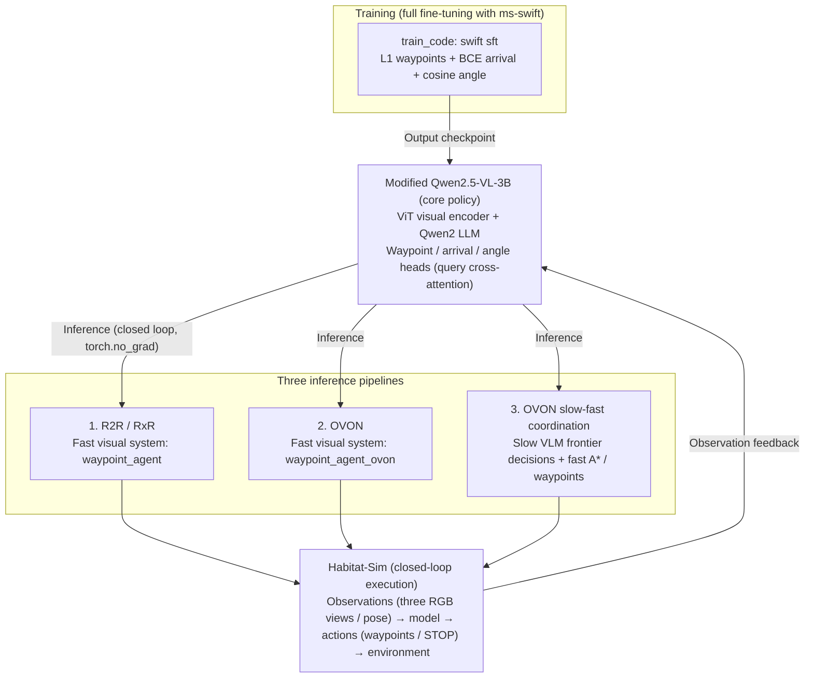
```mermaid
flowchart TD
    CORE["Modified Qwen2.5-VL-3B (core policy)<br/>ViT visual encoder + Qwen2 LLM<br/>Waypoint / arrival / angle heads (query cross-attention)"]

    subgraph TRAIN["Training (full fine-tuning with ms-swift)"]
        T1["train_code: swift sft<br/>L1 waypoints + BCE arrival + cosine angle"]
    end

    T1 -->|"Output checkpoint"| CORE

    CORE -->|"Inference (closed loop, torch.no_grad)"| P1
    CORE -->|"Inference"| P2
    CORE -->|"Inference"| P3

    subgraph PIPE["Three inference pipelines"]
        P1["1. R2R / RxR<br/>Fast visual system: waypoint_agent"]
        P2["2. OVON<br/>Fast visual system: waypoint_agent_ovon"]
        P3["3. OVON slow-fast coordination<br/>Slow VLM frontier decisions + fast A* / waypoints"]
    end

    P1 --> SIM
    P2 --> SIM
    P3 --> SIM

    SIM["Habitat-Sim (closed-loop execution)<br/>Observations (three RGB views / pose) → model → actions (waypoints / STOP) → environment"]
    SIM -->|"Observation feedback"| CORE
```

<div align="center">
  
<figcaption>
OmniNav overall architecture diagram: unified multi-modal word segmentation input VLM backbone, the fast system outputs a sequence of low-level waypoints, and the slow system generates sub-goals through a two-stage cycle of global planning and local path planning.
</figcaption>
</div>

#### 2.2 Fast Thinking System: end-to-end high-frequency action return
{: id="22-快系统fast-thinking-system端到端高频动作回归"}

The fast system is a **purely visual end-to-end** navigation policy. Its core is the structural transformation of Qwen2.5-VL-3B-Instruct, and a customized **waypoint regression header** is added after the backbone of the autoregressive language model. Its forward propagation bypasses the ordinary language generation `lm_head` and directly returns to output the coordinates and signs of the physical space:

1. **Input representation and feature extraction**:
   - **Current Trinocular Observation**: The current RGB images of the robot in the left, front, and right directions (for example, the size is `[640, 569, 3]`). Features are extracted by the ViT visual encoder, and the visual representation of approximately 460 Tokens is extracted from each frame of image through `smart_resize`.
   - **Low-resolution historical frames**: In order to control the amount of calculation while retaining the historical context, only the historical frames of the forward camera (maximum 20 frames, ring sampling) are retained and downsampled to 1/4 of the original resolution. After ViT extraction, each frame is about 30 Tokens.
   - **Prompt word and NAV special Token**: The sequence ends with a special action tag `<|NAV|>` to instruct the network to skip the generation head and enter the action return head.

2. **waypoint prediction header (Action Former)**:
   - Extract the output feature `hidden_states` of Qwen2 LLM (the dimension is `[B, L, 2048]`, where 2048 is the hidden dimension of the 3B model).
   - Using a learnable `query_action` parameter (the dimension is `[1, 1, 2048]`), through the 4-head cross-attention mechanism (Multihead Cross-Attention), the query is `query_action`, and the key/value is `hidden_states` for global feature aggregation, and the action feature `action_feature` (the dimension is `[B, 2048]`).
   - **waypoint regression**: Predict the relative displacement increments of the next 5 waypoint points through a linear layer, accumulate them on the time axis (`cumsum`), and finally multiply them by a scaling factor of 0.3 to restore the local displacement in meters to `(x, y)`.
   - **Angle prediction**: Through another independent linear layer combined with the `tanh` activation function, the heading angle sine and cosine values `(sinθ, cosθ)` of the next five waypoints are predicted, and converted into actual yaw angles through `atan2`.
   - **Arrival prediction**: Predict the arrival probabilities (Logits) of the next 5 locations through the third linear layer. Only when the arrival Logits of the five waypoints are all greater than or equal to 0, it is determined that the terminal has been reached and the `STOP` action is issued; otherwise, the movement control command is issued with the polar coordinate `(r, θ)` corresponding to the first landmark point `(x, y)`.

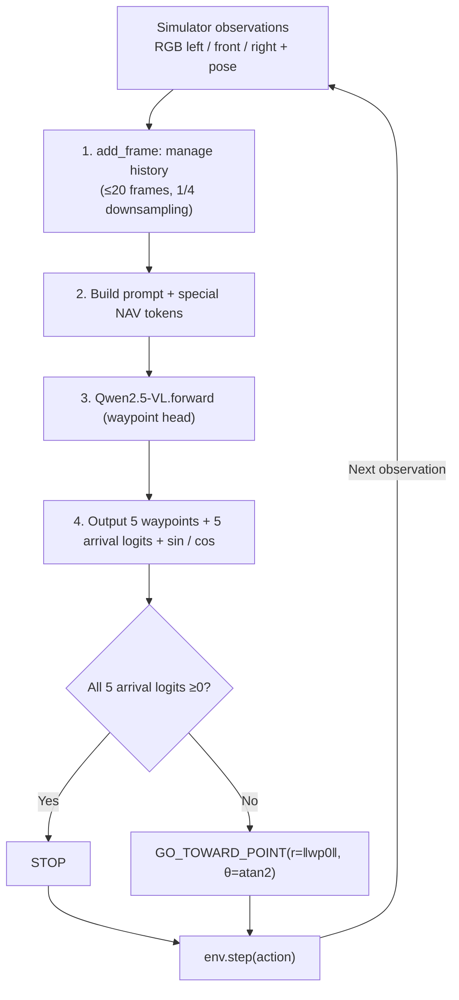
```mermaid
flowchart TD
    OBS["Simulator observations<br/>RGB left / front / right + pose"]
    M1["1. add_frame: manage history<br/>(≤20 frames, 1/4 downsampling)"]
    M2["2. Build prompt + special NAV tokens"]
    M3["3. Qwen2.5-VL.forward (waypoint head)"]
    M4["4. Output 5 waypoints + 5 arrival logits + sin / cos"]
    D{"All 5 arrival logits ≥0?"}
    STOP["STOP"]
    GO["GO_TOWARD_POINT(r=‖wp0‖, θ=atan2)"]
    STEP["env.step(action)"]

    OBS --> M1 --> M2 --> M3 --> M4 --> D
    D -->|"Yes"| STOP
    D -->|"No"| GO
    STOP --> STEP
    GO --> STEP
    STEP -->|"Next observation"| OBS
```

#### 2.3 Slow Thinking System: prudent decision-making based on cutting-edge and CoT
{: id="23-慢系统slow-thinking-system基于前沿与-cot-的审慎决策"}

The slow system is responsible for long-range exploration planning. In exploration tasks such as ObjectNav, the robot needs to autonomously decide “where to explore”. The slow system mainly relies on ordinary **text autoregressive generation** (using the `Qwen2.5-VL.generate` branch, sharing weights with the fast system):

1. **How it works**:
   - The robot rotates 360 degrees on the spot, stitches together 4 panoramic images, and uses LiDAR or depth data to update a simple 3D occupancy grid map (Occupancy Grid Map).
   - Use the "Fog of War" mechanism to detect all explorable Frontier Points at the edge of the current map.
   - Put these 4 panoramic pictures, the current pose of the robot, and the relative coordinates of all candidate frontier points into Prompt in the form of plain text, and require the model to reason about the current visibility of the target and select the frontier coordinates with the highest exploration value.
   - **CoT Inference**: The model first outputs a thought chain (such as analyzing semantic clues in historical frames: "The shower curtain is usually in the bathroom, just past the corridor, so I should explore towards the front of..."), and finally outputs the selected relative coordinates `[x, z]`, or `found` when the target is seen.

2. **Slow-fast collaborative closed loop**:
   - After the slow system locates the high-level frontier target, it sends the coordinates to the fast system.
   - As a low-level executor ("driver"), the fast system can call the fast system waypoint prediction strategy, or call the classic A* geodesic follower (Geodesic Follower) to bring the robot to the selected frontier point.
   - After reaching the frontier point, the in-situ scan and slow system decision-making are re-triggered, and the cycle repeats.

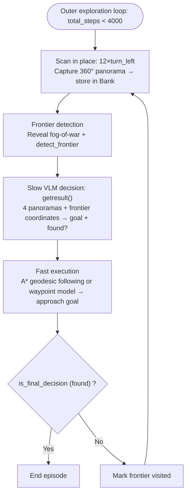
```mermaid
flowchart TD
    START(["Outer exploration loop: total_steps < 4000"])
    SPIN["Scan in place: 12×turn_left<br/>Capture 360° panorama → store in Bank"]
    FRONT["Frontier detection<br/>Reveal fog-of-war + detect_frontier"]
    VLM["Slow VLM decision: getresult()<br/>4 panoramas + frontier coordinates → goal + found?"]
    EXEC["Fast execution<br/>A* geodesic following or waypoint model → approach goal"]
    DEC{"is_final_decision (found) ?"}
    MARK["Mark frontier visited"]
    FIN["End episode"]

    START --> SPIN --> FRONT --> VLM --> EXEC --> DEC
    DEC -->|"Yes"| FIN
    DEC -->|"No"| MARK --> SPIN
```

<div align="center">
  
<figcaption>
slow system's chain thinking reasoning example for the "finding bathtub" task: the model gradually analyzes the semantic clues of historical frames, compares the exploration value of multiple candidate front points, and iteratively generates the next sub-target coordinates until the target object is located.
</figcaption>
</div>

#### 2.4 Core comparison between fast system and slow system
{: id="24-快系统与慢系统的核心对比"}

The following table summarizes the essential differences in inference configuration between fast-slow dual systems:

| Dimensions | Slow system (System-2 semantic decision-making) | Fast system (System-1 action execution) |
|---|---|---|
| **Core Responsibilities** | Use your brain to think about "where to explore" (semantic decision-making) | Use your hands and feet to control "how to get there" (low-level execution) |
| **Main input** | 4 360° panoramic images + frontier point coordinates (text) + target | short-term historical frames + current trinocular image + special action Token |
| **Decoding method** | `generate` discrete text autoregressive generation | Bypass `lm_head`, perform **direct continuous regression** through the action query header |
| **Output form** | CoT inference text and frontier coordinates, output `found` when seeing the object | 5 landmark point coordinates `(x, y)` + `(sinθ, cosθ)` + arrival Logits |
| **Call frequency** | Low frequency (usually triggered when turning, reaching a leading edge, or every N step decisions) | High frequency (closing the loop in Habitat is performed at a maximum frequency of 5Hz) |

#### 2.5 Data composition and two-stage training
{: id="25-数据构成与两阶段训练"}

1. **Mixed Dataset (9.2M+)**:
   - Navigation mission data (4M): includes instruction following (VLN-CE), frontier exploration and other multi-task data.
   - Visual-language general data (5.2M): includes general data such as charts, OCR, VQA, Referring & Grounding, etc. Experiments show that the large model's powerful common sense reasoning and referring capabilities are critical to the success of solving "open-vocabulary object navigation".

<div align="center">
  
<figcaption>
Overview of the training data composition: four categories: navigation task data (object/point/command target and frontier exploration), Embodied QA, general MLLM data and grounding/referring data.
</figcaption>
</div>

2. **Two-stage training process**:
   - **Stage 1 (Discrete Alignment)**: Use the autoregressive language modeling target (Autoregressive CE Loss) to train the fully connected layer and backbone, align the language, visual and action spaces, so that it can initially understand the instructions and scenes.
   - **Stage 2 (Continuous Regression Fine-tuning)**: Connect the `action_former` cross-attention regression head to the shared VLM backbone. Joint optimization is performed using L1 waypoint regression loss, cosine angle regression loss, and BCE arrival classification loss, while **mixing in 20% of Stage 1 discrete text data** to prevent fine-tuning from destroying VLM's base common sense and semantic understanding capabilities.

**⑤ Inference process**: In slow-fast collaborative reasoning, after the slow system uses the frontier or memory to generate high-level sub-goals, the fast system takes over and continues to generate low-level landmark point sequences to gradually approach the target; if the straight path is blocked by obstacles, the fast system will make detour adjustments based on real-time visual clues, reflecting that it is not a simple preset coordinate follower.

---

### 3. Results and findings
{: id="3-核心结果发现-21"}

- **Command Target Navigation** (R2R-CE / RxR-CE Val-Unseen): SOTA is achieved using only fast system and pure RGB input, and the success rate is increased by 4.4% and 4.3% respectively (SR 69.5% / 62.0% SPL) compared with the previous optimal method.
- **Object Target Navigation** (HM3D-OVON): Under pure visual input, it has surpassed the previous best method by 2.7%; after adding the slow system (frontier reasoning + CoT), the overall performance exceeds the previous strongest method by 18.4% (Val-Unseen SR 59.2%, SPL 33.2%).
- **Point Target Navigation** (CityWalker benchmark, open set MAOE metric): OmniNav 11.53% outperforms CityWalker’s 15.23%.
- **ablation research**: The four components of policy head (continuous waypoints vs discrete action blocks), slow system, general data, and CoT all bring stable and stackable gains, and the performance is best when all are enabled; among them, the slow system has the greatest improvement in long-range exploration tasks.
- **real robot deployment**: Using the cloud RTX 3090 to achieve gate loop control above 5Hz on a quadruped robot, it verified the effectiveness of three types of tasks: object-goals, point-goals (visual obstacle avoidance), and command targets in zero-shot scenarios.

<div align="center">
  
<figcaption>
real robot quadruped robot zero-shot deployment effect: object-goal (finding water machine/finding a person wearing a pink T-shirt/throwing garbage), point-goal visual obstacle avoidance (avoiding sofa, chair legs) and third-person perspective trajectory of instruction-following navigation.
</figcaption>
</div>

---

### 4. Limitations
{: id="4-局限性-21"}

The real physical deployment of the complete slow system still requires additional engineering (such as robust real-time integration of LiDAR/depth estimation). The real robot experiment in this article only verified the fast system components; the recognition of complex textured objects (such as blankets, clothing) is still unstable at any model scale, and the model scale (3B vs 7B) has similar benefits when the data is sufficient. Systematic scaling law research has not yet been conducted.

---


## 32. Qwen-RobotNav (2026)
{: id="qwen-robotnav"}
——The first unified multi-task, spatio-temporal reconfigurable embodied navigation model

📄 **Paper**: [arxiv:2606.18112](https://arxiv.org/abs/2606.18112)

### Key takeaways
{: id="精华-24"}
1. **Unified Modeling**: Qwen-RobotNav is the first large general navigation base model that unifies multi-task navigation (command following, target search, active tracking, autonomous driving) into parametric observation context modeling.
2. **Spatial-temporal reconfigurability**: Propose Task-Adaptive Observation Encoding, which can dynamically reconfigure the spatio-temporal context strategy by adjusting the Token budget, time attenuation and camera weight during inference.
3. **Zero modification to the architecture**: Use natural language tags to interleave camera angles and timestamps, and use embodied prefixes to distinguish platform roles. It can be generalized across platforms without modifying the pre-trained Qwen3-VL architecture.
4. **Joint training**: Using a 15.6M mixed dataset, the navigation trajectory and 15% of the general and navigation-specific visual language reasoning data are jointly trained (Co-training) to effectively prevent the model from pure action trajectory mapping degradation.
5. **Efficient collaboration**: In hierarchical Agent navigation, it works seamlessly with the upper-layer planner through the double-layer memory mechanism of "single-round evidence + cross-round memory book" to achieve significant step reduction and SOTA performance on long-term tasks such as EQA.

---

### 1. Background and problem
{: id="1-研究背景问题-23"}
Embodied intelligent navigation tasks (such as instruction following, target search, active tracking, and autonomous driving) are diverse, and their requirements for visual spatiotemporal context are essentially different. For example, command following requires long-range global memory to reset long-term landmarks, while active tracking highly relies on the latest frames of recent images for real-time response.

Most of the existing unified navigation models use fixed down-sampling or sliding window strategies, which cannot be adjusted to local conditions when deploying inference. In large-scale trajectory training, it is easy to lose the multi-modal general understanding and common sense of large models, and degenerate into passive action generators.

Therefore, how to expose a parameterized and reconfigurable observation coding interface on a single base model and build a universal navigation system that can cooperate with high-level agents is a core challenge in the field of embodied navigation.

---

### 2. Method and innovations
{: id="2-主要方法创新点-21"}

#### Overall framework overview
{: id="整体框架概述-1"}
Qwen-RobotNav inherits from the Qwen3-VL multi-modal large model, and designs an extremely lightweight 4-layer MLP action prediction head based on it. The core idea of ​​this framework is to uniformly model multi-task navigation as a trajectory planning task of regression prediction of 8 future waypoints. At the input end of the data flow, the system exposes a parameterized interface consisting of Token budget $B$, time attenuation coefficient $\gamma$ and camera weight $w_c$ to adaptively control the resolution of the input image and the spatio-temporal Token proportion, thereby achieving seamless inference period strategy reconstruction.

<div align="center">
  
<figcaption>
Figure 1: Qwen-RobotNav overall model architecture diagram
</figcaption>
</div>

#### Module by module explanation
{: id="逐模块讲解-1"}

##### ① Parametric observation encoding and Token dynamic allocation
{: id="-参数化观测编码与-token-动态分配"}
* **Input**: Multi-view image sequence $I_{1:T}^{1:N}$ (captured by $N$ cameras at $T$ time steps), Token budget $B$, time attenuation factor $\gamma$, camera weight vector $w_c$.
* **Processing**: The system first calculates the temporary attenuation weight of each reserved frame according to the time step $t$:
  $$\omega_t = \exp\left(\gamma \cdot \frac{t}{T' - 1}\right)$$
Among them, when $\gamma=0$, it degenerates to uniform distribution, and when $\gamma > 0$, the weight is more biased towards the latest frame. Subsequently, the joint spatio-temporal weight matrix $W[t,c] = \omega_t \cdot w_c$ is generated by combining the camera weights of each perspective (such as forward camera $w_{\text{front}}=2.0$, backward camera $w_{\text{rear}}=0.5$). Finally, through the **Restricted Allocation Algorithm (CONSTRAINEDALLOC)**, the total Token budget $B$ is allocated to the corresponding pictures on the premise of satisfying the upper and lower limits of the single picture Token $[b_{\min}, b_{\max}]$. These assigned tokens determine the pixel resolution of the input image for size scaling and patch merging using dynamic-resolution ViT.
* **Output**: Image sequence feature token after dynamic resolution scaling.
* **Design motivation**: Implement inference switching context tendencies without fine-tuning. For example, in local reactive tracking, you can use large $\gamma$ and small budget to quickly process the latest frames; in global search, adjust $\gamma$ smaller and larger $B$ to retain more historical frame information.

<div align="center">
  
<figcaption>
Figure 2: Visualization of task adaptive observation encoding (Token allocation)
</figcaption>
</div>

##### ② Space-time view identification and embodied prompts
{: id="-时空视图标识与具身提示"}
* **Input**: Dynamic resolution image feature token, current natural language command, embodied prompt prefix (such as "Imagine you are a robot..." or "Imagine you are a car...").
* **Processing**: The system directly interleaves the natural language camera viewpoint identification (such as "Front View", "Left View") and time step ("Time step t") before the corresponding image Token. Also, place the embodied type in the system prefix of Prompt.
* **Output**: A unified graphic and text interlaced Token sequence input to the Qwen3-VL language base.
* **Design motivation**: By interpolating spatio-temporal identifiers in ordinary text vocabulary, it avoids the introduction of additional spatial/temporal position encoding layers, retains the language grounding and spatial reasoning capabilities of the pre-trained large model to the greatest extent, and thus can support new robot chassis or sensor configurations with zero-shot.

##### ③ Action planning head and trajectory planning
{: id="-动作规划头与轨迹规划"}
* **Input**: The last hidden layer state of Qwen3-VL on the corresponding waypoint feature $E_A \in \mathbb{R}^d$.
* **Processing**: The hidden state is passed through a 4-layer high-dimensional MLP (hidden unit 512, using the GELU activation function), and the 99th percentile of each dataset is used as the scale factor during training to normalize the true waypoint coordinates to between $[-1, 1]$ for regression.
* **Output**: $K=8$ future 2D trajectory waypoint $$W = \{(x_k, y_k, \theta_k)\}_{k=1}^8$$ with heading angle.
* **Design motivation**: The action head is designed to be as lightweight as possible, ensuring that almost all spatiotemporal modeling and common sense reasoning are performed inside the large language base, thereby ensuring strong cross-scenario generalization capabilities.

#### end-to-end data flow and agent collaboration
{: id="端到端数据流与-agent-协作"}
When deployed in a multi-task long-range scenario (such as EQA), the system consists of an upper-layer planner (such as Qwen3.6-Plus) and the underlying Qwen-RobotNav. The upper-level planner performs high-level reasoning and disassembly based on the global goal, and issues a navigation Tool call containing the specific task mode $\tau_i$ and observation parameters $\Phi_i$ (such as $B$, $\gamma$). Qwen-RobotNav outputs trajectories and executes them as a high-frequency actuator. After each execution, **Navigation Harness** will automatically refine the execution process into compact **Trajectory Evidence** (recording key landmarks and target states), and use it to update the global **Evidence Notebook**. This mechanism implements hierarchical end-to-end closed-loop control and successfully avoids context explosion caused by repeatedly stuffing dense video streams into large models.

<div align="center">
  
<figcaption>
Figure 3: Hierarchical collaboration process between Qwen-RobotNav and upper-layer Agent
</figcaption>
</div>

#### Training strategies and joint training
{: id="训练策略与联合训练"}
The loss function of joint optimization is defined as:
$$L = L_{\text{traj}} + \lambda L_{\text{VL}}$$
Among them, $L_{\text{traj}}$ is the MSE loss of the predicted trajectory relative to the ground-truth; $L_{\text{VL}}$ is the autoregressive Next-Token cross-entropy loss based on vision-language samples, which is used to prevent the language understanding and open-world visual perception capabilities of large models from degenerating and collapsing in pure trajectory fine-tuning. During the training process, all observation configurations ($B$, $\gamma$, $w_c$, $b_{\min}$, $b_{\max}$) will be independently randomly sampled at each batch step, allowing the model to naturally adapt to any configuration changes during inference.

<div align="center">
  
<figcaption>
Figure 4: Visualization of structured multi-view reasoning chain in training
</figcaption>
</div>

---

### 3. Results and findings
{: id="3-核心结果发现-22"}

#### Experimental benchmark overview
{: id="实验基准概览"}
Qwen-RobotNav-4B and 8B have demonstrated state-of-the-art (SOTA) levels in multiple benchmark tests, covering multiple dimensions such as instruction following, target exploration, active tracking, and autonomous driving.

<div align="center">
  
<figcaption>
Figure 5: SOTA summary of Qwen-RobotNav on various embodied intelligent navigation and driving standards
</figcaption>
</div>

* **Directive Compliance (VLN-CE)**:
On the R2R benchmark, Qwen-RobotNav-8B reaches 72.1% success rate (SR) and 66.6% SPL; on the long-range RxR benchmark, it reaches 76.5% SR, exceeding the strong baseline NavFoM by 12.1% SR. Under the monocular setting with only a single forward camera, it still achieved 66.9% SR in R2R and 73.4% SR in RxR, surpassing the professional monocular model.
* **Active Tracking (EVT-Bench)**:
In the EVT-Bench monocular tracking task, Qwen-RobotNav achieved a tracking rate (TR) of 90.0%, which is the highest value among general large models and special tracking models (such as TrackVLA++), and the collision rate is only 5.70%.
* **Autonomous Driving (NAVSIM & AlpaSim)**:
On the NAVSIM benchmark, after introducing the historical ego status (Ego-Status) of the first three frames, Qwen-RobotNav-4B achieved **91.4 PDMS (PDM Score)** and NC (navigation compliance rate) as high as 99.8%, surpassing dedicated multi-modal driving models such as WoTE and LAW. In addition, the model demonstrates excellent zero-shot cross-domain closed-loop control generalization capabilities on AlpaSim.
* **Embodied Questioning and Answering (EQA)**:
In the joint test with the Qwen3.6-Plus Agent architecture, the system achieved 76.7% SR in HM-EQA and 54.4% SR in MT-EQA, and the number of converted equivalent steps (Steps) required for navigation was 77% simpler than the previous SOTA method (such as FAST-EQA).

#### Data scale and interface control ablation
{: id="数据规模与接口控制消融"}

<div align="center">
  
<figcaption>
Figure 6: Data scale expansion curve (command compliance, target search, active tracking, autonomous driving)
</figcaption>
</div>

* **Data volume ablation**: After expanding the proportion of navigation trajectory data from 12.5% to 100%, the performance of command following (RxR) and autonomous driving (NAVSIM) is particularly significant, while short-range tracking tasks quickly saturate with less data.
* **Control parameter ablation**:
  * **Token Budget $B$**: When the budget is increased from 2048 to 4608, the SR of R2R climbs from 70.8% to 74.6%, but after exceeding 3584, the OSR indicator shows a diminishing marginal effect, indicating that excessive redundant visual features may introduce negative noise.
  * **Attenuation coefficient $\gamma$**: In the scan parameters of $\gamma$ raised from 0.5 to 3.5, the SR index reaches a peak (72.5%) at $\gamma=3.0$, which shows that for local navigation, it is very important to strengthen the Recency Bias of the latest frame weight, but excessive attenuation will cause history loss, thus slightly damaging the efficiency of the overall path planning.

<div align="center">
  
<figcaption>
Figure 7: Scan parameter ablation diagram
</figcaption>
</div>

#### Real world robot deployment
{: id="真实世界机器人部署"}
Qwen-RobotNav is deployed on the Yushu Unitree Go2 quadruped robot and mobile base, demonstrating extraordinary zero-shot grounding capabilities in real scenes such as exhibition halls and complex apartments that have never been seen before.

<div align="carousel">
  <div align="center">
  
<figcaption>
Figure 8: Long-range command compliance and precise reverse reversing behavior in the real-world exhibition hall
</figcaption>
</div>
  <!-- slide -->
  <div align="center">
  
<figcaption>
Figure 9: Cross-room control based on precise verbal instructions in a real apartment scene
</figcaption>
</div>
  <!-- slide -->
  <div align="center">
  
<figcaption>
Figure 10: Real long-range multi-task Agent cooperative closed-loop control (finding Umbrella and reporting the situation)
</figcaption>
</div>
</div>

* **Long-range trajectories and motion primitives**: In a real corridor up to 21.78 meters long, the quadruped robot successfully traversed multiple mixed scenes relying entirely on natural language instructions. Remarkably, when receiving the language primitive of "go back", the model can accurately re-take the forward route in a backward posture without any odometry or target map input, verifying its accurate spatial closed-loop understanding in a complex physical environment.
* **Refined control and dynamic planning**: In a real apartment, the robot accurately executes fine spatial detail logic such as "walk around the bed", "stop on the left side of the night vision platform", "turn around before going out" and so on. In a more advanced Agent task, the robot can autonomously explore and find the green umbrella dropped in "Cotti Coffee" and automatically report significant road signs while traveling.

---

### 4. Limitations
{: id="4-局限性-22"}
1. **Computing power barrier for edge deployment**: Although the remote-server mode has excellent latency performance (196 ms, 5.1 Hz), it is naturally dependent on network stability and transmission bandwidth, which is prone to delay spikes during high-speed movement or network signal dead spots. When using NVIDIA Jetson Thor for FP8 quantitative deployment, although the delay is relatively stable (204 ms, 4.9 Hz), it is still subject to strict physical limitations of the end-side GPU memory and computing bandwidth, which greatly restricts the upper limit of multi-view and high-frequency decision-making.
2. **Efficiency loss based on Skeleton path**: Since the skeleton-based medial-axis exploration algorithm is widely used in ObjectNav data generation, although it successfully teaches the model how to conduct a thorough "room-corridor-dead-end" backtracking search in unknown scenes, it greatly improves the final success of finding objects. rate (Reach-first), but this also causes the model to tend to be overly cautious in safe obstacle avoidance and large-scale search when faced with known paths, resulting in low SPL indicators on some specific paths.

---


## 33. GA-VLN (2026)
{: id="ga-vln"}
——— Geometry-Aware BEV Representation for Efficient Vision-Language Navigation

📄 **Paper**: [arXiv:2605.22036](https://arxiv.org/abs/2605.22036) · 🏛️ **CVPR 2026** · [Code](https://github.com/jahhaoyang/GA-VLN)

### Key takeaways
{: id="精华-25"}
1. A new geometry-aware bird's-eye view (GA-BEV) feature representation method for continuous environment vision-language navigation (VLN-CE) is proposed.
2. GA-BEV combines explicit depth map-based 3D projections with implicit 3D geometric priors from a 3D base model (VGGT) to build compact and spatially structured agent-centered BEV maps.
3. Grid-Based BEV Aggregation is used to greatly compress the number of historical visual tokens, while improving the navigation success rate and reducing the average number of tokens per step of reasoning from approximately 4000 to 514.
4. Combined with multi-modal large language model (MLLM, such as LLaVA-Video), an efficient two-stage conversational action prediction framework is designed to achieve an efficient operation mechanism in which BEV features are only updated once every 8 steps.
5. It has refreshed SOTA on continuous VLN benchmarks such as R2R-CE, RxR-CE and NavRAG-CE, and does not rely on labor-intensive DAgger enhancement or universal VQA hybrid training, demonstrating extremely high data efficiency and zero-shot generalization capabilities.

---

### 1. Background and problem
{: id="1-研究背景问题-24"}
When dealing with continuous environments, most existing vision-language navigation (VLN) methods directly send dense historical RGB video patches (patch tokens) into the multi-modal large language model (MLLM) for action decision-making. There are two core limitations to this approach:
- **High Computational Overhead**: As the time step increases, dense RGB video blocks will generate an extremely large number of tokens ($t \times H_p \times W_p$ level tokens), bringing huge inference delays and computational burdens.
- **Lack of explicit spatial structure**: Pure image features lack explicit 3D geometry and spatial structure, causing the agent to face serious challenges in multi-view spatial reasoning (such as "turn left and look for the TV behind you") and limited navigation performance.

---

### 2. Method and innovations
{: id="2-主要方法创新点-22"}

In order to overcome the above limitations, this paper proposes the **GA-VLN** framework, the core of which is to build a **Geometry-aware bird's-eye view (GA-BEV)** representation that integrates explicit depth geometry and implicit 3D priors and is reused in MLLM navigation decisions, which greatly balances performance and efficiency.

<div align="center">
  
<figcaption>
Figure 1. Comparison of traditional dense video input and GA-BEV representation methods: GA-BEV compresses dense patch tokens into compact agent-centered BEV physical representations through geometric projection
</figcaption>
</div>

#### GA-BEV characterization construction process
{: id="ga-bev-表征构建流程"}

The construction process of GA-BEV mainly includes the following three steps:

<div align="center">
  
<figcaption>
Figure 2. GA-VLN overall framework flow chart: fuse explicit projection features and implicit 3D geometric priors to generate compact BEV features and use them for MLLM two-stage dialogue generation
</figcaption>
</div>

**① Explicit Depth-Guided Spatial Projection**
- **Input**: RGB patch feature $V_t \in \mathbb{R}^{H_p \times W_p \times d_p}$ at the current time step, and depth map $D_t \in \mathbb{R}^{H_p \times W_p}$ scaled to the same resolution via bicubic interpolation.
- **Processing**: Using the current time step agent's position $p_t$, camera rotation matrix $R_t$ and camera intrinsic parameter matrix $K$, according to the pinhole camera model, back-project the center of each 2D pixel block into the 3D world coordinate system:
  $$\hat{p}_t(u, v) = R_t K^{-1} \begin{bmatrix} u \\ v \\ 1 \end{bmatrix} D_t(u, v) + p_t$$
- **Output**: Point cloud features mapped to 3D space, which explicitly injects the spatial geometry consistency of the 3D physical world into the agent at the input stage.

**②Implicit 3D Geometry Priors**
- **Input**: Historical image sequence $\{I_1, \dots, I_t\}$ experienced by the agent.
- **Processing**: Input the historical sequence into the 3D foundation model $f_{3DFM}$ (such as VGGT-1B) with frozen parameters. This model has been pre-trained on large-scale 3D reconstruction tasks and has excellent multi-view geometry perception and shape priors:
  $$V^g = f_{3DFM}(\{I_1, \dots, I_t\}) \in \mathbb{R}^{t \times H_g \times W_g \times d_g}$$
Adjust feature dimensions to match SigLIP features via a 2-layer MLP (Linear-GeLU-Linear) projection layer $f_{project}$:
  $$\tilde{V}^g = f_{project}(V^g) \in \mathbb{R}^{t \times H_g \times W_g \times d_p}$$
Then, use the same spatial projection method as step ① to project it into the 3D space to obtain the corresponding 3D coordinates $$\hat{p}_g \in \mathbb{R}^{t \times H_g \times W_g \times 3}$$.
- **Output**: 3D base features rich in implicit shape structure and multi-view geometric consistency.

**③ Grid-Based BEV Aggregation**
- **Input**: The unified 3D spatial feature set $V = V \cup \tilde{V}^g$ and its corresponding 3D physical location $$\hat{P} = \{\hat{p}\} \cup \{\hat{p}_g\}$$.
- **Processing**: Since indoor space objects are shorter in the height direction and the agent's actions are mainly constrained on the 2D ground, all 3D features are projected onto the current agent-centered $(x, z)$ Bird's-Eye-View (BEV) plane.
  - Discretize the BEV plane into a $N \times N$ grid centered on the agent, with a sensing range of $[-R, R]$ (take $[-10\text{m}, 10\text{m}]$) and a grid size of $\Delta \times \Delta$ (take $0.25\text{m} \times 0.25\text{m}$).
  - For each non-empty grid $(i, j)$, collect all 3D feature sets $S_{i, j}$ that fall into that grid.
  - Perform mean pooling on the features within the grid and add 2D sinusoidal position encoding (position embedding) $e_{i, j}$:
    $$B = \left\{ \frac{1}{\lvert S_{i,j} \rvert} \sum_{v \in S_{i,j}} v + e_{i,j} \;\middle|\; \lvert S_{i,j} \rvert > 0, i,j \in [1, N] \right\}$$
  - Only non-empty grids are retained to maximize the compression of redundant tokens.
- **Output**: High-density, compact agent-centric BEV geometry map feature $B$.

#### Navigating decision-making and reasoning processes: a two-stage dialogue framework
{: id="导航决策与推理流程双阶段对话框架"}

In order to maximize reasoning efficiency, GA-VLN formulates action decision-making as a two-stage conversational generation process:
1. **Round 1**: The agent receives the verbal instruction $L$, the current frontal view image $IMAGE$ (encoded using SigLIP), and the GA-BEV feature $BEV$ that aggregates up to 32 recent historical step observations. MLLM (LLaVA-Video-7B) predicts 4 actions (such as `move forward`, `turn left`, `turn left`, `move forward`) at once.
2. **Second round of dialogue (Round 2)**: After executing these 4 steps, the agent does not need to re-project and update the BEV features. It only obtains the new position of the front view image $IMAGE$, continues to reuse the BEV features of the first round and inputs them to MLLM, and then predicts 4 actions (such as `turn left`, `turn right`, `move forward`, `STOP`).
3. **Update Period**: The agent will rebuild and update the BEV features only after every 8 steps (i.e., completing two rounds of dialogue). This significantly reduces the call frequency of forward propagation and spatial projection of the 3D foundation model.

---

### 3. Results and findings
{: id="3-核心结果发现-23"}

GA-VLN is evaluated on multiple continuous navigation datasets in the Habitat simulation environment:

- **Benchmarks Beyond SOTA** (shown in Table 1):
  - On **R2R-CE**, the success rate (SR) reaches **61.0%** and the SPL reaches **55.2%**, both exceeding the previous most advanced Image-based MLLM agents (such as StreamVLN: SR 56.9%, SPL 51.9%).
  - On **RxR-CE**, the success rate (SR) reaches **55.4%** and the SPL reaches **45.2%**.
  - On **NavRAG-CE**, the success rate (SR) is **22.2%** and the SPL is **18.2%**.
  - **Important Features**: GA-VLN achieves these excellent results in a small number of Epochs by relying on high-quality datasets without using DAgger data augmentation and general VQA data for joint training, verifying its extremely high training efficiency.

- **ablation experiment and efficiency analysis**:
  - **Complementarity of explicit depth projections and implicit 3D priors** (Table 2):
    - Using only depth-projected BEV representations (w/o VGGT), SR improves from 51.49% of the baseline to 59.21%, and Latency drops from 342.9ms to 212.9ms (thanks to the extreme compression of the token).
    - After further integrating VGGT's 3D implicit prior, the success rate (SR) further climbed to 60.96%. Although there is a slight additional overhead due to the 3D Foundation Model, the overall Total Latency (258.7ms) is still much lower than the Baseline (342.9ms).
  - **Optimal BEV hyperparameters**: The grid resolution is set to $0.25\text{m} \times 0.25\text{m}$, which is the most cost-effective (Table 3); the historical step size is 32, which is optimal. If it is too long, it will introduce cumulative errors and physical drift.
  - **Strong anti-noise robustness** (Table 4): Under the sensor noise test that simulates the depth jitter ($\sigma = 0.05\text{m}$), displacement drift ($\sigma = 0.05\text{m}$) and rotation deviation ($\sigma = 5^{\circ}$) of the Stretch 3 robot, the SR drop of GA-VLN is less than 2%, indicating that gridded mean pooling and multi-view 3D The addition of features greatly enhances robustness.

<div align="center">
  
<figcaption>
Figure 3. Comparison of token occupancy at each navigation step: GA-VLN greatly reduces the historical feature token length compared to the traditional MLLM benchmark (dense RGB input), maintaining constant and low occupancy
</figcaption>
</div>

---

### 4. Limitations
{: id="4-局限性-23"}
- **Strong dependence on real-time depth map**: The explicit projection link is very dependent on the quality of the input depth map. In the case of complete loss of depth or extreme deterioration of depth map quality (such as specular reflection, direct strong light), the 3D reconstructed BEV map may undergo large deformations, thereby affecting navigation performance.
- **Historical Sliding Window Limitation**: Although the 32-step historical sliding window performs well in most scenes, when navigating in extremely large-scale or multi-floor long-range complex scenes, the sliding window may discard earlier key landmarks, causing backtracking difficulties.

---

### 5. Real world robot deployment
{: id="5-真实世界机器人部署"}

<div align="center">
  
<figcaption>
Figure 4. Real vehicle test of GA-VLN on the physical agent Hello Robot Stretch 3: Without external obstacle avoidance and global mapping modules, it completely relies on GA-VLN zero-shot output path and generates semantic BEV local map
</figcaption>
</div>

---


## 34. SEDualVLN (2026)
{: id="sedualvln"}
——Spatially enhanced dual-system continuous environment vision-language navigation framework

📄 **Paper**: [arXiv:2605.17249](https://arxiv.org/abs/2605.17249)

### Key takeaways
{: id="精华-26"}
1. **Fast and slow coordination decision-making**: The navigation task is decomposed into System 1 (lightweight VLM atomic action predictor, high frequency) and System 2 (general MLLM global boundary path planner, low frequency), taking into account execution efficiency and global planning capabilities.
2. **Multi-scale spatial enhancement**: Global 3D geometry implicit supervision and local channel connectivity explicit extraction are respectively implemented for System 1, which significantly reduces the probability of VLM taking the wrong direction at a fork in the road.
3. **Physically consistent 3D path rendering**: System 2 provides high-fidelity spatial perception for general large models through online 3D mapping and interpolation along the path to render virtual views, effectively reducing the spatial illusion caused by pure text or 2D perspectives.
4. **New heights of performance**: Achieved state-of-the-art State-of-the-Art performance on the continuous vision-language navigation (VLN-CE) benchmarks (R2R-CE and RxR-CE).

---

### 1. Background and problem
{: id="1-研究背景问题-25"}
Existing vision-language Navigation (VLN) methods are mainly divided into two categories: the first is the end-to-end visual language model (VLM) strategy based on trajectory data fine-tuning, which has fast action execution but lacks dynamic reasoning capabilities, and is easily degraded due to the accumulation of historical context in long-distance navigation; the second is the zero-shot (Zero-Shot) modular solution, which uses a general multi-modal large model (MLLM) as a planner. Although it has strong generalization capabilities, it is prone to spatial illusions due to the lack of precise spatial positioning and geometric reasoning capabilities, and the reasoning delay is huge.

Although there have been some dual-system attempts recently, most of them simply pieced together two paradigms and did not fundamentally solve the problem of weak spatial awareness of the underlying model. This paper proposes **SEDualVLN**, which focuses on giving the agent a strong spatial awareness through global and local multi-scale **spatial enhancement** to improve its long-term navigation robustness in unseen continuous environments.

---

### 2. Method and innovations
{: id="2-主要方法创新点-23"}

#### ① Dual system overall framework
{: id="-双系统整体框架"}
SEDualVLN consists of two subsystems and a cooperative scheduler:
- **System 1 (Fast System/Action Generator)**: A high-frequency running, fine-tuning-based VLM predicts discrete atomic actions (forward, turn left, turn right, stop) directly from the current first-view RGB image stream and instructions.
- **System 2 (Slow System/Path Planner)**: Low-frequency operation, based on 3D real-time mapping, path interpolation rendering and general MLLM (such as GPT-4o), selects the best boundary waypoint (waypoint) on the global map.

Two systems work together: System 2 is responsible for guiding the general direction, and System 1 is responsible for executing the microscopic atomic actions required to reach the waypoint. Usually, System 2 performs a global waypoint re-planning (frequency ratio 20:1) when System 1 performs about 20 atomic actions. This "fast-slow collaboration" design not only ensures real-time response, but also takes into account the integration of global spatial information.

<div align="center">
  
<figcaption>
Figure 1: Overall framework of SEDualVLN dual system. The orange system 1 generates fast underlying actions through VLM, and the green system 2 uses online 3D mapping and path image rendering, and uses general MLLM to plan global boundary points.
</figcaption>
</div>

#### ② System 1: Spatially enhanced VLM model
{: id="-系统-1空间增强的-vlm-模型"}
System 1 is based on the StreamVLN backbone network and achieves efficient reasoning through a multi-round dialogue mechanism and KV cache. This paper introduces **global** and **local** dual spatial enhancement strategies to overcome the problem that traditional VLM spatial representation is implicit and prone to drift over long distances:

- **Global Spatial Enhancement Strategy**:
Instead of relying on additional depth map sensors or explicit 3D reconstruction models, an implicit alignment strategy is adopted. The author uses the pre-trained 3D base model VGGT to extract the 3D spatial structure features of the current frame. Then a two-layer MLP is connected to the attention fusion layer (layer 24) in the middle of LLaVA-Video to project the visual token of VLM and align it with the 3D spatial features extracted by VGGT.

During training, VLM is guided to implicitly learn 3D spatial geometry and structural information by minimizing the cosine distance between the two. Its joint training loss function $L_{\text{SE}}$ is defined as follows:
  $$L_{\text{SE}} = L_{\text{action}} + \alpha \cdot \frac{1}{N} \sum_{t=1}^{N} \left[ 1 - \cos\left(V_t, S_t + p_t\right) \right]$$
Among them, $V_t$ represents the projected visual token, $S_t$ represents the 3D spatial representation from VGGT, $p_t$ is the position encoding, and $\alpha$ is the loss weight coefficient.

- **Local Spatial Enhancement Strategy**:
In actual navigation, passages (such as corridors, doorways) are key topological structures connecting different areas, and VLM can easily choose the wrong branch at these decision-making forks. To this end, the author designed the **Passage Connectivity Extraction Module**. This module first uses the open-vocabulary target detection model Grounding DINO to automatically identify the channel areas in the current field of view, then uses SAM to segment these areas to obtain binary masks (pixels in the channel area are set to 1, non-channels are set to 0), and then projected via MLP into a local topology Token with the same dimension as the global visual Token and input to the VLM. This strategy enables VLM to explicitly focus on channel connectivity, significantly reducing fork-in-the-road decision errors.

<div align="center">
  
<figcaption>
Figure 2: Internal process of system 1. The spatial perception of VLM is jointly enhanced through global spatial enhancement (implicit supervision of feature alignment based on VGGT) and local spatial enhancement (extraction of channel connectivity binary features through Grounding DINO + SAM).
</figcaption>
</div>

#### ③ System 2: MLLM planner based on “mapping-rendering-inference”
{: id="-系统-2基于建图-渲染-推理的-mllm-规划器"}
System 2 aims to exploit the powerful commonsense reasoning and zero-shot capabilities of general-purpose MLLMs (such as GPT-4o) and overcome their spatial illusions in conjunction with physically consistent 3D maps. The planning process is divided into the following three steps:

1. **Real-time Mapping**:
Based on the LingBot-Map algorithm, the agent constructs a lightweight 3D point cloud map online in real time during navigation, and simultaneously generates a 2D frontier map to guide unexplored areas.
2. **Path virtual rendering (Rendering)**:
Assume that the current set of candidate boundary points is $F = \{f_1, ..., f_n\}$. The system first uses the A* algorithm to calculate the collision-free path from the current position to each boundary point on the topological map:
   $$P_i = \text{A}^*(x_0, F_i)$$
In order to visually present the perspective along the path to the large model, the system performs linear interpolation between adjacent nodes on the path (if the Euclidean distance exceeds the threshold $d$, virtual pose points are inserted), and renders a virtual camera RGB view based on the interpolated pose. Subsequently, in order to reduce the input token consumption of the large model, the cosine similarity of the CLIP encoder is used to perform redundant frame pruning, and only the key path frame $\{I_1, ..., I_m\}$ with obvious scene changes is retained:
   $$s(I_k, I_{k+1}) = \frac{\langle \phi(I_k), \phi(I_{k+1}) \rangle}{\lVert \phi(I_k) \rVert \lVert \phi(I_{k+1}) \rVert} < \tau \implies \text{keep } I_{k+1}$$
3. **Two-stage multimodal reasoning (Reasoning)**:
   - **Phase 1 (environmental self-awareness enhancement)**: Input a 3D top-down map to GPT-4o and let it summarize and describe the agent's current location and surrounding environment (extracting positions, spatial relationships and feasible directions).
   - **The second stage (simulated motion waypoint evaluation)**: Input the view sequence rendered by each candidate path to GPT-4o, let it evaluate and select the next best boundary waypoint $F_i$ through the fit between vision and instructions.

<div align="center">
  
<figcaption>
Figure 3: Mapping-Rendering-Reasoning workflow of System 2. First, lightweight 3D and 2D boundary maps are reconstructed in real time, and then virtual path maps are rendered through A* pathfinding and perspective interpolation. Finally, the best boundary waypoint is determined by a general large model combined with top view and rendering sequence.
</figcaption>
</div>

---

### 3. Results and findings
{: id="3-核心结果发现-24"}

- **SOTA Performance**:
On the Val-Unseen validation set of the continuous vision-language navigation benchmarks R2R-CE and RxR-CE, SEDualVLN achieved an absolute improvement of **3%** and **2.5%** respectively in success rate (SR) compared to the previous state-of-the-art dual-system method DualVLN, without relying on any additional depth or global sensor information, reaching new benchmark heights using only monocular RGB input.

- **Ability to avoid mistakes at forks in the road**:
Ablation experiments and qualitative analysis show that at complex forks or room junctions, the introduction of channel connectivity extraction (LSES) can greatly correct the agent's wrong turns caused by visual confusion.

- **Efficiency of fast and slow collaboration**:
When running System 2 alone, the average time for a single navigation is extremely long (nearly 300 seconds for AT) due to GPT-4o interface latency and intensive computation. By introducing a 20:1 fast-slow frequency ratio, the dual-system collaborative work not only makes the success rate higher than that of separate system 1 or system 2, but also reduces the average navigation time (AT) by more than 5 times, perfectly balancing computing efficiency and decision-making accuracy.

<div align="center">
  
<figcaption>
Figure 4: Qualitative comparison with SOTA method StreamVLN. At the intersection, due to StreamVLN's lack of explicit channel connectivity awareness, the wrong fork in the road was chosen at the start; while SEDualVLN was able to choose the correct path and reach the end point smoothly.
</figcaption>
</div>

<div align="center">
  
<figcaption>
Figure 5: SEDualVLN navigation and real-time mapping process visualization. The agent renders the observation flow from the path perspective based on the real-time construction of 3D/2D map, and finally accurately locates and reaches the end point.
</figcaption>
</div>

---

### 4. Limitations
{: id="4-局限性-24"}
1. **Difficulty in deploying real physical devices**: This framework relies heavily on the performance of real-time 3D mapping. When deployed on real physical robot equipment, the current real-time 3D reconstruction feature extraction still has large computational overhead and noise distortion, and the distortion of mapping may directly interfere with the accuracy of System 2 path planning.

---
---

### Appendix: System 2 Reasoning Process Case and Prompt Template
{: id="附录系统-2-推理过程案例与-prompt-模板"}

In the reasoning mechanism of System 2, GPT-4o’s decision-making consists of two stages:
1. **Environment understanding stage**: The guidance model extracts core spatial information based on the 3D top view, and outputs the current Location (location environment), Relationship (spatial relationship of furniture or obstacles) and Possible directions (potential correct path orientation).
2. **Planning Decision Stage**: Input the virtual camera rendering flow of each boundary point path, evaluate which of the boundary points such as F1, F2, F3, etc. best meets the navigation instructions, and generate specific reasons.

<div align="center">
  
<figcaption>
Figure 6: Visualization of the first stage of system 2 environment understanding decision-making. GPT-4o understands the current specific kitchen layout and table and chair orientation based on the 3D top view.
</figcaption>
</div>

<div align="center">
  
<figcaption>
Figure 7: The second stage of System 2 makes boundary point decisions based on the path rendering flow. GPT-4o compared the multi-frame renderings of different boundary paths and pointed out that the F3 path was most consistent with the instruction of "walk along the main aisle to the table".
</figcaption>
</div>

---


## 35. Robostral Navigate (2026)
{: id="robostral-navigate"}
———An 8B vision-language navigation large model that only requires a monocular RGB camera: ultra-efficient simulation training and online reinforcement learning

📄 **Paper**: [arXiv:2607.20785](https://arxiv.org/abs/2607.20785) · [Project Page](https://mistral.ai/news/robostral-navigate)

---

### Key takeaways
{: id="精华-27"}

1. **monocular RGB minimalist perception architecture**: Robostal Navigate completely breaks the dependence on depth sensors (RGB-D), LiDAR, multi-view camera arrays or pre-built maps. It only takes the monocular RGB image stream as input, directly predicts Pointing coordinates (pixel coordinates) and heading angle changes in the image space, decouples physical geometry and hardware internal parameter constraints, and achieves zero-shot migration across heterogeneous robots.
2. **High and low-layer decoupling hierarchical control**: A hierarchical control pipeline using "8B VLM visual language reasoning (0.5 Hz prediction Waypoint) + 121M diffusion policy (10 Hz generated action blocks) + robot chassis controller (100 Hz output motor commands)", taking into account high-level complex semantic planning and low-level continuous geometric obstacle avoidance.
3. **Prefix-Tree Tree Attention Acceleration SFT (Tree Training)**: Proposes Episode Packing and Prefix Tree Attention Mask mechanisms, calculates the entire trajectory loss with a single Forward Pass, retains the full amount of action supervision signals while eliminating repeated encoding of shared prefixes, **reduces training token consumption by 22 times**, and shortens training time from months to days.
4. **Online RL (CISPO) and Hard Subsets Enhanced Exploration**: After completing SFT based on 2.4M simulation trajectories, the CISPO algorithm is used to perform online reinforcement learning on a subset of 35k difficult tasks, combined with the truncated target distance reward $$- \max(2, \mathrm{dist\_to\_goal})$$, to effectively solve the Exposure Bias and probability offset of behavior cloning, and significantly improve complex scene exploration and error recovery capabilities.
5. **monocular RGB refresh SOTA**: R2R-CE Unseen reaches **77.4% SR / 74.2% SPL**, RxR-CE Unseen reaches **75.1% SR / 68.7% SPL**, which not only greatly crushes all single-camera methods, but even completely surpasses top navigation systems that rely on depth cameras and multi-view panoramic (such as Qwen-RobotNav-8B).

---

### 1. Background and problem
{: id="1-研究背景问题-26"}

- **Perception and hardware deployment threshold**: Existing state-of-the-art embodied navigation (VLN/VLA) systems generally rely on depth cameras (RGB-D), LiDAR, multi-view panoramic camera arrays or pre-built environment maps. Additional sensors not only significantly increase the manufacturing cost and energy consumption of a single machine, but also require complex and precise sensor calibration, which severely limits the rapid deployment and large-scale generalization of navigation strategies on multiple heterogeneous robots such as wheeled, legged, and drones.
- **The brittleness of strong coupling of physical coordinates**: The traditional end-to-end navigation model attempts to directly predict the absolute metric coordinates (Metric Displacement) of the robot in the three-dimensional physical space. However, this metric control is highly dependent on camera internal parameter calibration and determined physical scale. Once the camera installation angle changes, the lens wears out, or it is moved to a different robot platform, the prediction accuracy will drop off a cliff.
- **Token surge in long trajectory training**: In the long-distance navigation task in a continuous environment, traditional behavior cloning (SFT) training inputs each time step as an independent sample, causing historical frames to be repeatedly forward-encoded. For an Episode with a length of $T$, the Token complexity increases in a $\mathcal O(T^2)$ series, resulting in a huge waste of computing power; and relying solely on SFT is easy to fall into Exposure Bias and Covariate Shift, lacking the ability to explore and recover from dead ends.
- **Core motivation**: Build a universal embodied navigation recipe that is **minimalist perception (monocular RGB)**, **scalable (zero-shot transfer across hardware forms)**, and **efficient training (pure simulation data + 22x Token compression + online RL)**.

---

### 2. Method and innovations
{: id="2-主要方法创新点-24"}

#### ① Overview of the overall framework
{: id="-整体框架概述-9"}
Robostral Navigate adopts a dual-system architecture that decouples high-level semantic reasoning and low-level geometric control. The system is composed of a Vision-Language Model (VLM) with 8B parameters and a Diffusion Policy with 121M parameters.
- **High-level 8B VLM**: runs at 0.5 Hz, responsible for understanding natural language instructions and predicting the next Waypoint based on historical RGB observations;
- **Low-layer 121M Diffusion Policy**: Run at 10 Hz, generate local action chunks (Action Chunk, including 30 steps of relative two-dimensional displacement and rotation) based on Waypoint and current RGB observation;
- **Chassis Controller (Motion Controller)**: Runs at 100 Hz and converts action blocks into motor control instructions for a specific hardware chassis.

<div align="center">
  
<figcaption>
Robostal Navigate overall system architecture diagram: VLM predicts Waypoint, low-level Diffusion Policy generates 10 Hz trajectory, and motion controller drives chassis
</figcaption>
</div>

---

#### ② Explain module by module
{: id="-逐模块讲解-7"}

**Module 1: Based on Image Space Pointing and Degree-of-Freedom Degradation Control (Robostral Navigate VLM)**
- **Input**: Natural language navigation instructions + historical monocular RGB frame sequence $O_0, O_1, \dots, O_t$.
- **Processing**: The base model is initialized from an 8B dense Spatial Grounding VLM (with pointing, counting and target positioning capabilities). When navigating, the model gives priority to predicting the pixel coordinates $(u, v)$ of the farthest trajectory point visible in the current perspective in image space, and the heading angle change $\Delta \theta$ (relative to the Yaw rotation of the current frame) when reaching this point.
- **Output**:
  - **In-field pointing control (Pointing Mode)**: Predict the 5-dimensional tuple $a_{\mathrm{vis}} = (u, v, \Delta x, \Delta y, \Delta \theta)$, in which the metric displacement $(\Delta x, \Delta y, \Delta \theta)$ is used as a auxiliary task for joint training.
  - **Metric degradation outside the field of view (Displacement Fallback Mode)**: When the target is not within the current field of view (such as turning around at a large angle or avoiding a corner), the model omits image coordinates and downgrades the predicted 3-dimensional local displacement $a_{\mathrm{invis}} = (\Delta x, \Delta y, \Delta \theta)$.
  - **Termination control**: Output STOP mark when reaching the end point.
- **Design motivation**: Pointing in the image space naturally decouples the physical height, inclination angle and internal parameter differences of the camera, avoiding binding specific robot geometric dimensions. At the same time, the powerful semantic understanding and bounding box prediction capabilities of Grounding's dedicated foundation model are used to achieve cold start - "understanding where the object is" and "knowing how to walk there" are unified in the multi-modal representation within VLM.

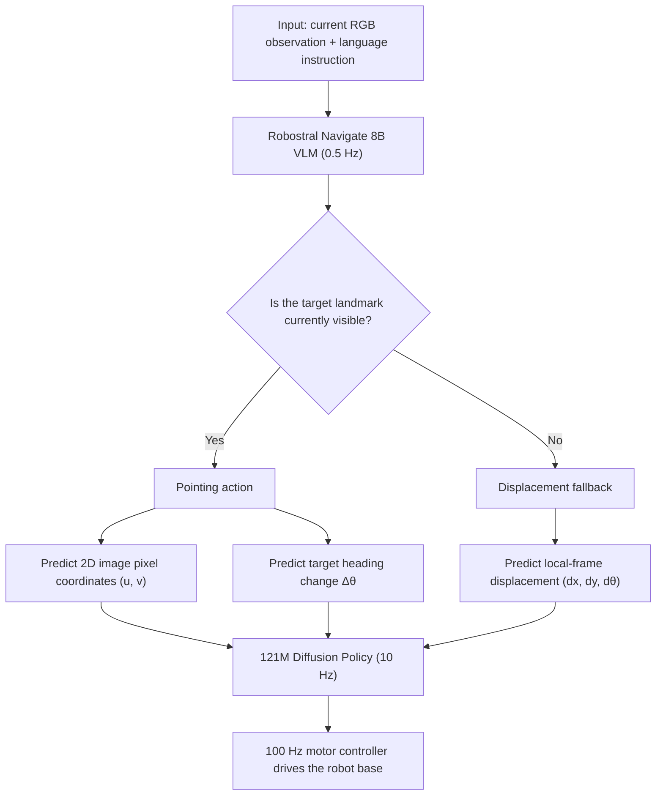
```mermaid
graph TD
    A["Input: current RGB observation + language instruction"] --> B["Robostral Navigate 8B VLM (0.5 Hz)"]
    B --> C{"Is the target landmark currently visible?"}
    C -- "Yes" --> D["Pointing action"]
    D --> D1["Predict 2D image pixel coordinates (u, v)"]
    D --> D2["Predict target heading change Δθ"]
    C -- "No" --> E["Displacement fallback"]
    E --> E1["Predict local-frame displacement (dx, dy, dθ)"]
    D1 --> F["121M Diffusion Policy (10 Hz)"]
    D2 --> F
    E1 --> F
    F --> G["100 Hz motor controller drives the robot base"]
```

**Module 2: Low-level diffusion policy trajectory generation (Diffusion Policy)**
- **Input**: Waypoint $a \in \{a_{\mathrm{vis}}, a_{\mathrm{invis}}\}$ output by VLM, robot height and radius priors, context frame $o_{t_{\mathrm{vlm}}}$ during VLM inference, and the latest RGB frame $o_t$ (to solve the inference lag caused by VLM delay).
- **Processing**: Based on the Lightweight Diffusion Transformer with 121M parameters, predict the relative two-dimensional displacement and rotation $(\mathrm d x, \mathrm d y, \mathrm d \theta)$ of 30 consecutive steps in the next 1 second.
- **Output**: Local Action Chunk at 10 Hz.
- **Design motivation**: Split continuous obstacle avoidance and high-frequency smooth trajectory control to a small parameter diffusion model, greatly reducing the computational burden of 8B VLM.

<div align="center">
  
<figcaption>
Cross-robot form deployment (Galaxea R1 wheeled robot and Hiwonder JetAuto): share the same VLM and Diffusion Policy weight
</figcaption>
</div>

---

#### ③ Training algorithm innovation: Prefix-Tree tree attention acceleration SFT (Tree Training)
{: id="-训练算法创新prefix-tree-树状注意力加速-sft-tree-training"}

In order to eliminate repeated forward calculations of historical frames in the supervised fine-tuning (SFT) stage, the team modeled the navigation episode as a Prefix Tree and developed an efficient training pipeline.

<div align="center">
  
<figcaption>
Prefix-Tree Attention Mask and Episode Packing Schematic: Eliminate redundant coding and prevent Ground-truth action information from leaking
</figcaption>
</div>

##### 2.3.1 DFS serialization and Causal sequence packaging (Packing)
{: id="231-dfs-序列化与-causal-序列打包-packing"}
Standard SFT splits a trajectory with length $T$ into $T$ independent samples, and the Token complexity is $\mathcal O(T^2)$. Robostal Navigate assembles the historical context of the entire Episode into a prefix tree (the root node is the static instruction $I$, the child nodes are the observation $O_t$ and the action $a_t$), and packages it into a single sequence through depth-first search (DFS) traversal:
$$\text{Sequence}_{\text{packed}} = I | O_0 | a_0 | \dots | O_n | a_n$$
Each unique token in the entire sequence (including image vision token) is calculated only once in a single forward, reducing the token complexity to $\mathcal O(T)$.

##### 2.3.2 Tree-based Attention Mask
{: id="232-树状注意力掩码-tree-based-attention-mask"}
In a single packaging sequence, in order to prevent Causal Attention from causing the model to "predict" ground-truth actions in future steps during training (because Pointing contains strong direction information), a tree-like attention mask is designed. For Token $i$ and Token $j$, the visibility rules are:
$$M_{ij} = \begin{cases} 0, & j < i \ \land \ (\text{token } j \text{ is in the shared trunk} \ \lor \ \text{token } i, j \text{ are in the same branch}) \\ -\infty, & \text{otherwise} \end{cases}$$
This mask not only achieves causal masking, but also more accurately blocks information leakage of sibling branches and future states.

<div align="center">
  
<figcaption>
Tree Attention Mask matrix effectively blocks tokens belonging to brother branches and future states
</figcaption>
</div>

##### 2.3.3 Depth-based RoPE
{: id="233-基于树深度的位置编码-depth-based-rope"}
RoPE position encoding cannot directly use physical subscripts in DFS sequences, otherwise it will lead to a wrong sense of logical distance. Robostral allocates the RoPE position code according to the **logical depth (Logical Depth)** of the Token in the prefix tree, ensuring that the position code is completely consistent with the independent serial Forward.

##### 2.3.4 Path-Weighted Loss
{: id="234-路径加权损失-path-weighted-loss"}
To ensure that the gradient size in a single Forward is consistent with independent training, a weight is applied to each supervision token. If there are $K$ root-to-leaf paths in total, and the $t$ Token belongs to the prefix of $g_t$ paths, then the loss function is multiplied by the weight $g_t / K$:
$$L_{\text{tree}} = \sum_t \frac{g_t}{K} \ell_t(\theta)$$
This weighting ensures that the gradient direction accumulated by the shared prefix when Backward is mathematically equivalent to the total average gradient after training on multiple independent samples. On the premise of retaining all action supervision signals, the training token consumption is reduced by 22 times, and the training time is shortened from months to days.

---

#### ④ Online reinforcement learning (Online RL via CISPO)
{: id="-在线强化学习-online-rl-via-cispo"}

After SFT of 2.4M simulated trajectories, the model may still drift when faced with unseen dead ends or complex interference. Robostral uses the **CISPO (Clipped Importance Sampling Policy Optimization)** algorithm for online end-to-end fine-tuning.

<div align="center">
  
<figcaption>
Overview of online reinforcement learning pipeline: physics simulator, vLLM action generator and distributed training Rank asynchronous collaborative loop
</figcaption>
</div>

##### 2.4.1 CISPO algorithm mechanism and importance sampling truncation
{: id="241-cispo-算法机制与重要性采样截断"}
Unlike PPO, which directly clips the target loss function, CISPO acts on the gradient term of the importance sampling weight. The ratio of old and new strategies is:
$$r_t(\theta) = \frac{\pi_\theta(a_t|s_t)}{\pi_{\theta_{\text{old}}}(a_t|s_t)}$$
The gradient update goal of CISPO is:
$$\nabla_\theta L_{\text{CISPO}} = \hat{\mathbb{E}}_t \left[ \min\left(r_t(\theta), \operatorname{clip}(r_t(\theta), 1-\epsilon, 1+\epsilon)\right) \nabla_\theta \log \pi_\theta(a_t|s_t) A_t \right]$$
This greatly stabilizes the convergence of reinforcement learning in a continuous environment for 8B large-scale models.

##### 2.4.2 Truncated target distance reward function
{: id="242-截断目标距离奖励函数"}
The scalar reward function is defined as:
$$R = - \max(2, \mathrm{dist\_to\_goal})$$
Among them, $$\mathrm{dist\_to\_goal}$$ is the geodesic distance from the final position to the target (meters). Cut off the penalty within 2 meters to prevent the agent from making meaningless fine-tuning and shaking after approaching the target, and encourage the model to accurately trigger the STOP action when it reaches the end point.

##### 2.4.3 Hard Subsets filtering and scene continuity Curriculum
{: id="243-hard-subsets-筛选与-场景连续-curriculum"}
- **Hard Subsets (35k tasks)**: Screen out a subset of 35k difficult tasks from the SFT model deduction (only retaining samples of complex layouts and ambiguous instructions that failed SFT), and focus computing power on difficult breakthroughs;
- **Visual Curriculum**: Data sampling is continuously packed by Scene, so that the Batch contains multiple episodes of the same scene, forming an implicit visual curriculum (Visual Curriculum).

---

### 3. Results and findings
{: id="3-核心结果发现-25"}

Robostral Navigate has set new world records in Room-to-Room in Continuous Environments (R2R-CE) and Room-Across-Room (RxR-CE), two of the most authoritative real continuous motion visual navigation benchmarks.

#### 3.1 Authoritative benchmark performance comparison table
{: id="31-权威基准性能对比表"}

| Model category | Model name | Sensing modality | R2R-CE Unseen SR ↑ | R2R-CE Unseen SPL ↑ | R2R-CE NE ↓ | RxR-CE Unseen SR ↑ | RxR-CE Unseen SPL ↑ | RxR-CE NE ↓ |
| :--- | :--- | :---: | :---: | :---: | :---: | :---: | :---: | :---: |
| **monocular RGB** | **Robostral Navigate (Ours)** | **monocular RGB only** | **77.4%** | **74.2%** | **3.20m** | **75.1%** | **68.7%** | **3.47m** |
| monocular RGB | Qwen-RobotNav-8B | monocular RGB only | 65.7% | 59.6% | 4.36m | 73.4% | 63.5% | 4.16m |
| monocular RGB | Qwen-RobotNav-4B | monocular RGB only | 66.9% | 60.5% | 4.22m | 71.3% | 61.5% | 4.15m |
| monocular RGB | Qwen-VLA-Instruct | monocular RGB only | 57.5% | 51.2% | 5.10m | 59.6% | 47.8% | 5.80m |
| monocular RGB | StreamVLN | monocular RGB only | 56.9% | 51.9% | 4.98m | 52.9% | 46.0% | 6.22m |
| monocular RGB | InternVLA-N1 | monocular RGB only | 55.4% | 52.1% | 4.89m | 49.5% | 41.8% | 6.41m |
| monocular RGB | NaVILA | monocular RGB only | 54.0% | 49.0% | 5.22m | 49.3% | 44.0% | 6.77m |
| **Depth/Multi-Camera** | Qwen-RobotNav-8B (Depth) | Depth/Multi-Camera | 72.1% | 66.6% | 3.73m | 76.5% | 65.7% | 3.58m |
| Depth/Multi-Cam | OmniNav | Depth/Multi-Cam | 69.5% | 66.1% | 3.74m | 73.6% | 62.0% | 3.77m |
| Depth/Multi-camera | ABot-N0 | Depth/Multi-camera | 66.4% | 63.9% | 3.78m | 69.3% | 60.0% | 3.83m |
| Depth/Multi-Cam | NavFoM | Depth/Multi-Cam | 61.7% | 55.3% | 4.61m | 64.4% | 56.2% | 4.74m |

<div align="center">
  
<figcaption>
Comparison of the success rate of Robostal Navigate and other navigation models on the R2R-CE unseen environment verification set
</figcaption>
</div>

#### 3.2 Key results analysis
{: id="32-关键结果分析"}

1. **Significantly crushes all monocular RGB baselines**:
Under the same monocular RGB conditions, Robostral Navigate has a success rate of 77.4% on R2R-CE Unseen, which is ahead of the previous best monocular model Qwen-RobotNav-4B (66.9%) by **+10.5%**; on RxR-CE it is ahead of Qwen-RobotNav-8B **+1.7% SR**, and the path efficiency SPL is improved. **+5.2%**.
2. **Beyond depth and multi-view sensor models**:
Relying on monocular RGB input, Robostral Navigate surpasses the Qwen-RobotNav-8B (72.1% SR) equipped with a depth sensor and multiple cameras on R2R-CE by **+5.3%**; on RxR-CE, both SPL (68.7% vs 65.7%) and positioning error (3.47m vs 3.58m) are better than the depth model.
3. **Performance jump for online RL**:
   - R2R-CE Unseen success rate increased from 73.4% of SFT Baseline to **77.4%** (+4.0%);
   - RxR-CE Unseen success rate increased from 71.2% to **75.1%** (+3.9%).
4. **Zero-shot deployment and robustness across configurations**:
The same set of VLM + Diffusion Policy weights was successfully deployed directly on Galaxea R1 (large chassis wheeled) and Hiwonder JetAuto (compact four-wheeled/quadruped). Even if the focal length is stretched, fisheye distortion is introduced, or the camera installation height is changed, the navigation success rate amplitude does not exceed 1.5%.

---

### 4. Limitations
{: id="4-局限性-25"}

1. **Degradation of blind spot field of view**: When the target is in the rear or blind spot (> 90° large angle steering), it needs to be downgraded to Metric Displacement Fallback mode. There is still room for improvement in exploration efficiency in extremely complex mazes or environments with extremely missing textures.
2. **Online RL system scheduling is extremely heavy**: Online reinforcement learning requires three-party high-concurrency collaborative scheduling of physical simulation rendering, vLLM high-concurrency reasoning, and distributed weight updates, which places extremely high demands on GPU computing clusters and engineering pipelines.

---


## 36. ABot-N1 (2026)
{: id="abot-n1"}
———Universal vision-language navigation foundation model based on dual system architecture of slow cognition and fast control

📄 **Paper**: [arXiv:2607.10383](https://arxiv.org/abs/2607.10383v2) · [Project Page](https://amap-cvlab.github.io/ABot-Navigation/ABot-N1/) · [Benchmark](https://github.com/amap-cvlab/ABot-Navigation/tree/ABotN-Bench) (only open source evaluation benchmarks and datasets, model weights and training codes are not disclosed)

### Key takeaways
{: id="精华-28"}
1. **Slow-fast dual system decoupling**: The low-frequency and slow high-dimensional cognitive reasoning (System 2) and the high-frequency and fast low-dimensional reactive control (System 1) are decoupled in time scale and computing resources, eliminating the cognitive-control dynamic mismatch of the end-to-end black box model.
2. **Unified pixel target interface**: By outputting Affordance Pixel and Target Pixel, five types of heterogeneous tasks such as point navigation, instruction navigation, object navigation, POI navigation and pedestrian following are unified into the problem of "tracking image pixel anchor points under CoT interpretation", achieving excellent cross-task forward migration.
3. **GRPO Alignment and Safe Reachability**: For the first time, GRPO-based reinforcement learning alignment is introduced in the basic navigation model, and an asymmetric exponential safety boundary penalty and a GSNR-based balanced sampling strategy are designed to directly link model decisions to task completion and passability safety.
4. **Fine explainability and security audit**: The human-machine readable CoT text chain matches the pixel target in the image space, making every step of the navigation decision-making clear and transparent. Developers can accurately locate whether the failure bottleneck is due to semantic reasoning or spatial alignment.
5. **City-level autonomous navigation and new benchmarks**: Demonstrated robust quadruped robot navigation that can achieve long-range obstacle avoidance, intersection selection, sidewalk and traffic light compliance in complex urban blocks relying only on low-precision SD maps, and open sourced ABotN-PointBench and ABotN-POIBench.

---

### 1. Background and problem
{: id="1-研究背景问题-27"}
Traditional vision-language navigation (VLN) models mainly rely on end-to-end multi-modal black-box strategies to directly map observations to control actions, but they face three major pain points when deployed to real-world robots:
* **Offset of destination target navigation**: When there is no high-precision map navigation, due to map routing or positioning drift, the input local coordinate target point of the vehicle is often offset to physically inaccessible areas such as lanes and green belts, causing conventional models to stagnate or violate regulations.
* **Semantic forgetting and confusion of navigation to the target**: End-to-end fine-tuning can easily erode the universal semantic prior of the pre-trained VLM, and confuse the "search" and "approach" phases, resulting in training divergence and difficulty in attributing failure.
* **Lack of explainability and security audit**: Black-box end-to-end mapping lacks explicit decision traces, making it difficult for developers to determine whether the failure is due to physical perception errors, logical reasoning, or underlying control.

---

### 2. Method and innovations
{: id="2-主要方法创新点-25"}

#### ① Overview of the overall framework
{: id="-整体框架概述-10"}
ABot-N1 proposes a modular slow-fast dual system architecture (Slow-Fast Architecture). The slow system (System 2) is a 4B parameter high-capacity VLM (Qwen-3.5-4B), responsible for low-frequency deliberative logical reasoning, outputting an explicit chain of thought (CoT) and a pixel target (Pixel Goal) projected onto the current three cameras perspective (tri-view). The fast system (System 1) is a lightweight VLM (Qwen-3.5-2B) with 2B parameters. As a high-frequency action expert (Action Expert), it integrates the current camera input and the CoT and pixel targets output by the slow system in real time to calculate the continuous control waypoints (Waypoints) at the bottom of the robot.

<div align="center">
  
<figcaption>
Figure 1: Overview of ABot-N1 slow inference and fast execution architecture
</figcaption>
</div>

#### ② Explain module by module
{: id="-逐模块讲解-8"}

##### Slow System (System 2 - Logical Reasoner)
{: id="慢速系统system-2---逻辑推理器"}
* **Input**: Reference historical memory frame (represented by $$I_{1:K}^{\text{ref,mem}}$$), current three cameras observation perspective $$I_{\text{ref,tri}}$$ (including RGB images of the left, front, and right cameras), current task language instruction $g = \ell$, and inference output $(C_{n-1}, p_{n-1})$ of the previous decision cycle. Inputting previous decisions helps maintain temporal consistency in long-range tasks.
* **Processing process**: Based on the powerful pre-training multi-modal capabilities of Qwen-3.5-4B, explicit chain-of-thought reasoning is performed. This reasoning is activated in semantically complex tasks (such as instruction navigation and object search), parses the current progress of task instructions (such as "Sub-instruction A has been completed, and B is being executed"), and is combined with visual semantics to perform spatial accessibility analysis.
* **Output**: Explicit natural language CoT inference trajectory $C_n$ and a set of pixel goals (Pixel Goal) $p_n$ projected in the tri-view perspective. There are two types of pixel targets:
  1. **Affordance Pixel**: The front waypoint in the image that marks the safe passable area (usually represents about 3 meters ahead indoors and about 5 meters accessible flat road outdoors).
  2. **Target Pixel**: An image pixel that indicates a specific task target (such as the center of mass of a target object, the bottom midpoint of a POI store entrance, or the bottom midpoint of a tracked pedestrian). It is only activated when the target is visible or enters the final approach stage.
* **Design motivation**: Separate complex open-vocabulary semantic recognition and social protocol reasoning from fast control feedback, so that the huge semantic priors of large models can be fully utilized without blocking the high-frequency underlying real-time control loop. In addition, passable pixels and target pixels serve as a unified bridge, decoupling the topological semantic decision-making and kinematic trajectory execution of navigation.

##### Fast System (System 1 - Action Expert)
{: id="快速系统system-1---动作专家"}
* **Input**: High-frequency real-time camera observation $$I_{\text{cur,tri}}$$, high-frequency local memory frame $$I_{1:K}^{\text{cur,mem}}$$, the latest CoT trajectory $C_n$ and pixel target $p_n$ provided by the slow system, the reference view $$I_{\text{ref,tri}}$$ (used to align the pixel space) when the slow system makes decisions, and the global task target $g$.
* **Processing process**: First, extract the fusion state $h_t$ through the multi-modal encoder of Qwen-3.5-2B, then design a set of learnable action queries (Action Queries) $q_{\text{act}}$, and use the QFormer-like cross-attention mechanism to distill the navigation control representation from the fusion features. This representation is finally decoded by the multilayer perceptron (MLP) head.
* **Output**: Predict the continuous two-dimensional control waypoint $a_{t:t+H}$ for $H=5$ steps in the future. Each waypoint contains the $SE(2)$ pose $(x_i, y_i, \sin\theta_i, \cos\theta_i)$ relative to the vehicle and a binary Arriving flag $c_i$ used to indicate whether it has reached the final destination.
* **Design motivation**: Since the slow system has modeled trajectory planning through thinking chains and image coordinate points (for example, turning left to avoid obstacles or turning right to detour), the action space regression distribution faced by the high-frequency System 1 has basically degenerated into a unimodal problem. This allows System 1 to be trained very stably and efficiently with only the Smooth-$L1$ loss, without the need for complex diffusion models (Diffusion) or Gaussian Mixture (GMM) action heads. At the same time, high-frequency control enables dynamic obstacle avoidance and eliminates control delays by continuously tracking pixels between slow inference cycles.

<div align="center">
  
<figcaption>
Figure 2: ABot-N1 slow cognitive system and fast control expert dual system design
</figcaption>
</div>

#### ③ end-to-end data flow
{: id="-端到端数据流-1"}
For any embodied task, such as “find the nearest green bin”:
1. The slow system receives the tri-view image of the current environment and commands, starts to perform CoT inference (locating the trash can and finding a route around the coffee table in the picture), and outputs Affordance Pixel (pointing to the detour path) and Target Pixel (marked on the detected trash can) on the front camera of the tri-view.
2. The fast system operates in a closed loop at a frequency of 10Hz, using the latest Affordance/Target pixel changes on the image to continuously solve and output waypoints.
3. The robot travels along the obstacle avoidance trajectory until the slow system evaluation reaches the trash can, issues Target Pixel and sets the Arriving flag $c_i$ to 1, triggering Arrive to stop.

#### ④ Training objective and loss function
{: id="-训练目标与损失函数-1"}
* **Imitation pre-training phase**:
  * Slow system loss: Cross-entropy language modeling loss $L_{\text{CE}}$, supervises the CoT text Token and the Token sequence corresponding to the pixel target coordinates.
  * Fast system losses: Smooth-$L1$ position regression loss, Smooth-$L1$ heading angle sine and cosine regression loss, and binary cross-entropy arrival loss $L_{\text{arrive}}$.
* **GRPO reinforcement learning alignment phase**:
In order to make the pixel targets generated by the slow system directly conform to the passable safety and real task success rate, the GRPO algorithm is used to optimize the parameters of the slow system:
  $$L_{\text{GRPO}}(\theta) = \mathbb E \left[ \sum_{i,t} \min\left(\rho_t^{(i)} A^{(i)}, \text{clip}(\rho_t^{(i)}, 1\pm\epsilon)A^{(i)}\right) \right] - \beta \mathbb{D}_{\text{KL}}(\pi_\theta \parallel \pi_{\text{ref}})$$
Reward function design: $R = w_f R_{\text{format}} + w_t R_{\text{target}} + w_o R_{\text{safety}}$
  1. Format reward $R_{\text{format}}$: Indicates whether the output conforms to the specified JSON Schema. If it does not conform to the specified JSON Schema, it will receive zero points.
  2. Target alignment reward $R_{\text{target}}$: Use exponential kernel to measure the L2 distance of predicted pixel $\hat{p}$ to ground truth $p^\star$ in three views:
     $$R_{\text{target}} = \sum_{\text{frame}} \alpha_t \exp\left( - \frac{\lVert \hat{p} - p^\star \rVert^2}{\text{scale}} \right)$$
  3. Safe Clearance Reward $R_{\text{safety}}$: Back-project the predicted Affordance pixels back to 3D space and calculate the true distance to the nearest non-traffic area (e.g. driveway, flower bed, obstacle) $d$:
     $$R_{\text{safety}}(d) = \begin{cases} -\alpha_0, & d \ge d_{\text{safe}} \\ -\alpha_0 \exp\left( \beta(d_{\text{safe}} - d) \right), & d < d_{\text{safe}} \end{cases}$$
  * **Balanced Sampling based on GSNR**:
Since the variance of the safety reward $R_{\text{safety}}$ grows exponentially at the danger edge, gradient instability will result. ABot-N1 filters out extremely dangerous prompts by solving the threshold of Var($R_{\text{safety}}$), and divides the remaining training samples into **Safe Zone (50%)**, **Critical Zone (30%)** and **Danger Zone (20%)** according to GSNR (Gradient Signal-to-Noise Ratio) 5:3:2 Hybrid sampling for stable policy improvement.

#### ⑤ Reasoning process and deployment architecture
{: id="-推理流程与部署架构"}
In an actual quadruped robot deployment, to overcome the limitations of the Jetson edge computing hardware, during inference:
* The slow system model was scaled down (from 4B to Qwen-3.5-2B with 2B parameters).
* The fast system was further upgraded to a diffusion Transformer (DiT) with 306M parameters and visually encoded with lightweight DINOv2-Base.
* The two systems run asynchronously in parallel: the slow system generates global decisions asynchronously when the GPU is idle, while the fast system reads the latest cache stably at 10Hz and performs high-frequency motion control, which greatly reduces the end-to-end control delay.

---

### 3. Results and findings
{: id="3-核心结果发现-26"}
ABot-N1 broke the previous SOTA record on five core navigation tasks, and the multi-task joint training model matched or surpassed the specially fine-tuned single-task experts (Task Specialists), verifying the advantages of forward cross-task transfer:
* **Instruction-Following**: Achieved a success rate (SR) of **70.89%** and an SPL of **67.5%** on the Habitat R2R-CE verification set, significantly surpassing all previous strong baseline models based on depth/odometry; it also achieved a SOTA-level average navigation error (NE) of **3.13 meters** on RxR-CE.
* **Object-Goal**: In the short line of sight OVON test, the success rate was increased to **84.9%**, the SPL was increased to **51.8%**, and the average distance between the end point and the target (DTG) was reduced by half (0.82m vs 1.44m) compared to the previous generation ABot-N0, demonstrating extremely high final stage approximation accuracy.
* **Point-Goal**: On the newly released city-level benchmark ABotN-PointBench outdoor Split, the success rate of the ABot-N1 joint model jumped **+22.7%** (reaching **88.0%**) compared to ABot-N0 in the most difficult high-level difficulty, and achieved the optimal success rate (overall **92.9%**) and social compliance in all difficulties; indoors Split also achieved an extremely high success rate of **95.4%**.
* **POI Navigation (POI-Goal)**: On the store environment closed-loop benchmark ABotN-POIBench, the success rate jumped **+35.0%** compared to the previous strongest benchmark, reaching **77.3%**, which verified the efficiency of using the slow-fast mechanism to combine store sign semantic recognition with entrance obstacle avoidance path planning.
* **Person-Following**: On EVT-Bench, excellent tracking rates (TR) of **84.4%** and **87.8%** were achieved respectively in scenarios with interference from other pedestrians (DT split) and frequent severe occlusions (AT split).

---

### 4. Limitations
{: id="4-局限性-26"}
1. **Collision rate trade-off under multi-task combination**: In the complex occlusion (AT) and strong interference (DT) tasks of the pedestrian tracking (EVT-Bench) scene, although the tracking rate (TR) and success rate (SR) reached the best, the collision rate (CR) increased slightly (17.9%) due to the influence of the more aggressive action distribution in the hybrid pre-training set. It will be necessary to add a more explicit safety collision penalty term in the GRPO stage for refinement in the future.
2. **Performance-resource trade-off during edge deployment**: Due to the limitation of end-side computing power, the slow/fast model must be parameter compressed and architecture replaced respectively when deploying the real robot (for example, the fast system is replaced with 306M DiT). This heterogeneous hardware adaptation loses to a certain extent the complete representation capabilities of the original 4B+2B Qwen pure multi-modal large model.

---


## 37. ReflectVLN (2026)
{: id="reflectvln"}
——Embodied vision-language navigation based on reflective reasoning and two-way interaction mechanism

📄 **Paper**: [arXiv:2607.12680](https://arxiv.org/abs/2607.12680) · 🏛️ **IROS 2026**

### Key takeaways
{: id="精华-29"}

- Upgrade the one-way cascade structure of "slow planning-fast execution" in the traditional vision-language navigation (VLN) to a two-way closed-loop interaction architecture between the intent agent and execution agent.
- Introducing the **Trigger Token mechanism** (`<VLNBOA>`, `<VLNBOR>`, `<VLNBOC>`), the execution agent monitors the sub-goal completion and yaw deviation in real time during the navigation process, realizing **on-demand high-level reflection and re-planning**, avoiding the waste of resources with fixed frequency refresh and the semantic disconnect of one-way cascade.
- **Action-CoT** (path condition dual query training mechanism) is proposed to predict implicit coarse-grained future routes before predicting short-term actions and introduce global topological path constraints for local control.
- Build a **single-round reflection-driven data generation pipeline** (Reflection-Driven Data Pipeline), collect policy Rollout failure samples and introduce Oracle expert intervention and VLM reflection generation. High-quality error correction data is generated through three-party cross-validation. It can significantly improve the recovery ability of the agent in long-term unknown environments without the need for large-scale pre-training or multiple rounds of iterative data enhancement.

---

### 1. Background and problem
{: id="1-研究背景问题-28"}

During the long-range execution of vision-language navigation in a continuous environment (VLN-CE), small control errors of the robot tend to accumulate and cause yaw. Most of the existing high- and low-level decoupling (Slow-Fast or Dual-System) methods use one-way communication: the high-level outputs language sub-goals at a fixed frequency, and the low-level executes in one direction, lacking semantic progress tracking and fault diagnosis closed loops during the execution process. When the robot yaws, the upper level cannot receive deviation feedback in time, resulting in a lag in replanning. In addition, traditional methods lack explicit reflection mechanisms to identify, diagnose, and correct navigation failures.

<div align="center">
  
<figcaption>
Comparison between ReflectVLN and traditional Slow-Fast/dual system navigation framework. (a) The traditional cascade method delivers sub-goals in one direction; (b) ReflectVLN defines three trigger tokens (&lt;VLNBOR&gt; starts regular reflection to generate the next sub-goal, &lt;VLNBOC&gt; starts error correction reflection and diagnose errors, and &lt;VLNBBOA&gt; maintains pure action execution) to control the intent Agent in a closed loop on demand.
</figcaption>
</div>

---

### 2. Method and innovations
{: id="2-主要方法创新点-26"}

The ReflectVLN architecture consists of two independently parameterized Agents: **Intention Agent (Intention Agent, $\theta_{int}$)** and **Execution Agent ($\theta_{exe}$)**, both initialized based on the Qwen2.5-VL-3B model.

<div align="center">
  
<figcaption>
ReflectVLN overall architecture diagram. As a high-level reflective planner, the intent agent receives visual history, natural language instructions and execution feedback, and generates reflective sub-goal descriptions; the execution agent conditions the sub-goals and current observations, outputs continuous motion trajectories and status tokens that regulate subsequent dual-agent interactions.
</figcaption>
</div>

#### ① Overview of the overall framework
{: id="-整体框架概述-11"}
The system consists of high-level intent Agent and low-level execution Agent. The intent agent is responsible for sub-task decomposition and yaw reflection of global long-range instructions; the execution agent is responsible for grounding sub-goals into short-term continuous motion control in the local field of view and evaluating the execution status in real time. The two establish event-driven two-way closed-loop communication through the explicit **Status Token interface** (Status Tokens) instead of a fixed frequency of one-way command issuance.

#### ② Explain module by module
{: id="-逐模块讲解-9"}

- **Intention Agent（Intention Agent, $\theta_{int}$）**
  - **Input**: Global natural language instruction $\ell$, monocular RGB historical observation $I_{t-H:t}$, and status trigger signal $z_t \in \{R, C\}$ sent by the execution agent.
  - **Processing process**: Based on the multi-modal understanding and generation capabilities of VLM, when the regular trigger signal $z_t = R$ (`<VLNBOR>`) is received, the next executable sub-goal description $c_t$ is generated based on the route progress; when the error correction trigger signal is received When $z_t = C$ (`<VLNBOC>`), diagnose the cause of yaw and output the sub-target description with corrective actions.
  - **Output**: Structured natural language sub-target text $c_t$.
  - **Design motivation**: Directly utilize the language reasoning capabilities of VLM to complete advanced semantic planning, avoiding the introduction of additional target detectors or complex pixel-level target calibration.

- **Execution Agent (Execution Agent with Action-CoT, $\theta_{exe}$)**
  - **Input**: Global instruction $\ell$, current language subgoal $c_t$, and historical visual observation $I_{t-H:t}$.
  - **Processing process (Action-CoT path condition double query)**:
    1. First, learnable navigation queries (Navigation Queries, $Q_{nav}$) are used to predict implicit coarse-grained future routes $$\hat{P}_t = \text{MLP}_{nav}(f_{\theta_{exe}}(X, Q_{nav}))$$ for longer horizons.
    2. Splice the coarse-grained route feature $E_{nav}$ with the action query (Action Queries, $Q_{act}$) to predict the short-term control action $$\hat{A}_t = \text{MLP}_{act}(f_{\theta_{exe}}(X, [E_{nav}; Q_{act}]))$$.
    3. At the same time, the language generation head autoregression is used to predict a discrete state Token $z_t \in \{A, R, C\}$.
  - **Output**: Continuous motion control quantity $$\hat{A}_t$$ (including plane relative displacement $(\Delta x_t, \Delta y_t)$, orientation angle $(\cos\phi_t, \sin\phi_t)$ and stop probability logit $s_t$) and interaction status Token $z_t$.
  - **Design motivation**: Break the traditional plain text CoT model, model "Thought" as a coarse-grained future path constraint, and explicitly improve the spatiotemporal consistency of the route of local action prediction.

#### ③ Closed-loop data flow and interaction logic
{: id="-闭环数据流与交互逻辑"}
1. At the initial moment, the intent Agent generates the first sub-target $c_1$.
2. At each time step $t$, the executing Agent outputs short-range action $$\hat{A}_t$$ and status Token $z_t$ based on $c_t$ and visual history.
3. If $z_t = \langle \text{VLNBOA} \rangle$, the agent is executed to run independently for short-term control without calling the high-level intent agent;
4. If $z_t = \langle \text{VLNBOR} \rangle$, it indicates that the current sub-goal has been completed, triggering the intent Agent to generate the next regular sub-goal;
5. If $z_t = \langle \text{VLNBOC} \rangle$, it indicates that the agent detects severe yaw, triggers the intent Agent to perform error diagnosis and outputs the error correction sub-goal.

#### ④ Training objective and loss function
{: id="-训练目标与损失函数-2"}

- **Stage I: Action-CoT pre-training**
Define a single control point prediction loss as a combination of position loss, orientation loss and stop loss:
  $$\mathcal{L}_{traj}(\hat{U}, U^*) = \lambda_{pos} \mathcal{L}_{pos} + \lambda_{ang} \mathcal{L}_{ang} + \lambda_{stop} \mathcal{L}_{stop}$$
Action-CoT pre-training total loss combines short-term action loss and coarse-grained route loss:
  $$\mathcal{L}_{WP} = \mathcal{L}_{traj}(\hat{A}, A^*) + \beta \mathcal{L}_{traj}(\hat{P}, P^*)$$
Among them, set the weight $\lambda_{pos} = \lambda_{ang} = \lambda_{stop} = 1.0$ and the route regular weight $\beta = 0.1$.

- **Stage II: State-aware joint fine-tuning**
  - **Intent Agent Goal**: Autoregressive language modeling of regular requests and error correction requests:
    $$\mathcal{L}_{int}^{(z)} = -\sum_{j=1}^{T} \log p_{\theta_{int}}(y_j^* \mid y_{<j}^*, \ell, I_{t-H:t}, z)$$
  - **Execution Agent Goal**: Jointly predict actions and status Token:
    $$\mathcal{L}_{exe} = \mathbf{1}[z_t^* = A] \mathcal{L}_{WP} + \lambda_{status} \mathcal{L}_{status}$$
Among them $$\mathcal{L}_{status} = -\log p_{\theta_{exe}}(z_t^* \mid \ell, c_t, I_{t-H:t})$$.

#### ⑤ Reflection-driven data construction pipeline
{: id="-反思驱动的数据构建流水线"}

<div align="center">
  
<figcaption>
Reflection-driven data generation pipeline. (1) Expert data collection; (2) Policy Rollout produces yaw failure, calling Oracle experts to calculate the rescue trajectory and VLM to generate reflection text; (3) Quality filtering and three-party cross-validation to produce a high-quality reflection error correction training set.
</figcaption>
</div>

---

### 3. Results and findings
{: id="3-核心结果发现-27"}

Comprehensive evaluation on standard continuous environment vision-language navigation benchmarks (R2R-CE and RxR-CE Val-Unseen) on Matterport3D:

<div align="center">
  
<figcaption>
Qualitative visual comparison on R2R Val-Unseen. Above: sub-goal grounding and progress tracking; below: off-orbit and yaw detection and successful error correction recovery based on closed-loop re-planning.
</figcaption>
</div>

1. **SOTA Navigation Performance**:
   - **R2R-CE benchmark**: Achieved **62.8% success rate (SR)** and **58.5% SPL** under pure monocular RGB conditions (compared to StreamVLN baseline SR improvement of 5.9 percentage points, the same as DualVLN's 58.5% SPL).
   - **RxR-CE benchmark**: Achieved **66.0% success rate (SR)** and **57.2% SPL** on the long-instruction complex RxR-CE (13.1 percentage points higher than the StreamVLN baseline SR, surpassing the 61.4% SR / 51.8% SPL of DualVLN based on the 7B model).

2. **High data and parameter efficiency**:
   - Compared with DualVLN (7B model, 12M training samples, introduction of additional ScaleVLN data) and CorrectNav (7B model, multi-round flywheel iteration), ReflectVLN only uses **2×3B parameter architecture** and **1.5M expert data + 100k single-round reflection data**, which means it achieves better overall performance.

3. **ablation experiment and on-demand triggering efficiency**:
   - **Action-CoT effect**: The introduction of coarse-grained route prediction of path conditions increases the SR from 52.8% to 60.0% and the SPL from 50.1% to 57.2%.
   - **Advantages of on-demand triggering**: Compared with fixed step size triggering (such as calling high-level every 4 steps or 12 steps), on-demand triggering achieves the highest success rate (62.8% vs 61.8%/59.4%).
   - **Frequency of high-level calls**: During the inference phase, the intent agent is triggered and called once on average every **9.63 execution steps**, which significantly reduces the computational burden of high-level language inference in slow systems.

---

### 4. Limitations
{: id="4-局限性-27"}

- The decoupled dual-agent architecture in this article uses two 3B models independently (the total parameter count is 6B). Compared with the ablation of the single 7B model, the total parameter count alignment is not strictly controlled;
- The evaluation indicators mainly focus on the high-level invocation frequency (Invocation frequency) triggered on demand. In the future, it is still necessary to further measure the end-to-end delay (Latency) and actual FLOPs power consumption on actual hardware devices.

---


## 38. TuckerNav (2026)
{: id="tuckernav"}
——Tucker tensor adaptation for all-weather, multi-scenario, lifelong embodied vision-language navigation

📄 **Paper**: [arXiv:2603.14276](https://arxiv.org/abs/2603.14276) · 🏛️ **ICLR 2026**

### Key takeaways
{: id="精华-30"}

* **New all-weather lifelong navigation paradigm (AML-VLN)**: For the first time, the problem of all-weather and multi-scenario lifelong vision-language navigation is formally proposed and a Benchmark is constructed to evaluate the continuous adaptive and anti-forgetting capabilities of embodied agents in cross-scene topologies and multi-illumination/harsh environments (normal, low light, strong light overexposure, scattering/fog).
* **High-order tensor fine-tuning (Tucker Adaptation, TuKA)**: Breaking through the structural bottleneck that classic LoRA/MoE-LoRA can only represent two-dimensional two-layer knowledge (global sharing + task-specific), the fine-tuning parameters are upgraded to high-dimensional tensor space, and multi-level high-dimensional knowledge of "universal navigation skills + scene-specific topology + environment-specific physics" is explicitly decoupled based on Tucker decomposition.
* **Decoupled Knowledge Incremental Learning (DKIL)**: Combines Fisher information-based elastic weight consolidation (EWC), known expert consistency constraint (Consistency Constraint) and new expert row space orthogonal optimization (Orthogonal Optimization) to effectively prevent parameter pollution and catastrophic forgetting in the old and new subspace fields.
* **No Task-ID adaptive retrieval during the testing period**: Construct a dual-layer retrieval mechanism (Task-Specific Experts Search) based on pre-trained CLIP visual features for scenes and environments. During the testing period, the optimal scene and environment experts in the current field of view can be automatically and accurately matched without explicit Task ID.
* **SOTA performance and excellent generalization**: On the Benchmark containing 24 consecutive tasks, the AlldayWalker agent navigation success rate SR reached 65% (significantly exceeding SD-LoRA's 56% and BranchLoRA's 44%), the forgetting rate F-SR dropped to 11%, and achieved 55% zero-shot generalization SR in 6 new unseen tasks.

---

### 1. Background and problem
{: id="1-研究背景问题-29"}

Traditional vision-language navigation (Vision-and-Language Navigation, VLN) research usually assumes that agents are deployed in a single scene that is static and ideally lit. However, in real-world applications, embodied navigation agents must face the challenges of **all-weather environmental changes** (normal day and night light, low light at night, strong light overexposure, severe scattering/fog) and **continuous migration across multiple scenes**. When an agent continuously learns navigation tasks in multiple scenes and environments in sequence, the model parameters will be drastically overwritten by new tasks, leading to severe catastrophic forgetting (Catastrophic Forgetting) of old historical scenes.

Existing parameter-efficient fine-tuning methods (such as Vanilla LoRA, or MoE-based HydraLoRA, BranchLoRA, SD-LoRA, etc.) generally perform fine-tuning through low-rank matrices. These methods essentially model within a two-dimensional matrix space and can only abstract knowledge into a two-level structure of "shared matrix + exclusive matrix" (i.e., global general knowledge and task-specific knowledge). But in the AML-VLN task, navigation knowledge spans multiple different levels: general navigation movement actions, scene-specific topology, and environment-specific physical imaging laws. Existing low-rank matrix fine-tuning methods cannot explicitly represent and decouple this multi-level, high-dimensional complex knowledge, resulting in low parameter reuse, severe interweaving and confusion of multi-domain features, and difficulty in balancing incremental adaptation and cross-scenario/environment forgetfulness.

<div align="center">
  
<figcaption>
Overall concept and adaptive challenges for all-weather, multi-scenario lifelong vision-language navigation (AML-VLN)
</figcaption>
</div>

---

### 2. Method and innovations
{: id="2-主要方法创新点-27"}

#### ① Overview of the overall framework
{: id="-整体框架概述-12"}

In response to the challenges of all-weather multi-scenario lifelong navigation (AML-VLN), this article proposes the **Tucker Adaptation (TuKA)** architecture and the **Decoupled Knowledge Incremental Learning (DKIL)** incremental learning mechanism, and builds the **AlldayWalker** lifelong navigation agent.

The system maps the adaptive weights of the Transformer layer to a high-dimensional tensor space, and uses Tucker Decomposition to explicitly decompose the high-dimensional tensor into a Core Tensor that captures global general navigation capabilities, an encoding and decoding dimensional projection matrix, and a vector expert library that is decoupled by scene and environment.

In the continuous learning stage, the DKIL strategy implements differentiated constraints on shared and exclusive subspaces; in the inference stage, the agent uses double-layer matching retrieval based on CLIP visual features to automatically call the optimal combination of scene and environment experts without the need for Task-ID.

<div align="center">
  
<figcaption>
Comparison of traditional LoRA, HydraLoRA and Tucker Adaptation (TuKA) high-dimensional tensor architecture in this article
</figcaption>
</div>

#### ② Explain module by module
{: id="-逐模块讲解-10"}

##### 1. Higher-order Tucker tensor adaptation (Tucker Adaptation, TuKA)
{: id="1-高阶-tucker-张量自适应-tucker-adaptation-tuka"}
- **Input/output and tensor dimensionality increase**: For the backbone weight $$W_0^l \in \mathbb{R}^{a_l \times b_l}$$ of the Transformer layer $$l$$, traditional LoRA introduces the two-dimensional matrix increment $$\Delta W^l = B^l A^l$$. TuKA will adaptively increase the dimension to the fourth-order high-dimensional tensor $$\mathcal{X}^l \in \mathbb{R}^{a_l \times b_l \times M \times N}$$ (where $$M$$ is the total number of scenes and $$N$$ is the number of environment modes).
- **Tucker tensor decomposition**: Perform Tucker decomposition of the fourth-order tensor $$\mathcal{X}^l$$:
  $$\mathcal{X}^l = \mathcal{G} \times_1 U_1 \times_2 U_2 \times_3 U_3 \times_4 U_4$$
- **Substructure Design and Function**:
  - **Core tensor $$\mathcal{G} \in \mathbb{R}^{r_1 \times r_2 \times r_3 \times r_4}$$**: Captures the cross-interaction information between all feature dimensions and modes, and is used to learn core general navigation skills (Task-Shared Knowledge) shared by all navigation tasks.
  - **Shared decoder $$U_1 \in \mathbb{R}^{a_l \times r_1}$$ and encoder $$U_2 \in \mathbb{R}^{b_l \times r_2}$$**: Responsible for dimensional conversion and alignment between high-dimensional tensors and the underlying LLM two-dimensional matrix feature space.
  - **Scenario expert matrix $$U_3 \in \mathbb{R}^{M \times r_3}$$**: Contains the $$M$$ group of scenario experts, and the $$s$$ row $$U_3[s, :]$$ explicitly represents the specific topology and structural knowledge of the $$s$$ specific scenario.
  - **Environmental expert matrix $$U_4 \in \mathbb{R}^{N \times r_4}$$**: Contains the $$N$$ group of environmental experts, and the $$e$$ row $$U_4[e, :]$$ explicitly represents the visual physical perception knowledge of the $$e$$ degraded environment (normal, low light, overexposure, scattering).
- **Task incremental weight slice export**: For the navigation task $$T_t = \{S_s, E_e\}$$ under the $$t$$ scene $$S_s$$ and environment $$E_e$$, extract specific mode slices from the high-order tensor to calculate the final incremental weight:
  $$\Delta W_t = U_1 \cdot \left( \mathcal{G} \times_3 U_3[s, :] \times_4 U_4[e, :] \right) \cdot (U_2)^T$$

##### 2. Decoupled Knowledge Incremental Learning (DKIL)
{: id="2-解耦知识增量学习-decoupled-knowledge-incremental-learning-dkil"}

<div align="center">
  
<figcaption>
Decoupled knowledge incremental learning (DKIL) strategy: inheritance, consistency constraints and orthogonal optimization on shared and specific knowledge subspaces
</figcaption>
</div>

- **Shared knowledge inheritance and EWC consolidation**: When continuously learning the new task $$T_t$$, inherit the updated global shared parameter $$\{\mathcal{G}, U_1, U_2\}$$. In order to prevent updating the shared part from causing knowledge damage to early tasks, elastic weight consolidation (EWC Loss) based on Fisher information matrix is introduced:
  $$\mathcal{L}_{\text{ewc}, t} = \lambda_1 \left( \|F_{\mathcal{G}, t-1} \odot (\mathcal{G} - \mathcal{G}')\|_F^2 + \|F_{U_1, t-1} \odot (U_1 - U_1')\|_F^2 + \|F_{U_2, t-1} \odot (U_2 - U_2')\|_F^2 \right)$$
The Fisher matrix uses the sliding average formula to update smoothly in continuous learning: $$F_{\theta, t} = \omega \cdot F_{\theta, t-1} + (1-\omega) \cdot F_{\theta, t}$$.
- **Known Expert Consistency Loss**: If the new task uses the previously learned scene $$s$$ or environment $$e$$, impose a consistency penalty on the existing expert row $$U_3[s, :]$$ or $$U_4[e, :]$$ to prevent repeated training from destroying the existing model:
  $$\mathcal{L}_{\text{co}} = \lambda_2 \left( \alpha \|U_3[s, :] - U_3'[s, :]\|_F^2 + \beta \|U_4[e, :] - U_4'[e, :]\|_F^2 \right)$$
When the scene or environment has been learned before, the corresponding indicator variable $$\alpha$$ or $$\beta$$ is set to 1.
- **Unseen new expert row space orthogonal optimization (Orthogonal Optimization)**: For unseen new scenes or new environments, freeze other irrelevant experts, update only the current exclusive row $$U_3[s, :]$$ or $$U_4[e, :]$$, and impose row space orthogonal constraints to ensure that the old and new expert subspaces remain orthogonal and vertical, eliminating interference:
  $$\mathcal{L}_{\text{es}} = \lambda_3 \left( (1-\alpha) \|\hat{U}_3 \hat{U}_3^T - I\|_F^2 + (1-\beta) \|\hat{U}_4 \hat{U}_4^T - I\|_F^2 \right)$$

##### 3. Task-Specific Experts Search during testing period
{: id="3-测试期任务专家自适应检索-task-specific-experts-search"}
- **Feature library construction**: In the training phase, the pre-trained CLIP visual encoder $$V(\mathcal{O})$$ is used to extract the observed image features in each scene and environment, and the scene feature library $$\{F_{S_1}^e, \dots, F_{S_M}^e\}$$ and the environment feature library $$\{F_{E_1}^e, \dots, F_{E_N}^e\}$$ are clustered and constructed respectively.
- **No Task-ID two-step cosine matching**: In the test phase, when the agent faces the unknown navigation environment $$S_q$$, it extracts the current visual field map feature $$F_q^e = V(\mathcal{O}_q)$$ and searches for the best scene expert and environment expert through cosine similarity:
  $$s^* = \arg\max_s \text{Sim}(F_q^e, \{F_{S_m}^e\}), \quad e^* = \arg\max_e \text{Sim}(F_q^e, \{F_{E_n}^e\})$$
The matched expert vectors are input into the TuKA tensor generation formula to automatically synthesize the optimal fine-tuning weights for the current scene and lighting, completely getting rid of dependence on known Task-IDs.

##### 4. Allday-Habitat Simulation Platform and AML-VLN Benchmark
{: id="4-allday-habitat-仿真平台与-aml-vln-benchmark"}

<div align="center">
  
<figcaption>
Four typical environmental conditions generated by the Allday-Habitat simulation platform (normal light, low light at night, strong light overexposure, severe scattering/fog)
</figcaption>
</div>

<div align="center">
  
<figcaption>
AML-VLN Lifelong Navigation Benchmark’s 24 task sequences: Continuous incremental learning across scene and environmental dimensions
</figcaption>
</div>

- **3 types of physical degradation environment synthesis**:
  - **Atmospheric scattering model (fog/scattering)**: $$I(x_i) = J(x_i) e^{-\beta d(x_i)} + A (1 - e^{-\beta d(x_i)})$$, where $$d(x_i)$$ is the depth, $$\beta$$ is the scattering coefficient, and $$A$$ is the atmospheric light.
  - **Nonlinear Low Light Model (Low Light at Night)**: Contains camera response function (CRF), gain-exposure product, and Poisson-Gaussian mixed noise model $$N(x) = N_{\text{shot}}(x) + N_{\text{read}}(x)$$.
  - **High light overexposure model**: Introduce the sensor dynamic range upper limit saturation cutoff $$\text{clip}(\cdot, 0, S_{\text{Sat}})$$ before the camera is exposed to light.
- **24-Task Lifelong Assessment Sequence**: Contains 5 simulation scenarios and 2 real-world scenarios, combined with 4 environments to build a sequence of 24 continuous learning tasks. In addition to the standard SR, SPL, and OSR, the evaluation indicators also introduce the forgetting rate indicators F-SR, F-SPL, and F-OSR.

#### ③ Training and loss function
{: id="-训练与损失函数"}

The overall fine-tuning objective function combines the cross-entropy loss generated by autoregressive navigation actions and three incremental regularization losses:
$$\mathcal{L}_t = -\lambda \sum_{n=1}^N \log p_t(A_n, \hat{P}_n \mid I, \mathcal{O}_t) + \mathcal{L}_{\text{ewc}, t} + \mathcal{L}_{\text{co}} + \mathcal{L}_{\text{es}}$$
The weight satisfies $$\lambda = 1 - (\lambda_1 + \lambda_2 + \lambda_3)$$ (experimental setting $$\lambda_1=0.2, \lambda_2=0.2, \lambda_3=0.1$$).

---

### 3. Results and findings
{: id="3-核心结果发现-28"}

* **24-Task AML-VLN Benchmark comprehensive evaluation**:
  - In the complete sequence test of 24 continuous learning tasks, the TuKA-based **AlldayWalker** achieved an average **65% success rate (SR)** and **58% SPL**, significantly exceeding the comparison baseline (including SD-LoRA's 56%/50%, BranchLoRA's 44%/39%, MoLA's 33%/26%, and EWC-LoRA's 15%/9%).
  - In terms of **anti-forgetting performance (Forgetting Rate)**, AlldayWalker's SR forgetting rate F-SR is only **11%** (compared to 18% for SD-LoRA, 36% for BranchLoRA, and 87% for Sequential Fine-Tuning), showing extremely high lifelong memory stability.
* **Higher order tensor order ablation (3rd vs 4th vs 5th order Tensor)**:
  - Compared with the third-order tensor $$\mathcal{X} \in \mathbb{R}^{a \times b \times (M \times N)}$$, which couples the scene and the environment together, the fourth-order tensor achieves comprehensive SR curve surpassing all 20 test tasks by explicitly decoupling the scene mode and the environment mode. The appendix further demonstrates the good scalability of fifth-order tensors when introducing more fine-grained task patterns.
* **The role of shared components ablation (Core Tensor & En/Decoder Sharing)**:
  - Removing the shared Core Tensor $$\mathcal{G}$$ or the shared encoder $$U_2$$ results in a significant drop in SR (from 65% to 53% vs. 55%), confirming that the shared tensor and encoder successfully learn basic navigation skills that are common across tasks. The shared decoder $$U_1$$ greatly reduces multi-task storage overhead (only 15.64M parameters).
* **Zero-Shot Generalization on Unseen Scenarios**:
  - Tested on 6 completely new scenes and environments (G1-G6, including simulation and real-world low-light/normal environments), AlldayWalker relied on CLIP visual retrieval to match the most similar experts, achieving an average SR of **55%**, surpassing SD-LoRA (39%) by 16%, proving that high-order decoupled representation has excellent zero-shot generalization and generalization transfer capabilities.

---

### 4. Limitations
{: id="4-局限性-28"}

* **Retrieval relies on CLIP feature quality**: Task expert adaptive matching in the inference phase highly relies on the representation ability of the pre-trained CLIP visual encoder; if extremely abnormal extreme imaging degradation (such as strong and heavy smoke coverage and occlusion) causes visual feature distortion, expert mismatching may occur.
* **Time-consuming deployment of real robot arm/mobile robot**: Currently, it is mainly verified on simulation platforms and limited real scenes. In the lifelong online deployment of large-scale complex multi-floor real mobile robots, the time-consuming of efficient online indexing and real-time feature extraction inference still needs to be further optimized.

---


## 39. AgenticNav (2026)
{: id="agenticnav"}
———Reconstruct zero-shot continuous environment navigation (VLN-CE) into a VLM callable Tool-Calling architecture

📄 **Paper**: [arXiv:2606.10577](https://arxiv.org/abs/2606.10577)

---

### Key takeaways
{: id="精华-31"}
1. **Paradigm Reconstruction**: Redefine zero-shot continuous environment vision-language navigation (VLN-CE) as the Tool-Calling interaction Harness between VLM and the environment, breaking the dependence on additionally trained waypoint predictors (Waypoint Predictor).
2. **Pixel-level waypoint-free action control**: Action Tool is proposed to allow VLM to directly click the target pixel $(u,v)$ in the RGB image, and the background Harness completes the back-projection, ground plane steering/step calculation and swept-corridor sweeping safety collision check.
3. **Depth Perception on Demand**: Designed by Pixel-Depth Tool, VLM can query the true physical depth and $5\times 5$ local depth statistics of specific pixels on demand, without the need for full depth maps or implicit predictions.
4. **Lightweight Agentic Memory**: Build a Memory mechanism that combines the bird's-eye view Map Image and the on-demand Recall Tool to only call the historical node RGB view when necessary, completely solving the problem of prompt context overload and cross-episode dependency.
5. **SOTA performance and real robot generalization**: On the R2R-CE benchmark, using GPT-5.5 as the VLM core achieves **55% SR** and **48.41% SPL** (significantly exceeding SmartWay's 44% SR / 35.04% SPL); it demonstrates extremely strong Zero-Shot Sim-to-Real generalization capabilities in real four-wheeled robots and complex indoor and outdoor scenes.

---

### 1. Background and problem
{: id="1-研究背景问题-30"}

Zero-shot continuous environment vision-language navigation (Zero-Shot VLN-CE) requires the agent to complete continuous motion control in an unseen 3D physical scene without predefined navigation graph (Navigation Graph) and policy fine-tuning, relying only on natural language instructions and visual/depth perception. The rapid development of large language/visual language models (VLM) has made it the core of high-level decision-making, but existing methods have three serious bottlenecks:
- **Limited action space**: SOTA methods such as Open-Nav and SmartWay generally rely on additionally trained waypoint prediction networks (Waypoint Predictor) to recommend candidate action points. If the predictor does not reveal the critical directions/goals required by the instruction, the VLM will be limited to the wrong candidate set and cannot select the correct path.
- **Lack of geometry/depth perception**: The existing architecture treats the depth input as a black box to the waypoint predictor, or forces the VLM to directly parse complex dense depth maps, making it difficult for the VLM to accurately evaluate the physical distance and spatial accessibility of the target object.
- **Memory mechanism dilemma**: Traditional methods maintain memory by continuously splicing historical text/visual frames to Prompt, causing the Context to quickly overload and introduce a large amount of irrelevant interference; or relying on cross-episode (Cross-episode) experience retrieval (such as EvoNav), weakening the strict zero-shot assumption.

---

### 2. Method and innovations
{: id="2-主要方法创新点-28"}

AgenticNav reconstructs zero-shot VLN-CE into a lightweight **Tool-Calling Harness**, decoupling action generation, depth perception and historical memory into 4 callable tool interfaces (Action Tool, Depth Tool, Recall Tool, Stop Tool). While retaining the semantic reasoning and perceptual freedom of VLM, numerical geometry calculations and safety checks are handled by deterministic physical Harness.

<div align="center">
  
<figcaption>
Comparison between AgenticNav and the traditional Zero-Shot VLN-CE architecture: breaking the movement restrictions of the traditional Waypoint Predictor, the full depth map perception bottleneck and the long prompt memory overload.
</figcaption>
</div>

<div align="center">
  
<figcaption>
AgenticNav system overall workflow: VLM makes decisions based on the current RGB and Map Image, can query the depth (Depth Tool) on demand, recall historical visual nodes (Recall Tool), and trigger the Action Tool to perform safe movements by clicking on the RGB target pixel.
</figcaption>
</div>

#### ① Overview of the overall framework
{: id="-整体框架概述-13"}
AgenticNav consists of **VLM decision-making core** and **four deterministic Tool interfaces**:
1. **Action Tool (`move_to`)**: Responsible for converting image pixels selected by VLM into safe continuous control quantities.
2. **Depth Tool (`query_depth`)**: Responsible for providing VLM with precise physical distances and local surface features of specific pixels.
3. **Agentic Memory (`Map Image` + `recall`)**: Responsible for maintaining global trajectory awareness and on-demand retrieval of local details.
4. **Stop Tool (`stop`)**: Responsible for determining navigation termination.

#### ② Explain module by module
{: id="-逐模块讲解-11"}

##### 1. Waypoint-Free Action Tool (`move_to(k, u, v)`)
{: id="1-waypoint-free-action-tool-move_tok-u-v"}
- **Input**: VLM selected view index $k$ and normalized pixel coordinates $(u, v) \in [0,1]^2$.
- **Processing**:
  - **Geometric back-projection**: Combined with the camera internal parameter $K$, external parameter $T_k$ and depth value $d = D_t^k(x, y)$, back-project the pixel $(x, y)$ into a 3D target point in the robot coordinate system:
    $$p_t = T_k \left( d K^{-1} [x, y, 1]^\top \right)$$
  - **Motion Calculation**: Extract the ground plane azimuth angle $\theta = \text{bearing}(p_{t,xz})$, and calculate the actual forward distance according to the maximum step limit $\rho_{\max}$, stop margin $m$ and step discretization interval $\Delta$:
    $$\rho = \Delta \left\lfloor \frac{\min\left(\rho_{\max}, \max(0, \|p_{t,xz}\| - m)\right)}{\Delta} \right\rfloor$$
  - **Swept-Corridor Sweep Safety Check**: Filter out all obstacle point clusters $P_t$ located within the robot body height interval $[y_{\min}, y_{\max}]$. Check whether there is a collision point in the robot sweep corridor along the heading vector $b_\theta = (-\sin\theta, \cos\theta)$ and the lateral vector $\ell_\theta = (\cos\theta, \sin\theta)$:
    $$\text{Safe}(\theta, \rho) = \mathbf{1} \left[ \nexists q \in P_t : 0 \lt q_{xz} \cdot b_\theta \lt \rho + r_a \land |q_{xz} \cdot \ell_\theta| \lt r_a \right]$$
Among them, $r_a$ is the radius of the robot. If a collision is detected, `Reselect` feedback is returned to prompt VLM to reselect; if it is safe, `Execute(θ, ρ)` is output.
- **Design motivation**: Abandon the supervised training waypoint predictor and give VLM the freedom to directly select any visually accessible location in the visual scene (such as a specific door gap, the end of the corridor, next to furniture).

##### 2. On-Demand Pixel-Depth Tool (`query_depth(P)`)
{: id="2-on-demand-pixel-depth-tool-query_depthp"}
- **Input**: Batch set of candidate pixels $$P = \{ p_i = (k_i, u_i, v_i) \}_{i=1}^m$$.
- **Processing**: Sample the phase depth map of each query point and return structured information:
  $$D(p_i) = \left( d_i, s_i^{5 \times 5}, \hat{\theta}_i, \hat{\rho}_i \right)$$
Among them, $d_i$ is the physical depth (meters), $s_i^{5 \times 5}$ is the minimum, mean and median depth within the $5\times 5$ window centered on the pixel (used to determine whether it falls on the edge or a flat surface), $$\hat{\theta}_i$$ and $$\hat{\rho}_i$$ are pre-calculated action previews.
- **Design motivation**: Dense depth maps are extremely difficult for VLM to parse quantitatively. On-demand query enables VLM to accurately compare different directions (such as "whether the left channel is clear" and "how far away is the door ahead") before making decisions, providing reliable local spatial geometry evidence.

##### 3. Agentic Memory and Visual Recall Tool
{: id="3-agentic-memory-与-visual-recall-tool"}
- **Input and structure**: The internal memory of Episode is represented as $$\mathcal{M}_t = (B_t, \mathcal{C}_t)$$.
  - $B_t$ is a **topology Map Image** placed directly in Prompt, which visually displays historical trajectory nodes and current orientation.
  - $$\mathcal{C}_t$$ is the cache of all past observation views.
- **Recall mechanism**: When VLM needs to check early road signs (such as "the sign you just saw at the intersection"), it calls `recall(p, k)` and only extracts the single-frame RGB image $$R_t(p, k) = \mathcal{C}_t[p, k]$$ of the $p$ perspective $k$ and appends it to Prompt.
- **Design motivation**: Prevent Prompt from overflowing as the number of navigation steps increases, avoid useless visual frames from interfering with VLM's attention, and achieve efficient long-distance navigation.

#### ③ Reasoning and interaction process
{: id="-推理与交互流程"}
1. At the initial moment, VLM receives language commands, the current panoramic RGB image and the initial Map Image $B_t$.
2. VLM can call `query_depth` as many times as needed to evaluate the distance to a target point of interest, or call `recall` to backtrack a specific historical view.
3. VLM calls `move_to` to output target pixels; Harness evaluates safety checks. If it is safe, drive the robot to move and update the Map Image; if it is unsafe, feedback `Reselect` to prompt a new decision.
4. After reaching the target area, VLM calls `stop()` to complete the task.

---

### 3. Results and findings
{: id="3-核心结果发现-29"}

<div align="center">
  
<figcaption>
real-world robot deployment comparison: AgenticNav can accurately pass through narrow door openings and long corridors without waypoint predictor constraints, and significantly surpasses SmartWay in four views mode.
</figcaption>
</div>

#### 1. R2R-CE Simulation Evaluation (R2R-CEval Unseen 100 Episodes)
{: id="1-r2r-ce-simulation-评估r2r-ceval-unseen-100-episodes"}
Under the strict same VLM Backbone (GPT-5.5 / Gemini-2.5-Pro), AgenticNav refreshed the Zero-Shot VLN-CE performance record:
- **AgenticNav-GPT-5.5** achieved **55% SR**, **48.41% SPL**, **65% OSR**, **63.41 nDTW** and **5.19 m NE**. Compared with the SOTA Baseline **SmartWay-GPT-5.5** (SR 44%, SPL 35.04%) reproduced with Backbone, the SR is improved **11%**, SPL increased significantly by **13.37%**.
- **AgenticNav-Gemini-2.5-Pro** achieves **49% SR**, surpassing Open-Nav (23% SR) and EvoNav (43% SR) which relies on cross-episode experience retrieval.

#### 2. Ablation Experimental Analysis (Ablation Study)
{: id="2-消融实验分析ablation-study"}
Perform strip testing on each Tool module on R2R-CE:
- **Replace Action Tool with Waypoint Predictor**: SR dropped by 5% (55% $\to$ 50%), SPL dropped by 4.42%, proving that freely selecting visual target pixels is better than selecting candidate waypoints recommended by the model.
- **Remove Depth Tool**: SR plummets to 42%; if the complete depth map is directly input, SR recovers to 53%, but is still lower than 55% of on-demand query, proving that structured local depth query is more suitable for VLM's inference mode.
- **Remove Agentic Memory**: SR drops to 41%; if only Map Image is retained without Recall Tool, SR is 51%, proving that Visual Recall Tool is indispensable in long-range/sign recognition tasks.

#### 3. Real-World real robot test
{: id="3-real-world-实机测试"}
Deployed on four-wheeled omnidirectional robots in 30 complex real-world scenarios including laboratories, offices and outdoor courtyards:
- **Single-view mode (1-view)**: SR reaches 33.3%, navigation error NE is 3.20m (SmartWay is 23.3% / 3.57m).
- **four views mode (4-view)**: SR increased to **46.7%**, NE dropped to 2.67m, doubled compared to SmartWay success rate (the advantage is particularly significant in wide-angle scenes such as outdoor courtyards).

---

### 4. Limitations
{: id="4-局限性-29"}

1. **Strong dependence on basic VLM decision-making capabilities**: Failure analysis shows that 88.9% of failures in simulation and 71.4% of failures in the real world originate from incorrect judgments of VLM itself (such as wrong room/branch selection or final docking deviation), and hardware and control failures only account for a very small proportion.
2. **Cloud API latency and network dependence**: Relying on large-scale VLM APIs in the cloud brings obvious inference delays and network fluctuation risks, limiting real-time high-frequency closed-loop control capabilities.
3. **Environment Assumption Dependence**: Relies on accurate local positioning and RGB-D sensor quality, limited performance in extremely featureless or depth-deficient areas.

---


## 40. MemVLN (2026)
{: id="memvln"}
— Efficient continuous vision-language navigation inspired by human dual-memory mechanisms

📄 **Paper**: [arXiv:2607.23504](https://arxiv.org/abs/2607.23504)

### Key takeaways
{: id="精华-32"}
1. **Cognition-inspired dual-memory decoupling**: separate long-term visual-history management from low-latency action decisions in VLN-CE, drawing on human episodic and procedural memory.
2. **Pixel-space pyramidal resolution**: downsample historical frames at different temporal distances according to the observation-attention prior that recent frames matter more. This reduces visual-token length while retaining spatial topology and a long-term view.
3. **Architectural compatibility**: unlike latent-space token merging that disrupts a regular 2D grid, pyramidal resolution preserves pixel-space 2D topology and is compatible with recent LVLM architectures such as M-RoPE and DeepStack.
4. **Fast action through a single prediction**: an augmented vocabulary of atomic mid-level actions ($A_{aug}$) maps multi-step or composite actions to single-token predictions, avoiding the latency of multi-token autoregressive decoding and enabling 14 FPS navigation.

---

### 1. Background and problem
{: id="1-研究背景问题-31"}
- **Problem**: VLN-CE needs long-term visual history for trajectory consistency and drift prevention, together with low-latency responses for continuous control.
- **Bottlenecks**:
  1. **Exploding temporal context**: feeding all high-resolution historical images into an LVLM rapidly increases token length and leads to quadratic computational growth.
  2. **Autoregressive decoding latency**: predicting actions through multiple sequential tokens incurs both initial prefill and subsequent generation costs. Per-step latency exceeds 300ms, making real-time robot control difficult.

---

### 2. Method and contributions
{: id="2-主要方法创新点-29"}

<div align="center">
  
<figcaption>
Figure 1. MemVLN draws on episodic memory (visual history at pyramidal resolution) and procedural memory (fast mid-level action inference).
</figcaption>
</div>

<div align="center">
  
<figcaption>
Figure 2. MemVLN architecture. The episodic-memory module downsamples multimodal input before the LVLM, and the procedural-memory module predicts a mid-level action in one pass.
</figcaption>
</div>

#### ① Framework overview
{: id="-整体框架概述-14"}
MemVLN consists of an **episodic-memory module**, a **visual encoder and LVLM backbone**, and a **procedural-memory module**. At successive time steps, the agent receives monocular RGB observations and a natural-language instruction. Episodic memory resamples historical frames at pyramidal resolutions. The concatenated frames pass through the visual encoder and LLM to produce cross-modal context. Procedural memory then outputs one atomic action token, enabling a 14 FPS control loop.

#### ② Modules
{: id="-逐模块讲解-12"}

##### A. Episodic memory: pyramidal resolution
{: id="a-情景记忆模块金字塔分辨率pyramidal-resolution"}
- **Input**: the complete monocular RGB observation history from the start to the current step, $H_t = \{v_0, v_1, \dots, v_{t-1}\}$.
- **Processing**:
  1. **Attention prior**: measurements show that the latest 4 observations receive more than 50% of visual attention, with weights increasing exponentially toward more recent frames.
  2. **Three temporal tiers**: divide historical frames into immediate, short-term, and long-term tiers, assigning progressively lower resolutions $r_{imm} > r_{short} > r_{long}$:
     $$v_t' = \begin{cases} \mathrm{Rescale}(v_t, r_{imm}), & T - B_{short} < t \le T - 1 \\ \mathrm{Rescale}(v_t, r_{short}), & T - B_{long} < t \le T - B_{short} \\ \mathrm{Rescale}(v_t, r_{long}), & 0 \le t \le T - B_{long} \end{cases}$$
  3. **Token budget**: choose $r_{long}$ and $r_{short}$ so cumulative long-term-history tokens do not exceed the token count of one immediate high-resolution frame.

<div align="center">
  
<figcaption>
Figure 3. Observation-attention analysis. Left: the latest 4 frames receive more than 50% of attention. Center: attention is most concentrated on the newest frame. Right: attention increases toward recent frames.
</figcaption>
</div>

- **Output**: an efficient set of pixel-downsampled frames $S_t \subset H_t$ and their visual features $F_t = E_{vis}(S_t)$.
- **Motivation and advantages**: compared with token merging used by Uni-NaVid or StreamVLN, which clusters features by latent-space semantic similarity, pyramidal resolution preserves the regular 2D image grid. Token merging disrupts that grid and can conflict with M-RoPE positional encoding and DeepStack in modern LVLMs such as Qwen2/3-VL. Downsampling in pixel space instead retains 2D topology and is compatible with recent 3D/multimodal positional encodings.

<div align="center">
  
<figcaption>
Figure 4. Pixel-space pyramidal resolution versus latent-space token merging. Preserving the 2D grid maintains compatibility with M-RoPE.
</figcaption>
</div>

##### B. Procedural memory: fast action in one prediction
{: id="b-程序记忆模块单次快速动作生成fast-action"}
- **Input**: cross-modal hidden features from the LVLM backbone.
- **Processing**:
  1. **Latency analysis**: the first LLM token requires prefill, taking roughly 70ms. Subsequent autoregressive tokens add latency; generating 10 tokens takes 360ms.
  2. **Augmented mid-level action vocabulary ($A_{aug}$)**: reuse single-token symbols from the LLM vocabulary and remap them to atomic mid-level actions, including forward movement of $25\text{cm}/50\text{cm}/75\text{cm}$, turns of $15^\circ/30^\circ/45^\circ$, and Stop.
  3. **One-shot prediction**: convert composite-action prediction into single-token classification over the reused vocabulary, making the decision in one forward pass.
- **Output**: one mid-level action token $a_t \in A_{aug}$, mapped directly to a mobile-base control command.
- **Motivation**: procedural memory is the implicit memory used to execute familiar skills automatically. Avoiding sequential word-level decoding reduces inference latency from >300ms to 70ms (14 FPS).

#### ③ End-to-end data flow
{: id="-端到端数据流-2"}
1. At step $t$, acquire monocular RGB frame $v_{t-1}$ and combine it with the history to form $H_t$.
2. Apply the three-tier resolution assignment and rescaling in episodic memory to obtain pyramidal frame set $S_t$.
3. Extract visual features $F_t = E_{vis}(S_t)$ and concatenate them with instruction $I$.
4. Feed the sequence into the Qwen3-VL 4B/8B backbone to obtain cross-modal representations.
5. The procedural-memory head outputs action token $a_t \in A_{aug}$, executed by Habitat or the robot's mobile base.

#### ④ Training objective
{: id="-训练目标--损失函数-3"}
Use supervised fine-tuning (SFT) with standard cross-entropy loss on ground-truth actions $$a_t^*$$ for a trajectory of length $T$:

$$L = -\frac{1}{T} \sum_{t=1}^{T} \log P(a_t^* \mid F_t, I; \theta)$$

Here, $\theta$ denotes MemVLN's trainable parameters.

#### ⑤ Inference
{: id="-推理流程-1"}
Inference does not require an iterative autoregressive loop. Each time step uses one forward pass and outputs one action token for real-time closed-loop control.

---

### 3. Results and findings
{: id="3-核心结果发现-30"}

<div align="center">
  
<figcaption>
Figure 5. Qualitative navigation results for MemVLN on R2R-CE and RxR-CE in Habitat.
</figcaption>
</div>

1. **R2R-CE Val Unseen**:
   - **MemVLN-4B**：NE **5.34**、OS **63.2%**、SR **56.6%**、SPL **50.0%**。
   - **MemVLN-8B**: NE **4.98**, OS **65.3%**, SR **58.4%**, SPL **51.2%**. The 8B variant has MemVLN's highest OS, SR, and SPL on R2R-CE. Compared with StreamVLN-7B (NE 4.98, OS 64.2%, SR 56.9%, SPL 51.9%), it has higher SR but slightly lower SPL.
2. **RxR-CE Val Unseen**:
   - **MemVLN-4B**：NE **4.22**、SR **66.5%**、SPL **57.4%**。
   - **MemVLN-8B**: NE **4.56**, SR **66.0%**, SPL **57.3%**. The 4B variant is slightly better on all three RxR-CE metrics and substantially exceeds StreamVLN-7B (NE 6.22, SR 52.9%, SPL 46.0%) and NaVILA-8B (NE 6.77, SR 49.3%, SPL 44.0%). This table does not report OS for RxR-CE.
3. **Overall findings**: MemVLN uses only monocular RGB (sRGB), without panoramic views, odometry, or depth. The 8B variant performs better on R2R-CE, whereas the 4B variant performs best on the longer and more complex RxR-CE. Increasing model size therefore does not produce consistent gains across both benchmarks.

---

### 4. Limitations
{: id="4-局限性-30"}
1. **Edge deployment**: despite 14 FPS inference, the model still requires substantial GPU memory; experiments use an H200. Deployment on power-constrained robot hardware such as Jetson Orin requires further quantization and lightweight pruning.
2. **Scaling to very large models**: extension to models with hundreds of billions or trillions of parameters is constrained by single-GPU memory and long-sequence training costs.

---

## 41. X-NavDP (2026)
{: id="x-navdp"}
——Intra-group Q-value weighted Diffusion RL reinforcement learning fine-tuning framework for universal visual navigation of multi-configuration robots

📄 **Paper**: [arXiv:2607.28560](https://arxiv.org/abs/2607.28560) · 🏛️ **CoRL 2026** · [Code](https://github.com/InternRobotics/NavDP/tree/master/baselines/x-navdp)

💻 **Code**: [InternRobotics/NavDP](https://github.com/InternRobotics/NavDP)

---

### Key takeaways
{: id="精华-33"}
1. **Solution to core pain points**: Traditional diffusion navigation strategies rely on global privileged planner imitation learning and lack self-rescue exploration and multi-configuration adaptability in local fields of view. However, conventional RL algorithms are prone to problems such as likelihood calculation instability or Gaussian exploration destroying trajectory smoothness during diffusion policy fine-tuning.
2. **Self-guided trajectory perturbation**: Utilizes a combination of Goal-Agnostic prediction branches and coordinate flipping within the pre-trained model to generate highly diverse exploration actions such as sideways, reversing, and detours while retaining the priori and temporal smoothness of the diffusion model.
3. **Intra-group Q value reweighting (GQRM)**: Proposes to normalize Q values within the same-state candidate action group, which solves the problem of gradient signals being masked by global Minibatch normalization in difficult and low-yield states, and achieves efficient and robust diffusion actor updates.
4. **Lightweight configuration FiLM modulation**: By injecting configuration Embedding into the input and output feature layers of the Transformer decoder, a single set of network weights is used to uniformly control three heterogeneous robots: wheeled, quadrupedal and humanoid (Dingo, Unitree Go2, G1).
5. **Significantly improved performance**: The success rate is increased from 61.20% to 84.28% in 40 unseen simulation scenarios, and the success rate is increased from 10% to 65% in difficult scenarios such as self-rescue in real-world dead ends, with only 12 hours of parallel RL training.

---

### 1. Background and problem
{: id="1-研究背景问题-32"}

Diffusion visual navigation strategies (such as NavDP, NoMaD) based on large-scale data pre-training have strong zero-shot generalization capabilities. However, existing methods mainly use **Imitation Learning**, where supervised data is generated by a global omniscient planner. This training paradigm has two major natural flaws:
1. **Decision ambiguity and no self-rescue capability**: During actual deployment, the robot can only obtain local Visual RGB-D observations. The mismatch between the global optimal trajectory and local vision seriously inhibits the autonomous exploration of strategies, resulting in the robot being unable to retreat or go around to save itself when facing a dead-end (Dead-End) or long obstacle.
2. **Configuration-Blind**: Data generation does not take into account the physical motion constraints and dynamic differences of different robots, making it difficult to directly migrate across robot platforms.

Although **Reinforcement Learning (RL)** is an effective way to solve interactive trial and error and configuration application, there are extremely high technical bottlenecks in RL fine-tuning of diffusion strategies:
- Fine-tuning methods based on policy gradient (such as DPPO) need to penetrate long diffusion denoising chains to calculate the likelihood, resulting in extremely unstable training;
- Fine-tuning methods based on latent space (such as DSRL) freeze the core parameters of denoising, which greatly limits exploration capabilities;
- Methods based on reweighted piecewise matching (such as DPMD), although stable, suffer from gradient distortion due to low absolute gains in difficult states under global minibatch normalization.

---

### 2. Method and innovations
{: id="2-主要方法创新点-30"}

X-NavDP builds a high-performance diffusion policy reinforcement learning post-training framework. The system consists of three core modules: **Configuration FiLM conditional modulation module** is responsible for cross-configuration perception, **Self-guided trajectory perturbation module** generates exploration candidates with both priori and diversity, **Intra-group Q-value reweighted matching (GQRM)** accurately calculates the strategy improvement direction within the same state group, and finally, **Closed-loop time domain guidance (RTC)** ensures the continuous smoothness of deployment deductions.

<div align="center">
  
<figcaption>
Figure 1: Overall overview of X-NavDP RL post-training framework and offline/online navigation performance comparison
</figcaption>
</div>

#### ① Overall framework and hierarchical control
{: id="-整体框架与分层控制"}
X-NavDP adopts a layered control architecture:
- **High-level navigation policy**: Input local RGB-D image and PointGoal target coordinates, and the diffusion model outputs $H$ step future waypoint trajectory Chunk (such as 3-second trajectory);
- **Low-level control stack**: The unified MPC controller converts the waypoint chunk into chassis speed commands, which are then executed by the robot-specific low-level foot/wheel motion control strategy (25 Hz).
- **Parallel training environment**: 500+ simulation environments involving wheeled (Dingo), quadruped (Unitree Go2), and humanoid (Unitree G1) robots are run in parallel in IsaacLab. The high-level strategy collects the Replay Buffer in 3-second macro steps (Macro-Step).

<div align="center">
  
<figcaption>
Figure 2: X-NavDP overall architecture and three core modules (configuration FiLM modulation, self-guided perturbation, intra-group Q value reweighted matching)
</figcaption>
</div>

#### ② Self-Bootstrapped Perturbation
{: id="-自引导轨迹扰动self-bootstrapped-perturbation"}
Intuitively, adding Gaussian noise directly to the trajectory will destroy the time continuity and dynamic feasibility of the waypoint. X-NavDP found that: **The output of the pre-trained strategy under no-goal (Goal-Agnostic) conditions naturally maintains scene consistency and explores more aggressively**.

Therefore, for the same visual observation, the algorithm simultaneously samples the target trajectory $$\tilde{\tau}_{\text{pointgoal}}$$ and the non-target trajectory $$\tilde{\tau}_{\text{nogoal}}$$, and performs signed extrapolation mixing:

$$
\tau_{\text{mixed}}
= \mathbf{s} \odot
\left(
  \tilde{\tau}_{\text{pointgoal}}
  + \lambda \tilde{\tau}_{\text{nogoal}}
\right)
$$

Among them, $\mathbf{s} = ((-1)^{B_1}, (-1)^{B_2})$ is a random symbol vector generated by Bernoulli distribution, and the $x, y$ coordinates of the overall Chunk are flipped independently according to the probability $\epsilon$. This design can natively generate smooth reversing, lateral obstacle avoidance and side retreat self-rescue trajectories.

> **For example (self-guided perturbation data flow)**:
> Assume that the robot is in a dead end, and the target prediction $$\tilde{\tau}_{\text{pointgoal}}$$ gives a forward slight movement of $[+0.2, 0.0]$. Simply adding Gaussian noise may result in $[+0.2+\mathcal N, 0.0+\mathcal N]$ (the robot shakes violently and collides);
> The target-free prediction $$\tilde{\tau}_{\text{nogoal}}$$ gives a wide range of exploration waypoint $[+0.5, +0.6]$. By extrapolating and sign-flipping $\mathbf s = (-1, -1)$, the resultant trajectory becomes $[-0.2, -0.6]$ - resulting in an extremely smooth and physically constrained reversing trajectory!

#### ③ Group Q-Score Reweighted Matching (GQRM)
{: id="-组内-q-值重加权匹配group-q-score-reweighted-matching-gqrm"}
In order to solve the defect of standard DPMD in Minibatch global normalization of "high returns in simple states mask low returns in difficult states", GQRM forces the statistics to be calculated within the candidate action group $G(s)$ in the same state:

The formula for mean and standard deviation within a group:
$$\bar{Q}_G(s) = \mathbb E_{a_0 \sim \pi_{\text{old}}(\cdot \mid s)} [Q(s, a_0)], \quad \sigma_G(s) = \sqrt{\mathbb E_{a_0 \sim \pi_{\text{old}}(\cdot \mid s)} [(Q(s, a_0) - \bar{Q}_G(s))^2]}$$

Normalized advantage value within group:
$$\tilde{Q}_G(s, a_0) = \text{clip}\left( \frac{c (Q(s, a_0) - \bar{Q}_G(s))}{\sigma_G(s) + \varepsilon}, -h, h \right)$$

GQRM's Actor optimization goals:
$$\mathcal L_{\text{GQRM}}(\theta; s, t) = \mathbb E_{a_0 \sim \pi_{\text{old}}(\cdot \mid s), a_t \sim q_{t \mid 0}(\cdot \mid a_0)} \left[ \exp(\tilde{Q}_G(s, a_0) / \lambda) \left\lVert s_\theta(a_t; s, t) - \nabla_{a_t} \log q_{t \mid 0}(a_t \mid a_0) \right\rVert^2 \right]$$

In practice, only the top $k$ candidate actions (Top-$k$ Positive Advantage) with advantage values greater than zero in the same-state candidate group are retained each time, which not only reduces low-quality sample noise, but also significantly saves computational overhead.

| Dimensions | Traditional DPMD approach | GQRM approach in this article |
|---|---|---|
| Normalization range | Mixed normalization across different states within Minibatch | Normalize only within candidate action groups sampled from the same state |
| Dilemma performance | A large positive return in a simple state masks the relative advantages and disadvantages of a difficult state | Even if the absolute returns are all negative, locally better reversing self-rescue actions can be distinguished |
| Gradient weight | The weight of samples in difficult states is close to 0 and cannot learn to save themselves | The local relative winners in difficult states receive exponential strengthening weights |

#### ④ Configuration FiLM modulation and closed-loop time domain guidance
{: id="-构型-film-调制与闭环时域引导"}
- **Configuration FiLM Modulation (Embodiment Modulation)**: Convert the robot ID to Embedding $\mathbf z_e = E_{\text{emb}}(e)$, on the one hand as the bias $\mathbf u_e = \mathbf u + f_\Delta(\mathbf z_e)$ before the Action Token, on the other hand, generate the scaling and offset parameters $[\Delta \gamma_e, \Delta \beta_e] = f_{\text{FiLM}}(\mathbf z_e)$ modulation decoder output characteristics through FiLM $\mathbf h_e = (1 + \Delta \gamma_e) \odot \mathbf h + \Delta \beta_e$ enables a single set of backbone models to sense the width, turning radius and thrust characteristics of different robots.
- **Closed-loop time domain guidance (RTC Guidance)**: During inference deployment, the time domain smooth gradient of the previous predicted trajectory is introduced in the DDPM reverse denoising step, and the update formula is $$\mathbf x_t^{(k-1)} = \boldsymbol \mu_k + \sigma_k \mathbf z + \sqrt{\bar{\alpha}_k} \eta_{\text{guide}} \mathbf g$$, which effectively eliminates trajectory jitter in rolling time domain prediction.

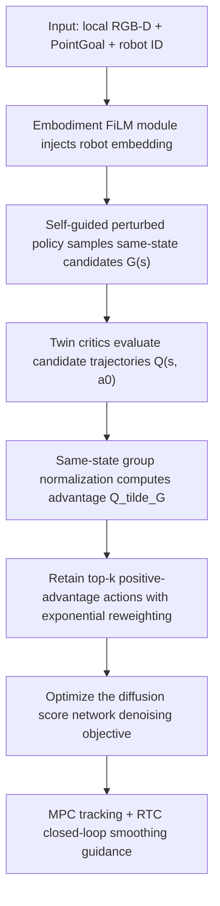
```mermaid
graph TD
    A["Input: local RGB-D + PointGoal + robot ID"] --> B["Embodiment FiLM module injects robot embedding"]
    B --> C["Self-guided perturbed policy samples same-state candidates G(s)"]
    C --> D["Twin critics evaluate candidate trajectories Q(s, a0)"]
    D --> E["Same-state group normalization computes advantage Q_tilde_G"]
    E --> F["Retain top-k positive-advantage actions with exponential reweighting"]
    F --> G["Optimize the diffusion score network denoising objective"]
    G --> H["MPC tracking + RTC closed-loop smoothing guidance"]
```

---

### 3. Results and findings
{: id="3-核心结果发现-31"}

1. **Simulation benchmarks surpassed all aspects**: In 40 unseen test scenarios in IsaacLab, compared with the pre-trained baseline NavDP, the average success rate (SR) of X-NavDP increased from **61.20% to 84.28%**, and the SPL increased from **58.95% to 77.19%**. Especially on the humanoid robot (Unitree G1), the Home scene success rate rose sharply from **50.70% to 84.50%**.
2. **Real robot hard-core dilemma self-rescue**: Deployed on Turtlebot, Unitree Go2 and Unitree G1 without real robot fine-tuning (Zero-Shot Sim-to-Real), in hard-core test sets such as dead ends and long wall detours, the success rate soared from the baseline of **10% to 65%**.

<div align="center">
  
<figcaption>
Figure 3: Qualitative trajectory comparison: X-NavDP is significantly better than NavDP in difficult self-rescue, long obstacle detour and safe path selection
</figcaption>
</div>

<div align="center">
  
<figcaption>
Figure 4: Exploration policy ablation experiment: the importance of target-free perturbation and trajectory reversal in policy learning
</figcaption>
</div>

3. **Key findings from the ablation experiment**:
   - Removing the self-guided perturbation and trajectory reversal causes the RL training to directly collapse (SR drops to 6.23%);
   - Compared with Soft-Prompt splicing, FiLM configuration modulation shows stronger cross-configuration adaptability when expanded to multiple scenarios;
   - Compared to DPPO and DSRL, GQRM exhibits extremely high training stability and data efficiency (only 12 hours post-training).

---

### 4. Limitations
{: id="4-局限性-31"}

1. **Short-term context dependence**: The strategy currently relies mainly on short-term visual context and lacks long-term topological memory. During extremely long wall detours, repeated spins may occur due to memory fading.
2. **Low-level controller dependence**: Cross-configuration generalization relies on pre-trained low-level foot/wheel controllers. Expansion to unconventional configurations requires the corresponding base controller.
3. **Transparent and hollow obstacle perception**: RGB-D depth measurement of transparent/highly penetrating obstacles such as glass partitions and grid hole panels is prone to failure, and stronger semantic perception needs to be introduced.

---

## 42. Image2Sim (2026)
{: id="image2sim"}
———A real-time neural simulation engine that decouples 3D spatial anchoring and hyper-realistic image synthesis

📄 **Paper**: [arXiv:2607.05765](https://arxiv.org/abs/2607.05765) · [Code](https://github.com/MrZihan/Image2Sim)

### Key takeaways
{: id="精华-34"}
1. **Breaking the game between geometry and synthesis**: Image2Sim proposes a neural simulation paradigm that decouples "3D spatial anchoring" and "hyper-real image synthesis", using feed-forward 3D Feature Gaussian to provide explicit metric geometric constraints, and then a single-step pixel flow (Pixel Flow) generation model completes the unobserved field of view guided by the 3D geometric Alpha mask.
2. **Real-time closed-loop high frame rate simulation**: Using continuous-time MeanFlow single-step velocity estimation and Momentum-based Self-Distillation, the multi-step iterative sampling of the traditional diffusion/flow matching model is compressed into a single-step mapping, reaching 45.6 FPS on panoramic RGB-D rendering, meeting the real-time requirements of embodied navigation online closed-loop interaction and DAgger/RL training for the first time.
3. **Automated Embodied Data Engine**: Through explicit Gaussian voxelization, GPU parallel ray stepping collision query and collision-aware NavFn planning, nearly 20,000 interactive neural environments are constructed directly from unlabeled videos/images, and more than 10 million cross-view, high-fidelity navigation trajectories and multi-modal instruction data are automatically synthesized.
4. **Strong cross-domain and Scaling law verification**: The navigation policy Image2Nav based on pure Image2Sim neural environment training, without any contact with real Habitat modeling, cross-simulator zero-shot generalization to R2R-CE (SR 70.3%), RxR-CE and REVERIE-CE refreshes SOTA, and demonstrates excellent zero-shot migration capabilities on a real physical robot (Hello Robot Stretch 3).

---

### 1. Background and problem
{: id="1-研究背景问题-33"}

Embodied Navigation requires the agent to accurately understand multi-modal targets and perform physical actions in 3D space. However, there are long-standing contradictions in building a large-scale, high-fidelity interactive simulation environment with physical grounding:

1. **Real scanning environment (such as Matterport3D, HM3D)**: The visual and geometric realism is extremely high, but it relies on expensive manual scanning and digital twin reconstruction. The number of environments is limited to hundreds to thousands of scenes, and it cannot support large-scale policy pre-training.
2. **Synthetic/Procedural environments (such as AI2-THOR, ProcTHOR)**: Very easy to scale at scale, but contain a large number of artificial 3D assets and non-realistic rendering statistics, and there is a serious Sim-to-Real cross-domain gap.
3. **Traditional generative world models (World Models)**: can synthesize realistic videos, but lack explicit and persistent 3D spatial structures and physical collision surfaces, and cannot support free and coherent closed-loop navigation action interactions for agents.

In order to combine high realism, unlimited scalability and physical closed-loop performance, Image2Sim proposes to build an interactive real-time neural simulation environment directly from unconstrained posture RGB-D image/video sequences.

<div align="center">
  
<figcaption>
Figure 1: Comparison between traditional navigation data pipeline (requiring expensive mesh and manual annotation) and Image2Sim neural simulation framework (adaptive generation of 20,000 scenes and tens of millions of data)
</figcaption>
</div>

---

### 2. Method and innovations
{: id="2-主要方法创新点-31"}

<div align="center">
  
<figcaption>
Figure 2: Image2Sim overall architecture: feed-forward 3D feature Gaussian encoder (left) and single-step geometry-aware Pixel Flow renderer (right)
</figcaption>
</div>

The core innovation of Image2Sim is to split neural environment modeling into two decoupled modules: **Feedforward 3D feature Gaussian geometry construction** (providing persistent 3D spatial anchoring) and **Geometry-aware single-step Pixel Flow rendering** (responsible for hyper-realistic generative completion of unobserved blind areas).

#### ① Feed-forward 3D feature Gaussian geometry construction (Feed-Forward 3D Gaussian Encoder)
{: id="-前馈-3d-特征高斯几何构建feed-forward-3d-gaussian-encoder"}
- **Input**: RGB-D frames of any attitude (supports pinhole cameras and panoramic cameras), uniformly expressed through Ray-Direction Encoding.
- **Processing**: Dual-stream encoder extracts features - the frozen DINOv3 backbone captures high-level semantic features, and the lightweight geometry detail stream preserves RGB, depth and normal vectors. After feature fusion, the prediction head performs one-time back-projection and generates a 3D feature Gaussian set $$\mathcal G = \{g_j\}_{j=1}^M$$. Each Gaussian tuple contains center $\mathbf \mu_j \in \mathbb R^3$, scale $\mathbf s_j$, rotation $\mathbf q_j$, opacity $\alpha_j$, color $\mathbf c_j$, and semantic features $\mathbf f_j$.
- **Output**: panoramic RGB map $$\tilde{\mathbf I}_p$$, depth map $$\tilde{\mathbf D}_p$$, transparency map $$\tilde{\mathbf A}_p$$ and feature map $\mathbf C_p$ projected under the target pose $p$.
- **Design motivation**: Abandon the shortcomings of traditional NeRF/3DGS per-scene optimization (Per-Scene Optimization), which takes several hours, to achieve a single feedforward millisecond-level construction of 3D scenes.

#### ② Geometry-Aware One-Step Pixel Flow renderer (Geometry-Aware One-Step Pixel Flow)
{: id="-几何感知单步-pixel-flow-渲染器geometry-aware-one-step-pixel-flow"}

When the agent moves to an unobserved perspective, direct splash rendering with 3DGS will produce a large number of holes and artifacts (black hole blind spots). Image2Sim designed a Pixel Flow generation model based on Probability Flow ODE:

1. **Alpha-Gated Source State**: The transparency map $$\tilde{\mathbf A}_p$$ rendered using 3DGS measures the geometric reliability of the 3D projection. Construct a spatially adaptive noise scale:
   $$\Sigma(\tilde{\mathbf A}_p) = \tilde{\mathbf A}_p \odot \sigma_{\mathrm{small}} + (1 - \tilde{\mathbf A}_p) \odot \sigma_{\mathrm{large}}$$
This generates the alpha gated source state:
   $$\mathbf z_{\mathrm{src}} = \tilde{\mathbf A}_p \odot \tilde{\mathbf X}_p + \Sigma(\tilde{\mathbf A}_p) \odot \mathbf \epsilon, \quad \mathbf \epsilon \sim \mathcal N(\mathbf 0, \mathbf I)$$
Maintain the original projection details in the high-alpha areas observed by 3DGS; input larger noise in the low-alpha blind areas to guide the generated model to make reasonable completions.

2. **Network structure**: Based on the UNet architecture, the convolutional encoder compresses the source state $\mathbf z_{\mathrm{src}}$ and the geometric condition $\mathbf C_p$, and the Deep Transformer bottleneck layer introduces AdaLN time injection and SPADE-style spatial adaptive normalization (injection of DINOv3 semantic features $\Phi(\mathbf C_p)$). The upsampling stage uses Alpha-Gated Skip Connections to protect the geometric details of high-transparency areas from being destroyed by the generation network.

> **For example (Alpha gated hand calculation deduction)**:
> Assume that the agent turns its head to look at the area behind the door. The transparency of a certain pixel in the panoramic image in the 3DGS projection is $$\tilde{A}_p = 0.95$$ (already known geometry), while the transparency of the unscanned corner next to it is $$\tilde{A}_p = 0.05$$ (pure blind area).
> Let $\sigma_{\mathrm{small}}=0.01$, $\sigma_{\mathrm{large}}=1.0$.
> - The known regional noise standard deviation is only $0.95 \times 0.01 + 0.05 \times 1.0 = 0.0595$, and the network input is nearly pure projected RGB-D evidence;
> - The standard deviation of pixel noise in the blind area reaches $0.05 \times 0.01 + 0.95 \times 1.0 = 0.9505$, and the network receives a strong noise signal, triggering the generative diffusion/flow matching mechanism to fill in reasonable texture and depth.

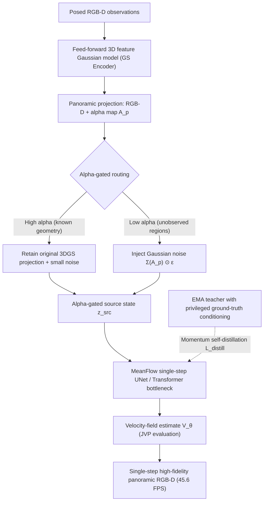
```mermaid
graph TD
    A["Posed RGB-D observations"] --> B["Feed-forward 3D feature Gaussian model (GS Encoder)"]
    B --> C["Panoramic projection: RGB-D + alpha map A_p"]
    C --> D{"Alpha-gated routing"}
    D -- "High alpha (known geometry)" --> E["Retain original 3DGS projection + small noise"]
    D -- "Low alpha (unobserved regions)" --> F["Inject Gaussian noise Σ(A_p) ⊙ ε"]
    E --> G["Alpha-gated source state z_src"]
    F --> G
    G --> H["MeanFlow single-step UNet / Transformer bottleneck"]
    H --> I["Velocity-field estimate V_θ (JVP evaluation)"]
    I --> J["Single-step high-fidelity panoramic RGB-D (45.6 FPS)"]
    K["EMA teacher with privileged ground-truth conditioning"] -. "Momentum self-distillation L_distill" .-> H
```

#### ③ Continuous-Time MeanFlow and Momentum Self-Distillation
{: id="-continuous-time-meanflow-与动量自蒸馏momentum-self-distillation"}
- **MeanFlow single-step continuous mapping**: Traditional Flow Matching requires 20–50 steps of Euler integration sampling, which is extremely slow (<1 FPS). Image2Sim is based on the continuous-time MeanFlow theory and directly predicts the average transmission speed $u_\theta = (\mathbf z_t - x_\theta)/\max(t, \varepsilon)$ from the source state $\mathbf z_{\mathrm{src}}$ to the target image $\mathbf X_p$. Combined with the forward JVP (Jacobian-Vector Product) to efficiently calculate the directional derivative $\frac{\mathrm d u_\theta}{\mathrm d t}$, the generation can be completed in one forward step, increasing the rendering speed to 45.6 FPS.
- **Momentum Self-Distillation Loss**: Maintaining a Teacher network with an exponential moving average (EMA, decay rate 0.999), Teacher receives privileged Ground-Truth source state $\mathbf z_{\mathrm{gt}}$. The decoder features extracted by Student are forcibly aligned with Teacher:
  $$\mathcal L_{\mathrm{distill}} = \sum_{k \in \mathcal K} \tilde{w}_k \left( 1 - \frac{\mathbf f_k^S \cdot \mathbf f_k^T}{\lVert \mathbf f_k^S \rVert_2 \lVert \mathbf f_k^T \rVert_2} + \beta \lVert \mathbf f_k^S - \mathbf f_k^T \rVert_2^2 \right)$$
It greatly enhances the stability of single-step generation and eliminates light and shadow jitter and hallucination artifacts.

<div align="center">
  
<figcaption>
Figure 3: Comparison between 3DGS original rendering (left, a lot of broken black blocks) and Pixel Flow completed rendering (middle) in a sparse scene with high noise
</figcaption>
</div>

#### ④ Physical motion simulation engine and automated data pipeline
{: id="-物理运动仿真引擎与自动化数据流水线"}

<div align="center">
  
<figcaption>
Figure 4: Physical motion engine and VLM automated instruction annotation process based on voxelized collision query and NavFn path planning
</figcaption>
</div>

1. **Voxelization and GPU Ray Step Collision Query**: Discretize a 3D Gaussian scene into a dense voxel grid $\mathcal V$, and determine traversability based on height above the ground, surface connectivity, and safe distance between obstacles. Query the robot footprint collision through GPU parallel ray marching, build a passable voxel map $\mathcal M = (\mathcal V, \mathcal E)$, and support wall sliding and collision interception.
2. **Collision-aware NavFn planning and pure pursuit control**: Run NavFn path planning combined with safety cost on Graph $\mathcal M$, and use Pure-Pursuit pure pursuit controller to transform discrete nodes into smooth continuous motion trajectories.
3. **VLM Automated Instruction Annotation**: Replay the physical trajectory rendering panoramic video, and use the Large Vision-Language Model to automatically generate diverse navigation text instructions such as path tracking, goal orientation, and human habits.

| Dimensions | Traditional scanned 3D Mesh (Habitat/Matterport3D) | Pure 3DGS rendering (AnySplat, etc.) | Purely generative world models (World Models) | Image2Sim neural simulator (this article) |
|---|---|---|---|---|
| **Scene scalability** | Very low (relies on manual 3D scanning) | Medium (requires scene-by-scene optimization or feed-forward prediction) | High (generates directly from video/text) | **Extremely high (inputs any RGB-D video/image)** |
| **Unobserved completion** | Not available (relies on fixed Mesh boundaries) | Very poor (black holes, heavy artifacts) | Strong (diffusion/flow matching generation) | **Extremely strong (Alpha gated Pixel Flow completion)** |
| **Interactive rendering speed** | Extremely high (>100 FPS traditional rendering) | Extremely high (>115 FPS) | Extremely slow (<1 FPS multi-step sampling) | **Real-time high frame rate (45.6 FPS single-step generation)** |
| **Physical closed-loop constraints** | Possible (built-in physical collision grid) | Lack of (pure point cloud rendering without geometric collision surfaces) | Lack of (unable to accurately prevent the robot from passing through walls) | **Has (based on Gaussian voxels and GPU light stepping)** |

---

### 3. Results and findings
{: id="3-核心结果发现-32"}

#### ① Comparison of perspective synthesis rendering quality and speed
{: id="-视角合成渲染质量与速度对比"}
On challenging datasets such as RealSee3D-Real (high-noise LiDAR depth), Image2Sim shows extremely excellent robustness and speed performance:

- **Rendering quality**: PSNR reaches 17.43, SSIM reaches 0.470, significantly surpassing the pure Gaussian feedforward model AnySplat (PSNR 15.23, SSIM 0.415), effectively making up for the lack of structure.
- **Rendering Frame Rate**: panoramic RGB-D rendering speed reaches **45.6 FPS**, one to two orders of magnitude faster than traditional diffusion generation models DiT360 (0.3 FPS) and SE3DS (3.4 FPS).

#### ② Cross-simulator Zero-Shot embodied navigation performance (R2R-CE, RxR-CE, REVERIE-CE)
{: id="-跨模拟器-zero-shot-具身导航性能-r2r-ce-rxr-ce-reverie-ce"}
The baseline navigation model Image2Nav is only trained on the neural dataset generated by Image2Sim, and **zero-shot are evaluated directly in the Habitat simulator** (breaking the habit of all Baseline training and evaluation inside Habitat):

- **R2R-CE path tracking navigation**: On the Val Unseen partition, Image2Nav (180° FOV) achieved SOTA results of **SR 70.3%**, **SPL 65.6%**, and **NE 3.71m**, significantly surpassing the top methods trained in Habitat, EfficientVLN (SR 64.2%, SPL 55.9%) and DualVLN (SR 64.3%, SPL 58.5%).
- **RxR-CE multi-language long command navigation**: achieves **SR 70.7%**, **SPL 59.1%**, **NE 3.74m**, **nDTW 71.8%**.
- **REVERIE-CE Goal-Oriented Navigation**: Achieved **SR 53.7%**, **SPL 42.7%**.

<div align="center">
  
<figcaption>
Figure 5: Logarithmic linear scaling law curve of navigation success rate (SR) when Image2Sim training data scale is expanded from 35K to 10M
</figcaption>
</div>

#### ③ Scaling Law verification of navigation data
{: id="-导航数据的-scaling-law-验证"}
As shown in the figure above, when the 1M, 5M to 10M samples generated by Image2Sim are gradually superimposed on the R2R/RxR basic data, the success rate (SR) shows a clear and unsaturated logarithmic linear growth (**SR leaps from 46.1% to 66.3%, SPL increases from 41.3% to 61.5%**). This strongly proves that the current embodied navigation performance is still strongly constrained by the amount of data, and Image2Sim can continuously empower pre-training as an endless data engine.

#### ④ ablation experiment (Ablation Study)
{: id="-消融实验-ablation-study"}
- **Pixel Flow generated model removed**: PSNR plummets to 17.75, SSIM drops to 0.438, proving that 3DGS splash alone cannot handle sparse view holes.
- **Removing Semantic Feature Injection**: PSNR drops to 18.36, demonstrating that DINOv3 semantic guidance is critical for generating reasonable unobserved walls and furniture.
- **Alpha Gated Fusion Removed**: PSNR dropped to 18.57, destroying the balance of known 3D geometry and generative completion.
- **Momentum Self-Distillation Removed**: PSNR drops to 19.84, demonstrating that EMA Teacher successfully suppresses flicker artifacts in single-step generation.

#### ⑤ Real-World Deployment
{: id="-真实物理机器人部署-real-world-deployment"}
Real robot testing (20 trials) on the Hello Robot Stretch 3 mobile robot showed:
- **Path-following task**: The success rate reaches 11/20 (significantly better than JanusVLN’s 8/20 and DualVLN’s 8/20).
- **Goal-oriented task**: success rate reaches 9/20 (much higher than DualVLN’s 5/20).

---

### 4. Limitations
{: id="4-局限性-32"}

1. **Capacity trade-off of lightweight renderer**: In order to support 45+ FPS real-time online closed-loop interaction and DAgger/RL training, the lightweight rendering model has a slight capacity sacrifice on extremely complex ultra-wide-angle light and shadow details.
2. **Limited physical interaction dynamics**: The simulator currently focuses on rigid collision and sliding constraints at the navigation level, and does not yet support complex contact mechanics, movable objects and human-computer dynamic interaction.
3. **Semantic bias in instruction annotation**: Although fully automated large language/visual model instruction annotation achieves scale, it may occasionally introduce natural language bias or a small amount of image-text mismatch.

---

## 43. DecoVLN (2026)
{: id="decovln"}
———Decoupling Observation, Reasoning, and Correction for Vision-and-Language Navigation

📄 **Paper**: [arXiv:2603.13133](https://arxiv.org/abs/2603.13133) · 🏛️ **CVPR 2026** · [Project Page](https://allenxinn.github.io/DecoVLN/) · [Code (to be released)](https://github.com/Allenxinn/DecoVLN)

### Key takeaways
{: id="精华-35"}
1. **Three-dimensional complete decoupling**: Break the tightly coupled and inefficient model of traditional streaming navigation of "full storage in memory and uniform sampling during inference", and completely separate the observation flow, inference flow and error correction flow in space, time and hardware GPU memory.
2. **Adaptive pre-refinement (AMR)**: Jointly optimizes instruction semantic relevance, visual diversity penalty and time span coverage during the entry stage of streaming observation, and resides in the extremely compact $K=8$ high information density memory bank in the GPU memory.
3. **Single-step error correction fine-tuning (ECF) in the trust domain**: Based on the geodesic distance to quantify the degree of deviation, only single-step state-action pairs are collected in the controllable trust domain to guide recovery, and eliminate long-term cumulative compound errors and sample data pollution from the root cause.
4. **Pure RGB monocular surpasses multi-modal sensors**: Achieved success rates of 56.3% and 54.2% respectively on the R2R-CE and RxR-CE continuous benchmarks, completely surpassing the SOTA model that relies on depth maps and 3D voxel projections with zero additional large-scale pre-training data.
5. **Device-cloud collaborative real robot zero-shot migration**: 4-step discrete action chunks (Action Chunk) are parsed end-to-side into continuous relative target poses, and the Yushu GO2 quadruped robot successfully overcomes real environment disturbances such as strong ground reflections and visual confusion.

---

### 1. Background and problem
{: id="1-研究背景问题-34"}

Vision-language navigation (Vision-and-Language Navigation, VLN) requires the embodied agent to independently plan a continuous movement path in an unknown 3D physical environment and reach the target based only on its own first-person perspective (Egocentric) visual observation and long-range natural language instructions. Existing methods mainly face three major bottlenecks:

1. **Perceptual blind spots caused by "Stop-and-Think"**: The agent performs a step and then pauses to perceive and then reason. The actions are incoherent and key visual landmarks are missed during the movement.
2. **Context pollution and I/O congestion of traditional streaming navigation**: All historical observation frames are temporarily stored in the host memory (RAM) without any difference, and then passively uniform sampling (Uniform Sampling) or relying on depth sensors to construct 3D voxel pruning during inference causes the input context to be filled with irrelevant noise such as white walls and corners, and frequent data transfers between GPU memory and memory cause high inference delays.
3. **Compounding Errors in the long-range Markov decision-making process**: The open-loop autoregressive strategy will continue to diverge after a small drift occurs in the early stage; while the traditional DAgger algorithm still forcibly collects corrective actions after the entire trajectory deviates seriously, causing error correction samples to seriously deviate from the original instruction distribution, causing training data contamination.

---

### 2. Method and innovations
{: id="2-主要方法创新点-32"}

<div align="center">
  
<figcaption>
DecoVLN overall architecture: asynchronous decoupling of streaming observation and autoregressive reasoning, dynamically maintaining GPU memory resident Memory Bank through adaptive memory refinement (AMR), outputting 4-step action chunks (Action Chunk), and collecting single-step state-action pairs in the trust domain for error correction fine-tuning (ECF)
</figcaption>
</div>

#### ① Overview of the overall framework
{: id="-整体框架概述-15"}
DecoVLN formalizes vision-language navigation into a Partially Observable Markov Decision Process (POMDP), which operates collaboratively through three major decoupling modules:
- **Observation Stream**: First-view RGB images are continuously collected during the movement of the robot. The **Adaptive Memory Refinement Module (AMR)** evaluates the multi-dimensional value of each frame online and stores the most informative features in the GPU memory Memory Bank;
- **Autoregressive reasoning stream (Reasoning Stream)**: VLM (based on LLaVA-Video-7B) only receives the current instruction, Memory Bank ($K=8$ frame) and the last 4 frames of real-time observation, and the autoregressive output is an **Action Chunk** composed of 4 consecutive actions;
- **Self-error correction fine-tuning stream (Correction Stream)**: In the autonomous exploration of the simulator, geodesic distance (Geodesic Distance) is used to divide the **Trusted Region**, and dynamically capture the single-step corrective state-action pair under the deviation trajectory, giving the model closed-loop self-healing capabilities.

#### ② Deep decoupling of observation and inference: Adaptive Memory Refinement (AMR)
{: id="-观测与推理深度解耦自适应记忆精炼amr"}

<div align="center">
  
<figcaption>
Comparison of the architecture process of the traditional streaming VLN paradigm and DecoVLN: (a) The traditional streaming paradigm stores all historical observations in RAM, and repeatedly copies and samples evenly between RAM and VRAM during inference; (b) DecoVLN performs pre-multi-criteria filtering on the observation side and resides in GPU memory (VRAM) to achieve extremely high data throughput and signal-to-noise ratio
</figcaption>
</div>

The essential differences in memory maintenance logic between traditional methods and DecoVLN are as follows:

| Dimensions | Traditional streaming VLN (such as StreamVLN) | This article DecoVLN |
|---|---|---|
| Memory management mechanism | **Posthoc pruning (Post-hoc)**: First store the entire amount in RAM, blindly uniformly sample or rely on depth map 3D voxel deduplication during inference | **Pre-hoc)**: The value of the observation frame is evaluated online when it is generated, and only key frames with high information content enter the Memory Bank |
| GPU memory/memory I/O | Each inference requires repeated transmission of a large number of image frames between the host RAM and GPU VRAM | Memory Bank is resident in GPU memory (VRAM) throughout, with zero additional transmission delay during inference |
| Sensor dependence | Rely on high-precision depth sensor (RGB-D / binocular) to calculate point cloud and voxel | **Only requires monocular first-view RGB image**, strong versatility |
| Instruction correlation | The sampling process is completely disconnected from the task instructions, and it is easy to mix in a large number of invalid views such as white walls and floors | Dynamically calculate the semantic similarity of images and texts to closely align the landmarks involved in the instructions |

AMR models long-range memory construction as an explicit multi-criteria iterative optimization problem. During the navigation process, the agent iteratively selects frame $K$ from the candidate frame pool $\mathcal C$ and adds it to the refined memory bank $\mathcal M$, so as to maximize the comprehensive scoring function:

$$f^* = \arg\max_{f \in \mathcal C \setminus \mathcal M} \left[ \lambda_R \cdot \mathrm{Sim}_{Sem}(f, I) - (1 - \lambda_R) \cdot \left( w_V \cdot \mathrm{Sim}_{Vis}(f, \mathcal M) + w_T \cdot \mathrm{Sim}_{Temp}(f, \mathcal M) \right) \right]$$

The physical meanings of each are as follows:
1. **Semantic Relevance ($$\mathrm{Sim}_{Sem}$$)**: Calculate the cosine similarity between the candidate frame visual embedding $e_f$ and the navigation instruction global text embedding $e_I$:
   $$\mathrm{Sim}_{Sem}(f, I) = \frac{e_f \cdot e_I}{\lVert e_f \rVert \lVert e_I \rVert}$$
2. **Visual diversity penalty ($$\mathrm{Sim}_{Vis}$$)**: Calculate the maximum visual cosine similarity between candidate frame $f$ and all existing frames in the current memory bank $\mathcal M$, and punish duplicate landmarks with highly similar fields of view:
   $$\mathrm{Sim}_{Vis}(f, \mathcal M) = \max_{m \in \mathcal M} \frac{\mathrm{embed}(f) \cdot \mathrm{embed}(m)}{\lVert \mathrm{embed}(f) \rVert \lVert \mathrm{embed}(m) \rVert}$$
3. **Time span coverage penalty ($$\mathrm{Sim}_{Temp}$$)**: Penalizes candidate frames with timestamps that are too close to encourage the memory bank to maintain uniform time coverage throughout the long trajectory ($\epsilon$ is a tiny constant to prevent zeros):
   $$\mathrm{Sim}_{Temp}(f, \mathcal M) = \frac{1}{\min_{m \in \mathcal M} \lvert t_f - t_m \rvert + \epsilon}$$

> **For example (how AMR weight balancing selects key landmarks)**:
>
> The robot executes a 50-step long instruction: "Go through the hallway, into the living room and stop by the black loveseat."
>
> The robot stayed in the living room for 15 steps. If we only look at the semantic correlation ($\lambda_R = 1.0$), the 8 selected memory frames will all be occupied by the close-up of the sofa from the same angle in the living room, resulting in the complete loss of the memory of the first half of the corridor;
>
> When the visual diversity and time penalty ($\lambda_R = 0.5, w_V = 0.5, w_T = 0.5$) were introduced, the score of the second living room sofa frame was greatly reduced because it was $$\mathrm{Sim}_{Vis} > 0.95$$ with the existing sofa frame and had a very small time difference;
>
> The final algorithm will automatically retain: 1 frame of the starting room, 2 frames of the corridor corner, 2 frames of the living room entrance, and 3 frames of sofa landmarks with different orientations, achieving full-time and spatial high-fidelity memory.

<div align="center">
  
<figcaption>
Key frame comparison between Uniform Sampling and Adaptive Memory Refinement (AMR): Uniform sampling captures a large number of white walls and irrelevant door corners; AMR accurately extracts key decision points such as door openings, murals, and double sofas highlighted in the instructions
</figcaption>
</div>

#### ③ Trust domain status-action error correction fine-tuning (ECF)
{: id="-信任域状态-动作对纠错微调ecf"}

In long-range navigation, small cumulative drift often causes the agent to deviate from the expert trajectory. To solve this problem, DecoVLN proposes a trust domain error correction fine-tuning strategy based on step-level state-action pairs (State-Action Pair):

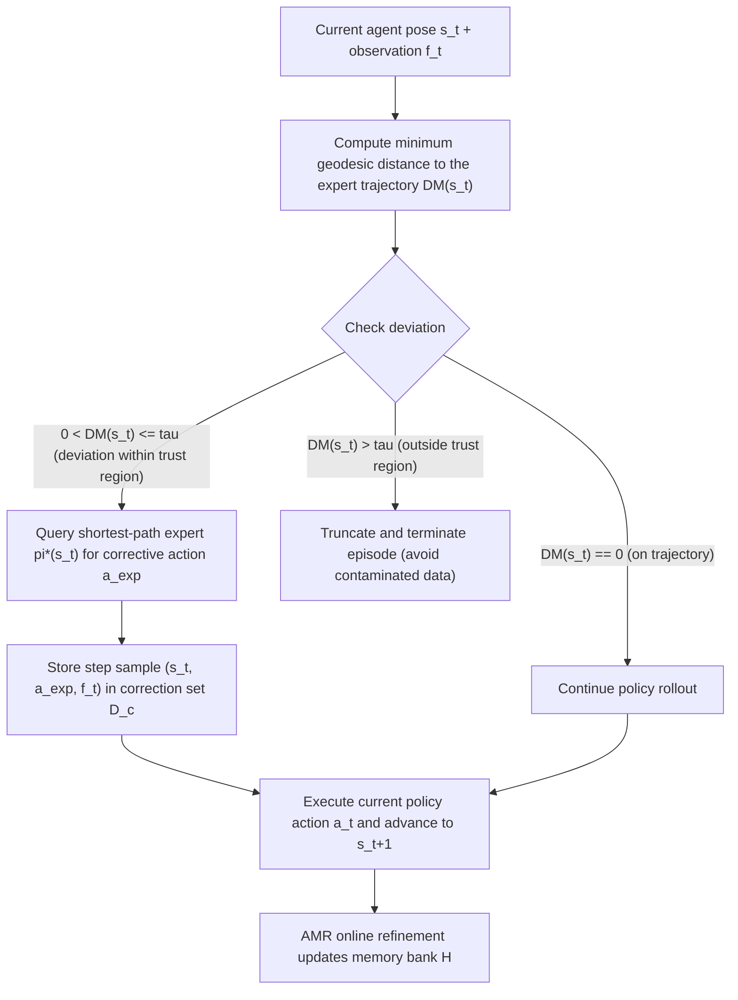
```mermaid
graph TD
    A["Current agent pose s_t + observation f_t"] --> B["Compute minimum geodesic distance to the expert trajectory DM(s_t)"]
    B --> C{"Check deviation"}
    C -- "DM(s_t) == 0 (on trajectory)" --> D["Continue policy rollout"]
    C -- "0 < DM(s_t) <= tau (deviation within trust region)" --> E["Query shortest-path expert pi*(s_t) for corrective action a_exp"]
    E --> F["Store step sample (s_t, a_exp, f_t) in correction set D_c"]
    C -- "DM(s_t) > tau (outside trust region)" --> G["Truncate and terminate episode (avoid contaminated data)"]
    F --> H["Execute current policy action a_t and advance to s_t+1"]
    D --> H
    H --> I["AMR online refinement updates memory bank H"]
```

The specific algorithm details are as follows:
- **Deviation measure**: Use the geodesic distance (Geodesic Distance) of the environment topology to define the deviation $$\mathrm{DM}(s_t) = \min_{s^* \in \mathcal P_{exp}} d_g(s_t, s^*)$$.
- **Trust domain threshold $\tau$**: Set the trust domain truncation threshold $\tau = 3\text{m}$. When $0 < \mathrm{DM}(s_t) \le \tau$, the agent deviates but is still within the effective context range that can perceive the original target. At this time, it queries the shortest path expert policy (SPF) for the optimal action $$a_t^{\mathrm{exp}} = \pi^*(s_t)$$ that returns to the right track in one step, and stores it in the fine-tuning dataset $\mathcal D_c$;
- **Out-of-bounds truncation**: Once $\mathrm{DM}(s_t) > \tau$ indicates that a catastrophic voyage has occurred, forcibly corrective will only introduce a strange state distribution that is out of touch with the language instructions, and the algorithm will immediately interrupt the Episode.
- **Anti-catastrophic forgetting hybrid training**: In the error correction fine-tuning stage, 180K navigation error correction samples are mixed with the 178K general video question and answer dataset (LLaVA-Video-178K) in proportion to ensure that the model maintains basic multi-modal spatio-temporal reasoning capabilities while obtaining closed-loop self-healing capabilities.

#### ④ Action Chunking smooth analysis and real robot control
{: id="-动作块action-chunking平滑解析与真机控制"}

In a real physical robot (such as Unitree GO2) deployment, VLM autoregressively generates 4-step discrete symbolic action blocks (for example: `[forward 25cm, forward 25cm, turn left 15°, stop]`) on the remote server.

> **For example (conversion of discrete action blocks to continuous smooth trajectories)**:
> If a quadruped robot directly executes these 4 discrete instructions step by step and serially on the real robot, it must brake and slow down every 25cm, causing the body to be violently bumpy and its course to easily drift;
> DecoVLN synthesizes this action sequence into a unified local relative target pose $(\Delta x = 0.5\text{m}, \Delta y = 0, \Delta \theta = 15^\circ)$ in the Jetson Orin end-side controller;
> The underlying motion control API plans a continuous and smooth polynomial trajectory curve based on the relative posture and directly generates the generator torque to achieve a smooth and natural continuous gait.

<div align="center">
  
<figcaption>
DecoVLN Real robot evaluation on Yushu GO2 robot dog: Even in the face of reflective tile floors, complex indoor corridors, and open-vocabulary objects that did not appear in the training set, it still showed closed-loop robust behavior of autonomously fine-tuning the body orientation to keep the road sign in the center of the field of view
</figcaption>
</div>

---

### 3. Results and findings
{: id="3-核心结果发现-33"}

1. **Leading benchmark performance**: On the R2R-CE and RxR-CE Val-Unseen continuous benchmarks, DecoVLN achieved **56.3%** and **54.2%** success rates (SR) respectively using only the monocular first-view RGB input, and the SPL reached **50.5%** and **46.3%** respectively.
2. **Superior to multi-modal sensor SOTA**: Compared with StreamVLN, which also uses a streaming design (SR: 52.8% / 48.6%), DecoVLN's success rate on RxR-CE is increased by up to **+5.6%**, even significantly surpassing the StreamVLN version using RGB+Depth dual-mode input (SR: 52.9%).
3. **Extremely high data and computing power efficiency**: There is no need to conduct large-scale pre-training on millions of additional synthetic datasets such as ScaleVLN. It only takes about 600 GPU-hours (8 A800) to train on the 360K samples collected by Matterport3D, which can surpass the waypoint and map models that rely on large-scale pre-training.
4. **Ultra-long path generalization ability**: On the synthetic ultra-long trajectory validation set (Long-Horizon Validation Set) with an average length of 23 meters, the success rate of DecoVLN reaches **36.9%**, which is a relative improvement of **+12.5%** compared with StreamVLN, proving the effectiveness of AMR memory compression in long-term anti-forgetting.
5. **Active closed-loop alignment behavior appears in real robot**: In the real robot test, the robot dog spontaneously displayed lateral fine-tuning and posture compensation behaviors while traveling, actively ensuring that key landmarks and final targets are always in the center of the field of view, and has real online closed-loop anti-interference capabilities.

---

### 4. Limitations
{: id="4-局限性-33"}

1. **Relies on device-cloud collaboration and wireless network bandwidth**: The model is built based on LLaVA-Video-7B. The 7B parameter volume makes it difficult to directly implement full-board real-time reasoning on edge computing platforms such as Jetson Orin, and is dependent on wireless communication network delay and signal stability.
2. **Limited global relocation capability when extreme landmarks are lost**: When encountering a completely symmetrical corridor with extremely poor features or severe visual confusion leading to complete loss, the current system lacks active backtracking (Backtracking) and global reconstruction and re-planning mechanisms based on Chain-of-Thought.

---

## 44. TAMP-Nav (2026)
{: id="tamp-nav"}
———Point, Think, Memorize, and Align for Efficient Navigation

📄 **Paper**: [arXiv:2608.17512](https://arxiv.org/abs/2608.17512) · [Code](https://github.com/ZJU-OmniAI/Embodied-Omni)

---

### Key takeaways
{: id="精华-36"}
- **Spatial decoupling (Point)**: The Pixel-to-3D action paradigm is proposed, allowing the 2D large visual language model (VLM) to only serve as a "visual indicator" to select 2D pixel waypoints on the image, using external depth back-projection to be executed by the traditional SLAM controller, completely avoiding the geometric illusion when the 2D VLM returns to continuous 3D coordinates.
- **Dynamic Memory (Think & Memorize)**: Design anchor-trajectory hybrid memory (Anchor-Trajectory Memory) to only store high-fidelity visual and chain of thought (CoT) semantic anchors at key topological decision points. The intermediate transition path only retains the fixed-length spatio-temporal indicator (STI Token) compressed by multi-dimensional rotational position encoding (RoPE), which greatly reduces long-term attention dilution.
- **Two-level alignment (Align)**: Proposes a two-level GRPO reinforcement learning framework that fuses annealing-guided sampling, and independently standardizes and superimposes the trajectory-level global success/efficiency rewards and the step-level local action/inference value rewards to achieve dense signal supervision.
- **Efficient Emergence**: With only 90k synthetic trajectories, cold start and online reinforcement, the model can autonomously emerge the metacognitive ability of "passing quickly on straight roads and pondering on demand at intersections", approaching the upper limit of 100% dense reasoning with a sparse reasoning ratio of 26.3%, and achieving SOTA performance in R2R-CE (66.2% SR) and quadruped real robot zero-shot deployment (60.0% SR).

---

### 1. Background and problem
{: id="1-研究背景问题-35"}
Deploying the general large visual language model (VLM) into continuous environment embodied navigation (VLN-CE) faces three core technical bottlenecks:
1. **Geometric Gap in Action Space**: Mainstream VLM is pre-trained on 2D image-text pairs, forcing it to directly return to continuous 3D space coordinates or predict discrete underlying atomic actions (such as "turn left 30 degrees"), which can easily lead to serious 3D space geometric illusions and extremely low data utilization efficiency;
2. **Reasoning Dilemma**: The introduction of Chain of Thinking (CoT) can strengthen high-level planning, but fixed pace or full reasoning at each step brings linearly increased computing delays, and lacks the flexibility to make dynamic decisions based on scene complexity;
3. **Memory explosion of long-term history and loss of spatiotemporal perception (Memory Bottleneck)**: Fully retaining historical visual features will lead to multi-modal context overflow and attention dilution, while heuristically discarding frames will lose key topological clues, and lack explicit spatiotemporal physical coordinates to organize historical trajectories.

---

### 2. Method and innovations
{: id="2-主要方法创新点-33"}

<div align="center">
  
<figcaption>
TAMP-Nav overall architecture: combines 2D pixel selection, anchor-track hybrid memory, selective on-demand reasoning and two-level GRPO alignment
</figcaption>
</div>

#### ① Overview of the overall framework
{: id="-整体框架概述-16"}
TAMP-Nav builds a closed-loop interactive system around "perception point (Point), on-demand thinking (Think), spatiotemporal memory (Memorize), and two-level alignment (Align)". At each navigation step, the agent combines the current four views surrounding image and the historical anchor point-trajectory memory to maintain long-term spatial cognition; it decides independently whether to trigger deep thinking chain analysis; it outputs the target waypoint with a 2D pixel indicator and back-projects it to the 3D space for execution by the underlying SLAM controller; the overall strategy completes the close alignment of cognitive planning and environmental physical feedback through two-level GRPO reinforcement learning.

#### ② Pixel-to-3D action space (Point)
{: id="-pixel-to-3d-动作空间point"}
Traditional approaches require the VLM to implicitly learn complex 3D projection transformations. TAMP-Nav strictly decouples high-level semantic decisions from underlying physical execution:
- **View selection and pixel selection**: At time step $t$, the agent receives 4 surround camera perspectives $V_t = \{v_{t,1}, v_{t,2}, v_{t,3}, v_{t,4}\}$ to implement $360^\circ$ panoramic perception. VLM first selects the optimal orientation view $v_{t,i}$, and then directly predicts the 2D pixel coordinate $a_t = (u, v)$ on the image plane as the target waypoint.
- **3D projection and local execution**: Combine the depth map $D_{t,i}$ of the perspective and the camera internal parameter matrix $K$ to directly calculate the local 3D space coordinates:
  $$P_t = D_{t,i}(u, v) \cdot K^{-1} [u, v, 1]^T$$
After transferring $P_t$ to the global world coordinate system, it is directly distributed to the mature underlying SLAM local controller (such as Fast-LIO2 odometry + FAR Planner local planner) to independently complete motion control and obstacle avoidance. This greatly reduces the average number of interaction steps from more than 30 steps for traditional atomic actions to 9 steps.

#### ③ Anchor point-track hybrid memory and space-time indicator (Think & Memorize)
{: id="-锚点-轨迹混合记忆与时空指示器think--memorize"}
In order to solve the contradiction in long-distance navigation caused by full storage leading to context explosion and sparse discarding leading to information fragmentation, TAMP-Nav proposes heterogeneous dual-track memory:

1. **Space-Time Indicator, STI Token**:
In order to inject unambiguous physical absolute coordinates $(x, y)$, yaw angle $\text{yaw}$ and time step $t$ into the context stream, a fixed-length feature vector is constructed through multi-dimensional rotational position encoding (RoPE) and multi-layer perceptron (MLP):
   $$E_{\text{STI}}(t, x, y, \text{yaw}) = \text{MLP}\left( \left[ \text{RoPE-2D}(x, y); \text{RoPE-1D}(t); \text{RoPE-2D}(\sin(\text{yaw}), \cos(\text{yaw})) \right] \right)$$
   > **Vernacular Intuition**: If the yaw angle is directly expressed as a scalar value at the boundary between $0^\circ$ and $360^\circ$, the value will suddenly change (such as jumping from 359 to 1) when the robot turns slightly; disassembling it into a continuous trigonometric function pair $(\sin(\text{yaw}), \cos(\text{yaw}))$ and mapping it to 2D space can ensure continuous smooth rotation of the angle and eliminate geometric discontinuity.

> **Dimensionality reduction device A - minimum specific example (storage compression hand calculation comparison)**:
> Suppose a corridor navigation contains 20 time steps, of which only step 1 (starting point) and step 12 (T-junction turn) are key decision points:
> - **Traditional full storage**: Each step retains multi-view image patches, each step is about 256 tokens, 20 steps will consume $20 \times 256 = 5120$ tokens, quickly bursting the 4096 context window and diluting attention;
> - **TAMP-Nav hybrid memory**: only store high-fidelity visual and thinking anchors for steps 1 and 12 (each accounting for 1 set of image tokens), and the remaining 18 non-critical transition steps are only compressed into **1 fixed-length STI token** (a total of 18 tokens);
> - **Effect**: Not only does the long-range historical token consumption be reduced by more than 90%, but the robot can accurately sense at each step which step it is at, and which position and orientation it is in the world coordinate $(x_t, y_t)$, completely retaining the space-time skeleton of the continuous motion trajectory.

2. **Explicit Anchors and Track Flow**:
   - **Explicit anchor point $A_k$**: At the topological key point $t_k$ that triggers the deep CoT, saved as a triple:
     $$A_k = \langle M_{\text{STI}}^{(k)}, M_{\text{vis}}^{(k)}, M_{\text{state}}^{(k)} \rangle$$
     Here, $M_{\text{STI}}^{(k)}$ supplies precise spatiotemporal coordinates; $M_{\text{vis}}^{(k)}$ retains high-fidelity raw visual features for pixel-level loop closure; and $M_{\text{state}}^{(k)}$ stores the current step's CoT summary as a stage-level planning landmark;
   - **Trajectory flow $T_k$**: In the non-critical straight line or fine-tuning interval between two anchor points, high-overhead image tokens are completely eliminated, and only lightweight STI sequences are retained:
     $$T_k = \left[ E_{\text{STI}}(t, x_t, y_t, \text{yaw}) \mid t \in \mathcal T \right]$$
   - **Working Memory**: The current step input will also splice the 2 latest images evenly sampled between the current step and the nearest anchor point to ensure the continuity of local observation.

#### ④ Comparison of core mechanism dimensionality reduction
{: id="-核心机制降维对比"}

> **Dimensionality Reduction Device C - Embodied Navigation Core Architecture Comparison Table**:

| Dimension | Traditional atomic action / 3D regression paradigm | Dense CoT / Full history paradigm | TAMP-Nav (this article's plan) |
|---|---|---|---|
| **Action Space** | Predict discrete underlying actions (turn left/forward) or directly regress 3D space coordinates | Heuristic waypoint graph search or diffusion model generation candidate | **Pixel-to-3D**: 2D pixel selection + depth back-projection + SLAM closed-loop controller |
| **Inference mechanism** | No CoT or high-overhead CoT triggered indiscriminately at each step | CoT triggered at fixed step intervals | **On-demand spontaneous reasoning**: RL driven, only deep thinking near intersections/obstacles/goals |
| **Long-range memory** | Discard history or monotonically uniform downsampling (lost topological connectivity) | Keep all visual tokens (context explosion, attention dilution) | **Anchor point-trajectory hybrid memory**: retain graphic and text anchor points for key points, and retain fixed-length STI tokens for transition steps |
| **RL Optimization** | Purely sparse endpoint rewards (extreme variance) or forced fitting of expert actions | Only trajectory-level result rewards (difficult to attribute single-step actions) | **Two-level GRPO**: trajectory-level global advantage + step-level local advantage superimposed after independent normalization |

---

#### ⑤ Two-level GRPO reinforcement learning alignment (Align)
{: id="-两级-grpo-强化学习对齐align"}

<div align="center">
  
<figcaption>
Two-level GRPO reinforcement learning alignment paradigm: fusion of trajectory-level global rollout and step-level candidate sampling, and combined with annealing guided sampling
</figcaption>
</div>

In order to allow the agent to have both microscopic obstacle avoidance accuracy and macroscopic long-range planning capabilities, TAMP-Nav designed a two-level GRPO framework and multi-branch sampling:

> **Dimensionality reduction device B - two-level GRPO data flow and advantage overlay mechanism (self-made Mermaid diagram)**:

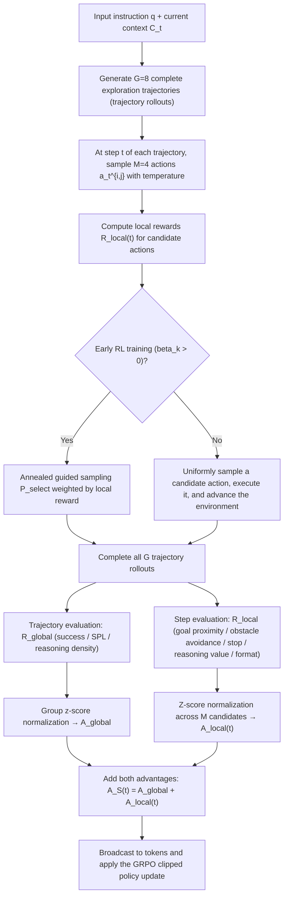
```mermaid
graph TD
    A["Input instruction q + current context C_t"] --> B["Generate G=8 complete exploration trajectories (trajectory rollouts)"]
    B --> C["At step t of each trajectory, sample M=4 actions a_t^{i,j} with temperature"]
    C --> D["Compute local rewards R_local(t) for candidate actions"]
    D --> E{"Early RL training (beta_k > 0)?"}
    E -- "Yes" --> F["Annealed guided sampling P_select weighted by local reward"]
    E -- "No" --> G["Uniformly sample a candidate action, execute it, and advance the environment"]
    F --> H["Complete all G trajectory rollouts"]
    G --> H
    H --> I["Trajectory evaluation: R_global (success / SPL / reasoning density)"]
    H --> J["Step evaluation: R_local (goal proximity / obstacle avoidance / stop / reasoning value / format)"]
    I --> K["Group z-score normalization → A_global"]
    J --> L["Z-score normalization across M candidates → A_local(t)"]
    K --> M["Add both advantages: A_S(t) = A_global + A_local(t)"]
    L --> M
    M --> N["Broadcast to tokens and apply the GRPO clipped policy update"]
```

1. **Local Step Rewards**:
Contains 5 explicit bootstrapping:
   - **Target Approach Reward $r_{\text{app}}^{(t)}$**: Measures the geodesic distance reduction $\Delta d = d_t - d_{t+1}$, via a hyperbolic tangent signed sigmoid map:
     $$r_{\text{app}}^{(t)} = \frac{2}{1 + \exp(-\Delta d)} - 1$$
   - **Collision avoidance reward $r_{\text{coll}}^{(t)}$**: Directly query the physical distance to the nearest obstacle $c_t$: $r_{\text{coll}}^{(t)} = \max(0, \min(c_t, 1.0))$;
   - **Stop action reward $r_{\text{stop}}^{(t)}$**: The reward for stopping within 1.5 meters of the target point is $+1.0$, and the penalty for stopping far away from the target ($>3.0$ meters) is $-1.0$;
   - **Inference Value Reward $r_{\text{rea}}^{(t)}$**: Specially evaluates whether CoT really brings decision-making gains:
     $$r_{\text{rea}}^{(t)} = h_t \cdot \left( r_{\text{app}}^{(t)} - \bar r_{\text{app}}^{(t)} \right)$$
     Here, $h_t \in \{0, 1\}$ indicates whether CoT is triggered, and $\bar r_{\text{app}}^{(t)}$ is the average proximity score of the current step's $M=4$ candidate actions. **A positive reward is given only when the action following CoT outperforms the local average of unguided guesses**, penalizing redundant reasoning;
   - **Format Specification Bonus $r_{\text{fmt}}^{(t)}$**: Ensure that the JSON structure is strictly followed and the predicted pixels fall within the legal $[0, 279]^2$ image horizon.
   - Weighted sum of total step-level rewards:
     $$R_{\text{local}}^{(t)} = \lambda_1 r_{\text{app}}^{(t)} + \lambda_2 r_{\text{coll}}^{(t)} + \lambda_3 r_{\text{stop}}^{(t)} + \lambda_4 r_{\text{rea}}^{(t)} + \lambda_5 r_{\text{fmt}}^{(t)}$$

2. **Global Trajectory Rewards**:
   $$R_{\text{global}} = \omega_1 r_{\text{suc}} + \omega_2 r_{\text{spl}} + \omega_3 r_{\text{den}}$$
Among them, $r_{\text{suc}}$ is the final task success reward (1.0 for strict success, 0.5 for Oracle success), $r_{\text{spl}}$ encourages shortest path efficiency, and $r_{\text{den}}$ is the **inference density reward**: when the full-trajectory inference step ratio is $r \le 0.4$, the high reward is maintained, exceeding $0.4$ Begins a steep decay, returning to zero beyond $0.6$, forcing the suppression of "overthinking".

3. **Annealed Guided Sampling**:
In the early days of RL, purely random exploration had difficulty encountering success signals in long-range tasks. TAMP-Nav uses exponential annealing weights $\beta_k = \beta_0 \cdot \alpha^k$ ($\beta_0=2.0, \alpha=0.99$) at training step $k$ to weight sample candidate actions according to local rewards:
   $$P_{\text{select}}(a_i) = \frac{\exp\left( \beta_k \cdot R_{\text{local}}^{(t)}(a_i) \right)}{\sum_{j=1}^M \exp\left( \beta_k \cdot R_{\text{local}}^{(t)}(a_j) \right)}$$
In early training, the agent is guided to explore high-quality local paths. As training progresses, $\beta_k \to 0$, smoothly transitioning to uniform, unbiased exploration.

4. **Double-layer advantage stacking and Token-level update**:
For $R_{\text{global}}$ of $G=8$ trajectories, the Z-score within the group is calculated to obtain $A_{\text{global}}$; for the selected action of the current step, $M=4$ candidates are normalized to obtain $A_{\text{local}}^{(t)}$. The scales of the two are consistent after independent normalization, and they are directly added to form a superposition advantage:
   $$A_S^{(t)} = A_{\text{global}} + A_{\text{local}}^{(t)}$$
And broadcast $A_S^{(t)}$ to all Tokens generated in the current step to perform GRPO policy gradient update.

---

### 3. Results and findings
{: id="3-核心结果发现-34"}

#### ① VLN-CE continuous environmental benchmark comprehensive SOTA
{: id="-vln-ce-连续环境基准全面-sota"}
- **R2R-CE Val-Unseen**: success rate (SR) reaches **66.2%**, SPL reaches **58.8%**, navigation error (NE) drops to **3.85m**, which is 10.5 percentage points higher than the pure SFT model (55.7% SR), and comprehensively surpasses DualVLN (64.3% SR) and NavFoM (61.7%) SR) and StreamVLN (56.9% SR);
- **RxR-CE Val-Unseen**: success rate reaches **65.7%**, SPL reaches **56.9%**, nDTW reaches **72.4%**;
- **Extreme sample and inference efficiency**: Only **90k training trajectories (700k interactions)** are required, and the amount of data is much lower than DualVLN (763k trajectories) and NavFoM (3.37 million interactions); the average inference time of a single task is only **16.58 seconds**, which is more than twice as fast as StreamVLN (37.47 seconds) and DualVLN (41.46 seconds).

<div align="center">
  
<figcaption>
Chain of Thought (CoT) triggers spatial heat map: pure SFT model (left) blindly reasons on a straight road; RL-aligned TAMP-Nav (right) accurately focuses on key topological nodes such as intersections, doorways, and corners
</figcaption>
</div>

#### ② The spontaneous emergence of Reasoning-on-Demand
{: id="-按需推理reasoning-on-demand的自发涌现"}
- **Spatial aggregation**: As shown in the figure above, after RL alignment, the model's reasoning ratio on ordinary paths such as straight corridors drops sharply from **38% in the SFT stage to 11%**, and computing resources are highly concentrated near forks, door entrances, and target objects;
- **Ultimate cost-effectiveness**: With only **26.3%** reasoning ratio (CoT Ratio), it achieved **66.2% SR**, which almost completely tied the upper limit of Dense CoT that forces full thinking at each step (100% reasoning ratio, 66.8% SR), and significantly exceeded the baseline of fixed 1/3 interval reasoning (60.1% SR).

<div align="center">
  
<figcaption>
Performance distribution curve
</figcaption>
</div>

#### ③ Excellent stability for ultra-long-distance complex missions
{: id="-超长程复杂任务的极佳稳定性"}
On the 5927 ultra-long challenge subset with path lengths exceeding 12.5 meters (equivalent to more than 50 consecutive atomic actions), TAMP-Nav achieved **49.8% SR**, significantly ahead of DualVLN (41.9%) and StreamVLN (30.9%). The ablation experiment shows that the long-range performance plummets to 45.6% after removing the STI spatio-temporal indicator, proving that fixed-length spatio-temporal representation is irreplaceable for long-range topological connectivity.

<div align="center">
  
<figcaption>
Zero sample deployment of real-world quadruped robot: (a) multi-round instruction execution trajectory covering multiple areas and long distances; (b) real environment navigation success rate comparison
</figcaption>
</div>

#### ④ Zero-sample deployment of quadruped robots in real scenarios
{: id="-四足机器人真实场景零样本部署"}
Without any real robot fine-tuning, it is directly deployed on the Unitree Go2 quadruped robot equipped with a 4-way surround-view RGB-D camera and LiDAR. In 100 real-world evaluations covering conference rooms, laboratories, halls, cross-regions and outdoors, TAMP-Nav achieved a navigation success rate of **60.0%**, significantly higher than StreamVLN (49.0%) and DualVLN (53.0%), demonstrating strong Sim-to-Real zero-shot generalization capabilities.

---

### 4. Limitations
{: id="4-局限性-34"}
- **Sensor and SLAM dependence**: Highly dependent on the local mapping and ranging accuracy of the depth camera and the underlying SLAM stack, which may cause 3D projection failure in extreme scenarios with strong direct light, large areas of transparent glass, or severe SLAM drift;
- **Height information is missing**: The current STI token only encodes the plane two-dimensional coordinates $(x, y)$ and the heading and yaw angle, and does not yet include the vertical height $z$. It still needs to be expanded to a complete 3D 6-DoF pose representation in cross-floor buildings and complex three-dimensional staircase scenes;
- **Reinforcement learning is still limited to the simulation environment**: GRPO training relies on the privileged global rewards (true value distance and collision information) provided by the simulator, and it is not yet possible to directly carry out online reinforcement learning exploration on the physical real robot.

---

## 45. LightNav-0 (2026)
{: id="lightnav-0"}
——"Bring out" the existing spatial intelligence of VLM instead of plugging in a navigation module for it

📄 **Paper**: [arXiv:2608.30935](https://arxiv.org/abs/2608.30935) · [Code](https://github.com/lightorigins/LightNav-0)

### Key takeaways
{: id="精华-37"}

1. The position of the full text is "eliciting" rather than "adding": without adding any task-specific prediction heads, ontology experts or waypoint predictors, it only expands the vocabulary of Qwen3-VL-4B, allowing the navigation capabilities to grow from the pre-trained VLM's own spatial prior.
2. Dual-channel pointing (affordance point + object point) is the hub of the entire paper - using a grid token on the image plane to simultaneously express "where to go" and "where the target is", which is naturally decoupled from the task, scene, and robot ontology, so the same set of supervision can cover three types of tasks: instruction following, object search, and visual tracking.
3. Residual vector quantization (RVQ) compresses the 10-step SE(2) trajectory into 3 tokens, allowing "continuous control accuracy" and "language model token probability" to be established simultaneously for the first time. This is the key to being able to apply GRPO as it is without having to rewrite diffusion denoising into MDP.
4. Explicit spatial reasoning does not have to be written as a long string of text CoT: a fixed-length visual trace of 2 tokens not only maintains interpretability, but also avoids the delay of variable-length decoding.
5. The Scaling experiment gives a counter-intuitive but practical conclusion - at this level, expanding the diversity of the environment is more reliable than expanding the amount of data, and than heaping the backbone from 4B to 8B.

<div align="center">
  
<figcaption>
LightNav-0 Overview: Simulation data engine (2K+ scenes, 4K+ hours) → three-stage training → zero-shot deployment to four types of bodies: humanoid/quadruped/drone/wheeled; below is a comparison of the monocularsuccess rate on 10 public simulation settings, and the blue color is the method
</figcaption>
</div>

---

### 1. Background and problem
{: id="1-研究背景问题-36"}

Embodied navigation requires the same agent to translate heterogeneous targets (a natural language instruction, an object category, a moving person) and visual observations into actions across tasks, scenarios, and robot ontologies. However, almost all existing systems are optimized for a single task or a single benchmark. They rely on "structures outside the backbone" such as waypoint predictors, topological maps, and task-specific action heads to separate perception, reasoning, and action. Once the task, sensor configuration, or robot is replaced, it will not migrate.

At the same time, modern VLM has actually encoded most of the capabilities required for navigation—open-vocabulary recognition, spatial reasoning, instruction understanding, and temporal video understanding—but these capabilities are rarely directly called for robot control. The question the paper wants to answer is: Can a compact VLM directly serve as the shared reasoning backbone for universal embodied navigation?

---

### 2. Method and innovations
{: id="2-主要方法创新点-34"}

#### ① Overview of the overall framework
{: id="-整体框架概述-17"}

LightNav-0 unifies all navigation tasks into "conditional token generation". In the decision step $t$, the model consumes the language instruction $I$ and the first-person RGB history $O_{1:t}$, and spits out a fixed-format token: **First 2 pointing tokens (spatial reasoning traces), followed by 3 RVQ action tokens (trajectories)**. The entire system has only three self-developed components hanging on a frozen architecture Qwen3-VL-4B-Instruct - **Slow-Fast History Compressor** is responsible for stuffing the infinitely growing visual history into a fixed token budget, **Dual-channel pointing** is responsible for expressing "spatial intention" into ontology-independent image grid coordinates, and **RVQ action tokenizer** is responsible for translating this intention into an accurate, ontology-related trajectory. The three share the same native autoregressive language model head without any additional prediction heads.

<div align="center">
  
<figcaption>
LightNav-0 Architecture Overview: The compressed first-person RGB history and language targets enter the pre-training VLM, first output the pointing prefix as an explicit spatial reasoning trace, and then output 3 RVQ action tokens, decoded into 10 future SE(2) waypoints and handed over to the underlying controller of each ontology
</figcaption>
</div>

Reader's version of end-to-end data flow (the original picture of the paper is from the author's perspective and is densely packed with information. This picture only talks about one thing: how data flows in a decision step):

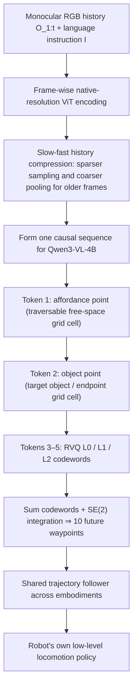
```mermaid
graph TD
    A["Monocular RGB history O_1:t + language instruction I"] --> B["Frame-wise native-resolution ViT encoding"]
    B --> C["Slow-fast history compression: sparser sampling and coarser pooling for older frames"]
    C --> D["Form one causal sequence for Qwen3-VL-4B"]
    D --> E["Token 1: affordance point (traversable free-space grid cell)"]
    E --> F["Token 2: object point (target object / endpoint grid cell)"]
    F --> G["Tokens 3–5: RVQ L0 / L1 / L2 codewords"]
    G --> H["Sum codewords + SE(2) integration ⇒ 10 future waypoints"]
    H --> I["Shared trajectory follower across embodiments"]
    I --> J["Robot's own low-level locomotion policy"]
```

#### ② Visual history compression of temporal sequence perception
{: id="-时序感知的视觉历史压缩"}

- **Input**: A first-person RGB stream of arbitrary length.
- **Processing**: Press "The longer the time passes, the fuzzy the memory will be" - the paper explains that this is designed according to the qualitative shape of the Ebbinghaus forgetting curve. For the historical frames collected at time $t_i$, define its "age" $\Delta T_i = t - t_i$. The sampling rate decays with the age index, and the spatial pooling step size increases with the age index:

$$f_s(i) = f_s^{\max}\exp\!\left(-\frac{\Delta T_i}{\tau_s}\right), \qquad s_i = \max\!\left(1,\ \exp\frac{\Delta T_i}{\tau_p}\right)$$

The selected frames each pass the native resolution ViT, and then perform grid pooling according to $s_i$; after pooling, the order is maintained by the timestamp token.
- **Output**: A set of visual tokens that are "thin near and thick far away". The total amount falls within the three-level configurable pixel budget of 256K / 576K / 1M, and is allocated in three layers: long-term / mid-term / short-term.
- **Design Motivation**: Navigation requires both the geometric details of the current frame (whether you can walk under your feet) and the long-term context (have I been here just now). Full native resolution encoding will cause the number of tokens to grow unbounded; in turn, it will collapse the entire history into a fixed-length representation and lose nearby details. Tiered allocation is a compromise between the two.

#### ③ Dual-channel pointing: write spatial reasoning as two grid tokens
{: id="-双通道-pointing把空间推理写成两个栅格-token"}

- **Input**: Current view + two target points projected by the automatically labeled pipeline.
- **Processing**: Cut the current view into a grid of $H_g$ rows and $W_g$ columns, and a normalization point $p=(u,v)\in[0,1]^2$ is flattened into an integer index:

$$r(p) = \min\{H_g - 1,\ \lfloor H_g v\rfloor\},\quad c(p) = \min\{W_g - 1,\ \lfloor W_g u\rfloor\},\quad i(p) = r(p)\,W_g + c(p)$$

The affordance point is encoded as `<apos_i>`, and the object point is encoded as `<opos_i>`. The two families of tokens share the same raster but have independent index spaces. The "no legal grid" situations such as turning in place, stopping, and the target being invisible are represented by the indexes reserved in the respective token families.
- **Output**: Exactly 2 tokens per step, connected before the action token.
- **Design motivation**: VLM originally spreads the visual evidence on a 2D token array, using **a** grid token to express a point, which just steps on the grounding capability of backbone pre-training; and this array is defined in the image plane rather than in the control space of a specific robot, so the same set of representations can be reused across tasks and ontologies. Causal attention allows this prefix to automatically become an explicit spatial trace generated by conditioned subsequent actions.

> **For example** (why "one token" instead of "two coordinate tokens"): Assume that the grid is 4 rows × 4 columns, and the model determines that the possible direction falls on the normalized coordinate $p = (u, v) = (0.6, 0.4)$.
> Column $c = \lfloor 4 \times 0.6 \rfloor = 2$, row $r = \lfloor 4 \times 0.4 \rfloor = 1$, flattened $i = 1 \times 4 + 2 = 6$ - the output is a single token `<apos_6>`.
> Changing to the writing method of "abscissa token + ordinate token", the same point will cost 2 tokens, and the model must learn that these two tokens are a bound pair. The raster index directly compiles this layer of coupling into the vocabulary: **The inference prefix of each step is constant 2 tokens (one affordance, one object), and does not change with the complexity of the scene**. This is where it saves compared with free text CoT - the decoding length of text CoT is uncontrollable.

<div align="center">
  
<figcaption>
Automatic labeling of dual-channel pointing: the affordance channel marks feasible footholds in free space through 3D-2D projection, and the object channel uses 3D bounding box projection to mark the pointed target object
</figcaption>
</div>

#### ④ RVQ action tokenizer: 3 tokens exchanged for 10 waypoints
{: id="-rvq-动作-tokenizer3-个-token-换-10-个航点"}

- **Input**: An action block, that is, the vector $z_t \in \mathbb R^{10\times 3}$ flattened by 10 future SE(2) waypoints.
- **Processing**: Three-level residual quantization, each level has a codebook of 256 entries $C^{(0)}, C^{(1)}, C^{(2)}$. The first level captures the rough trajectory, and the next two levels quantify the residuals left by the previous level:

$$k_\ell = \arg\min_k d_J\!\left(r^{(\ell)},\ e_k^{(\ell)}\right), \qquad r^{(\ell+1)} = r^{(\ell)} - e_{k_\ell}^{(\ell)},\qquad r^{(0)} = z_t$$

Among them, $d_J$ is the Jacobian weighted trajectory distance used when fitting the codebook, which is weighted in the integrated trajectory space so that the translation error and orientation error are dimensionally balanced. When assigning trajectories, use

$$d_{traj}(z, \hat z) = \mathrm{ADE}(z, \hat z) + \lambda\,\lvert \Delta\theta(z) - \Delta\theta(\hat z)\rvert, \qquad \lambda = 0.3$$

- **Output**: Three hierarchical action tokens `<act_L0_k>` `<act_L1_k>` `<act_L2_k>`. When decoding, sum any non-empty prefixes and then perform SE(2) integration:

$$\hat z_t^{(L)} = \sum_{\ell=0}^{L-1} e_{k_\ell}^{(\ell)}, \qquad L \in \{1, 2, 3\}$$

- **Design motivation**: The language model head directly spits out continuous control quantities, which will cause a fight between "token prediction" and "geometric accuracy". The clever thing about RVQ is that **any non-empty prefix can be decoded into an executable trajectory** rather than an incomplete action representation - so when computing power or latency is tight, only 1 or 2 tokens can be generated to execute a rough trajectory, and the third level is completed when the highest accuracy is required.

> **An example** (why residuals are more cost-effective than "disposable large codebooks"): Imagine you are dictating a trajectory to someone else.
> L0 is equivalent to saying "go roughly in this direction for a while" - 256 choose 1, the granularity is about **0.9 m**; L1 then add "a little further to the left than the one just now", and reduce the residual to about **7 cm**; L2 finally fine-tune it to about **4 cm**.
> Three sentences (3 tokens) combine to create ten thousand different trajectories of $256^3 \approx 1670$, and the final average displacement error is **0.72 cm**.
> The control group is the VADv2-style single-layer $K=4096$ planning vocabulary - the codebook is 16 times larger, and the residuals are not refined after one report, but the error is **2.48 cm** (about 3.4 times the difference). It saves tokens and has higher accuracy at the same time, relying on the "coarse-to-fine" structure.

<div align="center">
  
<figcaption>
Hierarchical residual vector quantization action tokenizer: The left side shows the 256 candidate trajectories and selected codewords of each of the three levels of L0/L1/L2 (the scale ranges from 1 m to 10 cm to 5 cm). The middle is the residual encoding process. The right side is the trajectory reconstructed by SE(2) integration after summing the codewords.
</figcaption>
</div>

#### ⑤ Unified autoregressive training objective
{: id="-统一的自回归训练目标"}

Navigation samples and auxiliary VQA samples use the same causal language model loss. $M$ is the set of supervised output positions:

$$\mathcal L_{CE} = -\sum_{j \in M} \log p_\theta\!\left(y_j \mid x,\ y_{<j}\right)$$

The supervision sequence of the navigation sample is 1 `<apos_i>` + 1 `<opos_i>` + 3 RVQ tokens; the pointing or spatial VQA samples are the corresponding index tokens or language answers. Because all tasks share the same token space and the same prediction head, there is no need to assign separate balancing weights to the navigation loss during training. All samples can be squeezed into the same packed autoregressive training cycle - the paper dynamically packs about 8.6 variable-length samples into each training sequence of 8,192 tokens.

#### ⑥ Three-stage training formula
{: id="-三阶段训练配方"}

**Stage I — Embodied Reasoning (ER) mid-term training.**  Don’t touch the movements first, and specifically use the backbone’s spatial ability. A mixed set of 13.0M samples was constructed from 36 data sources, and the sampling quality distribution was 35.14% for pointing, 25.05% for single-image VQA, 19.81% for video reasoning, and 20.00% for general visual and abstract reasoning. The generated checkpoint is called **LightNav-ER**, which is used to initialize subsequent navigation alignment. About 170 H100 GPU-hours.

**Stage II — Supervised Fine-Tuning (SFT).**  Align LightNav-ER to the unified navigation token space. In the optimized mix after task balancing, 77.6% of the samples have navigation action supervision, and 22.4% are perception/reasoning samples to review the ER stage abilities - the paper calls it a "specialize-then-retain" course to prevent specialization from squeezing out the general visual language ability inherited from the backbone. The mix contains samples collected by DAgger, allowing the strategy to see the state induced by its own actions. About 950 H100 GPU-hours.

**Stage III — Online post-RL training.**  Although DAgger supplements the strategy-induced state, its goal is still token-level imitation and does not directly optimize the closed-loop behavior that determines the success or failure of the task. So GRPO was used for online optimization. The same set of backbone, token interface and rollout mechanism support three types of tasks. **Only the reward function is different**:

$$A^{(g)} = \frac{R(\tau^{(g)}) - \mu_R}{\sigma_R + \epsilon_{num}}$$

Within-group normalization eliminates the bias of "scenario difficulty", and only the sorting between $G$ attempts in the same starting state produces a gradient. Each task is given only one final scalar and broadcast to each decision step of the trajectory ($r_t = R(\tau)$ to all $t$) - the reason for the paper is very practical: to do stepwise reward shaping, you have to manually design cubic potential functions on three mutually incompatible geometries. The super parameters are $G=8$, $B=32$ seeds per round (that is, 256 episodes updated each time), $\varepsilon=0.2$, $\beta=0.01$, and a single node of 8×H100.

<div align="center">
  
<figcaption>
Online multi-task reinforcement learning pipeline: large-scale sampling rollout starting from the SFT policy, tracking tasks are scored by visibility/position/persistence, instruction following is scored by alignment/arrival/termination, object search is scored by discovery/efficiency/progress, and GRPO is updated after normalization within the group
</figcaption>
</div>

The final rewards of the three missions are different. The following instruction writes path fidelity into the reward to prevent "taking a shortcut to the end but not following the instructions":

$$R_{VLN} = \left(1 + \mathrm{nDTW}\right)\mathbf 1[\text{success}] + \exp\!\left(-\frac{\max(d_T, d_{clip})^2}{\sigma_d^2}\right) - 0.25\cdot\mathbf 1[\text{timeout}]$$

Object navigation is replaced by path efficiency $PL = d_0 / \max(d_0, \tilde\ell)$ (i.e., the episode-by-episode version of SPL). Because it only gives categories but not routes, path fidelity is out of the question; the Gaussian neighbor term assumes the distinction of all failed samples - without it, all failures have the same reward value and make no contribution to the within-group variance. Visual tracking is the most special: the target is moving and there is no end point to "reach", so the reward is changed to "time average of step-by-step quality", and when it stops early (lost or collides), it is normalized according to the fixed time domain $T_0 = 300$ steps, and the number of unexecuted steps is recorded as zero quality - otherwise a follower who hits the wall early will take advantage because of the "high average value".

> **For example** (why the RL training set needs to be screened first): An episode seed needs to run $G=8$ rollouts.
>
> If all 8 are successful, the 8 rewards are almost the same, $\sigma_R \approx 0$, and all 8 advantages after standardization are 0 - these 8 simulations run in vain, and the gradient contribution is zero; the same applies if all fail.
>
> Only episodes riding on the decision boundary such as "3 out of 8 succeeded" have non-zero variance.
>
> Therefore, the paper first uses SFT checkpoint to run $K$ times on each candidate, and divides them into always-solved / mixed / never-solved, leaving only mixed. In the same way, the decision steps that are retained by sampling cannot be drawn evenly - the first and last decisions, as well as decisions with discrete events such as stop/stuck/collision/large-angle steering, and their neighbors must be retained, because the final rewards are earned precisely at these rare moments, and uniform sampling will throw them away according to rarity.

#### ⑦ Use a table to see clearly "what has been changed"
{: id="-一张表看清到底改了什么"}

| Dimensions | Mainstream Navigation VLA | LightNav-0 |
|---|---|---|
| Spatial intermediate representation | None, or free text CoT, or independent waypoint predictor | Dual-channel pointing, fixed-length 2 image raster tokens |
| Action output | Discrete atomic instructions, or plug-in diffusion / flow matching / regression action header | The native LM header directly outputs 3 RVQ tokens → 10 SE(2) waypoints |
| Task and ontology identification | task identifier token, embodiment expert | None, task semantics are fully specified by the instruction text and supervision format |
| Perceptual input | often panoramic / multi-camera / depth / odometry | monocular forward-looking RGB only |
| RL usability | The continuous action head must first rewrite the denoising into MDP before it can be used on policy gradient | The token logarithmic probability can be obtained accurately, and GRPO is applied as it is |

#### ⑧ Reasoning and deployment
{: id="-推理与部署"}

During inference, ViT and the language model run in the same process (to avoid cross-process transmission of visual features), and autoregressive decoding is undertaken by vLLM, which takes about 4 ms per token on an RTX 4090. Each decision step requires only 2 pointing tokens plus up to 3 RVQ tokens. On the real robot side, a shared Trajectory Follower is used to translate the trajectory into the odometry and speed instructions of each platform, and is handed over to the robot's own motion strategy - the high-level RGB-to-trajectory strategy itself does not move at all.

#### ⑨ Incidentally output: INSIGHT-Bench
{: id="-顺带产出insight-bench"}

The paper also builds a new benchmark that unifies gridded simulation scenes and 3D Gaussian splash scenes into the same trajectory format: 1,683 scenes/53,090 episodes in the training set, and 210 scenes/1,097 episodes in the evaluation set. It diagnoses along two orthogonal axes - the scene axis (Apartment/Residential/Commercial/Institutional/Outdoor) and the command axis (Base/Direction/Relation/Extremum/Ordinal), the latter corresponding to the spatial mechanism required to resolve the target. The annotation pipeline uses Molmo2 for open set pointing and relies on measuring depth to lift it to 3D. It requires an instance to be supported by two observations from at least two different viewpoints and the 3D positioning divergence is less than 0.6 m before it is retained.

---

### 3. Results and findings
{: id="3-核心结果发现-35"}

**Embodied Reasoning (LightNav-ER, 8 benchmarks).**  4B’s LightNav-ER achieved a complete set macro average of 67.4, ranking first in 4 items and second in 4 items. It is 4.3 points higher than its own initialization Qwen3-VL-4B (63.1) and 4.6 points higher than 8B Molmo2-ER (62.8) with only half the parameters. The two biggest gains are the capabilities that are most relevant to navigation - Where2Place +12.6 and RefSpatial +11.9, which respectively correspond to free space grounding and multi-step spatial reference.

**Instruction following (VLN-CE val-unseen).**  The four indicators of monocular on R2R are the best across the board: SR 66.9 → 68.5, SPL 62.3 → 62.8, NE 4.05 → 3.91 m, OS 73.7. NE / SR / SPL on RxR are both the best for monocular (NE 4.09 → 3.66 m, a decrease of 10.5%; SR 73.6; SPL 64.5). **But nDTW is only 67.4, which is lower than DualVLN’s 70.0** - The paper points out that higher success rate and end point accuracy are not evenly converted into trajectory fidelity.

**Object target navigation.**  Without using depth or odometry, the three closed set settings of monocular SR and SPL are all optimal: MP3D SR 46.6 → 53.3, SPL 17.5 → 21.2; HM3D v1 SR 74.5 / SPL 43.9; HM3D v2 SR 77.2 / SPL 41.5. This pure RGB strategy even surpasses the listed multi-viewing systems - HM3D v1 is 16.4 SR and 12.7 SPL higher than WMNav with depth and odometry, which is equivalent to ruling out the explanation of "a wider field of view or more privileged geometric information". The pattern on HM3D-OVON of the open-vocabulary is consistent, and the more skewed the distribution, the greater the gain: seen +0.3 SR, synonyms +9.6, unseen +6.2; SPL +7.6 / +7.8 / +4.4 respectively (the above are arXiv v2 numbers).

**Embodied Visual Tracking (EVT-Bench).**  SR 91.7 / TR 87.7 / CR 1.87 on STT, SR 82.6 / TR 80.1 / CR 4.62 on DT, leading in all aspects under monocular setting, DT is 9.3 SR higher than the sub-optimal ReferTrack.

**INSIGHT-Bench.**  Under the unified deployment protocol (same 1,097 episodes, 120° forward-looking 480×270 RGB, 300-step budget), SR 27.4 → 43.7, SPL 24.0 → 41.5, NE 4.25 → 3.88 m, all aggregation indicators are optimal.

The maximum gain on the command axis occurs in Direction (29.7 → 57.7), and this is the only type of command in which LightNav-0 exceeds its own Base score (45.1). The scores of the six open source baselines are all lower than their respective Bases after adding first-person orientation words - this directly corresponds to its route conditional supervision (the first-person orientation is explicitly written in the template and retained in the rewrite).

The most difficult one is still Extremum (37.2), because to select "leftmost/second" you must first check out multiple candidates and then compare the positions.

On the scene axis, the apartment is the strongest (61.1), the outdoor relative gain is the largest (16.7 → 34.2, doubled), and the institutional category is the weakest (29.2).

**ablation.**  Both components are required to be verified, and  **the contribution of dual-channel pointing is much greater than that of ER initialization** : ER initialization raised the average SR of the 8 settings from 60.8 to 63.1, and the average SPL from 39.0 to 40.0; while after removing pointing supervision, the average SR dropped from 63.1 to 54.7, and the average SPL dropped from 40.0 to 40.0 34.3 (about 3.7 times the effect of ER initialization). The improvement of SR by ER initialization is consistent across 8 settings, but the improvement on SPL is small and uneven, indicating that it mainly improves semantic and spatial decision-making, and path efficiency relies more on downstream navigation alignment.

<div align="center">
  
<figcaption>
Three-axis scaling of model, data, and environment on continuous VLN: backbone has improved significantly from 2B to 4B, and mixed or even declined to 8B; data volume increases monotonically but returns diminish when approaching full volume; environment coverage is the most stable of the three axes
</figcaption>
</div>

**Scaling’s three axes give different conclusions.**  Model axis: 2B → 4B increased by 6.6–9.6 points in R2R/RxR, but 4B → 8B is no longer consistently beneficial (R2R SR/SPL decreased by 1.6/0.5, RxR SR decreased by 0.5, and only RxR SPL increased by 2.0) - 4B is the most cost-effective among this batch of checkpoints. Data axis: 1/16 → full volume increased by 15.0–17.4 points, but 1/2 → full volume only increased by 0.4–1.4 points, with obviously diminishing returns. Environment axis: 1/8 → Full volume increased by 16.7/16.2 in R2R and 21.1/19.1 in RxR, and each mid-range improved all four indicators; on the aligned 1/8-to-full range, the gain of environment expansion exceeded data expansion. **The conclusion is that expanding environmental diversity is the most reliable.**

**Zero sample migration.**  The same checkpoint is moved to the four game domains of Counter-Strike 1.6, VizDoom, Minecraft, and Trigger Rally without any adaptation, and is used for instruction following, target tracking, and checkpoint driving respectively - indicating that the learned pointing-trajectory interface is not tied to the appearance statistics or kinematics of the training simulator.

<div align="center">
  
<figcaption>
Zero-sample generalization across game domains: the same checkpoint follows language instructions in CS 1.6 and VizDoom, tracks moving targets in Minecraft, and does checkpoint driving in Trigger Rally; cyan and magenta marks are predicted affordance points and object points respectively
</figcaption>
</div>

The real robot also has zero-shot across four bodies (humanoid LightBot-0, quadruped Unitree Go2, self-developed quadcopter, and wheeled LIMX TRON 1). One of the most stringent tests is tracking: **The tracking targets in the training data are only people**, but the model can directly follow dynamic target categories that have never been seen before - humanoid robots, wheeled robots, trolleys - maintaining the target identity under changes in viewing angles, background clutter, and lighting.

<div align="center">
  
<figcaption>
real robot zero-shot generalization: from top to bottom are generalized tracking (including unseen robots and trolley targets), indoor instruction following, outdoor instruction following and object search; each group also provides first-person observations of the robot's external perspective and actual use of strategies
</figcaption>
</div>

---

### 4. Limitations
{: id="4-局限性-35"}

The author makes two points. First, the model only has a single decision-making path and does not separate high-frequency local control and slow semantic thinking - the ideal form should be a lightweight reactive strategy responsible for obstacle avoidance and frequent trajectory correction, coupled with a slow VLM planner responsible for long-term reasoning. Second, pre-training is still limited to selected embodied datasets. If stronger pre-training can be done on Internet-scale videos, it is expected to cover more common scenes, interactions and movement patterns.

From the experiment itself, we can also read two weaknesses that are not listed as limitations by the author: nDTW (67.4) on RxR is lower than DualVLN, indicating that the improvement in success rate is not simultaneously converted into trajectory fidelity; the absolute success rate of INSIGHT-Bench is only 43.7%, and Extremum-type instructions (37.2) and institutional scenarios (29.2) are still far from usable.

---

## 46. Uncertainty-Aware Gaussian Map for VLN (2026)
{: id="uncertainty-aware-gaussian-map"}
——Three types of perceived uncertainty × Semantic Gaussian Map, giving VLN agents reliable decision-making capabilities

📄 **Paper**: [arXiv:2607.13500](https://arxiv.org/abs/2607.13500) · 🏛️ **ICLR 2026** · [Code (to be released)](https://github.com/Gaozzzz/Uncertainty-Aware-VLN)

---

### Key takeaways
{: id="精华-38"}

- Unifying environmental representation (3D Gaussian Map) and perceptual uncertainty (geometry/semantics/appearance) into the same space is a more robust design paradigm than pure map-based methods.
- Geometric uncertainty uses variational inference to model position/scale perturbations, semantic uncertainty uses semantic attribute perturbations to reveal ambiguous interpretations, and appearance uncertainty uses Fisher Information to measure rendering sensitivity—the three paths complement each other in an orthogonal manner and are transferable to other 3DGS scene representation tasks.
- Encoding uncertainty from feature dimensions into navigable affordances/constraints with "3D Value Maps" is an elegant project to transform perceptual confidence into action priors.
- During training, the rendering loss and navigation loss of SGM are jointly optimized to synergistically improve scene representation and decision-making strategies, avoiding the representation gap of two-stage separation design.
- The marginal gain of REVERIE RGS improvement of 2.94% and R2R SR improvement of 2% shows that the current VLN bottleneck has shifted from "language understanding" to "perceived reliability", and uncertainty modeling is the next direction worth exploring.

---

### 1. Background and problem
{: id="1-研究背景问题-37"}

VLN requires an agent to navigate in a 3D environment based on natural language instructions. Existing agents generally ignore perceptual uncertainties (such as visual ambiguity of similar door openings and uncertain path accessibility caused by occlusion) when reasoning. The training goal forces the model to output a definite action for each step, and cannot express "uncertainty". This can easily cause false stops or path deviations in scenes with many occlusions and repetitive structures.

<div align="center">
  
<figcaption>
Figure 1: Motive representation. Left: Visually similar structures (multiple doors) cause the agent to park at the wrong location due to insufficient evidence; Right: Occlusion makes the path passability ambiguous, and the agent chooses a suboptimal path. The agent in this paper avoids the above mistakes by explicitly modeling uncertainty (bright color = high uncertainty).
</figcaption>
</div>

---

### 2. Method and innovations
{: id="2-主要方法创新点-35"}

**Overall Framework**: SGM construction → Uncertainty estimation → 3D Value Map → Multi-layer Transformer predicts actions.

<div align="center">
  
<figcaption>
Figure 2: Overall Pipeline. In each step, SGM is constructed from panoramic RGB-D observations, three types of uncertainties are estimated and embedded to form a 3D Value Map, and then spliced ​​with language instructions to input MLT to predict actions.
</figcaption>
</div>

**3.1 Semantic Gaussian Map (SGM)**

At each waypoint, the multi-view RGB-D observation is back-projected into a sparse pseudo-laser point cloud. Each point is initialized as a differentiable 3D Gaussian primitive $$g_i$$, including: mean $$\boldsymbol{\mu}_i \in \mathbb{R}^3$$ (position), covariance $$\boldsymbol{\Sigma}_i$$ (shape/scale), opacity $$\alpha_i$$, color spherical harmonic coefficient $$c_i$$, and the semantic attribute $$s_i$$ (attached from the SAM2 segmentation region + CLIP feature). Differentiable rendering optimization makes the SGM consistent with current observations and clips redundant Gaussians at low scale ($$\lVert e_i \rVert_2 < \tau_e$$) and low opacity ($$\alpha_i < \tau_\alpha$$).

**3.2 Uncertainty estimation (three categories)**

| Type | Modeling | Meaning |
|---|---|---|
| Geometric uncertainty $$U^g$$ | Apply variational perturbation to position/scale, minimize ELBO, and extract variational distribution standard deviation | Structural reliability: whether Gaussian remains stable under multiple geometric assumptions |
| Semantic uncertainty $$U^s$$ | Apply learnable offsets to semantic attributes, same as ELBO optimization | Degree of semantic ambiguity: how unstable is the semantic interpretation of the same region |
| Appearance uncertainty $$U^a$$ | Approximating Hessian with Fisher Information (log-determinant of rendering Jacobian) | Appearance sensitivity: whether texture complexity/occlusion/illumination changes cause drastic changes in rendering |

$$U_i^g = \lVert \mathcal{F}^{\text{std}}(q_{\phi^\mu}(\chi_i^\mu)) \rVert_2 + \lVert \mathcal{F}^{\text{std}}(q_{\phi^e}(\chi_i^e)) \rVert_2$$

$$U_i^a = \log \lvert \nabla_{\mathcal{G}} \hat{\mathcal{I}} \nabla_{\mathcal{G}} \hat{\mathcal{I}}^\top \rvert$$

**3.3 3D Value Map and Action Prediction**

Append $$(U^g, U^s, U^a)$$ to each Gaussian's attribute vector, expanding to $$g_i \in \mathbb{R}^{20}$$. Then, each Gaussian feature $$F^{g_i} \in \mathbb{R}^{768}$$ is obtained through nonlinear projection, and after aggregation, it is spliced ​​with the language embedding $$X$$, and the multi-layer Transformer $$\mathcal{F}^{\text{MLT}}$$ is input to predict the navigation probability of the candidate waypoint.

<div align="center">
  
<figcaption>
Figure 5: Visualization of three types of uncertainties. Geometric uncertainty highlights structural boundaries/irregular surfaces, semantic uncertainty reveals areas of object-level ambiguity, and appearance uncertainty marks texture-complex/occlusion/illumination-sensitive areas. Bright colors = high uncertainty.
</figcaption>
</div>

---

### 3. Results and findings
{: id="3-核心结果发现-36"}

<div align="center">
  
<figcaption>
Figure 3: Qualitative comparison of R2R. Left: Facing multiple similar windows, VER made a misjudgment and stopped early, and this method arrived correctly; right: VER was blocked by a table and stopped, and this method successfully completed the command by detour.
</figcaption>
</div>

- **R2R val unseen**：SR 78%（vs VER 76%，+2%），SPL 66%（vs 65%，+1%）
- **RxR val unseen**：SR 65.2%（vs BEVBert 64.1%，+1.1%），nDTW 65.6%（vs 63.9%，+1.7%）
- **REVERIE val unseen**: RGS 37.65% (vs BEVBert 34.71%, +2.94%), RGSPL 27.01% (vs 24.44%, +2.57%) - long-range target positioning capabilities are significantly improved
- ablation: SGM alone brings structural understanding gain (REVERIE RGS 32.15% → 35.48%), uncertainty alone increases R2R SR from 72.22% to 74.20%, and the superposition of the two reaches the optimal 78.32%
- All three types of uncertainty make independent contributions, and are optimal when all are used. The improvement of geometry + semantics is greater than that of appearance.

---

### 4. Limitations
{: id="4-局限性-36"}

The inference overhead of SGM construction (especially SAM2 semantic extraction and uncertainty estimation) is relatively large, and the training phase is alleviated by offline precomputation, but real-time deployment still requires lightweight replacement (the paper recommends replacing it with a lightweight SAM2 variant); in addition, the framework was verified in Matterport3D indoor scenes, and its generalization to outdoor or dynamic environments is unknown.

---


## 47. HarnessVLN (2026)
{: id="harnessvln"}
——A set of Agent Harness, which compresses the two types of navigation "instruction following" and "finding objects" into the same tool calling protocol

📄 **Paper**: [arXiv:2609.15195](https://arxiv.org/abs/2609.15195) · [Project Page](https://agibot-harnessvln.netlify.app/)

---

### Key takeaways
{: id="精华-39"}

The real bottleneck of training-independent navigation is not whether the planner is smart enough, but the lack of an arbitration layer between "semantically reasonable proposals" and "whether they can be physically executed" - HarnessVLN explicitly implements this arbitration layer.

The approach is to downgrade MLLM from the decision-maker to the proposer: every tool call it outputs must first pass the three verifications of evidence freshness, geometric reachability, and sub-goal consistency before it is allowed to be dispatched. Even Stop is only an "application" and not a "command".

The memory is split into two complementary sets - event memory (task center, which stores complete failure trajectories) and spatio-temporal graph ST Graph (environment center, which stores reusable spatial evidence plus lightweight failure annotations and references back to events), which not only maintains traceability, but also prevents things entering the MLLM context from expanding linearly with the length of the trajectory.

The protocol remains unchanged and the actuators are replaceable, so the same set of Harness consumes the four benchmarks of VLN-CE R2R/RxR and HM3D-v2/OVON at the same time, and is directly migrated to the humanoid robot.

The core idea of ​​migration is: **Add a layer of "pre-dispatch verification + structured feedback infusion" runtime to the agent, which can better connect semantic reasoning back to physical execution** than continuing to adjust the prompt.

---

### 1. Background and problem
{: id="1-研究背景问题-38"}

Both instruction following and target object navigation tasks require the agent to connect language to part of the observable environment, accumulate spatial knowledge while walking, and judge whether its actions really advance the task. The training method is effective on the target task, but if the task form or environment is changed, the data must be collected again; the MLLM-driven training-independent method bypasses training, but generally treats the model as a planner in the task-specific pipeline - how to retain evidence, how to verify proposals, and how failure affects subsequent decisions are still determined by the peripheral pipeline. So the old problem remains: recognizing the target does not mean reaching it, and taking action does not mean completing the sub-goal; old observations, unreachable goals, and execution failures will make subsequent planning more and more deviated from the actual task status, manifested in repeated attempts or error termination.

---

### 2. Method and innovations
{: id="2-主要方法创新点-36"}

**Overall Framework**: HarnessVLN consists of four components - **MLLM Planner** is only responsible for proposing semantic operations, **Agent Harness** is responsible for assembling context, verifying proposals, dispatching tools and feedback, **Hierarchical Event Memory** is responsible for recording task progress and execution events, **Persistence ST Graph** is responsible for precipitating reusable spatial evidence. The four close the loop through a set of **unified tool interface**: context assembly → proposal verification → tool distribution → feedback integration → reassembly.

<div align="center">
  
<figcaption>
HarnessVLN Overall architecture: MLLM Planner only mentions "operation proposals", Agent Harness completes evidence/geometry/task consistency verification before dispatch, and the structured feedback returned by the tool then updates the event memory and ST Graph
</figcaption>
</div>

#### Stuck point 1: After talking for a long time, what is the difference between Harness and the ordinary "MLLM as planner" assembly line?
{: id="卡点一说了半天harness-和普通的mllm-当-planner流水线到底差在哪"}

The only difference is one sentence: **What MLLM says no longer directly counts**. In traditional pipelines, whatever the model outputs is executed, Harness inserts a gate between the model and the environment.

| Dimensions | Traditional MLLM-as-planner pipeline | Agent Harness by HarnessVLN |
|---|---|---|
| The role of MLLM | Decision-maker: The output action is directly issued for execution | Proposer: The output is an "operation proposal", pending review |
| Suggest how to grounding | The downstream module tries its best to execute, whether it succeeds or not depends on luck | Check three things before dispatching: evidence source and freshness, target geometric reachability, and whether it is consistent with the current sub-goal |
| How to use failure | It only reflects "this step failed", and the same one will be raised in the next round | Write to reflection memory, and hang lightweight annotation at the corresponding location of ST Graph to lower the next round of retrieval score |
| Stop and stop | Stop when the model says stop | The model can only "apply", and it can only be issued after the triple gate control of semantics ∧ geometry ∧ progress |

Drawing a runtime loop is the picture below. Pay attention to the return edge that fails the verification - it is the difference between the entire framework and the pipeline: the rejected proposal will not disappear, but will become a piece of negative evidence in the next round of context.

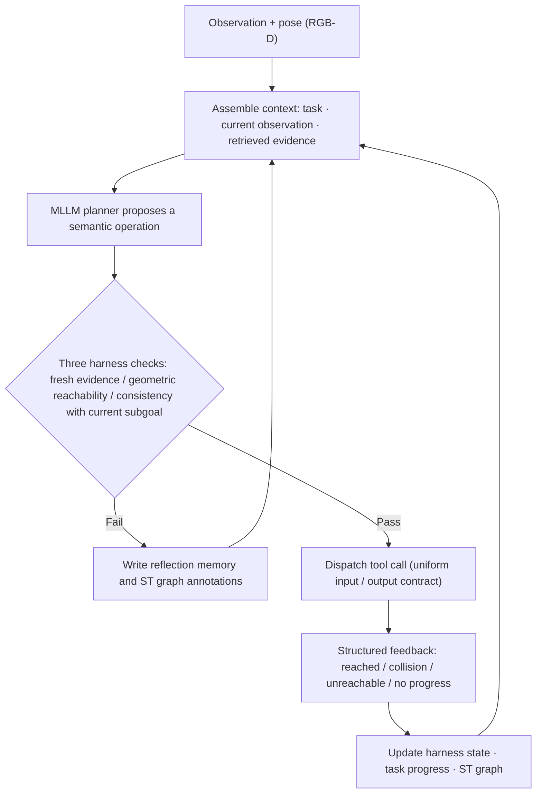
```mermaid
graph TD
    A["Observation + pose (RGB-D)"] --> B["Assemble context: task · current observation · retrieved evidence"]
    B --> C["MLLM planner proposes a semantic operation"]
    C --> D{"Three harness checks: fresh evidence / geometric reachability / consistency with current subgoal"}
    D -- "Fail" --> E["Write reflection memory and ST graph annotations"]
    E --> B
    D -- "Pass" --> F["Dispatch tool call (uniform input / output contract)"]
    F --> G["Structured feedback: reached / collision / unreachable / no progress"]
    G --> H["Update harness state · task progress · ST graph"]
    H --> B
```

#### 2.1 Harness’ status and decision-making cycle
{: id="21-harness-的状态与决策循环"}

At decision step $t$, Harness maintains the status

$$
S_t = \langle x,\ \omega_t,\ p_t,\ z_t,\ M_t,\ G_t \rangle
$$

Among them, $x$ is the task specification (a route instruction, or a target object category), $\omega_t$ is the pose-aligned RGB-D observation and local geometric map, $p_t$ is the agent pose, $z_t$ is the task progress, and $M_t$ is hierarchical event memory, and $G_t$ is persistent ST Graph.

**Both types of tasks share the same state definition, and the difference only lies in $z_t$**: When the instruction is following, $z_t$ records the current route segment, satisfied motion constraints, and observed landmarks; when ObjectNav is used, $z_t$ records the explored area, candidate target hypothesis, and its verification status. The tasks have changed, the progress representation and completion criteria have changed, but the Harness protocol itself has not changed a word - this is the fundamental reason why it can cover both types of tasks at the same time.

Single-step loop (paper Algorithm 1): If the observation is inconsistent with the pose, re-`Observe` → Record the event → Merge the graph → Get the current active sub-goal → Retrieve experience by sub-goal → Assemble the context → MLLM makes a proposal → **Validate** → Dispatch the tool → Update the status with feedback.

#### 2.2 Unified tool interface
{: id="22-统一工具接口"}

All heterogeneous capabilities are wrapped into a shared input and output contract, so replacing any individual tool does not require changing the MLLM Planner or Harness protocol:

| Tools | Roles | Features |
|---|---|---|
| `observe` | Perception | Capture the current RGB-D observation and agent pose |
| `observe_panorama` | Perception | Grab panoramic observations in the preset orientation |
| `retrieve_memory` | Retrieval | Get task-related evidence from event memory and ST Graph |
| `ground_target` | Grounding | Drop the sub-target into the image area of a candidate perspective |
| `query_depth` | Perception | Estimating the depth of the grounded area and its uncertainty |
| `navigate_to` | Navigation | Call Navigation Executor on the target that has passed the verification |
| `backtrack` | Restore | Return to a previously visited location and confirm arrival |
| `request_stop` | Termination | Verify whether the task is actually completed before terminating execution |

#### 2.3 Hierarchical event memory $M_t$ (task center)
{: id="23-分层事件记忆-m_t任务中心"}

- **Working memory**: Current observations, bounded panoramic history, active target hypotheses, recent tool feedback. **Leaves only the short-term context needed for one-step decision-making, so it does not grow infinitely with the trajectory length**.
- **Progress memory**: task decomposition and completion status. Each sub-goal has a unique id and one of four states - pending / active / completed / blocked; **At most one active at the same time**, and the mark completed must be supported by posture-aligned observations or successful tool results, blocking the planner's way of advancing the task just by saying it is completed.
- **Reflection memory**: Completely records sub-goal level execution events - unreachable target, inconsistent grounding, collision, no progress, backtracking failure, rejected stop request. Each entry contains event id, task context, location, timestamp, tool feedback and supporting observations.

#### 2.4 Space-time diagram hosted by Harness $G_t$ (Environmental Center)
{: id="24-harness-托管的时空图-g_t环境中心"}

$$
G_t = \left( V_t^P \cup V_t^E,\ E_t,\ T_t \right)
$$

$V_t^P$ is a place node, $V_t^E$ is an entity node, $E_t$ is a typed spatial relationship, and $T_t$ stores timestamps and lightweight event annotations.

- **Place node** summarizes visited locations, supporting observations and accessible waypoints; spatially compatible observations are merged into existing places, otherwise new nodes are created; adjacent places are connected by bidirectional `NavigableTo` edges to form a persistent topology that can be reused for forward and backtracking.
- **Entity node** represents the ObjectNav target and the landmark mentioned in the instruction, with semantic aliases, spatial assumptions, confidence and supporting perspective; `ObservedFrom` retains the traceability information of "when and from which perspective it was seen", and `Contains` encodes coarse-grained place-entity attribution. **It is precisely because of the traceability that Harness can retrieve both the "target hypothesis" and the "evidence required to verify this hypothesis"**.
- **Task condition retrieval**: Before each MLLM decision, score the place node according to the current active sub-goal $g_t$

$$
s(v_i \mid g_t) = R(v_i, g_t) + \lambda_{rec} C(v_i) + \lambda_{sal} A(v_i) - \lambda_{fail} P(v_i, g_t)
$$

where $R$ is semantic relatedness (implemented with local IDF weighted cosine similarity), $C$ is freshness, $A$ is spatial saliency, and $P$ is the historical failure to which the penalty applies.

#### Stuck point 2: Both event memory and ST Graph seem to store history, why are they divided into two sets?
{: id="卡点二事件记忆和-st-graph-看起来都在存历史为什么要分两套"}

Because they answer two different questions: event memory answers "**What did I do on this mission**", and ST Graph answers "**What does this house look like**". The former is rolling and bounded as the task progresses; the latter is accumulated continuously across sub-goals.

| Dimensions | Event Memory (event memory) | ST Graph (space-time graph) |
|---|---|---|
| Perspective and lifespan | Task center, rolling with sub-goals, working part bounded | Environment center, persistent across sub-goals, accumulated throughout the episode |
| What to store | Three layers: working (current observation and recent feedback) / progress (sub-goal state machine) / reflection (complete failure event) | place node, entity node, typed space relationship, timestamp |
| Failure record | Authoritative full quantity: event id, task context, location, timestamp, tool feedback, support observation | Only attach the light annotation "Failed here under this sub-goal", plus a reference pointing back to the original event |
| Read by whom | Assemble the current decision context | Score according to $s(v_i \mid g_t)$ to select the top-K locations and feed it to MLLM |

The key design is in the last two lines: **Only one copy of the complete trajectory of failure is stored (in reflection memory), and only "pointer weighting" is placed in the picture**. This enables failure-aware retrieval and recovery without copying the execution history in the graph. The relevance of the annotation will also be dynamically adjusted - if the sub-goal changes or new evidence overturns it, the weight will decrease; if similar failures occur repeatedly, the weight will increase; at the same time, the punishment has an upper limit to avoid a branch being permanently blacklisted just because it failed once.

> **For example (how to calculate the search score)**: Suppose there are only 3 place nodes in the graph, and the current sub-goal is "Go to the kitchen to find the dishwasher". According to the weight given by the appendix of the paper (freshness 0.3, significance 0.3, 0.5 deduction for each failed application, maximum deduction limit 1.0):
>
> - Node A (kitchen, just viewed 3 steps ago): $0.9 + 0.3 \times 1.0 + 0.3 \times 0.8 = 1.44$
> - Node B (on the other side of the kitchen, seen 60 steps ago, and failed to navigate into the wall from here last time): $0.85 + 0.3 \times 0.2 + 0.3 \times 0.7 - 0.5 = 0.62$
> - Node C (bedroom): $0.1 + 0.3 \times 0.5 + 0.3 \times 0.3 = 0.34$
>
> Take the three with the highest scores as seeds, expand each one by one jump, and return up to 5 places - **It is always these 5 places and their entities that enter the MLLM context, but the graph can continue to grow with the trajectory**. This is the specific meaning of "the graph grows but the context does not grow".

#### 2.5 Grounded enforcement and evidence-based termination
{: id="25-接地执行与基于证据的终止"}

MLLM proposes semantic commands, and physical execution requires grounded targets and executable control quantities, so Navigation Executor is made into a **replaceable Harness hosting tool**: Harness is responsible for grounding and verification, and Executor is only responsible for path planning and local control. Commands are only dispatched when "supported by evidence + geometrically reachable + consistent with active sub-goals and applicable failure history"; the Executor returns structured feedback such as arrival/collision/unreachable/no progress for updating status, event memory and graph. **Forward and backtracking follow the same "verification-execution-update" loop**.

Termination is also arbitrated by Harness - MLLM can propose a stop, but cannot directly issue an environment-level Stop action. The request is accepted if and only if

$$
F_{stop} = F_{semantic} \wedge F_{geometric} \wedge F_{progress}
$$

Three items respectively verify the target identity, geometric validity and task completion. ObjectNav requires that the target is visually supported and falls within the stopping radius; instruction following requires that the current evidence supports the last route segment, the referenced landmark, and the grounded end point. **Rejected requests will be written to the event memory and trigger further observation, target refinement, continued approach or backtracking**.

> **For example (how to save a failure by stopping gating)**: Paper Figure 8, HM3D-OVON Episode 1297, the target category is picture.
>
> In step 216, the agent thinks it has arrived: according to the projected navigation target point, the distance is only **0.40 m**, which is lower than the projection target threshold of 1.0 m. It "looks" like it is time to stop.
>
> But Harness doesn't believe this number - it prioritizes grabbing a frame of **fresh depth**: taking the median of the 5×5 neighborhood on the detection frame anchor point (requiring the patch standard deviation not to exceed 0.5 m), it reads **4.65 m**, far exceeding the depth threshold of 2.5 m, so $F_{geometric}$ is not established, the stop application is rejected, and the event is stored in the database.
>
> The agent continues to approach, and the new depth reads **1.53 m** at step 429, and the door passes; it actually stops at step 430, and the end distance of the benchmark evaluation is **0.13 m**, which is successful.
>
> In a word: **The projected target point can only show "I went to where I thought I was", and fresh depth can show "I am really next to that object"**. The value of Harness is to choose to trust the sensor rather than the plan when the two conflict.

<div align="center">
  
<figcaption>
The actual effect of stop gating: the stop application in step 216 was rejected due to the fresh depth of 4.65 m, the agent continued to approach, and the stop application was successfully terminated at 0.13 m in step 430
</figcaption>
</div>

The runtime panel below grounds all the previous abstract states at once - pay attention to the STOP GATE count (requested / gate pass / gate fail / rejected) in panel ⑤, the node edge count of ST Graph, and the `evidence` id hanging behind each TODO in panel ⑦: **The two words "complete" are always tied to a backtracking observation in the system**.

<div align="center">
  
<figcaption>
Runtime panel: ① Running status ② RGB observation with ground frame ③ Navigation map ④ Legend ⑤ Harness status (decision, stop gate, ST Graph count, executor count) ⑥ Task and current action ⑦ TODO memory with evidence id
</figcaption>
</div>

**Implementation configuration**: 640×480 synchronized RGB-D, 79° horizontal field of view; GroundingDINO plus SAM to provide open-vocabulary target areas and segmentation masks; Navigation Executor uses FMM planner for planar motion, and calls NavDP when going up and down stairs. In the main simulation experiment, the instruction following uses GPT-5.5, and the ObjectNav uses GPT-5.6-luna - **All reasoning functions (task decomposition, navigation planning, target grounding, stop verification, recovery) in the same episode share a model, and only the prompt** is changed.

---

### 3. Results and findings
{: id="3-核心结果发现-37"}

**instruction following (VLN-CE val-unseen)**: Among the training-independent methods, both R2R and RxR have the highest SR. Compared with AgenticNav, which also uses GPT-5.5, R2R's SR is 5.8 points higher and OSR is 7.7 points higher. Compared with HSGM, RxR's SR is 12.1 points higher, SPL is 12.9 points higher, and nDTW is equivalent.

| Method | R2R NE↓ | R2R OSR↑ | R2R SR↑ | R2R SPL↑ | RxR SR↑ | RxR SPL↑ | RxR nDTW↑ |
|---|---|---|---|---|---|---|---|
| *NavFoM (ICLR26, supervised)* | *3.78* | *70.8* | *61.7* | *55.3* | *64.4* | *56.2* | *–* |
| *ABot-N0 (CVPR26, supervised)* | *3.78* | *70.8* | *66.4* | *63.9* | *69.3* | *60.0* | *–* |
| GC-VLN [CoRL25] | 7.30 | 41.8 | 33.6 | 16.3 | 33.8 | 13.8 | – |
| HSGM [CVPR26] | 5.42 | 58.7 | 47.9 | 32.8 | 41.8 | 25.1 | 54.9 |
| AgenticNav-GPT-5.5 | 5.19 | 65.0 | 55.0 | **48.4** | – | – | – |
| **HarnessVLN-GPT-5.5** | **4.01** | **72.7** | **60.8** | 43.5 | **53.9** | **38.0** | 54.8 |

**Target object navigation**: HM3D-v2 got the highest SR (76.0%) among training-independent methods; HM3D-OVON achieved SR 59.3% and SPL 36.6%, **the highest among all listed methods (including supervised methods)**, 9.1 points and 4.0 points higher than DRIVE-Nav.

| Method | Training required | HM3D-v2 SR↑ | HM3D-v2 SPL↑ | OVON SR↑ | OVON SPL↑ |
|---|---|---|---|---|---|
| FiLM-Nav [arXiv25] | ✓ | 77.0 | **41.3** | 40.8 | 24.4 |
| ABot-N0 [CVPR26] | ✓ | – | – | 54.0 | 30.5 |
| DRIVE-Nav [arXiv26] | ✗ | 72.4 | **41.3** | 50.2 | 32.6 |
| MSGNav [CVPR26] | ✗ | 74.4 | 33.4 | 48.3 | 27.0 |
| **HarnessVLN** | ✗ | **76.0** | 37.9 | **59.3** | **36.6** |

**ablation (100 fixed subsets each, accumulation is on)**: Event memory is the largest single gain, ST Graph is the second, and SPL is improved at the same time, stop verification and then make another stab. Compared with the basic agent, the SR of R2R and OVON in complete Harness increased by 18.0 and 10.0 points respectively, and the OSR–SR gap narrowed in both tasks.

| Mem. | Graph | Stop | R2R SR↑ | R2R SPL↑ | R2R Gap↓ | OVON SR↑ | OVON SPL↑ | OVON Gap↓ |
|---|---|---|---|---|---|---|---|---|
| ✗ | ✗ | ✗ | 46.0 | 23.7 | 26.0 | 45.0 | 32.0 | 27.0 |
| ✓ | ✗ | ✗ | 54.0 | 33.0 | 19.0 | 52.0 | 32.4 | 20.0 |
| ✓ | ✓ | ✗ | 60.0 | 35.4 | 15.0 | 53.0 | 34.2 | 18.0 |
| ✓ | ✓ | ✓ | **64.0** | **35.8** | **13.0** | **55.0** | 33.0 | 19.0 |

**An honest counterexample**: Stopping verification raised SR from 53.0 to 55.0 on OVON, but caused SPL to drop from 34.2 to 33.0, and the OSR-SR gap increased from 18.0 to 19.0 - **Stronger verification leads to a higher completion rate at the expense of detours and more cautious termination**, which are not in the same direction.

**Model sensitivity (fixed 100 sets of OVON subsets)**: The protocol and tools remain unchanged and only the base is changed, the SR swings between 51.0 (Qwen3.8-flash) to 63.0 (GPT-6-astra); while under the same base GPT-5.6-luna, HarnessVLN’s 55.0 versus MSGNav’s 37.0, indicating that the  **gain mainly comes from Harness rather than the model itself**.

| Methods | Base Model | SR↑ | SPL↑ | OSR↑ | Gap↓ |
|---|---|---|---|---|---|
| MSGNav | GPT-5.6-luna | 37.0 | 18.9 | 46.0 | **9.0** |
| HarnessVLN | GPT-5.6-luna | 55.0 | 33.0 | 74.0 | 19.0 |
| HarnessVLN | GPT-6-astra | **63.0** | **39.4** | **76.0** | 13.0 |
| HarnessVLN | Qwen3.8-flash | 51.0 | 32.8 | 75.0 | 24.0 |

**real robot deployment**: AgiBot A3U full-size humanoid robot (1.74 m, 3D LiDAR plus multi-channel RGB-D and fisheye cameras, NVIDIA Thor onboard computing power), head stereo camera as the main visual sensor, Fast FoundationStereo to produce dense volume depth, **planning model replaced with local Qwen-3.8-27B**. Three scenarios: continuous instruction following (walk to the intersection in front of Room 806, turn left and stop at the trash can next to the water dispenser, and then go to the refrigerator), open word list object search, and the combined task of "first stop at the sign at the door and then look for the vending machine." ST Graph preserves landmark and target evidence between route following and object search, supporting continuity between stages.

<div align="center">
  
<figcaption>
Three examples of real robot navigation: continuous instruction following, open-vocabulary object search, and a combined task of route following and object search; on the right is the synchronously constructed ST Graph
</figcaption>
</div>

<div align="center">
  
<figcaption>
is a Harness set that covers four benchmarks and two types of tasks, and can be migrated to the humanoid robot
</figcaption>
</div>

---

### 4. Limitations
{: id="4-局限性-37"}

Paper description: The current orchestration and verification rules of Harness are preset and lack a self-evolution mechanism in open environment interaction. There are two points worth noting from the data - **Tougher verification is not free**, HarnessVLN’s R2R SPL (43.5) is lower than AgenticNav (48.4), which also uses GPT-5.5, HM3D-v2 SPL (37.9) is also lower than FiLM-Nav and DRIVE-Nav’s 41.3, stopping verification on OVON even lowers SPL and increases OSR–SR at the same time gap; **still quite sensitive to the base model**, after switching to Qwen3.8-flash, OVON's SR dropped by 4 points, and the OSR-SR gap expanded from 19 to 24, indicating that "seeing it but not being able to walk through the door" is still the main failure mode.

---

## 48. GroundingVLN (2026)
{: id="groundingvln"}
——Make visual grounding a shared interface between "thinking" and "walking"

📄 **Paper**: [arXiv:2609.18581](https://arxiv.org/abs/2609.18581)

---

### Key takeaways
{: id="精华-40"}

There has always been a lack of a verifiable and trainable interface between the semantic reasoning of VLM and the spatial execution of robots in VLN: the text CoT says "I see the water tank" but cannot tell where the water tank is on the screen, and the discrete action output does not have any explicit target. GroundingVLN's approach is to let grounding take on two things at the same time - binding each visual assertion to pixel coordinates (`<obj>label|[x,y]</obj>`) during reasoning, outputting a pixel target aligned with the current subtask progress during decision-making, and handing it to the geometric planner to back-project into a 3D path.

The two key supporting designs are: the data engine uses 3D world markers and SAM 3 tracking to solve the problem of "the same object changing its name and surname across perspectives"; GEAR back-projects the pixel target and scores it based on "where it can really go" instead of scoring based on 2D pixel distance.

The result is that only 188K samples (0.9% of the strongest baseline) were used to obtain R2R-CE 69.9% SR and RxR-CE 75.1% SR, and only using R2R training to migrate to RxR still had 59.9% SR, which was 20.1 points higher than the strongest baseline.

The inspiration for the methodology is: **When the interface between the high-level model and the low-level actuator itself has a measurable geometric quantity, the reward design can be upgraded from "right/wrong" to "how many meters wrong", and the sample efficiency changes from quantity to quality**.

---

### 1. Background and problem
{: id="1-研究背景问题-39"}

Continuous environment VLN requires the agent to implement natural language instructions into first-person observations, and continue to track progress and plan the next step. There are three types of gaps in the existing routes: the direct output of discrete actions (NaVid, StreamVLN) lacks explicit spatial targets, and requires massive trajectory data to relearn the "visual to motor" mapping; the intermediate conclusions of the text CoT method (NavCoT, AwareVLN) cannot correspond to the image area, and what they say cannot be verified; the action space of the waypoint method (ETPNav, SmartWay) is stuck by the candidate quality of the external waypoint predictor. In the final analysis, there are two coupling gaps: **There is no spatial anchor point in the reasoning process, and there is no geometrically accurate execution interface for high-level decision-making**.

<div align="center">
  
<figcaption>
Human navigation first anchors the landmark and then looks to the next foothold. Cognition and motor control are separated. Comparison of three types of VLN paradigms: action type has no explicit target, plain text CoT's sink direction is unknown, GroundingVLN ties evidence to pixels and predicts pixel targets
</figcaption>
</div>

The evidence from cognitive science is that people will selectively encode navigation-related landmarks at decision-making points, and actively direct their eyes to the next foothold before taking a step. This directly inspired the design of this article - treating VLM as a "high-level cognitive system", only responsible for grounding reasoning and spatial goals, and leaving motion execution to the low-level planner.

---

### 2. Method and innovations
{: id="2-主要方法创新点-37"}

**Overview of the overall framework.**  GroundingVLN is a decoupled closed-loop system, consisting of three parts: **High-level VLM** is responsible for structured grounded reasoning and outputs (current subtask, high-level action, pixel target) triplet; **Low-level execution module** back-projects the pixel target into 3D points, uses A\* to plan the path and converts it into the original action; **GEAR post-training** uses execution-aware reward maps to align the first two. The instruction is split into ordered subtasks at one time during initialization, and each decision step is then advanced on the semantic scale of "current subtask".

<div align="center">
  
<figcaption>
GroundingVLN Overview. (A) The high-level VLM performs grounded reasoning and predicts subtasks, actions and pixel targets, and the low-level modules are converted into original actions; (B) GroundingCOTVLN-188K provides supervision through subtask and target alignment, as well as grounding timing alignment; (C) GEAR uses execution-aware reward maps with multi-level rewards for GRPO optimization
</figcaption>
</div>

#### 2.1 Structured reasoning with grounding
{: id="21-带-grounding-的结构化推理"}

**Input**: command, historical interaction $H_t$, current spliced left-front-right RGB observation.

**Processing**: VLM follows a fixed four-stage reasoning - ① History Recall (reviewing the distance traveled, orientation changes, and landmarks seen) → ② Current Perception (describing the current scene and orientation, identifying instruction-related evidence) → ③ Progress Estimation (which conditions have been met, whether the current subtask has been completed) → ④ Future Planning (selecting the next local target based on the earliest unfinished instruction conditions).

**Output**: A piece of CoT text with each visual assertion wrapped in a tag.

The binding rules are simple: the newly confirmed entity is written as `<obj>label|[x,y]</obj>`, the entity that has been grounded before and reappears in this frame is written as `<prev_obj>label|[x,y]</prev_obj>`, and the coordinates are the normalized integers under the current view $(x,y) \in [0,1000]^2$.

**Design motivation**: This rule makes the sentence "I saw a sink" **verifiable** - both the annotation and RL stages can use coordinates to check whether that location is a sink; at the same time, it allows historical evidence to be explicitly reused into the progress estimate instead of being drowned in free text.

#### 2.2 Progress-aligned pixel target decision-making
{: id="22-进度对齐的像素目标决策"}

After the inference is completed, VLM outputs the high-level action $a^h_t \in \{ \text{MOVE}, \text{TURN}, \text{STOP} \}$. MOVE must bring a pixel target $g_t = (c_t, l_t, p_t)$ - the current subtask $c_t$, target semantic label $l_t$, pixel position $p_t$, marked with `<target>label|[x,y]</target>` in the CoT (distinguish `<obj>` as **evidence** from `<target>` as a **traversable goal point**). TURN only performs an in-situ 90° or 180° rotation, with pixel targets attached only if the turned destination is visible in the current field of view. STOP is issued only when all instruction conditions are met.

The key difference is how the pixel target is chosen. DualVLN supervises the "farthest trajectory point in the field of view", while this article constrains the candidate points to the trajectory segment corresponding to the current subtask:

$$q_t^* = \arg\max_{q} \ \mathrm{Prog}(q), \quad q \in T_{t:t+1} \cap S_{k_t}$$

Among them, $S_{k_t}$ is the path segment aligned with the current subtask, and $T_{t:t+1}$ is the **actually executed** trajectory between the two anchor points. The constraint is that the point is continuously visible in $o_t$ (with depth occlusion verification) and passable. Finally, $p_t = \Pi_t(q_t^*)$ is obtained using camera projection.

| Dimensions | DualVLN-style "farthest visible point" | GroundingVLN's progress-aligned pixel target |
|---|---|---|
| Candidate range | The farthest point in the field of view on the entire reference trajectory | Current subtask segment ∩ Actual execution trajectory |
| Termination boundary | Vision boundary | Next decision boundary for this subtask |
| Relationship with semantics | None, pure geometry is the farthest | Bind to the predicted current subtask and output together |
| Actuator input | Diffusion executor eating **Latent features** of VLM | Explicit pixel coordinates → Backprojection → A\* planning |

> **Example**: The command "Go into the kitchen, past the sink and oven → Go straight into the hallway → Turn left into the bedroom" is split into 3 subtasks. Assume that the robot is in the living room at the moment, and subtask 1 has not been completed yet. The farthest accessible point in the field of view on the reference trajectory is the corridor entrance 12 meters away - the "farthest visible point" strategy will directly set it as the target, spanning the entire subtask 1 in one step, and the sink and oven will not pass at all. GroundingVLN limits the candidates to the segment of subtask 1. The end of the segment is the kitchen entrance 3 m away, so the pixel target falls on the floor of the kitchen entrance [493, 409]. After getting there, subtask 1 is judged to be completed, and then the next section is planned. **One sentence: The pixel goal is not "how far you can see and walk", but "where you should go in this section of the task."**

#### 2.3 Low-level planning and execution
{: id="23-低层规划与执行"}

**Input**: High-level actions plus pixel targets.

**Processing**: TURN triggers fixed in-situ rotation, STOP ends navigation, only MOVE will follow the complete geometric link - RTAB-Map estimates the camera pose online from the RGB-D stream, accumulates point clouds to build a map containing ground supports, obstacles and elevation changes (including stairs); converts the normalized pixel target into local pixel coordinates, takes the corresponding depth, and estimates the pose within the camera to recover the 3D world position; A\* Searching for collision-free paths on the map, the path follower translates the paths into original forward and turn directions.

**Output**: A sequence of low-level actions.

**end-to-end data flow** (the complete path of a decision step):

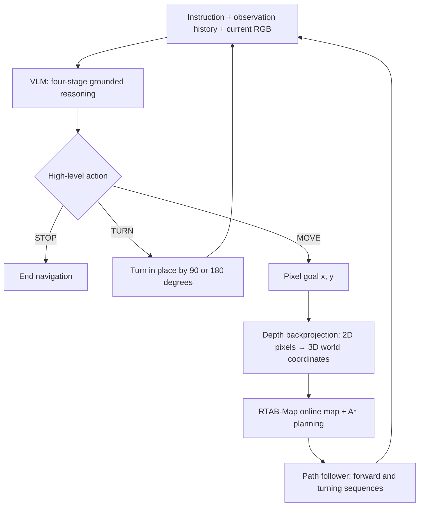
```mermaid
graph TD
    A["Instruction + observation history + current RGB"] --> B["VLM: four-stage grounded reasoning"]
    B --> C{"High-level action"}
    C -- "STOP" --> D["End navigation"]
    C -- "TURN" --> E["Turn in place by 90 or 180 degrees"]
    C -- "MOVE" --> F["Pixel goal x, y"]
    F --> G["Depth backprojection: 2D pixels → 3D world coordinates"]
    G --> H["RTAB-Map online map + A* planning"]
    H --> I["Path follower: forward and turning sequences"]
    I --> A
    E --> A
```

There is an easily overlooked efficiency gain here: VLM is called only 9.26 times per episode on average, accounting for about 33.25% of the navigation steps. The remaining steps are all taken over by the low-level planner - there is no need to run a large model on every original action.

#### 2.4 GroundingCOTVLN-188K: Timing-aligned grounding
{: id="24-groundingcotvln-188k时序对齐的-grounding"}

The dataset contains 188K grounded images and CoT samples from 21K R2R/RxR trajectories. There are three steps to build:

**① Trajectory playback and anchor point sampling**: Play back the reference path in Habitat, and adopt three types of decision-making anchor points - arrival anchor point (at the reference point), turning anchor point (near a large rotation in place), and mid-distance anchor point (after walking a sufficient distance); supplementary sampling at large intervals, and elimination of near-stationary or redundant samples. Each anchor point stores the spliced ​​left-front-right RGB-D, camera pose, reference point index, and actual execution position.

**② Alignment of subtasks and goals**: Teacher VLM (Qwen3.5-397B-A17B) splits the instructions into ordered subtasks $\{u_k\}$ and extracts landmarks and turns. Each $u_k$ is aligned to a continuous path $S_k$, so each anchor point can get the "current progress segment" and "completed subtask set", and then use The formula in 2.2 selects the pixel target.

**③ Timing alignment of grounding** - This is the most essential difference from static image grounding. The same object will move to another pixel position in the next frame, or even be blocked, bringing two risks: **grounding drifting to another similar instance** (there are two sinks in the picture, which one refers to?), and **being temporarily invisible and forgotten**. The solution is to assign each grounding a unique 3D world tag:

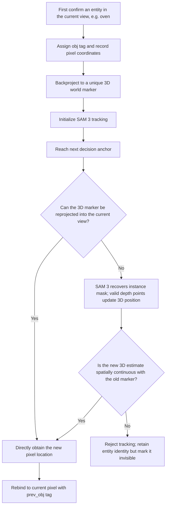
```mermaid
graph TD
    A["First confirm an entity in the current view, e.g. oven"] --> B["Assign obj tag and record pixel coordinates"]
    B --> C["Backproject to a unique 3D world marker"]
    C --> D["Initialize SAM 3 tracking"]
    D --> E["Reach next decision anchor"]
    E --> F{"Can the 3D marker be reprojected into the current view?"}
    F -- "Yes" --> G["Directly obtain the new pixel location"]
    F -- "No" --> H["SAM 3 recovers instance mask; valid depth points update 3D position"]
    H --> I{"Is the new 3D estimate spatially continuous with the old marker?"}
    I -- "Yes" --> G
    I -- "No" --> J["Reject tracking; retain entity identity but mark it invisible"]
    G --> K["Rebind to current pixel with prev_obj tag"]
```

Finally, the facts of "executed movement/current observation/progress status/action/pixel target" are assembled by the deterministic program, and the teacher VLM is only responsible for colloquializing them into a structured CoT-such that the facts in the CoT come from geometry rather than model illusion. Samples must pass five checks before being retained: coordinate visibility, depth occlusion, consistency of action and reasoning, format integrity, and annotation leakage check.

The weight of this item in ablation is not small: turning off timing alignment, re-labeling and re-training, SR dropped from 69.9% to 62.2%, which is more than removing the `<obj>` / `<prev_obj>` label itself (66.1%) - **Inconsistent cross-view evidence is more harmful than no evidence**.

#### 2.5 GEAR: Execution-aware reinforcement learning
{: id="25-gear执行感知的强化学习"}

The geometry of the pixel target is **continuously measurable**, which allows the post-training signal to be much finer than "action right/wrong". GEAR constructs a reward map $M_t$ covering the entire image domain for each anchor point: candidate pixel $p$ is first back-projected to obtain the execution endpoint $P_t(p)$. Those falling on inaccessible surfaces such as walls and furniture are directly eliminated using the local accessible map; valid candidates are scored as follows:

$$Q_t(p) = \lambda_r \exp\left(-\frac{d_\perp(p)^2}{2\sigma_r^2}\right) + \lambda_p \exp\left(-\frac{(s(p)-s_t^*)^2}{2\sigma_p^2}\right) + \lambda_e \exp\left(-\frac{d_e(p)^2}{2\sigma_e^2}\right)$$

The three items are responsible for three things respectively: $d_\perp(p)$ is the **lateral deviation** to the reference route (pipeline route consistency); $s(p)-s_t^{\ast}$ is the **route progress difference** from the reference target (controls semantic progress, points will be deducted for walking too little or rushing too far); $d_e(p) = \lVert P_t(p) - P_t^{\ast} \rVert_2$ is **execution endpoint error** (controlling physical executability). Invalid pixels directly get the lowest score in the entire image.

> **Example**: The marked reference target is on the floor by the kitchen door. The model gives two candidate pixels - A on the floor of the doorway, 40 px from the reference point; B on the wall next to the door frame, also 40 px from the reference point. By 2D pixel distance, both score exactly the same. But after back-projecting to 3D: A falls on the walkable ground, about 0.3 m away from the reference endpoint, and all three Gaussians give high scores; B falls on the wall, and is directly judged invalid by the trafficability mask and gets the lowest score. **The reward picture does not ask "whether your click is close to the mark", but "follow your click, where can the robot really go, and how far is it from the goal?"**

In addition to the reward map, there are also multiple levels of rewards:

$$R_y = \alpha_a R_{act} + \alpha_t R_{task} + \alpha_g R_{goal} + \lambda_g R_{grd} - P$$

Among them, $R_{goal}(p) = \phi(Q_t(p))$ comes from the reward map above; $R_{act}$ is a deterministic action reward matrix (+1 is given if the action is completely correct, −0.5 is given if the TURN direction is wrong, −0.75 is given if the TURN predicts MOVE, but the target falls in the outer quarter of the screen consistent with the turn, −0.9 is given if MOVE and TURN are exchanged, and −0.9 is given if MOVE and TURN are exchanged in advance, or STOP is done in advance or the STOP is done differently. −1); $R_{task}$ is an exact match after normalization of the subtask text (True +1 False −1); $R_{grd}$ evaluates the semantic and spatial correctness of grounding; $P$ penalizes the inconsistency between reasoning and decision-making.

The format is illegal (the number of `<think>` blocks is incorrect, the JSON schema does not match, the coordinates are out of bounds, the `<target>` label does not match the decision, etc.) Give it directly to $R = -1$.

Finally, each anchor point takes G outputs, and uses the normalized reward within the group to perform GRPO clipping target optimization.

**Training configuration**: Initialize from Qwen3.5-4B, first do 1 epoch SFT on 188K samples (about 8 hours for 8 H200), then use GEAR to run 2000 steps on 16K samples, with a learning rate of 1e-6 (about 20 hours for the same hardware).

---

### 3. Results and findings
{: id="3-核心结果发现-38"}

**VLN-CE main list is comprehensive SOTA.**  R2R-CE val_unseen: NE 3.66/OS 74.8/SR 69.9/SPL 64.1; RxR-CE val_unseen: NE 3.54/SR 75.1/SPL 62.0/nDTW 75.3. Compared with ABot-N0, the absolute SR improvement is 3.5% (R2R) and 5.8% (RxR), and exceeds DualVLN(S2)+SPF - that variant uses Habitat's shortest path follower to ideally execute its predicted pixel target, indicating that the advantage of GroundingVLN does not come from the executor, but from the more correctly selected target itself.

<div align="center">
  
<figcaption>
Training data efficiency on R2R-CE val_unseen. The horizontal axis is the number of training samples self-reported by each method (logarithmic scale). GroundingVLN achieved the highest SR with 188K samples, which is approximately 0.9% of the total ABot-N0
</figcaption>
</div>

**Sample efficiency is the most eye-catching item.**  188K samples compared to ABot-N0’s 21.9M (16.9M expert trajectories plus 5.0M inference samples), using only 0.9%. A more rigorous comparison is in Appendix A.2: When only using R2R and RxR data (no additional navigation corpus), the SR of StreamVLN is 45.6%, JanusVLN Base is 52.8%, and GroundingVLN is 69.9%; even against their versions using the full corpus (26.3M / 10.69M), GroundingVLN Still 13.0% and 9.4% higher respectively.

**The improvement in generalization across datasets is even greater.**  Trained with R2R only, zero RxR-CE data directly transferred to RxR-CE val_unseen: SR 59.9% / SPL 48.2%, 20.1 and 12.2 absolute points higher than the strongest baseline AwareVLN (39.8% / 36.0%). The author's explanation is that explicit subtask progress, grounding evidence, and pixel target interfaces together constitute a **transferable navigation representation**, rather than remembering R2R's instruction style.

**ablation: GEAR is the first contributor.**  Remove GEAR and drop 12.7 points (69.9 → 57.2); replace the execution-aware reward map with a naive 2D pixel distance and drop to 66.2; remove timing alignment and drop to 62.2; remove `<obj>` / `<prev_obj>` and drop 3.8 points to 66.1; remove subtask decomposition to 68.1 (SPL dropped even more significantly, to 62.2).

<div align="center">
  
<figcaption>
grounding quality and pixel target accuracy analysis. (a) GEAR increased grounding recall from 64.9% to 89.6%, and F1 from 70.9% to 83.1%; (b) The grounding quality of successful episodes was significantly higher than that of failed episodes; (c) When grounding was correct, the action accuracy was 96.4%, and when it was wrong, it was only 48.1%; (d) The proportion of targets with a normalized L2 error of no more than 10% increased from 82.1% rose to 92.9%; (e) the average positioning error dropped from 7.4% to 4.6%, and P90 dropped from 13.8% to 8.0%
</figcaption>
</div>

The most convincing one is (c): **When grounding the correct decision step, the action accuracy is almost twice that when grounding is wrong** (96.4% vs. 48.1%) - This provides step-level evidence for "the quality of grounding directly determines the quality of navigation", not just the correlation on the end-to-end indicator.

**No catastrophic forgetting.**  After navigation fine-tuning, it is 57.20 on MMStar and 45.55 on MVBench, which is only 6.47 and 5.38 points lower than the original Qwen3.5-4B (63.67 / 50.93); while AwareVLN and DualVLN System 2 are almost zero under the same test - the former continues to spit out the navigation protocol, and the latter only returns directional actions or STOP. Interestingly, navigation data also brings gains: Object Shuffle +27.5%, Scene Transition +5.0%, Egocentric Navigation +3.0%, focusing on spatial change tracking and egocentric motion reasoning.

**real robot deployment.**  AgileX TRACER 2.0 wheeled chassis with Insta360 X5 and RealSense D435 (1.2 m off the ground, 30° tilt), single RTX 4090 inference. Each difficulty has 10 episodes: Easy 100%, Medium 90%, Hard 60%, Overall 83.3%, and the three baselines lag behind (DualVLN 40%, AwareVLN 50%, StreamVLN 33.3%), with the largest gap between Medium and Hard.

<div align="center">
  
<figcaption>
real robot experiment. (a) The success rate of 10 episodes in each of the three difficulties, 83.3% overall, is ahead of all baselines; (b) A real navigation example, the model sequentially anchors pixel targets to the corridor floor outside the door, the floor near the kitchen, and the floor near the microwave oven
</figcaption>
</div>

**Efficiency and Robustness.**  The average inference time per episode is 37.41 s, which is comparable to the fastest Progress-Think (36.60 s) and 34.2% / 35.5% / 65.0% faster than NaVILA / Aux-Think / ActiveVLN respectively. In terms of depth noise, after modeling the parallax domain noise according to the stereo baseline (B = 0.05 m) and sub-pixel error (0.08 px) of D435, the SR dropped from 69.9% to 65.5%, and the SPL dropped from 64.1% to 59.7%, a decrease of about 4.4 points. The first-order depth uncertainty increases with the square of the distance, and is approximately 1 / 3 / 5 m respectively. 0.58/5.20/14.43 cm.

---

### 4. Limitations
{: id="4-局限性-38"}

The high-level VLM only eats RGB, but the low-level execution module relies on the measurement depth provided by the sensor to back-project the pixel target into a reliable 3D point, and supports the pose and map estimation of RGB-D SLAM. This limits deployment on platforms without reliable depth sensing, and the authors list "a pure RGB low-level planner that does not rely on metric depth and maintains geometric accuracy" as follow-up work.

---

## 49. GPT-6-Astra (2026)
{: id="gpt-6-astra"}
———The general foundation model only relies on monocular RGB and primitive movements, and can run through the continuous environment vision-language navigation with zero-shot.

📄 **Paper**: [arXiv:2609.29861v2](https://arxiv.org/abs/2609.29861v2) · [Project Page](https://daiguangzhao.github.io/gpt-6-astra-for-vln/)

> This section is organized based on v2 (2026-09-25). v2 is only one day away from v1 (2026-09-24), but the single run of each level of inference intensity is changed to the average of three runs, and cross-run consistency analysis is supplemented; 79.0% / 76.0% of v1 is a single result, which has been replaced by 81.3% / 75.7%.

---

### Key takeaways
{: id="精华-41"}

- "Look" is also made into a tool that the model can decide when to call - `observe()` does not consume steps, and `step()` does not return images after execution - the interface only has two verbs: "look" and "move". What is measured is the navigation ability of the foundation model itself, not the ability of peripheral modules.
- After removing the "scaffolding" of waypoint predictor, panoramic, depth, and prebuilt maps, and adding a primitive motion of 0.25 m / 15° to monocular RGB, the average of three runs on R2R-CE-100 still reached SR 81.3±2.5%, SPL 71.5±1.7% (ultra), and SR is higher than Table 1 Reported values for all zero-shot and training-based methods in (the evaluation subsets are different and should be treated with caution). This is only the result under the same interface and fixed task set. The paper proposes "how to combine general capabilities and navigation-specific capabilities" based on this, and does not prove that scaffolding is redundant.
- Only looking at SR will miss three types of problems: the difference between OSR and SR (there are 1–3 episodes in each run where the target circle is entered but parked at the wrong location), low nDTW success (EP42 took about 2.4 times the distance to arrive; about 9% of the successful trajectories of three runs have nDTW lower than 50%), and "empty walking" with unchanged pixels (EP176 walked 8 times in a row) The step screen has not changed), corresponding to stop judgment, route following and execution confirmation respectively.
- Multiple runs separate the "difficulty of the task itself" from the "jitter between runs": medium and ultra were run three times each, and out of 100 tasks, 62 were successful six times, 8 were failed six times, and 30 were good and bad. The average SR value of ultra is 5.7 points higher than that of medium, but only 6 of the 14 tasks that were completely failed by medium were successful at least once under ultra, and another 3 tasks that were completely successful by medium failed once by ultra. If you think about it for a while, what changes is the outcome of individual tasks, and there is no systematic repair of execution and endpoint verification.
- Inspiration for VLN research: The paper (v2) advocates studying which general models of navigation capabilities can be directly provided and which areas need to be supplemented by navigation-specific learning. It proposes three directions: spatial representation, navigation experience, and acquired control skills, but it is clearly stated that these directions are only motivations and have not been evaluated. The author's inference: The value of navigation-specific components should be measured by "what kind of measurable remaining failures have been repaired in the foundation model" (route deviation, invalid action, error stop).

---

### 1. Background and problem
{: id="1-研究背景问题-40"}

VLN-CE (continuous environment vision-language navigation) requires the agent to turn and advance step by step according to natural language instructions in a continuous 3D space, and stop at the correct position, testing the long-range cooperation of perception, reasoning, memory and action. After GPT-4, Gemini-2.5-Pro, and Qwen2.5-VL, the mainstream approach to zero-shot VLN is to put a navigation-specific "scaffolding" on a general model - a trained waypoint predictor, panoramic RGB-D, a manually designed planning and memory module, and even pre-exploration mapping - so the score reflects the entire system rather than the model itself. This report from Singapore Management University and the Australian Machine Learning Institute does not propose new methods, but follows the minimalist interface setting of Embodied Agents Take Control (arXiv:2607.26148) to ask: Take away all the scaffolding, how far can OpenAI's general model GPT-6-Astra navigate by itself, and where will it fail?

---

### 2. Method and innovations
{: id="2-主要方法创新点-38"}

This is an evaluation report. The "method" refers to three things: a minimalist navigation interface, an evaluation protocol aligned with existing zero-shot work, and a behavioral analysis framework based on interaction logs. The report did not disclose the structure, training data or scale of GPT-6-Astra. It only stated that it is a closed-source general model of OpenAI that provides two levels of inference intensity, medium (default) and ultra, in Codex.

**Overall Framework**

<div align="center">
  
<figcaption>
Navigation interface: GPT-6-Astra In the Codex harness session, call observe() via MCP to obtain monocular RGB, call step() to perform primitive actions; the top view and reference path on the right are only for illustration, and
</figcaption>
</div>

The system consists of three parts: **Codex harness** is only responsible for maintaining a continuous session and does not participate in any navigation decisions; **MCP (Model Context Protocol, a standard protocol for model calling external tools) tool layer** only exposes two tools `observe()` and `step(actions)`; **VLN-CE simulator** executes actions and determines success or failure. Understanding commands, when to look, how to move, and when to stop are all determined by GPT-6-Astra within a session.

Compared with a typical zero-shot VLN-CE system, this interface is "minimalist" in the following ways:

| Dimensions | Typical zero-shot VLN-CE method | Interface to this report |
|---|---|---|
| Observation | 360° panoramic, most with depth; some methods pre-explore the scene and reconstruct it (such as SpatialAnt) | 512×512 monocular RGB, adjust `observe()` if you want; no depth, no map, no pose |
| Action space | The trained waypoint predictor gives candidate points, and the model selects one from them | Primitive action sequence: forward 0.25 m, turn left/right 15°, camera pitch 30°, STOP |
| Process | Manually designed planning, memory, and action selection modules | No navigation-specific modules, harness only maintains sessions |
| Navigation training | Some methods are fine-tuned on navigation data | No navigation fine-tuning is performed |

**Module 1: Observation Tool `observe()`**

- **Input**: no parameters
- **Processing**: Read the current camera perspective, do not advance the simulator, and do not consume the action budget
- **Output**: A 512×512 monocular RGB. Scene map, reference trajectory, target coordinates, global pose and depth are not provided.
- **Design motivation**: Turn "looking" into an action actively selected by the model - how many times and when to look are determined by the model, thereby testing its active perception ability, rather than feeding a panoramic sheet at each step by an external process

**Module 2: Action Tool `step(actions)`**

- **Input**: An ordered sequence of primitive actions, multiple primitives can be packaged in one call
- **Processing**: The simulator executes in sequence
- **Output**: Execution count, remaining budget, whether to terminate - **No image returned**, you must adjust it again if you want to see the image after execution `observe()`
- **Design motivation**: The action granularity is kept to a minimum and does not rely on any trained waypoint predictor; "no picture is given after the action" also means that the model has to judge whether the action is really effective, which is the foreshadowing of the execution failure analysis later.

> **For example**: The instruction "turn right into the corridor" is approximately 6 right turns (6 × 15° = 90°). A call "L × 6, F × 4" of EP42 in Figure 3 means turning left 90° and then moving forward 1 m (4 × 0.25 m) in one `step()`. Packing multiple primitives only saves the number of calls, and each primitive is still included in the 500 action budget - which is only enough to walk straight for about 125 meters.

**Module 3: Codex harness and task prompt**

The task prompt describes the tool usage, budget and stopping conditions; the harness maintains the session, allowing the model to continuously accumulate the pictures it has seen and the actions it has performed in the same context. GPT-6-Astra runs the entire episode in two levels of inference intensity: medium and ultra. The two levels share the same prompt and tools.

**end-to-end data flow (redrawn in reader version)**

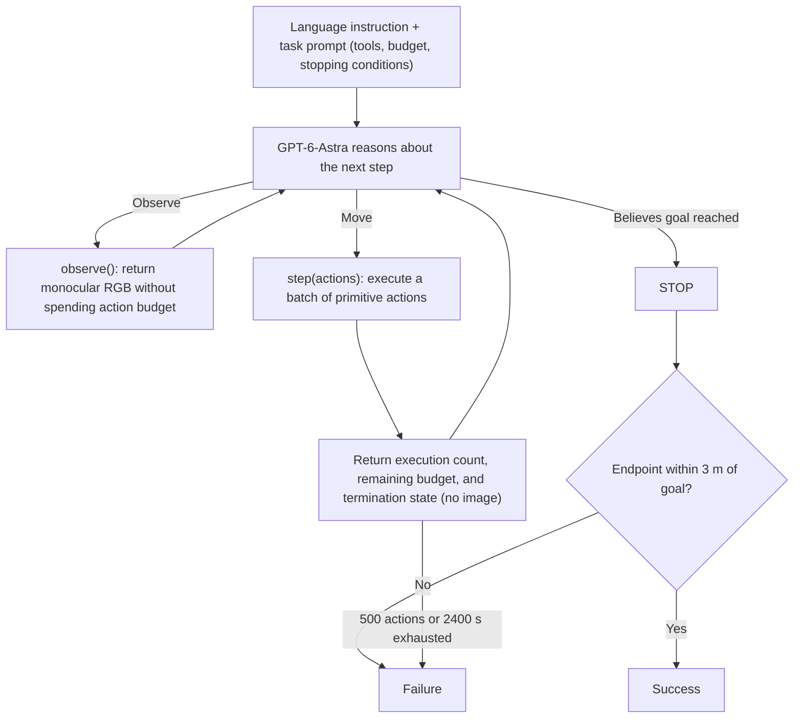
```mermaid
graph TD
    A["Language instruction + task prompt (tools, budget, stopping conditions)"] --> B["GPT-6-Astra reasons about the next step"]
    B -- "Observe" --> C["observe(): return monocular RGB without spending action budget"]
    C --> B
    B -- "Move" --> D["step(actions): execute a batch of primitive actions"]
    D --> E["Return execution count, remaining budget, and termination state (no image)"]
    E --> B
    B -- "Believes goal reached" --> F["STOP"]
    F --> G{"Endpoint within 3 m of goal?"}
    G -- "Yes" --> H["Success"]
    G -- "No" --> I["Failure"]
    E -- "500 actions or 2400 s exhausted" --> I
```

**Evaluation Agreement**

- **Data**: R2R-CE-100, that is, 100 val-unseen episodes introduced by Open-Nav, covering 10 scenes, using the same protocol as EvoNav, Open-Nav, SmartWay and other zero-shot work; the numbers of the training method in Table 1 come from the full amount of val-unseen
- **Budget**: Each episode has a maximum of 500 primitive actions and 2,400 s. It ends when STOP is called or any budget is exhausted.
- **Number of runs**: Each level of inference intensity was run three times. Table 1 and Table 2 report the mean ± sample standard deviation; three runs are regarded as repeated observations of the same batch of tasks (v1 is a single run)
- **Successful Determination**: Explicitly call STOP, and the geodesic distance from the end point to the target is less than 3 m

**Evaluation Indicators**

The report uses five indicators together because they answer different questions:

- **SR** (success rate): The proportion of distance less than 3 m from the target during STOP - "Arrival or not"
- **NE** (navigation error): geodesic distance from the end point to the target, in meters - "how far"
- **OSR** (oracle success rate): Any point on the trajectory that has entered the 3 m circle is counted as "passing by"
- **SPL**: Success rate weighted by path length - "Is the result efficient?"

$$\text{SPL} = \frac{1}{N}\sum_{i=1}^{N} S_i \cdot \frac{\ell_i}{\max(p_i, \ell_i)}$$

Among them, $S_i$ is whether the $i$ episode is successful, $\ell_i$ is the shortest path length, and $p_i$ is the actual walking length.

- **nDTW** (Normalized Dynamic Time Warping): Press the cumulative distance after point-by-point alignment between the actual trajectory $Q$ and the reference path $R$ to 0–1 - "Is it following the route described by the instruction?"

$$\text{nDTW}(R, Q) = \exp\left(-\frac{\mathrm{DTW}(R, Q)}{\lvert R \rvert \cdot d_{th}}\right)$$

Among them, $d_{th}$ takes a success radius of 3 m.

> **For example**: Among the 100 episodes of the first run of ultra, 79 were successful, 3 trajectories entered the 3m target circle but eventually stopped outside the circle, and 18 never entered the target circle. So SR = 79%, OSR = (79 + 3) / 100 = 82% - these three points between OSR and SR are "passing by but not stopping". The three runs were 79 / 81 / 84 successes and 3 / 3 / 1 lap failures, respectively. The mean values ​​are therefore SR 81.3 and OSR 83.7, corresponding to Table 1. Let’s look at the successful EP42 (the first run): the end point error is only 0.7 m, and it is still recorded as a success; but SPL 41.2% means that the actual distance is about 1 / 0.412 ≈ 2.4 times of the shortest path, and nDTW 27.5% shows that the trajectory and the reference route hardly fit - it first walked into the bedroom, found that the order was wrong, and turned back to the kitchen to start again.

**Behavior Analysis Framework**

In addition to the aggregated indicators, the author checked the interaction logs of three ultra runs one by one (tool calls, actual executed actions and corresponding RGB images), and organized the analysis according to three groups of questions:

- **Ability side**: How to ground spatial reference (4.1), whether reaching the target is equal to following the route (4.2), how to adjust actions (4.3)
- **Failure side**: Where does route following break (5.1), whether it can recover from execution difficulties (5.2), and whether it can stop at the correct location (5.3)
- **Stability side**: How many times did the same task succeed in six evaluations (medium × 3 + ultra × 3), distinguish between "continuous failure" and "inter-run jitter", and answer whether increasing inference intensity can solve the failure (5.4)

The author also emphasizes that logs can only support the analysis of "observable behavior". They can neither confirm whether a single semantic judgment is correct, nor can they see the internal reasoning of the model.

---

### 3. Results and findings
{: id="3-核心结果发现-39"}

**Main results: monocular RGB, zero sample, ultra's SR, SPL, OSR, and NE are all the best in Table 1 of the paper**

<div align="center">
  
<figcaption>
SR comparison on R2R-CE (v2, average of three runs): The left is the zero-shot method, ultra (81.3%) is 15.3 points higher than the best zero-shot SpatialAnt (66.0%, panoramic + pre-exploration mapping); the right is the training method (full val-unseen), which is better than Qwen-RobotNav (72.1%, panoramic) + 15.6 million mixed source samples) is 9.2 points higher; the blue column is medium (75.7%). The evaluation subsets and settings are different, and the author notes that the comparison is not strictly fair
</figcaption>
</div>

Representative rows taken from Table 1 (NE units are meters, remainder are percentages; GPT-6-Astra two rows are means ± sample standard deviations of three runs):

| Method | Type | Evaluation Set | Perspective | NE↓ | OSR↑ | SR↑ | SPL↑ |
|---|---|---|---|---|---|---|---|
| GC-VLN | Zero sample | Full | monocular | 7.3 | 41.8 | 33.6 | 16.3 |
| AgenticNav-GPT-5.5 | Zero sample | R2R-CE-100 | panoramic | 5.2 | 65.0 | 55.0 | 48.4 |
| HarnessVLN-GPT-5.5 | zero sample | – | panoramic | 4.0 | 72.7 | 60.8 | 43.5 |
| SpatialAnt | zero-shotd | Author-sampled | panoramic | 4.4 | 76.0 | 66.0 | 54.4 |
| Image2Nav | Training | Full | monocular | 4.0 | 72.9 | 66.3 | 61.5 |
| Qwen-RobotNav-8B | Training | Full | monocular | 4.4 | 72.7 | 65.7 | 59.6 |
| OmniNav | Training | Full | panoramic | 3.7 | 74.6 | 69.5 | 66.1 |
| Qwen-RobotNav-8B | Training | Full | panoramic | 3.5 | 78.5 | 72.1 | 66.6 |
| **GPT-6-Astra (medium)** | Zero sample | R2R-CE-100 | monocular | 3.0±0.4 | 80.7±2.1 | 75.7±1.5 | 65.6±2.1 |
| **GPT-6-Astra(ultra)** | Zero sample | R2R-CE-100 | monocular | **2.9±0.2** | **83.7±1.5** | **81.3±2.5** | **71.5±1.7** |

- Among the zero-shot methods that are also monocular RGB, the previous best GC-VLN has only 33.6% SR / 16.3% SPL, and the SR of GPT-6-Astra is more than twice as high.
- Ultra's NE of 2.9 m is the lowest in Table 1, lower than the strongest training model Qwen-RobotNav-8B (panoramic, 3.5 m); in terms of SPL, only ultra (71.5) is higher than all training methods in Table 1, and medium's 65.6 is lower than Qwen-RobotNav-8B panoramic (66.6) and OmniNav (66.1). Table 1 Not included Robostral Navigate: It achieved 77.4% SR and 74.2 SPL with monocular RGB on full val-unseen. The SR is higher than medium’s 75.7 and SPL is higher than ultra’s 71.5 (NE 3.20 m is not as good as ultra’s 2.9 m)
- Ultra compared to medium: SR +5.7, SPL +5.9 (the paper is calculated based on the values before rounding), OSR 83.7 vs. 80.7, nDTW 74.0 vs. 70.5, NE 2.9 vs. 3.0 m. The standard deviation of the two bins is between 1.5–2.5 points, which the paper positions as a descriptive comparison of the two configurations
- The author repeatedly reminds: the training method uses the full amount of val-unseen, SpatialAnt uses the author's self-sampled episodes and relies on scene reconstruction and simulator depth. HarnessVLN does not indicate a subset. These comparisons only illustrate competitiveness and do not constitute a conclusion on the advantages and disadvantages under the same conditions.

**Spatial reference: Ordinal formula is more stable than landmark relative formula (but the number of tasks is small and the fluctuation is large)**

| Instruction subset | N | SR | SPL | nDTW |
|---|---|---|---|---|
| R2R-CE-100 (all) | 100 | 81.3±2.5 | 71.5±1.7 | 74.0±1.2 |
| Ordinal selection ("second room" "rightmost door") | 14 | 95.2±8.2 | 77.3±8.2 | 75.9±3.2 |
| Landmark relative selection ("on the left of...", "between...", "behind...") | 13 | 74.4±11.8 | 69.0±8.1 | 73.9±2.0 |

(Mean ± sample standard deviation of three runs, ultra setting.) In EP218, after the model left the bedroom, it first recognized a bathroom as the "first room on the left" in the interaction log, and then walked to the next door; in EP244, it selected the door opening on the "left side of the white double door". Both cases were successful in six evaluations (two levels of inference intensity × three times). The NEs of the first ultra run were 2.6 m and 1.8 m respectively. The author notes that this is the score of the entire task, not the accuracy of a single spatial relationship judgment; the two subsets may overlap, and the scene layout and difficulty are also different. There are only 14 and 13 tasks, and the standard deviation itself is 8–12 points. The difference should not be directly attributed to "spatial relationship difficulty".

**Arrive ≠ Follow the route**

- There were a total of 244 successful trajectories in the three ultra runs (79 + 81 + 84, which are repeated observations of the same batch of tasks, not 244 different tasks). The median nDTW was between 90.3%–91.0%, and most of them followed the reference route; but there were still 8, 7, and 7 below 50% each time, accounting for 9.0±1.0% of the successful trajectories. EP116 has an end point error of 0.1 m and nDTW of 89.2%, which is a typical example of line bonding; EP42 is a success after a significant detour.
- There are 16, 16, and 12 trajectories in each run in the log recording action adjustments after obvious route deviations or difficulty in access, of which 10, 6, and 7 were successful; the median SPL of these successful trajectories was only 45.5%, 30.3%, and 35.6%, and the median nDTW was 8.9%–44.3%. This only counts recorded adjustments, and the score covers the complete trajectory including retracement, which cannot explain the causal effect of the adjustment itself on success or failure.

<div align="center">
  
<figcaption>
Route fit of 's three ultra runs: (a) nDTW–SPL scatter points of successful trajectories, the number of successes in each run is 79 / 81 / 84 in the brackets of the legend; (b) the number of trajectories where route or action adjustments were recorded and their success or failure, the right side is the median SPL of the winners
</figcaption>
</div>

<div align="center">
  
<figcaption>
The return process of EP42 (command: kitchen → small living room → left-hand bedroom): t=135 The model found that it entered the bedroom, which did not match the order of "kitchen-living room-bedroom", so it turned left and returned to the kitchen, passed through the living room, and finally entered the correct bedroom and STOP; succeeded, but the nDTW was only 27.5% and the SPL was 41.2%. t is the number of executed primitive actions
</figcaption>
</div>

**Failure modes: three categories: route, execution, and stop**

<div align="center">
  
<figcaption>
Repeated evaluation distinguishes continuous failure from operational fluctuations: (a) The results of three ultra runs (successful 79/81/84, entered the target circle but stopped wrongly 3/3/1, never entered the circle 18/16/15); (b) The distribution of the number of successes in the same batch of 100 tasks under medium and ultra, 62 were all successful six times, 8 All six times failed; (c) EP176’s RGB image remained unchanged after eight consecutive forward actions, and finally exhausted the 500-step budget and NE 35.4 m; (d) EP1133 failed all six times and stopped near the arch, with NE fluctuating between 5.6–12.3 m and always exceeding 3 m
</figcaption>
</div>

- **Route Following Breaks**: In each ultra run, 10–13 failed finish lines were at least 5 m away from the target, and 5–8 of them were more than 10 m away, indicating that the remaining errors were more likely to be significant deviations rather than narrow misses. The instruction of EP513 mentioned the fireplace living room, two white sofas and the entrance to the adjacent dining room. In the first run, the model announced its arrival when it finally saw the fireplace and light-colored seats, but the NE was 14.5 m; in the other two ultra runs, it succeeded - the local landmarks were aligned, which does not mean that it has reached the place mentioned in the instruction. This was a failure in execution, not that the task was impossible, and the log could not locate the first wrong location.
- **Execution difficulties and recovery**: Among the 1,103 action batches with readable observations at both ends, the three ultra runs had a total of 11 batches of pure forward actions, distributed among 10 trajectories. The RGB before and after execution was the same pixel by pixel (no visible displacement, but it does not mean that a collision was measured), and 6 of the trajectories were still successful in the end; EP70 entered the next room after turning and advancing near the narrow door and succeeded; EP176 in 8 After the forward screen remained unchanged, the budget of 500 steps was consumed, and the end point was 35.4 m away from the target. It failed in three runs of ultra, but succeeded in two runs of medium. It can be seen that the problem is unstable execution and recovery, rather than a failure of the task. Making an action does not mean that it has actually moved, nor does it mean that it has effectively recovered.
- **Stop judgment**: In each ultra run, 96–99 trajectories are actively stopped by the model, and 1–3 failed trajectories enter and then leave the success radius each time. In the first run of EP705, the model reported stopping after seeing a fire extinguisher next to the door. The final NE was 12.3 m. The same task was successful in the other two ultra runs.

**How many failures can be solved by increasing the strength of reasoning?**

Interleave the success times of three runs of medium and ultra on the same batch of 100 tasks (paper Figure 4b):

| ultra number of successes ＼ medium number of successes | 0 | 1 | 2 | 3 |
|---|---|---|---|---|
| **3** | 0 | 2 | 7 | **62** |
| **2** | 2 | 4 | 3 | 3 |
| **1** | 4 | 3 | 0 | 0 |
| **0** | **8** | 1 | 1 | 0 |

> **How to read this table**: The 62 tasks in the upper right corner were all successful in six evaluations, the 8 tasks in the lower left corner were all failed in six evaluations, and the remaining 30 tasks were good and bad. This is an extra layer of information than the crosstab of "run each of the two gears once": part of the "turnover" or "rollover" in a single run is just the normal fluctuation of the same task in different runs.

- Among the 14 tasks (first column) that failed all three times on medium, 6 succeeded at least once under ultra, and 8 still failed completely; conversely, among the tasks that succeeded all three times on medium, 3 failed in a certain run of ultra. Higher inference strength does not guarantee reliable completion, and the paper makes it clear that these observations cannot explain the cause of every persistent failure.
- EP1133 is one of the eight missions that failed six times: the end point NE of medium is 7.5–11.4 m, and the ultra is 5.6–12.3 m. A smaller NE cannot be regarded as a stable improvement.

**Author’s suggestions for subsequent VLN research**

- The general model can complete competitive navigation through a minimalist "observation-action" interface. It is worth studying: which capabilities can be directly provided by the general model, and which areas need to be supplemented by navigation-specific learning; the paper states that how to divide labor between general models and special methods is still an empirical issue
- There are three types of possible supplementary methods: spatial representation (matching current observations with the places traveled and completed instruction steps, to help progress tracking and end-point verification), navigation experience (using trajectories or demonstrations during reasoning, to help path selection and error correction), and learned control skills (efficient movement and recovery routines); these supplements should retain the flexibility of the model to observe and adjust its route by itself. The paper itself emphasizes that these directions are just motivations and have not been evaluated.
- Follow-up evaluations should fix the model, tasks, observations, primitive actions and budgets, disclose any additional information, do component ablation and multiple runs, and report task success, path efficiency, reference path fit and progress tracking, recovery, and stop behaviors together. At the same time, the reasoning cost and delay should be given, and then the migration should be tested in more environments, instruction lengths, and layouts.

---

### 4. Limitations
{: id="4-局限性-39"}

Only evaluated on R2R-CE-100 (100 episodes, 10 scenes), each run three times; the multiple runs added by v2 illustrate the repeatability on the same task set, but do not illustrate generalization. It is still different from the training method on the full val-unseen and Author-sampled SpatialAnt; the standard deviation of the three runs (ultra is 2.5 points) only reflects the fluctuation between runs, and the sampling error of the 100 tasks itself is still there: the author roughly calculated based on the binomial distribution, the standard error of 81.3% SR is about 3.9 percentage points, leading Qwen-RobotNav's 9.2 The point is about 2.4 times the standard error, which is more generous than the case of v1, but it is still not the same set conclusion.

GPT-6-Astra is a closed-source model, and it cannot be ruled out that its training data contains navigation data - the paper clearly states that "zero sample" only means that the author has not fine-tuned navigation, but does not mean that the model has never seen navigation data; inference costs and delays also currently restrict actual deployment.

The author plans to expand to RxR-CE, NavRAG-CE and other datasets with more environments and instructions.

---

## 50. BudVLN (2026)
{: id="budvln"}
———Nipping the Drift in the Bud: Retrospective Rectification for Robust Vision-Language Navigation

📄 **Paper**: [arXiv:2602.06356](https://arxiv.org/abs/2602.06356)

### Key takeaways
{: id="精华-42"}

1. **Core idea**: Solve the instruction-status inconsistency problem in Vision-Language Navigation (VLN) through "retrospective corrective" (Retrospective Rectification).
2. **Training Paradigm**: The **Adaptive Mutual Exclusion Strategy** is introduced to dynamically divide samples into efficiency paths and robust paths to achieve accurate training.
3. **corrective mechanism**: The "anchoring" mechanism is used to synthesize semantically consistent correction trajectories, avoiding semantic conflicts caused by forced regression in traditional methods.
4. **Ultimate efficiency**: Using the GRPO algorithm (borrowed from DeepSeek-R1), no value network is required, and the training cost is only about 25% of that of traditional DAgger.
5. **Excellent performance**: Refreshing SOTA on R2R-CE and RxR-CE benchmarks, especially in handling bias and robustness.

---

### 1. Background and problem
{: id="1-研究背景问题-41"}

Current vision-language navigation (VLN) systems face a serious **Exposure Bias** problem: subtle deviations in inference can lead to serious cumulative errors. Although the DAgger class methods try to alleviate this problem by correcting the wrong state, the paper points out that these methods suffer from the fatal limitation of Instruction-State Misalignment. As shown in Figure 1, forcing an agent to return from an outlier state often generates supervisory signals that conflict with its original language instructions (for example: the instruction is to go straight, but a U-turn must be made to get back on track), which can impair the agent's ability to follow instructions.

<div align="center">
  
<figcaption>
Figure 1: Illustration of the instruction-state inconsistency phenomenon, showing how traditional DAgger produces semantically conflicting supervision.
</figcaption>
</div>

---

### 2. Method and innovations
{: id="2-主要方法创新点-39"}

The paper proposes **BudVLN**, a system designed to solve the above challenges through a unified online retrospective corrective framework.

#### Adaptive Mutual Exclusion Strategy
{: id="adaptive-mutual-exclusion-strategy-自适应互斥策略"}
BudVLN does not treat all samples equally, but uses an adaptive strategy for dynamic routing:
- **Proficiency Pathway**: Passed the Greedy Probe assessment. If the agent is proficient in completing the task, **GRPO (Group Relative Policy Optimization)** will be used to learn the relative advantages within the group to further optimize the path efficiency.
- **Rectification Pathway (corrective path)**: If the agent fails in the task, **Retrospective corrective** is triggered.

<div align="center">
  
<figcaption>
Figure 2: Overview of the BudVLN training framework, showing the dynamic split between the GRPO path and the retrospective corrective (SFT) path.
</figcaption>
</div>

#### Retrospective Rectification (retrospective corrective)
{: id="retrospective-rectification-回顾式纠偏"}
For failed samples, BudVLN performs the following operations:
1. **Anchor Identification**: Backtracking the status to the last valid path point (Valid Anchor) before the deviation occurs.
2. **Semantic Consistency Synthesis**: Use Oracle to synthesize the correct trajectory starting from the anchor point as a supervision signal for SFT.
This method ensures the semantic consistency between the supervision signal and the original instruction, and completely solves the semantic conflict problem of DAgger.

#### GRPO optimization
{: id="grpo-优化"}
Inspired by the success of large-scale inference models, BudVLN introduced the GRPO algorithm. By calculating the relative advantage within a sampling group, it gets rid of the dependence on the expensive value network (Value Network), greatly reduces the computing overhead, and improves the exploration efficiency.

---

### 3. Results and findings
{: id="3-核心结果发现-40"}

- **SOTA Performance**: In two mainstream benchmarks, R2R-CE and RxR-CE, BudVLN comprehensively surpasses existing models. On R2R-CE, the success rate (SR) reaches **57.6%** and the SPL reaches **51.1%**.
- **Training efficiency**: Thanks to the GRPO algorithm and efficient corrective mechanism, BudVLN only needs **27 GPU hours** to complete training, which is nearly 4 times more efficient than DAgger's 114 hours.
- **ablation research**: Experiments have proven that adding the corrective mechanism alone can significantly improve SR, while the GRPO algorithm plays a key role in improving SPL and optimizing training efficiency.

<div align="center">
  
<figcaption>
Table 1: Performance comparison of BudVLN and existing VLN models on the R2R-CE and RxR-CE test sets.
</figcaption>
</div>

---

### 4. Limitations
{: id="4-局限性-40"}

While BudVLN performs well in both discrete and continuous environments, its robustness is currently limited by the quality of the predefined oracles. In extremely complex extreme environments, how to autonomously generate higher quality "retrospective" knowledge is still the direction of future research.

---


## 51. Route2Step (2026)
{: id="route2step"}
——Decoupling semantic progress and local execution, empowering embodied navigation corrective through explicit step-level interfaces

📄 **Paper**: [arXiv:2608.03143](https://arxiv.org/abs/2608.03143) · 🏛️ **ECCV 2026** · [Project Page](https://sisyphus-hxy.github.io/Route2Step/)

### Key takeaways
{: id="精华-43"}
1. **Decoupling semantic tracking and physical execution**: Decompose continuous vision-language navigation (VLN-CE) into an instruction analysis module ($$\mathcal{M}_{\text{IA}}$$) responsible for global semantic progress and an action generation module ($$\mathcal{M}_{\text{AG}}$$) responsible for local motion control. The optimization goals and timing receptive fields of the two are decoupled through the "active sub-instructions + execution status (Normal/Recovering)" explicit interface.
2. **Geometric Waypoint Alignment (E-SPA) without manual annotation**: Using multi-modal dynamic planning that integrates visual semantics, action intention, duration regularity and vertical staircase hard anchor points, the route-level demonstration is automatically divided into ordered sub-command trajectory segments, and the endpoint pose of each segment is extracted as a semantic waypoint in the physical space.
3. **Hierarchical corrective eliminates error coupling**: Sampling strategy rollout under fixed sub-instructions uniformly converts deorbiting and looping trajectories into physically grounded "state-level supervision" (190K samples), while strictly limiting expert action labels to the Recovering interval of repeated failures (only 11.5K samples), eradicating the traditional DAgger's defect of blaming deviations from unified action prediction errors.
4. **Extremely high data efficiency and plug-and-play portability**: With only 11.5K action supervision, it surpasses 200K traditional DAgger samples and achieves 55.3% SR / 48.2% SPL in R2R-CE; the predicted activity sub-instructions can also be directly injected into frozen models such as StreamVLN, NaVILA, and Uni-NaVid to achieve a zero-shot performance jump.

---

### 1. Background and problem
{: id="1-研究背景问题-42"}
Existing embodied navigation strategies based on multimodal large models (VLM) usually adopt an end-to-end unified architecture to directly predict low-level control actions from global long instructions and visual history. However, when the agent deviates from the reference path in a continuous environment, this unified strategy cannot distinguish between two essentially different sources of errors: **Semantic progress errors** (the agent selects the wrong sub-instruction for the current activity) and **Local execution errors** (The agent knows the current sub-goal but makes an operation error, such as getting stuck in a door frame).

The traditional DAgger corrective mechanism directly assigns expert next action labels to all off-track states. Although this approach allows the robot to temporarily return to the route, it does not explicitly correct the chaotic semantic progress estimate within the agent; the agent still continues to make decisions under the wrong sub-goal, resulting in continued inaccurate follow-up actions. How to decouple semantic progress tracking from local execution without requiring intensive manual annotation, and accurately allocate corrective supervision to different temporal levels, is the core bottleneck in achieving robust long-range embodied navigation.

---

### 2. Method and innovations
{: id="2-主要方法创新点-40"}

<div align="center">
  
<figcaption>
Figure 1: Route2Step decouples route-level understanding from step-level local execution. $$\mathcal{M}_{\text{IA}}$$ is responsible for determining the currently active sub-instructions, and $$\mathcal{M}_{\text{AG}}$$ is responsible for specific execution based on the local observation window.
</figcaption>
</div>

#### ① Overview of the overall framework
{: id="-整体框架概述-18"}
Route2Step abandons the traditional end-to-end direct action prediction mode and builds a layered architecture composed of **offline step alignment engine E-SPA**, **instruction analysis module $$\mathcal{M}_{\text{IA}}$$** and **action generation module $$\mathcal{M}_{\text{AG}}$$**. $$\mathcal{M}_{\text{IA}}$$ determines "which sub-step it is currently in and whether it needs to be restored" based on the global long instruction and the full visual history, while $$\mathcal{M}_{\text{AG}}$$ generates action chunks (Action Chunks) based on the explicit interface and recent local observation window autoregression.

<div align="center">
  
<figcaption>
Figure 2: Route2Step overall architecture. $$\mathcal{M}_{\text{IA}}$$ outputs explicit interface $(s_t, m_t)$, $$\mathcal{M}_{\text{AG}}$$ combines global instructions, interfaces and recent observation output action blocks; offline the E-SPA engine provides step alignment and physical waypoint.
</figcaption>
</div>

#### ② Explicit semantics-execution interface (MIA and MAG)
{: id="-显式语义-执行接口mia-与-mag"}
The system splits the navigation decision into two independently optimized modules with different time receptive fields:
- **Instruction analysis module $$\mathcal{M}_{\text{IA}}$$**:
  $$(s_t, m_t) = \mathcal{M}_{\text{IA}}(I, V_{1:t})$$
Input the global instruction $I$ and the global visual history $V_{1:t}$ (sampling up to 13 frames of history + 3 frames of latest observation according to power law), and output the currently active sub-instruction $s_t$ (such as `"Exit the bedroom"`) and the binary execution state $m_t \in \{\text{Normal}, \text{Recovering}\}$.
- **Action generation module $$\mathcal{M}_{\text{AG}}$$**:
  $$a_{t:t+h} = \mathcal{M}_{\text{AG}}(I, s_t, m_t, V_{t-k:t})$$
Inputting the global instruction $I$, the explicit interface $(s_t, m_t)$, and the short-term local observation window $V_{t-k:t}$ (8 frames sampled from the latest 40 frames), the autoregressive prediction is made up to 3 steps of primitive action block $a_{t:t+h} \in \{\text{Forward}, \text{Left}, \text{Right}, \text{Stop}\}$.

Both modules are built based on Qwen2.5-VL-3B, and the intermediate interface is passed through natural language text serialization (for example, `Recovering: go through the white door.`). **There is no back-propagation of gradients across interfaces between the two modules**, completely eliminating the implicit destruction of global semantic progress estimates caused by local action updates.

| Comparison dimensions | Traditional unified end-to-end strategy (Unified DAgger) | Route2Step hierarchical decoupling framework |
|---|---|---|
| **Decision-making mechanism** | $(I, V_{1:t}) \to \text{Actions}$ (end-to-end black box implicit reasoning) | $$\mathcal{M}_{\text{IA}}$$ manages progress $(s_t, m_t)$, $$\mathcal{M}_{\text{AG}}$$ manages execution $a_{t:t+h}$ |
| **After deviating from the route** | Only expert actions are given, and semantic progress is prone to disordered drift | Physical waypoint lock $s_t$ remains unchanged, mark $m_t=\text{Recovering}$ to focus on getting out of trouble |
| **Time series receptive field** | Global history and local actions interfere with each other in the same network | $$\mathcal{M}_{\text{IA}}$$ looks at the macro history, $$\mathcal{M}_{\text{AG}}$$ looks at the local field of view of the last 8 frames |
| **corrective data allocation** | All 200K states are forcibly fed into expert action tags | 190K state-level corrections $$\mathcal{M}_{\text{IA}}$$ + only 11.5K action-level accurate correctives |

#### ③ E-SPA offline step alignment mechanism
{: id="-e-spa-离线步级对齐机制"}
The standard R2R dataset only contains route-level full text and lacks fine-grained time step annotation. E-SPA (Energy-minimizing Semantic Path Alignment) achieves unsupervised step segmentation through four-dimensional cost dynamic programming:

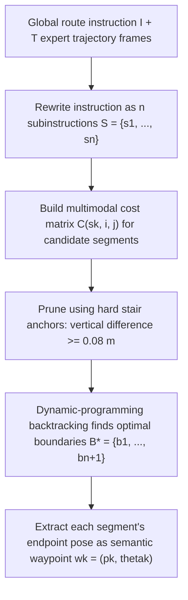
```mermaid
graph TD
    A["Global route instruction I + T expert trajectory frames"] --> B["Rewrite instruction as n subinstructions S = {s1, ..., sn}"]
    B --> C["Build multimodal cost matrix C(sk, i, j) for candidate segments"]
    C --> D["Prune using hard stair anchors: vertical difference >= 0.08 m"]
    D --> E["Dynamic-programming backtracking finds optimal boundaries B* = {b1, ..., bn+1}"]
    E --> F["Extract each segment's endpoint pose as semantic waypoint wk = (pk, thetak)"]
```

The total cost of candidate segment $[i, j]$ assigned to subinstruction $s_k$ is defined as:
$$C(s_k, i, j) = \lambda_{\text{sem}} C_{\text{sem}}(s_k, i, j) + \lambda_{\text{act}} C_{\text{act}}(s_k, i, j) + \lambda_{\text{dur}} C_{\text{dur}}(i, j) + \lambda_{\text{anchor}} C_{\text{anchor}}(s_k, i, j)$$

Among them:
1. **Semantic matching cost $C_{\text{sem}}$**: Extract CLIP normalized features and calculate negative log likelihood through temperature scaling Softmax;
2. **Action consistency cost $C_{\text{act}}$**: Calculate the distance between the offline action intention of the sub-command and the actual motion vector of the trajectory;
3. **Duration regular cost $C_{\text{dur}}$**: $C_{\text{dur}}(i, j) = (L_{i:j} - T/n)^2$, punishing segmentation that deviates from the uniform step size;
4. **Geometry Anchor Constraint $C_{\text{anchor}}$**: Detection of stair areas with continuous height changes $\ge 0.08\text{m}$ as hard constraint blocks.

> **For example**: An expert trajectory contains 30 frames, corresponding to 3 sub-commands (ideally each segment is 10 frames long on average).
> If a candidate split cuts the first sub-instruction in frames 1–3 (only 3 frames), the duration penalty is $(3 - 10)^2 = 49$;
> After dynamic programming globally weighs the CLIP image similarity, action intention and duration cost, it automatically calibrates it in the 1-9th frame interval where the semantics and turning characteristics are most consistent, and extracts the 3D coordinates and yaw angle of the robot in the 9th frame as the physical semantic waypoint $w_1 = (p_1, \theta_1)$.

<div align="center">
  
<figcaption>
Figure 3: Hierarchical supervision mechanism for geometric grounding. (a) Expert reference path; (b) Semantic waypoint extracted by step alignment; (c) Fixed sub-instruction strategy rollout and expert intervention recovery (blue solid line is Normal, red solid line is Recovering, blue dotted line is failed exploration).
</figcaption>
</div>

#### ④ Hierarchical corrective training with geometric grounding
{: id="-几何接地的分层纠偏训练"}
Model training is divided into two stages:
1. **Expert path initialization**: Initialize $$\mathcal{M}_{\text{IA}}$$ (labeled $m_t = \text{Normal}$) and $$\mathcal{M}_{\text{AG}}$$ respectively on the aligned expert tracks.
2. **Fixed subcommand Rollout and selective expert intervention**:
   - Keep the currently active subinstruction $s_k$ constant and let $$\mathcal{M}_{\text{AG}}$$ sample rollout multiple times with a temperature of 0.5;
   - Setting the physical completion judgment: When entering the physical range of the waypoint ($\lVert p_t - p_k \rVert_2 \le 1.5\text{m}$ and the angle error $\le 45^\circ$), it is deemed to have met the standard;
   - If multiple attempts under a certain sub-command fail, **expert intervention** is triggered (taking over the retrieval trajectory when the deviation distance exceeds the threshold). Marked $m_t = \text{Recovering}$ during the takeover, and control will be returned after being brought back. The sub-target $s_k$ remains unchanged during the entire process!

**Supervisory Allocation Rule**:
- **State-level supervision ($$\mathcal{D}_S$$, 190K samples)**: All historical observations of conventional and interventional rollouts are used to train $$\mathcal{M}_{\text{IA}}$$, so that it can still recognize the true semantic progress and recovery status in various lost and loop states;
- **Action-level supervision ($$\mathcal{D}_A$$, only 11.5K samples)**: Only the expert action block training $$\mathcal{M}_{\text{AG}}$$ of the Recovering interval in the repeated failure group is extracted, focusing on local obstacle avoidance and escape.

**Loss function**:
$$\mathcal{L}_{\text{IA}} = -\mathbb{E}_{\mathcal{D}_E \cup \mathcal{D}_S} \left[ \log p_{\theta_{\text{IA}}}(s_t, m_t \mid I, V_{1:t}) \right]$$
$$\mathcal{L}_{\text{AG}} = -\mathbb{E}_{\mathcal{D}_E \cup \mathcal{D}_A} \left[ \log p_{\theta_{\text{AG}}}(a_{t:t+h} \mid I, s_t, m_t, V_{t-k:t}) \right]$$

---

### 3. Results and findings
{: id="3-核心结果发现-41"}

<div align="center">
  
<figcaption>
Figure 4: Real robot navigation trajectory in a complex indoor real environment. The active sub-instructions predicted by $$\mathcal{M}_{\text{IA}}$$ are annotated below the observation image, showing clear and interpretable semantic progress tracking in long-range tasks.
</figcaption>
</div>

1. **Excellent performance on the main list**: On the continuous environment benchmark R2R-CE Val-Unseen, Route2Step achieved **55.3% success rate (SR)** and **48.2% SPL** under the condition of only using monocular RGB and no additional data pre-training, which is 7.2 percentage points higher than the expert baseline (48.1% SR / 43.3% SPL); it also achieved RxR-CE Val-Unseen 54.8% SR and 42.6% SPL.
2. **corrective supervision distribution is extremely energy efficient**:
   - Traditional DAgger only improves to 49.8% SR using 200K motion supervision;
   - Route2Step uses 190K state-level corrections + **only 11.5K action-level supervision**, which jumps to 55.3% SR, and the amount of action supervision is reduced to 1/17, but the effect exceeds 5.5 percentage points.
3. **Semantic tracking accuracy jumps in the deviation state**: On the FG-R2R artificial alignment verification set, in the face of artificially injected heading deviation, lateral detour, reversing and looping disturbances, state-level corrections significantly improved the strict sub-command tracking accuracy of $$\mathcal{M}_{\text{IA}}$$ from 43.54% to **54.05%** (+10.51%).
4. **Better than 7B unified end-to-end large model**: The single Qwen2.5-VL-7B unified strategy using the same training data only achieved 50.7% SR / 44.1% SPL, proving that the structural advantages of explicit hierarchical decoupling are significantly better than the implicit unified strategy.
5. **Plug-and-play cross-strategy generalization capability**: The active sub-instructions predicted by $$\mathcal{M}_{\text{IA}}$$ are directly injected into frozen NaVid, Uni-NaVid, NaVILA and StreamVLN as external text prompts without any secondary training. The SR of the four models is directly improved by **+4.9%, +2.5%, +1.1%, +0.6%** respectively.
6. **real robot deployment verification (Unitree GO2 quadruped robot)**: equipped with Intel RealSense D455 monocular RGB, achieved 19/33 success rate in 9 cross-scenario tests including laboratories, cafes, residential areas, parks and parking lots; achieved 3/5 success in the 120-word ultra-long complex indoor task (average completion of 5.0/7 sub-goals), while the baseline StreamVLN success rate was 0/5 (only promoted 2.2/7).

---

### 4. Limitations
{: id="4-局限性-41"}
1. Physical semantic waypoint relies on the assumption of local connectivity of the environment. When encountering infeasible topologies such as doors being completely locked or severely blocked, the system still lacks a high-level mechanism to actively re-plan the global route.
2. Using dual 3B VLM to run independently brings double the forward computing overhead during end-side inference. Multi-task weight sharing or lightweight distillation compression can be explored in the future.

---

## 52. PROSPECT (2026)
{: id="prospect"}
——Streaming VLA + latent space prediction: preview the future during training, zero overhead during inference

📄 **Paper**: [arXiv:2603.03739](https://arxiv.org/abs/2603.03739)

---

### Key takeaways
{: id="精华-44"}

1. Predicting the future does not require actually drawing the future - moving the supervision signal of the world model from pixel/depth to the latent space of SigLIP and CUT3R, task-irrelevant details such as texture and lighting have been suppressed by the teacher encoder before entering the loss function.
2. The prediction branch is only mounted during training and dismantled entirely during inference: its responsibility is to "shape" the main representation rather than to produce results, so no delay is charged.
3. Using stream query token to reversely query the streaming context is a common approach to stuff the prediction target into a ready-made VLA without changing the backbone autoregressive structure.
4. The spatial encoder chooses CUT3R instead of VGGT. The key is not the accuracy but the engineering attributes - absolute scale + natural flow. In long episodes, VGGT directly OOMs and the scale drifts with the first frame.
5. ablation shows that the success or failure of this set of multi-view target training is almost entirely dependent on an attention mask: the wrong mask design resulted in the loss of 8.5 SRs, which is greater than the combined contribution of 2D–3D fusion and the two prediction targets.

---

### 1. Background and problem
{: id="1-研究背景问题-43"}

MLLM-driven end-to-end VLN can already directly map first-person RGB into actions, but this type of method almost only trains "understanding and execution" and lacks the ability to predict environmental dynamics and explicit modeling of spatial structure. Existing remedial routes have their own shortcomings: the low-dimensional state space world model is not expressive enough; supervision in explicit spaces such as pixels/depth is easy to overfit textures and lighting, and collapses when the environment is changed; most methods only consume a short history, wasting the long-term context in streaming videos.

Another hidden line is the visual encoder: mainstream VLN relies on pure 2D semantic encoders such as SigLIP, which itself has no spatial intelligence; and the recently introduced VGGT series 3D foundation model has tight memory on long sequences, must rely on truncation of history to avoid OOM, and only provides **relative scale** representation, making it difficult to maintain consistency under large viewing angle changes.

---

### 2. Method and innovations
{: id="2-主要方法创新点-41"}

<div align="center">
  
<figcaption>
PROSPECT Overview. (a) Streaming setting: Attention mask ensures the isolation of temporal causality and 2D/3D query at the same time. SigLIP and CUT3R provide 2D semantic flow and absolute scale 3D spatial flow respectively, which are fed into the strategy after cross-attention fusion; (b) Unified model: during training, the stream query token predicts the next 2D/3D latent feature under the supervision of a frozen teacher, and only runs the VLA strategy (about 4 Hz) during inference; (c) Result: In the first tier of VLN-CE, the increase in long-range RxR is significantly greater than that of R2R
</figcaption>
</div>

#### ① Overview of the overall framework
{: id="-整体框架概述-19"}

PROSPECT (Predictive Representations Of SPatial-sEmantic ContextTs) consists of three blocks: **Perceptual fusion module** feeds each frame RGB to frozen SigLIP and CUT3R at the same time, and uses cross attention to fuse semantic features with spatial information; **Streaming VLA backbone** (LLaVA-NeXT-Video-7B + Qwen1.5-7B) uses KV cache to maintain short-term sliding windows and compress tokens Maintain long-term memory, autoregressively spit out atomic actions; **Latent space prediction branch** attaches a batch of learnable query tokens during training, reversely queries the streaming context and decodes the latent features of "what the next frame should look like", and removes the entire branch during inference. The three share the same attention sequence, and rely on a carefully designed mask to cut each other's information channels.

#### ② Explain module by module
{: id="-逐模块讲解-13"}

**Module A: 2D–3D Perceptual Fusion**

- **Input**: monocular RGB observation $o_t$ (no depth, no odometry, no panoramic).
- **Processing**: Two-way parallel encoding. SigLIP gives the semantic feature $$F_t^{2D} = \mathrm{SigLIP}(o_t)$$; CUT3R first uses the ViT encoder to output $$F_t^{3D,pre}$$, and then combines the status token $$s_{t-1}$$ and the learnable pose token $$p_t$$ from the previous step to scroll out the spatial feature and update the status:

$$[\tilde p_t,\ F_t^{3D}],\ s_t = \mathrm{Decoders}\left([p_t,\ F_t^{3D,pre}],\ s_{t-1}\right)$$

The two paths use 2D as query and 3D as key/value for cross attention:

$$F_t^{fuse} = \mathrm{softmax}\left(\frac{(F_t^{2D} W_Q)(F_t^{3D} W_K)^{\top}}{\sqrt{d_k}}\right)(F_t^{3D} W_V)$$

- **Output**: The fused features are cast into the LLM embedding space through MLP and entered into the model together with the instruction token. Historical key frames in long-term memory go through the same pipeline, but each frame is compressed into a single token.
- **Design motivation**: SigLIP recognized "that is a glass door", and CUT3R only knew "it is 2.3 meters in front". The spatial prepositions in the directive (through, to the right, in front) require the latter to be grounding.

> **For example (why absolute scale is necessary)**: The robot walked 100 steps and made a big turn in the middle. Encoders such as VGGT output a scale "relative to the first frame" - the width of the door in the first frame is set to 1.0, and all subsequent distances are converted according to this basis. After the turn, the field of view changes completely, and the door in the first frame is no longer in the picture. There is no real object to anchor the benchmark, and the scale drifts accordingly. CUT3R maintains a continuously updated status token and spits out spatial features with absolute scale (meters) frame by frame. The sentence "There is an obstacle 2.3 m ahead" has exactly the same meaning in step 1 and step 100.
>
> The gap in engineering is more direct: most episodes of R2R exceed 30 frames, and VGGT swallows the entire sequence at once and directly OOMs; it can run only after switching to the streaming version InfiniteVGGT, but the SR is only 43.2, which is 5.5 points lower than CUT3R’s 48.7, and the single-step time consumption is even higher (0.284 s vs 0.245 s).

<div align="center">
  
<figcaption>
PROSPECT architecture. Instructions and observations (historical keyframes + current frames) share a pipeline: frozen SigLIP and CUT3R are fused through cross-attention, and keyframes are compressed into long-term memory M; the backbone uses KV cache to carry context and autoregressively output navigation actions. The dotted box on the right is the prediction branch that is only enabled during training: 2D/3D query token reversely checks the streaming context, and the lightweight decoder uses cosine loss and MSE under the supervision of the frozen teacher to predict the next latent feature
</figcaption>
</div>

**Module B: Streaming context (short-term sliding window + long-term memory)**

- **Input**: Past $N-1$ set of observation–action pairs, and uniformly sampled historical keyframes.
- **Processing**: Use KV cache to cache key value status in short-term windows to avoid repeated forwarding; long-term key frames are compressed into memory token $M$. Fluid contextual writing

$$\mathrm{Stream}_{0:t} := \left(\mathrm{KV}(W_t),\ o_t,\ M\right)$$

- **Output**: The strategy outputs $n_a = 4$ atomic actions at $$a_t = \mathrm{VLA}(I, \mathrm{Stream}_{0:t})$$ per step, and the action space is

$$a_t^{(i)} \in \mathcal A := \{\uparrow,\ \leftarrow,\ \rightarrow,\ \mathrm{STOP}\}$$

Among them, $\uparrow$ means moving forward 25 cm, and $\leftarrow$ / $\rightarrow$ means turning left and right 15°. The experiment takes $N = 8$ and 8 long-term key frames.
- **Design motivation**: The short-term window ensures coherent actions, and the long-term memory ensures that the progress of tasks such as "I have passed the living room" is not forgotten. The division of labor between the two avoids the overhead of stuffing the entire history into the context.

**Module C: stream query token and latent space prediction (core of this article)**

The fusion feature is to **forward aggregation** of streaming information into LLM; the stream query token does the opposite - **reversely queries** the already written context, forcing the backbone to encode "what you will see next".

- **Input**: Append the learnable tokens $$\langle q_t^{2D} \rangle$$ and $$\langle q_t^{3D} \rangle$$ (9 for each modality) at the end of the $t$ round input sequence.
- **Processing**: After passing through LLM, the two are each compressed into an embedding in the future, and then sent to two 2-layer lightweight Transformer decoder, combined with the learnable mask token repeated to the target length, to expand into latent features of the same length as the target image token sequence (196):

$$\hat F_{t+1}^{2D} = \mathrm{Decoder}^{2D}\left(e_{t+1}^{2D} \mid \langle m_t^{2D} \rangle\right)$$

$$\hat F_{t+1}^{3D} = \mathrm{Decoder}^{3D}\left(e_{t+1}^{3D} \mid \langle m_t^{3D} \rangle\right)$$

- **Output**: Predicted next step 2D semantic/3D spatial latent features, aligned with the true encoding of frozen SigLIP/CUT3R for frame $t+1$ (teacher does not pass back gradients).
- **Design motivation**: Let the representation "know how the world will change", but do not pay the cost of reasoning for this.

> **For example (training is hung up and reasoning is removed, what's going on)**: Assume that it is the Tth round. During training, in addition to instructions, long-term memory, history and current observations, the model input also includes 9 `<Query2d>` and 9 `<Query3d>`, a total of 18 tokens. After passing LLM, they each obtain a compressed embedding, which is then expanded by a 2-layer decoder into the "next frame feature" of 196 tokens, and the loss is calculated with the frozen teacher's encoding of the T+1th frame.
>
> These 18 tokens are not added to the input at all during inference - only instructions + context + action tokens remain in the sequence. The relative order and attention structure are exactly the same as during training, so the backbone will not be misaligned due to their absence.
>
> In other words, the predictive ability is ultimately deposited in the weight of the LLM backbone, rather than relying on reasoning to calculate the future. This is why it is more compact than "MLLM + independent video generator": the latter has to keep the generator together during inference.

Why supervision is placed in latent space instead of pixel space:

| Dimensions | Pixel/depth-level world model | PROSPECT's latent space prediction |
|---|---|---|
| Prediction target | Next frame RGB, depth map, BEV/occupancy | 2D semantic features of SigLIP + 3D spatial features of CUT3R |
| Components in the supervision signal | Texture, shadows, and lighting all have to be reconstructed | The teacher encoder has filtered out appearance noise, leaving only semantics and geometry |
| Out-of-domain robustness | Representation is prone to failure when changing lighting/texture | Dusk and night scenes are still available (see real robot results) |
| Inference overhead | Generated branches usually need to be retained | Entire branch removed, zero extra delay |
| Dependence on pose/simulation state | Often requires GT pose or simulator state | No need for odometry, can be deployed without a map |

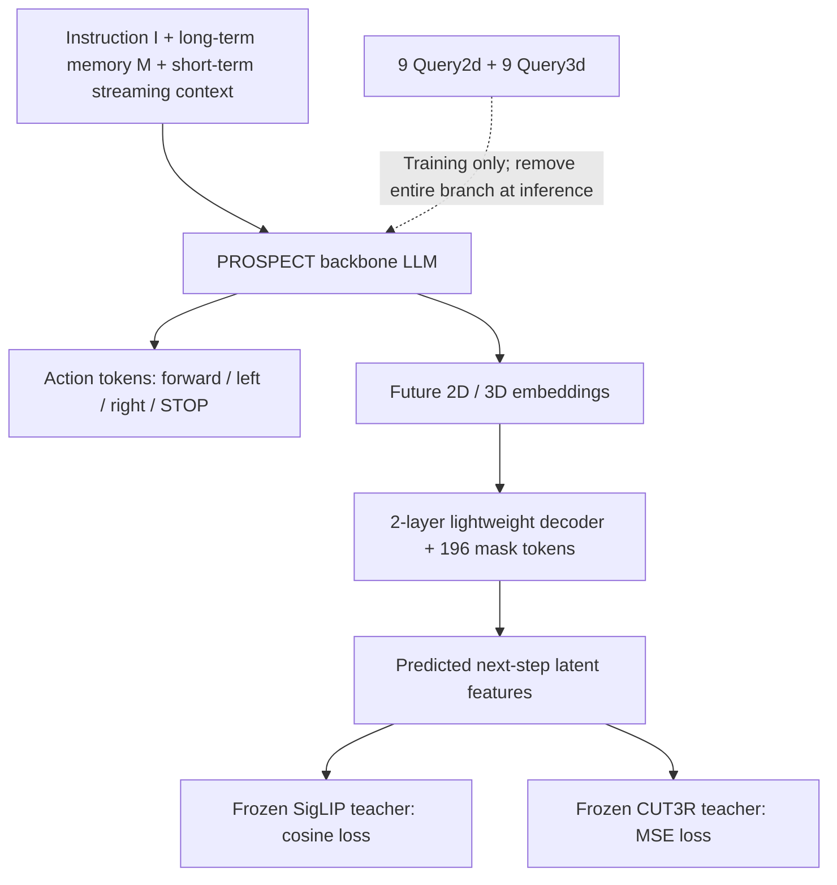
```mermaid
graph TD
    A["Instruction I + long-term memory M + short-term streaming context"] --> B["PROSPECT backbone LLM"]
    Q["9 Query2d + 9 Query3d"] -.->|"Training only; remove entire branch at inference"| B
    B --> C["Action tokens: forward / left / right / STOP"]
    B --> D["Future 2D / 3D embeddings"]
    D --> E["2-layer lightweight decoder + 196 mask tokens"]
    E --> F["Predicted next-step latent features"]
    F --> G["Frozen SigLIP teacher: cosine loss"]
    F --> H["Frozen CUT3R teacher: MSE loss"]
```

**Module D: Streaming Attention Mask**

<div align="center">
  
<figcaption>
Streaming attention mask for PROSPECT. Upper gray: standard causal mask of navigation context and action; middle red: each 2D query can only see the context and actions of its own round and earlier rounds, and cannot see any other queries; lower blue: the same is true for 3D query. The diagonal block on the right indicates that query is only visible to itself, thereby achieving both round isolation and modal decoupling
</figcaption>
</div>

The standard causal mask is not sufficient here because each round adds a new pair of prediction queries. The paper reinterprets the short-term navigation context into a $N$ round of dialogue: the $i$ round model consumes context $$\mathrm{ctxt}_i$$ (prompt and observation token), produces response $$\mathrm{act}_i$$ (action token), and the first round additionally includes instructions and long-term memory $M$. During training, $$\langle q_i^{2D} \rangle$$ and $$\langle q_i^{3D} \rangle$$ are added at the end of each round, and three constraints are imposed.

> **For example (what are blocked by the three constraints)**: Only take the first 3 rounds, each round has a set of `ctxt` / `act`, and then each is paired with a pair of prediction queries.
> - **Causation**: `act_2` can see `ctxt_0..2` and `act_0..1`, but not `ctxt_3`. This is the standard causal mask that prevents peeking into the future.
> - **Round Isolation**: `Query2d_1` can see `ctxt_0..1` and `act_0..1`, but **cannot see** `Query2d_0` and `Query2d_2`. Each query can only obtain information from the shared streaming context, and cannot copy answers from adjacent queries - otherwise the prediction error of the previous query will accumulate along the query chain.
> - **Modal isolation**: `Query2d_1` and `Query3d_1` are invisible to each other. Otherwise, the 2D branch can directly read the geometry calculated by the 3D branch, and the two goals that should be complementary degenerate into one.
>
> ablation confirms that neither isolation can be avoided: removing modal isolation, the SR dropped from 48.7 to 39.9, and returning the ordinary causal mask (Leaky, query can implicitly touch future navigation tokens) dropped to 40.2.

During evaluation, the prediction branch is removed as a whole, and the remaining token sequence maintains the same relative order and attention structure as during training - this is the premise of "training is on and reasoning is off" without losing any points.

#### ③ end-to-end data flow
{: id="-端到端数据流-3"}

The complete path of a sample at step $t$: monocular RGB $o_t$ → SigLIP / CUT3R dual-pass encoding → cross-attention fusion → MLP projection into the LLM embedding space → assembled into a streaming sequence with the short-term window in the instruction token, long-term memory $M$, and KV cache → (an additional 2D/3D query is added during training token) → the backbone forwards under the streaming mask → autoregressive outputs 4 atomic actions; during training, two lightweight decoders expand the next latent feature from the query embedding in parallel, aligning with the frozen teacher.

#### ④ Training objectives
{: id="-训练目标"}

Use cosine distance for 2D and MSE for 3D:

$$\mathcal L_{2D} = 1 - \cos\left(\hat F_{t+1}^{2D},\ F_{t+1}^{2D}\right)$$

$$\mathcal L_{3D} = \mathrm{MSE}\left(\hat F_{t+1}^{3D},\ F_{t+1}^{3D}\right)$$

The loss form is not randomly selected: SigLIP itself is trained using pairwise sigmoid loss on $\ell_2$ normalized embedding. Only the direction is meaningful geometrically. Using MSE on it will penalize the module length difference and make the training unstable; the CUT3R feature does not have this normalization premise, and MSE is stable.

The overall goal is

$$\mathcal L_{all} = \mathcal L_{nav} + \gamma\left(\alpha \mathcal L_{2D} + \beta \mathcal L_{3D}\right)$$

Among them, $\mathcal L_{nav}$ is the action cross entropy, taking $\gamma = 0.01$, $\alpha = 0.25$, and $\beta = 0.75$, so that no single item will overwhelm other items based on numerical magnitude alone.

The training is divided into two stages, sharing 8× A800: **Stage 1** does a round of SFT on MP3D's VLN-CE data (R2R / RxR / R2R-EnvDrop, totaling about 479K, accounting for about 5% / 14% / 80%), which takes 560 A800 GPU-hours; **Stage 2** retains Stage 1's R2R/RxR trajectories are added to alleviate forgetting, about 260K DAgger samples (expert re-annotation provides recovery actions after off-course) and about 314K ScaleVLN samples (HM3D), and mixed with LLaVA-Video-178K and ScanQA to enhance spatiotemporal reasoning, with a total of about 938K (71% VLN + 29% VQA), about 1900 A800 in one round GPU-hours. The SigLIP learning rate is $5 \times 10^{-6}$, the peak value of the remaining trainable modules is $2 \times 10^{-5}$, and CUT3R is frozen throughout the process.

#### ⑤ Reasoning process
{: id="-推理流程-2"}

Inference only runs the VLA backbone: the query token is not entered into the sequence, the two decoder are not loaded, and the teacher coder is not involved. The single step on the real robot is about 0.25 s, and the control frequency is about 4 Hz.

---

### 3. Results and findings
{: id="3-核心结果发现-42"}

**VLN-CE main results** (R2R/RxR val-unseen, monocular RGB, no depth, no odometry, no panoramic):

| Method | Training data | R2R SR↑ | R2R SPL↑ | RxR SR↑ | RxR SPL↑ |
|---|---|---|---|---|---|
| NaVid | MP3D | 37.4 | 35.9 | – | – |
| Uni-NaVid | MP3D | 47.0 | 42.7 | 48.7 | 40.9 |
| StreamVLN | MP3D + VideoQA | 50.8 | 45.7 | 48.6 | 42.5 |
| **PROSPECT** | MP3D + VideoQA | **52.0** | **46.2** | **52.7** | **42.8** |
| NaVILA | + additional data | 54.0 | 49.0 | 49.3 | 44.0 |
| StreamVLN | + ScaleVLN / MMC4 | 55.7 | 50.9 | 52.9 | 46.0 |
| **PROSPECT** | + ScaleVLN / MMC4 | **58.9** | **54.0** | **54.6** | **46.2** |

A few points worth noting:

1. **Profits are concentrated in long-range missions**. The increase of RxR is significantly greater than that of R2R, while the number of evaluation episodes of RxR is twice that of R2R, the average trajectory is 15.32 m vs 9.89 m (1.55×), and the average instruction is about 120 words vs 32 words (nearly 4×). The ablation stratified by the number of execution steps makes this point more straightforward: short-range (1–50 steps) SR is almost the same (+0.03), medium-range (50–100 steps) +4.68, and long-range (≥100 steps) +4.14. What's interesting is that the binning itself is also changing - PROSPECT's long-range episodes are 50 fewer than the baseline, and the short-range and medium-range episodes are 27 / 23 more each, indicating that it has completed some tasks that originally took a long time to complete in advance.
2. **Module ablation is superadditive**. Taking SigLIP-only as the baseline (SR 45.5), the fusion with CUT3R reaches 46.7, the 2D prediction alone reaches 47.0, the 3D prediction alone reaches 47.2, and both prediction targets are turned on at the same time to directly reach 48.7. Each contributes 0.3 / 0.5 individually, but together they add up to 2.0 - the predictive signals of semantics and geometry are indeed complementary, rather than duplicative.
3. **Mask design is the winning tip of the entire approach**. Leaky (ordinary causal mask) 40.2, remove modal isolation 39.9, complete design 48.7. In other words, if the mask is wrong, 8.5 SRs will be lost, which is several times more than the 2D–3D fusion (+1.2) and the two prediction targets (+2.0) combined. This conclusion is more worthy of migration than the method itself: when adding auxiliary targets to a ready-made VLA, how to cut the information path is more critical than what target is added.
4. **Spatial Encoder Comparison**. VGGT directly OOMs on long episodes of R2R; InfiniteVGGT can run but has an SR of 43.2 and a single step of 0.284 s; CUT3R has an SR of 48.7 and a single step of 0.245 s, a win-win for accuracy and latency.

<div align="center">
  
<figcaption>
ARX-Lift2 real robot first-person perspective. From top to bottom, they are the office (116 steps), the storage room (164 steps), and the night street (232 steps). The average reasoning time for a single step is about 0.25 s. The red mark in the instruction is the landmark
</figcaption>
</div>

**real robot results** (ARX-Lift2, head RealSense 405 monocular RGB; each scene is set with 5 instructions for short/medium/long range, each executed 2 times for a total of 30 times; the success criterion is to enter the target 0.3 m within 500 steps and actively output STOP, and the collision record fails; not seen in all scene training):

| Scene | Lighting | NaVid | StreamVLN | PROSPECT |
|---|---|---|---|---|
| Office (Indoor) | Bright | 7/30 | 12/30 | **20/30** |
| Warehouse (indoor) | Bright | 6/30 | 12/30 | **18/30** |
| Corridor (Indoor) | Moderate | 11/30 | 16/30 | **22/30** |
| Outdoor·Afternoon | Bright | 6/30 | 10/30 | **18/30** |
| Outdoor·Dusk | Moderate | 4/30 | 6/30 | **11/30** |
| Outdoor·Night Street | Dark | 2/30 | 6/30 | **9/30** |
| **Total** | — | 36/180 (20.0%) | 62/180 (34.4%) | **98/180 (54.4%)** |

It leads across all six scenes and three levels of lighting, and the relative advantage does not disappear when the lighting becomes worse (9 vs 6 vs 2 at night) - this is consistent with the design motivation of "latent space supervision naturally filters out appearance noise". In terms of deployment form, dual RTX-4090 servers are used indoors for remote inference via Wi-Fi/LAN (approximately 0.25 s/step), and dual A800 servers are used outdoors via the public network (approximately 0.27 s/step), both at about 4 Hz. The paper also tested the reduced-precision onboard inference of a single RTX 4070, which was feasible but the success rate decreased.

---

### 4. Limitations
{: id="4-局限性-42"}

Autonomy is still limited by the form of computing power: the main results rely on remote inference. Although the accuracy of the onboard single card can be reduced, it obviously drops. The success rate of 9/30 at night shows that it is far from reliable in low light. At the method level, the prediction target is anchored on frozen SigLIP/CUT3R, and the upper limit of representation is locked by the teacher, and only predicts $t+1$ in one step, not planning for a longer horizon; in addition, ablation is basically completed under the one-epoch SFT setting, and whether it is completely consistent with the final scaled formula has not yet been verified, and the training itself is quite expensive (the two phases total about 2460 A800 GPU-hours).

---

## 53. MacroAction-VLN (2026)
{: id="macroaction-vln"}
——— Continuous environment closed-loop reinforcement learning fine-tuning based on topological graph macro-action hierarchical MDP and action-aware critic

📄 **Paper**: [arXiv:2609.03906](https://arxiv.org/abs/2609.03906)

### Key takeaways
{: id="精华-45"}
1. **Topological graph macro action space (Macro Action Space)**: The continuous environment vision-language navigation (VLN-CE) is reconstructed into a hierarchical Markov decision process (Hierarchical MDP). The high-level strategy makes decisions on the macro action space composed of dynamic frontier nodes, greatly compressing the micro-action sequence of hundreds of steps to 5~20 steps, completely overcoming the extremely sparse reinforcement learning rewards and long-term credit assignment (Credit Assignment) problems in the continuous environment.
2. **Action-Aware Critic Head**: Aiming at the ill-posed evaluation problem of state value caused by the dynamic frontier candidate set, a value estimation head that perceives the dynamic action space is designed, sharing the cross-modal fusion backbone with the policy network, eliminating part of the observability of Critic with almost zero additional GPU memory overhead.
3. **Get rid of the final reinforcement of intensive reward shaping**: There is no need to manually design intensive rewards that are prone to short-sighted sub-optimal behavior. Only rely on the final result reward (Success + SPL + nDTW) combined with PPO and KL divergence regularization to enable the agent to learn autonomous exploration and closed-loop error correction, and get rid of the chronic problem of semantic conflict between DAgger corrective actions and language instructions.
4. **0.5B lightweight model refreshes continuous environment SOTA**: using only 0.5B parameters of the compact multi-modal backbone, it reaches a success rate (SR) of **68.1%** and **50.2%** on the R2R-CE and RxR-CE continuous unseen test sets respectively, significantly surpassing the multi-modal large model baseline of 7B parameters (such as UniNaVid, StreamVLN, VLN-R1).

---

### 1. Background and problem
{: id="1-研究背景问题-44"}
Continuous environment vision-language navigation (VLN-CE) requires the robot to perform hundreds of low-level micro-actions (such as moving forward 0.25 meters, turning left and right 15 degrees) based on natural language instructions in unseen scenes. The existing routes based on imitation learning (IL) and micro-action reinforcement learning (RL) face three fundamental contradictions:
1. **Distribution shift of behavior cloning**: Once a slight drift occurs during the test period, the agent will enter an unseen state space, and errors will accumulate rapidly.
2. **Semantic ambiguity of DAgger expert actions**: When the robot goes astray, the optimal corrective actions given by DAgger experts (such as turning around and walking back) often conflict violently with natural language instructions (such as "walk straight forward through the corridor") in semantics, destroying the alignment of visual and language features.
3. **Credit allocation dilemma of micro-action reinforcement learning**: The micro-action sequence is hundreds of steps long, and the final success reward is severely diluted in the long sequence, making it extremely difficult for conventional RL to converge; and manually designing dense single-step rewards can easily cause the agent to fall into sub-optimal behavior of local spin or instruction misalignment.

---

### 2. Method and innovations
{: id="2-主要方法创新点-42"}

<div align="center">
  
<figcaption>
Figure 1: Comparison of three training paradigms of VLN-CE. (a) DAgger corrective actions easily conflict with language instructions; (b) Micro-action space RL faces long-term credit allocation problems; (c) The topological graph macro-action space RL proposed in this article compresses the decision step size and achieves feasible long-term credit allocation.
</figcaption>
</div>

#### ① Overview of the overall framework
{: id="-整体框架概述-20"}
As shown in Figure 2, MacroAction-VLN reconstructs VLN-CE into a two-layer hierarchical MDP:
- **High-Level Planner (Macro MDP)**: Use the incrementally constructed topology map as a state representation, and select sub-goals or issue stop instructions in the dynamic unexplored Frontier Nodes set;
- **Bottom controller (Micro MDP)**: uses a training-free deterministic controller (Rotate-then-Forward heuristic controller combined with obstacle avoidance) to act as the state transition function of the high-level MDP $\mathcal{T}^H(s_{t+1}^H \mid s_t^H, a_t^H)$;
- **Closed-loop Reinforced Fine-tuning (RFT)**: Perform end-to-end optimization directly through Proximal Policy Optimization (PPO) on high-level macro actions.

<div align="center">
  
<figcaption>
Figure 2: Overall framework of the system. It includes a high-level planner (shared cross-modal backbone, Actor and action-aware critic), underlying micro-action controller, and PPO closed-loop reinforcement learning optimization process based on Rollout Buffer and final result reward.
</figcaption>
</div>

#### ② Explain module by module
{: id="-逐模块讲解-14"}

**1. Hierarchical Macro MDP Formulation**
- **Macro state $S^H$**: High-level state $$s_t^H = (I, \mathcal{H}_t)$$, consisting of natural language instructions $I$ and the current incrementally built topology map trajectory $$\mathcal{H}_t = (\mathcal{V}_t, \mathcal{E}_t)$$, including explored nodes and currently visible frontier candidate nodes.
- **Macro Action $A^H$**: Select the target waypoint $$a_t^H \in \mathcal{A}_t^H$$ in the dynamically available set of unvisited frontier nodes, or select the termination action `STOP`.
- **State transfer compression**: The underlying controller automatically plans and executes dozens of micro-actions to move the robot to the selected frontier point and updates the topology map. This reduces the number of macro-decision-making steps for a long task from the original 100~300 steps to **5~20 steps**.

> **For example (Stick point dimensionality reduction device A: Comparison of credit allocation between micro-actions and macro-actions)**:
>
> Set a 15-meter-long corridor navigation task:
> - **Micro-movement RL**: Each step advances 0.25 meters or turns 15 degrees, and the trajectory is as long as $T = 120$ steps. Suppose you reach the end and get the reward $R=1$. In time difference (TD) backpropagation, the reward of the first step of action is discounted to $\gamma^{120} = 0.99^{120} \approx 0.30$; more seriously, any random exploration of small actions in the middle 120 steps will introduce exponential cumulative variance, and Critic simply cannot distinguish which step of decision-making went the right way, causing the training to collapse.
> - **Topological map macro action RL**: The environment is abstracted into 5 topological nodes such as the starting point, the corner, the middle of the corridor, and the target door. The agent only needs to make the $T = 5$ sub-macro action choice! The discount factor is $\gamma^5 = 0.99^5 \approx 0.951$; the final reward is a clear and direct advantage estimate (GAE) for these 5 sub-goal decisions, with minimal variance, and the RL strategy can quickly converge in just more than ten hours.

**2. Action-Aware Critic Head**
- **Design motivation**: In traditional RL, Critic only takes the current historical state as input $V(s_t)$. However, in the macro-action space, the number, spatial orientation, and feasibility of frontier candidate nodes change dynamically with exploration. Ignoring the current distribution of frontiers to pick from will result in critical partial observability.
- **Shared backbone design**: Actor and Critic fully share the language encoder, graph encoder and cross-modal fusion backbone. The cross-modal Backbone simultaneously receives language token, visited topology token and current frontier token. Critic uses this set of fusion representations containing candidate action information in parallel to output a scalar state value $V^\pi(s_t^H)$, which does not add additional parameter burden and greatly stabilizes the advantage estimation.

**3. Outcome-Driven Reward function**
No need for complex dense step distance difference shaping, design a lightweight and robust trajectory-level final reward $R_T$:
$$R_T = \mathrm{Success} + \mathrm{SPL} + \mathrm{nDTW}$$
- $\mathrm{Success}$: 1 point for final stop within 1.5 meters of target;
- $\mathrm{SPL}$: Encourage the avoidance of invalid detours and excessively long paths;
- $\mathrm{nDTW}$ (normalized dynamic time warping): measures the spatiotemporal consistency between the agent's trajectory and the reference truth trajectory. Even if the mission is not completely successful in the end, nDTW can still provide dense positive feedback for high-quality exploration that "takes most of the right path", supporting a smooth cold start in the early stage of RL.

**4. Three-stage progressive training paradigm (Curriculum Training Paradigm)**
- **Phase 1 & 2: Pre-training and DAgger phase with Value warm-up**:
In the imitation learning stage, the policy head and the action perception value head are pre-warmed and supervised at the same time:
  $$\mathcal{L}_{DAgger} = \mathcal{L}_{CE} + c_v \mathcal{L}_V^{CLIP}$$
- **Phase 3: Closed-Loop RFT**:
The PPO algorithm is adopted, and the KL divergence constraint for the pre-trained reference model $\pi_{ref}$ is introduced in the loss to prevent the strategy from representation collapse during intensive exploration:
  $$\mathcal{L}_{PPO} = \mathcal{L}_P^{CLIP} + c_v \mathcal{L}_V^{CLIP} + \beta \mathbb{D}_{KL}(\pi_\theta \parallel \pi_{ref})$$

#### ③ Reader’s perspective: hierarchical decision-making and enhanced optimization closed-loop diagram (stuck point dimensionality reduction device B)
{: id="-读者视角分层决策与强化优化闭环图卡点降维装置-b"}

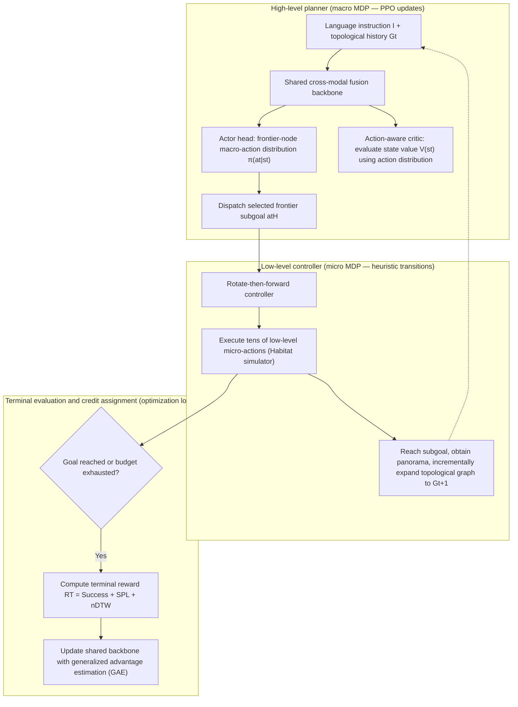
```mermaid
graph TD
    subgraph "High-level planner (macro MDP — PPO updates)"
        A["Language instruction I + topological history Gt"] --> B["Shared cross-modal fusion backbone"]
        B --> C1["Actor head: frontier-node macro-action distribution π(at|st)"]
        B --> C2["Action-aware critic: evaluate state value V(st) using action distribution"]
        C1 --> ACT["Dispatch selected frontier subgoal atH"]
    end

    subgraph "Low-level controller (micro MDP — heuristic transitions)"
        ACT --> D["Rotate-then-forward controller"]
        D --> E["Execute tens of low-level micro-actions (Habitat simulator)"]
        E --> F["Reach subgoal, obtain panorama, incrementally expand topological graph to Gt+1"]
    end

    subgraph "Terminal evaluation and credit assignment (optimization loop)"
        F -.-> A
        E --> G{"Goal reached or budget exhausted?"}
        G -- "Yes" --> H["Compute terminal reward RT = Success + SPL + nDTW"]
        H --> I["Update shared backbone with generalized advantage estimation (GAE)"]
    end
```

#### ④ Mechanism comparison: MacroAction-VLN vs existing mainstream route (stuck point dimensionality reduction device C)
{: id="-机制对比macroaction-vln-vs-现有主流路线卡点降维装置-c"}

| Mechanism dimension | Traditional pure imitation learning (ETPNav / BEVBert) | Micro-action reinforcement learning (VLN-R1) | This article MacroAction-VLN |
|---|---|---|---|
| **Decision-making action space** | Topological graph macro-action (purely supervised fitting expert) | Continuous micro-action (forward/turn/stop) | Topological graph macro-action (enhanced exploration and closed-loop corrective) |
| **Training Optimization Paradigm** | DAgger corrective (easy to conflict with language instruction semantics) | Micro-action direct RL (long time series is extremely difficult to converge) | Macro-action space closed-loop PPO enhanced fine-tuning |
| **Value Critic Design** | Simple network with no critics or only no action awareness | Simple single-step value network (high variance) | Action-Aware architecture, shared cross-modal full backbone |
| **Parameter amount and performance** | 0.3B parameters, R2R-CE SR is about 57%~59% | 7B parameter large model, R2R-CE SR is only 30.2% | **0.5B parameters, R2R-CE SR reaches 68.1%** |

---

### 3. Results and findings
{: id="3-核心结果发现-43"}
System evaluation was conducted on the continuous environment vision-language navigation gold benchmark **R2R-CE** and **RxR-CE** unseen test sets (Val-Unseen) in the Habitat emulator:

1. **Significantly refreshes the continuous environmental performance record**:
   - On **R2R-CE Val-Unseen**, the success rate (SR) surges from 65.1% of the DAgger baseline to **68.1%** (+3.0%), the SPL increases to **57.3%** (+3.8%), and the navigation error (NE) drops to **3.89 meters**;
   - On the long-range multi-language high-difficulty benchmark **RxR-CE**, the success rate reaches **50.2%**, and the path fidelity nDTW reaches **66.8%**;
   - The overall performance comprehensively surpasses the 7B large model solution with more than ten times the number of parameters (such as 56.9% of StreamVLN, 47.0% of UniNaVid, and 30.2% of VLN-R1 based on micro-action RL).
2. **Ablation experiments confirm the decisive value of motion perception Critic**:
   - Removing the Action-Aware feature (instead of using a traditional critic that only relies on history), the RFT gain shrinks directly from +3.0% to +1.1%, proving that sensing dynamic candidate actions plays an irreplaceable role in accurately assessing the value of a state;
   - The training convergence stability and final performance of the final drive reward (+nDTW) are significantly better than the single-step dense distance reward (Dense Soft Reward), effectively avoiding short-sighted circling behavior.
3. **Qualitative analysis of policy robustness**:
   - As shown in Figure 5, when faced with error-prone environments such as dead ends in similar rooms and blind corners, the model trained by RFT can demonstrate high-confidence backtracking re-exploration capabilities in high-level macro actions, fundamentally eliminating the defect of wandering to deadlock in place after the DAgger training strategy goes astray.

---

### 4. Limitations
{: id="4-局限性-43"}
1. High-level macro actions rely on the frontier point extraction algorithm of the topology map and the underlying dead reckoning (Odometry). When the cumulative drift of odometry is too large or there are serious false positive fronts in the mapping, the macro action selection space will be disturbed.
2. At present, the underlying micro-action transfer is completed by hard-coding heuristic controllers. In extremely rugged or narrow scenes that require complex maneuvering dynamics, there is a lack of joint adaptive adjustment capabilities between high and low layers.

---

## 54. HumanoidVLN (2026)
{: id="humanoidvln"}
——The first physically realistic VLN simulation platform and benchmark for diverse bipedal humanoid robots

📄 **Paper**: [arXiv:2608.12860](https://arxiv.org/abs/2608.12860) · 🏛️ **IEEE RA-L** · [Project Page](https://humanoid-vln.github.io/)

### Key takeaways
{: id="精华-46"}
1. **Breaking the kinematics transmission assumption**: For the first time, a full physics simulation evaluation platform based on NVIDIA Isaac Sim was established for bipedal humanoid robots. It decouples high-level VLN planning from low-level reinforcement learning (RL) gait control, revealing the problems of falls and gait instability hidden by traditional physical simulations.
2. **Polymorphic hardware heterogeneous coverage**: Natively supports 4 humanoid robots with different sizes (1.17 m–1.80 m) and lower limb degrees of freedom (10–12 DoF), adapting to both discrete (PD tracker) and continuous (MPC tracker) action spaces.
3. **Traversability screening and 3DGS reconstruction**: Construct 87 high-fidelity 3D indoor scenes, hard-screen the traversable area $\ge 100\text{ m}^2$, and combine the improved unbiased depth and normal consistency 3DGS process to generate a high-precision physical collision mesh.
4. **Multi-agent instruction collaborative generation (MAA)**: Design a multi-model collaboration process with dual generators, a single reviewer and a repeater. Through structured topological path graph alignment and geometric deterministic arbitration, supplemented by manual verification, 933 high-quality cross-style instructions are produced.
5. **Real robot strong correlation verification**: The Sim-to-Real measurement on Unitree G1 real robot shows that the correlation between simulation and real navigation error is as high as $r = 0.935$, proving that the benchmark based on 3DGS reconstruction and physical simulation has extremely high real robot migration prediction power.

---

### 1. Background and problem
{: id="1-研究背景问题-45"}
Most of the existing vision-language navigation (VLN) benchmarks assume that the agent is a wheeled chassis or adopts idealized "Kinematic Teleportation", completely ignoring the physical dynamics constraints of bipedal humanoid robots. In actual deployment, the shapes of different humanoid robots vary greatly (height ranges from 1.17 m to 1.80 m, lower limb degrees of freedom 10–12 DoF), and body shaking while walking will cause severe vision jitters and dynamic lighting changes; without physical simulation, conventional models are prone to gait instability or even falls when facing sharp turns or complex terrain. To this end, there is an urgent need for an end-to-end evaluation platform that takes into account diverse humanoid forms, physically realistic dynamic control, large-area traversable scenes, and high-quality instructions.

---

### 2. Method and innovations
{: id="2-主要方法创新点-43"}

<div align="center">
  
<figcaption>
HumanoidVLN physical benchmark evaluation pipeline: covering diverse humanoid forms, hierarchical control stack, scene screening, multi-modal dataset generation and plug-and-play evaluation
</figcaption>
</div>

#### ① Overview of the overall framework
{: id="-整体框架概述-21"}
HumanoidVLN is built on the NVIDIA Isaac Sim physical simulation engine. The overall framework consists of three pillars: **Hierarchical motion control stack** (responsible for converting high-level semantic actions into real foot contact and joint moments), **Real2Sim scene construction pipeline** (through passability filtering and 3DGS Reconstruction provides a physical collision environment) and a **Multi-Agent Command Generation Pipeline (MAA)** (automatically extracts structured paths from first-person shaky videos combined with manual review).

#### ② Explain module by module
{: id="-逐模块讲解-15"}

**1. Hierarchical Control Stack**
- **Input**: Discrete navigation actions (forward, turn left, turn right, stop) or continuous linear velocity/angular velocity commands output by the high-level VLN model.
- **Processing**: The control system is divided into two layers. **High-level path tracker** is responsible for converting navigation instructions into reference speed and heading angle - for discrete action models, a proportional-derivative (PD) controller is used to generate a smooth heading, and for continuous action models, model predictive control (MPC) is used to track the speed curve; **The bottom-level reinforcement learning (RL) gait strategy** is trained individually for the dynamic parameters of each humanoid robot, receives reference speeds and outputs torque commands for 10–12 lower limb joints.
- **Output**: The joint torque acting on rigid body dynamics drives the bipedal robot to produce a real gait, and produces real shaking and pitching in the first-person camera.
- **Design motivation**: Completely abandon the "spatial teleportation" of directly modifying coordinates in traditional VLN, so that the robot's center of mass dynamics (CoM) and contact stability truly constrain the feasibility of the path.

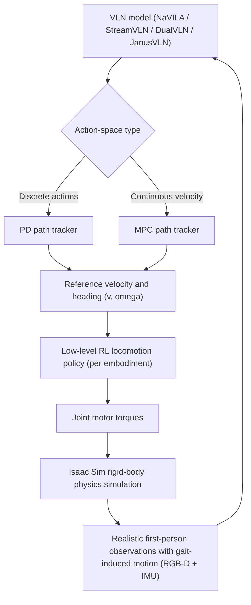
```mermaid
graph TD
    A["VLN model (NaVILA / StreamVLN / DualVLN / JanusVLN)"] --> B{"Action-space type"}
    B -- "Discrete actions" --> C["PD path tracker"]
    B -- "Continuous velocity" --> D["MPC path tracker"]
    C --> E["Reference velocity and heading (v, omega)"]
    D --> E
    E --> F["Low-level RL locomotion policy (per embodiment)"]
    F --> G["Joint motor torques"]
    G --> H["Isaac Sim rigid-body physics simulation"]
    H --> I["Realistic first-person observations with gait-induced motion (RGB-D + IMU)"]
    I --> A
```

| Dimensions | Traditional VLN platforms (e.g. Habitat/R2R) | HumanoidVLN platforms |
|---|---|---|
| Motion mechanism | Kinematic coordinate transmission (no center of mass and contact mechanics) | Bottom RL joint torque drive (full rigid body physics simulation) |
| Robot morphology | Ideal point/cylindrical wheeled agent (single fixed height) | 4 heterogeneous humanoid robots (1.17–1.80 m, 10–12 DoF) |
| Visual perception | Smooth and shake-free camera perspective | Camera shake and dynamic lighting caused by real alternating gait of two feet |
| Failure mode | Can only detect collision or timeout | Can accurately quantify the fall rate (FR) caused by sharp turns and instability |

**2. Fall rate (Fall Rate, FR)**
In order to quantify gait stability under physical simulation, the platform defines a fall indicator based on the trunk height drop $\Delta h$ and the vertical fall speed:

$$FR = \frac{100}{N} \sum_{i=1}^N \mathbb{I}[F_i = 1]$$

When the robot meets one of the following three criteria, it is determined to have fallen ($F_i = 1$) and the round of testing is immediately terminated:
- $T_1$ (dynamic severe fall): $\Delta h \ge 0.5 H_e$ and downward speed amplitude $> 1.2\text{ m/s}$;
- $T_2$ (continuous collapse): $\Delta h \ge 0.5 H_e$ and duration $\ge 2\text{ s}$;
- $T_3$ (shallow rapid fall): $0.35 H_e \le \Delta h < 0.5 H_e$ and downward speed amplitude $> 1.5\text{ m/s}$.

> **For example**: Take Unitree H1 with height $H_e = 1.80\text{ m}$ as an example:
> If the robot steps on the air and becomes unstable when turning, the body drops by $0.95\text{ m}$ ($\Delta h = 0.95 > 0.5 \times 1.80 = 0.90\text{ m}$) in height within $0.2\text{ s}$, and the falling vertical speed reaches $1.6\text{ m/s} > 1.2\text{ m/s}$, the $T_1$ criterion is immediately triggered to determine a fall;
> On the contrary, if the robot actively bends its knees and squats $0.4\text{ m}$ ($\Delta h = 0.4 < 0.35 \times 1.80 = 0.63\text{ m}$) when avoiding obstacles, and the falling speed is only $0.3\text{ m/s}$, no criterion will be triggered and navigation will continue normally.

**3. Real2Sim scene construction and passability screening**
- **Large area passable screening**: Biped robots have large strides and limited turning radius, making them unable to pass in narrow and cluttered environments. The platform screened out 87 large scenes from artist-designed scenes and 3DGS reconstructed scenes, and forced the actual passable area calculated by the physical collision grid to be $\ge 100\text{ m}^2$ (median reaches $266\text{ m}^2$), covering a total of 17 room types in six major fields: residential, retail, cultural, office, medical, and fitness.
- **High-precision 3DGS reconstruction pipeline**: Initialize 3D Gaussian based on COLMAP sparse point cloud, and introduce unbiased depth rendering (Unbiased Depth Rendering) and depth-normal geometric consistency constraint (Depth-Normal Consistency) in gsplat training to overcome the shortcomings of traditional 3DGS in normals broken on the edges of textureless white walls and slender furniture, and finally extract smooth physical collision meshes through TSDF fusion and package them as USDZ assets.

<div align="center">
  
<figcaption>
Multi-agent instruction generation framework (MAA): dual generators extract topological path graphs, the reviewer is based on geometric and semantic prior arbitration, the recapitulator expands the style and is finally reviewed by humans
</figcaption>
</div>

**4. Multi-agent instruction generation (MAA) and manual verification**
- **Target Landmark Positioning**: Use Qwen3-VL-30B-A3B to identify termination landmarks and stop conditions from the first-person video end frame.
- **Dual generator independent analysis**: Gemma-4-31B-it and InternVL3.5-38B independently derive the structured topological path graph $R = \langle(a_i, \ell_i, s_i, o_i, m_i)\rangle_{i=1}^n$ based only on the first-person key frame sequence (respectively representing ordered actions, landmark objects, relative path left and right directions, ordinal numbers, and corner amplitudes).
- **Inspector arbitration and a priori verification**: Compare two topological path graphs and merge conflict-free nodes; for conflicting turns or landmarks, the Qwen3-VL-30B-A3B inspector combines the A* trajectory and trajectory metadata on the 2D occupancy raster map and the 3D spatial semantic scene graph (Scene Graph) visible along the way for geometric and semantic consistency arbitration.
- **Diversified style restatement and manual review**: GPT-5.5 converts the verified path into 1 fine-grained instruction and 3 style variants (Formal, Natural, and Colloquial Casual), and requires the topological path parsed in reverse to be consistent with the original image; finally, 3 professional annotators conduct 100% line-by-line review and corrective (20% cross-double review), and finally construct 933 high-quality evaluation episodes.

---

### 3. Results and findings
{: id="3-核心结果发现-44"}

<div align="center">
  
<figcaption>
Heat map comparison of fall rates (FR) of different VLN models in four humanoid robot forms: the continuously controlled DualVLN has the best stability, while the fall rate of H1 with a high center of gravity 10-DoF is significantly higher
</figcaption>
</div>

1. **Explicit 3D spatial representation has stronger navigation capabilities**: In the zero-shot evaluation of four mainstream VLN models (NaVILA, StreamVLN, DualVLN, JanusVLN), **JanusVLN**, which introduces explicit 3D spatial memory, achieved the highest average success rate ($\text{SR} = 43.55\%$) and path fidelity ($\text{nDTW} = 48.38$).
2. **Discrete sharp turning actions induce high fall rates**: Models using discrete action spaces (forward, 30° left turn, 30° right turn) will bring step disturbances to the underlying gait when turning. Unitree H1, which has the tallest body (1.80 m) and fewer degrees of freedom (10 DoF), has a fall rate as high as $70.95\%$ and $64.52\%$ under NaVILA and StreamVLN; while **DualVLN**, which uses continuous speed output and is equipped with an MPC tracker, shows optimal dynamic stability and has the lowest average fall rate in all shapes.

<div align="center">
  
<figcaption>
Sim-to-Real real robot measured consistency verification: (a) Single-round navigation error between simulation and real real robot is highly linearly correlated (r = 0.935); (b) nDTW similarity distribution between simulation and real trajectory
</figcaption>
</div>

3. **Simulation evaluation highly predicts real robot performance**: DualVLN was deployed on Unitree G1 real robot for 20 rounds of Sim-to-Real comparison experiments. The simulation environment and the measured navigation error of real robot showed a strong positive correlation (Pearson $r = 0.935$, Spearman $\rho = 0.911$), and the absolute difference of the average navigation error was only $0.68\text{ m}$, the pairwise trajectory similarity reaches $78.2 \pm 18.8\text{ nDTW}$, which verifies the real migration value of HumanoidVLN physical simulation and 3DGS reconstructed assets.

---

### 4. Limitations
{: id="4-局限性-44"}
The current evaluation scenario is still limited to a static indoor environment, and dynamic pedestrians or interactive obstacles have not yet been introduced; in addition, the computational overhead of high-precision rigid body physics simulation is high, and the manual final verification link in instruction generation has become a throughput bottleneck for large-scale data expansion.

---

## 55. AdaGeoVLN (2026)
{: id="adageovln"}
——Making geometric trade-offs along the two axes of "representation depth" and "navigation time"

📄 **Paper**: [arXiv:2609.18789](https://arxiv.org/abs/2609.18789) · [Project Page](https://humanoid-research.github.io/adageovln/)

---

### Key takeaways
{: id="精华-47"}

The geometry foundation model (GFM) should not just throw the last layer output to the strategy - AdaGeoVLN connects the 11th/17th/23rd layers of VGGT to the first three decoding layers of VLM, allowing geometric information of different maturity to enter the field at different stages of strategy reasoning.

The key is that it designed a strict control: injecting the same terminal feature into the same three positions three times (Deep × 3), the SR dropped from 46.5% of the geometry-free baseline to 42.1%, proving that the gain comes from the diversity of representations rather than the number of interactions.

On the timeline, it treats the KV history of VGGT global attention as an eliminable cache sorted by navigation value, scores the three signals of instruction relevance, geometric confidence, and transition novelty and then ranks TopK layer by layer.

This retention action occurs after the current frame's reasoning and serves the next frame. Therefore, "which history to choose" is equivalent to shaping the context of future geometric reasoning, rather than performing compression afterwards.

R2R-CE 55.7 SR / 51.4 SPL is obtained with a single RGB stream and zero additional navigation data, while saving 39.7% of GFM-KV GPU memory compared to the old and new baseline.

---

### 1. Background and problem
{: id="1-研究背景问题-46"}

What VLN agents have to do in unfamiliar environments is not only object recognition and language-appearance matching, but also reasoning about spatial relationships, perspective changes, and temporal connections between observations. This makes geometric representations a natural complement to semantic reasoning. Geometric foundation models such as VGGT can deduce the scene structure from pure RGB feedforward, but two questions have not been resolved: **(1) Which layer of the geometric encoder should the strategy look at?**  The mainstream approach only exposes terminal representations, but the middle layer may not have complementary information;  **(2) Under limited GPU memory, which historical geometric states are worth retaining?**  Eliminating by recency can seal the growth of GPU memory, but by default "the older it is, the more useless it is" - and an early observation may just anchor the landmark in the instruction, or provide the most reliable geometry.

---

### 2. Method and innovations
{: id="2-主要方法创新点-44"}

#### ① Overall framework
{: id="-整体框架"}

AdaGeoVLN is a streaming VLN framework, consisting of three parts: a **frozen VGGT** is responsible for producing multi-layer geometric features from a single RGB stream; a **Qwen3.5-4B policy** is responsible for turning instructions and visual tokens into discrete actions; sandwiched between are two sets of "geometry selection" mechanisms - **level GFM–VLM fusion** determines which level of geometry (depth axis) the strategy sees at which layer, and **navigation-aware GFM-KV retention** determines which historical geometry state remains in the VGGT cache for the next frame (timeline). The two axes are orthogonal: the former manages "what the strategy obtains", and the latter manages "the historical context in which these representations are calculated."

<div align="center">
  
<figcaption>
AdaGeoVLN Overview. (a) Depth axis: The shallow/medium/deep three-level features of frozen VGGT are coupled into the continuous decoding layer of the VLM strategy; (b) Time axis: Candidate GFM-KV is scored according to the three signals of instruction, transfer, and confidence, retained within a fixed budget, and the rest are eliminated; (c) Performance comparison with the single RGB streaming VLN baseline
</figcaption>
</div>

Formally, the agent at step $t$ sees the RGB image $I_t$ and the instruction $L$. The geometry foundation model $G$ exposes the representation $$G_t^m$$ at the depth $m$. The strategy takes action as follows:

$$
a_t \sim \pi_\theta\!\left(a_t \mid L,\, I_{1:t},\, M_t\right)
$$

Among them, $M_t$ is the retained geometry side memory.

---

#### ② Module 1: Hierarchical geometric fusion (depth axis)
{: id="-模块一层级几何融合深度轴"}

**Input**: Spatial patch features of VGGT layers 11, 17, and 23 (2048 dimensions per position). These three levels span the separation stage of the VGGT level, and are injected early enough to give geometry updates a chance to propagate in subsequent policy calculations.

**Processing**: Each feature is first normalized and aligned to the image token resolution of VLM - adjacent 2×2 patches are put together to obtain an 8192-dimensional token:

$$
Z_t^m = \mathrm{Group}_{2\times 2}\!\left(\mathrm{RMSNorm}(G_t^m)\right)
$$

Then take two parallel branches. One is a **depth-specific adapter** that compresses 8192 dimensions into 2560 dimensions of the language latent space:

$$
\Phi_m : \mathbb R^{8192} \to \mathbb R^{4096} \to \mathbb R^{2560}
$$

The other is a token-by-token gating network that outputs a scalar logit for each merged token:

$$
\Gamma_m : \mathbb R^{8192} \to \mathbb R^{2048} \to \mathbb R
$$

Multiply the two and then multiply them by a learnable scalar $s_m$ to control the overall contribution of the depth, and you get the geometric update amount:

$$
\Delta_t^m = s_m \left[\sigma\!\left(\Gamma_m(Z_t^m)\right) \odot \Phi_m(Z_t^m)\right]
$$

**Output**: The geometric update is added to the **image token position** of the decoding layer in the form of residuals (the text token state is not directly overwritten):

$$
H_{t,\mathrm{img}}^{k,+} = H_{t,\mathrm{img}}^{k} + \Delta_t^m, \qquad (m,k) \in \{(11,0),\, (17,1),\, (23,2)\}
$$

**Design motivation**: The paper deliberately **does not assign a preset semantic role** to each depth (not saying "shallow tube texture, deep tube structure"), but treats the level itself as an empirical hypothesis to be tested - the hidden states of different geometric processing stages may carry complementary information, and just looking at the terminal state will erase them.

<div align="center">
  
<figcaption>
Hierarchical GFM–VLM fusion across representation depths. The 11/17/23 layers of VGGT are respectively coupled to the first three decoding layers of Qwen3.5-4B. Each branch undergoes RMSNorm, 2×2 grouping, projection, token-by-token gating and learnable scaling, and then the residual is added back to the image token position
</figcaption>
</div>

**Stuck point in dimensionality reduction: What is the difference between "injecting multiple depths" and "injecting terminal features several times"?**

This is the most easily skipped but most critical design in the entire article. The author specially created a **Deep×3** control group: the number and position of fusion are all aligned with the hierarchical fusion. The only difference is that the same terminal feature $$G^{23}$$ was injected three times.

| Dimension | Single deep (single terminal injection) | Deep×3 (repeated terminal injection) | Hier. Hierarchical fusion |
|---|---|---|---|
| Geometry stalls seen by the strategy | Layer 23 only | Layer 23 only (repeat 3 copies) | Layers 11 / 17 / 23 |
| Number of fusions | 1 | **3** | **3** |
| Fusion location | L2 | **L0 / L1 / L2** | **L0 / L1 / L2** |
| R2R-CE SR / SPL | 48.9 / 44.1 | **42.1 / 36.9** | **55.7 / 51.4** |

The result is clear: Deep×3 not only failed to tie the level of hierarchical fusion (13.6 / 14.5 points difference), it even fell below the baseline that does not use geometry at all (46.5 / 42.3). It shows that "more geometry-strategy interaction" itself is not a source of improvement. What really works is that the strategy is exposed to geometric representations at **different levels of maturity** at different stages of reasoning.

> Note: The paper only reports this phenomenon and does not explain why Deep×3 is lower than the geometry-free baseline. A reasonable speculation is that the same residual is superimposed three times, which is equivalent to repeatedly amplifying and continuously squeezing the original semantic distribution of visual tokens in the same direction, and the three gated networks are all fitting the same signal, consuming capacity in vain - but this is speculation by the author and has not been verified in the paper.

---

#### ③ Module 2: Navigation-aware GFM-KV retention (timeline)
{: id="-模块二导航感知-gfm-kv-保留时间轴"}

**Input**: KV cache of VGGT **global attention layer**. Note the scope - Qwen/VLM's own KV buffer, as well as the frame-aligned $$G^{11/17/23}$$ feature CPU buffer prepared for hierarchical fusion, are independent and are not clipped here.

**Processing**: The candidate pool of the $g$th global attention layer consists of "the history retained in the previous step" plus "the newly generated KV of the current frame":

$$
C_t^g = M_{t-1}^g \cup (K_t^g,\, V_t^g)
$$

Each candidate patch is jointly scored by three complementary signals.

**(a) Instruction relevance $$r_{f,p}$$** - Hooks geometry to specific navigation subgoals. First use punctuation, sequence words (then, next, after that) and conjunctions that lead to navigation verbs to cut the instructions into fragments (while keeping phrases such as next to that should not be cut), and do mean-pooling on each paragraph to obtain a unit-length segment embedding $e_j$. Assume that $$u_{f,p}$$ is a spatial grouping token projected from $$G^{11}$$ into Qwen space (before gating and scaling). In order to eliminate shared embedding components, the visual token is centered within the frame, and the segment embedding is centered within the instruction:

$$
\bar u_f = \frac{1}{P_f}\sum_{p=1}^{P_f} u_{f,p}, \qquad \bar e = \frac{1}{J}\sum_{j=1}^{J} e_j
$$

$$
r_{f,p} = \frac{1 + \max_j \cos\!\left(u_{f,p} - \bar u_f,\; e_j - \bar e\right)}{2}
$$

Taking max instead of finding the similarity of the entire instruction means that each token only needs to match a certain sub-goal to be useful.

**(b) Geometric confidence $$c_{f,p}$$** - Just correlation with instructions does not mean geometric reliability. Average the depth confidence field and point map confidence field of VGGT to the aligned token grid, map the pooling value $\tilde c \in (1,\infty)$ to $1 - 1/\tilde c \in (0,1)$, and then take the **minimum** of the two:

$$
c_{f,p} = \min\!\left(c_{f,p}^{\mathrm{depth}},\; c_{f,p}^{\mathrm{point}}\right)
$$

Using min is a conservative combination - both predictors are reliable only if they are confident.

**(c) Transfer novelty $$\nu_{f\mid t}$$** - Suppress redundant history. For each frame, use uniform pooling shallow projection token to make a $\ell_2$ normalized descriptor $d_f$, and then see how far it is from the nearest one among all observed frames:

$$
\nu_{f\mid t} = \frac{1 - \max_{f' \in F_{\le t},\, f' \neq f} \cos(d_f,\, d_{f'})}{2}
$$

A high value indicates that no other frame provides similar geometry. The descriptor is still retained after KV is eliminated, so the score will be recalculated every step. All candidate patches in the same frame share this score.

**(d) Joint scoring and layer-by-layer budget** - Relevance and confidence are cached and shared across layers during insertion, and novelty is refreshed at each step. The dimensions of the three are different. First, do z-score on the candidate patches of each layer and then add them together with equal weight:

$$
S_{t,g}(f,p) = \lambda_r\, z_{t,g}(r_{f,p}) + \lambda_c\, z_{t,g}(c_{f,p}) + \lambda_\nu\, z_{t,g}(\nu_{f,p\mid t})
$$

The total capacity is divided according to the layer importance $\rho_g$ (calculated offline according to the layer-by-layer input-output cosine similarity of GHOST), and then each layer is independent TopK:

$$
B_g = \lfloor \rho_g B_{\mathrm{total}} \rfloor, \qquad \sum_{g=1}^{24} \rho_g = 1, \qquad M_t^g = \mathrm{TopK}\!\left(C_t^g,\, S_{t,g},\, B_g\right)
$$

**Output**: $M_t$, for VGGT forward use at frame $t+1$.

<div align="center">
  
<figcaption>
navigation-aware GFM-KV reserved. (a) Instruction correlation: segmented embedding and projecting shallow tokens are centered cosine, and the maximum is taken line by line; (b) Geometric confidence: min is taken after depth and point map confidence field pooling calibration; (c) Transfer novelty: the distance between the frame descriptor and the nearest neighbor in the descriptor subspace. The three-way scores are added after z-score at each layer, TopK is taken according to the budget Bg, and the result is taken to the next step
</figcaption>
</div>

**Stuck point dimensionality reduction (1): What is the unit of "900K budget"?**

The paper specifically writes a clarification, indicating that the author knows that this must be misunderstood - 900K refers to the **layer-token capacity combined across 24 global attention layers**, not the 900,000 unique tokens in the scene.

> **For example**: Assume the budget is $$B_{\mathrm{total}} = 2400$$ (the real setting is 900K, here it is reduced to the point where it can be calculated by hand).
> The layer importance $\rho_g$ is calculated offline. For example, the 3rd layer gets 8%, and the 20th layer only gets 2%.
> Then $$B_3 = \lfloor 0.08 \times 2400 \rfloor = 192$$, $$B_{20} = 48$$.
> When reaching the 5th frame, the candidate pool of the third layer = 192 left in the previous step + 256 newly generated in this frame = 448;
> The three signals are each z-scored and equal-weighted among the 448 signals. The **192** with the highest score are taken and saved, and the remaining **256** are discarded.
> In other words, the occupancy of each layer is constant regardless of the trajectory length - this is exactly the meaning of "bounded memory".

**Stuck point dimensionality reduction (2): Who is the retained KV used for?**

The sentence `Selection follows the current VGGT pass` in the paper is easily passed over at a glance, but it determines the nature of the entire mechanism: filtering occurs **after the current frame has been calculated**, so it will not change the representation of the current frame, and only affects the geometric context that can be seen by the $t+1$ frame. In other words, retention is not "post-compression", but "arranging the next reasoning conditions in advance."

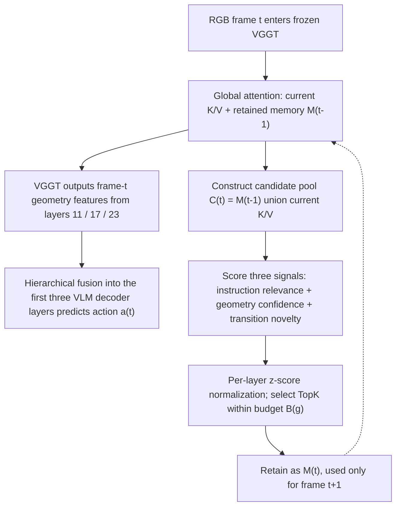
```mermaid
graph TD
    A["RGB frame t enters frozen VGGT"] --> B["Global attention: current K/V + retained memory M(t-1)"]
    B --> C["VGGT outputs frame-t geometry features from layers 11 / 17 / 23"]
    C --> D["Hierarchical fusion into the first three VLM decoder layers predicts action a(t)"]
    B --> E["Construct candidate pool C(t) = M(t-1) union current K/V"]
    E --> F["Score three signals: instruction relevance + geometry confidence + transition novelty"]
    F --> G["Per-layer z-score normalization; select TopK within budget B(g)"]
    G --> H["Retain as M(t), used only for frame t+1"]
    H -.-> B
```

---

#### ④ Training and inference configuration
{: id="-训练与推理配置"}

The paper does not introduce a new loss term - the strategy is jointly performed on the R2R and RxR training sets for standard supervised fine-tuning, which takes about 100 hours / 8× NVIDIA H100. **All parameters and geometric fusion modules of Qwen3.5 participate in the optimization, and VGGT is frozen throughout the process**. The observation end has only a single RGB channel: no panoramic, no odometry, and no depth input (the depth confidence field comes from VGGT's own prediction head, not the sensor).

The process of each step during reasoning is the circle of the mermaid diagram above: VGGT forward → hierarchical fusion → action → scoring and screening KV → brought to the next step. There is no beam search or iterative refinement.

---

### 3. Results and findings
{: id="3-核心结果发现-45"}

**Main list comparison (Val-Unseen, both single RGB streams)**

| Methods | R2R-CE SR/SPL/OS/NE | RxR-CE SR/SPL/nDTW/NE | Additional training data |
|---|---|---|---|
| Uni-NaVid | 47.0 / 42.7 / 53.3 / 5.58 | 48.7 / 40.9 / – / 6.24 | 3577K |
| NaVILA* | 49.7 / 45.5 / 57.6 / 5.37 | 49.3 / 44.0 / 58.8 / 6.77 | 12574K |
| JanusVLN* | 52.8 / 49.2 / 58.0 / **5.17** | 51.4 / 44.3 / 59.1 / 6.46 | 0K |
| **AdaGeoVLN** | **55.7 / 51.4 / 60.7** / 5.27 | **54.1 / 44.7 / 61.8 / 5.64** | **0K** |

Compared with JanusVLN\*, SR/SPL on R2R-CE is +2.9 / +2.2 points respectively, OS rises from 58.0 to 60.7, only NE is slightly worse (5.27 vs. 5.17 m); on RxR-CE, SR +2.7, nDTW +2.7, NE drops directly by 0.82 m. It is worth emphasizing that these figures are based on **zero additional navigation data**, while NaVILA used approximately 12.57 million external samples.

**Depth axis ablation**: Hierarchical fusion is +9.2 / +9.1 (SR/SPL) relative to no geometry strategy, +6.8 / +7.3 relative to single terminal injection, and up to **+13.6 / +14.5** for Deep×3 that matches the number and position. The only exception is NE - the no-geometry strategy is slightly lower (5.19 vs. 5.27 m), indicating that the main improvement of geometry is "success" rather than "how accurate the stop is."

**Timeline ablation**: Under similar KV occupancy, Nav. 900K is 0.6 SR / 1.1 SPL higher than Hybrid Inc.(8+24), while using 3.33% less GFM-KV GPU memory and 9.35% of the total allocated GPU memory; compared to Hybrid Inc.(8+48), it is +0.4 SR / +1.4 SPL, **KV GPU The memory saving is 39.73%, and the total GPU memory saving is 20.22%**. In terms of budget sensitivity, 600K → 800K → 900K corresponds to SR 53.1 → 54.2 → 55.7, SPL 49.2 → 50.2 → 51.4, spending an extra 1142 MB in exchange for 2.6 / 2.2 points, which is a clear accuracy-GPU memory trade-off curve. However, Table IV also honestly points out: **The best values ​​of OS and NE still belong to the baseline preserved by timing**.

<div align="center">
  
<figcaption>
ablation on R2R-CE Val-Unseen. (a) The impact of geometric fusion method on SR/SPL, Deep×3 is significantly lower than the no-geometry baseline; (b) The accuracy of the retention strategy-GPU memory scatter points, the red line connects the three-level budget of 600K/800K/900K, and the lower color bar is the GPU memory savings compared to Hybrid 8+48
</figcaption>
</div>

**Signal contribution (leave one ablation under 900K budget)**: Removing confidence drops the most (SR −2.1), followed by instruction correlation (−1.5) and transition novelty (−1.4), while the difference in KV GPU memory between the four configurations is only 0.20 MB - indicating that the performance change does come from "the right choice" rather than "how much is chosen".

**Qualitative and real robot**: The R2R-CE trajectory selected in the simulation requires leaving the fireplace, climbing the curved stairs, and finally stopping at the bedroom door. AdaGeoVLN passed it, but both Qwen3.5 SFT and JanusVLN failed. The real robot is deployed on Unitree G1, equipped with a ZED

<div align="center">
  
<figcaption>
simulation trajectory and humanoid robot deployment. Top: R2R-CE route that requires climbing stairs, multiple turns and precise stopping, only AdaGeoVLN reaches the target; Bottom: two sets of indoor navigation sequences on Unitree G1, third-person and first-person perspectives aligned according to command fragments
</figcaption>
</div>

---

### 4. Limitations
{: id="4-局限性-45"}

The three retained signals use **equal weight coefficients and are not tuned**. The author clearly states that leaving one ablation can only prove that each signal has a contribution, but cannot prove that the current weight is optimal. The parameter adjustment or learning of the weight is left for future work. In addition, in terms of navigation error NE and oracle success rate OS, the baseline retained in time series is still better, indicating that navigation-aware filtering is exchanged for success rate and path efficiency, rather than stopping accuracy; real robot deployment also relies on remote workstation reasoning, and has not yet achieved onboard real-time.

---

## 56. SeekVLN (2026)
{: id="seekvln"}
—Seek additional evidence before judging progress and choosing the next action

📄 **Paper**: [arXiv:2609.37353v1](https://arxiv.org/abs/2609.37353v1)

---

### Key takeaways
{: id="精华-48"}

A navigation model can remain highly confident even when it chooses the wrong direction, so confidence in an action does not directly measure whether the available evidence is sufficient. SeekVLN makes additional observation a choice available to the policy: first decide whether to navigate directly or look again, then use the new evidence to check completed tasks and the next subgoal. FRG offers a transferable idea: use an offline expert's subsequent actions to work backward and construct observation requirements and evidence labels, providing a cold-start prior for active perception. C2PO compares the short-term progress of “seek, then navigate” and “navigate directly” from the same state, attributing subsequent gains to the observation decision. Together, they show that active perception must learn both when to acquire information and whether that information improves action.

---

### 1. Research background and problem
{: id="1-研究背景问题-47"}

Long-horizon VLN requires repeatedly checking how much of an instruction has been completed. A monocular first-person view may miss a corridor, doorway, or object to the side, and past images may not resolve the ambiguity. The paper calls the situation in which evidence is insufficient and progress judgments have become unreliable, yet the agent confidently continues acting, **Progress Myopia**. Its analysis of NaVILA, StreamVLN, and Aux-Think finds similar action confidence and entropy in matched critical segments of successful and failed episodes. SeekVLN therefore extends reasoning over existing observations to actively acquiring visual evidence relevant to the current subgoal.

---

### 2. Main methods and innovations
{: id="2-主要方法创新点-45"}

<div align="center">
  
<figcaption>Original Figure 2: SeekVLN's dual-mode navigation, offline FRG supervision generation, and C2PO reinforcement fine-tuning. The policy decides whether to seek additional observations; FRG teaches initial seeking and progress reasoning, while C2PO compares branches from the same state to optimize the practical value of seeking.</figcaption>
</div>

**Overall framework.** SeekVLN consists of a dual-mode navigation policy, FRG supervision construction, and C2PO reinforcement fine-tuning. The policy decides whether to look again and outputs actions; FRG constructs mode, progress, and evidence labels from expert trajectories; C2PO updates the policy according to the navigation gains after seeking. The navigation backbone is initialized from **Aux-Think**. **Qwen-VL-Max** is used for offline annotation, rather than as the initialization model for the navigation policy. Training updates the language model and multimodal projector while freezing the vision encoder.

**① Dual-mode navigation: make “look first or move directly” the first decision.**

The inputs are the language instruction, the current RGB image, and sampled historical images. A vision encoder processes the images, which enter the VLM alongside the instruction. The first generated control token chooses between `NAV` and `SEEK`: `<nav>` directly produces action text; `<seek>` pauses navigation while the environment inserts three additional left, front, and right views at relative headings of −90°, 0°, and +90°. After seeking, the model generates a `<think>` segment specifying **completed subtasks, the next subtask, and the key evidence supporting that judgment**, followed by a `<nav>` segment and an action.

Progress grounding links “which part of the instruction have I completed, and which part comes next?” to actual images. Evidence seeking makes that correspondence more reliable. The policy learns mode selection; the paper does not introduce a separate action-confidence threshold detector at the inference entry point.

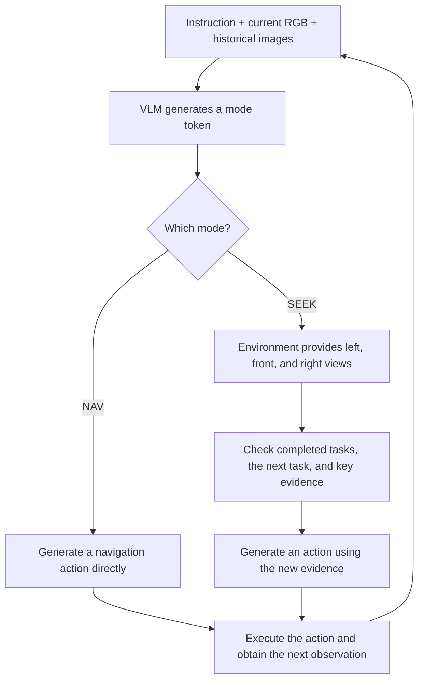
```mermaid
graph TD
    A["Instruction + current RGB + historical images"] --> B["VLM generates a mode token"]
    B --> C{"Which mode?"}
    C -- "NAV" --> D["Generate a navigation action directly"]
    C -- "SEEK" --> E["Environment provides left, front, and right views"]
    E --> F["Check completed tasks, the next task, and key evidence"]
    F --> G["Generate an action using the new evidence"]
    D --> H["Execute the action and obtain the next observation"]
    G --> H
    H --> A
```

Navigation still uses discrete high-level actions: move forward 25, 50, or 75 cm; turn left or right 15°, 30°, or 45°; and stop. A continuous environment means the robot moves in continuous 3D space, rather than that the model outputs continuous control quantities. `SEEK` adds an observation interaction without replacing the existing navigation action set.

**② FRG: use the expert's next moves to work backward and decide what to observe now.**

Future-guided Reverse Generation takes offline expert trajectories, instructions, subgoal lists, and replayed observations as input, and produces decision-level supervision. It first assigns target `SEEK` ratios according to expert actions: 30% for forward motion and cumulative 15° turns, 50% for cumulative 30° turns, 75% for cumulative 45° turns, 100% for other turn angles, and 0% for stop. Turn angles are measured as the **cumulative angle of a consecutive sequence of turns in the same direction**. Decisions are then grouped by forward distance, turning direction, and individual turn angle. Integer quotas and largest-remainder allocation produce a deterministic mode schedule while retaining every expert decision.

> **Example:** A minimal trajectory containing two consecutive 15° right turns forms a cumulative 30° turn segment. The target `SEEK` ratio is therefore 50% for each decision, assigning one `SEEK` label across the two steps, rather than treating each independently with the 30% ratio for 15° turns. This is an offline annotation rule; at runtime there are no future expert actions, and the model chooses its own mode.

For selected `SEEK` states, FRG generates two separate kinds of labels. **Progress annotation** reads the instruction, supplied subgoal list, historical images sampled every two primitive steps, and the current front view. It reasons before extracting completed tasks and the next task. Validation requires the completed tasks to form a contiguous prefix of the instruction and the next task to be the first unfinished subgoal; partial completion does not count as completion. **Evidence annotation** uses the expert action to select current views for the annotator: forward actions and individual 15° turns use the front view, while individual 30°/45° turns add the corresponding side view. Qwen-VL-Max then describes one or two visible cues relevant to the task.

The labels are deliberately separated. Future expert actions guide observation quotas and evidence-view selection, while current and historical observations determine progress labels. This avoids treating “the expert will turn next” as proof that “the current subgoal is complete.” Annotation-time view selection also differs from the actual `SEEK` interaction, which always provides all three left, front, and right views.

The resulting `NAV` samples supervise direct navigation, while `SEEK` samples supervise structured progress, key evidence, and expert actions after additional observation. The appendix reports **4,162 R2R-CE training episodes and 111,141 decision samples**, comprising 68,795 `NAV` and 42,346 `SEEK` samples. This reuses existing expert demonstrations and environment replay without new expert interaction.

**Accounting for the base model's training data.** [Aux-Think §4.2 and Table 1](https://arxiv.org/html/2505.11886v4) identify NVILA-lite-8B as its VLM backbone. The configuration achieving 54.8% SR / 46.9% SPL uses 600K RxR, 500K DAgger, and 500K web samples in addition to R2R data. All four R2R metrics of the Aux-Think baseline in SeekVLN Table 1 match that configuration, supporting an inference that SeekVLN inherits this training configuration. SeekVLN does not separately identify the base checkpoint. **The 111K figure counts the additional FRG samples introduced by this method, rather than the model's cumulative training data.**

**③ Supervised fine-tuning: teach mode selection and the subsequent response separately.**

FRG-SFT uses a separate mode loss and a weighted response loss:

$$
\mathcal L_{\mathrm{SFT}}=\lambda_{\mathrm{mode}}\mathcal L_{\mathrm{mode}}+\mathcal L_{\mathrm{resp}}.
$$

$$
\mathcal L_{\mathrm{mode}}=-\frac{1}{\lvert D_{\mathrm{prior}}\rvert}\sum_t\log\frac{\exp z_{t,m_t^*}}{\exp z_{t,\mathrm{NAV}}+\exp z_{t,\mathrm{SEEK}}}.
$$

The mode loss normalizes only over the two mode tokens, preventing the training signal for a brief mode decision from being overwhelmed by a long response. The response loss is:

$$
\mathcal L_{\mathrm{resp}}=-\frac{1}{N_{\mathrm{valid}}}\sum_t\sum_i\mu_{t,i}\omega_{t,i}\log\pi_\theta(y_{t,i}\mid x_t,y_{t,<i}).
$$

Here, $\mu_{t,i}$ selects the tokens to supervise, and $\omega_{t,i}$ upweights structural tokens. Content inserted by the environment between `<seek>` and `</seek>` is excluded from model generation targets, while `</seek>` and `<think>` remain supervised during SFT. The reported SFT learning rate is $2\times10^{-5}$. Inputs include the current image and up to eight historical frames, with additional views in `SEEK` mode.

**④ C2PO: provide comparable feedback on whether an extra look helped.**

Counterfactual Contrastive Policy Optimization addresses the delayed nature of terminal goal rewards, which makes it difficult to determine whether a particular observation was worthwhile. It runs two choices from the same state and compares their short-term consequences. When the main trajectory triggers `SEEK`, the trainer clones the simulator state, observation history, and model context. The factual branch seeks first; the counterfactual branch forces its first mode to `NAV`. Both branches then use the same current policy and each execute $H$ primitive actions. Their progress difference supplies a reward for the observation decision.

Let $\Delta d_h^b$ denote the normalized reduction in geodesic distance to the goal after primitive action $h$ in branch $b$. Then:

$$
r_t^{\mathrm{cf}}=
\begin{cases}
w\,\operatorname{clip}\!\left(\sum_{h=1}^{H}\gamma_{\mathrm{cf}}^{h-1}\left(\Delta d_h^{\mathrm{seek}}-\Delta d_h^{\mathrm{nav}}\right),-0.2,0.2\right),&m_t=\mathrm{SEEK},\\
0,&m_t=\mathrm{NAV}.
\end{cases}
$$

> **Example:** For a hand calculation only, compare two steps with both the discount and weight set to 1. Suppose “seek, then navigate” reduces normalized distance by 0.08 and 0.04, while “navigate directly” produces 0.02 and −0.01. The progress difference is $(0.08-0.02)+(0.04+0.01)=0.11$. It lies within the clipping range, so the observation decision receives a reward of 0.11. Equal branch progress gives zero reward, and worse progress after seeking gives a negative reward. These are teaching values, rather than reported branch hyperparameters or measured results.

Training also adds an outcome reward at the end of an episode: $1+0.2\,\mathrm{SPL}$ for success and −0.5 for failure, with zero outcome reward at other decisions. The total reward is $r_t=r_t^{\mathrm{cf}}+r_t^{\mathrm{out}}$. The local term measures whether seeking improves subsequent navigation; the global term retains task completion and path efficiency objectives. Decision-level PPO treats a complete response as a policy action, with adaptive KL regularization against the frozen SFT policy. There is no additional per-decision action penalty. Thus, the reward measures navigation progress gains without directly pricing scan time or energy use.

Reinforcement fine-tuning uses 640 R2R-CE training episodes over 20 updates, with 32 episodes per update. Actor and critic learning rates are $4\times10^{-6}$ and $10^{-5}$, respectively, on eight NVIDIA RTX 6000D GPUs. Counterfactual branches are sampled only during reinforcement fine-tuning.

**⑤ Inference and deployment: continue closed-loop navigation after seeking when needed.**

At inference, the policy receives the instruction and actual observations, then generates a mode. `NAV` executes an action directly. `SEEK` obtains three additional views, generates progress and evidence text, and then executes a navigation action before updating the observation history. Evaluation does not run additional counterfactual branches, but `SEEK` still requires acquiring new views and processing extra images and text. Real-world deployment uses a Unitree Go2 client and a remote GPU inference server. Go2 turns in place to acquire views, transfers images and discrete actions through an SSH tunnel and HTTP, and uses a local controller to validate and execute actions.

<div align="center">
  
<figcaption>Original Figure 4: Two active observation decisions in a simulated trajectory. The model first identifies a dining table and chairs in the left view, then locates a corridor beyond the kitchen island in the right view, using the new cues to check progress and choose a turn.</figcaption>
</div>

---

### 3. Main results and findings
{: id="3-核心结果发现-46"}

**Main results: both training stages contribute, and the gains in the abstract are percentage points.** Experiments use **Val-Unseen** on R2R-CE and RxR-CE in Habitat / Matterport3D. The policy uses monocular RGB without a depth sensor and adds side observations when `SEEK` is triggered. The table below reproduces original Table 1. SR measures success at the final position, SPL accounts for both success and path length, NE is the final geodesic distance to the goal, and nDTW measures agreement with the reference route.

| Method | R2R-CE SR (%) | R2R-CE SPL (%) | R2R-CE NE (m) | RxR-CE SR (%) | RxR-CE SPL (%) | RxR-CE NE (m) | RxR-CE nDTW (%) |
|---|---:|---:|---:|---:|---:|---:|---:|
| Aux-Think (base model) | 54.8 | 46.9 | 6.08 | 52.2 | 40.2 | 6.24 | Not reported |
| NavFoM | 56.2 | 51.2 | 5.01 | 57.4 | 49.4 | 5.51 | 60.2 |
| Progress-Think | 60.1 | 53.6 | 4.68 | Not reported | Not reported | Not reported | Not reported |
| SeekVLN-FRG-SFT | 61.0 | 55.9 | 4.7 | 55.7 | 47.4 | 5.8 | 62.3 |
| SeekVLN-C2PO-RFT | **67.5** | **61.4** | **3.7** | **59.7** | **50.3** | **4.9** | **63.6** |

Relative to Aux-Think, the full method gains **12.7 SR points and 14.5 SPL points** on R2R-CE, and **7.5 SR points and 10.1 SPL points** on RxR-CE. C2PO alone adds 6.5/4.0 SR points over SFT. The final model has the best SR/SPL among the methods listed in the paper's Table 1; comparisons still need to account for the additional information and cost of active observation.

**More frequent observation is not always better.** On a subset of 100 R2R-CE Val-Unseen episodes, the authors intervene on the same trained policy by forcing different mode tokens:

| Triggering strategy | SEEK ratio | SR (%) | SPL (%) |
|---|---:|---:|---:|
| Never Seek: always navigate directly | 0% | 52 | 48 |
| Periodic Seek: seek every two decisions | 50% | 62 | 53 |
| Adaptive Seek: let the policy decide | 29.8% | **73** | **67** |

These are intervention results on a **100-episode subset**. The 73% score cannot be treated as SR on the full main evaluation. Adaptive seeking observes less often than periodic seeking while navigating better, supporting the value of acquiring evidence at suitable locations.

<div align="center">
  
<figcaption>Original Figure 3: Left, comparison of three seeking strategies; middle, beneficial action change rate (BACR) increases during reinforcement training; right, the mean short-term progress gain of seeking over direct navigation increases.</figcaption>
</div>

The authors define **BACR (Beneficial Action Change Rate)** as the proportion of states in which seeking changes the next action and improves short-term progress relative to navigating directly. The denominator is all states that trigger `SEEK`. BACR rises from 45.6% to 55.9%, while the mean short-term progress difference increases from $6.4\times10^{-3}$ to $16.1\times10^{-3}$. Evaluation therefore checks both whether an action changes and whether the change produces a subsequent gain.

**Ablations: progress reasoning, evidence, and counterfactual rewards each contribute.** The following evaluations use a deduplicated subset of **613 R2R-CE Val-Unseen routes**, retaining only one instruction per expert route. These results cannot be mixed directly with the main table:

| Variant | SR (%) | SPL (%) | SEEK ratio |
|---|---:|---:|---:|
| Base Aux-Think | 52.0 | 45.0 | Not reported |
| FRG without evidence-seeking supervision | 58.6 | 53.3 | Not reported |
| FRG without progress-reasoning supervision | 58.7 | 53.0 | Not reported |
| Full FRG-SFT | 60.7 | 55.8 | 15.9% |
| Reinforcement fine-tuning without counterfactual rewards | 65.1 | 60.4 | 34.3% |
| Full C2PO | **68.5** | **62.4** | **29.3%** |

Removing counterfactual rewards retains the outcome reward and other reinforcement fine-tuning settings. Adding counterfactual rewards further improves SR/SPL while reducing the seeking ratio from 34.3% to 29.3%, indicating that more selective observation can improve navigation. Values retain the paper's one-decimal presentation.

<div align="center">
  
<figcaption>Original Figure 5: Go2 triggers SEEK at the end of a corridor, discovers a chair on the left through a side view, then turns and reaches the target. The word “left” is crossed out in red to indicate removal of the explicit turning cue. This is a qualitative real-world demonstration; the paper does not report systematic real-world success rates or latency statistics.</figcaption>
</div>

---

### 4. Limitations
{: id="4-局限性-46"}

FRG depends on heuristic seeking quotas and VLM annotation. C2PO requires a simulator with clonable states and geodesic-distance feedback. Training does not directly account for the time, compute, or energy cost of observation, and the paper does not specify numerical values for branch horizon $H$, counterfactual discount, or reward weight, leaving gaps in reproducibility and cost-benefit assessment. Real-world evidence is mainly qualitative, without large-scale success rates, latency statistics, or comparisons matched for perception cost. Deployment across scenes needs further validation.

---

# References
{: id="参考资料"}

## Published papers (conference/journal)
{: id="已发表论文会议--期刊"}

The following table organizes papers with publication information tagged by conference or journal, and retains cross-page indexes of some extended papers:

| Conference/Journal | Paper |
|---|---|
| **CVPR** | [VLN-Imagine](#vln-imagine) (2025)、[Slow4fast-VLN](#slow4fast-vln) (2026)、[AwareVLN](#awarevln) (2026)、[GA-VLN](#ga-vln) (2026)、[HSGM](#hsgm) (2026)、[DecoVLN](#decovln) (2026)、[R2R](#r2r) (2018, Spotlight)、[DUET](#duet) (2022) |
| **ICLR** | [NavFoM](#navfom) (2026)、[JanusVLN](#janusvln) (2026)、[OmniNav](#omninav) (2026, Poster)、[TuckerNav](#tuckernav) (2026)、[Uncertainty-Aware Gaussian Map](#uncertainty-aware-gaussian-map) (2026)、[DualVLN](#dualvln) (2026) |
| **ICRA** | [NoMaD](/en/VLN-Papers-Extended/#nomad) (2024)、[VLFM](/en/VLN-Papers-Extended/#vlfm) (2024)、[Open-Nav](#open-nav) (2025)、[NavDP](/en/VLN-Papers-Extended/#navdp) (2026)、[StreamVLN](#streamvln) (2026) |
| **ECCV** | [VLN-CE](#vln-ce) (2020)、[NavGPT-2](#navgpt-2) (2024)、[AgentVLN](#agentvln) (2026)、[Route2Step](#route2step) (2026) |
| **AAAI** | [ODYSSEY](/en/VLN-Papers-Extended/#odyssey) (2026)、[CorrectNav](#correctnav) (2026)、[R³](#r3) (2026)、[PanoNav](/en/VLN-Papers-Extended/#panonav) (2026, Poster) |
| **ICCV** | [VLN-PE](#vln-pe) (2025) |
| **ACL** | [MapNav](#mapnav) (2025) |
| **RSS** | [NaVid](#navid) (2024) |
| **IROS** | [ReflectVLN](#reflectvln) (2026) |
| **CoRL** | [X-NavDP](#x-navdp) (2026) |
| **RO-MAN** | [R2RIE-CE & IEDL](#r2rie-ce-iedl) (2024) |
| **Journal** | [GaussNav](/en/VLN-Papers-Extended/#gaussnav) (IEEE TPAMI 2025), [CausalNav](#causalnav) (IEEE RA-L), [HumanoidVLN](#humanoidvln) (IEEE RA-L), [Skill-Nav](/en/VLN-Papers-Extended/#skill-nav) (Vicinagearth / Springer 2025), [CA-VLN](#ca-vln) (Sensors 2026) |

## Paper references
{: id="论文引用"}

1. **R2R** (2018). Vision-language navigation benchmark and sequence-to-sequence baseline in real indoor environments. arXiv: [1711.07280](https://arxiv.org/abs/1711.07280) · CVPR 2018 (Spotlight)
2. **VLN-CE** (2020). Beyond the Nav-Graph: vision-language navigation in continuous environments. arXiv: [2004.02857](https://arxiv.org/abs/2004.02857) · ECCV 2020
3. **DUET** (2022). Discrete topology vision-language navigation based on dual-scale graph Transformer. arXiv: [2202.11742](https://arxiv.org/abs/2202.11742) · CVPR 2022 · Code: [cshizhe/VLN-DUET](https://github.com/cshizhe/VLN-DUET)
4. **R2RIE-CE & IEDL** (2024). The first continuous navigation command error benchmark and a multi-modal error detection and localization framework incorporating command-trajectory compatibility. arXiv: [2403.10700](https://arxiv.org/abs/2403.10700) · ROMAN 2024
5. **NaVid** (2024). The first monocular continuous vision-language navigation model based on large video models that does not rely on maps. arXiv: [2402.15852](https://arxiv.org/abs/2402.15852) · RSS 2024 · Code: [jzhzhang/NaVid-VLN-CE](https://github.com/jzhzhang/NaVid-VLN-CE)
6. **NavGPT-2** (2024). Unleashing the navigational reasoning power of large visual language models. arXiv: [2407.12366](https://arxiv.org/abs/2407.12366) · ECCV 2024 · Code: [GengzeZhou/NavGPT-2](https://github.com/GengzeZhou/NavGPT-2)
7. **DualVLN/InternVLN** (2025). Ground Slow, Move Fast: end-to-end continuous navigation with world model and fast-slow dual system. arXiv: [2512.08186](https://arxiv.org/abs/2512.08186) · ICLR 2026 · Code: [InternRobotics/InternNav](https://github.com/InternRobotics/InternNav)
8. **VLN-R1** (2025). End-to-end navigation based on GRPO and Time-Decayed Reward. arXiv: [2506.17221](https://arxiv.org/abs/2506.17221) · Data: [Qi-Zhangyang/GPT4Scene-and-VLN-R1](https://github.com/Qi-Zhangyang/GPT4Scene-and-VLN-R1) (only open source training data and data generation code)
9. **StreamVLN** (2025). Streaming vision-language navigation via slow-fast context modeling. arXiv: [2507.05240](https://arxiv.org/abs/2507.05240) · ICRA 2026 · Code: [OpenRobotLab/StreamVLN](https://github.com/OpenRobotLab/StreamVLN)
10. **NavFoM** (2025). Embodied Navigation Foundation Model. arXiv: [2509.12129](https://arxiv.org/abs/2509.12129) · ICLR 2026
11. **MapNav** (2025). A Novel Memory Representation via Annotated Semantic Maps for Vision-and-Language Navigation. arXiv: [2502.13451](https://arxiv.org/abs/2502.13451) · ACL 2025 · Code: [linglingxiansen/MapNav](https://github.com/linglingxiansen/MapNav)
12. **Open-Nav** (2025). Zero-Shot VLN in Continuous Environment with Open-Source LLMs. arXiv: [2409.18794](https://arxiv.org/abs/2409.18794) · ICRA 2025
13. **VLN-Imagine** (2025). Use text-generated image models to build "visual imagination" for navigation agents. arXiv: [2503.16394](https://arxiv.org/abs/2503.16394) · CVPR 2025 · Code: [akhilperincherry/VLN-Imagine](https://github.com/akhilperincherry/VLN-Imagine)
14. **VLN-PE** (2025). Rethinking the embodiment gap in vision-language navigation: A comprehensive study of physical and visual differences. arXiv: [2507.13019v2](https://arxiv.org/abs/2507.13019v2) · ICCV 2025
15. **Goal2Pixel** (2025). Ground navigation goals to image pixels to unify the decision space of VLN-CE with pixel prediction. arXiv: [2606.01621](https://arxiv.org/abs/2606.01621)
16. **AstraNav-World** (2025). Unify "imagining the future" and "planning the future" into the same generative probability framework. arXiv: [2512.21714](https://arxiv.org/abs/2512.21714) · Code: [amap-cvlab/AstraNav-World](https://github.com/amap-cvlab/AstraNav-World)
17. **CorrectNav** (2025). Monocular RGB vision-language-action navigation model empowered by self-error correction flywheel. arXiv: [2508.10416](https://arxiv.org/abs/2508.10416) · AAAI 2026 · Code: [owlet914/CorrectNav](https://github.com/owlet914/CorrectNav)
18. **Slow4fast-VLN** (2026). General Vision-Language Navigation via Fast-Slow Interactive Reasoning. arXiv: [2601.09111v1](https://arxiv.org/abs/2601.09111v1) · CVPR 2026 · Code: [yl6017339/Slow4Fast-VLN](https://github.com/yl6017339/Slow4Fast-VLN)
19. **DGNav** (2026). Dynamic topology awareness: breaking granular rigidity in vision-language navigation. arXiv: [2601.21751](https://arxiv.org/abs/2601.21751) · Code: [shannanshouyin/DGNav](https://github.com/shannanshouyin/DGNav)
20. **CausalNav** (2026). First Scene Graph-based Semantic Navigation for Dynamic Outdoor Environments. arXiv: [2601.01872](https://arxiv.org/abs/2601.01872) · IEEE RA-L
21. **AgentVLN** (2026). Towards Agentic Vision-and-Language Navigation. arXiv: [2603.17670](https://arxiv.org/abs/2603.17670) · ECCV 2026 · Code: [Allenxinn/AgentVLN](https://github.com/Allenxinn/AgentVLN)
22. **VLN-Cache** (2026). Enabling Token Caching for VLN Models with Visual/Semantic Dynamics Awareness. arXiv: [2603.07080](https://arxiv.org/abs/2603.07080)
23. **R³: Run, Ruminate, and Regulate** (2026). A dual-process thinking framework for vision-language navigation. arXiv: [2511.14131](https://arxiv.org/abs/2511.14131) · AAAI 2026 · Code (to be released): [IAII-CAS/navigation_R3](https://github.com/IAII-CAS/navigation_R3)
24. **AwareVLN** (2026). Reasoning with Self-awareness for Vision-Language Navigation. arXiv: [2605.22816](https://arxiv.org/abs/2605.22816) · CVPR 2026 · Code: [GWxuan/AwareVLN](https://github.com/GWxuan/AwareVLN)
25. **Dual-Anchoring** (2026). Use "instruction progress" and "landmark memory" dual anchoring to combat state drift (State Drift) in VLN. arXiv: [2604.17473](https://arxiv.org/abs/2604.17473)
26. **JanusVLN** (2026). Decoupling semantics and space: vision-language navigation using dual implicit neural memory. arXiv: [2509.22548v2](https://arxiv.org/abs/2509.22548v2) · ICLR 2026 · Code: [MIV-XJTU/JanusVLN](https://github.com/MIV-XJTU/JanusVLN)
27. **HSGM** (2026). Hierarchical semantic-geometric map, filling the gap between VLM 2D vision and 3D spatial reasoning and motion planning. arXiv: [2606.00095](https://arxiv.org/abs/2606.00095) · CVPR 2026 · Code: [Teacher-Tom/HSGM_public](https://github.com/Teacher-Tom/HSGM_public)
28. **OneVLA** (2026). The first VLA model to unify embodied navigation and operation under a single network and action head. arXiv: [2606.01241](https://arxiv.org/abs/2606.01241) · Code: [linglingxiansen/OneVLA](https://github.com/linglingxiansen/OneVLA)
29. **CA-VLN** (2026). Multimodal large model embodied navigation framework based on dual-agent collaboration. DOI: [10.3390/s26041254](https://doi.org/10.3390/s26041254) · Sensors 2026
30. **RynnBrain** (2026). Open Spatiotemporal Foundation Model for Embodied Intelligence. arXiv: [2602.14979](https://arxiv.org/abs/2602.14979) · Code: [alibaba-damo-academy/RynnBrain](https://github.com/alibaba-damo-academy/RynnBrain)
31. **OmniNav** (2026). Use fast-slow dual system to unify point target, object target, instruction-following navigation and frontier exploration. arXiv: [2509.25687](https://arxiv.org/abs/2509.25687) · ICLR 2026 (Poster) · Code: [amap-cvlab/OmniNav](https://github.com/amap-cvlab/OmniNav)
32. **Qwen-RobotNav** (2026). The first unified large-scale model of multi-task, spatio-temporal reconfigurable embodied navigation. arXiv: [2606.18112](https://arxiv.org/abs/2606.18112)
33. **GA-VLN** (2026). Geometry-Aware BEV Representation for Efficient Vision-Language Navigation. arXiv: [2605.22036](https://arxiv.org/abs/2605.22036) · CVPR 2026 · Code: [jahhaoyang/GA-VLN](https://github.com/jahhaoyang/GA-VLN)
34. **SEDualVLN** (2026). Spatially enhanced dual-system continuous environment vision-language navigation framework. arXiv: [2605.17249](https://arxiv.org/abs/2605.17249) · Project Page: [kim-os.github.io/SEDualVLN](https://kim-os.github.io/SEDualVLN/)
35. **Robostral Navigate** (2026). 8B vision-language navigation large model using only monocular RGB camera: ultra-efficient simulation training and online reinforcement learning. arXiv: [2607.20785](https://arxiv.org/abs/2607.20785)
36. **ABot-N1** (2026). Universal vision-language navigation foundation model based on slow cognitive and fast control dual system architecture. arXiv: [2607.10383v2](https://arxiv.org/abs/2607.10383v2) · Benchmark: [amap-cvlab/ABot-Navigation (ABotN-Bench)](https://github.com/amap-cvlab/ABot-Navigation/tree/ABotN-Bench)
37. **ReflectVLN** (2026). Embodied vision-language navigation based on reflective reasoning and two-way interaction mechanism. arXiv: [2607.12680](https://arxiv.org/abs/2607.12680) · IROS 2026
38. **TuckerNav** (2026). Tucker tensor adaptation for all-weather multi-scenario lifelong embodied vision-language navigation. arXiv: [2603.14276](https://arxiv.org/abs/2603.14276) · ICLR 2026
39. **AgenticNav** (2026). Refactoring zero-shot continuous environment navigation (VLN-CE) into a VLM callable Tool-Calling architecture. arXiv: [2606.10577](https://arxiv.org/abs/2606.10577)
40. **MemVLN** (2026). An efficient continuous environment vision-language navigation framework that simulates human dual memory mechanism. arXiv: [2607.23504](https://arxiv.org/abs/2607.23504)
41. **X-NavDP** (2026). Intra-group Q-value weighted Diffusion RL reinforcement learning fine-tuning framework for universal visual navigation of multi-configuration robots. arXiv: [2607.28560](https://arxiv.org/abs/2607.28560) · CoRL 2026 · Code: [InternRobotics/NavDP](https://github.com/InternRobotics/NavDP)
42. **Image2Sim** (2026). A real-time neural simulation engine that decouples 3D spatial anchoring and hyper-realistic image synthesis. arXiv: [2607.05765](https://arxiv.org/abs/2607.05765) · Code: [MrZihan/Image2Sim](https://github.com/MrZihan/Image2Sim)
43. **DecoVLN** (2026). Decoupling Observation, Reasoning, and Correction for Vision-and-Language Navigation. arXiv: [2603.13133](https://arxiv.org/abs/2603.13133) · CVPR 2026 · Code (to be released): [Allenxinn/DecoVLN](https://github.com/Allenxinn/DecoVLN)
44. **TAMP-Nav** (2026). Point, Think, Memorize, and Align for Efficient Navigation. arXiv: [2608.17512](https://arxiv.org/abs/2608.17512) · Code: [ZJU-OmniAI/Embodied-Omni](https://github.com/ZJU-OmniAI/Embodied-Omni)
45. **LightNav-0** (2026). "Bring out" the existing spatial intelligence of VLM instead of plugging in a navigation module. arXiv: [2608.30935](https://arxiv.org/abs/2608.30935) · Code: [lightorigins/LightNav-0](https://github.com/lightorigins/LightNav-0)
46. **Uncertainty-Aware Gaussian Map for VLN** (2026). Three types of perceived uncertainty × Semantic Gaussian Map, giving VLN agents reliable decision-making capabilities. arXiv: [2607.13500](https://arxiv.org/abs/2607.13500) · ICLR 2026 · Code (to be released): [Gaozzzz/Uncertainty-Aware-VLN](https://github.com/Gaozzzz/Uncertainty-Aware-VLN)
47. **HarnessVLN** (2026). A set of Agent Harness that compresses the two types of navigation "instruction following" and "finding objects" into the same tool calling protocol. arXiv: [2609.15195](https://arxiv.org/abs/2609.15195)
48. **GroundingVLN** (2026). Make visual grounding a shared interface between "thinking" and "walking". arXiv: [2609.18581](https://arxiv.org/abs/2609.18581)
49. **GPT-6-Astra** (2026). The general foundation model only relies on monocular RGB and primitive actions, and runs through the continuous environment vision-language navigation with zero-shot. arXiv: [2609.29861v2](https://arxiv.org/abs/2609.29861v2)
50. **BudVLN** (2026). Nipping the Drift in the Bud: Retrospective Rectification for Robust Vision-Language Navigation. arXiv: [2602.06356](https://arxiv.org/abs/2602.06356)
51. **Route2Step** (2026). Decouple semantic progress and local execution to empower embodied navigation corrective through explicit step-level interfaces. arXiv: [2608.03143](https://arxiv.org/abs/2608.03143) · ECCV 2026
52. **PROSPECT** (2026). Streaming VLA + latent space prediction: preview the future during training, zero overhead during inference. arXiv: [2603.03739](https://arxiv.org/abs/2603.03739)
53. **MacroAction-VLN** (2026). Continuous environment closed-loop reinforcement learning fine-tuning based on topological graph macro-action hierarchical MDP and action-aware Critic. arXiv: [2609.03906](https://arxiv.org/abs/2609.03906)
54. **HumanoidVLN** (2026). The first physically realistic VLN simulation platform and benchmark for diverse bipedal humanoid robots. arXiv: [2608.12860](https://arxiv.org/abs/2608.12860) · IEEE RA-L
55. **AdaGeoVLN** (2026). Make geometric trade-offs along the two axes of "representation depth" and "navigation time". arXiv: [2609.18789](https://arxiv.org/abs/2609.18789)
56. **SeekVLN** (2026). Seek Before You Move: Evidence Seeking for Progress Grounding in Vision-Language Navigation. arXiv: [2609.37353v1](https://arxiv.org/abs/2609.37353v1)
{: .paper-references}


<script>
(function () {
  var TAG_MAP = [
    { m: 'DualVLN/InternVLN', t: ['Dual systems', 'Diffusion models', 'Continuous environments', 'Real-robot deployment'] },
    { m: 'X-NavDP',               t: ['Diffusion models', 'Reinforcement learning', 'Continuous environments', 'Real-robot deployment'] },
    { m: 'VLN-R1',            t: ['End-to-end', 'Reinforcement learning', 'Continuous environments'] },
    { m: 'Slow4fast-VLN',     t: ['Dual systems', 'Topological maps', 'Discrete environments'] },
    { m: 'StreamVLN',         t: ['End-to-end', 'Inference optimization', 'Continuous environments', 'Real-robot deployment'] },
    { m: 'NavFoM',            t: ['End-to-end', 'Continuous environments'] },
    { m: 'DGNav',             t: ['Topological maps', 'SLAM', 'Continuous environments'] },
    { m: 'MapNav',            t: ['Topological maps', 'SLAM', 'Inference optimization', 'Continuous environments'] },
    { m: 'Open-Nav',          t: ['Agentic', 'Zero-shot', 'Continuous environments'] },
    { m: 'CausalNav',         t: ['Agentic', 'Topological maps'] },
    { m: 'AgentVLN',          t: ['Agentic', 'Continuous environments', 'Real-robot deployment'] },
    { m: 'VLN-Cache',         t: ['Inference optimization'] },
    { m: 'VLN-Imagine',       t: ['Data augmentation', 'Discrete environments'] },
    { m: 'R³: Run, Ruminate, and Regulate', t: ['Dual systems', 'Inference optimization', 'CoT'] },
        { m: 'AwareVLN',              t: ['End-to-end', 'Continuous environments', 'Real-robot deployment', 'Data augmentation', 'CoT'] },
        { m: 'Dual-Anchoring',        t: ['End-to-end', 'World models', 'Continuous environments', 'Real-robot deployment'] },
        { m: 'JanusVLN',              t: ['Dual systems', 'Continuous environments', 'Real-robot deployment', 'Inference optimization'] },
        { m: 'HSGM',                  t: ['Agentic', 'Topological maps', 'Zero-shot', 'Continuous environments', 'BEV'] },
        { m: 'OneVLA',                t: ['End-to-end', 'Diffusion models', 'Continuous environments', 'Real-robot deployment'] },
        { m: 'CA-VLN',                t: ['Agentic', 'Topological maps', 'Discrete environments'] },
        { m: 'Goal2Pixel',            t: ['End-to-end', 'Continuous environments', 'Real-robot deployment', 'Inference optimization'] },
        { m: 'OmniNav',               t: ['Dual systems', 'Agentic', 'CoT', 'Diffusion models', 'Real-robot deployment'] },
        { m: 'AstraNav-World',        t: ['World models', 'Diffusion models', 'End-to-end', 'Continuous environments', 'Real-robot deployment'] },
        { m: 'Qwen-RobotNav',         t: ['Agentic', 'End-to-end', 'Continuous environments', 'Real-robot deployment'] },
        { m: 'GA-VLN',                t: ['End-to-end', 'Continuous environments', 'Real-robot deployment', 'Inference optimization', 'BEV'] },
        { m: 'SEDualVLN',             t: ['Dual systems', 'Agentic', 'Continuous environments'] },
        { m: 'R2RIE-CE & IEDL',       t: ['Continuous environments', 'Datasets'] },
        { m: 'Robostral Navigate',    t: ['End-to-end', 'Reinforcement learning', 'Continuous environments', 'Inference optimization'] },
        { m: 'ABot-N1',               t: ['Dual systems', 'CoT', 'Reinforcement learning', 'Real-robot deployment', 'Datasets'] },
        { m: 'ReflectVLN',            t: ['Dual systems', 'Agentic', 'CoT', 'Continuous environments'] },
        { m: 'CorrectNav',            t: ['End-to-end', 'Continuous environments', 'Real-robot deployment'] },
        { m: 'TuckerNav', t: ['Continuous environments', 'Inference optimization'] },
        { m: 'AgenticNav', t: ['Agentic', 'Zero-shot', 'Continuous environments', 'Real-robot deployment'] },
        { m: 'R2R',                   t: ['Discrete environments', 'Datasets'] },
        { m: 'DUET',                  t: ['Topological maps', 'End-to-end', 'Discrete environments'] },
        { m: 'NaVid',                 t: ['End-to-end', 'Continuous environments', 'Real-robot deployment', 'Zero-shot'] },
        { m: 'MemVLN',                t: ['End-to-end', 'Continuous environments', 'Inference optimization'] },
        { m: 'Image2Sim',             t: ['World models', 'Data augmentation', 'Gaussian representations', 'Continuous environments', 'Real-robot deployment', 'Zero-shot'] },
        { m: 'DecoVLN',               t: ['End-to-end', 'Continuous environments', 'Real-robot deployment', 'Inference optimization', 'Error correction'] },
        { m: 'TAMP-Nav',              t: ['CoT', 'Reinforcement learning', 'Continuous environments', 'Real-robot deployment'] },
        { m: 'LightNav-0',            t: ['End-to-end', 'Continuous environments', 'Real-robot deployment', 'Reinforcement learning', 'Zero-shot', 'CoT', 'Datasets'] },
        { m: 'HarnessVLN',            t: ['Agentic', 'Zero-shot', 'Real-robot deployment', 'Topological maps'] },
        { m: 'GroundingVLN',          t: ['Dual systems', 'CoT', 'Reinforcement learning', 'Continuous environments', 'Real-robot deployment', 'Datasets'] },
        { m: 'GPT-6-Astra',           t: ['Agentic', 'Zero-shot', 'Continuous environments'] },
    { m: 'VLN-CE',            t: ['Datasets', 'Continuous environments', 'Foundational work'] },
    { m: 'VLN-PE',            t: ['Datasets', 'Continuous environments', 'Foundational work'] },
    { m: 'RynnBrain',         t: ['Foundational work'] },
    { m: 'Uncertainty-Aware Gaussian Map for VLN', t: ['Gaussian representations', 'Topological maps', 'Discrete environments'] },
    { m: 'BudVLN',            t: ['End-to-end', 'Reinforcement learning', 'Continuous environments'] },
    { m: 'NavGPT-2',          t: ['Agentic', 'Topological maps', 'Discrete environments', 'CoT'] },
    { m: 'Route2Step',               t: ['Dual systems', 'Continuous environments', 'Real-robot deployment'] },
    { m: 'PROSPECT',              t: ['End-to-end', 'World models', 'Continuous environments', 'Real-robot deployment'] },
    { m: 'MacroAction-VLN',       t: ['Topological maps', 'Reinforcement learning', 'Continuous environments'] },
    { m: 'HumanoidVLN',              t: ['Datasets', 'Reinforcement learning', 'Real-robot deployment', 'Gaussian representations'] },
    { m: 'AdaGeoVLN',             t: ['End-to-end', 'Continuous environments', 'Real-robot deployment', 'Inference optimization'] },
    { m: 'SeekVLN', t: ['CoT', 'Reinforcement learning', 'Continuous environments', 'Real-robot deployment'] },
  ];


  var REMOTE_PAGE = { url: '/en/VLN-Papers-Extended/', label: 'Goal navigation and extensions' };
  var REMOTE_PAPERS = [
    { n: '1. VLFM (2023)', a: 'vlfm', t: ['SLAM', 'Zero-shot', 'Real-robot deployment'] },
    { n: '2. NoMaD (2023)', a: 'nomad', t: ['End-to-end', 'Diffusion models', 'Zero-shot', 'Real-robot deployment'] },
    { n: '3. NAVCON (2024)', a: 'navcon', t: ['Datasets', 'Continuous environments', 'Discrete environments'] },
    { n: '4. LoGoPlanner (2025)', a: 'logoplanner', t: ['End-to-end', 'Diffusion models', 'Continuous environments', 'Real-robot deployment'] },
    { n: '5. VL-Nav (2025)', a: 'vl-nav', t: ['End-to-end', 'Zero-shot', 'Real-robot deployment'] },
    { n: '6. GaussNav (2025)', a: 'gaussnav', t: ['SLAM', 'Gaussian representations'] },
    { n: '7. NavDP (2025)', a: 'navdp', t: ['End-to-end', 'Diffusion models', 'Continuous environments', 'Zero-shot', 'Real-robot deployment'] },
    { n: '8. PanoNav (2025)', a: 'panonav', t: ['Agentic', 'Zero-shot', 'Discrete environments'] },
    { n: '9. ODYSSEY (2025)', a: 'odyssey', t: ['Agentic', 'Real-robot deployment'] },
    { n: '10. Skill-Nav (2025)', a: 'skill-nav', t: ['End-to-end', 'Reinforcement learning', 'Real-robot deployment'] },
    { n: '11. FantasyVLN (2026)', a: 'fantasyvln', t: ['World models', 'Data augmentation', 'Continuous environments', 'CoT'] },
    { n: '12. SparseVideoNav (2026)', a: 'sparsevideonav', t: ['End-to-end', 'Diffusion models', 'World models'] },
    { n: '13. WorldVLN (2026)', a: 'worldvln', t: ['World models', 'Reinforcement learning', 'End-to-end', 'Real-robot deployment'] },
    { n: '14. NavWAM (2026)', a: 'navwam', t: ['World models', 'Diffusion models', 'Continuous environments', 'Real-robot deployment'] },
    { n: '15. Agentic Embodied Control (2026)', a: 'agentic-embodied-control', t: ['Agentic', 'Zero-shot', 'Continuous environments', 'Real-robot deployment'] },
    { n: '16. CONDVLN (2026)', a: 'condvln', t: ['Datasets', 'Continuous environments', 'Topological maps'] },
    { n: '17. ReMEmbR (2024)', a: 'remembr', t: ['Agentic', 'Real-robot deployment', 'Datasets', 'Continuous environments'] },
    { n: '18. SuperMap (2026)', a: 'supermap', t: ['SLAM', 'Topological maps', 'Zero-shot', 'Real-robot deployment', 'Agentic'] },
    { n: '19. GSMem (2026)', a: 'gsmem', t: ['Agentic', 'Gaussian representations', 'Zero-shot'] },
    { n: '20. Qwen-Drive (2026)', a: 'qwen-drive', t: ['End-to-end', 'Diffusion models', 'Reinforcement learning', 'Continuous environments'] },
    { n: '21. CGFM-Nav (2026)', a: 'cgfm-nav', t: ['Topological maps', 'Agentic', 'Zero-shot'] },
    { n: '22. CanonNav (2026)', a: 'canonnav', t: ['Diffusion models', 'Continuous environments', 'Real-robot deployment'] },
    { n: '23. LookStep (2026)', a: 'lookstep', t: ['End-to-end', 'Continuous environments', 'Inference optimization', 'Real-robot deployment'] },
    { n: '24. NavMCP (2026)', a: 'navmcp', t: ['Agentic', 'Zero-shot', 'Real-robot deployment', 'Continuous environments'] },
    { n: '25. OccPlanner (2026)', a: 'occplanner', t: ['Diffusion models', 'End-to-end', 'Data augmentation', 'Continuous environments'] },
    { n: '26. EgoPathBench (2026)', a: 'egopathbench', t: ['Datasets', 'Zero-shot', 'CoT', 'Continuous environments'] },
    { n: '27. VLingNav (2026)', a: 'vlingnav', t: ['Dual systems', 'Continuous environments', 'CoT'] },
    { n: '28. Hydra-Nav (2026)', a: 'hydra-nav', t: ['Dual systems', 'Reinforcement learning'] },
    { n: '29. 3DGSNav (2026)', a: 'nav-3dgs', t: ['SLAM', 'Gaussian representations', 'Zero-shot', 'Real-robot deployment'] },
    { n: '30. SysNav (2026)', a: 'sysnav', t: ['Agentic', 'Topological maps'] },
    { n: '31. WAM-Nav (2026)', a: 'wam-nav', t: ['World models', 'Diffusion models', 'Zero-shot', 'Real-robot deployment'] },
    { n: '32. EvoMemNav (2026)', a: 'evomemnav', t: ['Agentic', 'Topological maps', 'Zero-shot'] },
    { n: '33. LocalNav (2026)', a: 'localnav', t: ['Topological maps', 'Reinforcement learning', 'Real-robot deployment', 'Inference optimization'] },
    { n: '34. AECNav (2026)', a: 'aecnav', t: ['Zero-shot', 'Agentic', 'Real-robot deployment', 'Inference optimization'] },
    { n: '35. SparseNav (2026)', a: 'sparsenav', t: ['Agentic', 'Zero-shot', 'Continuous environments', 'Real-robot deployment'] },
    { n: '36. Talk2Escape (2026)', a: 'talk2escape', t: ['Agentic', 'Zero-shot', 'Continuous environments', 'Real-robot deployment'] },
    { n: '37. VNT-PA (2026)', a: 'vnt-pa', t: ['End-to-end', 'Continuous environments'] },
  ];

  var ALL_TAGS = ['Dual systems', 'End-to-end', 'Agentic', 'CoT', 'Diffusion models', 'Topological maps', 'SLAM', 'Gaussian representations',
                  'Reinforcement learning', 'Zero-shot', 'World models', 'Data augmentation',
                  'Continuous environments', 'Discrete environments', 'Real-robot deployment', 'Inference optimization', 'Datasets', 'Foundational work', 'BEV'];

  var activeTags = [];
  var resultsPanel = null;

  function getTagsForTitle(text) {
    for (var i = 0; i < TAG_MAP.length; i++) {
      if (text.indexOf(TAG_MAP[i].m) !== -1) return TAG_MAP[i].t;
    }
    return null;
  }

  function toggleTag(tag) {
    var idx = activeTags.indexOf(tag);
    if (idx === -1) activeTags.push(tag);
    else activeTags.splice(idx, 1);
    updateFilter();
  }

  // AND logic: paper must have ALL selected tags
  function sectionMatches(sectionTags) {
    return activeTags.every(function (t) {
      return sectionTags.indexOf(t) !== -1;
    });
  }

  function updateFilter() {
    var sections = document.querySelectorAll('.paper-section');
    var bar = document.getElementById('paper-filter-bar');
    var matchedSections = [];

    // Update button active states
    bar.querySelectorAll('.filter-btn').forEach(function (btn) {
      var t = btn.getAttribute('data-tag');
      if (t === '__all__') {
        btn.classList.toggle('active', activeTags.length === 0);
      } else {
        btn.classList.toggle('active', activeTags.indexOf(t) !== -1);
      }
    });

    // Show/hide sections (AND logic)
    sections.forEach(function (s) {
      var sectionTags = s.getAttribute('data-tags').split(',');
      var visible = activeTags.length === 0 || sectionMatches(sectionTags);
      s.classList.toggle('hidden', !visible);
      if (visible) matchedSections.push(s);
    });


    var matchedRemote = REMOTE_PAPERS.filter(function (p) {
      return activeTags.length === 0 || sectionMatches(p.t);
    });


    var totalAll = sections.length + REMOTE_PAPERS.length;
    var matchedAll = matchedSections.length + matchedRemote.length;
    var countEl = bar.querySelector('.filter-count');
    if (countEl) {
      countEl.textContent = activeTags.length === 0
        ? 'Total: ' + totalAll + ' papers'
        : matchedAll + ' / ' + totalAll + ' papers';
    }

    // Update results panel
    updateResultsPanel(matchedSections, matchedRemote);
  }

  function updateResultsPanel(matchedSections, matchedRemote) {
    if (!resultsPanel) return;
    if (activeTags.length === 0) {
      resultsPanel.style.display = 'none';
      return;
    }
    resultsPanel.style.display = 'block';
    var list = resultsPanel.querySelector('.results-list');
    list.innerHTML = '';

    matchedSections.forEach(function (s) {
      var h2 = s.querySelector('h2');
      if (!h2) return;
      var li = document.createElement('li');
      var a = document.createElement('a');
      a.href = '#' + h2.id;

      a.textContent = h2.textContent.trim().replace(/#$/, '').trim();
      li.appendChild(a);
      list.appendChild(li);
    });


    matchedRemote.forEach(function (p) {
      var li = document.createElement('li');
      li.className = 'results-remote';
      var a = document.createElement('a');
      a.href = REMOTE_PAGE.url + '#' + p.a;
      a.textContent = p.n;
      li.appendChild(a);
      var badge = document.createElement('span');
      badge.className = 'results-badge';
      badge.textContent = REMOTE_PAGE.label;
      li.appendChild(badge);
      list.appendChild(li);
    });
  }

  function buildFilterBar() {
    var bar = document.getElementById('paper-filter-bar');
    if (!bar) return;

    var label = document.createElement('span');
    label.className = 'filter-label';
    label.textContent = 'Filter: ';
    bar.appendChild(label);

    var allBtn = document.createElement('button');
    allBtn.className = 'filter-btn active';
    allBtn.setAttribute('data-tag', '__all__');
    allBtn.textContent = 'All';
    allBtn.addEventListener('click', function () {
      activeTags = [];
      updateFilter();
    });
    bar.appendChild(allBtn);

    ALL_TAGS.forEach(function (tag) {
      var btn = document.createElement('button');
      btn.className = 'filter-btn';
      btn.setAttribute('data-tag', tag);
      btn.textContent = tag;
      btn.addEventListener('click', function () { toggleTag(tag); });
      bar.appendChild(btn);
    });

    var count = document.createElement('span');
    count.className = 'filter-count';
    bar.appendChild(count);

    // Results panel injected right after filter bar
    resultsPanel = document.createElement('div');
    resultsPanel.className = 'paper-filter-results';
    resultsPanel.style.display = 'none';
    var rLabel = document.createElement('span');
    rLabel.className = 'results-label';
    rLabel.textContent = 'Matching papers: ';
    var rList = document.createElement('ul');
    rList.className = 'results-list';
    resultsPanel.appendChild(rLabel);
    resultsPanel.appendChild(rList);
    bar.insertAdjacentElement('afterend', resultsPanel);
  }

  function wrapSections() {
    var entry = document.querySelector('.entry');
    if (!entry) return;

    var children = Array.from(entry.childNodes);
    var newChildren = [];
    var wrapper = null;

    children.forEach(function (node) {
      var isEl = node.nodeType === 1;
      var tagName = isEl ? node.tagName : null;

      if (tagName === 'H1') {
        if (wrapper) { newChildren.push(wrapper); wrapper = null; }
        newChildren.push(node);
      } else if (tagName === 'H2') {
        if (wrapper) { newChildren.push(wrapper); wrapper = null; }


        var paperTags = /^\s*\d+\.\s/.test(node.textContent) ? getTagsForTitle(node.textContent) : null;
        if (paperTags) {
          wrapper = document.createElement('div');
          wrapper.className = 'paper-section';
          wrapper.setAttribute('data-tags', paperTags.join(','));
          wrapper.appendChild(node);
          var row = document.createElement('div');
          row.className = 'paper-tags-row';
          paperTags.forEach(function (t) {
            var span = document.createElement('span');
            span.className = 'paper-tag';
            span.textContent = t;
            span.addEventListener('click', function () { toggleTag(t); });
            row.appendChild(span);
          });
          wrapper.appendChild(row);
        } else {
          newChildren.push(node);
        }
      } else {
        if (wrapper) wrapper.appendChild(node);
        else newChildren.push(node);
      }
    });

    if (wrapper) newChildren.push(wrapper);

    while (entry.firstChild) entry.removeChild(entry.firstChild);
    newChildren.forEach(function (n) { entry.appendChild(n); });
  }

  document.addEventListener('DOMContentLoaded', function () {
    wrapSections();
    buildFilterBar();
    updateFilter();
  });
})();
</script>


<!-- Background image prefetch after page load. -->
<script>
(function () {
  var CONCURRENCY = 3;

  function prefetchAll() {

    var conn = navigator.connection;
    if (conn && (conn.saveData || /(^|-)2g$/.test(conn.effectiveType || ''))) return;

    var nodes = document.querySelectorAll('img[loading="lazy"]');
    var urls = [], seen = {};
    for (var i = 0; i < nodes.length; i++) {
      var u = nodes[i].src;
      if (u && !seen[u]) { seen[u] = 1; urls.push(u); }
    }
    if (!urls.length) return;

    var next = 0;
    function pump() {
      if (next >= urls.length) return;
      var probe = new Image();
      probe.onload = probe.onerror = pump;
      probe.src = urls[next++];
    }
    for (var k = 0; k < CONCURRENCY && k < urls.length; k++) pump();
  }

  function schedule() {
    if (window.requestIdleCallback) requestIdleCallback(prefetchAll, { timeout: 2000 });
    else setTimeout(prefetchAll, 500);
  }

  if (document.readyState === 'complete') schedule();
  else window.addEventListener('load', schedule);
})();
</script>

<script src="/assets/js/leaderboard.js"></script>
