> **Revised on 2026-09-29**: This survey is organized around tasks, mechanisms, training, and evaluation. Key dataset scales and protocols link to primary sources, and cross-paper analysis states the limits of the evidence. Detailed readings are available in  and . See [Section 9.4](#survey-scope) for coverage.


## Reading guide
{: id="阅读导航"}

**This survey addresses three questions: what tasks VLN solves, how models navigate, and how to establish that an improvement is effective.** Follow the sequence of task settings → state and action interfaces → training signals → closed-loop evaluation. Consult the dataset catalog and simulator details once your experimental objective is clear.

| Your question | Start here | Companion reading |
|:---|:---|:---|
| How do instructions become robot actions? | [Tasks and the system loop](#survey-basics) | ,  |
| Should long histories stay in context or be written into a map? | [Maps and spatial memory](#survey-memory) | ,  |
| How can policies be improved beyond architecture changes? | [Data and training paradigms](#survey-training) | ,  |
| Which data and experimental environment should I use? | [Datasets](#survey-datasets), [simulators](#survey-simulators) | Fix observations, actions, and splits before comparing results |
| Does a higher SR mean better navigation? | [Evaluation](#survey-evaluation) |  and the original experimental protocols |
| What really distinguishes methods? | [Cross-paper comparison](#survey-comparison) | Compare mechanisms under matched states, interfaces, and budgets |
| Which problems remain open? | [Evidence and open questions](#survey-open-questions) | Separate paper findings from this survey's research recommendations |
| How do I turn a paper into a reproducible experiment? | [Experiment and deployment workflow](#survey-practice) | Pin code, weights, and data configurations to the paper version |

**Keep four distinctions in mind**: reaching the destination and following the route instructions are different abilities; continuous environments and full robot dynamics are different levels of simulation; caching computational state and remembering spatial experience serve different purposes; and inference speed must be evaluated within the complete control loop.


# 1. Introduction
{: id="1-引言"}

Vision-Language Navigation (VLN) studies how an agent uses natural language to localize itself, choose a route, and execute actions from a changing stream of egocentric observations. It is a partially observable, long-horizon problem: the agent must remember where it has been, track instruction progress, repeatedly align local observations with the overall goal, and recover from deviations, occlusions, or collisions.

In 2018, R2R established the classic setting of natural-language instructions, scanned real indoor environments, and generalization to unseen scenes. Research has since expanded from discrete panoramic navigation to continuous control, multilingual instructions, goal search, dialogue, dynamic crowds, aerial navigation, and real robots. Since 2024, VLM/VLA foundation models have further shifted the focus toward organizing general vision-language knowledge, spatial memory, high-level reasoning, and low-level control into embodied systems that run in real time.

As of 2026, the evidence is better described as a convergence of end-to-end models and modular systems. Unified models provide scalable general capabilities, while structured maps, fast-slow hierarchies, skill invocation, and safety control constrain long-horizon behavior. This survey uses that perspective to revisit VLN's conceptual boundaries, methodological development, benchmarks, and open problems.

<figure class="survey-intro-figure">
  
  <figcaption>VLN connects a language goal to changing visual observations through repeated decisions about movement and stopping. History and spatial memory can support navigation; an explicit map is not required by every method.</figcaption>
</figure>

<a id="survey-basics"></a>

# 2. VLN fundamentals
{: id="2-vln-基本概述"}

VLN requires sustained **language grounding, localization, historical memory, action selection, and stopping decisions** under partial observability. Visual input and instruction progress change with every movement, making navigation a closed-loop process rather than a single visual question-answering step.

## 2.1 Task definition: from language to an executable trajectory
{: id="21-任务定义语言如何变成一条可执行轨迹"}

Given a natural-language instruction $I$, an agent receives observation $o_t$ at time $t$ and predicts action $a_t$ using its historical state $h_t$:

$$
a_t \sim \pi(a_t \mid I, o_t, h_t)
$$

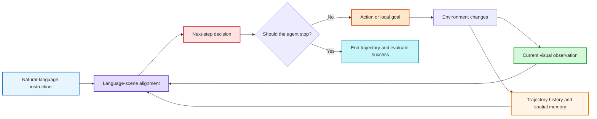

In discrete environments, the output is usually a neighboring viewpoint or `STOP`. In continuous environments, it may be a forward/turn action, a 2D waypoint, a trajectory segment, or low-level controls. These interfaces change perceptual coverage, control difficulty, and success conditions. Sharing R2R instructions alone does not make results directly comparable.

## 2.2 Five dimensions for understanding a VLN benchmark
{: id="22-看懂一个-vln-基准五个必要维度"}

| Dimension | Question to establish | Common settings | Effect on results |
|:---|:---|:---|:---|
| **Goal specification** | What must the agent understand? | Route instruction, object category, goal image, scene description, dialogue | Determines the need for stepwise grounding or open-vocabulary search |
| **Observation configuration** | What can the agent observe? | Panorama, monocular, multiple cameras, RGB, RGB-D, odometry | Determines visual coverage and the strength of geometric priors |
| **Action space** | How does the agent move? | Discrete viewpoints, low-level actions, waypoints, velocities, trajectories | Determines whether obstacle avoidance and control are actually tested |
| **Environment model** | Which physical constraints apply? | Navigation graph, navigable surface, rigid-body collisions, robot dynamics | Determines whether collisions, falls, or immobilization can occur |
| **Interaction protocol** | Can instructions be clarified or revised? | Single turn, dialogue, active questions, human feedback | Determines whether the agent can resolve ambiguity or request help |

### 2.2.1 Boundaries between VLN, ObjectNav, and general VLA
{: id="221-vlnobjectnav-与通用-vla-的边界"}

| Paradigm | Main inputs | Principal capabilities evaluated | Typical outputs |
|:---|:---|:---|:---|
| **Instruction-following VLN** | Route-level natural-language instructions | Instruction progress, landmark alignment, path fidelity | Viewpoints, actions, or waypoints |
| **ObjectNav / ImageNav** | Object category or goal image | Goal search, exploration efficiency, goal localization; open-vocabulary status depends on the protocol | Exploration direction or local goal |
| **General VLA** | Images/video, language goal, robot state | Multitask transfer and action generation | Action tokens, trajectories, or controls |

ObjectNav can supply semantic exploration modules for VLN, and VLA can provide a policy backbone. Their results nevertheless cannot automatically be included in standard VLN leaderboards. Fair comparison requires matching task inputs, sensors, action interfaces, data splits, and additional training data.

## 2.3 How a modern VLN system works
{: id="23-一个现代-vln-系统如何工作"}

Early models often described VLN as a visual encoder, a language encoder, and an action classifier. A more useful systems view in 2026 is: **perception supplies semantic and geometric evidence; the state layer maintains instruction progress and spatial memory; planning selects subgoals; execution converts them into safe actions; and actual observations continuously correct errors.**

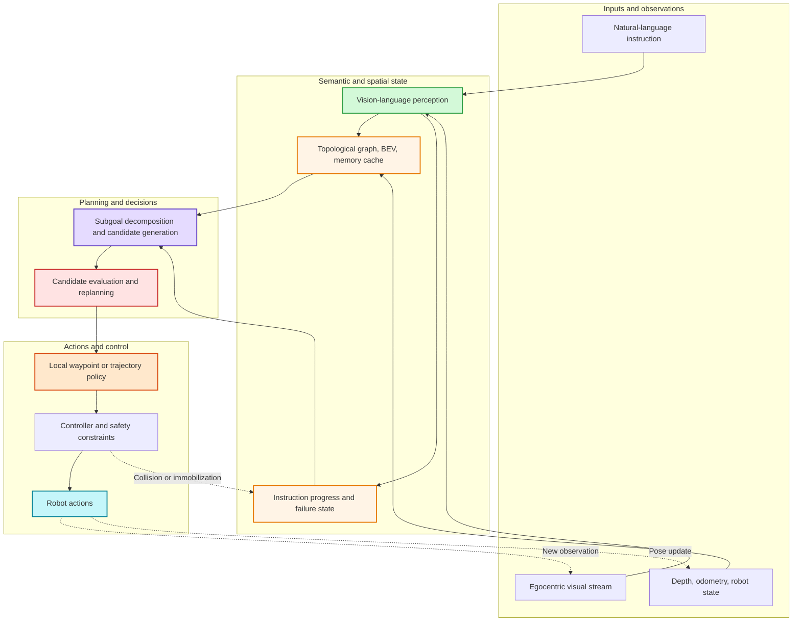

This diagram does not require every method to implement each module explicitly. End-to-end models can fold several boxes into a unified network; dual-system, map-based, and agent-based approaches expose some interfaces explicitly. Assess architectures through their information flow and training objectives, not just the names used in a paper.

## 2.4 Core challenges
{: id="24-vln-的核心难点"}

| Challenge | Typical failure | Why it is difficult | Evidence to inspect |
|:---|:---|:---|:---|
| **Dynamic language grounding** | Acting on a later landmark too early or missing a turn | Instruction progress changes as the agent moves | Fine-grained trajectory alignment and incorrect-instruction tests |
| **Partial observability and long-term memory** | Repeated exploration, forgotten regions, inability to backtrack | A single frame cannot reveal global structure | Long-route performance, backtracking, memory ablations |
| **Semantic reasoning and geometric reachability** | Selecting a semantically correct but unreachable goal | Internet knowledge does not establish 3D geometry | Depth/map ablations and reachability checks |
| **High-level planning and low-level control** | Correct subgoal but colliding or oscillating trajectories | Errors accumulate across time scales and interfaces | Control frequency, latency, collisions, replanning counts |
| **Open-world operation and real deployment** | Simulation success but real-world failure | Changes in viewpoints, sensors, dynamics, and scene distributions | Cross-scene, cross-embodiment, and real-robot evaluation |
| **Failure detection and recovery** | Passing near the goal without stopping; compounding errors after a deviation | Weak uncertainty estimation and self-diagnosis | OSR–SR gap, recovery success rate, human interventions |

## 2.5 From task-specific models to navigation foundation models
{: id="25-从任务专用模型到导航基础模型"}

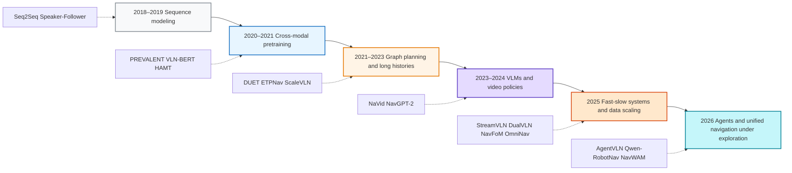

This progression does not simply replace old models with new ones. Pretraining addresses semantic generalization; maps and memory address spatial consistency; fast-slow systems reconcile reasoning and control time scales; agents and world models seek better active perception, recovery, and prospective planning. These approaches are converging.

## 2.6 A map of research questions
{: id="26-研究问题地图"}

| Research layer | Common approaches | Critical evidence still needed |
|:---|:---|:---|
| Representation | VLM pretraining, video context, 3D tokens | Does the model understand constraints along the route, beyond predicting the endpoint? |
| State | Topological graphs, BEV, 3D Gaussians, caches, retrieval memory | When does memory become incorrect, and how should it be forgotten or corrected? |
| Planning | Subgoal decomposition, CoT, candidate trajectory scoring | Does longer reasoning reliably improve closed-loop control? |
| Execution | Waypoint policies, action chunks, diffusion trajectories, MPC | Can these transfer across robot embodiments and control frequencies? |
| Data | Synthetic trajectories, joint multitask training, automatic progress descriptions | Which matters most: volume, scene diversity, or annotation quality? |
| Deployment | Quantization, caching, edge inference, safety controllers | Can simulated SR / SPL predict real-world reliability? |

<a id="27-2026-年的五个明显变化"></a>

## 2.7 Where recent research converges
{: id="27-近期研究的交汇点"}

This survey groups recent work into five compatible directions: unified policies, hierarchical control, spatial memory, agent orchestration, and future prediction. This is an analytical framework for comparing mechanisms, not five mutually exclusive categories or a claim that these ideas originated in 2026. Section 3 examines designs; Section 9.3 discusses the limits of the evidence.

# 3. Main research directions
{: id="3-主流-vln-研究路线"}

A simple end-to-end versus modular classification is no longer sufficient. Three more informative axes are **whether the policy is trained jointly, whether spatial state is maintained explicitly, and whether decision-making and control are separated by time scale**. Through these axes, work from 2025–2026 falls into five compatible directions.

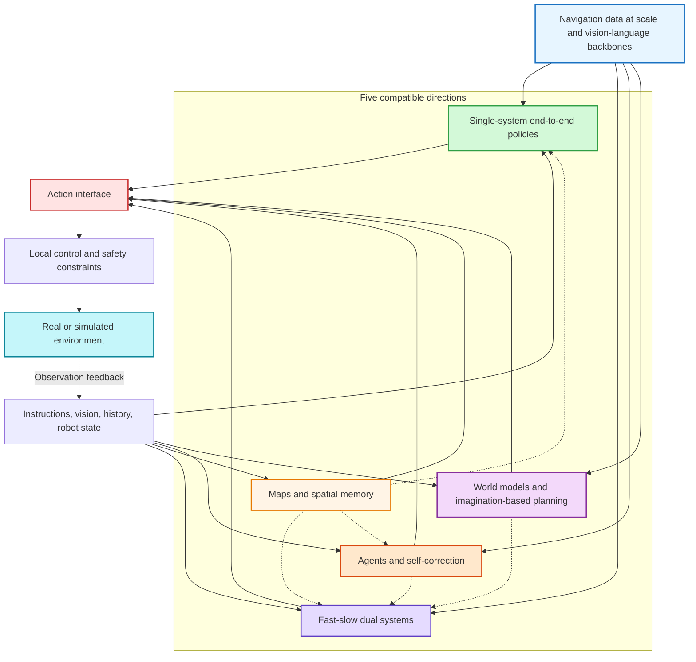

## 3.1 What has changed: state, interfaces, and training data
{: id="31-方法演进真正变化的是状态接口与训练数据"}

| Stage | Internal state | Typical action interface | Training signals | Representative methods |
|:---|:---|:---|:---|:---|
| **Sequence policies** | RNN hidden state | Discrete viewpoints / actions | Behavior cloning, reinforcement learning | Seq2Seq, Speaker-Follower |
| **Pretrained Transformers** | Cross-modal tokens and historical features | Discrete candidates | Masked modeling, instruction-trajectory alignment | PREVALENT, VLN-BERT, HAMT |
| **Graph planning and explicit memory** | Topological graphs, semantic graphs, local maps | Global nodes + local actions | Graph supervision, path and progress objectives | DUET, ETPNav, MapNav |
| **Video VLM / VLA** | Video context, KV cache, action tokens | Discrete actions, waypoints, or action chunks | Vision-language data + navigation trajectories | NaVid, StreamVLN, NavFoM |
| **Navigation foundation models** | Multitask context, configurable observations, unified spatial representations | Multitask modes and parameterized interfaces | Large-scale joint training, instruction tuning | OmniNav, OneVLA, Qwen-RobotNav |
| **Agent orchestration** | Task progress, skill returns, experiential state | Tool calls or subtasks | Supervision, prompting, or environmental feedback depending on implementation; online training is not required | AgentVLN, Qwen-RobotNav systems |
| **World-action models** | Joint representations of future observations and actions | Trajectories or action chunks | World prediction, action supervision, optional progress supervision | AstraNav-World, NavWAM (image-goal navigation) |

Improvements in modern models often combine larger backbones, more trajectories, extra depth or map priors, and new system interfaces. When reading a paper, attribute architectural improvements separately from additional resources.

## 3.2 Single-system end-to-end navigation: continuous multimodal generation
{: id="32-单系统端到端把导航变成连续的多模态生成"}

Single-system methods place instructions, visual history, and action history into a unified model that directly predicts the next action, waypoint, or action chunk. They offer unified training objectives and straightforward data scaling; their bottlenecks are long-context costs, spatial drift, and difficult failure diagnosis.

<div align="center">
  
<figcaption>StreamVLN uses interleaved visual-action sequences for streaming navigation. See <a href="https://arxiv.org/abs/2507.05240v2">the original paper, v2</a>.</figcaption>
</div>

| Design | Problem addressed | Representative work |
|:---|:---|:---|
| Interleaved observation-action generation | Avoids compressing an entire video into a single static judgment | ,  |
| Shared multitask policy | Shares spatial capabilities across instruction following, goal search, and exploration | ,  |
| Configurable observation interface | Adjusts history length, camera weights, and task modes at inference |  |
| Quantization and edge deployment | Reduces closed-loop inference latency for large models |  |

**This survey's recommendation**: consider this direction when data are sufficient, interfaces are relatively uniform, and joint training and simple deployment are priorities. Long-range backtracking, dynamic replanning, or strict safety requirements will usually still need external memory or control modules.

## 3.3 Fast-slow dual systems: separating semantic reasoning from frequent execution
{: id="33-快慢双系统高层语义推理与高频执行解耦"}

Fast-slow systems divide work by time scale. The slow system interprets instructions, checks progress, and generates subgoals at low frequency; the fast system continuously converts those subgoals into waypoints or trajectories. The defining feature is a stable, verifiable interface between the layers, rather than simply having two models.

<div align="center">
  
<figcaption>DualVLN: the slow system supplies goals and features; the fast system generates trajectories. See <a href="https://arxiv.org/abs/2512.08186v1">the original paper</a>.</figcaption>
</div>


| System interface | Strengths | Main risks | Representative work |
|:---|:---|:---|:---|
| Pixel goals, optionally with latent features | Intuitive and easy to ground visually | Depth ambiguity and uncertain reachability | ,  |
| Frontiers or topological waypoints | Supports global exploration and backtracking | Depends on map quality | ,  |
| Shared latent features | Dense information and joint optimization | Limited interpretability and compatibility across models |  |
| Pointing or candidate verification | Can incorporate online reinforcement learning | More complex training and inference systems |  |

<a id="survey-memory"></a>

## 3.4 Maps and spatial memory: making history a queryable environment state
{: id="34-地图与空间记忆让历史变成可查询的环境状态"}

A VLM may recognize a kitchen and a sofa without knowing their stable positions in 3D space. Map and memory methods organize past observations into topological graphs, BEV representations, 3D Gaussians, hierarchical scene graphs, or hybrid retrieval stores. These provide external state for long-range planning, backtracking, and failure diagnosis.

<div align="center">
  
<figcaption>HSGM: a hierarchical scene graph maintains local observations, object relationships, and global path state.</figcaption>
</div>

| Representation | Strengths | Typical limitations | Representative work |
|:---|:---|:---|:---|
| Topological graph | Long-range connectivity and backtracking | Coarse node semantics; depends on waypoint quality | DUET, ETPNav |
| BEV / semantic map | Geometric reachability and local planning | Pose errors accumulate | ,  |
| 3D Gaussian memory | Renderable, continuous 3D semantics | Mapping costs and complex dynamic updates | ,  |
| Hierarchical scene graph | Multiscale reasoning over rooms, objects, and paths | Graph construction and relation updates depend on perception quality |  |
| Experience and graph-prior memory | Uses past visit outcomes to adjust exploration and decisions | Stale or incorrect experience can amplify bias |  (goal-navigation and multimodal-goal settings) |

**Computational caches and task memory should be distinguished.** [VLN-Cache](https://arxiv.org/abs/2603.07080) reuses token computations across frames to reduce inference costs, addressing cache invalidation caused by viewpoint and task-stage changes. This differs from a retrieval store of successful and failed experiences. Evaluate the former by speedup and accuracy loss, and the latter by improvements in long-range decisions, backtracking, and recovery.

Maps are not inherently correct ground truth. A good system must specify how information is written, when it is updated, how conflicts are handled, and when stale information is forgotten.

<a id="35-通用导航-agent上层规划器如何编排一个共享导航基模"></a>

## 3.5 General navigation agents: task orchestration and callable capabilities
{: id="35-通用导航-agent任务编排与可调用的导航能力"}

The agent perspective asks **who maintains task state, who selects the next capability, and how execution feedback changes subsequent decisions**. It can coexist with fast-slow control. Producing a high-level reasoning trace alone does not establish tool orchestration or failure recovery.

| Organization | Representative design | Relationship to other directions | What to evaluate separately |
|:---|:---|:---|:---|
| VLM invokes perception and planning skills | [AgentVLN](https://arxiv.org/abs/2603.17670) separates high-level semantic reasoning from a skill library | Can use topological memory and local control | Whether tool selection and correction provide gains beyond the skills themselves |
| High-level planner calls a shared navigation backbone | [Qwen-RobotNav](https://arxiv.org/abs/2606.18112v3) exposes task modes, token budgets, and camera weights | Shared policy performs navigation; the upper layer selects modes and observations | Whether dynamic settings outperform fixed settings, and whether invocation costs are acceptable |
| Visit feedback updates spatial experience |  provides a design reference from related goal-navigation tasks | Explicit memory shapes exploration and subsequent choices | Experience lifetime, incorrect writes, and whether cross-episode information is allowed by the protocol |

<a id="351-通用导航-agent-的五层结构"></a>

### 3.5.1 Evaluate backbone and agent capabilities separately
{: id="351-基模能力与-agent-能力分别评测"}

Qwen-RobotNav is a navigation model that can be used in agent systems. Evaluation should distinguish the underlying navigation results from system-level results with orchestration. The former reflect the model and its input configuration; the latter also include task decomposition, mode switching, and runtime feedback. The full system's gains cannot all be attributed to either the backbone or the planner.

<div align="center">
  
<figcaption>Qwen-RobotNav system example: configurable interfaces let the navigation model participate in high-level task orchestration. See the <a href="https://arxiv.org/abs/2606.18112v3">technical report</a> for implementation details.</figcaption>
</div>

<a id="352-qwen-robotnav-式-agentic-导航闭环"></a>

### 3.5.2 An inspectable agent loop
{: id="352-一个可检查的-agent-闭环"}

This survey uses the general analytical loop: task state → select subtask and tools → execute → read results → update task state. Each transition should be inspectable in logs: was a tool failure recognized, did the strategy change, were ineffective actions repeated, and when did execution terminate? This describes system responsibilities rather than prescribing identical modules for every paper.

The following diagram is a general system-analysis aid. The crucial question is whether the upper layer updates task state after the navigation tool returns evidence, and whether failure actually changes its decisions.

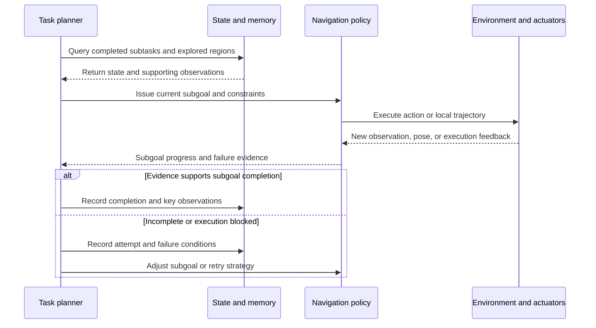

For example, "go through the corridor to the kitchen and find a cup" requires at least two checks: reaching the kitchen and confirming the cup. Detecting a cup does not establish the room condition; outputting "replan" does not establish successful recovery. Logs must connect actual observations, tool calls, and subsequent trajectories to locate failures in task decomposition, spatial memory, or execution.

<a id="353-三类-agentic-vln-设计"></a>

### 3.5.3 Limits of recovery evidence
{: id="353-恢复能力的证据边界"}

Compare a fixed execution workflow with adaptive orchestration under the same underlying skills, models, and budgets. Report task success, recovery rate, tool calls, latency, and human interventions separately. Higher success through more retries can be useful, but its cost must be reported to assess deployment suitability.


## 3.6 World models and world-action models: from predicting to using the future
{: id="36-世界模型与世界动作模型从预测未来到利用未来"}

World-model approaches aim to predict action consequences before execution. Some pass predictions to an external planner; others learn predictions and actions jointly, sometimes with additional goal-progress or value supervision. The diagram below summarizes functions; not every paper implements every module.

<div align="center">
  
<figcaption>AstraNav-World jointly updates future visual states and action sequences. See <a href="https://arxiv.org/abs/2512.21714v2">the original paper, v2</a>.</figcaption>
</div>

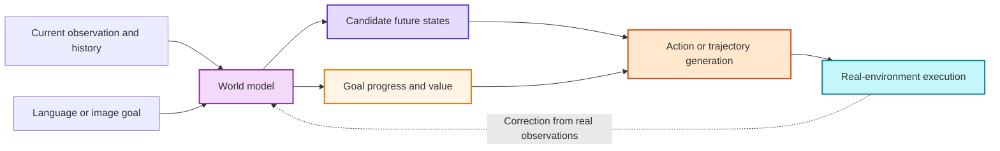

| Direction | Key change | Representative work |
|:---|:---|:---|
| Visual imagination assists a policy | Generates candidate future visuals as extra evidence for an existing policy | , Navigation World Models |
| Language planning + prediction | Instruction decomposition constrains short- and long-term predictions | NavForesee,  |
| Joint visual-action generation | Generates future states and actions together to reduce two-stage drift |  |
| World-action models | Combine future observations, values, and action chunks in a shared latent sequence | ,  |

Compelling visuals can be misleading in this direction. Meaningful evidence concerns improvements in closed-loop SR / SPL, collision rates, and real-robot control, plus whether new observations correct prediction errors promptly. Plausible-looking generated frames alone are insufficient.

**Task boundary**: [NavWAM](https://arxiv.org/abs/2606.13494) evaluates image-goal navigation. It informs the integration of prediction and control, but its results cannot directly enter a route-instruction VLN leaderboard. For visual navigation world models such as NWM, first check goal conditioning before discussing their relationship to language navigation.

## 3.7 Choosing among the five directions
{: id="37-五条路线如何选择"}

These recommendations follow system responsibilities; they are not a performance ranking under matched conditions.

| Research objective | Priority direction | Suggested combination | Main reporting requirements |
|:---|:---|:---|:---|
| Unified training at scale | Single-system end-to-end policy | + Lightweight cache or implicit memory | Data scale, parameters, latency, cross-task transfer |
| Smooth real-robot control | Fast-slow dual system | + Safety controller + local map | Control frequency, collisions, replanning, real-world success |
| Long-range navigation and backtracking | Maps and spatial memory | + High-level VLM planning | Map error, backtracking gains, long-route metrics |
| Open-ended tasks and autonomous recovery | Navigation agents | + Structured memory + skill library | Invocation costs, recovery, human interventions, hallucinations |
| Prospective planning with less trial and error | World models | + Fast-slow system or value model | Prediction error, closed-loop gains, inference costs |

### 3.7.1 Four checks when reading a new paper
{: id="371-阅读最新论文时的四个检查项"}

1. **Matched protocols**: are sensors, action spaces, splits, and success thresholds the same?
2. **Matched resources**: do gains come from architecture, larger backbones, more data, or extra depth/maps?
3. **Closed-loop benefits**: do reasoning, memory, or imagination modules improve navigation, beyond offline metrics?
4. **Transparent deployment costs**: are latency, GPU memory, control frequency, and real-robot tests reported?

The companion  maintains separate tables for R2R-CE, RxR-CE, and discrete R2R / REVERIE, marking trained versus training-free methods and validation-subset evaluations. ObjectNav, HM3D-OVON, and image/point-goal results appear in the . Both support further checks of performance under matched settings.


<a id="survey-training"></a>

## 3.8 Data and training paradigms: learning navigation and correction
{: id="38-数据与训练范式策略如何学会导航与纠错"}

The five directions above describe how systems organize information; training paradigms determine which feedback they learn from. These choices are independent. Single-system and fast-slow models can both use imitation learning, augmentation, or reinforcement learning. Reflection text does not imply that weights are updated during deployment.

| Training method | Learning signal | Main purpose | Risks to evaluate separately |
|:---|:---|:---|:---|
| Behavior cloning / supervised fine-tuning | Observation-action pairs from expert trajectories | Establishes a basic instruction-to-action mapping | Accuracy on expert states does not establish recovery after deviations |
| Policy rollouts and correction data | Expert corrections or recovery trajectories at states visited by the model | Covers states outside the training demonstrations | Whether the expert uses maps or goal information unavailable at deployment |
| Cross-modal pretraining and joint training | Image-text, video, instruction-trajectory, and multitask data | Transfers semantic knowledge and shared spatial representations | Whether data gains and architecture gains are evaluated separately |
| Synthetic instructions and expanded scenes | Automatically generated paths, descriptions, and tasks | Expands language, scene, and route coverage | Executability, ambiguity, and scene leakage in instructions |
| Reinforcement learning | Arrival, progress, path cost, and other environmental feedback | Optimizes closed-loop behavior and long-term returns | Whether rewards encourage shortcuts, repeated exploration, or inappropriate stopping |
| Auxiliary prediction and reflection supervision | Progress, geometry, future states, or error explanations | Provides intermediate learning signals | Whether better auxiliary-task accuracy improves navigation |

Read this section alongside the training-data organization in  and reflection-data construction in . Refer to each paper for its actual stages, data mixture, and supervision.

**An example connecting training and evaluation**: the instruction is "pass the sofa, turn left, and stop before the second door." Successful demonstrations teach ordering and actions, but may not cover missing the left turn. To test correction, introduce matched deviations at fixed positions and examine whether the policy detects inconsistent progress, returns to the correct junction, and resumes the task. Report extra distance, recovery rate, and final success. More successful demonstrations or longer reasoning traces alone do not establish this ability.

Organize ablations at three levels: fix data and backbone to compare modules; fix architecture to compare data; then compare complete systems under the same hardware and inference budget. State any uncontrolled differences explicitly rather than attributing every gain to one design.

<a id="survey-comparison"></a>

## 3.9 Cross-paper comparison: different designs behind similar names
{: id="39-跨论文比较相似名称背后的不同设计"}

These comparisons follow mechanism descriptions in the original papers. The final column proposes experiments; it does not claim the papers conducted a common controlled comparison. Training data, sensors, and control interfaces differ, so the table does not provide an overall ranking.

| Work | Core design fact | Key distinction | Boundary requiring validation |
|:---|:---|:---|:---|
| [DUET](https://arxiv.org/abs/2202.11742) | Combines global topology with local observation-based decisions | Global/local spatial scales differ from low/high-frequency robot control | Whether discrete-graph gains transfer to self-built maps and continuous execution |
| [ETPNav](https://arxiv.org/abs/2304.03047v3) | Online waypoint topology, high-level planning, and obstacle-avoidance control | Integrates graph planning with continuous-environment execution | Separate contributions of waypoint error, map updates, and the controller |
| [StreamVLN](https://arxiv.org/abs/2507.05240v2) | Streaming context, slowly updated memory, and cache reuse | SlowFast mainly describes context-update mechanisms | Whether compression preserves key landmarks with matched history and compute |
| [DualVLN](https://arxiv.org/abs/2512.08186v1) | VLM generates intermediate goals; a lightweight policy uses pixel goals and latent features to generate trajectories | Fast-slow division separates semantic planning from action execution | Whether the lower layer absorbs goal errors and upper-layer latency |
| [AgentVLN](https://arxiv.org/abs/2603.17670) | VLM cooperates with a skill library, adding correction and exploration | Explicit orchestration of perception and planning capabilities | Remaining gains from adaptive orchestration with a fixed skill library |
| [NWM](https://arxiv.org/abs/2412.03572v2) | Action-conditioned future visual prediction supports planning or trajectory ranking | A visual navigation world model is not synonymous with standard route-instruction VLN evaluation | How future prediction yields closed-loop gains under language constraints |

**Comparison 1: context management and control hierarchies address different bottlenecks.** StreamVLN's fast-slow context manages historical information and computation; DualVLN's fast-slow system separates semantic decisions from local trajectory execution. Both involve time scales, but along different architectural axes. A system could combine streaming memory with hierarchical control; matched-budget ablations must establish whether that combination is worthwhile.

**Comparison 2: maps organize history spatially while introducing new errors.** DUET and ETPNav show global state informing decisions. Moving from a known discrete graph to online mapping requires estimating reachability and connectivity themselves. Comparisons with implicit memory must report access to mapping inputs and mapping costs, rather than attributing benefits from accurate depth or pose entirely to the representation.

**Comparison 3: predicting the future still leaves a decision problem.** NWM uses predictions for planning or candidate ranking, while [AstraNav-World](https://arxiv.org/abs/2512.21714v2) explores joint visual-action updates. In this survey's assessment, both must show that prediction is more useful than additional candidate search or a stronger direct policy under fixed compute. Visual generation quality is supporting evidence only.

**Comparison 4: large-scale data change the starting point of architectural comparisons.** ScaleVLN demonstrates how expanded training environments and supervision affect existing models. Comparisons should separate mechanism gains under the same data from system gains under full resource configurations. The latter are valuable, but support a system-level conclusion rather than proving one module superior.


# 4. VLN task types
{: id="4-vln-任务类型"}

Similar task names do not make results comparable. Building on the five dimensions in Section 2.2—goal specification, observations, actions, environment model, and interaction protocol—this section classifies common tasks by **reasoning complexity, interaction, and action/physical realism**, with representative benchmarks. Embodiment deserves particular attention: virtual agents without dynamics, wheeled robots, quadrupeds, humanoids, and drones face very different collision, fall, immobilization, and 6-DoF control challenges. Results under the same task name should not be compared directly across embodiments.

## 4.1 Reasoning and decision complexity
{: id="41-按推理与决策复杂度划分"}

**1. Instruction-Following VLN**

The agent navigates from a starting point to a destination using a supplied natural-language instruction. Open-ended goal search is not necessarily required, but landmark disambiguation, sequential reasoning, and long-term memory may still be necessary. The emphasis is on grounding language constraints along the route in the executed trajectory.

*Representative datasets*: Room-to-Room (R2R), Room-for-Room (R4R).

---

**2. Reasoning-Oriented VLN**

These tasks introduce target-object search or semantic constraints during navigation. The agent must reason about the correspondence between language instructions and environmental semantics to navigate and localize the target.

*Representative datasets*: REVERIE, SOON.

---

**3. Long-Horizon VLN**

These tasks emphasize long routes and composed instructions, requiring long-term planning, memory, and error recovery. They are important settings for evaluating sustained decision-making.

*Representative datasets*: LHPR-VLN and long-route settings in R4R / RxR.

---

## 4.2 Interaction
{: id="42-按交互方式划分"}

**1. Non-interactive VLN**

After receiving an initial instruction, the agent completes navigation independently without further interaction with the user. This is the most common VLN evaluation setting.

---

**2. Interactive and dialog-based VLN**

These tasks allow multiple interaction turns during navigation, using questions or feedback to refine the goal. They more closely resemble real human-robot collaboration.

*Representative dataset*: CVDN (distinguish supplied dialogue history from online questioning protocols).

## 4.3 Actions and physical realism
{: id="43-按动作与物理真实性划分"}

**1. Discrete panoramic navigation**

The agent moves on a predefined graph of traversable viewpoints, typically with 360° panoramic features at each node. This deemphasizes local control and collisions, making it suitable for language-landmark alignment, global planning, and history modeling.

*Representative benchmarks*: R2R, R4R, RxR, REVERIE.

**2. Continuous-environment navigation**

The agent moves over a navigable surface through forward/turn actions or local waypoints, rather than teleporting along a manually constructed graph. Traversability and stopping control matter; field-of-view restrictions, localization noise, and dynamics depend on the specific configuration.

*Representative benchmarks*: R2R-CE, RxR-CE; other transferred settings must identify their implementation.

**3. Physically embodied navigation**

Robot dynamics, morphology, and control frequency impose constraints, including falls, slip, immobilization, and different camera mount positions. These tasks are closer to deployment but harder to align with classic VLN results.

*Representative benchmarks*: VLN-PE, VLNVerse, and real-robot evaluations.

> **Comparison principle**: report R2R, R2R-CE, RxR-CE, ObjectNav, and real-robot tests in separate tables. Even when all use SR / SPL, their inputs, action spaces, and success conditions may differ.

---


# 5. VLN applications
{: id="5-vln-的应用场景"}

Applications determine sensors, action spaces, map priors, and safety constraints, and therefore the appropriate datasets and simulators. The table compares three settings before examining each in detail.

| Setting | Typical platforms | Main observations and priors | Core challenges | Representative benchmarks | Common simulators |
|:---|:---|:---|:---|:---|:---|
| **Indoor** | Wheeled / quadruped / humanoid robots | Monocular or panoramic RGB-D, odometry | Multiroom topology, occlusion, furniture semantics, precise stopping | R2R / RxR / VLN-CE / REVERIE / VLN-PE | Matterport3D Simulator, Habitat, Isaac Sim |
| **Outdoor street scenes** | Wheeled delivery robots, mobility-assistance devices | Street-view panoramas, GPS, OpenStreetMap | Large scale, sparse similar landmarks, dynamic traffic and weather | Touchdown / StreetLearn / map2seq | Street View graph environments, CARLA (language-conditioned driving) |
| **Aerial** | Multirotor drones | Oblique / downward RGB, altimeter, GPS | 3D motion, altitude and viewpoint changes, landmark disambiguation, flight safety | AerialVLN / CityNav / OpenFly | AirSim, Unreal Engine, Isaac Sim |

## 5.1 Indoor environments
{: id="51-室内场景"}

Indoor VLN focuses on homes, offices, and public buildings. Multiple rooms and extensive furniture provide the landmarks in instructions such as "go through the kitchen and stop beside the sofa," placing strong demands on room-level topology, object-level grounding, and precise stopping. Indoor data and benchmarks are also the most mature: most datasets in Section 6 use real scans such as Matterport3D and HM3D, or synthetic scenes such as ProcTHOR and GRScenes.

<div align="center">
  
<figcaption>Indoor VLN: the relationship between natural-language instructions, egocentric observations, and the global trajectory.</figcaption>
</div>

**Applications**: domestic service robots, indoor logistics, hospital and shopping-center guidance, and quadruped / humanoid inspection.

## 5.2 Outdoor environments
{: id="52-室外场景"}

Outdoor VLN faces larger spatial scales and greater uncertainty. Similar-looking landmarks may be hundreds of meters apart; lighting, weather, and traffic change continuously; GPS and map availability vary. Touchdown (Chen et al., CVPR 2019) studies language navigation and spatial localization in street scenes. StreetLearn provides a street-view learning environment and should not itself be equated with a route-instruction dataset. map2seq addresses map-assisted navigation instructions. This branch is increasingly connected to language-conditioned autonomous-driving planning and semantic navigation for outdoor service robots.

<div align="center">
  
<figcaption>Outdoor street-view VLN: an agent follows instructions while moving between panoramic street-view nodes.</figcaption>
</div>

**Applications**: campus and urban delivery, guidance for visually impaired people and mobility assistance, and language-conditioned autonomous-driving planning.

## 5.3 Aerial environments
{: id="53-空中场景"}

Aerial VLN targets flying platforms such as multirotor drones. Compared with ground navigation, it requires controlling both horizontal position and altitude; viewpoints change continuously between downward and oblique views, and landmark appearance varies greatly with height. Flight constraints—no-fly zones, minimum altitude, and obstacle avoidance—must be addressed explicitly at the action layer. AerialVLN, CityNav, and OpenFly in Section 6.6 represent simulated cities, real aerial imagery, and large-scale multiengine data, respectively.

<div align="center">
  
<figcaption>Aerial VLN: a drone navigates a 3D urban environment using natural-language instructions.</figcaption>
</div>

**Applications**: drone inspection and mapping, aerial search and rescue, urban low-altitude logistics, and language-directed aerial photography.


<a id="survey-datasets"></a>

# 6. Major VLN datasets
{: id="6-vln-主流数据集"}

Start benchmark selection with the capability to be tested, then consider scale. **Scene assets, task data, and training augmentation data are different resources**: Matterport3D supplies environments, R2R supplies instructions and paths, and ScaleVLN supplies synthetic training examples. A shared environment does not imply a shared action interface or evaluation protocol.

## 6.1 Dataset comparison
{: id="61-数据集对比总览"}

| Research question | Representative benchmarks | Settings to distinguish | Main evaluation dimensions |
|:---|:---|:---|:---|
| Route-instruction following | R2R / R4R / RxR | Short routes, composed routes, multilingual instructions | Arrival, efficiency, path fidelity |
| Continuous-environment execution | R2R-CE / RxR-CE | Field of view, low-level actions or waypoints, sliding settings | Arrival, stopping, actual traveled path |
| Object grounding and search | REVERIE / SOON | Reaching the vicinity versus correctly identifying the target | Navigation success + object localization |
| Long-horizon multisubtask execution | LHPR-VLN | Independent subtask success versus continuous execution | Subtask completion, error propagation |
| Dialogue collaboration | CVDN / TEACh | Dialogue history versus online Q&A; navigation versus manipulation | Task progress, interaction, execution |
| Social and physical constraints | HA-VLN 2.0 / VLN-PE / VLNVerse | Crowds, morphology, dynamics, task subsets | Arrival + social or embodiment failures |
| Demand reasoning | DDN | Satisfying a demand versus fixed-category search | Finding an object that satisfies the demand |
| Aerial language navigation | AerialVLN / CityNav / OpenFly | Map inputs, flight degrees of freedom, environment sources | Arrival, 3D paths, execution constraints |

The following table includes only scales with a clear counting unit. Years indicate first public release; conference years are noted separately. **Paths, instructions, dialogues, and episodes are not interchangeable**, and continuous-environment conversions cannot simply inherit the discrete version's counts.

| Resource | Verifiable scale | Counting convention and source |
|:---|:---|:---|
| R2R (2018) | 7,189 paths, 21,567 instructions | 3 instructions per path; [original paper](https://arxiv.org/abs/1711.07280) |
| RxR (2020) | About 126k instructions and about 126k following demonstrations | English, Hindi, Telugu; Guide and Follower released separately; [official data repository](https://github.com/google-research-datasets/RxR) |
| CVDN (2019) | Over 2,000 dialogues | Dialogue count differs from navigation instances sliced from histories; [original paper](https://arxiv.org/abs/1907.04957) |
| TEACh (2021; AAAI 2022) | Over 3,000 dialogues | Interactive household-task dialogues; derived evaluation instances counted separately; [paper v3](https://arxiv.org/abs/2110.00534v3) |
| AerialVLN (2023) | 25 scenes, 8,446 paths, 25,338 instructions | 3 instructions per path in the standard version; [original paper, Table 1](https://arxiv.org/html/2308.06735v1) |
| ScaleVLN (2023) | Over 1,200 environments, about 4.9 million instruction-trajectory pairs | Synthetic training augmentation; [paper v2](https://arxiv.org/abs/2307.15644v2) |
| LHPR-VLN (2024; CVPR 2025) | 3,260 tasks, about 150 task steps on average | The mean must not be described as a minimum length for every task; [paper v3](https://arxiv.org/abs/2412.09082v3) |
| CityNav (2024; ICCV 2025) | 32,637 human demonstration trajectories | Cambridge and Birmingham; [paper v3](https://arxiv.org/abs/2406.14240v3) |
| OpenFly (2025; ICLR 2026) | 18 scenes, 100k trajectories | Multiengine data; trajectory volume does not establish language diversity; [paper v7](https://arxiv.org/abs/2502.18041v7) |
| HA-VLN 2.0 (2025; IROS 2026) | 16,844 socially contextualized instructions | Confirm discrete/continuous subsets against the versioned protocol; [paper v5](https://arxiv.org/abs/2503.14229v5) |
| InternData-N1 | Over 240k trajectories and 3,000 scenes | Aggregate data-card counts across multiple subsets; [official data card](https://huggingface.co/datasets/InternRobotics/InternData-N1), accessed 2026-09-26 |

## 6.2 Instruction-oriented and continuous-navigation datasets
{: id="62-指令导向与连续导航数据集"}

### 6.2.1 R2R (Room-to-Room)
{: id="621-r2r-room-to-room"}

R2R pairs natural language with reference paths between start and goal viewpoints on navigation graphs in scanned Matterport3D environments. It supports landmark alignment and cross-scene generalization. Traversable graph edges already simplify local obstacle avoidance, so R2R success does not establish robot control ability. See the [original paper](https://arxiv.org/abs/1711.07280) and [official simulator](https://github.com/peteanderson80/Matterport3DSimulator).

**Understanding a sample**: the instruction describes landmarks and turns; the reference path is a sequence of discrete viewpoints. Starting from a viewpoint and heading, the agent selects reachable neighbors and eventually stops. A path is not a frame-by-frame video, and different instructions for one path are not independent examples from different buildings.

**Value and limitations**: R2R is a common starting point for language alignment and planning. When interpreting Val-Unseen results, check whether training visual features or additional data involve test environments. Real deployment additionally requires validation under narrow fields of view, localization errors, and low-level execution.

<details markdown="1">
<summary>Expand: original R2R fields and loading considerations</summary>

This is a reading guide to common original task fields. Refer to the [official R2R task directory](https://github.com/peteanderson80/Matterport3DSimulator/tree/master/tasks/R2R) for the exact format.

| Field | Meaning | Common source of confusion |
|:---|:---|:---|
| `scan` | Scene identifier | Scene assets must be obtained separately |
| `path_id` | Reference-path identifier | Not a unique identifier for one language instruction |
| `path` | Ordered viewpoint IDs | Not a list of 3D coordinates |
| `heading` | Initial heading | Preserve original units and coordinate conventions |
| `instructions` | Instructions for the same path | Trainers may expand the list into multiple instances |

Connectivity comes from separate graph data; image features form another input layer. Pin task annotations, connectivity, and visual-feature versions independently. A model-specific cache directory is not a universal R2R standard.

</details>

### 6.2.2 R4R (Room-for-Room)
{: id="622-r4r-room-for-room"}

R4R concatenates R2R paths and instructions, exposing the difference between following the described route and reaching the endpoint directly. It supports research on route constraints and long-path following; use CLS / nDTW alongside SR. The [original paper](https://arxiv.org/abs/1905.12255) also introduced CLS.

**Why longer reference routes matter**: consider "pass through the dining room, then loop back to the living room," where the endpoint is close to the start. Going straight to the living room may achieve endpoint success without following intermediate constraints. R4R makes this tension explicit: the shortest arrival path need not be the language-specified route.

Record endpoint success, coverage, and visit order together. Longer routes amplify accumulated errors, but a larger history window alone does not establish task-state reasoning. Inspect whether the model tracks completed route segments and landmarks still to be visited.

### 6.2.3 RxR (Room-across-Room)
{: id="623-rxr-room-across-room"}

RxR provides multilingual instructions and spatiotemporal annotations associated with observations. Specify language subsets, Guide / Follower usage, and test splits. Evaluation on English alone does not demonstrate multilingual ability. See the [official data and field documentation](https://github.com/google-research-datasets/RxR).

**Annotation process**: a Guide describes a route, and a Follower follows the description. Their trajectories can differ, supporting both reference-path imitation and analysis of ambiguity and human following errors. Word timings and camera poses provide finer vision-language alignment cues. See the [official annotation documentation](https://github.com/google-research-datasets/RxR).

<details markdown="1">
<summary>Expand: four RxR components, join keys, and alignment limits</summary>

| Component | Main purpose | Joins and checks |
|:---|:---|:---|
| Guide annotations | Instructions and reference paths | `instruction_id`, `language`, `path` |
| Follower annotations | Actual following demonstrations | `demonstration_id`; join to Guide with `instruction_id` |
| Pose traces | Camera poses and time series | Distinguish Guide from Follower and verify time bases |
| Text features | Precomputed language representations | Check language, tokenizer, and feature version |

`timed_instruction` records words and time intervals, but a few words lack start/end times, so not every word maps directly to an image frame. Basic navigation experiments can use Guide annotations alone. Disclose any use of Follower data, dense alignment, or synthetic instructions.

</details>

### 6.2.4 VLN-CE (continuous-environment navigation)
{: id="624-vln-ce-连续环境导航"}

VLN-CE moves instruction navigation into Habitat's navigable space, removing movement constraints imposed by graph edges. **Environment positions are continuous; policy actions may still form a finite set**, such as forward and turn. Execution becomes harder, but legged dynamics are not automatically included. See the [original paper](https://arxiv.org/abs/2004.02857).

The original baseline repository recommends `R2R_VLNCE_v1-3` and pins its Habitat version. Different sensors, waypoint controllers, or modified simulators require protocol checks. An identical dataset name alone does not establish comparability. See the [official implementation and version guidance](https://github.com/jacobkrantz/VLN-CE).

<div align="center">
  
<figcaption>Discrete navigation selects the next graph viewpoint; VLN-CE executes movement in continuous space. Action and collision conditions differ.</figcaption>
</div>

**From selecting the right node to reaching the location**: a valid neighbor in a discrete graph generally permits direct transfer. In continuous space, even a correctly selected doorway can lead to deviation, immobilization, or overshooting the stopping point. Record waypoint predictors, controllers, and navigation policies separately rather than attributing whole-system gains to the language model.

| Aspect | Discrete graph navigation | Common VLN-CE setting |
|:---|:---|:---|
| Position | Predefined viewpoint ID | Position and orientation in a scene |
| Actions | Neighbor selection, stop | Forward, turn, stop, or controller-executed waypoints |
| Traversability | Preconstrained by the graph | Depends on navigable surfaces, collisions, and sliding settings |
| Typical additional failures | Wrong path or stopping node | Narrow-door execution, local deviations, accumulated action errors |

<details markdown="1">
<summary>Expand: R2R_VLNCE_v1-3 splits and illustrative fields</summary>

The [official data page](https://jacobkrantz.github.io/vlnce/data) lists the v1-3 base splits as train 10,819, val_seen 778, val_unseen 1,839, and test 3,408 episodes. EnvDrop augmentation in the preprocessed package is additional. Version v1-3 corrects initial headings; do not mix old caches simply because the task names match.

The following is a **field-type illustration**. Scene names, text, and coordinates are teaching placeholders; vocabulary and some fields are omitted. It is not a runnable episode. Rotation uses `[x, y, z, w]` quaternions; the example is the identity rotation.

```json
{
  "episode_id": 1,
  "trajectory_id": 4,
  "scene_id": "mp3d/SCENE/SCENE.glb",
  "instruction": {"instruction_text": "Walk forward to the doorway."},
  "start_position": [0.0, 0.0, 0.0],
  "start_rotation": [0.0, 0.0, 0.0, 1.0],
  "goals": [{"position": [0.0, 0.0, -4.0], "radius": 3.0}],
  "reference_path": [[0.0, 0.0, 0.0], [0.0, 0.0, -4.0]]
}
```

`reference_path` lists 3D points. Training/validation `{split}_gt.json.gz` files separately store action and position supervision. Test goals and reference ground truth are hidden; do not assume training-visible fields are available at test time. Nor does `goals.radius` replace inspection of the actual success evaluator.

</details>

### 6.2.5 RxR-CE (multilingual continuous-environment navigation)
{: id="625-rxr-ce-多语言连续环境导航"}

RxR's continuous-environment adaptation is released with VLN-CE. The RxR-Habitat challenge explicitly constrains RGB-D observations, action step lengths, and turn angles. Panoramic-observation results cannot directly be treated as results under that challenge protocol. See the [official required task configurations](https://github.com/jacobkrantz/VLN-CE#required-task-configurations).

**Separate multilingual effects from execution errors**: a language-specific drop can reflect semantic understanding or action errors on longer routes. Group results by language, route length, and endpoint error, using the same cameras and controllers. If machine translation or extra text features are used, clarify whether the model understands the original language directly or navigates through a translation system.

### 6.2.6 VLN-PE (physically embodied navigation)
{: id="626-vln-pe-真实物理具身导航"}

VLN-PE supports humanoid, quadruped, and wheeled robots, studying embodiment gaps caused by camera viewpoints, lighting, collisions, and falls. Physical realism here means simulation that better reflects robot constraints, not that all data come from real robots. Report results by morphology and controller. See [paper v2](https://arxiv.org/abs/2507.13019v2).

<div align="center">
  
<figcaption>Task constraints expand from graph decisions to continuous execution and physics-based evaluation with robot morphology. Richer simulation constraints still require real-robot transfer validation.</figcaption>
</div>

**New variables introduced by embodiment**: the same semantic subgoal may not be executable by every robot. Camera height changes visible landmarks, body dimensions change doorway clearance, and motion controllers affect tracking and stability. Distinguish understanding the destination but failing to reach it from misunderstanding the goal.

Retain three log layers: high-level goals and waypoints, actual low-level trajectories, and collisions or abnormal poses. Cross-robot comparisons should report controllers and failure categories alongside SR. Simultaneously changing camera, controller, and policy does not isolate morphological generalization.

### 6.2.7 ScaleVLN (large-scale navigation pretraining augmentation)
{: id="627-scalevln-超大规模导航预训练增强数据集"}

ScaleVLN expands training coverage rather than introducing a new task to rank alongside R2R. It shows that more environments and synthetic supervision can substantially change existing models' performance. Architecture comparisons must disclose such additional data. See the [original paper](https://arxiv.org/abs/2307.15644).

**What data scaling changes**: more scenes broaden visual and geometric coverage; more synthetic instructions add supervised examples. Discuss these effects separately. Synthetic language may repeat templates, and path sampling may favor easy regions, so more samples do not automatically mean richer tasks.

With the same model, compare original data, additional scenes, additional instructions, and full augmentation. Also report training steps or compute budgets to distinguish coverage, language variation, and extra optimization as sources of improvement.

### 6.2.8 InternData-N1 (InternVLA-N1 navigation pretraining data)
{: id="628-interndata-n1-internvla-n1-导航预训练数据"}

InternData-N1 unifies VLN-CE, VLN-PE, and VLN-N1 subsets in LeRobot format. A shared storage format helps training but does not erase differences in observations, actions, or success criteria. Record subsets, filtering, and sampling ratios. See the [official data card](https://huggingface.co/datasets/InternRobotics/InternData-N1).

**Shared storage still requires aligned semantics**: videos, states, and actions may share storage interfaces while differing in action scales, camera settings, and robot states. Specify action normalization, task conditioning, and how sampling prevents large subsets from overwhelming smaller ones.

<details markdown="1">
<summary>Expand: InternData-N1 subset directories and version records</summary>

This diagram summarizes CE trajectory directories in the [official data card](https://huggingface.co/datasets/InternRobotics/InternData-N1), omitting scene archives and other subsets. It is not a complete listing shared by all versions. Pin a branch or revision before downloading; the card lists versions including full / mini.

```text
vln_ce/
├── raw_data/                 # Original task annotations
└── traj_data/
    └── <scene-dataset>/<scene>/
        ├── data/chunk-000/   # Episode Parquet data
        ├── meta/            # Metadata: info, tasks, episodes, etc.
        └── videos/          # Observations by camera and modality
```

Before bulk training, check that an episode's table timestamps, video frames, camera names, and action fields align. A readable directory does not prove actions are interpreted correctly. Include action decoding and trajectory replay in data-ingestion checks. Consult the respective subset documentation for VLN-PE and VLN-N1 contents and directories.

</details>

### 6.2.9 VLNVerse (unified physics-based multitask navigation benchmark)
{: id="629-vlnverse-物理多任务统一导航基准"}

VLNVerse brings multiple tasks, embodied simulation, and evaluation into a shared framework. It supports cross-task evaluation, but a common platform does not justify collapsing all tasks into one SR. Report each task and embodiment setting rather than only an overall mean. See the [original paper](https://arxiv.org/abs/2512.19021).

**Reading a unified benchmark**: common sensors and actuators may support tasks whose success means arrival, target confirmation, or multistage completion. Report a task × embodiment result matrix, indicating shared weights versus task-specific fine-tuning. An aggregate mean alone can conceal failure on particular tasks.

## 6.3 Goal-oriented and long-horizon planning datasets
{: id="63-目标导向与长程规划数据集"}

### 6.3.1 REVERIE (Remote Embodied Visual Referring Expression in Real Indoor Environments)
{: id="631-reverie-remote-embodied-visual-referring-expression-in-real-indoor-environments"}

REVERIE requires navigation from a high-level description and identification of a target object. Reaching a viewpoint where the target is visible differs from correct object grounding. Separate navigation metrics from remote-grounding metrics. See the [original paper](https://arxiv.org/abs/1904.10151).

The original paper reports 10,567 panoramic viewpoints in 90 buildings, 4,140 target objects, and 21,702 crowdsourced instructions averaging 18 words. Instructions generally describe the target region and object, rather than the route step by step. Navigation success requires stopping at a viewpoint that can observe the target (objects within 3 m are considered visible). The original appendix defines grounding success by predicted-box / ground-truth-box IoU ≥ 0.5. Later work commonly selects from supplied object candidates and reports **RGS** (Remote Grounding Success, the proportion selecting the correct target) and path-length-weighted **RGSPL**. Check both the grounding criterion and candidate source when comparing results.

**Two stages, two error types**: for "go to the upstairs bedroom and find the lamp by the window," the agent must first reach a location where the target can be observed, then select the described instance. Reaching the right room but selecting the wrong lamp is a grounding error; never reaching an observable region calls for search and navigation diagnosis.

Object detectors, candidate boxes, and object features are therefore part of the experimental setting. If one policy receives better object candidates, differences in final grounding success cannot all be attributed to planning.

### 6.3.2 REVERIE-CE (continuous-action navigation with object grounding)
{: id="632-reverie-ce-目标指代连续动作导航"}

REVERIE-CE refers to a family of continuous-environment adaptations. This survey has not identified a unified official protocol with fixed versions and scale maintained by the original authors, comparable to VLN-CE, so it gives no release year or sample count. Cite the specific paper, conversion scripts, filtering, and object-success criterion; do not reuse discrete REVERIE counts.

Continuous conversion requires at least mapping discrete targets into continuous scenes, specifying locations from which targets can be observed, and defining how object predictions are submitted after stopping. Report how many original samples were filtered and why. An unchecked conversion cannot be assumed to preserve difficulty or target distributions.

### 6.3.3 SOON (Scenario Oriented Object Navigation)
{: id="633-soon-scenario-oriented-object-navigation"}

SOON uses descriptions of the target and surrounding scene to search and localize from different starting points. It shifts from route following toward scene-conditioned exploration, supporting semantic search and graph planning. Do not conflate descriptions, targets, and start-point combinations in its FAO data into one sample count. See the [original paper](https://arxiv.org/abs/2103.17138).

**Difference from route following**: route instructions explain how to get there; scene descriptions emphasize where and what to search for. Without stepwise route supervision, the system must choose search regions, decide when to abandon a hypothesis, and update its direction from new observations.

Separately count failure to find the target region, failure to recognize a visible target, and failure to stop after recognition. This distinguishes the value of semantic priors and reveals how exploration budgets are spent.

### 6.3.4 LHPR-VLN (Long-Horizon Planning and Reasoning in VLN)
{: id="634-lhpr-vln-long-horizon-planning-and-reasoning-in-vln"}

LHPR-VLN focuses on planning consistency across sequential subtasks. Alongside overall completion, ISR, CSR, and CGT analyze subtask success and the effects of preceding failures. Unlike R4R, multistage execution requires task-state tracking; total path length alone cannot characterize difficulty. See [paper v3](https://arxiv.org/abs/2412.09082v3).

**Long-horizon failures propagate**: stopping at the wrong location changes the next stage's starting state. Resetting and testing each subtask independently hides this accumulation. Retain both independent-subtask and continuous-execution evaluations, recording the first failed stage, completed progress, and recovery cost.

Validate memory around task state: does the model remember completed goals, revisit ruled-out regions, or incorrectly mark failed subtasks complete? Such evidence says more about long-horizon ability than a longer context window alone.

## 6.4 Dialog-based and socially aware navigation datasets
{: id="64-对话式与社交感知导航数据集"}

### 6.4.1 CVDN (Cooperative Vision-and-Dialog Navigation)
{: id="641-cvdn-cooperative-vision-and-dialog-navigation"}

CVDN collects human Navigator–Oracle dialogues. Navigation from Dialog History continues navigation using an existing dialogue history. **Using dialogue history does not imply permission to ask a human for help online**; active-questioning evaluation needs a separately specified interaction protocol. See the [original paper](https://arxiv.org/abs/1907.04957).

**History understanding and active interaction are different problems**: a historical reply such as "turn left at that doorway" must be aligned with the traveled path. Asking in real time "the red door or the white door?" additionally requires deciding when to ask, how to use the answer, and how to account for interaction costs. These settings provide different information and need separate results.

For active help-seeking, report question counts, useful-answer rates, and navigation improvements after each interaction. For NDH alone, analyze history length, reference resolution, and completion of the next route segment.

### 6.4.2 TEACh (Task-driven Embodied Agents that Chat)
{: id="642-teach-task-driven-embodied-agents-that-chat"}

TEACh includes dialogue, navigation, and object interaction, making it a broader embodied-task dataset. Derived tasks such as EDH have distinct inputs and completion conditions and should be discussed separately from pure navigation. [Paper v3](https://arxiv.org/abs/2110.00534v3) also explains revised test-set evaluation targets.

**Arrival alone is insufficient**: "put a clean cup on the table" requires object localization, state assessment, and post-manipulation conditions. Reaching a cup does not complete the task.

EDH (Execution from Dialog History) continues execution from a supplied interaction history, whereas TfD (Trajectory from Dialog) infers and executes a task trajectory from dialogue. Their initial information differs. Identify the evaluation task before comparing task success and goal-condition completion. See the [TEACh paper](https://arxiv.org/abs/2110.00534v3).

### 6.4.3 HA-VLN 2.0 (Human-Aware Vision-Language Navigation)
{: id="643-ha-vln-20-human-aware-vision-language-navigation"}

HA-VLN 2.0 includes dynamic interactions with multiple people and personal-space constraints. Evaluate arrival and social compliance together, fixing crowd behavior and run seeds. One successful video does not establish reliability across repeated encounters. See [paper v5](https://arxiv.org/abs/2503.14229v5).

**Success in dynamic environments is conditional**: waiting, detouring, and passing close to people may reach the same goal with different social consequences. SPL alone can penalize reasonable detours; interpret it alongside collisions, personal-space violations, and time limits, with waiting costs assessed through timing measures.

Use fixed or paired seeds and repeat tests across crowd-interaction scenarios. Report social violations in successful episodes, and whether failures end through timeout, collision, or getting lost. Do not show only the smoothest trajectory.

## 6.5 Demand-oriented and commonsense-reasoning datasets
{: id="65-需求导向与常识推理数据集"}

### 6.5.1 DDN (Demand-driven Navigation)
{: id="651-ddn-demand-driven-navigation"}

DDN infers objects that satisfy user demands, such as mapping "I need to clean" to a suitable functional target. The original work studies this in AI2-THOR / ProcTHOR as demand-conditioned goal navigation; it does not require stepwise route following. See the [original paper](https://arxiv.org/abs/2309.08138).

**A demand may admit multiple targets**: several objects may satisfy the same demand, but acceptable answers depend on task annotations and the scene. "I want to sit down and rest" might suggest a chair or sofa; language commonsense alone cannot make every candidate count as success.

Diagnose demand inference and spatial search separately: is the proposed goal acceptable, available in the environment, and subsequently found with a correct stop? If demands are first rewritten as fixed object categories, disclose the additional model or supervision used.

## 6.6 Aerial and specialized datasets
{: id="66-空中航拍与特殊场景数据集"}

### 6.6.1 AerialVLN (Vision-and-Language Navigation for UAVs)
{: id="661-aerialvln-vision-and-language-navigation-for-uavs"}

AerialVLN uses UE4 / AirSim urban scenes, adding altitude and spatial-relation reasoning. Table 1 in the original paper lists the standard task as **4 DoF**; it should not be described broadly as full 6-DoF flight control. See the [original paper](https://arxiv.org/html/2308.06735v1).

**Altitude changes language references**: "go around the rooftop and then descend" combines horizontal paths and vertical relations; landmark scales in downward views also change with height. Specify controllable degrees of freedom, camera orientation, and flight step sizes, and check dependence on building appearances specific to training cities.

Record horizontal error, altitude error, and stopping position separately. Proximity in a 2D map projection alone cannot establish 3D navigation success.

### 6.6.2 CityNav (Language-Goal Aerial Navigation Dataset with Geographic Information)
{: id="662-citynav-language-goal-aerial-navigation-dataset-with-geographic-information"}

CityNav uses real urban geographic environments and language-paired human demonstrations to study aerial navigation with visual and geographic information. Real-city data do not automatically mean autonomous flights by real drones. State whether geographic information and maps are available. See [paper v3](https://arxiv.org/abs/2406.14240v3).

**Maps are additional input**: geographic coordinates, maps, and prior locations may substantially change search. Compare vision-language inputs, added geographic information, and added maps, and report city splits. Cross-city evaluation better tests transfer of spatial semantics, but asset and data overlap must still be controlled.

### 6.6.3 OpenFly (A Comprehensive Platform for Aerial Vision-Language Navigation)
{: id="663-openfly-a-comprehensive-platform-for-aerial-vision-language-navigation"}

OpenFly combines multiple rendering engines, automated data-collection tools, and an aerial-navigation benchmark. Its contribution includes data production and environment coverage. Cross-engine generalization still requires separation of training and testing engines, scenes, and assets. See [paper v7](https://arxiv.org/abs/2502.18041v7).

**Cross-engine transfer changes more than appearance**: rendering, coordinates, depth definitions, and action execution can differ. Align these interfaces first, then distinguish same-scene/different-renderer, same-engine/different-scene, and cross-engine/cross-scene experiments. After generating many trajectories, sample-check that language describes actually visible landmarks and the executed routes.

## 6.7 Data conventions to record for reproduction
{: id="67-复现时需要记录的数据口径"}

Record original versions, scene lists, episode and unique-instruction counts, language subsets, Guide/Follower types, and filtering rules. State whether extra training data touch test buildings or derived assets. Unknown overlap in private pretraining data should be marked "not disclosed," not assumed absent.

Dataset fields and directory details are expandable under their respective benchmarks. The following cross-dataset experiment-record template supplements them. Keep official formats, this survey's illustrations, and actual runtime configurations separate. Use download and installation commands from the official repository for the selected version.

<details markdown="1">
<summary>Expand: experiment data and evaluation configuration record</summary>

This is **a record template proposed by this survey**, not a directly loadable Habitat, LeRobot, or benchmark configuration. `null` means not yet filled in; it is not an experimental default.

```yaml
dataset:
  name: null
  revision: null
  split: null
  episode_count_after_filtering: null
  scene_list_hash: null
  languages: []
  extra_training_sources: []
environment:
  simulator_commit: null
  scene_assets_version: null
  robot_and_controller: null
  camera_modalities_and_fov: null
  action_space_and_units: null
  collision_and_sliding: null
evaluation:
  evaluator_commit: null
  distance_definition: null
  success_threshold_and_stop_rule: null
  max_steps_or_time: null
  trajectory_sampling: null
  seeds: []
```

Preserve counts before and after filtering, with reasons. Do not merge unsupported loading, absence of a feasible path, and model execution failure into one discard category. Failed evaluation episodes must remain in statistics as required by the protocol; never silently delete them from result files.

</details>

<a id="survey-simulators"></a>

# 7. Major VLN simulators
{: id="7-vln-主流模拟器"}

Simulators determine how observations are generated, actions executed, and success judged. Compare **rendering, collisions, dynamics, task implementations, and assets** separately. Photorealism or a rich physics engine alone cannot establish that a VLN protocol better reflects real deployment.

## 7.1 Matterport3D Simulator
{: id="71-matterport3d-simulator"}

Built around scanned panoramas and navigation graphs, Matterport3D Simulator supports reproduction of discrete tasks such as R2R, R4R, and RxR. Legal graph connections supply traversability constraints and therefore cannot establish real-robot obstacle avoidance. Follow the [official repository](https://github.com/peteanderson80/Matterport3DSimulator) and relevant data licenses for installation and image assets.

**Mechanism and strengths**: policies observe and move on a graph of scanned viewpoints, making visual inputs reproducible and classic benchmarks reusable. Precomputed visual features let research focus on language alignment, history modeling, and graph search.

**Limitations and selection**: transfers between viewpoints hide control along intermediate segments. High-level planning success does not establish passage through narrow doors or collision handling. Use it for a discrete-planning baseline; validate action-error questions separately in continuous environments.

<div align="center">
  
<figcaption>Illustrative view of Matterport3D Simulator. Features, interfaces, and experimental configurations depend on the corresponding official version.</figcaption>
</div>

## 7.2 Habitat
{: id="72-habitat"}

Habitat-Sim provides the simulation backend; Habitat-Lab organizes tasks, sensors, actions, and evaluation. Classic VLN-CE uses their navigation configuration. Interaction, physics, and human-robot coexistence features added later are not automatically present in older benchmarks. See [Habitat-Sim](https://github.com/facebookresearch/habitat-sim) and [Habitat-Lab](https://github.com/facebookresearch/habitat-lab).

Match the paper's specified version first. Engine upgrades can change collision and sliding behavior. Establish baseline results before reporting experiments with an upgraded engine as a separate configuration.

**Mechanism and strengths**: sensor observations, navigable space, and task evaluators form an experimental loop for RGB-D inputs, local waypoints, and continuous instruction execution. Pin assets, navigation meshes, and task code together.

**Limitations and selection**: a default navigation agent is not a robot with full dynamics. Camera height, field of view, turn angles, step length, and sliding affect results. Match the paper configuration before attributing differences to the model. Treat added physics or interaction as new experimental conditions.

<div align="center">
  
<figcaption>Illustrative view of Habitat. Features, interfaces, and experimental configurations depend on the corresponding official version.</figcaption>
</div>

## 7.3 Isaac Sim / Isaac Lab
{: id="73-isaac-sim--isaac-lab"}

Isaac Sim provides robot simulation and sensors; Isaac Lab adds robot-learning workflows. They suit explicit study of morphology, contact, and control, but require VLN data and tasks to be implemented or integrated separately. Official Windows / Linux installation paths are available; Python, drivers, and Isaac Sim versions must be compatible. See the [official installation documentation](https://isaac-sim.github.io/IsaacLab/main/source/setup/installation/index.html).

**Mechanism and strengths**: robot bodies, joints, contacts, sensors, and controllers jointly determine execution, supporting study of how navigation goals meet real motion constraints. High-level navigation and low-level motion control can be analyzed separately.

**Limitations and selection**: asset import, collision geometry, inertia, and control interfaces affect results; high-quality rendering adds resource costs. Verify an observation-action loop for one robot in one scene before increasing parallel environments. Physics-step throughput is not multimodal-system throughput.

<div align="center">
  
<figcaption>Illustrative view of Isaac Sim / Isaac Lab. Features, interfaces, and experimental configurations depend on the corresponding official version.</figcaption>
</div>

## 7.4 MuJoCo / MJX
{: id="74-mujoco--mjx"}

MuJoCo supports contact dynamics and control research; MJX provides batched physics computation on accelerators. They can host a VLN system's motion-execution layer, but do not automatically supply language instructions, indoor assets, or navigation evaluators. Measure physics throughput separately from training throughput including image rendering and VLM inference. See the [MuJoCo / MJX documentation](https://mujoco.readthedocs.io/en/stable/mjx.html).

**Mechanism and strengths**: explicit motion-state and contact models support local-controller, trajectory-tracking, and stability evaluation. In hierarchical VLN, high-level goals or velocities can be passed to the motion layer, with actual arrival errors fed back upward.

**Limitations and selection**: a full VLN experiment additionally needs assets, language tasks, camera observations, and evaluators. MJX batching gains depend on models and hardware. Measure physics, rendering, and policy-inference times separately.

<div align="center">
  
<figcaption>Illustrative view of MuJoCo. Features, interfaces, and experimental configurations depend on the corresponding official version.</figcaption>
</div>

## 7.5 AI2-THOR
{: id="75-ai2-thor"}

AI2-THOR emphasizes interactive objects and changing environment states, supporting combined navigation and manipulation. Its official README lists macOS / Ubuntu requirements. **Unity's cross-platform support does not establish native Windows support for the Python simulation stack.** Follow the target version's build and rendering-backend requirements. See the [official repository](https://github.com/allenai/ai2thor#requirements).

**Mechanism and strengths**: interactive objects and states connect reaching an object with satisfying manipulation conditions in one environment. This supports study of navigation, object search, and task execution together.

**Limitations and selection**: visibility, reachability, and interactability are different states. Proximity may not satisfy interaction prerequisites. For TEACh and similar tasks, record navigation and manipulation failures, and fix object states and task initialization. Endpoint distance alone does not evaluate the whole task.

<div align="center">
  
<figcaption>Illustrative view of AI2-THOR. Features, interfaces, and experimental configurations depend on the corresponding official version.</figcaption>
</div>

## 7.6 Gibson / iGibson
{: id="76-gibson--igibson"}

Gibson, iGibson, and OmniGibson are related but distinct: using scanned scene assets differs from using an interactive physics platform. For household tasks and object states, establish the exact platform, asset version, and behavior definitions. OmniGibson's entry point is now the [BEHAVIOR-1K project](https://github.com/StanfordVL/BEHAVIOR-1K); see the separate [iGibson repository](https://github.com/StanfordVL/iGibson).

**Mechanism and strengths**: interactive environments incorporate furniture, objects, and robot contact, supporting combined navigation and household manipulation. Available capabilities depend on whether Gibson, iGibson, or OmniGibson is used.

**Limitations and selection**: assets, dependencies, and task definitions are not interchangeable across these projects. Establish the paper's platform, then verify object states and success conditions. Scene transfers require renewed checks of collision and interaction semantics.

<div align="center">
  
<figcaption>Illustrative view of iGibson. Features, interfaces, and experimental configurations depend on the corresponding official version.</figcaption>
</div>

## 7.7 AirSim
{: id="77-airsim"}

AirSim simulates drones and vehicles and underlies some aerial VLN projects. Pin Unreal / AirSim and project-scene versions for reproduction. Moving to a community fork requires revalidating controls and evaluation behavior; it cannot be assumed to preserve the environment. See the [original repository](https://github.com/microsoft/AirSim).

**Mechanism and strengths**: flight state, cameras, and actions support aerial route execution, altitude changes, and city-scale navigation. In VLN, language data and success evaluators are typically supplied by the research project built above it.

**Limitations and selection**: pose or waypoint calls differ in difficulty from flight under low-level control constraints. Document teleportation, speed limits, collision termination, and timeouts, and pin scene maps and engine versions.

<div align="center">
  
<figcaption>Illustrative view of AirSim. Features, interfaces, and experimental configurations depend on the corresponding official version.</figcaption>
</div>

## 7.8 InternUtopia
{: id="78-internutopia"}

InternUtopia organizes scenes, robots, and embodied tasks on Isaac Sim. At the time of review, its prerequisites listed Ubuntu 20.04 / 22.04 and Isaac Sim 4.5.0. Isaac Sim's cross-platform support therefore does not establish Windows support for the entire InternUtopia stack. See the [official prerequisites](https://github.com/InternRobotics/InternUtopia#prerequisites), accessed 2026-09-26.

**Mechanism and strengths**: a common environment framework integrates scenes, robots, and tasks, supporting comparison of high-level capabilities across embodiment settings. The selected task configuration and robot controller still determine each experiment.

**Limitations and selection**: framework support for a task family does not mean every robot-scene combination has been evaluated. Run the official minimal example to confirm reset, observations, execution, and success judgments before integrating your navigation policy.

<div align="center">
  
<figcaption>Illustrative view of InternUtopia. Features, interfaces, and experimental configurations depend on the corresponding official version.</figcaption>
</div>

## 7.9 Simulator comparison
{: id="79-模拟器对比"}

| Objective | Common starting point | Additional elements to establish |
|:---|:---|:---|
| Reproduce discrete language navigation | Matterport3D Simulator | Instruction splits, graph connections, feature versions |
| Reproduce continuous VLN | Habitat + corresponding VLN-CE implementation | Cameras, actions, sliding, stopping protocol |
| Study execution across embodiments | Isaac Sim / Isaac Lab / InternUtopia | Robot controllers, morphology parameters, VLN tasks |
| Study local motion and contact | MuJoCo / MJX | Visual environments, high-level policy, language evaluation |
| Study navigation and manipulation | AI2-THOR / iGibson / OmniGibson | Object states, completion conditions, interaction costs |
| Reproduce aerial VLN | Paper-specified AirSim or other engine | Flight interfaces, urban assets, geographic inputs, splits |

## 7.10 Platform and simulator selection
{: id="710-平台系统与选型建议"}

### 7.10.1 Host operating system: Windows versus Linux
{: id="7101-按开发宿主操作系统windows-vs-linux选型"}

Check support for the **complete research codebase** before the underlying engine. Windows users can choose natively supported Isaac Sim / Isaac Lab; other projects should follow official Linux-host, container, or validated WSL configurations. Running Linux programs under WSL does not guarantee that EGL, Vulkan, CUDA, window systems, and simulation assets work without further setup.

### 7.10.2 Research task
{: id="7102-按研究任务类型选型"}

Use the original task environment for reproduction, add morphology and contacts when studying dynamics, and add interactive objects when studying interaction. Tie each additional simulation capability to a research question and establish baselines for new variables. Avoid ranking platforms with fast/slow labels across unmatched hardware and scenes.

<details markdown="1">
<summary>Expand: minimal simulation checks before large-scale experiments</summary>

| Check | Evidence to save | Problems it can reveal |
|:---|:---|:---|
| Load one fixed scene | Scene version and loading logs | Missing assets, wrong paths |
| Obtain one observation | RGB / depth samples and camera parameters | Wrong orientation, depth units, or field of view |
| Execute one forward and one turn action | Poses before and after | Wrong axes, angle units, or action scales |
| Act in front of an obstacle | Collisions and actual displacement | Inconsistent sliding, penetration, or contact behavior |
| Execute a stop | Stop flag and evaluator output | Mistaking timeout or proximity for success |
| Repeat with a fixed seed | Trajectory and result differences | Uncontrolled environment or policy randomness |

Throughput measurements should record hardware, parallel environments, image resolution, sensor count, and whether policy inference is included. Real-time deployment also needs end-to-end and tail latency; rendering FPS alone is insufficient.

</details>

<a id="survey-evaluation"></a>

# 8. Metrics and evaluation
{: id="8-评估指标与评测体系"}

Navigation has at least four evaluation dimensions: **goal completion, path cost, instruction fidelity, and execution reliability**. Classic VLN has established metrics for the first three; the fourth needs robot- and scenario-specific definitions. No single score replaces all four.

Optimizing one dimension can conceal deterioration in another. SR alone may reward extensive trial-and-error exploration; SPL alone may reward shortcuts that ignore instructed detours; proximity at any point can hide poor stopping; contact-free simulation hides collisions, falls, and immobilization. Report metrics in groups that cover these dimensions.

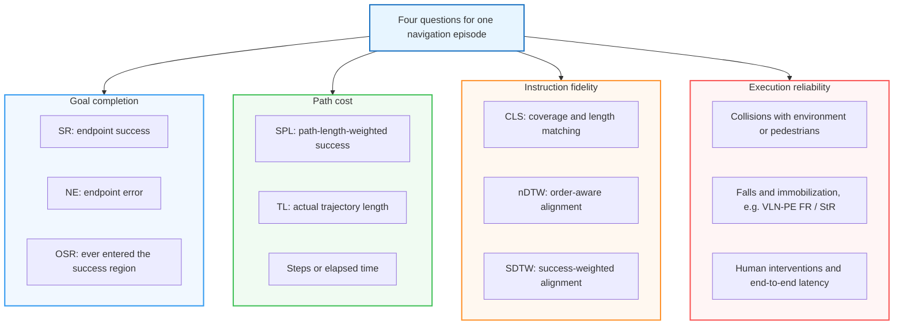

Definitions in the first three groups are relatively consistent across benchmarks. For the fourth, counting units, thresholds, and episode termination depend on the benchmark; see Section 8.4.

<a id="81-评测体系总览与设计哲学"></a>

## 8.1 Fix the protocol before interpreting metrics
{: id="81-先固定评测协议再解释指标"}

Record task and split, sensors and field of view, depth/pose/map access, action interface, stop and timeout rules, distance function, success threshold, extra training data, and inference budget. R2R graphs, Habitat navigable surfaces, and aerial scenes are different distance spaces.

| Intended claim | Minimum reporting | What this does not establish |
|:---|:---|:---|
| Easier goal arrival | SR, NE, OSR | Following intermediate instructions |
| More efficient travel | SR, SPL, actual path length | Faster inference or lower energy consumption |
| More faithful instruction execution | nDTW / SDTW, optionally CLS | All aspects of language understanding |
| More accurate object finding | Navigation + appropriate grounding metrics | Equal difficulty of general ObjectNav and referring-expression navigation |
| Better real-robot suitability | Real completion, collisions, interventions, latency, failure categories | Equal reliability on other robots and environments |

### 8.1.1 Typical trajectories and their metric responses
{: id="811-典型轨迹形态与多维指标响应矩阵"}

These are illustrations for understanding metrics, not results from a particular paper. Assume an instruction requires visiting landmarks before reaching the endpoint:

| Behavior | SR | SPL | nDTW / CLS | Interpretation |
|:---|:---|:---|:---|:---|
| Follows the instruction, arrives, and stops correctly | Success | Depends on deviation from shortest path | Usually high | Meets both route and endpoint requirements |
| Skips landmarks and takes a shortcut | May still succeed | May be high | Usually lower | Arrival does not establish path fidelity |
| Repeatedly enters rooms before finally arriving | May still succeed | Clearly lower | Usually lower | Success may come from excessive exploration; inspect TL |
| Follows most of the route but fails at the endpoint | Failure | 0 | May still be high | Path similarity does not establish completion; SDTW is 0 |
| Passes the goal and keeps moving away | May fail | 0 if failed | Trajectory-dependent | OSR–SR gap motivates inspection of stopping and execution |

<a id="812-场景化指标选型决策树"></a>

### 8.1.2 Choosing metrics by setting
{: id="812-场景化指标选型"}

Route following needs both endpoint and path measures; goal search needs search success and target verification; dialogue tasks must specify whether active questions are allowed; physical robots need execution-failure measures. Use each task's official success definition rather than applying a universal 3 m endpoint threshold.

The diagram helps choose metric groups. Multiple branches may apply: referring-expression navigation in a physical environment needs both target recognition and execution-safety evaluation.

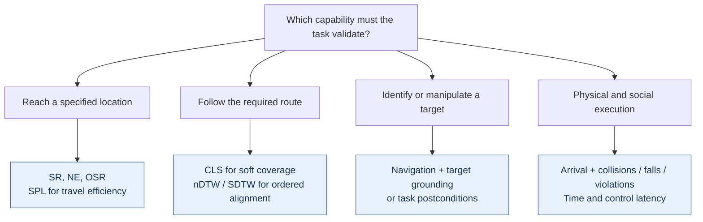

Retain per-episode results after selecting metrics. Overall means can hide substantial degradation on long routes, particular languages or robots, or specific failure conditions.

### 8.1.3 Core metric overview
{: id="813-核心评估指标全景矩阵"}

| Metric | Main question | Direction | Key limitation |
|:---|:---|:---|:---|
| SR | Was the final outcome successful? | ↑ | Success criteria depend on the task |
| NE | How far from the goal at stopping? | ↓, usually meters | Specify the distance function |
| OSR | Did the trajectory ever enter the success region? | ↑ | Diagnoses arrival opportunities; does not guarantee an implementable policy |
| SPL | Was successful travel efficient? | ↑, 0–1 or percentage | Shortest-path efficiency differs from instruction fidelity |
| CLS | How well are reference coverage and length matched? | ↑, 0–1 or percentage | No explicit order alignment |
| nDTW | How close is the trajectory to the reference under order constraints? | ↑, 0–1 or percentage | Depends on sampling, distance function, and reference annotations |
| SDTW | Was the trajectory successful and close to the reference? | ↑, 0–1 or percentage | Failed trajectories score 0; analyze with nDTW |
| TL | How far did the agent travel? | No universally preferred direction; usually meters | Interpret with SR and reference length; short travel may mean premature stopping |
| RGS / RGSPL | Was the referred target object selected correctly? | ↑ | Specific to REVERIE-like tasks; disclose object candidates and decision criteria |

### 8.1.4 Metric discrepancies and diagnostic directions
{: id="814-常见指标反差与排查方向"}

| Observation | Possible cause | How to verify |
|:---|:---|:---|
| OSR substantially exceeds SR | Stopping, target verification, control drift, timeout | Replay behavior after first entering the success region |
| SR rises but SPL falls | More exploration produces longer paths | Paired comparison of successful episodes and actual lengths |
| High SPL but low nDTW | Shortcuts or skipped landmarks | Check whether reference paths deliberately differ from shortest paths |
| Large Seen–Unseen gap | Scene overfitting or task-distribution differences | Group by length, instruction type, and scene difficulty |
| Strong simulation but weak real-world results | Perception, synchronization, dynamics, or environment shifts | Measure perception, planning, and execution errors separately |

These are hypotheses to test. Multiple mechanisms can produce the same discrepancy; it does not justify immediately concluding that a model lacks reasoning or merely memorizes.

## 8.2 Goal completion and localization accuracy
{: id="82-目标达成与定位精度指标"}

### 8.2.1 Success Rate (SR)
{: id="821-success-rate-sr"}

Let $S_i\in\{0,1\}$ be the official success indicator for episode $i$, over $N$ evaluation trajectories:

$$
\mathrm{SR}=\frac{1}{N}\sum_{i=1}^{N}S_i.
$$

Success may require endpoint distance, an explicit stop, target visibility, or object recognition. Preserve these conditions in reporting. Whether timeout-truncated episodes count as success also depends on the evaluator.

### 8.2.2 Navigation Error (NE)
{: id="822-navigation-error-ne"}

Let $x_i^{\mathrm{end}}$ be the terminal position, $g_i$ the goal, and $d$ the benchmark distance function:

$$
\mathrm{NE}=\frac{1}{N}\sum_{i=1}^{N}d(x_i^{\mathrm{end}},g_i).
$$

Classic graph navigation generally uses shortest graph distance; continuous navigation commonly uses geodesic distance over navigable surfaces. Neither should universally be rewritten as Euclidean distance. If multiple goal positions are valid, explain how the goal set is handled. See the [official RxR metric documentation](https://github.com/google-research-datasets/RxR).

### 8.2.3 Oracle Success Rate (OSR)
{: id="823-oracle-success-rate-osr"}

For tasks with a goal-distance threshold $\tau$, OSR checks whether the trajectory ever entered the success region:

$$
\mathrm{OSR}=\frac{1}{N}\sum_{i=1}^{N}\mathbb{1}\!\left[\min_t d(x_i^t,g_i)<\tau\right].
$$

Follow the official implementation for strict versus non-strict thresholds. OSR cannot replace an actual stopping policy: accidentally passing the goal can raise it. When SR and OSR share distance and sampling conventions, their gap can help diagnose stopping-related problems.

**Teaching example: passing a goal differs from stopping correctly.** Assume success depends only on distance to the goal at stopping, with a 3 m threshold and the same distance definition throughout.

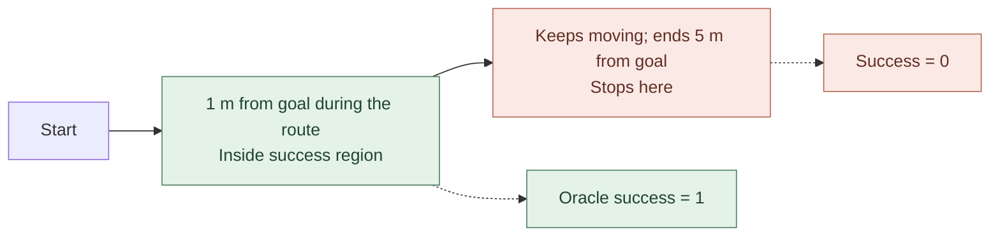

This gap motivates inspection of stopping, target recognition, and backtracking. High OSR alone does not prove accurate localization: the trajectory may pass the goal accidentally, or the model may never recognize that it has seen it.

## 8.3 Path efficiency and instruction fidelity
{: id="83-路径效率与指令保真度指标"}

### 8.3.1 Success weighted by Path Length (SPL)
{: id="831-success-weighted-by-path-length-spl"}

Let $l_i$ be the shortest feasible start-to-goal path length and $p_i$ the actual traveled length:

$$
\mathrm{SPL}=\frac{1}{N}\sum_{i=1}^{N}S_i\frac{l_i}{\max(l_i,p_i)}.
$$

Compute the score per trajectory and then average; it is not SR multiplied by mean efficiency over all trajectories. Follow the benchmark implementation for degenerate cases such as zero lengths. See the [original SPL evaluation recommendations](https://arxiv.org/abs/1807.06757).

For two trajectories, if one succeeds with efficiency 0.5 and the other fails, SR is 0.5 and SPL is 0.25. SPL measures travel efficiency; extra generated tokens, network waiting, or stationary computation time do not automatically enter its denominator.

**Four trajectory examples**: in one straight corridor, the shortest distance from start to the exact goal is 10 m, the success threshold is 3 m, and every agent explicitly stops. The diagram shows behavioral categories, not spatial scale.

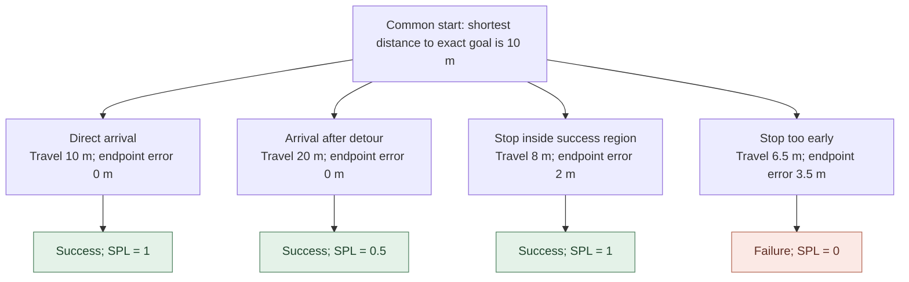

| Behavior | $S_i$ | Efficiency $l_i / \max(l_i,p_i)$ | Episode SPL |
|:---|:---:|:---:|:---:|
| Direct arrival | 1 | $10/10=1$ | 1 |
| Arrival after detour | 1 | $10/20=0.5$ | 0.5 |
| Stop 2 m before the goal | 1 | $10/10=1$ | 1 |
| Stop 3.5 m before the goal | 0 | $10/10=1$ | 0 |

Together, these four yield SR 0.75 and SPL 0.625. The third travels less than the shortest distance to the **exact goal** because it stops within the success region, not because it beats the shortest path in the same geometry. `max` caps efficiency at 1. If a benchmark defines $l_i$ to the goal region, recalculate according to that implementation.

SPL assigns zero to failures and an inverse-length penalty to successful but excessive travel. It does not require visiting every instructed landmark. When instructions require a detour, faithful execution can lower SPL, motivating path-fidelity metrics.

### 8.3.2 Coverage weighted by Length Score (CLS)
{: id="832-coverage-weighted-by-length-score-cls"}

For reference path $R$ and predicted path $P$, define point-to-path distance as $d(r,P)=\min_{p\in P}d(r,p)$. CLS combines soft coverage with length matching:

$$
\mathrm{PC}=\frac{1}{|R|}\sum_{r\in R}\exp\!\left(-\frac{d(r,P)}{d_{th}}\right),\qquad
\mathrm{EPL}=\mathrm{PC}\cdot L(R),
$$

$$
\mathrm{CLS}=\mathrm{PC}\cdot\frac{\mathrm{EPL}}{\mathrm{EPL}+|\mathrm{EPL}-L(P)|}.
$$

Here $L$ denotes path length and $d_{th}$ is a distance scale. CLS encourages coverage of route nodes but imposes no explicit visit order; use nDTW to assess sequence. See the [original CLS paper](https://arxiv.org/abs/1905.12255).

**Two steps in the formula**: PC measures how far reference locations are from anywhere on the traveled path; LS checks whether actual length is proportionate to the covered portion. Because point-to-path distance takes a minimum, PC alone does not check visit order.

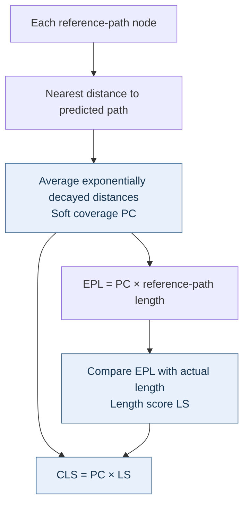

| Teaching example: $L(R)=20$ m | Assumed PC | $L(P)$ | EPL | LS | CLS |
|:---|:---:|:---:|:---:|:---:|:---:|
| Full coverage and matching length | 1 | 20 m | 20 m | 1 | 1 |
| Full coverage with extra detour | 1 | 30 m | 20 m | $2/3$ | $2/3$ |
| Limited soft coverage but length matches EPL | 0.5 | 10 m | 10 m | 1 | 0.5 |

PC values here are chosen for illustration, not measured from a route diagram; 0.5 does not mean exactly half the nodes were visited. Even when every reference point lies within $d_{th}$, PC need not approach 1: a point exactly $d_{th}$ away contributes only $e^{-1}\approx0.368$.

CLS can reveal arrival that skips parts of the reference route, but identical coverage sets can have different visit orders. This motivates DTW alignment below.

### 8.3.3 normalized Dynamic Time Warping (nDTW & SDTW)
{: id="833-normalized-dynamic-time-warping-ndtw--sdtw"}

DTW finds order-constrained path alignments while allowing different sample counts. Common normalized and success-weighted forms are:

$$
\mathrm{nDTW}(R,P)=\exp\!\left(-\frac{\mathrm{DTW}(R,P)}{|R|d_{th}}\right),\qquad
\mathrm{SDTW}=\frac{1}{N}\sum_{i=1}^{N}S_i\,\mathrm{nDTW}(R_i,P_i).
$$

Dataset nDTW is also calculated per episode and then averaged. Order alignment better captures route constraints than coverage alone, but still depends on reference quality. See the [original nDTW paper](https://arxiv.org/abs/1907.05446).

**Implementation limits**: do not assume NE's goal distance and DTW's point-pair distance are identical. Continuous implementations also choose sampling, deduplication, and approximate-DTW procedures. Pin evaluator code rather than copying formulas alone. See the [VLN-CE metric implementation](https://github.com/jacobkrantz/VLN-CE/blob/master/habitat_extensions/measures.py).

**Why not subtract corresponding steps directly?** For reference A→B→C and prediction A→A→B→C, index-wise comparison mismatches B with A at the second step. DTW allows multiple samples to match one reference point while preserving order.

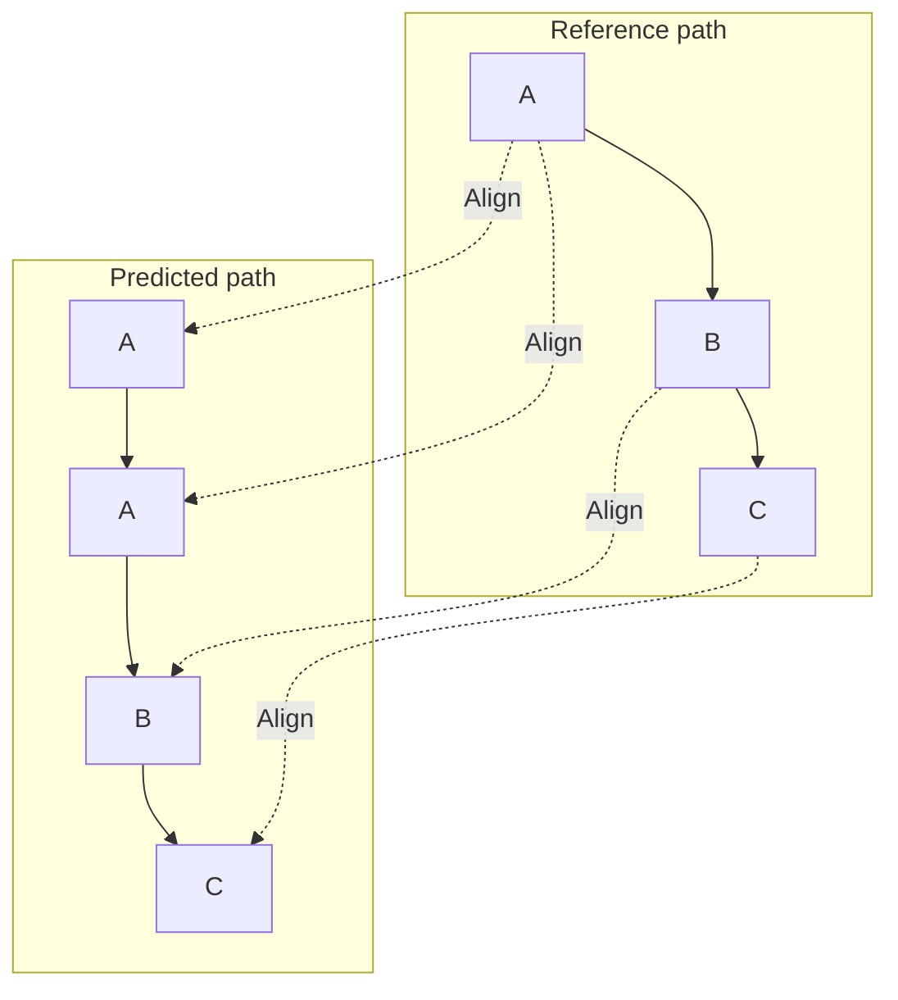

With exactly repeated positions in this example, alignment cost can be zero. Real displacement, sampling, and noise still affect DTW; it is not universally invariant to speed and sampling. A→C→B→C visits the same landmarks but generally cannot achieve the same zero-cost ordered alignment.

DTW's accumulated cost can be expressed by this recurrence, where $D(a,b)$ is the minimum alignment cost for the two path prefixes, with standard DTW boundary initialization:

$$
D(a,b)=d(r_a,p_b)+\min\{D(a-1,b),D(a,b-1),D(a-1,b-1)\}.
$$

For example, if $\lvert R\rvert=4$, $d_{th}=3$ m, and DTW is 6 m, nDTW is $e^{-0.5}\approx0.607$. If that episode fails, its SDTW is 0. With a second successful episode at nDTW 0.8, mean nDTW is about 0.704 and mean SDTW is 0.4. Apply success weighting per episode; overall SR times overall nDTW is not a substitute.

## 8.4 Embodied safety, physical interaction, and deployment metrics
{: id="84-具身安全物理交互与部署级指标"}

### 8.4.1 Geometric obstacle avoidance and social safety
{: id="841-几何避障与社交安全指标"}

Collisions can be counted per action step, contact event, or episode, yielding different denominators. Define Collision Rate / Human Collision Rate explicitly and report completion alongside them, avoiding apparent safety from remaining stationary. Personal-space violations are also broader than physical contact.

### 8.4.2 Dynamic stability and irreversible failures
{: id="842-动力学稳定性与不可逆故障指标"}

Record falls, immobilization, emergency stops, and manual resets separately. Specify pose or time thresholds, recovery budgets, and whether resets terminate an episode. Different embodiments have different failure modes; do not combine them into an unconditional embodied-success score.

### 8.4.3 System efficiency and real-time control
{: id="843-系统级效率与控制实时性指标"}

Report camera-to-action end-to-end latency, including mean and tail latency, hardware, batch size, resolution, history length, and model invocation mode. Also report control frequency, GPU memory, API/token costs, task time, and human interventions. A model's forward-pass FPS is not the robot's effective control frequency.

## 8.5 Evaluation protocols and their development
{: id="85-评测协议规范与演进趋势"}

### 8.5.1 Val-Seen and Val-Unseen boundaries
{: id="851-val-seen-与-val-unseen-的划分与边界"}

Seen / Unseen usually split benchmark scenes to measure scene generalization within the same task. They do not guarantee that large-scale pretraining excluded related buildings, images, or derived assets, nor establish cross-robot, cross-language, or real-world generalization.

### 8.5.2 Fair comparison checklist
{: id="852-公平对比检查清单-fair-comparison-checklist"}

- **Same inputs**: camera count, field of view, depth, pose, and map access.
- **Same task**: data version, language subset, episodes, goals, and stopping criteria.
- **Same execution**: action space, controller, step/time budgets, sliding, and collision configuration.
- **Transparent resources**: extra training data, backbone, tool calls, search/retry counts, and compute budget.
- **Inspectable statistics**: success and total counts; repeated runs or confidence intervals for stochastic tasks, with sampling methods explained.

<a id="853-评测体系的历史演进与代际跃迁"></a>

### 8.5.3 From leaderboard scores to reproducible evidence
{: id="853-从榜单成绩到可复现证据"}

Identify the paper version and result table first, then check the official evaluator. The VLN-CE repository has explicitly noted that SPL differences between a paper and leaderboard for the same baseline relate to hardware and Habitat builds. Protocols and implementations are themselves part of the experiment. See the [official reproduction notes](https://github.com/jacobkrantz/VLN-CE#baseline-performance).

The companion  help locate methods and original results. Until the above checks are completed, scores from different articles or versions are reading pointers, not evidence for causal claims of architectural superiority.


# 9. Learning resources and frameworks
{: id="9-学习资源与框架"}

A useful learning order is classic tasks → continuous environments → foundation models → real deployment. Reproduce R2R / VLN-CE baselines and learn Habitat episodes, sensors, and metrics; then study streaming VLA, fast-slow systems, and spatial memory; finally move to agents, world models, and real robots. Starting with the latest large model can obscure differences caused by protocols and action interfaces.

**Companion resources on this site:**

- : detailed readings, performance, and open-source status organized by task setting.
- : foundations of 3D representations, maps, and spatial reasoning.
- : predictive models, world-action models, and data engines.
- : SLAM, global/local planning, and controllers, complementing fast systems in Section 3.3 and deployment metrics in Section 8.4.
- : vision-language-action training paradigms and action-interface design.

**[VLN-Survey-with-Foundation-Models](https://github.com/zhangyuejoslin/VLN-Survey-with-Foundation-Models)**
- **Type**: GitHub resource repository.
- **Focus**: VLN in the LLM/VLM era (2023–present), with ongoing paper updates.
- **Audience**: researchers studying how large models are changing VLN.

**[Awesome-Embodied-AI](https://github.com/jonyzhang2023/awesome-embodied-vla-va-vln)**
- **Type**: full-stack resource collection.
- **Focus**: the embodied-intelligence stack, including VLN, VLA, and robot manipulation.
- **Audience**: researchers seeking a systematic overview of embodied AI.

**[Embodied-AI-Guide](https://github.com/TianxingChen/Embodied-AI-Guide)**
- **Type**: introductory tutorials and practical guidance.
- **Focus**: code exercises, paper explanations, and learning paths.
- **Audience**: beginners or readers needing a structured learning path.

**[Vision-and-Language Navigation: A Survey of Tasks, Methods, and Future Directions](https://arxiv.org/abs/2203.12667)**
- **Type**: survey paper (Gu et al., ACL 2022).
- **Focus**: the development of VLN, covering tasks, methods, and evaluation from 2018–2022.
- **Audience**: researchers seeking a broad historical view of VLN.

**[Vision-and-Language Navigation Today and Tomorrow: A Survey in the Era of Foundation Models](https://arxiv.org/abs/2407.07035)**
- **Type**: survey paper (Zhang et al., 2024), accompanying the VLN-Survey-with-Foundation-Models repository above.
- **Focus**: reorganizes VLN around foundation models and discusses convergence with world models, human models, and VLA.
- **Audience**: researchers approaching VLN from the large-model perspective.

---


## 9.1 Conferences and workshops
{: id="91-重要会议与研讨会"}

**Embodied-intelligence venues:**
- **[Embodied AI Workshop](https://embodied-ai.org/)** — a CVPR workshop featuring recent directions and challenges.
- **[CoRL](https://www.corl.org/)** (Conference on Robot Learning) — a major venue for VLN transfer to real robots.
- **[RSS](https://roboticsconference.org/)** (Robotics: Science and Systems) — a leading robotics conference with emphasis on sim-to-real.

**Common conference emphases:**

| Conference | Common emphasis |
|:----:|:-----------|
| **CVPR / ICCV / ECCV** | Vision-language modeling, spatial representations, datasets, benchmarks |
| **NeurIPS / ICLR** | Foundation models, reinforcement learning, generative models, training at scale |
| **CoRL / RSS** | Robot learning, real deployment, cross-embodiment generalization |
| **ICRA / IROS** | Navigation systems, control, simulation platforms, engineering validation |

---

<a id="survey-practice"></a>

## 9.2 From paper to experiment: a reproducible workflow
{: id="92-从论文到实验一条可复现的实施路径"}

This survey proposes the following workflow for turning methods from the companion readings into comparable systems.

| Stage | First task | Inspectable artifacts |
|:---|:---|:---|
| Fix the task | Establish instruction type, observations, action interface, embodiment, success conditions | Configuration including data version, split, sensors, stopping rules |
| Reproduce a baseline | Use paper-matched code and weights on the standard validation set | Per-episode results, configuration, code revision, aggregate metrics |
| Diagnose weaknesses | Replay failures; separate understanding, memory, planning, execution, stopping | Failure categories and representative trajectories beyond mean SR |
| Test a change | Control one variable at a time with matched episodes and budgets | Paired results, module ablations, variation across seeds |
| Check generalization | Evaluate unseen scenes and explicitly defined perturbations | Results by scene, route length, and perturbation type |
| Integrate a robot | Verify coordinates, timestamps, action scales, trajectory validity, execution feedback | End-to-end latency, collisions, recovery, interventions, real failure logs |

**Completed inference does not guarantee a still-valid action.** Camera capture, encoding, generation, communication, and actuation jointly determine loop latency. When the slow system returns a subgoal, the robot may already have left the relevant viewpoint. Define when old goals expire, when to replan, and what the fast system does while waiting. Report measurement boundaries, hardware, batch sizes, and control frequency alongside model FPS.

**Choose methods by tracing back from failure evidence.** Repeated visits on long routes suggest checking memory and map updates; reaching the goal vicinity without success suggests stopping and target verification; correct semantic goals with frequent collisions suggest reachability, action interfaces, and controllers. Metric gaps provide clues; trajectory replay and controlled experiments must establish causes.

<a id="survey-open-questions"></a>

## 9.3 Established evidence, open questions, and research judgments
{: id="93-已有证据开放问题与研究判断"}

The reviewed work supports several **conclusions with explicit scope**: R4R and path metrics show the need to measure arrival and instruction fidelity separately; ETPNav and DualVLN demonstrate concrete planning/execution divisions; ScaleVLN establishes training resources as an important performance variable; VLN-PE provides experimental evidence that visual and physical gaps affect navigation. These findings come from [path-following research](https://arxiv.org/abs/1905.12255), [continuous graph planning](https://arxiv.org/abs/2304.03047), [dual-system design](https://arxiv.org/abs/2512.08186), [data scaling](https://arxiv.org/abs/2307.15644), and [physical embodiment evaluation](https://arxiv.org/abs/2507.13019). They do not establish one optimal architecture for every task.

The table proposes open questions and evaluation approaches based on that evidence. **These are research judgments, not a field-wide consensus.**

| Open question | Why current results are insufficient | More discriminating evaluation |
|:---|:---|:---|
| When is explicit mapping worthwhile? | Map-based and implicit models often use different sensors and pose priors | Fix inputs; compare by route length, occlusion, and pose noise |
| Which language information does the model use? | High SR may mainly reflect endpoint cues | Keep the goal fixed; change route order, negation, and turn constraints; inspect trajectory responses |
| Can memory correct its own errors? | Long retention in static scenes does not establish dynamic updating | Move objects, block routes, inject wrong observations; inspect correction and forgetting |
| Does reflection yield reliable recovery? | Longer reasoning and more retries may both raise success | Fix invocation budgets and injected failures; compare recovery, extra travel, and failure escalation |
| When do world models outperform direct policies? | Generation quality differs from execution benefit | Compare no prediction, candidate ranking, and joint generation under matched budgets; report long-rollout distortion |
| How far does general capability transfer? | Multitask scores on one platform do not establish cross-morphology transfer | Hold out languages, assets, robots, and control interfaces; report adaptation required for each |
| Do simulation gains predict deployment gains? | Real tests often use different environments and intervention rules | Fix tasks, starts, and recovery budgets; release failed trajectories and intervention logs |

**This survey recommends** first building replayable, attributable failure analysis, then choosing model changes. If local execution dominates failures, a larger language model may not be the most direct remedy. If stopping and route constraints dominate, mean SR alone may hide useful improvements. Progress should explain under which conditions a failure class was reduced and at what cost.

<a id="survey-scope"></a>

## 9.4 Scope and maintenance
{: id="94-本文覆盖范围与维护方式"}

This is a problem-oriented narrative survey covering route-instruction navigation and related goal-navigation, interaction, and embodied-control work. It is not a systematic review with exhaustive search and exclusion procedures. Boundaries are stated where other tasks inform mechanisms; general VLA and manipulation papers are not treated as direct performance evidence for standard VLN.

The most recent source verification date is **2026-09-26**, focusing on data-counting conventions, platform support, core metrics, and cross-paper design differences. Changeable data are tied to paper versions or data-card sources; entries without a confirmed independent protocol retain uncertainty notes. Other work is available through companion paper readings. This survey does not claim to have independently reproduced every experiment or verified all leaderboard results.


# 10. References
{: id="10-参考资料"}

> **Detailed paper readings**: see  and . This section lists datasets, methods, simulators, and surveys directly discussed above, grouped by topic with continuous numbering. For preprint publication status and leaderboard values, consult paper homepages and the companion readings.

---

## 10.1 Datasets and benchmarks
{: id="101-数据集与基准"}

### 10.1.1 Instruction-oriented and continuous-environment datasets
{: id="1011-指令导向与连续环境数据集"}

1. **R2R** — Anderson et al., *Vision-and-Language Navigation: Interpreting Visually-Grounded Navigation Instructions in Real Environments*, CVPR 2018. [[Paper]](https://arxiv.org/abs/1711.07280)
2. **R4R** — Jain et al., *Stay on the Path: Instruction Fidelity in Vision-and-Language Navigation*, ACL 2019. [[Paper]](https://arxiv.org/abs/1905.12255)
3. **RxR** — Ku et al., *Room-Across-Room: Multilingual Vision-and-Language Navigation with Dense Spatiotemporal Grounding*, EMNLP 2020. [[Paper]](https://arxiv.org/abs/2010.07954)
4. **VLN-CE** — Krantz et al., *Beyond the Nav-Graph: Vision-and-Language Navigation in Continuous Environments*, ECCV 2020. [[Paper]](https://arxiv.org/abs/2004.02857)
5. **RxR-CE** — RxR adapted to continuous Habitat environments, released with VLN-CE for the RxR-Habitat challenge (CVPR Embodied AI Workshop). [[Code]](https://github.com/jacobkrantz/VLN-CE)
6. **ScaleVLN** — Wang et al., *Scaling Data Generation in Vision-and-Language Navigation*, ICCV 2023. [[Paper]](https://arxiv.org/abs/2307.15644)
7. **VLN-PE** — Wang et al., *Rethinking the Embodied Gap in Vision-and-Language Navigation: A Holistic Study of Physical and Visual Disparities*, ICCV 2025. [[Paper]](https://arxiv.org/abs/2507.13019)
8. **InternData-N1** — InternRobotics (Shanghai AI Laboratory), large-scale synthetic navigation data for InternVLA-N1 in LeRobot format, 2025. [[Dataset]](https://huggingface.co/datasets/InternRobotics/InternData-N1) [[Code]](https://github.com/InternRobotics/InternNav)
9. **VLNVerse** — Lin et al., *VLNVerse: A Benchmark for Vision-Language Navigation with Versatile, Embodied, Realistic Simulation and Evaluation*, arXiv 2025. [[Paper]](https://arxiv.org/abs/2512.19021)

### 10.1.2 Goal-oriented and long-horizon planning datasets
{: id="1012-目标导向与长程规划数据集"}

10. **REVERIE** — Qi et al., *REVERIE: Remote Embodied Visual Referring Expression in Real Indoor Environments*, CVPR 2020. [[Paper]](https://arxiv.org/abs/1904.10151)
11. **REVERIE-CE** — A family of continuous-environment adaptations without a unified official protocol. Cite the specific paper's conversion implementation; see Section 6.3.2.
12. **SOON** — Zhu et al., *SOON: Scenario Oriented Object Navigation with Graph-based Exploration*, CVPR 2021. [[Paper]](https://arxiv.org/abs/2103.17138)
13. **LHPR-VLN** — Song et al., *Towards Long-Horizon Vision-Language Navigation: Platform, Benchmark and Method*, CVPR 2025. [[Paper]](https://arxiv.org/abs/2412.09082)

### 10.1.3 Dialog-based and socially aware datasets
{: id="1013-对话式与社交感知数据集"}

14. **CVDN** — Thomason et al., *Vision-and-Dialog Navigation*, CoRL 2019. [[Paper]](https://arxiv.org/abs/1907.04957)
15. **TEACh** — Padmakumar et al., *TEACh: Task-driven Embodied Agents that Chat*, AAAI 2022. [[Paper]](https://arxiv.org/abs/2110.00534)
16. **HA-VLN** — Li et al., *Human-Aware Vision-and-Language Navigation: Bridging Simulation to Reality with Dynamic Human Interactions*, NeurIPS 2024 Datasets and Benchmarks Track. [[Paper]](https://arxiv.org/abs/2406.19236)
17. **HA-VLN 2.0** — Dong et al., *HA-VLN 2.0: An Open Benchmark and Leaderboard for Human-Aware Navigation in Discrete and Continuous Environments*, IROS 2026 (first posted to arXiv in 2025; checked v5). [[Paper]](https://arxiv.org/abs/2503.14229v5)

### 10.1.4 Demand-oriented, outdoor, and aerial datasets
{: id="1014-需求导向室外街景与空中数据集"}

18. **DDN** — Wang et al., *Find What You Want: Learning Demand-conditioned Object Attribute Space for Demand-driven Navigation*, NeurIPS 2023. [[Paper]](https://arxiv.org/abs/2309.08138)
19. **Touchdown** — Chen et al., *Touchdown: Natural Language Navigation and Spatial Reasoning in Visual Street Environments*, CVPR 2019. [[Paper]](https://arxiv.org/abs/1811.12354)
20. **StreetLearn** — Mirowski et al., *The StreetLearn Environment and Dataset*, arXiv 2019. [[Paper]](https://arxiv.org/abs/1903.01292)
21. **AerialVLN** — Liu et al., *AerialVLN: Vision-and-Language Navigation for UAVs*, ICCV 2023. [[Paper]](https://arxiv.org/abs/2308.06735)
22. **CityNav** — Lee et al., *CityNav: A Large-Scale Dataset for Real-World Aerial Navigation*, ICCV 2025（arXiv 2024）. [[Paper]](https://arxiv.org/abs/2406.14240)
23. **OpenFly** — Gao et al., *OpenFly: A Comprehensive Platform for Aerial Vision-Language Navigation*, ICLR 2026 (first posted to arXiv in 2025; checked v7). [[Paper]](https://arxiv.org/abs/2502.18041v7)

---

## 10.2 Core models and methods
{: id="102-核心模型与方法"}

### 10.2.1 Cross-modal alignment and pretraining
{: id="1021-跨模态对齐与预训练"}

24. **PREVALENT** — Hao et al., *Towards Learning a Generic Agent for Vision-and-Language Navigation via Pre-training*, CVPR 2020. [[Paper]](https://arxiv.org/abs/2002.10638)
25. **VLN-BERT** — Majumdar et al., *Improving Vision-and-Language Navigation with Image-Text Pairs from the Web*, ECCV 2020. [[Paper]](https://arxiv.org/abs/2004.14973)
26. **Recurrent VLN-BERT** — Hong et al., *A Recurrent Vision-and-Language BERT for Navigation*, CVPR 2021. [[Paper]](https://arxiv.org/abs/2011.13922)
27. **HAMT** — Chen et al., *History Aware Multimodal Transformer for Vision-and-Language Navigation*, NeurIPS 2021. [[Paper]](https://arxiv.org/abs/2110.13309)

### 10.2.2 Topological graphs, semantic maps, and spatial memory
{: id="1022-拓扑图语义地图与空间记忆"}

28. **DUET** — Chen et al., *Think Global, Act Local: Dual-scale Graph Transformer for Vision-and-Language Navigation*, CVPR 2022. [[Paper]](https://arxiv.org/abs/2202.11742)
29. **ETPNav** — An et al., *ETPNav: Evolving Topological Planning for Vision-Language Navigation in Continuous Environments*, IEEE TPAMI 2024. [[Paper]](https://arxiv.org/abs/2304.03047)
30. **LagMemo** — Zhou et al., *LagMemo: Language 3D Gaussian Splatting Memory for Multi-modal Open-vocabulary Multi-goal Visual Navigation*, arXiv 2025. [[Paper]](https://arxiv.org/abs/2510.24118)

### 10.2.3 Fast-slow dual systems and navigation foundation models
{: id="1023-快慢双系统与导航基础模型"}

31. **DualVLN** — Wei et al., *Ground Slow, Move Fast: A Dual-System Foundation Model for Generalizable Vision-and-Language Navigation*, arXiv 2025. [[Paper]](https://arxiv.org/abs/2512.08186)
32. **NaVILA** — Cheng et al., *NaVILA: Legged Robot Vision-Language-Action Model for Navigation*, RSS 2025. [[Paper]](https://arxiv.org/abs/2412.04453)
33. **NavDP** — Cai et al., *NavDP: Learning Sim-to-Real Navigation Diffusion Policy with Privileged Information Guidance*, arXiv 2025. [[Paper]](https://arxiv.org/abs/2505.08712)
34. **InternVLA-N1** — InternRobotics (Shanghai AI Laboratory), *InternVLA-N1: An Open Dual-System Vision-Language Navigation Foundation Model with Learned Latent Plans*, 2025. [[Code]](https://github.com/InternRobotics/InternNav)
35. **OmniNav** — Xue et al., *OmniNav: A Unified Framework for Prospective Exploration and Visual-Language Navigation*, arXiv 2025. [[Paper]](https://arxiv.org/abs/2509.25687)
36. **Qwen-RobotNav** — Zhang et al., *Qwen-RobotNav Technical Report: A Scalable Navigation Model Designed for an Agentic Navigation System*, arXiv 2026. [[Paper]](https://arxiv.org/abs/2606.18112)

### 10.2.4 End-to-end video VLMs and continuous-environment policies
{: id="1024-端到端视频-vlm-与连续环境策略"}

37. **Waypoint Models** — Krantz et al., *Waypoint Models for Instruction-guided Navigation in Continuous Environments*, ICCV 2021. [[Paper]](https://arxiv.org/abs/2110.02207)
38. **NaVid** — Zhang et al., *NaVid: Video-based VLM Plans the Next Step for Vision-and-Language Navigation*, RSS 2024. [[Paper]](https://arxiv.org/abs/2402.15852)
39. **StreamVLN** — Wei et al., *StreamVLN: Streaming Vision-and-Language Navigation via SlowFast Context Modeling*, ICRA 2026 (first posted to arXiv in 2025; checked v2). [[Paper]](https://arxiv.org/abs/2507.05240v2)

### 10.2.5 Low-level visual navigation policies
{: id="1025-底层视觉导航策略"}

40. **DD-PPO** — Wijmans et al., *DD-PPO: Learning Near-Perfect PointGoal Navigators from 2.5 Billion Frames*, ICLR 2020. [[Paper]](https://arxiv.org/abs/1911.00357)
41. **GNM** — Shah et al., *GNM: A General Navigation Model to Drive Any Robot*, ICRA 2023. [[Paper]](https://arxiv.org/abs/2210.03370)
42. **ViNT** — Shah et al., *ViNT: A Foundation Model for Visual Navigation*, CoRL 2023. [[Paper]](https://arxiv.org/abs/2306.14846)
43. **NoMaD** — Sridhar et al., *NoMaD: Goal Masked Diffusion Policies for Navigation and Exploration*, ICRA 2024. [[Paper]](https://arxiv.org/abs/2310.07896)
44. **ViPlanner** — Roth et al., *ViPlanner: Visual Semantic Imperative Learning for Local Navigation*, ICRA 2024. [[Paper]](https://arxiv.org/abs/2310.00982)

### 10.2.6 World models and world-action models
{: id="1026-世界模型与世界动作模型"}

45. **Navigation World Models (NWM)** — Bar et al., *Navigation World Models*, CVPR 2025. [[Paper]](https://arxiv.org/abs/2412.03572) [[Project]](https://www.amirbar.net/nwm/)
46. **Dynam3D** — Wang et al., *Dynam3D: Dynamic Layered 3D Tokens Empower VLM for Vision-and-Language Navigation*, NeurIPS 2025. [[Paper]](https://arxiv.org/abs/2505.11383)
47. **WMNav** — Nie et al., *WMNav: Integrating Vision-Language Models into World Models for Object Goal Navigation*, IROS 2025. [[Paper]](https://arxiv.org/abs/2503.02247) [[Project]](https://b0b8k1ng.github.io/WMNav/)
48. **AstraNav-World** — Chen et al., *AstraNav-World: World Model for Foresight Control and Consistency*, arXiv 2025. [[Paper]](https://arxiv.org/abs/2512.21714)
49. **NavWAM** — Azuma et al., *NavWAM: A Navigation World Action Model for Goal-Conditioned Visual Navigation*, arXiv 2026. [[Paper]](https://arxiv.org/abs/2606.13494)
50. **DreamVLA** — Zhang et al., *DreamVLA: A Vision-Language-Action Model Dreamed with Comprehensive World Knowledge*, NeurIPS 2025. [[Paper]](https://arxiv.org/abs/2507.04447) [[Project]](https://zhangwenyao1.github.io/DreamVLA/)
51. **NVIDIA Cosmos** — NVIDIA, *Cosmos World Foundation Model Platform for Physical AI*, arXiv 2025. [[Paper]](https://arxiv.org/abs/2501.03575) [[Project]](https://www.nvidia.com/en-us/ai/cosmos/)

### 10.2.7 Agents, self-evolution, and general VLA
{: id="1027-agent自我进化与通用-vla"}

52. **AgentVLN** — Xin et al., *AgentVLN: Towards Agentic Vision-and-Language Navigation*, arXiv 2026. [[Paper]](https://arxiv.org/abs/2603.17670) [[Code]](https://github.com/Allenxinn/AgentVLN)
53. **SE-VLN** — Dong et al., *SE-VLN: A Self-Evolving Vision-Language Navigation Framework Based on Multimodal Large Language Models*, arXiv 2025. [[Paper]](https://arxiv.org/abs/2507.13152)
54. **RT-2** — Brohan et al., *RT-2: Vision-Language-Action Models Transfer Web Knowledge to Robotic Control*, CoRL 2023. [[Paper]](https://arxiv.org/abs/2307.15818)
55. **OpenVLA** — Kim et al., *OpenVLA: An Open-Source Vision-Language-Action Model*, CoRL 2024. [[Paper]](https://arxiv.org/abs/2406.09246)

---

## 10.3 Simulators and scene assets
{: id="103-模拟器与场景资产"}

56. **Matterport3D Simulator** — Anderson et al., CVPR 2018 (released with R2R). [[GitHub]](https://github.com/peteanderson80/Matterport3DSimulator)
57. **Habitat** — Savva et al., *Habitat: A Platform for Embodied AI Research*, ICCV 2019 [[Paper]](https://arxiv.org/abs/1904.01201)；Szot et al., *Habitat 2.0: Training Home Assistants to Rearrange their Habitat*, NeurIPS 2021 [[Paper]](https://arxiv.org/abs/2106.14405)；Puig et al., *Habitat 3.0: A Co-Habitat for Humans, Avatars and Robots*, ICLR 2024 [[Paper]](https://arxiv.org/abs/2310.13724). [[GitHub]](https://github.com/facebookresearch/habitat-lab)
58. **AI2-THOR / ProcTHOR** — Kolve et al., *AI2-THOR: An Interactive 3D Environment for Visual AI*, arXiv 2017 [[Paper]](https://arxiv.org/abs/1712.05474)；Deitke et al., *ProcTHOR: Large-Scale Embodied AI Using Procedural Generation*, NeurIPS 2022 [[Paper]](https://arxiv.org/abs/2206.06994). [[Website]](https://ai2thor.allenai.org/)
59. **Gibson / iGibson / OmniGibson** — Xia et al., *Gibson Env: Real-World Perception for Embodied Agents*, CVPR 2018 [[Paper]](https://arxiv.org/abs/1808.10654); Li et al., *iGibson 2.0: Object-Centric Simulation for Robot Learning of Everyday Household Tasks*, CoRL 2021 [[Paper]](https://arxiv.org/abs/2108.03272); Li et al., *BEHAVIOR-1K*, CoRL 2022 (extended arXiv version, 2024) [[Paper]](https://arxiv.org/abs/2403.09227). [[GitHub]](https://github.com/StanfordVL/iGibson)
60. **AirSim** — Shah et al., *AirSim: High-Fidelity Visual and Physical Simulation for Autonomous Vehicles*, FSR 2017. [[GitHub]](https://github.com/microsoft/AirSim) (see repository notes for maintenance and compatibility) / [[Colosseum]](https://github.com/CodexLabsLLC/Colosseum)
61. **Isaac Sim / Isaac Lab** — NVIDIA; Mittal et al., *Orbit: A Unified Simulation Framework for Interactive Robot Learning Environments* (predecessor of Isaac Lab), IEEE RA-L 2023 [[Paper]](https://arxiv.org/abs/2301.04195). [[Docs]](https://isaac-sim.github.io/IsaacLab/main/index.html)
62. **MuJoCo / MJX** — Todorov et al., *MuJoCo: A Physics Engine for Model-based Control*, IROS 2012; maintained by Google DeepMind. [[GitHub]](https://github.com/google-deepmind/mujoco) / [[Docs]](https://mujoco.readthedocs.io/)
63. **InternUtopia (GRUtopia)** — Wang et al., *GRUtopia: Dream General Robots in a City at Scale*, arXiv 2024. [[Paper]](https://arxiv.org/abs/2407.10943) [[GitHub]](https://github.com/InternRobotics/InternUtopia)

---

## 10.4 Survey papers
{: id="104-综述论文"}

64. Gu et al., *Vision-and-Language Navigation: A Survey of Tasks, Methods, and Future Directions*, ACL 2022. [[Paper]](https://arxiv.org/abs/2203.12667)
65. Zhang et al., *Vision-and-Language Navigation Today and Tomorrow: A Survey in the Era of Foundation Models*, arXiv 2024. [[Paper]](https://arxiv.org/abs/2407.07035) [[GitHub]](https://github.com/zhangyuejoslin/VLN-Survey-with-Foundation-Models)
