# 1. Introduction
{: id="1-引言"}

The ultimate goal of **embodied intelligence (Embodied AI)** is to develop generalist embodied agents that perceive, reason, and act in the complex, continuous, and irreversible physical world, much as humans do. The rise of **vision-language-action (VLA)** models marks a step toward this goal. By fine-tuning the semantic knowledge and visual reasoning capabilities of multimodal language models (LLMs/VLMs), VLA models map open-ended, high-level language instructions to low-level robot control tokens.

However, VLA agents that rely solely on reactive mappings face **four fundamental bottlenecks** in physical deployment:

1. **Physical hallucination and lack of common sense**: Existing VLA models essentially match patterns. Their actions often lack explicit knowledge of rigid-body constraints, gravity, friction, fluid dynamics, and other physical laws, leading to dangerous behavior such as interpenetration, failed grasps, or damage to the environment.
2. **Lack of foresight and plan verification**: Reactive policies cannot mentally rehearse the physical consequences of actions. They struggle to verify counterfactual outcomes before acting, so an error in a long-horizon or irreversible task can cause the entire task to fail.
3. **Scarce interaction data and long-tail distributions**: Collecting high-quality real-robot teleoperation data is costly and hazardous. Limited offline datasets struggle to cover long-tail scenarios and failure distributions.
4. **Safety and irreversibility**: Blind trial and error can damage expensive hardware or endanger people. Agents need mechanisms for self-protection and risk prediction before physical execution.

**World models** are introduced as an agent's **“cognitive brain” and “internal physical simulator.”** By modeling the dynamics of the environment over space and time, they aim to support physical understanding, prediction of future outcomes, large-scale synthetic data generation, and policy improvement through imagined experience.

<figure class="survey-intro-figure">
  
<figcaption>Figure: A world model can predict the evolution of images, states or latent representations for planning, simulation and learning. There are errors in predictions, and future branches in the graph are candidate outcomes, not real observations or physical guarantees.</figcaption>
</figure>

This article refers to reviews such as Tan et al., 2026 [[1]](#ref-1) and Li et al., 2025/2026 [[2]](#ref-2)), organized in the order of "Definition → Classic Foundation → Engineering Design → Two Large Model Families → Basic Model → Evaluation → Challenge": §2 gives a formal definition and classification framework; §3 reviews classic models The three foundational works of RL; §4 dismantles the key design choices of the world model from the perspective of engineering implementation; §5 and §6 respectively introduce the world generator conditioned on camera/interaction, as well as the four major paradigms and representative work that serve robot decision-making; §7 introduces base models and platforms such as Cosmos and Wan; §8 summarizes the evaluation benchmarks; §9 discusses open challenges and practical implications.

---

# 2. Definition, classification and evolution
{: id="2-定义分类与演进"}

## 2.1 What is a world model?
{: id="21-什么是世界模型"}

### Origins of cognitive science
{: id="认知科学起源"}

The concept of "world model" does not originate from deep learning, but is rooted in the deep soil of cognitive science and cybernetics:
- **Mental Models Hypothesis (Mental Models)**: As early as 1943, cognitive scientist Kenneth Craik proposed in *The Nature of Explanation* that the human brain runs a miniature "mental model" inside the head, able to simulate the consequences of alternatives in the mind before actually taking dangerous actions.
- **Free Energy Principle and Predictive Coding (Predictive Coding)**: Karl Friston and others pointed out that the biological brain is essentially a hierarchical prediction machine that understands the world and guides actions by continuously minimizing the prediction error (Prediction Error) between "internal perception prediction" and "external real input".
- **Autonomous Machine Intelligence Architecture (Yann LeCun, 2022)**: Yann LeCun emphasized in his machine intelligence vision that the world model is an indispensable core module for autonomous agents, responsible for predicting the possible evolution of the world based on the current state and candidate actions.

  
<figcaption> Figure: Comparison of the functional positioning of the physical AI world model (Cosmos WM) and the embodied policy model (OpenVLA): the former is responsible for environment evolution and physical simulation, and the latter is responsible for action decision-making and execution.</figcaption>

### Mathematical formalization
{: id="数学形式化"}

In the context of embodied intelligence, the real physical world is typically modeled as a Partially Observable Markov Decision Process (POMDP), described by the tuple $$(\mathcal{S}, \mathcal{A}, \mathcal{O}, \mathcal{T}, \mathcal{E}, \mathcal{R}, \gamma)$$. Since the real state $$s_t \in \mathcal{S}$$ cannot be obtained directly, the agent can only receive high-dimensional visual observations $$o_t \in \mathcal{O}$$ (such as RGB-D images, point cloud).

The core task of **world model** $$\mathcal{W}_\phi$$ is to approximate the joint forward transfer distribution of the environment in compact latent space or pixel space by learning parameters $$\phi$$:

$$
P_\phi(s_{t+1}, o_{t+1}, r_t \mid s_{\le t}, a_t, o_{\le t})
$$

Here:
- **state transition model (Dynamics / Transition Model)**: $$s_{t+1} \sim P_\phi(s_{t+1} \mid s_t, a_t)$$, depicts the internal physical state transition of the environment caused by actions;
- **observation decoding/prediction model (Observation Predictor)**: $$o_{t+1} \sim P_\phi(o_{t+1} \mid s_{t+1})$$ or directly model $$o_{t+1} \sim \mathcal{W}_\phi(o_{t+1} \mid o_{\le t}, a_t)$$ at the pixel layer;
- **Reward & Termination Model**: $$r_t \sim P_\phi(r_t \mid s_t, a_t), \; c_t \sim P_\phi(c_t \mid s_t)$$, used to evaluate status value and task progress in imagination.

---

## 2.2 Classification framework
{: id="22-分类框架"}

The term "world model" is currently used to refer to two types of systems with widely different goals. Let's separate them first so that they won't be confused later in the discussion.

### Two big families
{: id="两大家族"}

|Dimensions|Family A: World Generator (§5)|Family B: world model for robot decision-making (§6)|
|:---|:---|:---|
|**condition signal**|Camera pose, keyboard/sub-motion, text or image|Robot actions (joints/end-effector poses/chassis speed) or task instructions|
|**output**|Continuous exploration of video streams or 3D scenes (3DGS/point cloud)|Future observations, actions, or a joint distribution of both|
|**core indicator**|Spatiotemporal consistency, controllability, generation speed|Downstream task success rate, credibility of policy evaluation|
|The relationship between **and policy**|Indirect: as a neural simulation environment or data source|Direct: Participate in planning, jointly generate actions, synthesize data, or act as an RL environment|
|**represents work**| Genie, LingBot-World, SANA-WM, Lyra 2.0, Marble & Atlas, Image2Sim | GENE-26.5, WorldVLA, AIM, Motus, NavWAM, Qwen-RobotWorld, WoVR |

The two families share the same base models (Wan, Cosmos, unified multimodal model, etc., see §7) and meet at the "world synthesizer/world simulator": the interactive environment generated by family A is often used by family B as a data source or RL training ground.

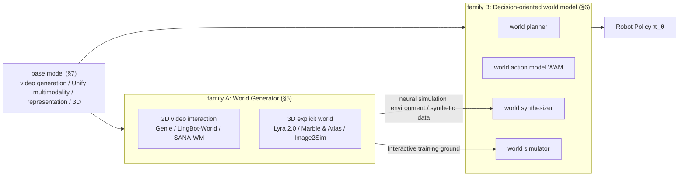

### Four paradigms of Family B
{: id="家族-b-的四大范式"}

According to Tan et al. (2026) [[1]](#ref-1) and Li et al. (arXiv:2510.16732) [[2]](#ref-2)), Family B is divided into four major paradigms according to the coupling method between world model and policy:

1. **World Planner (World Planner)**: As a forward dynamics engine, the world model predicts explicit future frames or implicit latent embeddings, providing forward-looking condition guidance for downstream policies;
2. **World Action Model (WAM)**: Incorporate world state evolution and robot control actions into a unified network, and jointly model the joint distribution of observation and control;
3. **World Synthesizer (World Synthesizer)**: As a data generation engine, it synthesizes annotated multi-view, long-range interaction trajectories and supports large-scale imitation learning;
4. **World Simulator (World Simulator)**: Use the world model as a virtual physical sandbox and combine it with the reinforcement learning (RL) algorithm to optimize policy parameters in the imagination space.

### Three modeling dimensions
{: id="三个建模维度"}

Regardless of which family it belongs to, a world model can be positioned on the following three axes:

- **Functionality Coupling**:
  - *Decision-Decoupled/General Purpose*: The world model is independent of specific action space pretraining (such as pure video generation), and is adapted downstream through inverse dynamics or feature fine-tuning;
  - *Decision-Coupled / Policy-Integrated*: The world model is deeply intertwined with the action header, and the actions are jointly optimized as native Token or conditional channels.
- **timing modeling method (Temporal Modeling)**:
  - *Sequential Simulation & Rollout*: Gradually unfold the future state $$s_{t+1}, s_{t+2}, \dots$$, suitable for long-range interaction and continuous physical evolution;
  - *Global Difference & Jump-Step Prediction*: Directly predict the key sub-target frame or the final transfer difference $$\Delta s$$, skipping the irrelevant micro-dynamics in the middle.
- **Spatial & State Representation**:
  - *Global Latent Vectors*: Such as RSSM and V-JEPA 2, which are highly abstract and fast in calculation, but lack fine-grained spatial geometry;
  - *Spatial Latent Grids*: Such as DiT Latent Patches and VAE feature maps, which are a compromise between perceptual fidelity and computational efficiency;
  - *Explicit 3D Fields*: Such as 3DGS, point clouds (Point Clouds), and Occupancy Grids (Occupancy Grids), which have natural 3D spatial consistency and metric constraints;
  - *Unified Latent Canvas*: Such as NavWAM and Cosmos 3, which assemble vision, action, status, and value into the same space-time canvas.

### Representative Job Cheat Sheet
{: id="代表性工作速查表"}

The following table summarizes the work detailed in the main text in the order of chapters of this article. The "Affiliation" column marks the family and paradigm in which it belongs:

|Paper/Model|Year|Belong|Core technology mechanism|Key Results (Thesis Report)|See details|
|:---|:---:|:---|:---|:---|:---:|
| **Genie** | 2024 |A · Interactive environment generation|Latent Action Model (LAM) + ST-Transformer + MaskGIT Dynamics (11B)|Learn 8 discrete latent actions without action annotation, and convert any image into a playable environment (160×90)| [§5.1](#paper-genie) |
| **LingBot-World** | 2026 |A·Real-time interactive generation|Hierarchical semantic data engine + three-stage training + action injection|16 fps real-time deduction (sub-second delay), 60s scene revisit structure is consistent| [§5.2](#paper-lingbot-world) |
| **SANA-WM** | 2026 |A · Efficient long video generation|Hybrid linear GDN/Softmax + dual-branch camera control (UCPE+Plücker) + two-stage refinement|VBench Overall 80.62/81.89; 34s to 60s to 720p on RTX 5090| [§5.3](#paper-sana-wm) |
| **Lyra 2.0** | 2026 |A·3D scene generation|Geometric memory decoupling + spatial memory retrieval routing + self-enhancement de-drift|Long-range generation above 800 frames still maintains geometric consistency and can be reconstructed into 3DGS| [§5.4](#paper-lyra) |
| **Marble & Atlas** | 2025–2026 |A · 3D world / spatial intelligence|Multimodal autoregressive flow matching Transformer + unified spatial context + 3DGS / point cloud output|Blind test preference for mirror control 75%~94%, 3D reconstruction AbsRel 25.3| [§5.5](#paper-marble) |
| **Image2Sim** | 2026 |A·Neural simulation environment|Feedforward 3D feature Gaussian anchoring + single-step Pixel Flow (MeanFlow) rendering|Panoramic RGB-D 45.6 FPS; automatically build 20000 environments, R2R-CE zero sample 70.3%| [§5.6](#paper-image2sim) |
| **GENE-26.5** | 2026 |B · World Planner|Flow Matching joint distribution + conditional query|New tasks < 1 hour real robot data can be fine-tuned| [§6.1](#paper-gene) |
| **VLA-World** | 2026 |B · World Planner (autonomous driving)|Single frame future generation + reflective reasoning (Think with Generated future) + GRPO|nuScenes collision rate 1.09% → 0.94%| [§6.1](#paper-vla-world) |
| **WorldVLA** | 2025 |B · WAM (autoregressive)|Unified autoregressive backbone + action attention mask + video prediction pretraining| LIBERO Avg 81.8% | [§6.2](#paper-worldvla) |
| **AIM** | 2026 |B · WAM (diffusion)|Spatial Value Map (ASVM) + Intentional Causal Attention + Value Self-Distillation RL| RoboTwin 2.0 Avg SR 93.1% | [§6.2](#paper-aim) |
| **Motus** | 2025/2026 | B · WAM(MoT) |Three experts MoT + optical flow latent action + UniDiffuser joint denoising scheduling|RoboTwin 2.0 Avg 87.8%, single step 80ms| [§6.2](#paper-motus) |
| **NavWAM & WAM-Nav** | 2026 |B · WAM (Navigation)|Unified latent space-time canvas + asymmetric horizon + dual-stream feature fusion|Inference 205.7 ms (about 5Hz), 1100× faster than NWM; real robot success rate 79.2% / 85%| [§6.2](#paper-navwam) |
| **Qwen-RobotWorld** | 2026 |B·World Synthesizer|Dual-stream MMDiT + natural language unified action interface + cross-embodiment grounding| EWMBench 4.60 (#1), WorldModelBench 8.99 | [§6.3](#paper-qwen-robotworld) |
| **WoVR** | 2026 |B·World Simulator|RL + key frame initialization (KIR) + policy co-evolution (PACE) in the world model|LIBERO average SR 39.95% → 69.2%; real robot 61.7% → 91.7%| [§6.4](#paper-wovr) |
| **Cosmos / Cosmos 3** | 2025–2026 |Base model platform|Data curation + Predict/Transfer/Reason product line; Cosmos 3 unifies understanding, generation and action with twin tower MoT|Cosmos3-Nano-Policy ranked 1st in RoboArena / RoboLab real robot review| [§7.2](#cosmos) |
| **Wan2.1** | 2025 |Video generation base|Space-time VAE (4×8×8) + DiT + Flow Matching + VACE|Open source T2V/I2V base, version 1.3B can run on RTX 4090| [§7.4](#paper-wan) |
| **Janus-Pro** | 2025 |Unified understanding and generation base|Understand / generate decoupled visual encoding + autoregressive Transformer| MMBench 79.2, GenEval 0.80(7B) | [§7.5](#paper-janus-pro) |
| **VideoGen in Robotics** | 2026 |Overview|Application classification and evaluation of video generation in robots|Sort out data, architecture and downstream evaluation| [§7.6](#paper-videogen) |

---

## 2.3 Dual system architecture
{: id="23-双系统架构"}

In the embodied system of the large model era, the world model is usually put into a **dual-system architecture**, with division of labor according to frequency:

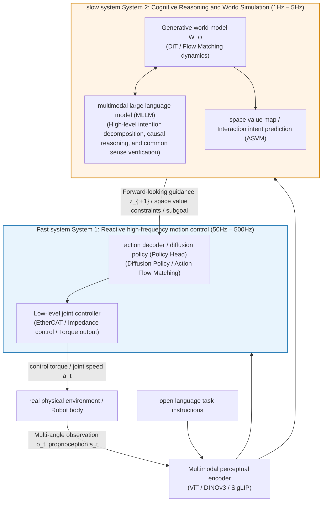

1. **slow system (System 2, cognitive reasoning and world simulation, 1Hz–5Hz)**:
   - Composed of world model (WM) and multimodal large model (VLM), it is responsible for long-term mission planning, environmental dynamic deduction, physical common sense verification, intention analysis and risk assessment;
   - Provide physically grounded conditional guidance for the bottom layer by generating future latent features $$z_{t+1}$$ or spatial value heat maps.
2. **fast system (System 1, reactive high-frequency action execution, 50Hz–500Hz)**:
   - It is composed of a lightweight policy network (such as Diffusion Policy, Action Flow Matching) and an underlying controller, which is responsible for generating smooth and accurate motor torque or joint trajectories in real time with very low latency based on the current state and the physical priors provided by System 2.

---

## 2.4 Evolution Timeline (2018–2026)
{: id="24-演进时间线20182026"}

  
<figcaption> diagram: embodied intelligence world model evolution timeline. From the foundation of latent space dream training in 2018, to video generation-driven planning in 2023, to the explosion of world action model (WAM), full-modal base model (Cosmos 3) and explorable 3D universe (Lyra 2.0 / Marble) in 2025–2026. (Image source: Tan et al., 2026)</figcaption>

**key evolution context**:
- **2018–2022 (MBRL foundation period)**: World Models proposes V-M-C dream training; PlaNet introduces RSSM; DreamerV1/V2 establishes latent space Actor-Critic;
- **2023–2024 (Video prior and 3D embryonic period)**: UniPi and SuSIE explore the use of video diffusion models for text-guided planning; GR-1 pioneers autoregressive video action pretraining; 3D-VLA introduces 3D geometric priors; DreamerV3 is released and cleared Minecraft; TD-MPC2 is unified 104 Embodied Control;
- **2025 (the explosion period of the four major paradigms)**: WorldVLA and UniVLA unified autoregressive sequence modeling; DreamGen and GigaWorld-0 build a data synthesis flywheel; VLA-RFT and WoVR enable internal reinforcement learning of the world model; the Cosmos platform establishes an industrial-grade data and model system;
- **2026 (the era of all-modal convergence and spatial intelligence)**: Cosmos 3 uses MoT architecture to unify understanding-generation-action; SANA-WM achieves minute-level efficient generation; Lyra 2.0 and Marble lay the foundation for 3DGS to explore the persistent universe; World Labs Atlas releases an all-modal autoregressive flow matching base to combine camera geometry with 3D Deeply incorporated into native modes and empowered Real-to-Sim embodied simulation; Motus, AIM, NavWAM, etc. promote world action models to the mainstream.

---

# 3. Classic foundation: model-based reinforcement learning
{: id="3-经典奠基有模型强化学习"}

> 💡 **companion article introduction**: Regarding the mathematical foundation of classical reinforcement learning, Bellman operator derivation, and systematic algorithm analysis of model-free and model-based RL (DreamerV3 / TD-MPC2), please see the special blog post for details .

Before the outbreak of the modern video diffusion base model, the world model has experienced several generations of key evolution in the field of Model-Based Reinforcement Learning (MBRL), laying the foundation for the mathematical theory and algorithm of the entire field.

## 3.1 World Models (2018)
{: id="31-world-models-2018"}

The **World Models** proposed by David Ha and Jürgen Schmidhuber [[3]](#ref-3) is the first complete implementation of the **V-M-C trinity architecture** in cognitive science under the deep learning framework:

  
<figcaption> Figure: V-M-C core architecture of World Models (2018): visual perception V (VAE), memory dynamics M (MDN-RNN) and lightweight controller C. (Image source: Ha & Schmidhuber, 2018)</figcaption>

1. **V model (Vision Model / VAE)**: compress the high-dimensional input image frame $$o_t$$ into a 32-dimensional continuous Gaussian latent vector $$z_t \sim \mathcal{N}(\mu, \sigma^2)$$, filtering high-frequency visual noise that is irrelevant to control;
2. **M model (Memory Model / MDN-RNN)**: Based on LSTM with a mixed Gaussian output layer (MDN), autoregressively predicts the multi-branch probability distribution of the latent state at the next moment:
   
   $$
   P(z_{t+1} \mid a_t, z_t, h_t) = \sum_{k=1}^K \pi_k(h_t) \mathcal{N}\left( z_{t+1};\; \mu_k(h_t), \Sigma_k(h_t) \right)
   $$

3. **C model (Controller)**: An ultra-lightweight feedforward network containing only more than a thousand parameters, directly mapping $$z_t$$ and the cyclic hidden state $$h_t$$ into the control action $$a_t = W_c [z_t \; h_t] + b_c$$.

  
<figcaption> Figure: World Models complete data flow: offline collection of experience training V and M, and then training controller C in an RNN dream that is completely separated from the real environment. (Image source: Ha & Schmidhuber, 2018)</figcaption>

> **Key result**: World Models demonstrates the feasibility of **in the learned world model internal training strategy (Training inside the Dream)**. In VizDoom, the controller is completely trained using the evolutionary policy (CMA-ES) in the "dream" where the M model autoregressively unfolds, and then directly transferred back to the real game environment, still able to avoid fireballs; in CarRacing-v0, the controller is trained in the real environment with the characteristics of V and M as input, and the average score exceeds 900, solving this task for the first time.

---

## 3.2 Dreamer Series (2020–2025)
{: id="32-dreamer-系列-20202025"}

The **Dreamer series** [[4] ](#ref-4) (DreamerV1 $\to$ V2 $\to$ V3; V3 was released in 2023 under the title of *Mastering Diverse Domains through World Models*) pioneered by Danijar Hafner et al. arXiv, officially published in *Nature* under the title *Mastering diverse control tasks through world models* in 2025), pushing model-based RL to generalization.

  
<figcaption> Figure: DreamerV3 training pipeline: (a) self-supervised learning of RSSM world model from real experience; (b) autoregressive expansion of trajectories in latent space; (c) optimization of actor-critic policy in imagination. (Image source: Hafner et al., Nature 2025)</figcaption>

Dreamer solves the long-standing problems of representation collapse and numerical instability of continuous world models:
1. **Recurrent State Space Model (RSSM)**: Decouple the latent state into deterministic time series features $$h_t = f_\phi(h_{t-1}, z_{t-1}, a_{t-1})$$ and discrete random variables $$z_t$$ (using 32 Categorical latent variables of 32 categories). Discrete Categorical distribution alleviates the blurring and collapse problems of continuous Gaussian distribution in the face of nonlinear mutations (such as door opening/closing, object fragmentation);
2. **Symlog transformation and dimensionless design**: Propose symmetric logarithmic transformation $$\mathrm{symlog}(x) = \mathrm{sign}(x)\ln(\lvert x\rvert+1)$$ to unify scaling features and regression targets, and cooperate with adaptive percentile value normalization to solve the gradient dispersion and numerical divergence caused by the cross-task reward scale spanning 7 orders of magnitude;
3. **versatility and Minecraft diamond task**: DreamerV3 uses the same set of hyperparameters and model architecture **as** to achieve strong performance in Atari, Crafter, DMC, Procgen and other fields, and becomes the first to do so in Minecraft without using human data and course design. The algorithm for collecting diamonds from scratch in the game - this task requires a long series of dependent steps such as logging, crafting workbench, mining, smelting, etc., and the rewards are extremely sparse.

  
<figcaption> Figure: Standardized performance comparison of DreamerV3 in 7 heterogeneous fields (2D pixel, continuous control, 3D long-range sandbox). (Image source: Hafner et al., Nature 2025)</figcaption>

---

## 3.3 TD-MPC2 (2024)
{: id="33-td-mpc2-2024"}

Most of the previous world models (such as World Models and Dreamer) relied on pixel-by-pixel image reconstruction loss, and a large amount of network computing power was wasted on background visual details that are irrelevant to downstream control. The **TD-MPC series** [[5]](#ref-5) proposed by Nicklas Hansen et al. has achieved a key technology shift:

  
<figcaption> Figure: TD-MPC2 overall architecture: no need for pixel-by-pixel decoding and reconstruction, deep integration of MPPI online sampling planning and temporal difference (TD) long-range value learning in a compact latent space. (Image source: Hansen et al., ICLR 2024)</figcaption>

1. **Pure latent space task driver (Task-Driven Latent Dynamics)**: Remove the pixel decoder, and the latent state is only constrained by three types of signals - latent space self-consistency (the predicted next latent state must be consistent with the encoder's encoding of the real next frame), immediate reward prediction and TD value target; also train a policy prior to provide initial sampling for planning;
2. **MPPI Online planning**: During inference, MPPI is used to sample and iteratively optimize a short horizon action sequence in the 512-dimensional latent space. The rewards outside the horizon are estimated by bootstrapping the learned Q function, taking into account the accuracy of online planning and the long-term value horizon;
3. **Scalable multi-task single model**: Use the same set of hyperparameters on a total of 104 continuous control tasks in 4 fields, and train a single agent with 317M parameters to work simultaneously on 80 cross-domain, cross-embodiment, and cross-action space tasks.

---

## 3.4 From classic to large model era
{: id="34-从经典到大模型时代"}

The following table summarizes the evolution of the core technology paradigm of world model in the past few years:

|Evolutionary dimension|Classic Founding Period (2018, World Models)|Discrete RSSM Era (2023–2025, DreamerV3)|Implicit MPC Era (2024, TD-MPC2)|Generative base model era (2025–2026, Cosmos / WAM / SANA)|
|:---|:---|:---|:---|:---|
|**status characterization**|Continuous Gaussian latent variable (32D VAE)|Discrete Categorical latent variables (32×32)|Compact task latent vectors (512D MLP/Trans.)|Space-time Latent Grid / 3DGS Explicit Field / Unified Canvas|
|**Dynamic Backbone**| LSTM / MDN-RNN | RSSM (GRU + Categorical) |MLP / Dense Transformer| Diffusion Transformer (DiT) / Flow Matching / MoT |
|**Reconstruction mechanism**|Pixel-by-pixel 2D decoding (64×64)|Pixel-by-pixel 2D decoding (64×64)|**No pixel reconstruction** (pure latent space mission signal)|Highly compressed space-time VAE (4×8×8) / single-step generation / implicit space alignment|
|**and policy relationship**|Decoupling: Offline evolution in dreams C|Decoupling: latent space Actor-Critic|Coupling: Online MPPI Trajectory Optimization|Four major paradigms coexist (Planner/WAM/Synthesizer/Simulator)|
|**action generation frequency**|Real robot deployment after offline optimization|Real robot deployment after offline optimization|Online MPPI planning (replanning at each step)|5Hz–15Hz joint denoising (WAM) or 500Hz hybrid control|
|**Multi-tasking and scale**|Single task small model (<1M)|Cross-domain single model (~200M)|104 Embodied Multitasking (1M $\to$ 317M)|Internet-level graphic and video pretraining + field fine-tuning (2B $\to$ 64B)|

---

# 4. Core engineering design space
{: id="4-核心工程设计空间"}

§2 talks about “what the world model is”, §5–§6 talks about “what” the specific work is done. This chapter is between the two, answering from the perspective of engineering implementation: **Build a video/latent space world model, what key decisions need to be made, and what is the cost of each decision?** . The examples in this chapter come from the work detailed below and serve as a reference when reading §5–§7.

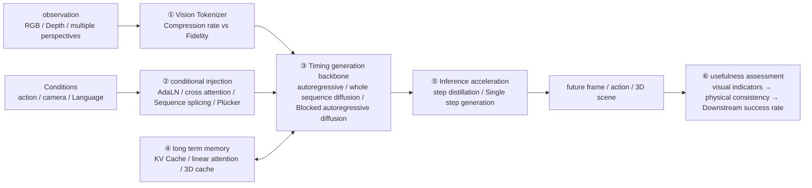

## 4.1 Visual Tokenizer
{: id="41-视觉-tokenizer"}

The computational complexity of the video world model is almost entirely determined by the number of latent space tokens. The higher the compression rate of Tokenizer, the longer it can be expanded under the same computing power, but the easier it is for details such as small objects and gripper contact surfaces that are critical to the operation task to be lost.

| Tokenizer |Representation type|Compression method|Users (covered in this article)|
|:---|:---|:---|:---|
| Cosmos Tokenizer |Continuous + Discrete|Wavelet Transform + Causal 3D Convolution|Cosmos-Predict1 diffusion / autoregression two routes (§7.2)|
| Wan2.1 VAE |continuous|Causal 3D VAE, time×height×width 4×8×8| Wan2.1, Cosmos-Predict2.5(§7.2, §7.4) |
| Wan2.2 VAE(TI2V-5B) |continuous|Higher space compression|Cosmos 3 Spawn Tower (§7.3)|
| LTX-2 VAE |continuous|Compression rate is significantly higher than Wan2.1 VAE| SANA-WM(§5.3) |
| ST-ViViT VQ |Discrete|Space-time Transformer + Vector Quantization| Genie(§5.1) |
|Chameleon class image Tokenizer|Discrete|frame by frame VQ|WorldVLA et al. Autoregressive WAM (§6.2)|

**Engineering experience**:
- **The causal structure** allows the first frame to be encoded separately, thereby supporting joint training of images and videos and streaming generation by frame, which is the prerequisite for interactive world models;
- **High compression will "flatten" the motion within the frame**: SANA-WM's VAE compresses 8 original frames into 1 latent frame, so additional Plücker subdivisions per original frame are added to compensate for camera motion details (§5.3);
- **discrete token** is convenient for directly reusing the LLM training stack, but quantization will lose details; Cosmos-Predict2.5 finally unifies the two routes of diffusion and autoregression into continuous latent space Flow Matching (§7.2).

## 4.2 Conditional injection
{: id="42-条件注入"}

"Action conditions" are the key to distinguishing world models from ordinary video generation models. Common injection methods are arranged from coarse to fine granularity:

|Injection method|Granularity|representative work|Advantages|cost|
|:---|:---|:---|:---|:---|
|**AdaLN modulation**|per frame / globally|LingBot-World (Plücker embed injected via AdaLN)|Simple to implement and minimal overhead|Limited ability to express spatial position-dependent control|
|**cross attention**|sequence level|Cosmos-Predict2.5 (Reason1 text embedding)|Suitable for language equal length conditions|Weak temporal alignment with visual tokens|
|**ControlNet branch**|Pixel level|Cosmos-Transfer (Edge/Depth/Split)|Pluggable, no need to retrain the backbone for new modes|Extra parameters and inference overhead|
|**Pixel-by-pixel camera ray (Plücker/UCPE)**|Pixel level geometry|SANA-WM dual branch, LingBot-World|6-DoF camera control for precise control|Reliable camera pose annotation is required (SANA-WM has built a special metric annotation pipeline for this purpose)|
|**action token enters unified sequence**|token level|WorldVLA, Cosmos 3, NavWAM latent canvas|Joint modeling of action and vision, switchable forward/reverse/policy mode|The sequence becomes longer and the attention overhead increases|
|**latent action (unmarked)**|discrete codebook|Genie (8 stealth moves), Motus (optical flow stealth move)|Exploiting Internet videos without motion annotation|Latent action semantics need to be mapped to real control quantities|
|**Natural language action**|text| Qwen-RobotWorld |Cross-embodiment and cross-task unified interface|Difficult to express precise continuous control quantities|

An empirical rule: the more geometric accuracy (camera trajectory, end-effector pose) required for **control, the more conditions should be injected into** in a spatially aligned manner, rather than just modulating the entire frame as a global vector.

## 4.3 Generating paradigm
{: id="43-生成范式"}

|paradigm|represent|Advantages|Main questions|
|:---|:---|:---|:---|
|**Discrete Autoregressive**| Genie, WorldVLA, Cosmos-Predict1 AR |Natural streaming, interactive, reuse KV Cache|Errors gradually accumulate; quantify loss details|
|**full sequence diffusion / flow matching**|Wan2.1, Cosmos-Predict2.5 (93 frames generated at a time)|High image quality and good consistency within clips|Clip length is fixed, making it difficult to respond gradually to new actions|
|**Blocked autoregressive diffusion (hybrid)**| LingBot-World, SANA-WM, Lyra 2.0 |Taking into account both image quality and interaction: intra-block denoising, inter-block autoregression|What you see during training is the real history, and what you see during inference is your own generated history (exposure bias), which will cause drift.|
|**AR + diffusion twin towers**| Cosmos 3 |Understand autoregression and generation and diffusion without interfering with each other|The number of parameters is about 2 times that of dense models|

Starting from the full sequence diffusion model and transforming it into an interactive simulator is a common route in 2026: LingBot-World first uses Wan2.2 for bidirectional diffusion pretraining, and then transforms it into a causal autoregressive system and performs distillation in post-training (§5.2). To mitigate exposure bias, a common approach is to **Actively feed noisy or self-generated history during training** , such as Lyra 2.0’s self-reinforcement training (§5.4).

## 4.4 Long-range consistency
{: id="44-长程一致性"}

There are usually two reasons for the failure of long-range deduction: **The limited context window causes "forgetting" the area** that has been viewed (the scene has changed when looking back), and **error accumulation causes the picture and physics to gradually drift**. Corresponding engineering means:

|means|representative work|Problem solved|cost|
|:---|:---|:---|:---|
|Hybrid linear attention (GDN) + few softmax layers + attention sink| SANA-WM |Memory remains constant under 60s 720p sequence|The precise recall ability of the linear layer is weak and needs to be supplemented by the Softmax layer.|
|3D geometry cache + retrieval of historical frames by visibility| Lyra 2.0 |Spatial consistency when revisiting regions|Depth dependent estimation quality|
|Explicit 3D representation (3DGS/point cloud) as state| Marble & Atlas, Image2Sim |Geometry Natural and Durable|Difficulty modeling dynamic objects and deformations|
|Shorten the effective deduction depth|Key frame initialization (KIR) of WoVR|Hallucination accumulation in RL.|Can only explore near states covered by the demo|
|Asymmetric vision (long movement + short vision)| WAM-Nav |Visual prediction drift when viewing angle changes drastically|Less visual lookahead information|

## 4.5 Reasoning efficiency
{: id="45-推理效率"}

Whether the world model can enter the control loop depends on whether it can meet the real-time budget. The latency/frame rates reported for the work covered in this article are roughly as follows:

|scene|Typical requirements|Figures involved in this article|
|:---|:---|:---|
|Low-level joint control (System 1)| 50Hz–500Hz |Responsible for the policy head or traditional controller, the world model usually does not enter this loop directly|
|WAM action chunk output| 5Hz–15Hz |NavWAM 205.7 ms (~5Hz); Motus single step 80ms; Cosmos3-Nano-Policy 15Hz|
|Interactive world generation|Tens to tens of fps|LingBot-World 16 fps; Image2Sim panorama RGB-D 45.6 FPS|
|Offline data synthesis|Throughput priority|SANA-WM 34s to 60s 720p on RTX 5090|

Main acceleration methods:
- **Step Distillation**: Cosmos-Predict2.5 uses rCM to compress reasoning to 4 steps (§7.2); LingBot-World uses DMD distillation to achieve sub-second latency (§5.2); Image2Sim uses MeanFlow for single-step generation (§5.6);
- **reduced token**: higher compressed VAE (§4.1), or planning in latent space instead of pixel space (implicit world planner, §6.1);
- **Reduce the content that needs to be generated**: WAM uses future visual predictions for regularization during training, and the key output during inference is the action chunk; NavWAM uses a latent canvas to replace the CEM-style candidate trajectory deduction one by one (§6.2).

## 4.6 How to judge whether the world model is useful
{: id="46-如何判断世界模型是否有用"}

Good visual indicators do not necessarily mean they are useful for robots. In engineering, inspections are usually carried out in the following order. The later, the closer to the true value, the higher the cost:

1. **Visual quality**: FVD, VBench, etc. (§8.3) - only "looks like";
2. **Controllability**: After changing the action/camera input, are the generated results consistent and changing as expected (CamMC, RotErr, etc.);
3. **Physical consistency**: Whether the object's persistence, gravity, and contact are reasonable (WorldModelBench, Physics-IQ, etc.);
4. **Downstream value**: After using the world model to train or evaluate the policy, whether the success rate in the real environment is improved, or whether the policy ranking in the world model is consistent with the real robot ranking.

The §8 benchmarks are organized along this chain.

---

# 5. Family A: World Generator
{: id="5-家族-a世界生成器"}

What this family has in common is that the condition signal is **camera pose, keyboard/subtle motion or text**, the output is a video or 3D scene for sustainable exploration, and the core indicators are **spatiotemporal consistency, controllability and generation speed**, rather than the robot mission success rate. Their relationship to embodied intelligence is mostly indirect—as neural simulation environments or data sources used by the world synthesizers and world simulators of §6.

This chapter is arranged by representation from 2D to 3D:
- **2D Video interaction**: Genie (a playable environment for learning latent actions from unlabeled videos) → LingBot-World (real-time long-range interaction) → SANA-WM (efficient minute-level generation);
- **3D Explicit/semi-explicit**: Lyra 2.0 (3D geometry cache for memory) → Marble & Atlas (native 3DGS / point cloud output) → Image2Sim (3D Gaussian anchoring + single-step rendering neural simulator).

Please refer to §4 when reading: The differences between these works mainly focus on the conditional injection method (§4.2), generative paradigm (§4.3) and long-term memory (§4.4).

## 5.1 Genie (2024)
{: id="paper-genie"}
———Generative Interactive Environments

📄 **Paper**: [arXiv:2402.15391](https://arxiv.org/abs/2402.15391) · [[6]](#ref-6)

#### Key takeaways
{: id="精华"}

Genie is the first generative interactive environment (Foundation World Model) learned only through unlabeled videos. Its core contributions are: 1) **Unsupervised action mining**: Automatically mine controllable action spaces from pure videos through latent action models (LAM), solving the world model's dependence on real action labels; 2) **Efficient spatio-temporal architecture**: Designed a computing architecture based on ST-Transformer, so that GPU memory usage increases linearly with the number of frames, supporting long sequence video generation; 3) **embodied intelligence Base**: Not only can it convert any image (sketches, photos, etc.) into a playable game world, it also shows great potential in robot manipulation and agent training, providing a massive amount of simulation data for the "path to universal agents".

---

#### 1. Background and problem
{: id="1-研究背景问题"}

Current generative AI (such as ChatGPT, DALL-E) has achieved great success in the field of text and images, but most video generation models (such as Video Diffusion) lack fine-grained interactive control capabilities. The traditional "world model" usually requires a large amount of data with real action labels (Action Labels) for training, which has become a bottleneck in the face of the massive videos on the Internet. Genie aims to learn an interactive environment that can respond to user operations in real time, has physical common sense, and can be infinitely generated through over 200,000 hours of unlabeled Internet video (about 30,000 hours / 6.8 million 16-second high-quality 2D platform game clips training set after filtering and cleaning).

---

#### 2. Methods and innovations
{: id="2-主要方法创新点"}

Genie is an 11 billion parameter base model whose architecture consists of three deeply integrated components, all based on the improved **ST-Transformer**.

  
<figcaption> Figure: Genie overall training framework: including video segmenter, latent action model (LAM) and dynamics model. (Image source: Genie, 2024)</figcaption>

##### 2.1 Latent Action Model (LAM)
{: id="21-潜动作模型-latent-action-model-lam"}
This is the soul of Genie. To achieve control without action tags, LAM adopts the VQ-VAE structure:
- **encoder**: simultaneously receives the current frame and the next frame, and outputs a discrete latent action $$\mathbf{a}_t$$ (usually limited to 8 discrete values to simulate controller buttons).
- **bottleneck mechanism**: Since the decoder can only predict the next frame through historical frames and $$\mathbf{a}_t$$, the model is forced to encode the most semantically consistent changes in the video (such as the character's left and right movement, jumping) into these 8 Tokens.
- **Consistency**: Experiments have proven that even in different games, the same latent action Token often corresponds to the same physical semantics (such as Action 0 always represents left shift).

  
<figcaption> Figure: Latent Action Model (LAM): Unsupervised action mining by reconstructing goals. (Source: Genie, 2024)</figcaption>

##### 2.2 Video Tokenizer
{: id="22-视频分词器-video-tokenizer"}
Genie proposed the **ST-ViViT** architecture:
- **Space-time compression**: Unlike conventional tokenizers that only compress in the spatial dimension, ST-ViViT introduces the timeline in both encoding and decoding.
- **Efficiency Optimization**: By using spatial attention and temporal attention alternately, the model avoids the problem of quadratic increase in calculation volume over time and ensures the feasibility of training on large-scale data sets.

##### 2.3 Dynamics Model
{: id="23-动力学模型-dynamics-model"}
Mask autoregressive model based on **MaskGIT**:
- **Input**: Receives the current visual token and the user-selected latent action.
- **predicts**: The model predicts the Token of the next frame in the latent space. Fed by massive amounts of data, the model learns complex 2D platform game rules such as collisions, gravity, enemy interactions, and screen scrolling.

  
<figcaption> Figure: ST-transformer: alternately performs space and time layer calculations to achieve linear complexity. (Source: Genie, 2024)</figcaption>

---

#### 3. Results and findings
{: id="3-核心结果发现"}

* **"Turning decay into magic" generation ability**: Users can upload a hand-drawn sketch, a real photo of a natural landscape, or even a picture generated through a Vincent diagram model (such as Imagen), and Genie can immediately transform it into a "playable" side-scrolling game environment.
* **Semantically consistent sense of control**: On the Platformers data set, latent actions show strong generalization. When the user clicks on the corresponding latent action, the character will move or jump coherently, and this control is still effective in environments with different visual styles.
* **Potential in robotics**: Researchers validate Genie on the RT1 robotics dataset. The model not only learned to control a robotic arm, but also learned to simulate the physical deformation of complex objects (such as squeezing a bread bag), demonstrating Genie's ability to capture real physical world dynamics.
* **serves as the "mother" of reinforcement learning.**: Agents trained within Genie can be transferred to the real environment extremely quickly. Compared with training from scratch, the sample efficiency of agents using latent action pretraining is improved several times.

  
<figcaption>Figure: Semantically meaningful latent actions learned on robot manipulation data. (Source: Genie, 2024)</figcaption>

---

#### 4. Limitations
{: id="4-局限性"}

* **Resolution bottleneck**: Limited by current computing resources, the video generated by Genie has a low resolution (160x90), which is still far from a high-definition immersive experience.
* **Autoregressive divergence**: Due to autoregressive generation, as the number of steps increases, the video content may gradually deviate from the physical reality or appear artifacts.
* **Action Mapping**: Although latent actions have been unearthed, further research is still needed to accurately map these discrete Tokens to complex multi-level controls of human intuition (such as the linear joystick of a controller).

---

## 5.2 LingBot-World (2026)
{: id="paper-lingbot-world"}
——The first open source long-range world model that supports real-time interaction

📄 **Paper**: [arXiv:2601.20540](https://arxiv.org/abs/2601.20540) · [[7]](#ref-7)

#### Key takeaways
{: id="精华-1"}
1. **LingBot-World** is an open source real-time interactive world model that supports minute-level long-range generation consistency.
2. A data engine containing hierarchical semantics is proposed to solve the interactive data scarcity problem through narrative, static scenes and dense temporal description.
3. A three-stage evolutionary training strategy is adopted: pretraining (universal video prior), mid-training (knowledge injection and MoE architecture), and post-training (causal adaptation and distillation).
4. Achieved sub-second (<1s) inference latency, supporting real-time generation at 16 fps.
5. It demonstrates the broad application potential in the fields of controllable world event editing, embodied intelligence Action Agent, and 3D reconstruction.

#### 1. Background and problem
{: id="1-研究背景问题-1"}
Although the current video generation model can generate high-quality short videos, it is essentially a "dreamer" rather than a "simulator". It lacks an understanding of physical laws (such as causality and object permanence) and is difficult to achieve real-time interaction. In addition, the lack of high-quality interactive data, the maintenance of long-range consistency, and the high computational overhead of diffusion models are also core bottlenecks that hinder the development of world models.

#### 2. Methods and innovations
{: id="2-主要方法创新点-1"}

  
<figcaption> Picture: LingBot-World interactive world simulation overview: supports real-time interaction through keyboard operations in a variety of scenarios (realistic, scientific, cartoon, etc.). (Image source: LingBot-World, 2026)</figcaption>

##### ① Data engine and hierarchical description
{: id="-数据引擎与分层描述"}
To address the scarcity of high-quality interaction data, LingBot-World built a hybrid data engine that combines real-world video, game footage, and Unreal Engine (UE) synthetic data. The key innovation lies in the **hierarchical description strategy**:
- **Narrative Caption**: Describes the overall environment and camera trajectory as a global semantic prompt.
- **Static scene description (Scene-Static Caption)**: Only focus on the environment to achieve decoupling of actions and scenes.
- **Dense Temporal Caption**: Fine-grained time-aligned description of video events.

##### ② Three-stage evolutionary training pipeline
{: id="-三阶段进化训练管线"}
The model adopts a three-stage policy of evolving from a video generator to an interactive simulator:

  
<figcaption> Figure: LingBot-World training pipeline: starting from the video prior of pretraining, injecting knowledge through mid-training, and finally achieving real-time interaction capabilities through post-training. (Image source: LingBot-World, 2026)</figcaption>

- **Stage I: pretraining**: Establishing strong spatiotemporal coherence and visual priors using the Wan2.2 diffusion model with 14B parameters.
- **Stage II: Mid-training (MoE knowledge injection)**: Introducing the Mixture-of-Experts (MoE) architecture (total parameters 28B, activation 14B), extending the training duration from 5 seconds to 60 seconds through the progressive curriculum strategy, and injecting Plücker-encoded action signals.
- **Stage III: post-training (real-time)**: Adapt the bidirectional diffusion model to a causal autoregressive system and combine it with distribution matching distillation (DMD) and adversarial optimization to reduce inference latency to sub-second levels.

##### ③ Model architecture and action injection
{: id="-模型架构与动作注入"}

  
<figcaption> Figure: LingBot-World model architecture: Based on the DiT block, the action signal is injected through the Plücker Encoder and modulated using AdaLN. (Image source: LingBot-World, 2026)</figcaption>

LingBot-World is based on DiT (Diffusion Transformer) architecture. Action signals (discrete keyboard input and continuous camera rotation) are projected into embedding vectors via **Plücker Encoder**, and then injected into the DiT block via Adaptive Layer Normalization (AdaLN) to achieve precise control over video generation.

#### 3. Results and findings
{: id="3-核心结果发现-1"}

  
<figcaption> Figure: Emergent memory ability: The model can remember static landmarks outside the field of view (such as Stonehenge), maintain a consistent structure when returning after 60 seconds, and can simulate the dynamic evolution of objects outside the field of view. (Image source: LingBot-World, 2026)</figcaption>

- **Long-range consistency**: The model shows significant emergent memory ability. Even if the object leaves the field of view for a long time, it can still maintain structural integrity when it returns.
- **Real-time and quality balance**: LingBot-World-Fast achieves 16 fps throughput on a single GPU node while maintaining visual quality comparable to the teacher model.
- **Controlled editing**: Supports real-time intervention in the generated world through text commands (such as "Firework", "Fish").

  
<figcaption> Picture: Example of controllable world events: changing the weather, style or injecting specific dynamic elements into the scene in real time through text prompts. (Image source: LingBot-World, 2026)</figcaption>

#### 4. Limitations
{: id="4-局限性-1"}
- **Memory stability**: Long-term consistency is still based on the emergence ability of context windows and lacks an explicit storage module.
- **Interaction accuracy**: Support for fine-grained object operations (such as grabbing specific objects) is insufficient.
- **computing power cost**: Inference still requires enterprise-level GPU support.

---

## 5.3 SANA-WM (2026)
{: id="paper-sana-wm"}
———Efficient Minute-Scale World Modeling with Hybrid Linear Diffusion Transformer

📄 **Paper**: [arXiv:2605.15178](https://arxiv.org/abs/2605.15178) · [[8]](#ref-8)  
🔗 **project homepage**: [nvlabs.github.io/Sana/WM](https://nvlabs.github.io/Sana/WM/)

#### Key takeaways
{: id="精华-2"}

The core idea worth learning from SANA-WM is **, a world model with efficiency as the first design goal.** uses 2.6B parameters, 64 blocks of H100, and 15 days of training to generate minute-level 720p videos on a single GPU, achieving visual quality comparable to the 14B+14B industrial-grade model. Specific transferable designs include: (1) **Hybrid Linear-Softmax Attention (Hybrid GDN/Softmax)** - replace most Softmax layers with frame granularity Gated DeltaNet, so that the KV state remains $D \times D$ constant, the memory does not grow with the sequence length, and the Softmax layer only retains 5/20 Blocks are used for long-range accurate recall, cleverly balancing efficiency and quality; (2) **Dual-Branch Camera Control (Dual-Branch Camera Control)** - The thick branch UCPE captures the global 6-DoF trajectory structure at the latent frame rate, and the fine branch Plücker compensates for the intra-frame motion details lost by VAE compression at the original frame rate, and the two work together to achieve high-precision continuous trajectory following; (3) **Two-stage visual refinement (Two-Stage Refiner)** - the first stage generates videos with correct structure but lower quality, and the second stage uses the 17B LoRA refiner that truncates Flow Matching to seamlessly repair details. The overall throughput is still 22 60s videos/hour; (4) **Robust metric annotation pipeline** - Use VIPE+Pi3X+MoGe-2 to recover metric 6-DoF poses from public videos without expensive proprietary data and complete training with only 213K clips.

---

#### 1. Background and problem
{: id="1-研究背景问题-2"}

Existing open source minute-level world models (LingBot-World 14B+14B, HY-WorldPlay 8B) generally require large model parameters, massive proprietary data, and multi-GPU reasoning, which poses a very high threshold for academics and small teams. Another alternative—distilling long-range models with short-range video generators—has limited effectiveness due to insufficient supervisory signals from short-range teachers for minute-level scene persistence and trajectory following. The goal of SANA-WM is: **natively trains a high-fidelity, camera-controllable minute-level world model** under strict efficiency constraints, making it inferable on a single GPU and convergent in 15 days on a 64-block H100.

---

#### 2. Methods and innovations
{: id="2-主要方法创新点-2"}

  
<figcaption> Figure: SANA-WM overview. Generate minute-level 720p worlds from a single image and motion trajectory, supporting precise camera control, 64-GPU training, and single-GPU inference. (Image source: SANA-WM, arXiv:2605.15178)</figcaption>

**Overall framework**: SANA-WM consists of four core components: ① Hybrid linear DiT backbone (Hybrid GDN/Softmax) is responsible for efficient long-range context modeling; ② Dual-branch camera control (UCPE + Plücker) is responsible for accurate 6-DoF trajectory injection; ③ Second-stage visual refiner (LTX-2 LoRA) is responsible for improving the final frame Quality; ④ The robust metric annotation pipeline (VIPE+Pi3X+MoGe-2) is responsible for extracting high-quality training data from public videos.

  
<figcaption> Figure: SANA-WM architecture. Text, video, and gesture tokens alternately pass through GDN blocks and Softmax blocks; UCPE Attention and Plücker Mixing provide geometry-aware camera conditions; the second-stage refiner further improves visual quality. (Source: SANA-WM)</figcaption>

##### ① Hybrid linear-Softmax Attention (Hybrid GDN/Softmax)
{: id="-混合线性-softmax-attentionhybrid-gdnsoftmax"}

**input**: temporal latent frame sequence (LTX2 VAE encoding, time × height × width compression ratio is much higher than Wan 2.1-VAE, size reduced by 8×).

**handles**: SANA-WM has a total of 20 Transformer Blocks, 15 of which are **frame granular Gated DeltaNet (GDN) blocks**, and 5 (located at layer 3/7/11/15/19) are standard Softmax Attention blocks. The key to the GDN block is to upgrade token-level recursion (one token per step) to **frame-level recursion** (consuming all $S$ space tokens of a potential frame at each step). The state matrix $S_t \in \mathbb R^{D \times D}$ passes through the attenuation gate $\gamma_t$ and delta-rule Correction to implement "forgetting old information and accurately updating the current frame":

$$S_t = S_{t-1} M_t + U_t, \quad M_t = \gamma_t(I - \hat K_t \beta_t \hat K_t^\top), \quad U_t = V_t \beta_t \hat K_t^\top$$

In order to prevent the spatial token number $S$ from causing the transfer matrix $M_t$ to expand, $1/\sqrt{DS}$ scaling is applied to the key (instead of the token-level $1/\sqrt{D}$) to ensure that $\lVert M_t \rVert_2 \le \gamma_t \le 1$ and training are stable without NaN. The Softmax block is responsible for precise long-range recall, introducing local attention windows and attention sinks in the 60s sequence to keep the Softmax memory constant during inference.

**design motivation**: 60s 720p video is expanded into about 961 latent frames; pure Softmax's KV Cache grows with the square of the sequence length, and directly OOMs at 60s; pure linear attention (such as SANA-Video's cumulative linear attention) lacks an attenuation mechanism, and old features and new features are accumulated with equal weight, resulting in drift in minute-level modeling. The hybrid design takes into account the requirements of "efficient updates at most time steps + accurate recall at key moments".

##### ②Dual-Branch Camera Control
{: id="-双分支相机控制dual-branch-camera-control"}

**Coarse branch (Coarse - UCPE)**: Modeling global 6-DoF trajectories on **latent frame rate**. For each latent frame $t$ and space grid $s$, the world space ray is calculated from the camera external parameters, the ray local coordinate system transformation $D_{t,s} \in \mathbb R^{4 \times 4}$ is constructed, the geometric channel of QKV is rotated through $D^\top / D^{-1}$, and the remaining channels retain RoPE - essentially encoding the camera pose into the attention position encoding. This branch has an independent QKV projection, but shares the GDN gate with the main branch, and is superimposed onto the main attention output via a zero-initialized projection.

**Fine Branch (Fine - Plücker Mixing)**: Make up for the intra-frame motion details lost in the thick branch due to VAE compressing 8 original frames into 1 latent frame. For each original frame $r$ and pixel $p$, calculate the Plücker ray $\rho_{r,p} = (d_{r,p},\, o_r \times d_{r,p}) \in \mathbb R^6$, stack the Plücker map of 8 frames in the VAE step into a 48-channel tensor, process it with zero initialization 3D Patch Embedder and stack it block by block after the self-attention output.

**ablation verification**: The CamMC of the UCPE+Plücker combination reaches 0.2047 on the OmniWorld validation set, which is better than UCPE alone (0.2453) and Plücker alone (0.4742), and the FVD is also lower.

##### ③ Two-stage visual refinement
{: id="-两阶段视觉精化"}

The first stage (SANA-WM master model) generates a structurally correct 60s video. The second-stage refiner is based on the LTX-2 17B model and only trains rank 384 LoRA (attached to Q/K/V/O and FFN), refining the first-stage noisy latent variables with truncated -$\sigma$ Flow Matching (3-step Euler, fully decoupled from the main model at inference time). After refinement, VBench Overall is improved from 79.29 to 80.62 (Simple Trajectory), while late quality degradation $\Delta IQ$ is compressed from 3.79 to 1.17.

##### ④ Robust metric annotation pipeline and data
{: id="-鲁棒度量标注管线与数据"}

  
<figcaption> Figure: SANA-WM data construction pipeline. Collect open source video and static 3D resources, annotate metric camera poses, use 3DGS rendering to enhance DL3DV, and obtain 213K segment training corpus after filtering/subtitle processing. (Source: SANA-WM)</figcaption>

The annotation engine is based on VIPE, replacing the depth estimation backend with Pi3X (multi-frame consistent structure) + MoGe-2 (metric scale anchor), supporting robust metric scale 6-DoF pose extraction for public videos. For static 3D data sets such as DL3DV, FCGS was used to fit the 3DGS reconstruction and then render the diverse one-minute camera paths, and then refined with DiFix3D to reduce stitching artifacts, generating 14,881 synthetic 60s clips. The final corpus contains a total of 212,975 clips, covering indoor, outdoor, game, and synthetic scenes.

**Progressive training strategy** (4 stages, a total of about 15 days 64× H100):

|stage|target|sequence length|Number of training steps|
|:---|:---|:---|:---|
| Stage 1 |VAE adaptation (LTX2 spatial alignment)| 5s | 50K(VAE)+ 30K(DiT) |
| Stage 2 |Hybrid architecture adaptation (GDN/Softmax)| 5s | 30K |
| Stage 3 |Minute-level expansion + camera control| 60s | 31K |
| Stage 4 |Chunk-Causal fine-tuning + 4-step distillation| 60s | 10K |

---

#### 3. Results and findings
{: id="3-核心结果发现-2"}

  
<figcaption> Figure: Qualitative comparison of four methods on Hard Trajectory 60s video. The green border is SANA-WM, and the lower left corner is the action trajectory overlay. SANA-WM maintains scene consistency under complex trajectories, whereas baseline methods suffer from blurring, layout drift, or structural collapse. (Source: SANA-WM)</figcaption>

**camera control accuracy** (↓ the lower the better): SANA-WM+ refiner achieved the optimal RotErr (4.50°/8.34°, Simple/Hard), CamMC 1.41/1.44 on the 60s benchmark, which is better than LingBot-World (14B+14B, RotErr) 10.47°/18.99°), Matrix-Game 3.0 (5B) and HY-WorldPlay (8B).

**Visual quality**: VBench Overall 80.62/81.89 (Simple/Hard) after refinement, which is equivalent to LingBot-World (81.82/81.89), but LingBot-World requires 8 H100s (454.1 GB GPU memory), and SANA-WM single GPU only requires 74.7 GB.

  
<figcaption> diagram: efficiency ablation and scalability analysis. (a) 60s single GPU inference latency decomposition: after distillation + attention sink + NVFP4 quantization, 34s ​​is generated on RTX 5090 to generate a 60s 720p video. (b) H100 latency and GPU memory change with video duration: hybrid GDN/Softmax grows linearly, pure Softmax OOMs at 60s. (Source: SANA-WM)</figcaption>

**Inference efficiency**: SANA-WM generation throughput 24.1 videos/hour (8× H100), 4.1× faster than the fastest 480p baseline Infinite-World; after 4-step distillation + NVFP4 quantization, a single RTX 5090 only takes 34s to generate a complete 60s 720p Video (**36× higher throughput than LingBot-World**).

**progressive training ablation** (VBench-I2V):

|Configuration| VBench Total ↑ |Peak Memory (GB) ↓|Inference speed (steps/s) ↑|
|:---|:---:|:---:|:---:|
|SANA-Video (original)| 0.838 | 8.90 | 0.79 |
| + LTX2 VAE | 0.839 | 5.40 | 2.69 |
| + Hybrid GDN/Softmax | **0.853** | 5.68 | 2.31 |

---

#### 4. Limitations
{: id="4-局限性-2"}

SANA-WM is limited by scale (2.6B parameters vs. 213K fragments), can still drift during dynamic scenes, rare perspectives, or very long sequences, and lacks explicit 3D scene memory (cannot "revisit" old areas as precisely as Lyra 2.0). Future work needs to expand large model and data scale, introduce robot motion or point tracking control, enhance persistent scene memory, and develop robust real-time or streaming refiners.

---

## 5.4 Lyra 2.0 (2026)
{: id="paper-lyra"}
———Explorable Generative 3D Worlds at Scale

📄 **Paper**: [https://arxiv.org/abs/2604.13036](https://arxiv.org/abs/2604.13036) · [[9]](#ref-9)

#### Key takeaways
{: id="精华-3"}

Lyra 2.0 launched by NVIDIA solves the two core pain points of long-horizon 3D consistent scene generation. Points worth learning include:
1. **Decoupled geometry and appearance (Decoupled Memory)**: Use explicit 3D geometry (point cloud cache) only for information routing and establishing pixel-level correspondence, and leave appearance synthesis to the strong generation prior of Diffusion Model, effectively avoiding the propagation of rendering artifacts.
2. **Spatial memory routing (Anti-forgetting)**: Through the geometry-aware retrieval mechanism, even when moving or revisiting (Revisit) areas over long distances, the most relevant historical frames can be retrieved through 3D projection, overcoming the "spatial forgetting" caused by the limited context of Transformer.
3. **Self-augmentation training (Self-augmentation)**: In the training phase, corrupted data with its own prediction bias is introduced, so that the model learns to correct the drift (Temporal Drifting) generated by autoregression, rather than allowing errors to accumulate infinitely.
4. **Generative Reconstruction (Generative Reconstruction)**: Demonstrates how to synthesize highly consistent multi-view sequences through a video generation model, thereby driving the Feed-forward 3DGS model to quickly reconstruct high-quality 3D scene assets.

---

#### 1. Background and problem
{: id="1-研究背景问题-3"}

The current video generation model is extremely prone to **spatial forgetting (Spatial Forgetting)** and **temporal drift (Temporal Drifting)** when generating long videos. When the camera moves beyond the model's limited context window, the model loses memory of earlier scenes, causing the scene structure to collapse when viewed back; at the same time, small errors generated by autoregression accumulate over time, causing color shifts and geometric distortions. This limits the extension of generative 3D scene reconstruction to large-scale, explorable environments.

---

#### 2. Methods and innovations
{: id="2-主要方法创新点-3"}

  
<figcaption> Picture: Lyra 2.0 can support long-range, 3D consistent scene generation and exploration starting from a single image, and can be exported as high-quality 3D assets. (Source: Lyra 2.0)</figcaption>

The core of Lyra 2.0 is an autoregressive loop based on "retrieval-generation-update":

1. **Anti-forgetting mechanism (Anti-Forgetting)**:

  
<figcaption> Figure: Method overview: The left side is the interactive exploration loop, and the right side shows how historical frames are retrieved from spatial memory and injected into the DiT attention mechanism. (Image source: Lyra 2.0, 2026)</figcaption>

The system maintains a 3D cache (3D Cache) to store the depth map and point cloud of each frame. When generating the next video, the system will calculate the visibility (Visibility Score) through projection based on the current camera perspective and retrieve the most relevant historical frame.

2. **Geometry-guided context injection**:
The retrieved historical frame will not be directly input as an RGB image, but will establish a pixel-level correspondence through **regularized coordinate mapping (Canonical Coordinate Warping)**. This approach decouples geometric constraints from appearance generation, allowing video models to maintain spatial consistency without introducing rendering noise.

3. **Anti-drift training (Anti-Drifting)**:
The **self-augmentation training strategy (Self-augmentation Training)** is adopted. During training, the model not only trains on perfect high-definition images, but also randomly performs denoising on self-generated "corrupted" latent variables (Latent). This teaches the model to recognize and correct for small drift errors during inference rather than amplifying them.

4. **Real-time interaction and 3D export**:

  
<figcaption> Figure: Lyra 2.0 Application: Interactive GUI allows users to customize trajectories, and the generated scenes can be directly imported into NVIDIA Isaac Sim for embodied intelligence simulation. (Image source: Lyra 2.0, 2026)</figcaption>

---

#### 3. Results and findings
{: id="3-核心结果发现-3"}

- **Long-range consistency**: Experiments show that Lyra 2.0 can still maintain extremely stable geometric structure and style consistency in generated sequences of more than 800 frames, significantly better than baseline methods such as GEN3C and SPMem.

  
<figcaption> Figure: Video generation comparison: Lyra 2.0 demonstrates greater realism and less geometric distortion in long-range exploration. (Image source: Lyra 2.0, 2026)</figcaption>

- **High-quality 3D reconstruction**: The generated video sequence can generate a high-quality 3D Gaussian Splatting model with almost no artifacts (floater-free) through the fine-tuned feed-forward 3DGS process.

  
<figcaption> Figure: 3DGS reconstruction comparison: The video-driven reconstruction results generated by Lyra 2.0 are significantly ahead in fidelity and consistency. (Image source: Lyra 2.0, 2026)</figcaption>

- **embodied intelligence empowers**:

  
<figcaption> Picture: Wild scene generation: The model shows strong generalization ability and can handle diverse environments from indoor study rooms to outdoor streets, deserts and ancient buildings. (Image source: Lyra 2.0, 2026)</figcaption>

---

#### 4. Limitations
{: id="4-局限性-3"}
Currently Lyra 2.0 mainly focuses on the generation of static scenes and has not yet explicitly modeled dynamic objects (such as pedestrians and vehicles). Furthermore, the quality of model generation is still limited by lighting changes and exposure differences in training data (such as DL3DV).

---

## 5.5 Marble & Atlas (World Labs, 2025–2026)
{: id="paper-marble"}
——Large world model (LWM) to the new generation Omni spatial intelligence base Atlas

> [!TIP]
> 💡 **companion article introduction**: Regarding the in-depth integration of 3D geometric representation (such as 3D Gaussian Splatting, NeRF, point cloud) and embodied perception, you can further refer to ****.

🔗 **product platform**: [marble.worldlabs.ai](https://marble.worldlabs.ai)
🔗 **official blog**: [Marble: A Multimodal World Model](https://www.worldlabs.ai/blog/marble-world-model) · [Atlas: A World Model for Spatial Intelligence (2026-09)](https://www.worldlabs.ai/blog/atlas) · [[10]](#ref-10)
🔗 **API platform**: [platform.worldlabs.ai](https://platform.worldlabs.ai)

#### Key takeaways
{: id="精华-4"}

World Labs, co-founded by Li Feifei, represents a completely different AGI pursuit path from the mainstream LLM route—— **spatial intelligence (Spatial Intelligence)** . Its early flagship product **Marble** It is the first commercial product for the public **Large world model (Large World Model, LWM)** Platform that can generate a freely explorable, permanent and persistent 3D Gaussian Splatting world from a single image, video or text; and the latest release on September 1, 2026 **Atlas** , is a new generation that supports the next generation of Marble and embodied physics simulation. **Omni full-mode world model base** . Core breakthroughs and ideas include:

1. **Full-modal unified autoregressive flow matching architecture (Multimodal AR Diffusion Transformer)**: Atlas breaks the long-term separation of 2D video generation and 3D space reconstruction, and pretraining from scratch. It combines the autoregressive sequence characteristics of LLM (inheriting long context KV-cache, distribution scheduling and other engineering acceleration bonuses) and the continuous diffusion model (Rectified Flow)'s high-quality modeling capabilities for high-dimensional visual signals, and anchors text, images, videos, camera poses and 3D depth maps in a unified **shared spatial context (Spatial Context)**.
2. **Pixel-Perfect Camera Control**: Abandoning the coarse-grained lens control of traditional video models that rely on fuzzy natural language prompts (such as "pan left", "zoom in"), Atlas natively receives explicit 6-DoF camera internal and external parameter trajectories as input features, supporting up to 1 minute, 1440p High-definition spatially consistent long video generation without perspective drift and geometric distortion.
3. **Sparse view space reconstruction and explicit 3D export**: Input only 1~3 ordinary photos or a video taken at random, Atlas jointly deduce new perspective RGB and geometric depth end-to-end, and output point cloud (Point Clouds) and 3D Gaussian splatter (3DGS). On seven classic 3D reconstruction benchmarks such as DTU, ETH3D, KITTI, and ScanNet, Atlas as a general generation model comprehensively surpasses specialized reconstruction models such as MapAnything, VGGT-1B, and Depth Anything 3.
4. **Space-time physics simulation and embodied Real-to-Sim-to-Real closed-loop**: Not only supports the use of 3 to 5 ordinary mobile phones to achieve multi-view recording without a studio to achieve "bullet time" space-time refocusing (Video Reframing), but also directly opens up a Real-to-Sim path for embodied navigation and control - from 24 frame Daily mobile phone videos automatically reconstruct the real environment and render the body sensor (RGB-D) stream in real time during robot deduction, supporting rich physical interaction variants of rigid bodies, articulated bodies and deformation software.

---

#### 1. Research background and evolution logic: from Marble platform to Atlas base
{: id="1-研究背景与演进逻辑从-marble-平台到-atlas-基座"}

Li Feifei laid the data foundation for computer vision in the ImageNet era, and the founding of World Labs reflects her judgment on the next stage of AI: **The core capability currently missing from AI is spatial intelligence—the ability to understand, generate, and reason about the three-dimensional physical world.** .

The limitations of existing LLM/VLM are: they are essentially "linguistic creatures", compressing the world into token sequences, and lacking the ability to perceive and act in continuous 3D space; while mainstream video generation models such as Sora and Wan2.1 can generate realistic images, they still essentially flatten the world into a 2D pixel plane and cannot provide deterministic 3D metric geometry, free camera roaming and environment interaction.

The technological evolution of World Labs presents a clear “two-stage collaboration” logic:
- **Phase 1: Marble (released in November 2025) - Product-level verification and 3DGS space persistent universe**: The first to verify the commercial feasibility of using 3D Gaussian Splatting (3DGS) as the core world representation, constructing space creation workflows such as Chisel, world expansion, and synthesis mode, and realizing a "permanent existence, free roaming" 3D virtual world.
- **Phase 2: Atlas (released in September 2026) - base-level breakthrough and full-modal spatial intelligence large model**: Officially announced the underlying Omni World Model architecture specifications, seamlessly integrating text, images, videos, camera geometry and 3D depth, opening up "world generation (Generation) - spatial reconstruction (Reconstruction) - The three-in-one unified capability of “Space-time Simulation (Simulation)” serves as the cornerstone of the next generation of Marble and embodied intelligence simulation.

---

#### 2. Main methods and core innovation points
{: id="2-主要方法与核心创新点"}

##### Part A: Marble industrial implementation system and 3DGS world representation
{: id="part-a-marble-工业落地体系与-3dgs-世界表征"}

  
<figcaption> Figure: The overall architecture of Marble large world model (LWM): multimodal input is generated through spatial reasoning and 3D world, and the output is a 3D Gaussian Splatting world that can be rendered in real time and freely explored. (Source: World Labs)</figcaption>

**Marble multimodal input system**

Marble supports four types of input modalities, truly realizing multimodal → 3D world generation:

|input type|Description|
|:---|:---|
|Text prompt (Text)|Directly describe the look, feel, and content of the target world|
|Single image (Image)|Extrapolate a single interior photo, landscape or artistic illustration into an explorable 3D world|
|Video|Reconstruct spatial structure from short videos or 360° panoramic videos|
|Rough 3D layout (Coarse 3D Layout)|Sketch by hand with Chisel tools or import 3D assets as structural framework|

  
  
<figcaption> Figure: Image-to-World Example: A single interior photo (left) and a mushroom forest illustration (right) are extrapolated by Marble into a complete explorable 3D world. (Source: World Labs)</figcaption>

**3DGS as world representation: the core logic of selection**

Marble's core technology selection is **3D Gaussian Splattering (3DGS)**. 3DGS represents a 3D scene as a set of translucent particles, which has significant advantages in world modelscenarios:

  
<figcaption> Figure: Marble's streaming 3DGS rendering: The generated 3D world is represented by Gaussian particles, supporting cross-platform (mobile phone to VR headset) real-time rendering and free perspective exploration. (Source: World Labs)</figcaption>

|Features| NeRF | 3DGS(Marble)|
|:---|:---:|:---:|
|real-time rendering| ✗ | ✓ |
|Precise camera control|limited| ✓ |
|interactive editing| ✗ | ✓ |
|Compatible across devices| ✗ |✓ (Mobile → VR)|
|Physics engine integration|difficult|Naturally compatible|

**Four core functional modules**

  
<figcaption> Picture: Chisel Tool: Users determine the world structure through basic 3D shapes such as boxes and planes or import existing 3D assets, and text prompts control the overall style to achieve decoupling of structure and style. (Source: World Labs)</figcaption>

①  **Chisel (AI native 3D sculpting)** : Experimental AI-native 3D modeling tool that allows users to lay out world structure frameworks directly in 3D space with rough geometry (boxes, planes) or import existing 3D assets. The core design principles are **Decoupling structure and style** ——The rough 3D scene determines the spatial structure of the world, and the text prompt controls the overall visual style. The two are independently controllable.
② **World Expansion (World Expansion)**: Expand the generated world boundary with one click. The user selects the area that needs to be expanded, and Marble automatically generates more continuous and consistent content to fill the selected area, supporting unlimited extension.
③ **Composition Mode**: Combine any number of independent worlds into a very large-scale space. The position and connection of each sub-world are completely controlled by the user, which is suitable for the construction of game scenes, VFX large-scale scenery or robot simulation test fields.
④ **Video Enhancement (Video Enhancement)**: Post-process the generated 3D world rendering output to remove artifacts and add dynamic elements (such as characters, particle effects) while maintaining pixel-accurate camera control and 3D structural consistency.

**Multi-format export and ecological integration**

|Export format|Purpose|
|:---|:---|
| Gaussian Splats |Highest fidelity for real-time rendering, VR/AR interactive tours|
| Collider Mesh |Low-precision collision mesh for physics engine collision detection simulation|
| High-Quality Mesh |High-precision triangular mesh for CG industrial production pipelines|
| Video |Fixed-track high-definition video export for film, television and advertising creation|

---

##### Part B: Atlas new generation Omni spatial intelligence base architecture analysis
{: id="part-b-atlas-新一代-omni-空间智能基座架构解析"}

If Marble is the upper-level interactive platform built on the world model, **Atlas is the core engine** of its base. Atlas uses the Multimodal Autoregressive Diffusion Transformer (Multimodal Autoregressive Diffusion Transformer) to build the four pillars of a new generation of world model in a unified spatial context:

###### 1. Unified spatial context and multimodal autoregressive diffusion architecture
{: id="1-统一空间上下文与多模态自回归扩散架构"}
- **Multimodal Sequences**: Atlas natively processes text, images, precise camera poses (Camera Poses) and 3D depth maps (3D Depth Maps), and the video is uniformly represented as a sequence of image frames arranged in time series. Each frame image and depth map are forced to be bound to the corresponding explicit camera pose.
- **Spatial Context**: Unlike large language models that arrange word embeddings in a 1D linear context, Atlas explicitly anchors all visual and geometric elements **in 3D spatial coordinates**, forming a 3D spatial working memory. When generating new content, the model performs spatio-temporal deduction based on this 3D memory. For example, if the user places two unrelated reference photos at different locations in the 3D space, Atlas will automatically deduce and generate a reasonable transition structure (such as corridor, foyer, corner) between the two based on its rich physical world priors.
- **AR + Diffusion double bonus**:
  - **Autoregressive feature**: sequentially promotes multimodal sequence generation, and can seamlessly reuse high-performance service technologies of modern LLM infrastructure, including KV-cache state cache, decoupled service scheduling and cache-aware routing;
  - **flow matching diffusion (Rectified Flow Diffusion) feature**: The continuous flow matching diffusion mechanism is used to gradually denoise high-dimensional continuous visual latent variables. During inference, the generation speed and visual quality can be freely weighed by adjusting the number of denoising steps, and acceleration algorithms such as classifier unguided (CFG) and diffusion distillation (Distillation) are fully absorbed.

###### 2. Pixel-Perfect Camera Trajectory Conditioning
{: id="2-像素级精准相机控制pixel-perfect-camera-trajectory-conditioning"}
- Traditional video models based on text cues (such as "camera pans left slowly") suffer from serious ambiguity and cumulative drift. Atlas uses the camera's 6-DoF pose trajectory as a native input modality, supporting fully deterministic control of the viewing angle position, pitch and yaw, and lens speed.
- Whether it is complex push-pull pan (Pan, Truck, Crane) or long-distance flythrough (Flythrough), Atlas can ensure that the scene geometry and object structure remain strictly consistent in continuous space and time, and supports the generation of movie-level controlled long videos up to **1 minute and 1440p resolution**.

###### 3. Sparse view 3D spatial reconstruction and explicit asset export
{: id="3-稀疏视图-3d-空间重建与显式资产导出"}
- Traditional multi-view stereo vision (MVS) or NeRF typically requires intensive shooting of tens or hundreds of views. Atlas integrates powerful general physical knowledge into hidden space, **Only 1~3 ordinary photos are needed** It can jointly predict the RGB image and spatial geometric depth from an unknown perspective that has not been seen before, and complete the backside of the subject and the blind area environment.
- As the number of input reference images increases (from 1 to dozens), Atlas' "Lenovo brain supplement" smooth annealing becomes "high-precision true restoration" and is directly output at the end as **metric point cloud (Point Clouds)** or converted to **streaming 3D Gaussian Splatting (3DGS)** enables industrial-grade 3D asset export.

###### 4. Space-time physics simulation and robotics Real-to-Sim-to-Real workflow
{: id="4-时空物理仿真与机器人-real-to-sim-to-real-工作流"}
- **Lightweight "bullet time" spatio-temporal refocusing (Video Reframing)**: There is no need for expensive professional multi-camera arrays. Researchers only need to use 3 to 5 ordinary smartphones and ordinary tripods to record videos at will. Atlas can reconstruct the space-time field containing dynamic processes, and realize freezing and reconstructing the lens at any angle.
- **Embodied Navigation Large Scene Simulation and Airborne Sensor Simulation**: Use a mobile phone to record an environmental video containing only 24 frames, and Atlas can reconstruct it into a large-scale 3D roamable space. When the virtual robot cruises along the planned trajectory, Atlas can synchronize and render in real time the RGB images and precise depth maps (RGB-D) observed by the robot's onboard sensors, achieving "integration of simulation scene generation and embodiment perception."
- **Embodied control interactive physics and diverse variant generation**: From a small number of daily real-life manipulation videos, Atlas can model the physical interaction rules of objects, covering **rigid bodies (Rigid), articulated bodies (Articulated) and deformable software (Deformable)**. Once the task is simulated in the world model, developers can programmatically control and change the object type, initial position, robot arm motion disturbance, environmental lighting and background, continuously injecting high-quality and highly diverse synthetic data for robot policy learning.

---

#### 3. Results and findings and quantitative evaluation
{: id="3-核心结果发现与量化评测"}

##### ① Evaluation of camera controlled generation capabilities (human blind test preference winning rate)
{: id="-相机受控生成能力评测人类盲测偏好胜率"}

World Labs uses third-party independent evaluators to conduct double-blind comparison tests on single image input + composite camera trajectories (Pan, Truck, Crane, etc. combinations) to evaluate each model's accuracy in following the preset camera trajectories. Atlas overwhelmingly beats the top mainstream models in the industry:

|Compare to baseline model|Evaluation tasks|Proportion of voters choosing Atlas (win rate)|
|:---|:---|:---:|
| **MiniMax H3** |Single image + composite mirror generation| **75%** |
| **Gemini Omni Flash** |Single image + composite mirror generation| **81%** |
| **Happy Horse 1.1** |Single image + composite mirror generation| **86%** |
| **FLUX 3** |Single image + composite mirror generation| **93%** |
| **Seedance 2.5** |Single image + composite mirror generation| **94%** |

*Note: As the complexity of the camera trajectory increases, the traditional model that relies on text prompts to control the camera drifts seriously, and the advantages of Atlas's native camera matrix input are further expanded. *

##### ② Sparse view 3D space reconstruction error comparison (AbsRel × 10⁻³, ↓ the lower the better)
{: id="-稀疏视图-3d-空间重建误差对比absrel--10-越低越好"}

In the demanding sparse input 3D reconstruction task, Atlas receives an input image and its pose and predicts the 3D spatial coordinates of the corresponding pixels. Under the unified evaluation protocol, Atlas is comprehensively compared with representative models specializing in 3D reconstruction (MapAnything, VGGT-1B, Depth Anything 3, Pi3X, etc.) on 7 classic benchmarks:

|Evaluation benchmark data set| **Atlas (Ours)** | MapAnything | VGGT-1B | Depth Anything 3 | Pi3X |Typical representative model 5|
|:---|:---:|:---:|:---:|:---:|:---:|:---:|
|**Comprehensive average of the whole set (Average)**| **25.3** | 28.7 | 34.7 | 36.4 | 39.3 | 47.7 |
|**DTU** (high-precision object)| **8.6** | 11.1 | 16.2 | 9.7 | 11.9 | 18.2 |
|**ETH3D** (outdoor complex geometry)| **9.3** | 18.7 | 25.4 | 11.4 | 23.8 | 34.8 |
|**KITTI** (autonomous driving large scale)| **60.0** | 60.2 | 74.8 | 101.4 | 93.3 | 115.3 |
|**NRGBD** (Indoor dense depth)| **6.5** | 13.3 | 17.5 | 10.5 | 11.3 | 20.2 |
|**7-Scenes** (Indoor dense handheld)| **37.8** | 39.3 | 44.4 | 45.2 | 50.8 | 47.4 |
| **Tanks & Temples (T&T)** | **42.4** | 42.4 | 47.0 | 40.2 | 55.1 | 60.8 |
|**ScanNet** (large-scale indoor scene)| **12.4** | 15.7 | 17.4 | 36.6 | 29.0 | 37.0 |

*Evaluation conclusion: As a full-modality general-purpose large model that combines both generation and reconstruction, Atlas's explicit geometry prediction accuracy not only does not suffer from generalization sacrifices, but also surpasses the academic SOTA model that specializes in a single reconstruction task on seven major benchmarks. *

##### ③ Model scaling laws (Scaling Laws)
{: id="-模型扩展规律scaling-laws"}
World Labs conducted a series of pretraining verifications on Atlas from small to large on large-scale diversified multimodal corpus. Experiments show that with the continuous expansion of model parameter scale and training calculation (Training Compute), the model shows a stable monotonic increasing trend in long-sequence spatio-temporal consistency, fine-grained physical rationality, and unknown blind zone spatial association capabilities.

##### ④ embodied intelligence × evaluation infrastructure: strategic cooperation with Nimbus Intelligence (January 2026)
{: id="-具身智能--评测基础设施与光轮智能的战略合作2026-年-1-月"}

In January 2026, World Labs joined forces with the domestic simulation synthetic data company Guanglun Intelligence to systematically solve the three major industry dilemmas of "outdated benchmarks, expensive real robots, and traditional simulation distortions" faced by large-scale evaluation of embodied intelligence:

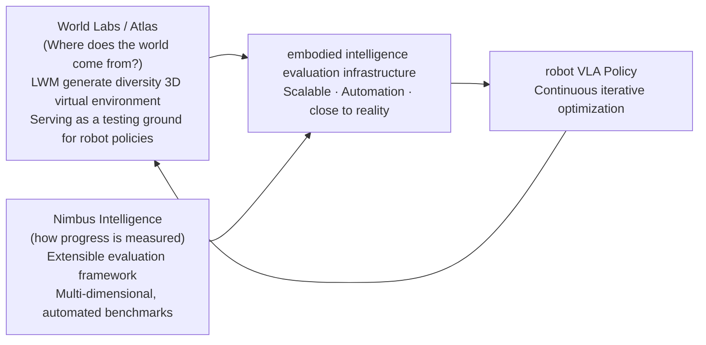

##### ⑤ Business scale and industry recognition
{: id="-商业规模与行业认可"}

|indicator|data|
|:---|:---|
|Marble release time|11 2025|
|Atlas release time|9 1, 2026 (Early Access)|
|Funding 2 2026|$1000000000 (total financing $1230000000)|
|company valuation|~$5000000000 (5× increase from $1000000000 at founding)|
|Major investors|NVIDIA, AMD, Autodesk, etc.|
|Industry recognition| Forbes AI 50 2026 |
|world model track financing changes|$1400000000 (2024) → $6900000000 (2025)|

---

#### 4. Limitations and Frontier Challenges
{: id="4-局限性与前沿挑战"}

- **Closed-source early access and academic reproducibility**: Atlas is currently in the early access (Early Access) stage for targeted partners. Although the multimodal autoregressive flow matching architecture mechanism and detailed quantitative evaluation have been disclosed, the core model weights and complete training hyperparameters have not yet been made public, and there are still barriers to independent reproduction and secondary fine-tuning by the open source community.
- **Highly dynamic micro-contact mechanics boundary**: Although Atlas supports the appearance deformation and motion simulation of rigid bodies, articulated bodies and soft bodies, at the "tactile-mechanical physics" level such as high-frequency micro-contact torque, fine friction distribution and continuous fluid dynamics required by robots, it still needs to be combined with traditional physics engines (such as Isaac Sim, MuJoCo) for joint simulation verification.
- **Ultra-large scene airborne terminal-side deployment**: The number of point clouds and 3D Gaussian Splattinging Gaussian kernels in large-scale environments often reaches millions. When performing real-time streaming deductions on embedded robot edge computing platforms (such as Jetson Orin), it is still necessary to further combine neural Gaussian pruning and LoD hierarchical loading optimization.

---

## 5.6 Image2Sim (2026)
{: id="paper-image2sim"}
———Real-time neural simulation engine that decouples 3D spatial anchoring and single-step pixel streaming

📄 **Paper**: [arXiv:2607.05765](https://arxiv.org/abs/2607.05765) · [Project Page](https://github.com/MrZihan/Image2Sim) · Tsinghua University & Zhiyuan Research Institute · [[11]](#ref-11)

#### Key takeaways
{: id="精华-5"}

Building a large-scale, high-fidelity and physically grounded interactive simulation environment is the core mission of world model to empower embodied intelligence. Image2Sim proposes a new neural simulation paradigm that decouples "3D space anchoring" and "hyper-real image synthesis":
1. **breaks the game of geometry and synthesis (Decoupled Geometry & Generation)**: uses the feed-forward 3D Feature Gaussian to provide explicit metric geometric constraints, and then uses the single-step pixel flow (Pixel Flow) generation model to complete the unobserved field of view under the guidance of the 3D geometry Alpha mask, completely overcoming the spatial forgetfulness and geometric collapse of the autoregressive generative world model;
2. **45.6 FPS extremely fast closed-loop simulation**: using continuous-time MeanFlow single-step velocity estimation and momentum auto-distillation, the multi-step iterative sampling of traditional diffusion/flow matching is compressed into a single-step forward mapping, reaching **45.6 on panoramic RGB-D rendering FPS**, for the first time, meets the real-time requirements of embodied intelligence online closed-loop interaction and large-scale reinforcement learning/DAgger training;
3.  **Automated Embodied Data Flywheel** : Construct close-range images directly from unlabeled RGB-D videos/images **20,000** Interactive neural environments and automatically synthesizes more than **10 million** Cross-view high-fidelity navigation trajectories and multimodal instructions;
4. **Zero-shot Sim2Real cross-domain generalization**: Navigation policy Image2Nav based on pure Image2Sim neural environment training, cross-simulator zero-shot generalization to real Habitat (R2R-CE success rate 70.3%) and real Hello Robot Stretch 3 physical robot.

---

#### 1. Background and problem
{: id="1-研究背景问题-4"}

Traditional embodied intelligence policy training relies heavily on manually modeled physical simulation environments (such as Matterport3D, HM3D, ProcTHOR):
- Real scanning environments are extremely expensive and the environment diversity is limited (only hundreds of scenes);
- There is a serious Sim-to-Real visual and physical fidelity gap in procedural synthesis environments;
- Although the traditional generative video world model has realistic images, it lacks explicit and persistent 3D spatial structure and metric coordinate system. The robot "collapses when looking back" after it goes far away, and cannot support long-term free navigation in a closed-loop.

Image2Sim aims to answer: Can **directly construct a neurophysical world with millimeter-level 3D spatial consistency, photo-level visual fidelity and high frame rate closed-loop interaction in seconds from unconstrained videos collected from the real world?**

---

#### 2. Methods and innovations
{: id="2-主要方法创新点-4"}

  
<figcaption>Figure: Comparison of the traditional navigation data pipeline (requiring expensive manual 3D reconstruction) and the Image2Sim neural simulation framework (automatically constructs 20,000 scenes and tens of millions of trajectories from unconstrained data). (Source: Image2Sim, 2026)</figcaption>

Image2Sim decouples neural environment simulation into a two-level cascade structure:

  
<figcaption> Figure: Image2Sim architecture: feed-forward 3D feature Gaussian encoder (left) and geometry-aware single-step Pixel Flow renderer (right). (Source: Image2Sim, 2026)</figcaption>

1. **feed-forward 3D feature Gaussian geometry construction (Feed-Forward 3D Gaussian Encoder)**:
   - Abandoning the shortcomings of traditional 3DGS scene-by-scene optimization that takes hours, a dual-stream encoder (DINOv3 high-level semantic stream + geometric detail stream) is used to directly predict the 3D feature Gaussian set of the scene in a single forward direction $$\mathcal{G} = \{g_j\}_{j=1}^M$$;
   - Under any query perspective pose $$p$$, the panoramic geometry, depth map and opacity map $$\tilde{\mathbf{A}}_p$$ are projected through micro-rasterization at the millisecond level, providing unshakable 3D geometric anchoring;
2. **Geometry-Aware One-Step Pixel Flow renderer (Geometry-Aware One-Step Pixel Flow)**:
   - When the robot roams into unscanned blind spots, holes and tears will appear in the 3DGS projection. Image2Sim uses the opacity map $$\tilde{\mathbf{A}}_p$$ to construct the alpha gated source state:
     
     $$
     \mathbf{z}_{\mathrm{src}} = \tilde{\mathbf{A}}_p \odot \tilde{\mathbf{X}}_p + \Sigma(\tilde{\mathbf{A}}_p) \odot \boldsymbol{\epsilon}, \quad \boldsymbol{\epsilon} \sim \mathcal{N}(\mathbf{0}, \mathbf{I})
     $$

   - Maintain the original projection in high-confidence geometric areas, and intelligently generate physically logical texture details in blind areas by a generation network based on Flow Matching;
   - In conjunction with the momentum self-distillation algorithm, the reverse ODE integral is distilled into a single-step forward prediction, achieving extremely fast operation of 45.6 FPS.

---

#### 3. Results and findings
{: id="3-核心结果发现-4"}

1. **Rendering speed and fidelity win-win**: On 20,000 scenes, panoramic RGB-D rendering speed reaches **45.6 FPS**, significantly faster than similar diffusion world models (usually < 1 FPS), while PSNR and LPIPS All reach first-class visual standards;
2. **Generalization of real robot policy for pure neural simulation training**: The agent conducts large-scale interactive learning entirely in the neural environment generated by Image2Sim, deploys zero samples to the real-world robot Hello Robot Stretch 3, and successfully completes multi-target object-finding navigation in an unknown room containing complex furniture layout, proving the feasibility of the neural world simulator to replace the traditional simulation engine.

---

#### 4. Limitations
{: id="4-局限性-4"}
- Currently, it mainly deals with indoor static rigid body scenes, and metric Gaussian modeling of deformable flexible objects and large-scale fluid interactions is still in the exploratory stage.

---

# 6. Family B: Decision-oriented world model
{: id="6-家族-b面向决策的世界模型"}

This family of world models directly serves the robot policy: the conditions are robot actions or task instructions, and the value is ultimately reflected in the success rate of downstream tasks. According to the coupling method between world model and policy, it is divided into four major paradigms (§2.2). Under each paradigm, the definition and mechanism are first given, and then the representative work is introduced.

  
<figcaption> Figure: The four major technical paradigms of the VLA world model. (a) World planner: world model generates latent representation z to guide VLA; (b) World action model: jointly models observations and actions; (c) World synthesizer: builds synthetic data sets through imitation learning (IL); (d) World simulator: optimizes policies and obtains external rewards through reinforcement learning (RL). (Image source: Tan et al., 2026)</figcaption>

## 6.1 World Planner
{: id="61-世界规划器"}

> 💡 **companion article introduction**: About the action tokenization, cross-embodiment pretraining and end-to-end control architecture of embodied policy models (OpenVLA, $\pi_0$, Octo, RoboCat, etc.), please see the special blog post for details .

  
<figcaption> Figure: InternVLA·N1’s end-to-end dual-system architecture: the forward dynamics planner provides future latent features to guide policy execution. (Source: Intern Robotics)</figcaption>

**defines**: This paradigm uses world model $$\mathcal{W}_\phi$$ as the forward dynamics model, synthesizes forward guidance signals in the form of explicit future observation frame $$\hat{o}_{t+1}$$ or implicit latent features $$z_{t+1}$$, and provides strong semantic and physical conditions for the downstream policy $$\pi_\theta$$:

$$
\max_\theta \mathbb{E}_{z_{t+1} \sim \mathcal{W}_\phi(\cdot|o_t)} \left[ \sum_t \log \pi_\theta(a_{t+1} | o_t, z_{t+1}) \right]
$$

The core philosophy of the world planner is **"Predict before Act"**: the world model first foresees the future (explicit image or implicit latent vector), and then feeds the forward-looking signal as input to the policy network, so that decision-making has physically grounded future perception and causal prediction. The information flow of the two mainstream paths is as follows:

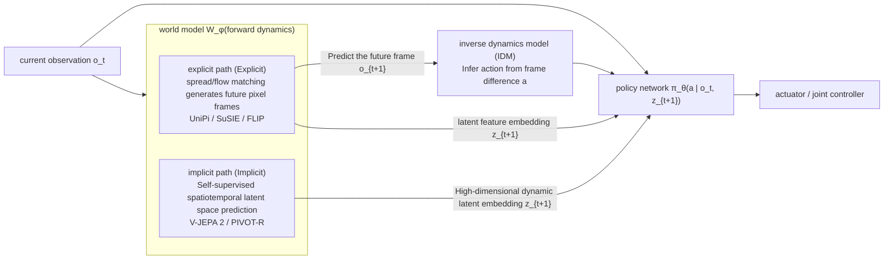

**Explicit planning vs implicit planning in-depth comparison**:

|Dimensions|Explicit Pixel Planning|Implicit Latent Planning|
|:---|:---|:---|
|**Boot signal**|Pixel level future image/video frame $$\hat{o}_{t+1}$$|Compact spatiotemporal feature embedding $$z_{t+1}$$ (such as V-JEPA 2 features)|
|**represents the method**| UniPi, SuSIE, GR-MG, Vidar, 3D-VLA, FLIP | V-JEPA 2, PIVOT-R, VPP, MinD, TriVLA, MoWM |
|Main advantages of |Intuitive and interpretable by humans, convenient visual debugging, and can be directly connected to general VLM|Filters visual noise unrelated to control such as lighting/texture, fast calculation, and less likely to produce pixel-level artifacts|
|**Main Disadvantages**|Diffusion reverse denoising sampling is time-consuming and prone to pixel-level deformation on small contact surfaces.|Lack of intuitive interpretability, downstream policies need to be strongly aligned with a specific latent space|
|**action derivation mechanism**|Inverse Dynamics Model (IDM) solves actions from changes between frames, or is read from policy network conditions|The policy network directly reads the forward-looking latent features in the latent space cross-attend|

**evolution path**: early work (UniPi [[12]](#ref-12), SuSIE [[13]](#ref-13), GR-MG, Vidar, 3D-VLA [[14]](#ref-14), FLIP) treats planning as a high-fidelity conditional video generation task, synthesizes pixel-level future states through the video diffusion model, and then derives actions through the inverse dynamics model. However, pixel-level generation faces severe inference delays and blurring of subtle physical contacts. Recently, V-JEPA 2 [[15]](#ref-15), PIVOT-R [[16]](#ref-16)) and TriVLA have turned to implicit planning to directly predict future features in the self-supervised latent space, reducing the interference of background details unrelated to dynamics, and improving the signal-to-noise ratio and calculation throughput of the guidance signal. MoWM integrates multimodal dynamics priors to form a hybrid solution to further reduce action derivation errors.

### GENE-26.5 (2026)
{: id="paper-gene"}

[GENE-26.5](https://www.genesis.ai/blog/gene-26-5-advancing-robotic-manipulation-to-human-level) released by Genesis AI in 2026 [[17]](#ref-17) is an industrial example of the world planner paradigm in the field of dexterous operations. Its core technological breakthrough is that the new **task only requires <1 hour (about 200 episodes, <20 seconds of skills) of real robot data to fine-tune**. What supports this extremely high sample efficiency is the design philosophy of "using the world model to inject physical common sense priors into low-level action policies".

**Three functional roles, one unified model**

From the perspective of system division of labor, GENE-26.5 presents three functional layers:
- **Semantic Perception Layer (VLM)**: Encodes natural language instructions and scene semantics, and is responsible for decomposing high-level logical task chains;
- **Physical prediction layer (World Model)**: action condition video generation model, which pre-learns "how objects will be stressed, deformed, broken and slid in the next few seconds" from massive unlabeled videos, providing strong physical common sense prior;
- **execution conversion layer (Action Model)**: high-frequency bottom-level control, which directly translates semantic + physical conditions into continuous joint torques.

In terms of engineering implementation, **GENE-26.5 is not three isolated modules** connected in series, but uses **Flow Matching** to uniformly model language, vision, proprioception, tactile and action The **joint multimodal distribution**. VLM and World Model are absorbed pretraining components. The downstream uses **conditional queries (Conditional Queries)** to seamlessly sample different subtasks such as control, generative simulation, state estimation, IDM or value estimation from the same joint distribution.

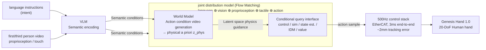

**Training paradigm and hardware collaboration**:
- **Heterogeneous multimodal pretraining (> 200,000 hours)**: Covers glove capture data (trajectory + touch), first-person natural interaction video, third-person Internet physical interaction video, and graphic corpus. The model learns "perception-physics-action" coupling priors directly from imperfectly aligned heterogeneous data, so downstream tasks only require 20–30 minutes of data fine-tuning;
- **500Hz / 3ms ultra-low latency hardware control stack**: When the physical trajectory of the world planner is sent to the real robot, the error is often amplified due to control stack delay. GENE-26.5's self-developed EtherCAT middleware compresses the end-to-end communication delay to 3ms. Combined with Genesis Hand 1.0 with 20 active back-driving degrees of freedom, it reduces the tracking error to ~2mm, ensuring that the physical trajectory predicted by the world model is reproduced with high fidelity on the physical execution end.

---

### VLA-World (2026)
{: id="paper-vla-world"}
———Learning Vision-Language-Action World Models for Autonomous Driving

📄 **Paper**: [https://vlaworld.github.io](https://vlaworld.github.io) · [[18]](#ref-18)

##### Key takeaways
{: id="精华-6"}

The core idea of VLA-World is to combine the generation capabilities of the world model with the reasoning capabilities of the VLA model by performing reflective reasoning based on single-frame future predictions. The most worth learning design is its "step-by-step" process: first generate a future map based on the predicted actions, and then let the model observe this self-generated map to identify potential collision risks and correct actions. This "think with generated future" mechanism greatly enhances the safety and interpretability of the end-to-end driving system.

---

##### 1. Background and problem
{: id="1-研究背景问题-5"}

Existing end-to-end autonomous driving models (such as VLA) often lack explicit spatiotemporal modeling, making it difficult to predict the evolution of other traffic participants in the environment. Although pure world models can generate coherent future scenarios, they often lack reasoning capabilities and are difficult to evaluate the safety or pros and cons of the generated future. VLA-World improves driving foresight by unifying predictive imagination and reflective reasoning.

---

##### 2. Methods and innovations
{: id="2-主要方法创新点-5"}

VLA-World proposes a complete process that combines perception, action-derived prediction, image generation, reflective reasoning, and planning.

  
<figcaption>Figure: VLA-World three-stage training and performance overview. (Source: VLA-World, 2026)</figcaption>

###### Three-stage training strategy
{: id="三阶段训练策略"}
1. **Phase 1: Vision pretraining**: Activating image generation knowledge on large-scale image-instruction datasets.
2. **Phase 2: supervised fine-tuning (SFT)**: Establish logical links between perception, future generation and planning through the nuScenes-GR-20K hybrid task data set.
3. **Phase 3: Reinforcement Learning (RL)**: Exploring human-like reasoning using the GRPO algorithm, allowing the model to reflect more deeply on whether the generated future is safe.

  
<figcaption>Figure: Comparison of the three paradigms of VLA, world model and VLA-World. (Source: VLA-World, 2026)</figcaption>

###### Reflective reasoning mechanism (Think with Generated future)
{: id="反思推理机制-think-with-generated-future"}
The model first outputs a trajectory prediction within 0.5 seconds and generates the corresponding future map accordingly. Subsequently, the model "reviews" this self-generated map again, identifies important objects and potential risks, finally corrects the decision, and outputs the final long-range trajectory. This mechanism is similar to the secondary reflection process of human drivers when encountering unexpected situations.

---

##### 3. Results and findings
{: id="3-核心结果发现-5"}

- **Performance**: In benchmark tests such as nuScenes, VLA-World achieved a lower collision rate (Collision Rate dropped from 1.09% to 0.94%) and higher FID video generation quality than existing VLA and world models.
- **Interpretability**: By letting the model write down the reasoning process for a "self-generated future" (such as identifying the collision risk of a certain truck), the system's decision-making process becomes more transparent.

  
<figcaption>Figure: VLA-World’s multi-view image prediction visualization in complex scenes. (Source: VLA-World, 2026)</figcaption>

---

##### 4. Limitations
{: id="4-局限性-5"}

Since the model needs to generate images before inference, the end-to-end latency of the system remains a challenge. Future research will focus on improving real-time inference speed.

---

## 6.2 World Action Model (WAM)
{: id="62-世界动作模型wam"}

**defines**: This paradigm uses a generative sequence model or diffusion model to incorporate future observation states and control actions into a unified network, and directly model the joint spatiotemporal distribution of observation and control:

$$
\max_\phi \mathbb{E}_{\tau \sim \mathcal{D}} \left[ \sum_t \log \mathcal{W}_\phi(o_{t+1}, a_{t+1} \mid o_{\le t}, a_{< t}) \right]
$$

Different from the world planner's "forward prediction and policy decoding in series", the world action model unifies the two **in the same backbone network to jointly optimize**: the model must not only predict the future frame (self-supervised physical evolution goal), but also directly decode the control action (policy execution goal).

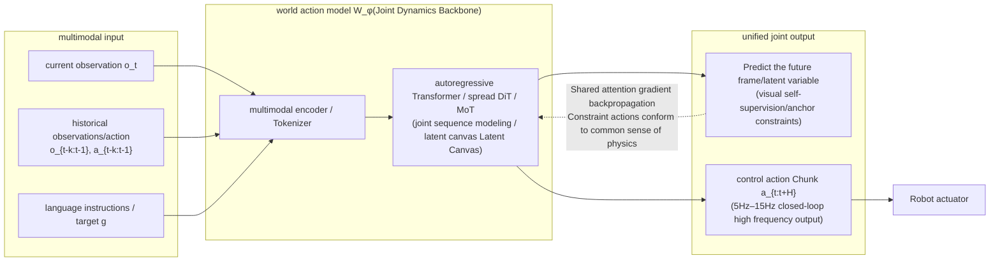

### Why WAM is getting attention
{: id="为什么-wam-受到关注"}

Traditional world models often need to rely on plug-in trajectory search algorithms (such as cross entropy method CEM, Monte Carlo tree search MCTS, model prediction path integral MPPI) when reasoning, and deduce scores one by one among hundreds of random candidate action sequences, resulting in a single-step decision-making that takes up to several seconds and cannot meet high-frequency dynamic interactions.

The main engineering advantage of **WAM is that it eliminates the need to search online for** during testing:
1. **directly generates actions in a single forward direction**: In the test phase, WAM can directly output executable action chunks (Action Chunks) in a single forward denoising in Policy mode, and the control frequency can reach **5Hz–15Hz**, eliminating the need for CEM-style deduction of a large number of candidate trajectories (NavWAM report NWM speedup is about 1100×, see below);
2. **Future visual prediction as strong regularization with landmark anchoring**: During the training phase, the model is forced to generate actions while predicting future scenes. Since visual denoising contains dense pixel-level self-supervised signals, the action head obtains deep physical dynamics constraints, which effectively alleviates the "Policy Drift" of reactive policies in long-range control;
3. **Unification and flexibility of the architecture**: Through flexible masking mechanism (Masking) or noise scheduling, the same WAM weight can be freely switched to a forward dynamics simulator, inverse dynamics annotator, pure policy controller or cross-modal editing tool.

**Fine-grained classification** (according to modeling paradigm and implementation mechanism):

|modeling paradigm|core mechanism|representative method|Core technology highlights|
|:---|:---|:---|:---|
|**Autoregressive (AR)**|video pretraining| GR-1 [[19]](#ref-19), HMA, UniVLA [[20]](#ref-20), GR-2 |Transforming large-scale video priors into end-to-end action predictions|
|**Autoregressive (AR)**|Unified sequence modeling| WorldVLA [[21]](#ref-21), RynnVLA-002, UP-VLA |Discretize images, actions, and text into a unified Token stream|
|**Autoregressive (AR)**|Foresight and chain of thought reasoning| Seer, FlowVLA [[22]](#ref-22), CoT-VLA [[23]](#ref-23), DreamVLA [[24]](#ref-24) |Introducing multimodal chain of thought and future optical flow to guide structured decision-making|
|**diffusion / flow matching**|Mixing Expert (MoT)| Motus [[25]](#ref-25), Cosmos 3 [[26]](#ref-26) |Shared self-attention + decoupled FFN, UniDiffuser multi-mode switching|
|**diffusion / flow matching**|spatial value interface| AIM [[27]](#ref-27) |Spatial Value Map (ASVM) Explicitly Decouples Intent, Self-Distilling RL Optimization|
|**diffusion / flow matching**|Potential Canvas| NavWAM [[28]](#ref-28) |9 frame world - latent canvas for action, eliminating CEM for 5Hz real-time navigation|
|**diffusion / flow matching**|asymmetric horizon| WAM-Nav [[29]](#ref-29) |Action long vision (24 steps) + visual short vision (1 step) to prevent drastic changes in perspective and drift|

---

### WorldVLA (2025)
{: id="paper-worldvla"}
———Towards Autoregressive Action World Model

📄 **Paper**: [https://arxiv.org/abs/2506.21539](https://arxiv.org/abs/2506.21539) · [[21]](#ref-21)

##### Key takeaways
{: id="精华-7"}

The core highlight of this paper is to unify the Vision-Language-Action (VLA) model and the world model (World Model) in a single autoregressive framework. Ideas worth learning include: using the world model's ability to predict future images to learn the underlying physical laws of the environment, thereby enhancing the accuracy of action generation; conversely, the action model also assists visual understanding and improves the quality of image generation. In addition, to address the error accumulation problem in autoregressive action sequence generation, the proposed action attention masking policy (Action Attention Masking) can significantly improve the performance of action chunk (Action Chunk) generation.

---

##### 1. Background and problem
{: id="1-研究背景问题-6"}

Current VLA models mainly focus on generating actions from images and text, but often lack a deep understanding of actions because actions are only used as output and not as input. In contrast, world models are able to understand physical dynamics by predicting future visual states, but are often unable to directly generate actions. WorldVLA aims to break this boundary and achieve collaborative understanding and generation of actions and images through a unified architecture.

---

##### 2. Methods and innovations
{: id="2-主要方法创新点-6"}

WorldVLA adopts an autoregressive architecture and integrates Tokenizer in three modes: image, text and action.

  
<figcaption>Figure: Comparison between WorldVLA and traditional action model and world model. (Image source: WorldVLA, 2025)</figcaption>

###### Unified architecture
{: id="统一架构"}
The model is initialized from Chameleon, a unified image understanding and generation model. It contains:
- **image Tokenizer**: VQ-GAN model, which discretizes images into Tokens.
- **Action Tokenizer**: Discretizes 7-dimensional robot actions (position, angle, fixture status) into 256 Bin Tokens.
- **text Tokenizer**: Standard BPE Tokenizer.

  
<figcaption>Figure: WorldVLA overall architecture diagram. (Source: WorldVLA, 2025)</figcaption>

###### Training strategy
{: id="训练策略"}
The training process mixes action model data and world model data:
1. **action prediction ($L_{action}$)**: Given instructions and multi-frame images, predict subsequent actions.
2. **Future prediction ($L_{world}$)**: Given the current observation and action, predict the next frame image.

###### Action Attention Masking
{: id="动作注意力掩码-action-attention-masking"}
The paper found that due to the limited generalization ability of the pretraining model in the action domain, traditional causal masks will cause errors in the previous action to rapidly propagate. To this end, WorldVLA designed a special mask: when generating the current action chunk, it masks the previous action, so that action generation only relies on visual and text input, thereby supporting parallel generation of action chunks and reducing error accumulation.

  
<figcaption> Figure: WorldVLA’s attention masking mechanism. (Source: WorldVLA, 2025)</figcaption>

---

##### 3. Results and findings
{: id="3-核心结果发现-6"}

- **LIBERO Benchmark**: WorldVLA significantly outperforms OpenVLA at both 256x256 and 512x512 resolutions.
- **Synergy effect**: After adding world model data, the success rate (SR) of action generation is significantly improved (for example, from 67.3% to 73.1% on LIBERO-Goal); at the same time, the action model also helps reduce the FVD value of video generation.
- **action chunk generation**: After adopting the new masking policy, the robustness of action chunk generation is greatly enhanced.

  
<figcaption> Figure: Action model visualization: WorldVLA can try to grab multiple times after failure. (Image source: WorldVLA, 2025)</figcaption>

  
<figcaption>Figure: A world model visualization: The future image generated by WorldVLA is more in line with physical logic. (Source: WorldVLA, 2025)</figcaption>

---

##### 4. Limitations
{: id="4-局限性-6"}

Currently used discrete image tokenizers still have limitations in perceptual expressiveness. Future work will explore larger-scale data and models, as well as design a unified Tokenizer that can better balance understanding and generation.

---

### AIM (2026)
{: id="paper-aim"}
———Intent-Aware Unified World Action Modeling with Spatial Value Maps

📄 **Paper**: https://arxiv.org/abs/2604.11135 · [[27]](#ref-27)

##### Key takeaways
{: id="精华-8"}

The most noteworthy thing about this paper is that **uses an explicit Spatial Value Map (ASVM) as the intermediate interface between the world model (World Model) and the action head (Action Head)** to complete the missing "where to interact and why to interact" operation intention (Manipulation Intent) between "future visual prediction" and "action decoding", thus avoiding the action head from dense RGB Implicit backcasting inverse dynamics in pixel futures. Specific transferable designs include: (1) **Intent-Causal Attention (Intent-Causal Attention)** - forcing the action branch to only access future information through the spatial value map through an explicit attention mask (Attention Mask), and cannot directly read future RGB Tokens, forming a structured information bottleneck; (2) **Hybrid Expert Transformer (Mixture-of-Transformers, MoT)**’s shared self-attention + branch FFN allows the three data streams of video, value map, and action to be tightly coupled while each retaining a proprietary feature space; (3) **self-distillation reinforcement learning post-training (Self-Distillation RL Post-Training)** - freezes the video generation and value map branches, and only uses the dense reward training action head generated by the projected space value map response, which is equivalent to letting the value head of pretraining self-supervise the action head without additional manual labeling. This abstraction of "implementing semantic intent into a spatial heat map" has strong general transfer value in the field of embodied VLA control.

---

##### 1. Background and problem
{: id="1-研究背景问题-7"}

The pretraining video generation model provides powerful visual priors for robot control, but existing Unified World Action Models are difficult to decode high-precision actions without fine-tuning massive amounts of robot proprietary data. The author points out that this is not a purely statistical problem, but a structural mismatch : The video generation model captures "how the physical scene evolves", while action generation also requires explicit reasoning about "where to interact (Where)" and "the underlying operation intention (Intent)"; directly from the future RGB The action of latent feature decoding forces the model to implicitly recover operational intent from a visual representation that is not optimized for control.

---

##### 2. Methods and innovations
{: id="2-主要方法创新点-7"}

  
<figcaption> diagram: A typical unified world action model (left) decodes actions directly from a shared future visual representation; AIM (right) introduces a spatial value graph interface between the world model and the action head and optimizes it through self-distillation. (Source: AIM, 2026)</figcaption>

**core idea: Explicit Spatial Interface.** AIM does not directly decode actions from future visual features, but jointly predicts future video frames $X^+$ and an action-aligned Spatial Value Map $M^+ \in [0,1]^{H \times W \times 3}$ that is aligned with its spatial geometry; the spatial value map highlights task-related interaction areas (such as grab operability Grasp Affordance areas for grab tasks, placement contacts for placement tasks Placement Contact area) as a control abstraction of operational intent. The conditional joint distribution is decomposed into:

$$p(X^+, M^+, A^+ \mid \mathcal H_t) = p(X^+, M^+ \mid \mathcal H_t)\, p(A^+ \mid \mathcal H_t, M^+).$$

Action generation **only obtains future information through the predicted spatial value map**, without directly accessing future RGB Tokens.

  
<figcaption> Figure: AIM overall framework: Stage I jointly trains future frames, spatial value maps and actions; intention causal attention transfers task intentions to the action branch; Stage II freezes the video and value branch, and optimizes the action head through GRPO reinforcement learning. (Image source: AIM, 2026)</figcaption>

**Architecture Design (Architecture).** is based on the pretraining video generation model **Wan2.2-TI2V-5B**. Initialize the video branch and add an action decoding head with the same depth but a more compact hidden layer width. Using **Mixture-of-Transformers (MoT)**: the three streams of video, value map, and action share the self-attention sub-layer in each Transformer Block, but each has an independent $W_{Q,s}^\ell, W_{K,s}^\ell, W_{V,s}^\ell$ projection and an independent feed-forward network (FFN). T5-encoded natural language instructions are only injected into the video branch through cross-attention, ensuring that the action head only receives task semantics via a shared world representation. When tokenizing, three perspectives (overhead view/left wrist/right wrist) are spliced ​​into a T-pose Canvas canvas, and Wan2.2 VAE is reused to simultaneously encode the RGB observation $z_t^o$ and the spatial value map $z_t^m$, so that the value Tokens and the visual Tokens naturally maintain geometric alignment.

**Intent-Causal Self-Attention.** This is the key structural innovation of AIM, implemented through the visibility mask (Visibility Mask) of shared self-attention:

$$\mathcal V_x = [z_t^o,\, z_{t-k:t-1}^o,\, z_{t-k:t-1}^a,\, z^\ell,\, z^x],$$

$$\mathcal V_m = [z_t^o,\, z_{t-k:t-1}^o,\, z^x,\, z^m],$$

$$\mathcal V_a = [z_t^o,\, z_{t-k:t-1}^a,\, z^o,\, z^a].$$

Semantically: Future video tokens can see current observations, instructions, and historical observation actions, thereby predicting future physical evolution under mission conditions; future value tokens can see current/historical observations and **future video tokens**, thereby anchoring spatial value predictions to the deduced future state; **action tokens can only see current observations, historical actions, and future values Tokens, but cannot see the future RGB Tokens** - The function of this masking mechanism is to first enter the video stream through T5 cross-attention → then condense and settle into the spatial value stream → and finally be read by the action decoding head, forming a strict "video $\to$ value $\to$ action" causal information bottleneck.

**training target.** The overall loss function is the weighted sum of RGB flow matching (Flow Matching), spatial value map flow matching and action inverse dynamics loss:

$$\mathcal L = \mathcal L_{rgb} + \lambda_m \mathcal L_{map} + \lambda_a \mathcal L_{act}.$$

The future RGB and future value map tokens are jointly denoised by the video generation backbone along the same flow matching trajectory, and the action tokens are denoised by the action head into a continuous double-arm control vector $\hat A^+$. During reasoning, AIM uses autoregressive Chunk-wise Rollout and uses KV cache to reuse historical tokens, which significantly improves long-term reasoning efficiency.

**Self-distillation reinforcement learning post-training (Self-Distillation RL Post-Training).** Supervised learning (SFT) can only imitate action distribution but cannot directly optimize the success rate of closed-loop tasks. Therefore, the second stage is introduced: **freezes the video to generate the backbone and spatial value map prediction header, and only uses the GRPO algorithm to update the action header**. The single-step reward function consists of two parts: dense and sparse:

$$r_t = \lambda_d r_t^{dense} + \lambda_s r_t^{sparse},\qquad r_t^{dense} = M_t(\Pi(p_t)),$$

in $r_t^{sparse}$ A sparse reward signal for task completion, $p_t$ To predict the landing point of the action or the target position of the end effector, $\Pi(\cdot)$ is the camera geometric projection matrix, $M_t$ Predicted spatial value map for frozen value header. Intuitively, action heads are positively rewarded for accurately projecting actions into high-value interaction areas—a **A self-distillation mechanism that uses the model's own spatial value prior as a dense reward** , eliminating the need for heavy manual annotation. GRPO optimization goals:

$$\mathcal L_{GRPO}(\phi) = \mathbb E_t\left[\min\!\Big(\rho_t(\phi)\hat A_t,\, \mathrm{clip}(\rho_t(\phi), 1-\epsilon, 1+\epsilon)\hat A_t\Big)\right].$$

**space value diagram annotation scheme.** For the pick task, the contact surface point cloud is recorded when the gripper establishes effective physical contact with the target object. It is mapped to the image plane through the camera projection matrix and Gaussian smoothing is applied to construct the grabbing operability region (Grasp Affordance Region); the Gaussian kernel width is dynamically adjusted according to the camera internal parameters and depth distance to ensure that the geometric scale is consistent under different viewing angles and distances. For the Placement task, the contact area when the manipulated object reaches a static configuration is detected and a Placement Contact Region is generated. The author constructed a large-scale data set of 30K trajectories on the RoboTwin 2.0 simulation platform, including simultaneous multi-view videos, precise action sequences and frame-by-frame spatial value map annotations.

---

##### 3. Results and findings
{: id="3-核心结果发现-7"}

Evaluated on 50 double-arm fine manipulation tasks of RoboTwin 2.0. The Easy/Hard difficulty is based on the task success rate (SR %) as the main indicator:

- **average success rate: AIM reaches 94.0% / 92.1% (Easy / Hard), and the comprehensive average success rate reaches 93.1%**, fully ahead of $\pi_0$ (62.2%), X-VLA (72.8%), and $\pi_{0.5}$ (79.8%), GigaWorld-0 (86.0%), Motus (87.8%), Fast-WAM (91.8%), LingBot-VA (92.2%) and other mainstream baseline models.
- **Reinforcement learning post-training gain is significant**: Stage 1 (SFT supervised fine-tuning) has reached 93.0% / 92.0% (average 92.5%); Stage 2 RL stage further brings an average improvement of +0.6 percentage points (reaches 94.0% / 92.1%, average 93.1%), with gains particularly prominent on contact-sensitive and stage-dependent tasks such as *Place Mouse Pad* (97%/95%), *Scan Object* (100%/98%), *Turn Switch* (100%/98%).
- **is significantly ahead of similar methods**: Compared with similar unified world action model Motus, AIM is improved in Easy / Hard difficulty by **+4.8 / +5.7 percentage points** (average improvement +5.3%); compared with $\pi_{0.5}$ **+12.7 / +13.9 percentage points** (average improvement +13.3%). This proves that the gain brought by explicit modeling of "spatial interaction intention" significantly exceeds simply expanding the number of parameters of the action model or video model.
- **Qualitative visualization verification**: The future frame prediction is highly aligned with the timing of the operation phase, the spatial value map accurately focuses on areas with clear physical interaction semantics (rather than general visual saliency), and the robot arm’s projected action landing points strictly fall within high-value areas, indicating that the performance breakthrough is indeed due to the designed "space bridge" mechanism.

  
<figcaption> Figure: Representative task execution process of RoboTwin 2.0 (setting the mouse pad/pressing the stapler/scanning objects/turning the switch/opening the notebook). The left column shows the Easy settings and the right column shows the Hard settings. (Source: AIM, 2026)</figcaption>

---

##### 4. Limitations
{: id="4-局限性-7"}

At present, this work mainly constructs data and evaluates it in the RoboTwin 2.0 simulation environment. Further closed-loop migration verification needs to be done on the real dual-arm robot platform. In addition, the automatic annotation of the spatial value map relies on the collision detection API and contact physical state of the simulator. How to efficiently mine spatial contact labels with the same accuracy in an unsupervised manner in real unlabeled videos is still an open topic.

---

### Motus (2025/2026)
{: id="paper-motus"}
——Unified hidden action world model: Mixture-of-Transformers and optical flow action pyramid

📄 **Paper**: [arXiv:2512.18876](https://arxiv.org/abs/2512.18876) · [Project Page](https://motubrain.com) · [Code](https://github.com/PKU-YuanGroup/Motus) · Tsinghua University & Biotechnology · [[25]](#ref-25)

##### Key takeaways
{: id="精华-9"}

Motus is the first to introduce the **hybrid expert Transformer (Mixture-of-Transformers, MoT)** and the **unified diffusion generation scheduler (UniDiffuser)** into the Unified World Action Model (WAM) for robot dual-arm operation. The core designs worth learning from include:
1. **Decouples FFN's three-expert MoT architecture**: Integrating multimodal understanding experts, video generation experts and continuous action experts in a single DiT backbone. The three types of tokens share self-attention at each layer to achieve deep information exchange, but are decoupled at the feedforward network (FFN), which not only eliminates modal feature interference, but also gives the model the ability to arbitrarily switch between world model, VLA policy, inverse dynamics and joint simulation;
2. **Optical flow-based latent action model (Latent Action VAE)**: Completely get rid of the strong dependence on the specific joint angles (Joint Angles) label of the real robot robot arm! It is proposed to self-supervisedly extract latent action vectors directly from video pixel optical flow (Optical Flow), so that massive unlabeled human interaction videos on the Internet can be seamlessly converted into pretraining data usable by robots;
3. **six-layer data pyramid**: Constructs a step-by-step distillation data pyramid from general video, camera pose video, human hand interaction video to real robot teleoperation, using pixel-level "Delta Action" to achieve cross-embodiment knowledge transfer;
4. **RoboTwin 2.0 dual-arm simulation and real robot SOTA**: On the extremely challenging fine-grained dual-arm operation benchmark RoboTwin 2.0, Motus achieves an average success rate of 87.8%, which is 15.0 percentage points higher than X-VLA (72.8%) and higher than $$\pi_{0.5}$$ (79.8%). 8.0 percentage points, and its subsequent evolved version, Motubrain, even achieved 10× inference acceleration.

---

##### 1. Background and problem
{: id="1-研究背景问题-8"}

Embodied intelligence systems have long faced serious technological fragmentation: VLA policy models (such as OpenVLA, $$\pi_0$$) only focus on mapping from images to actions, and lack a forward-looking understanding of the evolution of the physical world; while video world models (such as Sora, Wan2.1) are good at video generation, but do not know how to output precise force-controlled actions; the simple series connection of the two suffers from high latency and error accumulation.

The core question is: How can **build a unified generative backbone that can not only absorb the universal physical priors of unlabeled Internet videos, but also accurately generate continuous arm movements of the robot and complete closed-loop reasoning within milliseconds?**

---

##### 2. Methods and innovations
{: id="2-主要方法创新点-8"}

  
<figcaption> Figure: Motus overall architecture diagram: Based on the three expert networks of MoT (Mixture-of-Transformers), unified modeling of multimodal understanding, video generation and robot continuous action control. (Image source: Motus, 2025)</figcaption>

###### ① Three experts Mixture-of-Transformers (MoT) architecture
{: id="-三专家-mixture-of-transformersmot架构"}

Motus introduces a shunt design inside each Transformer Block:
- **Token organization**: The input sequence is spliced by visual latent Token $$z_v$$ (from Wan-VAE), text Token $$z_t$$ (from T5) and continuous action Token $$z_a$$ (from Latent Action VAE);
- **Shared Self-Attention (Shared Self-Attention)**: Three heterogeneous tokens of vision, text and action share the same set of attention weights, allowing action tokens to freely query the future physical evolution trend of the scene, while allowing future visual generation to be constrained by predetermined operational intentions;
- **Decoupling expert FFN (Decoupled FFNs)**: After the attention interaction, the visual Token is routed to Video FFN, the text Token is routed to Text FFN, and the action Token is routed to Action FFN. This decoupling avoids the large gradients generated by the video from destroying the numerical sensitivity of fine movements.

  
<figcaption> Figure: Motus’ Latent Action VAE: Extracting continuous latent actionspace through self-supervision of self-encoding optical flow fields. (Image source: Motus, 2025)</figcaption>

###### ② Optical flow action extraction and UniDiffuser joint denoising scheduling
{: id="-光流动作提取与-unidiffuser-联合去噪调度"}

In order to take advantage of the massive amount of unlabeled videos on the Internet, Motus designed the **Latent Action VAE**:
- Input the dense optical flow field $$F_{t \to t+1}$$ of two adjacent frames, which is compressed by the encoder into a low-dimensional continuous latent action vector $$a_t \in \mathbb{R}^{d_a}$$;
- In the training phase, a joint denoising scheduler similar to UniDiffuser is used to assign independent noise adding time steps to the video latent variable $$z_v$$ and the action variable $$a_t$$;
- By dynamically masking certain channels during training, the model naturally supports four operating modes:
  1. **world model mode**: Given observation $$o_t$$ and action $$a_t$$, denoising generates future frame $$o_{t+1}$$;
  2. **Policy mode**: Given observation $$o_t$$ and instructions, a single forward direct denoising generates execution action $$a_t$$;
  3. **Inverse dynamics (IDM) mode**: Given two frames $$o_t, o_{t+1}$$ before and after, inversely execute the action $$a_t$$;
  4. **Co-simulation mode**: Simultaneously denoises actions and future images, giving decisions and presenting expected consequences.

---

##### 3. Results and findings
{: id="3-核心结果发现-8"}

  
<figcaption>Figure: Performance comparison of Motus on the dual-arm operation simulation benchmark RoboTwin 2.0, significantly ahead of the baseline in a variety of high-precision contact tasks. (Image source: Motus, 2025)</figcaption>

1. **RoboTwin 2.0 refreshes the record**: In the dual-arm coordinated operation benchmark test, Motus's average task success rate reached **87.8%**, significantly surpassing X-VLA (72.8%) and $$\pi_{0.5}$$ (79.8%);
2. **real robot cross-embodiment generalization**: Perform more than 20 daily complex skills (such as unpacking, pouring water, folding towels) on the single-arm Franka and double-arm mobile real robot, and the average success rate exceeds **85%**;
3. **eliminates online planning delays**: The single-step action generation delay in policy mode only requires **80ms**, realizing a truly deployable high-frequency closed-loop servo.

  
<figcaption>Figure: Motus real robot multi-task control execution trajectory. (Image source: Motus, 2025)</figcaption>

---

##### 4. Limitations
{: id="4-局限性-8"}

- The latent motion space is extracted from optical flow. Although it is free of dependence on hardware tags, latent motion may produce short-term distortion when faced with optical flow artifacts caused by severe self-occlusion of the hand or extremely fast movement;
- The number of model parameters is large, and device-side deployment relies on TensorRT quantization and GPU memory optimization.

---

### NavWAM & WAM-Nav (2026)
{: id="paper-navwam"}
——Navigating the world action model: Latent Canvas and asymmetric space-time horizon

📄 **NavWAM (2026)**: [arXiv:2606.13494](https://arxiv.org/abs/2606.13494) · [Project Page](https://dachii-azm.github.io/navwam/) · [[28]](#ref-28)  
📄 **WAM-Nav (2026)**: [arXiv:2606.04907](https://arxiv.org/abs/2606.04907) · WAM-Nav: Asymmetric Latent World-Action Modeling for Unified Visual Navigation · [[29]](#ref-29)

##### Key takeaways
{: id="精华-10"}

In the field of long-range visual navigation (Visual Navigation), traditional navigation world models (Navigation World Models, NWM) have long been trapped in extremely high online planning overhead during testing (using the CEM algorithm to sample thousands of candidate trajectories, a single step can even take several minutes). The latest emerging **NavWAM** and **WAM-Nav** in 2026 have completely subverted this paradigm. Their core technological breakthroughs include:
1. **Unified latent canvas (9-Frame Latent Canvas, NavWAM)**: The current state, target image, current visual observation, future action chunk, future state prediction, future visual preview and target progress value (Value) are all packaged into a fixed 9-frame spatio-temporal latent canvas. Through joint denoising, action generation and physical prediction are completed in one go, completely eliminating the CEM search overhead during inference, and the control frequency can be up to **5Hz**, the calculation amount is reduced by thousands of times;
2. **Asymmetric Horizon (WAM-Nav)**: Profoundly reveals the fundamental difference between navigation and operation - the robot's egocentric perspective changes drastically during navigation, and long-range vision expansion can easily lead to an explosion of cumulative errors! WAM-Nav creatively adopts the asymmetric design of **"long action horizon ($$H_{act}=24$$ steps ensure smooth trajectory) + short visual horizon ($$H_{vis}=1$$ steps provide close future geometric anchoring)"**;
3. **Pure latent space lookahead and zero decoding self-supervision**: Visual prediction is all performed in the pretraining VAE latent space, without expensive pixel-by-pixel rendering, and the inconsistency between actions and physical geometry is punished through latent space speed matching loss;
4. **Real physical wheeled/bipedal robot verification**: Completed multi-scenario closed-loop actual testing on Diablo wheeled robot and Yushu Unitree G1 humanoid robot, with a success rate of **79.2%–85%**.

---

##### 1. Background and problem
{: id="1-研究背景问题-9"}

In visual goal navigation (Image-Goal/Point-Goal Navigation), the environment is usually highly complex and locally observable. The traditional planning world model (NWM) only acts as a forward predictor. Before executing each action, thousands of visual trajectories must be expanded in the memory through the cross-entropy method (CEM) closed-loop and scored one by one, resulting in **single-step reasoning delays as high as tens to hundreds of seconds** (FLOPs exceeding 14,000 TF), which cannot be used for mobile robot obstacle avoidance at all.

The core question is: Can **deeply integrate future visual prediction, value evaluation and continuous action decision-making in a single generative network to achieve a unified navigation model with both physical forward-looking vision and real-time high-frequency closed-loop?**

---

##### 2. Methods and innovations
{: id="2-主要方法创新点-9"}

  
<figcaption> Figure: Comparison of the decision flow between the traditional planned navigation world model (NWM, left) and the navigation world action model (NavWAM, right): NavWAM completely eliminates the heavy online CEM sampling optimization and achieves high-frequency closed-loop. (Image source: NavWAM, 2026)</figcaption>

###### ① NavWAM’s 9 frame world-action latent canvas (Latent Canvas)
{: id="-navwam-的-9-帧世界-动作潜在画布latent-canvas"}

NavWAM builds a unified 9-frame spatiotemporal latent canvas based on the pretraining Cosmos-Predict2 (2B) base:

  
<figcaption> Figure: NavWAM's 9 frame latent canvas layout: uniformly arrange and jointly denoise state, goal, current observation, action chunk, future state, future image and progress value. (Image source: NavWAM, 2026)</figcaption>

- **canvas layout**:
  - * frame 0–3 (observed conditions) *: space-time VAE boundary Pad, standardized robot pose $$s_t$$, target image $$g$$ and first-person current observation $$o_t$$;
  - * frame 4–8 (to be predicted output) *: executable action chunk $$a_{t:t+H-1}$$ ($$H=4$$ local heading increment), future state $$s_{t+H}$$, future continuous observation prediction $$o_{t+H-1}, o_{t+H}$$, and normalized distance value $$v_{t+H} \in [0, 1]$$ reflecting local progress to the end point.
- **Spatial Broadcasting and Average**: Scalar/vector features (action, state, value) are normalized and then broadcast and filled into the entire feature map. They are restored through spatial average pooling during decoding, perfectly reusing the standard video DiT architecture;
- **Policy mode single-step out**: input frame 0–3 during inference, a single denoising forward can output high-precision future action chunks and expected visual images at the same time, the inference delay is only **205.7 ms** (5Hz control), which is 233.8 compared with NWM. Seconds are faster **1100 times**!

###### ② WAM-Nav’s asymmetric horizon and dual-stream context fusion (DSCC)
{: id="-wam-nav-的非对称视界与双流上下文融合dscc"}

To address long-range drift under severe rotation, WAM-Nav proposed two core innovations:

  
<figcaption> Figure: WAM-Nav architecture: unified target alignment decoupling into visual query gV and geometric query gG, DSCC dual-stream fusion of historical observations and motion momentum, shared DiT joint denoising action and near-future latent features. (Image source: WAM-Nav, 2026)</figcaption>

1. **Asymmetric Horizon design (Asymmetric Horizon)**:
   - The action time domain is set to long range ($$H_{act}=24$$ steps) to ensure that the robot's kinematic trajectory is smooth and sufficiently forward-looking;
   - The visual time domain is set to extremely short range ($$H_{vis}=1$$ steps), and near-future features $$z_{t+1}$$ are predicted in the latent space of Stable Diffusion VAE, providing immediate near-field geometric obstacle collision constraints for action denoising, while completely avoiding divergence artifacts caused by long-range autoregressive video generation;
2. **Dual Stream Context Condition (DSCC)**:
   - Goal-modulated visual flow: Enhancing visuospatial memory extracted by DINOv2 with visual query $$g_V$$ residuals;
   - Relative motion history flow: Convert historical trajectories into coordinate-independent relative displacements $$(\Delta x_i, \Delta y_i, \Delta \theta_i)$$ to ensure smooth motion momentum.

---

##### 3. Results and findings
{: id="3-核心结果发现-9"}

1. **Offline benchmark and future visual consistency**: On the GO STANFORD test set, NavWAM achieves a trajectory error ATE of only 0.192 without the need for CEM action search, which is significantly better than traditional NWM (0.453), and the future visual prediction consistency (0.668) is significantly ahead;
2. **real robot robot deployment breakthrough**:
   - **NavWAM**: In 24 blind tests of the Diablo wheeled robot in indoor multiple scenes (office, warehouse, conference room, hall), it achieved a high success rate of **79.2%**, far exceeding OmniVLA (58.3%) and NWM (16.7%);
   - **WAM-Nav**: In the actual measurement of the Unitree G1 humanoid real robot, the average navigation success rate of **85%** was achieved, demonstrating the strong Sim2Real zero-sample generalization ability.

  
<figcaption>Figure: Comparison of measured camera images during actual operation of the Diablo robot and predicted future images. (Image source: NavWAM, 2026)</figcaption>

---

##### 4. Limitations
{: id="4-局限性-9"}

- Currently, the main focus is on static/quasi-static indoor environments, and dynamic flow field modeling still needs to be introduced for complex physical interactions with dynamic obstacles such as pedestrians;
- The target input is mainly aimed at image target navigation (Image-Goal), and will need to be further deeply integrated with full-modal language instructions in the future.

---

## 6.3 World Synthesizer
{: id="63-世界合成器"}

**defines**: This paradigm builds the world model into an infinitely scalable **generative data flywheel (Data Engine)**, which independently synthesizes large-scale trajectory data sets containing interleaved observation and control annotations through the joint generator $$\mathcal{G}_{\theta,\phi}$$ $$\mathcal{D}_{syn}$$, used to support large-scale imitation learning (IL):

$$
\mathcal{D}_{syn} \triangleq \left\{ \tilde{\tau} \sim p(o_0) \prod_t \mathcal{G}_{\theta,\phi}(\hat{o}_{t+1}, a_{t+1} \mid \hat{o}_t, \text{instruction}) \right\}
$$

The world synthesizer is mainly used to alleviate the problem of "long tail of data and expensive collection" in the field of robotics. Depending on whether to rely on real action annotations, two core synthesis paths have evolved:

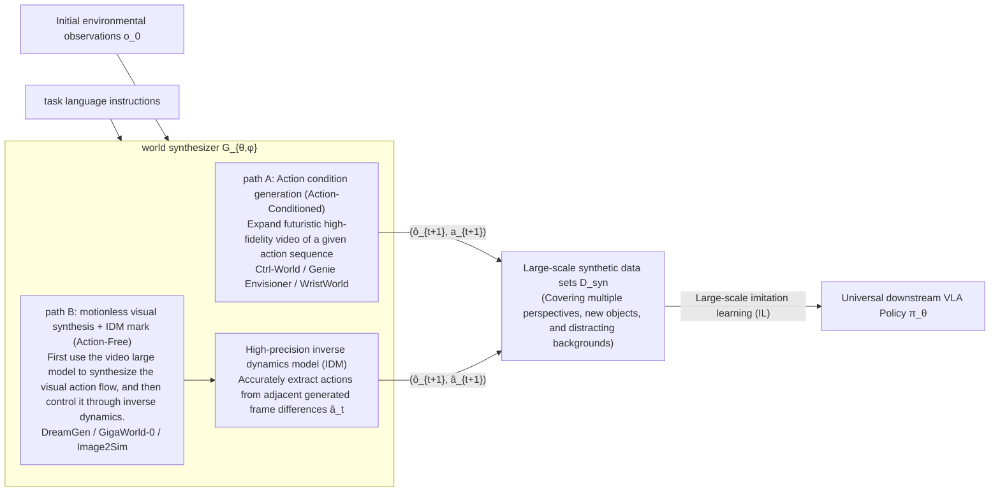

**Fine-grained classification and core path**:

1. **Action-Conditioned Rollouts**:
   - *Representative method*: Ctrl-World [[30]](#ref-30), Genie Envisioner, WristWorld [[31]](#ref-31), Qwen-RobotWorld [[32]](#ref-32)) (conditioned on actions described in natural language, see below);
   - *Mechanism*: Based on the real-collected trajectory action sequence as input conditions, the future evolution video of the corresponding perspective is generated through the world model (such as WristWorld generating 4D wrist perspective dynamics) to achieve perspective expansion and background generalization of existing data;
2. **Action-Free Video Synthesis and Inverse Dynamics Annotation Path (Action-Free Video Synthesis + IDM)**:
   - *Representative method*: DreamGen [[33]](#ref-33), GigaWorld-0 [[34]](#ref-34), Image2Sim [[11]](#ref-11);
   - *Mechanism*: Does not rely on real robot action tags. Directly use a large-scale video generation base (such as Wan2.1, Sora, Image2Sim) to synthesize visually physically reasonable interactive video trajectories under given task instructions, and then use a high-precision inverse dynamics model (IDM) to infer the robot joint control action $$\hat{a}_t$$ from the generated video frame difference. This path can utilize Internet-scale video knowledge and is an important direction to alleviate the long-tail data bottleneck of robots.

---

### Qwen-RobotWorld (2026)
{: id="paper-qwen-robotworld"}
——Using natural language to unify embodied world models: robotic arm operation, autonomous driving, indoor navigation and human-to-robot migration

📄 **Paper**: [arXiv:2606.17030](https://arxiv.org/abs/2606.17030) · [[32]](#ref-32)

##### Key takeaways
{: id="精华-11"}

By treating "language instructions" as the only unified action interface, video generation tasks in different embodied fields (operation, driving, navigation, human-to-robot transfer) can be rewritten into the same $s_{t+1} = f(s_t, a_t)$ problem, so that they can be trained jointly without conflicting with each other. Using frozen MLLM (Qwen2.5-VL) as the action encoder can make better use of its internal world knowledge (rigid body constraints, joint constraints) to generate physical rationality in implicit constraints than T5/CLIP. Dual-stream MMDiT uses layer-by-layer joint attention to bidirectionally fuse language conditions and visual latent variables at each layer, instead of just splicing them once at the input end. Scene2Robot uses the method of "segmented splicing + loss only for the generated segments" to reuse the same TI2V backbone into a cross-embodiment video editing tool without changing the architecture. The core of the data side is to map all 20+ robot ontologies and 500+ action categories to unified natural language descriptions, which is more critical than the amount of data itself.

---

##### 1. Background and problem
{: id="1-研究背景问题-10"}

General video generation models (Sora2, Veo3, etc.) have learned rich visual priors from Internet data, but do not understand embodied physical laws such as contact dynamics and rigid body constraints. While specialized embodied world models in fields such as Cosmos and LVP understand physics, they rely on robot-specific action representations such as joint angles and path points, and cannot be generalized across ontologies and tasks. Qwen-RobotWorld hopes to use natural language as a unified action interface to jointly train four types of complementary physical knowledge: operation, driving, navigation, and human-to-robot migration in the same backbone network to enhance each other instead of fighting separately.

---

##### 2. Methods and innovations
{: id="2-主要方法创新点-10"}

Qwen-RobotWorld consists of three parts: **architecture** (dual-stream MMDiT + MLLM action encoding), **data** (EWK Embodied world knowledge data set), **training** (progressive course of general prior + expert ability). These three are tightly coupled: the data provides multi-domain supervision signals under a unified language interface, the architecture ensures that language semantics and visual status can be integrated at each layer, and the training strategy determines what to learn first and what to learn later.

  
<figcaption> Figure: Overview of EWK training corpus: General world data provides appearance, geometry, and dynamics priors; structured embodied data is organized along the four dimensions of Multi-Embodiment, Multi-Task, Multi-Scenario, and Multi-View, which jointly support action understanding and future state generation under language conditions.</figcaption>

**① Overall framework overview**

The core of the model is a 60-layer dual-stream Multimodal Diffusion Transformer (MMDiT): the understanding stream processes the language semantic features extracted by frozen Qwen2.5-VL, representing the action $a_t$; the generation stream processes the visual latent variables encoded by the video VAE, representing the state $s_t$. The two streams interact through joint attention in each block, instead of just splicing it once in the input layer, so that each step of denoising allows the visual latent variables to pay attention to the semantic action signals at the same time.

  
<figcaption> Figure: Dual-stream MMDiT architecture: frozen Qwen2.5-VL encodes language actions, VAE encodes the latent variables of the video observation/prediction frame, and the two interact with joint attention in each layer of MMDiT block.</figcaption>

**② Explain** module by module

- **MLLM action encoder**: The input is a natural language instruction (such as "Pick up the pink bottle with your right hand and pour the water on the flower"), and the final hidden state $h = \phi(S)$ is extracted through the frozen Qwen2.5-VL as the condition signal. There are two reasons for using MLLM instead of lightweight encoders (T5, CLIP): (1) Deep language understanding can accurately parse complex combined instructions into fine-grained state transfer conditions; (2) The world knowledge accumulated inside MLLM (for example, the manipulator is a rigid body, with fixed link lengths and joint constraints) can implicitly constrain physically reasonable state transfers in the generation space, and joint training with T2I can prevent video frames This is a common failure mode for models that lack semantic grounding.
- **VAE state encoder/decoder**: adopts Wan-VAE architecture to encode the video frame into latent variables $z = \mathcal{E}(x)$, and decodes the predicted latent variables back to visual observations. It supports both image and video modalities.
- **MMDiT transfer function**: In the dual-stream design, the understanding stream receives the MLLM encoding after being projected by the trainable connector, and generates the noisy state latent variable of the stream receiving VAE output. The backbone has a total of 60 dual-stream blocks, 24 attention heads (dimension 128 per head), hidden dimension 3072, patch size 2×2; total parameters MLLM 7B, VAE 127M (encoder 54M + decoder 73M), MMDiT 20B, and supports up to 48,360 video tokens.
- **3D RoPE position encoding**: three dimensions of time, space height, and space width are independently encoded, using asymmetric division (pe_axes_dim = [16, 56, 56]) - the time axis dimension is small because adjacent frames are strongly correlated, and the space axis dimension is to capture richer object positions and scene layout differences; at the same time, it cooperates with Scalable RoPE Supports generalization to different resolutions and durations during inference.

**③ Scene2Robot: cross-embodiment video editor**

Human-to-robot transfer is essentially a video editing problem: the model needs to reference both the scene context (background, object layout, lighting) and the target robot's motion trajectory. Scene2Robot organizes the input into three consecutive segments without changing the architecture: scene condition segment (human demonstration video, human hands have been masked, F frame), robot reference segment (real robot execution rendered by MuJoCo, F frame), and generation segment (noise latent variable to be denoised, F frame). The first two segments are both assigned time step $t=0$ and excluded from the denoising loss, only the generated segment participates in the gradient update; 3D RoPE assigns each segment its own time index range. The joint attention of each layer of MMDiT allows the generation segment to simultaneously focus on scene appearance, robot motion trajectories, and language action semantics, thereby synthesizing realistic robot execution videos that preserve scene context and follow instruction operations.

  
<figcaption> Figure: Scene2Robot multi-segment condition mechanism: the scene condition segment and the robot reference segment only provide conditions (assigned time step 0, no loss), and the generation segment simultaneously pays attention to the scene appearance and robot motion trajectory through joint attention to achieve cross-embodiment video synthesis.</figcaption>

**④ Data: EWK data set and action-language mapping**

The core data contribution is the **action-language mapping framework**: 20+ robot embodiment types and 500+ action categories are uniformly projected into the natural language space, making the videos of Franka grippers, autonomous vehicles, and indoor navigation agents all become instances of the "same language condition video generation task". The EWK data set ultimately constitutes about 8.6 million video-text pairs and more than 200 million observation frames: about 5.9 million samples in the operation field (20+ robot forms, 1300+ skills) as the core, about 200,000 samples in autonomous driving (Waymo, NVIDIA PhysicalAI-AD, Bench2Drive, Sekai), 6000+ language-guided trajectories in indoor navigation (VLNVerse), and through MANO Reconstruction + inverse dynamics rendering of automatically generated human-to-robot migration data (covering 14 robot morphologies).

The annotation uses the **five-layer hierarchical annotation framework**: task target layer (what state transition will occur) → action detail layer (decomposed into spatiotemporal trajectories, micro-actions, speed intensity, and explicitly declares the perspective: first-person main perspective/wrist perspective/external perspective/multi-perspective splicing) → physical feedback layer (consequences of visual verification of object displacement, deformation, contact status, etc.) → There are two granularities: comprehensive description (50-100 words) and brief description (15-30 words), with 50%/50% probability sampling during training, allowing the model to execute detailed trajectory instructions and respond to short high-level commands.

**⑤ Training target**

The flow matching goal is adopted, the input video is encoded into the latent space by VAE, and the noise is sampled from the standard normal distribution; the time step adopts the lognormal distribution sampling based on the adaptive offset of the length of the video sequence; the first frame time step in the TI2V task is fixed to 0 to ensure that the generation process is conditioned on the given observation frame. The training is divided into two stages: **pretraining stage** joint training T2I/T2V/TI2V tasks establish a universal visual prior (T2I anchors the geometrically correct object form and migrates to video generation to prevent deformation); **SFT Stage** gradually injects embodied data (70% embodied/30% universal mix) according to the four-stage curriculum: single-perspective operation → multi-perspective expansion → multi-perspective splicing generation → complex tasks and cross-domain data. Operation tasks account for about 90% of the embodied part. The sampling weight ensures the depth of physical understanding, and multi-perspective splicing and navigation/driving each account for about 5% to ensure breadth.

---

##### 3. Results and findings
{: id="3-核心结果发现-10"}

Evaluated on four benchmarks: **EWMBench** ranked first with a comprehensive score of 4.60 (+0.55 ahead of second place LVP's 4.05), including a motion fidelity HSD of 0.566, 33% higher than the second place. **DreamGen Bench** (three subsets of GR1 robots) ranks first with a total score of 4.952, and has the strongest object-level combination generalization ability (GR1-Object IF 0.878). **PBench** has a total score of 0.804, surpassing all open source models, domain understanding of 0.857, ranking 3rd, and motion smoothness of 0.990, ranking 2nd among open source models. **WorldModelBench** has a total score of 8.99, surpassing all open source models (second only to closed source Wan2.6 and Veo3), and has perfect scores in all four categories of physical compliance (Newton's law, conservation of mass, fluid dynamics, gravity).

Qualitative results show that the model supports fine-grained language grounding (changing only one keyword in the instruction can produce different operation videos), cross-embodiment generalization (the same instruction drives four forms such as single-arm gripper, dual-arm system, humanoid robot, and dexterous hand without special adaptation), multi-view consistency, and cross-domain capabilities such as human-to-robot migration, autonomous driving scene synthesis, and indoor navigation generation. On the RoboTwin-IF zero-sample benchmark, even though only a small amount of RoboTwin open source data was mixed in during training, it still showed strong zero-sample instruction following and multi-view consistency, which was better than the two strong baselines of LVP and Cosmos2.5-14B.

---

##### 4. Limitations
{: id="4-局限性-10"}

Since the model is designed for embodied tasks and the output resolution is lower than the general video generator, the aesthetic quality (0.455) and imaging quality (0.649) on PBench are relatively low; the common sense dimension (frame/timing quality) on WorldModelBench also lags behind the general model due to resolution reasons. DreamGen Bench's long-term behavioral generalization (GR1-Behavior IF 0.832) is slightly inferior to LVP and GigaWorld, and there is still room for improvement.

---

## 6.4 World Simulator
{: id="64-世界模拟器"}

**defines**: This paradigm uses the action condition world model $$\mathcal{W}_\phi$$ as the **neural virtual physics simulator**. The agent performs interactive trial and error in the "imaginary space" expanded by the world model, combined with an external reward evaluator. $$\mathcal{R}_{ext}$$, using reinforcement learning (RL) algorithm to optimize policy parameters end-to-end:

$$
\max_\theta \mathbb{E}_{\substack{a \sim \pi_\theta(\cdot|o) \\ \hat{o} \sim \mathcal{W}_\phi(\cdot|o,a)}} \left[ \mathcal{R}_{ext}(\hat{o}, a) \right]
$$

The world simulator implements a closed-loop that "breaks away from expensive real robots and traditional physics engines and directly performs large-scale reinforcement learning in the neural simulator":

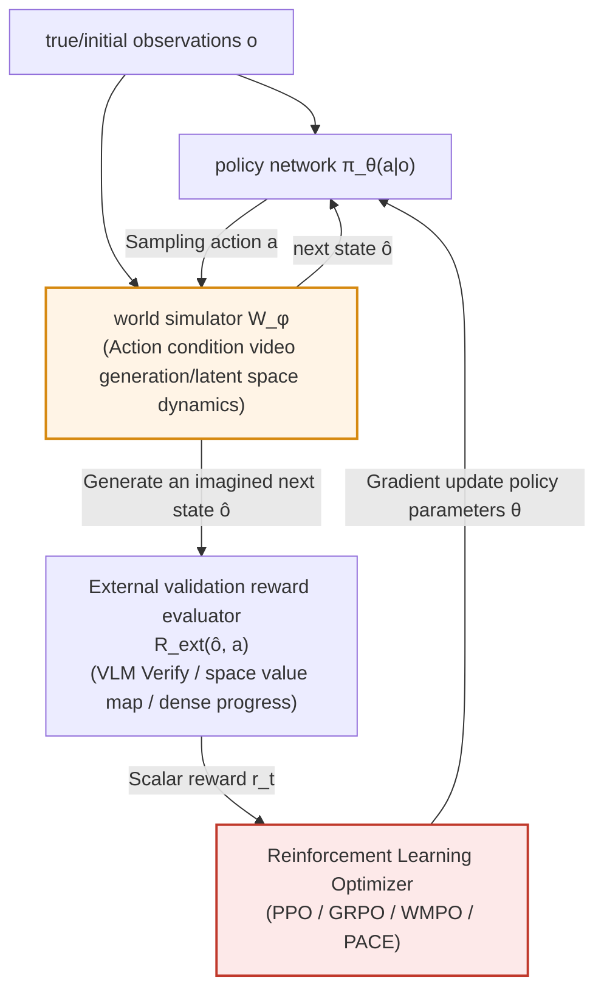

### Two major challenges and responses
{: id="两大挑战与应对"}

There are two core theoretical difficulties when using a generative world model as an RL simulator:
1. **Physical hallucination accumulation (Hallucination Accumulation)**: The multi-step errors generated by autoregression accumulate over time, and false dynamics such as objects disappearing out of thin air and gravity failure appear. The RL policy can easily use the physical loopholes in the model to obtain false high scores (Adversarial Exploitation);
2. **Policy Evolution and Distribution Shift of Environmental Dynamics (Distribution Shift)**: As the policy $$\pi_\theta$$ continues to be updated, the action sequences it explores gradually deviate from the data distribution during world model pretraining, causing the world model's prediction accuracy of new actions to drop sharply.

**The latest game-breaking technical solution**:
- **Keyframe-Initialized Rollouts (KIR, such as WoVR)**: Initialize short-range exploration from the vicinity of key frames demonstrated by experts (such as the eve of grabbing and the moment of alignment), shortening the effective prediction depth and limiting error accumulation;
- **Policy-Aligned Co-Evolution (PACE, such as WoVR)**: During the RL policy evolution process, the action trajectories generated by the current policy are regularly collected, online incremental fine-tuning of the world model is performed, and the simulator and policy action distribution are dynamically maintained in synchronization and alignment;
- **Verified & Dense Progress Rewards based on MLLM (Verified & Dense Progress Rewards, such as VLA-RFT [[35] ](#ref-35), PRBench, SRPO [[36] ](#ref-36)))**: Using VLM trained specifically for physical reasoning (such as Cosmos-Reason1) or spatial value graph (ASVM) provides dense progress rewards at each step rather than simple image similarity that is easily deceived;
- **Test-Time Adaptation (TTA, such as VLA-Reasoner [[37]](#ref-37), AdaPower [[38]](#ref-38)))**: In the real deployment test phase, the policy is allowed to dynamically fine-tune world model parameters based on environmental feedback to achieve online instant calibration.

---

### WoVR (2026)
{: id="paper-wovr"}
———World Models as Reliable Simulators for Post-Training VLA Policies with RL

📄 **Paper**: [https://arxiv.org/abs/2602.13977](https://arxiv.org/abs/2602.13977) · [[39]](#ref-39)

##### Key takeaways
{: id="精华-12"}

WoVR proposes a robot reinforcement learning (RL) framework based on the world model. The core contribution is to solve the interference of the "Hallucination" problem in the world model on the RL optimization signal. Three mechanisms worth learning from include: **Stabilized Action-conditioned Video World Model** (Stabilized Action-conditioned Video World Model) improves stability through dual-channel action injection; **Keyframe-Initialized Rollouts, KIR)** shortens the effective prediction depth and limits error accumulation by initializing the trajectory near mission key points; and **world model and policy co-evolution policy (PACE)** restores the distribution drift caused by policy updates by iteratively fine-tuning the world model, ensuring the reliability of RL training in the imagination space.

---

##### 1. Background and problem
{: id="1-研究背景问题-11"}

Using the learned world model as a simulator for reinforcement learning is a popular direction in the field of robotics, but the "illusion" of the closed-loop imagination - that is, the visual sequence generated by the model does not conform to the real physical laws - can mislead RL optimization, making it exploit the model's errors rather than the real task progress. As the policy evolves, the action distribution drifts, further exacerbating the illusion problem.

---

##### 2. Methods and innovations
{: id="2-主要方法创新点-11"}

WoVR does not assume that the world model is perfect, but explicitly regulates RL interaction with imperfect simulators through three levels.

  
<figcaption> Figure: Hallucination problem in world model and its interference with RL. (Image source: WoVR, 2026)</figcaption>

###### Stable world model architecture
{: id="稳定的世界模型架构"}
WoVR introduces an enhanced DiT (Diffusion Transformer) world model that achieves more stable motion control through a dual-channel motion injection mechanism, reducing long-range drift and structural collapse.

###### Key frame initialization playback (KIR)
{: id="关键帧初始化回放-kir"}
To prevent errors generated by autoregression from accumulating over time, WoVR uses Keyframe-Initialized Rollouts. It uses key frames from human demonstrations as starting points to conduct short-range imaginative explorations around these states. This approach greatly limits the effective prediction depth and inhibits the accumulation of hallucinations.

  
<figcaption> Picture: WoVR core three-step architecture: stable model, key frame initialization, and collaborative evolution. (Image source: WoVR, 2026)</figcaption>

###### Policy Aligned Coevolution (PACE)
{: id="策略对齐协同演化-pace"}
In order to cope with the action distribution shift (Distribution Shift) caused by policy updates, the PACE policy will regularly fine-tune the world model on the action trajectories generated by the current evolution policy. This co-evolution mechanism enables the simulator to dynamically adapt to new action distributions, keeping the policy aligned with the simulator.

---

##### 3. Results and findings
{: id="3-核心结果发现-11"}

- **LIBERO Benchmark**: WoVR improves the average success rate of LIBERO from 39.95% to 69.2% (+29.3 percentage points).
- **real robot verification**: In real robot manipulation tasks, the success rate increased from 61.7% to 91.7%.
- **Build Efficiency**: WoVR reaches a build speed of 23 FPS, making it an efficient training simulator.

  
<figcaption>Figure: WoVR visualization of imagination generation and policy execution on the LIBERO task. (Image source: WoVR, 2026)</figcaption>

---

##### 4. Limitations
{: id="4-局限性-11"}

Although WoVR alleviates hallucinations, its stability for extremely complex multi-step long-horizon tasks still needs to be improved. In addition, the computational overhead in the co-evolution process is also a direction that needs to be optimized.

---

# 7. Base models and platforms
{: id="7-基础模型与平台"}

World models are rarely trained from scratch: the video generation base provides appearance and motion priors, the unified multimodal model provides language and reasoning capabilities, and the representation model and 3D model provide geometric constraints. This chapter first lists common bases by function (§7.1), then expands on the NVIDIA Cosmos platform and Cosmos 3 (§7.2–§7.3), as well as two representative bases, Wan2.1 and Janus-Pro (§7.4–§7.5), and finally introduces a review of the application of video generation models in robots (§7.6).

## 7.1 Overview of base models
{: id="71-基础模型总览"}

The rapid development of embodied intelligence world model is highly dependent on the support of underlying multimodal generation, representation learning and spatial geometry base models. According to functional positioning, it can be divided into four base model pillars:

### Video generation model
{: id="视频生成模型"}

As the "imagination engine" of the world model, it is responsible for generating continuous spatio-temporal future videos with high fidelity under the control of natural language, historical images or action conditions. The parameter scale ranges from lightweight 0.6B to industrial-grade 17B:

|model|Parameter scale|Modeling backbone|Typical applications and embodied roles|
|:---|:---:|:---|:---|
| **Wan2.1** | 1.3B / 14B | DiT + Flow Matching |Mainstream open source base; WristWorld, DreamGen, Motus, AIM|
| **Cosmos-Predict2.5** | 2B / 14B | DiT + Flow Matching |Physical AI dedicated base; NavWAM, AdaPower, Prophet|
| **SANA-WM** | 2.6B | Hybrid GDN/Softmax |Minute-level 720p efficient generation, single-GPU low GPU memory interactive simulation|
| **LingBot-World** | 14B+14B MoE | MoE DiT |Minute-level real-time interactive world simulator, supporting event editing and command intervention|
| **LTX-Video / LTX-2** | 2B / 17B | DiT + Flow Matching |SANA-WM two-stage refiner base, ultra-high frame rate video generation|
| **HunyuanVideo** | 13B |Dual stream DiT|High visual fidelity and fine motor prior modeling|
| **Stable Video Diffusion** | 1.5B |UNet diffusion model|Early exploration of Ctrl-World, MoWM, HMA, VPP, etc.|
| **iVideoGPT / NOVA** | 0.6B |Autoregressive Transformer|VLA-RFT, WMPO [[40]](#ref-40) and other lightweight simulation evaluations|

### Unify understanding and generation models
{: id="统一理解与生成模型"}

Breaking the artificial separation between perceptual understanding (VLM) and image/video generation (Diffusion), simultaneously supporting instruction understanding, physical reasoning and action/image generation in a single autoregressive or hybrid expert network:

|model|Parameter scale|core architecture|Typical applications and embodied roles|
|:---|:---:|:---|:---|
| **Cosmos 3** | 4B / 16B / 64B |Twin Towers MoT (AR + DM)|Full-modal unified Physical AI backbone; concurrently serves as VLM, WAM, simulator and annotator|
| **Motus** | ~3B | MoT + UniDiffuser |Unified dual-arm operation WAM, supporting policy generation, forward simulation and inverse dynamics|
| **Janus-Pro** | 1B / 7B |Decoupling visual coding for AR|Understanding and generating decoupled coding, multimodal physics common sense question answering and planning|
| **Chameleon** | 7B |early fusion total autoregression|WorldVLA, native multimodal Tokenizer base for RynnVLA-002|
| **Emu3** | 8.5B |Pure autoregressive sequence forecasting|FlowVLA, UniVLA, UD-VLA end-to-end tokenization policy|
| **Show-o / VILA-U** | 1.3B / 7B |Unify Transformer|UP-VLA, CoT-VLA visual chain of thought and forward reasoning|

### Representation learning model
{: id="表征学习模型"}

Abstractly encode continuous high-dimensional sensory input into a compact, dynamically invariant and physically causal latent space representation, rather than directly generating pixels susceptible to high-frequency noise interference:

|model|Parameter scale|pretraining goals|Typical applications and embodied roles|
|:---|:---:|:---|:---|
| **V-JEPA 2** | 1B |Joint Embedding Prediction (JEPA)|NORA-1.5 [[41]](#ref-41), MoWM, SRPO implicit latent space planning and dense reward extraction|
| **DINOv2 / DINOv3** | 300M / 1B |self-supervised visual features|WAM-Nav, Image2Sim spatial geometry and object semantic memory retrieval|
| **SigLIP / SigLIP-2** | 400M / 1B |Sigmoid contrastive learning|Janus-Pro, OpenVLA multimodal high-level instruction alignment and scene semantic analysis|

### 3D geometric model
{: id="3d-几何模型"}

Providing a three-dimensional dimensional coordinate system, depth geometry and spatial persistence constraints for the world model is the cornerstone of realizing "explorable spatial intelligence (Spatial Intelligence)":

|Model/Technology|spatial representation|core competencies|Typical applications and embodied roles|
|:---|:---|:---|:---|
| **3D Gaussian Splatting (3DGS)** [[42]](#ref-42) |Explicit Gaussian particles|Millisecond-level differentiable rendering, cross-device roaming|Lyra 2.0, Marble, Image2Sim scene persistence assets and collision detection|
| **Depth Anything 2 / 3** |Monocular depth / point cloud|Extremely accurate metric geometry estimation|Cosmos-Transfer1, SANA-WM geometric condition map and camera attitude recovery|
| **VGGT / MapAnything** |3D geometric topology|Large-area metric maps and 3D scene reconstruction|Long-range embodied navigation map construction and physical boundary constraints|

---

## 7.2 NVIDIA Cosmos Platform
{: id="cosmos"}
———World Simulation with Video Foundation Models for Physical AI

📄 **Cosmos-Predict1 (2025)**: [arxiv.org/abs/2501.03575](https://arxiv.org/abs/2501.03575) · [[43]](#ref-43)  
📄 **Cosmos-Predict2.5 (2025/2026)**: [arxiv.org/abs/2511.00062](https://arxiv.org/abs/2511.00062)  
🔗 **code**: [nvidia-cosmos](https://github.com/nvidia-cosmos) · [Cosmos Cookbook](https://github.com/nvidia-cosmos/cosmos-cookbook) [[44]](#ref-44)

Cosmos is the **physical AI world base model platform** released by NVIDIA. The goal is to partially replace real data collection and physical simulation with generative video models to provide controllable "world simulation" capabilities for systems such as robots and autonomous driving. Different from a single video generation model, it is a set of **layered platform**: data curation infrastructure → three pretraining model product lines → post-training workflow for specific scenarios.

  
<figcaption> Figure: Core components of the Cosmos WFM platform: video data curation pipeline, multimodal Tokenizer, pretraining WFM and post-training application examples.</figcaption>

### Data curation
{: id="数据策展"}

The training bottleneck of the physical AI world model is first **data quality**. Cosmos Video Curator converts the original video into training data in seven stages: lens-aware segmentation → GPU transcoding → cropping → **multi-level filtering** (aesthetics, motion, OCR, DOVER perceptual quality, VTSS semantic artifacts, VLM fine screening, and finally only about **4%** Fragments pass)→Multi-granularity subtitles (Qwen2.5-VL-7B generates short/medium/long descriptions)→Semantic deduplication→Four-dimensional fragmentation by content type, resolution, aspect ratio, and duration (supports course learning and domain balanced sampling).

  
<figcaption> Figure: Cosmos Video Curator pipeline: The original multi-domain video undergoes seven stages of segmentation, transcoding, cropping, multi-level filtering, subtitle generation, semantic deduplication, and structured slicing, and the output is a high-quality data set that can be directly used for large-scale pretraining. (Source: Cosmos-Predict2.5)</figcaption>

The Predict2.5 era pipeline processed hundreds of millions of original clips and retained tens of millions (10 million in the Predict1 era); in addition, exclusive data was constructed for five fields: robot manipulation (AgiBot, GR00T, DROID, OpenX, etc.), autonomous driving (approximately 3.1 million 7-way surround-view videos), intelligent space, human dynamics, and physical phenomena.

### Three model product lines
{: id="三条模型产品线"}

|model|core competencies|Typical input|Typical output|
| --- | --- | --- | --- |
| **Cosmos-Predict** |Prediction of future world state|Text / Image / Historical Video|Future multi-second video|
| **Cosmos-Transfer** |Structured World Translation (Sim2Real)|Edge/Depth/Segmentation Map|Photorealistic video|
| **Cosmos-Reason** |Physical Reasoning VLM|Video + text questions|Natural language answers with CoT|

#### Cosmos-Predict: Forward prediction engine
{: id="cosmos-predict前向预测引擎"}

**Cosmos-Predict1 (2025)** provides two architectures at the same time: **diffusion model** (DiT + EDM + T5 text encoder, image quality and 3D Better consistency) and **autoregressive model** (causal Transformer predicts discrete video tokens, suitable for interactive expansion of long sequences). Both share **Cosmos Tokenizer** - wavelet transform + causal 3D convolution, which simultaneously outputs continuous tokens (for diffusion) and discrete tokens (for autoregression).

  
<figcaption> Figure: Cosmos-Predict1 diffusion model architecture: DiT backbone + T5 text encoder + 3D RoPE position encoding.</figcaption>

  
<figcaption> Figure: Cosmos Tokenizer: An encoding and decoding structure based on wavelet transform, which captures temporal correlation through causal 3D convolution and simultaneously outputs continuous tokens (for diffusion models) and discrete tokens (for autoregressive models).</figcaption>

**Cosmos-Predict2.5 (2025/2026) Main changes in**:

- The two routes of diffusion and autoregression **are unified into a single Flow Matching model**, and Text2World / Image2World / Video2World share a set of weights;
- The visual Tokenizer is replaced with **Wan2.1 VAE** (4×8×8 compression, each generation of 93 frames takes about 5.8 seconds);
- The text encoder was changed from T5 to **Cosmos-Reason1** (projected to 1024 dimensions after multi-layer activation splicing);
- Remove absolute position encoding and retain relative 3D RoPE to improve generalization to out-of-training resolution and duration;
- Two scales are provided: **2B / 14B**, as well as exclusive post-training versions for robot manipulation, autonomous driving and other fields.

  
<figcaption> Figure: Cosmos-Predict2.5 overall architecture: the right side is the DiT backbone, the Block prediction denoising velocity field stacked with "self-attention → cross-attention → feed-forward MLP" in the latent space, and the time step is injected with AdaLN-LoRA; the left side is the Cosmos-Reason1 text encoder, which is projected to 1024 after splicing across multiple layers of activations. Dimensional text embeddings,guided video generation via cross-attention layers. (Source: Cosmos-Predict2.5)</figcaption>

#### Cosmos-Transfer: Structured World Translation
{: id="cosmos-transfer结构化世界翻译"}

📄 **Cosmos-Transfer1 (2025)**: [arXiv:2503.14492](https://arxiv.org/abs/2503.14492) · [[45]](#ref-45)

Cosmos-Transfer translates **structured world representation** into **photo-level video**. It is typically used to upgrade the geometric/semantic output of simulators such as Isaac Sim and CARLA into realistic images (Sim2Real). Transfer1 is post-training based on Predict1-7B, and the core is **adaptive multimodal ControlNet**:

- **Multi-branch ControlNet**: Each control mode (Blur/Vis, Canny edge, DepthAnything2 depth, GroundingDino + SAM2 segmentation) has an independent branch, which can be trained separately and integrated during inference. New modes do not need to retrain the backbone;
- **spatiotemporal control graph**: Use $N \times X \times Y \times T$ dimension weight tensor $\mathbf{w}$ to assign weights to each mode at each spatiotemporal position - for example, the foreground uses edge maps to preserve details, and the background allows free generation;
- The autonomous driving version additionally supports **HDMap** and **LiDAR** conditions, as well as 4K super-resolution ControlNet.

  
<figcaption> Figure: Cosmos-Transfer1 adaptive multimodal ControlNet architecture: Each control mode corresponds to an independent control branch, which is weighted by the spatio-temporal control graph w and then injected into the main DiT generation branch to achieve position-adaptive multimodal fusion. (Source: Cosmos-Transfer1)</figcaption>

**Cosmos-Transfer2.5** inherits all modes, the model is reduced to **3.5×** (7B → ~2B), the overall quality score of PAIBench-Transfer is increased from 6.56 to 9.75, and a new The **RNDS** indicator measures the quality degradation of long videos.

#### Cosmos-Reason: Physical Reasoning VLM
{: id="cosmos-reason物理推理-vlm"}

📄 **Cosmos-Reason1 (2025)**: [arXiv:2503.15558](https://arxiv.org/abs/2503.15558) · [[46]](#ref-46)

Cosmos-Reason1 is a vision-language model for physical AI and outputs answers with `<think>...</think>` reasoning chain. It uses two sets of ontologies to define the boundaries of capabilities: **physics common sense embodiment** (three major categories of Space/Time/Fundamental Physics, 16 subcategories, such as object persistence, cause and effect, mechanics) and **embodied reasoning embodiment** (focusing on task completion verification, action operability, and next action prediction).

  
<figcaption> Figure: Cosmos-Reason1 Physics common sense embodiment: three major categories (Space, Time, Fundamental Physics) are divided into 16 fine-grained subcategories, defining the boundaries of perception and reasoning capabilities that the Physical AI model should have. (Image source: Cosmos-Reason1)</figcaption>

|Configuration| Cosmos-Reason1-7B | Cosmos-Reason1-56B |
| --- | --- | --- |
| Vision Encoder |ViT-676M (dynamic resolution)|ViT-300M (fixed 448×448)|
|LLM architecture|Dense Transformer (28 layers)|Mamba-MLP-Transformer blend (118 layers)|
|LLM pretraining base| Qwen2.5-VL | Nemotron-H |

The training is divided into two steps: **Physical AI SFT** (about 4M video-text pairs, of which about 1.93M are CoT annotations distilled by DeepSeek-R1) and **Physical AI RL** (GRPO + Multiple-choice question rewards that can be automatically verified, including self-supervised questions such as "Restore scrambled space-time blocks" and "Judge the direction of video playback"). Within the platform, Reason1 simultaneously assumes four roles: **physical rationality referee, Predict2.5 text encoder, high-level task planner, and synthetic data quality check**.

### Training process
{: id="训练流程"}

  
<figcaption> Figure: Cosmos training paradigm: large-scale pretraining of general physical knowledge → domain SFT → model fusion → RL post-training, and finally fine-tuning to adapt to various downstream Physical AI tasks.</figcaption>

Cosmos-Predict2.5 adopts a four-stage progressive paradigm:

1. **pretraining**: Course learning, gradually transitioning from 256p Text2Image to 720p (1280×704), 93 frame Text/Image/Video2World;
2. **field SFT**: Train specialized domain models on five types of data: object persistence (10.4M), high dynamics (1.0M), complex scenes (1.6M), driving (3.1M), and robot manipulation (730K);
3. **model fusion**: Use parameter interpolation methods such as Model Soup, TIES, DARE-TIES to combine special domain models into one. In human preference evaluation, the fusion model is better than any single SFT model in all fields;
4. **RL post-training**: Using **VideoAlign** (text alignment + motion quality + visual quality) as the reward and GRPO as the algorithm, the human evaluation winning rate increases by about 20 percentage points.

The inference side is compressed using rCM distillation to **4 steps** , PAI-Bench total score loss < 0.005. 4096 H100 images are used for training, and the MFU of the 2B/14B model is about 36.5%/33.1%.

### Typical applications
{: id="典型应用"}

- **Robot policy visual enhancement**: Use Transfer2.5 to replace the background, change the color of objects, and add distractors to improve the success rate of the policy under visual disturbance;
- **Autonomous driving multi-view simulation**: Generate 7-channel synchronous surround-view video based on HD map + semantics;
- **Camera controllable multi-view generation**: Camera pose conditional post-training for Predict2.5;
- **VLA synthetic data**: single frame + action condition to generate operation video, and then automatically marked and filtered by Reason1;
- **Action conditional world generation**: Predict future videos conditional on joint angles/end trajectories for policy closed-loop evaluation.

  
<figcaption> Figure: Generated samples of the Cosmos-Predict2.5-2B post-trained model on PAI-Bench: covering multiple physical AI scenarios such as autonomous driving (top two rows), industrial robot manipulation (middle three rows), human dynamics (bottom row), etc., demonstrating the model's capabilities in timing consistency and physical rationality. (Source: Cosmos-Predict2.5)</figcaption>

Official Cosmos Cookbook [[44] ](#ref-44) Provides inference scripts for three product lines, camera control/robot manipulation/autonomous driving post-training templates, data curation access process, Guardrail calling examples, and integration examples with NeMo, Isaac Sim, and TensorRT-LLM. For embodied AI researchers, the practical value of Cosmos lies in: **There is no need to train from scratch. You can directly use Predict for rolling simulation, Transfer for Sim2Real data enhancement, and Reason for physical rationality evaluation.** .

---

## 7.3 Cosmos 3 (2026)
{: id="cosmos-3"}
———Omnimodal World Models for Physical AI

📄 **Cosmos 3 (2026)**: [arxiv.org/abs/2606.02800](https://arxiv.org/abs/2606.02800) · [[26]](#ref-26)  
🔗 **code/weight**: [github.com/nvidia/cosmos](https://github.com/nvidia/cosmos) · [huggingface.co/collections/nvidia/cosmos3](https://huggingface.co/collections/nvidia/cosmos3) (OpenMDW-1.1 License)
💡 **Special topic detailed explanation**: For detailed mathematical disassembly and analysis of the Mixture-of-Transformers (MoT) architecture, please refer to my special blog [Mixture-of-Transformers (MoT) architecture detailed explanation](/mixture-of-transformers/).

If the Cosmos platform in §7.2 uses **to string together multiple dedicated models** (Predict prediction, Transfer translation, and Reason reasoning each perform their own duties), then in June 2026, NVIDIA released **Cosmos 3** This pushes this route to the end: **uses a single network architecture to simultaneously complete understanding and generation, and natively covers the five major modes of language, image, video, audio, and action**. It absorbs the vision-language model (VLM), video generation/forward dynamics model (corresponding to the world synthesizer/simulator in §6) and the world action model (WAM/VLA) **into the same model**, which is the "single model, multi-paradigm role" trend (see GENE-26.5 and §6.1 §9.3) The most complete engineering implementation at present.

  
<figcaption> Figure: Cosmos 3 as the universal backbone of Physical AI. Just by changing the input-output configuration, the same set of weights can be transformed into a vision-language model, image generation model, audio and video generation model, policy/world action model, forward dynamics model, and inverse dynamics model without any structural changes. (Source: Cosmos 3)</figcaption>

#### Core motivation: end "paradigm fragmentation"
{: id="核心动机终结范式割裂"}

The starting point of the paper is a sharp judgment: **The artificial separation between understanding and generation is a fundamental limitation** . Taking a home robot that "cleans the table after dinner" as an example, the current paradigm requires assembling a fragmented assembly line - VLM locates tableware and generates plans, VLA/WAM generates action sequences, and forward dynamics model ("world model") simulates and evaluates future states. This fragmented architecture is neither elegant nor a waste of computing power. The proposition of Cosmos 3 is that understanding inherently requires reasoning about "how the world evolves and what the consequences of actions are", while generation inherently relies on "compact structured representations of the world and behavior" - the two should be unified in **an extensible framework** inside.

#### Architecture: Mixture-of-Transformers (MoT) of Two Towers
{: id="架构双塔-mixture-of-transformersmot"}

At its core, Cosmos 3 is a **MoT Twin Towers** Structure: Cut a token sequence into two parts - the first part is **Autoregressive (AR) subsequence** Responsible for understanding reasoning, the latter part is **Diffusion (DM) subsequence** Responsible for generation. Each Transformer decoding layer internally holds **Two independent sets of parameters** (Reasoner Tower + Generator Tower), both are initialized from pretraining VLM weights, thereby inheriting strong language/visual reasoning capabilities.

  
<figcaption> Figure: MoT architecture of Cosmos 3. The same sequence is spliced ​​from the AR subsequence (language + ViT visual token, ending with EOS/BOG) and the DM subsequence (VAE visual, audio, action token, noise added during training); the AR and DM tokens in the layer each use independent LayerNorm and MLP (both initialized by the pretraining VLM), and only meet at the shared self-attention. The picture on the right shows the attention mask: AR is the causal triangle and DM is full attention. (Source: Cosmos 3)</figcaption>

Although the parameters of the two towers are independent, they are coupled through **dual-stream joint attention (Dual-Stream Joint Attention)**:

- **AR subsequence** uses **causal self-attention**, and can only see its own pre-order token - fully retaining the autoregressive text generation capability inherited from VLM (language adopts next-token prediction);
- **DM subsequence** uses **full bidirectional attention**, using the union of AR and DM tokens as Key/Value, so that each diffusion token can freely "read" text prompts and all condition frames (generating iterative denoising, Flow Matching prediction velocity field);
- **Key constraint**: AR token will never be updated by DM token - ensuring the causal integrity of the conditional path.

The subtlety of this design is that **understanding (AR) provides semantic conditions for generation (DM), and generation does not contaminate understanding**. The two complete collaboration in the same attention map without destroying each other's inductive bias.

**encoder**: Visual understanding uses **ViT** aligned with language pretraining (joint training with backbone), visual generation uses **Wan2.2-TI2V-5B video VAE** (frozen, 4× temporal, 32×32 spatial compression); frozen audio VAE (48kHz stereo, 25 tokens/sec) for audio; domain-aware projection layer for actions. The position encoding uses 3D MRoPE**with** absolute time modulation, which aligns video, audio, and action tokens with different frame rates/sampling rates to the same physical timeline.

#### Treat "action" as a first-class modal
{: id="把动作当作一等模态"}

Unlike most works that treat actions as auxiliary output, Cosmos 3 explicitly introduces a type of **action token** as a bridge connecting the physical world with language reasoning and video modeling. It uses a set of **unified action representation** to accommodate heterogeneous ontologies (autonomous driving, camera movement, first-person human body, single-arm/two-arm/humanoid robot): self pose (Ego Pose 9D) and actuator pose (Effector Pose 9D) are represented by relative pose pseudo-actions of "3D translation + 6D rotation", and the grasping state (Grasp State) directly encodes the current operating state. Each embodiment uses **domain-aware input/output projection** to adapt to different dimensions while sharing the MoT backbone. Action token $a_t$ represents the transition from video state $v_{t-1}$ to $v_t$.

  
<figcaption> diagram: Unified action representation. The control of heterogeneous ontologies is mapped into compact action vectors composed of shared geometric components - Ego/Effector motion is encoded as relative pose pseudo-action (3D translation + 6D rotation), and the grasping state directly encodes fingertip position or gripper opening and closing. (Source: Cosmos 3)</figcaption>

Because actions and videos are included in the same sequence model, Cosmos 3 unifies three action generation modes simply by different configurations of "which tokens are clean and which tokens are noisy":

  
<figcaption> diagram: The three action modes are determined by the token noise configuration. Forward dynamics (given a clean action denoised video), inverse dynamics (given a clean video denoised action), policy (given a clean video denoised video and action). (Source: Cosmos 3)</figcaption>

- **Forward Dynamics (Forward Dynamics)**: Predict the future visual state based on the observation context + clean actions - that is, the world simulator of §6.4;
- **Inverse Dynamics (Inverse Dynamics)**: Reverse actions from observed visual transfers—that is, the IDM annotator commonly used in §6.3 world synthesizers;
- **Policy**: Simultaneously predict actions and videos, giving both "intervention" and "expected visual consequences" - that is, the world action model of §6.2.

Plus pure language understanding as VLM, Text2Image, Text2Video (can jointly generate audio), Image/Video2Video, Video Transfer and other generation modes, **For the first time in Cosmos 3, the four major paradigms are natively supported by the same set of weights** .

#### Model Variants: Edge/Nano/Super
{: id="模型变体edge--nano--super"}

Three scales cover from end-side deployment to data center inference. Note that the total parameters are about 2 times that of the dense Transformer - this is the price of the twin towers (Reasoner + Generator each holding one set of parameters):

|Variants|General ginseng / dense backbone|Number of layers|hidden dimension|attention head|KV head|FFN dimension|initialization|
|:---|:---|:---:|:---:|:---:|:---:|:---:|:---|
| Cosmos3-Edge | 4B / 2B | 28 | 2048 | 16 | 8 | 9216 |Training from scratch (class Qwen3-1.7B)|
| Cosmos3-Nano | 16B / 8B | 36 | 4096 | 32 | 8 | 12288 | Qwen3-VL 8B |
| Cosmos3-Super | 64B / 32B | 64 | 5120 | 64 | 8 | 25600 | Qwen3-VL 32B |

Nano and Super are released this time, and Edge is left for follow-up. Reasoner is trained on image/video-text pairs of about **24.2M** samples (22.0M pretraining + 2.2M SFT); Generator is trained on large-scale image/video/audio/action corpus with reconstruction target (Flow Matching), and goes through pretraining → mid-training → T2I post-training → I2V post-training → A multi-stage course for robot policy post-training.

#### Training Paradigms and Physical AI Roles
{: id="训练范式与-physical-ai-角色"}

  
<figcaption> Figure: Cosmos 3 is a strong starting point for training Physical AI agents. After the universal base is obtained through pretraining + mid-training, it can be post-trained on the target data without structural changes, serving three purposes: synthetic data generation, task domain specialization, and closed-loop training environment. (Source: Cosmos 3)</figcaption>

Cosmos 3 positions itself as the triple starting point for breaking the "data and environment expansion bottleneck": (i) **synthetic data generation** - post-training as a stronger T2I / I2V generator, low-cost synthesis of high-fidelity and diverse visual data; (ii) **mission domain specialization** - Ontology/task specific fine-tuning on a shared base, retaining a unified world representation; (iii) **training environment** - The long-term goal is to generate high-quality, interactive and complex environments for closed-loop training. The paper also open sourced 5 synthetic data sets (SDG-PhyxSim / RobotSim / DriveSim / SynHuman / Warehouse) and the evaluation benchmark **Cosmos-HUE**.

#### Core results
{: id="核心结果"}

At the time of writing the technical report, the post-training variant of Cosmos 3 achieved several SOTAs:

- **Cosmos3-Super-Text2Image**: Artificial Analysis Vincent chart list **open source weight No. 1** (including closed source model No. 4, date 2026-05-28);
- **Cosmos3-Super-Image2Video**: Artificial Analysis Tusheng video list **open source weight 1st**, overall better than strong closed source models such as Veo-3.1;
-  **Cosmos3-Nano-Policy-DROID** : In RoboLab and **RoboArena** real robot policy under evaluation **Both ranked 1** (Continue training from Nano, post-training on DROID 76k trajectory, 15Hz joint output action and future video frame);
- It surpasses both open source and closed source models in reasoning tasks in the fields of robotics, intelligent space, and autonomous driving (the robot is only slightly inferior to Gemini 3.1 Pro), and both generations of video generation are significantly better than the previous generation Cosmos-Predict2.5.

#### Relationship with the Four Paradigms
{: id="与四大范式的关系"}

Cosmos 3 is one of the narratives in this article **convergence point** . GENE-26.5 (§6.1) has shown how "joint distribution + conditional query" allows a single model to play multiple roles, and Cosmos 3 extends this idea to the full mode and gives a clearer engineering boundary with the twin-tower MoT: **The Reasoner tower is responsible for the high-level semantic reasoning of the world planner, the Generator tower is responsible for the world synthesizer and world simulator for forward dynamics/video generation, and the Policy mode is the world action model.** . The explosion of world synthesizers/simulators in 2025–2026 in the timeline of §2.4 eventually converged into a full-modal world model of "understanding-generation-action integration" - this is completely consistent with the judgment of "from imagination to verification to planning" in §9.3, and also points to a unified carrier in the direction of medium and long-range foresight, 4D perception, physical consistency, etc. in §9.1.

---

## 7.4 Wan2.1 (2025)
{: id="paper-wan"}
——Alibaba’s open source family of efficient video generation base models

📄 **Paper**: https://arxiv.org/abs/2503.20314 · [[47]](#ref-47)

#### Key takeaways
{: id="精华-13"}

- The **Wan2.1** video generation model family is proposed, using the mainstream Diffusion Transformer (DiT) architecture, including two versions of 1.3B and 14B parameters, and all codes and weights are open source.
- The innovative **Spatio-Temporal VAE (Wan-VAE)** is introduced, capable of compressing video 4x8x8 times in the spatio-temporal dimension, and introduces RMSNorm and feature caching mechanisms to support arbitrary length long video streaming reconstruction and low-memory inference.
- For DiT training, the feature modulation (AdaLN) parameter sharing design is optimized, which not only reduces the number of model parameters by about 25%, but also significantly speeds up the convergence speed and improves the ability to follow instructions.
- The **2D context parallelism (Ulysses + Ring Attention)** and FSDP hybrid distributed parallel policies are used to solve the GPU memory and computing bottlenecks caused by ultra-long sequences (up to 1M level tokens).
- A unified video control and editing framework **VACE** is constructed. Through "conceptual decoupling" spatio-temporal coding of masked areas and non-masked areas, high-quality local video editing, video external expansion and other downstream tasks are achieved.

---

#### 1. Background and problem
{: id="1-研究背景问题-12"}

- Existing video generation models still face huge challenges in generating large-scale movements, high-fidelity images, ultra-long videos, and complex text prompt word understanding.
- At the same time, the high GPU memory consumption and computational complexity of large models make it difficult for them to run on consumer-grade graphics cards (such as RTX 4090), which greatly limits the secondary development and application of the open source community.
- In addition, spatiotemporal autoencoders (VAEs) often lack good spatiotemporal causality guarantees and face defects such as memory overflow and boundary discontinuity in streaming long video generation.

---

#### 2. Methods and innovations
{: id="2-主要方法创新点-12"}

##### Wan-T2V (Text-to-Video) overall architecture
{: id="wan-t2v-text-to-video-整体架构"}

  
<figcaption>Figure: The overall architecture diagram of Wan text-to-video generation (T2V). (Source: Wan2.1, 2025)</figcaption>

**① Overview of the overall framework**
The overall architecture of Wan2.1 is based on the Diffusion Transformer (DiT) paradigm and includes three core modules: **Wan-VAE**, which is used to compress videos/images from pixel space to low-dimensional latent space, and **Diffusion Transformer (DiT)**, which performs the flow matching denoising process. and the **umT5 text encoder** for text understanding.

**② Explain** module by module

- **Wan-VAE (Spatio-Temporal VAE)**: 
  - **input**: high-dimensional raw video of size $(1+T) \times H \times W \times 3$.
  - **processes**: using a 3D causal convolution structure, in which the first frame only performs spatial compression (to preserve the image prior), and the remaining frames perform joint spatio-temporal compression. The model replaces all GroupNorm with RMSNorm to maintain strict temporal causality and supports Feature Cache Mechanism. In the spatial upsampling layer, the input feature channels are halved to reduce inference GPU memory by 33%.
  - **outputs**: the space-time dimension is compressed $4 \times 8 \times 8$ times, and the number of channels is 16 low-dimensional latent space representation $x \in \mathbb{R}^{(1+T/4) \times H/8 \times W/8 \times 16}$.
  - **Feature Cache Inference**: When processing ultra-long videos, the video is split into Chunks according to Latent frame (each chunk has a maximum of 4 frames), and the last two frame feature caches of the previous stage are passed and reused between chunks to ensure continuous and seamless streaming reconstruction within limited GPU memory.

  
<figcaption> picture: Wan-VAE spatiotemporal compression autoencoder architecture diagram. (Source: Wan2.1, 2025)</figcaption>

- **umT5 text encoder**:
  - **input**: natural language prompt words input by the user (supports Chinese and English bilingual and complex layout descriptions).
  - **handles**: encoding using a bidirectional attention mechanism, which pays more attention to global semantic representation and spatial layout than unidirectional attention LLM.
  - **outputs**: the semantic Token sequence $ctxt \in \mathbb{R}^{512 \times D_{text}}$ with a length of 512.

- **Diffusion Transformer (DiT)**: 
  - **input**: latent space sequence $x_{flat} \in \mathbb{R}^{B \times L \times D}$ block and flattened by 3D convolution (Patchify, kernel size is $(1, 2, 2)$, stride is $(1, 2, 2)$), as well as text Token and time step $t$.
  - **handles**: It consists of Wan Transformer Block stacked by $N$ layers. Inside Block, the spatiotemporal relationship is captured through the self-attention (Self-Attention) mechanism, and the text token is injected into the image token through cross-attention (Cross-Attention). Time step $t$ encoding is mapped to modulation parameters via a globally shared MLP (Linear + SiLU) to adjust the scale and bias of each LayerNorm.
  - **output**: predicted denoised speed vector $v_t$.

  
<figcaption> Picture: Wan Transformer Block structural details. (Source: Wan2.1, 2025)</figcaption>

**③ End-to-end data flow**
During training, the original video is encoded into Latent state by Wan-VAE, and linearly interpolated with Gaussian noise by Flow Matching (flow matching) to obtain $x_t$, which is converted into a 1D Token sequence through the Patchify module; at the same time, the text is encoded into text Embedding by umT5. In DiT Blocks, text and space-time tokens interact through Cross-Attention. Finally, the predicted Velocity $v_t$ is used to guide the ODE solution for denoising, and the generated Latent is then used by Wan-VAE Decoder to restore a clear video image.

**④ Training target/loss function**
Based on the Rectified Flows (RFs) framework, the intermediate latent space $x_t$ is obtained by linear interpolation of the clean video latent features $x_1$ and Gaussian noise $x_0 \sim \mathcal{N}(0, I)$:
$$x_t = tx_1 + (1-t)x_0$$
The true value change rate is $v_t = x_1 - x_0$. The model learns parameters $\theta$ to fit this change rate $u(x_t, ctxt, t; \theta)$, and the loss function uses the mean square error (MSE):
$$\mathcal{L} = \mathbb{E}_{x_0, x_1, ctxt, t} \left[ \lVert u(x_t, ctxt, t; \theta) - v_t \rVert^2 \right]$$

##### Wan-I2V (Image-to-Video) architecture and control framework
{: id="wan-i2v-image-to-video-架构与控制框架"}

  
<figcaption> diagram: Wan-I2V diagram raw video model framework. (Source: Wan2.1, 2025)</figcaption>

**① Overview of the overall framework**
In order to be compatible with various downstream tasks such as image to video (I2V), video continuation (Video Continuation), and first-last frame transition (First-Last Frame Transition), Wan introduced a mask (Mask) mechanism and a dual-encoder joint adjustment policy.

**② Detailed explanation of modules and data flow**
- **dual image encoder**: input the first frame pixel simultaneously, on the one hand encoded as Latent via **Wan-Encoder**, as a mask hint with the same dimension as the noise, and together with the mask matrix $M$ with noisy latent space features $x_t$ performs Channel-wise Concatenation (channel-level splicing) as the main axis input of DiT; on the other hand, **CLIP Image Encoder** is used to extract global semantic features, and **Decoupled Cross-Attention (decoupled cross-attention)** of DiT Together with umT5 text embedding, it interacts with spatiotemporal features respectively to provide high-fidelity visual details and spatial semantics.
- **mask channel design**: The first frame (or known reference frame) is assigned a mask with a value of 0 (representing the area that needs to be reconstructed), and the remaining generated frames are assigned a mask with a value of 1 (representing the generated area). This design allows users to freely specify the spatial and temporal arrangement of reference frames.

##### VACE: a unified controllable generation and editing framework
{: id="vace统一的可控生成与编辑框架"}

  
<figcaption>Figure: VACE controllable generation and editing model framework and concept decoupling mechanism. (Source: Wan2.1, 2025)</figcaption>

**① Overview of the overall framework**
**VACE (Video Condition Unit)** aims to unify multiple editing and generation conditions such as local repainting (Repainting), Canny edge extraction, depth estimation (Depth), pose guidance (Pose), and line drawing guidance (Scribble) into the same input paradigm.

**② Data flow and concept decoupling (Concept Decoupling) Detailed explanation**
- **concept decoupling policy**: To ensure that the model can converge smoothly under various control tasks, VACE decouples the input video $F$ and mask $M$ into two sequences of the same size: **active frame** $F_c = F \times M$ (contains all pixels that need to be modified) and **lazy frame** $F_k = F \times (1-M)$ (leaves all pixels that need to remain intact).
- **encoding and injection**: $F_c$ and $F_k$ are mapped to the latent space through the same frozen Wan-VAE Encoder, and are input into DiT after splicing the channel dimension with noise. VACE provides two training modes: **Fully Fine-tuning** (full parameter fine-tuning) and **Context Adapter Tuning** (integrated into the original DiT block in the form of residuals through the plug-in Context Block, supporting lossless basic weight insertion and removal).

---

#### 3. Results and findings
{: id="3-核心结果发现-12"}

- **has excellent performance.**: The 14B model is trained on large-scale image and video data sets, surpassing the mainstream open source models (such as CogVideoX, Hunyuan Video, etc.) and closed source commercial models at the time in various internal and external benchmark tests.
-  **High compression ratio and high quality** : The space-time compression ratio of Wan-VAE reaches $4 \times 8 \times 8$ , the latent representation dimension is 16 dimensions. In the video reconstruction test at 720p resolution and 25 frame, the reconstruction quality (PSNR) is equivalent to or even better than Hunyuan Video, and the reconstruction speed is faster. **2.5 times** .
- **Extremely low computing hardware threshold**: The 1.3B model is specially designed for consumer-grade GPUs (such as RTX 4090). After turning on int8 or even TensorRT quantization, only **8.19 GB** GPU memory is needed during inference, but it can produce results comparable to larger in T2V tasks. The smoothness and consistency of the model.
- **is the first bilingual character generation**: It realizes high-definition and correct character typesetting generation capabilities in Chinese and English bilingual videos (such as generating videos containing "Wan2.1" and Chinese plaques).

---

#### 4. Limitations
{: id="4-局限性-12"}

- When the model handles extremely complex high-speed physical interactions (such as fragmentation, fluid changes and other subtle collision details), there will still be a certain degree of illusion or space-time distortion.
- Although the 1.3B model enables consumer-grade graphics card deployment, the 14B parameter model still has high computing latency during single-GPU inference, and still requires multi-card Context Parallel collaboration in large-scale production deployment.

---

## 7.5 Janus-Pro (2025)
{: id="paper-janus-pro"}
———Unified Multimodal Understanding and Generation with Data and Model Scaling

📄 **Paper**: https://arxiv.org/abs/2501.17811 · [[48]](#ref-48)

#### Key takeaways
{: id="精华-14"}

The most worth learning core idea of Janus-Pro is **decoupled visual encoding**: understanding tasks and generation tasks have essentially different requirements for visual representation. Forced sharing of encoders will cause task conflicts. After decoupling, the two paths can be optimized independently. In addition, the refinement of the training strategy is equally important - Stage I fully trains pixel-dependent modeling, Stage II removes inefficient ImageNet warm-up, and Stage III adjusts the proportion of multimodal data. Each step is aimed at known pain points rather than blindly stacking data. Synthetic data (1:1 ratio) is crucial to improve the stability of the generation quality and is a practical way to solve the problem of real data noise. The expansion of the model size from 1.5B to 7B verifies the strong scalability of the decoupled coding method and provides empirical support for the scale-up of the unified understanding and generation framework.

---

#### 1. Background and problem
{: id="1-研究背景问题-13"}

Current models that unify multimodal understanding and generation usually share the same visual encoder to handle the two types of tasks. However, there is an essential conflict in the requirements for visual representation between understanding and generation, resulting in impaired multimodal understanding performance. Although the previous generation model Janus verified this idea through decoupled visual coding, it was limited by the small amount of training data and small model capacity, and its performance in short-cue image generation quality and generation stability was poor.

---

#### 2. Methods and innovations
{: id="2-主要方法创新点-13"}

Janus-Pro systematically enhances Janus from three dimensions: training strategy optimization, data expansion, and model scale expansion.

**architecture** (same as Janus, decoupled visual encoding):

  
<figcaption> Figure: Janus-Pro overall architecture: the understanding side uses SigLIP Understanding Encoder, and the generation side uses VQ Generation Encoder, sharing the same Auto-Regressive Transformer. (Image source: Janus-Pro, 2025)</figcaption>

For ease of understanding, the following figure is my hand-drawn version of the Janus-Pro architecture (core: autoregressive unified framework, image side decoupling into two coding paths for understanding and generation):

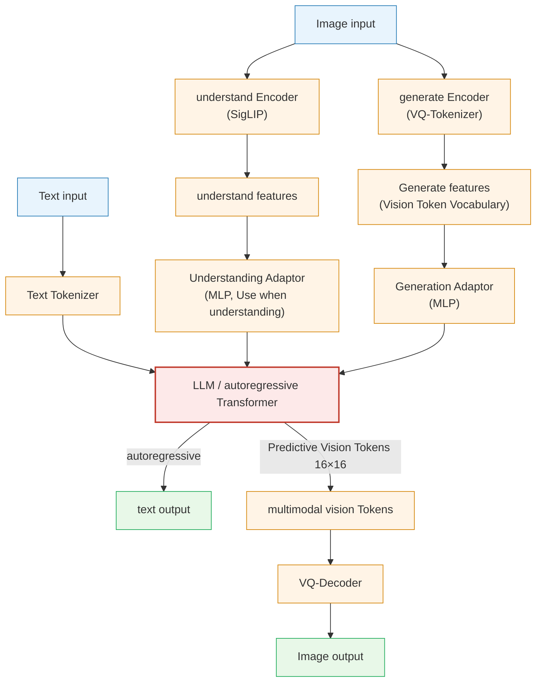

The overall framework is based on a unified autoregressive Transformer. For the multimodal understanding task, the SigLIP-Large-Patch16-384 encoder is used to extract high-dimensional semantic features, which is mapped to the LLM input space through the Understanding Adaptor (two-layer MLP); for the visual generation task, the VQ tokenizer from **LlamaGen** is used to discretize the image into an ID sequence, and the codebook embedding input is mapped through the Generation Adaptor LLM, and finally output the $384 \times 384$ image through Image Decoder.

**three-stage training process**:

Both Janus and Janus-Pro adopt a three-stage training paradigm. The following figure (taken from the original Janus paper) shows the frozen (❄️) and trainable (🔥) status of each module in each stage:

  
<figcaption> Figure: Janus / JanusFlow three-stage training flow chart: flame marks represent trainable modules, and snowflake marks represent frozen modules. Janus-Pro follows this process but makes key adjustments in Stage 1 and Stage 2. (Image source: Janus, 2024)</figcaption>

- **Stage 1 — Adaptation**: The goal is to make the newly introduced modules work together with the pretraining component. This stage freezes the **LLM** and **image understanding encoders (Und. Enc.)**, and only trains the **Linear mapping layer** that maps the image encoding to the LLM input space. **Image Generation Head (Gen. Dec.)**. The training data is ImageNet (images are generated based on category name hints). Changes to **Janus-Pro: Significantly increase the number of training steps in Stage 1**, allowing the model to more fully model pixel dependencies when the LLM parameters are fixed.

- **Stage 2 — Unified Pre-Training (unified pretraining)**: On the basis of continuing to train new modules, **unfreezes LLM and its text prediction head (Text De-Token)**, enabling it to process multimodal embedding sequences. Training samples include three categories: multimodal understanding, image generation and plain text data. Changes to **Janus-Pro: Completely remove the ImageNet data**, and directly use the densely described real Vincentian graph data - the original Janus starts with ImageNet at this stage and gradually increases the proportion of Vincentian graph data, while Janus-Pro skips this warm-up stage, and the training efficiency is significantly improved. In addition, the representation of the image encoder is aligned with the image generation potential output to enhance the semantic consistency of the generation process.

- **Stage 3 — Supervised Fine-Tuning (supervised fine-tuning)**: SFT on supervised fine-tuning data (conversation + high-quality venison graph sample). At this stage, the **image understanding encoder (Und. Enc.) also joins the training**, that is, all modules except the VAE encoder are unfrozen. Janus-Pro is consistent with the original Janus process at this stage.

**Stage 3 Data ratio adjustment**: Adjust the ratio of multimodal understanding data, plain text data, and Vincent graph data from 7:3:10 in the original Janus to 5:1:4, improving multimodal understanding performance while maintaining generation capabilities.

**data extension**:

- **Multi-modal understanding**: Refer to DeepSeek-VL2, adding about 90 million samples (image description, tables, charts, document understanding, etc.), Stage III adds additional MEME understanding, Chinese dialogue and other data;
- **visual generation**: Introducing about 72 million synthetic image samples, adjusting the ratio of real and synthetic data to 1:1, effectively solving the problems of high noise and unstable generation of the original real data.

**model extension**:

Extend the basic LLM from 1.5B to 7B (using DeepSeek-LLM), forming two versions of Janus-Pro-1B and Janus-Pro-7B. Experiments show that larger-scale LLM significantly speeds up the loss convergence speed of both types of tasks.

  
<figcaption> Figure: Performance comparison of Janus-Pro on multimodal understanding (left, average score of four benchmarks vs LLM parameter amount) and Vincentian graph instruction following (right, GenEval and DPG-Bench), Janus-Pro-7B reaches the optimal level on both types of tasks. (Image source: Janus-Pro, 2025)</figcaption>

---

#### 3. Results and findings
{: id="3-核心结果发现-13"}

**Multimodal understanding** (Table 3):
- Janus-Pro-7B reached 79.2 on MMBench, surpassing similar unified models Janus (69.4), TokenFlow-XL (68.9, 13B), and MetaMorph (75.2, 8B)
- MMMU score 50.0, GQA 62.0, comprehensively leading the unified understanding + generation model

**Vincent diagram generates** (Table 4 & 5):
- The overall GenEval score is 0.80, surpassing Janus (0.61), DALL-E 3 (0.67), and SD3-Medium (0.74)
- The DPG-Bench score is 84.19, surpassing all comparison methods (including generation-specific models)

**Qualitative results**:

  
<figcaption> Figure: Qualitative results of Janus-Pro-7B's multimodal understanding (image description, landmark recognition, general knowledge question and answer, text recognition) and Vincentian map generation, with a resolution of 384×384. (Image source: Janus-Pro, 2025)</figcaption>

---

#### 4. Limitations
{: id="4-局限性-13"}

The input resolution of multimodal understanding is limited to $384 \times 384$, which affects the performance of fine-grained tasks such as OCR. The reconstruction loss of VQ tokenizer results in a lack of details such as small facial areas in the generated image. Improving the resolution is the main direction to solve the above two problems.

---

## 7.6 Overview of Robot Video Generation (2026)
{: id="paper-videogen"}
———Applications, Research Challenges, Future Directions

📄 **Paper**: [arXiv:2601.07823](https://arxiv.org/abs/2601.07823) · [[49]](#ref-49)

#### Key takeaways
{: id="精华-15"}

1. **Core Value**: The video generation model as **high-fidelity physical world simulator** can overcome the simplifying assumptions of physical simulators and provide fine interactive perception for robots.
2. **embodied world model**: The video model is not only a visual output tool, but also an "embodied world model" that can predict the evolution of space and time, supporting policy learning and visual planning.
3. **Key applications**: covering imitation learning (data enhancement), reinforcement learning (dynamic modeling), policy evaluation (free of real environment deployment) and visual planning.
4. **mainly challenges**: including hallucinations that violate physical laws, weak ability to follow instructions, coherence in long video generation, and extremely high reasoning costs.
5. **Future directions**: Integrate physical priors (physics engine as constraints), uncertainty quantification, more efficient inference architecture (such as DiT) and long sequence generation.

---

#### 1. Background and problem
{: id="1-研究背景问题-14"}

Traditional robotics research relies on physical simulators for policy verification and training, but simulators often require complex parameter adjustments and are difficult to simulate flexible bodies or fine physical interactions. At the same time, large models (LLMs) that rely solely on language abstraction lack understanding of the fine-grained spatiotemporal dynamics of the physical world. Video Generation Models rely on their rich visual and motion knowledge learned on Internet-scale data to demonstrate performance. **Embodied World Models** huge potential.

  
<figcaption> diagram: Application framework of video generation model in the field of robotics, including policy learning, visual planning and policy evaluation. (Source: Robot-Video-Gen, 2026)</figcaption>

---

#### 2. Methods and innovations
{: id="2-主要方法创新点-14"}

The paper systematically sorts out the architectural classification, application paradigm and evaluation system of video generation models in robots.

##### Taxonomy
{: id="核心分类学-taxonomy"}
The roles of video generation models in robots are mainly divided into:
- **Data generator in imitation learning**: Synthesizing diverse expert demonstrations to alleviate the data scarcity problem.
- **Dynamics/Reward Models in Reinforcement Learning**: Predicting future states and providing visual feedback.
- **Vision Planner**: Assists robots in task decomposition and search by synthesizing future video sequences.

  
<figcaption> diagram: The organizational structure of the paper, showing the classification system of background, application, evaluation and open challenges. (Source: Robot-Video-Gen, 2026)</figcaption>

##### Model architecture evolution
{: id="模型架构演进"}
Evolved from traditional RNN/CNN-based prediction models to today’s mainstream architectures based on **Diffusion** and **Flow-matching**.
- **Diffusion Models**: Use the stepwise denoising process to synthesize high-quality video frames, and combine with Transformer (DiT) or U-Net to achieve conditional control.
- **Joint Embedding Prediction Architecture (JEPA)**: Enabling more robust non-pixel-level world modeling by learning dynamics in hidden feature space.

  
<figcaption> diagram: Schematic diagram of the diffusion-based video model architecture, showing how conditional input (text, image, action) guides synthesis. (Source: Robot-Video-Gen, 2026)</figcaption>

##### Explicit and implicit world models
{: id="显式与隐式世界模型"}
- **Implicit model**: represents the world state through visual pixels or latent space.
- **Explicit model**: Outputs explicit 3D representations such as point cloud (Point Cloud), voxel grid (Voxel Map) or 3D Gaussian splatter (3DGS) to enhance physical consistency.

  
<figcaption>Figure: Two representations of the embodied world model: implicit representation (such as video latent space) and explicit representation (such as point cloud, 3DGS). (Source: Robot-Video-Gen, 2026)</figcaption>

---

#### 3. Results and findings
{: id="3-核心结果发现-14"}

- **Performance evaluation standard**: In addition to traditional visual indicators (PSNR, SSIM, FVD), the robotics field pays more attention to physical consistency (Physics-IQ), instruction compliance (VBench [[50]](#ref-50)) and success rate after policy deployment).
- **Cross-modal advantages**: The video model can integrate text instructions, reference images and action sequences, and the generated video trajectories can be directly used to train VLA (Vision-Language-Action) policies.
- **Cost-Effectiveness**: Large-scale policy evaluation through video generation reduces reliance on real physical sites, reducing hardware losses and labor costs.

---

#### 4. Limitations
{: id="4-局限性-14"}

- **Hallucinations**: The generated videos often show objects disappearing out of thin air or violating gravity, which limits its application in security-sensitive scenarios.
- **Long sequence drift**: As the number of generation steps increases, the physical realism and coherence of the video will rapidly decrease.
- **Real-time bottleneck**: The sampling process of the diffusion model is extremely time-consuming and difficult to meet the needs of closed-loop control of the robot.

---

# 8. Evaluation benchmark and indicator system
{: id="8-评测基准与指标体系"}

The evaluation of the embodied intelligence world model has been extended from simple pixel video quality to physical law compliance, spatial consistency and closed-loop control performance of downstream robot tasks (corresponding to the inspection chain in §4.6).

## 8.1 Overview of evaluation benchmarks
{: id="81-评测基准概览"}

The evaluation environment is divided into two categories: **simulation interaction benchmark** and **real-world multi-task data set**:

### Simulation benchmark
{: id="仿真基准"}

|benchmark|scene type|Task characteristics|Robot body|number of trajectories|Number of tasks|Applicable evaluation paradigm|
|:---|:---|:---:|:---|---:|---:|:---|
| **RoboTwin 2.0** [[51]](#ref-51) |desktop/countertop|Arm coordination, intensive contact, spatial value heat map|Arm Franka / mobile base| 30k+ | 50 |World action model (WAM), spatial intention assessment|
| **LIBERO** [[52]](#ref-52) |Desktop|Space, target, long-range multi-task knowledge transfer| Franka Panda | 6.5k | 130 |Policy Planner, Autoregressive WAM|
| **CALVIN** [[53]](#ref-53) |Desktop|Continuous 5-step subtask chain, open/closed-loop testing| Franka Panda | 24k | 34 |Long-range foresight and chain of thought reasoning|
| **WorldArena 2.0** |Multiple scenes|Consistency between common sense of physics and Newton’s laws|Multiple entities| — | 100+ |Physical consistency and causal logic audit|
| **RoboCasa** |kitchen/interior|Large-scale daily complex housework and mobile control|Franka (Mobile)| 100k+ | 100 |Long-range mission decomposition and policy generalization|
| **SimplerEnv** |Realistic rendering|Realistic Sim2Real assessment environment| Google Robot, WidowX | — | 8 |real robot deployment policy pre-verification|

### Real World Datasets and Arenas
{: id="真实世界数据集与竞技场"}

|Dataset/Arena|Scene and form|long range|scale|Applicable evaluation paradigm|
|:---|:---|:---:|---:|:---|
| **RoboArena / RoboLab** |Real robotic arm multi-task blind test arena| ✓ |Continuous evaluation|Horizontal comparison of real robot closed-loop policies (Cosmos 3, etc.)|
| **DROID** |Indoor multi-realistic scenes (two arms/single arm)| ✓ |76k tracks|Policy pretraining and real robot fine-tuning evaluation|
| **Open X-Embodiment (OXE)** |Blended data across 22 robot forms| ✓ |1M+ tracks|Universal embodied pretraining characterization assessment|
| **RT-1 / BridgeData V2** |Real operation tracks of kitchen and desktop| ✓ | 130k / 60k |Basic action imitation and generalization testing|

---

## 8.2 Performance comparison
{: id="82-性能对比"}

> **Comparability Note**: The numbers in Tables 1–3 are taken from each paper’s own report. The number of demonstrations, scene randomization and evaluation protocols are not uniform. They are only for understanding the magnitude and relative position, and it is not appropriate to make strict rankings based on this.

### 1. RoboTwin 2.0 (dual-arm operation)
{: id="1-robotwin-20双臂操作"}

RoboTwin 2.0 is the current authoritative benchmark for evaluating the accuracy of dual-arm coordination and physical contact in the World Action Model (WAM):

|Model/Method|Core technology architecture|Easy difficulty SR|Hard difficulty SR|**average success rate Avg. SR ↑**|
|:---|:---|:---:|:---:|:---:|
| $\pi_0$ |Reactive flow matching policy| 64.5 | 59.8 | 62.2 |
| X-VLA |Cross-modal actions large model| 75.2 | 70.4 | 72.8 |
| $\pi_{0.5}$ |Enhanced VLA policy| 81.3 | 78.2 | 79.8 |
| GigaWorld-0 |World Synthesizer Data Enhancement| 88.0 | 84.0 | 86.0 |
| Motus |Hybrid expert WAM + optical flow submersible action| 89.2 | 86.4 | 87.8 |
| Fast-WAM |Extremely fast flow matching WAM| 93.0 | 90.6 | 91.8 |
| LingBot-VA |Interactive Audiovisual Action Model| 93.5 | 90.9 | 92.2 |
| **AIM (Stage 1 SFT)** |Spatial Value Map (ASVM) + Intent Causal Mask| 93.0 | 92.0 | 92.5 |
| **AIM (Stage 2 RL)** |**Value self-distillation reinforcement learning post-training**| **94.0** | **92.1** | **93.1** |

### 2. LIBERO (desktop operation)
{: id="2-libero桌面操作"}

|method|paradigm type| Spatial | Object | Goal | Long | **Avg. ↑** |
|:---|:---|:---:|:---:|:---:|:---:|:---:|
| World-Env |World Simulator (RL)| 87.6 | 86.6 | 86.4 | 57.8 | 79.6 |
| VLA-Reasoner |Planner (TTA)| 91.2 | 90.6 | 82.4 | 59.8 | 81.0 |
| WorldVLA |Autoregressive WAM (causal mask)| 87.6 | 96.2 | 83.4 | 60.0 | 81.8 |
| CoT-VLA |Autoregressive WAM (chain of thought)| 87.5 | 91.6 | 87.6 | 69.0 | 83.9 |
| TriVLA |Planner (implicit latent guidance)| 91.2 | 93.8 | 89.8 | 73.2 | 87.0 |
| FlowVLA |Autoregressive WAM (flow aware)| 93.2 | 95.0 | 91.6 | 72.6 | 88.1 |
| VLA-RFT |World Simulator (Dense Rewards RL)| 94.4 | 94.4 | 95.4 | 80.2 | 91.1 |
| DreamVLA |Autoregressive WAM (World Dream)| 97.5 | 94.0 | 89.5 | 85.2 | 91.6 |
| UD-VLA |Diffusion WAM (Discrete Diffusion)| 94.1 | 95.7 | 91.2 | 89.6 | 92.7 |
| UniVLA |Autoregressive WAM (latent action)| 95.4 | 98.8 | 93.6 | 94.0 | 95.5 |
| dVLA |Diffusion WAM| 97.4 | 97.9 | 98.2 | 92.2 | 96.4 |
| RynnVLA-002 |Unified Sequence WAM| **99.0** | 99.8 | 96.4 | 94.4 | 97.4 |
|**SRPO (online)**|**World Simulator (Scaffolding RL)**| 98.8 | **100.0** | **99.4** | **98.6** | **99.2** |

### 3. CALVIN ABC→D (long sequence)
{: id="3-calvin-abcd长程序列"}

|method|paradigm type|Task 1|Task 2|Task 3|Task 4|Task 5| **Avg. Len. ↑** |
|:---|:---|:---:|:---:|:---:|:---:|:---:|:---:|
| GR-1 |Early Autoregressive WAM| 85.4 | 71.2 | 59.6 | 49.7 | 40.1 | 3.06 |
| GR-MG |planner (explicit pixels)| 96.8 | 89.3 | 81.5 | 72.7 | 64.4 | 4.04 |
| MoWM |hybrid planner| 94.3 | 87.3 | 81.2 | 75.0 | 67.5 | 4.05 |
| UP-VLA |Autoregressive WAM| 92.8 | 86.5 | 81.5 | 76.9 | 69.9 | 4.08 |
| Seer |Predictive inverse dynamics| 96.3 | 91.6 | 86.1 | 80.3 | 74.0 | 4.28 |
| VPP |planner (implicit latent representation)| 95.7 | 91.2 | 86.3 | 81.0 | 75.0 | 4.29 |
| UniVLA |Unified Autoregressive WAM| **98.9** | **94.8** | 89.0 | 82.8 | 75.1 | 4.41 |
| TriVLA |Planner| 96.8 | 92.4 | 86.8 | 83.2 | **81.8** | 4.41 |
| **DreamVLA** |**World Dream Enhancement WAM**| 98.2 | 94.6 | **89.5** | **83.4** | 78.1 | **4.44** |

### 4. Production quality (self-reported by each paper)
{: id="4-生成质量各论文自报"}

Different from the first three downstream policy tables, the world model "generation side" currently **There is no unified horizontal list** ——The evaluation set, resolution, video duration and indicator scope of each job are inconsistent. The following table only summarizes the numbers reported by each paper to facilitate locating the source. **Does not constitute a horizontally comparable ranking** : 

|Model/Architecture|Generate quality indicators (paper caliber)|Camera/Geometry Control Accuracy|Efficiency and Deployment|Source|
|:---|:---|:---|:---|:---:|
| **Cosmos-Predict2.5** (2B/14B) |RL post-training human preference winning rate is about 20 percentage points higher than before RL| — |rCM distilled to 4 steps, PAI-Bench total score loss < 0.005; 4096×H100 training| §7.2 |
| **Cosmos-Transfer2.5** (~2B) |PAIBench-Transfer overall quality 6.56 → **9.75**|Control signal compliance is better than Transfer1-7B|Model size reduced by 3.5× (7B → ~2B)| §7.2 |
| **Cosmos 3** (Nano/Super) |Artificial Analysis T2I / I2V list **open source weight 1st** (T2I includes closed source 4th)| — |Nano-Policy 15Hz joint output action and future frame; RoboArena / RoboLab real robot 1st| §7.3 |
| **SANA-WM** (2.6B) |VBench Overall **80.62 / 81.89** (Simple / Hard trajectory)|RotErr **4.50° / 8.34°**, CamMC **1.41 / 1.44** (↓ The lower the better)|Single GPU 74.7 GB; 34s to 60s for 720p on RTX 5090| §5.3 |
| **LingBot-World** (14B+14B MoE) | VBench Overall 81.82 / 81.89 | RotErr 10.47° / 18.99° |8×H100 (454.1 GB); 16 fps, sub-second latency| §5.2 / §5.3 |
| **Qwen-RobotWorld** (20B MMDiT) |EWMBench **4.60 (1st)**, WorldModelBench **8.99**, PBench 0.804, DreamGen Bench 4.952|Full marks in four categories of physical compliance (Newton's Law/Conservation of Mass/Fluids/Gravity)|Aesthetics and imaging quality due to low resolution (0.455 / 0.649)| §6.3 |
| **Wan2.1** (1.3B/14B) |720p·25 frame reconstruction PSNR is equivalent to HunyuanVideo, reconstruction speed **2.5×**| — |1.3B int8 quantized **8.19 GB**, RTX 4090 can run| §7.4 |
| **Image2Sim** |Panoramic RGB-D rendering **45.6 FPS** (similar diffusion world model typically < 1 FPS)|Feedforward 3D feature Gaussians provide explicit metric geometric anchoring|Automatically build 20000 interactive neural environments; R2R-CE zero sample 70.3%| §5.6 |
| **Marble & Atlas** (World Labs) |Control mirror blind test preference **75%~94%** wins; 3D reconstruction error AbsRel **25.3** (all benchmarks exceed MapAnything / VGGT / Depth Anything 3)|Native 6-DoF camera trajectory input, pixel-level mirror control; end-to-end output RGB-D + 3DGS / point cloud|1440p / 60s minute-level generation; multi-platform 3DGS real-time streaming rendering| §5.5 |

---

## 8.3 Evaluation indicators
{: id="83-评估指标"}

The modern world model evaluation system consists of three-dimensional interweaving of **visual fidelity**, **physical geometric consistency** and **closed-loop control performance**:

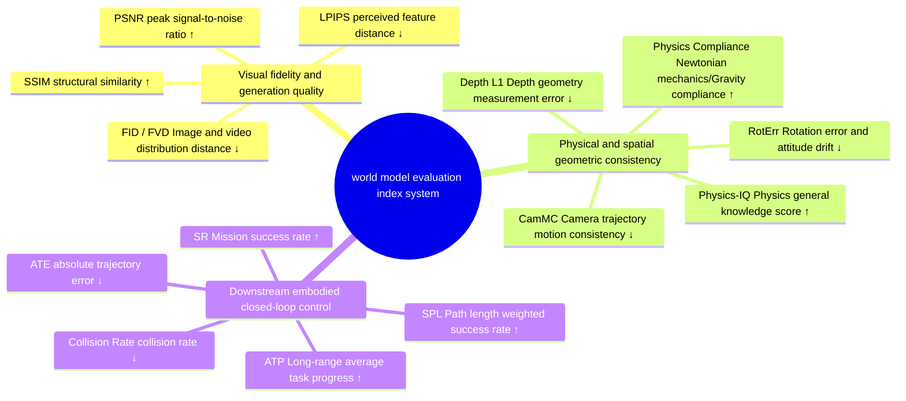

**special comprehensive benchmark system**:

|Comprehensive benchmark|Main assessment dimensions and inspection focus|Representative evaluation model|
|:---|:---|:---|
| **WorldModelBench** |Compliance with physical laws (Newton's law, conservation of mass, fluid dynamics, common sense of gravity)| Qwen-RobotWorld, Wan2.6, Veo3 |
| **EWMBench** |Physical simulation of complex embodied operations, multi-view geometric consistency and motion realism| Genie Envisioner, Qwen-RobotWorld |
| **DreamGen Bench** |Complex instruction following (Instruction Following) and long-term generalization across objects| DreamGen, GigaWorld-0 |
| **PAI-Bench (PBench)** |Quality and Domain of text-to-physical world generation| Cosmos-Predict2.5, GigaWorld-0 |
|**PRBench (Progress Reward Benchmark)**|Stage progress monotonicity alignment (SC/Mono) and target discrimination sensitivity (MMD/JS)| SRPO, NORA-1.5 |
| **TransferBench** |Sim2Real Translation Control Adherence, Generation Diversity and Visual Quality| Cosmos-Transfer1 / 2.5 |

---

# 9. Open challenges and practical implications
{: id="9-开放挑战与实践启示"}

## 9.1 Six major opening challenges
{: id="91-六大开放挑战"}

The world model is progressing rapidly in 2025–2026, but to work reliably in industrial-grade robotic systems, the following issues still need to be resolved:

### Physical consistency
{: id="物理一致性"}

The current generative world model is more realistic in terms of microscopic motion, but it still relies on statistical fitting on laws such as rigid body collision impulse conservation, elastic/plastic deformation, fluid splashing, and non-penetrable mold constraints, which easily produces physical illusions.
- **frontier direction**: Embed **Differentiable Physics Simulators** into the denoising process, using the physical residual as the loss regularization term;
- **Causal reasoning and counterfactual deduction**: Combined with Causal Discovery, the world model can answer hypothetical questions such as "If the robot arm applies an additional 2N lateral force, will the cup tip over?"

### 3D/4D spatial representation
{: id="3d4d-空间表示"}

It is difficult for 2D pixel flow to permanently retain the 3D spatial structure, and "spatial forgetting" and geometric distortion are prone to occur when the agent moves in a large range (§4.4).
- **forward direction**: **3D Gaussian Splatting (3DGS)**, **persistent point tracking (Persistent Point Tracking)** and **continuous occupancy fields (Occupancy Fields)** are represented as native states;
- **Trend**: World Labs' Marble/Atlas and Image2Sim (§5.5, §5.6) demonstrate the route from "2D video prediction" to "sustainably explored, interactive 3D world", enabling the world model to have metric geometry.

### Security and uncertainty
{: id="安全与不确定性"}

Before the world model can be used for real robot control, it must know when it is untrustworthy.
- **Frontier Direction**: Introducing **conformal prediction (Conformal Prediction)** and **epistemic uncertainty (Epistemic Uncertainty) quantification** (such as model integration), proactively alarm and switch to manual teleoperation when encountering out-of-distribution scenarios or the risk of collision is too high;
- **Automated physical rationality audit**: Use physical reasoning VLM (such as Cosmos-Reason1) to act as a "physical referee" to check geometric interference and mechanical rationality before generating results to the policy.

### Long term deduction
{: id="长时程推演"}

The GPU memory and calculation of standard Softmax self-attention increase quadratically with the sequence length, and minute-level look-ahead derivation is difficult to deploy on the device side.
- **frontier direction**: **hybrid linear/gated attention** (such as SANA-WM's Gated DeltaNet) and **attention sink**, so that the memory remains at a constant level (§4.4);
- **Hierarchical Dynamics**: The high level uses low-frequency step skipping to predict sub-goals, and the bottom level uses high frequency to develop fine force control trajectories.

### Failure Data with Sim2Real
{: id="失败数据与-sim2real"}

Most robotics datasets only contain successful demonstrations by experts, and models have little experience with "failure states".
- **Frontier Direction**: **actively generates failure modes**—use world model to directionally synthesize failure trajectories such as overturning, slipping, and getting stuck, and train policies with error correction and recovery capabilities;
- **Sim2Real domain bridging**: Use a structured world translator (such as Cosmos-Transfer, §7.2) to upgrade simulation rendering to a realistic picture and reduce the perception domain difference.

### Full modal unity
{: id="全模态统一"}

The practice of understanding, generating, predicting and controlling modular assembly is being replaced by unified models.
- **Frontier direction**: With **Mixture-of-Transformers (MoT)**, **full-mode flow matching** as the backbone (such as Cosmos 3, Motus), language, first / Third-person vision, proprioception, touch, geometry and movement are integrated into the same token stream, and the same set of weights act as perception, generation, planning and control modules on demand.

---

## 9.2 Five Project Experiences
{: id="92-五条工程经验"}

For scientific research and engineering teams dedicated to the development of embodied intelligence, VLA and robots, the following five lessons can be extracted from the previous article:

1. **"Data quality and curation" is more important than "blindly expanding parameters"**: The experience of Cosmos Video Curator and EWK data sets shows that the contribution of strict lens segmentation, multi-level physical filtering, and multi-view space and time hierarchical description to the physical world model is often no less than simply increasing DiT parameters;
2. **Prioritize embracing the World Action Model (WAM) to eliminate online search overhead**: In closed-loop control with strict real-time requirements, the WAM or Latent Canvas architecture should be prioritized to use future visual prediction as self-supervised anchoring to achieve single-step forward 5Hz–15Hz high-frequency output to avoid expensive CEM sampling;
3. **attaches great importance to implicit space planning and asymmetric spatio-temporal horizon**: In mobile navigation or complex operations with drastic changes in viewing angles, it is important to avoid uncontrolled elongation of autoregressive pixel generation; using "long motion horizon + short implicit space visual look-ahead" can provide the most reliable geometric constraints at a very low cost;
4. **Be wary of "distribution drift and hallucination vulnerabilities" in reinforcement learning simulators**: When doing RL post-training in a virtual world model, key frame initialization (KIR), policy co-evolution (PACE) and verifiable dense rewards based on physical reasoning VLM must be used to prevent the policy from over-fitting to the generator's physics bug;
5. **Layout 3D Explicit Representation and Spatial Intelligence Basics**: 2D pixels are dimensionality reduction projections of the 3D physical world. In the long run, Large World Models (LWM) that deeply integrate 3DGS, point cloud and metric geometry are an important direction to solve the spatial generalization problem.

## 9.3 Research and Judgment of Technical Route
{: id="sec-9-3-future-roadmap"}

The development process of embodied intelligence world model reflects the fundamental leap in AI's cognitive ability of the physical world. Looking at the technological evolution from 2018 to 2026, we can clearly sort out three intertwined and evolving technological main lines:

```mermaid
flowchart TD
    subgraph Track1["Main Line 1: Generating Representation Dimensions"]
        T1_1["1D/2D latent state<br/>(World Models, Dreamer)"] --> T1_2["2D pixel video<br/>(Genie, Wan2.1, Sora)"]
        T1_2 --> T1_3["3D/4D explicit spacetime<br/>(Marble, 3DGS, LWM)"]
    end

    subgraph Track2["Main line two: control and decision-making mechanism"]
        T2_1["open-loop pixel planning<br/>(UniPi, SuSIE, CEM)"] --> T2_2["Unified World Action Model<br/>(WorldVLA, Motus, AIM)"]
        T2_2 --> T2_3["Dual system imagination closed-loop<br/>(System 1 reaction + System 2 Looking forward)"]
    end

    subgraph Track3["Main Line Three: Training and Trustworthy Simulation"]
        T3_1["Purely Supervised Behavioral Cloning SFT"] --> T3_2["World Simulator Reinforcement Learning<br/>(WoVR, VLA-RFT, SRPO)"]
        T3_2 --> T3_3["Self-supervised value distillation and alignment<br/>(AIM, GRPO, neurosymbolic physics)"]
    end

    Track1 --> Convergence["Full-mode general physics large model<br/>(Cosmos 3 Wait)"]
    Track2 --> Convergence
    Track3 --> Convergence

    classDef stage fill:#f0f4f8,stroke:#2b6cb0,stroke-width:1px;
    classDef target fill:#e6fffa,stroke:#319795,stroke-width:2px;
    class T1_1,T1_2,T1_3,T2_1,T2_2,T2_3,T3_1,T3_2,T3_3 stage;
    class Convergence target;
```

### The integration trend of the four major paradigms
{: id="四大范式的融合趋势"}

Looking back at the four major paradigms **in**§6 and the representative work **in**§5–§7, we can see that the four major paradigms are not in a competitive relationship that replaces each other, but are accelerating towards deep complementarity:

|Paradigm positioning|Typical representative|Core advantages|core bottleneck|Future integration direction|
|:---|:---|:---|:---|:---|
|**① World planner** (Planner)| UniPi, SuSIE, GENE-26.5 |Goal-driven, strong interpretability, flexible generalization|High sampling delay (CEM reaches second level), not suitable for high-frequency control|Hidden space gradient planning, diffusion distillation sampling|
|**② World action model** (WAM)| WorldVLA, Motus, AIM, NavWAM |5–15Hz high frequency closed-loop, seamless integration of foresight and control|Difficulty in multi-view space-time alignment and long-range trajectory drift|MoT decoupled architecture, space value map (ASVM) intermediary|
|**③ World synthesizer** (Synthesizer)| Genie, DreamGen, Image2Sim |Unlimited expansion of long-tail data for edge working conditions and strong generalization|Difference between simulation and real domain (Sim2Real), physical illusion|4D dynamic flow generation, optical flow differential motion migration|
|**④ World Simulator** (Simulator)| WoVR, VLA-RFT, SRPO |Low-cost reinforcement learning matrix without real robot loss|Policy Overfitting to Generator Illusion Vulnerability|Key frame replay (KIR), policy co-evolution (PACE)|

### Three breakthrough directions
{: id="三个突破方向"}

1. **From “pixel direct action” to “Spatial Intent as Bridge”**: The success of AIM and NavWAM shows that there is a natural physical gap between pixels and actions. Introducing explicit 3D geometry, point cloud contact surface or 2D spatial value map as a structured middle layer is the key to eliminating the learning difficulties of Inverse Dynamics;
2. **From "2D pure video dreamland" to "3DGS spatial intelligence universe (3D Spatial Grounding)"**: 3D explicit world models represented by Marble and Lyra 2.0 significantly alleviate the problems of perspective inconsistency and loss of object permanence in 2D video generation, making the world model It combines "differentiable generation" and "physics engine level geometry persistence";
3. **From "one-way open-loop generation" to "slow thinking and fast reaction dual system (System 1 & System 2 Co-Design)"**: High-frequency motor control (50Hz–500Hz, see §2.3) is responsible for the lightweight policy or WAM action head (System 1), while macro-scenario deduction, hazard auditing and long-range mission disassembly are handled by the large world model Running asynchronously in the background (System 2) is currently a common way of organizing projects.

---

# 10. Reference
{: id="sec-10-references"}

The [[n]](#sec-10-references) subscript in the text can jump directly to the corresponding entry below.

1. Tan, Z., et al. (2026). *Towards Generalist Embodied AI: A Survey on World Models for VLA Agents*. TechRxiv. [arXiv/TechRxiv link](https://www.techrxiv.org/)
2. Li, X., et al. (2025/2026). *A Comprehensive Survey on World Models for Embodied AI*. [arXiv:2510.16732](https://arxiv.org/abs/2510.16732) · [AwesomeWorldModels](https://github.com/Li-Zn-H/AwesomeWorldModels)
3. Ha, D., & Schmidhuber, J. (2018). *World Models*. NeurIPS 2018. [arXiv:1803.10122](https://arxiv.org/abs/1803.10122) · [Project Page](https://worldmodels.github.io/)
4. Hafner, D., Pasukonis, J., Ba, J., & Lillicrap, T. (2025). *Mastering Diverse Control Tasks through World Models (DreamerV3)*. Nature 640, 647–653. [Nature paper](https://www.nature.com/articles/s41586-025-08744-2) · [arXiv:2301.04104](https://arxiv.org/abs/2301.04104)
5. Hansen, N., et al. (2024). *TD-MPC2: Scalable, Robust World Models for Continuous Control*. ICLR 2024 (Oral). [arXiv:2310.16828](https://arxiv.org/abs/2310.16828) · [Project Page](https://tdmpc2.github.io/)
6. Bruce, J., et al. (2024). *Genie: Generative Interactive Environments*. Google DeepMind. [arXiv:2402.15391](https://arxiv.org/abs/2402.15391)
7. *LingBot-World: Open-Source Minute-Scale Interactive World Model* (2026). [arXiv:2601.20540](https://arxiv.org/abs/2601.20540)
8. Zhu, H., et al. (2026). *SANA-WM: Efficient Minute-Scale World Modeling with Hybrid Linear Diffusion Transformer*. [arXiv:2605.15178](https://arxiv.org/abs/2605.15178) · [Project Page](https://nvlabs.github.io/Sana/WM/)
9. NVIDIA. (2026). *Lyra 2.0: Explorable Generative 3D Worlds at Scale*. [arXiv:2604.13036](https://arxiv.org/abs/2604.13036)
10. World Labs Team. (2025–2026). *Marble: A Multimodal World Model* & *Atlas: A World Model for Spatial Intelligence*. [worldlabs.ai/blog/marble-world-model](https://www.worldlabs.ai/blog/marble-world-model) · [worldlabs.ai/blog/atlas](https://www.worldlabs.ai/blog/atlas)
11. *Image2Sim: Decoupled 3D Gaussian Geometry and One-Step Pixel Flow for Real-Time Neural Simulation* (2026). [arXiv:2607.05765](https://arxiv.org/abs/2607.05765)
12. Du, Y., et al. (2023). *Learning Universal Policies via Text-Guided Video Generation (UniPi)*. NeurIPS 2023.
13. Black, K., et al. (2024). *Zero-Shot Robotic Manipulation with Pre-trained Image-Editing Diffusion Models (SuSIE)*. ICLR 2024.
14. Zhen, H., et al. (2024). *3D-VLA: A 3D Vision-Language-Action Generative World Model*. ICML 2024.
15. Assran, M., et al. (2025). *V-JEPA 2: Self-Supervised Video Models Enable Understanding, Prediction and Planning*. Meta AI.
16. Gao, C., et al. (2024). *PIVOT-R: Primitive-Driven Waypoint-Aware World Model for Robotic Manipulation*.
17. Genesis AI. (2026). *GENE-26.5: Advancing Robotic Manipulation to Human-Level*. [genesis.ai](https://www.genesis.ai/blog/gene-26-5-advancing-robotic-manipulation-to-human-level)
18. *VLA-World: Learning Vision-Language-Action World Models for Autonomous Driving* (2026). [Project homepage](https://vlaworld.github.io)
19. Wu, H., et al. (2023). *Unleashing Large-Scale Video Generative Pre-training for Visual Robot Manipulation (GR-1)*. ICLR 2024.
20. Bu, Q., et al. (2025). *UniVLA: Learning to Act Anywhere with Task-centric Latent Actions*.
21. Cen, J., et al. (2025). *WorldVLA: Towards Autoregressive Action World Model*. [arXiv:2506.21539](https://arxiv.org/abs/2506.21539)
22. Zhang, Z., et al. (2025). *FlowVLA: Thinking in Flow for Vision-Language-Action Models*.
23. Liu, J., et al. (2025). *CoT-VLA: Visual Chain-of-Thought Reasoning for Vision-Language-Action Models*.
24. Zhang, W., et al. (2025). *DreamVLA: A Vision-Language-Action Model Dreamed with Comprehensive World Knowledge*.
25. *Motus: A Unified Latent Action World Model for Robotic Manipulation* (2025/2026). Tsinghua University & Biotechnology. [arXiv:2512.18876](https://arxiv.org/abs/2512.18876) · [Code](https://github.com/PKU-YuanGroup/Motus)
26. NVIDIA. (2026). *Cosmos 3: Omnimodal World Models for Physical AI*. [arXiv:2606.02800](https://arxiv.org/abs/2606.02800) · [GitHub](https://github.com/nvidia-cosmos)
27. *AIM: Intent-Aware Unified World Action Modeling with Spatial Value Maps* (2026). [arXiv:2604.11135](https://arxiv.org/abs/2604.11135)
28. *NavWAM: Navigation World Action Models for Autonomous Embodied Agents* (2026). [arXiv:2606.13494](https://arxiv.org/abs/2606.13494) · [Project Page](https://dachii-azm.github.io/navwam/)
29. *WAM-Nav: Asymmetric Latent World-Action Modeling for Unified Visual Navigation* (2026). [arXiv:2606.04907](https://arxiv.org/abs/2606.04907)
30. *Ctrl-World: A Controllable Generative Framework for Robotic Manipulation* (2025).
31. *WristWorld: Generating Wrist-Views via 4D World Models for Robotic Manipulation* (2025).
32. Alibaba. (2026). *Qwen-RobotWorld: Unifying Embodied World Models via Natural Language*. [arXiv:2606.17030](https://arxiv.org/abs/2606.17030)
33. Zhao, J., et al. (2025). *DreamGen: Unlocking Generalization in Robot Learning through Neural Trajectories*. NVIDIA.
34. *GigaWorld-0: World Models as Data Engine to Empower VLA Models* (2025).
35. *VLA-RFT: Vision-Language-Action Reinforcement Fine-tuning with Verified Rewards in World Simulators* (2025).
36. *SRPO: Scaffolded Reinforcement Policy Optimization for Robotic Manipulation* (2025).
37. *VLA-Reasoner: Empowering Vision-Language-Action Models for Complex Tasks with Future Imagination* (2025).
38. *AdaPower: Adaptive Test-Time Scaling for Vision-Language-Action Models* (2025).
39. *WoVR: World Models as Reliable Simulators for Post-Training VLA Policies with RL* (2026). [arXiv:2602.13977](https://arxiv.org/abs/2602.13977)
40. *WMPO: World Model-based Policy Optimization for Vision-Language-Action Models* (2025).
41. *NORA-1.5: A Small Open Vision-Language-Action Model for Embodied Tasks with Flow-Matching Action Expert* (2025).
42. Kerbl, B., et al. (2023). *3D Gaussian Splatting for Real-Time Radiance Field Rendering*. SIGGRAPH 2023.
43. NVIDIA. (2025). *Cosmos World Foundation Model Platform for Physical AI*. [arXiv:2501.03575](https://arxiv.org/abs/2501.03575)
44. NVIDIA Cosmos Cookbook — [github.com/nvidia-cosmos/cosmos-cookbook](https://github.com/nvidia-cosmos/cosmos-cookbook).
45. NVIDIA. (2025). *Cosmos-Transfer1: Conditional World Generation with Adaptive Multimodal Control*. [arXiv:2503.14492](https://arxiv.org/abs/2503.14492)
46. NVIDIA. (2025). *Cosmos-Reason1: From Physical Common Sense To Embodied Reasoning*. [arXiv:2503.15558](https://arxiv.org/abs/2503.15558)
47. Alibaba. (2025). *Wan: Open and Advanced Large-Scale Video Generative Models*. [arXiv:2503.20314](https://arxiv.org/abs/2503.20314)
48. Chen, X., et al. (2025). *Janus-Pro: Unified Multimodal Understanding and Generation with Data and Model Scaling*. [arXiv:2501.17811](https://arxiv.org/abs/2501.17811)
49. *Video Generation Models in Robotics: Applications, Research Challenges, Future Directions* (2026). [arXiv:2601.07823](https://arxiv.org/abs/2601.07823)
50. Huang, Z., et al. (2024). *VBench: Comprehensive Benchmark Suite for Video Generative Models*.
51. *RoboTwin 2.0: Dual-Arm Benchmark for Scalable Embodied Manipulation* (2025). Tsinghua University.
52. Liu, B., et al. (2023). *LIBERO: Benchmarking Knowledge Transfer for Lifelong Robot Learning*. [libero-project.github.io](https://libero-project.github.io/)
53. Mees, O., et al. (2022). *CALVIN: A Benchmark for Language-Conditioned Policy Learning for Long-Horizon Robot Manipulation Tasks*. [github.com/mees/calvin](https://github.com/mees/calvin)

---

All schematic diagrams, architecture diagrams, and experimental comparison diagrams in this article are from the above-mentioned public papers or the corresponding official project homepage. The copyright belongs to the original author and is only used for academic exchange and learning.