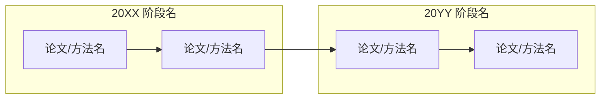

# 博客综述生成规范 (standard.md)

本文档定义 Tingde Liu 博客综述文章的生成规范，适用于 VLN、VLA、Robotics 等 AI/机器人领域研究综述。

---

## 一、文件命名与存放

- 路径：`_posts/YYYY-MM-DD-<topic>-Survey.md`
- 日期：使用实际撰写日期，格式 `YYYY-MM-DD`
- Slug：英文小写，中划线分隔，以 `-Survey` 结尾（e.g., `VLA-Survey`、`Robot-Navigation-Survey`）

---

## 二、Front Matter 模板

```yaml
---
layout: post
title: "<领域>综述"
date: YYYY-MM-DD
tags: [Tag1, Tag2, Tag3, ...]
comments: true
author: Tingde Liu
toc: true
excerpt: "一句话摘要，介绍该领域定义、覆盖内容与研究意义（50-100字）。"
---
```

**Tags 选取原则**：
- 优先使用已有 tag（如 `VLN`、`VLA`、`VLM`·`Robotics`、）
- 补充该领域特有的细分 tag（如 `SLAM`、`Navigation`、`Manipulation`、`Agent`等等）
- 一般 4-6 个 tag，不超过 8 个

---

## 三、文章整体结构

综述文章采用以下章节顺序，可按领域增减，但核心章节不可缺少：

```
# 一、引言                          ← 必须
# 二、<领域>基本概述                ← 必须
  ## 1. 什么是<领域>？
  ## 2. 核心要素 / 系统架构
  ## 3. 主要挑战
  ## 4. 研究发展趋势（含时间线图）
  ## 5. 关键技术方向
  ## 6. 未来研究方向
# 三、任务类型 / 分类体系            ← 必须（按领域调整标题）
# 四、应用场景                       ← 视领域添加
# 五、主流数据集与评测基准            ← 必须
# 六、经典方法与代表性工作            ← 必须
# 七、最新进展                        ← 必须（近1-2年论文）
# 八、总结                            ← 必须
```

---

## 四、章节写作规范

### 4.1 引言

- 3-4 段，依次介绍：领域定义 → 研究背景/动机 → 应用价值 → 本文目标
- 末段固定句式：`本文旨在系统梳理<领域>研究进展，为学习和研究<领域>提供参考。`

### 4.2 主要缩写表

仅在术语密集型综述中添加（如 VLA），格式：

```markdown
## 主要缩写

- **缩写**: 英文全称（中文翻译）
```

### 4.3 发展时间线（Mermaid 图）

使用 Mermaid `flowchart LR` 绘制，按年代分组：

```markdown

```

### 4.4 技术方向 / 方法介绍

每个方向采用统一的描述结构：

```
### N. 方向名称

一段概述文字（3-5句）。

**核心特点**：
- 要点1
- 要点2

*代表性工作*：论文A、论文B
```

### 4.5 任务类型分类

每种任务类型用 `---` 分隔，结构：

```
**N. 任务类型名（英文名）**

任务定义与特点（2-3句）。

*代表性数据集*：数据集A、数据集B

---
```

### 4.6 数据集介绍

每个数据集使用固定格式：

```markdown
### 数据集名称

| 属性 | 内容 |
|------|------|
| 发布年份 | 20XX |
| 规模 | X 条轨迹 / X 张图像 |
| 场景 | 室内/室外/仿真 |
| 特点 | 一句话描述核心特点 |

简短描述（1-3句），说明该数据集的设计目标和主要贡献。
```

---

## 五、图片插入规范

### 5.1 图片标签格式（统一使用）

```html
<div align="center">
  /图片名称.png" width="80%" />
  <figcaption>图：图片说明</figcaption>
</div>
```

示例：
```html
<div align="center">
  
  <figcaption>图：VLN 系统整体架构（来源：Anderson et al., 2018）</figcaption>
</div>
```

- 宽度默认 `80%`；全局架构图、时间线图可用 `100%`；局部细节图可用 `60%` 或 `65%`
- 图片路径：**本地图片必须存于 `/images/<topic>/` 子目录下**，不可直接放在 `images/` 根目录；引用外部图片直接用 URL
- figcaption 格式：`图：说明文字` 或 `图N：说明文字（来源：论文/项目名）`

### 5.2 图片存放与命名（本地图片）

**存放路径规则（与文章 topic 对应）：**

| 文章主题 | 图片目录 |
|----------|----------|
| VLN 综述 | `images/vln/` |
| VLA 综述 | `images/vla/` |
| VLM 综述 | `images/vlm/` |
| Robotics 导航 | `images/robotics_navigation/` |
| 其他主题 | `images/<topic>/`（英文小写，中划线或下划线分隔） |

**命名规则：**
- 小写英文+下划线，如 `vln_overview.png`、`vla_architecture.png`
- 论文配图命名包含方法名，如 `vlmap_pipeline.png`、`navgpt_framework.png`
- paper-summary 生成的图片按 skill 规范命名，存放在对应 topic 子目录

---

## 六、数学公式

- 行内公式：`$公式$`
- 块级公式：`$$公式$$`（独占一行，前后空行）

---

## 七、代码块与图表

- 代码块：指定语言（` ```python `、` ```bash `）
- Mermaid 图：` ```mermaid `（用于流程图、架构图、时间线）
- 表格：使用 Markdown 标准表格，列对齐使用 `|:---|`（左）或 `|:---:|`（居中）

---

## 八、中文写作风格

1. **术语**：首次出现的英文术语同时给出中文翻译，如 `视觉语言导航（Vision-Language Navigation, VLN）`；后续可只用缩写
2. **加粗**：重要概念、方法名、关键词用 `**加粗**`；避免整句加粗
3. **标题层级与序号**：
   - `#` 一级标题（主章节）：使用中文序号，格式 `# 一、引言`、`# 二、基本概述`……
   - `##` 二级标题：使用阿拉伯数字序号，格式 `## 1. 什么是…`、`## 2. 核心要素`……序号在每个一级章节内独立重置
   - `###` 三级标题（具体方法/技术）：无需序号，直接写方法名，不在标题中附加英文翻译
   - `####` 四级标题（仅在系统架构模块等特殊场景使用）
   - **标题中不附加英文翻译**：英文缩写/名称可保留，但括号内的中文或英文释义不写在 `#`/`##` 标题内（首次出现的中文翻译放在正文中说明）
4. **分隔线**：跨二级节内容较多时，同级条目之间用 `---` 分隔（如任务类型列表）
5. **语气**：客观、学术；描述现状用"当前"，描述方向用"未来"/"有望"

---

## 九、TOC（目录）

在 front matter 后、正文前插入：

```markdown
* 目录
{:toc}
```

（`toc: true` 已在 front matter 开启，此行触发自动生成）

---

## 十、文章长度参考

| 章节 | 建议字数（中文） |
|------|-----------------|
| 引言 | 300-500 字 |
| 基本概述 | 1000-2000 字 |
| 任务类型 | 500-1000 字 |
| 数据集 | 800-1500 字 |
| 经典方法 | 1500-3000 字 |
| 最新进展 | 1000-2000 字 |
| 总结 | 200-400 字 |
| **全文** | **5000-10000 字** |

---

## 十一、检查清单（生成后自检）

- [ ] Front matter 字段完整（layout / title / date / tags / comments / author / toc / excerpt）
- [ ] 引言末段有"本文旨在系统梳理..."句式
- [ ] 有发展时间线（Mermaid 图）
- [ ] 所有图片使用 `<div align="center">` 格式
- [ ] 首次出现的英文缩写提供中文翻译
- [ ] 主流数据集章节存在
- [ ] 文末有"总结"章节
- [ ] TOC 目录已插入（`* 目录\n{:toc}`）
- [ ] 文章标签不超过 8 个
- [ ] Mermaid 代码块语法正确（避免特殊字符导致渲染失败）
